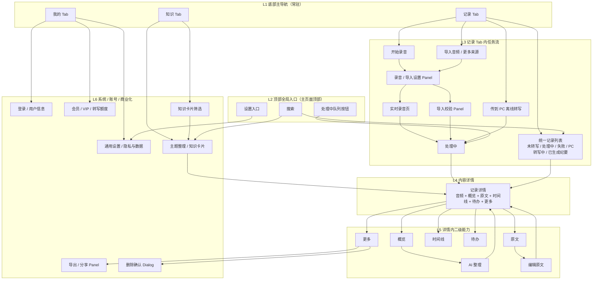

# 夸克录音纪要扩展型页面设计方案

版本：v0.9
整理日期：2026-06-25
定位：允许推翻原夸克录音纪要页面结构，以更强扩展性重新设计 AI 听记体验。
依据：`docs/QUARK_RECORDING_MINUTES_UI_DESIGN_BRIEF.md` v0.4、`/Users/studio/Documents/GitHub/flutter-ui-mobile/DESIGN.md`、`/Users/studio/Documents/GitHub/flutter-ui-mobile/DOC.md`

## 1. 结论

上一版页面方案偏保守，基本是在夸克原有“首页入口 + 笔记列表 + 详情页”的结构上补功能。这种方式适合快速复刻，但不适合承载热词库、录音中标记、批注、语篇规整、待办、批量管理、跨纪要搜索、分享权限、模板、AI 问答等持续增长能力。

建议把产品从“录音纪要工具”重构为更容易理解的多 Tab 听记产品。用户可见主导航不使用“工作台 / 行动中心”这类偏专业命名。默认主导航建议采用：

```text
记录 / 知识 / 我的
```

其中，“记录”负责原始录音、导入、处理中任务和已生成纪要的统一列表；“知识”负责主题整理、知识卡片、筛选和沉淀；“我的”负责登录、账号、会员、额度、云端录音存储、通用设置和帮助反馈。待办、风险、待确认先作为记录详情和知识整理的一部分，不默认单独占一级 Tab。这样既避免在一个页面平铺大量入口，也为后续 P1/P2 扩展预留稳定位置。

这版设计必须把差异化前置：默认本地优先，不上传；需要时可开启云端备份，也可传到 PC 离线转写。移动端可以把音频通过局域网传给 PC 端应用做离线转写，再把转写结果同步回手机，蓝牙只作为后续兜底。录音云端存储也是卖点，但它必须是用户主动开启的在线增强：普通用户默认 1GB 免费云空间，会员 50GB 云空间，超出部分收费或引导升级。在线 AI 分析、分享链接、云端存储、跨设备同步等能力需要和离线模式明确区分。

这里不要只用“在线 / 离线”二分，而要拆成三个维度：处理位置是本机离线 / PC 离线 / 云端在线；存储位置是仅本地 / 云端已备份 / 本地+云端 / 备份暂停；AI 能力是本地可用 / PC 可用 / 在线增强。这样用户开启云端备份时，不会误以为转写也被上传到云端处理。

```text
旧结构：入口页 -> 录音/导入 -> 详情页 -> 弹层堆叠
新结构：记录 Tab -> 处理中 -> 记录详情 -> 知识 Tab / 我的 Tab
```

新方案不再把所有能力塞进一个首页或一个详情页，而是拆成稳定的 7 个承载区：

1. 记录：承接开始录音、导入音频、传到 PC 离线转写、原始录音、处理中任务、转写失败和已生成纪要。
2. 知识：承接主题整理、知识卡片、筛选和个人知识沉淀；在线问答作为在线增强，不在离线主流程里承诺。
3. 我的：承接登录、用户信息、会员 / VIP、额度、云端录音存储、通用设置、隐私和帮助。
4. 录音 / 导入设置：承接热词、语言、隐私、录音中标记。
5. 处理中：承接上传、转写、失败重试、批量处理，通过右上角队列按钮全局进入。
6. 手机-PC 离线转写同步：承接局域网设备发现、二维码 / 验证码配对、PC 离线转写进度和结果回传；蓝牙作为后续兜底。
7. 待办能力：默认在记录详情和知识整理中出现；仅在高频会议用户或 P2 增强阶段升级为独立入口。

## 2. 为什么需要推翻原结构

| 原结构问题 | 影响 | 新方案 |
|---|---|---|
| 首页只有三个入口和列表 | 多来源导入、批量处理、待办提醒都会挤在同一屏 | 改成 `记录 / 知识 / 我的` 主 Tab，入口按任务分区 |
| 录音记录和纪要强行分成两个一级页 | 同一条音频的生命周期被拆开，用户要记住“录音在哪、纪要在哪” | 统一放在 `记录`，用状态区分未转写、处理中、失败、已生成纪要 |
| 详情页只有原文 / 总结两个 Tab | 章节、待办、语篇规整、时间线、溯源会不断堆按钮 | 详情页改成 `概览 / 原文 / 时间线 / 待办 / 更多` |
| 知识库能力只藏在 P2 | 跨纪要问答和知识整理是长期差异化，如果后期再加会重构主导航 | 从一开始预留 `知识` Tab，P0 可为空态 / 引导，P1/P2 再增强 |
| 账号、会员、额度没有承载位置 | 后续开通 VIP、转写额度、云端录音存储、隐私设置会散落在各页面 | 增加 `我的` Tab，承接商业化、空间权益和通用设置 |
| 录音页只承担计时 | 热词、标记、批注、语言、隐私设置没有稳定位置 | 录音前有“录音设置”，录音中有轻量工具栏 |
| 转写状态分散在列表和详情 | 批量重试、失败排查、长任务等待体验弱 | 右上角提供“处理中”队列按钮，集中查看所有任务 |
| 导出 / 分享 / 翻译都靠底部弹层 | 弹层越来越多，路径变深 | 在记录详情建立“更多”区，弹层只做最终确认 |
| 待办只附属于单条纪要 | 高频会议用户无法跨会议追踪执行 | 默认做纪要内待办和记录页提醒；高频用户再开启 `待办` Tab |
| 离线优势没有被看见 | 产品会像普通云端听记工具，隐私优势不明显 | 首页、录音页、详情页都显示“离线转写 / 本地保存 / 不上传”，并提供手机-PC 离线转写同步 |
| 在线能力和离线能力混在一起 | 用户不知道哪些功能会联网、哪些能力离线不可用 | 主流程隐藏在线专属能力，在详情更多 / 知识 / 我的中用置灰入口说明在线增强 |
| 云端存储卖点没有表达 | 用户只看到离线能力，无法理解备份、换机恢复和多端访问价值 | 在 `我的` 中展示 1GB 免费空间、会员 50GB、扩容和主动开启云备份 |

## 3. 新信息架构

```text
录音纪要 App
├── 顶部能力区
│   ├── 搜索
│   ├── 处理中队列按钮
│   ├── 设置
│   └── 隐私 / 本地优先状态
├── 记录 Tab
│   ├── 开始录音
│   ├── 导入音频
│   ├── 传到 PC 离线转写（局域网 P1，蓝牙 P2 兜底）
│   ├── 系统分享导入（P1）
│   ├── 更多来源（视频 / 网盘 / 播客 P2）
│   ├── 统一记录列表
│   │   ├── 未转写录音
│   │   ├── 处理中任务
│   │   ├── 转写失败
│   │   └── 已生成纪要
│   └── 最近继续处理
├── 知识 Tab
│   ├── 快速询问
│   ├── 主题整理
│   ├── 知识卡片
│   ├── 筛选：主题 / 时间 / 来源 / 状态 / 处理来源 / 存储位置
│   ├── 跨纪要引用（在线或本地索引能力）
│   └── 个人知识库（P2）
├── 我的 Tab
│   ├── 登录 / 用户信息
│   ├── 会员 / VIP
│   ├── 转写额度 / 用量
│   ├── 云端录音存储：免费 1GB / 会员 50GB / 超额扩容
│   ├── 转写次包：按次数扣减，不按分钟焦虑，保留单次上限
│   ├── 通用设置
│   ├── 隐私与数据
│   └── 帮助反馈
└── 待办能力（条件开启）
    ├── 记录详情内待办
    ├── 知识整理中的待办 / 风险
    └── 独立待办入口（P2 或高频用户）

录音 / 导入设置
├── 语言
├── 热词库（P1）
├── 区分人声
└── 本地 / 云端处理边界：默认本地，云端需主动确认

手机-PC 离线转写同步
├── 连接方式：局域网优先，蓝牙 P2 兜底
├── 设备发现与二维码 / 验证码配对
├── 音频传输进度
├── PC 离线转写进度
└── 转写结果回传手机

记录详情
├── 音频信息：标题、来源、时长、状态、播放器
├── 概览：AI 摘要、关键结论、待办、风险、待确认
├── 原文：发言人、时间码、低置信度、搜索命中
├── 时间线：章节、重点标记、批注、图片（P2）
├── 待办：本纪要待办、风险、待确认
└── 更多：导出、分享、翻译、删除、权限
```

## 4. 页面导航模型

### 4.1 移动端主导航

主导航使用底部 `GooBottomNavigation`，不要放在顶部。`记录 / 知识 / 我的` 属于一级入口，放在顶部会挤占标题、搜索、处理中队列和内容首屏空间。顶部只保留页面标题、搜索、处理中队列按钮和设置。

进入录音页、记录详情页、AI 整理页等沉浸任务页时，底部主 Tab 可以隐藏，避免和底部播放器、录音控制、保存按钮抢空间。返回主页面后恢复底部主 Tab。

主页面用 3 个 Tab：

1. 记录：默认首页，承接开始录音、导入、传到 PC 离线转写，以及未转写 / 转写失败 / 已生成纪要的统一记录列表；处理中、失败和 PC 转写进度直接在对应录音卡片里展示。
2. 知识：主题整理、知识卡片、筛选和长期沉淀；用筛选控制内容范围，不做“全部记录 / 当前记录 / 指定记录”的显式范围切换。
3. 我的：登录、用户信息、会员 / VIP、转写额度、云端录音存储、通用设置、隐私与帮助反馈。

录音记录和纪要不建议拆成两个一级 Tab。对用户来说，它们是同一条内容资产在不同处理阶段的状态：未转写时显示音频信息和“AI 转写”，处理中显示进度，完成后显示简略纪要。点击后都进入同一个记录详情页，在详情页里听录音、看原文和看纪要。

主 Tab 不建议超过 3 个。默认就是“记录 / 知识 / 我的”。新增视频、网盘、播客、硬件等来源时，放进“记录”的更多来源；知识卡片、主题整理和筛选放进“知识”；账号、会员、额度、云端录音存储、设置放进“我的”；待办不作为默认主 Tab。在线 AI 问答若要出现，应作为知识页里的在线增强能力，离线模式下置灰说明，不作为主流程承诺。

#### 在线 / 离线模式显隐原则

推荐采用“主流程隐藏，预期位置置灰说明”的混合策略：

- 首页、录音页、导入页是离线主流程，不展示一堆在线不可用按钮，避免把核心体验做成锁功能列表。
- 详情更多、知识 Tab、我的 Tab 是用户自然会寻找增强能力的位置，可以保留置灰入口，并用 `在线`、`需联网`、`上传前确认` 等标签解释。
- 点击置灰入口时，用 `GooInformationTip`、`GooTopTip` 或 `GooDialog` 说明：该能力需要联网、可能使用在线处理、上传由用户确认。
- 离线模式默认可用：录音、本地导入、本机离线转写、PC 离线转写、播放、编辑、删除、Markdown/TXT 导出。
- 在线增强默认不可用：在线 AI 摘要、语篇规整、待办提取、自然语言问答、分享链接、云端录音存储、跨设备账号同步。
- 云端录音存储虽然属于在线能力，但应在我的页作为明确卖点呈现：免费用户 1GB，会员 50GB，超额可扩容或升级；第一次上传前必须确认，不得改变默认不上传策略。
- 基础离线转写仍应可体验，不要把产品核心卖点完全放进付费墙；会员更适合承接更长文件、更高精度、说话人区分、批量处理、高级导出、云空间和在线 AI 分析。
- 转写权益分两条线：会员按周期提供更长转写时长和高级权益；转写次包按次数扣减、不按分钟焦虑，用于留住价格敏感用户，但规则上必须保留单次最长时长 / 最大文件体积上限。
- 如果未来 PC 端支持本地摘要或待办分析，应标为 `PC 离线增强`，不归入在线能力。

### 4.2 完整 App 页面清单 / Sitemap

完整 App 页面范围要和首轮设计稿画板分开理解。首轮画板用于看方向，完整 Sitemap 用于约束后续产品、设计和研发补齐所有页面、弹层和状态。

#### 主页面 / 一级入口

| 页面 / 入口 | 类型 | 阶段 | 说明 |
|---|---|---|---|
| 记录 Tab | 主页面 | P0 | 开始录音、导入、传到 PC 转写、统一记录列表、卡片状态 |
| 知识 Tab | 主页面 | P0 壳 / P1 增强 / P2 问答 | P0 空态或引导；P1 筛选、主题整理、知识卡片；P2 在线问答 |
| 我的 Tab | 主页面 | P0 壳 / P1 商业化 | 登录、会员、转写额度、云端录音存储、隐私与数据、通用设置 |
| 全局搜索 | 次级页面 | P1 | 搜索标题、关键词、正文和来源，结果回跳记录详情 |
| 右上角任务队列 | 次级页面 / Panel | P0 / P1 | 本机转写、PC 转写、失败、已完成任务；P1 支持批量重试 |

#### 采集 / 导入 / 转写任务页

| 页面 / 入口 | 类型 | 阶段 | 说明 |
|---|---|---|---|
| 录音 / 导入设置 | Panel | P0 / P1 | 语言、区分人声、本地优先；P1 增加热词库 |
| 实时录音页 | 全屏任务页 | P0 / P1 / P2 | P0 计时、暂停、停止保存；P1 标记、批注；P2 拍照时间线 |
| 保存 / 放弃录音确认 | Dialog | P0 | 录音中返回或关闭时确认保存、放弃 |
| 本地音频导入 | 系统选择 + 任务页 | P0 | 文件选择、格式校验、导入进度、失败提示 |
| 系统分享导入 | 系统入口 + 任务页 | P1 | 从外部 App 分享音频进入录音纪要 |
| 更多来源 | Panel / 次级页面 | P2 | 视频、网盘、播客、硬件等来源弱入口 |
| 本机离线转写 | 任务状态 | P0 | 卡片和任务队列内展示转写进度、失败、重试 |
| 手机-PC 离线转写同步 | 页面 / Panel | P1 / P2 | P1 局域网 + 二维码 / 验证码配对；P2 蓝牙兜底 |
| PC 结果冲突处理 | Dialog / Panel | P1 | 本机和 PC 同时产生结果时，允许切换版本或删除旧结果 |

#### 记录详情 / 编辑 / 播放

| 页面 / 入口 | 类型 | 阶段 | 说明 |
|---|---|---|---|
| 记录详情：概览 | 内容详情 Tab | P0 | 摘要、关键结论、轻量待办、来源时间码 |
| 记录详情：原文 | 内容详情 Tab | P0 | 发言人、时间码、低置信度、播放器联动 |
| 记录详情：更多 | 内容详情 Tab | P0 / P1 | 导出、分享、翻译、删除、在线增强、云端状态 |
| 记录详情：时间线 | 内容详情 Tab | P1 / P2 | 章节、重点标记、批注；P2 图片时间线 |
| 记录详情：待办 | 内容详情 Tab | P1 | 本纪要待办、风险、待确认事项 |
| 编辑纪要 | 编辑态页面 | P0 | 标题、原文段落、撤销、重做、保存 |
| 播放设置 | Panel | P1 | 倍速、前后跳转、发言人 / 人声相关设置 |
| 章节速览 | Panel | P1 | 按章节查看摘要并跳转播放 |

#### AI / 知识 / 待办

| 页面 / 入口 | 类型 | 阶段 | 说明 |
|---|---|---|---|
| AI 整理页 | 次级页面 / Panel | P1 | 语篇规整、待办提取、待确认问题、来源校验 |
| 在线增强不可用提示 | Dialog / Tip | P1 | 离线模式点击在线 AI 时解释联网、上传确认和权益 |
| 知识卡片筛选 | Panel | P1 | 主题、时间、来源、状态、处理来源、存储位置 |
| 知识卡片详情 | 次级页面 / Panel | P1 | 知识卡片内容、引用来源、收藏和回跳 |
| 知识来源回跳 | 跳转状态 | P1 | 从知识页进入记录详情并定位时间码 |
| 在线问答 | 页面 / 输入区 | P2 | 跨纪要问答、语义搜索、来源引用 |
| 可选独立待办 Tab | 主入口 / 次级页 | P2 / 高频用户 | 跨纪要待办聚合、风险清单、执行追踪 |

#### 云端 / 会员 / 账号

| 页面 / 入口 | 类型 | 阶段 | 说明 |
|---|---|---|---|
| 登录 / 账号信息 | 页面 / Panel | P0 壳 / P1 | 登录态、头像、昵称、会员状态 |
| 云端存储与会员权益 | 我的页 / Panel | P1 | 免费 1GB、会员 50GB、空间进度、扩容、权益说明 |
| 开启云端备份确认 | Dialog | P1 | 首次上传前说明音频会上传云端，支持只备份纪要文本 |
| 云空间已满 | 状态 / Dialog | P1 | 暂停云端备份，引导清理、扩容或升级，不影响本地功能 |
| 会员页 | 次级页面 | P1 | 会员权益、到期时间、开通和续费 |
| 转写次包购买 | 次级页面 / Panel | P1 | 按次数扣减、不按分钟焦虑，但提示单次上限 |
| 订单 / 兑换入口 | 次级页面 | P1 | 订单记录、兑换码、购买结果 |
| 多端设备管理 | 次级页面 | P2 | 已登录设备、同步状态、设备移除 |

#### 设置 / 隐私 / 权限 / 错误

| 页面 / 入口 | 类型 | 阶段 | 说明 |
|---|---|---|---|
| 通用设置 | 设置页 | P0 | 默认识别语言、默认导出格式、本地优先处理 |
| 热词库管理 | 设置页 / Panel | P1 | 账号级或设备级热词的增删改查 |
| 隐私与数据 | 设置页 | P0 / P1 | 本地优先、云端备份策略、删除数据、清理缓存 |
| 删除确认 | Dialog | P0 / P1 | 删除本机；P1 增加“同时删除云端”选项 |
| 麦克风权限 | Dialog / 空态 | P0 | 录音前请求，拒绝后保留恢复入口 |
| 文件权限 | Dialog / 空态 | P0 | 导入文件时请求 |
| 局域网权限 | Dialog / 空态 | P1 | PC 离线转写同步时请求 |
| 蓝牙权限 | Dialog / 空态 | P2 | 仅蓝牙兜底方案使用 |
| 网络 / 登录异常 | Dialog / 空态 | P1 | 云端备份、分享链接、会员权益、在线增强失败 |
| 格式不支持 / 重复文件 | 空态 / Dialog | P0 | 导入文件校验失败或重复导入 |
| 转写失败 / 低置信度 / 无来源 | 状态 | P0 / P1 | 卡片、详情和 AI 内容中展示失败原因、重试和待复核 |
| 帮助反馈 | 次级页面 | P0 | FAQ、问题反馈、日志上传入口 |

```text
┌──────────────────────────────┐
│ 录音纪要            🔍  ⟳  ⚙  │
│                              │
│                              │
│                              │
│                              │
│                              │
├──────────────────────────────┤
│ 记录          知识          我的│
└──────────────────────────────┘
```

### 4.3 核心跳转（分层）

核心跳转按页面层级组织，不把所有节点摊在同一层。设计稿和研发路由都按这个层级理解：

| 层级 | 页面 / 入口 | 说明 |
|---|---|---|
| L1 底部主导航 | 记录 / 知识 / 我的 | 常驻主入口，只承接一级任务域 |
| L2 顶部全局入口 | 搜索、处理中队列、设置 | 在主页面顶部出现，不占底部 Tab |
| L3 记录任务流 | 录音设置、实时录音、导入校验、手机-PC 离线转写、处理中 | 从记录 Tab 发起，用于完成一次采集、转写或跨端离线处理任务 |
| L4 内容详情 | 记录详情 | 同一条记录的统一详情容器，未转写、处理中、PC 转写中、已生成纪要都进入这里 |
| L5 详情二级能力 | 概览、原文、时间线、待办、更多、AI 整理、编辑 | 从记录详情内部进入，完成后回到记录详情 |
| L6 系统 / 账号 / 商业化 | 导出分享、删除确认、登录、会员、额度、设置 | 不作为内容主流程，按弹层、确认页或我的页承载 |



跳转规则补充：

| 来源 | 触发 | 去向 | 返回 |
|---|---|---|---|
| 记录 Tab | 点击开始录音 / 导入 | 录音 / 导入设置 Panel | 取消回记录 Tab |
| 记录 Tab | 点击传到 PC 离线转写 | 设备发现 / 配对 / 传输 Panel | 取消回记录 Tab，任务继续时进队列 |
| 录音 / 导入设置 Panel | 确认开始 | 实时录音页或导入校验 Panel | 完成后进入处理中 |
| 处理中 | 任务完成或点击已完成任务 | 记录详情 | 返回记录 Tab 或处理中 |
| 统一记录列表 | 点击任意记录卡片 | 记录详情 | 返回记录 Tab |
| 知识 Tab | 使用筛选 | 按主题、时间、来源、状态、处理来源、存储位置过滤知识卡片 | 保留在知识 Tab |
| 知识 Tab | 点击问答来源或知识卡片来源 | 对应记录详情并定位时间码 | 返回知识 Tab |
| 记录详情 | 点击 AI 整理、编辑、更多 | 详情内二级能力或弹层 | 完成 / 取消后回记录详情 |
| 记录详情 | 点击唯一搜索入口 | 在当前记录内搜索原文和时间码 | 保留在记录详情 |
| 我的 Tab | 点击登录、会员、额度、设置 | 账号 / 权益 / 设置页面 | 返回我的 Tab |
| 顶部处理中队列按钮 | 点击队列按钮 | 处理中 | 返回当前主 Tab |

### 4.4 三个主 Tab 第一屏草图

以下草图用于表达三个主 Tab 的第一屏信息结构，不代表最终视觉稿。共同顶部规则：标题为“录音纪要”，右上角保留搜索、处理中队列、设置；主 Tab 固定在底部。处理中队列按钮有任务时显示角标，有失败任务时显示错误点。

#### 记录 Tab

记录页承接输入、处理状态和已生成纪要，不再把录音记录与纪要拆成两个一级入口。

```text
┌──────────────────────────────┐
│ 录音纪要            🔍  ⟳2 ⚙ │
├──────────────────────────────┤
│ ┌──────────────────────────┐ │
│ │        开始录音           │ │
│ │ 离线转写 · 本地保存 · 不上传│ │
│ └──────────────────────────┘ │
│ [导入音频] [传到PC转写] [更多]│
│                              │
│ [全部] [未转写] [处理中] [已生成]│
│                              │
│ ┌──────────────────────────┐ │
│ │ 客户访谈纪要              │ │
│ │ 48:06 · 已生成纪要 · 离线  │ │
│ │ 客户关注交付时间和报价...  │ │
│ └──────────────────────────┘ │
│ ┌──────────────────────────┐ │
│ │ 课堂录音                  │ │
│ │ PC 离线转写中 42%          │ │
│ │ ━━━━━━━━━░░░               │ │
│ └──────────────────────────┘ │
│ ┌──────────────────────────┐ │
│ │ 灵感录音                  │ │
│ │ 03:12 · 未转写      AI转写 │ │
│ └──────────────────────────┘ │
├──────────────────────────────┤
│  ●记录          知识        我的 │
└──────────────────────────────┘
```

#### 知识 Tab

知识页承接主题整理和知识卡片。P0 可以显示空态 / 引导；P1 显示筛选、主题整理和知识卡片；P2 才打开在线自然语言问答。不要在知识页设计“全部记录 / 当前记录 / 指定记录”的范围切换。

```text
┌──────────────────────────────┐
│ 录音纪要            🔍  ⟳  ⚙ │
├──────────────────────────────┤
│ ┌──────────────────────────┐ │
│ │ 知识卡片筛选              │ │
│ │ [主题] [时间] [来源] [状态]│ │
│ │ [处理来源] [存储位置]       │ │
│ └──────────────────────────┘ │
│                              │
│ 主题整理                      │
│ [客户需求] [报价] [风险] [待确认]│
│                              │
│ 知识卡片                筛选> │
│ ┌──────────────────────────┐ │
│ │ Q3 客户报价共识            │ │
│ │ 来自 3 条纪要 · 8 个来源    │ │
│ │ 查看来源 >                 │ │
│ └──────────────────────────┘ │
│ ┌──────────────────────────┐ │
│ │ 接口联调风险               │ │
│ │ 来自 2 条纪要 · 4 个来源    │ │
│ └──────────────────────────┘ │
│ 在线问答 P2             未开启 │
├──────────────────────────────┤
│   记录         ●知识        我的 │
└──────────────────────────────┘
```

#### 我的 Tab

我的页承接账号、会员、额度、云端录音存储、设置和帮助。它不是 P0 的重功能页，但必须有稳定位置，否则后续会员服务、云端能力和隐私设置都会无处安放。

```text
┌──────────────────────────────┐
│ 我的                       ⚙ │
├──────────────────────────────┤
│ ┌──────────────────────────┐ │
│ │ 头像  用户昵称 / 点击登录  │ │
│ │ 普通用户 · 本月剩余 120 分钟│ │
│ └──────────────────────────┘ │
│                              │
│ 会员服务                      │
│ ┌──────────────────────────┐ │
│ │ VIP 50GB · 更长转写时长    │ │
│ │ 高级导出 · 批量处理 · 在线增强│
│ └──────────────────────────┘ │
│                              │
│ 用量与权益                    │
│ 云端空间 320MB / 免费 1GB      │
│ 转写额度 120/300 分钟          │
│ 转写次包 10次 / 30次 / 100次   │
│ 导出权益 Word/PDF 限免中       │
│                              │
│ 通用设置                      │
│ 默认语言 / 热词库 / 导出格式   │
│ 隐私与数据 / 帮助反馈          │
├──────────────────────────────┤
│   记录          知识       ●我的 │
└──────────────────────────────┘
```

### 4.5 关键任务页草图

录音页和记录详情页是沉浸任务页，建议隐藏底部主 Tab。录音页底部留给录音控制；记录详情页底部留给音频播放器。

#### 录音页

```text
┌──────────────────────────────┐
│ ×  录音中              热词 ⋯ │
├──────────────────────────────┤
│                              │
│          00:24:18            │
│     离线保存中 · 普通话 · 不上传│
│                              │
│     ▂▃▅▆▃▂▅▇▆▃▂▁             │
│                              │
│ [重点标记] [添加批注] [标记 4]│
│  标记列表通过 Panel 打开       │
│                              │
│      [暂停]        [停止保存]  │
└──────────────────────────────┘
```

录音页状态补充：

- P0：隐藏热词、重点标记、批注、拍照，只保留计时、暂停、停止保存。
- P1：显示热词、重点标记、批注和紧凑标记列表入口；标记列表只通过 Panel 打开，不在录音页常驻大卡片。
- P2：显示拍照时间线。
- 用户点击关闭且录音时长大于 0 时，必须二次确认保存或放弃。

#### 记录详情页

```text
┌──────────────────────────────┐
│ <  客户访谈纪要        ✎  ⇧ ⋯│
│ 48:06 · 已转写 · 本地优先      │
│ #报价  #上线计划  #风险        │
├──────────────────────────────┤
│ [概览] [原文] [时间线] [待办] [更多]│
│                              │
│ AI 生成，可编辑，建议复核       │
│ ┌──────────────────────────┐ │
│ │ 摘要                      │ │
│ │ 本次访谈围绕上线范围、报价 │ │
│ │ 明细和接口联调展开。       │ │
│ │ 来源 00:03:40, 00:12:08   │ │
│ └──────────────────────────┘ │
│ ┌──────────────────────────┐ │
│ │ 关键结论                  │ │
│ │ 1. 本周确认报价明细        │ │
│ │ 2. 下周启动内部审批        │ │
│ └──────────────────────────┘ │
│ ┌──────────────────────────┐ │
│ │ 待办 2                    │ │
│ │ 补充报价明细 · 本周五      │ │
│ └──────────────────────────┘ │
├──────────────────────────────┤
│ 12:48 ━━━━━●━━━━ 48:06        │
│ -5s        ▶/Ⅱ        +5s 1.0x│
└──────────────────────────────┘
```

记录详情页状态补充：

- 待转写：显示音频信息、播放器和“开始 AI 转写”，隐藏概览内容。
- 转写中：概览 / 原文使用骨架屏，播放器仍可用。
- 转写失败：显示失败原因、复听、重试、删除。
- 已转写：默认进入概览；原文、时间线、待办、更多按能力显隐。
- P0：建议只显示概览、原文、更多。
- P1：增加时间线、待办、语篇规整、翻译、分享。
- P2：增加 AI 问答入口、跨纪要引用、图片时间线。

## 5. 页面 1：记录 Tab

### 5.1 页面定位

记录 Tab 是用户最容易理解的起点，不叫“工作台”。它处理“采集、离线转写状态、已生成纪要”的完整生命周期，但不承担跨条知识整理、账号会员和复杂设置。它回答 4 个问题：

1. 现在要录音还是导入？
2. 哪些记录还没处理完，当前是在本机离线转写还是 PC 离线转写？
3. 哪些记录已经生成了可读纪要？
4. 哪些记录需要继续转写、重试或复看？

### 5.2 推荐 Goo 组件

- 顶部栏：`GooAppBar.primary`
- 底部主导航：`GooBottomNavigation`
- 搜索：`GooSearchBar`
- 快捷动作：`GooButton`, `GooButton.icon`, `GooActionIcon`
- 状态标签：`GooTag`, `GooChip`, `GooBadge`
- 列表 / 任务：`GooList`, `GooListItem`, `GooCard`
- 加载：`GooSkeleton`, `GooInlineLoader`
- 菜单：`GooMenuAnchor`

### 5.3 布局草图

```text
┌──────────────────────────────┐
│ 录音纪要            🔍  ⟳  ⚙  │
├──────────────────────────────┤
│ ┌──────────────────────────┐ │
│ │      开始录音             │ │
│ │ 离线转写 · 本地保存 · 不上传│ │
│ └──────────────────────────┘ │
│ [导入音频] [传到PC转写] [更多]│
│                              │
│ [全部] [未转写] [处理中] [已生成]│
│                              │
│ ┌──────────────────────────┐ │
│ │ 客户访谈纪要              │ │
│ │ 48:06 · 已生成纪要 · 离线  │ │
│ │ 客户关注交付时间和报价...  │ │
│ └──────────────────────────┘ │
│ ┌──────────────────────────┐ │
│ │ 课堂录音                  │ │
│ │ PC 离线转写中 42%          │ │
│ │ ━━━━━━━━━░░░               │ │
│ └──────────────────────────┘ │
│ ┌──────────────────────────┐ │
│ │ 灵感录音                  │ │
│ │ 03:12 · 未转写      AI转写 │ │
│ └──────────────────────────┘ │
├──────────────────────────────┤
│  ●记录          知识        我的 │
└──────────────────────────────┘
```

### 5.4 显隐逻辑

| 条件 | 表现 |
|---|---|
| 没有任何记录 | 记录页只显示录音 / 导入主入口和空态说明 |
| 有处理中任务 | 不显示首页队列摘要；对应录音卡片显示进度，右上角队列按钮显示角标 |
| 有失败任务 | 对应录音卡片显示失败原因和重试入口，右上角队列按钮显示错误状态 |
| 没有处理中任务 | 右上角队列按钮无角标或收进更多菜单 |
| 原始记录已生成纪要 | 记录卡片显示“已生成纪要”，点击可进入记录详情 |
| 原始记录未转写 | 记录卡片显示“AI转写” |
| PC 离线转写中 | 记录卡片显示“PC 离线转写中”、传输 / 转写进度和预计耗时 |

### 5.5 设计重点

- “开始录音”是唯一最大主按钮。
- “导入音频”和“传到 PC 转写”作为次级入口，不与录音争抢视觉焦点。
- 处理中任务必须有全局入口；记录页不展开队列摘要，只在对应录音卡片内展示状态。
- 首页不需要“最近记录”标题，筛选后直接进入录音卡片列表。
- 首页不显示“批量”按钮，长按卡片进入批量选择态。
- 不要把视频、网盘、播客、硬件等 P2 来源全部平铺，放进“更多来源”即可。
- 未转写录音、处理中任务、失败任务、已生成纪要在同一列表里按状态展示，避免用户在“录音”和“纪要”之间来回找同一条内容。
- 已生成纪要的卡片需要展示标题、时长、标签和 1-2 行摘要；未转写录音展示音频信息和“AI 转写”操作。
- 每张卡片都应能表达处理来源：本机离线、PC 离线、在线增强。离线是默认优势，不要只藏在设置页。

## 6. 页面 2：录音 / 导入设置 Panel

### 6.1 页面定位

在进入录音或导入前，先让用户配置会影响结果质量的参数。这样热词、语言、隐私边界不用塞进录音页更多菜单。

### 6.2 推荐 Goo 组件

- 底部弹层：`showGooPanel`
- 表单：`GooForm`
- 选择器：`GooPicker`, `GooSegmentedButton`, `GooSwitch`
- 热词：`GooChip`, `GooInput`
- 主操作：`GooButton`

### 6.3 布局草图

```text
┌──────────────────────────────┐
│          开始录音             │
├──────────────────────────────┤
│ 识别语言                      │
│ [普通话]                      │
│                              │
│ 区分人声                  开关 │
│                              │
│ AI 热词库                 P1  │
│ [夸克网盘] [Q3复盘] [+ 添加]  │
│                              │
│ 处理方式                      │
│ [本地优先] [在线增强]          │
│ 云端存储在“我的”中主动开启      │
│                              │
│            [开始录音]          │
└──────────────────────────────┘
```

### 6.4 显隐逻辑

| 条件 | 表现 |
|---|---|
| P0 | 只显示语言、区分人声、本地优先说明 |
| P1 | 显示热词库 |
| 用户关闭区分人声 | 提示“关闭后将不生成发言人标签” |
| 选择在线增强 | 展示数据离开设备的说明；云端录音存储不在这里开启，避免混淆转写处理和备份能力 |
| 麦克风未授权 | 点击开始录音后弹权限 Dialog |

## 7. 页面 3：实时录音页

### 7.1 页面定位

录音页应是专注任务页，不承担历史列表、导出、AI 整理等会后能力。录音中只保留和“采集信号”有关的操作。

### 7.2 推荐 Goo 组件

- 顶部栏：`GooAppBar.secondary`
- 图标操作：`GooActionIcon`
- 主按钮：`GooButton`
- 工具栏：`GooToolBar`
- 提示：`GooTopTip`, `GooToast`
- 确认：`GooDialog`

### 7.3 布局草图

```text
┌──────────────────────────────┐
│ ×  录音中              热词 ⋯ │
├──────────────────────────────┤
│                              │
│          00:24:18            │
│     离线保存中 · 普通话 · 不上传│
│                              │
│     ▂▃▅▆▃▂▅▇▆▃▂▁             │
│                              │
│ [重点标记] [添加批注] [标记 4]│
│  标记列表通过 Panel 打开       │
│                              │
│      [暂停]        [停止保存]  │
└──────────────────────────────┘
```

### 7.4 显隐逻辑

| 条件 | 表现 |
|---|---|
| 正在录音 | 显示暂停、停止保存、重点标记、批注 |
| 暂停中 | 重点标记置灰，批注可用，按钮变为继续 |
| P0 | 隐藏重点标记、批注、热词入口 |
| P1 | 显示重点标记、批注、热词入口和紧凑标记列表按钮 |
| P2 | 显示拍照入口 |
| 点击关闭 | 若录音时长 > 0，弹出保存/放弃确认 |
| 有标记 / 批注 | 不展示大面积最近标记卡片；点击“标记 N”打开底部 Panel |

## 8. 页面 4：手机-PC 离线转写同步

### 8.1 页面定位

手机负责录音和管理，PC 端负责更重的离线转写计算。该流程必须表达“不经过云端、仅在手机与受信任 PC 间传输”，是产品隐私优势的一部分，不是普通云同步。

### 8.2 推荐 Goo 组件

- 面板：`GooPanel`
- 列表：`GooList`, `GooListItem`
- 进度：`GooProgress`, `GooInlineLoader`
- 状态：`GooTag`, `GooBadge`
- 操作：`GooButton`, `GooButton.text`
- 权限 / 确认：`GooDialog`, `GooTopTip`

### 8.3 布局草图

```text
┌──────────────────────────────┐
│        传到 PC 离线转写        │
├──────────────────────────────┤
│  音频不经过云端，仅在本机和PC间传输│
│                              │
│  连接方式                      │
│  [局域网] [蓝牙 P2]            │
│                              │
│  可用设备                      │
│  MacBook Pro · 已配对       >  │
│  Windows PC · 待确认        >  │
│                              │
│  传输中 42%                   │
│  ━━━━━━━━━━━░░░               │
│                              │
│            [开始传输]          │
└──────────────────────────────┘
```

### 8.4 关键交互

- P1 优先做局域网发现 / 同网连接 / 二维码或一次性验证码配对；蓝牙作为 P2 兜底能力，不要在第一版押重。
- 首次使用时，PC 端显示二维码或一次性配对码，手机端确认后建立受信任设备。
- 传输前提示“音频不经过云端”；即使用户已开启云端备份，也要明确本次 PC 转写只在手机和受信任 PC 间传输。
- 传输和 PC 离线转写进度同时进入右上角任务队列，并回写到对应录音卡片。
- PC 转写完成后，手机记录卡片变为“已转写”，详情页显示“PC 离线转写”来源标签。
- 连接中断、PC 休眠、手机锁屏或网络切换时，不丢失手机原始录音；卡片显示“继续传输 / 改用本机转写”；需要支持断点续传或至少保留已上传进度。
- 如果同一条录音同时在本机和 PC 产生结果，默认保留最新完成结果，并在详情更多中提供“切换版本 / 删除旧结果”。

### 8.5 显隐逻辑

| 条件 | 表现 |
|---|---|
| 未配对 PC | 显示配对引导、连接方式和安全说明 |
| 已配对 PC 在线 | 显示设备名、最近连接时间和开始传输 |
| 局域网不可用 | 局域网置灰，说明需同一网络；蓝牙只作为 P2 兜底弱入口 |
| 蓝牙不可用 | P2 兜底入口置灰，提供系统设置入口，不影响局域网方案 |
| PC 不在线 / 休眠 | 卡片显示“等待 PC 在线”，提供取消和改用本机转写 |
| 传输中 | Panel 可关闭，任务继续在队列和卡片中显示进度 |
| PC 离线转写中 | 卡片显示“PC 离线转写中”和预计耗时 |
| 转写完成 | 结果同步回手机并进入记录详情 |

## 9. 页面 5：处理中

### 9.1 页面定位

“处理中”解决“我刚录完/导入后，到底处理到哪了”的问题。它不作为默认主 Tab，而是通过右上角队列按钮进入。内部仍可以按任务队列实现，但用户看到的是“处理中”。

### 9.2 推荐 Goo 组件

- 页面：`GooAppBar.secondary`
- 列表：`GooList`, `GooListItem`, `GooCard`
- 进度：`GooProgress`, `GooInlineLoader`
- 批量：`GooSelectionController`, `GooSelectionScaffold`, `GooToolBarDock`
- 反馈：`GooSnackbar`, `GooDialog`

### 9.3 布局草图

```text
┌──────────────────────────────┐
│ <  处理中               批量  │
├──────────────────────────────┤
│ [全部] [转写中] [失败] [完成]  │
│                              │
│ ┌──────────────────────────┐ │
│ │ 课堂录音                  │ │
│ │ PC 离线转写中 42%          │ │
│ │ ━━━━━━━━━░░░░             │ │
│ └──────────────────────────┘ │
│ ┌──────────────────────────┐ │
│ │ 需求评审                  │ │
│ │ 转写失败 · 噪音过大        │ │
│ │ [复听] [重试]              │ │
│ └──────────────────────────┘ │
└──────────────────────────────┘
```

### 9.4 显隐逻辑

| 状态 | 显示 |
|---|---|
| 上传中 | 文件名、上传进度、取消 |
| 发起转写中 | loading + 可离开提示 |
| 转写中 | 转写进度或预计耗时 |
| PC 转写中 | 设备名、离线转写进度、预计耗时 |
| 失败 | 失败原因、复听、重试、删除 |
| 已完成 | 完成标签、进入记录详情 |

### 9.5 右上角队列按钮

右上角队列按钮建议在所有主 Tab 可见，使用 `GooActionIcon` 表达：

| 条件 | 表现 |
|---|---|
| 无处理任务 | 显示普通队列图标，或收进更多菜单 |
| 有处理中任务 | 图标显示角标数量 |
| 有失败任务 | 图标显示错误点，点击后默认筛选失败任务 |
| 所有任务完成 | 点击进入最近完成列表，支持进入记录详情 |

这样用户可以在浏览纪要或知识库时继续感知后台处理状态，不需要回到记录页找任务。

## 10. 页面 6：记录详情

### 10.1 页面定位

记录详情是新方案的核心。它承载同一条内容从“录音文件”到“结构化纪要”的生命周期：未转写时展示音频、来源、时长和 AI 转写入口；转写中展示进度和可复听播放器；完成后默认给用户“结果概览”，再允许向下钻到证据、原文、待办和更多操作。

这也是录音记录和纪要不拆分一级入口的前提：列表只负责展示状态，详情页负责承载全部内容和操作。

### 10.2 详情结构

建议使用 5 个页内 Tab，但文案要口语化：

1. 概览：默认进入，显示 AI 摘要、关键结论、待办、风险、待确认。
2. 原文：完整转写、发言人、时间码、低置信度。
3. 时间线：章节、重点标记、批注、P2 图片。
4. 待办：本纪要待办、风险、待确认。
5. 更多：导出、分享、翻译、元数据、删除。

### 10.3 推荐 Goo 组件

- 顶部栏：`GooAppBar.secondary`
- Tab：`GooTabs`
- 搜索：`GooSearchBar` 或顶部 `GooActionIcon` 打开的当前记录搜索页 / Panel
- 内容卡片：`GooCard`
- 原文列表：`GooList`, `GooListItem`, `GooAvatar`
- 标签：`GooTag`, `GooChip`
- 底部播放器：`GooToolBarDock`, `GooProgress`, `GooActionIcon`
- AI 提示：`GooTopTip`, `GooInformationTip`
- 加载：`GooSkeleton`, `GooInlineLoader`

### 10.4 布局草图：概览 Tab

```text
┌──────────────────────────────┐
│ <  客户访谈纪要      🔍  ✎  ⋯ │
│ 48:06 · PC离线转写 · 不上传    │
│ [概览] [原文] [时间线] [待办] [更多]│
├──────────────────────────────┤
│ AI 生成，可编辑，建议复核       │
│ ┌──────────────────────────┐ │
│ │ 摘要                      │ │
│ │ 本次访谈围绕上线范围...    │ │
│ │ 来源 00:03:40, 00:12:08   │ │
│ └──────────────────────────┘ │
│ ┌──────────────────────────┐ │
│ │ 关键结论                  │ │
│ │ 1. 本周确认报价明细        │ │
│ │ 2. 下周启动内部审批        │ │
│ └──────────────────────────┘ │
│ ┌──────────────────────────┐ │
│ │ 待办 2                    │ │
│ │ 补充报价明细 · 本周五      │ │
│ └──────────────────────────┘ │
│ ───────────────────────────  │
│ 12:48 ━━━━━●━━━━ 48:06        │
│ -5s     ▶/Ⅱ     +5s      1.0x │
└──────────────────────────────┘
```

### 10.5 布局草图：原文 Tab

```text
┌──────────────────────────────┐
│ [概览] [原文] [时间线] [待办] [更多]│
├──────────────────────────────┤
│ #报价 #上线计划 #风险          │
│                              │
│ 小K 00:01:12                  │
│ 我们先确认本周上线范围...       │
│                              │
│ 客户代表 00:12:08              │
│ 如果能在周五前给到报价...      │
│                              │
│ 低置信度 00:22:16              │
│ 这里可能提到了接口联调...       │
└──────────────────────────────┘
```

### 10.6 布局草图：时间线 Tab

```text
┌──────────────────────────────┐
│ [概览] [原文] [时间线] [待办] [更多]│
├──────────────────────────────┤
│ 00:00  章节  开场和背景         │
│ 03:40  标记  报价明细需要补充   │
│ 08:12  章节  上线范围确认       │
│ 12:08  批注  下周客户内部审批   │
│ 24:30  章节  风险和待办         │
│ 31:20  图片P2 白板方案          │
└──────────────────────────────┘
```

### 10.7 布局草图：待办 Tab

```text
┌──────────────────────────────┐
│ [概览] [原文] [时间线] [待办] [更多]│
├──────────────────────────────┤
│ 待办                          │
│ ☐ 补充报价明细                 │
│   负责人待确认 · 本周五         │
│   来源 00:12:08                │
│                              │
│ 待确认                        │
│ ? 接口联调排期未明确            │
│   来源 00:22:16                │
│                              │
│ 风险                          │
│ ! 周五前无法出报价会影响审批     │
└──────────────────────────────┘
```

### 10.8 布局草图：更多 Tab

```text
┌──────────────────────────────┐
│ [概览] [原文] [时间线] [待办] [更多]│
├──────────────────────────────┤
│ 导出                          │
│ Markdown / TXT / WordP1 / PDFP1│
│                              │
│ 分享                          │
│ 加密链接 / 公开链接 / 撤销分享  │
│                              │
│ 翻译                          │
│ 原文语言：中文  目标：英语 P1   │
│                              │
│ 文件信息                      │
│ PC离线转写 · 48:06 · 52MB      │
│                              │
│ 删除纪要                      │
└──────────────────────────────┘
```

### 10.9 显隐逻辑

| 状态 | 详情表现 |
|---|---|
| 待转写 | 只显示音频资料、播放器和“开始 AI 转写”主按钮 |
| 转写中 | 概览/原文显示 skeleton，更多 Tab 可见，播放器可用 |
| PC 离线转写中 | 显示 PC 设备、离线转写进度和可复听播放器 |
| 转写失败 | 概览显示失败卡片，原文隐藏，保留复听和重试 |
| 已转写但无摘要 | 概览显示“生成摘要”按钮，原文可用 |
| 摘要无来源 | 摘要条目标为“待复核”，不可作为正式纪要默认导出 |
| 离线模式且 AI 分析不可用 | 在线 AI 摘要、语篇规整、待办提取在主内容隐藏；更多 Tab 显示置灰“在线增强”并解释需要联网和用户确认 |
| P0 | 只显示概览、原文、更多 3 个 Tab |
| P1 | 增加时间线、待办，启用语篇规整、热词、章节 |
| P2 | 增加图片时间线、AI 问答、跨纪要语义引用 |

### 10.10 搜索规则

记录详情内只保留一个搜索入口，默认只作用于当前记录，避免用户在单条纪要内同时看到顶部搜索和原文 Tab 搜索。不要在详情页设计“当前记录 / 全部记录”的范围切换；跨记录检索交给知识 Tab 的筛选和知识卡片承担。

| 入口 | 范围 | 结果要求 |
|---|---|---|
| 顶部搜索图标 | 当前记录 | 命中词高亮，点击跳到对应段落和音频时间 |
| 原文 Tab | 不放常驻搜索框 | 避免和顶部搜索形成双入口 |
| 知识卡片来源回跳 | 来源记录 | 从知识 Tab 进入详情并定位到时间码 |

## 11. 页面 7：AI 整理页

### 11.1 页面定位

AI 整理不建议作为详情页里的一个小按钮弹层，因为语篇规整、待办、待确认、来源校验需要较多空间。建议作为记录详情中的独立子页面或半屏页面。默认将其视为在线增强能力；离线模式没有本地分析模型时不在主流程展示，只在更多 Tab 中置灰说明。

### 11.2 推荐 Goo 组件

- 页面：`GooAppBar.secondary`
- Tab：`GooTabs`
- 内容：`GooCard`, `GooCollapsible`
- 操作：`GooButton`, `GooButton.text`
- 状态：`GooTag`, `GooInlineLoader`

### 11.3 布局草图

```text
┌──────────────────────────────┐
│ <  AI 整理           重新生成 │
├──────────────────────────────┤
│ [语篇规整] [待办] [待确认]     │
│                              │
│ AI 生成，可编辑，建议复核       │
│ ┌──────────────────────────┐ │
│ │ 规整稿                    │ │
│ │ 本次访谈确认了三项内容...  │ │
│ │ 来源：00:03:40, 00:12:08  │ │
│ └──────────────────────────┘ │
│                              │
│ 差异提示                      │
│ 原文：客户说下周可以审批        │
│ 规整：客户计划下周启动审批      │
│                              │
│ [接受并保存] [局部接受] [放弃] │
└──────────────────────────────┘
```

### 11.4 显隐逻辑

| 条件 | 表现 |
|---|---|
| 离线模式且无本地分析模型 | 不在首页和录音页展示入口；详情更多中置灰并说明需要在线增强 |
| 未生成 | 显示生成按钮 |
| 生成中 | 显示 `GooInlineLoader` |
| 生成成功 | 显示规整稿、来源时间码、接受/放弃 |
| 发现无来源内容 | 标为待复核，不允许默认保存 |
| 用户接受 | 写入派生稿，不覆盖原文 |

## 12. 页面 8：待办模块 / 可选待办 Tab

### 12.1 页面定位

待办能力不是所有用户都需要的一级入口。对大部分用户，它应该先出现在单条记录详情里，作为“AI 整理结果”的一部分；只有当用户频繁从会议里生成、查看、勾选待办时，才升级为独立“待办”Tab。

用户可见名称用“待办”，不要用“行动中心”。“风险”和“待确认”也不建议一开始作为强入口，而是作为待办里的辅助分组或标签。

### 12.2 待办到底是什么

| 类型 | 含义 | 示例 | 是否适合默认外露 |
|---|---|---|---|
| 待办 | 会议里明确出现的动作，需要后续完成 | “本周五前补充报价明细” | 适合，在记录详情里展示 |
| 待确认 | AI 判断有事项但缺关键信息，如负责人、截止时间、对象不完整 | “接口联调排期未明确” | 适合弱展示，提示用户补全 |
| 风险 | 不是动作，而是可能影响结果的问题或阻碍 | “周五前无法出报价会影响审批” | 不适合强提醒，适合在概览/待确认里标注 |
| 决策 | 会议中已经达成的结论 | “本周只上线一期范围” | 更适合放在概览，不建议放进待办 |

待办模块的边界：

- 不做项目管理系统。
- 不要求用户维护复杂负责人、看板、优先级、状态流。
- 不默认跨团队协作。
- 只做“从纪要里提取出来的轻量跟进项”，并且必须能回跳来源时间码。
- 如果用户从不使用待办，界面应自然弱化甚至隐藏该能力。

### 12.3 推荐 Goo 组件

- Tab：`GooTabs`
- 筛选：`GooChip`, `GooSegmentedButton`
- 列表：`GooList`, `GooListItem`
- 状态：`GooCheckbox`, `GooTag`
- 来源跳转：`GooButton.text`

### 12.4 布局草图

```text
┌──────────────────────────────┐
│ 待办                    筛选  │
│ [全部] [待办] [待确认]         │
├──────────────────────────────┤
│ ☐ 补充报价明细                │
│   客户访谈纪要 · 本周五        │
│   来源 00:12:08               │
│                              │
│ ? 接口联调排期未明确           │
│   需求评审 · 待确认            │
│   来源 00:22:16               │
│                              │
│ 风险提示                       │
│ 周五前无法报价可能影响审批       │
└──────────────────────────────┘
```

### 12.5 显隐逻辑

| 条件 | 表现 |
|---|---|
| 普通用户或 P0 | 不显示独立待办 Tab，只在记录详情概览里展示待办摘要 |
| 单条纪要有待办 | 在记录详情概览和待办 Tab 内展示 |
| 多条纪要持续产生待办 | 可显示独立待办 Tab |
| 无待办项 | 不显示待办提醒；独立待办 Tab 如已开启则显示空态 |
| 待办缺负责人或时间 | 标为“待确认” |
| 点击来源 | 进入记录详情并定位到原文时间码 |
| 勾选完成 | 状态更新，可撤销 |

## 13. 页面 9：我的 Tab

### 13.1 页面定位

我的 Tab 承接账号、会员、额度、云端录音存储、通用设置、隐私和帮助反馈。这个产品不是纯离线录音机，后续会涉及云端增强、云端备份、会员权益、转写时长、导出权益和用户登录，因此必须有稳定的个人中心入口。

我的 Tab 不应该干扰录音和看纪要的主流程。P0 可以先做基础壳和必要设置；P1 打开会员、额度、云端录音存储和增值服务；P2 承接团队空间、硬件绑定或企业权益等更复杂能力。

### 13.2 推荐 Goo 组件

- 顶部栏：`GooAppBar.primary`
- 底部主导航：`GooBottomNavigation`
- 用户信息：`GooAvatar`, `GooCard`, `GooTag`
- 权益 / 用量：`GooCard`, `GooProgress`, `GooBadge`
- 套餐选择：`GooTabs`, `GooChip`, `GooPanel`
- 设置列表：`GooList`, `GooListItem`, `GooSwitch`
- 操作：`GooButton`, `GooButton.text`, `GooDialog`

### 13.3 布局草图

```text
┌──────────────────────────────┐
│ 我的                       ⚙ │
├──────────────────────────────┤
│ ┌──────────────────────────┐ │
│ │ 头像  用户昵称 / 点击登录  │ │
│ │ 普通用户 · 本月剩余 120 分钟│ │
│ └──────────────────────────┘ │
│                              │
│ ┌──────────────────────────┐ │
│ │ 会员服务                  │ │
│ │ 开通 VIP：50GB 云空间       │ │
│ │ 更长转写时长、高级导出、在线增强│
│ └──────────────────────────┘ │
│                              │
│ 用量与权益                    │
│ 云端空间 320MB / 免费 1GB      │
│ ━━━━━━━░░░░░                  │
│ 转写额度 120 / 300 分钟        │
│ 转写次包 10次 / 30次 / 100次   │
│ 按次数扣减，单次上限待定        │
│ Word/PDF 导出：限免中          │
│                              │
│ 通用设置                      │
│ 默认识别语言             普通话│
│ 默认导出格式             Markdown│
│ 本地优先处理             开启  │
│                              │
│ 隐私与数据                    │
│ 帮助反馈                      │
├──────────────────────────────┤
│   记录          知识       ●我的 │
└──────────────────────────────┘
```

### 13.4 显隐逻辑

| 条件 | 表现 |
|---|---|
| 未登录 | 显示“点击登录”用户卡；本地记录仍可用；云端录音存储、会员权益和跨设备同步置灰或引导登录 |
| 已登录普通用户 | 显示昵称、头像、免费 1GB 云空间、免费转写额度、开通 VIP 和购买次包入口 |
| 已开通 VIP | 显示 VIP 标识、到期时间、50GB 云空间、会员权益和剩余高级额度 |
| 云空间超过 80% | 用轻提示引导清理本地 / 云端数据、扩容或升级会员 |
| 云空间已满 | 云端备份暂停，记录卡片显示“备份暂停”；本地录音和离线转写不受影响 |
| 转写额度不足 | 我的页显示额度告警；记录页发起转写时弹出额度说明和购买 / 等待恢复入口 |
| 价格敏感用户 | 优先展示转写次包入口，文案为“按次数扣减，不按分钟焦虑”，但需要提示单次最长时长 / 最大文件体积上限，不要强推会员 |
| P0 | 只显示登录入口、通用设置、隐私与数据、帮助反馈；会员卡可用占位态 |
| P1 | 显示会员 / VIP、转写额度、云端录音存储、导出权益、次包、订单或兑换入口 |
| P2 | 显示多端设备、硬件绑定、团队空间或企业权益入口 |

### 13.5 设计重点

- “我的”是系统能力承载区，不是功能入口堆场；不要把录音、导入、知识问答放进这里。
- 会员和额度要与关键付费点联动：长音频转写、高级导出、云端录音存储、批量处理、在线增强、知识问答都需要能回到我的页查看权益。
- 云端录音存储必须明确是主动开启能力：免费 1GB、会员 50GB、超额扩容或升级会员；第一次上传前用确认弹窗说明音频会上传云端。
- 云端备份内容要可解释：默认备份压缩音频、转写文本和纪要结果；可提供“只备份纪要文本，不备份音频”的隐私选项；原始无损音频备份应作为高级或会员选项。
- 云空间已满时暂停云端备份，但不影响本地录音和离线转写；删除记录时提供“仅删本机 / 同时删除云端”二次确认。
- 转写次包和会员不要混成一个概念：会员是周期权益和更长时长，次包是按次数扣减、不按分钟焦虑，适合价格敏感用户；规则上必须保留单次上限，超长文件可拆分为多次或引导会员时长包。
- 基础离线转写不应被强锁，会员更适合承接更长文件、更高精度、说话人区分、批量处理、高级导出、云空间和在线 AI 分析。
- 隐私与数据必须可达：本地优先、云端增强、导出分享、删除数据、清理缓存都应在这里有解释和设置。
- P0 即使不做完整会员，也要保留页面结构，避免 P1 加会员时重做底部导航。

## 14. 页面 10：知识 Tab

### 14.1 页面定位

知识 Tab 用于主题整理、知识卡片、筛选和知识沉淀。它不再设计“全部记录 / 当前记录 / 指定记录”的范围切换；范围由筛选条件隐式决定，例如主题、时间、来源类型、处理来源、存储位置、处理模式和状态。

它值得成为默认主 Tab，原因是：

- 它承接产品长期差异化：从“转写工具”升级为“个人会议 / 访谈知识库”。
- 它避免把主题整理、知识卡片和在线问答塞进记录列表。
- 它和“记录 / 我的”职责清晰：记录承接单条内容生命周期，知识承接跨条复用，我的承接账号和商业化。
- 它通过筛选帮助用户缩小知识卡片集合，比显式范围切换更容易理解。

但知识 Tab 不代表 P0 就要完整实现知识库。P0 可以先做空态和基础引导；P1/P2 再逐步打开能力。

### 14.2 分阶段能力

| 阶段 | 知识 Tab 能力 | 说明 |
|---|---|---|
| P0 | 空态 / 引导 / 最近可整理纪要 | 告诉用户“转写更多纪要后可在这里提问和整理” |
| P1 | 筛选、主题聚合、收藏知识卡片、关键词搜索 | 筛选维度包括主题、时间、来源、状态、处理来源、存储位置、处理模式；不做显式范围切换 |
| P2 | 在线 AI 问答、语义搜索、个人知识库、来源引用 | 在线增强入口离线模式置灰说明；每个回答必须能回跳来源纪要和时间码 |

### 14.3 推荐 Goo 组件

- 搜索 / 筛选：`GooSearchBar`, `GooChip`, `GooSegmentedButton`, `GooPanel`
- 内容卡片：`GooCard`, `GooList`, `GooListItem`
- 标签：`GooTag`, `GooChip`
- 引用来源：`GooButton.text`, `GooCollapsible`
- 加载：`GooInlineLoader`, `GooSkeleton`

### 14.4 布局草图

```text
┌──────────────────────────────┐
│ 知识                  🔍  ⟳  │
├──────────────────────────────┤
│ ┌──────────────────────────┐ │
│ │ 知识卡片筛选              │ │
│ │ [主题] [时间] [来源] [状态]│ │
│ │ [处理来源] [存储位置]       │ │
│ └──────────────────────────┘ │
│                              │
│ 主题整理                      │
│ [客户需求] [报价] [风险] [待确认]│
│                              │
│ 知识卡片                筛选> │
│ ┌──────────────────────────┐ │
│ │ Q3 客户报价共识            │ │
│ │ 来自 3 条纪要 · 8 个来源    │ │
│ │ 查看来源 >                 │ │
│ └──────────────────────────┘ │
│ ┌──────────────────────────┐ │
│ │ 接口联调风险               │ │
│ │ 来自 2 条纪要 · 4 个来源    │ │
│ └──────────────────────────┘ │
│ 在线问答 P2             未开启 │
├──────────────────────────────┤
│   记录         ●知识        我的 │
└──────────────────────────────┘
```

### 14.5 显隐逻辑

| 条件 | 表现 |
|---|---|
| 无已转写纪要 | 显示空态，引导先录音或导入 |
| 已转写纪要少于 3 条 | 显示最近纪要和“继续积累后可跨纪要提问” |
| P1 | 显示主题聚合、知识卡片、关键词搜索和筛选 |
| P2 在线模式 | 显示自然语言提问、语义搜索和来源引用 |
| 离线模式 | 在线问答入口置灰并说明需要在线增强；知识卡片仍可展示本地或 PC 离线生成的内容 |
| 回答无来源 | 不展示为正式答案，提示“未在纪要中找到依据” |
| 点击来源 | 进入对应记录详情并定位到时间码 |

### 14.6 筛选规则

知识 Tab 不做“全部记录 / 当前记录 / 指定记录”的显式范围切换。筛选用于控制知识卡片集合，用户不需要理解复杂范围概念。

| 筛选维度 | 示例 |
|---|---|
| 主题 | 客户需求、报价、风险、待确认 |
| 时间 | 今天、本周、本月、自定义 |
| 内容来源 | 录音、本地音频、系统分享导入、更多来源 |
| 处理来源 | 本机离线、PC 离线、云端在线、在线增强 |
| 存储位置 | 仅本地、云端已备份、本地+云端、备份暂停 |
| 状态 | 已生成、待复核、低置信度、无来源 |
| 内容类型 | 结论、待办、风险、知识卡片 |

筛选结果必须保留来源记录和时间码。点击来源进入记录详情并定位到原文时间码，返回知识 Tab 后保留筛选条件。

## 15. 全局组件与功能承载表

| 功能 | 不建议放在 | 建议承载位置 |
|---|---|---|
| 开始录音 | 已生成纪要卡片 | 记录 Tab 主按钮、录音 / 导入设置 Panel |
| 热词库 | 详情页更多菜单深层 | 录音 / 导入设置 Panel、录音页顶部入口 |
| 重点标记 | 详情页按钮 | 实时录音页工具栏、纪要时间线 |
| 批注 | 原文段落菜单里 | 实时录音页工具栏、纪要时间线 |
| 标记列表 | 录音页大卡片 | 录音页紧凑按钮 + 底部 Panel |
| 转写失败重试 | 单独首页队列区 | 录音卡片内状态 + 右上角处理中队列 |
| 手机-PC 离线转写 | 云同步入口 | 记录 Tab 次级入口 + 设备发现 / 传输 Panel |
| 语篇规整 | 总结 Tab 里一个按钮 | AI 整理页；离线模式无本地模型时在更多区置灰说明 |
| 待办提取 | 总结文案下面 | 记录详情待办 Tab、知识 Tab 的整理结果 |
| 导出分享 | 顶部堆多个 icon | 更多 Tab + 最终确认 Panel |
| 翻译 | 原文页浮动按钮 | 更多 Tab 或原文工具栏 |
| 删除 | 卡片快捷入口 | 更多 Tab / 更多菜单 + destructive Dialog |
| 详情搜索 | 顶部和原文 Tab 各放一个搜索 | 记录详情只保留一个当前记录搜索入口 |
| 知识范围切换 | 全部记录 / 当前记录 / 指定记录菜单 | 知识 Tab 用主题、时间、来源、状态、处理来源、存储位置筛选知识卡片 |
| 全局搜索 | 首页搜索 icon | 知识 Tab 的搜索和筛选，结果必须带来源 |
| 知识整理 | 单条记录详情 | 知识 Tab 的主题整理和知识卡片 |
| 在线增强 | 首页和录音页常驻置灰按钮 | 详情更多、知识、我的中置灰说明；用户确认后才联网 |
| 会员 / VIP / 额度 | 记录页主流程 | 我的 Tab；关键付费点只做轻量提示和跳转 |
| 云端录音存储 | 默认上传或隐藏在设置 | 我的 Tab 的云空间卡片；免费 1GB、会员 50GB、超额扩容，首次上传前确认 |
| 转写次包 | 和会员混在同一价格卡 | 我的 Tab / 额度不足弹层；按次数扣减、不按分钟焦虑，但保留单次时长 / 文件体积上限 |

## 16. AI 设计工具提示词

可直接复制给 AI 设计工具：

```text
请重新设计“夸克录音纪要”的移动端界面，不要被原夸克截图束缚。目标是设计一个容易上手、可扩展的多 Tab 听记产品，而不是普通录音机列表页。

设计系统：
- 使用 Goo 组件库风格：轻盈、圆润、低压迫、白色/浅灰背景、主题蓝 #0066FF、OPPO Sans 或系统 sans。
- 顶部栏用 GooAppBar，主导航用 GooBottomNavigation，详情页内部切换用 GooTabs，列表用 GooList/GooListItem/GooCard，标签用 GooTag/GooChip，底部弹层用 GooPanel，确认弹窗用 GooDialog。
- 不要设计不存在的 GooAudioPlayer 或 GooRecorder。播放器和录音器用 GooProgress、GooActionIcon、GooButton、GooToolBar 组合表达。
- 不要做营销页，第一屏必须是可操作的记录页。
- 产品优势必须前置：默认本地优先，不上传；需要时可开启云端备份，也可传到 PC 离线转写。云端录音存储也是卖点，但必须作为用户主动开启的在线增强：普通用户 1GB 免费空间，会员 50GB 空间，超额可扩容或升级。

核心架构：
1. 主导航默认使用 3 个用户容易理解的底部 Tab：记录、知识、我的。不要使用“工作台、纪要库、行动中心”作为默认用户可见文案。
2. 录音记录和纪要不要拆成两个一级入口。它们是同一条记录的不同状态：未转写时显示录音信息和 AI 转写入口，处理中或 PC 转写中显示卡片内进度，已转写后显示简略纪要。
3. 知识 Tab 用于搜索、筛选、主题整理、知识卡片和个人知识库。不要设计“全部记录 / 当前记录 / 指定记录”的范围切换；改用主题、时间、来源、状态、处理来源、存储位置筛选。
4. 待办不是默认一级 Tab。普通用户只在记录详情或知识整理结果里看到待办摘要；高频会议用户后续可开启独立待办入口。
5. 我的 Tab：承接登录、用户信息、会员 / VIP、转写额度、云端录音存储、导出权益、通用设置、隐私与帮助反馈。P0 做基础壳，P1 打开会员、额度、云端存储和转写次包，P2 承接多端设备、团队和硬件绑定。
6. 记录 Tab：包含开始录音主按钮、导入音频、传到 PC 离线转写、状态筛选、统一记录列表；右上角显示处理中队列按钮。不要在首页额外展示处理中摘要区，不要加“最近记录”标题，不要加“批量”按钮。
7. 录音 / 导入设置 Panel：录音前选择语言、区分人声、本地优先、P1 热词库。
8. 实时录音页：计时器、离线保存状态、暂停、停止保存、P1 重点标记、P1 批注、P2 拍照。标记列表只能通过 Panel 打开，不要在录音页常驻大面积“最近标记”区域。
9. 手机-PC 离线转写同步：P1 通过局域网连接 PC，展示二维码 / 验证码配对、设备发现、传输进度、PC 离线转写中、断点续传、结果同步回手机；蓝牙只作为 P2 兜底弱入口。
10. 处理中：通过右上角按钮进入，展示上传中、发起转写中、本机转写中、PC 转写中、失败、已完成，支持重试和 P1 批量操作。
11. 记录详情：使用 5 个 Tab：概览、原文、时间线、待办、更多。概览默认展示摘要、关键结论、轻量待办和来源时间码；原文展示发言人、时间码、低置信度；时间线展示章节、重点标记、批注；待办展示本纪要待办和待确认；更多展示导出、分享、翻译、删除和在线增强。记录详情只能有一个搜索入口，默认当前记录，不做范围切换。
12. AI 整理页：P1，展示语篇规整、待办提取、待确认问题，必须有来源时间码、接受/放弃、重新生成。离线模式无本地分析模型时，入口在更多区置灰说明“在线增强能力”。

必须覆盖状态：
- 待转写、发起转写中、本机转写中、PC 离线转写中、转写失败、已转写。
- 空列表、无待办项、权限拒绝、格式不支持、重复文件。
- 转写未完成时，导出/分享置灰。
- 离线模式和在线模式边界：在线 AI 分析、知识问答、分享链接在离线模式置灰说明，不进入首页主流程。
- 云端录音存储默认关闭，登录后主动开启；默认备份压缩音频、转写文本和纪要结果，可提供“只备份纪要文本”的隐私选项。
- 记录卡片和详情页要分别表达处理位置、存储位置和 AI 能力：本机离线 / PC 离线 / 云端在线，仅本地 / 云端已备份 / 同步中 / 备份暂停，本地可用 / PC 可用 / 在线增强。
- 会员时长权益和转写次包边界清晰：会员提供更长周期时长和 50GB 云空间，次包按次数扣减、不按分钟焦虑，但保留单次最长时长 / 最大文件体积上限。
- AI 摘要没有来源时标为待复核，不进入正式纪要。

版本边界：
- P0：记录、知识空态、我的基础壳、录音、导入、本地音频、本机离线转写、处理中按钮、记录详情的概览/原文/更多、基础导出。
- P1：手机-PC 离线转写同步、会员 / VIP、转写额度、云端录音存储、转写次包、热词库、重点标记、批注、时间线、单条纪要待办提取、语篇规整、批量管理、分享、翻译、知识主题整理。
- P2 / 高频用户：独立待办入口、跨纪要待办聚合、风险清单。
- P2：视频导入、网盘、播客 RSS、拍照时间线、悬浮字幕、智能硬件、AI 问答、跨纪要语义搜索、个人知识库。P2 只能作为 future 状态或弱入口，不要放进主链路。

首轮设计稿输出画板用于验证视觉方向、信息架构和核心交互。优先生成这些代表性画板：
- 记录 Tab
- 知识 Tab
- 我的 Tab
- 云端存储与会员权益：1GB 免费空间、会员 50GB、空间进度、扩容、转写时长、转写次包
- 录音 / 导入设置 Panel
- 实时录音页
- 手机-PC 离线转写同步 Panel
- 右上角处理中队列
- 记录详情：概览、原文、时间线、待办、更多
- 知识卡片筛选 Panel：主题 / 时间 / 来源 / 状态 / 处理来源 / 存储位置
- AI 整理页
- 可选待办 Tab / 待办模块
- 关键弹层：导出、分享、播放设置、删除确认、权限拒绝
```

## 17. 设计稿验收标准

- 是否从“列表工具”升级为“记录 / 知识 / 我的”三 Tab。
- 记录页是否把未转写录音、处理中任务、PC 离线转写中、转写失败、已生成纪要统一放在同一列表，并用卡片状态区分。
- 首页是否没有单独“处理中”摘要区、没有“最近记录”标题、没有“批量”按钮。
- 首页和录音页是否明确突出离线转写、本地保存、默认不上传。
- 是否把云端录音存储作为主动开启的在线增强，而不是默认上传；是否展示普通用户 1GB、会员 50GB、空间进度和超额处理。
- 是否区分会员转写时长权益和按次转写包，且次包文案明确按次数扣减、不按分钟焦虑，并避免承诺无限单次时长。
- 是否包含局域网手机-PC 离线转写同步流程、二维码 / 验证码配对和失败续传；蓝牙是否只作为后续兜底而不是主链路。
- 已生成纪要卡片是否展示简略摘要，未转写录音是否展示音频信息和 AI 转写入口。
- 知识页是否承接搜索、筛选、主题整理和知识卡片，而不是做“全部记录 / 当前记录 / 指定记录”范围切换。
- 记录详情是否只有一个搜索入口，原文 Tab 是否没有第二个搜索框。
- 筛选结果是否标明来源记录和时间码。
- 我的页是否承接登录、用户信息、会员 / VIP、转写额度、云端录音存储、导出权益、通用设置、隐私和帮助反馈。
- 右上角是否有处理中队列按钮，并能展示处理中/失败任务角标。
- 录音前设置是否有稳定位置，而不是藏在更多菜单里。
- 录音页标记列表是否通过 Panel 打开，而不是占据大面积主屏。
- 转写失败、转写中、待处理是否有“处理中”承载。
- 记录详情是否不再只有原文/总结两个 Tab，而是有概览、原文、时间线、待办、更多。
- AI 整理是否有来源时间码、接受/放弃、重新生成。
- 待办是否默认先在单条纪要内展示，而不是强行占用所有用户的一级入口。
- 导出/分享/翻译/删除是否统一归入更多区，而不是顶部堆 icon。
- 在线和离线功能边界是否清晰，离线不可用能力是否在正确位置置灰解释，而不是铺在首页。
- P0/P1/P2 边界是否清晰，P2 没有挤入主链路。
- 是否严格使用 Goo 组件风格，没有发明不存在的专用 Goo 组件。

## 18. 与保守方案的取舍

| 维度 | 保守方案 | 扩展型方案 |
|---|---|---|
| 设计风险 | 低，接近原截图 | 中，需要重新验证用户理解 |
| 实现速度 | 快 | 中等 |
| 扩展性 | 弱，功能会堆进详情页和弹层 | 强，有稳定承载区 |
| 产品差异化 | 中，像录音纪要工具 | 强，更像可持续扩展的听记产品 |
| 适合阶段 | 快速复刻、对齐现有产品 | 新产品重构、长期演进 |

建议：如果目标是“做一个夸克录音纪要的复制版”，用保守方案。如果目标是“做一个能持续扩展、形成竞争优势的录音纪要产品”，应采用本扩展型方案作为主设计方向，原截图只作为功能参考，不作为结构约束。
