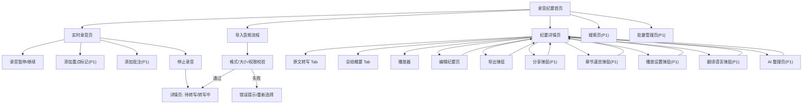

# 夸克录音纪要页面与交互设计说明

版本：v0.4
整理日期：2026-06-25
依据：`docs/QUARK_RECORDING_MINUTES_PRD.md` v0.4、`/Users/studio/Documents/GitHub/flutter-components/DESIGN.md`、`/Users/studio/Documents/GitHub/flutter-components/DOC.md`

## 1. 文档目标

本文件用于把产品文档转成可交给 AI 设计工具生成移动端设计稿的页面规格。它重点描述：

- 有哪些页面 / 弹层 / 状态页。
- 每个页面上有哪些内容。
- 页面布局、模块层级和信息优先级。
- 页面之间的跳转逻辑。
- 用户交互逻辑。
- 组件显隐和置灰规则。
- 低保真草图。
- 建议使用的 Goo 组件。

设计目标不是做营销页，而是直接生成“录音纪要”可用工具界面。首版以移动端 `Compact` 宽度为主，建议设计画板使用 `390 x 844`，同时保留 `360` 宽度适配检查。

## 2. 你的输入是否足够

你提出的“页面、内容、布局、功能、跳转、交互、显隐、草图、组件”已经覆盖 AI 生成设计稿的核心输入，足以生成一版低保真到中保真的产品设计稿。

为了让 AI 工具生成结果更稳定，还建议补充以下信息，本文件已补齐其中大部分：

| 需要补充的信息 | 为什么重要 | 本文件处理方式 |
|---|---|---|
| 版本范围 | 避免 AI 把 P0/P1/P2 全塞进第一版 | 按 P0 主流程、P1 增强、P2 未来能力标注 |
| 目标设备 | 控制密度、字号、底部操作和安全区 | 以 `390 x 844` 移动端为主 |
| 设计系统约束 | 避免 AI 随意造组件和样式 | 指定使用 Goo 组件与 token |
| 示例数据 | 没有内容样例会导致设计稿空泛 | 提供标题、状态、摘要、发言人、时间码样例 |
| 状态矩阵 | 工具类产品最容易漏空态、失败态、加载态 | 增加列表、详情、导入、转写、分享等状态规则 |
| 弹层规格 | 导出、分享、播放设置、章节等依赖弹层 | 单独列出 Panel/Dialog/Menu 规则 |
| 设计禁区 | 避免做成营销页、过度卡片化或自造控件 | 增加 AI 设计生成约束 |
| 验收标准 | 方便判断设计稿是否可进入实现 | 增加设计稿验收清单 |

仍建议在真正生成高保真设计稿前补充：品牌 Logo 使用规则、真实截图素材、最终支持格式、最长文件时长和最终价格表。

## 3. 设计系统约束

### 3.1 Goo 组件优先

设计稿和后续 Flutter 实现都应优先使用 `package:flutter_components/flutter_components.dart` 中已公开的 Goo 组件。不要在设计稿中命名不存在的 Goo 组件。

推荐组件映射：

| 需求 | Goo 组件 |
|---|---|
| 页面顶部栏 | `GooAppBar`, `GooSliverAppBar`, `GooEditAppBar` |
| 页面 Tab / 筛选 | `GooTabs`, `GooSegmentedButton`, `GooChip` |
| 搜索 | `GooSearchBar` |
| 主按钮 / 次按钮 | `GooButton`, `GooButton.icon`, `GooButton.text` |
| 图标操作 | `GooActionIcon`, `GooCloseButton` |
| 列表 | `GooList`, `GooListItem`, `GooSectionedList` |
| 可选列表 / 批量选择 | `GooSelectionController`, `GooSelectionScaffold`, `GooSelectableList` |
| 卡片 | `GooCard` |
| 标签 / 状态 | `GooTag`, `GooChip`, `GooBadge` |
| 头像 / 发言人 | `GooAvatar`, `GooAvatarFallback` |
| 底部工具栏 | `GooToolBar`, `GooToolBarDock` |
| 底部弹层 | `GooPanel`, `showGooPanel`, `showGooNonModalPanel` |
| 确认弹窗 | `GooDialog`, `showGooDialog` |
| Toast / Snackbar | `GooToast`, `GooSnackbar` |
| 加载 / 进度 | `GooSpinner`, `GooProgress`, `GooInlineLoader`, `GooSkeleton`, `GooLoadingOverlay` |
| 输入 | `GooInput`, `GooTextArea`, `GooForm` |
| 开关 / 滑块 / 选择器 | `GooSwitch`, `GooSlider`, `GooPicker`, `GooRadioGroup`, `GooCheckboxGroup` |

当前 Goo 文档未提供专门的音频播放器、波形组件或录音计时组件。设计稿可以使用业务组合表达：`GooProgress` + `GooActionIcon` + `GooToolBar` + 文本计时，不要命名为不存在的 `GooAudioPlayer` 或 `GooRecorder`。

### 3.2 视觉规范

- 背景：使用 Goo `Background Dimm` 语义，列表和工具界面保持低压迫。
- 主色：使用 `Theme Default #0066FF` 表达主操作、选中、播放进度和焦点。
- 容器：列表项和卡片使用 `Card` 或 `Neutral/4`，不要做大面积渐变背景。
- 圆角：卡片、面板、输入、标签遵循 Goo 默认高圆角，不手写尖角容器。
- 字体：遵循 Goo 排版层级，页面标题用 `Headline/S` 或 `Headline/M`，列表正文用 `Body/M`，辅助时间与状态用 `Body/XS`。
- 间距：Compact 页面左右 `16`，模块间 `16`，组内 `8` 或 `12`。
- 图标：使用 lucide 风格的 `iconName`，纯图标按钮必须有语义标签。

### 3.3 离线优先与在线能力边界

本产品的核心差异化应明确表达为“默认本地优先，不上传；需要时可开启云端备份，也可传到 PC 离线转写”。设计稿必须让用户在首页和录音页第一眼看到：

- 默认本地录音、本地保存、离线转写，不把音频默认上传云端。
- 处理中、转写失败和转写进度属于单条录音的状态，首页直接在录音卡片内表达；全局任务队列只通过右上角队列按钮进入。
- 手机可把音频和任务传给 PC 端离线转写，再把转写结果安全同步回手机；入口可以是首页次级入口或“更多来源 / 同步到 PC”。
- 云端录音存储也是在线模式卖点，但必须是登录后主动开启的增值能力。默认给普通用户 1GB 免费空间，会员给 50GB 空间，超出部分引导扩容或升级；开启前明确说明会把音频上传到云端，用于备份、换机恢复和多设备访问。
- 转写权益要同时支持两类商业化：会员按周期提供更长转写时长和更多权益；价格敏感用户可购买“次包”，对外强调按次数扣减、不按分钟焦虑，但产品规则必须保留单次最长时长 / 最大文件体积上限，避免超长音频滥用。
- 在线增强能力必须和离线能力区分。离线模式下，主流程里不展示在线专属能力；在用户自然会寻找的位置（详情更多、知识页、我的页）保留带“在线”标签的置灰入口，点击后用 `GooInformationTip`、`GooTopTip` 或 `GooDialog` 说明需要联网和用户确认。不要在首页铺满一堆不可用按钮。

不要只用“在线 / 离线”二分。界面标签和筛选应拆成三个维度：

| 维度 | 取值 | 说明 |
|---|---|---|
| 处理位置 | 本机离线 / PC 离线 / 云端在线 | 决定音频在哪里被转写或分析 |
| 存储位置 | 仅本地 / 云端已备份 / 本地+云端 / 备份暂停 | 决定音频和纪要资产是否上传、是否可换机恢复 |
| AI 能力 | 本地可用 / PC 可用 / 在线增强 | 决定摘要、待办、问答等能力是否需要联网或更强模型 |

建议能力边界：

| 能力 | 离线模式 | 在线模式 |
|---|---|---|
| 录音、本地导入、基础播放、标题编辑、删除 | 可用 | 可用 |
| 离线 ASR 转写、PC 端离线转写同步 | 可用 | 可用 |
| 基础导出 Markdown / TXT | 可用 | 可用 |
| AI 摘要、语篇规整、待办提取、知识卡片、自然语言问答 | 默认不可用，入口收在详情更多或知识页并置灰说明 | 可用，必须显示来源和复核提示 |
| 云端录音存储、分享链接、跨设备账号同步 | 不可用，隐藏或在我的页置灰说明 | 登录后主动开启；普通用户 1GB 免费空间，会员 50GB，超额付费；需明确上传、有效期、撤销和隐私提示 |
| 会员时长额度、按次转写包 | 不影响本机录音和本地管理；基础离线转写仍应可体验 | 会员提供更长转写时长和更多权益；次包按次数扣减但保留单次上限，适合价格敏感用户 |

## 4. 页面总览

本章分为两层：`4.1` 到 `4.3` 是首轮设计稿建议输出画板，用于快速验证视觉方向、信息架构和核心交互；`4.4` 是完整 App 页面 / 弹层 / 状态清单，用于后续补齐产品范围。

### 4.1 首轮设计稿输出画板：P0 核心

| 页面 ID | 页面名称 | 页面类型 | 目标 |
|---|---|---|---|
| P0-01 | 录音纪要首页 | 主页面 | 查看纪要列表，开始录音，导入音频，触发 AI 转写 |
| P0-02 | 实时录音页 | 全屏任务页 | 录音、暂停、停止、保存录音 |
| P0-03 | 导入音频流程 | 系统选择 + 进度页 / 弹层 | 选择本地音频，校验格式，提交转写 |
| P0-04 | 纪要详情页 | 内容详情页 | 阅读原文、总结、复听音频、编辑、导出 |
| P0-05 | 编辑纪要页 | 编辑态页面 | 编辑标题和转写文本，撤销、重做、保存 |
| P0-06 | 导出弹层 | 底部 Panel | 导出 Markdown / TXT，P1 扩展 Word / PDF |
| P0-07 | 删除确认弹窗 | Dialog | 删除录音并清理关联结果 |
| P0-08 | 权限 / 错误状态 | Dialog / 空态 | 处理麦克风、文件权限、转写失败 |

### 4.2 首轮设计稿输出画板：P1 增强

| 页面 ID | 页面名称 | 页面类型 | 目标 |
|---|---|---|---|
| P1-01 | 搜索页 | 次级页面 | 搜索标题、关键词、正文、来源 |
| P1-02 | 批量管理页 | 选择态页面 | 批量删除、移动、重试失败任务 |
| P1-03 | AI 热词库弹层 | 底部 Panel | 添加、删除、启用专有名词 |
| P1-04 | 章节速览弹层 | 底部 Panel | 按时间查看章节并跳转播放 |
| P1-05 | 播放设置弹层 | 底部 Panel | 设置倍速、区分人声 |
| P1-06 | AI 整理页 / 弹层 | 次级页面 / Panel | 语篇规整、待办提取、摘要溯源 |
| P1-07 | 导出 / 分享弹层 | 底部 Panel | 导出格式、加密链接、有效期、社交渠道 |
| P1-08 | 手机-PC 离线转写同步 | 页面 / Panel | 通过蓝牙或局域网把手机音频传到 PC 离线转写，再同步结果回手机 |
| P1-09 | 云端存储与会员权益 | 我的页 / Panel | 展示 1GB 免费云空间、会员 50GB、扩容、转写时长和按次包 |

### 4.3 P2 仅做未来态提示

P2 能力不要进入 P0/P1 主设计稿的主链路，可在设计稿末尾作为 future frame 或概念说明：

- 视频导入。
- 网盘导入。
- 拍照时间线。
- 播客 RSS 转写。
- 悬浮字幕 / 内部收音。
- AI 问答。
- 智能硬件 / 外设导入。
- 跨纪要语义搜索。

### 4.4 完整 App 页面清单 / Sitemap

完整 App 不止首轮输出画板。下面清单用于描述最终页面、弹层和状态覆盖范围；首轮设计稿可以优先画核心画板，后续再按这个 Sitemap 补齐。

#### 主页面 / 一级入口

| 页面 / 入口 | 类型 | 阶段 | 说明 |
|---|---|---|---|
| 记录 Tab | 主页面 | P0 | 录音、导入、统一记录列表、卡片状态、右上角任务队列入口 |
| 知识 Tab | 主页面 | P0 壳 / P1 增强 / P2 问答 | P0 显示空态或引导；P1 承接筛选、主题聚合、知识卡片；P2 承接在线问答 |
| 我的 Tab | 主页面 | P0 壳 / P1 商业化 | 登录、会员、额度、云端录音存储、隐私与数据、通用设置 |
| 全局搜索 | 次级页面 | P1 | 搜索标题、关键词、正文和来源，结果必须能回跳记录详情 |
| 右上角任务队列 | 次级页面 / Panel | P0 / P1 | 展示本机转写、PC 转写、失败、已完成任务，P1 支持批量重试 |

#### 采集 / 导入 / 转写任务页

| 页面 / 入口 | 类型 | 阶段 | 说明 |
|---|---|---|---|
| 录音 / 导入设置 | Panel | P0 / P1 | 语言、区分人声、本地优先；P1 增加热词库 |
| 实时录音页 | 全屏任务页 | P0 / P1 / P2 | P0 录音、暂停、停止保存；P1 重点标记和批注；P2 拍照时间线 |
| 保存 / 放弃录音确认 | Dialog | P0 | 关闭录音页时确认保存或放弃 |
| 本地音频导入 | 系统选择 + 任务页 | P0 | 文件选择、格式校验、导入进度、失败提示 |
| 系统分享导入 | 系统入口 + 任务页 | P1 | 从外部 App 分享音频进入录音纪要 |
| 更多来源 | Panel / 次级页面 | P2 | 视频、网盘、播客、硬件等来源的弱入口 |
| 本机离线转写 | 任务状态 | P0 | 在录音卡片和任务队列中展示转写进度、失败和重试 |
| 手机-PC 离线转写同步 | 页面 / Panel | P1 / P2 | P1 局域网 + 二维码 / 验证码配对；P2 蓝牙兜底 |
| PC 结果冲突处理 | Dialog / Panel | P1 | 本机和 PC 同时产生结果时，允许切换版本或删除旧结果 |

#### 记录详情 / 编辑 / 播放

| 页面 / 入口 | 类型 | 阶段 | 说明 |
|---|---|---|---|
| 记录详情：概览 | 内容详情 Tab | P0 | 摘要、关键结论、轻量待办、来源时间码 |
| 记录详情：原文 | 内容详情 Tab | P0 | 发言人、时间码、低置信度、段落播放联动 |
| 记录详情：更多 | 内容详情 Tab | P0 / P1 | 导出、分享、翻译、删除、在线增强、云端存储状态 |
| 记录详情：时间线 | 内容详情 Tab | P1 / P2 | 章节、重点标记、批注；P2 图片时间线 |
| 记录详情：待办 | 内容详情 Tab | P1 | 本纪要待办、风险、待确认事项 |
| 编辑纪要 | 编辑态页面 | P0 | 标题、原文段落、撤销、重做、保存 |
| 播放设置 | Panel | P1 | 倍速、前后跳转、发言人 / 人声相关播放设置 |
| 章节速览 | Panel | P1 | 按章节查看摘要并跳转播放 |

#### AI / 知识 / 待办

| 页面 / 入口 | 类型 | 阶段 | 说明 |
|---|---|---|---|
| AI 整理页 | 次级页面 / Panel | P1 | 语篇规整、待办提取、待确认问题、来源校验 |
| 在线增强不可用提示 | Dialog / Tip | P1 | 离线模式点击在线 AI 能力时解释联网、上传确认和权益 |
| 知识卡片筛选 | Panel | P1 | 主题、时间、来源、状态、处理来源、存储位置 |
| 知识卡片详情 | 次级页面 / Panel | P1 | 展示知识卡片、引用来源、收藏和回跳 |
| 知识来源回跳 | 跳转状态 | P1 | 从知识页进入记录详情并定位时间码 |
| 在线问答 | 页面 / 输入区 | P2 | 跨纪要问答、语义搜索、来源引用 |
| 可选独立待办 Tab | 主入口 / 次级页 | P2 / 高频用户 | 跨纪要待办聚合、风险清单和执行追踪 |

#### 云端 / 会员 / 账号

| 页面 / 入口 | 类型 | 阶段 | 说明 |
|---|---|---|---|
| 登录 / 账号信息 | 页面 / Panel | P0 壳 / P1 | 登录态、头像、昵称、会员状态 |
| 云端存储与会员权益 | 我的页 / Panel | P1 | 免费 1GB、会员 50GB、空间进度、扩容、权益说明 |
| 开启云端备份确认 | Dialog | P1 | 首次上传前说明音频会上传云端，支持只备份纪要文本 |
| 云空间已满 | 状态 / Dialog | P1 | 暂停云端备份，引导清理、扩容或升级，不影响本地功能 |
| 会员页 | 次级页面 | P1 | 会员权益、到期时间、开通和续费 |
| 转写次包购买 | 次级页面 / Panel | P1 | 按次数扣减、不按分钟焦虑，但提示单次上限 |
| 订单 / 兑换入口 | 次级页面 | P1 | 订单记录、兑换码、购买结果 |
| 多端设备管理 | 次级页面 | P2 | 已登录设备、同步状态、设备移除 |

#### 设置 / 隐私 / 权限 / 错误

| 页面 / 入口 | 类型 | 阶段 | 说明 |
|---|---|---|---|
| 通用设置 | 设置页 | P0 | 默认识别语言、默认导出格式、本地优先处理 |
| 热词库管理 | 设置页 / Panel | P1 | 账号级或设备级热词的增删改查 |
| 隐私与数据 | 设置页 | P0 / P1 | 本地优先、云端备份策略、删除数据、清理缓存 |
| 删除确认 | Dialog | P0 / P1 | 删除本机；P1 增加“同时删除云端”选项 |
| 麦克风权限 | Dialog / 空态 | P0 | 录音前请求，拒绝后保留恢复入口 |
| 文件权限 | Dialog / 空态 | P0 | 导入文件时请求 |
| 局域网权限 | Dialog / 空态 | P1 | PC 离线转写同步时请求 |
| 蓝牙权限 | Dialog / 空态 | P2 | 仅蓝牙兜底方案使用 |
| 网络 / 登录异常 | Dialog / 空态 | P1 | 云端备份、分享链接、会员权益、在线增强失败 |
| 格式不支持 / 重复文件 | 空态 / Dialog | P0 | 导入文件校验失败或重复导入 |
| 转写失败 / 低置信度 / 无来源 | 状态 | P0 / P1 | 卡片、详情和 AI 内容中展示失败原因、重试和待复核 |
| 帮助反馈 | 次级页面 | P0 | FAQ、问题反馈、日志上传入口 |

## 5. 信息架构与跳转图



## 6. 页面详细说明与草图

### P0-01 录音纪要首页

目标：让用户快速开始录音、导入音频，并能判断每条录音 / 纪要的状态。首页必须突出“离线转写、本地保存、隐私保护”，但不要单独展示处理中队列摘要，因为右上角队列按钮已经承接全局任务队列。

推荐组件：`GooAppBar.primary`、`GooActionIcon`、`GooSearchBar`、`GooTabs` 或 `GooSegmentedButton`、`GooCard`、`GooListItem`、`GooTag`、`GooChip`、`GooButton`、`GooMenuAnchor`、`GooSkeleton`。

页面内容：

- 顶部栏：标题“录音纪要”、搜索图标、任务队列图标、设置或更多图标；任务队列有处理中或失败任务时显示角标 / 错误点。
- 入口区：开始录音、导入音频、传到 PC 离线转写（P1）、系统分享导入（P1，不作为首页显式按钮也可由系统入口触发）。
- 隐私状态：在开始录音入口或轻提示中展示“离线转写 · 本地保存 · 默认不上传”。
- 筛选：全部笔记、录音速记、本地/网盘导入。
- 列表卡片：标题、来源/时长/时间、离线/在线模式、状态、关键词、总结预览、AI 转写按钮或已转写状态；转写中进度、失败原因和重试按钮直接在对应录音卡片里展示。
- 首页列表不需要“最近记录”标题；顶部已有页面大标题，筛选后直接进入录音卡片列表。
- 首页不显示批量按钮；批量管理由长按卡片进入选择态。
- 空态：无笔记时展示开始录音和导入音频两个主动作。
- 加载态：列表用 `GooSkeleton`。

低保真草图：

```text
┌──────────────────────────────┐
│  录音纪要          🔍  ⟳2  ⚙ │
├──────────────────────────────┤
│ ┌──────────────────────────┐ │
│ │ 🎙 开始录音               │ │
│ │ 离线转写 · 本地保存 · 不上传│ │
│ └──────────────────────────┘ │
│ [导入音频] [传到PC转写] [更多]│
│                              │
│ [全部笔记] [录音速记] [导入] │
│                              │
│ ┌──────────────────────────┐ │
│ │ 项目复盘会议        AI转写│ │
│ │ 32:18 · 今天 10:42 · 离线 │ │
│ │ 待转写                    │ │
│ └──────────────────────────┘ │
│ ┌──────────────────────────┐ │
│ │ 课堂录音            转写中│ │
│ │ 01:12:44 · 周二 09:00    │ │
│ │ 离线转写中 42%  ━━━░░░    │ │
│ └──────────────────────────┘ │
│ ┌──────────────────────────┐ │
│ │ 客户访谈纪要          已转写│ │
│ │ 48:06 · 昨天 15:20       │ │
│ │ #报价 #上线计划          │ │
│ │ 总结概要：客户关注...     │ │
│ └──────────────────────────┘ │
└──────────────────────────────┘
```

关键交互：

- 点击“开始录音”：
  - 未授权麦克风：弹出权限说明 Dialog。
  - 已授权：进入实时录音页。
- 点击“导入音频”：打开文件选择；选择后进入导入校验 / 上传状态。
- 点击未转写卡片的“AI转写”：复用已有任务或创建转写任务；卡片状态切为“发起中/转写中”。
- 点击“传到 PC 转写”（P1）：打开设备发现 / 配对 Panel，通过蓝牙或局域网把音频传到 PC 端离线转写。
- 点击已转写卡片：进入纪要详情页。
- 长按任意卡片：进入批量选择态；首页不额外展示“批量”按钮。
- 点击更多：展开菜单，包含排序、帮助、隐私与数据说明。

显隐规则：

| 条件 | UI 表现 |
|---|---|
| 列表为空 | 隐藏筛选结果列表，展示空态和两个主操作 |
| 卡片 `status = untranscribed` | 显示 `AI转写` 按钮，不显示摘要 |
| 卡片 `status = transcribing` | 在卡片内显示 `GooProgress` 或 `GooInlineLoader`，按钮置灰；首页不再单独开“处理中”区块 |
| 卡片 `status = failed` | 显示失败标签和“重试”按钮 |
| 卡片 `status = transcribed` | 显示关键词、摘要预览和“已转写”标签 |
| 进入批量模式 | 顶部栏切到选择态，卡片左侧显示选择控件，隐藏单卡片更多菜单 |
| 有全局处理中任务 | 只在右上角任务队列图标显示角标；首页列表里由各自卡片展示状态 |

### P0-02 实时录音页

目标：专注录音，提供低干扰计时、暂停、停止和 P1 标记能力。标记、批注、热词属于辅助能力，不应占据大面积常驻区域。

推荐组件：`GooAppBar.secondary`、`GooActionIcon`、`GooButton`、`GooToolBar`、`GooProgress`、`GooTopTip`、`GooDialog`、`GooToast`。

页面内容：

- 顶部栏：关闭、标题“录音中”、更多设置。
- 中部：大计时器、录音状态、离线保存提示、简化波形或进度轨道。
- P1 辅助条：热词库、重点标记、批注、标记列表入口；只用按钮或紧凑统计表达。
- 底部主控：暂停/继续、停止并保存。

低保真草图：

```text
┌──────────────────────────────┐
│  ×  录音中               ⋯   │
├──────────────────────────────┤
│                              │
│          00:12:48            │
│    正在录音 · 离线保存 · 不上传│
│                              │
│    ▂▃▅▆▃▂▅▇▆▃▂▁             │
│                              │
│ [热词] [标记] [批注] [列表 4] │
│                              │
│        会议记录将自动保存     │
│                              │
│   ┌────────┐   ┌────────┐    │
│   │ 暂停   │   │ 停止保存│    │
│   └────────┘   └────────┘    │
└──────────────────────────────┘
```

关键交互：

- 暂停：计时暂停，按钮变为“继续”，录音状态显示“已暂停”。
- 停止保存：弹出确认 Dialog；确认后生成一条纪要并进入详情页“待转写/转写中”状态。
- 点击重点标记（P1）：立即在当前时间点生成 marker，按钮给出轻反馈 Toast。
- 点击批注（P1）：打开小型 `GooPanel` 或 `GooTextArea` 输入批注。
- 点击“列表 / 已标记 N”（P1）：打开底部 `GooPanel` 展示标记和批注列表，不在录音主界面常驻大面积“最近标记”卡片。
- 关闭页面：若正在录音，必须弹出确认，避免误退出。

显隐规则：

| 条件 | UI 表现 |
|---|---|
| 未授权麦克风 | 不进入录音态，展示权限 Dialog |
| 正在录音 | 显示暂停、停止保存、标记能力 |
| 已暂停 | 显示继续、停止保存；标记按钮置灰或提示暂停中不可标记 |
| 录音时长为 0 | 停止保存置灰 |
| P0 版本 | 隐藏热词库、重点标记、批注入口 |
| P1 有标记 / 批注 | 主界面只显示紧凑数量入口；列表内容在 Panel 中查看 |

### P0-03 导入音频流程

目标：把本地音频提交为可转写任务，并清晰反馈失败原因。

推荐组件：`GooPanel`、`GooList`、`GooListItem`、`GooProgress`、`GooInlineLoader`、`GooDialog`、`GooToast`。

页面内容：

- 入口弹层标题：“导入音频”。
- 文件来源：本地文件；P1 可通过系统分享进入；P2 视频/网盘入口置后。
- 文件约束说明：支持格式、最大时长、最大体积。
- 提交状态：校验中、上传中、发起转写中、失败。

低保真草图：

```text
┌──────────────────────────────┐
│          导入音频             │
├──────────────────────────────┤
│  支持 MP3 / WAV / M4A / AAC   │
│  单个文件大小和时长以线上为准 │
│                              │
│ ┌──────────────────────────┐ │
│ │ 📁 从本地文件选择        > │ │
│ └──────────────────────────┘ │
│ ┌──────────────────────────┐ │
│ │ 🔗 系统分享导入       P1  │ │
│ └──────────────────────────┘ │
│                              │
│  上传中  42%                 │
│  ━━━━━━━━━━━━░░░░            │
└──────────────────────────────┘
```

关键交互：

- 选择文件后先校验格式、体积、时长、权限。
- 校验失败用 Dialog 或 TopTip 告知原因，保留“重新选择”。
- 校验通过后创建任务，返回首页或进入详情页转写中状态。

显隐规则：

| 条件 | UI 表现 |
|---|---|
| 未选择文件 | 只显示来源入口，不显示进度 |
| 校验中 | 显示局部 loading，入口置灰 |
| 上传 / 提交中 | 显示 `GooProgress`，关闭需二次确认 |
| 格式不支持 | 显示错误说明和重新选择 |
| 重复文件 | 提示是否复用已有任务 |

### P0-04 纪要详情页

目标：阅读、复核和处理单条录音纪要。

推荐组件：`GooAppBar.secondary`、`GooTabs`、`GooActionIcon`、`GooTag`、`GooChip`、`GooList`、`GooAvatar`、`GooProgress`、`GooToolBarDock`、`GooSkeleton`、`GooInlineLoader`。

页面内容：

- 顶部栏：返回、标题、一个搜索入口、编辑、更多；不要同时在顶部和原文区放两个搜索入口。
- 文件信息：标题、创建时间、时长、状态、离线 / 在线模式。
- Tab：原文转写、总结概要。
- 原文：按发言人、时间码、文本分段。
- 总结：整体摘要、结构化要点、AI 提示。
- 播放器：固定底部，进度、播放/暂停、前后 5 秒、倍速设置。
- P1 操作：章节速览、翻译、语篇规整、待办；在线专属能力离线模式下放在更多区置灰说明。

低保真草图：

```text
┌──────────────────────────────┐
│ <  客户访谈纪要       🔍  ✎  ⋯│
├──────────────────────────────┤
│  2026-06-25 · 48:06 · 离线转写│
│  #报价  #上线计划  #风险      │
│                              │
│ [原文转写] [总结概要]          │
│                              │
│  小K  00:01:12                │
│  我们先确认本周上线范围...     │
│                              │
│  听记小助手  00:03:40          │
│  这里提到两个待确认问题...     │
│                              │
│ ───────────────────────────  │
│  12:48 ━━━━━●━━━━ 48:06       │
│   -5s    ▶/Ⅱ    +5s     1.0x │
└──────────────────────────────┘
```

关键交互：

- 切换 Tab：保留当前播放状态，不重置播放器。
- 点击时间码 / 段落：播放器跳转到对应时间，当前段落高亮。
- 拖动进度：当前段落随进度同步定位。
- 点击顶部搜索：进入当前纪要内搜索；原文 Tab 不再额外常驻搜索框，避免出现两个搜索入口。
- 点击编辑：进入编辑纪要页。
- 点击导出：打开导出弹层。
- 点击更多：菜单包含删除、重命名、重新转写、播放设置。

显隐规则：

| 条件 | UI 表现 |
|---|---|
| `status = transcribing` | 内容区显示 loading 文案“正在发起原文转写，请稍后查看”，播放器仍可用 |
| `status = failed` | 显示失败原因、重试按钮、保留音频播放 |
| `status = transcribed` | 展示原文、总结、关键词、导出入口 |
| 无总结 | 总结 Tab 显示生成中或“暂未生成” |
| 低置信度片段 | 段落旁展示弱提示标签 |
| 当前为总结 Tab | 播放器仍固定底部，但文本高亮只在回到原文时可见 |
| 离线模式且 AI 分析不可用 | 摘要、语篇规整、待办提取等在线能力在主内容中隐藏；在更多区以置灰行展示并说明“在线增强能力，需联网并确认上传” |

### P0-05 编辑纪要页

目标：允许用户修改标题和转写文本，并确保保存/取消逻辑清晰。

推荐组件：`GooEditAppBar` 或 `GooAppBar.secondaryEditing`、`GooInput`、`GooTextArea`、`GooToolBar`、`GooDialog`、`GooToast`。

低保真草图：

```text
┌──────────────────────────────┐
│ 取消       编辑纪要     撤销 完成│
├──────────────────────────────┤
│ 标题                         │
│ ┌──────────────────────────┐ │
│ │ 客户访谈纪要              │ │
│ └──────────────────────────┘ │
│                              │
│ 原文转写                     │
│ 小K 00:01:12                 │
│ ┌──────────────────────────┐ │
│ │ 我们先确认本周上线范围... │ │
│ └──────────────────────────┘ │
│                              │
│ 听记小助手 00:03:40           │
│ ┌──────────────────────────┐ │
│ │ 这里提到两个待确认问题... │ │
│ └──────────────────────────┘ │
└──────────────────────────────┘
```

关键交互：

- 取消：若有未保存修改，弹出确认 Dialog。
- 完成：保存后返回详情页，并用 Toast 提示“已保存”。
- 撤销 / 重做：仅在有对应编辑栈时可用。
- 删除关键词：关键词从展示和导出中移除。

显隐规则：

| 条件 | UI 表现 |
|---|---|
| 无修改 | 完成按钮可保留但点击只返回，或置灰，需产品二选一 |
| 有修改 | 取消需要二次确认 |
| 保存中 | 完成按钮 loading，输入区 readOnly |
| 保存失败 | 顶部提示错误，保留编辑内容 |

### P1-01 搜索页

目标：快速定位历史纪要和当前纪要内文本。

推荐组件：`GooAppBar.secondary`、`GooSearchBar`、`GooChip`、`GooList`、`GooListItem`、`GooTag`。

低保真草图：

```text
┌──────────────────────────────┐
│ <  搜索                      │
├──────────────────────────────┤
│ [ 搜索标题、关键词或正文   🔍 ]│
│ [全部] [标题] [正文] [关键词] │
│                              │
│ 搜索结果 12                  │
│ ┌──────────────────────────┐ │
│ │ 客户访谈纪要              │ │
│ │ 命中：上线计划需要...      │ │
│ └──────────────────────────┘ │
└──────────────────────────────┘
```

显隐规则：

- 未输入关键词：显示最近搜索或搜索建议。
- 无结果：显示空态和清除筛选入口。
- 搜索中：显示 inline loading。
- 结果点击：进入对应详情页并滚动到命中段落。

### P1-02 批量管理页

目标：支持批量移动、删除、重试失败任务。

推荐组件：`GooSelectionController`、`GooSelectionScaffold`、`GooSelectableList`、`GooToolBarDock`、`GooDialog`、`GooSnackbar`。

低保真草图：

```text
┌──────────────────────────────┐
│ 取消        已选择 3 项        │
├──────────────────────────────┤
│ ○ 项目复盘会议       转写失败  │
│ ● 客户访谈纪要       已转写    │
│ ● 课堂录音           已转写    │
│ ● 需求评审           待转写    │
│                              │
│ ───────────────────────────  │
│   移动        重试        删除 │
└──────────────────────────────┘
```

显隐规则：

- 未选择任何文件：底部操作置灰。
- 选中含非失败任务：重试按钮置灰或仅对失败任务生效，并说明数量。
- 删除：必须弹出 destructive Dialog，确认文件数量。
- 部分失败：Snackbar 展示“2 项成功，1 项失败”，提供查看失败清单。

### P1-03 AI 热词库弹层

目标：提升专有名词识别质量。

推荐组件：`GooPanel`、`GooInput`、`GooChip`、`GooList`、`GooSwitch`、`GooButton`。

低保真草图：

```text
┌──────────────────────────────┐
│           AI 热词库           │
├──────────────────────────────┤
│ 作用范围：当前录音             │
│ [ 输入人名、产品名、术语    + ] │
│                              │
│ [夸克网盘 ×] [AI听记 ×]       │
│ [Q3复盘 ×]  [渠道报价 ×]      │
│                              │
│ 热词将在本次转写中优先识别     │
│              [保存]           │
└──────────────────────────────┘
```

显隐规则：

- 无热词：显示输入框和示例提示。
- 已有热词：展示为可删除 `GooChip`。
- 保存中：按钮 loading。
- 录音中打开：保存后不打断录音。

### P1-04 章节速览弹层

目标：按章节快速理解长音频并跳转播放。

推荐组件：`GooPanel`、`GooList`、`GooListItem`、`GooCollapsible`、`GooTag`。

低保真草图：

```text
┌──────────────────────────────┐
│           章节速览            │
├──────────────────────────────┤
│ AI 生成，建议复核              │
│ 00:00  开场和背景              │
│        介绍会议目标...         │
│ 08:12  上线范围确认            │
│        确认本周交付边界...     │
│ 24:30  风险和待办              │
│        需要补充接口排期...     │
└──────────────────────────────┘
```

交互：点击章节时间跳转到详情页对应播放位置，弹层关闭或保持由产品决定，建议关闭并高亮段落。

### P1-05 播放设置弹层

目标：控制倍速和说话人区分。

推荐组件：`GooPanel`、`GooSegmentedButton`、`GooSwitch`、`GooInformationTip`。

低保真草图：

```text
┌──────────────────────────────┐
│           播放设置            │
├──────────────────────────────┤
│ 倍速                          │
│ [0.5x] [0.8x] [1.0x] [1.5x] [2x]│
│                              │
│ 区分人声                  开关 │
│ 关闭后不会重新识别已有文本      │
└──────────────────────────────┘
```

### P1-06 AI 整理页 / 弹层

目标：把原始口语稿整理成可读版本，同时保留原文依据。该能力默认属于在线增强；若未来有本地大模型或 PC 端本地分析能力，再作为离线增强开放。

推荐组件：`GooAppBar.secondary`、`GooTabs`、`GooCard`、`GooTag`、`GooButton`、`GooCollapsible`、`GooInlineLoader`。

低保真草图：

```text
┌──────────────────────────────┐
│ <  AI 整理             重新生成│
├──────────────────────────────┤
│ [语篇规整] [待办] [待确认]     │
│                              │
│ AI 生成，可编辑，建议复核       │
│ ┌──────────────────────────┐ │
│ │ 规整稿                    │ │
│ │ 本次会议确认了三项内容...  │ │
│ │ 来源：00:03:40, 00:12:08  │ │
│ └──────────────────────────┘ │
│                              │
│ [接受并保存] [放弃]           │
└──────────────────────────────┘
```

显隐规则：

- 离线模式且没有本地分析模型：入口不出现在首页；在详情更多区显示置灰“在线 AI 整理”，点击提示需要联网和用户确认上传。
- 在线模式：入口可用，但必须说明会使用在线增强能力。
- 生成中：显示 inline loading。
- 无来源依据：该条内容标为“待复核”，不能直接进入正式纪要。
- 用户接受：写入派生稿，不覆盖原文。
- 用户放弃：返回详情页，原文不变。

### P1-07 导出 / 分享弹层

目标：让用户明确导出内容、格式、权限和有效期。

推荐组件：`GooPanel`、`GooList`、`GooListItem`、`GooCheckboxGroup`、`GooRadioGroup`、`GooButton`、`GooSwitch`。

导出低保真草图：

```text
┌──────────────────────────────┐
│             导出              │
├──────────────────────────────┤
│ 格式                          │
│ ○ Markdown   ○ TXT   ○ PDF P1 │
│                              │
│ 导出内容                      │
│ ☑ 原文  ☑ 总结  ☑ 时间码       │
│ ☐ 讲话人                       │
│                              │
│              [导出]           │
└──────────────────────────────┘
```

分享低保真草图：

```text
┌──────────────────────────────┐
│             分享              │
├──────────────────────────────┤
│ 链接类型                      │
│ ○ 加密链接   ○ 公开链接        │
│ 有效期：30 天                 │
│ [微信] [QQ] [钉钉] [复制链接]  │
│                              │
│ 禁止传播违法违规内容           │
└──────────────────────────────┘
```

显隐规则：

- 转写未完成：导出和分享置灰，提示需等待转写完成。
- PDF / Word 若属于 P1 或权益能力：显示 P1 / 限免 / 会员标签。
- 公开链接：必须展示有效期和撤销入口。
- 选择“加密链接”：展示密码或复制密码能力。

### P1-08 手机-PC 离线转写同步

目标：让移动端负责录音和管理，PC 端负责更重的离线转写计算，结果再安全同步回手机。该能力强化“离线转写、保护隐私”的产品优势，不应设计成云同步。

推荐组件：`GooPanel`、`GooList`、`GooListItem`、`GooProgress`、`GooTag`、`GooButton`、`GooDialog`、`GooTopTip`。

低保真草图：

```text
┌──────────────────────────────┐
│        传到 PC 离线转写        │
├──────────────────────────────┤
│  不经过云端，音频只在本机和PC间传输│
│                              │
│  连接方式                      │
│  [局域网] [蓝牙]               │
│                              │
│  可用设备                      │
│  MacBook Pro · 已配对       >  │
│  Windows PC · 待确认        >  │
│                              │
│  传输中 42%                   │
│  ━━━━━━━━━━━░░░               │
│                              │
│            [开始传输]          │
└──────────────────────────────┘
```

关键交互：

- P1 先做局域网发现 / 同网连接 / 二维码或一次性验证码配对；蓝牙作为 P2 兜底能力，不要在第一版押重。
- 首次使用需要 PC 端展示二维码或一次性配对码，手机端确认后建立受信任设备。
- 传输前提示“音频不经过云端”，即使用户已开启云端备份，也要明确本次 PC 转写只在手机和受信任 PC 间传输。
- 传输任务在右上角任务队列和对应录音卡片中显示进度。
- PC 转写完成后，手机卡片状态从“PC 转写中”变为“已转写”，详情页显示“PC 离线转写”来源标签。
- 如果连接中断、PC 休眠、手机锁屏或网络切换，卡片显示失败原因和“继续传输 / 改用本机转写”；需要支持断点续传或至少保留已上传进度。
- 如果同一条录音同时在本机和 PC 产生结果，默认保留最新完成结果，并在详情更多中提供“切换版本 / 删除旧结果”。

显隐规则：

| 条件 | UI 表现 |
|---|---|
| 手机和 PC 未配对 | 显示配对引导和连接方式选择 |
| 局域网不可用 | 局域网入口置灰并说明需同一网络，可选择蓝牙 |
| 蓝牙不可用 | P2 兜底入口置灰并提供系统设置入口，不影响局域网方案 |
| 传输中 | 显示 `GooProgress`，关闭 Panel 不取消任务 |
| PC 不在线 / 休眠 | 卡片显示“等待 PC 在线”，提供取消和改用本机转写 |
| PC 转写中 | 录音卡片显示“PC 离线转写中”和进度 / 预计耗时 |
| 完成 | 结果同步回手机，详情显示离线来源标签 |
| 在线模式开启 | 仍优先展示本地 / PC 离线路径，在线增强作为明确用户选择 |

### P1-09 云端存储与会员权益

目标：把“录音云端存储”作为可选卖点，同时不破坏“默认离线、本地优先、不上传”的信任基础。云端能力应放在“我的 / 隐私与数据 / 云端存储”或详情更多里的最终确认节点，不要放在首页主流程。

推荐组件：`GooCard`、`GooProgress`、`GooTag`、`GooList`、`GooListItem`、`GooButton`、`GooPanel`、`GooDialog`、`GooTopTip`。

低保真草图：

```text
┌──────────────────────────────┐
│        云端存储与会员          │
├──────────────────────────────┤
│  云端录音空间                  │
│  已用 320MB / 免费 1GB         │
│  ━━━━━━━░░░░░                  │
│  开启后可备份录音、换机恢复、多端访问│
│                              │
│  会员权益                      │
│  VIP 50GB 云空间 · 更长转写时长 │
│  高级导出 · 批量处理 · 在线增强 │
│                              │
│  转写次包                      │
│  10 次 / 30 次 / 100 次         │
│  按次数扣减，单次上限待定        │
│                              │
│        [开通会员] [购买次包]    │
└──────────────────────────────┘
```

商业化边界：

| 权益 | 免费用户 | 会员用户 | 补充付费 |
|---|---|---|---|
| 云端录音存储 | 1GB 免费空间 | 50GB 空间 | 超额扩容或升级会员 |
| 转写时长 | 基础免费额度，具体数值待定 | 更长月度 / 周期额度 | 可购买时长包 |
| 转写次包 | 可购买 | 可叠加购买 | 对外强调按次数扣减、不按分钟焦虑；规则保留单次最长时长 / 最大文件体积上限 |
| 高级导出 / 批量处理 / 在线增强 | 限免或置灰引导 | 优先开放 | 可按单项活动开放 |

交互和文案：

- 默认不开启云端录音存储；第一次上传前必须弹出确认，说明“音频将上传到云端用于备份和多设备访问”。
- 云端备份内容要可解释：默认备份压缩音频、转写文本和纪要结果；可提供“只备份纪要文本，不备份音频”的隐私选项；原始无损音频备份应作为高级或会员选项。
- 我的页显示云空间用量：免费用户展示 `已用 / 1GB`，会员展示 `已用 / 50GB`，超过 80% 时用轻提示引导清理、扩容或升级；空间已满时暂停云端备份，但不影响本地录音和离线转写。
- 记录卡片和详情页需要能展示存储位置标签：`本地`、`云端已备份`、`本地+云端`、`仅本地`。
- 删除记录时要说明是否同时删除云端备份；提供“仅删本机 / 同时删除云端”二次确认。
- 价格敏感用户入口优先展示“购买次包”，文案强调按次数扣减、不按分钟焦虑，但规则必须提示单次上限；超长文件可以自动拆分为多次，或引导使用会员时长包。
- 会员权益不要盖过核心录音流程；基础离线转写不应被强锁，关键付费点只做轻量提示，具体权益和购买放到“我的”。

## 7. 全局状态与显隐矩阵

| 状态 | 首页卡片 | 详情内容区 | 顶部操作 | 底部播放器 | 导出 / 分享 |
|---|---|---|---|---|---|
| 待转写 | 显示 AI 转写按钮 | 显示原音频信息和待转写提示 | 编辑隐藏或置灰 | 可播放原音频 | 置灰 |
| 发起转写中 | 显示 loading | 显示“正在发起原文转写” | 编辑置灰 | 可播放 | 置灰 |
| 转写中 | 在录音卡片内显示进度，不单独展示首页队列区 | 显示 skeleton / loading | 编辑置灰 | 可播放 | 置灰 |
| 转写失败 | 显示失败标签和重试 | 显示失败原因、重试、保留音频 | 允许删除/重试 | 可播放 | 置灰 |
| 已转写 | 显示关键词和摘要 | 显示原文/总结 | 编辑、导出、更多可用 | 可播放并联动文本 | 可用 |
| 编辑中 | 卡片不变 | 编辑页面 | 取消、撤销、重做、完成 | 隐藏或弱化 | 隐藏 |
| 批量模式 | 长按进入，左侧选择控件 | 不进入详情 | 取消、已选数量 | 不显示 | 批量工具栏 |
| PC 离线转写中 | 卡片显示“PC 离线转写中”和传输 / 转写进度 | 可查看音频信息和来源 | 编辑置灰 | 可播放原音频 | 置灰 |
| 离线模式 | 首页突出“离线转写 / 本地保存 / 不上传” | 在线分析内容隐藏或置灰说明 | 在线增强置灰 | 可播放 | 本地导出可用，分享链接置灰 |
| 云端备份开启 | 卡片显示“云端已备份”或“同步中”标签 | 更多区显示云端存储状态和删除策略 | 云端状态可查看，不抢主操作 | 可播放本地或缓存音频 | 分享链接可用但需权限确认 |

## 8. 交互细节

### 8.1 列表卡片状态

- 卡片点击区域：除右侧按钮和更多菜单外，点击进入详情。
- `AI转写` 按钮：只在待转写或失败状态显示。
- `已转写` 标签：不可点击，用于状态确认。
- `转写中 / 传输中 / 失败` 状态直接在卡片内部表达，包含进度、失败原因和重试入口；首页不单独展示“处理中”摘要区。
- 摘要预览：最多 2 行，超出省略。
- 关键词：最多展示 3 个，更多用 `+N`。
- 批量管理：长按任意卡片进入选择态，不在首页放“批量”按钮。

### 8.2 播放器联动

- 播放器在原文和总结 Tab 下都固定底部。
- 点击原文段落或时间码后，音频跳转并高亮当前段落。
- 拖动播放进度时，当前段落随时间更新。
- 播放设置通过底部 Panel 打开。
- 当前 Goo 组件库没有音频播放器专用组件，设计稿应标注为业务组合。

### 8.3 录音中标记

- P1 显示重点标记、批注和标记列表入口，但只作为紧凑工具按钮。
- 标记成功后不打断录音，只给轻反馈。
- 批注打开底部小面板，保存后回到录音页。
- 标记 / 批注列表通过底部 `GooPanel` 打开，不在录音主屏常驻大卡片。
- 转写失败时标记和批注仍保留在时间线。

### 8.4 在线 / 离线显隐策略

- 主路径优先离线：录音、导入、转写、播放、编辑、删除、基础导出都应可在离线模式完成。
- 离线不可用的在线增强能力，不要在首页和录音页常驻展示；避免主流程充满锁定态。
- 用户自然会寻找的功能位可以置灰并解释，例如详情更多里的“在线 AI 整理”、知识页里的“在线问答”、我的页里的“云端录音存储 / 分享链接 / 会员权益”。
- 点击置灰入口时说明：该能力需要联网、会使用在线处理、是否上传由用户确认。
- 云端录音存储是主动开启的在线能力，不参与默认录音路径；免费 1GB 和会员 50GB 应在我的页用空间进度表达，超过容量时引导清理、扩容、升级会员或购买合适套餐。
- 免费用户也应能体验基础离线转写，不要把产品核心卖点完全放进付费墙；会员更适合承接更长文件、更高精度、说话人区分、批量处理、高级导出、云空间和在线 AI 分析。
- 转写计费入口分为会员时长和转写次包：会员强调周期权益和更长时长，次包强调按次数扣减、不按分钟焦虑，适合价格敏感用户；但规则上必须保留单次最长时长 / 最大文件体积上限，超长文件可拆分或引导会员时长包。
- 未来如果 PC 端本地模型支持摘要 / 待办分析，可把对应能力标为“PC 离线增强”，不归入在线能力。

### 8.5 删除

- 删除入口位于详情更多菜单或批量管理底部工具栏。
- 必须使用 destructive Dialog。
- 文案需说明删除后将同步清理音频、转写、摘要、导出缓存和分享链接。

### 8.6 权限

- 麦克风权限：开始录音前请求。
- 文件权限：导入音频时请求。
- 相机 / 相册权限：仅 P2 拍照时间线请求。
- 局域网权限：仅使用手机-PC 离线转写同步时请求；蓝牙权限只在 P2 兜底方案使用时请求；拒绝权限不影响本机录音和本机离线转写。
- 网络权限 / 账号登录：仅云端录音存储、分享链接、会员权益、在线增强需要；拒绝或未登录时，本机录音、本机离线转写和 PC 离线同步仍可继续。
- 权限被拒绝后，页面保留可恢复入口，不直接空白。

## 9. 示例数据

设计稿可使用以下样例内容，避免空白和 lorem ipsum。

### 首页样例卡片

| 标题 | 状态 | 时长 | 时间 | 模式 | 关键词 | 摘要 / 状态说明 |
|---|---|---:|---|---|---|---|
| 项目复盘会议 | 待转写 | 32:18 | 今天 10:42 | 本机离线 | 无 | 显示 AI 转写 |
| 客户访谈纪要 | 已转写 | 48:06 | 昨天 15:20 | 本机离线 · 云端已备份 | 报价、上线计划、风险 | 客户关注交付时间和售后响应，需要补充报价明细。 |
| 课堂录音：机器学习导论 | 转写中 | 01:12:44 | 周二 09:00 | PC 离线 | 无 | PC 离线转写中 42% |
| 需求评审 | 转写失败 | 26:05 | 06-20 17:30 | 本机离线 | 无 | 音频噪音过大，建议重试或保留录音。 |

### 详情页样例

- 标题：客户访谈纪要
- 创建时间：2026-06-25 15:20
- 时长：48:06
- 关键词：报价、上线计划、风险、接口联调
- 发言人：
  - 小K，00:01:12：我们先确认本周上线范围，避免把后续二期内容混进来。
  - 听记小助手，00:03:40：这里提到两个待确认问题，一个是接口排期，一个是报价明细。
  - 客户代表，00:12:08：如果能在周五前给到报价，我们下周可以开始内部审批。
- 总结概要：本次访谈围绕上线范围、报价明细和接口联调展开。客户希望本周确认报价，下周启动审批。
- 待办样例：补充报价明细，负责人待确认，截止时间本周五。

## 10. 设计稿生成提示词

可直接复制给 AI 设计工具：

```text
请为一款移动端“夸克录音纪要”功能生成 390x844 的 App 设计稿，风格遵循 Goo 组件库：轻盈、圆润、低压迫、白色/浅灰背景、主题蓝 #0066FF、OPPO Sans 或系统 sans 字体。不要做营销页，第一屏就是可操作的录音纪要首页。

产品优势必须突出：默认本地优先，不上传；需要时可开启云端备份，也可传到 PC 离线转写。云端录音存储也是卖点，但必须表达为用户主动开启的在线增强：普通用户 1GB 免费空间，会员 50GB 空间，超额可扩容或升级。

首轮设计稿输出画板用于验证视觉方向、信息架构和核心交互。优先生成这些代表性画板：
1. 录音纪要首页：顶部栏、开始录音/导入音频/传到 PC 转写入口、筛选 Tab、录音卡片。不要展示单独的“处理中”队列区，不要展示“最近记录”标题，不要展示“批量”按钮。卡片要覆盖待转写、转写中、PC 离线转写中、已转写、转写失败五种状态。
2. 实时录音页：计时器、离线保存状态、简化波形、暂停、停止保存。P1 显示热词库、重点标记、批注、标记列表入口，但标记列表只能通过 Panel 打开，不要常驻大面积展示。
3. 导入音频弹层：本地文件导入、格式限制、上传/提交进度、失败提示。
4. 手机-PC 离线转写同步 Panel：P1 优先展示局域网、二维码或一次性验证码配对、设备发现、传输进度、PC 离线转写中、同步完成；蓝牙只作为 P2 兜底弱入口。
5. 纪要详情页：标题、时间、时长、关键词、离线/在线模式、原文转写/总结概要 Tab、发言人段落、时间码、底部播放器。详情页只能有一个搜索入口，建议放在顶部栏；原文区不要再放第二个搜索框。
6. 编辑纪要页：取消、撤销、重做、完成，标题输入和原文段落编辑。
7. 章节速览弹层(P1)：章节时间、标题、摘要，点击可跳转播放。
8. AI 整理页(P1)：语篇规整、待办、待确认，必须显示来源时间码和“AI 生成，建议复核”提示；离线模式下作为在线增强置灰说明，不在首页展示。
9. 导出/分享弹层：导出格式、导出内容选项、加密链接、公开链接、有效期；分享链接属于在线能力。
10. 批量管理页(P1)：长按卡片进入选择态，已选数量、移动、重试、删除工具栏。
11. 云端存储与会员权益页(P1)：我的页内展示云端录音空间用量，免费 1GB、会员 50GB、扩容入口；展示会员更长转写时长、高级导出、批量处理、在线增强等权益；同时展示按次数计费的转写次包入口，文案强调“按次数扣减，不按分钟焦虑”，但需要提示单次最长时长 / 最大文件体积上限。

组件使用建议：
- 顶部栏使用 GooAppBar。
- 搜索使用 GooSearchBar。
- Tab 使用 GooTabs。
- 列表使用 GooList/GooListItem，卡片用 GooCard。
- 标签用 GooTag/GooChip。
- 图标按钮用 GooActionIcon。
- 底部弹层用 GooPanel。
- 确认弹窗用 GooDialog。
- 加载用 GooSpinner/GooProgress/GooSkeleton。
- 不要设计不存在的 GooAudioPlayer，可用进度条、播放按钮、前后 5 秒按钮组合表达播放器。

交互和显隐：
- 待转写卡片显示 AI转写按钮，不显示摘要。
- 转写中、PC 传输中、转写失败都在对应录音卡片内显示进度 / 失败原因 / 重试，不在首页单独列队列摘要。
- 转写失败显示失败标签和重试。
- 已转写显示关键词、摘要、编辑、导出、分享。
- 离线模式下，在线 AI 整理、知识问答、分享链接不要出现在首页；在详情更多、知识页、我的页置灰并解释需要联网和用户确认。
- 云端录音存储默认关闭；首次开启或上传前必须有确认提示，说明音频将上传云端用于备份、换机恢复和多设备访问。默认备份压缩音频、转写文本和纪要结果，可提供“只备份纪要文本”的隐私选项。
- 记录卡片和详情页要能显示处理位置和存储位置：本机离线 / PC 离线 / 云端在线，以及仅本地 / 云端已备份 / 同步中 / 备份暂停；不要让云端标签压过离线转写状态。
- 基础离线转写不能被强锁在会员后面；会员承接更长文件、更高精度、说话人区分、批量处理、高级导出、云空间和在线 AI 分析。
- 详情页播放器始终固定底部，并与原文时间码联动。
- 详情页只能出现一个搜索入口。
- 删除必须有二次确认。
- P2 的视频导入、网盘导入、拍照时间线、播客 RSS、悬浮字幕、智能硬件、AI 问答不要进入主链路，只可作为 future frame 标注。
```

## 11. 设计稿验收清单

AI 生成设计稿后，至少检查这些点：

- 是否生成了首页、录音页、导入、详情、编辑、导出/分享、P1 弹层这些核心画板。
- 是否没有把 P2 功能混进 P0/P1 主链路。
- 是否没有做成营销 landing page。
- 是否使用了 Goo 风格的顶部栏、列表、标签、底部弹层、按钮和状态。
- 是否覆盖待转写、转写中、转写失败、已转写、空列表、权限拒绝等状态。
- 首页是否没有单独的处理中区块、没有“最近记录”标题、没有“批量”按钮。
- 首页和录音页是否清晰突出离线转写、本地保存、默认不上传。
- 是否把云端录音存储作为主动开启的在线增强，而不是默认上传；是否展示免费 1GB、会员 50GB、超额扩容 / 升级路径、空间满后暂停备份但不影响本地功能。
- 是否展示会员转写时长权益和按次转写包，且两者计费边界清晰；次包是否避免承诺“无限单次时长”。
- 是否包含手机到 PC 端的局域网离线转写同步流程、二维码 / 验证码配对、失败续传；蓝牙是否只作为后续兜底而不是主链路。
- 录音页是否没有大面积常驻“最近标记”区域，标记列表是否通过 Panel 打开。
- 详情页是否只有一个搜索入口。
- 在线能力和离线能力边界是否清晰，离线不可用的在线增强是否在正确位置置灰说明，而不是铺在首页。
- 是否清晰区分处理位置、存储位置和 AI 能力三个维度，避免把“云端备份”误画成“云端转写”。
- 是否明确了导出/分享在转写未完成时置灰。
- 是否体现音频播放器固定底部并能回跳原文时间码。
- 是否展示 AI 内容提示和来源时间码。
- 是否有批量管理的选择态和危险删除确认。
- 是否没有使用大面积渐变、厚重阴影、过度装饰或单一蓝色堆叠。

## 12. 后续仍需产品确认的问题

- P0 具体支持的音频格式、最大时长、最大文件体积。
- 转写是否本地完成、云端完成，或由用户选择；会员权益是否影响本机离线转写能力。
- Word / PDF / 音频导出是否属于免费、限免或会员能力。
- 免费 1GB、会员 50GB 是否为最终空间规格；超额扩容是否独立售卖，还是只支持升级会员。
- 转写时长额度和转写次包是否可以叠加；次包的“次数”是否需要限制单次最长时长或最大文件体积。
- 分享链接有效期是否固定 30 天，是否支持撤销和密码。
- 说话人区分是转写前配置，还是转写后展示开关。
- P1 热词库作用范围：当前录音、本设备还是账号全局。
- P1 语篇规整是否默认生成，还是用户手动触发。
- P1 批量移动是否需要文件夹体系，还是只做删除和重试。
- PC 端离线转写同步是否进入 P1，还是作为 P0.5 核心差异化提前实现。
- PC 端是否只做离线 ASR，还是也支持本地摘要 / 待办分析。
