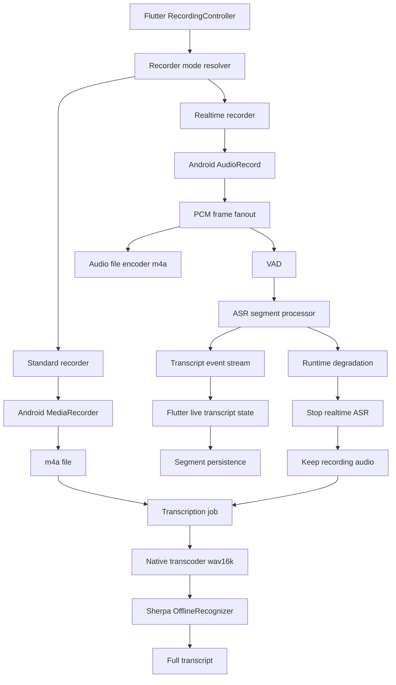

# 双线路录音转写技术设计（已归档）

日期：2026-07-04

> 状态更新（2026-07-23）：本文记录早期双线路研究，不再是移动端实施方案。移动端正式产品只保留 `MediaRecorder -> 文件转码 -> Silero VAD -> Paraformer offline` 单线路，不提供 Live VAD、实时转写设置、隐藏入口或降级路由。本文后续实时部分仅可作为未来 PC Live VAD 独立计划的研究输入，不得用于恢复移动端产品路径。当前决策以 `docs/plans/2026-07-23-001-feat-mobile-meeting-foundation-plan.md` 和产品能力矩阵为准。

## 1. 结论

以下是 2026-07-04 时的历史结论，已被上述状态更新取代。原研究曾建议保留两条录音转写线路：

1. **标准录音模式**：`MediaRecorder` 保存 `m4a`，停止后转 `wav(16k mono)`，再用 Sherpa offline 一次性识别。
2. **实时转写模式**：实时采集 PCM，VAD 判断语音段，增量送入识别引擎，持续把文本片段推给 Flutter，同时保存完整录音文件。

这两条线路不冲突。标准录音模式应该继续作为默认模式，因为它对移动端最稳；实时转写应该作为用户主动开启的增强能力，并支持设备能力推荐和运行中降级。

关键原则：**实时转写不能影响录音保存。** 只要用户开始录音，音频文件保存就是第一优先级；实时 ASR、VAD、模型加载、文本推送失败时，只能停止实时识别或降级到录后转写，不能导致录音丢失。

## 2. 背景与现状

当前项目是 Android 优先的 Flutter 重构工程。现有主链路已经可用：

- `lib/features/recording/` 管理录音流程和状态机。
- `lib/features/transcription/` 管理转写任务列表、失败重试和原生转写调用。
- `android/app/src/main/kotlin/com/voice2text/app/MainActivity.kt` 使用 `MediaRecorder` 录制 `m4a/aac`。
- `android/app/src/main/kotlin/com/voice2text/app/transcription/AudioTranscoder.kt` 将 `m4a` 转为 `wav(16k mono)`。
- `android/app/src/main/kotlin/com/voice2text/app/transcription/RealSherpaTranscriptionEngine.kt` 使用 Sherpa `OfflineRecognizer` 识别完整 wav。
- `pubspec.yaml` 已包含 `paraformer-zh`、VAD、标点、降噪等 Sherpa 相关资产。
- `docs/REAL_DEVICE_REGRESSION_MATRIX.md` 记录了当前 real 模式的真机回归通过证据。

当前模式的行为是：

```text
开始录音
  -> MediaRecorder 保存 m4a
  -> 停止录音
  -> 插入 recordings
  -> 插入 transcription_jobs(pending)
  -> processing
  -> 原生转 wav
  -> Sherpa offline decode
  -> completed/failed
```

它的优势是稳定、实现简单、资源占用低；缺点是用户录音过程中没有文本反馈，长录音结束后才开始转写，失败也较晚暴露。

### 2.1 当前技术栈与可整合能力

这次改造不建议从零重建录音转写系统，而是在现有链路上做拆分和扩展。可以整合进来的内容如下：

| 当前能力 | 建议整合方式 | 原因 |
|---|---|---|
| Flutter `RecordingController`、`RecorderPort`、`AndroidRecorderEngine` | 继续作为录音入口，新增模式路由和实时事件状态 | 现有状态机已经处理权限、暂停、恢复、生命周期中断和错误态 |
| `TranscriptionJobsRepository` 和本地 `sqflite` 数据库 | 扩展 job mode、failure stage，并新增 segment 表 | 现有 pending/processing/completed/failed、重试和本地持久化可以复用 |
| Android `MethodChannel voice2text/recorder` | 保留同步命令通道，新增 `EventChannel` 承载实时事件 | 当前命令式调用稳定，实时文本更适合事件流 |
| `AudioContract.kt` 与 `tool/check_audio_contract.sh` | 扩展为 recorder/transcription 统一契约校验 | 可以降低 Dart/Android 通道字段漂移风险 |
| `MediaRecorder` 标准录音链路 | 保留为默认模式，不在实时路线中强行替换 | 这是低端设备和长录音最稳的兜底路径 |
| `AudioTranscoder.kt` | 抽取 PCM 规格、downmix、resample、wav 写入等可复用能力 | 现有实现适合录后转码；实时模式需要增量处理，不能直接复用整条文件级流程 |
| `RealSherpaTranscriptionEngine` | 继续负责标准模式和实时失败后的 offline fallback | 已有 Paraformer offline 模型加载、缓存和完整 wav 识别链路 |
| `pubspec.yaml` 中 Sherpa 模型资产声明 | 建立模型注册表和 readiness 层，只暴露已确认可用的能力 | 当前 UI 不能仅凭资产名暗示 streaming 已可用 |
| `FakeRecorderEngine`、`FakeTranscriptionService` | 扩展为 fake realtime recorder/event stream | 可在不依赖真机麦克风和模型的情况下验证 Flutter 状态、持久化和降级 |
| `BuildInfoService`、`run_android_smoke.sh`、`check_transcribe_log.sh` | 纳入双线路回归和性能证据 | 便于记录设备、构建、RTF、降级原因和隐私日志约束 |

暂时不整合进这份两线路方案的内容：

- 文件夹、收藏、批量管理等录音管理功能，只在删除录音时同步清理 job/segment。
- `video_player` 等与音频转写主链路无关的依赖。
- PC 端识别、云端识别、系统内录、局域网传输等后续能力。

## 3. 目标

- 支持“稳定优先”和“实时转写”两种录音体验。
- 保持标准录音模式默认开启，不破坏现有端到端链路。
- 实时转写由用户显式开启，系统只做推荐和风险提示。
- 实时模式下仍保存完整音频文件，且可在实时失败后继续走离线转写。
- 将转写结果从“单段全文”扩展为可选的时间轴片段，为后续播放定位、编辑、摘要、关键词和说话人能力打基础。
- 为低端设备、低电量、热节流和长录音提供降级策略。
- 明确实时模式的暂停、恢复、停止、中断、后台和锁屏边界行为。
- 明确实时 segment 的时间戳、顺序、合并和 fallback 对齐规则。
- 建立固定测试音频集，用于验证实时识别准确率、可读性、VAD 阈值和性能。
- 明确标点、降噪等增强能力的真实接入状态，避免 UI 暗示未实现能力。

## 4. 非目标

- 不纳入 PC 端转写、局域网传输、蓝牙传输。
- 不纳入云端识别、账号同步、云备份。
- 不纳入系统音频内录；Android 系统音频涉及 `MediaProjection` 和更重权限，后续单独设计。
- 不纳入说话人分离、实时翻译、AI 总结。
- 不在第一阶段强制替换当前 `MediaRecorder` 标准录音链路。
- 第一版不承诺锁屏或后台无限长时间实时转写；是否需要 Android 前台服务应在真机验证后单独决策。

## 5. 模式定义

| 模式 | 用户含义 | 技术路径 | 默认状态 | 适合场景 | 风险 |
|---|---|---|---|---|---|
| 标准录音 | 先稳定保存音频，录完后转写 | `MediaRecorder -> m4a -> wav -> Sherpa offline` | 默认 | 长录音、低端设备、只需保存音频 | 录后等待、失败发现晚 |
| 实时转写 | 边录边看文字，同时保存音频 | `AudioRecord PCM -> VAD -> ASR segment -> EventChannel -> UI` | 用户开启 | 会议字幕、短中时长录音、高性能设备 | 耗电、发热、状态复杂 |
| 自动推荐 | 系统基于设备能力建议模式 | 检测设备能力和模型表现，只影响推荐 | 可选 | 新用户或不懂配置的用户 | 判断误差，需要用户可覆盖 |

建议设置项：

- `录音模式`
  - `标准录音`
  - `实时转写`
  - `自动推荐`
- `停止录音后自动转写`
  - 标准录音：决定是否停止后立即创建 offline job。
  - 实时转写：决定实时失败或未完成片段是否在停止后补跑 offline job。
- `实时转写失败时`
  - 默认：继续录音，停止实时识别，录完后离线转写。

## 6. 高层架构



## 7. 标准录音模式设计

### 7.1 功能点

- 开始、暂停、继续、停止录音。
- 录音文件保存为 `m4a/aac @16kHz mono`。
- 停止后插入录音记录。
- 根据 `autoTranscribe` 创建转写任务。
- 转写任务支持 `pending -> processing -> completed/failed`。
- 失败任务支持重试。
- App 生命周期中断时优先停止并保存。

### 7.2 实现方式

继续沿用当前实现：

- Flutter 侧：`RecorderPort`、`AndroidRecorderEngine`、`RecordingController`。
- Android 侧：`MainActivity` 中的 `MediaRecorder` 方法。
- 转写侧：`TranscriptionPort`、`AndroidTranscriptionService`、`TranscriptionJobsRepository`、`RealSherpaTranscriptionEngine`。

需要增强的点：

- 录音前做模型资源 readiness 检查，但不能阻断“只录音不转写”的用户。
- 增加模型注册表，区分 `installed`、`readyForOffline`、`readyForRealtime` 和 `unsupported`；`paraformer-zh` 当前只能按已验证的 offline 能力展示，`sherpa-streaming-zh` 在原生 streaming API 和模型链路确认前不应作为可用实时模型暴露。
- 将 transcription job 扩展为可表达来源和模式，例如 `standard_offline`、`realtime_partial`、`realtime_final`。
- 将 `enablePunctuation`、`enableDenoise` 的行为明确化；如果暂未接入，应在设置和文档中避免暗示已生效。
- 长录音 offline 识别应有超时、错误原因、成本日志和可重试策略。

## 8. 实时转写模式设计

### 8.1 功能点

- 开始录音时实时采集 PCM。
- PCM 一路保存为完整音频文件，一路进入 VAD/ASR。
- VAD 过滤静音，减少模型调用和耗电。
- ASR 产出文本片段，每段包含：
  - `recordingId`
  - `sequenceId`
  - `text`
  - `startMs`
  - `endMs`
  - `isFinal`
  - `source`
  - `confidence` 可选
  - `error` 可选
- Flutter 通过事件流接收片段并显示增量文本。
- 片段持久化，停止录音后可形成最终全文。
- 实时失败时继续保存录音，并标记“实时转写已停止，录完后将离线转写”。

### 8.2 推荐实现路线

实时模式分两阶段做，降低移动端风险。

#### 阶段 A：近实时分段识别

```text
AudioRecord PCM
  -> VAD 切语音段
  -> 每个完整语音段送 Sherpa offline 或可复用识别器
  -> 输出 final segment
```

优点：

- 比真 streaming 简单。
- UI 只处理最终片段，不需要频繁修正 partial 文本。
- 更容易保证顺序、持久化和失败恢复。

缺点：

- 延迟取决于 VAD 的停顿判断，通常是几百毫秒到数秒。
- 如果段切得太碎，准确率可能下降。
- 当前 Paraformer offline 模型是否适合短片段，需要真机验证。

#### 阶段 B：真流式识别

```text
AudioRecord PCM
  -> streaming recognizer.acceptWaveform(...)
  -> partial result
  -> final result
```

优点：

- 延迟最低。
- 更接近实时字幕体验。

缺点：

- 需要确认当前 `sherpa-onnx.aar` 是否暴露合适的 online/streaming API。
- 需要对应 streaming 模型资源，不能只靠当前 offline Paraformer zip 假设可用。
- UI 要处理 partial/final 合并，状态复杂度更高。

建议：第一版实时转写优先做阶段 A；如果 Sherpa streaming API 和模型确认可用，再升级阶段 B。

### 8.3 为什么不要同时长期打开 MediaRecorder 和 AudioRecord

标准模式现在用 `MediaRecorder` 很稳，但实时模式需要拿 PCM 帧。不要依赖“`MediaRecorder` 保存文件 + `AudioRecord` 同时抢麦克风”的方案作为主路径，因为不同设备和 Android 版本对多客户端麦克风采集支持不一致，容易出现启动失败、无声、音频焦点冲突或权限异常。

实时模式推荐单一采集源：

```text
AudioRecord
  -> PCM fanout
     -> MediaCodec/AAC encoder -> m4a file
     -> VAD/ASR
```

这样采集源唯一，录音和识别拿到的是同一份音频，时间戳也更容易对齐。代价是需要自己实现编码和容器写入，比当前标准模式更难。

### 8.4 现有转码实现的复用边界

`AudioTranscoder.kt` 值得复用的是音频规格处理经验，而不是整条实时写入流程。它当前做的是文件级处理：

```text
m4a file
  -> MediaExtractor/MediaCodec decode
  -> ByteArrayOutputStream 缓存完整 PCM
  -> downmix/resample
  -> write wav
```

实时模式需要的是增量处理：

```text
AudioRecord PCM frame
  -> normalize/downmix/resample
  -> fanout
     -> encoder/muxer incremental write
     -> VAD/ASR segment processor
```

建议把可复用逻辑抽成 `PcmAudioNormalizer`、`WavWriter` 或等价小模块，继续让 `AudioTranscoder` 负责录后文件转码。实时模式不要依赖完整 PCM 进内存，否则长录音会带来明显内存风险。

### 8.5 实时模式生命周期规则

实时模式必须和标准模式一样清楚地处理暂停、恢复、停止和中断，但它多了 ASR 队列、VAD 状态、文件 writer 和事件流，因此需要单独定义：

| 场景 | 录音文件 | VAD/ASR | segment 时间轴 | UI 行为 |
|---|---|---|---|---|
| 暂停 | 暂停写入或写入静音需要二选一并固定，不应设备间不一致 | 暂停接收新帧，处理已完成语音段 | 默认沿用当前标准模式语义：暂停时长不计入录音时长 | 显示暂停态，不继续追加实时文本 |
| 恢复 | 继续同一录音 session 写入 | 恢复 VAD 状态，必要时重置上一段尾部缓存 | `sequenceId` 继续递增，`startMs/endMs` 继续使用录音有效时长 | 文本继续追加，不创建新的 recording |
| 停止 | finalize 文件，落库 recording | 停止接收新帧，flush 可完成片段 | flush 后合并最终全文，必要时创建 fallback offline job | 显示最终转写状态或 fallback 状态 |
| App 生命周期中断 | 优先停止并保存，沿用现有中断保存策略 | 停止实时识别并记录中断原因 | 已持久化 segment 保留，未完成片段可丢弃或标记 incomplete | 提示录音已保存或保存失败 |
| 切后台/锁屏 | 第一版不承诺长时间稳定运行 | 默认按中断策略处理，前台服务另行评估 | 不承诺后台期间 segment 完整性 | 给出明确状态，不假装仍在稳定实时转写 |
| 麦克风权限或音频焦点丢失 | 立即停止并尽力保存 | 停止实时识别 | 保留已完成 segment | 显示可恢复错误 |

第一版建议保持保守：实时模式在后台和锁屏场景先沿用“中断即保存”的策略；只有在前台服务、通知、权限和真机稳定性都验证后，再承诺长时间后台实时录音。

### 8.6 时间戳和片段合并规范

实时转写需要一个稳定时间轴，否则后续播放定位、编辑和 fallback 对齐都会混乱。

- `sequenceId` 在一个 recording 内单调递增，不因暂停、恢复、降级或 UI 重新订阅而重置。
- `startMs/endMs` 使用录音有效时长时间轴，默认不包含暂停时长，和当前标准录音 duration 语义保持一致。
- VAD 切段的 `startMs/endMs` 应来自 PCM frame 计数或原生采集时间戳，不应来自 Flutter 接收事件时间。
- `endMs` 必须大于等于 `startMs`；空文本状态事件不应伪装成 transcript segment。
- out-of-order 事件允许到达 UI，但持久化和渲染必须按 `sequenceId` 排序。
- 实时成功时，最终全文由 final segment 合并；实时失败并补跑 offline 时，offline 全文作为 fallback 结果保留，同时保留实时 segment 作为 provenance。
- 如果后续支持 partial token，partial 和 final 必须共享稳定 `sequenceId` 或 `segmentId`，final 到达时替换同段 partial，而不是追加重复文本。

### 8.7 标点、降噪和可读性策略

`pubspec.yaml` 中已经声明标点、降噪等资产，但资产存在不等于能力已经接入。建议策略：

- 模型注册表必须分别声明 `offlineAsr`、`realtimeAsr`、`vad`、`punctuation`、`denoise` 的 readiness。
- 第一版实时链路默认只承诺 VAD + ASR；标点和降噪只有在 native API、性能和准确率验证通过后才在 UI 中显示为可用。
- 标点更适合在 final segment 或停止录音后的全文阶段运行，不建议第一版对高频 partial 文本做标点修正。
- 降噪可能增加 CPU、内存和延迟；移动端第一版应默认关闭实时降噪，优先通过 VAD、输入规格和模型选择控制成本。
- 如果能力未接入，设置页和模型选择页只能显示“未支持/实验中”，不能让用户以为已经生效。

## 9. 设备能力判断

设备能力判断只做推荐，不应替用户做不可覆盖的强制选择。实现顺序上，它不应该先于实时链路本身变成强依赖；第一版可以用保守规则默认标准录音，等实时链路积累 RTF、队列堆积、降级历史和保存可靠性数据后，再做更准确的推荐。

建议输入信号：

- Android API level。
- ABI 和 CPU 核心数。
- 可用内存、低内存设备标识。
- 当前电量和是否省电模式。
- 热状态或热节流状态。
- 模型加载时间。
- 小样本 benchmark 的 real-time factor。
- 最近一次实时转写是否崩溃、队列堆积或降级。

推荐规则示例：

| 条件 | 推荐 |
|---|---|
| 首次使用，未跑 benchmark | 默认标准录音，提示可试用实时转写 |
| benchmark RTF <= 0.7 且无热节流 | 推荐实时转写 |
| benchmark RTF 0.7-1.2 | 可用实时转写，但提示耗电和发热 |
| benchmark RTF > 1.2 | 推荐标准录音 |
| 低电量/省电模式/热状态严重 | 推荐标准录音 |
| 最近一次实时模式异常降级 | 下次默认建议标准录音 |

RTF 指 `识别耗时 / 音频时长`。例如 10 秒音频 5 秒识别完，RTF=0.5；10 秒音频 15 秒识别完，RTF=1.5。

## 10. 数据模型建议

当前 `transcription_jobs.result_text` 只适合完整文本。实时模式需要片段表或片段 JSON。

建议新增：

```text
transcript_segments
- id
- recording_path 或 recording_id
- job_id
- sequence_id
- start_ms
- end_ms
- text
- is_final
- source
- confidence
- created_at_ms
- updated_at_ms
```

同时扩展 `transcription_jobs`：

```text
- mode: standard_offline | realtime | realtime_fallback_offline
- progress: 可选
- source: local_sherpa_offline | local_sherpa_realtime
- failure_stage: recorder | encoder | vad | asr | persistence
```

如果第一阶段不想大改数据库，也可以先将 segments 存为 JSON 文本，但不推荐长期这样做。分表更利于播放定位、编辑、搜索、重试和增量保存。

数据生命周期需要贴合现有录音删除策略：

- 软删除录音时，保留 `recordings`、`transcription_jobs` 和 `transcript_segments`，用于恢复和历史查看。
- 永久删除录音时，同步清理关联 job、segment 和派生全文，避免孤儿数据。
- 实时失败后补跑 offline 时，保留实时 segment 的来源和失败原因；offline 结果可以作为 `realtime_fallback_offline` 新 job 写入，避免覆盖真实的实时过程。
- 用户重试转写时，应明确是重试 offline job、重建实时最终全文，还是基于录音重新生成全部 segment。

## 11. Flutter 与 Android 通信

当前项目只有 `MethodChannel voice2text/recorder`。双线路后建议拆分：

- `MethodChannel voice2text/recorder`
  - start/pause/resume/stop
  - getBuildInfo
  - transcribe
  - getDeviceCapability
  - runRealtimeBenchmark
- `EventChannel voice2text/transcription_events`
  - realtime segment
  - realtime warning
  - realtime degraded
  - queue status
  - finalization status

事件流比轮询更适合实时转写。Flutter 侧不要接收原始 PCM，只接收结构化文本事件和状态事件。

通道字段应继续由 `AudioContract.kt` 和 Dart 侧常量共同约束，并扩展 `tool/check_audio_contract.sh` 的校验范围：

- 校验 MethodChannel 名称、方法名和错误码。
- 校验 EventChannel 名称、事件类型和必填字段。
- 校验 `recordingId`、`jobId`、`sequenceId`、`startMs`、`endMs` 等字段在 Dart/Android 双端一致。
- 校验日志中不输出 transcript 正文、原始 PCM、完整本地路径。

## 12. 降级策略

实时模式必须有明确的故障边界：

| 失败点 | 用户影响 | 处理 |
|---|---|---|
| VAD 初始化失败 | 无实时文本 | 继续录音，停止实时识别，录后 offline |
| ASR 模型加载失败 | 无实时文本 | 继续录音，显示可恢复提示 |
| ASR 处理队列堆积 | 实时文本延迟 | 丢弃实时识别任务或降采样策略，不丢录音 |
| 编码保存失败 | 录音风险 | 立即停止并提示保存失败，这是高优先级错误 |
| 磁盘空间不足 | 录音风险 | 停止录音并返回保存失败；不得创建看似成功但不可播放的 recording |
| `MediaMuxer` finalize 失败 | 录音可能不可播放 | 保留临时文件和错误分类，允许后续恢复或诊断；不能标记为正常完成 |
| App 崩溃后存在临时录音文件 | 用户可能丢失录音 | 下次启动扫描本 app 临时录音目录，尝试恢复可播放文件或提示用户清理 |
| EventChannel 断开 | UI 不更新 | 原生继续录音和持久化，恢复后可拉取历史 segment |
| App 切后台 | 录音可能被系统限制 | 沿用当前中断保存策略，后续评估前台服务 |

实时录音文件应使用明确的临时文件和最终文件状态，例如 `recording.tmp`、`recording.m4a` 或等价状态机。只有 encoder/muxer finalize 成功、文件可读且时长大于 0 时，才创建正常 recording 记录。fallback offline 只能弥补 ASR 失败，不能掩盖录音文件保存失败。

## 13. 性能策略

- 实时模式只采集 16kHz mono PCM，避免在 Flutter 层处理音频。
- VAD 在原生层运行，过滤静音后再调用 ASR。
- ASR 串行处理片段，保证文本顺序；后续可按 job 队列扩展并发，但 UI 输出必须按 `sequenceId` 排序。
- 控制事件推送频率，避免每几十毫秒刷新 UI。
- 对长语音段做最大长度切分，优先在低能量点切。
- 监控队列长度、RTF、模型加载耗时、单段识别耗时。
- 低端设备默认不推荐实时模式。

建议记录的运行指标：

| 指标 | 用途 | 隐私要求 |
|---|---|---|
| 录音模式 | 判断标准/实时使用情况 | 可记录 |
| ASR RTF | 判断设备是否适合实时 | 可记录 |
| VAD segment 数量和时长 | 调整阈值和延迟 | 可记录聚合值 |
| 队列最大长度 | 发现性能瓶颈 | 可记录 |
| 降级原因 | 判断实时失败主因 | 可记录错误分类 |
| 文件保存结果 | 验证录音可靠性 | 可记录状态和时长 |
| transcript 文本 | 不应用于日志 | 禁止记录 |
| 原始 PCM/音频内容 | 不应用于日志 | 禁止记录 |
| 用户完整本地路径 | 可能泄露标题或目录 | 避免记录，优先记录 job/session id |

## 14. 移动端适配判断

适合移动端的部分：

- 标准录音默认模式。
- 用户可选实时转写。
- VAD 过滤静音。
- 本地增量 segment 持久化。
- 设备能力推荐和降级。

不适合第一阶段移动端直接做的部分：

- 大模型 Parakeet 桌面方案，包体和内存成本过高。
- Android 系统音频内录。
- 多路音频混音。
- 复杂说话人分离。
- 高频 partial token UI。

## 15. 实现难度评估

| 模块 | 难度 | 原因 |
|---|---|---|
| 标准模式保留和模式设置 | 中 | 涉及设置、状态流和兼容旧数据 |
| 原生会话职责拆分 | 中 | 需要从 `MainActivity` 拆出录音、转写、通道分发，但必须保持现有方法兼容 |
| 模型注册表和 readiness | 中 | 要把资产存在、native API 可用和 UI 可选状态区分清楚 |
| 设备能力检测 | 中 | API 分散，且应基于实时链路真实 benchmark 校准 |
| `EventChannel` 文本事件 | 中 | 协议和生命周期要稳定 |
| `AudioRecord` 采集 | 中高 | 权限、线程、暂停恢复、设备差异 |
| PCM 编码保存 m4a | 高 | 需要 `MediaCodec`/容器写入，保存可靠性要求高 |
| 实时暂停/恢复/中断 | 中高 | 需要统一录音时长、segment 时间戳、ASR 队列和 UI 状态 |
| VAD 分段 | 中高 | 需要调阈值、停顿、长段切分 |
| 实时 ASR | 高 | 模型、线程、性能、partial/final 合并 |
| 标点/降噪接入 | 中高 | 需要确认 native API、模型性能和移动端延迟成本 |
| 降级和恢复 | 高 | 必须覆盖崩溃、队列堆积、切后台 |

## 16. 推荐分期

### Phase 1：双模式产品和数据基础

- 保留标准录音默认模式。
- 增加录音模式设置。
- 拆分 `MainActivity` 中的录音会话、转写调用和通道分发职责，为 realtime recorder 留扩展点。
- 增加模型注册表和 readiness 层，只展示已确认可用的 offline/realtime 能力。
- 扩展转写任务和 segment 数据模型。
- 扩展 `AudioContract` 和契约校验脚本。

### Phase 2：实时事件和路由原型

- 增加 `EventChannel`。
- Android 侧实现 fake realtime recorder/event stream 或短音频 segment 回放测试。
- Flutter 侧实现实时 transcript state 和持久化。
- 定义暂停、恢复、停止、中断、后台和锁屏的实时模式状态规则。
- 定义 `sequenceId`、`startMs/endMs`、partial/final 和 fallback 对齐规则。
- 保证标准模式、实时模式和 fallback offline 的路由可测试。

### Phase 3：AudioRecord 实时采集和保存

- 新增 realtime recorder engine。
- 实现 PCM fanout。
- 实现 m4a 保存，保证录音可靠性。
- 实现临时文件、finalize、磁盘空间不足和崩溃后恢复策略。
- 保留标准模式不受影响。
- 复用 `AudioTranscoder` 中已验证的 PCM 规格处理逻辑，但实时写入使用增量 encoder/muxer。

### Phase 4：VAD + ASR 增量转写

- 接入 VAD。
- 接入分段 ASR。
- 明确标点和降噪在 realtime/final/offline 阶段的接入状态。
- 实现队列、时间戳、错误降级。
- 停止录音后合并 segment，必要时补跑 offline。

### Phase 5：真机性能和灰度

- 跑设备 benchmark。
- 建立固定测试音频集，覆盖普通话短句、静音、噪声、长段连续讲话、暂停恢复和会议类多人片段。
- 基于实时链路真实 RTF、保存可靠性、队列堆积和降级历史生成设备推荐。
- 更新回归矩阵。
- 记录耗电、发热、RTF、崩溃率。
- 只对符合条件设备推荐实时模式。

## 17. 验收指标

- 标准模式现有 R1-R6 真机回归继续通过。
- 实时模式录音过程中 ASR 失败时，录音文件仍成功保存。
- 实时模式产生的 segment 时间顺序稳定，无明显乱序。
- 实时模式暂停/恢复后，录音时长、segment 时间戳和最终全文保持一致。
- 实时模式发生磁盘不足、编码器失败或 finalize 失败时，不创建伪成功 recording。
- App 崩溃后存在临时录音文件时，下次启动有明确恢复或清理路径。
- 停止录音后能够从 segment 合成完整文本。
- 低端设备或 benchmark 不通过时默认推荐标准模式。
- 实时模式运行 10 分钟不闪退、不丢录音。
- 实时模式队列堆积时触发降级，不继续无限堆积。
- 固定测试音频集有记录的识别结果、RTF、VAD segment 数和可读性结论。
- 标点、降噪未接入时，UI 和日志明确显示未支持或实验中；接入后必须有性能和准确率证据。
- 删除录音时，关联 job 和 segment 数据按现有删除策略同步清理。
- 日志和回归产物不包含 transcript 正文、原始音频内容或敏感完整路径。

## 18. 需要实施期确认的问题

- 当前 `android/app/libs/sherpa-onnx.aar` 是否包含 online/streaming recognizer API。
- 当前 `paraformer-zh.zip` 是否适合短片段识别；如不适合，需要 streaming 或更适合短音频的模型。
- VAD 资产 `silero-vad.onnx`、`ten-vad.onnx` 的 JNI/API 接入方式。
- Android 侧 m4a 写入方案采用 `MediaCodec + MediaMuxer` 还是先保存 wav/pcm 后转码。
- 是否需要前台服务支持长时间后台录音。
- 实时模式暂停期间是完全暂停写入，还是写入静音以保持物理时间轴；第一版建议与标准模式 duration 语义保持一致。
- 固定测试音频集的来源、授权和参考文本维护方式。
- 标点模型、降噪模型是否有可接受的移动端 RTF、内存和耗电表现。
