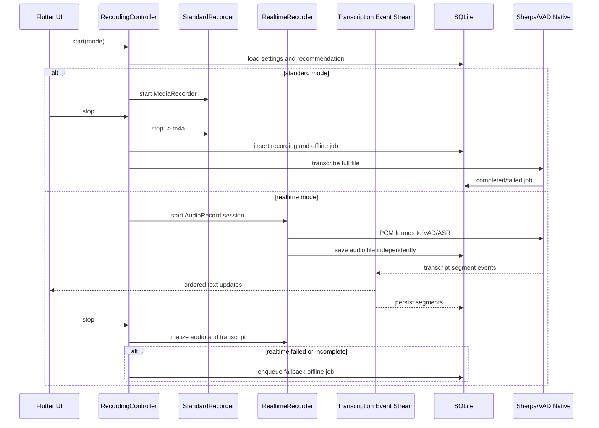
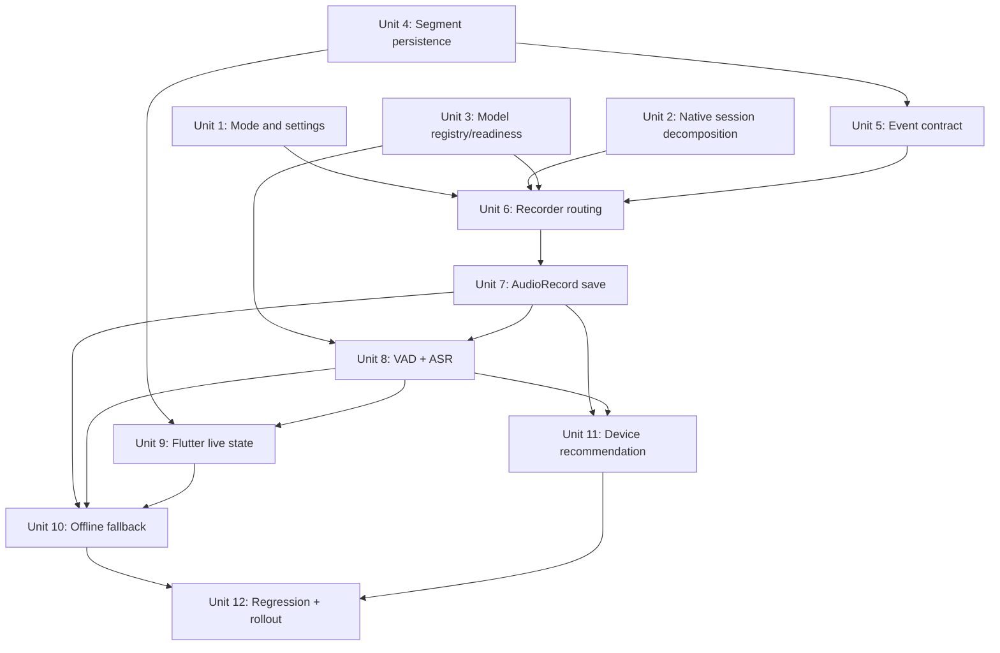

# feat: Add dual transcription pipeline

## Overview

Add a dual recording/transcription architecture that keeps the current stable offline flow as the default while introducing an opt-in realtime transcription flow for capable devices.

The implementation should preserve the existing Android real path:

```text
MediaRecorder -> m4a -> wav(16k mono) -> Sherpa OfflineRecognizer -> full transcript
```

and add a separate realtime path:

```text
AudioRecord PCM -> VAD -> ASR segment processor -> EventChannel -> Flutter transcript segments
                       -> audio encoder -> saved recording file
```

The realtime path must never compromise recording reliability. Runtime failures in VAD, ASR, or event delivery should degrade to "continue recording, transcribe after stop."

## Problem Frame

The current project already has a working local offline transcription chain, documented in `README.md` and verified in `docs/REAL_DEVICE_REGRESSION_MATRIX.md`. That chain is stable for mobile devices because it records first and computes later. It does not provide recording-time text feedback, and long recordings delay transcription until the user stops.

The product needs both behaviors:

- Users on low-power devices, long sessions, or no realtime need should keep the stable offline mode.
- Users who want meeting captions or immediate text feedback should be able to opt into realtime transcription when the device can handle it.

## Requirements Trace

- R1. Preserve the existing standard offline recording/transcription behavior and keep it the default.
- R2. Add a user-visible recording mode choice: standard, realtime, and optionally automatic recommendation.
- R3. Device capability checks should recommend a mode, not permanently override user choice.
- R4. Realtime transcription must save the full audio file independently from ASR success.
- R5. Realtime ASR failures must degrade to offline transcription after stop.
- R6. Realtime output must be represented as ordered transcript segments with timestamps.
- R7. Flutter should receive realtime text through structured events, not raw PCM.
- R8. Existing task states and retry behavior must remain compatible.
- R9. The rollout must include unit tests, contract checks, and real-device regression coverage.
- R10. Existing model assets and UI model options must be represented through an explicit model registry/readiness layer so unsupported streaming choices are not exposed as working capabilities.
- R11. Current native recorder/transcription logic should be decomposed before adding realtime mode, so standard behavior remains testable and unchanged.
- R12. Realtime mode must define and test pause, resume, stop, lifecycle interruption, background, lock-screen, permission-loss, and audio-focus-loss behavior.
- R13. Realtime audio saving must handle disk-full, encoder failure, muxer/finalize failure, temporary files, and crash-after-temp-file recovery without creating false-success recordings.
- R14. Realtime segments must use a stable recording timeline across pause/resume, VAD boundaries, out-of-order events, partial/final replacement, and offline fallback alignment.
- R15. Realtime rollout must use a fixed test-audio set to measure recognition quality, readability, VAD behavior, RTF, and file-save reliability.
- R16. Punctuation and denoise must be represented as explicit readiness-gated capabilities; they must not be shown as working realtime features until API, accuracy, and mobile performance are verified.

## Scope Boundaries

- Do not implement PC-side transcription, LAN transfer, Bluetooth transfer, or cloud transcription.
- Do not implement Android system-audio capture in this plan.
- Do not implement speaker diarization, AI summary, realtime translation, or cloud sync.
- Do not replace the current standard `MediaRecorder` path while adding realtime mode.
- Do not assume Sherpa streaming support until the installed AAR and model assets are verified.
- Do not promise long-running background or lock-screen realtime transcription in the first release unless a foreground-service path is explicitly designed and passes real-device validation.

### Deferred to Separate Tasks

- PC offline transcription sync: future plan scoped to mobile-PC transfer.
- Cloud storage and account sync: future privacy/storage plan.
- System audio/internal recording: future Android `MediaProjection` plan.
- Speaker diarization and AI summaries: future content intelligence plans.
- Foreground-service background realtime recording: future Android lifecycle/release plan if product requires locked-screen or long-running background realtime sessions.

## Context & Research

### Relevant Code and Patterns

- `lib/features/recording/controller/recording_controller.dart` owns the recording lifecycle, permission check, interruption handling handoff, and post-stop transcription trigger.
- `lib/features/recording/engine/recorder_port.dart` defines the current recorder abstraction.
- `lib/features/recording/engine/android_recorder_engine.dart` wraps the Android `MethodChannel`.
- `lib/features/transcription/service/transcription_port.dart` defines the current full-file transcription abstraction.
- `lib/features/transcription/repository/transcription_jobs_repository.dart` stores job status, result text, and retry state.
- `lib/data/sqlite/app_database.dart` owns local schema migrations.
- `android/app/src/main/kotlin/com/voice2text/app/MainActivity.kt` currently combines recorder and transcription channel handling.
- `android/app/src/main/kotlin/com/voice2text/app/contracts/AudioContract.kt` and `lib/app/contracts/audio_contract.dart` must remain synchronized through `tool/check_audio_contract.sh`.
- `android/app/src/main/kotlin/com/voice2text/app/transcription/RealSherpaTranscriptionEngine.kt` is the current offline Sherpa integration.
- `docs/REAL_DEVICE_REGRESSION_MATRIX.md` is the existing real-device acceptance baseline.
- `docs/architecture/dual-transcription-pipeline.md` is the companion technical design for this plan.
- `android/app/src/main/kotlin/com/voice2text/app/transcription/AudioTranscoder.kt` already contains useful PCM normalization helpers, but its current full-buffer design should not be reused as the realtime audio writer.
- `lib/features/recording/engine/fake_recorder_engine.dart` and `lib/features/transcription/service/fake_transcription_service.dart` are useful test doubles and should be mirrored for realtime event/controller tests.
- `lib/features/shared/service/build_info_service.dart` and `tool/run_android_smoke.sh` provide the existing real-device evidence pattern and should be reused for realtime regression provenance.
- `lib/features/records/repository/recordings_repository.dart` and `lib/features/home/home_page.dart` already distinguish soft delete from permanent delete; segment lifecycle should attach to permanent delete, not ordinary soft delete.
- Existing `RecordingController.handleLifecycleInterruption()` behavior should anchor realtime lifecycle decisions before any foreground-service expansion.
- Current standard recorder pause/resume duration semantics should be preserved when defining the realtime segment timeline.

### Institutional Learnings

- No `docs/solutions/` entries exist in this repo at plan time.
- Existing product docs emphasize local-first privacy and recording reliability: `docs/QUARK_RECORDING_MINUTES_UI_DESIGN_BRIEF.md` and `docs/QUARK_RECORDING_MINUTES_EXTENSIBLE_UI_DESIGN_BRIEF.md`.

### External References

- No new external research was required for this planning pass. The plan is grounded in current repo implementation and prior review of Meetily's local realtime architecture.

## Key Technical Decisions

- Keep standard offline mode as default: mobile reliability and existing regression evidence are stronger than realtime convenience.
- Decompose native session responsibilities before adding realtime mode: `MainActivity` currently owns recorder commands, build info, and transcription dispatch, which makes dual-path testing harder.
- Add model registry/readiness before relying on model choices: the settings UI currently names `sherpa-streaming-zh`, but Android maps all model ids to `paraformer-zh`.
- Build realtime mode as a separate native path: `AudioRecord` is needed for PCM frames, while standard mode should continue using `MediaRecorder`.
- Do not rely on simultaneous long-running `MediaRecorder` and `AudioRecord` on the same microphone: device compatibility is risky.
- First realtime implementation should target VAD-segmented near-realtime output before true streaming ASR: this reduces partial-result UI complexity and Sherpa API uncertainty.
- Use `EventChannel` for realtime text/status events: polling and raw PCM across Flutter are inappropriate for realtime transcription.
- Persist transcript segments separately from `transcription_jobs.result_text`: realtime output needs timestamps, ordering, and partial/final state.
- Treat realtime ASR as optional work attached to a recording session: audio saving has higher priority than text generation.
- Delay strong device recommendation until realtime save and ASR paths produce real benchmark data; early capability checks should be advisory and conservative.
- Treat realtime lifecycle and timestamps as recorder-contract behavior, not UI-only behavior: pause/resume/interruption must produce deterministic duration and segment ordering.
- Use temporary-to-final file state for realtime recordings: only finalized, playable, positive-duration files should create successful recording rows.
- Validate realtime ASR with a fixed test-audio set before using benchmark results for recommendation.
- Keep punctuation and denoise behind readiness gates; asset presence is not enough to expose them as working features.
- Keep first-release background behavior conservative: interruption-save first, foreground service only after separate validation.

## Open Questions

### Resolved During Planning

- Should both flows coexist? Yes. The standard flow remains default and realtime is opt-in/recommended.
- Should device capability auto-select the mode? It should recommend and warn, not remove user control.
- Should PC transcription be included now? No. It remains out of scope for this plan.

### Deferred to Implementation

- Whether the bundled `sherpa-onnx.aar` exposes a usable streaming recognizer API: requires inspecting the AAR/API during implementation.
- Whether the current `paraformer-zh` model performs well on short VAD segments: requires benchmark audio and real-device testing.
- Final VAD threshold values: require device/audio trials.
- Whether realtime mode saves directly to `m4a` during recording or temporarily saves `wav/pcm` before post-stop conversion: depends on `MediaCodec`/`MediaMuxer` implementation reliability.
- Whether long-running background realtime recording requires an Android foreground service: depends on intended background behavior and real-device regression.
- Whether pause should fully stop writing frames or write silence for timeline continuity: first implementation should match standard-mode duration semantics unless implementation proves a better user-visible model.
- Which fixed test audio files and reference transcripts should be maintained in-repo or as external QA artifacts: depends on licensing and repository size.
- Whether punctuation and denoise can run during realtime, only after final segments, or only after offline fallback: depends on native API availability and measured RTF/memory cost.

## High-Level Technical Design

> *This illustrates the intended approach and is directional guidance for review, not implementation specification. The implementing agent should treat it as context, not code to reproduce.*



## Implementation Dependency Map



## Implementation Units

- [ ] **Unit 1: Mode and settings foundation**

**Goal:** Add explicit recording/transcription mode settings without changing the current default behavior.

**Requirements:** R1, R2, R3

**Dependencies:** None

**Files:**
- Modify: `lib/features/settings/model/app_settings.dart`
- Modify: `lib/features/settings/repository/app_settings_repository.dart`
- Modify: `lib/features/settings/settings_page.dart`
- Modify: `lib/data/sqlite/app_database.dart`
- Test: `test/features/settings/app_settings_repository_test.dart`
- Test: `test/features/settings/app_settings_test.dart`

**Approach:**
- Add a stable enum-like setting for recording mode: standard, realtime, auto.
- Keep default mode as standard.
- Keep `autoTranscribe` semantics compatible with existing behavior.
- Add a database migration that preserves existing rows.
- Settings UI should follow Goo component guidance before implementation because it touches UI.

**Patterns to follow:**
- Existing `AppSettings.defaults()` and `AppSettingsRepository.load/save`.
- Existing schema versioned migrations in `AppDatabase`.
- Goo guidance from `../flutter-components/DESIGN.md` and `../flutter-components/DOC.md` before UI edits.

**Test scenarios:**
- Happy path: new database with no settings row loads defaults with standard mode and auto-transcribe enabled.
- Happy path: saving realtime mode persists and reloads the same mode.
- Edge case: existing database upgraded from version 8 gets the new mode column with standard default.
- Edge case: unknown stored mode string falls back to standard without crashing.
- Integration: settings page saves mode and does not change existing dark mode or model fields.

**Verification:**
- Existing standard recording path still starts with the same default settings.
- `tool/check_audio_contract.sh`, Flutter analyze, and Flutter tests pass.

- [ ] **Unit 2: Native session decomposition**

**Goal:** Split current Android recorder, transcription, and build-info responsibilities out of `MainActivity` before adding realtime mode.

**Requirements:** R1, R8, R11

**Dependencies:** None

**Files:**
- Modify: `android/app/src/main/kotlin/com/voice2text/app/MainActivity.kt`
- Create: `android/app/src/main/kotlin/com/voice2text/app/recording/StandardRecordingSession.kt`
- Create: `android/app/src/main/kotlin/com/voice2text/app/recording/RecordingSessionState.kt`
- Create: `android/app/src/main/kotlin/com/voice2text/app/build/BuildInfoProvider.kt`
- Modify: `android/app/src/main/kotlin/com/voice2text/app/transcription/TranscriptionEngineRouter.kt`
- Test: `android/app/src/test/kotlin/com/voice2text/app/recording/StandardRecordingSessionTest.kt`
- Test: `android/app/src/test/kotlin/com/voice2text/app/build/BuildInfoProviderTest.kt`

**Approach:**
- Preserve the existing `start/pause/resume/stop/getBuildInfo/transcribe` channel methods while moving their implementation into focused classes.
- Keep `MediaRecorder` behavior and returned payload shape unchanged.
- Make `MainActivity` a thin channel dispatcher so standard and realtime sessions can be tested independently.

**Execution note:** Add characterization coverage around current standard session behavior before changing native recorder structure.

**Patterns to follow:**
- Current `MainActivity` state transitions and error strings.
- Existing `BuildInfoService` expectation for `packageName`, `versionName`, and `lastUpdateTimeMs`.

**Test scenarios:**
- Happy path: standard session start/stop returns a non-empty path and positive duration.
- Happy path: pause/resume duration excludes paused time consistently with current behavior.
- Edge case: start while recording returns the same invalid-state error semantics.
- Error path: stop without recording returns invalid-state semantics.
- Integration: `AndroidRecorderEngine` does not need Dart-side changes after native decomposition.

**Verification:**
- Current standard-mode real-device scenarios remain unchanged after the refactor.

- [ ] **Unit 3: Model registry and readiness layer**

**Goal:** Represent available model assets and capabilities explicitly before realtime mode depends on them.

**Requirements:** R1, R5, R10, R16

**Dependencies:** Unit 2

**Files:**
- Create: `lib/features/settings/model/transcription_model_descriptor.dart`
- Modify: `lib/features/settings/settings_page.dart`
- Modify: `android/app/src/main/kotlin/com/voice2text/app/transcription/RealSherpaTranscriptionEngine.kt`
- Create: `android/app/src/main/kotlin/com/voice2text/app/transcription/ModelAssetManager.kt`
- Create: `android/app/src/main/kotlin/com/voice2text/app/transcription/ModelReadinessChecker.kt`
- Create: `android/app/src/main/kotlin/com/voice2text/app/transcription/TranscriptionModelRegistry.kt`
- Test: `test/features/settings/transcription_model_descriptor_test.dart`
- Test: `android/app/src/test/kotlin/com/voice2text/app/transcription/ModelReadinessCheckerTest.kt`
- Test: `android/app/src/test/kotlin/com/voice2text/app/transcription/TranscriptionModelRegistryTest.kt`

**Approach:**
- Replace hard-coded UI assumptions with descriptors that distinguish available, experimental, unavailable, offline, realtime-capable, VAD, punctuation, and denoise capabilities.
- Keep `paraformer-zh` as the only confirmed offline model until implementation verifies otherwise.
- Treat existing `sherpa-streaming-zh` UI option as unavailable or experimental until the AAR and model assets prove support.
- Move model asset extraction/readiness logic out of `RealSherpaTranscriptionEngine` so standard and realtime paths share it.
- Surface readiness failures before ASR starts; do not block "record only" flows.
- Treat punctuation and denoise as separate capabilities from ASR and VAD; asset presence alone should not make them selectable as working realtime features.

**Patterns to follow:**
- Existing `RealSherpaTranscriptionEngine.ensureModelExtracted()` and asset checks.
- Existing `pubspec.yaml` Sherpa asset list.

**Test scenarios:**
- Happy path: `paraformer-zh` reports offline-ready when zip, model, and tokens are present.
- Happy path: model descriptors hide or mark unsupported streaming models.
- Edge case: missing VAD asset makes realtime ASR unavailable but standard offline remains available.
- Edge case: punctuation or denoise assets exist but native API is unavailable; descriptor marks the capability unsupported or experimental.
- Error path: corrupted or empty extracted model triggers readiness failure with a user-safe reason.
- Integration: settings page does not allow selecting a model id that native registry cannot route.

**Verification:**
- Current offline transcribe still uses the same model files after registry extraction.
- UI no longer implies streaming support that native cannot provide.
- UI no longer implies punctuation or denoise support unless readiness confirms implementation and performance suitability.

- [ ] **Unit 4: Transcript segment persistence and data lifecycle**

**Goal:** Introduce durable realtime transcript segments while keeping full-text job results and current delete semantics compatible.

**Requirements:** R6, R8

**Dependencies:** Unit 1

**Files:**
- Modify: `lib/data/sqlite/app_database.dart`
- Create: `lib/features/transcription/model/transcript_segment_entity.dart`
- Create: `lib/features/transcription/repository/transcript_segments_repository.dart`
- Modify: `lib/features/transcription/model/transcription_job_entity.dart`
- Modify: `lib/features/transcription/repository/transcription_jobs_repository.dart`
- Modify: `lib/features/home/home_page.dart`
- Modify: `lib/features/records/repository/recordings_repository.dart`
- Test: `test/features/transcription/transcript_segments_repository_test.dart`
- Test: `test/features/transcription/transcription_jobs_repository_test.dart`
- Test: `test/features/records/recording_delete_lifecycle_test.dart`

**Approach:**
- Add `transcript_segments` table keyed by job or recording path.
- Extend jobs with mode/source/failure-stage fields if needed by realtime state display.
- Keep `result_text` as the canonical full text for standard offline jobs and final merged realtime text.
- Realtime segments should be append/update friendly and ordered by `sequence_id`.
- Attach segment cleanup to permanent delete alongside current job cleanup; soft delete should preserve segments.

**Patterns to follow:**
- Existing repository style in `TranscriptionJobsRepository`.
- Existing migration style in `AppDatabase`.
- Current permanent-delete flow in `HomePage` that already removes associated transcription jobs.

**Test scenarios:**
- Happy path: insert segments for a job and list them ordered by sequence.
- Happy path: merge final segments into a full transcript string for completed jobs.
- Edge case: duplicate sequence update replaces or updates the previous segment deterministically.
- Edge case: soft delete preserves related jobs and segments.
- Edge case: permanent delete removes related jobs and segments.
- Error path: invalid empty text segment is either rejected or stored only if marked as error/status event.

**Verification:**
- Existing transcription task list still displays completed/failed jobs.
- New segment repository can reconstruct ordered transcript text.

- [ ] **Unit 5: Realtime event contract and test doubles**

**Goal:** Add a structured native-to-Flutter realtime event channel and fake event stream for controller/UI tests.

**Requirements:** R6, R7, R8, R14

**Dependencies:** Unit 4

**Files:**
- Create: `lib/features/transcription/service/realtime_transcription_event.dart`
- Create: `lib/features/transcription/service/realtime_transcription_events_port.dart`
- Create: `lib/features/transcription/service/android_realtime_transcription_events.dart`
- Create: `lib/features/transcription/service/fake_realtime_transcription_events.dart`
- Modify: `lib/app/contracts/audio_contract.dart`
- Modify: `android/app/src/main/kotlin/com/voice2text/app/contracts/AudioContract.kt`
- Modify: `tool/check_audio_contract.sh`
- Modify: `android/app/src/main/kotlin/com/voice2text/app/MainActivity.kt`
- Create: `android/app/src/main/kotlin/com/voice2text/app/realtime/RealtimeTranscriptionEvent.kt`
- Test: `test/features/transcription/realtime_transcription_event_test.dart`
- Test: `test/features/transcription/fake_realtime_transcription_events_test.dart`
- Test: `android/app/src/test/kotlin/com/voice2text/app/realtime/RealtimeTranscriptionEventTest.kt`

**Approach:**
- Add an event channel name to the shared audio contract.
- Define event payload fields: type, recording path or session id, job id, sequence id, segment id if needed, text, start/end, final flag, confidence, warning/degradation reason.
- Flutter parses events into typed objects and ignores unknown event types safely.
- Native side should buffer or persist segments before emitting when possible, so UI disconnect does not lose content.
- Add a fake realtime stream patterned after `FakeRecorderEngine` and `FakeTranscriptionService`.
- Event timestamps must represent recording timeline positions, not Flutter receive time.

**Patterns to follow:**
- Existing Dart/Kotlin audio contract synchronization.
- Existing `AndroidTranscriptionService` method-channel error handling style.
- Existing fake recorder/transcription services for non-Android and widget tests.

**Test scenarios:**
- Happy path: segment payload parses into a final transcript segment.
- Happy path: fake event stream emits ordered segments for controller tests.
- Happy path: degradation payload parses into a non-fatal warning.
- Edge case: unknown event type is ignored or mapped to an unknown event without crashing.
- Edge case: out-of-order segment events parse successfully and remain sortable by sequence id.
- Error path: malformed payload does not crash the listener and surfaces a recoverable error.
- Integration: contract check fails if Dart and Kotlin event channel names drift.

**Verification:**
- Flutter can subscribe/unsubscribe cleanly.
- Standard offline transcription still works without subscribing to realtime events.

- [ ] **Unit 6: Recorder abstraction split and mode routing**

**Goal:** Route standard and realtime recording implementations behind a mode-aware controller boundary.

**Requirements:** R1, R2, R4, R5, R11, R12, R14

**Dependencies:** Units 1, 2, 3, 5

**Files:**
- Modify: `lib/features/recording/engine/recorder_port.dart`
- Create: `lib/features/recording/engine/realtime_recorder_port.dart`
- Modify: `lib/features/recording/engine/android_recorder_engine.dart`
- Create: `lib/features/recording/engine/android_realtime_recorder_engine.dart`
- Create: `lib/features/recording/engine/fake_realtime_recorder_engine.dart`
- Modify: `lib/features/recording/controller/recording_controller.dart`
- Modify: `lib/features/recording/recording_page.dart`
- Modify: `android/app/src/main/kotlin/com/voice2text/app/recording/StandardRecordingSession.kt`
- Create: `android/app/src/main/kotlin/com/voice2text/app/recording/RealtimeRecordingSession.kt`
- Test: `test/features/recording/recording_controller_mode_test.dart`
- Test: `test/features/recording/recording_controller_realtime_lifecycle_test.dart`
- Test: `test/features/recording/fake_realtime_recorder_engine_test.dart`
- Test: `android/app/src/test/kotlin/com/voice2text/app/recording/RecordingSessionRouterTest.kt`
- Test: `android/app/src/test/kotlin/com/voice2text/app/recording/RealtimeRecordingSessionLifecycleTest.kt`

**Approach:**
- Keep the standard recorder behavior intact.
- Route start/pause/resume/stop to the correct recorder based on resolved mode.
- Realtime recorder can initially be scaffolded to return unsupported/degraded while the rest of the app handles fallback.
- Mode routing should use model readiness first; device recommendation should not be required yet.
- Define realtime lifecycle policy for pause, resume, stop, lifecycle interruption, background, lock-screen, permission loss, and audio focus loss.
- Preserve standard-mode duration semantics where possible: paused time should not inflate recording duration or segment timestamps unless a deliberate later product decision changes that model.
- Treat background and lock-screen realtime behavior conservatively in the first release: interruption-save is acceptable, while long-running background realtime requires a later foreground-service decision.

**Patterns to follow:**
- Existing `RecorderPort`, `AndroidRecorderEngine`, and `FakeRecorderEngine`.
- Existing interruption handling in `RecordingController.handleLifecycleInterruption()`.

**Test scenarios:**
- Happy path: standard mode uses the existing recorder and creates offline job as before.
- Happy path: realtime mode starts realtime recorder when readiness allows it.
- Edge case: auto mode without benchmark data routes conservatively to standard.
- Edge case: realtime pause/resume keeps a single recording session, monotonic sequence ids, and duration that excludes paused time.
- Edge case: lifecycle interruption stops the active realtime recorder and saves if possible.
- Edge case: lock-screen/background transition follows the documented first-release policy rather than silently continuing with unknown reliability.
- Error path: realtime start returns unsupported; controller shows recoverable message and can fall back to standard.
- Error path: permission loss or audio focus loss stops capture, preserves completed segments, and reports a user-safe error.
- Integration: lifecycle interruption stops whichever recorder is active and saves if possible.

**Verification:**
- Existing R1-R6 standard regression scenarios still pass.
- Realtime unsupported state does not break standard mode.

- [ ] **Unit 7: Realtime native audio capture and reliable save**

**Goal:** Implement realtime-mode audio capture with `AudioRecord` and independent recording-file persistence.

**Requirements:** R4, R5, R9, R13, R14

**Dependencies:** Unit 6

**Files:**
- Create: `android/app/src/main/kotlin/com/voice2text/app/realtime/AudioRecordCapture.kt`
- Create: `android/app/src/main/kotlin/com/voice2text/app/realtime/PcmFrame.kt`
- Create: `android/app/src/main/kotlin/com/voice2text/app/realtime/RealtimeAudioFileWriter.kt`
- Create: `android/app/src/main/kotlin/com/voice2text/app/realtime/RealtimeRecordingFileRecovery.kt`
- Create: `android/app/src/main/kotlin/com/voice2text/app/realtime/PcmAudioNormalizer.kt`
- Modify: `android/app/src/main/kotlin/com/voice2text/app/transcription/AudioTranscoder.kt`
- Modify: `android/app/src/main/kotlin/com/voice2text/app/recording/RealtimeRecordingSession.kt`
- Test: `android/app/src/test/kotlin/com/voice2text/app/realtime/RealtimeAudioFileWriterTest.kt`
- Test: `android/app/src/test/kotlin/com/voice2text/app/realtime/RealtimeRecordingFileRecoveryTest.kt`
- Test: `android/app/src/test/kotlin/com/voice2text/app/realtime/AudioRecordCaptureTest.kt`
- Test: `android/app/src/test/kotlin/com/voice2text/app/realtime/PcmAudioNormalizerTest.kt`

**Approach:**
- Use `AudioRecord` as the single microphone capture source for realtime mode.
- Fan out PCM frames to the file writer and realtime processing queue.
- Reuse `AudioTranscoder` concepts for PCM decoding, mono conversion, resampling, and wav writing only after extracting streaming-safe helpers; do not reuse its current full-buffer flow for realtime capture.
- Prefer writing a normal playable recording artifact; decide during implementation whether first version writes `m4a` directly or writes temporary wav/pcm and transcodes after stop.
- Treat file-writer failure as critical and ASR failure as non-critical.
- Use an explicit temporary-to-final file state. A recording row should be created only after finalize succeeds, the file is readable, and duration is positive.
- Handle disk-full, encoder initialization failure, muxer write/finalize failure, and app crash with temporary files as distinct failure classes.
- On app startup, scan only the app-owned realtime temporary directory and either recover playable files or present a cleanup path; never scan arbitrary user paths.

**Patterns to follow:**
- Existing Android `AudioContract` constants for sample rate, bit rate, channel count, and extension.
- Existing `AudioTranscoder` PCM conversion helpers as a source of algorithmic behavior, not as a realtime implementation.

**Test scenarios:**
- Happy path: capture session writes non-empty audio file and returns duration/path.
- Happy path: pause/resume excludes paused time from duration consistently with standard mode.
- Edge case: very short recording stops without corrupting output.
- Edge case: resampling helper handles empty and mono 16k input without changing duration.
- Edge case: disk-full or write failure stops capture and does not create a successful recording row.
- Edge case: muxer finalize failure leaves diagnostic temp state but does not report success.
- Edge case: startup recovery finds an app-owned temp file and either finalizes it or marks it unrecoverable with a safe cleanup path.
- Error path: file writer failure stops the realtime session and reports save failure.
- Error path: ASR queue failure does not stop file writing.
- Integration: realtime stop returns a recording result usable by existing recordings repository.

**Verification:**
- Realtime mode can record and save audio on a real Android device before ASR is enabled.
- Saved file can be played or accepted by the existing transcode/offline path.

- [ ] **Unit 8: VAD and realtime ASR segment processor**

**Goal:** Add realtime text generation from PCM frames using VAD-segmented near-realtime recognition, with a path to true streaming later.

**Requirements:** R4, R5, R6, R7, R10, R14, R15, R16

**Dependencies:** Units 3, 5, 7

**Files:**
- Create: `android/app/src/main/kotlin/com/voice2text/app/realtime/VadSegmenter.kt`
- Create: `android/app/src/main/kotlin/com/voice2text/app/realtime/RealtimeAsrProcessor.kt`
- Create: `android/app/src/main/kotlin/com/voice2text/app/realtime/RealtimeDegradationPolicy.kt`
- Modify: `android/app/src/main/kotlin/com/voice2text/app/transcription/RealSherpaTranscriptionEngine.kt`
- Modify: `android/app/src/main/kotlin/com/voice2text/app/recording/RealtimeRecordingSession.kt`
- Test: `android/app/src/test/kotlin/com/voice2text/app/realtime/VadSegmenterTest.kt`
- Test: `android/app/src/test/kotlin/com/voice2text/app/realtime/RealtimeAsrProcessorTest.kt`
- Test: `android/app/src/test/kotlin/com/voice2text/app/realtime/RealtimeDegradationPolicyTest.kt`

**Approach:**
- First implementation should produce final segments after VAD-detected speech boundaries.
- Use `ModelReadinessChecker` to gate VAD and ASR startup.
- Reuse or wrap Sherpa offline recognizer for short segments only after confirming accuracy/performance.
- If Sherpa online recognizer is available, isolate it behind the same processor boundary for a later upgrade.
- Queue ASR work serially to preserve order.
- Emit degradation events when queue length, model errors, or processing time exceed thresholds.
- Derive segment `startMs/endMs` from PCM frame position or native capture timestamps, not from event delivery time.
- Keep punctuation and denoise out of the realtime critical path until readiness and benchmark data prove they fit mobile latency and thermal constraints.
- Validate VAD thresholds and short-segment ASR behavior against the fixed test-audio set before treating the model as realtime-recommended.

**Patterns to follow:**
- Current `RealSherpaTranscriptionEngine` recognizer setup after it has been refactored to use `ModelAssetManager`.
- Existing Sherpa assets declared in `pubspec.yaml`.
- Meetily-inspired architecture concept: VAD segment queue, ordered worker, transcript event emission; do not copy implementation.
- Fixed QA audio manifest introduced in Unit 12 for silence, noise, short speech, long continuous speech, pause/resume, and meeting-like samples.

**Test scenarios:**
- Happy path: speech samples produce one final segment with start/end timestamps.
- Happy path: silence-only input produces no transcript segment.
- Happy path: fixed short-speech sample produces stable segment count and non-empty readable text.
- Edge case: missing VAD asset degrades realtime ASR without stopping audio recording.
- Edge case: long continuous speech is split at safe boundaries.
- Edge case: very short speech below threshold is skipped or merged according to policy.
- Edge case: pause/resume sample keeps timestamps on the recording effective-duration timeline.
- Edge case: punctuation/denoise readiness is false; ASR still runs without claiming those enhancements.
- Error path: ASR exception emits degradation and allows recording to continue.
- Error path: queue backlog triggers realtime degradation and stops accepting new ASR work.
- Integration: emitted segments are persisted and sent through the event channel in order.

**Verification:**
- On-device realtime transcription produces visible text for a short recording.
- Turning off or breaking ASR still preserves the audio file and creates fallback offline job.

- [ ] **Unit 9: Flutter realtime transcript state and UI integration**

**Goal:** Display and persist realtime transcript segments during recording without disrupting the existing recording controls.

**Requirements:** R2, R6, R7, R8, R12, R14

**Dependencies:** Units 4, 5, 6, 8

**Files:**
- Modify: `lib/features/recording/controller/recording_controller.dart`
- Modify: `lib/features/recording/recording_page.dart`
- Create: `lib/features/recording/model/live_transcript_state.dart`
- Modify: `lib/features/transcription/transcription_page.dart`
- Modify: `lib/features/records/widgets/recording_details_sheet.dart`
- Test: `test/features/recording/live_transcript_state_test.dart`
- Test: `test/features/recording/recording_controller_realtime_events_test.dart`
- Test: `test/widget/recording_page_realtime_test.dart`

**Approach:**
- Maintain a live transcript state keyed by sequence id.
- Display compact realtime text only when realtime mode is active.
- Surface degradation as a non-fatal status: recording continues, offline transcription will run after stop.
- On stop, finalize merged text and update the transcription job.
- Use fake realtime event stream tests before depending on real Android audio.
- Pause state should freeze live transcript updates except for already-finalized segments; resume should continue the same transcript timeline.
- Partial/final updates, if introduced later, should replace the same segment rather than append duplicate text.
- UI edits must follow Goo component guidance from the sibling `flutter-components` docs before implementation.

**Patterns to follow:**
- Existing `RecordingController` listener-driven state updates.
- Existing `TranscriptionPage` status labels.
- Existing recording page interruption notice behavior.

**Test scenarios:**
- Happy path: incoming segment appears in the recording page in sequence order.
- Happy path: fake realtime events drive controller state without Android.
- Happy path: final segments merge into a readable transcript after stop.
- Edge case: duplicate sequence id updates the same segment instead of duplicating text.
- Edge case: out-of-order events render in sequence order.
- Edge case: pause/resume displays a continuous transcript for one recording without resetting sequence order.
- Edge case: fallback offline result replaces or supplements the final display without deleting realtime segment provenance.
- Error path: degradation event shows non-fatal status and keeps recording controls enabled.
- Integration: realtime completed recording appears in records/details with latest transcript.

**Verification:**
- Realtime UI updates without jank in a short manual recording.
- Standard mode UI remains unchanged except for the explicit mode indicator/setting.

- [ ] **Unit 10: Fallback offline finalization**

**Goal:** Ensure realtime mode always ends with a coherent saved recording and transcription outcome.

**Requirements:** R4, R5, R6, R8, R13, R14

**Dependencies:** Units 4, 7, 8, 9

**Files:**
- Modify: `lib/features/recording/controller/recording_controller.dart`
- Modify: `lib/features/transcription/repository/transcription_jobs_repository.dart`
- Modify: `android/app/src/main/kotlin/com/voice2text/app/recording/RealtimeRecordingSession.kt`
- Modify: `android/app/src/main/kotlin/com/voice2text/app/transcription/TranscriptionEngineRouter.kt`
- Test: `test/features/recording/recording_controller_realtime_fallback_test.dart`
- Test: `test/features/transcription/transcription_jobs_repository_test.dart`
- Test: `android/app/src/test/kotlin/com/voice2text/app/recording/RealtimeRecordingSessionFallbackTest.kt`

**Approach:**
- Define finalization rules:
  - realtime success with final segments: mark job completed and store merged text.
  - realtime degraded but audio saved: enqueue `realtime_fallback_offline`.
  - realtime produced partial segments and offline succeeds: prefer offline full text while preserving segments as provenance.
  - realtime file save failed: mark recording save failure; do not claim fallback can run.
- Fallback jobs should reference the finalized playable file only. Temporary, zero-duration, or failed-finalize files must not enqueue offline transcription.
- Preserve realtime segment timestamps and source when offline fallback result becomes the displayed full transcript.
- Keep retry behavior available for failed fallback jobs.

**Patterns to follow:**
- Existing `RecordingController.stop()` job creation and status update.
- Existing `TranscriptionPage._retryJob()`.

**Test scenarios:**
- Happy path: realtime success completes job without extra offline work.
- Happy path: realtime degraded enqueues offline fallback after stop.
- Edge case: realtime has segments but final merge is empty; fallback offline is created.
- Edge case: realtime has ordered segments and offline fallback succeeds; UI can show offline full text while retaining realtime segment provenance.
- Error path: file save failed or finalize failed; no offline fallback job is created because there is no reliable audio artifact.
- Error path: offline fallback fails and job becomes failed with retry enabled.
- Integration: retry of fallback job uses saved audio path and updates the same job/result coherently.

**Verification:**
- Every stopped realtime recording ends in one of: completed transcript, failed retryable transcript, or explicit save failure.

- [ ] **Unit 11: Device capability and recommendation service**

**Goal:** Recommend standard or realtime mode using real runtime and benchmark signals after realtime save/ASR paths exist.

**Requirements:** R2, R3, R5, R9, R15

**Dependencies:** Units 7, 8, 10

**Files:**
- Create: `lib/features/recording/model/device_transcription_capability.dart`
- Create: `lib/features/recording/service/device_transcription_capability_service.dart`
- Modify: `lib/features/recording/controller/recording_controller.dart`
- Modify: `android/app/src/main/kotlin/com/voice2text/app/MainActivity.kt`
- Create: `android/app/src/main/kotlin/com/voice2text/app/capability/DeviceCapabilityProvider.kt`
- Create: `android/app/src/main/kotlin/com/voice2text/app/capability/RealtimeBenchmarkRunner.kt`
- Test: `test/features/recording/device_transcription_capability_service_test.dart`
- Test: `test/features/recording/recording_controller_mode_test.dart`
- Test: `android/app/src/test/kotlin/com/voice2text/app/capability/DeviceCapabilityProviderTest.kt`
- Test: `android/app/src/test/kotlin/com/voice2text/app/capability/RealtimeBenchmarkRunnerTest.kt`

**Approach:**
- Add native capability facts: API level, ABI, core count, memory class or available memory where safe, battery saver, and thermal status when available.
- Use realtime path measurements when available: file-save reliability, ASR RTF, queue backlog, and degradation history.
- Use fixed test-audio benchmark results where available, not only hardware specs.
- Store recommendation as advisory state in Flutter; mode selection remains user-controlled.
- If mode is auto, resolve to standard when capability is unknown, benchmark is missing, or recent realtime degradation was severe.

**Patterns to follow:**
- Existing `BuildInfoService` and `getBuildInfo` method-channel style.
- Existing `RecordingController.reloadSettings()` flow.
- Realtime runtime evidence produced by Units 7-10.

**Test scenarios:**
- Happy path: strong capability plus good benchmark returns realtime recommendation when auto mode is selected.
- Happy path: weak or unknown capability resolves to standard.
- Edge case: native capability method throws; controller still starts standard mode.
- Edge case: missing benchmark data keeps recommendation conservative.
- Edge case: benchmark has good RTF but file-save reliability failed; recommendation stays standard.
- Error path: battery saver or severe thermal state forces standard recommendation.
- Integration: auto mode resolution does not alter the persisted user setting.

**Verification:**
- Device recommendation is visible to the controller without changing standard-mode behavior.
- Realtime is recommended only after real save and ASR evidence exists.

- [ ] **Unit 12: Regression, benchmark, and rollout instrumentation**

**Goal:** Add the checks needed to keep both modes reliable across devices.

**Requirements:** R3, R5, R9, R12, R13, R15, R16

**Dependencies:** Units 1-11

**Files:**
- Modify: `docs/REAL_DEVICE_REGRESSION_MATRIX.md`
- Create: `docs/REALTIME_TRANSCRIPTION_REGRESSION_MATRIX.md`
- Create: `docs/qa/realtime_test_audio_manifest.md`
- Modify: `README.md`
- Modify: `tool/dev_check.sh`
- Modify: `tool/run_android_smoke.sh`
- Modify: `tool/check_transcribe_log.sh`
- Create: `tool/check_realtime_transcription_log.sh`
- Test: `test/features/recording/device_transcription_capability_service_test.dart`

**Approach:**
- Keep the existing standard-mode regression matrix and add realtime-specific scenarios.
- Add log markers for mode selection, realtime start, VAD segment count, ASR latency, queue backlog, degradation, file save success, fallback job creation, and build info.
- Keep logs privacy-safe: log durations, counts, modes, status, and error categories, but never transcript text or raw audio-derived content.
- Add a small manual benchmark procedure using known short recordings.
- Define a fixed test-audio manifest with categories: short Mandarin speech, silence-only, noisy speech, long continuous speech, pause/resume sample, and meeting-like multi-speaker sample. Keep large audio binaries outside the repo unless licensing and size are explicitly accepted; the manifest should record source, duration, reference text availability, and expected use.
- Record recognition quality as readable evidence: transcript presence, obvious deletion/insertion issues, optional CER/WER when reference text exists, punctuation state, denoise state, VAD segment count, RTF, and degradation reason.
- Add lifecycle and file-recovery regression cases: pause/resume, interruption-save, background/lock-screen first-release behavior, disk-full or simulated writer failure, muxer finalize failure, and temp-file recovery.
- Document recommended rollout: standard default, realtime opt-in, auto recommendation only after enough device data.
- Add explicit device acceptance tiers: "standard only", "realtime allowed", and "realtime recommended" based on observed RTF, save reliability, and thermal behavior.

**Patterns to follow:**
- Existing `tool/check_transcribe_log.sh`.
- Existing `tool/run_android_smoke.sh`.
- Existing `BuildInfoFooter` and `BuildInfoService` as provenance evidence.
- Existing `docs/REAL_DEVICE_REGRESSION_MATRIX.md`.
- Existing README command style.
- New QA audio manifest should reference reproducible samples without committing private recordings or transcript content from real users.

**Test scenarios:**
- Happy path: log checker finds realtime segment and file save evidence.
- Happy path: log checker finds degradation plus fallback evidence.
- Happy path: fixed test-audio matrix records segment count, RTF, readability result, punctuation state, and denoise state.
- Edge case: standard-mode logs still pass the existing checker.
- Edge case: lifecycle regression records pause/resume and interruption-save outcomes without transcript text.
- Edge case: simulated disk/finalize failure records save failure and no false-success recording.
- Edge case: privacy-safe log check rejects transcript-like payload logging if such markers are introduced.
- Integration: `tool/dev_check.sh` keeps the standard checks and optionally documents realtime manual checks without requiring a connected device.

**Verification:**
- Documentation includes clear PASS/FAIL criteria for both modes.
- Realtime rollout has observable performance and failure signals.
- Fixed-audio validation can be repeated without depending on private user recordings.

## System-Wide Impact

- **Interaction graph:** Recording mode now affects settings, controller routing, native recorder session, transcription jobs, transcript segment persistence, and record details.
- **Error propagation:** Standard recorder errors remain blocking; realtime ASR/VAD errors are non-blocking degradation events; realtime file-save errors are blocking.
- **State lifecycle risks:** Realtime mode introduces partial segment persistence, event-channel lifecycle, queue shutdown, and fallback job finalization.
- **Realtime lifecycle risks:** Pause, resume, lifecycle interruption, background transition, lock-screen behavior, permission loss, and audio-focus loss must share one documented state policy across Flutter and Android.
- **File recovery risks:** Temporary realtime files, failed muxer finalize, disk-full writes, and startup recovery must not create successful recording rows unless the audio artifact is playable and has positive duration.
- **Timeline consistency:** Segment ordering and timestamps must be based on the recording timeline, not event delivery timing, and must stay coherent across pause/resume and offline fallback.
- **API surface parity:** Dart and Kotlin audio contracts must remain synchronized; `tool/check_audio_contract.sh` should cover new event channel constants.
- **Integration coverage:** Unit tests alone will not prove mobile audio reliability; real-device regression is mandatory for both standard and realtime modes.
- **Privacy and logs:** Realtime instrumentation must not log transcript text, raw samples, user file names containing sensitive content, or full local paths when a shorter job/session id is enough.
- **Performance monitoring:** Realtime mode needs observable queue length, segment duration, ASR latency, RTF, degradation reason, and file-save finalization status.
- **Recognition quality evidence:** A fixed test-audio manifest is needed so VAD tuning, ASR accuracy, punctuation, denoise, and recommendation decisions are repeatable.
- **Data lifecycle:** Segment rows must be deleted or soft-deleted consistently with their parent recording/job to avoid orphaned transcript data.
- **Unchanged invariants:** Standard mode default, existing `m4a/aac @16kHz mono` output contract, offline retry behavior, and current privacy-first local processing remain intact.

## Alternative Approaches Considered

- **Replace standard recording with realtime-only:** Rejected because mobile reliability, low-end devices, and no-realtime users require a stable default.
- **Run MediaRecorder and AudioRecord together:** Rejected as the primary design because microphone multi-client behavior is inconsistent across Android devices.
- **Implement true streaming ASR first:** Deferred because current AAR/model support must be verified and partial/final UI complexity is higher.
- **Store realtime segments only as JSON in `result_text`:** Rejected for long-term use because playback sync, editing, ordering, and retries need structured rows.

## Success Metrics

- Standard-mode real-device matrix remains PASS.
- Realtime mode records 10 minutes without losing the audio file.
- Realtime ASR degradation does not crash the app and produces an offline fallback job.
- Realtime segment ordering is deterministic across pause/resume and stop.
- Realtime pause/resume and lifecycle interruption produce coherent duration, timestamps, and saved-recording state.
- Disk-full, writer failure, and finalize failure do not produce false-success recordings.
- Fixed test-audio runs produce recorded RTF, segment count, readability, punctuation state, denoise state, and degradation evidence.
- Device auto recommendation chooses standard for weak/unknown capability.
- Median realtime ASR RTF on target supported devices is below 1.0.
- User can manually override recommendation.

## Risk Analysis & Mitigation

| Risk | Likelihood | Impact | Mitigation |
|---|---|---|---|
| Realtime ASR causes CPU spikes or thermal throttling | High | High | VAD first, queue limits, RTF monitoring, degradation to offline |
| Realtime mode corrupts or loses audio file | Medium | Critical | Treat file writer as critical path; test save before enabling ASR; fallback cannot mask save failure |
| Realtime save reports success for a broken temp/finalized file | Medium | Critical | Use temp-to-final state, positive-duration/playability checks, and startup recovery tests |
| Pause/resume creates mismatched transcript timestamps | Medium | High | Define recording-effective-time semantics and cover pause/resume in Unit 6/8/12 tests |
| Short VAD segments reduce recognition accuracy | Medium | Medium | Tune min/max segment length; benchmark current Paraformer; consider streaming model later |
| EventChannel disconnect loses UI updates | Medium | Medium | Persist native/Flutter segments; reload history from database |
| Schema migration breaks existing users | Medium | High | Add repository tests for upgrade/defaults; keep old `result_text` behavior |
| UI becomes cluttered during recording | Medium | Medium | Keep realtime transcript compact and optional; follow Goo UI guidance |
| Background recording behavior differs by device | Medium | High | Keep current interruption-save behavior first; evaluate foreground service separately before promising long background realtime sessions |
| Punctuation or denoise is exposed before it works reliably | Medium | Medium | Gate with model readiness and fixed-audio performance evidence |
| Logs accidentally include transcript or audio-derived content | Medium | High | Define privacy-safe logging fields in Unit 12 and test log checkers against redacted output |
| Segment orphaning after delete or retry | Medium | Medium | Add repository delete/update tests and keep segment lifecycle tied to recording/job lifecycle |
| Streaming model appears selectable before it works | Medium | High | Add model registry/readiness before realtime UI routing; hide or mark unsupported models |
| MainActivity becomes harder to maintain as channels grow | High | Medium | Decompose native sessions before realtime work |
| Implementation touches too many layers at once | High | High | Land units incrementally: settings, data, event contract, recorder, ASR, UI, rollout |

## Phased Delivery

### Phase 1: Safe foundations

- Unit 1: Mode and settings foundation
- Unit 2: Native session decomposition
- Unit 3: Model registry and readiness layer
- Unit 4: Transcript segment persistence and data lifecycle
- Unit 5: Realtime event contract and test doubles

Exit criteria: Standard mode still passes current checks; native code is decomposed; schema, model readiness, and contracts are ready for realtime events.

### Phase 2: Realtime recording without ASR risk

- Unit 6: Recorder abstraction split and mode routing
- Unit 7: Realtime native audio capture and reliable save

Exit criteria: Realtime mode can save audio on-device, lifecycle behavior is defined, file-save failures do not produce false-success recordings, and standard mode is unaffected.

### Phase 3: Realtime text and fallback

- Unit 8: VAD and realtime ASR segment processor
- Unit 9: Flutter realtime transcript state and UI integration
- Unit 10: Fallback offline finalization

Exit criteria: Realtime text appears during recording, timestamps remain coherent across pause/resume, and failure always degrades to saved audio plus offline retry where possible.

### Phase 4: Recommendation, hardening, and rollout

- Unit 11: Device capability and recommendation service
- Unit 12: Regression, benchmark, and rollout instrumentation

Exit criteria: Both regression matrices have PASS evidence on at least one real Android device, fixed-audio QA evidence exists, punctuation/denoise status is explicit, and realtime remains opt-in.

## Documentation / Operational Notes

- Update `README.md` to explain standard mode vs realtime mode and when to use each.
- Keep `docs/architecture/dual-transcription-pipeline.md` updated when implementation confirms or rejects streaming Sherpa support.
- Add realtime-specific real-device logs to a new regression matrix rather than replacing the current standard matrix.
- Add a fixed-audio QA manifest and keep private user recordings out of committed test artifacts.
- Document first-release background/lock-screen behavior clearly; do not imply foreground-service support until it is implemented and validated.
- Before editing UI, read `../flutter-components/DESIGN.md` and `../flutter-components/DOC.md` and use exported Goo components where applicable.

## Sources & References

- Technical design: `docs/architecture/dual-transcription-pipeline.md`
- Current implementation summary: `README.md`
- Existing Android real-device baseline: `docs/REAL_DEVICE_REGRESSION_MATRIX.md`
- Current recording controller: `lib/features/recording/controller/recording_controller.dart`
- Current recorder abstraction: `lib/features/recording/engine/recorder_port.dart`
- Current fake recorder: `lib/features/recording/engine/fake_recorder_engine.dart`
- Current fake transcription service: `lib/features/transcription/service/fake_transcription_service.dart`
- Current Android recorder bridge: `android/app/src/main/kotlin/com/voice2text/app/MainActivity.kt`
- Current offline Sherpa engine: `android/app/src/main/kotlin/com/voice2text/app/transcription/RealSherpaTranscriptionEngine.kt`
- Current native transcoder: `android/app/src/main/kotlin/com/voice2text/app/transcription/AudioTranscoder.kt`
- Current local schema: `lib/data/sqlite/app_database.dart`
- Current contract checker: `tool/check_audio_contract.sh`
- Current smoke/log tooling: `tool/run_android_smoke.sh`, `tool/check_transcribe_log.sh`
- Future QA audio manifest: `docs/qa/realtime_test_audio_manifest.md`
- Product context: `docs/QUARK_RECORDING_MINUTES_UI_DESIGN_BRIEF.md`, `docs/QUARK_RECORDING_MINUTES_EXTENSIBLE_UI_DESIGN_BRIEF.md`
