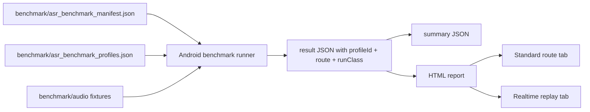

# feat: Add Paraformer parameter benchmark routes

## Overview

Build the benchmark lab around Paraformer parameter tuning instead of model comparison. The report should present two reader-facing tabs: standard route benchmark and realtime replay benchmark. Parameter search should separate cold-start, current-business-route, and warm steady-state measurements so model load cost does not obscure VAD and segmentation parameter effects.

## Problem Frame

The model choice has converged to Paraformer for both Chinese and English. The remaining question is which recording, VAD, segmentation, threading, and replay parameters give the best production tradeoff. Greedy single-parameter tuning can bias results because VAD, segment length, queue behavior, and model load strategy interact. The benchmark needs to support profile-based combinations and route-specific output that can later be expanded to larger exhaustive grids and真机复核.

## Requirements Trace

- R1. Keep the default model matrix Paraformer-only for Chinese and English.
- R2. Add parameter profile support so benchmark rows compare configuration combinations, not models.
- R3. Add standard route and realtime replay result categories for the report.
- R4. Preserve separate metrics for warm steady-state, cold-start, and current-business-route behavior.
- R5. Keep benchmark code and committed fixtures under `benchmark/`; keep downloaded models and raw run artifacts out of Git.
- R6. Keep emulator and physical-device execution paths available; physical-device validation is expected unless the run explicitly documents that no real device is connected or that the run is emulator-only.
- R7. Define smoke, coarse, and full matrix layers so future agents do not confuse default smoke with exhaustive testing.

## Scope Boundaries

- Do not silently skip true-device validation; if no real device is connected, record the run as emulator-only and keep the same commands usable with a physical `DEVICE_ID`.
- Do not change production app behavior outside debug-only benchmark support.
- Do not commit large generated matrix/result artifacts; provide a small committed smoke profile set and make coarse/full matrices reproducible through a generator.
- Do not add new model families back into the default matrix.

## Context & Research

### Relevant Code and Patterns

- `benchmark/android/src/debug/kotlin/com/voice2text/app/benchmark/AsrBenchmarkRunner.kt` already loads Paraformer once per model and decodes existing offline/VAD benchmark modes.
- `android/app/src/main/kotlin/com/voice2text/app/transcription/RealSherpaTranscriptionEngine.kt` currently creates and releases an `OfflineRecognizer` per `transcribe` call.
- `android/app/src/main/kotlin/com/voice2text/app/realtime/RealtimeAsrProcessor.kt` currently writes every realtime segment to a temporary wav and calls the transcription engine per segment.
- `android/app/src/main/kotlin/com/voice2text/app/realtime/VadSegmenter.kt` defines RMS VAD parameters: `speechThreshold`, `minSpeechMs`, `endSilenceMs`, and `maxSegmentMs`.
- `benchmark/generate_asr_benchmark_visual_report.py` already filters result JSON by the active manifest and writes a standalone HTML report.

### Institutional Learnings

- No relevant `docs/solutions/` learning was found in this workspace during planning.

### External References

- External research is not needed for implementation; this is a local benchmark harness change that follows existing app and benchmark code paths.

## Key Technical Decisions

- Use a separate `benchmark/asr_benchmark_profiles.json` file for parameter combinations so the model manifest stays focused on assets and archive URLs.
- Store `route`, `profileId`, `profileName`, `profile`, `runClass`, and load strategy fields on every result row so report filtering is stable.
- Treat warm steady-state as the primary ranking view, because it isolates parameter behavior from model load noise.
- Keep current-business-route style rows explicit instead of pretending they are the same as warm rows; the current realtime route may reload the recognizer per segment.
- Generate an HTML report with two tabs, one for standard route and one for realtime replay, with the same underlying JSON summary available for future dashboards.
- Generate larger coarse/full profile matrices from code instead of committing thousands of expanded profile rows.

## Open Questions

### Resolved During Planning

- Should true-device validation be part of the plan? Yes. It can be skipped only for a specific run when no physical device is connected or the operator explicitly says emulator-only.
- Should the report remain model comparison focused? No. Paraformer is fixed; profiles are the comparison unit.

### Resolved During Implementation

- Default committed matrix is smoke only: 4 profiles, 8 zh/en result rows.
- Coarse matrix is the practical emulator sweep: 89 profiles, 178 zh/en rows.
- Full matrix is generated but should be run in batches: 4969 profiles, 9938 zh/en rows.
- Exact score weights start with transparent sorting: error rate first, then operation RTF, then memory/segment behavior.

## High-Level Technical Design

> *This illustrates the intended approach and is directional guidance for review, not implementation specification. The implementing agent should treat it as context, not code to reproduce.*

## Implementation Units

- [x] **Unit 1: Profile Schema and Assets**

**Goal:** Add a committed profile file that defines standard and realtime replay parameter combinations.

**Requirements:** R1, R2, R5

**Dependencies:** None

**Files:**
- Create: `benchmark/asr_benchmark_profiles.json`
- Modify: `benchmark/README.md`
- Modify: `benchmark/install_asr_benchmark_assets.sh`

**Approach:**
- Add a small default profile set covering baseline standard warm/current/cold rows and realtime replay RMS-style profile examples.
- Copy the profile file into benchmark staging alongside `manifest.json`.
- Allow override with `BENCHMARK_PROFILES_FILE` for future large matrices.

**Patterns to follow:**
- `benchmark/asr_benchmark_manifest.json`
- `benchmark/install_asr_benchmark_assets.sh`

**Test scenarios:**
- Happy path: default install stages `profiles.json` when no override is set.
- Happy path: override profile file path is accepted for ad-hoc profile matrices.
- Error path: missing profile file fails early with a clear message.

**Verification:**
- The staged benchmark directory contains `profiles.json`.
- JSON syntax validation passes for both manifest and profiles.

- [x] **Unit 2: Runner Route and Profile Execution**

**Goal:** Teach the debug benchmark runner to execute standard and realtime replay profiles and record profile-aware metrics.

**Requirements:** R2, R3, R4, R6

**Dependencies:** Unit 1

**Files:**
- Modify: `benchmark/android/src/debug/kotlin/com/voice2text/app/benchmark/AsrBenchmarkTypes.kt`
- Modify: `benchmark/android/src/debug/kotlin/com/voice2text/app/benchmark/AsrBenchmarkRunner.kt`
- Test: existing Android debug build through `flutter build apk --debug`

**Approach:**
- Parse `profiles.json` into route/profile records.
- Add standard route modes for whole-file warm/current/cold and VAD segmented warm.
- Add realtime replay modes that feed wav samples as synthetic PCM frames, segment by RMS VAD semantics, and decode resulting segments.
- Record `route`, `profileId`, `profileName`, `runClass`, `loadStrategy`, profile parameters, warm-up status, segment stats, decode timing, and memory snapshots.
- Keep current-business-route style rows separate from warm rows so recognizer reload behavior is visible.

**Patterns to follow:**
- Existing decode and accuracy helpers in `AsrBenchmarkRunner.kt`
- `android/app/src/main/kotlin/com/voice2text/app/realtime/VadSegmenter.kt`
- `android/app/src/main/kotlin/com/voice2text/app/realtime/PcmAudioNormalizer.kt`

**Test scenarios:**
- Happy path: standard warm profile decodes zh/en with existing fixture references.
- Happy path: realtime replay profile emits segment rows and combined text.
- Edge case: profile language mismatch is skipped.
- Error path: unknown route or VAD type returns a benchmark failure row.

**Verification:**
- Debug APK builds.
- Runner remains debug-only and does not change production app behavior.

- [x] **Unit 3: Report Tabs and Profile Ranking**

**Goal:** Replace the model-comparison report view with route tabs and profile comparison tables.

**Requirements:** R2, R3, R4

**Dependencies:** Unit 2

**Files:**
- Modify: `benchmark/generate_asr_benchmark_visual_report.py`
- Modify: `benchmark/asr_benchmark_summary_2026-07-05.json`
- Modify: `benchmark/asr_benchmark_visual_report_2026-07-05.html`

**Approach:**
- Load result rows with route/profile fields and keep backward compatibility for older result JSON.
- Produce separate standard and realtime replay sections in the summary.
- Render two CSS/JS-free tab panels using radio inputs or anchor links.
- Sort warm steady-state rows first, but keep cold/current rows visible.

**Patterns to follow:**
- Existing standalone-report style in `generate_asr_benchmark_visual_report.py`

**Test scenarios:**
- Happy path: report renders standard route tab when standard rows exist.
- Happy path: report renders realtime replay tab when replay rows exist.
- Edge case: older result rows without profile fields do not crash generation.

**Verification:**
- Report generation succeeds using existing result JSON and any new smoke result JSON.

- [x] **Unit 4: Documentation and Bias Controls**

**Goal:** Document how to run Paraformer parameter benchmarks and how to interpret cold/warm/current results without bias.

**Requirements:** R2, R4, R5, R6

**Dependencies:** Units 1-3

**Files:**
- Modify: `benchmark/README.md`
- Modify: `benchmark/asr_benchmark_results_2026-07-05.md`
- Modify: `README.md`

**Approach:**
- Explain the two report tabs and the parameter profile file.
- Explain why warm steady-state is the ranking default and why cold/current rows remain separate.
- List major bias sources: run order, thermal throttling, file cache, repeated phrases in fixtures, queue drops, recognizer reload strategy, and simulator limitations.

**Test scenarios:**
- Test expectation: none -- documentation-only behavior.

**Verification:**
- Docs clearly state that physical-device复核 is part of the benchmark flow and can be skipped only when a run explicitly documents the reason.

- [x] **Unit 5: Validation**

**Goal:** Verify syntax, build, and project health after implementation.

**Requirements:** R6

**Dependencies:** Units 1-4

**Files:**
- Test: `benchmark/asr_benchmark_profiles.json`
- Test: `benchmark/generate_asr_benchmark_visual_report.py`
- Test: `benchmark/*.sh`

**Approach:**
- Run JSON validation, shell syntax checks, Python compile/report generation, debug APK build, and normal project checks.
- Treat physical-device benchmark execution as a separate device-dependent validation step. If no real device is connected, record that limitation instead of presenting the run as complete physical validation.

**Test scenarios:**
- Happy path: static validations pass.
- Integration: debug APK builds with benchmark source set.

**Verification:**
- `flutter build apk --debug` passes.
- `./tool/dev_check.sh` passes.

- [x] **Unit 6: Matrix Generator and Coarse Sweep**

**Goal:** Make the larger tuning matrix explicit and reproducible, then run the practical coarse matrix on the emulator.

**Requirements:** R2, R3, R4, R5, R7

**Dependencies:** Units 1-5

**Files:**
- Create: `benchmark/generate_asr_profile_matrix.py`
- Create: `benchmark/asr_benchmark_test_plan.md`
- Modify: `benchmark/README.md`
- Modify: `benchmark/asr_benchmark_results_2026-07-05.md`
- Modify: `benchmark/generate_asr_benchmark_visual_report.py`

**Approach:**
- Keep `benchmark/asr_benchmark_profiles.json` as the committed smoke matrix.
- Generate `coarse` and `full` profile matrices under `build/asr_benchmark/profile_matrices/`.
- Do not commit generated matrix JSON or raw result JSON.
- Add report `--result-file` support so a report can target one matrix run instead of mixing historical smoke/coarse results.
- Run the coarse matrix on emulator: 89 profiles x zh/en = 178 rows.

**Patterns to follow:**
- Existing profile schema in `benchmark/asr_benchmark_profiles.json`
- Existing report generation flow in `benchmark/generate_asr_benchmark_visual_report.py`

**Test scenarios:**
- Happy path: `--preset coarse` generates 89 unique profile IDs.
- Happy path: `--preset full` generates 4969 unique profile IDs and batch files.
- Integration: coarse matrix benchmark produces 178 rows and zero failures.
- Report path: `--result-file` generates a summary from only the selected result file.

**Verification:**
- Coarse emulator run completed: `build/asr_benchmark/results/asr-benchmark-1783274555128.json`.
- Summary contains 178 rows from only that result file.
- Visual report regenerates from the selected coarse result file.

## System-Wide Impact

- **Interaction graph:** Debug-only benchmark Activity reads staged benchmark assets and writes result JSON. Production Flutter UI and release Android source should not change.
- **Error propagation:** Invalid profiles should be captured as benchmark failure rows where possible; missing required files should fail early during staging.
- **State lifecycle risks:** Benchmark staging and device app files can be large; scripts should copy only required model files and committed audio fixtures.
- **API surface parity:** The profile schema becomes the durable local benchmark contract; docs and report generation must match it.
- **Integration coverage:** Debug APK build is the key integration check because the runner uses sherpa-onnx Android APIs.
- **Unchanged invariants:** Paraformer remains the only default model family in the benchmark manifest.

## Risks & Dependencies

| Risk | Mitigation |
|------|------------|
| Large parameter matrices take too long on emulator | Commit a small smoke profile set and support override files for larger matrices. |
| Default smoke run is mistaken for exhaustive tuning | Document smoke/coarse/full layers and provide `benchmark/asr_benchmark_test_plan.md`. |
| Warm ranking hides cold-start pain | Keep cold/current rows separate and visible in report. |
| Replay does not perfectly match microphone behavior | Label it as replay and rerun winning profiles on physical devices before production decisions. |
| Old result JSON confuses new report | Keep backward compatibility but rank only profile-aware rows when available. |
| Repeated fixture phrases bias accuracy | Document the risk and support additional committed fixtures later. |

## Documentation / Operational Notes

- `benchmark/README.md` should be the main operator guide.
- `benchmark/asr_benchmark_results_2026-07-05.md` should explain the current baseline and transition from model comparison to parameter tuning.
- True-device复核 is expected when a device is connected; emulator-only runs must say so explicitly.
- Follow-up standard: `docs/plans/2026-07-07-001-feat-asr-benchmark-decision-sweeps-plan.md` supersedes the default execution order with validation audio, focused micro-sweeps, and measured complete-audio length thresholds. Coarse and full matrices remain optional deep-search layers, not the default path.

## Sources & References

- Related code: `benchmark/android/src/debug/kotlin/com/voice2text/app/benchmark/AsrBenchmarkRunner.kt`
- Related code: `android/app/src/main/kotlin/com/voice2text/app/transcription/RealSherpaTranscriptionEngine.kt`
- Related code: `android/app/src/main/kotlin/com/voice2text/app/realtime/RealtimeAsrProcessor.kt`
- Related code: `android/app/src/main/kotlin/com/voice2text/app/realtime/VadSegmenter.kt`
- Related docs: `benchmark/README.md`
