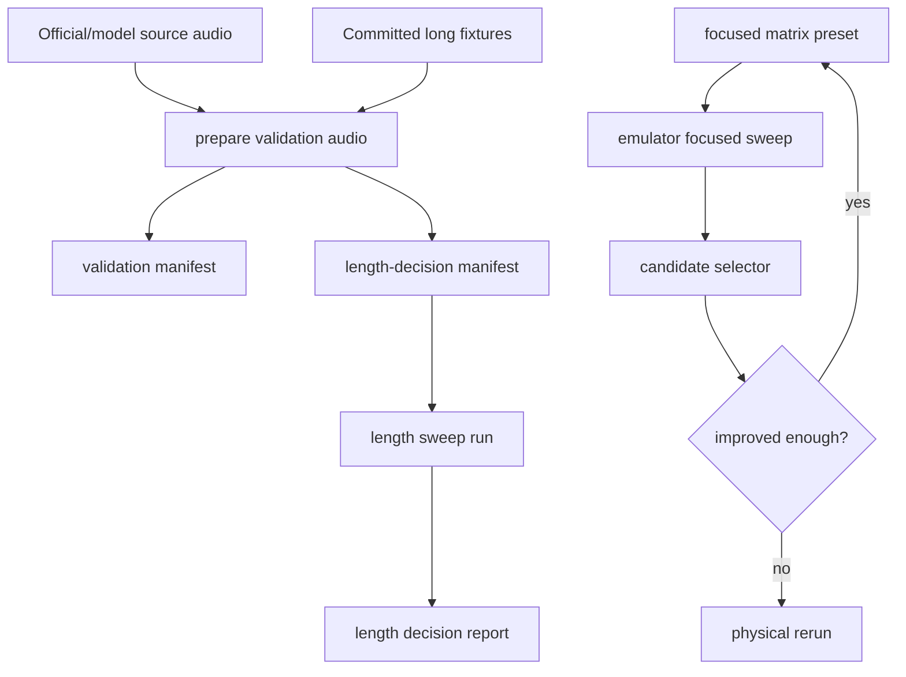

# feat: Add ASR benchmark decision sweeps

## Goal Capsule

| Field | Value |
| --- | --- |
| Objective | Extend the Paraformer benchmark standard from broad profile search into repeatable decision sweeps for validation audio, focused local tuning, and standard-vs-realtime length thresholds. |
| Authority | User decisions in this thread override prior benchmark defaults; the existing Paraformer benchmark plan remains the base implementation contract. |
| Execution profile | Standard benchmark tooling change; no production transcription defaults change in this plan. |
| Stop conditions | Stop if a required validation audio source has no reference transcript, if generated manifests cannot be staged by existing benchmark scripts, or if local static validation fails. |

---

## Product Contract

### Summary

This plan upgrades the benchmark workflow so production recommendations come from a validation set, iterative focused micro-sweeps, and measured length thresholds rather than one-off winner selection.
The official English `8k.wav` case is removed from the plan entirely.

### Problem Frame

The current benchmark can find promising Paraformer profiles, but the selection process still risks overfitting to one long Chinese fixture, one long English fixture, or a single focused physical rerun.
The next workflow needs reproducible validation audio, a bounded way to continue local sweeps when a better region appears, and a concrete rule for complete-file routing based on audio duration.

### Requirements

- R1. Remove the official English `8k.wav` sample from benchmark planning and generated official-audio manifests.
- R2. Add a reproducible validation-audio preparation path with at least one additional Chinese case and one additional English case with known reference text.
- R3. Add a focused micro-sweep preset around the currently stable RMS realtime region instead of returning to the full grid. The physically validated replay family with no stable advantage is removed from the candidate set.
- R4. Support continuing a focused sweep when a candidate improves accuracy enough, or preserves accuracy while materially improving runtime.
- R5. Add a length-decision workflow for complete audio files that compares standard and realtime replay routes across generated durations.
- R6. Keep emulator results as screening evidence and physical-device results as the authority for final recommendation.
- R7. Keep generated audio, manifests, matrices, raw results, and diagnostics under `build/asr_benchmark/`.

### Scope Boundaries

- Production route selection is not changed here; this plan only creates the benchmark evidence path and decision reports.
- The official English `8k.wav` sample is not retained as a compatibility observation item.
- Audio cases without reference transcripts are not used for CER/WER decisions.
- Full matrix execution remains optional diagnostic work, not the default tuning path.

---

## Planning Contract

### Key Technical Decisions

- KTD1. Validation audio is prepared into `build/asr_benchmark/` and paired with generated manifests, because new generated WAVs and official archive extracts should not become committed source artifacts.
- KTD2. The focused preset is added to the matrix generator, because existing batch and run scripts already understand generated profile JSON files.
- KTD3. Iteration stays result-driven: use selected winners plus nearest neighbors for the next sweep when the improvement threshold is met.
- KTD4. Length thresholds are reported from benchmark results rather than hardcoded in production, because the crossover point depends on real device timing and accuracy.

### High-Level Technical Design

### Assumptions

- The English official archive remains available through the existing model download path.
- Chinese validation audio should use sources with known transcripts; Chinese official model `test_wavs` are excluded unless references are added later.
- The first implementation should make the workflow reproducible and locally validated; device sweeps can run afterward with the same scripts.

---

## Implementation Units

### U1. Validation Audio Preparation

- **Goal:** Add a reproducible script that prepares validation and length-decision audio manifests without including `8k.wav`.
- **Requirements:** R1, R2, R5, R7
- **Dependencies:** None
- **Files:**
  - Create: `benchmark/prepare_asr_validation_audio.py`
  - Modify: `benchmark/audio_manifest.md`
- **Approach:** Extract English official `0.wav` and `1.wav` from the downloaded English model archive, copy their references from `trans.txt`, and explicitly skip `8k.wav`. Prepare Chinese validation audio only from sources with known text. Generate separate validation and length-decision manifests under `build/asr_benchmark/diagnostics/` with audio under `build/asr_benchmark/validation_audio/`.
- **Execution note:** Prefer deterministic generated assets under `build/` over committing binary audio.
- **Patterns to follow:** `benchmark/prepare_asr_benchmark_audio.sh`, `benchmark/asr_benchmark_manifest.json`, `benchmark/install_asr_benchmark_assets.sh`
- **Test scenarios:**
  - Happy path: preparing official English audio writes `0.wav`, `1.wav`, matching `.txt` references, and no `8k` files or manifest entries.
  - Happy path: preparing validation audio writes at least one Chinese and one English audio case with references.
  - Edge case: missing official archive fails with a command hint instead of producing a partial manifest.
  - Error path: an audio source without a reference transcript is rejected.
- **Verification:** Generated manifests pass JSON parsing and every `wav`/`reference` path exists under the selected audio root.

### U2. Focused Micro-Sweep Matrix

- **Goal:** Add a focused matrix preset around the current RMS realtime candidate region.
- **Requirements:** R3, R6, R7
- **Dependencies:** None
- **Files:**
  - Modify: `benchmark/generate_asr_profile_matrix.py`
- **Approach:** Add a focused preset that covers the stable RMS region around `frameMs=80`, `speechThreshold=420`, `minSpeechMs=320`, `endSilenceMs=1300`, `maxSegmentMs=16000`, plus the standard Silero VAD baseline. Keep the profile count bounded for emulator-first use.
- **Patterns to follow:** Existing `screening`, `coarse`, and `full` preset helpers in `benchmark/generate_asr_profile_matrix.py`
- **Test scenarios:**
  - Happy path: `--preset focused` writes unique profile IDs and contains RMS realtime profiles plus standard baselines.
  - Edge case: batch file numbering stays stable when focused profile count is below or above 100.
  - Integration: generated focused JSON can be used as `BENCHMARK_PROFILES_FILE`.
- **Verification:** Python compile passes and `--preset focused --batch-size 20` generates a profile JSON plus batches.

### U3. Iteration and Length Decision Reports

- **Goal:** Make continued focused sweeps and length-based route decisions explicit from result JSON.
- **Requirements:** R4, R5, R6
- **Dependencies:** U1, U2
- **Files:**
  - Modify: `benchmark/select_asr_benchmark_profiles.py`
  - Create: `benchmark/analyze_asr_length_decision.py`
- **Approach:** Extend candidate selection metadata with improvement thresholds so the next focused-neighbor file records why a candidate deserves another sweep. Add a length analyzer that groups rows by language and duration, compares best standard vs best realtime rows, and emits a concrete crossover recommendation using configurable accuracy and speed thresholds.
- **Patterns to follow:** `benchmark/select_asr_benchmark_profiles.py`, `benchmark/generate_asr_benchmark_visual_report.py`
- **Test scenarios:**
  - Happy path: selector output records candidates that beat a baseline by accuracy or speed/accuracy criteria.
  - Happy path: length analyzer emits a route table and threshold recommendation from a result JSON.
  - Edge case: if realtime never meets the accuracy threshold, the analyzer reports no realtime crossover.
  - Error path: missing route rows or unparseable duration groups fail clearly.
- **Verification:** Scripts compile and run against existing or generated sample JSON without crashing.

### U4. Benchmark Standard Documentation and Static Validation

- **Goal:** Update the repeatable test standard so future agents use validation audio, focused iteration, and length decisions by default.
- **Requirements:** R1, R2, R3, R4, R5, R6, R7
- **Dependencies:** U1, U2, U3
- **Files:**
  - Modify: `benchmark/asr_benchmark_test_plan.md`
  - Modify: `benchmark/README.md`
  - Modify: `docs/plans/2026-07-06-001-feat-paraformer-parameter-benchmark-plan.md`
- **Approach:** Replace broad-Full-first wording with focused micro-sweep iteration. Document that official English 8k is excluded, validation manifests are generated, physical-device reruns remain authoritative, and length thresholds are evidence-based. Keep the older plan coherent by adding this follow-up as the current standard rather than rewriting shipped history.
- **Execution note:** Documentation must not claim final route thresholds until length-sweep data exists.
- **Patterns to follow:** Existing benchmark README and test-plan structure.
- **Test scenarios:** Test expectation: none -- documentation-only behavior.
- **Verification:** `python3 -m py_compile` for changed Python scripts, generator smoke commands, JSON validation for generated manifests, and `git diff --check`.

---

## Verification Contract

| Gate | Applies to | Done signal |
| --- | --- | --- |
| Python compile | U1, U2, U3 | All new and modified Python scripts compile with `python3 -m py_compile`. |
| Generated manifest validation | U1 | Validation and length manifests parse as JSON and every referenced file exists. |
| Focused preset smoke | U2 | `generate_asr_profile_matrix.py --preset focused --batch-size 20` writes unique profile IDs and batch files. |
| Length analyzer smoke | U3 | Analyzer runs on a supplied result JSON or reports a clear missing-data error. |
| Diff hygiene | U1-U4 | `git diff --check` passes. |

---

## Definition of Done

- Official English benchmark preparation excludes `8k.wav` completely.
- The benchmark can generate a bounded focused micro-sweep matrix for the current RMS realtime region.
- Candidate-selection output records whether another focused sweep is justified by accuracy or speed/accuracy improvement.
- The benchmark can produce a length-decision report from result JSON.
- Documentation describes the new default route: validation audio, focused micro-sweep iteration, physical-device confirmation, and measured length thresholds.
- Local static verification passes, and any device-dependent verification not run is reported explicitly.

---

## Appendix

### Sources

- `docs/plans/2026-07-06-001-feat-paraformer-parameter-benchmark-plan.md`
- `benchmark/asr_benchmark_test_plan.md`
- `benchmark/generate_asr_profile_matrix.py`
- `benchmark/select_asr_benchmark_profiles.py`
- `benchmark/prepare_asr_benchmark_audio.sh`
- `benchmark/install_asr_benchmark_assets.sh`
