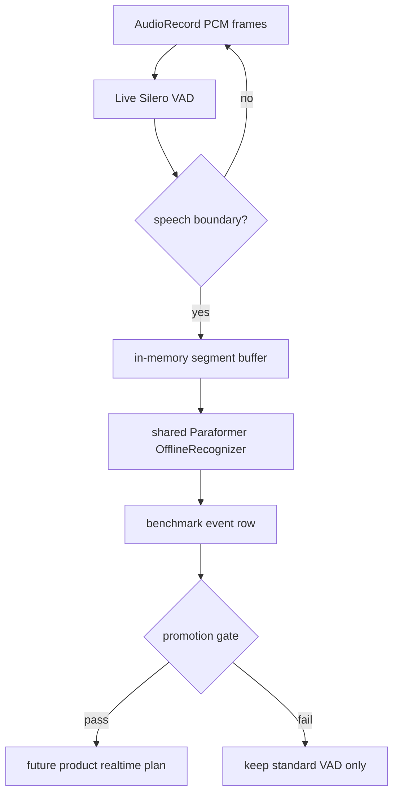

# Live VAD Experiment - Plan

## Goal Capsule

| Field | Value |
| --- | --- |
| Objective | Add a bounded experiment path to evaluate live Silero VAD segmentation for realtime recording without restoring RMS as production code. |
| Authority | Current product route remains standard recording plus Silero VAD plus offline Paraformer unless live evidence beats the retired realtime posture. |
| Stop condition | Stop before product UI exposure if live VAD cannot match the current standard route on accuracy enough to justify realtime latency. |
| Execution profile | Implement and test as debug/benchmark-only first; production code changes require a later decision backed by physical-device results. |

---

## Product Contract

### Summary

The app should stay simple for production: users get one reliable standard transcription route today.
Realtime transcription can return only if a new `live_vad` experiment proves it is materially better than the retired RMS route and acceptable against the standard VAD route.

### Problem Frame

The previous RMS realtime path was faster in some cases but carried accuracy, complexity, and maintenance costs.
The current production cleanup removed RMS and made standard Silero VAD the only exposed route.
The remaining question is whether a cleaner live path, `AudioRecord -> Silero VAD -> in-memory segment -> Paraformer -> UI event`, can satisfy realtime needs without reviving the old RMS architecture.

### Requirements

**Route policy**

- R1. Production continues to expose only the standard VAD route while this plan runs.
- R2. RMS remains retired from production; any RMS comparison uses historical results or debug-only replay code.
- R3. `live_vad` must process continuous PCM with Silero VAD and in-memory segment decode, not fixed-duration WAV polling.

**Evidence policy**

- R4. The experiment must compare current standard VAD, `live_vad`, and the last useful RMS baseline using the same zh/en fixture set.
- R5. 8 kHz audio is excluded from new test matrices.
- R6. At least one additional Chinese and one additional English validation audio case should be included before changing any product route decision.
- R7. Physical-device results are required before `live_vad` can become user-visible.

**Decision policy**

- R8. Adopt `live_vad` only when it gives realtime latency while keeping recognition quality close enough to standard VAD for the intended realtime scenario.
- R9. Keep the app standard-only if `live_vad` does not clearly beat the retired RMS posture or creates new recording reliability risk.

### Scope Boundaries

- In scope: debug/benchmark implementation, fixed-audio validation, physical-device rerun selection, and documentation of the go/no-go decision.
- Deferred to follow-up work: Flutter live transcript UI, settings exposure, persisted realtime segment schema, and automatic route recommendation.
- Out of scope: restoring RMS production code, adding cloud ASR, adding 8 kHz matrices, and replacing standard recording.

---

## Planning Contract

### Key Technical Decisions

- KTD1. Keep production code standard-only during the experiment because the current route is simpler, already validated by `./tool/dev_check.sh --with-build`, and avoids reopening removed UI and MethodChannel surfaces.
- KTD2. Build `live_vad` as a debug/benchmark path first because realtime correctness depends on latency, segment boundaries, and physical-device behavior that unit tests alone cannot prove.
- KTD3. Use continuous Silero VAD over PCM frames rather than RMS energy thresholds because it matches the current standard route's segmentation model and gives a fairer path to accuracy parity.
- KTD4. Compare against the historical RMS profile as a baseline, not as a product dependency, because the last RMS configuration is enough to decide whether the new path is worth reviving realtime UX.
- KTD5. Gate promotion on physical-device measurements because emulator performance is useful for screening but not enough for microphone capture, CPU, and thermal behavior.

### High-Level Technical Design

### Assumptions

- The current standard route remains the product default while this experiment runs.
- Historical RMS measurements are acceptable as the first comparator; if their source rows are insufficient, a debug-only RMS replay may be added without production wiring.
- The benchmark fixtures under `benchmark/audio/` are the initial fixture set, and generated validation audio lives under `build/asr_benchmark/`.

---

## Implementation Units

### U1. Document the Live Experiment Contract

- **Goal:** Add a durable experiment contract so future code does not drift back into production RMS or ambiguous realtime route names.
- **Requirements:** R1, R2, R3, R8, R9
- **Dependencies:** None
- **Files:** `benchmark/README.md`, `benchmark/asr_benchmark_test_plan.md`, `docs/plans/2026-07-07-002-feat-live-vad-experiment-plan.md`
- **Approach:** Add a short `live_vad` experiment section that distinguishes standard production, debug live VAD, and retired RMS baseline. Keep the main benchmark workflow standard-only unless the new experiment flag is selected.
- **Patterns to follow:** Current "Retired RMS Experiment" section in `benchmark/README.md`; current standard-only route wording in `benchmark/asr_benchmark_test_plan.md`.
- **Test scenarios:** Test expectation: none -- documentation-only change, verified by review and grep for route wording.
- **Verification:** Docs describe RMS as historical or debug-only and do not claim `live_vad` is production-ready.

### U2. Add a Debug-Only Live VAD Probe

- **Goal:** Implement a benchmark/debug path that feeds PCM frames through Silero VAD, decodes completed speech segments with a shared Paraformer recognizer, and records latency/accuracy metrics.
- **Requirements:** R3, R4, R7, R8
- **Dependencies:** U1
- **Files:** `benchmark/android/src/debug/kotlin/com/voice2text/app/benchmark/AsrBenchmarkRunner.kt`, `benchmark/android/src/debug/kotlin/com/voice2text/app/benchmark/AsrBenchmarkTypes.kt`, `android/app/src/main/kotlin/com/voice2text/app/transcription/RealSherpaTranscriptionEngine.kt`
- **Approach:** Reuse the current benchmark VAD and recognizer setup, but process audio as ordered chunks to simulate microphone flow. Keep output rows separate from standard route rows by route/mode fields. Do not add Flutter MethodChannel, EventChannel, settings, or production UI.
- **Execution note:** Start with characterization from existing standard VAD benchmark behavior, then add live-specific metrics.
- **Patterns to follow:** `AsrBenchmarkRunner.kt` VAD setup and `RealSherpaTranscriptionEngine.kt` `transcribeVadSegments` streaming-style chunk drain.
- **Test scenarios:** Happy path: zh/en fixtures emit ordered final segment rows and merged text. Edge case: no detected speech reports a benchmark failure instead of hanging. Error path: missing VAD model fails before profile execution. Integration: live probe uses the same model assets and manifest path as standard smoke.
- **Verification:** Debug APK builds, live probe rows include segment count, first segment latency, final latency, RTF, WER/CER inputs, and no production API surface is added.

### U3. Add Focused Live VAD Matrices and Validation Audio

- **Goal:** Generate a bounded live VAD test set that excludes 8 kHz audio and adds one extra Chinese plus one extra English validation case.
- **Requirements:** R4, R5, R6
- **Dependencies:** U2
- **Files:** `benchmark/generate_asr_profile_matrix.py`, `benchmark/prepare_asr_validation_audio.py`, `benchmark/audio_manifest.md`, `benchmark/audio/`
- **Approach:** Keep standard focused sweep unchanged, then add a separate live experiment preset that varies only the dimensions most likely to affect live latency and segmentation quality. Add validation audio metadata without committing generated build artifacts.
- **Patterns to follow:** Existing `focused_profiles()` and `prepare_asr_validation_audio.py` generated-output policy.
- **Test scenarios:** Happy path: live preset writes unique profile IDs and excludes 8 kHz cases. Edge case: generated validation audio cannot overwrite committed fixtures. Integration: profile generation plus validation manifest preparation can run from a clean checkout.
- **Verification:** Python compile passes, generated live preset has bounded profile count, and the generated manifest has at least two zh and two en non-8 kHz cases.

### U4. Add Experiment Analysis and Candidate Selection

- **Goal:** Produce a clear go/no-go comparison across standard VAD, `live_vad`, and the historical RMS baseline.
- **Requirements:** R4, R8, R9
- **Dependencies:** U2, U3
- **Files:** `benchmark/select_asr_benchmark_profiles.py`, `benchmark/generate_asr_benchmark_visual_report.py`, `benchmark/asr_benchmark_results_2026-07-05.md`
- **Approach:** Keep the production visual report single-route. Add experiment-only comparison output that ranks live candidates by accuracy first, then latency/RTF, and labels RMS only as a baseline.
- **Patterns to follow:** Current candidate selection script and single-route report filtering.
- **Test scenarios:** Happy path: live results with better latency and acceptable accuracy produce physical-device rerun profiles. Edge case: live results faster but materially worse accuracy are rejected. Error path: missing RMS historical row still produces a standard-vs-live report with the missing baseline called out.
- **Verification:** Analysis output includes route, profile id, language, audio case, WER/CER, RTF, first segment latency, final latency, and recommendation reason.

### U5. Run Physical-Device Validation and Decide Route Fate

- **Goal:** Validate finalists on a real Android device and write the route decision without changing product exposure prematurely.
- **Requirements:** R7, R8, R9
- **Dependencies:** U4
- **Files:** `benchmark/asr_benchmark_results_2026-07-05.md`, `benchmark/README.md`, `README.md`
- **Approach:** Run emulator screening first, then rerun selected finalists on a connected physical device. Promote only if live VAD is fast enough for realtime and accuracy remains close enough to standard VAD. Otherwise keep standard VAD as the only production route and leave live VAD as archived experiment evidence.
- **Patterns to follow:** Current emulator-first and physical-rerun workflow in `benchmark/README.md`.
- **Test scenarios:** Test expectation: none -- this unit is operational validation, verified by real benchmark artifacts and documented decision.
- **Verification:** Decision doc states one of: keep standard-only, continue live VAD experiment, or plan production realtime exposure. Each outcome cites emulator and physical-device result files.

---

## Verification Contract

| Gate | Applies to | Done signal |
| --- | --- | --- |
| Python syntax | U3, U4 | `python3 -m py_compile benchmark/generate_asr_profile_matrix.py benchmark/generate_asr_benchmark_visual_report.py benchmark/select_asr_benchmark_profiles.py benchmark/prepare_asr_validation_audio.py` exits 0. |
| Matrix sanity | U3 | Focused and live experiment presets generate expected bounded counts and no 8 kHz cases. |
| Static route guard | U1-U5 | Production `lib/` and `android/app/src/main/kotlin/` do not regain RMS realtime UI or channel surfaces before a later production plan. |
| Project checks | U2-U4 | `./tool/dev_check.sh --with-build` exits 0. |
| Benchmark smoke | U2-U5 | Standard smoke still runs before any live experiment result is trusted. |
| Physical validation | U5 | Selected candidates have physical-device rows before any route recommendation changes. |

---

## Definition of Done

- The production app still exposes only the standard VAD route unless a later plan changes product scope.
- `live_vad` experiment code, if added, is debug/benchmark-only and separated from production UI/settings/contracts.
- New test matrices exclude 8 kHz audio and include the extra zh/en validation cases before decision-making.
- Experiment analysis reports accuracy, RTF, first segment latency, final latency, failures, and recommendation reason.
- Any promotion recommendation cites both emulator screening and physical-device rerun evidence.
- Dead-end experiment code is removed or clearly archived before the work is considered complete.
