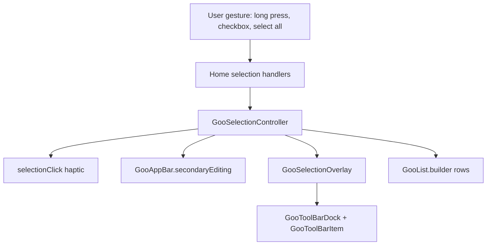
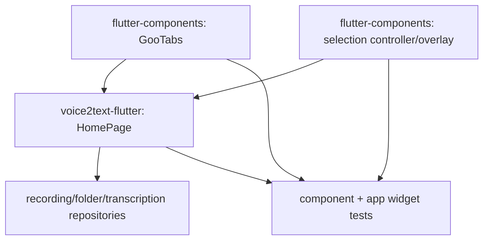

# refactor: Align Home Selection and Tabs with Goo Components

## Overview

Update the home page so selection, tab actions, toolbar actions, list rows, and haptics are owned by Goo component patterns instead of page-local UI workarounds. This is a cross-repo plan: the app work lands in `voice2text-flutter`, and component fixes land in the sibling `flutter-components` repo. Paths below are grouped by target repo and are relative to that repo.

## Problem Frame

The home page now uses `GooAppBar`, `GooTabs`, `GooList`, and `showGooSharePanel`, but several behaviors still expose implementation gaps:

- `GooTabs` reserves a two-action rail and left-aligns actual actions, so a single "new group" button does not sit at the far right even when the row has enough width.
- The page still hand-writes selection state and the bottom rename/delete toolbar instead of using `GooSelectionController` plus the selection toolbar pattern shown in the AppBar demo.
- Full select currently excludes placeholder rows, which makes the visual preview feel inconsistent.
- Selection transitions lack the light haptic feedback that existing Goo controls already use for direct state changes.
- The tab/list boundary should remain flush; callers should not need to paint a fake white tab background.

## Requirements Trace

- R1. Keep the home header on `GooAppBar.secondary` and `GooAppBar.secondaryEditing`; normal-mode right-side icon actions remain `GooAppBarIconAction`, while editing-mode select-all/cancel-all uses the documented `secondaryEditing` text action labels.
- R2. Make `GooTabs` fill the available row and place one or two tab actions at the trailing edge without visible empty slots.
- R3. Keep the home list on `GooList.builder`; business row wrappers must continue to implement and forward `GooListRowChild`.
- R4. Keep item "more" actions presented through `showGooSharePanel`.
- R5. Replace the handwritten multi-select bottom toolbar with the component-library selection overlay/toolbar solution.
- R6. Add select-all/cancel-all for all currently visible rows, including placeholder preview rows, while preserving rename/delete business guards.
- R7. Add light haptic feedback only for direct selection-state changes: entering multi-select, item select/deselect, select all, and cancel all.
- R8. Preserve existing recording, folder, favorite, delete, restore, share, and navigation behavior.

## Scope Boundaries

- Do not redesign the rename/create/delete dialogs in this pass; they can remain on their current dialog implementation unless touched for selection wiring.
- Do not introduce undocumented Goo variants, colors, surfaces, or toolbar item styles.
- Do not change persistence contracts for recordings, folders, transcription jobs, or transcript segments.
- Do not change the bottom app navigation model; this plan only covers the home page tab row and selection toolbar.
- Do not add haptics to opening the more/share panel, normal row navigation, dialog presentation, snackbar/toast feedback, or loops inside bulk operations.
- Do not migrate unrelated Home UI in this pass. Search/import/theme actions, FAB navigation, share-panel action contents, dialogs, and list-row content should be preserved unless a listed unit directly requires a wiring change.
- Do not make selection haptics a surprise global default for every `GooSelectionController` consumer. The component library should expose or wire a scoped opt-in path, and Home should enable it for this page's selection flow.

## Context & Research

### Relevant Code and Patterns

- `voice2text-flutter`
  - `lib/features/home/home_page.dart`: current home page, including `_selectedIds`, `_SelectionToolbar`, `GooTabs`, `GooList.builder`, and `showGooSharePanel`.
  - `lib/features/home/home_tokens.dart`: home-only spacing and text tokens, including now-selection-toolbar-specific metrics that may become unused.
  - `test/widget_test.dart`: current app boot/navigation widget coverage.
- `flutter-components`
  - `lib/src/ui_showcase/widgets/goo_tabs.dart`: `_TabActionRail` currently uses a fixed rail and left-aligned action row.
  - `test/goo_tabs_test.dart`: existing geometry tests for tab height, content gap, action rail mask, and max action assertions.
  - `lib/src/ui_showcase/widgets/goo_selection_controller.dart`: selection state owner with `selectAll`, `clearSelection`, and editing lifecycle.
  - `lib/src/ui_showcase/widgets/goo_selection_scaffold.dart`: `GooSelectionScaffold` and `GooSelectionOverlay` render `GooToolBarDock`.
  - `lib/src/ui_showcase/widgets/goo_tool_bar.dart`: `GooToolBarItem`, `GooToolBar`, and `GooToolBarDock` behavior.
  - `lib/src/ui_showcase/pages/app_bar_component_page.dart`: AppBar demo uses `GooSelectionOverlay` with `toolbarBuilder`.
  - `test/goo_selection_controller_test.dart` and `test/goo_selection_scaffold_test.dart`: controller and overlay/scaffold behavior tests.
  - `lib/src/ui_showcase/widgets/goo_switch.dart`, `goo_rate.dart`, and `goo_index.dart`: existing `HapticFeedback.selectionClick()` precedent.

### Institutional Learnings

- Component-library memory favors scoped changes, API/demo/test lockstep, and moving reusable capability into components instead of business-page workarounds.
- `GooList` owns its surface and row protocol; business wrappers must forward `GooListRowChild` fields rather than hiding `GooListItem`.
- Component changes involving trailing slots, selected states, haptics, or surfaces should receive focused widget regression tests.

### External References

- Apple Human Interface Guidelines, "Playing haptics": use system haptics for clear, direct feedback and keep feedback tied to the user-visible interaction. This supports using `selectionClick` for selection-state changes and avoiding unrelated or repeated bulk-operation vibrations.

## Key Technical Decisions

- Fix the tab action alignment in `flutter-components`, not in the app. The page should not compensate for a component rail that reserves a visible empty slot.
- Use `GooSelectionOverlay<int>` for Home rather than `GooSelectionScaffold<int>`. Home already owns a custom `Scaffold`, AppBar, FAB, and stacked body; the overlay gives the same `GooToolBarDock` solution without replacing the page shell.
- Keep haptics selection-scoped, opt-in, and light. Use the existing Goo precedent of `HapticFeedback.selectionClick()` for direct selection state changes, ensure bulk select-all emits one feedback event, and avoid changing every selection-controller consumer by default.
- Let placeholders participate in selection and select-all. Operation availability remains governed by business rules, so placeholder-inclusive selection can disable rename/delete while still making the preview selectable.
- Keep `showGooSharePanel` for the more menu. It already matches the requested share-panel presentation and should not receive haptic feedback just for opening.

## Open Questions

### Resolved During Planning

- **Bottom selection UI choice:** Use `GooSelectionOverlay<int>` plus `GooToolBarItem`, following the AppBar demo pattern while preserving the existing page `Scaffold`.
- **Single tab action alignment:** Treat this as a `GooTabs` component bug caused by the fixed two-slot action rail, not a Home page layout issue.
- **Select-all behavior:** Select all visible rows when not all visible rows are selected; when all are selected, show "取消全选" and clear selection.

### Deferred to Implementation

- **Exact haptic API spelling:** The controller/overlay should expose a default-disabled opt-in haptic policy and an explicit silent/programmatic path. The final method or parameter names are implementation details, but the behavior is not optional: reconciliation must not vibrate unless the Home user gesture explicitly requested haptics.
- **Toolbar destructive styling:** `GooToolBarItem` currently exposes labels/icons/actions, not an obvious destructive color slot. Keep the component toolbar visually consistent unless the existing API already supports a destructive state.

## High-Level Technical Design

> *This illustrates the intended approach and is directional guidance for review, not implementation specification. The implementing agent should treat it as context, not code to reproduce.*

## Implementation Units

- [ ] **Unit 1: Fix GooTabs trailing action geometry**

**Goal:** Make `GooTabs` own the full-width tab row background and align one or two actions to the trailing edge without a visible empty action slot.

**Requirements:** R2

**Dependencies:** None

**Files:**
- Target repo: `flutter-components`
- Modify: `lib/src/ui_showcase/widgets/goo_tabs.dart`
- Modify if demo coverage needs the one-action case: `lib/src/ui_showcase/pages/tabs_component_page.dart`
- Test: `test/goo_tabs_test.dart`

**Approach:**
- Preserve the public `actions.length <= 2` contract.
- Rework the action rail so its mask still protects scrollable tabs, but actual action buttons are aligned to the trailing edge based on the number of actions present.
- Preserve the trailing protected interaction zone for overlength tabs even when only one action is present, either by keeping an action-count-independent overlay protection width or by adding matching scroll viewport/end padding. Aligning the icon must not allow the last tab label or active indicator to paint or receive taps underneath the action button.
- Ensure `GooTabs(showContent: false)` claims the bounded parent width so its default white/list background spans the full row. In unbounded horizontal contexts, keep current safe intrinsic behavior.
- Keep divider, mask gradient, keyboard navigation, active-tab measurement, and overlength scrolling behavior intact.

**Patterns to follow:**
- Existing `test/goo_tabs_test.dart` geometry assertions.
- Component memory rule that trailing slots should align to verified component geometry instead of page-local compensation.

**Test scenarios:**
- Happy path: one action in a 360-wide overlength tab row renders its action icon at the trailing side of the tab bar.
- Happy path: two actions still render in the allowed action rail with mask and divider intact.
- Edge case: in one-action overlength mode, the last tab label and active indicator do not overlap the action button or mask, and taps in the action zone target the action rather than a tab.
- Edge case: no actions still renders a full-width tab background and no action rail.
- Edge case: `showContent: false` inside a normal bounded parent produces a tab bar whose width equals the parent width.
- Regression: more than two actions still asserts.

**Verification:**
- Tabs component tests cover one-action and two-action geometry, full-width row background, and unchanged max-action assertion.

- [ ] **Unit 2: Add opt-in selection haptics in the component selection layer**

**Goal:** Add a default-disabled, opt-in light haptic path for selection-state changes using the same platform haptic style already used by Goo switch/rate/index controls.

**Requirements:** R7

**Dependencies:** None

**Files:**
- Target repo: `flutter-components`
- Modify: `lib/src/ui_showcase/widgets/goo_selection_controller.dart`
- Modify if the behavior needs overlay-level wiring: `lib/src/ui_showcase/widgets/goo_selection_scaffold.dart`
- Modify if public usage guidance changes: `DOC.md`
- Test: `test/goo_selection_controller_test.dart`
- Test if overlay behavior changes: `test/goo_selection_scaffold_test.dart`

**Approach:**
- Add the smallest component-level opt-in haptic policy that defaults to disabled and lets a consumer enable selection haptics without changing default behavior for existing `GooSelectionController` users.
- Make the user/programmatic boundary explicit in the API. Acceptable shapes include a user-action operation flag, a change-source enum, or an overlay/controller policy invoked only by user-facing handlers; silent reconciliation must default to no haptic.
- Trigger `selectionClick` for direct selection transitions: first selection entering editing, item select/deselect, select-all replacement, and cancel-all clearing.
- Do not trigger haptics for constructor initial state, no-op selection calls, toolbar show/hide alone, or non-user silent reconciliation.
- Emit one haptic per user operation. A select-all call that selects many values should vibrate once.
- Keep the controller testable by following existing platform-channel haptic assertions used in component tests.

**Patterns to follow:**
- Existing haptic usage in `goo_switch.dart`, `goo_rate.dart`, and `goo_index.dart`.
- Existing haptic test pattern in `test/goo_switch_search_bar_test.dart` and `test/goo_index_test.dart`.

**Test scenarios:**
- Happy path: first toggle enters editing and records one `selectionClick`.
- Happy path: selecting or deselecting another item records one `selectionClick`.
- Happy path: select all with multiple values records one `selectionClick`.
- Happy path: clearing an active selection records one `selectionClick`.
- Edge case: default controller/overlay usage emits no haptic feedback unless the opt-in policy is enabled.
- Edge case: initial selected values do not emit haptics during controller construction.
- Edge case: no-op calls do not emit haptics.
- Edge case: silent reconciliation, if introduced, updates state without haptics.

**Verification:**
- Selection controller tests prove enabled haptic boundaries, default-disabled behavior, and unchanged editing/toolbar lifecycle.

- [ ] **Unit 3: Refactor Home selection state to GooSelectionOverlay**

**Goal:** Replace page-local selection state and the handwritten bottom toolbar with `GooSelectionController<int>`, `GooSelectionOverlay<int>`, and `GooToolBarItem`.

**Requirements:** R1, R3, R5, R8

**Dependencies:** Unit 2 is preferred so Home can enable component-owned selection haptics through the opt-in path.

**Files:**
- Target repo: `voice2text-flutter`
- Modify: `lib/features/home/home_page.dart`
- Modify if toolbar-only tokens become unused: `lib/features/home/home_tokens.dart`
- Test: `test/widget_test.dart`

**Approach:**
- Add a stable `GooSelectionController<int>` to `HomePage` state and dispose it with the page.
- Enable the component selection haptic policy for Home only, so the requested feedback applies to this page without changing unrelated consumers.
- Ensure Home rebuilds selection-dependent chrome when the controller changes. Use either a controller listener with removal in `dispose` or an `AnimatedBuilder` around the relevant `Scaffold` subtree so app bar, FAB visibility, body mode, selected count, and select-all/cancel-all labels cannot go stale.
- Derive selection mode, selected count, and selected IDs from the controller instead of `_selectedIds`.
- Wrap the body stack in `GooSelectionOverlay<int>` and build rename/delete toolbar items from `toolbarBuilder`.
- Remove `_SelectionToolbar` and `_SelectionToolbarButton`; reserve bottom content space only to avoid overlay coverage, not to draw a custom toolbar surface.
- Keep `_HomeListRow` as a `GooListRowChild` and keep list rows directly produced by `GooList.builder`.
- Keep the normal FAB hidden while editing, matching the current interaction model.

**Patterns to follow:**
- `flutter-components` AppBar demo using `GooSelectionOverlay` and `toolbarBuilder`.
- `GooSelectionScaffold` tests for mode callbacks and toolbar visibility.
- Current Home `GooListRowChild` forwarding pattern.

**Test scenarios:**
- Test setup: placeholder-row UI and haptic tests can stay in `test/widget_test.dart`; repository-backed real-row scenarios need a deterministic repository/database harness or a narrow HomePage injection seam before they are automated.
- Happy path: long-pressing a visible home row enters editing mode, updates the app bar subtitle, hides the FAB, and shows the Goo toolbar.
- Happy path: tapping a row in editing toggles its selected state and updates selected count.
- Happy path: the toolbar exposes rename and delete actions through `GooToolBarItem` labels/icons.
- Happy path: Home-level haptic spy records exactly one `selectionClick` for long press entering selection and exactly one for each row checkbox toggle.
- Edge case: normal row navigation and more/share panel opening emit no haptic feedback.
- Edge case: selected rows expose stable accessibility labels and selected/checked state, the selection toolbar has a semantic label, and disabled toolbar actions are announced as disabled or omitted according to the component behavior.
- Edge case: canceling editing clears selection and returns to normal app bar/FAB state.
- Regression: normal row tap still opens recording details; more button still opens the share panel.

**Verification:**
- Home widget tests cover the normal-to-selection lifecycle and the toolbar is rendered by Goo selection components, not the removed custom toolbar widgets.

- [ ] **Unit 4: Implement select all / cancel all on visible items**

**Goal:** Complete app bar trailing selection behavior for all visible rows, including placeholder preview rows.

**Requirements:** R1, R6, R8

**Dependencies:** Unit 3

**Files:**
- Target repo: `voice2text-flutter`
- Modify: `lib/features/home/home_page.dart`
- Test: `test/widget_test.dart`
- Test if repository-backed coverage needs a stable harness: create or modify a focused Home test/helper under `test/features/home/`

**Approach:**
- Compute visible selectable IDs from `_visibleItems` and use item IDs, never list indices.
- Treat "all selected" as every currently visible item ID being selected, not just equal set lengths, so stale IDs cannot fool the label.
- In editing app bar, show "全选" when not all visible rows are selected and "取消全选" when all visible rows are selected.
- When selecting all, include placeholder IDs; when canceling all, clear selection and exit editing.
- Preserve operation guards: rename remains single-real-item only, and delete remains unavailable when selection includes placeholders or other disallowed states.
- Clear or reconcile selection on tab switch and after repository reloads without producing stale IDs, using the silent no-haptic reconciliation path from Unit 2 rather than the user-triggered cancel-all path.

**Patterns to follow:**
- Existing `_visibleItems`, `_hasPlaceholderSelection`, `_canRenameSelection`, and `_canDeleteSelection` business rules.
- `GooSelectionController.selectAll`, `replaceSelection`, and `clearSelection` lifecycle semantics.

**Test scenarios:**
- Test setup: placeholder rows are sufficient for select-all/cancel-all UI state; non-placeholder operation regressions should use a deterministic repository/database harness or HomePage injection seam rather than local database contents.
- Happy path: entering selection and tapping "全选" selects every visible row and changes the trailing label to "取消全选".
- Happy path: tapping "取消全选" clears selection and returns to normal mode.
- Happy path: Home-level haptic spy records exactly one `selectionClick` for select all and exactly one for user-triggered cancel all.
- Edge case: placeholder-only home preview rows are included in select all.
- Edge case: with placeholder selection, rename/delete toolbar actions remain unavailable according to existing business rules.
- Edge case: switching tabs clears selection, prevents stale selected IDs from affecting the new tab, and does not emit haptic feedback.
- Edge case: repository reload reconciliation prunes stale selected IDs without emitting haptic feedback.

**Verification:**
- Widget tests prove select-all/cancel-all labels, counts, and action availability across placeholder and non-placeholder rows.

- [ ] **Unit 5: Remove obsolete Home workarounds and verify preserved flows**

**Goal:** Remove only the page-level workarounds made obsolete by Units 1-4, then verify the preserved Home flows still behave as before.

**Requirements:** R1, R2, R3, R4, R8

**Dependencies:** Units 1, 3, and 4

**Files:**
- Target repo: `voice2text-flutter`
- Modify: `lib/features/home/home_page.dart`
- Modify if unused constants remain: `lib/features/home/home_tokens.dart`
- Test: `test/widget_test.dart`
- Test if repository-backed share-panel routing is automated: create or modify a focused Home test/helper under `test/features/home/`

**Approach:**
- Ensure `_HomeTabs` no longer adds a bottom gap before the list; `GooTabs.contentGap` remains zero because Home uses `showContent: false`.
- Remove any tab-row color workaround once `GooTabs` owns full-width background.
- Remove unused local imports/constants introduced only for the custom selection toolbar or obsolete tab spacing/background workarounds.
- Treat item more actions, search/import/theme app bar actions, FAB navigation, and list-row content as verification surfaces, not migration targets.
- Confirm app bar actions remain `GooAppBarIconAction`, more actions remain `showGooSharePanel`, and list rows remain `GooList`/`GooListItem` based.

**Patterns to follow:**
- `DESIGN.md` page recipe: top bar through `GooAppBar`, tab navigation through `GooTabs`, lists through `GooList`, tool commands through `GooToolBar`.
- `DOC.md` guidance against wrapping self-surfaced components in extra page surfaces.

**Test scenarios:**
- Happy path: home boots with `GooAppBar.secondary`, full-width tabs, and list content immediately below tabs.
- Regression: tapping a more action still opens a `GooSharePanel` with the expected item actions.
- Regression: normal-tab share panel still exposes rename, move/create folder, favorite, share, and delete actions; route execution for repository-backed actions requires the stable harness described above.
- Regression: recently-deleted share panel still exposes restore and permanent-delete actions; route execution for repository-backed actions requires the stable harness described above.
- Regression: search/import/theme app bar actions remain available through `GooAppBarIconAction` with semantic labels.
- Regression: tab action controls remain available through `GooTabAction` with semantic labels.
- Regression: navigating to recording page through the FAB still works.
- Regression: cleanup removes the custom selection toolbar path without broadening into unrelated Home UI migrations.

**Verification:**
- App widget tests cover the expected Home composition and existing recording navigation.
- The normal app project check and best-effort UI watcher check complete after implementation.

## System-Wide Impact

- **Interaction graph:** Long press, checkbox taps, app bar select-all, and app bar cancel all now flow through `GooSelectionController<int>`; toolbar rendering flows through `GooSelectionOverlay` and `GooToolBarDock`.
- **Error propagation:** Repository failures continue to be handled by existing load/delete/restore flows. Selection refactoring should not introduce new persistence error handling.
- **State lifecycle risks:** Controller state must be reconciled on tab changes, data reloads, and delete/restore completion so stale selected IDs do not keep editing mode alive.
- **API surface parity:** `GooTabs` action geometry changes affect all consumers, so component tests must preserve zero-, one-, and two-action cases.
- **Shared controller impact:** Selection haptics are added through an opt-in component path so existing `GooSelectionController` consumers remain unchanged by default; tests should cover both enabled and default-disabled behavior.
- **Integration coverage:** App tests should prove the Home page uses the component selection path and that the existing more/share and recording navigation flows still work.
- **Unchanged invariants:** Recording repository mutations, folder creation/move behavior, share text generation, and recently-deleted action branching remain unchanged.

## Risks & Dependencies

| Risk | Mitigation |
|------|------------|
| Component haptics affect unrelated selection-controller consumers | Make selection haptics opt-in and enable them only for Home in this pass. |
| Component haptics fire during silent data reconciliation | Add or use a silent reconciliation path and cover it with controller tests. |
| `GooTabs` geometry fix regresses the existing two-action mask case | Update `goo_tabs_test.dart` to cover zero, one, and two actions before relying on Home behavior. |
| `GooToolBarItem` cannot visually express destructive delete | Keep the toolbar consistent with component API; defer destructive toolbar styling to a separate component enhancement if needed. |
| Existing dirty worktrees contain unrelated edits | Touch only the files listed in the relevant unit and do not revert unrelated app or component repo changes. |
| Overlay toolbar covers the last list row | Keep a content bottom inset for selection mode, but let `GooToolBarDock` own the visible toolbar surface and safe area. |

## Documentation / Operational Notes

- Update `flutter-components/DOC.md` if the selection haptic behavior, Tabs action semantics, or `GooSelectionOverlay` app-facing usage guidance is missing or changed; update `DESIGN.md` only if public component guidance changes rather than usage examples.
- No migration note is required for `voice2text-flutter`; this is a UI/component alignment refactor.
- After implementation, run the app repo's normal project check and UI watcher check per `AGENTS.md`; for component changes, run the affected component tests and apply the component change checklist.

## Sources & References

- User request in this thread: Home UI should use Goo AppBar, Goo List, Goo Tabs, share panel, component selection toolbar, full-select behavior, and scoped haptics.
- `voice2text-flutter`: `AGENTS.md`
- `flutter-components`: `AGENTS.md`, `.agents/memories/PROFILE.md`, `.agents/memories/ACTIVE.md`
- `flutter-components`: `DESIGN.md`, `DOC.md`, `docs/COMPONENT_CHANGE_CHECKLIST.md`
- `flutter-components`: `lib/src/ui_showcase/widgets/goo_tabs.dart`
- `flutter-components`: `lib/src/ui_showcase/widgets/goo_selection_controller.dart`
- `flutter-components`: `lib/src/ui_showcase/widgets/goo_selection_scaffold.dart`
- `flutter-components`: `lib/src/ui_showcase/pages/app_bar_component_page.dart`
- Apple Developer Documentation: [Playing haptics](https://developer.apple.com/design/human-interface-guidelines/playing-haptics)
