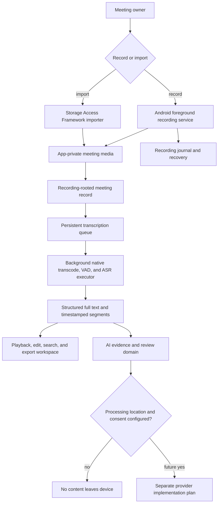
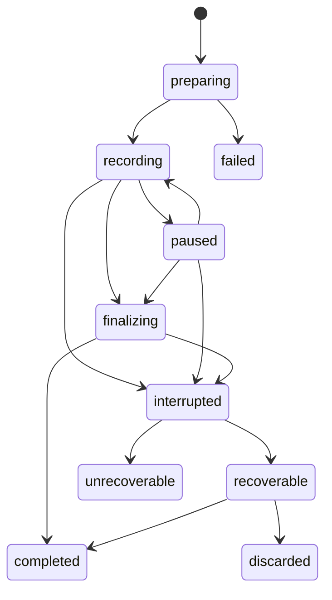
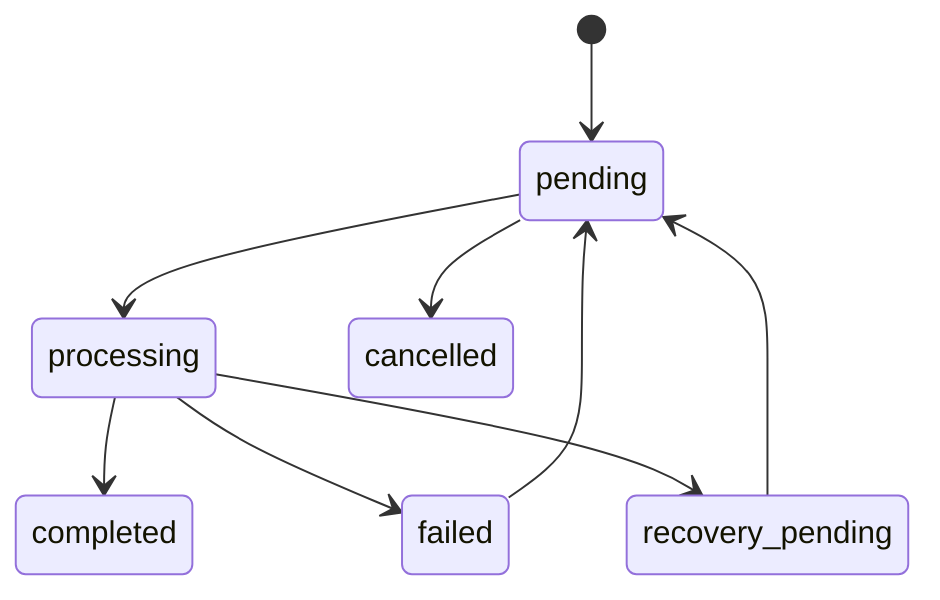
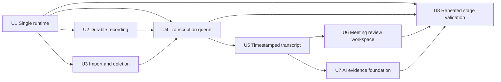

# Mobile Meeting Foundation - Plan

## Goal Capsule

| Field | Value |
| --- | --- |
| Objective | Turn the existing Android recorder and offline ASR path into a reliable mobile meeting product, then add reviewable transcripts and an evidence-first AI foundation. |
| Authority | `docs/product/meeting-voice-recognition-prd-v1.0.md` defines product intent; runnable code, automated checks, and physical-device evidence define current capability. |
| Execution profile | Deliver S0 and S1 before S2, and deliver S2 before the S3 AI foundation. Keep each implementation unit independently verifiable and preserve recorded audio ahead of every derived capability. |
| Stop conditions | Stop release when audio can be lost, the product can silently use a stub runtime, deletion leaves user content behind, or an AI-derived item can appear authoritative without evidence and review state. |
| Tail ownership | Mobile owns reliable recording, import, offline transcription, meeting review, and AI evidence/review contracts. PC Live VAD, cloud providers, collaboration, knowledge-base, and enterprise capabilities require separate plans. |

---

## Product Contract

### Summary

The mobile app will use one real `full` runtime, build a recoverable local recording and offline-transcription loop, and expose a meeting workspace where users can play, verify, edit, search, and export time-aligned text.
The S3 portion establishes evidence-linked AI records, review states, and a provider-neutral boundary without selecting a cloud vendor or uploading meeting content by default.

### Problem Frame

The repository already records Android microphone audio and can run the real `m4a -> wav16k mono -> Silero VAD -> Paraformer` chain.
It also persists recordings, transcription jobs, settings, and transcript-segment-shaped rows, and it has useful benchmark and physical-device evidence.

The current product loop is not yet reliable enough to serve as a meeting system.
The default Flutter flavor selects a stub-capable `ui` runtime, stopping a recording waits for transcription, progress is not real, transcript segments are not written by the production ASR path, import is a placeholder, and permanent deletion does not prove that the underlying audio file was removed.
Meeting details show metadata rather than a playable, editable, time-aligned record.

The product roadmap is much broader than one executable change set.
This plan therefore delivers the mobile foundation through S2 and the explicitly confirmed S3 evidence/review foundation.
It does not implement PC Live VAD, a production AI provider, collaboration, cloud sync, cross-meeting knowledge, or enterprise administration.

### Actors

- A1. Meeting owner records or imports a meeting, reviews its transcript, edits content, and controls export or deletion.
- A2. Mobile runtime owns recording durability, local files, transcription scheduling, and recovery after interruption.
- A3. Offline ASR runtime produces full text and ordered timestamped segments from an app-private recording.
- A4. Future AI provider implements a provider-neutral contract but receives no content until the user has selected and authorized a concrete processing location.
- A5. Reviewer confirms, edits, or rejects evidence-linked AI items before they become published meeting output.

### Requirements

#### Runtime and release truth

- R1. The Android app has one runtime path: real local recording and real Sherpa offline transcription; the `ui` flavor and its stub implementation are removed.
- R2. Development, smoke, release, documentation, and CI commands build the same no-flavor product baseline.
- R3. The app detects missing or unusable local model assets before accepting a transcription job and presents an actionable state instead of silently returning stub text.
- R4. Mobile Live VAD and realtime transcription are not product capabilities, settings, hidden routes, or implementation dependencies.

#### Reliable recording and local assets

- R5. Recording start, pause, resume, stop, lifecycle interruption, audio-focus loss, low-storage, and finalize failures have explicit states and recovery behavior.
- R6. A recording is first written as an in-progress asset and becomes a completed recording only after successful finalization and basic playability validation.
- R7. App startup detects interrupted recording assets and offers recovery or safe removal without creating false-success records.
- R8. Standard microphone recording continues under screen lock or app background through an Android microphone foreground service, without adding realtime ASR.
- R9. A two-hour recording, ten consecutive recordings, and interruption scenarios preserve playable audio on the supported physical-device matrix.
- R10. The user sees a recording-consent reminder and an unambiguous indicator that mobile recording and transcription are local by default.

#### Import, lifecycle, and deletion

- R11. The user can import supported local audio or video through Android's document picker; imported content is validated and copied into app-private storage before a meeting record is created.
- R12. Import rejects unsupported, unreadable, duplicate, over-limit, or insufficient-storage inputs with recoverable errors and no orphan database rows.
- R13. Soft deletion remains recoverable, while permanent deletion uses an idempotent deletion workflow that does not report success until the recording row, audio, transcript segments, jobs, exports, and AI-derived content have all been removed.
- R14. Export and sharing send actual generated files or text through platform sharing and never treat an internal file path as shareable content.

#### Durable offline transcription

- R15. Stopping a recording or completing an import enqueues transcription and returns control to the UI without waiting for recognition to finish.
- R16. The transcription queue is persisted, single-consumer by default, idempotent, cancellable while pending, best-effort cancellable between native stages or segments while processing, retryable, and resumed after app restart.
- R17. An interrupted `processing` job is reconciled to a recoverable state at startup rather than remaining permanently stuck.
- R18. The native transcription call runs away from the Android main thread and emits structured stage and progress events for transcode, model preparation, VAD, decode, and persistence.
- R19. Failure records distinguish input, transcode, model, VAD, decode, persistence, cancellation, and unknown stages without logging transcript content.

#### Reviewable meeting record

- R20. Offline ASR returns an ordered structured result containing merged text and timestamped final segments, and the production path persists those segments.
- R21. Segment timestamps remain stable across retry, editing, export, and playback and have a physical-device P95 boundary error target of at most 1.5 seconds.
- R22. A meeting detail workspace provides play, pause, seek, skip, speed, current time, duration, and segment-to-audio navigation for imported and recorded media.
- R23. Playback highlights and follows the current transcript segment, and selecting a segment seeks to its start time.
- R24. Users can edit segment text without changing its time range, and the app preserves revision metadata needed for undo or recovery.
- R25. Users can search within one meeting across transcript text and navigate from a result to its segment and audio.
- R26. Users can review incomplete or low-confidence segments when confidence is available; missing confidence is represented as unknown rather than high confidence.
- R27. The app can generate valid TXT, Markdown, JSON, and SRT exports from the same canonical meeting record.
- R28. New or materially changed screens follow the Goo design and component guidance; unrelated screens are not rewritten solely for visual consistency.

#### AI evidence and review foundation

- R29. AI-generated summaries, decisions, actions, and risks use structured domain objects rather than untyped text blobs.
- R30. Every derived item carries zero or more links to transcript segments and audio time ranges; zero-evidence items are visibly marked unsupported and cannot be published as confirmed facts.
- R31. Meeting intelligence has draft, reviewed, rejected, and published states with revision metadata and an explicit reviewer action.
- R32. Action items can represent missing owner or due date as unresolved fields and never invent values to satisfy a schema.
- R33. A provider-neutral interface receives an explicit processing-location and consent decision before meeting content leaves the device.
- R34. This plan ships no default cloud provider, no hidden upload, and no claim that AI generation is production-ready; test doubles and locally constructed fixtures prove the contract.

#### Quality and observability

- R35. Automated tests cover recording and job state transitions, database migrations, import validation, structured transcription, meeting review behavior, export formatting, evidence validation, and the deletion workflow.
- R36. Physical-device evidence covers long recording, background/lock-screen recording, interrupted finalization recovery, import-to-transcript, queue restart, playback synchronization, and complete deletion.
- R37. Operational logs contain job IDs, stages, durations, model IDs, error categories, and capability state but not transcript text, meeting titles, or full sensitive file paths.
- R38. Product documentation and the capability matrix are updated in the same change that moves a feature from planned to available.
- R39. Meeting databases, audio, transcripts, and derived files are excluded from Android automatic cloud backup until the separate S4 backup product is explicitly implemented and enabled by the user.

### Key Flows

- F1. Record and transcribe
  - **Trigger:** The meeting owner starts a new microphone recording.
  - **Actors:** A1, A2, A3
  - **Steps:** The app confirms consent and storage readiness, starts the foreground recording session, finalizes a playable local asset, creates a meeting record, and enqueues offline transcription.
  - **Outcome:** The user can leave the recording screen immediately after stop while the persistent job progresses to a timestamped transcript or a recoverable failure.
  - **Covered by:** R3, R5-R10, R15-R21, R39

- F2. Recover interrupted recording
  - **Trigger:** The app starts after a crash, forced termination, or failed recording finalization.
  - **Actors:** A1, A2
  - **Steps:** Startup reconciliation compares the recording journal with in-progress files, validates recoverable media, and offers recovery or removal.
  - **Outcome:** Recoverable audio becomes a meeting record; invalid remnants do not appear as completed recordings and can be safely removed.
  - **Covered by:** R5-R7, R13, R35-R37

- F3. Import and transcribe
  - **Trigger:** The meeting owner selects an audio or video document.
  - **Actors:** A1, A2, A3
  - **Steps:** The app reads document metadata, enforces configured limits, copies the content to app-private storage, creates a meeting record, and enqueues the same offline pipeline used by recordings.
  - **Outcome:** Imported and recorded meetings converge on one transcript and review model.
  - **Covered by:** R11-R19

- F4. Review a meeting
  - **Trigger:** The owner opens a meeting with a completed or partial transcript.
  - **Actors:** A1
  - **Steps:** The owner plays audio, follows highlighted segments, seeks from text, edits a segment, searches within the meeting, and exports selected content.
  - **Outcome:** The canonical local meeting record is readable, correctable, navigable, and portable.
  - **Covered by:** R20-R28

- F5. Review evidence-linked intelligence
  - **Trigger:** A provider fixture or future authorized provider returns structured candidate items.
  - **Actors:** A4, A5
  - **Steps:** The app validates schema and evidence, stores candidates as drafts, shows source segments, and requires review before publication.
  - **Outcome:** Unsupported content remains visibly unsupported, while reviewed content retains auditable evidence and revision history.
  - **Covered by:** R29-R34

- F6. Permanently delete a meeting
  - **Trigger:** The owner confirms permanent deletion from recently deleted items.
  - **Actors:** A1, A2
  - **Steps:** The app resolves all local derivatives, removes files and rows through one deletion coordinator, reports any incomplete cleanup, and allows retry.
  - **Outcome:** Successful deletion leaves no locally managed meeting content; partial failure is not reported as success.
  - **Covered by:** R13, R14, R35-R37

### Acceptance Examples

- AE1. Given a valid foreground recording, when the user stops it, then a playable meeting appears immediately and transcription continues without blocking navigation.
- AE2. Given an interrupted in-progress recording with recoverable media, when the app starts, then the user can recover it into a meeting and enqueue transcription.
- AE3. Given an interrupted recording whose container cannot be validated, when recovery runs, then it is shown as a recoverable error or removable remnant and never as a successful meeting.
- AE4. Given a supported video document with an audio track, when import finishes, then the app-private copy is used for transcription and revoking the original document permission does not break the meeting.
- AE5. Given a job left in `processing` when the process terminates, when the app starts again, then the job becomes eligible for safe retry and does not create a duplicate completed result.
- AE6. Given a completed transcript, when the user taps a segment, then playback seeks to its start and the segment remains selected within the timestamp accuracy target.
- AE7. Given an edited segment, when the meeting is reopened and exported, then the export uses the edited text while preserving the original time range and revision record.
- AE8. Given an AI decision with no evidence link, when the reviewer tries to publish it, then publication is blocked and the item is labeled unsupported.
- AE9. Given a soft-deleted meeting with audio, segments, an export, and AI drafts, when permanent deletion succeeds, then none of those locally managed files or rows remain.
- AE10. Given a build from the standard development or release command, when transcription runs, then it uses the real Sherpa engine and no stub flavor exists.

### Success Criteria

| Metric | Exit target | Stage |
| --- | --- | --- |
| Recording save success | At least 99.5% of started sessions yield playable audio or an explicit recoverable failure in the validation set. | S1 |
| Long recording | A two-hour foreground/background-lock-screen session preserves playable audio on each supported device class. | S1-S2 |
| Transcription job success | At least 98% on the controlled validation set, with every failure assigned a stage. | S1 |
| UI responsiveness | Stop returns to a navigable state after recording finalization and queue insertion, without awaiting full ASR. | S1 |
| Long-audio processing | A two-hour meeting completes without OOM, stays within a 512 MB incremental RSS ceiling, and has RTF at most 1.0 on the supported mid-tier reference device. | S1-S2 |
| Timestamp error | P95 segment boundary error at most 1.5 seconds on the timestamp validation set. | S2 |
| Export correctness | TXT, Markdown, JSON, and SRT fixtures parse or compare successfully with canonical meeting data. | S2 |
| Evidence integrity | Every publishable AI item has at least one valid evidence link; unsupported items remain unpublishable. | S3 foundation |
| Local privacy | No default content upload and no transcript content in operational logs. | S1-S3 |

### Scope Boundaries

#### Included

- Android microphone recording, background/lock-screen durability, local file import, local offline transcription, timestamped meeting review, local export, and evidence/review foundations.
- Removal of the `ui` flavor and stub product runtime.
- Targeted Goo adoption on pages created or materially modified by these features.
- Reuse and extension of the existing SQLite, repository, MethodChannel, benchmark, smoke, and physical-device evidence patterns.

#### Deferred to Follow-Up Work

- A concrete on-device, PC, or cloud meeting-intelligence provider and its evaluation set.
- Punctuation-model, denoise-model, hotword, diarization, multilingual, and speaker-naming productization.
- System share-sheet import, advanced Word/PDF export, and version-history browsing beyond transcript/AI recovery needs.
- S4 collaboration, cloud backup and sync, cross-meeting search or knowledge base, calendar/task integrations, accounts, and monetization.
- S5 SSO, organization administration, audit, retention, data residency, private deployment, and multi-client enterprise parity.

#### Outside the Mobile Product Direction

- Mobile Live VAD, realtime transcript UI, streaming microphone ASR, and a mobile realtime fallback route.
- System-audio capture or meeting-platform bots.
- Reintroducing a stub runtime as a product flavor.

### Dependencies

- The sibling `flutter-ui-mobile` package remains the authority for Goo component APIs used by touched screens.
- The checked-in Sherpa Android AAR and `full` model assets remain available and license-cleared for the intended distribution.
- Android foreground microphone recording requirements, notification permission behavior, and the supported minimum SDK are validated on target devices.
- Initial import guardrails are four hours and 2 GiB on the existing configured Android minimum SDK. The importer accepts only content with a decodable audio track and requires free space for the app-private copy, estimated normalized-audio workspace, and a 256 MiB reserve. These centralized values may be tightened before beta without changing the architecture.

### Sources

- `docs/product/meeting-voice-recognition-prd-v1.0.md`
- `README.md`
- `docs/REAL_DEVICE_REGRESSION_MATRIX.md`
- `docs/architecture/dual-transcription-pipeline.md`
- `docs/plans/2026-07-04-001-feat-dual-transcription-pipeline-plan.md`
- `docs/plans/2026-07-07-002-feat-live-vad-experiment-plan.md`
- `docs/plans/2026-07-05-001-feat-asr-model-benchmark-lab-plan.md`
- `docs/plans/2026-07-09-001-refactor-home-goo-selection-tabs-plan.md`
- `AGENTS.md`
- Goo design and Flutter implementation guidance referenced by `AGENTS.md`

---

## Planning Contract

### Key Technical Decisions

- KTD1. Remove Android product flavors instead of making `full` the default flavor. Real Sherpa code moves into the main source set, the Sherpa AAR becomes a normal implementation dependency, benchmark code attaches to the ordinary debug source set, and all build commands become flavor-free.
- KTD2. Treat older dual-pipeline and Live VAD plans as historical evidence rather than active mobile direction. The mobile contracts, settings, schema defaults, labels, and docs are simplified to standard recording plus offline transcription.
- KTD3. Keep audio saving independent from transcription. Recording finalization creates the durable meeting asset first; transcription operates only on that asset and cannot downgrade a successful save into a recording failure.
- KTD4. Move long-running microphone ownership from `MainActivity` into a foreground service. The Flutter controller expresses intent and renders state, while the native service owns the recorder across activity lifecycle changes.
- KTD5. Use a native sidecar journal plus in-progress filenames as the active recording source of truth. The foreground service must be able to finalize or mark a session recoverable when no Flutter activity is attached; Dart mirrors the journal into SQLite during reconciliation instead of being required for native finalization.
- KTD6. Use Android's Storage Access Framework for import and copy content into app-private storage. The product does not depend on long-lived access to an external URI after import.
- KTD7. Extend the current SQLite job model into a durable app-owned queue before introducing an OS job framework. A single coordinator resumes pending work at app startup, and native recognition runs on a dedicated executor so Flutter navigation remains responsive.
- KTD8. Return a structured transcription result over the existing platform boundary. Full text becomes a derived convenience value; ordered final segments are the canonical review and evidence substrate.
- KTD9. Keep one canonical meeting asset graph rooted at the recording row. Jobs, transcript generations, segments, revisions, exports, notes, insights, and evidence links all resolve through that root so deletion and recovery have one ownership boundary.
- KTD10. Use the existing `video_player` backend for local audio/video playback and compose business controls from documented Goo components. Do not invent a `GooAudio` component that the component library does not expose.
- KTD11. Use direct SQLite segment search for a single meeting in S2. Cross-meeting FTS or semantic indexing belongs to S4 and must not shape this local review implementation prematurely.
- KTD12. Store AI output as typed notes, insights, evidence links, review states, and revisions. The provider interface is inert until a processing location and consent policy are supplied; a fixture provider exists only for automated contract tests and internal demo data.
- KTD13. Apply Goo migration only at touched boundaries. A modified screen must not add new raw Material substitutes for capabilities Goo already provides, but unrelated screens remain outside this plan.
- KTD14. Model permanent deletion as a durable state machine rather than a cross-filesystem transaction. Mark the meeting `deletion_pending`, remove managed files idempotently, delete dependent rows in a SQLite transaction, and clear the root row last; a partial failure remains visible and retryable.
- KTD15. Version ASR output by transcript generation. Retry creates a candidate generation, and the meeting changes its active generation only after persistence succeeds; edited or evidence-linked generations require an explicit replacement decision and remain addressable until cleanup is safe.
- KTD16. Rely on Android app-private storage and platform file-based encryption as the S1-S3 at-rest baseline, and explicitly exclude meeting content from automatic cloud backup. SQLCipher, user-managed keys, and cloud recovery are separate security/product decisions.
- KTD17. Treat the former `ui` application ID as development-only. Removing the flavor does not attempt an impossible cross-sandbox migration into the production package; any needed fixtures must be exported before removal, while existing `full` package data follows normal schema migration.
- KTD18. Retain Live VAD only as isolated benchmark history and future PC research input. Remove it from mobile release criteria and standard benchmark smoke, and do not compile or expose a mobile product channel for it.

### High-Level Technical Design

### State Models

### Data Ownership and Migration

- Add a native recording sidecar journal with session identifier, in-progress path, intended final path, status, timestamps, and recoverability fields; mirror reconciled sessions into SQLite for product history.
- Extend transcription jobs with cancellation intent, attempt count, progress stage, normalized failure category, model ID, started/completed timestamps, and a uniqueness key that prevents duplicate active jobs for the same meeting and source.
- Add nullable `recording_id` links to current jobs and segments, backfill them from the existing recording path inside the migration transaction, index the links, and preserve unmatched legacy rows for explicit reconciliation instead of deleting them.
- Add transcript generations and keep segments unique within a generation. Retry persists a complete candidate generation, then changes the meeting's active generation in a short transaction only when edit and evidence rules allow it.
- Add transcript revision records that preserve the segment time range, previous text, new text, editor source, and timestamp.
- Add export records so generated cache files participate in permanent deletion.
- Add meeting notes, typed insight items, evidence links, note revisions, and review metadata with foreign-key-aware cleanup.
- Enable SQLite foreign keys in database configuration before opening tables. Use foreign keys for new tables; keep explicit cleanup for legacy tables until a later table rebuild can add constraints without risking existing data.
- Run every schema step in the database upgrade transaction, make destructive table rebuilds unnecessary in this plan, and create a pre-upgrade database backup that is retained until the upgraded schema opens and validates successfully.
- Do not remove legacy realtime-shaped columns until migration proves they contain no required user data. Stop writing realtime values immediately, document them as compatibility fields, and schedule physical column cleanup only when a later schema rebuild is justified.

### Sequencing and Release Gates

- S0 exits after U1 proves that every standard command uses the real runtime and capability documentation matches code.
- S1 exits after U2-U4 prove durable recording/import assets, non-blocking persistent transcription, recovery, privacy messaging, and complete deletion on physical devices.
- S2 exits after U5-U6 prove timestamped review, editing, search, export, and accessibility behavior.
- The S3 foundation exits after U7 proves evidence integrity and review-state rules without a production provider.
- U8 is a repeated gate, not a final big-bang dependency: S0 validation follows U1, S1 validation follows U2-U4, S2 validation follows U5-U6, and the S3-foundation validation follows U7.
- A stage can release after its applicable U8 gate passes; later-stage units do not block an earlier validated release.

### System-Wide Impact

- **Lifecycle:** Recorder ownership moves out of the activity, so app lifecycle handling, notification state, permissions, and shutdown behavior change together.
- **Persistence:** Schema changes establish a content ownership graph and must preserve current recordings and completed job text through migration. Filesystem cleanup and database cleanup use a retryable deletion state because they cannot share one ACID transaction.
- **Platform contract:** The transcription return value changes from a string to structured data, and progress becomes an event stream; Dart/Kotlin contract checks must cover both.
- **Privacy:** Import, export, logging, AI consent, Android backup policy, narrow `FileProvider` grants, and deletion all become part of the same local-data boundary.
- **Performance:** ASR leaves the main thread and must stream normalized PCM instead of loading a two-hour WAV into memory. Long recordings require bounded buffers, segment-wise cancellation points, cache cleanup, database indexes, and real-device RSS/RTF/thermal evidence.
- **UI:** Home import, job status, meeting detail, recovery, and AI review surfaces change; Goo migration remains local to those touched surfaces.

### Risks and Mitigations

| Risk | Mitigation |
| --- | --- |
| Single-flavor removal breaks benchmark or release source sets | Move source-set wiring in U1 and prove debug, release preflight, smoke, and benchmark entry points before feature work continues. |
| Foreground service adds lifecycle or notification regressions | Define a service-owned state machine, keep Flutter as a client, and test activity recreation, lock screen, permission loss, and service termination on physical devices. |
| MediaRecorder output remains unplayable after abrupt termination | Use in-progress naming, journal reconciliation, container validation, and never auto-promote an invalid remnant. |
| Long ASR blocks UI or exhausts memory | Run native work on a dedicated single executor, stream normalized PCM through bounded buffers, avoid full-file sample arrays and repeated copies, expose cancellation points, and enforce RTF/RSS/thermal gates. |
| Retry overwrites user edits | Separate ASR generations from user revisions and require an explicit merge/replacement policy when a meeting has edited segments. |
| Import duplicates or leaks temporary files | Fingerprint while copying, use staged app-private files, and let one lifecycle coordinator remove failed or duplicate imports. |
| Timestamp extraction is inaccurate | Characterize the installed Sherpa VAD segment offsets, add fixed-audio timestamp fixtures, and keep promotion gated by the P95 target. |
| AI schema creates a false impression of a working AI product | Keep the provider unconfigured in production, label the feature foundation honestly, and prohibit publication of unsupported evidence. |
| Broad UI refactoring delays the product loop | Limit Goo work to touched screens and reusable primitives directly required by those screens. |
| Android automatic backup violates local-only expectations | Exclude the database and meeting directories through manifest/data-extraction rules and test the packaged policy before beta. |
| Flavor removal strands data from the `.ui` package | Treat that package as development-only, publish a one-time fixture/export warning, and verify production-package upgrades independently. |
| App downgrade opens an upgraded database | Make the release forward-only after schema migration, retain the pre-upgrade backup until validation, and document that rollback uses a data-compatible hotfix rather than installing an older schema owner. |

### Research Breadcrumbs

- `lib/features/recording/controller/recording_controller.dart` currently awaits offline transcription inside `stop()`, which is the primary responsiveness and responsibility-coupling issue for U4.
- `android/app/src/main/kotlin/com/voice2text/app/recording/StandardRecordingSession.kt` owns recorder state inside the activity lifetime and writes directly to the final filename, shaping U2.
- `android/app/src/full/kotlin/com/voice2text/app/transcription/RealSherpaTranscriptionEngine.kt` already drains Silero VAD segments but merges text and discards segment timing, shaping U5.
- `lib/features/transcription/repository/transcript_segments_repository.dart` and schema version 9 provide a partial persistence pattern, but the production controller never writes those rows.
- `lib/features/records/widgets/recording_details_sheet.dart` is metadata-only and `lib/features/home/home_page.dart` still contains placeholder import/share behavior, shaping U3 and U6.
- `benchmark/asr_benchmark_results_2026-07-05.md` reports roughly 1.47 GiB native heap for the whole-file long-audio baseline, which makes bounded PCM streaming and the 512 MB incremental RSS gate load-bearing for U5 and U8.
- `tool/dev_check.sh`, `tool/run_android_smoke.sh`, `tool/check_transcribe_log.sh`, `tool/preflight_release.sh`, and `docs/REAL_DEVICE_REGRESSION_MATRIX.md` establish the repository's verification style.

---

## Implementation Units

### U1. Establish the Single Real Runtime Baseline

- **Goal:** Remove the `ui` flavor and every stub product path so development and release execute the same real offline runtime.
- **Requirements:** R1-R4, R37, R38
- **Dependencies:** None
- **Files:**
  - Modify `pubspec.yaml`
  - Modify `android/app/build.gradle.kts`
  - Move `android/app/src/full/kotlin/com/voice2text/app/transcription/RealSherpaTranscriptionEngine.kt` to `android/app/src/main/kotlin/com/voice2text/app/transcription/RealSherpaTranscriptionEngine.kt`
  - Delete `android/app/src/ui/kotlin/com/voice2text/app/transcription/RealSherpaTranscriptionEngine.kt`
  - Modify `android/app/src/main/kotlin/com/voice2text/app/transcription/TranscriptionEngineRouter.kt`
  - Modify `lib/features/transcription/service/transcription_port.dart`
  - Modify `lib/features/settings/model/transcription_model_descriptor.dart`
  - Modify `lib/features/settings/model/app_settings.dart`
  - Modify `tool/dev_check.sh`
  - Modify `tool/run_android_smoke.sh`
  - Modify `tool/preflight_release.sh`
  - Modify `README.md`
  - Modify `benchmark/README.md`
  - Modify `benchmark/asr_benchmark_test_plan.md`
  - Modify `benchmark/asr_benchmark_profiles.json`
  - Modify `docs/architecture/dual-transcription-pipeline.md`
  - Modify `docs/product/meeting-voice-recognition-prd-v1.0.md`
  - Add `docs/product/mobile-capability-matrix.md`
- **Approach:** Remove `default-flavor`, flavor dimensions, flavor-specific asset qualifiers and source sets, stub engine routing, and realtime-shaped settings exposure. Wire the real Sherpa source, AAR, and model assets into the ordinary Android application. Keep explicit model-readiness checks and make missing assets a visible capability failure. Rewire the standard offline benchmark to the ordinary debug build. Retain Live VAD profiles only as explicitly isolated historical/PC research input, remove them from standard mobile smoke and release matrices, and add no product channel for them.
- **Patterns to follow:** Existing model registry/readiness classes, Dart/Kotlin audio contract check, and release preflight conventions.
- **Test files:**
  - Modify `test/features/settings/transcription_model_descriptor_test.dart`
  - Modify `test/features/settings/app_settings_test.dart`
  - Add `test/features/transcription/transcription_runtime_contract_test.dart`
  - Add `android/app/src/test/kotlin/com/voice2text/app/transcription/TranscriptionEngineRouterTest.kt`
- **Test scenarios:** Default settings expose only supported offline models; no `ui`, stub, realtime, or Live VAD product selection survives; missing real model assets fail readiness; ordinary debug build includes real engine and model assets; standard benchmark debug entry remains buildable without Live VAD in mobile smoke/release criteria; isolated historical Live VAD profiles cannot become a product route; migration of legacy `recording_mode` settings normalizes to standard without data loss.
- **Verification:** No product-flavor declarations or `src/ui` runtime remain; flavor-free debug build, contract check, and preflight complete; README and capability matrix describe one real runtime.

### U2. Make Recording Durable Across Lifecycle and Failure

- **Goal:** Preserve playable audio through long sessions, activity recreation, lock screen, interruption, low storage, and failed finalization.
- **Requirements:** R5-R10, R35-R37, R39
- **Dependencies:** U1
- **Files:**
  - Modify `android/app/src/main/AndroidManifest.xml`
  - Modify `android/app/src/main/kotlin/com/voice2text/app/MainActivity.kt`
  - Modify `android/app/src/main/kotlin/com/voice2text/app/recording/StandardRecordingSession.kt`
  - Add `android/app/src/main/kotlin/com/voice2text/app/recording/RecordingForegroundService.kt`
  - Add `android/app/src/main/kotlin/com/voice2text/app/recording/RecordingJournalStore.kt`
  - Add `android/app/src/main/kotlin/com/voice2text/app/recording/RecordingStorageGuard.kt`
  - Add `android/app/src/main/kotlin/com/voice2text/app/recording/RecordingRecoveryManager.kt`
  - Modify `lib/app/contracts/audio_contract.dart`
  - Modify `android/app/src/main/kotlin/com/voice2text/app/contracts/AudioContract.kt`
  - Modify `lib/features/recording/engine/recorder_port.dart`
  - Modify `lib/features/recording/engine/android_recorder_engine.dart`
  - Modify `lib/features/recording/controller/recording_controller.dart`
  - Modify `lib/features/recording/recording_page.dart`
  - Modify `lib/data/sqlite/app_database.dart`
  - Modify `pubspec.yaml`
  - Add `lib/features/recording/model/recording_session_entity.dart`
  - Add `lib/features/recording/repository/recording_sessions_repository.dart`
  - Add `lib/features/recording/service/recording_recovery_coordinator.dart`
  - Add `lib/features/recording/widgets/recording_recovery_panel.dart`
- **Approach:** Introduce a started-and-bound service-owned standard recorder with an explicit session ID and native sidecar journal. Record to an in-progress path, check free space before start and periodically, finalize to the canonical path only after recorder stop and playability validation, and let startup reconciliation mirror the result into SQLite. Flutter queries service state after reattachment instead of assuming its last UI state is authoritative. Replace activity-background auto-stop with foreground-service continuity while retaining explicit handling for notification stop, audio focus, revoked permission, service termination, and unrecoverable finalize errors. Add consent/local-processing copy before the first recording, keep a persistent recording notification, exclude meeting storage from Android cloud backup, and add `sqflite_common_ffi` as a development-only dependency for schema migration fixtures.
- **Patterns to follow:** Current recorder port/controller separation, paired Dart/Kotlin contract files, Goo panels/dialogs for recovery and consent, and the physical-device regression matrix.
- **Test files:**
  - Add `test/features/recording/recording_controller_test.dart`
  - Add `test/features/recording/recording_recovery_coordinator_test.dart`
  - Add `test/features/recording/recording_sessions_repository_test.dart`
  - Add `test/features/recording/recording_page_test.dart`
  - Add `android/app/src/test/kotlin/com/voice2text/app/recording/RecordingStorageGuardTest.kt`
  - Add `android/app/src/test/kotlin/com/voice2text/app/recording/RecordingRecoveryManagerTest.kt`
- **Test scenarios:** Start/pause/resume/stop happy path; double-tap idempotency; activity recreation and rebind; notification stop with no activity; lock screen; app background; incoming audio-focus loss; microphone permission loss; low storage before start and during recording; successful staged finalization; stop failure with recoverable partial file; crash before journal creation; crash after journal creation but before final rename; invalid remnant; recovery and discard; packaged Android backup rules exclude all meeting content.
- **Verification:** Automated state tests pass, paired contracts remain synchronized, and physical-device evidence proves two-hour, ten-consecutive-session, lock-screen, and interruption cases without false-success records.

### U3. Add Import and Complete Local Content Lifecycle

- **Goal:** Turn the Home import entry into a validated app-private media pipeline and make permanent deletion and sharing truthful.
- **Requirements:** R11-R14, R35-R38
- **Dependencies:** U1
- **Files:**
  - Modify `android/app/src/main/kotlin/com/voice2text/app/MainActivity.kt`
  - Add `android/app/src/main/kotlin/com/voice2text/app/importing/DocumentImportCoordinator.kt`
  - Add `android/app/src/main/kotlin/com/voice2text/app/importing/ImportedMediaInspector.kt`
  - Add `android/app/src/main/res/xml/file_paths.xml`
  - Modify `android/app/src/main/AndroidManifest.xml`
  - Modify `lib/app/contracts/audio_contract.dart`
  - Modify `android/app/src/main/kotlin/com/voice2text/app/contracts/AudioContract.kt`
  - Modify `lib/features/home/home_page.dart`
  - Add `lib/features/importing/model/import_candidate.dart`
  - Add `lib/features/importing/service/meeting_import_service.dart`
  - Add `lib/features/importing/widgets/import_progress_panel.dart`
  - Modify `lib/features/records/repository/recordings_repository.dart`
  - Modify `lib/features/transcription/repository/transcription_jobs_repository.dart`
  - Modify `lib/features/transcription/repository/transcript_segments_repository.dart`
  - Add `lib/features/records/service/meeting_deletion_coordinator.dart`
  - Add `lib/features/records/service/meeting_share_service.dart`
  - Modify `lib/data/sqlite/app_database.dart`
  - Modify `docs/product/mobile-capability-matrix.md`
- **Approach:** Launch Android's document picker for candidate MIME types, verify a decodable audio track instead of trusting filename or declared MIME, enforce the centralized four-hour/2 GiB/storage-reserve limits, fingerprint while copying to a staged app-private path, and commit the database row only after validation. Route imported media into the same job queue as recordings. Implement permanent deletion as a persisted `deletion_pending` workflow: enumerate owned files, delete them idempotently, remove dependent rows transactionally, and clear the root last. Restrict `FileProvider` to the managed export directory, grant read-only access for the share intent, and replace clipboard-path sharing with actual content.
- **Patterns to follow:** Existing repository ownership, `AudioTranscoder` normalization behavior, Goo upload/progress/result components where their documented contracts fit, and soft-delete behavior already present on Home.
- **Test files:**
  - Add `test/features/importing/meeting_import_service_test.dart`
  - Add `test/features/records/meeting_deletion_coordinator_test.dart`
  - Add `test/features/records/meeting_share_service_test.dart`
  - Add `test/features/home/home_import_flow_test.dart`
  - Add `android/app/src/test/kotlin/com/voice2text/app/importing/ImportedMediaInspectorTest.kt`
- **Test scenarios:** Supported audio import; supported video with audio track; misleading extension/MIME; unreadable URI; traversal-shaped display name; no audio track; file over limit; duration over limit; insufficient copy/transcode reserve; duplicate fingerprint; cancellation during copy; process interruption leaving a staged file; source permission revoked after copy; soft delete and restore; full deletion success; file deletion failure leaves `deletion_pending`; retry completes cleanup; `FileProvider` rejects paths outside managed exports; share receives a read-only URI rather than an internal path.
- **Verification:** Recorded and imported meetings share one repository and queue path; failed imports leave no active record; permanent deletion proves file and row cleanup; system sharing opens with accessible content.

### U4. Build the Persistent Non-Blocking Transcription Queue

- **Goal:** Decouple recording/import completion from ASR and provide durable queue, progress, cancellation, recovery, and stage-specific failure behavior.
- **Requirements:** R15-R19, R35-R38
- **Dependencies:** U1, U2, U3
- **Files:**
  - Modify `android/app/src/main/kotlin/com/voice2text/app/MainActivity.kt`
  - Add `android/app/src/main/kotlin/com/voice2text/app/transcription/TranscriptionExecutor.kt`
  - Add `android/app/src/main/kotlin/com/voice2text/app/transcription/TranscriptionProgressEvent.kt`
  - Add `android/app/src/main/kotlin/com/voice2text/app/transcription/TranscriptionEventStream.kt`
  - Modify `android/app/src/main/kotlin/com/voice2text/app/transcription/TranscriptionEngine.kt`
  - Modify `android/app/src/main/kotlin/com/voice2text/app/transcription/AudioTranscoder.kt`
  - Modify `lib/app/contracts/audio_contract.dart`
  - Modify `android/app/src/main/kotlin/com/voice2text/app/contracts/AudioContract.kt`
  - Modify `lib/app/app.dart`
  - Modify `lib/features/recording/controller/recording_controller.dart`
  - Modify `lib/features/transcription/model/transcription_job_entity.dart`
  - Modify `lib/features/transcription/repository/transcription_jobs_repository.dart`
  - Modify `lib/features/transcription/service/transcription_port.dart`
  - Modify `lib/features/transcription/service/android_transcription_service.dart`
  - Add `lib/features/transcription/service/transcription_queue_coordinator.dart`
  - Add `lib/features/transcription/service/transcription_job_reconciler.dart`
  - Modify `lib/features/transcription/transcription_page.dart`
  - Modify `lib/data/sqlite/app_database.dart`
- **Approach:** Create the pending job transactionally after media completion and let an app-level singleton coordinator claim one job at a time. Move native transcode/VAD/decode to a dedicated single executor and publish typed progress through a dedicated EventChannel contract. Persist attempts, stage, progress, cancellation intent, timestamps, and normalized errors. Reconcile stale processing jobs at startup and use a uniqueness key plus claim transition to prevent duplicate concurrent work. Keep retry in the coordinator rather than duplicating recognition logic in the page.
- **Patterns to follow:** Current job repository fields, fake transcription service for deterministic tests, native log tags, and app bootstrap service ownership.
- **Test files:**
  - Add `test/features/transcription/transcription_queue_coordinator_test.dart`
  - Add `test/features/transcription/transcription_job_reconciler_test.dart`
  - Add `test/features/transcription/transcription_jobs_repository_test.dart`
  - Add `test/features/transcription/transcription_page_test.dart`
  - Add `android/app/src/test/kotlin/com/voice2text/app/transcription/TranscriptionExecutorTest.kt`
- **Test scenarios:** Stop enqueues and returns before recognition; import enqueues; FIFO single-consumer claim; duplicate enqueue; cancel pending; cancel after native start; retry failed; app restart with pending; app restart with stale processing; transcode/model/VAD/decode/persistence failures; progress ordering and monotonicity; no transcript text or full path in logs; a second recording can start while an earlier job processes.
- **Verification:** Recording and import screens remain navigable during ASR; queue rows survive restart; retry uses one shared code path; native work does not execute on the main thread; stage progress and failure categories appear in the job UI.

### U5. Persist Canonical Timestamped Transcript Results

- **Goal:** Make ordered timestamped final segments the production ASR output and preserve them safely across retry and editing.
- **Requirements:** R20, R21, R26, R35-R38
- **Dependencies:** U4
- **Files:**
  - Modify `android/app/src/main/kotlin/com/voice2text/app/transcription/TranscriptionEngine.kt`
  - Modify `android/app/src/main/kotlin/com/voice2text/app/transcription/RealSherpaTranscriptionEngine.kt`
  - Add `android/app/src/main/kotlin/com/voice2text/app/transcription/TranscriptionResult.kt`
  - Add `android/app/src/main/kotlin/com/voice2text/app/transcription/WavPcmChunkReader.kt`
  - Modify `lib/features/transcription/service/transcription_port.dart`
  - Modify `lib/features/transcription/service/android_transcription_service.dart`
  - Add `lib/features/transcription/model/transcription_result.dart`
  - Modify `lib/features/transcription/model/transcript_segment_entity.dart`
  - Add `lib/features/transcription/model/transcript_generation_entity.dart`
  - Add `lib/features/transcription/repository/transcript_generations_repository.dart`
  - Modify `lib/features/transcription/repository/transcript_segments_repository.dart`
  - Modify `lib/features/transcription/service/transcription_queue_coordinator.dart`
  - Modify `lib/data/sqlite/app_database.dart`
  - Add `benchmark/audio/timestamp_manifest.json`
  - Add `benchmark/evaluate_transcript_timestamps.py`
  - Modify `benchmark/README.md`
- **Approach:** Stream normalized 16 kHz PCM from the WAV file through bounded buffers instead of loading the entire file or repeatedly copying the full sample array. Capture absolute VAD speech offsets in that timeline, decode bounded speech segments, check cancellation between chunks/segments, and return sequence, start, end, text, source, finality, and optional confidence with the merged text. Persist a complete candidate ASR generation transactionally, attach it to the job, and switch the meeting's active generation only after validation. Preserve edited or evidence-linked generations until replacement is explicitly resolved. Treat absent confidence as null.
- **Patterns to follow:** Existing Silero VAD drain loop, transcript segment repository ordering, benchmark fixture and generated-artifact policy.
- **Test files:**
  - Add `test/features/transcription/transcription_result_contract_test.dart`
  - Add `test/features/transcription/transcript_segments_repository_test.dart`
  - Add `test/features/transcription/transcription_generation_merge_test.dart`
  - Add `android/app/src/test/kotlin/com/voice2text/app/transcription/TranscriptionResultTest.kt`
  - Add `android/app/src/test/kotlin/com/voice2text/app/transcription/VadTimestampMapperTest.kt`
  - Add `android/app/src/test/kotlin/com/voice2text/app/transcription/WavPcmChunkReaderTest.kt`
- **Test scenarios:** One segment; multiple ordered segments; silence between segments; no speech; very long segment split; two-hour synthetic WAV is read with bounded buffers; cancellation between segments; empty decoded segment; non-overlapping bounds; platform serialization round trip; transaction rollback on segment persistence failure; candidate generation remains inactive on failure; retry replacement without edits; retry conflict with edited or evidence-linked text; null confidence; merged text matches final segment order.
- **Verification:** Production jobs populate segment rows, the structured contract is checked on Dart and Kotlin sides, timestamp fixtures meet the P95 target on selected devices, and no user edit is silently destroyed by retry.

### U6. Deliver the Meeting Review, Edit, Search, and Export Workspace

- **Goal:** Replace metadata-only details with a Goo-aligned workspace for playback, transcript verification, editing, within-meeting search, and basic export.
- **Requirements:** R22-R28, R35-R38
- **Dependencies:** U5
- **Files:**
  - Modify `lib/app/router.dart`
  - Add `lib/features/meetings/meeting_detail_page.dart`
  - Add `lib/features/meetings/controller/meeting_review_controller.dart`
  - Add `lib/features/meetings/model/meeting_record.dart`
  - Add `lib/features/meetings/service/meeting_playback_service.dart`
  - Add `lib/features/meetings/service/meeting_search_service.dart`
  - Add `lib/features/meetings/service/meeting_export_service.dart`
  - Add `lib/features/meetings/widgets/meeting_player_controls.dart`
  - Add `lib/features/meetings/widgets/transcript_timeline.dart`
  - Add `lib/features/meetings/widgets/transcript_segment_editor.dart`
  - Add `lib/features/meetings/widgets/meeting_search_panel.dart`
  - Add `lib/features/meetings/widgets/meeting_export_panel.dart`
  - Add `lib/features/transcription/model/transcript_revision_entity.dart`
  - Add `lib/features/transcription/repository/transcript_revisions_repository.dart`
  - Modify `lib/features/records/widgets/recording_details_sheet.dart`
  - Modify `lib/features/home/home_page.dart`
  - Modify `lib/features/records/records_page.dart`
  - Modify `lib/data/sqlite/app_database.dart`
  - Modify `pubspec.yaml`
- **Approach:** Introduce a route-backed meeting workspace and keep the current sheet only as a lightweight action/summary surface that can open the full page. Wrap `video_player` behind a playback service that exposes time and speed state. Drive transcript highlight from playback time with indexed or binary-search lookup, seek from segment selection, virtualize long transcript lists, and keep auto-follow interruptible by manual scrolling. Persist edits as revisions without changing segment bounds. Search only the current meeting's active generation through indexed queries. Generate TXT, Markdown, JSON, and SRT incrementally from one export model, write to managed cache, and share or save through the platform boundary. Before implementation, inspect the documented Goo components and their actual installed APIs; use Goo controls and surfaces where available and ordinary layout primitives only where Goo has no business-specific component.
- **Patterns to follow:** Goo app bar, list, panel, search, progress, result, dialog, snackbar, and video guidance; current Home Goo composition; existing `video_player` dependency.
- **Test files:**
  - Add `test/features/meetings/meeting_review_controller_test.dart`
  - Add `test/features/meetings/meeting_detail_page_test.dart`
  - Add `test/features/meetings/meeting_playback_service_test.dart`
  - Add `test/features/meetings/transcript_timeline_test.dart`
  - Add `test/features/meetings/transcript_segment_editor_test.dart`
  - Add `test/features/meetings/meeting_search_service_test.dart`
  - Add `test/features/meetings/meeting_export_service_test.dart`
  - Add `test/features/transcription/transcript_revisions_repository_test.dart`
- **Test scenarios:** Audio load and failure; play/pause/seek/skip/speed; current-segment highlight at boundaries; tap-to-seek; auto-follow and manual-scroll suspension; a multi-thousand-segment fixture remains responsive; empty, partial, processing, failed, and completed transcripts; edit/save/undo/reopen; search no result and multiple results; Unicode and multiline export; large export completes without one giant in-memory string; SRT time formatting and ordering; share actual file; large text and screen-reader labels; dark mode; compact and medium layouts.
- **Verification:** End-to-end fixture demonstrates import or recording through timestamped playback, edit, search, and each export format; touched UI passes Goo API/analyzer checks and accessibility review; unrelated pages are not rewritten.

### U7. Establish the AI Evidence, Review, and Provider Boundary

- **Goal:** Build the typed local domain and review rules required for trustworthy AI meeting output without selecting or activating a production provider.
- **Requirements:** R29-R34, R35, R37, R38
- **Dependencies:** U5
- **Files:**
  - Add `lib/features/meeting_intelligence/model/meeting_note_entity.dart`
  - Add `lib/features/meeting_intelligence/model/meeting_insight_entity.dart`
  - Add `lib/features/meeting_intelligence/model/evidence_link_entity.dart`
  - Add `lib/features/meeting_intelligence/model/meeting_note_revision_entity.dart`
  - Add `lib/features/meeting_intelligence/repository/meeting_intelligence_repository.dart`
  - Add `lib/features/meeting_intelligence/service/meeting_intelligence_provider.dart`
  - Add `lib/features/meeting_intelligence/service/meeting_intelligence_validator.dart`
  - Add `lib/features/meeting_intelligence/service/meeting_intelligence_review_service.dart`
  - Add `lib/features/meeting_intelligence/service/fixture_meeting_intelligence_provider.dart`
  - Add `lib/features/meeting_intelligence/widgets/meeting_intelligence_section.dart`
  - Add `lib/features/meeting_intelligence/widgets/evidence_review_panel.dart`
  - Modify `lib/features/meetings/meeting_detail_page.dart`
  - Modify `lib/data/sqlite/app_database.dart`
  - Modify `docs/product/mobile-capability-matrix.md`
- **Approach:** Add typed note and insight tables for summary, decision, action, and risk items; evidence links target stable transcript segments and time ranges. Validate provider output before persistence, label zero-evidence items unsupported, and enforce draft/review/reject/publish transitions in a service rather than widgets. Model missing action owner and due date explicitly. Define processing location, model identity, input range, consent, and provider capability in the interface. Keep production provider resolution unconfigured; the fixture provider is dependency-injected only for tests and internal fixture previews.
- **Patterns to follow:** Existing repository/service boundaries, transcript segment IDs as provenance anchors, Goo panels and tags for review states, and local-first privacy language in the PRD.
- **Test files:**
  - Add `test/features/meeting_intelligence/meeting_intelligence_repository_test.dart`
  - Add `test/features/meeting_intelligence/meeting_intelligence_validator_test.dart`
  - Add `test/features/meeting_intelligence/meeting_intelligence_review_service_test.dart`
  - Add `test/features/meeting_intelligence/meeting_intelligence_provider_contract_test.dart`
  - Add `test/features/meeting_intelligence/meeting_intelligence_section_test.dart`
- **Test scenarios:** Valid supported summary; decision with multiple evidence links; nonexistent segment; time range outside segment; zero-evidence item; unresolved action owner/date; draft edit; review; reject; publish; publish blocked without evidence; revision history; deleted segment invalidates publication; no configured provider; provider invoked without consent; provider attempts remote processing when location is local-only; deletion workflow removes meeting-intelligence rows.
- **Verification:** Fixtures can be reviewed from the meeting page, all publishable items resolve to playable source segments, unsupported items cannot publish, and production contains no provider credential, endpoint, or implicit upload path.

### U8. Prove the Product Loop and Release Gates

- **Goal:** Convert unit-level completion into product evidence for S0, S1, S2, and the S3 foundation, and keep capability documentation synchronized.
- **Requirements:** R9, R10, R21, R27, R35-R39
- **Dependencies:** U1 for the initial harness; each stage gate additionally depends on the units it validates.
- **Files:**
  - Add `integration_test/meeting_offline_flow_test.dart`
  - Add `integration_test/meeting_recovery_flow_test.dart`
  - Add `tool/run_meeting_flow_smoke.sh`
  - Modify `tool/dev_check.sh`
  - Modify `tool/preflight_release.sh`
  - Modify `tool/check_transcribe_log.sh`
  - Modify `docs/REAL_DEVICE_REGRESSION_MATRIX.md`
  - Modify `docs/BETA_RELEASE_CHECKLIST.md`
  - Modify `docs/product/mobile-capability-matrix.md`
  - Modify `docs/product/meeting-voice-recognition-prd-v1.0.md`
  - Modify `README.md`
  - Modify `pubspec.yaml`
- **Approach:** Add Flutter integration-test support and a scripted physical-device flow early, then extend it at every stage. The S0 checkpoint proves the single runtime; S1 records or imports a deterministic fixture and validates queue/recovery/deletion; S2 opens the meeting workspace and validates segment navigation, editing, search, and exports; the S3-foundation checkpoint validates evidence review with no production provider. Extend the device matrix with long recording, screen lock, interruption recovery, import, restart reconciliation, timestamp, and deletion cases across low/mid/high target classes. Update product status only after the corresponding checkpoint has evidence.
- **Patterns to follow:** Existing smoke/log scripts, benchmark result provenance, preflight output, and regression-matrix evidence rows.
- **Test files:**
  - Add `integration_test/meeting_offline_flow_test.dart`
  - Add `integration_test/meeting_recovery_flow_test.dart`
  - Modify `test/widget_test.dart`
- **Test scenarios:** Flavor-free clean build; real model readiness; production-package upgrade; explicit warning for the retired `.ui` development package; microphone record-to-transcript; supported import-to-transcript; leave recording page during processing; process restart with queued job; two-hour lock-screen recording; two-hour bounded-memory transcription; ten sequential sessions; interrupted finalization recovery; timestamp navigation; edit/search/export; deletion failure and retry; AI fixture evidence review; no provider configured; Android backup exclusion; upgrade from schema version 9 with matched and orphaned recordings/jobs; failed migration restores the previous database.
- **Verification:** Automated checks, build, smoke, benchmark timestamp evaluation, release preflight, and signed physical-device matrix satisfy the stage gates; the PRD and capability matrix cite the evidence that justifies each status change.

---

## Verification Contract

| Gate | Applies to | Command or evidence | Done signal |
| --- | --- | --- | --- |
| Contract, analyzer, and unit tests | U1-U8 | `./tool/dev_check.sh` | Audio/platform contracts match, analyzer is clean, and all Flutter tests pass. |
| Debug product build | U1-U8 | `./tool/dev_check.sh --with-build` | A flavor-free debug APK builds with the real engine and model assets. |
| Focused Flutter tests | U2-U7 | `flutter test test/features` | Recording, queue, segment, meeting, export, evidence, and deletion scenarios pass deterministically. |
| Native unit tests | U1-U5 | `cd android && ./gradlew testDebugUnitTest` | Pure Kotlin state, recovery, import-inspection, executor, and timestamp mapping tests pass. |
| Database migration | U2-U7 | Repository migration tests using `sqflite_common_ffi` | A schema-9 fixture upgrades without losing recordings or job text, foreign keys are enabled, and cleanup cascades are verified. |
| Integration flows | U6-U8 | `flutter test integration_test/meeting_offline_flow_test.dart -d <device>` | Import/record, queue, review, edit, export, and deletion flow completes on Android. |
| Android smoke | U1, U4, U5, U8 | `./tool/run_android_smoke.sh` then `./tool/check_transcribe_log.sh` | The installed no-flavor build records and completes real transcription with redacted structured logs. |
| Timestamp evaluation | U5, U6, U8 | `python3 benchmark/evaluate_transcript_timestamps.py` | Fixed-audio P95 segment boundary error is at most 1.5 seconds. |
| Long-audio performance | U4-U6, U8 | Physical-device benchmark with a two-hour fixture | Mid-tier RTF is at most 1.0, incremental RSS stays at or below 512 MB, low-tier runs do not OOM, and UI remains navigable. |
| Long-session device evidence | U2, U8 | Updated `docs/REAL_DEVICE_REGRESSION_MATRIX.md` | Two-hour, lock-screen/background, ten-session, interruption, and low-storage cases have dated pass/fail evidence for each target device class. |
| Release preflight | U1, U8 | `./tool/preflight_release.sh` | Package identity, signing, contracts, analyzer, tests, and release prerequisites pass without placeholder credentials or stub runtime. |
| UI component compliance | U2, U3, U4, U6, U7 | Analyzer plus targeted widget tests and Goo source/API inspection | Touched screens use real exported Goo APIs, cover interactive states, and do not introduce undocumented components. |
| UI watcher | Any code-changing unit | `./tool/ensure_ui_watcher.sh` | The best-effort physical-device watcher check completes without disrupting an existing watcher. |
| Privacy review | U2-U8 | Log scan, network-path scan, packaged backup-rule inspection, `FileProvider` boundary tests, deletion evidence, and AI provider configuration review | No implicit upload or automatic meeting backup, no transcript-bearing logs, actual share files are used, and successful deletion leaves no managed content. |

---

## Definition of Done

- U1 is done when there is no `ui` flavor, no product stub runtime, and every normal build path uses the real local ASR capability or reports a clear missing-model failure.
- U2 is done when recording ownership survives activity lifecycle changes, interrupted assets reconcile safely, and the long-session physical-device matrix meets the recording exit criteria.
- U3 is done when supported documents become app-private meeting assets, failed imports leave no active data, sharing sends accessible content, and permanent deletion owns the entire local asset graph.
- U4 is done when stop/import enqueue without waiting for ASR, queue state survives restart, native work is off the main thread, and progress/failures are structured and recoverable.
- U5 is done when production ASR persists ordered timestamped segments transactionally and timestamp fixtures meet the accuracy gate without overwriting user edits.
- U6 is done when a user can play, navigate, edit, search, and export a meeting from the canonical transcript on supported layouts and accessibility settings.
- U7 is done when evidence, review, unsupported-content, and consent rules are enforced independently of UI and no production provider or upload route is configured.
- Each U8 stage checkpoint is done when its automated checks, integration flows, release preflight, and required physical-device evidence pass and product documentation reflects only the capabilities proven at that checkpoint.
- All database migrations preserve current user recordings and completed transcription text, and migration failure does not destroy the previous database.
- Permanent deletion is not considered complete while any owned file or dependent row remains; partial cleanup stays retryable.
- Two-hour transcription uses bounded native buffers and meets the plan's RTF and RSS thresholds on the reference device.
- Operational logs and exported diagnostics contain no transcript body, meeting title, provider credential, or full sensitive path.
- The production mobile app contains no Live VAD, realtime transcript UI, streaming microphone ASR, or hidden realtime setting.
- S4 and S5 capabilities remain absent from this implementation and are not implied by placeholder UI.
- Any abandoned experimental code, unused schema, obsolete stub wiring, dead flavor scripts, placeholder import/share behavior, and temporary debug fixtures introduced during implementation are removed before completion.
