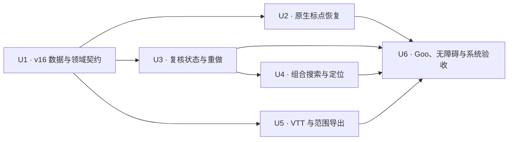

# Transcript Quality and Review Closure - Plan

## Goal Capsule

| Field | Value |
| --- | --- |
| Objective | 在不进入发布、AI、协作和采集扩展的前提下，把现有时间轴转写升级为可读、可筛、可复核、可撤销/重做并可按范围导出的 S2 本地闭环。 |
| Authority | `docs/product/meeting-voice-recognition-prd-v1.0.md` 定义产品目标；仓库中已安装的 Sherpa AAR、已打包模型资产、可运行代码与真机证据定义当前能力边界。 |
| Execution profile | 先固化 SQLite 与领域状态，再接入原生标点恢复；随后完成复核/重做、时间筛选、VTT/范围导出，最后统一做 Goo UI、无障碍、性能和真机验收。 |
| Stop conditions | 不伪造置信度，不把 Paraformer 不支持的参数包装成“热词”，不对日期/金额做可能改变语义的猜测式归一化，不让自动后处理覆盖用户修订或改变片段时间戳。 |
| Tail ownership | 本计划只负责单场会议的本地转写质量和人工复核。模型升级、说话人、跨会议搜索、生产 AI、协作、发布与商店交付分别由后续计划负责。 |

---

## Product Contract

### Summary

本计划延续已经完成的本地会议基础：录音/导入、持久化转写队列、时间戳片段、播放定位、片段编辑、撤销、当前会议原文搜索以及 TXT/Markdown/JSON/SRT 导出。

本轮把“能看转写”推进到“能系统复核转写”：

- 新生成的片段可使用仓库已经打包的离线 CT-Transformer 标点模型进行标点恢复。
- 片段具有独立于模型置信度的人工复核状态；未知置信度不会被当作高置信度。
- 编辑历史支持符合普通编辑器预期的撤销和重做，分支编辑会使旧重做分支失效但保留审计记录。
- 当前会议搜索支持文本、时间范围和复核状态组合筛选，结果仍能跳回音频。
- 导出新增 VTT，并支持按会议原始时间范围选择内容。
- 会议复核核心流程通过读屏、大字体、对比度、触控目标和 3000 片段性能验收。

### Problem Frame

当前 `RealSherpaTranscriptionEngine` 只读取 `OfflineRecognizerResult.text`，忽略了已经存在的 `enablePunctuation` 请求字段；队列还会强制把标点与降噪都设为 `false`。仓库已打包 `assets/sherpa/onnx/punctuation.onnx`，安装的 Sherpa AAR 也提供 `OfflinePunctuation.addPunctuation()`，因此离线标点恢复具备明确的本地实现路径。

另一方面，当前 AAR 的 `OfflineRecognizerResult` 只有 text、tokens、timestamps、language、emotion、event 和 durations，没有置信度或 log-probability。Sherpa 官方热词文档还明确限定 contextual biasing 只支持 Transducer + `modified_beam_search`，而本项目使用离线 Paraformer + greedy search。日期、金额、时间和单位的 inverse text normalization 虽然可通过规则 FST 扩展，但仓库目前没有经过许可与验证的 ITN FST 资产。

因此本计划必须区分“已有能力可直接产品化”和“需要模型/资产升级的能力”。人工复核状态可以立即落地，自动低置信度筛选、真实热词偏置和语义 ITN 则不能通过虚构分数、无效参数或启发式替换来假装完成。

### Actors

- A1. 会议所有者播放录音、阅读时间轴、标记待复核、确认片段、编辑文本、撤销/重做、筛选并导出。
- A2. 转写队列在用户设置允许且标点模型就绪时提交离线标点请求。
- A3. Android Sherpa 运行时负责识别、按 VAD 片段恢复标点并返回时间戳不变的结构化结果。
- A4. SQLite 与仓储层负责复核状态、编辑分支、范围查询和导出的单一事实来源。
- A5. 测试与真机验收人员验证可读性、语义不被猜测式改写、无障碍、性能与能力声明。

### Requirements

#### Punctuation and formatting truth

- R1. 新转写默认启用离线标点恢复，但只有在用户设置开启、模型描述符声明支持、资产校验成功且请求字段为 `true` 时才创建标点处理器。
- R2. 标点恢复按已识别的 VAD 片段执行，不改变 `sequence_id`、`start_ms`、`end_ms`、片段数量、生成代际或录音文件。
- R3. 标点处理器在一次转写任务内复用并可靠释放；初始化或推理失败必须归类为结构化 `punctuation` 阶段错误，不能静默返回未标点文本并宣称成功。
- R4. 长文本的段落展示与导出由片段边界和静音间隔派生，不把换行写进片段正文，也不破坏时间轴虚拟化。
- R5. 本轮不使用正则或大语言模型猜测日期、金额、时间、数量与单位。没有许可清晰、可回归验证的 ITN FST 之前，数字/日期语义归一化保持未开放。
- R6. 标点只作用于新生成的代际。重试产生新代际时仍遵守“有用户编辑或证据链接的活跃代际不被自动覆盖”的既有保护。

#### Review state and confidence truth

- R7. 每个片段有 `unreviewed`、`needs_review`、`reviewed` 三种人工复核状态，并记录最近确认时间；编辑正文不会改变时间戳。
- R8. 置信度继续是可空值。当前 Paraformer 返回 `null` 时 UI 显示“置信度未知”或不显示自动判断，绝不把 `null` 映射为 1.0、绿色高置信度或已复核。
- R9. 用户可以从时间轴将片段标为待复核或已复核，并可从筛选结果播放该片段后逐项确认。
- R10. 未来只有在模型输出经过校准的真实置信度后，才允许自动把片段归入低置信度筛选；该阈值不在本轮硬编码。

#### Revision behavior

- R11. 撤销继续按生成代际的全局编辑顺序回退最近一次有效编辑，且事务内同步刷新片段正文与 `merged_text`。
- R12. 重做按撤销顺序恢复最近被撤销且未失效的编辑；多次撤销后按栈顺序逐次重做。
- R13. 用户撤销后进行新编辑时，旧重做分支被标记为失效，不再出现在重做候选中；旧修订行保留用于审计。
- R14. 无可撤销或重做内容时操作不可用；重开会议后状态由数据库重新计算，不依赖内存布尔值。

#### Search and navigation

- R15. 单场会议搜索支持组合条件：可选文本、可选半开时间范围 `[start_ms, end_ms)`、可选人工复核状态。
- R16. 时间范围选择必须校验非负、起点小于终点、终点不超过会议时长；相交片段按 `sequence_id, start_ms, id` 稳定排序。
- R17. 搜索结果保留完整片段身份，点击结果仍定位到片段起点并恢复自动跟随。
- R18. 当前会议没有说话人数据，因此本轮不显示无效的说话人筛选。标题搜索属于跨会议入口，不塞入单场会议面板。

#### Export

- R19. 导出格式新增标准 VTT：包含 `WEBVTT` 头、空行分隔 cue、`HH:MM:SS.mmm` 时间和用户修订后的规范文本。
- R20. TXT、Markdown、JSON、SRT、VTT 都支持全部内容或原始会议时间范围；范围筛选使用与搜索相同的半开区间相交规则。
- R21. 范围导出保留原始会议时间戳，不重置为零；JSON 明确记录所选范围，便于追溯。
- R22. 空范围、无相交片段、非法范围或写入失败不登记成功导出资产；错误可恢复且不遗留部分文件。
- R23. 所有格式继续流式写入，并沿用受管资产登记、真实系统分享和完整删除契约。

#### UI, accessibility, performance, and truth

- R24. 修改后的设置页和会议详情页优先使用实际存在并通过 analyzer 的 Goo 组件与令牌；实施前核对 sibling `flutter-ui-mobile` 的 `DESIGN.md`、`DOC.md` 和具体组件 API。
- R25. 标点开关、复核状态、撤销/重做、筛选条件、导出格式与范围都有可读语义标签、可判断的禁用态和不依赖颜色的状态文本。
- R26. 会议复核核心流程支持系统读屏、200% 动态字体、明暗主题、足够对比度和最小触控目标，且 Compact/Medium/Expanded 布局不溢出。
- R27. 3000 个片段下时间轴仍使用惰性/虚拟化列表；筛选与状态更新不退化为每次重建全库或一次性拼接超长导出字符串。
- R28. 能力矩阵和 PRD 状态只把实际通过代码、自动化与相应真机证据的子能力改为已实现；自动低置信度、热词、ITN 与说话人搜索继续标为未实现或有依赖。

### Key Flows

- F1. 新会议生成带标点转写
  - **Trigger:** 录音或导入完成并进入离线转写队列。
  - **Actors:** A2, A3, A4
  - **Steps:** 队列读取标点设置，原生端校验并提取标点模型，识别每个 VAD 片段，恢复标点，持久化不变的片段时间范围和新代际。
  - **Outcome:** 新转写更可读；失败明确落在 `punctuation` 阶段，既有已编辑代际不被覆盖。
  - **Covered by:** R1-R6

- F2. 逐项复核片段
  - **Trigger:** 用户打开会议详情并选择“待复核”或“未复核”筛选。
  - **Actors:** A1, A4
  - **Steps:** 用户点击结果跳转播放，必要时编辑文本，再标为已复核。
  - **Outcome:** 片段正文、时间戳、复核状态和编辑记录一致持久化；未知置信度没有被伪装。
  - **Covered by:** R7-R10, R15-R17, R25-R27

- F3. 撤销、重做与分支编辑
  - **Trigger:** 用户编辑多个片段后连续撤销。
  - **Actors:** A1, A4
  - **Steps:** 用户逐次撤销，再逐次重做；若在撤销后进行新编辑，旧重做分支失效。
  - **Outcome:** 文本和 `merged_text` 始终一致，时间戳不变，重开页面后可用状态正确。
  - **Covered by:** R11-R14

- F4. 按文本、时间和状态定位
  - **Trigger:** 用户输入文本或设置时间/复核状态条件。
  - **Actors:** A1, A4
  - **Steps:** 服务执行组合查询，返回稳定排序的片段；用户点击结果跳到音频。
  - **Outcome:** 用户能快速收敛到需要复核的会议范围。
  - **Covered by:** R15-R18

- F5. 按范围导出
  - **Trigger:** 用户选择格式与原始会议时间范围。
  - **Actors:** A1, A4
  - **Steps:** 导出服务校验范围，流式生成选中格式，成功后登记受管资产并调用系统分享。
  - **Outcome:** TXT/Markdown/JSON/SRT/VTT 内容与当前规范片段一致，时间可追溯且失败不留脏资产。
  - **Covered by:** R19-R23

- F6. 系统无障碍验收
  - **Trigger:** 自动化检查通过后在支持的物理 Android 设备上启用 TalkBack、大字体和明暗主题。
  - **Actors:** A5
  - **Steps:** 完成筛选、播放、编辑、复核、撤销/重做和范围导出；记录布局、语义与性能结果。
  - **Outcome:** 核心闭环可在辅助功能下独立完成，能力矩阵只记录真实证据。
  - **Covered by:** R24-R28

### Acceptance Examples

- AE1. 给定标点设置开启且模型资产有效，当一个中文 VAD 片段识别为无标点文本时，结果正文含模型恢复的标点而时间范围、序号与片段数不变。
- AE2. 给定标点模型缺失或初始化失败，当任务执行时，任务以 `punctuation` 阶段错误结束，且不会写入伪成功代际。
- AE3. 给定旧会议已有用户编辑，当同一录音重试转写时，新结果不会自动替换受保护的活跃代际。
- AE4. 给定当前模型没有置信度，当会议打开时，片段不会显示为“高置信度”；用户仍可手动标为待复核或已复核。
- AE5. 给定三个连续编辑，当用户撤销两次再重做两次时，正文按预期恢复，`merged_text` 与片段集合一致且时间戳不变。
- AE6. 给定撤销后产生的新编辑，当用户尝试重做时，旧分支不可重做，但修订审计行仍存在并标记失效。
- AE7. 给定文本、10:00-15:00 和 `needs_review` 三个条件，当搜索执行时，只返回同时满足正文、时间相交和状态条件的片段。
- AE8. 给定 10:00-15:00 范围和 VTT 格式，当导出完成时，文件可解析、只含相交片段、保留原始会议时间并已登记为受管资产。
- AE9. 给定范围内没有片段，当导出执行时，用户得到可恢复提示，不产生空成功文件或资产记录。
- AE10. 给定 3000 个片段和 200% 字体，当用户筛选、跳转、复核并导出时，列表不一次性构建全部复杂子树，页面无布局溢出，语义节点可由读屏理解。

### Success Criteria

| Metric | Exit target |
| --- | --- |
| 标点能力真实性 | 100% 由本地模型输出；禁用、资产缺失与失败路径都有自动化覆盖，无静默降级。 |
| 时间戳稳定性 | 标点、复核、编辑、撤销、重做和导出都不改变片段 `start_ms/end_ms`。 |
| 编辑一致性 | 撤销/重做/分支编辑的仓储测试全部通过，片段正文与 `merged_text` 在同一事务内一致。 |
| 搜索正确性 | 文本、时间、状态及其组合条件覆盖边界相交、空条件、非法范围和稳定排序。 |
| 导出正确性 | 五种格式的全量/范围 fixture 通过；VTT 可解析，失败路径零受管资产残留。 |
| 可访问性 | TalkBack + 200% 字体下可完成 F2-F5，Compact/Medium/Expanded 和明暗主题无阻塞缺陷。 |
| 性能 | 3000 片段筛选、定位和流式导出不 OOM；时间轴保持惰性构建。 |
| 能力声明 | PRD/能力矩阵对已实现与依赖项的描述和运行时代码一致。 |

### Scope Boundaries

#### Included

- 新生成转写的离线 CT-Transformer 标点恢复与标点设置。
- 基于片段/静音边界的非破坏性段落展示与导出分组。
- 人工复核状态、未知置信度的诚实表示和按状态筛选。
- 编辑撤销、重做和撤销后新编辑的分支失效语义。
- 单场会议文本 + 时间范围 + 复核状态组合搜索。
- TXT、Markdown、JSON、SRT、VTT 的全部/范围导出。
- 会议复核核心流程的 Goo、一致语义、读屏、大字体、主题、触控目标和 3000 片段验证。

#### Deferred to Follow-Up Work

- **自动低置信度:** 当前 AAR 不提供置信度/log-probability。等待模型或绑定输出可校准信号后再定义阈值和自动归类。
- **真实热词偏置:** Sherpa 热词只支持 Transducer + modified beam search；当前 Paraformer 路径不支持。模型升级计划需先比较准确率、内存、RTF 和包体。
- **数字/日期/金额/单位 ITN:** 等待许可清晰且有中文回归集的 FST/FAR 资产，不用启发式替换冒险改变含义。
- **说话人筛选与命名:** 依赖说话人分离/聚类和稳定 speaker ID。
- **标题/跨会议搜索:** 属于主页或跨会议索引，不混入单场会议搜索面板。
- **完整历史浏览:** 本轮实现可审计的数据与撤销/重做，不新增面向用户的修订历史浏览器。

#### Outside This Plan

- 发布、签名、商店材料、PR/合并和远端部署。
- 降噪、移动端实时转写、系统音频采集、PC Live VAD。
- 生产 AI 提供商、自动摘要、协作、云同步、知识库、账号和企业治理。

### Dependencies

- `docs/plans/2026-07-23-001-feat-mobile-meeting-foundation-plan.md` 所实现的 SQLite v15、转写代际、时间戳片段、会议工作区、修订仓储、导出与受管资产契约保持可用。
- `android/app/libs/sherpa-onnx.aar` 的实际 Kotlin API 和打包 JNI 与 `assets/sherpa/onnx/punctuation.onnx` 在目标 ABI 上可用；安装包 API 优先于在线文档。
- sibling `flutter-ui-mobile` 的 `DESIGN.md`、`DOC.md` 和实际导出 API 是 UI 实现权威。
- 物理 Android 设备可用于标点模型运行、TalkBack、大字体、主题和范围导出的最终验收。

### Sources

- `docs/product/meeting-voice-recognition-prd-v1.0.md`
- `docs/product/mobile-capability-matrix.md`
- `docs/plans/2026-07-23-001-feat-mobile-meeting-foundation-plan.md`
- `android/app/src/main/kotlin/com/voice2text/app/transcription/RealSherpaTranscriptionEngine.kt`
- `android/app/src/main/kotlin/com/voice2text/app/transcription/TranscriptionModelRegistry.kt`
- `lib/data/sqlite/app_database.dart`
- `lib/features/transcription/repository/transcript_revisions_repository.dart`
- `lib/features/meetings/controller/meeting_review_controller.dart`
- `lib/features/meetings/service/meeting_search_service.dart`
- `lib/features/meetings/service/meeting_export_service.dart`
- `AGENTS.md`
- [Sherpa offline punctuation API](https://k2-fsa.github.io/sherpa/onnx/c-api/html/punctuation.html)
- [Sherpa punctuation pretrained models](https://k2-fsa.github.io/sherpa/onnx/punctuation/pretrained_models.html)
- [Sherpa hotword constraints](https://k2-fsa.github.io/sherpa/onnx/hotwords/index.html)
- [Sherpa offline recognizer ITN configuration](https://github.com/k2-fsa/sherpa-onnx/blob/master/sherpa-onnx/python/sherpa_onnx/offline_recognizer.py)

---

## Planning Contract

### Key Technical Decisions

- KTD1. 已安装 AAR 是原生能力的最终权威。计划使用其 `OfflinePunctuationConfig`、`OfflinePunctuationModelConfig` 和 `OfflinePunctuation.addPunctuation()`；不因配置类存在 `hotwordsFile` 就宣称当前模型支持热词。
- KTD2. 标点处理发生在每个 VAD 片段完成识别之后、`TranscriptionSegmentResult` 建立之前。相比整场拼接后再猜测如何拆回时间片段，这个选择牺牲部分跨片段上下文，但保证正文与时间戳一一对应、内存有界且不发生字符错配；真机质量门禁需验证未出现不可接受的过度断句。
- KTD3. 标点模型按任务创建一次并在所有片段间复用，不为每个片段重新加载 72 MB 模型。生命周期与 recognizer 一样用 `finally` 释放。
- KTD4. 段落是展示/导出派生结构，不是新数据库正文。默认以片段边界为基础，相邻片段静音间隔达到 1500 ms 时形成新段落；该集中常量必须有边界 fixture 测试。
- KTD5. SQLite 升级到 v16，一次添加 `app_settings.enable_punctuation`、`transcript_segments.review_state/reviewed_at_ms` 和 `transcript_revisions.invalidated_at_ms`，并提供从 v15 升级与全新建库的等价性测试。
- KTD6. 人工复核状态和模型置信度是正交字段。`needs_review` 由用户明确标记，`reviewed` 表示人工确认；未来真实置信度可以作为筛选输入，但不能反推人工确认。
- KTD7. 重做不是删除或复制修订行。撤销设置 `reverted_at_ms`，重做清空它；撤销后新编辑会给仍处于撤销态的旧分支设置 `invalidated_at_ms`。候选查询只考虑未失效行。
- KTD8. 搜索和导出共享 `MeetingTimeRange` 值对象与半开区间相交规则，`MeetingExportSelection` 只表达“全部或一个已验证范围”，避免 UI、SQL 和文件格式各自解释边界。
- KTD9. 范围导出保留绝对会议时钟。该选择优先保证审阅、证据链接和外部字幕回跳的可追溯性；若未来需要裁剪媒体并重置时间，另建媒体导出计划。
- KTD10. 不为本轮增加全局搜索索引、speaker 列或无效热词设置。能力矩阵要解释依赖，而不是用禁用占位 UI 制造已规划即已交付的错觉。

### Repository Patterns to Preserve

- Flutter 继续按 feature-first 分层：model/repository/service/controller/widget/page。
- SQLite 写入继续在 repository 内使用事务，并由 `AppDatabase` 集中管理 schema 与迁移。
- MethodChannel 参数保持基本类型 Map 契约，Android `MainActivity` 只做桥接，长耗时工作继续由 `TranscriptionExecutor` 线程执行。
- 原生错误继续使用 stage + code 分类，日志只记录 job、stage、duration、model 和错误类别，不记录转写正文、会议标题或完整敏感路径。
- Goo 组件只使用 sibling 包实际导出的 API；若文档与 analyzer 不一致，以能导入并通过 analyzer 的 API 为准。
- 导出继续流式写临时文件，成功后原子完成并登记受管资产；失败清理 partial。

### Delivery Sequence



---

## Implementation Units

### U1 — SQLite v16 and shared domain contracts

**Depends on:** none

**Covers:** R7-R8, R11-R16, R20-R22; KTD5-KTD9

#### Intent

先建立所有后续能力共享的持久化与边界语义，使标点设置、人工复核、重做分支和范围筛选不依赖页面内临时状态。

#### Files

- `lib/data/sqlite/app_database.dart`
- `lib/features/settings/model/app_settings.dart`
- `lib/features/settings/repository/app_settings_repository.dart`
- `lib/features/transcription/model/transcript_segment_entity.dart`
- `lib/features/transcription/model/transcript_revision_entity.dart`
- `lib/features/transcription/repository/transcript_segments_repository.dart`
- `lib/features/transcription/repository/transcript_revisions_repository.dart`
- `lib/features/meetings/model/meeting_time_range.dart` (new)
- `lib/features/meetings/model/meeting_export_selection.dart` (new)
- `test/features/transcription/schema_v16_upgrade_test.dart` (new)
- `test/features/settings/app_settings_test.dart`
- `test/features/transcription/transcript_segments_repository_test.dart`
- `test/features/transcription/transcript_revisions_repository_test.dart`
- `test/features/meetings/meeting_time_range_test.dart` (new)
- `test/features/meetings/meeting_export_selection_test.dart` (new)

#### Changes

- 把数据库版本从 15 升到 16，并在迁移与当前 schema 中加入：
  - `app_settings.enable_punctuation INTEGER NOT NULL DEFAULT 1`
  - `transcript_segments.review_state TEXT NOT NULL DEFAULT 'unreviewed' CHECK (review_state IN ('unreviewed', 'needs_review', 'reviewed'))`
  - `transcript_segments.reviewed_at_ms INTEGER`
  - `transcript_revisions.invalidated_at_ms INTEGER`
- 为人工复核状态建立封闭的 Dart enum/解析器；未知或损坏存储值安全回退为 `unreviewed`，但测试捕获不合法写入。
- 扩展设置、片段和修订实体及其 copy/serialization 契约。
- 为片段仓储增加事务化状态更新，并新增以 `generation_id, review_state, start_ms, end_ms, id` 为主序的组合索引，使 active-generation 状态/时间筛选先收窄后再执行文本匹配。
- 新增共享 `MeetingTimeRange`，集中校验非负、起点小于终点、终点不超过会议时长，并实现 `intersects(startMs, endMs)`；`MeetingExportSelection` 只包装 all/range 选择。
- 保证 v15 旧数据升级后：标点默认开启、片段均为未复核、原修订均未失效，旧正文、置信度、时间戳和外键不变。
- v16 迁移只做可追加列/索引变更并依赖 sqflite 升级事务保证原子性；任一步失败时数据库版本不得前移，不做破坏性表重建或部分 backfill。

#### Verification

- 从最小 v15 fixture 升到 v16，逐表验证列、CHECK 约束、默认值、索引、外键和原数据。
- 全新建库与升级库的 `PRAGMA table_info/index_list/foreign_key_list` 关键结果等价。
- 注入迁移中途失败，验证事务回滚且数据库仍可按 v15 数据备份重新打开/再次升级，不存在只加了一部分列的状态。
- 非法复核状态与非法范围得到确定性错误；合法边界包括首毫秒、会议末尾和相邻不相交片段。
- `AppSettingsRepository.save()` 不丢失录音授权、主题、模型或自动转写字段。

#### Done

- 后续单元不需要再修改 schema 语义。
- v15 用户数据无损升级，所有新字段都能通过实体和仓储往返。

### U2 — Real offline punctuation pipeline

**Depends on:** U1

**Covers:** R1-R3, R5-R6, R24-R25, R28; KTD1-KTD3

#### Intent

把已经打包但尚未接线的 CT-Transformer 标点模型接入真实 Paraformer 转写，并让设置、能力声明、错误阶段和资源生命周期一致。

#### Files

- `android/app/src/main/kotlin/com/voice2text/app/transcription/ModelAssetManager.kt`
- `android/app/src/main/kotlin/com/voice2text/app/transcription/ModelReadinessChecker.kt`
- `android/app/src/main/kotlin/com/voice2text/app/transcription/TranscriptionModelRegistry.kt`
- `android/app/src/main/kotlin/com/voice2text/app/transcription/PunctuationPostProcessor.kt` (new)
- `android/app/src/main/kotlin/com/voice2text/app/transcription/RealSherpaTranscriptionEngine.kt`
- `android/app/src/main/kotlin/com/voice2text/app/transcription/TranscriptionEngine.kt`
- `android/app/src/main/kotlin/com/voice2text/app/MainActivity.kt`
- `lib/features/settings/model/transcription_model_descriptor.dart`
- `lib/features/settings/settings_page.dart`
- `lib/features/transcription/service/transcription_queue_coordinator.dart`
- `android/app/src/test/kotlin/com/voice2text/app/transcription/PunctuationPostProcessorTest.kt` (new)
- `android/app/src/test/kotlin/com/voice2text/app/transcription/TranscriptionResultTest.kt`
- `android/app/src/androidTest/kotlin/com/voice2text/app/transcription/PunctuationModelSmokeTest.kt` (new)
- `test/features/settings/transcription_model_descriptor_test.dart`
- `test/features/settings/app_settings_test.dart`
- `test/features/transcription/transcription_queue_coordinator_test.dart`
- `test/features/transcription/transcription_runtime_contract_test.dart`

#### Changes

- 在 `ModelAssetManager` 中按现有 VAD/ASR 资产提取模式增加标点模型的校验、app-private 提取与稳定路径。
- 让 Kotlin/Dart 模型描述符只有在资产和 AAR 能力均成立时声明 `punctuationReady=true`；设置页提供“自动标点”开关并解释只影响新转写。
- 队列在每次 attempt 开始时从 `AppSettings` 读取 `enablePunctuation`，不再硬编码 `false`；MethodChannel 和 Kotlin request 继续传递明确布尔值。用户在重试前改变设置时，新 attempt 使用最新持久设置。
- 引入窄接口包装 `OfflinePunctuation`，使模型配置、单任务复用、逐片段 `addPunctuation`、释放和单元测试可控。
- 在 decode 后、时间戳映射前处理规范化文本；只做 trim、标点模型输出和确定性的空白规范化，不做日期/金额/单位猜测。
- 为进度流增加单调的 `punctuation` 阶段，并把初始化/推理异常映射到稳定错误代码；不记录输入/输出正文。
- 仅在标点启用时加载 72 MB 模型；关闭时不得提取或初始化。

#### Verification

- 单元测试覆盖启用/禁用、资产缺失、初始化失败、推理失败、空文本、中文/英文/混合文本和资源只释放一次。
- 验证标点前后 segment count、sequence、start/end 完全一致。
- 对标点前后文本移除 Unicode 标点和空白后做内容不变量检查，禁止模型接线造成字符丢失、重复或重排。
- 队列测试证明每个 attempt 都把当时的持久设置真实传到 native request，且重试前的设置变更会在新 attempt 生效。
- 在至少一台物理 Android 设备上用已知文本 smoke 和仓库测试 WAV 执行真实标点模型，记录内容不变量、断句抽检、成功、耗时、峰值内存和无 JNI 崩溃证据；若 VAD 片段级处理产生不可接受的过度断句则停止能力声明，另立有界上下文/重分配设计。

#### Done

- 新转写能真实产生模型标点，设置和能力矩阵没有占位声明。
- 标点关闭路径没有额外模型内存开销，失败路径没有伪成功代际。

### U3 — Manual review state and transactional redo

**Depends on:** U1

**Covers:** R4, R7-R14, R24-R27; KTD4, KTD6-KTD7

#### Intent

在不依赖虚构置信度的情况下交付可用的人工复核队列，并补齐符合用户预期的撤销/重做闭环。

#### Files

- `lib/features/transcription/repository/transcript_segments_repository.dart`
- `lib/features/transcription/repository/transcript_revisions_repository.dart`
- `lib/features/meetings/controller/meeting_review_controller.dart`
- `lib/features/meetings/meeting_detail_page.dart`
- `lib/features/meetings/widgets/transcript_timeline.dart`
- `lib/features/meetings/widgets/transcript_segment_editor.dart`
- `test/features/transcription/transcript_revisions_repository_test.dart`
- `test/features/transcription/transcript_segments_repository_test.dart`
- `test/features/meetings/meeting_review_controller_test.dart`
- `test/features/meetings/meeting_detail_page_test.dart`
- `test/features/meetings/transcript_timeline_test.dart`
- `test/features/meetings/transcript_segment_editor_test.dart`

#### Changes

- 在片段仓储中提供 `markNeedsReview`、`markReviewed`、`markUnreviewed`，在同一事务内维护 `review_state/reviewed_at_ms`。
- `MeetingReviewController` 加载/刷新时从数据库计算 `canUndo/canRedo`，暴露 redo 和复核状态操作；操作失败时不乐观更新 UI。
- 重写修订候选查询以支持：
  - 全局代际顺序的多步 undo。
  - 按最近撤销顺序的多步 redo。
  - 新编辑前将该代际仍可重做的撤销行标为 invalidated。
  - undo/redo 与 `merged_text` 同事务刷新。
- 在会议 AppBar 提供互斥且有语义的撤销/重做操作；无候选时禁用。
- 时间轴每项显示文本、时间、人工复核状态和可选的“置信度未知”，提供标为待复核/已复核的可达操作，不仅靠颜色表达。
- 相邻片段静音间隔达到 1500 ms 时，时间轴增加视觉/语义段落间距；列表项身份、点击定位、惰性构建和正文存储保持片段级。
- 由于段落间距、复核状态和 200% 字体会使列表项变高，移除固定 `itemExtent` 与 `index * 100` 跟随假设；继续使用惰性 builder，远距离定位先按已测平均高度近似滚动，再给当次目标项绑定单个临时 key，在其构建后用 `Scrollable.ensureVisible` 校正，禁止为 3000 个片段常驻 3000 个 GlobalKey。
- 复核状态改变不自动改写正文；正文编辑也不自动假定已经复核，除非用户在保存动作中明确选择“保存并标为已复核”。

#### Verification

- 仓储状态机覆盖：edit → undo → redo、三次 edit → 两次 undo → 两次 redo、undo → new edit → old redo unavailable、重开 DB 后候选一致。
- 每一步都断言 segment text、merged text、reverted/invalidated timestamps 和 start/end。
- 复核状态测试覆盖三态切换：只有 `reviewed` 写入确认时间，切到 `unreviewed/needs_review` 清空确认时间；同时覆盖并发刷新和 generation 隔离。
- Widget 测试覆盖禁用态、语义标签、未知置信度、不依赖颜色的状态文本、1500 ms 段落边界、远距离跟随校正和 200% 字体。

#### Done

- 用户能可靠地标记、确认、撤销和重做，重开会议后状态不漂移。
- 任何 UI 都不会从 `confidence == null` 推导高置信度或已复核。

### U4 — Combined transcript search and review navigation

**Depends on:** U3

**Covers:** R9-R10, R15-R18, R24-R27; KTD6, KTD8, KTD10

#### Intent

把当前只有 SQL `LIKE` 的搜索扩展为复核导向的文本、时间和人工状态组合筛选，同时保留跳转播放契约。

#### Files

- `lib/features/meetings/service/meeting_search_service.dart`
- `lib/features/meetings/controller/meeting_review_controller.dart`
- `lib/features/meetings/widgets/meeting_search_panel.dart`
- `lib/features/meetings/meeting_detail_page.dart`
- `test/features/meetings/meeting_search_service_test.dart`
- `test/features/meetings/meeting_review_controller_test.dart`
- `test/features/meetings/meeting_detail_page_test.dart`

#### Changes

- 新增不可变查询对象，允许文本为空但至少存在时间或状态条件；全空条件等价于清除筛选而不是全表搜索。
- SQL 只查询当前 recording 的 active generation，使用 `start_ms < endFilter` 与 `end_ms > startFilter` 判断相交，并按稳定顺序返回。
- 控制器对连续输入做现有交互可接受的防抖/取消旧结果保护，避免慢查询覆盖新条件。
- 搜索面板使用已文档化 Goo 搜索/筛选控件，显示当前条件、结果数量、清除动作和非法范围提示。
- 时间条件使用可键盘编辑、可读屏朗读的 `HH:MM:SS` 起止字段；小时允许超过 23，初始值为 `00:00:00` 到会议时长，解析后统一转换为 `MeetingTimeRange`。
- 点击结果继续调用 `seekToSegment`，清除筛选不改变当前播放位置。
- 不添加空的 title/speaker 选择器；在能力文档中记录其明确依赖。

#### Verification

- 服务测试覆盖纯文本、纯时间、纯状态、三者组合、Unicode、`%/_` 转义、边界相交、无结果、非活跃代际和 3000 片段。
- 控制器测试覆盖旧查询结果晚到、清除条件、点击结果后恢复自动跟随。
- Widget 测试覆盖键盘输入、范围错误、筛选标签、读屏顺序和大字体换行。

#### Done

- 用户能从未复核/待复核片段中按时间和文本收敛，并一键跳回音频。
- 搜索没有声称支持仓库中不存在的 speaker/title 语义。

### U5 — VTT and range-aware streaming export

**Depends on:** U1

**Covers:** R4, R19-R23, R25-R27; KTD4, KTD8-KTD9

#### Intent

在既有受管资产和系统分享闭环上补齐 VTT，并让所有基础格式共享可验证的范围选择。

#### Files

- `lib/features/meetings/model/meeting_export_selection.dart` (new; created in U1)
- `lib/features/meetings/model/meeting_time_range.dart` (new; created in U1)
- `lib/features/meetings/service/meeting_export_service.dart`
- `lib/features/meetings/widgets/meeting_export_panel.dart`
- `lib/features/meetings/meeting_detail_page.dart`
- `test/features/meetings/meeting_export_selection_test.dart` (new; created in U1)
- `test/features/meetings/meeting_export_service_test.dart`
- `test/features/meetings/meeting_detail_page_test.dart`
- `integration_test/meeting_offline_flow_test.dart`

#### Changes

- 给 `MeetingExportFormat` 增加 `vtt`，扩展名 `.vtt`，MIME/分享显示名与真实文件一致。
- 统一 SRT/VTT 时间格式函数并分别使用逗号/句点毫秒分隔；VTT 写入 BOM-free UTF-8 `WEBVTT` 头和合法 cue 空行。
- 导出服务接受 `MeetingExportSelection.all` 或已验证范围，只流式读取/写入相交片段。
- TXT/Markdown 仅写选中正文；JSON 增加 selection 元数据；SRT/VTT 保留原始时间戳。
- TXT/Markdown 在相邻片段静音间隔达到 1500 ms 时写段落空行；JSON/SRT/VTT 继续保持片段/cue 结构。
- 导出面板提供“全部/时间范围”选择、`HH:MM:SS` 起止字段、格式说明、相交片段预览数量和禁用/错误态；小时允许超过 23，初始范围覆盖整场会议。
- 零片段与写入失败时清理 partial，不调用 `registerOwnedAsset`；成功路径沿用分享与删除协调器。

#### Verification

- fixture 精确比对五种格式的全量与范围输出，覆盖 Unicode、换行、HTML-like 文本、1500 ms 段落边界、超过一小时和毫秒边界；范围 SRT 从 1 连续重编号，VTT cue 不依赖原始序号。
- VTT fixture 通过仓库内确定性解析器验证 header、cue 顺序、时间格式与正文；SRT 回归不变。
- 服务测试断言非法/空范围和模拟 sink 失败时没有受管资产行或 partial。
- 集成测试从会议页选择范围、导出 VTT、分享测试接收器读取完整字节并验证内容。

#### Done

- 五种格式都能按全部或原始时间范围稳定导出，VTT 与现有分享/删除生命周期完整接通。

### U6 — Goo polish, accessibility, performance, device evidence, and docs

**Depends on:** U2, U3, U4, U5

**Covers:** R24-R28 and all acceptance examples

#### Intent

把各功能收束成一致的会议复核体验，并用自动化与物理设备证据决定哪些 PRD/能力矩阵条目可以更新。

#### Files

- `lib/features/settings/settings_page.dart`
- `lib/features/meetings/meeting_detail_page.dart`
- `lib/features/meetings/widgets/meeting_search_panel.dart`
- `lib/features/meetings/widgets/meeting_export_panel.dart`
- `lib/features/meetings/widgets/transcript_timeline.dart`
- `test/features/meetings/meeting_detail_page_test.dart`
- `test/features/meetings/transcript_timeline_test.dart`
- `integration_test/meeting_offline_flow_test.dart`
- `docs/product/meeting-voice-recognition-prd-v1.0.md`
- `docs/product/mobile-capability-matrix.md`
- `docs/REAL_DEVICE_REGRESSION_MATRIX.md`
- `tool/run_meeting_flow_smoke.sh`

#### Changes

- 实施 UI 前重新读取 sibling Goo 设计/开发文档并检查将使用组件的源代码、demo 和测试；不猜测构造参数或视觉令牌。
- 在 Compact/Medium/Expanded 下整理搜索、时间轴和导出面板的阅读顺序；保留既有业务行为和平台契约。
- 为动态状态添加语义 live region 或适当公告：筛选结果数、保存/复核成功、撤销/重做不可用、范围错误和导出完成。
- 保持时间轴惰性构建；3000 片段下用 profile/测试证明筛选、滚动、高亮、状态更新和导出无明显回归。
- 扩展集成 smoke：真实转写 → 标点 → 标待复核 → 搜索/跳转 → 编辑 → undo/redo → 标已复核 → 范围 VTT 导出。
- 在物理设备执行 TalkBack、200% 字体、明暗主题、方向/窗口尺寸、系统分享读取和标点模型资源检查。
- 只在证据通过后更新 PRD 与能力矩阵：
  - 可将标点子能力、人工复核、重做、时间条件搜索、VTT/范围导出和系统无障碍验收标为已实现。
  - ASR-004 仍注明数字/日期/金额/单位 ITN 未实现。
  - ASR-006 仍注明自动低置信度依赖真实模型信号。
  - ASR-007 保持未实现并注明 Paraformer 限制。
  - POST-003 保留 title/speaker 依赖。

#### Verification

- 运行完整项目检查与 debug build。
- 在无设备时 watcher 脚本安全跳过；有物理 Android 设备时启动/复用 UI watcher。
- 按 `docs/REAL_DEVICE_REGRESSION_MATRIX.md` 留下设备型号、Android 版本、测试媒体、关键耗时/内存、TalkBack/字体/主题结果和导出字节证据。
- 检查运行日志不含转写正文、会议标题和完整路径。

#### Done

- 自动化、真机记录和文档声明相互一致。
- 发布仍保持暂停；本单元不提交、推送、开 PR 或运行发布流程。

---

## Verification Contract

### Per-Unit Gates

| Unit | Required checks |
| --- | --- |
| U1 | `flutter test test/features/transcription/schema_v16_upgrade_test.dart test/features/settings/app_settings_test.dart test/features/transcription/transcript_segments_repository_test.dart test/features/transcription/transcript_revisions_repository_test.dart test/features/meetings/meeting_time_range_test.dart test/features/meetings/meeting_export_selection_test.dart` |
| U2 | `cd android && ./gradlew testDebugUnitTest --tests 'com.voice2text.app.transcription.*'`; `flutter test test/features/settings/transcription_model_descriptor_test.dart test/features/transcription/transcription_queue_coordinator_test.dart test/features/transcription/transcription_runtime_contract_test.dart` |
| U3 | `flutter test test/features/transcription/transcript_revisions_repository_test.dart test/features/transcription/transcript_segments_repository_test.dart test/features/meetings/meeting_review_controller_test.dart test/features/meetings/meeting_detail_page_test.dart test/features/meetings/transcript_timeline_test.dart test/features/meetings/transcript_segment_editor_test.dart` |
| U4 | `flutter test test/features/meetings/meeting_search_service_test.dart test/features/meetings/meeting_review_controller_test.dart test/features/meetings/meeting_detail_page_test.dart` |
| U5 | `flutter test test/features/meetings/meeting_export_selection_test.dart test/features/meetings/meeting_export_service_test.dart test/features/meetings/meeting_detail_page_test.dart`; `flutter test integration_test/meeting_offline_flow_test.dart` where the configured integration environment supports it |
| U6 | `./tool/dev_check.sh --with-build`; `./tool/ensure_ui_watcher.sh`; physical-device matrix steps for punctuation, TalkBack, 200% text, themes, 3000 segments, VTT/range share |

### Cross-Cutting Automated Gates

Run from the repository root after all implementation units:

```bash
dart format --output=none --set-exit-if-changed lib test integration_test
flutter analyze
flutter test
(cd android && ./gradlew testDebugUnitTest)
./tool/dev_check.sh --with-build
./tool/ensure_ui_watcher.sh
```

### Required Scenario Evidence

- Database: v15 → v16 migration preserves all existing recordings, generations, segments, confidence values, revisions, settings and foreign keys.
- Native: real punctuation model loads once per task, processes mixed Chinese/English, preserves timing, releases cleanly and reports structured failure.
- Review: unknown confidence remains unknown; manual states survive restart; generation isolation prevents one meeting/version from mutating another.
- History: multi-step undo/redo and branch invalidation are deterministic across process restart.
- Search: text/time/state composition, boundary intersection and stale-query suppression.
- Export: full/range output for five formats, VTT parseability, absolute timestamps, partial cleanup, asset registration and system receiver byte read.
- Accessibility: TalkBack focus/announcements, 200% font, theme contrast, target size and no layout overflow.
- Performance: 3000 segments scroll/search/update/export without OOM or eager complex-list construction.
- Privacy: no transcript text, title or full private path in native/Dart operational logs.

### Stop-the-Line Failures

- 标点模型失败被静默吞掉或标点开关与实际 native request 不一致。
- 任何自动规则改变数字、日期、金额、单位语义而没有确定性词法资产和 fixture。
- `confidence == null` 被显示或存储为高置信度。
- undo/redo 造成片段正文与 `merged_text` 不一致，或改变时间戳/代际。
- 范围搜索与范围导出对边界有不同解释。
- 导出失败留下受管资产记录或 partial 文件。
- 大字体/读屏使编辑、复核、重做或导出主路径不可完成。
- 能力矩阵把热词、自动低置信度、ITN 或 speaker 搜索误标为已实现。

---

## Definition of Done

- [x] SQLite v16 在全新建库和 v15 升级路径上通过，旧用户数据与外键无损。
- [x] 标点设置、模型就绪、请求桥接、原生处理、阶段进度、错误和释放形成真实闭环。
- [x] 标点不会改变片段序号、时间戳、数量或覆盖受保护代际。
- [x] 人工复核三态可持久化、筛选和逐项确认；未知置信度始终诚实呈现。
- [x] 多步撤销、重做、分支失效和进程重启语义均有仓储与控制器测试。
- [x] 单场会议支持文本、时间范围和复核状态组合筛选并跳回音频。
- [x] TXT、Markdown、JSON、SRT、VTT 支持全量/范围流式导出，失败无残留。
- [x] Goo UI 使用真实 API，Compact/Medium/Expanded、明暗主题和 200% 字体无阻塞布局问题。
- [x] TalkBack 能完成筛选、播放、编辑、复核、undo/redo 和范围导出主流程。
- [x] 3000 片段场景没有 OOM 或明显的 eager-build 回归。
- [x] `./tool/dev_check.sh --with-build` 通过，`./tool/ensure_ui_watcher.sh` 已按项目要求运行。
- [x] 至少一台物理 Android 设备完成真实标点、无障碍和 VTT/范围分享验证并留下证据。
- [x] PRD、能力矩阵和真机矩阵只更新已验证子能力，保留热词、ITN、自动置信度和 speaker/title 搜索的依赖说明。
- [x] 没有执行发布、提交、推送、PR、部署或商店流程。
