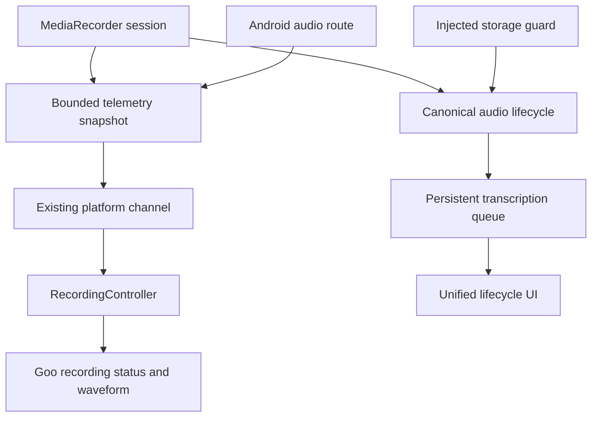
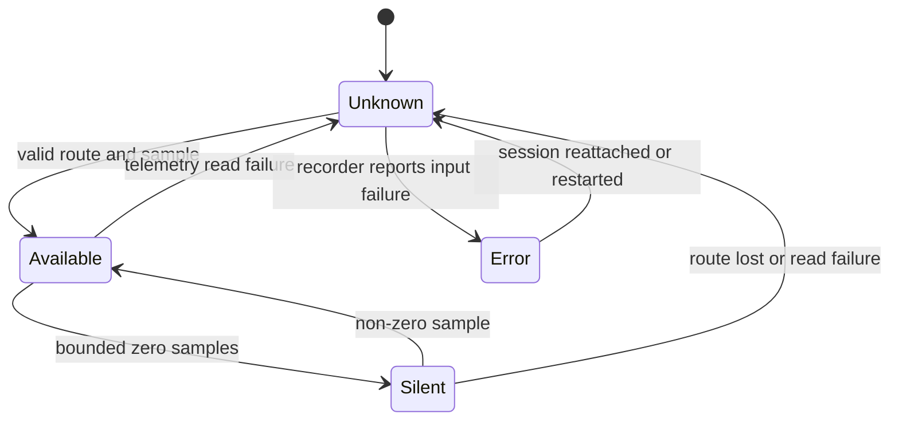

# S1 Non-Release Quality Closure - Plan

## Goal Capsule

| Field | Value |
| --- | --- |
| Objective | 在保持发布延期的前提下，关闭 S1 尚未完成的真实录音输入状态、低存储安全证据、统一任务恢复体验和 Goo 主题一致性。 |
| Authority | `docs/product/meeting-voice-recognition-prd-v1.0.md` 定义产品结果；Android 官方 API、当前仓库代码、安装的 Goo API 和物理设备证据定义实现边界。 |
| Execution profile | 先固化录音遥测契约，再完成真机安全门禁证据；随后审计统一首页的状态/恢复操作并移除已确认的 Goo 漂移，最后运行全量检查和回写产品状态。 |
| Stop conditions | 不填充物理设备存储来制造低空间，不把未知输入路由显示成确定设备，不记录会议正文或完整私有路径，不进入发布、S2 新功能、模型升级、S3 或 S4。 |
| Tail ownership | 本计划只负责 S1 非发布项。系统分享导入、输入设备主动切换、会中标记持久化、批量管理和保留策略由后续 S2 计划承担。 |

---

## Execution Status

2026-07-24 已完成 U1-U6 的非发布范围：

- U1-U2：原生真实幅度/实际路由快照、Flutter 有界轮询、诚实降级和页面状态已实现并通过单元/widget 测试。
- U3：Xiaomi M2102J2SC 物理设备上的低存储注入 smoke 2/2 通过；没有通过填满设备制造场景。
- U4：统一首页从持久化仓储呈现完整任务生命周期，失败详情提供阶段、原因和真实重试入口。
- U5：首页、设置和录音状态区域的已知 Material 漂移已迁到 Goo，200% 字体门禁通过。
- U6：`./tool/dev_check.sh`、Android JVM 测试、物理设备 instrumentation、隐私契约和 UI watcher 均通过；PRD 与设备矩阵已回写。

发布、高端设备覆盖、完整 EXP-008 诊断，以及 REC-008/009/010 等 S2 能力仍按
原边界延期，不属于本计划完成声明。

---

## Product Contract

### Summary

本计划把当前“录音主链路已通过”收尾为可真实观察、可恢复且主题一致的 S1 产品基线。
录音页显示来自原生录音器的麦克风电平和当前输入路由；低存储通过可注入门禁在物理设备上安全验证；统一首页为待处理、处理中、失败和完成任务提供一致状态与恢复操作；核心页面不再混用已被 Goo 替代的 Material 表面。

### Problem Frame

录音页当前波形由时间和正弦函数生成，无法表达真实麦克风电平、静音、输入异常或路由变化。
原生 `MediaRecorder` 已具备 `getMaxAmplitude()`，Android 音频 API 也能观察输入设备变化，但这些信号尚未进入 Flutter 契约。

低存储门禁已经由 `RecordingStorageGuard`、前台服务轮询和单元测试覆盖，缺口是物理设备上的安全路径证据。
直接填满用户设备既破坏性强也没有必要；应通过依赖注入在 instrumentation 环境中验证同一生产门禁的拒绝和停止语义。

首页和转写页已经能展示多数任务状态，但状态文案、失败建议和恢复入口需要以真实仓储状态为依据完成审计。
当前 Goo 漂移集中在首页与设置页的 Material 对话框、输入框、提示条和加载指示器；这些位置会造成明暗主题、视觉语言和无障碍行为不一致。

### Actors

- A1. 会议记录者在录音页观察真实输入电平、静音/异常和当前输入设备。
- A2. Android 录音服务采样幅度、观察输入路由并保持录音优先。
- A3. 会议所有者在统一首页查看任务状态、失败原因并执行可用的恢复操作。
- A4. 测试与真机验收人员在不消耗设备存储的情况下验证低存储门禁和界面一致性。

### Requirements

#### Recording observability

- R1. 录音中的波形只由原生录音器返回的真实幅度驱动；暂停、空闲或不可用时显示诚实的静止/未知状态。
- R2. 输入状态至少区分可用、静音、异常和未知，并显示当前路由的用户可读类型；未知路由不得伪装成手机麦克风。
- R3. 原生遥测读取失败不得停止或破坏录音，Flutter 端应降级为未知状态并继续保存。
- R4. 幅度采样应有界且不写入 SQLite、日志或分析数据，不保存可反推会议内容的连续音量历史。

#### Low-storage safety

- R5. 开始录音时低于安全储备必须在创建有效录音前失败，并返回稳定、可执行的低存储错误。
- R6. 录音期间跌破安全储备时应停止并走既有安全完成/恢复语义，不创建伪成功记录。
- R7. 真机验收使用注入的可用空间提供器触发生产门禁，不通过填满设备或删除用户文件制造场景。

#### Unified lifecycle and recovery

- R8. 统一首页必须能区分待转写、处理中、失败和已完成，并从持久化任务状态恢复，不依赖只存在于页面内存的标记。
- R9. 失败状态显示可理解的阶段、原因和至少一个真实可用的恢复操作；不可恢复状态不得显示无效按钮。
- R10. 长任务离开页面后继续运行，返回首页能重新读取进度；重复点击重试或删除不会创建重复任务或破坏幂等性。

#### Design-system consistency

- R11. 首页和设置页中已存在 Goo 替代组件的 Material 对话框、表单、提示、加载态和底部面板应迁移到实际可导入且通过 analyzer 的 Goo API。
- R12. 明暗主题、200% 字体、读屏语义和触控目标在核心首页、设置和录音状态区域保持可用，不通过颜色单独表达任务或输入状态。

#### Capability truth

- R13. 产品文档只把有自动化和对应设备证据的子能力标为已实现；安全注入证据不得描述为“真实填满设备”。
- R14. 发布、系统分享导入、输入设备主动切换、会中标记持久化、自动清理和模型能力保持延期或后续阶段状态。

### Key Flows

- F1. 观察真实录音输入
  - **Trigger:** 用户开始录音。
  - **Actors:** A1, A2
  - **Steps:** 原生录音器启动后周期性返回当前幅度和输入路由；Flutter 控制器转换为有界 UI 状态；页面展示真实波形和文字状态。
  - **Outcome:** 用户能区分有声、静音、输入异常和未知状态，遥测失败不影响音频保存。
  - **Covered by:** R1-R4

- F2. 安全验证低存储门禁
  - **Trigger:** instrumentation 将可用空间提供器设置为低于储备阈值。
  - **Actors:** A2, A4
  - **Steps:** 测试调用与生产录音相同的存储门禁，验证启动拒绝或录音中安全停止；检查无用户文件被写满或删除。
  - **Outcome:** 物理设备留下可复跑的低存储门禁证据，且不承担破坏性风险。
  - **Covered by:** R5-R7

- F3. 从首页恢复失败任务
  - **Trigger:** 用户返回应用，仓储中存在 pending、processing、failed 或 completed 任务。
  - **Actors:** A3
  - **Steps:** 首页加载真实状态；失败项展示阶段与原因；用户执行允许的重试、恢复或清理动作；列表重新读取仓储。
  - **Outcome:** 状态与操作一致，恢复幂等且长任务不要求停留在原页面。
  - **Covered by:** R8-R10

- F4. 核心界面主题一致性
  - **Trigger:** 用户在首页、设置和录音页使用明暗主题、大字体或读屏。
  - **Actors:** A1, A3, A4
  - **Steps:** 核心表面使用 Goo 组件和令牌；错误、加载、禁用与恢复状态同时提供文字和语义信息。
  - **Outcome:** 核心 S1 流程不因混用 Material 表面产生主题或无障碍断裂。
  - **Covered by:** R11-R12

### Acceptance Examples

- AE1. 给定录音器返回连续非零幅度，当录音页刷新时，波形随真实样本变化且暂停后停止变化。
- AE2. 给定录音器无法提供幅度，当录音继续时，页面显示“输入状态未知”而不是模拟运动波形，录音仍可停止并保存。
- AE3. 给定当前路由是有线或蓝牙输入，当系统报告设备变化时，页面更新用户可读路由；断开后显示降级或未知，不声称仍在使用已断开的设备。
- AE4. 给定可用空间低于储备阈值，当物理设备 instrumentation 启动录音门禁时，返回 `LOW_STORAGE` 且不产生 canonical 音频。
- AE5. 给定处理中任务后应用页面重建，当用户回到首页时，同一任务仍显示持久化进度且没有重复任务。
- AE6. 给定失败任务，当用户重试时，按钮防重复触发，任务进入可观察的队列状态；不可重试失败只显示真实可用的处理建议。
- AE7. 给定深色主题和 200% 字体，当用户完成首页重命名、分组、提示确认和设置保存时，界面无溢出且核心控件具有可读语义。

### Success Criteria

| Metric | Exit target |
| --- | --- |
| 波形真实性 | 录音态波形由原生幅度驱动；模拟正弦波不再用于生产录音状态。 |
| 遥测隔离 | 遥测读取异常不改变录音状态机、音频文件和转写队列结果。 |
| 低存储证据 | 至少一台物理 Android 设备运行安全注入 instrumentation 并证明稳定错误分类与零 canonical 产物。 |
| 生命周期一致性 | pending、processing、failed、completed 和重试幂等均有自动化覆盖。 |
| 设计一致性 | 核心页面不再使用已有 Goo 对等物的 Material 表面；analyzer、主题和大字体检查通过。 |
| 声明准确性 | PRD 与设备矩阵区分真实设备状态、注入证据、部分能力和发布延期。 |

### Scope Boundaries

#### Included

- 真实麦克风幅度读取、输入路由观察和 Flutter 展示。
- 低存储生产门禁的安全真机注入验证。
- 统一首页任务状态、失败原因和恢复操作审计与必要修复。
- 首页、设置页和录音状态区域的 Goo 一致性修复。
- 自动化、UI watcher、物理设备证据和产品文档回写。

#### Deferred to Follow-Up Work

- REC-008 系统分享导入。
- REC-009 用户主动选择或切换蓝牙/有线输入设备；本计划只观察实际路由。
- REC-010 会中重点和备注持久化。
- POST-004 批量移动、重试与导出。
- SEC-003 自动保留期限和清理策略。
- EXP-008 完整产品级诊断仪表；本计划只保证新增遥测不泄露正文并复用现有诊断门禁。
- EXP-009 应用内帮助与反馈。

#### Outside this plan

- EXP-005 发布、签名、商店交付和正式 release preflight。
- 模型、热词、ITN、自动置信度、说话人、AI、云同步、协作和跨会议搜索。

### Dependencies

- Android `MediaRecorder.getMaxAmplitude()` 提供自上次调用以来的最大绝对幅度；无数据或未调用录音源时允许返回零。
- Android `AudioManager`/`AudioDeviceCallback` 提供设备变化观察；生产显示以实际路由信息为准。
- `flutter-ui-mobile` 的 `DESIGN.md`、`DOC.md` 和当前包 API 是 UI 迁移权威。
- 当前 `RecordingStorageGuard` 的可用空间提供器注入是安全低存储验证的基础。

### Sources

- `docs/product/meeting-voice-recognition-prd-v1.0.md`
- `docs/REAL_DEVICE_REGRESSION_MATRIX.md`
- `docs/plans/2026-07-23-001-feat-mobile-meeting-foundation-plan.md`
- `android/app/src/main/kotlin/com/voice2text/app/recording/StandardRecordingSession.kt`
- `android/app/src/main/kotlin/com/voice2text/app/recording/RecordingStorageGuard.kt`
- `lib/features/recording/recording_page.dart`
- `lib/features/home/home_page.dart`
- `https://developer.android.com/reference/android/media/MediaRecorder`
- `https://developer.android.com/reference/android/media/AudioManager`

---

## Planning Contract

### Key Technical Decisions

- KTD1. 使用录音器按需采样而不是持续保存音量流。Flutter 只保留渲染所需的短窗口，避免把声学侧信号变成持久数据。
- KTD2. 遥测是录音状态的附属读取接口，不参与开始、暂停、恢复或停止命令；读取失败永远不能使录音失败。
- KTD3. 输入路由先做只读观察。主动设备选择属于 REC-009，不能在本计划中用未验证的路由强制逻辑扩大范围。
- KTD4. 低存储真机证据通过同一生产门禁的依赖注入获得，不制造真实磁盘压力；证据文本明确标注为注入场景。
- KTD5. 统一首页继续以 SQLite 仓储为事实来源。UI 不新增第二套任务状态机，也不从显示文案反推行为。
- KTD6. Goo 迁移只替换已确认存在的组件和令牌；若文档与安装 API 不一致，以 analyzer 通过的安装 API 为准。

### High-Level Technical Design

### Assumptions

- 当前分支中的录音、队列、时间轴和删除改动是本轮基线，实施只做增量，不回滚或重建既有工作。
- REC-005 的代码契约已经满足，剩余工作主要是安全物理设备证据和文档精确化。
- EXP-001/EXP-002 先审计后修改；已经满足的状态不重复实现，只补真实缺口和测试。
- EXP-008 是 S1+ 持续能力，本计划不把有限日志包装成完整监控产品。
- 发布继续延期，因此 release 构建、签名和商店材料不属于完成条件。

### Repository Patterns to Preserve

- `RecorderPort`/`AndroidRecorderEngine` 保持 Flutter 与 Android 录音契约边界。
- `RecordingController` 负责可观察 UI 状态，录音页不直接调用平台 channel。
- `RecordingStorageGuard` 通过注入提供器验证边界，不在测试中操纵真实磁盘。
- `TranscriptionJobsRepository` 与队列协调器保持任务状态和重试幂等的事实来源。
- Goo 组件只使用 `package:flutter_ui_mobile/flutter_ui_mobile.dart` 实际导出的 API。

### System-Wide Impact

- **录音进程边界:** Flutter 页面可能销毁而前台服务继续录音。遥测轮询和音频设备监听必须能够独立停止、重新附着和重建，不能把 Activity 生命周期当作录音生命周期。
- **平台契约:** 新字段是向后兼容的只读快照扩展。缺失字段、旧进程快照或平台异常必须解析为未知状态，而不是使 `RecordingSessionSnapshot` 失败。
- **资源与性能:** 幅度读取和 UI 刷新频率需要独立限流；设备回调只更新最新路由，不能为每个样本发送事件、写数据库或累积无界历史。
- **隐私:** 幅度、路由类型和错误类别只用于当前 UI 与非正文诊断。不得记录连续幅度序列、设备名称、蓝牙地址、会议标题、正文或完整私有路径。
- **恢复语义:** 低存储、权限撤销和音频焦点丢失仍沿用现有停止/恢复状态机。新增遥测不能改变 finalize、sidecar journal、队列去重或删除协调器。
- **测试表面:** JVM 测试验证纯契约和错误隔离；instrumentation 验证真实 `MediaRecorder`、物理设备权限和文件结果；Flutter widget 测试验证状态表达与 timer 清理。

### Risks & Dependencies

| Risk or dependency | Mitigation |
| --- | --- |
| `getMaxAmplitude()` 在无新样本时返回零，单个零值不能证明静音 | 使用短窗口和连续样本判定静音；零值仍保持诚实，不人工制造波形。 |
| 路由信息在设备或 Android 版本上不可用 | 契约允许 unknown；UI 不把 unknown 显示为内置麦克风。 |
| Activity 销毁后监听器或 timer 泄漏 | 控制器在 pause/stop/dispose 停止轮询；原生回调由服务生命周期注册和注销。 |
| 过高采样频率影响录音或电量 | 使用有界低频采样和固定短窗口；性能 smoke 观察录音稳定性。 |
| instrumentation 只验证注入门禁，却被误写为真实磁盘耗尽 | 测试、证据和 PRD 使用“物理设备上的注入低存储场景”措辞；不宣称真实填盘。 |
| Material 控件没有 Goo 对等物 | 只迁移文档和安装 API 中存在的对等组件；无对等物时保留行为并记录原因，不发明 API。 |
| 当前工作树包含前序未提交改动 | 仅修改本计划列出的文件，评审实际 diff，不清理或回退无关改动。 |

### Delivery Sequence

1. 先扩展录音遥测契约和原生实现，保持音频状态机不变。
2. 接入控制器和录音页，完成真实幅度、输入状态和路由的自动化。
3. 增加物理设备安全低存储 instrumentation，并留存非破坏性证据。
4. 审计统一首页任务生命周期，补齐状态、恢复动作和幂等测试。
5. 按 Goo 文档清除核心页面已确认的 Material 漂移并做无障碍/布局验证。
6. 运行全量项目检查、UI watcher 和物理设备 smoke，回写 PRD 与设备矩阵。

---

## Implementation Units

### U1. Add bounded native recording telemetry

- **Goal:** 原生录音服务提供真实幅度和实际输入路由的只读快照，任何读取失败都不改变录音状态机。
- **Requirements:** R1-R4
- **Dependencies:** None
- **Files:**
  - Modify `android/app/src/main/kotlin/com/voice2text/app/recording/StandardRecordingSession.kt`
  - Modify `android/app/src/main/kotlin/com/voice2text/app/recording/RecordingForegroundService.kt`
  - Modify `android/app/src/main/kotlin/com/voice2text/app/MainActivity.kt`
  - Modify `android/app/src/main/kotlin/com/voice2text/app/contracts/AudioContract.kt`
  - Modify `android/app/src/test/kotlin/com/voice2text/app/recording/StandardRecordingSessionTest.kt`
  - Create or modify `android/app/src/test/kotlin/com/voice2text/app/recording/RecordingTelemetryTest.kt`
- **Approach:** 在已运行的 `MediaRecorder` 上按需读取最大幅度并归一化为稳定范围；从实际 routed/preferred device 和音频设备变化回调生成用户无关的类型/可用状态。平台调用返回单个快照，不推送或持久化连续样本。
- **Execution note:** 先增加会失败的契约测试，证明遥测异常不会传播到录音命令，再实现生产读取。
- **Patterns to follow:** `StandardRecordingSession.snapshot()`、`RecordingForegroundService.latestSnapshot`、现有 ResultReceiver 映射。
- **Test scenarios:**
  - 录音中返回有界非零幅度、设备类型和可用状态。
  - 暂停或空闲返回零幅度和相应状态，不伪造活动输入。
  - `getMaxAmplitude()` 或设备读取抛错时返回未知快照，录音仍可停止并完成。
  - 设备断开后快照不继续声称使用已断开的路由。
  - Activity 销毁和重建时，服务侧路由监听不重复注册，Flutter 重新附着后能读取最新快照。
- **Verification:** Android 单元测试证明快照契约、边界和错误隔离，原生编译通过。

### U2. Render real input state in Flutter

- **Goal:** Flutter 录音页用真实遥测替代模拟波形，并以文字和语义暴露输入状态。
- **Requirements:** R1-R4, R12
- **Dependencies:** U1
- **Files:**
  - Modify `lib/features/recording/engine/recorder_port.dart`
  - Modify `lib/features/recording/engine/android_recorder_engine.dart`
  - Modify `lib/features/recording/engine/fake_recorder_engine.dart`
  - Modify `lib/features/recording/controller/recording_controller.dart`
  - Modify `lib/features/recording/recording_page.dart`
  - Modify `test/features/recording/recording_controller_test.dart`
  - Modify `test/features/recording/recording_page_test.dart`
- **Approach:** 控制器在录音态以有界频率轮询快照并维护短幅度窗口；暂停、停止、错误和 dispose 时停止采样。页面根据真实窗口绘制波形，并为 available/silent/error/unknown 与路由类型提供非颜色状态文本。
- **Execution note:** 先把现有页面测试改为要求真实样本驱动并观察模拟波形断言失败，再实现控制器和 UI。
- **Patterns to follow:** 现有 controller ticker 生命周期、Goo 录音状态组件、`Semantics`/live region 用法。
- **Test scenarios:**
  - 非零假样本改变波形，零样本形成静音状态。
  - 暂停后不继续轮询，恢复后重新采样，停止/dispose 后无悬挂 timer。
  - 平台遥测错误只显示未知状态，不把 controller 切换到 recording error。
  - 200% 字体和深色主题下状态文本不溢出且读屏可理解。
- **Verification:** 聚焦 controller/widget 测试通过，生产录音页不再调用模拟正弦波生成器。

### U3. Prove the low-storage gate safely on device

- **Goal:** 在物理设备上以注入方式验证启动拒绝和录音中低存储停止语义，不消耗或删除用户存储。
- **Requirements:** R5-R7, R13
- **Dependencies:** U1
- **Files:**
  - Modify `android/app/src/main/kotlin/com/voice2text/app/recording/StandardRecordingSession.kt` only if an additional safe seam is required
  - Modify `android/app/src/test/kotlin/com/voice2text/app/recording/RecordingStorageGuardTest.kt`
  - Create `android/app/src/androidTest/kotlin/com/voice2text/app/recording/LowStorageGateSmokeTest.kt`
  - Modify `docs/REAL_DEVICE_REGRESSION_MATRIX.md`
- **Approach:** instrumentation 使用注入的 `RecordingStorageGuard` 驱动真实 `StandardRecordingSession`。启动拒绝场景验证 `requireCanStart` 和零 canonical 产物；录音中场景先以安全储备启动真实 recorder，再将提供器切换到低储备，验证 `hasSafeStorageReserve` 触发与前台服务相同的 `low_storage` 停止理由。证据记录设备、阈值、注入值、结果和文件计数，不记录私有完整路径。
- **Execution note:** 先运行现有边界单测作为 characterization，再增加物理设备 smoke；不得用 shell 写满磁盘。
- **Patterns to follow:** 现有 Android instrumentation smoke 和设备证据隐私格式。
- **Test scenarios:**
  - 阈值正好等于储备时允许继续。
  - 阈值低一个字节时返回 `LOW_STORAGE`。
  - 负可用空间被钳制为零。
  - 物理设备注入低空间后没有 canonical 音频或残留前台服务。
  - 录音中储备跌破阈值后使用 `low_storage` 理由完成或进入可恢复态，不产生伪成功记录。
- **Verification:** Android 单元测试和至少一台物理设备 instrumentation 通过，矩阵明确标注注入证据。

### U4. Close unified lifecycle and recovery gaps

- **Goal:** 统一首页准确呈现持久化任务生命周期，并只提供真实可执行的恢复操作。
- **Requirements:** R8-R10
- **Dependencies:** None
- **Files:**
  - Modify `lib/features/home/home_page.dart`
  - Modify `lib/features/records/widgets/recording_details_sheet.dart`
  - Modify `lib/features/transcription/transcription_page.dart`
  - Modify `lib/features/transcription/repository/transcription_jobs_repository.dart` only if the audit finds a state gap
  - Modify `test/features/home/home_page_test.dart`
  - Modify `test/features/transcription/transcription_page_test.dart`
  - Modify `test/features/transcription/transcription_jobs_repository_test.dart` only if repository behavior changes
- **Approach:** 以仓储任务状态和失败阶段为单一事实来源，先建立 pending/processing/failed/completed 的页面测试矩阵，再补状态文案、恢复建议和按钮可用性。复用现有队列重试和删除协调器，不创建页面级任务状态机。
- **Execution note:** 先做状态矩阵 characterization；只修复测试暴露的真实缺口。
- **Patterns to follow:** `TranscriptionQueueCoordinator` 的幂等重试、`RecordingDetailsSheet` 的失败详情、现有 Goo action/dialog。
- **Test scenarios:**
  - 页面重建后 pending/processing 任务从数据库恢复且不重复入队。
  - failed 任务显示阶段与原因，可重试时单次入队并在运行期间禁用重复操作。
  - completed 任务提供查看/播放入口，不显示重试。
  - 删除 pending 或不可重试状态只展示当前可用动作。
- **Verification:** 首页、转写页和仓储聚焦测试通过，状态矩阵无内存专属分支。

### U5. Remove core Goo drift and verify accessibility

- **Goal:** 首页、设置和录音状态区域使用已存在的 Goo 组件与令牌，保持主题和无障碍一致。
- **Requirements:** R11-R12
- **Dependencies:** U2, U4
- **Files:**
  - Modify `lib/features/home/home_page.dart`
  - Modify `lib/features/settings/settings_page.dart`
  - Modify `lib/features/recording/recording_page.dart`
  - Modify `test/features/home/home_page_test.dart`
  - Modify `test/features/settings/settings_page_test.dart`
  - Modify `test/features/recording/recording_page_test.dart`
- **Approach:** 以 sibling `flutter-ui-mobile` 文档和安装 API 为准，将已确认的 Material dialog/input/snackbar/progress/bottom sheet 迁移到 Goo 对等物；状态继续提供文本、语义和禁用态，保留业务回调。
- **Execution note:** 这是 UI 迁移，先保留行为测试，再通过 widget/theme/font smoke 验证视觉契约。
- **Patterns to follow:** 当前录音页 `showGooDialog`、首页 `showGooSharePanel`、设置页 `GooList`/`GooSwitch`。
- **Test scenarios:**
  - 重命名、创建分组、移动和保存设置的成功/取消行为不变。
  - 错误和成功提示在明暗主题下可读且不依赖颜色。
  - loading 状态使用 Goo 组件并具有语义标签。
  - 200% 字体、窄屏和横屏下核心流程无布局溢出。
- **Verification:** analyzer、相关 widget 测试和 UI watcher 通过；核心页面 Goo 漂移扫描无已知 Material 对等物残留。

### U6. Run closure gates and update capability truth

- **Goal:** 用自动化、物理设备和文档证据关闭可证明的 S1 子能力，并保留真实未完成项。
- **Requirements:** R13-R14
- **Dependencies:** U1-U5
- **Files:**
  - Modify `docs/product/meeting-voice-recognition-prd-v1.0.md`
  - Modify `docs/REAL_DEVICE_REGRESSION_MATRIX.md`
  - Modify `tool/check_privacy_contract.sh` only if new telemetry needs a regression guard
  - Modify `tool/dev_check.sh` only if a new deterministic test gate must be included
- **Approach:** 运行聚焦测试、完整 `dev_check`、Android 测试、UI watcher 和物理设备 smoke。PRD 只更新通过证据覆盖的 REC-003、REC-005、EXP-001/002/003 子能力；EXP-008 和发布保持部分/延期。
- **Execution note:** 文档状态必须晚于证据；任何失败门禁都保留原状态。
- **Patterns to follow:** 当前设备矩阵 M1-M13 的证据粒度和无正文日志约束。
- **Test scenarios:**
  - 隐私扫描确认新增遥测字段不包含正文和完整私有路径。
  - 全量测试与 analyzer 通过。
  - 物理设备完成真实波形/路由、低存储注入和生命周期恢复 smoke。
  - UI watcher 在设备存在时启动或确认已运行。
- **Verification:** 所有适用门禁通过；PRD、矩阵和代码声明一致；release preflight 未运行且未被标为完成。

---

## Verification Contract

### Per-Unit Gates

| Unit | Gate | Done signal |
| --- | --- | --- |
| U1 | Android recording unit tests and native compile | 遥测有界、错误隔离、录音状态机不变。 |
| U2 | Recording controller/page tests | 波形由真实样本驱动，timer 生命周期正确。 |
| U3 | Storage guard unit test plus physical Android instrumentation | 注入低存储得到稳定拒绝且零 canonical 产物。 |
| U4 | Home/transcription/repository tests | 四类任务状态和恢复动作与仓储一致。 |
| U5 | Widget tests, analyzer, theme/font smoke | Goo 迁移不改变业务行为且无溢出。 |
| U6 | `./tool/dev_check.sh`, privacy contract, UI watcher, device smoke | 全量门禁通过，产品文档只记录真实证据。 |

### Cross-Cutting Automated Gates

- `flutter test` 覆盖所有 Flutter 单元和 widget 测试。
- `flutter analyze` 验证安装的 Goo API 与类型契约。
- Android JVM 单元测试验证录音遥测和存储门禁。
- Android instrumentation 构建并在连接设备上运行新增 smoke。
- `./tool/dev_check.sh` 作为仓库完整门禁。
- `./tool/ensure_ui_watcher.sh` 在物理设备连接时保持 UI watcher。

### Required Scenario Evidence

- 真实录音时非零幅度变化、暂停静止和停止清理。
- 当前输入路由变化或未知降级的可读状态。
- 低存储注入的设备、阈值、返回码和零产物证据。
- 页面重建后的 pending/processing/failed/completed 状态与重试幂等。
- 深色、200% 字体、窄屏/横屏下的首页、设置和录音状态。
- 无正文、会议标题和完整私有路径的日志检查。

### Stop-the-Line Failures

- 遥测读取异常导致录音停止、文件损坏或任务重复。
- UI 继续显示模拟活动波形或把未知输入显示成确定设备。
- 通过写满设备或删除用户文件验证低存储。
- 任务状态从页面内存推断而不是从仓储恢复。
- Goo 迁移改变录音、转写、删除或重试业务行为。
- 未通过证据却把 PRD 条目标记为已实现。

---

## Definition of Done

- U1-U6 的适用测试场景和验证结果全部满足。
- 生产录音页不再使用模拟正弦波表达实时输入。
- 遥测采样不持久化、不进入日志正文并且失败不影响录音。
- 低存储生产门禁在物理设备上通过安全注入证据验证。
- 统一首页四类任务状态、失败原因和恢复动作有自动化覆盖。
- 核心 S1 页面不再混用已有 Goo 对等物的 Material 表面。
- `flutter test`、`flutter analyze`、Android 测试和 `./tool/dev_check.sh` 通过。
- `./tool/ensure_ui_watcher.sh` 已执行并记录结果。
- PRD 与设备矩阵只更新有证据的能力，EXP-008 和发布延期保持准确。
- 所有试验性或废弃实现已移除，未留下悬挂 timer、监听器、debug-only 生产分支或部分生成文件。
