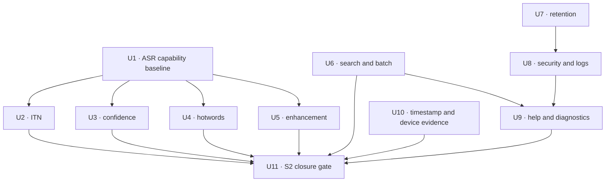

# S2 Remaining Scope Closure - Plan

## Goal Capsule

| Field | Contract |
| --- | --- |
| Objective | 把 PRD 中仍为“部分实现”“验收中”或“未实现”的 S2 能力逐项推进到可验证结论，并只在所有 S2 退出门槛真实通过时声明阶段完成。 |
| Authority | `docs/product/meeting-voice-recognition-prd-v1.0.md` 定义产品结果；已安装的 Sherpa AAR、模型资产、运行时代码、自动化和物理设备证据定义真实能力边界。 |
| Execution profile | 先完成 ASR 能力探测与低风险质量闭环，再完成管理、安全、帮助能力，最后补独立标注和真机交互证据并执行 S2 总门禁。 |
| Stop conditions | 不伪造置信度、热词命中、ITN、降噪、加密或真机证据；不让自动转换改变未经规则资产覆盖的数字语义；不因单项外部依赖阻塞其他独立实施单元。 |
| Tail ownership | 本计划负责 S2 剩余实现、证据和阶段结论；发布、签名、提交、推送、PR、商店交付、S3 说话人能力和云端反馈服务不在本计划内。 |

---

## Product Contract

### Summary

本计划把 S2 剩余工作组织成一个可连续执行的收口流程：优先解决 PRD 指定的 ASR-004、ASR-006、ASR-007，再验证 ASR-008，随后完成批量管理、保留策略、安全治理、帮助反馈以及独立标注和真机证据。

每个模型相关单元都采用能力门禁。只有真实 API、模型输出、许可资产和基准结果同时成立时才开放产品入口；否则保留可复现结论并保持能力矩阵为未完成，不用占位 UI 或启发式结果制造完成假象。

### Problem Frame

S2 的播放器、时间线、片段编辑、标点、人工复核、范围搜索、五种导出和无障碍主流程已经形成闭环，但 PRD 仍有四类缺口。

第一类是 ASR 能力缺口。当前 Paraformer 生产结果不提供置信度，现有链路没有经过验证的热词接口，ITN 缺少许可清晰且可回归的规则资产，语音增强只有模型文件没有生产集成和噪声集证据。第二类是产品管理缺口，包括标题搜索、批量移动/重试/导出和自动保留。第三类是安全与支持缺口，包括备份边界、日志治理、帮助内容和安全诊断交付。第四类是验收缺口，包括时间戳独立听审 P95 以及 REC-008、REC-009、REC-010 的新增物理设备交互记录。

这些工作不能被压成一次无条件的“实现所有 ASR 功能”。模型能力与许可条件可能要求更换模型或保持功能未开放，因此连续 Goal 必须能在一个门禁失败后继续执行其他独立单元，同时把失败结论保留下来供产品决策。

### Actors

- A1. 会议用户搜索和批量管理本地记录，配置保留策略，查看帮助并主动分享经过净化的诊断信息。
- A2. 转写运行时执行 ITN、置信度、热词和语音增强能力探测，并只返回真实可验证的结果。
- A3. 质量验收人员独立标注时间戳、执行噪声集基准和物理设备交互矩阵。
- A4. 本地仓储和清理协调器维护记录、任务、词库、保留策略、派生资产与完整删除的一致性。
- A5. 产品维护者根据自动化、基准和真机证据更新 PRD、能力矩阵和 S2 阶段结论。

### Requirements

#### ASR readability and capability truth

- R1. ASR-004 的数字、日期、时间、金额和单位 ITN 只能由许可清晰、确定性且有黄金样例的本地规则资产实现；未识别或歧义输入必须保持原文。
- R2. ITN、标点和段落处理不得改变片段 ID、序号、时间戳、代际、人工复核状态或用户修订保护。
- R3. ASR-006 的自动低置信度必须来自生产模型输出的真实、可校准信号；缺少信号时继续显示未知并保留人工三态复核。
- R4. ASR-007 的会议级和设备级词库只有在识别器真实接受上下文偏置且基准能观察到命中改善时才可开放；组织级词库等待组织身份边界。
- R5. ASR-008 的降噪、回声控制或语音增强必须经过固定噪声集的准确率、时间戳、RTF、内存和耗电门禁，默认策略不能降低安静语音质量。
- R6. 模型能力门禁失败时要保存可复现的 API、资产和基准结论，并保持对应 PRD 状态为未实现或有依赖。

#### Search and batch management

- R7. 单场会议搜索保持原文、时间和复核状态组合能力；主页新增对当前本地记录标题的搜索，结果仍遵循删除态和分组边界。
- R8. 说话人搜索在没有稳定 speaker ID 和说话人数据时不显示无效入口，并继续归入 S3 说话人计划。
- R9. 批量管理支持移动、删除、重试和导出；每个操作只作用于符合前置状态的项目并返回逐项结果。
- R10. 多条记录批量导出使用一个格式选择，并生成含清单和唯一安全文件名的 ZIP；无可导出转写的项目必须在结果中说明。
- R11. 软删除和永久删除继续二次确认；永久删除失败保持 `deletion_pending` 并可幂等重试。

#### Retention, device protection, and logs

- R12. 自动保留默认关闭，只自动永久清理“最近删除”中超过用户选择期限的记录；活跃会议、收藏和受保护代际不被后台策略直接删除。
- R13. 保留清理复用完整删除协调器，并在部分文件失败时保留可重试状态和不含敏感正文的结果摘要。
- R14. 数据库、音频、模型和派生文件保持在 app-private 存储，Android 备份规则不得把会议正文、音频、数据库、日志或诊断包复制到云备份或设备迁移。
- R15. 设备保护声明以 Android 平台文件加密和 app sandbox 的实际状态为准；没有引入可验证密钥生命周期前不得宣称应用层加密。
- R16. 原生和 Dart 运行日志不得记录转写正文、会议标题、完整私有路径、内容 URI、密钥或诊断包内容；静态契约和运行时样例共同验证。

#### Help, feedback, and diagnostics

- R17. 应用内帮助覆盖录音合规、录音/转写故障恢复、本地模型能力与限制、数据位置、删除和分享边界。
- R18. 反馈入口在没有受批准的后端上传契约时使用用户主动触发的系统分享，不静默联网或默认附带会议数据；该本地替代不冒充 PRD 所写的远程安全日志上传。
- R19. 安全诊断包只包含允许列表中的构建信息、匿名阶段状态、耗时、错误分类和设备能力，不包含正文、标题、完整路径或稳定设备标识，并在分享前展示内容清单和临时文件保留期。

#### Evidence and stage closure

- R20. ASR-005 只有在独立听审参考、物理设备生产预测和时间戳误差 P95 ≤ 1.5 秒同时成立时才完成准确率验收。
- R21. REC-008 必须补充至少一次从文件、相册或其他 App 分享进 Voice2Text 的真实设备交互证据。
- R22. REC-009 必须补充真实蓝牙、有线或 USB 输入的连接、主动切换、实际路由和断开降级/停止证据；没有相应外设时保持待验收。
- R23. REC-010 必须补充真机上会中重点和备注的写入、重开、时间线回跳和转写失败后保留证据。
- R24. S2 退出前重新验证时间戳、播放器联动、编辑、搜索、标点/分段、人工复核、热词、导出样例和核心无障碍流程；任何未通过的强制项都会阻止 S2 完成声明。
- R25. 文档只更新已经由代码、自动化、基准或相应物理设备证据证明的子能力，并明确区分“本 Goal 执行完成”和“PRD S2 阶段完成”。

### Key Flows

- F1. ASR 能力门禁
  - **Trigger:** Goal 开始执行一个尚未闭环的 ASR 能力。
  - **Actors:** A2, A3, A5
  - **Steps:** 检查安装包 API 和资产许可，建立黄金样例或噪声集，在同一生产路径上运行对照基准，再决定集成、保持关闭或进入模型候选评估。
  - **Outcome:** 产品能力与模型实情一致；门禁失败不会阻塞独立单元。
  - **Covered by:** R1-R6

- F2. 批量管理本地记录
  - **Trigger:** 用户在主页选择一条或多条记录。
  - **Actors:** A1, A4
  - **Steps:** 页面按项目状态启用移动、删除、重试和导出；服务逐项执行并汇总成功、跳过和失败结果。
  - **Outcome:** 批量操作可恢复、可解释且不破坏记录或转写代际。
  - **Covered by:** R7-R11

- F3. 自动清理最近删除
  - **Trigger:** 应用启动或进入记录页时保留策略到期。
  - **Actors:** A1, A4
  - **Steps:** 策略查询过期软删除记录，逐项调用完整删除协调器，失败项保持 pending 并等待后续重试。
  - **Outcome:** 用户选择的保留期生效，活跃数据不被自动删除。
  - **Covered by:** R12-R13

- F4. 查看帮助并分享安全诊断
  - **Trigger:** 用户从设置页打开帮助或反馈。
  - **Actors:** A1
  - **Steps:** 用户阅读能力与隐私说明，选择生成诊断包，先查看允许字段清单，再通过系统分享主动发送。
  - **Outcome:** 故障上下文可交付，但会议内容和稳定设备身份不会泄露。
  - **Covered by:** R14-R19

- F5. S2 证据收口
  - **Trigger:** 自动化实现单元通过。
  - **Actors:** A3, A5
  - **Steps:** 完成独立时间戳听审和生产预测，按可用外设执行三项 REC 真机交互，重跑 S2 退出场景并更新矩阵。
  - **Outcome:** S2 得到“完成”或“仍被具体门禁阻止”的可审计结论。
  - **Covered by:** R20-R25

### Acceptance Examples

- AE1. 给定许可规则资产覆盖“二零二六年七月二十四日”和“人民币三十六元五角”，当 ITN 执行时，输出符合黄金样例且片段时间戳和代际不变。
- AE2. 给定含歧义数字或规则资产未覆盖的文本，当 ITN 执行时，正文保持不变并且不会被标记为已归一化。
- AE3. 给定生产模型没有 confidence 字段，当转写完成时，数据库继续保存 `null`，UI 不显示自动低置信度或高置信度结论。
- AE4. 给定词库设置存在但当前识别器不接受真实上下文偏置，当用户查看设置时，不出现可用热词开关，能力矩阵保留依赖说明。
- AE5. 给定增强模型在噪声集上改善 WER 但使 P95 RTF、内存或安静语音退化超过门禁，当评估完成时，生产默认仍关闭。
- AE6. 给定三条记录中只有两条有完成转写，当用户批量导出 Markdown 时，ZIP 包含两份唯一命名文件和清单，第三条以不可导出原因列出。
- AE7. 给定两条失败任务和一条处理中任务，当用户批量重试时，只重新排队失败任务并在结果中跳过处理中任务。
- AE8. 给定自动保留设置为 30 天，当应用扫描最近删除时，只永久清理超过 30 天的软删除记录；删除文件失败的记录保持 pending。
- AE9. 给定诊断包生成请求，当检查包内容时，只出现允许列表字段，路径被归类或散列，正文、标题、URI 和设备序列号均不存在。
- AE10. 给定独立标注仍为 provisional，当时间戳评估使用 `--allow-provisional` 通过时，结果仍不可作为 ASR-005 或 S2 的合格证据。
- AE11. 给定真机没有蓝牙、有线或 USB 麦克风，当 REC-009 验收被执行时，矩阵保持待验收且不会用内置麦克风记录替代外设证据。
- AE12. 给定所有本地实现与自动化通过但热词仍不可用，当 S2 总门禁执行时，本 Goal 可以报告其余工作完成，但不得声明 PRD S2 阶段完成。

### Success Criteria

| Metric | Exit target |
| --- | --- |
| ASR 能力真实性 | ITN、自动低置信度、热词和增强分别具有真实 API/资产/基准证据，或保留可复现的未开放结论。 |
| ITN 语义安全 | 黄金样例 100% 通过，未覆盖和歧义输入保持原文，时间戳与用户修订零变化。 |
| 自动复核可信度 | 只使用可校准真实信号；`null` 永远不映射成置信度结论。 |
| 批量管理一致性 | 移动、删除、重试、导出对混合状态输入返回逐项结果，失败可重试且无孤立资产。 |
| 数据生命周期 | 自动保留默认关闭，只清理到期软删除记录；完整删除对数据库图和受管文件零残留。 |
| 隐私与安全 | 会议数据不进入 Android 备份；静态和运行时日志/诊断检查无正文、标题、完整路径或稳定设备 ID。 |
| 时间戳准确率 | 独立审核且带审阅元数据的物理设备生产预测达到 P95 ≤ 1.5 秒。 |
| 真机证据 | REC-008、REC-009、REC-010 各自有与验收描述一致的新增物理交互记录，不能相互替代。 |
| 阶段结论 | S2 强制退出项全部通过才写“完成”；否则列出精确阻塞项和已完成子能力。 |

### Scope Boundaries

#### Included

- ASR-004 数字/日期/时间/金额/单位 ITN 的真实能力门禁与可验证集成。
- ASR-006 自动低置信度信号探测、校准与条件集成。
- ASR-007 会议级/设备级真实热词偏置和命中评估。
- ASR-008 降噪、回声控制或语音增强的噪声集实验与条件生产化。
- POST-003 标题搜索以及 POST-004 批量移动、删除、重试和导出。
- SEC-003 自动保留、SEC-004 平台保护/备份/敏感日志治理。
- EXP-009 应用内帮助、反馈入口和安全诊断包分享。
- ASR-005 独立时间戳验收及 REC-008/009/010 新增真机证据。
- S2 已实现主流程的总回归和能力文档收口。

#### Deferred to Follow-Up Work

- **说话人搜索:** 依赖 S3 的说话人分离、稳定 speaker ID 和命名能力。
- **组织级热词:** 依赖组织身份、权限和同步边界，归入 S4/S5；在 PRD 修订或组织能力落地前，该子项仍阻止 ASR-007 完整完成。
- **服务端反馈上传:** 依赖已批准的隐私、保留、认证和后端接口；S2 使用用户主动系统分享，但若 PRD 继续要求“上传”，EXP-009 仍保持部分实现。
- **应用层内容加密:** 只有在密钥生命周期、恢复、性能和迁移方案明确后另立高风险计划；本轮验证平台文件加密、sandbox 和备份边界。
- **未通过门禁的模型替换:** 本计划会形成候选模型决策与基准证据，迁移规模超出 S2 收口边界时另立模型升级计划。

#### Outside This Plan

- S3 结构化纪要、说话人分离、自动摘要、决策和待办。
- 云同步、账号、组织、协作、企业治理和远程 AI。
- iOS、Web、桌面、PC Live 和系统音频采集。
- 发布、签名、版本上线、商店材料、提交、推送、PR 和远端部署。

### Dependencies

- `docs/plans/2026-07-24-001-feat-transcript-quality-review-plan.md` 已完成的标点、人工复核、时间范围搜索、VTT/范围导出和无障碍基础继续成立。
- `docs/plans/2026-07-24-002-feat-s1-quality-closure-plan.md` 已完成的生命周期、低存储、输入遥测和 Goo 基础继续成立。
- `android/app/libs/sherpa-onnx.aar` 的安装包 API 和打包模型资产优先于在线文档或配置类名称。
- `benchmark/TIMESTAMP_REVIEW.md` 定义 ASR-005 独立标注和物理设备预测的证据资格。
- sibling `flutter-ui-mobile` 的 `DESIGN.md`、`DOC.md` 和实际导出 API 是所有 UI 变更的权威。
- 物理 Android 设备、可分享媒体和相应蓝牙/有线/USB 外设决定 REC 真机验收何时可完成。

### Sources

- `docs/product/meeting-voice-recognition-prd-v1.0.md`
- `docs/product/mobile-capability-matrix.md`
- `docs/REAL_DEVICE_REGRESSION_MATRIX.md`
- `docs/plans/2026-07-24-001-feat-transcript-quality-review-plan.md`
- `docs/plans/2026-07-24-002-feat-s1-quality-closure-plan.md`
- `benchmark/README.md`
- `benchmark/TIMESTAMP_REVIEW.md`
- `android/app/src/main/kotlin/com/voice2text/app/transcription/RealSherpaTranscriptionEngine.kt`
- `android/app/src/main/kotlin/com/voice2text/app/transcription/TranscriptionModelRegistry.kt`
- `lib/features/home/home_page.dart`
- `lib/features/records/service/meeting_deletion_coordinator.dart`
- `lib/features/settings/settings_page.dart`
- `lib/data/sqlite/app_database.dart`
- `tool/check_privacy_contract.sh`

---

## Planning Contract

### Key Technical Decisions

- KTD1. 将 S2 收口分成“能力门禁、产品实现、证据收口”三段。一个 ASR 门禁失败不会让 Goal 停在原地，但对应 PRD 行和 S2 阶段保持未完成。
- KTD2. 当前 Paraformer 路径继续作为生产基线，除非候选模型在同一音频集上同时满足准确率、时间戳、RTF、内存、包体和设备兼容门禁；只为获得热词或置信度而无基准换模不可接受。
- KTD3. ITN 使用确定性词法/有限状态规则并采用允许列表语义。规则只转换覆盖的完整 token 模式，歧义或部分匹配保持原文，不使用 LLM 或宽泛正则猜测。
- KTD4. 自动低置信度与人工复核状态保持正交。真实信号先离线校准阈值，再决定是否将片段自动加入 `needs_review` 候选；自动判断永远不等于人工确认。
- KTD5. 热词必须在解码阶段产生可测的上下文偏置。会后文本替换可以作为独立的术语纠错能力规划，但不能命名为热词命中或用来完成 ASR-007。
- KTD6. 语音增强先以离线实验管线对照原始音频，只有所有门禁通过才进入生产转写请求；生产入口默认关闭并保留原始音频作为事实来源。
- KTD7. 标题搜索放在主页记录集合，单场会议面板保持片段内容筛选。说话人筛选继续隐藏，直到稳定 speaker 数据存在。
- KTD8. 批量操作由服务层接受稳定 recording ID 集合并返回逐项结果。批量导出统一选择一个格式，多条记录包装成 ZIP 和清单，避免连续弹出多个系统分享面板。
- KTD9. 自动保留只针对最近删除，默认关闭并提供 7、30、90 天选项。该边界避免后台策略直接删除仍在使用的会议。
- KTD10. SEC-004 本轮采用可验证的平台保护：app-private 路径、Android 文件加密事实、备份排除和敏感日志允许列表。没有应用密钥和迁移方案时不添加“加密”开关或宣称 SQLCipher 等应用层保护。
- KTD11. 诊断交付使用用户主动系统分享。诊断包写入专用 app-cache 子目录，只通过精确 FileProvider 子树授予临时只读 URI，并在取消、超时或下次启动时清理；包内容由字段允许列表生成且不复制原始日志文件。
- KTD12. S2 阶段结论与 Goal 执行结论分离。Goal 可以在所有可执行单元和门禁结论完成后结束，但只有 R24 的全部强制项通过时，文档才可声明 S2 完成。
- KTD13. U4 和 U7 共享一个最终 SQLite v18 迁移。热词门禁通过时，术语表与保留设置进入同一 `migrateS2Closure` 路径；未通过时迁移只包含保留设置，避免两个单元分别占用 v18。
- KTD14. 跨多条会议的 ZIP 和无会议归属的诊断包不写入要求单一 `recording_id` 的 `meeting_assets`。U6 提供专用 ephemeral share 服务和精确 cache FileProvider 子树，U6/U9 都使用 24 小时 TTL、下次启动清理和临时只读 URI；单会议导出继续沿用现有受管资产契约。

### Assumptions

- 当前用户授权本计划在同一工作树继续实施，但发布、提交、推送和 PR 仍延期。
- 批量导出默认允许用户在现有五种转写格式中选择一种，并在多记录场景生成 ZIP；不在本轮增加批量音频转码或媒体剪辑。
- 没有可用外设、独立审阅者或许可模型资产时，相应证据单元记录具体依赖并继续其他工作，不用替代证据关闭门禁。
- 若 ASR 能力探测显示模型替换是唯一可行路径，本计划完成候选评估和迁移边界，生产迁移只在规模仍符合本计划且所有门禁通过时执行。
- 组织级热词、真实回声控制和服务端诊断上传没有被本地替代能力等价满足；它们会作为 PRD 子项 blocker 保留，除非后续产品决策修订相应验收范围。

### High-Level Technical Design



ASR 单元共享一个能力判定结构：API/模型信号、资产许可、离线基准、生产路径、用户能力声明。产品层只能读取“verified”能力，不得从资产存在或配置字段存在推断可用。

批量管理和保留继续使用记录与受管资产边界；跨会议 ZIP 和诊断包使用独立的 ephemeral cache 生命周期。所有文件写入先生成临时结果，成功后原子完成，失败时删除 partial；永久删除始终由 `MeetingDeletionCoordinator` 统一收口。

### Repository Patterns to Preserve

- Flutter 继续按 feature-first 分层，领域操作落在 repository/service/controller，页面不直接拼接 SQL 或管理文件事务。
- SQLite schema 和迁移继续由 `AppDatabase` 集中管理，新 schema 版本必须覆盖旧版升级和全新建库等价性。
- MethodChannel 继续传递基本类型 Map/List，长耗时 ASR 和文件任务不阻塞 UI isolate 或主线程。
- 原生模型对象按任务或明确生命周期复用并在 `finally`/`use` 中释放。
- Goo UI 只使用 sibling 包实际导出的组件、令牌和语义 API；UI 实施前重新读取 `DESIGN.md` 和 `DOC.md`。
- 日志记录 ID、阶段、耗时、模型和错误分类，不记录用户内容或完整敏感路径。
- PRD、能力矩阵和真机矩阵只在证据落地后更新，不在代码开始时预先标记完成。

### System-Wide Impact

- **Data lifecycle:** 自动保留和批量删除继续遵循受管记录生命周期；批量 ZIP 与诊断包使用无会议归属的 ephemeral 生命周期，并与 pending 重试、数据库级联和备份规则保持边界清晰。
- **Model contract:** 置信度、热词、ITN 和增强会扩展 Android/Dart 转写契约；旧结果和 `null` 字段必须向后兼容。
- **Performance:** ITN、增强、ZIP 和批量操作都必须有界处理；3000 片段和长录音不能一次性构建超大字符串或 PCM 副本。
- **Privacy:** 帮助、反馈、诊断、备份和日志形成同一隐私边界；任何新增分享都必须显式、可预览、只读且可撤销 URI 权限。
- **Product truth:** 设置页、帮助页和能力矩阵读取同一能力事实，避免“模型资产存在”“设置可见”和“功能已验证”三个状态漂移。

### Risks & Dependencies

| Risk | Mitigation |
| --- | --- |
| 当前 AAR/Paraformer 不提供真实 confidence 或热词 | U1 用安装包 API 和生产结果探测；U3/U4 只在真实信号存在时集成，否则保留可复现依赖并评估候选模型。 |
| ITN 规则改变金额、日期或数量语义 | 仅使用许可资产和黄金样例覆盖的完整模式，歧义输入保持原文，用户修订与时间戳不可变。 |
| 增强模型改善噪声但损害安静语音或设备性能 | 采用配对对照和多指标门禁，生产默认关闭，任何核心指标越界都不推广。 |
| 自动保留造成不可逆数据丢失 | 默认关闭，只清理最近删除，复用二次确认后的软删除状态和幂等完整删除。 |
| ZIP 或诊断文件遗留敏感 partial | 使用专用 cache、临时文件、原子完成、24 小时 TTL、启动清理和失败清理；诊断字段使用允许列表。 |
| 备份规则或日志检查只覆盖静态配置 | 同时运行 manifest/XML 契约、运行时样例扫描和真实诊断包检查。 |
| 真机外设或独立审阅者不可用 | 记录精确依赖并推进其他单元；没有替代证据，不误报 S2 完成。 |
| 大型 dirty worktree 中交叉修改冲突 | 每个单元先重新检查当前差异和已有实现，保留用户变更，不做破坏性清理或无关重构。 |

### Delivery Sequence

1. U1 固化所有 ASR 能力事实和门禁输入。
2. U2-U5 按独立分支推进，优先顺序为 ITN、confidence、hotwords、enhancement；门禁失败的单元记录结论后继续。
3. U6 完成标题搜索和批量管理。
4. U7-U9 完成自动保留、平台保护/日志和帮助/诊断闭环。
5. U10 补独立时间戳和三项 REC 真机证据。
6. U11 运行 S2 总回归并更新阶段结论。

---

## Implementation Units

| Unit | Title | Primary files | Depends on |
| --- | --- | --- | --- |
| U1 | Establish the ASR capability baseline | Android transcription registry/engine, benchmark docs | Existing production ASR |
| U2 | Integrate safe deterministic ITN | Android transcription post-processors, model assets, fixtures | U1 |
| U3 | Calibrate real confidence and automatic review | Android/Dart result contracts, review repositories/UI | U1 |
| U4 | Deliver verified hotwords or preserve the model blocker | ASR config, terminology storage/UI, benchmark | U1 |
| U5 | Evaluate and conditionally integrate speech enhancement | Android enhancement pipeline, noise benchmark | U1 |
| U6 | Close title search and batch management | Home/records/transcription/export services | Existing S2 management |
| U7 | Add configurable retention for Recently Deleted | Settings, SQLite, deletion coordinator | Existing complete deletion |
| U8 | Harden device protection, backup, and sensitive logs | Manifest/XML, privacy checks, platform bridge | U7 |
| U9 | Add in-app help, feedback, and safe diagnostics | Settings/router/help/diagnostic services | U6, U8 |
| U10 | Close timestamp and REC physical evidence | Benchmark and real-device matrices | U1, existing REC implementations |
| U11 | Run the S2 closure gate and update product truth | Tests, scripts, PRD and matrices | U2-U10 |

### U1. Establish the ASR capability baseline

- **Goal:** 以安装的 AAR、生产模型和资产许可为依据，输出 ITN、confidence、hotwords、enhancement 四项可执行门禁结果。
- **Requirements:** R1-R6
- **Files:**
  - Modify: `android/app/src/main/kotlin/com/voice2text/app/transcription/TranscriptionModelRegistry.kt`
  - Modify: `lib/features/settings/model/transcription_model_descriptor.dart`
  - Modify: `benchmark/README.md`
  - Create: `benchmark/S2_ASR_CAPABILITY_REVIEW.md`
  - Test: `android/app/src/test/kotlin/com/voice2text/app/transcription/TranscriptionEngineRouterTest.kt`
  - Test: `test/features/settings/transcription_model_descriptor_test.dart`
- **Approach:** 检查 AAR 的实际类和结果字段，对生产模型运行固定探针，核对每个资产的来源与许可，并把能力拆成 `available`、`verified` 和 `reason`，避免单一布尔值把“文件存在”当成“产品可用”。
- **Test Scenarios:**
  - 给定当前 Paraformer 结果，探针准确记录 confidence 是否存在，不用默认值补齐。
  - 给定配置类存在热词字段但当前模型不支持，能力仍为未验证并带稳定原因。
  - 给定增强或 ITN 资产文件存在但许可/基准缺失，设置描述只显示未开放。
  - 未知 model ID 回退默认模型时，能力集合与默认描述符一致。
- **Verification:** AAR/API 证据、生产探针结果和 Flutter/Android 描述符一致；四项能力各有明确下一步或阻塞原因。

### U2. Integrate safe deterministic ITN

- **Goal:** 在真实许可资产和黄金样例通过时，为新转写增加语义安全的数字、日期、时间、金额和单位 ITN。
- **Requirements:** R1, R2, R6
- **Files:**
  - Modify: `android/app/src/main/kotlin/com/voice2text/app/transcription/RealSherpaTranscriptionEngine.kt`
  - Modify: `android/app/src/main/kotlin/com/voice2text/app/transcription/ModelAssetManager.kt`
  - Create: `android/app/src/main/kotlin/com/voice2text/app/transcription/TextNormalizationPostProcessor.kt`
  - Create: `android/app/src/test/kotlin/com/voice2text/app/transcription/TextNormalizationPostProcessorTest.kt`
  - Modify: `pubspec.yaml`
  - Create when licensed: `assets/sherpa/itn/`
- **Approach:** 优先使用当前 AAR 支持的 FST/FAR 或等价确定性引擎；规则按完整模式允许列表运行并返回是否转换。没有许可资产时完成接口、fixture 和阻塞证据但不开放能力。
- **Test Scenarios:**
  - 中文数字、日期、24/12 小时时间、人民币金额和常用单位覆盖黄金样例。
  - 歧义数字、混合中英文、序列号、电话号码和部分匹配保持原文。
  - 标点开启/关闭与 ITN 顺序确定，重复运行结果幂等。
  - ITN 异常产生结构化阶段错误，不写入伪成功代际。
  - 转换前后片段数量、序号、时间戳和用户修订保护完全一致。
- **Verification:** 许可记录和黄金 fixture 齐全时产品能力可启用；否则能力保持未开放且不影响标点/人工复核现有闭环。

### U3. Calibrate real confidence and automatic review

- **Goal:** 只有生产模型提供可校准真实信号时，完成自动低置信度筛选和逐项确认闭环。
- **Requirements:** R3, R6
- **Files:**
  - Modify conditionally: `android/app/src/main/kotlin/com/voice2text/app/transcription/TranscriptionResult.kt`
  - Modify conditionally: `android/app/src/main/kotlin/com/voice2text/app/transcription/RealSherpaTranscriptionEngine.kt`
  - Modify conditionally: `lib/features/transcription/model/transcription_result.dart`
  - Modify conditionally: `lib/features/transcription/model/transcript_segment_entity.dart`
  - Modify conditionally: `lib/features/transcription/repository/transcript_segments_repository.dart`
  - Modify conditionally: `lib/features/meetings/controller/meeting_review_controller.dart`
  - Test: `test/features/meetings/meeting_review_controller_test.dart`
  - Test: `test/features/transcription/transcription_result_contract_test.dart`
- **Approach:** U1 发现真实信号后，用独立标注集校准阈值和可靠性，再把“自动低置信度候选”与人工 `review_state` 分开存储和筛选。若当前模型无信号，评估最小候选模型路径并保持现状。
- **Test Scenarios:**
  - `null` confidence 跨 Android、MethodChannel、SQLite 和 UI 全程保持 `null`。
  - 校准阈值上下边界稳定，自动候选不会写成 `reviewed`。
  - 人工标记覆盖展示优先级，但不改写原始模型分数。
  - 模型切换或旧代际没有分数时，查询和迁移向后兼容。
  - 候选模型未达到准确率/RTF 门禁时不改变生产默认。
- **Verification:** 有真实信号则自动候选可筛选、播放、确认且校准报告可复现；无信号则保留人工复核并输出模型依赖结论。

### U4. Deliver verified hotwords or preserve the model blocker

- **Goal:** 在解码器真实支持且基准有效时提供会议级和设备级热词，否则保持 ASR-007 未开放并固化迁移依据。
- **Requirements:** R4, R6
- **Files:**
  - Modify conditionally: `android/app/src/main/kotlin/com/voice2text/app/transcription/RealSherpaTranscriptionEngine.kt`
  - Modify conditionally: `android/app/src/main/kotlin/com/voice2text/app/transcription/TranscriptionModelRegistry.kt`
  - Modify conditionally: `lib/data/sqlite/app_database.dart`
  - Create conditionally: `lib/features/transcription/model/terminology_entry.dart`
  - Create conditionally: `lib/features/transcription/repository/terminology_repository.dart`
  - Modify conditionally: `lib/features/settings/settings_page.dart`
  - Modify conditionally: `lib/features/meetings/meeting_detail_page.dart`
  - Create conditionally: `benchmark/hotword_manifest.json`
- **Approach:** 先用固定专业词集对当前模型和候选模型执行无热词/有热词配对实验。只有解码阶段命中率改善且普通词退化、RTF、内存和包体达标时，才增加词库持久化、作用域和 UI。
- **Test Scenarios:**
  - 当前模型不支持时，传入词库不会被接受为成功，UI 无可用入口。
  - 支持模型中，会议级词只影响目标会议，设备级词跨会议生效，组织级不出现。
  - 重复、空白、超长和恶意路径字符的词条被归一或拒绝。
  - 热词命中提升可由配对 manifest 重现，非热词集退化不越界。
  - 词库删除后新任务不再使用，旧转写和用户修订不被重写。
- **Verification:** 真正支持时，作用范围、命中效果和失败状态可见；不支持时，ASR-007 保留明确模型 blocker，不用文本替换冒充。

### U5. Evaluate and conditionally integrate speech enhancement

- **Goal:** 用噪声集验证现有增强资产，并只在综合门禁通过时接入生产离线转写。
- **Requirements:** R5, R6
- **Files:**
  - Modify: `android/app/src/main/kotlin/com/voice2text/app/transcription/TranscriptionModelRegistry.kt`
  - Modify: `lib/features/settings/model/transcription_model_descriptor.dart`
  - Create conditionally: `android/app/src/main/kotlin/com/voice2text/app/transcription/SpeechEnhancementProcessor.kt`
  - Create conditionally: `android/app/src/test/kotlin/com/voice2text/app/transcription/SpeechEnhancementProcessorTest.kt`
  - Create: `benchmark/audio/s2_noise_manifest.json`
  - Modify: `benchmark/asr_benchmark_test_plan.md`
- **Approach:** 建立安静、稳定噪声、突发噪声、近讲和远讲配对集，对原始和增强路径测 WER/CER、时间戳 P95、RTF、峰值内存和设备温耗。回声控制若资产不具备真实 AEC 能力则单独标记未实现。
- **Test Scenarios:**
  - 增强开启/关闭处理同一音频并保留原始文件和可追溯配置。
  - 安静语音准确率不显著退化，噪声集改善达到计划中预注册阈值。
  - 长音频处理有界、可取消、失败不覆盖原始音频或写入伪成功结果。
  - 低端/中端设备 RTF、内存和热状态不越界。
  - 资产缺失、ABI 不支持或推理失败时设置保持未开放。
- **Verification:** 所有门禁通过才将 `denoiseReady` 改为已验证并接入设置/请求；否则保留实验报告和未实现状态。

### U6. Close title search and batch management

- **Goal:** 完成主页标题搜索和批量移动、删除、重试、导出的状态安全闭环。
- **Requirements:** R7-R11
- **Files:**
  - Modify: `lib/features/home/home_page.dart`
  - Modify: `lib/features/records/repository/recordings_repository.dart`
  - Modify: `lib/features/transcription/repository/transcription_jobs_repository.dart`
  - Modify: `lib/features/transcription/service/transcription_queue_coordinator.dart`
  - Modify: `lib/features/meetings/service/meeting_export_service.dart`
  - Modify: `android/app/src/main/res/xml/file_paths.xml`
  - Modify: `android/app/src/main/kotlin/com/voice2text/app/MainActivity.kt`
  - Create: `android/app/src/main/kotlin/com/voice2text/app/sharing/EphemeralShareCoordinator.kt`
  - Create: `lib/features/shared/service/ephemeral_share_artifact_service.dart`
  - Modify: `pubspec.yaml`
  - Modify: `pubspec.lock`
  - Create: `lib/features/records/service/meeting_batch_operation_service.dart`
  - Create: `test/features/records/meeting_batch_operation_service_test.dart`
  - Create: `test/features/shared/ephemeral_share_artifact_service_test.dart`
  - Modify: `test/features/home/home_lifecycle_test.dart`
- **Approach:** 将页面现有单项移动、删除和重试能力收敛到批量服务；标题搜索在当前 tab 数据集上工作并保持稳定排序。批量导出一次选择格式，使用经过许可核对的 Dart ZIP 依赖生成清单，并通过专用 ephemeral cache、精确 FileProvider 子树和临时只读 URI 分享；批量 ZIP 不伪装成某一条会议的受管资产。
- **Test Scenarios:**
  - 标题搜索处理大小写、空白、Unicode、分组和最近删除边界。
  - 混合分组记录批量移动成功后选择态清空且数据库一致。
  - 失败/取消任务可批量重试，pending/processing/completed 项明确跳过。
  - 多记录导出产生唯一安全文件名、正确清单、ephemeral 生命周期和只读分享。
  - ZIP entry 只使用归一化 basename，拒绝绝对路径、`..`、分隔符和重复归一化名称。
  - 批量 ZIP 不写入 `meeting_assets`，分享取消或失败可清理，超过 24 小时或下次启动时清理 stale 文件。
  - 任一导出失败会清理 partial，并返回逐项失败而不谎报整批成功。
  - 批量软删除和永久删除都要求确认，永久失败保持 pending。
- **Verification:** Widget、service、repository 和分享契约覆盖混合状态输入，首页不直接管理跨文件事务。

### U7. Add configurable retention for Recently Deleted

- **Goal:** 增加默认关闭、只作用于最近删除的自动保留策略和幂等清理。
- **Requirements:** R12, R13
- **Files:**
  - Modify: `lib/data/sqlite/app_database.dart`
  - Modify: `lib/features/settings/model/app_settings.dart`
  - Modify: `lib/features/settings/repository/app_settings_repository.dart`
  - Modify: `lib/features/settings/settings_page.dart`
  - Modify: `lib/features/records/repository/recordings_repository.dart`
  - Modify: `lib/features/records/service/meeting_deletion_coordinator.dart`
  - Create: `lib/features/records/service/meeting_retention_service.dart`
  - Create: `test/features/records/meeting_retention_service_test.dart`
  - Create: `test/features/records/schema_v18_upgrade_test.dart`
- **Approach:** U4 和本单元共同维护一个最终 v18 迁移；本单元保存关闭/7/30/90 天策略和最近成功扫描时间。扫描查询到期软删除记录并逐项调用完整删除协调器，采用单实例有界批次且允许后续继续。
- **Test Scenarios:**
  - v17→v18 保留所有会议、注释、代际、设置和外键。
  - 默认关闭时不删除任何记录。
  - 保存保留策略不会重置录音同意版本、标点、自动转写、模型或主题设置。
  - 7/30/90 天边界按毫秒稳定处理，未到期和活跃记录不受影响。
  - 文件删除失败时记录保持 pending，下一次扫描可成功重试。
  - 大量到期记录按批次处理，不阻塞首屏或一次性加载全图。
- **Verification:** 迁移、策略设置、扫描和删除结果有自动化；物理设备重启后策略仍生效且无活跃数据损失。

### U8. Harden device protection, backup, and sensitive logs

- **Goal:** 对 app-private 存储、Android 备份、平台保护事实和敏感日志形成可自动验证的 SEC-004 基线。
- **Requirements:** R14-R16
- **Files:**
  - Modify: `android/app/src/main/AndroidManifest.xml`
  - Modify: `android/app/src/main/res/xml/backup_rules.xml`
  - Modify: `android/app/src/main/res/xml/data_extraction_rules.xml`
  - Modify: `android/app/src/main/kotlin/com/voice2text/app/MainActivity.kt`
  - Modify: `tool/check_privacy_contract.sh`
  - Create: `test/features/records/android_backup_contract_test.dart`
  - Create: `test/features/records/sensitive_log_contract_test.dart`
- **Approach:** 明确排除数据库、会议文件、导出、日志和诊断包的云备份/迁移；增加只返回保护类别而不暴露设备 ID 的平台能力查询；扩展静态和样例日志扫描允许列表。
- **Test Scenarios:**
  - Manifest 和两代备份 XML 对会议数据目录与数据库均为排除。
  - 平台不提供可确认加密状态时显示“由设备安全设置保护”，不宣称应用层加密。
  - 原生异常、URI 导入、文件删除和转写失败日志不含完整路径或内容 URI。
  - Dart 异常和诊断摘要不含标题、正文或稳定设备标识。
  - 备份/迁移配置升级不影响本地数据读写和 FileProvider 分享。
- **Verification:** 静态隐私脚本、测试 fixture 和至少一份真机运行日志通过；能力说明与实际平台边界一致。

### U9. Add in-app help, feedback, and safe diagnostics

- **Goal:** 完成录音合规、恢复、模型说明、数据边界和安全诊断分享的应用内入口。
- **Requirements:** R17-R19
- **Files:**
  - Modify: `lib/app/router.dart`
  - Modify: `lib/features/settings/settings_page.dart`
  - Create: `lib/features/help/help_page.dart`
  - Create: `lib/features/help/model/diagnostic_report.dart`
  - Create: `lib/features/help/service/diagnostic_report_service.dart`
  - Create: `lib/features/help/service/diagnostic_share_service.dart`
  - Create: `test/features/help/diagnostic_report_service_test.dart`
  - Create: `test/features/help/help_page_test.dart`
- **Approach:** 帮助内容来自版本化本地结构，反馈页先展示将包含和不会包含的字段。诊断服务从明确数据源构造允许列表 JSON/文本，复用 U6 的 ephemeral share 服务写入专用 cache 子目录并通过系统分享发送，不读取原始 logcat 或会议文件；取消、失败、24 小时 TTL 和下次启动都会清理。
- **Test Scenarios:**
  - 离线状态下所有帮助内容可打开，能力描述与模型 descriptor 一致。
  - 恢复指南覆盖权限、低存储、输入丢失、转码、模型和持久化错误类别。
  - 诊断报告包含构建、阶段、耗时和错误分类，不含正文、标题、完整路径、URI 或设备序列号。
  - 用户取消分享后临时权限撤销，partial 或未登记文件被清理。
  - 构造其他 cache 文件或路径穿越 URI 时，FileProvider 不暴露诊断目录之外的文件。
  - 200% 字体、TalkBack、明暗主题和 Compact/Medium/Expanded 无阻塞布局。
- **Verification:** 帮助/反馈 Widget、诊断字段契约、受管文件和真机系统分享均有证据；无网络上传路径。

### U10. Close timestamp and REC physical evidence

- **Goal:** 完成 ASR-005 独立时间戳门禁和 REC-008/009/010 新增物理设备交互记录。
- **Requirements:** R20-R23
- **Files:**
  - Modify: `benchmark/audio/timestamp_manifest.json`
  - Modify: `benchmark/TIMESTAMP_REVIEW.md`
  - Modify: `docs/REAL_DEVICE_REGRESSION_MATRIX.md`
  - Modify: `docs/product/mobile-capability-matrix.md`
  - Modify when evidence passes: `docs/product/meeting-voice-recognition-prd-v1.0.md`
- **Approach:** 严格使用盲听 worksheet、独立 reviewer 元数据和物理设备生产预测运行时间戳评估；REC 三项分别执行与验收描述一致的手工步骤并记录设备、外设、输入、结果和失败路径。
- **Test Scenarios:**
  - provisional 或缺少 reviewer 元数据的标注无法成为 release-eligible/S2 证据。
  - 物理设备生产预测与独立参考按相同 case ID 对齐并达到 P95 ≤ 1.5 秒。
  - 外部 App 向 Voice2Text 分享媒体覆盖冷启动或热启动至少一条真实路径。
  - 外接麦克风覆盖连接、选择、实际路由和拔出；没有外设时保持待验收。
  - 会中重点和备注覆盖保存、重开、时间线回跳及转写失败后仍保留。
- **Verification:** 每项证据可由文件、哈希、日志或矩阵步骤复核；一项证据不替代另一项，缺少物理条件时不误报。

### U11. Run the S2 closure gate and update product truth

- **Goal:** 统一验证全部 S2 强制退出项，并给出完成或精确未完成结论。
- **Requirements:** R24, R25
- **Files:**
  - Modify: `tool/dev_check.sh`
  - Modify: `tool/run_meeting_flow_smoke.sh`
  - Modify: `docs/product/meeting-voice-recognition-prd-v1.0.md`
  - Modify: `docs/product/mobile-capability-matrix.md`
  - Modify: `docs/REAL_DEVICE_REGRESSION_MATRIX.md`
  - Modify: `README.md`
- **Approach:** 把新增 schema、ASR 门禁、批量管理、保留、安全、帮助和证据检查接入统一开发门禁；重跑既有时间线、标点、复核、导出和无障碍回归。文档按子能力逐项更新，S2 阶段结论由强制项计算而不是人工乐观判断。
- **Test Scenarios:**
  - 任一热词、时间戳、导出或核心无障碍强制项失败时，S2 结论保持未完成并列出阻塞。
  - ASR 能力门禁失败但其他单元通过时，测试报告区分已完成单元和阶段 blocker。
  - 会议/设备热词、本地诊断分享或语音增强的局部通过不会自动关闭组织热词、服务端上传或真实回声控制子项。
  - 旧 S2 主流程在 schema v18、批量操作和帮助入口加入后无回归。
  - 能力矩阵、PRD 和真机矩阵对每个子能力的状态一致。
  - abandoned experiment、partial 文件、无效设置入口和死代码在 Goal 完成前删除。
- **Verification:** 统一门禁输出明确 PASS/FAIL 和证据位置；文档没有超出证据的完成声明，发布/提交/推送仍未执行。

---

## Verification Contract

### Per-Unit Gates

| Unit | Required checks |
| --- | --- |
| U1 | Android ASR registry/engine tests；Flutter model descriptor tests；`benchmark/S2_ASR_CAPABILITY_REVIEW.md` 四项都有 API、资产、基准和结论。 |
| U2 | ITN 黄金 fixture、歧义保持、幂等、阶段错误和时间戳/代际不变测试；许可信息齐全才允许打包资产。 |
| U3 | Android/Dart result contract、SQLite `null` 兼容、校准报告、review controller 和筛选 Widget 测试。 |
| U4 | 热词配对 benchmark、作用域 repository、设置/会议 Widget 和普通词退化门禁；不支持路径验证无入口。 |
| U5 | 增强处理 JVM 测试、噪声 manifest、配对准确率/时间戳/RTF/内存报告和目标真机运行。 |
| U6 | `flutter test test/features/records/meeting_batch_operation_service_test.dart test/features/home/home_lifecycle_test.dart test/features/meetings/meeting_export_service_test.dart test/features/transcription/transcription_jobs_repository_test.dart` |
| U7 | `flutter test test/features/records/schema_v18_upgrade_test.dart test/features/records/meeting_retention_service_test.dart test/features/records/meeting_deletion_coordinator_test.dart test/features/settings/app_settings_test.dart` |
| U8 | `./tool/check_privacy_contract.sh`；备份 XML、敏感日志和平台能力 contract tests；真机日志样例扫描。 |
| U9 | 帮助/诊断 service 与 Widget tests；Goo analyzer；200% 字体、TalkBack、主题和系统分享真机步骤。 |
| U10 | `python3 benchmark/evaluate_transcript_timestamps.py --predictions <physical-predictions> --report <report>` 在非 provisional 独立标注上通过；REC-008/009/010 各自矩阵步骤通过或明确保持待验收。 |
| U11 | 全量 Flutter/JVM/集成/隐私门禁、物理设备 S2 矩阵和三份产品状态文档一致性检查。 |

### Cross-Cutting Automated Gates

Run from the repository root after relevant units and again before closure:

```bash
dart format --output=none --set-exit-if-changed lib test integration_test
flutter analyze
flutter test
(cd android && ./gradlew testDebugUnitTest)
./tool/check_privacy_contract.sh
./tool/dev_check.sh --with-build
./tool/ensure_ui_watcher.sh
```

### Required Scenario Evidence

- ASR: ITN、confidence、hotwords、enhancement 各自的安装包 API、资产许可、固定输入和生产路径输出。
- Data: v17→v18 迁移、批量操作、保留扫描、完整删除和受管 ZIP/诊断资产没有孤立行或文件。
- Performance: 长音频、3000 片段、批量导出和增强路径内存有界，低/中端设备没有不可接受的 RTF 或温耗退化。
- Privacy: Android 备份排除、app-private 路径、静态日志契约、真机运行日志和诊断包允许列表同时通过。
- Accessibility: 标题搜索、批量工具栏、保留设置、帮助和诊断预览在 TalkBack、200% 字体、主题和三种布局下可用。
- Timestamp: 独立 reviewer、审核时间、非 provisional 参考、物理生产预测和 P95 报告齐全。
- Device: REC-008 分享导入、REC-009 外设切换、REC-010 会中注释分别有新增物理交互记录。
- Product truth: PRD、mobile capability matrix 和 real-device matrix 对状态、限制和证据一致。

### Stop-the-Line Failures

- 任何 `null` 或启发式分数被表现为真实置信度。
- 文本替换、会后词典纠错或配置字段存在被声明为真实热词偏置。
- ITN 改变未覆盖的数字、日期、金额、时间、单位或用户修订。
- 增强路径删除/覆盖原始音频，或未通过安静语音与设备性能门禁即默认启用。
- 自动保留删除活跃会议，或完整删除失败后丢失 pending 重试状态。
- 备份、日志或诊断包包含会议正文、标题、完整私有路径、URI、密钥或稳定设备标识。
- provisional 标注、模拟器、UI watcher 或旧向外分享证据被用于替代要求的独立/物理证据。
- 任一 S2 强制退出项失败时文档仍声明 S2 完成。

---

## Definition of Done

- [x] U1-U11 均有通过结果或符合计划的可复现能力门禁结论，且一个 blocker 没有阻止独立单元执行。
- [x] ASR-004 ITN 只有在许可资产和黄金样例齐全时开放；否则保持未实现并记录明确依赖。
- [x] ASR-006 只使用真实校准信号；无信号时人工复核三态和未知置信度保持诚实可用。
- [x] ASR-007 只在解码阶段偏置和命中改善可测时开放；组织级和不支持模型没有虚假入口，组织子项未落地时 ASR-007 保持部分实现。
- [x] ASR-008 的增强子能力通过噪声、安静语音、时间戳、RTF、内存和目标真机门禁后才进入生产默认；没有真实 AEC 时不得宣称整项完成。
- [x] POST-003 标题搜索和 POST-004 批量移动、删除、重试、导出形成混合状态可恢复闭环。
- [x] SEC-003 自动保留默认关闭且只清理到期最近删除；完整删除零数据库图和受管文件残留。
- [x] SEC-004 的 app-private、备份排除、平台保护说明和日志治理通过静态与运行时验证。
- [x] EXP-009 的帮助、反馈和安全诊断分享可离线使用，且没有未经批准的上传路径或敏感内容；服务端上传未落地时保持部分实现。
- [x] ASR-005 独立听审和物理生产预测达到 P95 ≤ 1.5 秒，或明确保持 S2 blocker。
- [x] REC-008、REC-009、REC-010 分别具有新增物理交互证据；缺少设备/外设时明确保持待验收。
- [x] S2 既有时间线、播放器、编辑、搜索、标点/分段、人工复核、五种导出和无障碍主流程无回归。
- [x] 所有新增 UI 已按 sibling Goo 文档/API 实施并通过 analyzer、TalkBack、200% 字体、主题和布局检查。
- [x] 全量 Verification Contract 通过；未通过项在产品文档中保留真实状态和精确阻塞原因。
- [x] 所有失败实验、partial 文件、无效设置入口、临时资产和死代码已删除。
- [x] 没有执行发布、签名、提交、推送、PR、部署或商店流程。
- [x] 只有当 PRD 11.3 的全部强制项通过时才声明 S2 阶段完成；否则 Goal 结果明确说明“执行计划已收口，但 S2 仍被哪些门禁阻止”。
