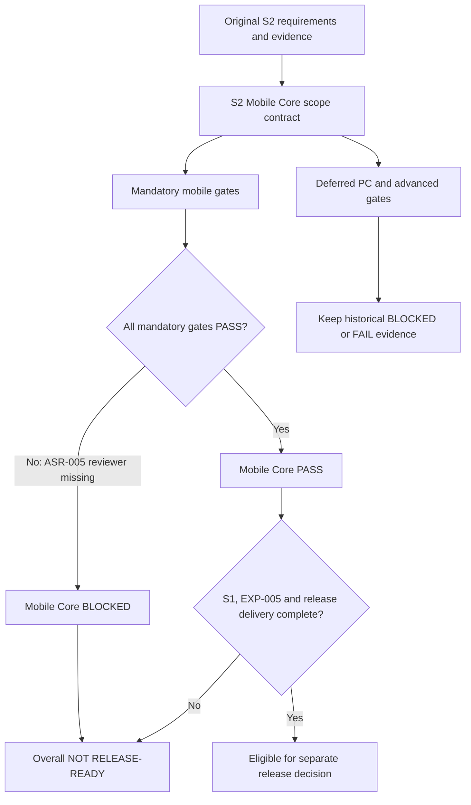

# S2 Mobile Core Rebaseline - Plan

## Goal Capsule

| Field | Contract |
| --- | --- |
| Objective | 将 S2 重定为移动端基础闭环：保留 Paraformer 会后离线转写、真实标点、结构化时间戳、人工复核、播放编辑搜索导出、隐私与设备可靠性；把自动 confidence、解码热词、高级 ITN、GTCRN/AEC 和外接麦克风验收移入后续 PC/高级能力阶段。 |
| Authority | 用户确认的产品重定决策优先于旧 S2 功能集合；历史实测和 blocker 结论不得改写为 PASS。机器可读范围契约定义当前 Mobile Core 门禁，PRD 和各矩阵必须与其一致。 |
| Execution profile | 先建立范围决策与防漂移契约，再同步 PRD、能力矩阵、真机矩阵、统一 closure status 和 benchmark 评审文档，最后执行全量开发门禁。 |
| Stop conditions | ASR-005 没有独立 reviewer 和 release-eligible P95 时不得声明 Mobile Core PASS；S1 高端设备、EXP-005 和发布交付未完成时不得声明整体 release-ready；迁移能力只能标记 DEFERRED，不能标记 PASS。 |
| Tail ownership | 本计划负责范围契约、自动化、权威文档和开发门禁；不负责独立 reviewer、采购外设、新模型生产集成、发布、签名、提交、推送、PR、部署或商店交付。 |

---

## Product Contract

### Summary

本计划把移动端 S2 收敛为可靠、可读、可人工复核的会议原文闭环，不为高级 ASR 能力更换生产模型。自动 confidence 与热词转入未来 PC ASR 路线；高级 ITN、语音增强/AEC 和外接麦克风验收也从 Mobile Core 强制门禁移出，但保留原始失败证据和后续准入条件。

### Problem Frame

原 S2 同时要求移动端基础会议复核和多项受模型架构、算力、资产许可或外部硬件制约的高级能力。当前生产 Paraformer 已可靠完成移动端基础离线转写，却没有可校准 confidence 或可验证的解码热词接口；为两个附加能力切换移动端模型会扩大包体、资源和回归风险。GTCRN 成对门禁已经在 Xiaomi 中端参考机实测失败，且不是 AEC。REC-009 需要当前没有的真实外设。继续把这些能力作为 Mobile Core 强制门禁，会让基础移动产品被非核心能力长期绑架。

范围调整不能掩盖质量问题。ASR-005 是 Mobile Core 的基础定位能力，仍必须由独立 reviewer 形成盲听参考并取得 P95 ≤ 1.5 秒。旧 PRD S2 的失败历史必须保留；新基线只改变后续验收范围，不追溯宣称旧门禁已通过。

### Requirements

**Mobile Core scope**

- R1. 移动端生产 ASR 继续使用当前 Paraformer，不因自动 confidence 或热词更换模型，也不增加未验证入口。
- R2. Mobile Core 必须覆盖可靠录音/导入、会后离线转写、真实标点与确定性分段、结构化时间戳、人工三态复核、播放器联动、编辑、搜索、五格式导出、删除、隐私和核心无障碍。
- R3. ASR-005 独立听审和正常模式 P95 ≤ 1.5 秒继续作为 Mobile Core 强制门禁；provisional 工程报告不能替代。
- R4. Mobile Core 状态由机器可读范围契约中的 mandatory gate 计算；任何 mandatory gate 非 PASS 时总体保持 BLOCKED。

**Deferred capabilities**

- R5. ASR-004 的数字、日期、时间、金额和单位 ITN 迁移到 PC/高级文本质量阶段；许可证、规则资产和黄金样例齐备前继续 fail-closed。
- R6. ASR-006 的自动 confidence 迁移到 PC ASR 阶段；移动端只保留真实的人工复核三态，生产 `confidence` 继续为 unknown/null。
- R7. ASR-007 热词迁移到 PC ASR 阶段；候选必须使用 Transducer 与 `modified_beam_search` 并通过目标词改善、非目标退化和资源门禁。
- R8. ASR-008 GTCRN/AEC 迁移到高级音频阶段；GTCRN 不得称为 AEC，现有失败结果不得删除，完整成对门禁通过前不得进入生产默认。
- R9. REC-009 外接麦克风验收迁移到移动高级硬件兼容阶段；自动化实现可保留，但内置麦克风不能替代真实外设证据。

**Truth and release boundaries**

- R10. 原 PRD ID、实验结果和 blocker 保持可追溯；范围迁移使用 DEFERRED，不使用 PASS、DONE 或已验收。
- R11. PRD、Mobile Core 决策、能力矩阵、真机矩阵、ASR closure status、README 和 benchmark 评审必须引用同一决策 ID 与总体状态。
- R12. Mobile Core 验收、原 S2 历史结论和整体 release-ready 是三个独立结论；S1 高端设备、EXP-005、签名和发布工作不因本次调整自动完成。
- R13. 未来 PC 模型只形成架构方向，不在本计划选择或集成生产权重；离线批处理优先评估 Offline Zipformer Transducer，实时路径优先评估 Online Zipformer Transducer。

### Key Flows

- F1. 范围判定：读取机器契约，将每个原 S2 项拆为 Mobile Core mandatory、deferred 或既有后续阶段，禁止无状态项。
- F2. Mobile Core 验收：只汇总 mandatory gates；ASR-005 仍 BLOCKED 时总体 BLOCKED。
- F3. 高级能力迁移：保留原实验证据与失败阈值，为 PC/高级阶段记录准入条件，但不进入移动端生产模型、UI 或默认路径。
- F4. 发布判定：先检查 Mobile Core，再单独检查 S1 前置门禁和发布交付；任一未完成时整体 NOT RELEASE-READY。

### Acceptance Examples

- AE1. 自动 confidence 与热词被迁移后，旧 ASR-006/007 仍显示历史 BLOCKED/FAIL 与 `DEFERRED_TO_PC`，不能显示 PASS。
- AE2. 现有 timestamp 工程 P95=182 ms，但 reviewer 不是独立人员：ASR-005 和 Mobile Core 都保持 BLOCKED。
- AE3. ASR-005 未来取得独立 P95 PASS，但高端参考机与 EXP-005 仍未完成：Mobile Core 可以 PASS，整体产品仍 NOT RELEASE-READY。
- AE4. PC 热词候选只有 raw decoder output 变化而没有目标词改善：继续保持 lab-only，不形成产品能力。
- AE5. 运行范围校验时任一权威文档仍把 deferred 能力列为 S2 mandatory PASS 条件：校验失败并阻止开发门禁通过。

### Success Criteria

- 一份机器可读、可校验的范围决策列出所有 S2 Mobile Core 强制项、迁移项、历史状态和下一阶段。
- 开发门禁能发现总体状态误报、deferred 被写成 PASS、ASR-005 blocker 丢失或权威文档漂移。
- PRD 与所有状态文档一致说明：Mobile Core 当前 BLOCKED，唯一未通过的 Mobile Core 功能门禁是 ASR-005 独立听审。
- 文档一致说明：整体仍 NOT RELEASE-READY，S1 高端设备、EXP-005 与发布交付是独立未完成项。
- 移动端无模型替换、无新增 UI、无死入口；Paraformer、GTCRN fail-closed 和现有 benchmark 行为不变。

### Scope Boundaries

**In scope**

- S2 Mobile Core 产品基线、机器范围契约、漂移校验、权威文档和现有证据重新分类。
- 未来 PC ASR 的架构方向与准入条件。

**Deferred to follow-up work**

- 独立 reviewer 执行 ASR-005 盲听、PC 模型 benchmark/集成、合法 ITN 资产、音频增强/AEC 方案、外接麦克风真机验收、高端参考机与发布交付。

**Out of scope**

- 生产模型替换、新 UI、候选模型下载或打包、篡改历史证据、代理冒充 reviewer。
- 发布、签名、提交、推送、PR、部署和商店交付。

### Sources

- `docs/product/meeting-voice-recognition-prd-v1.0.md`
- `docs/product/s2-closure-status.md`
- `docs/product/s2-asr-closure-status.md`
- `docs/product/mobile-capability-matrix.md`
- `docs/REAL_DEVICE_REGRESSION_MATRIX.md`
- `docs/plans/2026-07-25-001-feat-s2-asr-model-quality-gates-plan.md`
- `benchmark/S2_ASR_CAPABILITY_REVIEW.md`
- `benchmark/S2_ITN_BLOCKER.md`
- `benchmark/S2_CONFIDENCE_REVIEW.md`
- `benchmark/S2_HOTWORD_BLOCKER.md`
- `benchmark/S2_ENHANCEMENT_REVIEW.md`
- `benchmark/TIMESTAMP_REVIEW.md`
- `benchmark/S2_PHYSICAL_EVIDENCE.md`
- Sherpa hotwords: <https://k2-fsa.github.io/sherpa/onnx/hotwords/index.html>
- Sherpa offline transducers: <https://k2-fsa.github.io/sherpa/onnx/pretrained_models/offline-transducer/index.html>
- Sherpa online transducers: <https://k2-fsa.github.io/sherpa/onnx/pretrained_models/online-transducer/zipformer-transducer-models.html>

---

## Planning Contract

### Key Technical Decisions

- KTD1. 使用决策 ID `S2-MOBILE-CORE-2026-07-25`，机器 JSON 是状态分类和防漂移来源，PRD 仍是用户结果与阶段定义的产品权威。JSON 保存 2026-07-25 原 S2 ID 的不可变基线集合；校验器对该固定集合做精确比较，不能从修改后的 PRD 反推集合而让被删除或改阶段的项目静默消失。
- KTD2. 原功能 ID 不重编号。对混合需求拆分 `mobileCorePortion` 与 `deferredPortion`，使真实标点/人工复核可以成为 Core PASS，而 ITN/自动 confidence 继续保留原 ID 下的 deferred 历史。
- KTD3. Mobile Core 总体状态从 mandatory gate 计算，不允许手工把总体写成 PASS。当前唯一非 PASS mandatory gate 是 ASR-005。
- KTD4. 未来 PC 热词架构限定为 Sherpa Transducer + `modified_beam_search`；raw `ysProbs` 仍需独立 calibration/held-out 数据，模型架构支持不等于 confidence 通过。
- KTD5. 整体 release readiness 是独立顶层状态，至少包含 S1 高端设备、EXP-005、Mobile Core 与发布交付；本计划只证明开发基线，不执行发布。
- KTD6. 文档变更不触碰运行时、数据库或 UI；现有实验和 fail-closed 代码继续保留。

### Assumptions

- 用户已明确接受将自动 confidence、热词、GTCRN/AEC、高级 ITN 和 REC-009 外接硬件验收移出 S2 Mobile Core。
- 当前时间戳 reviewer 仍不可用，因此本次无法把 Mobile Core 推进到 PASS。
- 原 PRD 中说话人搜索已依赖 S3 数据，应用内服务端反馈上传也未构成当前移动基础闭环；本计划不扩大这些既有边界。
- `docs/product/meeting-voice-recognition-prd-v1.0.md` 路径保持不变，以避免破坏现有链接；文内新增基线决策标识而不伪造历史版本。

### High-Level Technical Design

### Repository Patterns to Preserve

- Python validators use standard library `json`, `pathlib` and `unittest`, fail closed on missing or unknown fields, and are wired into `tool/dev_check.sh`.
- Product status documents keep exact evidence hashes and distinguish automated, provisional, independent and physical evidence.
- Experimental artifacts remain in `benchmark/`; production ASR and UI are untouched.

### Risks & Dependencies

- Rebaselining can be misread as lowering quality. Mitigation: keep ASR-005 mandatory, preserve every old failure metric, and separate Core PASS from release readiness.
- Duplicated prose can drift. Mitigation: validate decision ID, computed status and required markers across all authoritative docs.
- The existing PRD generator is stale relative to the hand-maintained Markdown. Mitigation: do not regenerate or overwrite product artifacts in this plan; validate the canonical Markdown directly and record generator drift as a separate maintenance concern.
- PC model performance and license remain unverified. Mitigation: document architecture direction only; require a future candidate registry and benchmark before production integration.

### Delivery Sequence

1. U1 creates the scope decision and failing contract tests.
2. U2 synchronizes the PRD, product matrices and closure truth until the contract passes.
3. U3 updates benchmark review handoffs, runs reviews and executes all development gates.

---

## Implementation Units

### U1. Establish the machine-readable Mobile Core contract

- **Goal:** Encode the approved rebaseline, compute Mobile Core and release states, and fail on status inflation or missing traceability.
- **Requirements:** R1-R13, AE1-AE5, KTD1-KTD5.
- **Files:** Create `docs/product/s2-mobile-core-scope.json`, `tool/validate_s2_mobile_core_scope.py`, `tool/test_validate_s2_mobile_core_scope.py`; modify `tool/dev_check.sh`.
- **Approach:** Enumerate every current S2 PRD item in an immutable `originalS2BaselineIds` set; classify mandatory and deferred portions; encode historical status separately from current stage; validate the exact baseline set, allowed state transitions, ASR-005 independence, deferred targets and cross-document markers.
- **Execution note:** Proof-first. Add focused tests that fail while the scope manifest and required document markers are absent, then implement the validator and manifest.
- **Test scenarios:** Valid blocked baseline passes; a deferred item marked PASS fails; Mobile Core PASS with ASR-005 blocked fails; missing original S2 item fails; missing decision ID or contradictory document status fails.
- **Verification:** `python3 -m unittest tool/test_validate_s2_mobile_core_scope.py`; `python3 tool/validate_s2_mobile_core_scope.py`.
- **Dependencies:** None.

### U2. Synchronize the product and device truth

- **Goal:** Make the PRD and all product-facing matrices express the same revised scope without erasing old evidence.
- **Requirements:** R1-R12, AE1-AE3.
- **Files:** Modify `docs/product/meeting-voice-recognition-prd-v1.0.md`, `docs/product/s2-closure-status.md`, `docs/product/s2-asr-closure-status.md`, `docs/product/mobile-capability-matrix.md`, `docs/REAL_DEVICE_REGRESSION_MATRIX.md`, `README.md`.
- **Approach:** Add the decision ID, split mixed ASR requirements, mark deferred features and next stages, change the S2 exit criteria, list the sole remaining Mobile Core blocker, and keep overall NOT RELEASE-READY plus S1/release dependencies explicit.
- **Execution note:** Documentation behavior changes are proven by the U1 contract test; preserve all numeric evidence and hashes.
- **Test scenarios:** A reader can distinguish old S2 history, current Mobile Core status and overall release status; no deferred feature is described as passed; ASR-005 remains mandatory.
- **Verification:** `python3 tool/validate_s2_mobile_core_scope.py`; targeted `rg` audit for contradictory S2 claims.
- **Dependencies:** U1.

### U3. Preserve benchmark handoffs and close the development run

- **Goal:** Reclassify benchmark findings as future PC/advanced inputs and prove no runtime/UI behavior changed.
- **Requirements:** R5-R13, AE4-AE5.
- **Files:** Modify `benchmark/S2_ASR_CAPABILITY_REVIEW.md`, `benchmark/S2_ITN_BLOCKER.md`, `benchmark/S2_CONFIDENCE_REVIEW.md`, `benchmark/S2_HOTWORD_BLOCKER.md`, `benchmark/S2_ENHANCEMENT_REVIEW.md`, `benchmark/TIMESTAMP_REVIEW.md`, `benchmark/S2_PHYSICAL_EVIDENCE.md`.
- **Approach:** Add a common scope-decision section, retain raw metrics and fail-closed conclusions, define the PC Transducer benchmark handoff, and state that ASR-005 remains Mobile Core mandatory.
- **Execution note:** No benchmark algorithms or production code change; replacement proof is document contract validation plus the full existing suite.
- **Test scenarios:** Official Sherpa capability limits are cited; raw scores are not called confidence; GTCRN is not called AEC; external hardware is not substituted.
- **Verification:** `./tool/dev_check.sh`; `./tool/dev_check.sh --with-build`; `./tool/ensure_ui_watcher.sh`.
- **Dependencies:** U1, U2.

---

## Verification Contract

### Per-Unit Gates

| Unit | Command or review | Pass signal |
| --- | --- | --- |
| U1 | `python3 -m unittest tool/test_validate_s2_mobile_core_scope.py` | Positive fixture passes and all status-inflation/missing-scope mutations fail for the expected reason. |
| U1 | `python3 tool/validate_s2_mobile_core_scope.py` | Manifest schema, derived status and document markers pass. |
| U2 | `rg -n 'S2-MOBILE-CORE-2026-07-25|DEFERRED_TO_PC|DEFERRED_TO_ADVANCED|Mobile Core' docs/product docs/REAL_DEVICE_REGRESSION_MATRIX.md README.md` | Decision and status markers are present in every authority named by the manifest. |
| U3 | `./tool/dev_check.sh` | All contracts, analyzer, Flutter tests and Python gates pass. |
| U3 | `./tool/dev_check.sh --with-build` | Debug APK builds after all checks pass. |
| U3 | `./tool/ensure_ui_watcher.sh` | Watcher is running when a physical device is connected, or exits cleanly when unavailable/already running. |

### Required Manual Review

- Verify every original S2 PRD row is classified and no row silently disappears.
- Verify historical BLOCKED/FAIL metrics and hashes remain unchanged.
- Verify no production Kotlin/Dart/UI/model registry file changed as part of this plan.
- Verify Mobile Core BLOCKED and overall NOT RELEASE-READY are both explicit.

### Stop-the-Line Failures

- Any document calls automatic confidence, hotword, ITN, GTCRN/AEC or REC-009 a Mobile Core PASS.
- Any computation allows Mobile Core PASS while ASR-005 is not independently approved.
- Any claim says the original S2 scope passed retroactively.
- Any runtime/UI/model change appears without a new approved implementation plan.
- Any release, signing, commit, push, PR, deployment or store action is attempted.

---

## Definition of Done

- U1-U3 are complete and all Verification Contract commands pass.
- `S2-MOBILE-CORE-2026-07-25` is the shared decision ID across the machine contract and authoritative documents.
- Every original S2 item is classified; split requirements preserve their Core and deferred portions.
- Mobile Core is reported as BLOCKED solely on ASR-005 independent timestamp review.
- Overall product remains NOT RELEASE-READY because Mobile Core, S1 high-end coverage, EXP-005 and release delivery are not all complete.
- Deferred abilities retain their old BLOCKED/FAIL evidence and explicit future gates; none is presented as PASS.
- Paraformer remains the only production ASR; no new mobile UI, dead entrance, candidate model package or default enhancement path exists.
- No temporary assets, abandoned experiments, inflated claims, commits or external delivery actions are added by this plan.
