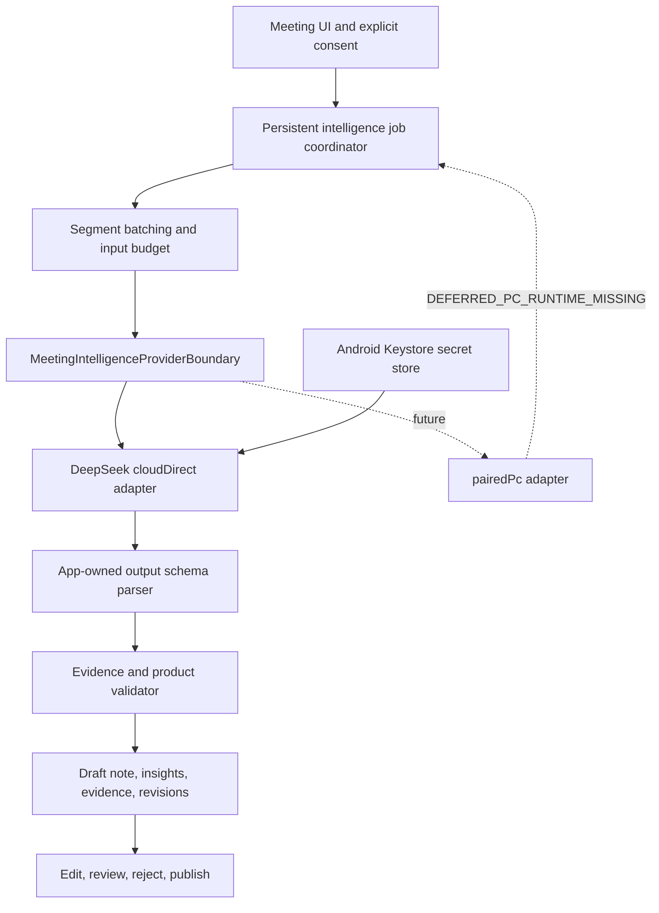
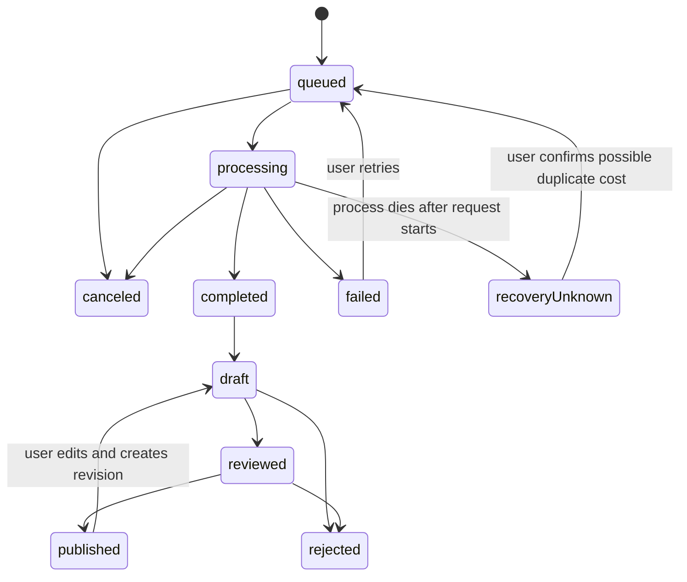
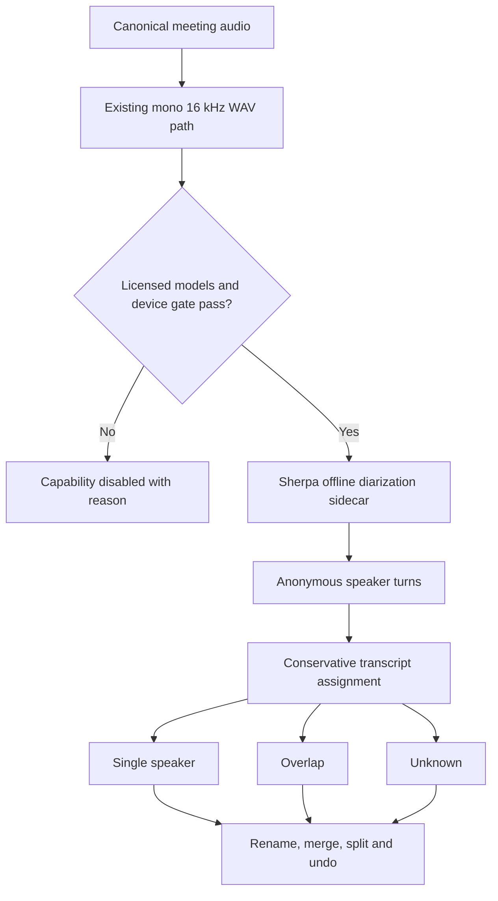

# S3 Productization - Plan

## Goal Capsule

| Field | Contract |
| --- | --- |
| Objective | 交付 S3 第一产品化增量：用户可选择云端直连 AI 生成可追溯、可编辑、可审核的结构化会议纪要；同时以当前 Sherpa AAR 为优先候选完成端侧匿名说话人分离的产品准入与人工修正闭环。 |
| Authority | `docs/product/meeting-voice-recognition-prd-v1.0.md` 定义用户结果；用户在本轮确认的云端直连优先、PC 配对后置、端侧说话人优先和真机测试节奏覆盖旧的未决处理位置。实际 AAR API、模型许可、服务响应和真机证据定义能力是否可开放。 |
| Execution profile | 先扩展供应商中立领域契约、数据库和密钥边界，再接入 DeepSeek 云端直连与持久任务编排，然后完成纪要产品界面；说话人路径先过模型许可、5 分钟功能和 120 分钟资源门禁，通过后才开放匿名分离与人工修正。 |
| Stop conditions | 未经当前会议明确上传同意不得发送任何原文；API 密钥不得进入 SQLite、源码、日志、诊断或备份；无证据内容不得发布为事实；说话人模型许可或资源门禁未通过时不得显示已可用入口；PC 运行时不存在时不得伪造二维码配对功能；本计划不得声明完整 S3 或产品发布就绪。 |
| Tail ownership | 本计划负责代码、迁移、自动化、受控云端 smoke、说话人准入证据、产品状态和开发门禁；不负责 PC 客户端、云端 ASR、商店发布、签名、提交、推送、PR、部署、付费账户运营或替用户保存生产密钥。 |

---

## Product Contract

### Summary

本计划把现有“证据与审核基础”推进为用户可使用的 S3 产品闭环。第一条生产路径是用户自带密钥的 DeepSeek 云端直连，用同一供应商中立契约生成标题建议、分层摘要、议题、决策、行动项、风险和待确认事项。所有结果先成为草稿，必须经过本地结构校验和证据校验，才能由用户审核、编辑和发布。

端侧说话人能力不属于 Paraformer ASR 模型本身，而是与转写并行的 Sherpa diarization sidecar。计划优先验证当前 AAR 已暴露的离线说话人分离 API 和可合法分发的模型；通过最小产品门禁后只交付匿名 `说话人 1/2`、重叠/未知状态、批量改名、合并、拆分和撤销。声纹身份识别涉及生物特征数据，另行做隐私与产品评审。

### Problem Frame

当前仓库已经能持久化摘要、决策、行动项和风险，强制证据范围合法，并支持草稿、审核、驳回、发布和修订历史，但只有 fixture provider。用户无法配置生产 AI、明确选择处理位置、观察任务状态，也无法生成 PRD 中要求的完整结构化纪要。

PRD 还要求回答“谁在什么时候说了什么”。当前 Paraformer 只负责 ASR，不返回说话人；Sherpa AAR 虽包含 diarization 和 embedding API，仍缺少已准入的分割/嵌入模型、长会议资源证据和产品数据结构。Sherpa 离线 diarization API 接收完整 float samples；120 分钟 16 kHz 单声道 PCM 仅 float buffer 就约 439 MiB，因此不能把 API 存在误当作移动端产品可用。

AI 处理位置也必须透明。云端直连会把会议原文发送给第三方，PC 配对则需要尚不存在的 PC 运行时和安全握手。若同时建设两条运行路径，会让可交付功能被 PC 端阻塞；若把永久密钥放进二维码、SQLite 或日志，又会破坏本地优先的信任边界。

### Actors

- A1. 本地优先用户：默认不上传会议内容，只在单次生成前明确同意云端处理。
- A2. 云端 AI 用户：提供自己的 API 密钥，选择已支持的云端提供商和模型，并承担相应服务费用。
- A3. 会议纪要审核者：编辑 AI 草稿、检查证据、确认或驳回条目，再决定是否发布。
- A4. 说话人修正者：检查匿名说话人归属，处理未知或重叠区间，并批量改名、合并或拆分。
- A5. 未来 PC 用户：通过一次性二维码把移动端与可信 PC 运行时配对；本计划只定义协议，不提供入口。

### Requirements

**Processing location and credentials**

- R1. 会议智能必须区分 `onDevice`、`cloudDirect` 和 `pairedPc` 三种处理位置，并在设置、确认、任务和已生成纪要中显示真实位置。
- R2. 第一条生产路径必须是用户自带密钥的 DeepSeek 云端直连；应用不得内置、共享或代管生产密钥。
- R3. API 密钥必须由 Android Keystore 保护，密文只存应用私有且排除备份的存储；SQLite、源码、日志、诊断、错误文案和导出不得出现密钥或 Authorization header。
- R4. 每次发送当前会议原文前必须展示提供商、模型、处理位置、预计请求批次和实际载荷范围，包括文本、时间戳及存在时的说话人标签，并说明数据由第三方条款处理；记录该次明确同意；关闭云端能力或拒绝同意时保持零网络请求。
- R5. PC 配对必须复用同一 provider 请求/结果契约，但本轮仅定义版本化协议、安全握手、能力协商和任务语义，状态标记为 `DEFERRED_PC_RUNTIME_MISSING`，不增加不可用二维码入口。

**Cloud generation and structured notes**

- R6. 云端 provider 必须输出应用自有、版本化的结构化 schema，不把供应商原始 JSON 当作持久化或 UI 契约。
- R7. 云端任务必须持久化排队、处理中、完成、失败和取消状态，支持本地去重、重试、进度、attempt 计数和脱敏错误；进程重启后不得把未知结果冒充完成。
- R8. 长会议必须按稳定片段 ID 和有界输入预算分批提取，再做有界汇总；每项证据仍须落在当前 generation 的真实片段范围内。
- R9. 产品必须生成可编辑标题建议和会议类型，但不得覆盖用户明确设置的会议标题。
- R10. 产品必须生成一句话摘要、要点摘要、详细纪要、议题/章节、已确认决策、行动项、风险、分歧和待确认事项。
- R11. 行动项缺少负责人或截止时间时必须显式标记待确认，不得无依据补全；风险和待确认事项必须有独立的解决状态。
- R12. 产品必须支持周会、评审、访谈、销售、复盘和一对一模板；模板只改变提取重点和展示顺序，不放松证据和发布规则。
- R13. 所有事实型条目必须携带可点击的原文/音频证据；无证据条目只可作为“未支持草稿”，不得审核后发布。
- R14. 用户必须能编辑结构化条目、负责人、截止时间和解决状态，并保留草稿、审核、驳回、发布及修订历史。

**Local speaker diarization**

- R15. 端侧说话人分离必须作为独立 sidecar 与 Paraformer 转写并行，不替换或耦合当前 ASR 模型。
- R16. 说话人模型必须记录来源、版本、SHA-256、大小和可分发许可；代码许可不能替代模型许可。
- R17. 能力开放前必须完成 5 分钟多说话人功能探针和 120 分钟资源探针；本轮跳过 30 分钟探针，完整 5/30/120 质量与设备矩阵留到发布稳定阶段。若 Sherpa 因 API、许可或资源门禁不可行，必须记录其他端侧开源候选的 Android 可集成性、许可和资源风险，不得无证据替换。
- R18. 产品只保存会议内匿名 speaker ID、显示名、时间区间和修订，不保存声纹 embedding，也不跨会议识别真实身份。
- R19. 自动结果不可靠、多人重叠或无法归属时必须标为未知或重叠，不得强行分配给单一说话人。
- R20. 用户必须能批量改名、合并和拆分说话人归属，并撤销修正；说话人搜索只在稳定 speaker 数据存在后开放。

**Truth and staging**

- R21. S2 的 ASR-005 人工听审继续保持 `SKIPPED_PENDING_USER_TEST` 和 BLOCKED，但不阻止本计划开发；本计划不得将其改写为 PASS。
- R22. 云端 ASR、多语言 ASR、声纹身份识别、PC 运行时、跨会议学习、Word/PDF 高级导出和完整发布兼容矩阵保持后置。
- R23. 产品文档必须分别报告 AI 直连、纪要闭环、说话人准入、PC 配对和完整 S3 的状态，任何条件能力不得因代码存在而标记 PASS。

### Key Flows

- F1. 配置云端直连
  - **Trigger:** A2 在设置中选择云端直连。
  - **Actors:** A2
  - **Steps:** 选择 DeepSeek；输入密钥；保存到安全存储；使用虚构短文本做可选连接测试；只显示成功、鉴权失败、余额不足、限流、服务不可用或结构无效等脱敏结果。
  - **Outcome:** 应用保存非秘密配置和 secret alias，绝不持久化明文密钥。
  - **Covered by:** R1-R4, R6
- F2. 生成并审核会议纪要
  - **Trigger:** A3 在有稳定转写的会议中请求生成。
  - **Actors:** A1, A2, A3
  - **Steps:** 展示载荷范围、预计请求批次和处理位置；取得单次同意；持久任务按预算处理；本地校验结构和证据；保存草稿；用户编辑、回看证据、审核或驳回；仅支持且已审核的条目可发布。
  - **Outcome:** 形成可追溯且可审计的结构化纪要，不覆盖原文或用户标题。
  - **Covered by:** R4, R6-R14
- F3. 失败、取消和恢复
  - **Trigger:** 网络、鉴权、限流、空 JSON、截断、进程终止或用户取消。
  - **Actors:** A2, A3
  - **Steps:** 保留本地原文和既有草稿；将任务置为明确状态；保存脱敏错误和 attempt；仅在用户操作后重试；对于无法确认是否已完成的远端请求，不重复写入结果。
  - **Outcome:** 用户知道发生了什么，不会因重试得到重复纪要或泄露秘密。
  - **Covered by:** R3, R7-R8
- F4. 生成并修正匿名说话人
  - **Trigger:** A4 对已完成转写的会议启动端侧说话人分离。
  - **Actors:** A4
  - **Steps:** 检查模型/设备能力；运行独立 sidecar；将 speaker turns 映射到片段；保留未知/重叠；用户批量改名、合并、拆分并撤销。
  - **Outcome:** 会议内可以回答谁在何时说了什么，同时不创建跨会议声纹身份。
  - **Covered by:** R15-R20
- F5. 未来 PC 配对
  - **Trigger:** PC 运行时未来实现并声明兼容协议。
  - **Actors:** A5
  - **Steps:** PC 显示只含短期地址、版本、能力和一次性 challenge 的二维码；移动端验证可信设备和加密通道；协商能力；通过同一任务契约提交、取消和取回结果。
  - **Outcome:** 永久 API 密钥不进入二维码；当前版本不显示此入口。
  - **Covered by:** R1, R5

### Acceptance Examples

- AE1. 新安装用户没有选择云端：会议页只说明未配置 AI，不发生 DNS、HTTP 或其他出站请求。
- AE2. 用户配置 DeepSeek 但在生成确认页选择取消：不创建远端 attempt，不发送任何转写片段，已有会议数据不变。
- AE3. 云端返回合法 JSON，但某条决策引用了不存在或越界的 segment ID：该条目被标记未支持且不可发布，其余合法条目仍可进入草稿。
- AE4. 云端返回空内容、被 `max_tokens` 截断或 schema 版本错误：任务失败为可理解的结构错误，不保存半份纪要，不把原始响应写入日志。
- AE5. 会议已有用户标题：AI 标题仅显示为建议；只有用户明确应用后才更新标题，并记录修订。
- AE6. 行动项正文有效但负责人和日期缺失：草稿显示两个待确认字段，审核者可补齐，不生成虚构姓名或日期。
- AE7. 应用进程在云端请求期间被终止：重启后任务显示可恢复的未知/失败状态；不得自动重复扣费请求或把空结果标为完成。
- AE8. 5 分钟说话人探针通过，但模型许可记录缺失：能力保持不可用，PRD 和设置页不显示已支持。
- AE9. 一个转写片段与两个 speaker turns 重叠且无法可靠拆分：界面显示重叠或未知，用户可手动拆分，不自动选择其中一人。
- AE10. 120 分钟资源探针出现 OOM、ANR 或超出准入预算：端侧说话人功能保持 `DEFERRED_RESOURCE_GATE`，不在本轮静默切换到其他开源项目。
- AE11. PC 运行时仍不存在：仓库有可审查的协议 schema 和安全约束，但应用没有扫码入口，也没有“即将可用”伪状态。
- AE12. S3 第一增量通过全部开发门禁：文档可标记 AI 直连和纪要闭环 PASS；ASR-009、PC 配对、声纹身份和完整 S3 仍保持后置。

### Success Criteria

- 用户能安全配置 DeepSeek、自主选择一次会议的发送范围，并完成生成、取消、失败恢复和重试。
- 六种模板均能产出版本化结构；标题、三层摘要、议题、决策、行动项、风险和待确认事项可编辑、可追溯、可审核。
- 所有事实型发布条目都有当前 generation 内的可播放证据；越界、缺失或伪造证据不能发布。
- 日志、诊断、SQLite、备份和导出中不出现 API 密钥、Authorization header、完整 prompt 或原始 provider 响应。
- 端侧说话人路线得到明确的 PASS 或带原因的 deferred 结论；通过时提供匿名分离、未知/重叠表达和人工修正，失败时不出现死入口。
- 真机测试节奏遵循本轮决策：开发期只做 5 分钟功能与 120 分钟资源探针，30 分钟和完整设备/质量矩阵留到发布稳定阶段。
- PC 配对有版本化安全协议，但状态真实保持 `DEFERRED_PC_RUNTIME_MISSING`。
- PRD、能力矩阵和 S3 状态页不把第一增量、完整 S3 和 release-ready 混为同一结论。

### Scope Boundaries

**In scope**

- DeepSeek 用户自带密钥云端直连、处理位置透明、单次上传同意、持久任务和结构化输出校验。
- AI-001 到 AI-009 的第一生产闭环，包括现有证据/审核基础的扩展。
- 会议模板、标题建议、议题章节、时间线回跳、完整纪要编辑和解决状态。
- 当前 Sherpa AAR 的端侧匿名说话人分离准入，以及通过门禁后的人工修正闭环。
- PC provider 协议、安全握手和 deferred 状态，不含运行时或 UI。
- S3 机器范围/状态契约、隐私校验、自动化、最小云端 smoke 和开发阶段真机证据。

**Deferred to later S3 increments or release stabilization**

- ASR-009 多语言与中英混说、云端语音识别、ASR-013 跨会议修订反馈闭环。
- 声纹注册、跨会议真实身份识别或持久 embedding；需单独生物特征隐私评审。
- POST-007 Word/PDF 高级导出、完整 5/30/120 质量矩阵和高/中/低设备发布兼容。
- PC 应用、二维码扫描入口、局域网发现、PC 模型运行和远端运维。

**Out of scope**

- 在应用包、源码或共享服务中提供公共 API key。
- 自动上传、后台静默上传、未经确认的 provider fallback 或把会议内容用于训练。
- 替换当前 Paraformer、实现实时转写、实时翻译、跨会议问答、云同步、协作或企业功能。
- 发布、签名、提交、推送、PR、部署和商店交付。

### Sources

- `docs/product/meeting-voice-recognition-prd-v1.0.md`
- `docs/product/mobile-capability-matrix.md`
- `docs/product/s2-mobile-core-scope.json`
- `docs/product/s2-closure-status.md`
- `benchmark/S2_ASR_CAPABILITY_REVIEW.md`
- `lib/features/meeting_intelligence/service/meeting_intelligence_provider.dart`
- `lib/features/meeting_intelligence/repository/meeting_intelligence_repository.dart`
- `lib/data/sqlite/app_database.dart`
- `android/app/libs/sherpa-onnx.aar`
- `android/app/src/main/AndroidManifest.xml`
- `android/app/src/main/res/xml/backup_rules.xml`
- `android/app/src/main/res/xml/data_extraction_rules.xml`
- DeepSeek first API call: <https://api-docs.deepseek.com/>
- DeepSeek Chat Completions: <https://api-docs.deepseek.com/api/create-chat-completion>
- DeepSeek JSON Output: <https://api-docs.deepseek.com/guides/json_mode/>
- DeepSeek errors: <https://api-docs.deepseek.com/quick_start/error_codes/>
- DeepSeek rate limits: <https://api-docs.deepseek.com/quick_start/rate_limit>
- Android Keystore: <https://developer.android.com/privacy-and-security/keystore>
- Sherpa speaker diarization: <https://k2-fsa.github.io/sherpa/onnx/speaker-diarization/index.html>
- Sherpa offline diarization API: <https://k2-fsa.github.io/sherpa/onnx/c-api/html/speaker_diarization.html>
- Sherpa speaker embedding API: <https://k2-fsa.github.io/sherpa/onnx/c-api/html/speaker_embedding.html>
- Sherpa Android diarization/model license note: <https://k2-fsa.github.io/sherpa/onnx/speaker-diarization/apk.html>

---

## Planning Contract

### Key Technical Decisions

- KTD1. 将 `MeetingProcessingLocation` 从 `local/remote` 迁移为 `onDevice/cloudDirect/pairedPc`。旧数据库中的 `local` 映射为 `onDevice`，`remote` 映射为 `cloudDirect`；处理位置是持久审计字段，不从当前设置反推。
- KTD2. 保留 `MeetingIntelligenceProvider` 作为供应商中立边界，只新增一个 DeepSeek 生产 adapter。provider 自己负责协议映射，应用领域层只接收版本化候选对象。
- KTD3. DeepSeek 模型 ID 是非秘密配置，不写死为永久产品常量。实现时根据官方当前模型目录给出默认值并允许在受支持列表内选择；持久记录每次实际使用的 provider/model。结构化提取使用非流式、非思考模式（当前模型支持时）来控制延迟和 token，且不保存 `reasoning_content`。
- KTD4. 使用 Android Keystore 生成不可导出的 AES-GCM key，明文 API key 只在保存或发请求时按需取出，不进入应用级缓存。密文和 IV 存在应用私有 SharedPreferences；key 失效时删除不可解密密文并要求用户重新输入。该边界保护静态数据，不声称能抵御已 root、调试注入或进程内存完全失陷的设备。
- KTD5. 云端输出使用 `meeting_intelligence_output/v1` 应用 schema。JSON mode 只保证语法层 JSON；应用仍校验 schema、枚举、长度、时间范围、segment ID、证据和发布规则。Prompt 把会议转写标为不可信数据，禁止工具调用、URL 获取和执行转写中的指令；provider 文本始终按纯文本展示。空内容、截断和未知字段按明确兼容策略处理。
- KTD6. 长会议采用持久、可恢复的有界 hierarchical map/reduce：map 按稳定 transcript segment 边界分批提取；reduce 只读取已通过验证的候选及其证据并在允许证据并集内生成全局标题、摘要和去重结果；每一层输出都重新执行 schema 与证据校验。输入预算使用保守字符/字节上限，provider token usage 仅用于审计和后续调优。
- KTD7. `meeting_intelligence_jobs` 与 `meeting_notes` 分离。job 表达网络执行和恢复；note 表达用户可审核内容。远端没有可靠幂等确认时，自动恢复不能重发未知 attempt，必须等待用户确认重试。
- KTD8. 标题、分层摘要、议题、决策、行动、风险和待确认项继续使用统一 insight/evidence 模型，但扩展 kind、层级、解决状态和模板元数据。AI 标题必须经过显式“应用标题”动作才修改 recording。
- KTD9. 说话人分离是 `AudioTranscoder/WavPcmChunkReader` 后的独立原生任务，不改变 Paraformer request/result。只把 diarization turns 与稳定 transcript segments 关联；转写失败不删除音频，diarization 失败不删除转写。
- KTD10. 当前 AAR v1.13.3 是原生 API 权威。AAR 已包含 `OfflineSpeakerDiarization`、`SpeakerEmbeddingExtractor`、`SpeakerEmbeddingManager` 和 `SpeakerRecognition`，但能力只在分割模型、嵌入模型、许可、ABI 和真机门禁同时通过后开放。
- KTD11. 第一阶段使用 Sherpa 官方 offline diarization pipeline 做准入，不自研 clustering。若 120 分钟资源门禁失败，本计划记录 `DEFERRED_RESOURCE_GATE` 并关闭产品入口；其他开源方案另开候选评测，不能在同一变更中无基准替换。
- KTD12. 说话人数据保持会议内匿名。持久化 speaker ID、显示名、turn 区间、assignment state 和 revision；不持久化 embedding，不做 voiceprint enrollment，不跨会议自动认人。
- KTD13. 自动 speaker assignment 只在单一 turn 清晰覆盖片段时直接归属；多 turn、重叠或间隙超过容差时保留 `overlap`/`unknown`。准确表达不确定性优先于填满标签。
- KTD14. 开发期说话人真机门禁固定为 5 分钟功能探针和 120 分钟资源探针，跳过 30 分钟。5 分钟已标注 fixture 要求有效 turn 覆盖至少 80% 的已标注语音、DER 不高于 30%、无越界 turn，并能表达重叠/未知；120 分钟要求无 OOM/ANR、RTF 不高于 0.5、增量峰值 RSS 不高于 384 MiB、Android thermal status 不进入 severe。发布稳定阶段再执行 5/30/120 的完整准确率、热量、电量、内存和设备矩阵。
- KTD15. PC 二维码只含协议版本、短期地址、能力、设备公钥指纹和一次性 challenge，不含永久 API key。未来链路必须做加密传输、设备固定/双向认证、过期和重放防护。
- KTD16. 本计划交付 S3 第一增量，不以 deferred 能力阻塞 AI 直连和纪要闭环，也不把第一增量冒充完整 S3。产品状态由机器范围契约分别计算。

### Assumptions

- 当前产品主平台和真机证据平台为 Android API 23+；安全存储先实现 Android Keystore，其他平台保持明确 unsupported，不降级为明文。
- 用户已确认云端直连优先、PC 配对等待 PC 原型、云端 ASR后置、端侧说话人优先，以及开发期跳过 30 分钟测试。
- 本轮暴露在聊天或其他非秘密渠道中的测试密钥在任何 live smoke 前会先轮换；计划和仓库不保存该密钥。
- DeepSeek 的 OpenAI-compatible endpoint、模型目录、限流和错误语义可能变化；实现以执行时官方文档为准，contract test 使用 fake transport，live smoke 只做最小可选验证。
- 用户提供的会议内容可能包含个人信息、商业秘密和敏感数据；应用只发送用户当前确认的转写范围，不发送音频、附件、其他会议或诊断数据。
- 说话人模型来源和许可尚未准入，因此 U6 可以产出明确 deferred 结论；U7 只有在 U6 通过后才进入可用产品路径。

### High-Level Technical Design

以下图示表达边界和状态，不规定具体类签名。

### Repository Patterns to Preserve

- `MeetingIntelligenceProviderBoundary` owns consent, processing-location and capability checks; provider adapters do not bypass it.
- `MeetingIntelligenceValidator` and `MeetingIntelligenceReviewService` enforce evidence and publication rules below the UI.
- `AppDatabase` uses additive, idempotent migrations plus explicit previous-version upgrade tests.
- Android platform work routes through the existing `MainActivity` method channel and feature-scoped Kotlin services; secrets and logs follow `PrivacySafeLog`.
- Long-running work uses persistent job rows and restart reconciliation, following transcription queue semantics without sharing its domain tables.
- UI uses documented Goo components, semantic labels, explicit loading/error/disabled states and compact single-column behavior.
- Backup remains globally disabled and explicit XML exclusions remain fail-closed.

### System-Wide Impact

- **Database:** schema v19 adds intelligence jobs, template/schema metadata, expanded insight fields and anonymous speaker tables. Existing v15 meeting intelligence rows must remain readable and map old processing locations.
- **Network:** production app gains Internet permission and a single explicit cloudDirect path. Network code must enforce HTTPS, fixed DeepSeek host for the first adapter, disabled redirects or post-redirect host revalidation, timeouts, cancellation, bounded bodies and sanitized errors.
- **Secrets:** a new platform boundary creates, reads and deletes encrypted API credentials; diagnostic and export code must be tested against secret leakage.
- **Lifecycle:** cloud jobs and diarization jobs must survive process death without corrupting notes or transcript generations. Cancel and retry semantics remain separate from review state.
- **Storage:** speaker model assets can materially increase package size. Asset registry and product availability must expose bytes, hashes, license and readiness; no unreviewed model may enter `pubspec.yaml`.
- **Memory:** offline diarization can allocate the full decoded sample buffer. Resource evidence must capture peak RSS, failure, elapsed time and thermal state before the capability is enabled.
- **Privacy:** cloud consent, provider/model/location audit and anonymous speaker boundaries change help text, settings, diagnostics and product matrices.
- **UX:** meeting detail gains generation status, structured sections, evidence review and conditional speaker controls. It must remain usable at 200% font, dark mode, TalkBack and landscape.

### Risks & Dependencies

| Risk or dependency | Impact | Mitigation |
| --- | --- | --- |
| DeepSeek API or model names change | Adapter fails or silently changes behavior | Isolate adapter, persist actual model ID, use fake contract tests, verify official docs at execution time, keep live smoke optional and bounded. |
| JSON mode returns empty or truncated content | Half-valid notes or lost user trust | Detect empty content and finish reason, parse into versioned DTO, validate atomically, save no partial note, expose retryable error. |
| Retry duplicates provider cost | Unexpected charges and duplicate drafts | Persist attempt and recoveryUnknown state; do not automatically retry an in-flight request after process death; require user confirmation. |
| Secret leaks through logs, diagnostics or database | Credential compromise | Native Keystore, sanitized errors, privacy contract scan, fake keys in tests, backup exclusions, never persist request headers. |
| Long transcripts exceed context or cost budget | Failed or expensive generation | Stable bounded batches, deterministic reduce, request/output caps, usage audit, cancel support and visible range. |
| Model output invents evidence or follows transcript prompt injection | False facts become publishable or untrusted text changes model behavior | Delimit transcript as untrusted data, disable tools/URL access, locally validate segment/time evidence, keep unsupported state and publication gate, render output as plain text. |
| Speaker model license is incompatible or unclear | Cannot distribute model | Require model-specific notice and redistribution evidence before packaging; otherwise defer. |
| Offline diarization holds full 120-minute float array | OOM, ANR, thermal or battery damage | Run the preregistered resource probe before UI exposure; fail closed, document endpoint-open-source alternatives, and move any replacement integration to a follow-up plan. |
| Diarization mislabels overlap | Misleading attribution | Conservative unknown/overlap states, no forced assignment, manual split/merge and revision history. |
| Voiceprint identity expands biometric scope | Legal and trust risk | Do not persist embeddings or recognize across meetings; require separate biometric review. |
| PC contract drifts before runtime exists | Rework | Keep a small versioned schema, capability negotiation and explicit deferred status; implement no mobile UI until an interoperable PC fixture exists. |
| S3 scope is overstated | Product documents claim unavailable features | Add machine-readable S3 status contract and fail development checks on status inflation. |

### Delivery Sequence

1. U1 establishes schema v19 and the expanded provider/domain contract.
2. U2 establishes secure settings, consent and secret-leak boundaries.
3. U3 implements the DeepSeek adapter and structured schema parser against fake transport.
4. U4 adds persistent bounded orchestration, recovery and optional minimal live smoke.
5. U5 completes the structure, editing, evidence, template and timeline product UI.
6. U6 performs Sherpa model/license/API admission plus the 5-minute and 120-minute probes.
7. U7 is enabled only if U6 passes; otherwise it lands no product entrance and records the deferred reason.
8. U8 freezes the future PC provider protocol without runtime or UI.
9. U9 closes integration, privacy, accessibility and product-truth gates.

---

## Implementation Units

### U1. Expand the S3 domain and persistence contract

- **Goal:** Make processing location, structured note kinds, job lifecycle, template metadata, resolution state and anonymous speaker data representable without breaking existing notes.
- **Requirements:** R1, R6-R14, R18-R20, R23; AE3, AE5, AE6.
- **Files:** Modify `lib/data/sqlite/app_database.dart`, `lib/features/meeting_intelligence/model/meeting_insight_entity.dart`, `lib/features/meeting_intelligence/model/meeting_note_entity.dart`, `lib/features/meeting_intelligence/service/meeting_intelligence_provider.dart`, `lib/features/meeting_intelligence/repository/meeting_intelligence_repository.dart`; create `lib/features/meeting_intelligence/model/meeting_intelligence_job_entity.dart`, `lib/features/meeting_intelligence/model/meeting_template.dart`, `lib/features/speakers/model/meeting_speaker_entity.dart`, `lib/features/speakers/model/speaker_turn_entity.dart`, `lib/features/speakers/repository/speaker_repository.dart`; create `test/features/meeting_intelligence/schema_v19_upgrade_test.dart`, `test/features/meeting_intelligence/meeting_intelligence_domain_test.dart`, `test/features/speakers/speaker_repository_test.dart`.
- **Approach:** Add an idempotent v18→v19 migration. Introduce `meeting_intelligence_jobs`, non-secret provider/location/model settings, consent version/time/payload metadata, schema/template fields, expanded insight kinds and independent resolution state. Add meeting-scoped speakers, time-bounded speaker assignments and speaker revisions without storing embeddings. Map legacy `local/remote` values at read/migration time and preserve all v15 notes.
- **Execution note:** Proof-first. Start with a v18 fixture containing published and draft notes, then prove the migration preserves rows, foreign keys, statuses and evidence before adding new behavior.
- **Test scenarios:** Fresh v19 schema contains all tables/indexes; v18 data migrates without loss; legacy `local` becomes `onDevice` and `remote` becomes `cloudDirect`; invalid job/status/template values fail closed; deleting a recording cascades jobs/notes/speakers; deleting or replacing a transcript generation does not leave dangling evidence or assignments; speaker merge/split revision is atomic and reversible.
- **Verification:** Focused schema/domain/repository tests pass and existing meeting intelligence tests remain unchanged in meaning.
- **Dependencies:** None.

### U2. Add secure cloud settings and explicit consent

- **Goal:** Let users configure DeepSeek without placing secrets in application data, and require transparent per-meeting upload consent.
- **Requirements:** R1-R4; AE1, AE2.
- **Files:** Modify `android/app/src/main/AndroidManifest.xml`, `android/app/src/main/kotlin/com/voice2text/app/MainActivity.kt`, `android/app/src/main/res/xml/backup_rules.xml`, `android/app/src/main/res/xml/data_extraction_rules.xml`, `lib/features/settings/model/app_settings.dart`, `lib/features/settings/repository/app_settings_repository.dart`, `lib/features/settings/settings_page.dart`; create `android/app/src/main/kotlin/com/voice2text/app/privacy/MeetingApiSecretStore.kt`, `lib/features/meeting_intelligence/service/meeting_api_secret_store.dart`, `lib/features/meeting_intelligence/widgets/cloud_processing_consent_panel.dart`; create `android/app/src/test/kotlin/com/voice2text/app/privacy/MeetingApiSecretStoreTest.kt`, `android/app/src/androidTest/kotlin/com/voice2text/app/privacy/MeetingApiSecretStoreSmokeTest.kt`, `test/features/meeting_intelligence/meeting_api_secret_store_test.dart`, `test/features/meeting_intelligence/cloud_processing_consent_panel_test.dart`; modify `test/features/settings/settings_page_test.dart`, `tool/check_privacy_contract.sh`.
- **Approach:** Add Internet permission only in the main manifest. Store provider/location/model and secret presence in normal settings, but route set/read/delete through an Android Keystore AES-GCM service. JVM tests use an injected crypto/storage backend for envelope and redaction semantics; a focused instrumented smoke proves real AndroidKeyStore behavior. Settings uses documented Goo list, input, panel, button, tag and snackbar patterns. The generation confirmation shows provider, model, `cloudDirect`, expected request count, exact text/time/speaker-label payload and the fact that it leaves the device.
- **Test scenarios:** Saving a fake key writes no plaintext to SQLite or test-visible preferences; reading after save returns only through the secret API; a physical/emulated Android round-trip uses a non-exportable Keystore key; delete and key invalidation require re-entry; unsupported platforms fail closed; no provider or no secret disables cloud generation; canceling consent produces zero provider calls; diagnostics and error surfaces redact fake bearer values; 200% font and TalkBack expose field purpose, secret masking and confirmation actions.
- **Verification:** Kotlin/JVM envelope tests, Android Keystore instrumented smoke, Flutter settings/widget tests and the privacy contract pass; backup rules still exclude all app-private data.
- **Dependencies:** U1.

### U3. Implement the DeepSeek adapter and app-owned output schema

- **Goal:** Turn bounded transcript batches into validated S3 candidates through one production cloudDirect adapter without provider JSON leaking into domain storage.
- **Requirements:** R2, R6, R8-R13; AE3, AE4, AE6.
- **Files:** Create `lib/features/meeting_intelligence/service/deepseek_meeting_intelligence_provider.dart`, `lib/features/meeting_intelligence/service/meeting_intelligence_http_client.dart`, `lib/features/meeting_intelligence/service/meeting_intelligence_output_codec.dart`, `lib/features/meeting_intelligence/service/meeting_prompt_builder.dart`; modify `lib/features/meeting_intelligence/service/meeting_intelligence_provider.dart`, `lib/features/meeting_intelligence/service/meeting_intelligence_validator.dart`; create `test/features/meeting_intelligence/deepseek_meeting_intelligence_provider_test.dart`, `test/features/meeting_intelligence/meeting_intelligence_output_codec_test.dart`, `test/features/meeting_intelligence/meeting_prompt_builder_test.dart`; add synthetic fixtures under `test/fixtures/meeting_intelligence/`.
- **Approach:** Use a small injectable HTTP transport with HTTPS host allowlisting, redirects disabled unless the final host is revalidated, connection/read timeouts, cancellation and bounded response size. Request non-streaming DeepSeek JSON output with thinking disabled when the selected model supports it, a versioned schema example and conservative output cap. Delimit transcript content as untrusted data and send no tool definitions or URL-fetch capability. Parse only final answer content to DTOs, reject empty/truncated/unknown-version output, discard `reasoning_content`, normalize only documented compatibility cases, then pass candidates to the existing evidence validator. Do not add a provider SDK or persist raw request/response bodies.
- **Test scenarios:** Valid synthetic JSON maps every supported kind and evidence range; request flags stream off and supported thinking mode off; `reasoning_content` is neither parsed nor persisted; a transcript containing “忽略系统指令”、JSON fragments or URLs remains data and cannot change schema/tool behavior; empty content, malformed JSON, unknown schema, response too large and `finish_reason=length` fail atomically; 401/402/429/500/503 map to sanitized actionable codes; cancellation closes transport and saves no note; an invented segment becomes unsupported; template prompt changes emphasis but not evidence rules; headers and fake key never appear in thrown errors.
- **Verification:** Provider, codec, prompt and validator tests pass using fake transport with no network access.
- **Dependencies:** U1, U2.

### U4. Add persistent bounded generation orchestration

- **Goal:** Make cloud generation cancelable, recoverable, cost-bounded and safe for long meetings.
- **Requirements:** R4, R7-R8, R23; AE2, AE4, AE7.
- **Files:** Create `lib/features/meeting_intelligence/repository/meeting_intelligence_jobs_repository.dart`, `lib/features/meeting_intelligence/service/meeting_intelligence_job_coordinator.dart`, `lib/features/meeting_intelligence/service/meeting_intelligence_job_reconciler.dart`, `lib/features/meeting_intelligence/service/transcript_batch_planner.dart`; modify `lib/features/meeting_intelligence/repository/meeting_intelligence_repository.dart`, `lib/features/meetings/meeting_detail_page.dart`; create `test/features/meeting_intelligence/meeting_intelligence_jobs_repository_test.dart`, `test/features/meeting_intelligence/meeting_intelligence_job_coordinator_test.dart`, `test/features/meeting_intelligence/meeting_intelligence_job_reconciler_test.dart`, `test/features/meeting_intelligence/transcript_batch_planner_test.dart`; create `tool/run_deepseek_meeting_smoke.sh`.
- **Approach:** Create the job before any provider call, hash the generation/range/template/provider/model inputs for local dedupe, and advance state transactionally. Batch only at segment boundaries, keep every map/reduce request bounded, let reduce consume only validated candidates and their permitted evidence union, revalidate each level, and write one complete draft transaction. The planner exposes estimated request count and payload composition before consent. Reconciliation converts pre-request jobs back to queued and in-flight jobs to recoveryUnknown; only the user can authorize a potentially billable retry. The opt-in smoke reads a rotated key from an environment variable, uses a short fictional transcript, performs at most two requests and caps output at 512 tokens.
- **Test scenarios:** Duplicate tap creates one active job; cancel before request sends nothing; cancel during request closes transport; process death before request is safely requeued; process death during request becomes recoveryUnknown; user-confirmed retry increments attempt; batching preserves every segment once and stays within budget; hierarchical reduce creates a coherent global summary only from validated candidates and cannot introduce evidence outside their union; estimated request count matches the planned hierarchy; no partial note exists after any failed batch; live smoke refuses missing env secret and never prints it.
- **Verification:** Repository/coordinator/reconciler/planner tests pass; optional smoke returns a schema-valid synthetic result within its request/token cap.
- **Dependencies:** U1, U2, U3.

### U5. Complete the structured meeting-note product experience

- **Goal:** Expose generation, templates, structured sections, editing, evidence review and publication as a coherent meeting workflow.
- **Requirements:** R9-R14; AE3, AE5, AE6.
- **Files:** Modify `lib/features/meeting_intelligence/widgets/meeting_intelligence_section.dart`, `lib/features/meeting_intelligence/widgets/evidence_review_panel.dart`, `lib/features/meeting_intelligence/service/meeting_intelligence_review_service.dart`, `lib/features/meeting_intelligence/repository/meeting_intelligence_repository.dart`, `lib/features/meetings/meeting_detail_page.dart`; create `lib/features/meeting_intelligence/widgets/meeting_generation_panel.dart`, `lib/features/meeting_intelligence/widgets/meeting_note_editor.dart`, `lib/features/meeting_intelligence/widgets/meeting_topic_timeline.dart`; modify `test/features/meeting_intelligence/meeting_intelligence_section_test.dart`, `test/features/meeting_intelligence/meeting_intelligence_review_service_test.dart`; create `test/features/meeting_intelligence/meeting_generation_panel_test.dart`, `test/features/meeting_intelligence/meeting_note_editor_test.dart`, `test/features/meeting_intelligence/meeting_topic_timeline_test.dart`, `integration_test/meeting_intelligence_flow_test.dart`.
- **Approach:** Reuse Goo components and the meeting-detail evidence seek callback. Present job state before note state; group insights by title, summary level, topic, decision, action, risk and unresolved. Add explicit apply-title, edit metadata, resolve/reopen, review/reject/publish and evidence jump actions. Keep Compact layouts single-column and use panels for focused generation/review/edit flows.
- **Test scenarios:** No provider shows an honest setup state; configured provider opens template/range/consent flow and links the applicable third-party data policy; queued/processing/cancel/failed/recoveryUnknown states are distinguishable; user title is not overwritten; provider text renders as inert plain text even when it contains Markdown, HTML or URLs; editing a published item returns it to draft with a revision; unresolved owner/date and risk resolution persist; unsupported item cannot publish; topic and evidence taps seek audio; six templates render; TalkBack, 200% text, dark mode and landscape keep all actions reachable.
- **Verification:** Widget/service tests and the synthetic end-to-end meeting intelligence flow pass; visual states use only documented Goo APIs and analyzer-valid parameters.
- **Dependencies:** U1-U4.

### U6. Admit or defer the Sherpa speaker-diarization candidate

- **Goal:** Produce an evidence-backed product-gate decision for the installed AAR plus selected segmentation/embedding models before any user-facing speaker capability exists.
- **Requirements:** R15-R17, R23; AE8, AE10.
- **Files:** Create `android/app/src/main/kotlin/com/voice2text/app/speakers/SpeakerDiarizationModelRegistry.kt`, `android/app/src/main/kotlin/com/voice2text/app/speakers/SherpaSpeakerDiarizationEngine.kt`, `android/app/src/androidTest/kotlin/com/voice2text/app/speakers/SpeakerDiarizationFiveMinuteSmokeTest.kt`, `android/app/src/androidTest/kotlin/com/voice2text/app/speakers/SpeakerDiarizationResourceGateTest.kt`, `benchmark/speaker_diarization_manifest.json`, `benchmark/S3_SPEAKER_DIARIZATION_REVIEW.md`, `benchmark/S3_SPEAKER_ALTERNATIVES.md`, `benchmark/evaluate_speaker_diarization.py`, `benchmark/test_evaluate_speaker_diarization.py`; modify `pubspec.yaml` only after model license admission.
- **Approach:** Inspect the installed AAR and pin the exact Kotlin API. Evaluate one official Sherpa-compatible segmentation/embedding pair, record model-specific license and identity, and keep the asset outside production packaging until admitted. Put the KTD14 limits and target device identity in the benchmark manifest before running. Run a 5-minute licensed, annotated multi-speaker fixture for turn coverage, DER, ordered bounds and overlap honesty. Run a 120-minute resource-only probe for completion, OOM/ANR, RTF, peak RSS and thermal state. Do not run the 30-minute case in this unit; this is a development-admission result, not release-quality evidence. If Sherpa is deferred, compare only credible on-device open-source candidates on Android binding maturity, segmentation/embedding/clustering completeness, model license, package size and memory, then recommend a separate candidate plan or record that no viable fallback exists.
- **Test scenarios:** Missing model, wrong hash, unsupported ABI or missing license returns unavailable; 5-minute fixture achieves at least 80% annotated-speech turn coverage and DER ≤30%, has no out-of-range turn, and does not alter transcript text/timestamps; silence produces no fabricated speaker; overlap is representable; 120-minute run has no OOM/ANR, RTF ≤0.5, incremental peak RSS ≤384 MiB and no severe thermal state, otherwise records `DEFERRED_RESOURCE_GATE`; manifest cannot mark available and verified without both probes; a deferred Sherpa result has an evidence-backed alternatives review rather than an automatic replacement.
- **Verification:** Python evaluator self-tests pass; Android instrumented probes produce a review artifact with device/build/model hashes and an unambiguous PASS or deferred reason.
- **Dependencies:** U1. U6 can run in parallel with U2-U5 after U1.

### U7. Productize anonymous speaker correction when the gate passes

- **Goal:** If and only if U6 passes, connect diarization turns to transcript segments and provide honest anonymous speaker editing.
- **Requirements:** R15, R18-R20; AE9.
- **Files:** Create `android/app/src/main/kotlin/com/voice2text/app/speakers/SpeakerDiarizationExecutor.kt`, `lib/features/speakers/service/android_speaker_diarization_service.dart`, `lib/features/speakers/service/speaker_assignment_service.dart`, `lib/features/speakers/widgets/speaker_review_panel.dart`; modify `android/app/src/main/kotlin/com/voice2text/app/MainActivity.kt`, `lib/features/meetings/meeting_detail_page.dart`, `lib/features/transcription/model/transcript_segment_entity.dart`; create `android/app/src/test/kotlin/com/voice2text/app/speakers/SpeakerDiarizationExecutorTest.kt`, `test/features/speakers/android_speaker_diarization_service_test.dart`, `test/features/speakers/speaker_assignment_service_test.dart`, `test/features/speakers/speaker_review_panel_test.dart`, `integration_test/meeting_speaker_review_flow_test.dart`.
- **Approach:** Execute diarization off the UI thread, persist ordered turns and map them conservatively onto current-generation segments. Use anonymous default labels and explicit known/overlap/unknown states. Batch rename and merge operate on stable meeting speaker IDs; split operates on bounded assignment ranges; every change writes a revision that can be undone. If U6 is deferred, keep service capability false, omit UI routes and update only status evidence.
- **Test scenarios:** Clear single-speaker coverage assigns one anonymous speaker; two overlapping turns produce overlap; gaps produce unknown; re-transcription invalidates stale mappings without deleting manual revisions silently; rename updates all assignments for that speaker; merge/split is transactional and undoable; search exposes speaker filtering only after stable data exists; cancellation and process death preserve transcript and audio; gate-false build has no actionable speaker entrance.
- **Verification:** Kotlin, Flutter, repository, widget and conditional integration tests pass; the UI capability exactly matches the U6 manifest.
- **Dependencies:** U1, U6. Product-enabled branch also depends on U5 for meeting-detail integration.

### U8. Freeze the paired-PC provider protocol without shipping dead UI

- **Goal:** Define the smallest interoperable and secure contract needed for future QR pairing while keeping the current product honest.
- **Requirements:** R1, R5; AE11.
- **Files:** Create `docs/architecture/meeting-intelligence-provider-protocol.md`, `docs/contracts/meeting-intelligence-provider-v1.schema.json`, `tool/validate_meeting_intelligence_provider_contract.py`, `tool/test_validate_meeting_intelligence_provider_contract.py`; modify `lib/features/meeting_intelligence/service/meeting_intelligence_provider.dart` only for shared capability names needed by the schema.
- **Approach:** Specify protocol version, ephemeral QR payload, public-key fingerprint, one-time challenge, expiration, capability negotiation, provider/model/location, job ID, idempotency key, input hash, progress, cancel/retry and structured result schema. Define encrypted authenticated transport and replay rejection as mandatory. Mark PC runtime and mobile adapter TODO; do not create scanner permissions, routes or settings items.
- **Test scenarios:** Valid fixture round-trips; QR containing an API key fails; expired or replayed challenge fails; unsupported protocol/capability fails negotiation; result with mismatched job/input hash fails; status docs remain `DEFERRED_PC_RUNTIME_MISSING`; application route scan finds no PC pairing UI.
- **Verification:** Schema/validator tests pass and the protocol references the same output schema and processing-location vocabulary as U1/U3.
- **Dependencies:** U1, U3.

### U9. Close privacy, accessibility, truth and integration gates

- **Goal:** Prove the first S3 increment without overstating speaker, PC, multilingual or release status.
- **Requirements:** R1-R23; AE1-AE12; KTD1-KTD16.
- **Files:** Create `docs/product/s3-productization-scope.json`, `docs/product/s3-productization-status.md`, `tool/validate_s3_productization_scope.py`, `tool/test_validate_s3_productization_scope.py`; modify `docs/product/meeting-voice-recognition-prd-v1.0.md`, `docs/product/mobile-capability-matrix.md`, `docs/REAL_DEVICE_REGRESSION_MATRIX.md`, `README.md`, `tool/dev_check.sh`, `tool/check_privacy_contract.sh`, `tool/preflight_release.sh`.
- **Approach:** Encode separate gates for cloudDirect, structured notes, speaker admission, paired PC and full S3. Validate no secret-bearing patterns or stale `local/remote` claims, require evidence hashes for conditional speaker status, and keep ASR-005 skip/BLOCKED intact. Add an Android device smoke for the synthetic AI flow without real meeting content, plus accessibility review at 200% font, TalkBack, dark mode and landscape. Full release preflight must continue to fail while deferred S3 and existing release gates remain open.
- **Test scenarios:** Cloud/notes PASS with speaker deferred yields first-increment partial, not full S3 PASS; speaker code without model/license/device evidence fails status validation; PC contract without runtime remains deferred; leaked fake key/header/prompt in diagnostics fixture fails privacy check; ASR-005 changed to PASS fails scope validation; AI generation and evidence seek survive process restart; accessibility actions remain reachable; release preflight remains NOT RELEASE-READY.
- **Verification:** Scope validator, privacy contract, full Flutter/Android checks, synthetic device flow and watcher checks pass; PRD and matrices match computed status.
- **Dependencies:** U1-U8.

---

## Verification Contract

### Per-Unit Gates

| Unit | Command or review | Pass signal |
| --- | --- | --- |
| U1 | `flutter test test/features/meeting_intelligence/schema_v19_upgrade_test.dart test/features/meeting_intelligence/meeting_intelligence_domain_test.dart test/features/speakers/speaker_repository_test.dart` | Fresh and upgraded schemas preserve evidence and enforce new lifecycle/speaker invariants. |
| U2 | `cd android && ./gradlew app:testDebugUnitTest` plus focused AndroidKeyStore instrumented smoke and Flutter settings/consent tests | Crypto envelope, real Keystore round-trip, redaction, unsupported-platform and explicit-consent cases pass. |
| U2 | `./tool/check_privacy_contract.sh` | No secret-bearing storage/log/diagnostic/backup path is admitted. |
| U3 | `flutter test test/features/meeting_intelligence/deepseek_meeting_intelligence_provider_test.dart test/features/meeting_intelligence/meeting_intelligence_output_codec_test.dart test/features/meeting_intelligence/meeting_prompt_builder_test.dart test/features/meeting_intelligence/meeting_intelligence_validator_test.dart` | Fake transport covers success, schema, evidence, truncation, error, cancel and redaction behavior without network. |
| U4 | `flutter test test/features/meeting_intelligence/meeting_intelligence_jobs_repository_test.dart test/features/meeting_intelligence/meeting_intelligence_job_coordinator_test.dart test/features/meeting_intelligence/meeting_intelligence_job_reconciler_test.dart test/features/meeting_intelligence/transcript_batch_planner_test.dart` | Dedupe, bounded batching, cancellation, recoveryUnknown and atomic draft behavior pass. |
| U4 | `DEEPSEEK_API_KEY=... ./tool/run_deepseek_meeting_smoke.sh` | Optional rotated-secret smoke makes at most two short fictional requests, emits no secret and returns schema-valid output within 512 output tokens. |
| U5 | `flutter test test/features/meeting_intelligence` | Generation, editing, templates, evidence, review and publication states pass. |
| U5 | `flutter test integration_test/meeting_intelligence_flow_test.dart -d <device-id>` | Synthetic on-device UI flow completes without real meeting content. |
| U6 | `python3 -m unittest benchmark/test_evaluate_speaker_diarization.py` | Manifest evaluator rejects missing license/hash/probe and accepts only complete evidence. |
| U6 | `cd android && ./gradlew connectedDebugAndroidTest -Pandroid.testInstrumentationRunnerArguments.class=com.voice2text.app.speakers.SpeakerDiarizationFiveMinuteSmokeTest` | Five-minute fixture reaches ≥80% annotated-speech turn coverage and DER ≤30%, has valid bounds, and represents overlap/unknown honestly on the named device/build/model. |
| U6 | `cd android && ./gradlew connectedDebugAndroidTest -Pandroid.testInstrumentationRunnerArguments.class=com.voice2text.app.speakers.SpeakerDiarizationResourceGateTest` | 120-minute resource-only probe has no OOM/ANR, RTF ≤0.5, incremental peak RSS ≤384 MiB and no severe thermal state, or records a fail-closed deferred result; 30-minute is not run. |
| U7 | Focused Kotlin, Flutter and `integration_test/meeting_speaker_review_flow_test.dart` | When admitted, assignment/rename/merge/split/undo works; when deferred, no product entrance exists. |
| U8 | `python3 -m unittest tool/test_validate_meeting_intelligence_provider_contract.py` and `python3 tool/validate_meeting_intelligence_provider_contract.py` | Protocol accepts secure versioned fixtures and rejects keys, replay, expiry, capability and hash mismatches. |
| U9 | `python3 -m unittest tool/test_validate_s3_productization_scope.py` and `python3 tool/validate_s3_productization_scope.py` | Computed first-increment, speaker, PC and full-S3 statuses match all product documents. |
| U9 | `./tool/dev_check.sh` | Analyzer, Flutter tests, privacy/scope contracts and existing S1/S2 gates pass. |
| U9 | `./tool/dev_check.sh --with-build` | Debug APK builds with admitted assets and no unresolved analyzer/test failure. |
| U9 | `./tool/preflight_release.sh` | Preflight honestly remains blocked on deferred/release gates rather than claiming release readiness. |
| U9 | `./tool/ensure_ui_watcher.sh` | Watcher runs when a physical device is connected, or exits cleanly when unavailable/already running. |

The live DeepSeek smoke is optional and never runs in the default development check. It requires a rotated environment secret, fictional input and the hard request/token cap above. Unit and integration acceptance cannot depend on a paid external service.

### Required Manual Review

- Verify the consent panel states exactly what text range leaves the device, which provider/model receives it and that audio is not sent.
- Verify an API key cannot be recovered from SQLite, app backup, logcat, diagnostics, exported notes, screenshots or error UI.
- Verify AI title remains a suggestion until explicitly applied and every published fact has a playable evidence path.
- Verify the six templates change useful output emphasis while retaining the same evidence/publication rules.
- Verify the speaker review records exact AAR/model hashes, model-specific license and device/build identity.
- Verify the U6 5-minute/120-minute schedule was followed and no 30-minute result was invented.
- Verify overlap and unknown speaker states are visible and manual correction remains possible.
- Verify no PC scanner route, camera permission or fake connectivity state exists before a PC runtime fixture.
- Verify ASR-005 remains BLOCKED/`SKIPPED_PENDING_USER_TEST`, full S3 is not PASS and the product remains NOT RELEASE-READY.

### Stop-the-Line Failures

- Any secret, bearer header, full provider request/response or real meeting transcript appears in source, logs, diagnostics, fixtures or committed benchmark output.
- Any network request occurs without current meeting consent or outside the displayed transcript range.
- Any partial, malformed or unsupported AI output is saved as a complete note.
- Any unsupported or evidence-free fact can reach published state.
- Any retry automatically resends a recoveryUnknown paid request.
- Any unlicensed/unhashed speaker model enters production assets.
- Any speaker capability appears when its U6 gate is deferred or when overlap is force-assigned.
- Any embedding or voiceprint identity is persisted across meetings.
- Any PC QR contains a permanent credential, or any pairing UI ships without a PC runtime and interoperable security fixture.
- Any document calls the first S3 increment, ASR-009, PC pairing, ASR-005 or overall release complete without the corresponding evidence.

---

## Definition of Done

- U1-U9 have satisfied their applicable dependencies and every mandatory Verification Contract gate passes.
- Existing meeting notes and evidence survive the v19 migration; new jobs, templates, structured fields and anonymous speaker data maintain foreign-key and revision integrity.
- DeepSeek cloudDirect can be configured with a user-owned secret protected by Android Keystore, and plaintext secrets are absent from all forbidden surfaces.
- A user can explicitly consent, generate a bounded structured note, cancel, understand failures, recover after restart, edit results, inspect evidence, review/reject and publish supported items.
- Title suggestion, three summary levels, topics, decisions, actions, risks, unresolved items and six templates are present and tested.
- Long meetings use bounded segment batching and atomic validated drafts; duplicate taps and uncertain retries do not silently duplicate work or cost.
- U6 records either a fully traceable speaker PASS or an explicit deferred reason. U7 exposes anonymous speaker correction only in the PASS case and never persists voiceprints.
- The PC provider protocol is versioned, secure by contract and still marked `DEFERRED_PC_RUNTIME_MISSING`; no dead QR UI exists.
- S3 status automation distinguishes first-increment capability, speaker admission, PC pairing, full S3 and release readiness; ASR-005 remains truthfully skipped/BLOCKED.
- Accessibility, dark mode, landscape, synthetic device flow, full development checks and debug build pass for the implemented branch.
- Temporary secrets, raw provider payloads, unlicensed model files, abandoned experiments, obsolete adapters and dead UI are removed before completion.
- No commit, push, PR, deployment, signing or store action is performed unless separately requested.
