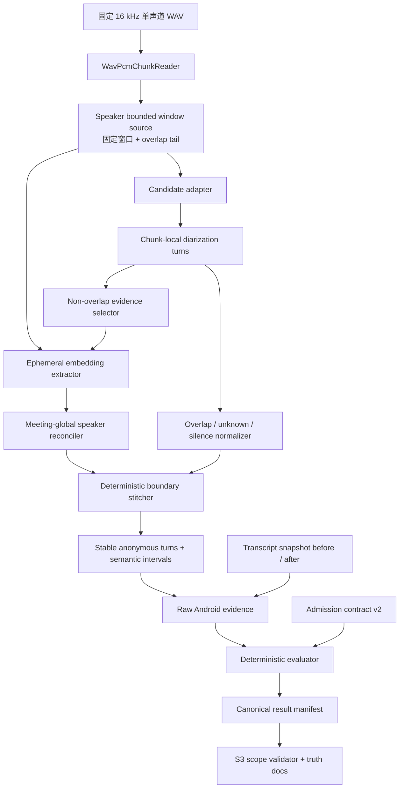
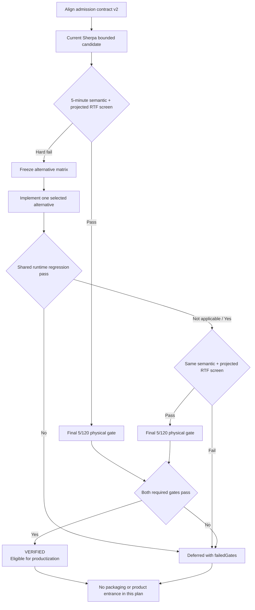

# Speaker Diarization Readmission - Plan

## Goal Capsule

| Field | Contract |
| --- | --- |
| Objective | 先修正文档与机器准入契约的漂移，再为 S3 端侧匿名说话人分离建立有界内存、会话级身份稳定、可诚实表达重叠与未知状态的候选路径，并用既有 5 分钟功能门禁和 120 分钟资源门禁形成 `VERIFIED` 或证据充分的延期结论。 |
| Authority | `docs/product/meeting-voice-recognition-prd-v1.0.md` 的 ASR-010、TIM-004、TIM-005 定义产品结果；`docs/plans/2026-07-25-003-feat-s3-productization-plan.md` 的 U6/U7 定义先准入后产品化的边界；`benchmark/speaker_diarization_manifest.json` 中已冻结的 fixture 身份和数值阈值不得被降低或替换。 |
| Execution profile | 按顺序完成准入契约 v2、当前 Sherpa 候选的分块与全局 speaker reconciliation、诚实证据链、当前候选筛选、单一替代候选筛选和最终真机门禁；只有当前候选出现已记录的硬失败时才进入替代候选路径。 |
| Stop conditions | 不修改既有 5/120 分钟数值阈值，不用更换样本制造通过，不伪造未执行指标，不把 embedding 持久化为 voiceprint，不创建产品入口，不打包未准入模型，不在缺少完整 ASR 回归时升级共享 Sherpa AAR。 |
| Tail ownership | 本计划负责候选架构、准入工具、真机证据、机器状态和产品真相文档；不负责说话人编辑 UI、平台通道、生产模型打包、跨会议身份识别、发布质量设备矩阵或商店发布。 |

---

## Product Contract

### Summary

本计划把当前“已知不可准入”的 Sherpa 离线候选推进为一次有边界的重新准入。
第一步不是继续堆叠探针，而是修复机器契约：准入是否通过、是否具备产品化资格、产品是否已开放必须是三个不同事实。
随后优先复用已安装 AAR 暴露的离线 diarization 和独立 speaker embedding API，以重叠分块限制内存，并将分块内局部聚类映射到会议内稳定的匿名 speaker ID。

当前候选只有在短样本语义与速度筛选通过后，才执行昂贵的 120 分钟真机资源门禁。
若当前候选仍因速度、身份稳定、重叠/未知表达或共享运行时能力而失败，计划按固定量表选择一个最强替代候选。
替代候选使用同一 fixture、同一阈值、同一证据格式和同一设备级约束，不得通过降低标准获得通过。

最终 `VERIFIED` 只表示候选具备进入后续产品化计划的资格。
本计划结束时产品入口和生产模型资产仍保持关闭。

### Problem Frame

当前证据已经证明 Pyannote segmentation + 3D-Speaker embedding 的 Sherpa v1.13.3 组合能够在 5 分钟 fixture 上达到 92.525% 标注语音覆盖率和 15.746% DER。
同一证据也证明它没有诚实表达 overlap/unknown，且完整 120 分钟 `FloatArray` 的 439.453 MiB 输入下界已经超过 384 MiB 增量内存预算。
5 分钟 RTF 为 2.6092，说明仅修复输入缓冲仍不足以证明资源门禁可通过。

机器契约本身也存在漂移。
`benchmark/evaluate_speaker_diarization.py` 在双门禁通过时返回 `READY_FOR_PRODUCTION_PACKAGING`，而持久 manifest 和产品 scope 只认 `VERIFIED`。
现有 scope 又把 `VERIFIED` 与产品 `available=true` 绑定，导致“候选准入”和“产品入口已开放”无法分别表达。
5 分钟 evaluator 还把 `transcriptUnchanged` 直接写成 `true`，并没有引用可核验的前后证据。

当前 AAR 只提供完整数组的离线 diarization 调用，但同一 AAR 暴露独立 `SpeakerEmbeddingExtractor`、`SpeakerEmbeddingManager` 和可逐段接收音频的 stream。
这为“分块离线分割 + 临时 embedding + 会议级 reconciliation”提供了可验证入口，但不自动证明聚类阈值、跨块稳定性、重叠语义或移动端性能。

### Actors

- A1. 会议用户：未来只应看到会议内匿名且可修正的说话人标签，不应被错误的单一 speaker 归属误导。
- A2. 准入执行者：按冻结的候选配置和 fixture 在命名真机上生成原始证据，不手工补写通过字段。
- A3. 准入审查者：核对运行时、模型、许可、设备、构建、指标和状态推导能否从原始证据复现。
- A4. 后续产品实现者：只在候选 `VERIFIED` 后接收产品化资格，不把资格误读为产品已经开放。

### Requirements

#### Truth and machine contract

- R1. 准入契约 v2 必须分别表达候选 `status`、`verified`、`eligibleForProductization` 和 `productAvailable`，其中本计划不得把 `productAvailable` 设为 `true`。
- R2. `VERIFIED` 必须由同一个 evaluator 根据固定候选身份、许可、5 分钟证据和 120 分钟证据推导，脚本、manifest、scope validator 和文档不得使用不同的成功状态。
- R3. 所有通过字段必须引用已提交、经过 schema 校验的 JSON evidence 或确定性派生结果；`transcriptUnchanged`、overlap、预注册不归属区、RTF、增量峰值 RSS 和 thermal 不得硬编码为通过。
- R4. 当前失败必须能同时记录多个 `failedGates`，避免单一顶层状态隐藏功能、资源或契约失败。
- R5. PRD、准入复核、候选复核、S3 状态、机器 scope 和 benchmark README 必须从同一 canonical manifest 报告当前事实。

#### Frozen admission boundary

- R6. 5 分钟和 120 分钟 fixture、RTTM、源文件 revision、SHA-256 及既有数值阈值必须保持不变。
- R7. 每个候选必须在执行前固定运行时版本与哈希、模型版本与哈希、模型级许可、ABI、候选参数、设备和构建类型。
- R8. 5 分钟功能门禁必须继续要求覆盖率至少 80%、DER 不高于 30%、turn 有序且不越界、会议级 speaker key 不重用或重命名、overlap 与预注册不归属区诚实表达和转写快照不变。
- R9. 120 分钟资源门禁必须继续要求无 OOM/ANR、RTF 不高于 0.5、基线后的增量峰值 RSS 不高于 384 MiB、thermal 不高于 moderate，并完整处理 120 分钟输入。
- R10. 30 分钟探针继续不属于本次开发准入，不得被补写为 PASS。

#### Bounded candidate architecture

- R11. 长音频必须由 `WavPcmChunkReader` 后的 speaker 专用窗口源按有界重叠窗口读取，任何候选不得构造整场会议的 `FloatArray`。
- R12. 每个窗口的局部 speaker ID 必须通过临时 embedding 与会议级 speaker 原型做一对一 reconciliation，输出稳定、确定性的会议内匿名 key。
- R13. 会议级 speaker 原型只能由高质量、非重叠语音更新；可靠 embedding 与全部已有原型均不匹配时可创建新匿名 speaker，缺少可靠 embedding 或一对一匹配冲突时必须保留 unknown。
- R14. 窗口拼接必须去除重叠区重复 turn，保持绝对时间单调、有界；双人活动输出 overlap，有语音活动但无法可靠归属时输出 unknown，无语音活动时保持 silence。
- R15. diarization 必须保持 Paraformer 请求、结果、文本和时间戳不可变；失败不得删除音频或既有转写。
- R16. embedding 仅可在单次准入进程内用于会议级对齐，不能写入 SQLite、文件、日志、诊断、备份或跨会议缓存。

#### Candidate decision ladder

- R17. 第一候选必须是当前 Sherpa v1.13.3 + Pyannote segmentation + 3D-Speaker embedding 的有界分块架构，因为它已有固定工件、许可、Android 绑定和基线证据。
- R18. 当前候选必须先通过同一 5 分钟 fixture 的语义筛选，并根据初始化与逐窗口耗时计算 120 分钟 projected RTF 上界；上界高于 0.5 时不得直接启动预计长时间运行的 120 分钟探针。
- R19. 只有当前候选记录不可修复的 API、身份一致性、语义或性能硬失败后，才可按固定量表选择一个替代候选进入实现和真机筛选。
- R20. 替代量表必须比较完整 diarization pipeline、Android/ONNX 绑定、模型级许可、工件身份、共享 AAR 影响、包体、内存、RTF、重叠能力和中文会议适配风险。
- R21. 若替代候选需要升级共享 Sherpa AAR，候选 AAR 必须只由显式测试构建属性选择，生产默认仍指向当前 AAR；候选构建的 Paraformer、VAD、标点、时间戳和语音增强路径必须通过回归，任一回归失败即淘汰该候选。
- R22. 本计划最多把当前候选和量表选出的一个替代候选推进到完整实现，避免形成无终点的候选轮换。

#### Outcome and product boundary

- R23. 只有 5 分钟与 120 分钟门禁均通过，canonical manifest 才能写入 `status=VERIFIED`、`verified=true` 和 `eligibleForProductization=true`。
- R24. 任一必需证据缺失、许可未复核、指标失败或机器状态不一致时，结果必须保持 deferred，并列出失败门禁与下一硬阻塞点。
- R25. `VERIFIED` 不得自动修改 `pubspec.yaml`、生产 asset、平台通道、路由、设置、数据库内容或说话人 UI。
- R26. 最终文档必须明确区分“候选已准入”“具备产品化资格”和“产品已开放”，并给出证据文件及 SHA-256。

### Key Flows

- F1. 修复准入真相契约
  - **Trigger:** 开始本计划。
  - **Steps:** 建立契约 v2；迁移旧 manifest；让 evaluator、scope validator 和文档使用同一状态语义；增加反漂移测试。
  - **Outcome:** 当前 deferred 事实保持不变，但所有消费者对成功、延期和产品开放的定义一致。

- F2. 评估当前 Sherpa 有界架构
  - **Trigger:** F1 通过。
  - **Steps:** 有界读取重叠窗口；窗口内 diarization；提取非重叠 speaker embedding；映射到会议级匿名 ID；拼接语义 turn；执行 5 分钟语义与 projected RTF 筛选。
  - **Outcome:** 当前候选进入最终门禁，或以可复现硬失败触发 F3。

- F3. 选择并评估一个替代候选
  - **Trigger:** 当前候选的 5 分钟筛选或架构可行性失败。
  - **Steps:** 完成静态量表；选择总风险最低且能形成完整 Android pipeline 的一个候选；固定工件和参数；必要时先做共享 AAR 回归；执行同一 5 分钟筛选。
  - **Outcome:** 替代候选进入最终门禁，或形成 `DEFERRED_NO_ADMISSIBLE_CANDIDATE`。

- F4. 关闭准入结论
  - **Trigger:** 一个候选通过 5 分钟筛选，或所有允许候选均被淘汰。
  - **Steps:** 对入围候选执行完整 5 分钟与 120 分钟真机门禁；生成 canonical manifest；验证 scope；同步文档。
  - **Outcome:** 候选为 `VERIFIED` 且仅具备后续产品化资格，或保持证据充分的 deferred。

### Acceptance Examples

- AE1. 5 分钟与 120 分钟原始证据均通过：evaluator 生成 `VERIFIED` 和 `eligibleForProductization=true`，但 `productAvailable` 与 `productEntrance` 仍为 `false`。
- AE2. 报告把 `transcriptUnchanged` 写成 `true`，却没有前后快照哈希：evaluator 拒绝报告，不得以源码隔离推断替代证据。
- AE3. 两个相邻窗口把同一个真实说话人映射成不同会议级 key：全局身份不变量失败，即使 turn 覆盖率仍高也不能准入。
- AE4. 两人在窗口边界同时说话：输出包含明确 overlap 区间；活动检测确认有语音但无法形成可靠 embedding 时保留 unknown；固定 fixture 中预注册的静音间隔只要求不伪造 speaker，不冒充产品 unknown 证据。
- AE5. 当前候选完成 5 分钟语义筛选，但按初始化与逐窗口耗时计算的 120 分钟 projected RTF 上界仍高于 0.5：记录性能硬失败，先优化或进入替代量表，不直接消耗数小时运行长探针。
- AE6. 当前候选仅因完整数组 API 失败，但有界窗口、全局对齐和语义拼接均通过：继续使用当前候选，不因上游将其称为 offline 就自动换模型。
- AE7. 新 Sherpa AAR 支持更合适的 segmentation 模型，但使现有时间戳或 Paraformer 回归失败：淘汰升级路径，恢复候选评估边界，不修改生产 AAR。
- AE8. 一个替代候选质量通过但模型许可或精确工件哈希不完整：结果保持 deferred，模型不得进入生产资产。
- AE9. 当前候选和一个替代候选都未通过：计划以 `DEFERRED_NO_ADMISSIBLE_CANDIDATE` 关闭，保留原始证据和失败原因，不继续自动集成第三个候选。

### Success Criteria

- 准入契约只有一个成功状态，并能独立表达产品尚未开放。
- 任何 status、指标或不变量都能追溯到原始证据、固定配置或确定性派生逻辑。
- 一个候选完成有界 120 分钟处理，或两个允许候选都留下足以支持延期的硬失败证据。
- 最终入围候选在命名真机上满足既有 5 分钟功能阈值和 120 分钟资源阈值。
- 仓库没有新增生产 speaker 模型、产品入口、voiceprint、用户会议音频或未清理实验实现。

### Scope Boundaries

**In scope**

- speaker admission 状态、证据和产品 scope 的机器契约修正。
- speaker 专用有界窗口读取、局部 diarization、临时 embedding、会议级 reconciliation 和语义拼接。
- 当前 Sherpa 候选与最多一个量表选出的替代候选。
- 固定 fixture 上的单元、集成和命名 Android 真机门禁。
- PRD、benchmark 和 S3 状态文档的真相同步。

**Deferred until candidate verification**

- 模型进入 `pubspec.yaml` 和生产包。
- Android 平台通道、任务编排、数据库写入、说话人修正 UI 和搜索。
- 批量改名、合并、拆分、撤销的产品闭环。

**Out of scope**

- 真实身份识别、声纹注册、跨会议自动认人和任何 voiceprint 持久化。
- 云端 diarization、PC diarization、云端 ASR、多语言 ASR 和转写模型替换。
- 新训练、微调、数据集扩充、发布质量 5/30/120 设备矩阵和商店发布。

### Dependencies

- 已安装并固定的 `android/app/libs/sherpa-onnx.aar`。
- 当前已复核的 Pyannote segmentation 和 3D-Speaker embedding 模型工件。
- `WavPcmChunkReader`、speaker AndroidTest harness 和 Python evaluator。
- 既有 5 分钟 WAV/RTTM 与 120 分钟资源 fixture。
- 一台可持续运行探针、可报告 thermal/PSS/native heap 的命名物理 Android 设备。

### Sources

**Repository evidence**

- `docs/plans/2026-07-25-003-feat-s3-productization-plan.md`
- `docs/product/meeting-voice-recognition-prd-v1.0.md`
- `benchmark/speaker_diarization_manifest.json`
- `benchmark/S3_SPEAKER_DIARIZATION_REVIEW.md`
- `benchmark/S3_SPEAKER_ALTERNATIVES.md`
- `benchmark/evaluate_speaker_diarization.py`
- `android/app/src/main/kotlin/com/voice2text/app/speakers/SherpaSpeakerDiarizationEngine.kt`
- `android/app/src/main/kotlin/com/voice2text/app/transcription/WavPcmChunkReader.kt`

**External primary sources**

- Sherpa offline speaker diarization: <https://k2-fsa.github.io/sherpa/onnx/c-api/html/speaker_diarization.html>
- Sherpa speaker embedding extraction and management: <https://k2-fsa.github.io/sherpa/onnx/c-api/html/speaker_embedding.html>
- Sherpa speaker diarization model and Android matrix: <https://k2-fsa.github.io/sherpa/onnx/speaker-diarization/index.html>
- Sherpa Android diarization APK and model provenance notes: <https://k2-fsa.github.io/sherpa/onnx/speaker-diarization/apk.html>
- Pyannote speaker diarization and powerset segmentation: <https://github.com/pyannote/pyannote-audio>
- 3D-Speaker diarization toolkit: <https://github.com/modelscope/3D-Speaker>
- WeSpeaker diarization toolkit: <https://github.com/wenet-e2e/wespeaker>
- NVIDIA NeMo offline and streaming diarization models: <https://github.com/NVIDIA-NeMo/NeMo/blob/main/docs/source/asr/speaker_diarization/models.rst>

---

## Planning Contract

### Key Technical Decisions

- KTD1. 新增 admission contract v2 作为固定输入，并让 `speaker_diarization_manifest.json` 成为 evaluator 生成的结果。固定输入包含候选、模型、fixture、阈值和设备约束；结果包含原始证据哈希、派生指标、`failedGates`、`verified`、`eligibleForProductization` 和 `productAvailable`。
- KTD2. `VERIFIED` 是唯一准入成功状态，但不是产品可用状态。scope validator 允许 `VERIFIED + eligibleForProductization=true + productEntrance=false`，后续产品化计划再负责模型打包、运行时接线和入口开放。
- KTD3. evaluator 不再接受自证布尔值。转写不变由前后快照 SHA-256 证明；overlap 由显式语义区间计算；固定 fixture 的静音间隔只验证没有伪造 speaker；产品 unknown 能力由“存在语音活动但归属证据不足”的合成契约测试证明；增量峰值 RSS 由探针启动后的稳定基线和运行峰值相减；thermal 同时保留 Android 原始整数与规范化名称。
- KTD4. 当前候选使用“有界重叠窗口 + 窗口内 Sherpa diarization + 独立 embedding + 会议级 reconciliation”。它绕开完整会议数组，但不修改 Sherpa 内部离线 pipeline，也不把窗口内 speaker index 当作全局 ID。
- KTD5. 会议级 reconciliation 对每个窗口执行一对一匹配。候选只用非重叠、足够长且 extractor ready 的语音更新 speaker 原型；可靠 embedding 与全部原型均低于冻结阈值时创建新匿名 speaker；没有可靠 embedding 或发生一对一冲突时保留 unknown；不能用贪心多对一合并掩盖身份冲突。
- KTD6. 窗口重叠区由确定性 stitcher 负责。它优先保留距窗口边缘更远、语义证据更完整的 turn；双人活动输出 overlap；只有候选的运行时语音活动证据存在且无法归属时输出 unknown；无活动区保持 silence；RTTM 只供 evaluator 使用，不能进入候选运行时；所有时间转换使用绝对 sample offset，最终结果按开始时间稳定排序。
- KTD7. `WavPcmChunkReader` 保持现有 ASR 行为不变。speaker 模块在其输出上维护固定大小的 overlap tail，不给共享 reader 增加会改变现有调用方语义的默认行为。
- KTD8. 候选参数在最终探针前写入 contract 并冻结。实现阶段最多比较执行前预注册的六个窗口长度、重叠长度、线程数和 reconciliation threshold 组合；一旦进入最终 5/120 运行，不得根据结果继续调参后覆盖同一候选身份。
- KTD9. 先执行 5 分钟语义与 projected RTF 筛选，再执行 120 分钟资源门禁。projected RTF 使用一次性初始化耗时与逐窗口稳态耗时外推 120 分钟上界，避免把短样本初始化开销直接当成长样本 RTF，也避免在明显无法达到既有门禁时启动高成本长探针。
- KTD10. 替代路径优先选择能复用 Sherpa Android surface 的完整 pipeline。若必须升级 AAR，应把新工件放在 ignored build 目录，并通过显式 Gradle 属性只替换候选测试构建的依赖；默认生产构建继续使用当前 AAR；候选构建先运行现有 Paraformer、VAD、时间戳、标点和增强回归；直接 Python recipe 或缺少 Android 完整 pipeline 的候选只能停留在静态量表。
- KTD11. 备选量表只选择一个候选进入实现。优先顺序是官方 Sherpa 支持的新 segmentation/quantized embedding 组合、需要共享 AAR 升级的 Sherpa 组合、具备可验证 Android/ONNX 完整链路的 3D-Speaker 或 WeSpeaker 组合；没有 Android 产品绑定的 NeMo 完整 toolkit 不作为低成本替换。
- KTD12. 最终真机运行继续使用固定 5 分钟和 120 分钟 fixture。小型合成音频只用于单元测试窗口边界、ID swap、overlap、unknown 和 fail-closed 分支，不计入准入结果。
- KTD13. 本计划不写入 speaker 数据库。自动 turn、会议级 key 和 embedding 都是 admission harness 内的临时结果，避免候选代码存在被误读为产品数据已可生成。

### High-Level Technical Design

下图描述目标边界，不规定具体类签名或数值参数。

候选与状态决策如下。

### System-Wide Impact

- **Shared native runtime:** `sherpa-onnx.aar` is also used by Paraformer、VAD、标点和语音增强。任何升级都是跨能力变更，不能只跑 speaker 测试。
- **Memory:** 输入窗口、重叠 tail、局部 turns、embedding 和会议级原型都必须有可计算上界。5 分钟功能探针可保留详细 turns；120 分钟资源探针只保留已完成窗口的聚合统计和最后一个边界状态，finalized turns 必须流式写出或丢弃。
- **CPU and thermal:** 当前 5 分钟 RTF 2.6092 是主要可行性风险。性能筛选必须区分模型推理、embedding、reconciliation 和证据采样开销。
- **Data lifecycle:** 本计划不迁移数据库，不持久化自动 speaker 结果，不写 voiceprint。临时模型、fixture 和证据只进入被忽略的 benchmark build 目录或设备私有测试目录。
- **Truth propagation:** admission manifest、S3 scope、PRD 和复核文档必须由 validator 交叉检查，避免某个文档先写成 PASS。
- **Failure propagation:** 任一窗口失败、模型 identity 不一致、报告不完整或设备探针中断都使整次候选运行失败；已经存在的音频与转写不受影响。

### Risks and Mitigations

| Risk | Impact | Mitigation |
| --- | --- | --- |
| 分块解决内存但不能改善 RTF | 120 分钟运行可能持续数小时且必然失败 | 先用同一 5 分钟 fixture 分解耗时并计算 projected 120 分钟 RTF 上界；上界未达到目标不启动长探针 |
| 窗口内 speaker index 在相邻块置换 | 同一个人被拆成多个匿名 speaker，DER 可能掩盖局部错误 | 使用临时 embedding 做一对一会议级 reconciliation，并增加跨边界身份不变量测试 |
| embedding 阈值在已观察 fixture 上过拟合 | 单一样本通过但真实会议泛化差 | 固定选择依据和参数后再运行最终证据；把本轮定位为开发准入而非发布质量矩阵 |
| overlap tail 产生重复或裁剪真实 turn | 边界 DER、覆盖率和时间排序退化 | 使用绝对 sample offset、确定性 ownership 和合成边界测试；evaluator 检查有序、越界和重复 |
| current AAR 不支持更强 segmentation 模型 | 替代路径需要升级共享运行时 | 把 AAR 升级置于替代量表后，并要求完整 ASR/VAD/标点/增强回归 |
| 代码许可被误当成模型许可 | 无法合法分发模型 | 对每个精确权重记录来源、revision、大小、SHA-256、模型级许可和分发复核 |
| Android PSS 基线不稳定 | 增量内存结论不可复现 | 预热后采多次稳定基线，报告基线、绝对峰值和差值，保留原始采样数据 |
| 真机长探针被系统调度或热状态污染 | RTF 和 thermal 结果失真 | 固定设备/build、电量和起始 thermal；记录中断与环境，不把不完整运行当 FAIL/PASS 指标 |
| 两个允许候选都失败 | 本计划不能交付产品能力 | 以 `DEFERRED_NO_ADMISSIBLE_CANDIDATE` 关闭并保存硬失败证据，后续需新的候选或产品路线决策 |

### Documentation and Operational Notes

- 原始模型和 fixture 继续放在 `build/speaker_diarization/`，不得提交大文件或用户音频。
- 原始设备目录只作为临时 staging；最终功能 evidence、资源 evidence 和派生 evaluation 必须经 schema 校验、去除本机绝对路径、确认不含 embedding 后提交为小型 JSON，并由 canonical manifest 记录 SHA-256。
- 设备 evidence 必须包含 manufacturer、model、SDK、build fingerprint、ABI、构建类型、起止 thermal 和运行完成状态。
- 原始 evidence 拉取并校验成功后，run script 只清理本次创建的精确设备测试目录，不使用宽泛路径、glob 或未解析变量。
- 最终复核文档必须说明这是开发准入结果，不等于发布质量设备矩阵。
- 若结果为 `VERIFIED`，后续工作应创建独立产品化计划；本计划不得直接追加条件 UI 实现单元。

---

## Implementation Units

### U1. Align the admission truth contract

- **Goal:** 在继续候选实现前消除 evaluator、manifest、scope 和文档的状态与证据语义漂移。
- **Requirements:** R1-R10, R23-R26; F1; AE1, AE2.
- **Dependencies:** None.
- **Files:** Create `benchmark/speaker_diarization_admission_contract.json`; modify `benchmark/speaker_diarization_manifest.json`, `benchmark/evaluate_speaker_diarization.py`, `benchmark/test_evaluate_speaker_diarization.py`, `tool/validate_s3_productization_scope.py`, `tool/test_validate_s3_productization_scope.py`, `benchmark/S3_SPEAKER_DIARIZATION_REVIEW.md`, `benchmark/S3_SPEAKER_ALTERNATIVES.md`, `benchmark/README.md`, `docs/product/s3-productization-scope.json`, `docs/product/s3-productization-status.md`, `docs/product/meeting-voice-recognition-prd-v1.0.md`.
- **Approach:** 把固定候选/fixture/阈值从结果 manifest 中分离；定义 schema v2 和唯一成功状态；以 `failedGates` 表达多重失败；把 `eligibleForProductization` 与 `productAvailable` 分开；让 scope validator 校验 evidence hash、状态派生和 deferred 时无产品入口；迁移当前事实但不改变当前结论。
- **Test scenarios:** 双门禁通过会生成 `VERIFIED + eligibleForProductization=true + productAvailable=false`；单个或多个门禁失败会保留全部 `failedGates`；缺少原始证据哈希、硬编码 transcript 不变、许可缺失、模型 hash 错误或产品入口提前开放均被拒绝；旧 schema v1 不能被静默当作 v2 PASS。
- **Verification:** Python 单元测试证明成功状态唯一、证据可追溯、产品开放独立且所有 truth surfaces 与 canonical manifest 一致。

### U2. Add the bounded speaker candidate boundary

- **Goal:** 让所有 speaker 候选只能消费有界重叠窗口，并保持现有 ASR reader 与 Paraformer 契约不变。
- **Requirements:** R11, R15, R17; F2; AE6.
- **Dependencies:** U1.
- **Files:** Create `android/app/src/main/kotlin/com/voice2text/app/speakers/SpeakerDiarizationCandidate.kt`, `android/app/src/main/kotlin/com/voice2text/app/speakers/SpeakerPcmWindowSource.kt`, `android/app/src/test/kotlin/com/voice2text/app/speakers/SpeakerPcmWindowSourceTest.kt`, `android/app/src/test/kotlin/com/voice2text/app/speakers/SpeakerDiarizationCandidateContractTest.kt`; modify `android/app/src/main/kotlin/com/voice2text/app/speakers/SherpaSpeakerDiarizationEngine.kt`.
- **Approach:** 在 speaker 模块中包装 `WavPcmChunkReader` 的顺序 chunk，维护固定大小 overlap tail 并产生绝对 sample 范围；定义候选 adapter 统一返回窗口内局部 turns 与运行诊断；Sherpa adapter 每次只接收一个有界窗口；不改变 reader 默认行为，不让候选访问 transcript 或数据库。
- **Test scenarios:** 120 分钟 header 只产生有界窗口且内存不随时长增长；首块、中间块和尾块的绝对 sample 范围正确；overlap 不丢样也不越过文件末尾；取消及时释放窗口；无效采样率、声道或空输入 fail closed；候选无法修改 transcript snapshot。
- **Verification:** Kotlin JVM 测试证明最大 PCM 驻留由窗口与 overlap 决定，并证明现有 `WavPcmChunkReaderTest` 与 transcription tests 不回归。

### U3. Reconcile meeting-global speakers and semantic turns

- **Goal:** 把窗口内局部 speaker index 转换为稳定会议级匿名 ID，并显式产生 assigned、overlap 和 unknown 语义。
- **Requirements:** R12-R16; F2; AE3, AE4.
- **Dependencies:** U2.
- **Files:** Create `android/app/src/main/kotlin/com/voice2text/app/speakers/SherpaSpeakerEmbeddingExtractor.kt`, `android/app/src/main/kotlin/com/voice2text/app/speakers/MeetingSpeakerClusterReconciler.kt`, `android/app/src/main/kotlin/com/voice2text/app/speakers/SpeakerTurnStitcher.kt`, `android/app/src/main/kotlin/com/voice2text/app/speakers/SpeakerDiarizationResult.kt`, `android/app/src/test/kotlin/com/voice2text/app/speakers/MeetingSpeakerClusterReconcilerTest.kt`, `android/app/src/test/kotlin/com/voice2text/app/speakers/SpeakerTurnStitcherTest.kt`, `android/app/src/androidTest/kotlin/com/voice2text/app/speakers/SpeakerEmbeddingExtractorSmokeTest.kt`; modify `android/app/src/main/kotlin/com/voice2text/app/speakers/SherpaSpeakerDiarizationEngine.kt`.
- **Approach:** 从每个局部 cluster 选择非重叠且满足 extractor ready 的音频生成临时 embedding；按冻结阈值执行窗口到会议 speaker 的一对一匹配；只用高质量证据更新有界原型；用稳定生成顺序产生匿名 key；stitcher 对 overlap 区做确定性 ownership，结合候选运行时活动证据区分 unknown 与 silence，并输出显式 semantic intervals；close、取消和异常路径释放 native stream、extractor 和 diarizer。
- **Test scenarios:** 相邻窗口局部 index 互换但 embedding 相同仍映射到同一会议 key；两个局部 cluster 不会在同一窗口贪心映射到一个全局 speaker；可靠 embedding 低于全部阈值时创建新 speaker；没有可靠 embedding 或匹配冲突时 unknown；无语音活动时 silence；双人同时说话输出 overlap；边界重复被去除；turn 始终有序、非空且不越界；释放后没有可继续使用的 native handle。
- **Verification:** Kotlin 单元测试覆盖 ID swap、阈值边界、one-to-one、unknown、overlap、dedupe 和资源释放；小型 instrumented smoke 证明安装 AAR 的 embedding stream 能接受分段音频并返回固定维度向量。

### U4. Make the physical evidence chain honest and bounded

- **Goal:** 让 Android probe 和 Python evaluator 只依据可复现原始证据评估语义、身份、转写不变和真实增量资源。
- **Requirements:** R2-R10, R18, R23-R24; F2, F4; AE2, AE3, AE5.
- **Dependencies:** U1-U3.
- **Files:** Modify `android/app/src/androidTest/kotlin/com/voice2text/app/speakers/SpeakerDiarizationProbeSupport.kt`, `android/app/src/androidTest/kotlin/com/voice2text/app/speakers/SpeakerDiarizationFiveMinuteSmokeTest.kt`, `android/app/src/androidTest/kotlin/com/voice2text/app/speakers/SpeakerDiarizationResourceGateTest.kt`, `benchmark/prepare_speaker_diarization_fixtures.py`, `benchmark/test_prepare_speaker_diarization_fixtures.py`, `benchmark/evaluate_speaker_diarization.py`, `benchmark/test_evaluate_speaker_diarization.py`, `benchmark/run_speaker_diarization_gate.sh`.
- **Approach:** 报告候选 contract hash、窗口配置、显式 semantic intervals、会议级 speaker key、转写快照前后 hash、各阶段耗时和原始设备状态；资源探针先采稳定基线，再采绝对峰值与增量峰值；5 分钟报告保留详细 turns；120 分钟运行流式汇总已完成窗口、finalize 后丢弃 turn 明细、只保留最后边界状态，并周期写入可恢复诊断；中断不能报告为完整结果；evaluator 从 RTTM、semantic intervals 和 raw samples 计算覆盖率、DER、边界与状态；evidence sanitizer 去除本机绝对路径并拒绝 embedding、音频内容和未知字段；拉取、校验并写出可提交 JSON 后清理精确设备测试目录。
- **Test scenarios:** 报告缺少 candidate hash、前后 transcript hash、尾块完成标记或 baseline PSS 时被拒绝；显式 overlap 与 RTTM 不一致或在预注册静音间隔伪造 speaker 时失败；产品 unknown/silence 合成契约失败时不能进入真机门禁；局部 ID 被误当全局 ID 时失败；绝对 PSS 低但增量 PSS 超阈值时失败；120 分钟少处理一个窗口或累计全部 finalized turns 时失败；thermal 原始值与规范化值不一致时失败；fixture 任一 hash 变化时失败；evidence 含绝对路径、embedding、音频 payload 或未知字段时不能提交。
- **Verification:** Python evaluator tests 和 Android harness tests 对每个证据字段都有正反例，且当前 repository manifest 仍被识别为 deferred 而不是 invalid PASS。

### U5. Screen and freeze the current Sherpa candidate

- **Goal:** 判断当前固定 Sherpa 组合在有界架构下是否值得进入最终 120 分钟门禁。
- **Requirements:** R6-R9, R17-R18, R22; F2; AE3-AE6.
- **Dependencies:** U4.
- **Files:** Modify `benchmark/speaker_diarization_admission_contract.json`, `benchmark/S3_SPEAKER_DIARIZATION_REVIEW.md`, `benchmark/run_speaker_diarization_gate.sh`; create raw screening evidence under ignored `build/speaker_diarization/`.
- **Approach:** 在固定 5 分钟 fixture 上分解一次性初始化、PCM 读取、逐窗口 diarization、embedding、reconciliation、stitching 和证据采样耗时；只比较执行前预注册的最多六个窗口/overlap/线程配置；选择一个配置并在 contract 中冻结；重新运行完整 5 分钟语义筛选并计算 120 分钟 projected RTF 上界；若语义、全局身份或 projected RTF 仍不能达到最终门禁要求，记录具体硬失败并触发 U6。
- **Test scenarios:** 有界实现解决 439.453 MiB 全量输入下界但 projected 120 分钟 RTF 上界仍高于 0.5 时触发性能失败；一次性初始化不会被错误地重复外推到每个窗口；语义通过但 speaker key 被重用或重命名时触发身份失败；配置在最终运行后被修改会改变 contract hash 并使旧 evidence 无效；筛选通过时只有冻结候选可进入 U7。
- **Verification:** 命名设备的 5 分钟 screening evidence 能由 evaluator 复算，并明确给出 `ADVANCE_TO_FINAL_GATE` 或带 `failedGates` 的 `REJECT_CURRENT_CANDIDATE`。

### U6. Select and screen one fallback candidate when required

- **Goal:** 仅在当前候选硬失败时，选择一个 Android 风险最低的替代候选并按同一规则筛选。
- **Requirements:** R19-R22; F3; AE7-AE9.
- **Dependencies:** U5 rejects the current candidate.
- **Files:** Create `benchmark/speaker_diarization_candidates.json`, `benchmark/validate_speaker_diarization_candidates.py`, `benchmark/test_validate_speaker_diarization_candidates.py`, `android/app/src/main/kotlin/com/voice2text/app/speakers/SelectedFallbackSpeakerDiarizationCandidate.kt`, `android/app/src/test/kotlin/com/voice2text/app/speakers/SelectedFallbackSpeakerDiarizationCandidateTest.kt`, `android/app/src/androidTest/kotlin/com/voice2text/app/speakers/SelectedFallbackSpeakerDiarizationSmokeTest.kt`; modify `benchmark/S3_SPEAKER_ALTERNATIVES.md`, `benchmark/speaker_diarization_admission_contract.json`, and conditionally `android/app/build.gradle.kts`.
- **Approach:** 先对官方 Sherpa 新 segmentation/quantized embedding、需要 AAR 升级的 Sherpa 组合、3D-Speaker 和 WeSpeaker 完整路径做静态量表；缺少精确模型许可、Android binding 或完整 segmentation/embedding/clustering 的候选不进入实现；只实现总风险最低的一个候选；若共享 AAR 变化，将候选 AAR 保存在 ignored build 目录，并让显式测试属性选择该工件，默认依赖继续指向生产 AAR；候选测试构建先跑现有语音栈回归；通过后按 U5 相同方式冻结配置并执行 5 分钟筛选。
- **Test scenarios:** 只有 embedding 而没有 segmentation/clustering 的工具包不能被标记为完整候选；代码 Apache-2.0 但模型许可未知时失败；AAR/model hash 未固定时失败；共享 AAR speaker smoke 通过但 Paraformer 或时间戳回归失败时淘汰；候选量表试图推进第二个 fallback 时失败；替代候选使用不同 fixture 或阈值时失败。
- **Verification:** 候选 validator 证明选择量表完整、只有一个 fallback 可进入 active 状态；必要的共享 runtime 回归和同一 5 分钟 screening evidence 决定进入 U7 或关闭为 `DEFERRED_NO_ADMISSIBLE_CANDIDATE`。

### U7. Run final gates and publish the admission decision

- **Goal:** 对唯一入围候选完成原样 5 分钟功能与 120 分钟资源门禁，并同步唯一可验证结论。
- **Requirements:** R2-R10, R23-R26; F4; AE1, AE8, AE9.
- **Dependencies:** U5 advances the current candidate, or U6 advances the fallback candidate.
- **Files:** Create `benchmark/evidence/speaker_diarization/functional.json`, `benchmark/evidence/speaker_diarization/resource.json`, `benchmark/evidence/speaker_diarization/evaluation.json`; modify `benchmark/speaker_diarization_manifest.json`, `benchmark/S3_SPEAKER_DIARIZATION_REVIEW.md`, `benchmark/S3_SPEAKER_ALTERNATIVES.md`, `benchmark/README.md`, `docs/product/s3-productization-scope.json`, `docs/product/s3-productization-status.md`, `docs/product/meeting-voice-recognition-prd-v1.0.md`; keep device staging under ignored `build/speaker_diarization/`.
- **Approach:** 在 contract 指定的命名物理设备和构建上重新运行完整 5 分钟与 120 分钟探针；从设备 staging 生成经过 sanitizer 的可提交 evidence；从该 evidence 生成 canonical manifest；记录所有 evidence SHA-256；运行 scope validator 和文档一致性检查；若通过，只把 speaker admission 标记为 `VERIFIED` 和具备产品化资格；若失败，记录精确 deferred 状态和全部失败门禁。
- **Test scenarios:** 5 分钟通过而 120 分钟失败时为资源延期；120 分钟通过而 5 分钟语义失败时为功能延期；设备/build 与 contract 不一致时结果无效；两项均通过时产品入口仍关闭；两个候选都失败时文档不得暗示仍有自动进行的第三候选；任何大模型或 fixture 文件进入 git diff 时关闭失败。
- **Verification:** canonical manifest、scope validator、PRD 和 review 文档报告相同状态；`VERIFIED` 结果满足所有冻结阈值且保持 `productAvailable=false`，或 deferred 结果包含完整 `failedGates` 与证据哈希。

---

## Verification Contract

### Unit Verification

| Unit | Command | Expected result |
| --- | --- | --- |
| U1 | `python3 -m unittest benchmark/test_evaluate_speaker_diarization.py tool/test_validate_s3_productization_scope.py` | schema v2 只有一个准入成功状态，能表达产品未开放，并拒绝无证据或跨文档漂移。 |
| U2 | `cd android && ./gradlew testDebugUnitTest --tests '*SpeakerPcmWindowSourceTest' --tests '*SpeakerDiarizationCandidateContractTest' --tests '*WavPcmChunkReaderTest'` | PCM 驻留有界、overlap sample 范围正确、取消可用且共享 reader 行为不回归。 |
| U3 | `cd android && ./gradlew testDebugUnitTest --tests '*MeetingSpeakerClusterReconcilerTest' --tests '*SpeakerTurnStitcherTest'` | ID swap、one-to-one、unknown、overlap、边界去重和资源释放符合契约。 |
| U3 | `cd android && ./gradlew connectedDebugAndroidTest -Pandroid.testInstrumentationRunnerArguments.class=com.voice2text.app.speakers.SpeakerEmbeddingExtractorSmokeTest` | 安装 AAR 的 extractor 对固定音频返回稳定维度 embedding，且关闭后释放 native handle。 |
| U4 | `python3 -m unittest benchmark/test_prepare_speaker_diarization_fixtures.py benchmark/test_evaluate_speaker_diarization.py` | fixture 身份、显式语义、transcript hash、完整消费、增量内存和 thermal 均由证据计算。 |
| U5 | `./benchmark/run_speaker_diarization_gate.sh --phase screen --candidate sherpa-v1.13.3-pyannote-3dspeaker` | 固定 5 分钟 fixture 生成可复算 screening evidence，并给出 advance 或硬失败。 |
| U6 | `python3 -m unittest benchmark/test_validate_speaker_diarization_candidates.py` | 不完整、无许可、无 Android 路径、改阈值或同时激活多个 fallback 的候选均被拒绝。 |
| U6 | `./tool/dev_check.sh` | 若共享 AAR 或语音 runtime 变化，现有 Paraformer、VAD、时间戳、标点、增强与 Flutter 契约无回归。 |
| U7 | `./benchmark/run_speaker_diarization_gate.sh --phase final --candidate <frozen-candidate-id>` | 命名真机完整执行 5 分钟和 120 分钟探针，并生成原始 evidence、evaluation 和 canonical manifest。 |
| U7 | `python3 tool/validate_s3_productization_scope.py` | 产品 scope 与 speaker manifest 状态一致，且本计划结束时无产品入口或 voiceprint。 |

### Repository Quality Gates

- `./tool/dev_check.sh` 必须通过。
- `./tool/ensure_ui_watcher.sh` 必须在代码变更后执行 best-effort 检查。
- `git diff --check` 必须通过。
- 仓库不得新增提交的 ONNX、WAV、RTTM、设备私有 staging 或其他大二进制工件；只允许 schema 校验后的功能、资源和 evaluation JSON evidence。
- 若 AAR 没有变化，AAR hash 必须继续等于当前 contract；若替代候选要求变化，新 hash 必须固定且共享语音栈回归全部通过。

### Behavioral Gates

- 5 分钟 annotated speech coverage ≥ 0.8。
- 5 分钟 DER ≤ 0.3。
- 5 分钟 turns 有序、非空区间且不越界。
- 5 分钟输出使用不重用、不重命名的会议级 speaker key，显式表达 overlap，并在预注册静音间隔不伪造 speaker。
- 合成契约测试证明有语音活动但归属证据不足时输出 unknown，无语音活动时保持 silence。
- 转写快照前后 SHA-256 相同。
- 120 分钟输入完整消费，无 OOM、无 ANR。
- 120 分钟 RTF ≤ 0.5。
- 120 分钟 baseline 后 incremental peak RSS ≤ 384 MiB。
- 120 分钟最大 thermal 状态不高于 moderate。
- 所有运行时、模型、fixture、设备、构建和证据 identity 与冻结 contract 一致。

### Stop-Ship Conditions

- evaluator、manifest、scope 或文档仍使用不同的成功状态。
- 任一 PASS 字段没有原始证据或确定性派生依据。
- 任一候选使用完整会议 `FloatArray`。
- 同一真实 speaker 在窗口边界产生不稳定会议级 key，或不确定区间被强行 assigned。
- embedding 被持久化、记录或跨会议复用。
- 共享 AAR 变化但语音栈回归不完整。
- fixture、RTTM、既有阈值或候选结果在运行后被修改以制造通过。
- 产品模型被打包，或平台通道、路由、设置、数据库写入、speaker UI 被提前接入。

---

## Definition of Done

### Global

- 准入 contract v2、evaluator、canonical manifest、S3 scope 和文档使用同一状态语义。
- 当前候选先于任何替代候选完成有界架构与 5 分钟筛选。
- 最多一个量表选出的 fallback 在当前候选硬失败后进入实现。
- 最终状态是证据完整的 `VERIFIED`，或是列出全部硬失败的 deferred。
- `VERIFIED` 只授予后续产品化资格，产品入口和生产模型仍关闭。
- 既有转写、音频、数据库和用户数据不被候选运行修改。
- embedding 没有持久化或跨会议复用。
- 所有失败实验、未选候选 adapter、临时参数分支和无引用 native wrapper 已从最终 diff 清理。
- 所有 unit verification、repository quality gate 和适用的命名真机 gate 已完成。

### Per Unit

- U1 完成时，旧状态漂移和硬编码证据都有回归测试，当前 deferred 事实保持真实。
- U2 完成时，长音频 PCM 驻留由固定窗口决定，ASR reader 和 Paraformer contract 不变。
- U3 完成时，局部 speaker ID 能稳定映射到会议级匿名 key，overlap/unknown 为显式语义。
- U4 完成时，功能、身份、转写不变和资源指标都能从 raw evidence 复算。
- U5 完成时，当前候选只有一个冻结配置，并被明确推进或淘汰。
- U6 仅在触发时完成；完成时只有一个 fallback 被实现并被明确推进或淘汰。
- U7 完成时，canonical manifest、证据哈希、scope 和文档形成同一个准入结论。
