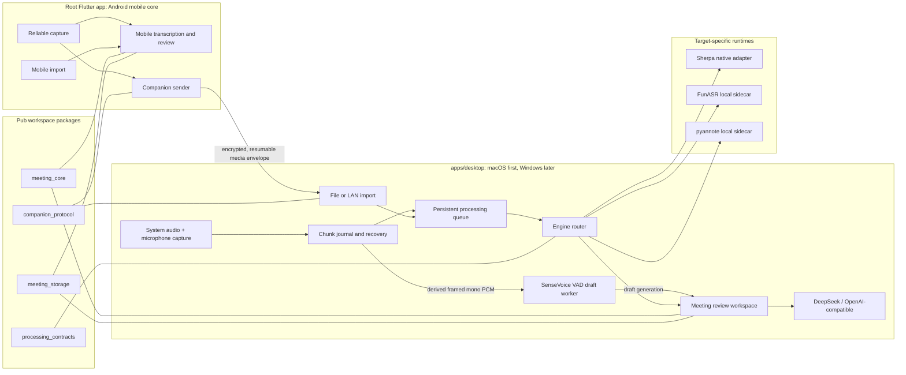
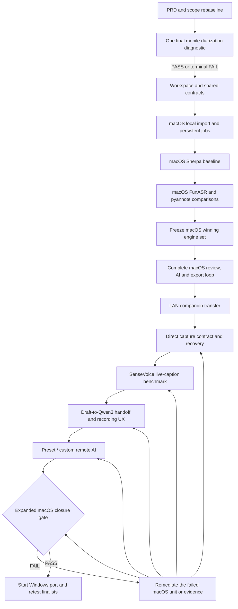
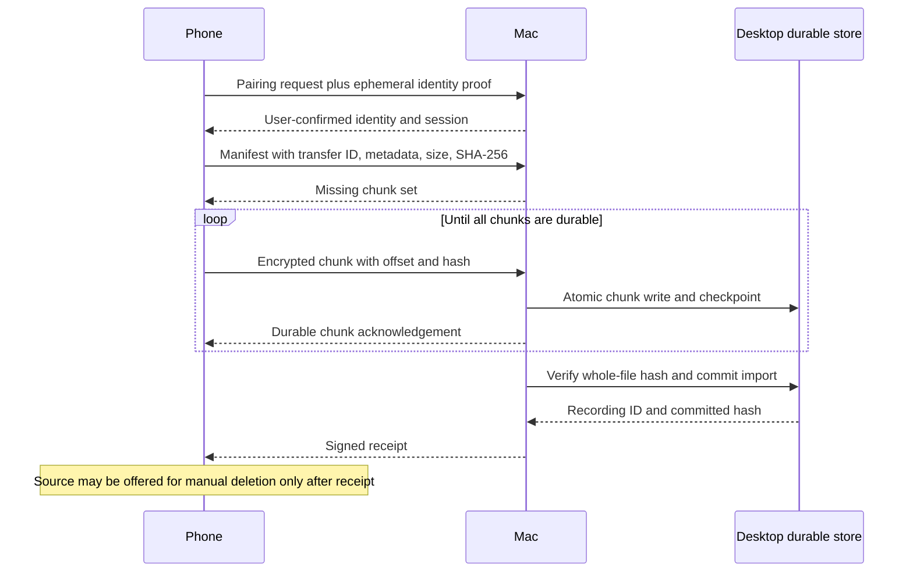
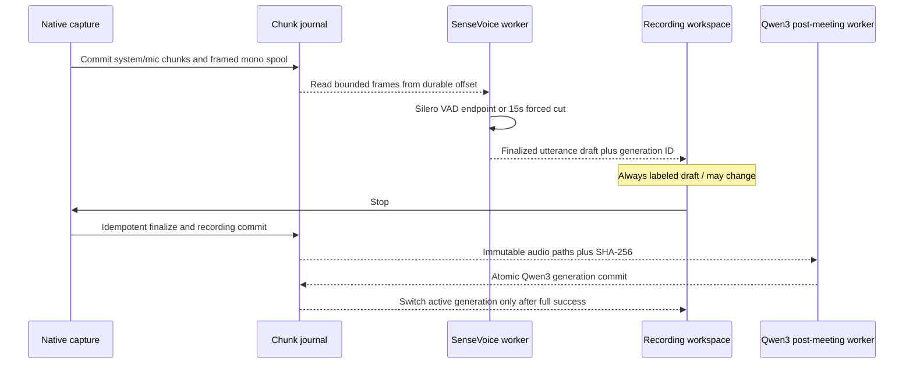

# Desktop-First Meeting Workstation - Plan

## Goal Capsule

把产品从“Android 设备独立承担完整会议处理”重定基线为“桌面端是会议采集、实时草稿、精转写、复核和可选远程 AI 的主工作站，手机保持现状”。第一桌面目标严格限定为 macOS；只有 macOS 的本地导入、电脑会议直接采集、崩溃恢复、SenseVoice 实时草稿、Qwen3 会后精转写、会议复核、预设/自定义远程 AI、导出和局域网接收全部通过后，才开始 Windows。

权威顺序如下：

1. 本计划中已确认的产品与平台决策。
2. `docs/product/meeting-voice-recognition-prd-v1.0.md` 及机器可校验的产品范围契约。
3. 当前代码、测试和设备证据。
4. 官方框架与平台文档。

执行画像：

- 先更新产品真相和范围契约，再改架构和功能代码。
- 保留根目录现有 Android 应用，不先机械迁移到 `apps/mobile/`。
- 在同一仓库增加桌面 app 与共享 packages；不另起 PC 仓库。
- macOS 与 Windows 严格串行，不并行开发。
- 2026-07-28 扩展只增加 PC 端工作；不新增、不迁移、不重做移动端录音、字幕或 AI 体验。
- 桌面录音的原始音频权威与实时字幕解耦；字幕或 AI 失败不得停止、损坏或删除录音。
- SenseVoice 先作为 VAD 分句后的低延迟草稿引擎，不冒充当前 runtime 尚不支持的 token streaming；停止录音后由已冻结的 Qwen3 流程生成正式转写。
- 同一模型在 Android、macOS、Windows 上都必须分别生成证据，任何平台的 PASS 不得自动继承。
- 移动端说话人分离只允许一次最终诊断；无论结果如何，该诊断结束后停止继续试错。
- 移动端与 PC 端当前统一为 `DEVELOPMENT_ONLY`；生产签名、公证、商店提交、正式升级、发布候选设备矩阵和其他生产发布任务全部暂停。
- 日常验证使用 5–30 秒 smoke、2–5 分钟质量包和按需 15–30 分钟稳定性/故障注入；任何数小时测试都不作为当前任务、阻塞项或完成门槛，历史长时证据只引用、不重跑。
- ASR-005 不进入开发任务、日常状态提醒或阻塞列表；兼容历史字段 `USER_PRE_RELEASE_ACCEPTANCE_ONLY` 保留，当前策略为 `RELEASE_SCOPE_PAUSED`。

停止条件：

- 移动端最终诊断失败时，停止端侧说话人路线，不加入模型资产、不创建入口、不继续第三候选。
- macOS 没有任何 ASR 或说话人组合通过固定门禁时，不得用假数据或降级 UI 宣称能力可用；回到独立模型研究计划。
- macOS 包含直接采集、恢复、实时草稿、会后精转写和开放 AI 的完整退出门槛未通过时，不得创建 Windows 产品实现单元。
- 局域网传输未完成鉴权、完整性确认和可恢复语义时，不得删除手机源文件。

尾部责任：

- macOS 产品闭环、基准证据、数据生命周期和局域网交接由本计划收口。
- Windows 在 macOS 关闭后接棒，并对入围组合重新测试。
- 蓝牙直传、自动 USB 导入、多语言 Whisper 路线、跨会议知识库和团队协作均由后续独立计划承接；生产发布及其长时/设备门禁等待新的明确决策，不在当前计划排期。

---

## Product Contract

### Summary

桌面端承接电脑会议的系统音频与麦克风直接采集、崩溃可恢复录音、SenseVoice 低延迟字幕草稿、Qwen3 会后精转写、多说话人处理、批量复核、预设/自定义远程 AI 和导出。手机继续保持现有能力，并可通过本地导入或局域网将录音交给桌面端；本次扩展不修改移动端产品体验。

### Problem Frame

当前仓库是 Android-first Flutter 应用。Android 原生层已承担录音、媒体导入、Sherpa 转写和说话人实验，非 Android 平台则注入 fake 实现。移动设备的算力、内存、热限制和后台生命周期使高级模型能力需要裁剪；现有说话人分离在固定 Xiaomi 设备上虽然 DER 数值可接受，但语义门禁和 projected RTF 均失败。

桌面端能提供更完整的推理资源和工作区体验，但不能假定模型在不同 OS、CPU、运行时或打包方式下表现一致。产品需要一条可审计的迁移路线：先一次性关闭移动端说话人疑问，再建立 macOS 主工作站，最后把已入围的组合移植到 Windows。

### Actors

- A1. 会议采集者：使用手机录音，保留原始音频，决定是否交给桌面处理；本次扩展不改变其流程。
- A2. 桌面会议参与者：在 macOS 或后续 Windows 上直接采集电脑会议、查看实时草稿，并在会后处理、编辑、审核和导出会议。
- A3. 开发验收者：检查目标平台证据、能力状态和隐私边界；生产发布验收当前暂停。

### Requirements

| ID | Requirement |
| --- | --- |
| R1 | PRD 和机器可校验状态必须明确桌面主工作站、手机采集/移动核心、macOS 先行、Windows 后置的产品基线。 |
| R2 | PC 端保留在当前仓库，通过 Pub workspace、独立桌面 app 和共享 packages 演进；不得先搬迁根移动应用或让桌面依赖整个根 app。 |
| R3 | 现有 Android 录音、导入、转写、复核、AI 纪要和导出能力在架构抽取期间保持可回归，不得依赖桌面才能使用。 |
| R4 | 移动端说话人分离只执行一次最终诊断：官方 Sherpa Android demo 等价基线、线程单变量矩阵、TitaNet embedding 单变量比较；结果必须可复现并终止该路线。 |
| R5 | 移动端诊断不等于产品准入；只有通过既有功能与资源门禁时才允许进入后续产品化计划，否则保持不可用且不打包模型。 |
| R6 | 第一桌面目标只包含 macOS；Windows 在 macOS 完整退出门槛前保持 `BLOCKED_BY_MACOS_CLOSURE`。 |
| R7 | macOS 首条闭环必须从本地文件导入开始，覆盖私有复制、哈希去重、持久任务、处理、播放、编辑、搜索和导出；AI 纪要仅在用户已配置 provider 并对本场明确同意时进入闭环。 |
| R8 | 桌面处理框架必须可插拔；第一轮 ASR 比较 Sherpa 与 FunASR，第一轮说话人分离比较 Sherpa 与 pyannote.audio。 |
| R9 | Whisper/faster-whisper/whisper.cpp 不进入第一轮；只有多语言需求成为明确产品要求时再独立准入。 |
| R10 | 模型证据按目标平台隔离；Android、macOS、Windows 分别记录 OS、CPU、内存、runtime/model hash、线程、fixture hash、质量、性能和资源结果。 |
| R11 | macOS 只能根据 macOS 固定 fixture 和目标机器证据选择获胜组合；Windows 只重测 macOS 冻结的 finalist，不继承 macOS PASS，也不重开已淘汰候选。若所有 finalist 在 Windows 失败，写入终局 `WINDOWS_NO_ADMISSIBLE_FINALIST`，新的 Windows 模型搜索必须另立计划。 |
| R12 | 桌面模型、Python 环境和原生运行库必须由版本化 manifest、SHA-256、许可和缓存管理，不得把全部候选加入根 Flutter assets 或提交进 Git。 |
| R13 | 局域网传输排在 macOS 本地闭环之后，必须包含用户可见配对、双向身份确认、加密、分块续传、幂等、哈希确认和取消/重试。 |
| R14 | 手机源音频在桌面完整接收且持久化确认之前不得自动删除；失败、断网和重复提交不得造成数据丢失或重复会议。 |
| R15 | 现有 paired-PC provider v1 继续只表示“转写片段到结构化纪要”；原始音频传输和桌面 ASR 使用新的 capability/schema，不兼容地修改 v1 是禁止的。 |
| R16 | 桌面和手机各自拥有独立 SQLite 数据库；设备间交换版本化媒体/任务/结果清单，不共享或复制正在使用的数据库文件。 |
| R17 | UI 只展示已验证能力；说话人结果必须支持匿名标签、overlap/unknown 和人工修正，不在本计划存储 voiceprint 或自动识别真实身份。 |
| R18 | ASR-005 不得被开发计划、自动状态报告或日常提醒重复提出；兼容历史字段 `USER_PRE_RELEASE_ACCEPTANCE_ONLY` 保留，当前策略为 `RELEASE_SCOPE_PAUSED`。 |
| R19 | macOS 必须支持用户明确开始的电脑会议直接采集：系统输出音频与所选麦克风分别保存为原始权威轨道，不录制屏幕画面，不把不可逆混音作为唯一源文件。 |
| R20 | 开始录音前必须检查系统音频/麦克风权限、设备、磁盘和实时字幕模型；录音中持续显示时长、双轨电平、轨道健康、暂停/继续/停止与可恢复状态。 |
| R21 | 录音必须使用独立可校验的有界分块和持久 journal；进程崩溃、强制退出或最终化中断后可恢复有效分块，且重复恢复/停止保持幂等。 |
| R22 | 单轨设备断开、权限撤销或编码失败时不得静默降级：保留仍健康的轨道，记录 gap 与 `partial_capture`，向用户显示原因；字幕失败不得影响录音。 |
| R23 | 实时字幕第一版使用已测试的 SenseVoice int8 模型、CPU 2 线程和单 worker 基线，通过 Silero VAD 端点输出句级近实时草稿；不得把离线 recognizer 表述为真正 token streaming。 |
| R24 | 实时草稿与会后正式转写使用独立 generation/source。草稿始终标为“可能变化”，不得覆盖人工修订；停止录音并安全提交音频后，Qwen3 才生成正式转写并在原子成功后成为 active generation。 |
| R25 | SenseVoice 或 Qwen3 失败都不得删除原始录音。SenseVoice 失败时继续录音并允许会后处理；Qwen3 失败时保留草稿、明确标注并提供重试。 |
| R26 | 实时字幕必须通过独立于 15 秒离线 ASR 基准的 macOS 开发门禁，至少覆盖端点到可见延迟、长语句强制切分、VAD 误切/漏切、中英及 code-switch、噪声/远场/重叠、CPU/RSS、UI 流畅性和不超过 30 分钟的有界稳定性。 |
| R27 | 桌面 AI 必须通过 provider registry 支持现有 DeepSeek 预设与自定义 OpenAI-compatible provider；当前产品不要求或验收本地生成式大模型，所有远程 endpoint 每场会议明确同意且禁止自动回退。 |
| R28 | AI key 进入系统安全存储；自定义产品 endpoint 只能使用远程 HTTPS、不得含 userinfo、禁用不受控重定向并限制响应；所有 provider 输出都必须通过结构化 schema 与证据引用校验。 |
| R29 | 2026-07-28 扩展不新增移动端功能或 UI；移动端只保留既有回归门禁，PC 端契约不得要求移动端同步实现实时字幕、录音恢复或开放 AI。 |
| R30 | Windows 只在扩展后的 macOS closure 通过后移植同一 capture/caption/provider contract，并在 Windows 本机重新验证，不继承 macOS 证据。 |
| R31 | 移动端和 PC 端当前均为 `DEVELOPMENT_ONLY`；不得创建或排期生产签名、公证、商店提交、正式升级、发布候选包/设备矩阵等生产发布任务。 |
| R32 | 当前单次开发测试上限为 30 分钟；历史一小时/两小时证据可引用但不得要求重跑，恢复更长门禁必须有新的明确决策。 |
| R33 | Qwen3-ASR 与 SenseVoice 优化必须使用固定 target、fixture、scorer、runtime hash 和单变量 A/B；质量、速度、内存及冷/热启动数据可复验，不能用主观听感替代。 |

### Key Flows

- F1. 移动端最终诊断
  - **Trigger:** 开始执行本计划。
  - **Actors:** A3
  - **Steps:** 复现官方 demo 等价配置；保持 fixture、segmentation 和 clustering 不变，单变量比较线程；再单变量替换为 TitaNet embedding；生成可审计证据和最终 disposition。
  - **Outcome:** 得到一次性 PASS 或永久停止的结论，不产生未受控候选扩散。
  - **Covered by:** R4, R5, R10

- F2. macOS 本地会议处理
  - **Trigger:** A2 选择本地音频或视频文件。
  - **Actors:** A2
  - **Steps:** 复制到 app 管理目录、探测和哈希、创建幂等任务、运行选定 ASR/说话人引擎、持久化派生结果、进入会议复核工作区并导出；仅在用户已配置 provider 且对本场明确同意时生成 AI 纪要。
  - **Outcome:** 不依赖手机或网络完成一场会议的完整处理闭环。
  - **Covered by:** R6-R12, R16, R17

- F3. 手机到 macOS 的局域网交接
  - **Trigger:** A1 在手机选择“发送到已配对桌面”。
  - **Actors:** A1, A2
  - **Steps:** 发现或选择桌面、显示并确认双方身份、建立加密会话、发送版本化清单与分块音频、断点续传、桌面校验哈希并持久化、返回 receipt。
  - **Outcome:** 桌面获得与本地导入等价的不可变媒体资产，手机保留源文件直至确认。
  - **Covered by:** R13-R16

- F4. macOS 到 Windows 的平台晋级
  - **Trigger:** macOS 完整退出门槛通过。
  - **Actors:** A3
  - **Steps:** 创建 Windows runner/adapter；移植 capture/caption/provider contract；在 Windows 参考机器上重新执行入围引擎的质量、性能、资源、打包和产品流测试。
  - **Outcome:** Windows 独立形成 PASS/FAIL，不修改 macOS 证据。
  - **Covered by:** R6, R10, R11, R30

- F5. macOS 电脑会议直接采集
  - **Trigger:** A2 在录音前检查页选择系统音频、麦克风和是否启用实时字幕，然后明确开始。
  - **Actors:** A2
  - **Steps:** 获取独立权限；分别采集系统输出与麦克风；把有界分块和 journal 写入私有会话目录；持续显示双轨健康、电平和磁盘状态；允许窗口或菜单栏暂停、继续、停止。
  - **Outcome:** 即使字幕关闭或失败，也得到可恢复、可审计、双轨权威的会议录音。
  - **Covered by:** R19-R22

- F6. 崩溃后恢复录音
  - **Trigger:** 应用启动时发现未完成 capture journal。
  - **Actors:** A2
  - **Steps:** 校验已最终化分块、隔离损坏尾块、重建会话时间线和 gap/device events；让用户继续最终化、保留部分录音或明确删除。
  - **Outcome:** 不把损坏会话伪装成成功，不重复提交 recording，不因恢复失败删除有效音频。
  - **Covered by:** R21-R22

- F7. 实时草稿到会后正式转写
  - **Trigger:** A2 开始录音并启用实时字幕。
  - **Actors:** A2
  - **Steps:** 从双轨派生临时单声道 PCM；Silero VAD 形成有界句段；SenseVoice worker 输出句级草稿；安全停止并提交原始音频后，Qwen3 运行正式处理；只有完整成功结果原子切换为 active generation。
  - **Outcome:** 会中快速可读、会后质量优先，两个 generation 可追溯且不覆盖人工修订。
  - **Covered by:** R23-R26

- F8. 预设或自定义远程接口生成会议智能
  - **Trigger:** A2 在会议工作区选择已配置的 AI provider。
  - **Actors:** A2
  - **Steps:** provider registry 解析 DeepSeek 预设或自定义 OpenAI-compatible endpoint；执行 HTTPS/逐场同意/密钥策略；提交结构化请求；校验 schema 与转写证据；保存独立 AI job/result。
  - **Outcome:** 远程调用不静默发生，失败不改变录音与转写权威，也不自动切换 provider。
  - **Covered by:** R27-R28

### Acceptance Examples

- AE1. 本地完整闭环
  - **Given:** macOS 上存在受支持的 10–15 分钟代表性中文会议文件。
  - **When:** 用户导入并选择已准入的处理组合。
  - **Then:** 应创建一个可恢复任务，完成转写和匿名说话人处理，允许播放定位、编辑、搜索和非 AI 导出；已配置并同意 AI 时还允许纪要审核。未配置 AI 不影响本地核心闭环，重启应用后状态仍一致。
  - **Covers:** F2, R7-R12, R16-R17

- AE2. 断网续传
  - **Given:** 手机向已配对 macOS 发送大文件并在中途断网。
  - **When:** 两台设备重新连到局域网并恢复任务。
  - **Then:** 只补传缺失分块，桌面最终哈希与手机清单一致，不创建重复会议，手机源文件未被删除。
  - **Covers:** F3, R13-R16

- AE3. 跨平台证据隔离
  - **Given:** 某组合已在 macOS 通过。
  - **When:** Windows 还没有对应基准证据，或 Windows 资源门禁失败。
  - **Then:** Windows 能力仍保持 blocked/failed；macOS 能力状态不受影响。
  - **Covers:** F4, R10-R11

- AE4. 移动诊断失败
  - **Given:** 官方等价基线、线程矩阵和 TitaNet embedding 均未同时通过语义与性能门禁。
  - **When:** 最终诊断写入 disposition。
  - **Then:** 不运行新的第三模型、不加入资产、不创建 UI，移动核心继续使用现有无自动说话人的可靠流程。
  - **Covers:** F1, R3-R5

- AE5. 桌面不可用
  - **Given:** 用户没有已配对桌面或桌面离线。
  - **When:** 用户完成手机录音。
  - **Then:** 手机仍可使用现有本地转写、复核和导出；不得因桌面路线回退现有功能。
  - **Covers:** R3, R13

- AE6. 正常电脑会议录音
  - **Given:** macOS 系统音频与麦克风权限已授权，磁盘和设备健康。
  - **When:** 用户开始、暂停、继续并停止一场电脑会议。
  - **Then:** 系统音频与麦克风分别保存为可校验原始轨道；暂停不制造虚假时间；停止幂等；派生混音可重建；会议库只在 durable commit 后显示完成。
  - **Covers:** F5, R19-R22

- AE7. 崩溃与单轨故障恢复
  - **Given:** 录音中应用被强制终止，或麦克风在中途断开。
  - **When:** 用户重新打开应用并处理恢复提示。
  - **Then:** 有效分块被保留，损坏尾部被隔离，系统轨继续录制或恢复为 `partial_capture`，gap/device event 可见，不产生重复会议或 false success。
  - **Covers:** F5-F6, R21-R22

- AE8. SenseVoice 草稿与 Qwen3 正式转写
  - **Given:** 用户启用实时字幕，SenseVoice 模型已安装。
  - **When:** 用户说完一句话并最终停止录音。
  - **Then:** VAD 端点后出现标为草稿的句级文本；停止后先提交音频再运行 Qwen3；Qwen3 完整成功才切换正式 generation，草稿和人工修订仍可追溯。
  - **Covers:** F7, R23-R26

- AE9. 字幕或精转写失败
  - **Given:** SenseVoice worker 崩溃，或会后 Qwen3 任务失败。
  - **When:** 录音仍在进行或用户回到会议工作区。
  - **Then:** 原始双轨录音不受影响；SenseVoice 可重启或关闭；Qwen3 可重试；若仅有草稿，UI 持续明确显示“草稿/可能变化”。
  - **Covers:** F7, R22-R25

- AE10. 预设与自定义远程开放接口
  - **Given:** 用户选择 DeepSeek 预设或配置远程 OpenAI-compatible endpoint。
  - **When:** 用户生成会议纪要。
  - **Then:** provider 在本场明确同意前零网络；任何 provider 失败都不自动切换到另一个 provider，HTTP、userinfo、重定向或非法 schema 响应被拒绝。
  - **Covers:** F8, R27-R28

### Success Criteria

- 产品文档和机器契约不再把桌面描述为模糊的“以后再做”，而是显示清晰的 macOS → Windows 门禁链。
- 移动端说话人最终诊断只有一个终局 disposition，且不会继续产生开放候选。
- macOS 能从本地文件完成端到端会议闭环，长任务可取消、重试、恢复，应用重启不丢状态。
- macOS 能从系统输出和麦克风直接录制会议；强制退出、设备断开、磁盘不足和重复停止都不会丢失已提交分块或生成 false success。
- SenseVoice 实时草稿在参考目标上达到语音端点到可见 P50 不高于 1 秒、P95 不高于 2 秒；连续语音最多 15 秒强制切分；15–30 分钟有界稳定性运行无录音丢帧、无 caption backlog 持续超过 10 秒。
- Qwen3 正式转写与实时草稿保持独立 generation，只有完整成功才成为 active；字幕或精转写失败时原始录音仍可复核和重试。
- DeepSeek 预设和自定义 OpenAI-compatible provider 遵守同一结构化输出与证据 contract，不发生未同意远程请求或自动 provider 回退；本轮不要求本地生成式大模型。
- macOS 的 ASR 和 diarization 选择都有目标机器、固定 fixture 和可复验 manifest。
- 参考机器上的 10–15 分钟代表性会议满足 RTF、资源和可恢复性门禁；代表性会议中需要人工改正的 speaker turns 不超过 10%，并以 1–2 场有界开发走查验证复核/导出流程可理解。历史长会议和五场 dogfood 证据只引用、不重跑。
- 局域网传输在断网、重复请求、取消、磁盘不足和哈希不一致场景下不丢源文件、不产生静默损坏。
- Windows 只有在 macOS closure 后开始，且拥有独立证据。

### Scope Boundaries

本计划范围内：

- PRD、产品状态和验证契约重定基线。
- 一次移动端 Sherpa 说话人最终诊断。
- 同仓 Pub workspace、共享领域/存储/处理/伴侣协议 packages。
- macOS desktop app、本地导入、模型基准与完整会议工作区。
- macOS 系统输出 + 麦克风直接采集、分轨权威存储、崩溃恢复、菜单栏控制和完整桌面录音交互。
- SenseVoice + Silero VAD 句级实时草稿，以及停止后的 Qwen3 正式转写切换。
- DeepSeek 预设与自定义远程 OpenAI-compatible provider。
- Sherpa/FunASR ASR 比较，Sherpa/pyannote diarization 比较。
- macOS 本地闭环之后的手机到桌面局域网传输。
- macOS 完成后的 Windows 移植和入围模型重测。

明确延期：

- 蓝牙音频传输。
- 自动 USB 设备发现和导入；第一版仍可由用户把 USB 暴露的文件通过桌面文件选择器导入。
- Whisper/faster-whisper/whisper.cpp 和多语言模型矩阵。
- 会中阶段性 AI 摘要；本计划只实现实时字幕草稿，不在录音中持续调用 LLM。
- 自动识别 Zoom/Teams/浏览器会议并自动开始录音、日历触发和机器人入会。
- 自定义会议模板编辑器；第一版复用既有模板目录。
- 录制屏幕画面或摄像头视频。
- 跨会议知识库、团队协作、日历/任务集成。
- 生产签名、公证、自动更新、商店提交、发布候选设备矩阵和商业发布流水线；这些工作当前暂停，不在完成条件内。

移动边界：

- 2026-07-28 新增的 U11-U16 不修改根移动 app、Android 原生录音、移动导航或移动 AI provider。
- U1-U8 中既有移动诊断、回归和 LAN 交接作为历史/共享基线保留；它们不构成“移动端借鉴 Meetily”的新增范围。

不属于产品身份：

- 默认上传会议到云端。
- 手机必须连接桌面才能录音或查看记录。
- 在没有用户明确建档与额外隐私设计时自动识别真实人物身份或持久化 voiceprint。
- 用假结果、静态 fixture 或存在于资产中的模型声明生产能力可用。

### Dependencies

- macOS 开发机及 Xcode/Flutter desktop toolchain。
- 后续 Windows 参考机器及 Visual Studio C++ desktop toolchain。
- 版本固定的 Sherpa native runtime、FunASR Python/PyTorch runtime、pyannote.audio/Community-1 模型。
- 能覆盖中文会议、噪声、重叠、静音和长时长的固定 benchmark corpus。
- `flutter-components` 的 Goo 设计和 Flutter API；UI 实现前必须阅读其 `DESIGN.md` 和 `DOC.md`。

---

## Planning Contract

### Key Technical Decisions

- KTD1. 保留单仓库，但不是单 package。根 Flutter app 继续代表现有移动端；新增 `apps/desktop/` 和 `packages/*`，使用 Dart 3.11 Pub workspace 的单一解析。这样减少重复代码和跨仓协议漂移，同时避免先搬动当前大量未提交的移动/S3 代码。U4 在桌面 pubspec 创建后，必须用真实 desktop storage、file picker、playback、secure storage 和 native runtime 依赖做 workspace falsification；如果只能靠不受支持的 override 才能让任一平台解析/构建，本计划停止后续共享抽取并重新评估仓库边界。

- KTD2. 不先把根 app 迁到 `apps/mobile/`。共享代码只在真实消费者出现时抽取：U3 先抽领域契约、数据库 factory、导入 commit 和处理端口，伴侣协议到 U8 与双端消费者一起创建；移动 UI 与 Android composition 保持原位。

- KTD3. 平台实现从页面和服务内部上移到 composition root。当前非 Android 会得到 `FakeTranscriptionService`，导入服务直接绑定 Android `MethodChannel`，启动恢复服务也知道 Android 实现。桌面化先建立 platform composition，再让 UI 只依赖端口。

- KTD4. 数据库 schema 只有一个来源。把 `AppDatabase` 改为可注入 database factory/path，在 Android 使用 sqflite，在桌面使用 `sqflite_common_ffi`；不得复制另一套桌面 schema 或跨设备共享 live SQLite 文件。U3 只抽取 schema、factory、稳定实体和首条导入链路所需 repository，根 app 保留过渡 re-export；其他 repository 在真实桌面消费者出现时逐个迁移。

- KTD5. 桌面引擎遵循统一的 `ProcessingEnginePort`，但允许不同部署形态。Sherpa 优先通过稳定 C API/native adapter 进程内运行；FunASR 和 pyannote 作为版本固定的本地 sidecar 候选，通过 JSONL/stdin-stdout 的版本化控制协议通信，音频以受控 job workspace 内的不可变文件路径和 SHA-256 传递。sidecar 不监听局域网端口，并在经过清理的最小环境中启动：不继承密钥，文件访问限于 job/runtime/model roots，处理期间禁止外连，限制 CPU/内存/输出，取消或父进程退出时终止全部子进程。

- KTD6. 模型准入与产品集成分离。候选先在 `benchmark/desktop/` 运行并生成证据；只有获胜组合才进入 runtime manifest 和产品设置。仓库内经审查的 runtime manifest 是信任根，固定 HTTPS 来源、不可变 revision、每个 wheel/native/model 工件 hash、SBOM 和许可 disposition；安装先进入临时目录，完整校验后原子提升。所有候选模型、Python 环境和 native binaries 位于 Git 忽略的内容寻址缓存，不进入根移动 assets。

- KTD7. macOS 第一轮只比较 Sherpa 与 FunASR 的中文 ASR，以及 Sherpa 与 pyannote.audio 的匿名 diarization。Sherpa 提供最一致的跨端部署基线；FunASR 提供中文 ASR/VAD/标点/说话人生态对照；pyannote 提供桌面 Python/PyTorch diarization 对照。Whisper 延后，防止在尚无明确多语言目标时扩大模型矩阵。

- KTD8. 跨平台模型状态是二维矩阵，而不是一个全局布尔值：`candidate × target fingerprint`。fingerprint 至少包含 OS/version/build、architecture、CPU、逻辑核心数、RAM、runtime hash/version、model hash、线程和 build mode。fixture 可复用，结论不可继承。2026-07-28 起，U11-U18 与扩展后的 macOS closure 使用当前开发参考目标：Mac mini `Mac16,10`、Apple Silicon arm64、Apple M4（10 核）、16 GiB RAM、macOS 15.7.5（24G624）。U4-U9 已生成的 Apple M2 证据保留为历史基线，但不得替代当前 M4 的 target-specific evidence；Intel、8 GiB 和其他未测目标保持 blocked。

- KTD9. 移动端最终诊断采用两个隔离 arm。官方 parity arm 直接对完整 fixture 调用 Sherpa `process`，不经过当前 30 秒窗口、5 秒重叠、额外 embedding 或会议级 reconciliation；线程矩阵和 TitaNet 只在该 arm 内逐个改变。当前产品链路 arm 保持已冻结配置，作为集成差异对照而不继续调参。TitaNet 不是完整 diarization 框架，不得与分割模型调整混成一个候选。

- KTD10. 局域网交接复用桌面本地导入的后半段。协议只负责配对、传输和 receipt；桌面收到并校验的媒体进入与文件选择完全相同的 import commit 和 processing queue，不维护第二套业务流程。

- KTD11. paired-PC meeting intelligence provider v1 不承载原始音频。新增 `companion-media-transfer/v1` 和处理 capability 协商；v1 继续冻结，避免已验证的“片段 → 纪要”契约被不兼容扩展。

- KTD12. 传输以桌面作为接收 server，使用 DNS-SD/mDNS 发现、用户确认的短码/二维码和双方公钥指纹建立信任，再使用加密会话传输。发现不是信任；IP 地址不是身份；receipt 只在 durable write 与全文件哈希通过后签发。配对必须绑定双方 transcript 和用户在场确认，短码有过期时间和尝试上限，长期 peer key 可查看/撤销，设备 key 改变必须重新配对，unpair 删除凭据和未完成 checkpoint。

- KTD13. 原件和派生数据分别拥有明确权威。手机是源录音权威，直到桌面 receipt；桌面是其本地处理结果的权威。第一版不自动回写完整派生数据库，只允许后续通过版本化结果 envelope 导入，避免双向实时同步冲突。桌面 v1 的静态数据威胁模型依赖 OS 账户隔离和 FileVault/BitLocker，不做应用层整库/音频加密；API/配对密钥仍必须进入系统安全存储，未启用磁盘加密时产品应提示风险而不是宣称应用级加密。

- KTD14. macOS closure 是 Windows 的显式依赖，不只是排期偏好。Windows 单元只移植已冻结的 app contract、伴侣协议和 finalist；Windows 上仍需重新验证 runtime、资源、安装包和产品流。全部 finalist 失败时停止为 `WINDOWS_NO_ADMISSIBLE_FINALIST`，不在 U10 内重开模型搜索。

- KTD15. 说话人功能只做匿名分离和人工修正，不把 speaker identification/voiceprint 纳入本计划。Sherpa 官方虽支持 speaker identification，但它与会议 diarization 的产品目标、隐私与建档流程不同。

- KTD16. 两个 app 共享领域、存储和平台无关 workflow，不预先共享桌面 UI。新增 `meeting_workflows` 承载 import commit、队列、搜索、导出和 meeting intelligence orchestration；移动端通过过渡 re-export 迁移，桌面使用自己的 Goo 布局。只有经过两个 app 验证确实相同的 widget 才后续抽到共享 Flutter package。

- KTD17. 获胜 Python sidecar 采用受管、内容寻址的 hermetic runtime，而不是依赖开发机全局 Python。runtime manager 负责首次安装、许可接受、断点恢复、hash 校验、原子升级/回滚、损坏修复、空间预检和卸载；一次成功 provisioning 后，完整处理必须能在断网状态运行。

- KTD18. 首版不向普通用户暴露 engine picker。每个 target 自动使用 machine decision 冻结的 ASR + diarization 组合；只有后续同时存在两个完整准入组合并另立产品决策时，才增加高级切换。

- KTD19. macOS 系统音频优先使用 Core Audio process tap，麦克风使用 `AVAudioEngine.inputNode`；不借用屏幕录制来伪装音频采集。第一版由用户明确开始并采集全部系统输出（排除本应用输出以避免回授），不做会议应用自动识别。系统音频和麦克风权限分别预检、解释和恢复。

- KTD20. 系统音频轨与麦克风轨是不可变原始权威；实时字幕和会后 ASR 使用可删除、可重建的标准化单声道派生流。不得只保存预混音。单轨失败时继续保存健康轨，并用带单调时间的 gap/device event 标记 `partial_capture`，不静默补零或伪造连续性。

- KTD21. capture 使用持久状态机和 write-ahead journal：`idle → preflight → preparing → recording ↔ paused → finalizing → completed`，异常进入 `recoverable`、`partial_capture` 或 `failed`。音频写成独立最终化、带 hash/时间范围的有界分块；U11 spike 用真实强退、20–30 分钟有界写入和恢复时间验证具体容器与分块时长后冻结。恢复与 finalize 必须幂等，meeting recording 只在原子 commit 后出现。

- KTD22. 当前 Sherpa/SenseVoice lane 是 offline recognizer，不提供真实 token partial。实时字幕采用官方支持的“microphone + VAD simulated streaming”思路：Silero VAD 端点或 15 秒最大句长触发离线 SenseVoice 识别，只发布完成句段。基线固定现有证据中的 `sherpa-onnx-sense-voice-zh-en-ja-ko-yue-int8-2024-07-17`、CPU、2 threads、concurrency 1、`greedy_search`、language `auto`；现有 `ITN=false` 是 control，官方推荐的 `ITN=true` 仅作为单变量可读性实验，必须由 U18 证据决定。

- KTD23. 实时草稿、会后 Qwen3 和人工修订是三种不同权威。草稿写入独立 `transcript_generation`，source 为 `sensevoice_live_draft`，永不直接成为正式 active transcript；停止录音并提交双轨后，复用冻结的 Qwen3 15 秒处理配置生成 `qwen3_post_meeting`。只有完整、schema-valid、原子提交的 Qwen3 generation 才切换 active；人工 revision 始终保留并需要显式 reconcile。

- KTD24. 实时 caption worker 是独立受管进程，不能位于 Flutter UI isolate。native capture 额外写入私有会话目录中的有界 framed mono PCM spool；worker 只读该 spool、维护消费 offset、运行 VAD/SenseVoice，并通过有界结构化事件报告状态/草稿。Flutter bridge 不搬运连续原始 PCM。caption 队列过载时停止生成新草稿并明确降级，不阻塞或反压原始录音。

- KTD25. AI orchestration 依赖 provider registry，不在页面里实现 provider 特例。保留现有 DeepSeek 预设并新增通用 OpenAI-compatible provider；当前产品设置不暴露 Ollama 或其他本地生成式大模型。自定义 endpoint 必须为远程 HTTPS 并逐场同意；密钥进入 Keychain/Credential Manager，禁止 provider 间自动回退，所有结果统一做 schema、大小、超时和 evidence 校验。

- KTD26. 录音 UI 只使用 `package:flutter_components/flutter_components.dart` 中实际存在且 analyzer 通过的 Goo 组件/令牌。会议库同时提供“开始会议”和“导入”；录音前检查、录音工作区、菜单栏控制、恢复提示、草稿状态、错误/部分成功都必须有键盘、屏幕阅读器和 200% 文本缩放路径。新增 PC 工作不修改移动 UI。

- KTD27. 当前开发验证分三级：L0 为 5–30 秒 smoke，L1 为 2–5 分钟固定质量包，L2 为按需 15–30 分钟稳定性或故障注入。任何单次测试不得超过 30 分钟；历史一小时/两小时与五场 dogfood 只作为回归基线引用。生产签名、公证、商店、正式升级与发布候选设备矩阵不在当前执行图中。

- KTD28. 模型优化采用固定 control、单变量筛选和小规模 finalist 复验。Qwen3 优先验证 ORT runtime bisection、动态 hotwords、VAD/最大句长和 `maxNewTokens`；SenseVoice 优先验证常驻预热、ITN、显式语言、VAD 端点和线程。音频、scorer、target fingerprint、模型/runtime hash 与随机种子固定；不得一次同时更换模型、runtime、VAD 和解码参数。

- KTD29. macOS 最低版本按能力拆分，不再被最高的原生依赖整体抬升。工作站壳和普通资料库的 build target 为 macOS 13.0；Core Audio process tap 在调用录制时要求 14.2；冻结 Sherpa/ONNX 本地转写在安装或运行时要求 15.5。Sherpa/ONNX 只由隔离 worker 动态加载，主进程启动依赖不得链接它们。低版本提示必须发生在用户调用对应能力时；Mach-O/build contract 不替代 macOS 13.x/14.x 实机 smoke。

### High-Level Technical Design

下图是边界草图，不规定具体类名或序列化实现；Implementation Units 中的文件和测试契约才是执行边界。

平台晋级状态：

媒体传输确认语义：

实时草稿与正式转写权威：

### Model Optimization Experiment Contract

历史证据给出的起点与排除项：

- Qwen3 0.6B int8 当前 control 为 CPU 2 threads、concurrency 1、固定 15 秒、
  `maxNewTokens=512`。held-out 中文 CER 11.22%、英文 WER 25.14%，英文远场/
  噪声 WER 71.14%；fixed-15 RTF 约为中文 0.2257、英文 0.2416。
- 同一 M4/Sherpa 源码下 ORT 1.27 相对 1.24.4 慢约 2.061 倍；1.24.4 native
  control RTF 0.1242，而当前 Dart 路线约 0.2514。它是当前最高优先级的已知
  加速方向，但必须重新验证质量、内存、取消和清理。
- Silero 与 fixed-15 同 worker 的耗时比为 1.0025，结果转换仅占
  0.000701%；继续优化分段开销或 FFI/JSON 不是速度优先项。4/6/8 线程的
  RTF 为 0.1672/0.1886/0.1679，且占用约 3.2–3.4 GiB，不能假设加线程更快。
- 官方参数与当前固定资源在 11 组短干净音频上输出 hash、CER/WER 全相同；
  只调整通用默认值而不针对真实失败样本，预期收益低。
- SenseVoice 2024 int8 control 为 CPU 2 threads、concurrency 1、fixed-15、
  language `auto`、ITN `false`。5 分钟中文 CER 9.89%/RTF 0.0582，英文
  WER 14.57%/RTF 0.0576；held-out 英文 WER 32.86%，说明短干净样本不能替代
  远场、code-switch 与会议域验证。
- Android GTCRN 成对实验在安静场景 CER 回退 0.8876 个百分点，噪声均值仅
  改善 0.2301 个百分点，且 RTF 0.3273、内存增加约 349 MB；PC 优先保留
  system/mic 分轨和 AEC-oriented 处理，不把通用降噪作为默认前置步骤。

共同实验规则：

1. 固定 Apple 参考目标、音频/参考文本 hash、scorer、模型、runtime、线程和
   随机种子；筛选阶段每个 arm 预热 1 次、计时 3 次，只有 finalist 再做
   5 次复验，所有输入遵守 KTD27 的 30 分钟上限。
2. 质量包至少分中文、英文、中英混说、专有名词/数字、远场/键盘噪声、
   system+mic double-talk；热词实验另设 target-term 与 non-target held-out。
3. Qwen3 记录 CER/WER、目标词召回、截断/幻觉、RTF、P50/P95 segment latency、
   cold/warm load、peak/retained RSS；SenseVoice 额外记录 endpoint-to-visible、
   VAD split/miss、backlog 和 ITN 语义保持。
4. 初始晋级阈值：质量 arm 至少改善 0.5 个绝对百分点，或目标词召回相对提升
   10%，同时非目标 CER/WER 回退不超过 0.3 个百分点、RTF 回退不超过 10%；
   速度 arm 至少改善 RTF 15%，同时质量回退不超过 0.3 个百分点。阈值可在
   实验前登记调整，不能看完结果后改门槛。
5. SenseVoice 草稿与 Qwen3 正式文本保持分层权威；两者分歧只触发人工复核，
   第一版不自动拼接或投票融合文本。

### Target-Specific Evidence Contract

每条 benchmark result 都必须包含：

| Dimension | Required evidence |
| --- | --- |
| Target | OS/version、architecture、CPU、RAM、设备标识、build mode |
| Runtime | engine ID/version、native library 或 Python lock hash、execution provider、线程 |
| Model | model ID、来源 revision、artifact SHA-256、bytes、license disposition |
| Input | fixture ID、audio SHA-256、reference SHA-256、语言/噪声/说话人数/时长标签 |
| Quality | ASR 的 CER/WER、时间戳和目标词指标；diarization 的 DER、overlap、unknown/silence honesty |
| Performance | wall time、RTF、peak RSS、CPU/thermal 可用信息、完整输入消费 |
| Reliability | exit code、取消、重试、超时、OOM/crash、输出 schema 校验 |
| Live caption | speech-end-to-visible P50/P95、forced-cut、VAD split/miss、队列 backlog、UI long-frame、不超过 30 分钟的有界稳定性 |
| Capture | 每轨 frame/chunk 数与 hash、gap/device events、丢帧、强退恢复时长、finalize 幂等与磁盘预算 |
| Decision | `PASS`、`FAIL` 或 `LAB_ONLY`，以及失败门禁和证据 hash |

桌面第一轮共同硬门禁：

- 所有固定功能 fixture 被完整消费，输出 schema、时间范围和哈希有效。
- 2–5 分钟固定质量包与按需 15–30 分钟目标 corpus 不崩溃、不 OOM，CPU 路线 RTF 不高于 0.5；历史 120 分钟证据只引用。
- ASR 不得用更快但明显退化的结果获胜；选择 contract 先过滤正确性和资源硬失败，再按固定中文会议加权质量排序。
- Diarization DER 不高于 30%，显式表达 overlap/unknown，不得在预注册静音区间伪造 speaker。
- 每个平台单独判定；没有该 target fingerprint 的 evidence 即为未验证。

macOS 参考目标还必须满足产品体验门禁：

- 20–30 分钟系统音频 + 麦克风录制不丢已提交 frame；强制终止后能恢复全部有效分块，损坏尾块不超过一个分块，重复 finalize 不创建第二条 recording。
- 实时字幕 speech-end-to-visible P50 不高于 1 秒、P95 不高于 2 秒；连续语音最多 15 秒强制切分；caption backlog 不得持续超过 10 秒，过载时必须降级字幕而不是反压录音。
- 实时录音 + SenseVoice 15–30 分钟进程不崩溃、不 OOM，桌面 app 总 RSS 不高于 1.5 GiB，固定录音交互脚本长帧率低于 1%。
- U18 必须把 `ITN=false` control 与官方推荐 `ITN=true` 作为单变量对照；只有目标词、数字/日期可读性和整体错误率不回退时才切换默认值。
- 10–15 分钟代表性会议的完整 ASR + diarization 满足 RTF 不高于 0.5。
- 1–2 场有界开发走查的 speaker turn 人工修正率不高于 10%；历史五场证据只引用。
- 3000+ segment fixture 的会议打开 P95 不高于 2 秒、搜索 P95 不高于 200 毫秒、播放定位响应 P95 不高于 200 毫秒，固定交互脚本长帧率低于 1%。
- U7 历史 dogfood 记录只作基线；当前开发走查记录复核与导出总时间、人工纠错负担和失败恢复理解度，U9 必须引用新旧证据并明确区分。

### Desktop Interaction Contract

- 默认首屏是会议库，同时提供明显的“开始会议”和“导入”入口；持续可见的任务区显示 capture/processing/AI/transfer job。
- 开始会议前显示系统音频与麦克风权限、设备选择、双轨测试电平、磁盘余量、SenseVoice 模型状态和“字幕不影响录音”的说明；任一必需录音条件失败时不得开始，字幕条件失败只关闭字幕。
- 录音工作区持续显示单调计时、暂停/继续/停止、系统与麦克风独立电平和健康状态、草稿字幕、自动跟随开关、字幕 backlog/降级与可恢复状态；禁止仅凭动画推断录音成功。
- macOS 菜单栏镜像暂停/继续/停止与返回窗口，所有操作与主窗口共享同一 capture state machine；停止/恢复/丢弃的确认和结果必须幂等。
- 一级导航为会议库、处理中、已配对设备、模型与设置；会议详情进入独立工作区，并能从完成通知回到对应会议。
- processing UI 至少区分 `model_missing`、`installing`、`queued`、`preparing`、`asr`、`diarization`、`partial_success`、`completed`、`canceling`、`canceled`、`retryable_failure`、`terminal_failure` 和 `recovery_unknown`；每态定义进度、主操作、退出应用后的行为和重启落点。
- 第一版自动使用当前 target 的冻结组合，不显示引擎选择控件。
- 会议工作区必须定义最小支持窗口、sidebar/detail 折叠、完整键盘焦点路径、播放/跳转快捷键、任务进度与 speaker/overlap 的屏幕阅读器语义、200% 文本缩放和所有拖拽操作的非拖拽替代。
- LAN 双端流程必须覆盖发现中/空结果/多设备、双方短码和指纹确认、权限拒绝 fallback、设备离线、传输排队/暂停/恢复/校验、receipt、取消/重试和撤销配对。

### Data Lifecycle Contract

| Artifact | Authority and retention | Cleanup trigger |
| --- | --- | --- |
| Import staging | Desktop import job；失败/取消后最多保留 24 小时 | 当次失败清理，启动时重试，24 小时强制清理 |
| Active capture chunks/journal | Desktop capture session；每个已最终化分块是录音权威，直到 meeting commit | 成功 commit 后按 recording 归档；用户明确丢弃或恢复确认后删除 |
| Live caption PCM spool | Desktop capture session 的可重建派生数据；不具备录音权威 | recording commit + caption worker 停止后立即删除；启动时清理无权威关联的过期 spool |
| Live draft generation | Desktop meeting；明确标注 draft，可在正式转写失败时保留 | 用户删除会议，或正式 generation 成功且 retention policy 允许时清理 |
| Sidecar workspace/output | Desktop processing job；成功 commit 后不再需要，失败后最多 24 小时 | commit 后立即删除，启动时清理过期失败目录 |
| LAN chunks/checkpoint | Desktop transfer job；中断后最多 7 天供续传 | receipt/unpair 后立即删除，7 天强制过期 |
| Share/export artifact | 发起分享的 app；最多 24 小时 | share 返回后尽快删除，启动时清理过期文件 |
| Transfer receipt | 双方保留不含音频内容的确认元数据 | meeting 永久删除或 unpair 时删除 |
| Committed meeting/audio | 各设备本地用户；沿用现有用户可配置 recently-deleted policy，默认不自动永久删除 | 用户明确永久删除或其已启用的 retention policy |
| Model/runtime cache | Desktop runtime manager | 用户卸载、显式 prune 或版本替换成功后删除旧版本 |

### System-Wide Impact

- Composition：`lib/app/app.dart`、录音页面、导入服务和 startup reconciler 中的平台判断需要集中，避免桌面意外使用 fake 或 Android 实现。
- Data：`AppDatabase` 需要 factory/path 注入；fresh-create 和 v19+ upgrade 在 sqflite 与 FFI factory 上保持同一 schema 语义。
- Imports：文件选择/原生复制与平台无关的哈希、去重、recording commit、queue enqueue 分离。
- Runtime：移动 Sherpa AAR 与桌面 native/Python runtimes 分开管理；禁止用同名 model ID 掩盖不同工件。
- Product truth：PRD、mobile capability matrix、desktop scope JSON、benchmark manifest 和 UI 状态必须一致。
- Privacy：局域网发现会触及 Android/Apple 本地网络权限与隐私声明；拒绝权限时降级为手动地址/二维码或本地文件导入，不影响录音。
- Security：配对凭据进入系统安全存储；日志不得包含音频内容、密钥、完整路径中的敏感用户数据或可复用 session token。
- Storage：临时分块、失败 sidecar 输出和导出文件必须有清理责任；已提交原音频只能通过用户可见删除流程移除。
- Performance：桌面长任务在后台 isolate/process 执行，UI 只消费有界进度；并发数默认保守且必须有磁盘/内存预算。
- Capture：macOS native plugin 独占系统/麦克风采集、分块、journal 和设备事件；Flutter 只发控制命令并消费有界状态，不能承载连续 PCM。
- Transcript authority：SenseVoice 草稿与 Qwen3 正式 generation 分离；schema migration、搜索和工作区必须显式选择 source/status，不能靠最后写入时间猜权威。
- AI providers：DeepSeek 与 OpenAI-compatible 通过同一 registry 和输出 contract；远程 endpoint 安全、同意、密钥和无回退策略集中实现。
- UI：桌面布局复用 Goo tokens/components 和现有会议复核语义，但不直接复制手机页面尺寸与导航。
- Mobile：新增 capture/caption/provider composition 仅存在于 `apps/desktop` 和共享平台无关 contract；根移动 app 不新增入口或依赖。

### Risks and Mitigations

| Risk | Impact | Mitigation |
| --- | --- | --- |
| 当前工作区大量未提交改动与共享抽取冲突 | 覆盖用户工作或制造巨大 diff | 保留根移动 app；按端口/包小步抽取；每单元先检查工作区并只改计划路径。 |
| Pub workspace 单一解析产生依赖冲突 | 移动或桌面无法解析 | 先做 workspace smoke；集中 dependency overrides；共享包保持最小依赖面。 |
| FunASR/pyannote Python sidecar 打包过重 | 安装体积、启动和维护成本高 | benchmark 与产品准入分离；锁定环境和模型；只有显著质量收益时才产品化 sidecar。 |
| macOS Apple Silicon 与 Intel 差异 | 单机证据不能覆盖所有 Mac | 第一版明确支持目标 architecture；其他 architecture 保持未验证并后续补证据。 |
| Windows native/Python 依赖表现不同 | macOS 通过但 Windows 失败 | Windows 重新构建 runtime、重测 finalist，不复用 PASS。 |
| mDNS 发现被权限、网络隔离或企业 Wi-Fi 阻断 | 手机找不到桌面 | 提供二维码/手动配对 fallback；本地文件导入永远可用。 |
| 局域网中间人或错误设备接收音频 | 敏感会议泄露 | 用户确认短码和公钥指纹、加密会话、配对撤销、receipt 签名、无明文 fallback。 |
| 分块文件或重复任务导致损坏/膨胀 | 数据损坏或磁盘耗尽 | 内容哈希、幂等 transfer ID、配额/磁盘预检、原子 commit、过期临时数据清理。 |
| 自动说话人误导用户 | 错误归属会议结论 | overlap/unknown honesty、人工修正、模型未准入时无入口、不做真实身份识别。 |
| 基准 corpus 过拟合 | 实际会议表现落差 | 按会议类型、噪声、人数和时长分层；保留隐藏/最终复核集；记录所有参数。 |
| Core Audio tap、麦克风权限或设备切换语义不稳定 | 录音开始失败或单轨中断 | U11 先做原生 feasibility spike；权限分开预检；设备事件写 journal；单轨失败进入可见 partial capture。 |
| 大文件单体写入在崩溃时损坏 | 整场会议不可恢复 | 独立最终化有界分块、write-ahead journal、hash、尾块隔离和幂等 finalize。 |
| SenseVoice 被误认为真正 streaming | UI 承诺与 runtime 不符 | 明确 VAD simulated streaming，只发布完成句段；用 speech-end latency 而非 token latency 验收。 |
| 实时字幕占用资源导致录音丢帧 | 最重要的原始数据受损 | caption 独立 worker 和派生 spool；有界队列；过载先停字幕；录音零丢帧是优先硬门禁。 |
| 草稿覆盖正式或人工内容 | 用户修订丢失、权威混乱 | 独立 generation/source、原子 active 切换、人工 revision 显式 reconcile。 |
| 开放 endpoint 泄露会议或密钥 | 敏感数据外发 | 产品设置只接受远程 HTTPS、自定义地址逐场同意、Keychain、禁重定向/自动回退、日志脱敏和响应上限。 |

### Resolved During Planning

- PC 端不另起仓库，采用同仓多 app/package。
- 根移动 app 暂不迁移目录。
- macOS 先完整跑通，Windows 后置且不并行。
- 不同平台上的模型必须重测；只共享 fixture 和 contract，不共享 PASS。
- 移动端再做一次且仅一次 Sherpa 诊断。
- 桌面本地文件导入优先于局域网；蓝牙和自动 USB 延后。
- 桌面第一轮不引入 Whisper。
- speaker identification/voiceprint 不属于本计划。
- PC 端直接采集只录音频，不录屏；macOS 使用 Core Audio process tap + AVAudioEngine 麦克风双轨。
- 实时字幕采用 SenseVoice + Silero VAD 句级 simulated streaming；Qwen3 继续作为会后正式转写。
- SenseVoice 先沿用已测 2024 int8、CPU 2 线程、单 worker；ITN 只做单变量复验。
- 原始双轨优先于字幕；caption/AI 失败绝不阻塞录音或删除音频。
- 第一版增加自定义 OpenAI-compatible provider，并保留 DeepSeek 预设；不要求或验收本地生成式大模型，也不自动回退 provider。
- 2026-07-28 扩展不增加移动端工作。

### Sources

- Repo: `lib/app/app.dart`
- Repo: `lib/features/transcription/service/transcription_port.dart`
- Repo: `lib/features/recording/engine/recorder_port.dart`
- Repo: `lib/features/importing/service/meeting_import_service.dart`
- Repo: `lib/features/meetings/service/meeting_playback_service.dart`
- Repo: `lib/data/sqlite/app_database.dart`
- Repo: `docs/architecture/meeting-intelligence-provider-protocol.md`
- Repo: `benchmark/S3_SPEAKER_DIARIZATION_REVIEW.md`
- Repo: `docs/plans/2026-07-26-001-feat-speaker-diarization-readmission-plan.md`
- Repo: `benchmark/desktop/asr_comparison/M4_ASR_MODEL_DECISION_REPORT.md`
- Repo: `benchmark/desktop/asr_comparison/PC_QWEN3_OPTIMIZATION_BASELINE.md`
- Repo: `benchmark/desktop/asr_comparison/M4_QWEN3_OFFICIAL_RTF_REPRODUCTION_REPORT.md`
- Repo: `benchmark/desktop/asr_comparison/M4_ASR_OFFICIAL_PARAMETER_PARITY_REPORT.md`
- Repo: `benchmark/desktop/asr_comparison/pc_qwen3_optimization_baseline.json`
- Repo: `apps/desktop/tool/asr_benchmark/effective_profile.dart`
- Repo: `apps/desktop/tool/desktop_sherpa_worker.dart`
- Repo: `apps/desktop/lib/features/meeting_intelligence/deepseek_desktop_provider.dart`
- Repo: `apps/desktop/lib/features/settings/desktop_secure_settings.dart`
- Repo: `packages/meeting_storage/lib/src/app_database.dart`
- Official: [Dart Pub workspaces](https://dart.dev/tools/pub/workspaces)
- Official: [Flutter desktop support](https://docs.flutter.dev/platform-integration/desktop)
- Official: [Sherpa platform and API support](https://k2-fsa.github.io/sherpa/intro.html)
- Official: [Sherpa offline speaker diarization C API](https://k2-fsa.github.io/sherpa/onnx/c-api/html/speaker_diarization.html)
- Official: [Sherpa Android diarization APK/model combinations](https://k2-fsa.github.io/sherpa/onnx/speaker-diarization/apk.html)
- Official: [FunASR](https://github.com/modelscope/FunASR)
- Official: [pyannote.audio](https://github.com/pyannote/pyannote-audio)
- Official: [pyannote Community-1 model card](https://huggingface.co/pyannote/speaker-diarization-community-1)
- Official: [Android network service discovery](https://developer.android.com/develop/connectivity/wifi/use-nsd)
- Official: [Android local network permission](https://developer.android.com/privacy-and-security/local-network-permission)
- Official: [Apple Core Audio process taps](https://developer.apple.com/documentation/CoreAudio/capturing-system-audio-with-core-audio-taps)
- Official: [Apple AVAudioEngine input node](https://developer.apple.com/documentation/AVFAudio/AVAudioEngine/inputNode)
- Official: [Sherpa SenseVoice](https://k2-fsa.github.io/sherpa/onnx/sense-voice/index.html)
- Official: [Sherpa SenseVoice pretrained model and VAD examples](https://k2-fsa.github.io/sherpa/onnx/sense-voice/pretrained.html)
- Official: [Sherpa Qwen3-ASR pretrained model and long-audio example](https://k2-fsa.github.io/sherpa/onnx/qwen3-asr/pretrained.html)
- Official: [Sherpa Qwen3-ASR C API hotwords contract](https://k2-fsa.github.io/sherpa/onnx/c-api/html/structsherpa__onnx_1_1cxx_1_1OfflineQwen3ASRModelConfig.html)
- Official: [Qwen3-ASR repository](https://github.com/QwenLM/Qwen3-ASR)
- Official: [Sherpa offline recognizer configuration](https://k2-fsa.github.io/sherpa/onnx/c-api/html/structSherpaOnnxOfflineRecognizerConfig.html)
- Official: [SenseVoice repository](https://github.com/QwenAudio/SenseVoice)

### Sequencing

| Phase | Units | Gate |
| --- | --- | --- |
| A. Rebaseline and close mobile question | U1 → U2 | One terminal mobile disposition; no open candidate loop |
| B. Build shared platform base | U3 → U4 | Android regression green; macOS local import persists |
| C. Benchmark and select macOS engines | U5 → U6 | Frozen macOS finalist set |
| D. Complete existing macOS product | U7 → U8 | Review/import/LAN baseline remains green |
| E. Add desktop-native meeting capture | U11 → U12 | Dual-track recording is crash-safe and recoverable |
| F. Baseline and optimize ASR | U13 → U18; U17 after U7 | SenseVoice and Qwen3 bounded experiments freeze one target-specific profile each |
| G. Add live draft and formal handoff | U14 → U15 | SenseVoice live gates and full recording UX pass |
| H. Add preset/custom remote AI and close macOS | U16 → U9 | Expanded macOS development closure PASS |
| I. Port to Windows | U10 | Windows independent development evidence and parity |

---

## Implementation Units

| U-ID | Title | Primary files | Depends on |
| --- | --- | --- | --- |
| U1 | Rebaseline PRD and product truth | `docs/product/*`, `tool/validate_desktop_workstation_scope.py` | — |
| U2 | Run the final mobile diarization diagnostic | `benchmark/*speaker*`, Android speaker instrumentation | U1 |
| U3 | Introduce workspace and shared contracts | `pubspec.yaml`, core/storage/workflow packages, `lib/app/app.dart` | U2 |
| U4 | Create macOS desktop foundation and local import | `apps/desktop/*`, database/import adapters | U3 |
| U5 | Build target-specific desktop benchmark system | `benchmark/desktop/*`, processing contracts | U4 |
| U6 | Compare and freeze macOS engine set | Sherpa/FunASR/pyannote adapters and evidence | U5 |
| U7 | Complete macOS meeting workstation | Desktop review/AI/export features | U6 |
| U8 | Add secure resumable LAN handoff | companion protocol package, mobile/desktop adapters | U7 |
| U11 | Freeze macOS direct-capture contract | native capture spike, contract and permission evidence | U7 |
| U12 | Implement crash-safe dual-track capture | capture plugin, journal, storage and recovery | U11 |
| U13 | Benchmark and freeze SenseVoice live draft | live-caption benchmark, model manifest and decision | U11 |
| U17 | Optimize Qwen3-ASR on bounded meeting fixtures | ORT/runtime, hotword, VAD and decode experiments | U7 |
| U18 | Optimize SenseVoice live draft on bounded meeting fixtures | preload, ITN/language, VAD and thread experiments | U13 |
| U14 | Integrate live draft and Qwen3 formal handoff | caption worker, generations and orchestration | U12, U17, U18 |
| U15 | Complete desktop recording interaction | recording workspace, menu bar and recovery UX | U12, U14 |
| U16 | Add preset/custom AI provider registry | DeepSeek and OpenAI-compatible providers | U7 |
| U9 | Close macOS quality and operational gates | macOS integration tests, status/evidence docs | U8, U15, U16, U17 |
| U10 | Port finalists and product flow to Windows | Windows runner/adapters/evidence | U9 |

### U1. Rebaseline PRD and product truth

**Goal:** 把已确认的平台策略变成唯一、机器可校验的产品真相，并消除旧的“PC 仅 deferred”叙述。

**Requirements:** R1, R6, R8-R11, R18

**Files:**

- Modify: `docs/product/meeting-voice-recognition-prd-v1.0.md`
- Modify: `docs/product/mobile-capability-matrix.md`
- Modify: `docs/product/s3-productization-status.md`
- Modify: `docs/product/s3-productization-scope.json`
- Create: `docs/product/desktop-workstation-scope.json`
- Create: `docs/product/desktop-workstation-status.md`
- Create: `tool/validate_desktop_workstation_scope.py`
- Create: `tool/test_validate_desktop_workstation_scope.py`
- Modify: `tool/dev_check.sh`

**Approach:**

- 将桌面主工作站定义为新的执行方向，不篡改已经完成的移动/S3 历史证据。
- 给 macOS、Windows、移动最终诊断、模型矩阵和 LAN 分别设置可校验状态。
- 明确 Windows 的依赖状态、第一轮候选集、延期能力和“不继承 PASS”规则。
- 从自动提醒与开发 blocker 中移除 ASR-005；PRD 保留兼容历史字段，并明确当前 `RELEASE_SCOPE_PAUSED`。
- validator 校验 Markdown 与 JSON 的关键决策、路径、allowed status 和依赖关系一致。

**Test Scenarios:**

- PRD 写成 Windows 与 macOS 并行时 validator 失败。
- Windows 标记 PASS 但缺少 macOS closure evidence 时 validator 失败。
- 任一目标复用其他目标的 evidence hash 作为唯一证据时 validator 失败。
- 文档把 ASR-005 放回开发阻塞/提醒列表时 validator 失败。

**Verification:**

- scope 单元测试和 validator 通过。
- `./tool/dev_check.sh` 包含新 truth contract，原有 S2/S3 contract 不回退。

### U2. Run the final mobile diarization diagnostic

**Goal:** 用一次受控实验回答“Sherpa 官方移动路径、线程数和 TitaNet 是否能改变结果”，然后永久收口移动端自动说话人路线。

**Requirements:** R3-R5, R10, R17

**Files:**

- Modify: `benchmark/speaker_diarization_admission_contract.json`
- Modify: `benchmark/speaker_diarization_candidates.json`
- Modify: `benchmark/speaker_diarization_contract.py`
- Modify: `benchmark/evaluate_speaker_diarization.py`
- Modify: `benchmark/run_speaker_diarization_gate.sh`
- Create: `benchmark/speaker_diarization_final_diagnostic_contract.json`
- Create: `benchmark/S3_SPEAKER_DIARIZATION_FINAL_DIAGNOSTIC.md`
- Modify: `android/app/src/main/kotlin/com/voice2text/app/speakers/SherpaSpeakerDiarizationEngine.kt`
- Modify: `android/app/src/androidTest/kotlin/com/voice2text/app/speakers/SpeakerDiarizationProbeSupport.kt`
- Add tests under: `android/app/src/test/kotlin/com/voice2text/app/speakers/`
- Modify: `docs/product/mobile-capability-matrix.md`
- Modify: `docs/product/desktop-workstation-scope.json`

**Approach:**

- 保持 fixture、RTTM、segmentation 和 clustering 不变，但明确拆分两个 arm。
- 官方 parity arm 直接把完整 fixture 交给 Sherpa `process`，不经过现有窗口/reconciliation；先生成官方模型组合/调用方式等价基线。
- 将线程数变为仅 benchmark 可覆盖的参数，生产默认仍为 2；在 parity arm 内逐项测试固定线程矩阵。
- 在 parity arm 内再仅替换 embedding 为官方支持的 TitaNet 工件；固定工件、许可和 hash。
- 当前 30 秒窗口、5 秒重叠和会议级 reconciliation 保持冻结，只作为 product-integration control arm，不继续调参。
- 每个运行记录功能语义、DER、RTF、RSS、thermal、完整输入消费和转写快照。
- 无论 PASS/FAIL 都写入 terminal disposition。FAIL 后不跑第三候选；PASS 也只获得“可进入独立产品化计划”的资格。

**Test Scenarios:**

- 同一次 run 同时修改线程、窗口和阈值时 contract 拒绝证据。
- 标记为 official parity 的 run 经过窗口、额外 embedding 或 reconciliation 时 contract 拒绝证据。
- TitaNet 缺少 segmentation/clustering identity 时不得被标成完整候选。
- 静音区间有 speaker、overlap 未表示或 projected RTF 超门禁时得到 FAIL。
- 所有运行结束后仍存在 `IN_PROGRESS` 或 `NEXT_CANDIDATE` 时 validator 失败。

**Verification:**

- Python contract/evaluator tests 通过。
- 固定 Xiaomi 真机产生原始和汇总 evidence。
- 最终 disposition 与 capability matrix 一致，且产品 assets/UI 未新增说话人候选。

### U3. Introduce workspace and shared contracts

**Goal:** 在不移动根 Android app 的前提下，建立桌面和移动可共同依赖的最小架构边界。

**Requirements:** R2-R3, R8, R12, R16

**Files:**

- Modify: `pubspec.yaml`
- Modify: `pubspec.lock`
- Create: `packages/meeting_core/pubspec.yaml`
- Create: `packages/meeting_core/lib/`
- Create: `packages/meeting_core/test/`
- Create: `packages/meeting_storage/pubspec.yaml`
- Create: `packages/meeting_storage/lib/`
- Create: `packages/meeting_storage/test/`
- Create: `packages/processing_contracts/pubspec.yaml`
- Create: `packages/processing_contracts/lib/`
- Create: `packages/processing_contracts/test/`
- Create: `packages/meeting_workflows/pubspec.yaml`
- Create: `packages/meeting_workflows/lib/`
- Create: `packages/meeting_workflows/test/`
- Modify: `lib/app/app.dart`
- Modify: `lib/data/sqlite/app_database.dart`
- Modify: `lib/features/importing/service/meeting_import_service.dart`
- Create: `lib/features/importing/service/meeting_media_import_port.dart`
- Add/modify tests under: `test/features/importing/`, `test/features/recording/`, `test/features/transcription/`

**Approach:**

- 配置 root package 加已经创建的 `packages/*` workspace members，保留单一 lockfile；`apps/desktop` 到 U4 创建 pubspec 后才加入。
- 只抽取稳定领域值、数据库 schema/factory、首条导入链路所需 repository、平台无关 workflow 和处理 job/result contract；不抽取 Android UI/composition。
- 根 app 对已迁移实体/repository/workflow 保留过渡 re-export，一次只迁移一个真实消费者及其测试，避免产生双类型或双 schema。
- 为数据库注入 factory/path，使同一 schema 在 sqflite 和 FFI 上运行。
- 把原生文件选择/复制从平台无关的 import commit 分开；保留现有去重和事务语义。
- 把所有平台实例创建集中到 composition root，页面和 coordinator 不再直接构造 Android 实现。

**Test Scenarios:**

- 根 Android app 与已创建的共享 workspace package 可以同一解析。
- fresh-create 和 v19 upgrade 在 FFI factory 上得到等价 schema。
- fake import port 返回重复 hash 时不创建第二条 recording/job。
- 非 Android composition 不再静默注入 fake 并显示为生产能力。
- Android 原有导入、转写、AI 和导出测试保持通过。

**Verification:**

- `dart pub workspace list` 显示 root 和共享 packages；desktop membership 在 U4 验证。
- workspace analyze/test 通过。
- `./tool/dev_check.sh` 通过。

### U4. Create macOS desktop foundation and local import

**Goal:** 创建独立桌面 app，在 macOS 完成本地文件选择到持久 processing job 的最小真实链路。

**Requirements:** R6-R7, R12, R16

**Files:**

- Create: `apps/desktop/pubspec.yaml`
- Create: `apps/desktop/lib/main.dart`
- Create: `apps/desktop/lib/app/`
- Create: `apps/desktop/lib/features/importing/`
- Create: `apps/desktop/lib/features/processing/`
- Create: `apps/desktop/lib/features/settings/`
- Create: `apps/desktop/macos/`
- Create: `apps/desktop/test/`
- Create: `packages/meeting_storage/lib/src/desktop_database_factory.dart`
- Create: `packages/processing_contracts/lib/src/model_asset_manifest.dart`
- Create: `docs/architecture/desktop-runtime-boundaries.md`

**Approach:**

- 生成只包含 macOS runner 的 desktop app；暂不创建 Windows runner。
- 创建 `apps/desktop/pubspec.yaml` 后将 desktop 加入 root workspace，并验证单一依赖解析。
- 在继续桌面实现和共享抽取前，引入计划中的真实 storage、file picker、playback、secure storage 和 native runtime 依赖完成单 lockfile falsification；不受支持的 override 或任一平台构建失败触发仓库边界复核。
- 使用 FFI SQLite 和独立桌面 app support 目录。
- 首版只做用户选择文件；先从稳定 file descriptor 读取源大小并完成目标卷空间/配额预检，再复制到受控 staging、边复制边 hash，完成后 fsync、格式探测并原子 rename/commit；失败统一清理 staging。
- 本地和 LAN 导入都由系统生成目标文件名，只接受有界 metadata，拒绝发送方路径，使用 no-follow/open-descriptor 和 canonical containment 防止 traversal、symlink/hard-link、TOCTOU、稀疏文件和覆盖。
- 创建可恢复 processing job，但在本单元使用 fake engine 验证队列和 UI 状态。
- 模型资产 registry 支持版本、平台、architecture、hash、license 和安装状态；候选不进入 Flutter assets。
- UI 实施前阅读 `../flutter-components/DESIGN.md` 与 `../flutter-components/DOC.md`，使用已导出的 Goo 组件。

**Test Scenarios:**

- 支持文件成功复制、哈希、持久化和入队。
- 同一文件重复导入被幂等识别。
- 磁盘不足、取消、无权限、损坏文件不产生半提交 recording。
- 应用在 job 处理中退出后，重启可以恢复或明确失败。
- 未安装真实 engine 时 UI 显示不可用，不生成 fake transcript。

**Verification:**

- desktop analyze/widget/repository tests 通过。
- `dart pub workspace list` 显示 root、desktop 和共享 packages。
- `flutter build macos --debug` 通过。
- macOS 手工 smoke 能导入真实文件并在重启后看到持久任务。

### U5. Build target-specific desktop benchmark system

**Goal:** 建立跨框架但不跨目标继承结论的 benchmark 和证据系统，先跑通 macOS Sherpa 基线。

**Requirements:** R8-R12, R17

**Files:**

- Create: `benchmark/desktop/README.md`
- Create: `benchmark/desktop/desktop_processing_contract.json`
- Create: `benchmark/desktop/desktop_model_candidates.json`
- Create: `benchmark/desktop/run_desktop_benchmark.py`
- Create: `benchmark/desktop/evaluate_desktop_asr.py`
- Create: `benchmark/desktop/evaluate_desktop_diarization.py`
- Create: `benchmark/desktop/validate_desktop_candidates.py`
- Create: `benchmark/desktop/test_*.py`
- Create: `packages/processing_contracts/lib/src/processing_engine_port.dart`
- Create: `packages/processing_contracts/lib/src/processing_evidence.dart`
- Create: `apps/desktop/lib/features/processing/sherpa/`
- Create: `apps/desktop/macos/Runner/Processing/`
- Modify: `apps/desktop/lib/features/importing/`

**Approach:**

- 固定与移动测试可比较但不共享判定的中文会议 corpus。
- 证据 schema 将 target fingerprint 设为必需键，禁止单一 `verified=true`。
- 用 Sherpa C API/native adapter 先验证文件解码、长音频、进度、取消、ASR 和 diarization。
- Sherpa 基线可运行后立即用它完成一个 provisional 纵向切片：真实本地文件 → 转写/匿名说话人 → 会议复核 → 非 AI 导出；U6 可以替换引擎实现，但不得改变共享 job/result contract。
- benchmark 在产品 UI 之外运行；原始证据写入固定目录并由 validator 校验 hash。
- 保留实验缓存目录与 Git 中的 manifest/summary 分离。
- U5 根据参考机器证据冻结 operational envelope：最大源文件 bytes/时长、解码后 bytes、segment 数、排队 job 数、并发 engine 数、临时磁盘倍率和最小剩余空间；U4/U8 preflight 必须执行该 envelope。

**Test Scenarios:**

- 缺 OS/CPU/runtime/model/fixture hash 的证据被拒绝。
- Android evidence 被用于 macOS decision 时 validator 失败。
- engine 输出越界时间戳、未消费完整音频或伪造静音 speaker 时失败。
- 取消/超时后 native handle 和临时文件被释放。
- 10–15 分钟代表性文件满足资源门禁并生成可复验报告；既有两小时证据只引用。
- 超出 source/duration/decoded-size/queue/disk envelope 时在写入前被明确拒绝，不留下 staging。
- provisional 纵向切片可以在断网下完成复核与导出。

**Verification:**

- benchmark evaluator/validator 自测通过。
- macOS Sherpa baseline 产生 ASR 和 diarization 的完整 target-specific evidence。
- 产品 capability 仍由 decision manifest 控制，基准运行本身不开放入口。

### U6. Compare and freeze macOS engine set

**Goal:** 在同一 macOS corpus 和门禁下比较 FunASR ASR 与 pyannote diarization，并冻结第一版获胜组合。

**Requirements:** R8-R12, R17

**Files:**

- Modify: `benchmark/desktop/desktop_model_candidates.json`
- Create: `benchmark/desktop/environments/funasr/`
- Create: `benchmark/desktop/environments/pyannote/`
- Create: `apps/desktop/lib/features/processing/sidecar/`
- Create: `apps/desktop/tool/processing_sidecar/`
- Create: `packages/processing_contracts/lib/src/sidecar_protocol.dart`
- Create: `benchmark/desktop/evidence/macos/`
- Create: `benchmark/desktop/MACOS_ENGINE_SELECTION.md`
- Modify: `docs/product/desktop-workstation-scope.json`

**Approach:**

- 锁定 Python 版本、依赖 lock、模型 revision、ffmpeg/torchcodec 依赖和许可/用户条件。
- 为获胜 sidecar 冻结 hermetic delivery contract；runtime manager 从仓库控制 manifest 安装、校验、恢复、升级/回滚、修复、prune 和卸载，不依赖全局 Python。
- 使用统一 sidecar protocol：握手、capability、job、progress、result、error、cancel、shutdown。
- FunASR 对照必须覆盖中文 Paraformer、VAD、标点/ITN 和时间戳的实际组合；说话人能力不代替 pyannote 对照。
- pyannote Community-1 对照覆盖 CPU 路线；若测试 GPU，仅作为额外 target fingerprint，不替代 CPU 基线。
- 冻结选择 contract：硬失败先淘汰；质量收益必须覆盖打包、启动、内存和维护成本。允许混合获胜，例如 Sherpa ASR + pyannote diarization。

**Test Scenarios:**

- sidecar 版本或 capability 不匹配时 fail closed。
- sidecar 崩溃、输出超限 JSON、路径逃逸或过期结果不污染数据库。
- sidecar 无法读取 job/runtime/model roots 外文件，不继承 AI/配对密钥，处理时无法外连，超出 CPU/内存/输出限制时被终止并留下可重试状态。
- 干净 macOS 参考目标能完成一次 hash-verified provisioning；随后关闭网络仍可完成完整会议处理。
- FunASR/pyannote 未接受模型条件或缺少 license disposition 时保持 `LAB_ONLY`。
- 同一 fixture 下各候选生成可比较质量/资源指标。
- 选择文档与 machine decision 的 winner 和 failed gates 一致。

**Verification:**

- sidecar contract tests 和 benchmark tests 通过。
- Sherpa vs FunASR、Sherpa vs pyannote 的 macOS evidence 完整。
- `MACOS_ENGINE_SELECTION.md` 冻结一个可产品化组合，或显式触发 Goal Capsule 的无候选停止条件。

### U7. Complete macOS meeting workstation

**Goal:** 用冻结引擎完成桌面会议工作站的播放、复核、AI 纪要和导出闭环。

**Requirements:** R6-R8, R12, R16-R17

**Files:**

- Modify/create under: `apps/desktop/lib/features/meetings/`
- Modify/create under: `apps/desktop/lib/features/processing/`
- Modify/create under: `apps/desktop/lib/features/meeting_intelligence/`
- Modify/create under: `apps/desktop/lib/features/settings/`
- Create: `packages/meeting_workflows/lib/src/meeting_workspace/`
- Create: `apps/desktop/lib/features/secrets/`
- Reuse/extract from: `lib/features/meetings/`
- Reuse/extract from: `lib/features/meeting_intelligence/`
- Modify/create tests under: `apps/desktop/test/features/`
- Modify: `docs/product/desktop-workstation-status.md`

**Approach:**

- 复用 `meeting_core`、`meeting_storage` 和 `meeting_workflows`，不让 desktop app import 根移动 package；桌面 UI 单独实现，根 app 通过过渡 re-export 保持兼容。
- 为桌面实现 playback backend，并保持时间轴、编辑、搜索、undo/redo、证据链接和导出 contract。
- 处理 job 和 AI job 独立持久化；ASR/diarization 失败不删除音频，AI 失败不删除转写。
- 只显示 machine decision 中该 macOS target 已准入的 engine。
- 普通用户不选择 engine，任务自动使用 target decision 的冻结组合。
- speaker UI 支持匿名标签、批量重命名/合并、overlap/unknown 和 revision；不显示真实身份识别。
- 桌面默认落点为会议库，持续任务区跨页面可见；一级导航、处理状态、窄窗口折叠、键盘焦点/快捷键、200% 字体和屏幕阅读器语义遵循 Desktop Interaction Contract。
- 新增桌面 AI secret-store port，在 macOS 使用 Keychain、Windows 后续使用 Credential Manager；禁止把 key 写入 SQLite/config/env/diagnostics，支持替换和删除，且不传给 sidecar。

**Test Scenarios:**

- 导入到转写、说话人、播放定位、编辑、搜索、纪要审核和多格式导出端到端通过。
- ASR 成功但 diarization 失败时保留可复核 transcript 并诚实显示无说话人结果。
- 用户修改 speaker 后重新运行模型，不静默覆盖人工 revision。
- 10–15 分钟真实会议与 3000+ synthetic segment 数据保持可操作，滚动和搜索不阻塞。
- DeepSeek 未配置/未同意时零网络，桌面本地处理仍可用。
- processing UI 每个定义状态都有正确文案、进度、可用操作、关闭/重启行为；partial success 保留 transcript。
- 固定 3000+ segment 脚本满足打开、搜索、定位和长帧门禁。
- 1–2 场代表性开发走查记录复核/导出耗时、speaker 修正率和失败恢复理解度；既有五场证据只引用。
- AI key 替换/删除/缺失、日志与诊断 redaction、sidecar 环境隔离通过。

**Verification:**

- desktop unit/widget/integration tests 通过。
- macOS 真实 fixture 完成本地端到端 smoke。
- `flutter build macos --debug` 通过，所有可见能力与 target decision 一致。

### U8. Add secure resumable LAN handoff

**Goal:** 让手机把原始录音可靠交给 macOS，并复用桌面本地导入/处理闭环。

**Requirements:** R13-R16

**Files:**

- Create: `docs/contracts/companion-media-transfer-v1.schema.json`
- Create: `docs/architecture/companion-media-transfer-v1.md`
- Create: `packages/companion_protocol/pubspec.yaml`
- Create: `packages/companion_protocol/lib/`
- Create: `packages/companion_protocol/test/`
- Modify/create under: `packages/companion_protocol/lib/`
- Modify/create under: `packages/companion_protocol/test/`
- Create: `lib/features/companion/`
- Create: `android/app/src/main/kotlin/com/voice2text/app/companion/`
- Create: `apps/desktop/lib/features/companion/`
- Create: `apps/desktop/macos/Runner/Companion/`
- Create: `tool/validate_companion_media_transfer_contract.py`
- Create: `tool/test_validate_companion_media_transfer_contract.py`
- Modify: `tool/dev_check.sh`

**Approach:**

- 新协议与 meeting intelligence provider v1 分离。
- 定义 discovery descriptor、pairing transcript、capability、transfer manifest、chunk、checkpoint、receipt、cancel 和 error。
- 桌面用动态端口注册 DNS-SD 服务；手机支持发现、二维码/短码确认和已配对设备列表。
- 配对凭据进入 Android Keystore/macOS Keychain；会话使用短期密钥，加密且防 replay。
- 配对绑定双方 transcript 和用户在场确认；短码有过期/尝试上限；peer key 可查看、轮换、撤销，设备 key 变化强制重新配对，unpair 清理双方 credential/checkpoint。
- transfer ID 与内容 hash 共同实现幂等；桌面 durable checkpoint 返回缺失 chunk set。
- 完整哈希和 import commit 后才签发 receipt；第一版不自动删除手机源文件，只可向用户提供已确认的手动清理入口。
- 双端 UI 实现 Desktop Interaction Contract 中的配对/传输状态。成功态显示桌面名称、文件 hash/大小、desktop recording ID 和时间；默认保留原件，可延后或显式删除，并能从传输历史重新查看 receipt。
- manifest/chunk 使用严格有界字段；发送方路径永不成为目标路径，whole-file hash 针对最终 committed bytes 重新计算。
- 权限拒绝、企业 Wi-Fi 隔离或发现失败时，保持本地文件导入路径可用。

**Test Scenarios:**

- 错误短码、公钥指纹变化、replay、过期 session 和未配对设备被拒绝。
- brute-force、已撤销 peer、设备 key 变化、恢复旧备份和 unpair 后重连被拒绝。
- 中途断网后只续传缺失 chunks。
- 重复 manifest/receipt 不创建重复 recording。
- chunk hash 或 whole-file hash 不一致时不 commit、不签 receipt。
- 磁盘不足、取消、应用重启后临时状态可清理或恢复，手机源文件保持。
- Android 本地网络权限拒绝时不影响录音和移动核心。
- traversal、symlink/hard-link、TOCTOU、稀疏文件、超限 metadata/chunk/offset/size 和覆盖尝试被拒绝。
- receipt 后默认保留、显式删除、延后清理和历史复核路径通过。

**Verification:**

- schema/contract/security unit tests 通过。
- macOS 与 Android 真机在同一 LAN 完成大文件、断网续传和重复发送 smoke。
- 网络抓包看不到明文会议内容或可复用凭据。
- receipt 证据与桌面 recording hash 一致。

### U11. Freeze macOS direct-capture contract

**Goal:** 在写完整产品代码前，用最小原生 spike 冻结 macOS 系统音频、麦克风、权限、双轨和恢复分块的可行契约。

**Requirements:** R19-R22, R29

**Dependencies:** U7；不得修改根移动 app。

**Files:**

- Create: `docs/architecture/desktop-live-meeting-capture.md`
- Create: `docs/contracts/desktop-capture-session-v1.schema.json`
- Modify: `docs/product/desktop-workstation-scope.json`
- Modify: `docs/product/desktop-workstation-status.md`
- Modify: `tool/validate_desktop_workstation_scope.py`
- Modify: `tool/test_validate_desktop_workstation_scope.py`
- Modify: `tool/dev_check.sh`
- Create: `apps/desktop/lib/features/capture/desktop_capture_port.dart`
- Create: `apps/desktop/lib/features/capture/desktop_capture_models.dart`
- Create: `apps/desktop/macos/Runner/Capture/DesktopCapturePlugin.swift`
- Create: `apps/desktop/macos/Runner/Capture/CoreAudioProcessTapCapture.swift`
- Create: `apps/desktop/macos/Runner/Capture/MicrophoneCapture.swift`
- Create: `apps/desktop/tool/desktop_capture_probe.dart`
- Modify: `apps/desktop/macos/Runner/MainFlutterWindow.swift`
- Modify: `apps/desktop/macos/Runner/Info.plist`
- Modify: `apps/desktop/macos/Runner/DebugProfile.entitlements`
- Create: `apps/desktop/test/features/capture/desktop_capture_contract_test.dart`
- Create: `benchmark/desktop/capture/macos_capture_feasibility.json`
- Create: `benchmark/desktop/capture/MACOS_CAPTURE_FEASIBILITY.md`

**Approach:**

- 将应用启动最低版本、Core Audio process tap 和本地转写的最低版本分别检查；低于能力门槛时在用户调用处给出明确提示，不添加隐式旧系统 fake，也不把较高的 worker 依赖重新链接进主进程。
- 在写 native 产品代码前，先把 capture/caption/open AI 标成 macOS `PLANNED`、Windows `BLOCKED_BY_EXPANDED_MACOS_CLOSURE`，并让 validator 拒绝“移动端同步实现”或旧的 live-caption deferred 叙述。
- 系统音频使用 process tap，明确排除本应用输出；麦克风使用 `AVAudioEngine.inputNode`。两路保持原采样率/通道元数据并独立写盘。
- plugin 暴露有界控制/状态 contract：preflight、start、pause、resume、stop、levels、track health、device/gap event、recoverable session；Flutter 不接收连续 PCM。
- spike 比较可独立最终化的音频容器、分块时长和 framed mono spool 批量大小；以 20–30 分钟磁盘占用、100 ms 级 caption 读取、强制终止尾损失和恢复耗时冻结参数，不凭经验写死。
- 权限分别声明 `NSAudioCaptureUsageDescription` 和 `NSMicrophoneUsageDescription`；拒绝、撤销和重新授权都有可测试状态。
- 第一版录制全部系统输出，不做应用识别/自动开始/录屏；这些边界写入 contract 和 UI copy。

**Test Scenarios:**

- 系统音频和麦克风分别允许/拒绝/撤销时，preflight 返回稳定、可解释状态。
- process tap 不采集本应用播放出的提示音；麦克风轨仍独立存在。
- start/pause/resume/stop 重复调用符合状态机，非法转换 fail closed。
- 强制终止发生在分块写入和 finalize 各阶段时，已最终化分块 hash 有效，最多隔离一个尾块。
- 20–30 分钟 probe 不产生单一不可恢复大文件，磁盘预算和恢复时间写入 evidence。
- probe/contract 未触及 `lib/features/recording/` 或 Android 原生文件。
- scope/status 把 capture/caption/provider 标为已完成但缺 evidence，或把 Windows 提前解锁时 validator 失败。

**Verification:**

- scope validator 与 `tool/dev_check.sh` 能识别扩展后的 macOS → Windows 门禁，移动端 capability 保持原状。
- Dart contract tests 与 macOS native probe 通过。
- `MACOS_CAPTURE_FEASIBILITY.md` 冻结系统/麦克风 API、最低 macOS、容器、分块、spool、权限和失败语义。
- 任一关键 API 或恢复路径不可行时停止 U12，并创建独立捕获技术研究计划，不用 ScreenCaptureKit 录屏作为静默替代。

### U12. Implement crash-safe dual-track capture

**Goal:** 把 U11 冻结契约实现为持久、幂等、可恢复的系统音频 + 麦克风录音基础。

**Requirements:** R19-R22, R29

**Files:**

- Modify: `packages/meeting_storage/lib/src/app_database.dart`
- Create: `packages/meeting_storage/lib/src/repositories/desktop_capture_repository.dart`
- Create: `packages/meeting_storage/test/desktop_capture_schema_upgrade_test.dart`
- Create: `packages/meeting_storage/test/desktop_capture_repository_test.dart`
- Create: `apps/desktop/lib/features/capture/desktop_capture_service.dart`
- Create: `apps/desktop/lib/features/capture/desktop_capture_recovery.dart`
- Create: `apps/desktop/lib/features/capture/desktop_capture_workspace.dart`
- Modify: `apps/desktop/macos/Runner/Capture/DesktopCapturePlugin.swift`
- Create: `apps/desktop/macos/Runner/Capture/CaptureChunkJournal.swift`
- Create: `apps/desktop/macos/Runner/Capture/CaptureDiskMonitor.swift`
- Create: `apps/desktop/test/features/capture/desktop_capture_service_test.dart`
- Create: `apps/desktop/test/features/capture/desktop_capture_recovery_test.dart`
- Create: `apps/desktop/integration_test/macos_capture_recovery_test.dart`

**Approach:**

- 在下一 schema version 新增 capture session、track、chunk 和 event 持久实体；fresh-create 与现有 desktop upgrade 走同一 migration，不能另建第二套数据库。
- native 先 durable 写 chunk + hash + journal，再发布状态；Flutter service 只在 durable acknowledgement 后推进 UI。每个 session 使用单调 capture timeline，pause 冻结 timeline。
- 系统轨和麦克风轨分别 commit；派生 mono spool 标为 disposable。最终 meeting/recording commit 在事务中引用完整 chunk manifest 和事件范围。
- 启动恢复扫描数据库与私有 capture roots 的双向孤儿：校验最终化 chunk、隔离尾块、重建时线，给出“完成恢复、保留部分录音、明确丢弃”三种结果。
- 设备断开、权限撤销、采样率变化、磁盘低水位和 encoder 错误写入 track event。健康轨继续；损坏轨进入 `partial_capture`，UI 不显示完整成功。
- stop/finalize/recovery 使用 stable session ID 和 idempotency key；重复调用返回同一 recording ID/hash。

**Test Scenarios:**

- 系统 + 麦克风正常录制、暂停、继续、停止后，两条原始轨与事件时间线可独立播放/校验。
- 在 chunk、journal、数据库 commit 各故障点强退，重启恢复不丢已确认 chunk、不重复 recording。
- 麦克风断开后系统轨继续，gap/device event 与 partial capture 可见；两轨同时失败则立即进入 recoverable/failed。
- 磁盘不足在开始前阻止录制；运行中到达低水位时安全 finalize 或 partial capture，不写满系统盘。
- 字幕进程不存在、崩溃或消费过慢时录音 frame/chunk 数与 control 完全一致。
- 用户明确丢弃前任何恢复错误都不删除有效 chunk；丢弃只作用于解析后的单个 session root。

**Verification:**

- storage/service/recovery tests 与 macOS fault-injection integration test 通过。
- 真实 20–30 分钟双轨录音及三次预注册故障点强退恢复通过，chunk manifest/hash 与最终 recording 一致。
- 根移动 app 和 Android 录音回归 diff 为零。

### U13. Benchmark and freeze SenseVoice live draft

**Goal:** 用专门的实时字幕 contract 验证 SenseVoice，而不是把既有 15 秒离线 ASR 结果直接当作 live 证据。

**Requirements:** R23, R26, R29, R31-R33

**Dependencies:** U11 的 framed mono spool 与参考目标参数已冻结。

**Files:**

- Create: `benchmark/desktop/live_caption/README.md`
- Create: `benchmark/desktop/live_caption/sensevoice_live_caption_contract.json`
- Create: `benchmark/desktop/live_caption/live_caption_fixtures.json`
- Create: `benchmark/desktop/live_caption/run_live_caption_benchmark.dart`
- Create: `benchmark/desktop/live_caption/evaluate_live_caption.py`
- Create: `benchmark/desktop/live_caption/test_evaluate_live_caption.py`
- Create: `benchmark/desktop/live_caption/evidence/macos/`
- Create: `benchmark/desktop/live_caption/MACOS_SENSEVOICE_LIVE_DECISION.md`
- Create: `apps/desktop/assets/processing/frozen_sensevoice_macos_arm64.json`
- Modify: `apps/desktop/lib/features/processing/frozen_sherpa_model_manager.dart`
- Create: `apps/desktop/tool/desktop_sensevoice_caption_worker.dart`
- Create: `apps/desktop/test/desktop_sensevoice_caption_worker_test.dart`

**Approach:**

- 以现有证据的 `sherpa-onnx-sense-voice-zh-en-ja-ko-yue-int8-2024-07-17`、CPU、2 threads、concurrency 1、`greedy_search`、language `auto`、`ITN=false` 为 control；不得无证据升级模型或扩大候选矩阵。
- 现有胜出证据来自 Apple M4 的 15 秒离线 lane，只用于选择起始配置；即使机器目标相同，离线 RTF/CER 证据也不算 live PASS。U13 必须在当前 M4 参考目标上重跑完整 live contract。
- 本单元只建立真实 live control，不在基线采集时切换 ITN、模型、线程、
  VAD 或 runtime；这些单变量实验统一由 U18 执行，避免 baseline 与优化 arm 混淆。
- 使用 Silero VAD 端点，静音尾、最大句长 15 秒和最小有效语音长度写入 contract；worker 只发布 endpoint 后的完整 utterance，不生成假的 token partial。
- fixture 覆盖中文、英文、中英 code-switch、数字/日期/专有词、远场、键盘噪声、系统+麦克风 double-talk、长句、短确认词和 15–30 分钟有界回放。
- 记录 capture frame 到 VAD、VAD endpoint 到 worker result、result 到 Flutter visible 三段延迟，以及 CER/WER、VAD split/miss、backlog、RSS/CPU、UI long-frame 和完整输入消费。
- 门禁：speech-end-to-visible P50 ≤ 1 s、P95 ≤ 2 s；最大 15 s 强制切分；backlog 不持续超过 10 s；15–30 分钟无 crash/OOM，app 总 RSS ≤ 1.5 GiB，录音 control 零额外丢帧。

**Test Scenarios:**

- 缺 model/runtime/fixture/hash/target 或把离线 RTF 当 live latency 时 validator 拒绝。
- baseline 改变 ITN、线程、VAD 或 runtime 时证据被拒绝。
- 15 秒连续语音仍不 flush、短静音频繁误切、远场漏句或 backlog 超限时失败。
- worker crash、invalid JSON、超长结果或 offset 越界时 fail closed，不影响 spool/capture。
- 未通过 decision 的 manifest 不被 model manager 暴露为生产可用。

**Verification:**

- evaluator/worker/model-manager tests 通过。
- macOS 参考目标产生 raw evidence、summary 和 machine decision，三者 hash 互引。
- `MACOS_SENSEVOICE_LIVE_DECISION.md` 冻结 control 的模型、ITN、VAD、线程、
  最大句长、资源和降级策略，或明确标记 live captions unavailable；优化后的
  产品 profile 由 U18 决定。

### U17. Optimize Qwen3-ASR on bounded meeting fixtures

**Goal:** 在不扩大模型搜索的前提下，围绕已经被历史证据证明有潜力的变量，
同时降低 Qwen3-ASR 的正式转写耗时并改善会议域正确率。

**Requirements:** R24-R25, R31-R33

**Dependencies:** U7 已提供 Qwen3 产品基线和固定 target。

**Files:**

- Create: `benchmark/desktop/asr_comparison/qwen3_optimization_contract.json`
- Create: `benchmark/desktop/asr_comparison/run_qwen3_bounded_optimization.dart`
- Create: `benchmark/desktop/asr_comparison/evaluate_qwen3_optimization.py`
- Create: `benchmark/desktop/asr_comparison/test_evaluate_qwen3_optimization.py`
- Create: `benchmark/desktop/asr_comparison/evidence/qwen3-optimization/macos/`
- Create: `benchmark/desktop/asr_comparison/MACOS_QWEN3_OPTIMIZATION_DECISION.md`
- Modify: `benchmark/desktop/asr_comparison/pc_qwen3_optimization_baseline.json`
- Modify: `apps/desktop/tool/asr_benchmark/effective_profile.dart`
- Modify: `apps/desktop/tool/desktop_sherpa_worker.dart`

**Approach:**

- 固定 0.6B int8、CPU 2 threads、concurrency 1、相同 fixture/scorer/target 和
  当前 ORT 1.27 control；先做 ORT 1.24.4→1.27.0 的版本 bisection，并记录
  编译选项、provider、sherpa revision、quality、cold/warm RTF、RSS、取消和
  临时目录清理。历史 2.061× 差异是首要假设，不直接当成新 PASS。
- 在胜出 runtime 上依次做单变量实验：空 hotwords 对比由会议标题、参与者和
  用户词库生成的有上限动态 hotwords；官方 long-audio VAD control
  `threshold=0.2/minSpeech=0.2/maxSpeech=20` 对比少量 12/15/20 秒最大句长；
  `maxNewTokens=128/256/512` 对比截断、幻觉和 P95 延迟。
- 热词包去重、限制条数/字符数并按会话生成；同时报告 target-term recall 和
  non-target CER/WER，禁止只看目标词样本。
- system 与 mic 原始轨分别在有语音区间识别，再按单调时间线合并/去重；只把
  单次高质量重采样和 VAD active-region 作为管线变量，不默认加入 GTCRN。
- 只有 ORT bisection 和上述有界变量仍无法达到目标时，才开 first-party ONNX
  转换或官方 Transformers + `torch.compile` 的隔离 sidecar arm；GPU/vLLM、
  1.7B 和 fine-tuning 不进入本单元。

**Test Scenarios:**

- 每个 arm 只能改变一个预注册变量；target、fixture、scorer、模型/runtime
  hash 或线程漂移时 evaluator 拒绝。
- 热词提升目标词但非目标 CER/WER 越过回退门槛时失败；空、超长、重复和恶意
  UTF-8 词表被有界处理。
- 128/256 token arm 出现截断，或远场英文/中英混说退化时不得因更快而晋级。
- runtime arm 质量 hash 改变、RSS/retained memory 异常、取消后残留 worker/
  临时文件时失败。
- 所有 fixture 与稳定性 probe 均不超过 30 分钟；脚本请求更长输入时 fail closed。

**Verification:**

- evaluator tests 通过，raw/summary/decision 由 SHA-256 互引。
- 最终 decision 冻结 runtime、VAD、hotword、token、线程和回退策略，或保持
  原 control 并记录没有可准入优化。
- 进入 U9 的 Qwen3 profile 只来自该 machine decision。

**Implementation status (2026-07-28):** `PASS` on Mac mini `Mac16,10` /
Apple M4 / 16 GiB / macOS 15.7.5 (24G624). Eight preregistered arms completed;
the fixed evaluator admitted `vad-max-speech-12`, and the compiled product
worker passed a short frozen-fixture smoke. Formal evidence is under
`benchmark/desktop/asr_comparison/evidence/qwen3-optimization/macos/`.

### U18. Optimize SenseVoice live draft on bounded meeting fixtures

**Goal:** 以 SenseVoice 已测 control 为起点，降低首次和逐句延迟，并改善
中英、数字和远场会议草稿的正确率。

**Requirements:** R23, R26, R31-R33

**Dependencies:** U13 已生成真实 live control evidence。

**Files:**

- Create: `benchmark/desktop/live_caption/sensevoice_optimization_contract.json`
- Create: `benchmark/desktop/live_caption/run_sensevoice_bounded_optimization.dart`
- Modify: `benchmark/desktop/live_caption/evaluate_live_caption.py`
- Modify: `benchmark/desktop/live_caption/test_evaluate_live_caption.py`
- Create: `benchmark/desktop/live_caption/evidence/sensevoice-optimization/macos/`
- Create: `benchmark/desktop/live_caption/MACOS_SENSEVOICE_OPTIMIZATION_DECISION.md`
- Modify: `apps/desktop/tool/desktop_sensevoice_caption_worker.dart`
- Modify: `apps/desktop/assets/processing/frozen_sensevoice_macos_arm64.json`

**Approach:**

- 先把 model/recognizer 常驻 worker 并预热，分别记录 cold load、first utterance、
  warm P50/P95 和 retained RSS；不允许每个 utterance 重建 recognizer。
- 在同一 warm control 上依次比较 ITN `false/true`、language
  `auto/zh/en`、CPU threads `1/2/3`。显式语言只在用户或会话上下文可靠时使用，
  code-switch 不稳时回退 `auto`。
- VAD 只做小范围顺序 sweep：threshold、min speech、min silence 和
  max utterance；先用 2–5 分钟质量包筛选，再用 15–30 分钟有界回放验证
  split/miss、backlog、endpoint-to-visible、RSS 与录音 control 等价性。
- 2024 control 与官方文档列出的 2025 int8 模型只做一个独立、带 license/hash
  的 model-version A/B；不与 ITN、语言、线程或 VAD 同时改变。
- ORT 1.24.4/1.27.0 可在 Qwen3 bisection 后单独复验，但不得假设 Qwen3 的
  runtime 结论可直接继承。FSMN-VAD/GGUF 只在 Sherpa+Silero 无法达标时另立
  研究计划。

**Test Scenarios:**

- ITN 改善标点但改变数字、日期或专有词语义时失败。
- forced `zh/en` 在 code-switch 或非目标语言上越过回退门槛时失败。
- 更多线程没有达到 15% RTF/延迟改善，或 RSS 明显增加时保留 2-thread control。
- VAD arm 出现短确认词漏检、长句不 flush、频繁误切或 backlog 超限时失败。
- 模型版本、runtime、VAD 和解码变量同时变化，或 probe 超过 30 分钟时 evaluator 拒绝。

**Verification:**

- live evaluator tests 通过；cold/warm latency、CER/WER、ITN semantic checks、
  VAD split/miss、backlog、RSS/CPU 和录音 control 数据齐全。
- 最终 decision 冻结一个 SenseVoice model/runtime/ITN/language/VAD/thread
  profile，或保持 U13 control 并记录无可准入优化。
- U14 只消费该 decision，不在产品代码中继续动态试参。

**Implementation status (2026-07-28):** `PASS / CONTROL_RETAINED` on Mac
mini `Mac16,10` / Apple M4 / 16 GiB / macOS 15.7.5 (24G624). All 14 screening
profiles completed. `vad-threshold-0.4` screened in but failed held-out
non-target and overall quality guardrails after a bounded 15-minute real-time
replay, so U13 control remains the frozen product profile. Formal evidence is
under `benchmark/desktop/live_caption/evidence/sensevoice-optimization/macos/`.

### U14. Integrate live draft and Qwen3 formal handoff

**Goal:** 把已准入的 SenseVoice 作为会中草稿接入，并在安全停止后通过 Qwen3 产生可追溯的正式转写。

**Requirements:** R23-R26, R29, R31-R33

**Dependencies:** U12、U17、U18 已各自冻结 capture、Qwen3 和 SenseVoice profile。

**Files:**

- Create: `apps/desktop/lib/features/captions/live_caption_worker_client.dart`
- Create: `apps/desktop/lib/features/captions/desktop_live_caption_service.dart`
- Create: `apps/desktop/lib/features/captions/live_caption_models.dart`
- Create: `apps/desktop/lib/features/captions/live_caption_repository.dart`
- Modify: `apps/desktop/tool/desktop_sensevoice_caption_worker.dart`
- Modify: `apps/desktop/lib/features/processing/desktop_processing_repository.dart`
- Modify: `packages/meeting_storage/lib/src/app_database.dart`
- Modify: `packages/meeting_workflows/lib/src/meeting_workspace/`
- Create: `apps/desktop/test/features/captions/live_caption_worker_client_test.dart`
- Create: `apps/desktop/test/features/captions/desktop_live_caption_service_test.dart`
- Create: `apps/desktop/test/features/captions/draft_to_formal_generation_test.dart`
- Create: `apps/desktop/integration_test/macos_live_caption_handoff_test.dart`

**Approach:**

- caption client 启动一个长驻、最小环境的 SenseVoice worker，以 session root 和只读 spool path/offset 工作；stdout 只接受版本化 JSONL status/utterance/error，限制行长和事件速率。
- 每个 utterance 以稳定 session/generation/sequence、start/end、text、language、model hash 持久化到 `sensevoice_live_draft` generation；重放相同 sequence 幂等。
- UI 查询明确的 active display policy：录音中显示 draft；录音停止且 Qwen3 未成功时仍显示 draft 标签；Qwen3 原子成功后默认显示 formal，并允许查看原草稿差异。
- stop 顺序固定为：停止新音频 → native finalize 双轨 → commit recording/hash → flush/关闭 draft worker → enqueue 现有 Qwen3 post-meeting job。任何一步失败都保存前一阶段权威。
- Qwen3 使用 U17 冻结的 0.6B int8 profile，SenseVoice 使用 U18 冻结的 live
  profile；本单元不重新做模型搜索或动态试参。
- 人工 revision 不被 formal generation 静默覆盖；存在人工修订时要求用户选择保留、逐项 reconcile 或新建视图。
- worker lag/crash 时停止 caption、保留最后 offset 和草稿；录音继续，用户可在资源允许时重启字幕或等会后正式转写。

**Test Scenarios:**

- utterance 重复、乱序、越界时间戳或 generation 不匹配时不污染草稿。
- caption worker 在录音中崩溃，原始双轨 frame/chunk 与 caption-disabled control 一致。
- stop/finalize/Qwen3 各步骤失败时 authority 状态正确，重试不重复 recording/generation。
- Qwen3 只完成部分 segment 时不切换 active；完整成功后一次原子切换。
- 已有人工 revision 时 formal generation 不覆盖，reconcile 决策可撤销。
- 重启应用后 draft、formal job、active source 和 worker offset 一致。

**Verification:**

- caption/storage/workflow tests 与 handoff integration test 通过。
- 真实系统音频 + 麦克风会议 smoke 显示句级草稿，停止后切换 Qwen3 正式转写。
- 在 SenseVoice/Qwen3 fault injection 下原始录音均可播放、导出和重试。

**2026-07-28 implementation status:** `COMPLETED_DEVELOPMENT_ONLY` on
Mac mini `Mac16,10` / Apple M4. Schema v23、resident spool JSONL、durable
offset、draft/formal/reconcile authority 和固定 stop workflow 已通过
caption/storage/workflow/integration tests。10 秒有界真机采集产生独立系统/
麦克风 CAF 和 97 个对齐 spool frame；U18 control worker 实际生成 2 个连续
utterance，最终 offset 310400 bytes、backlog 0。证据为
`benchmark/desktop/live_caption/evidence/handoff/macos/u14-handoff-smoke.json`；
该短 smoke 不替代 U11 历史长时证据，也不授权任何发布工作。

### U15. Complete desktop recording interaction

**Goal:** 提供从录音前检查、录音中控制、实时草稿到恢复/会后处理的完整桌面交互。

**Requirements:** R19-R26, R29

**Files:**

- Modify: `apps/desktop/lib/app/desktop_app.dart`
- Modify: `apps/desktop/lib/app/desktop_bootstrap.dart`
- Create: `apps/desktop/lib/features/capture/desktop_capture_controller.dart`
- Create: `apps/desktop/lib/features/capture/desktop_capture_view_model.dart`
- Create: `apps/desktop/lib/features/capture/widgets/`
- Create: `apps/desktop/lib/features/capture/desktop_capture_preflight_page.dart`
- Create: `apps/desktop/lib/features/capture/desktop_recording_workspace.dart`
- Create: `apps/desktop/lib/features/capture/desktop_capture_recovery_page.dart`
- Create: `apps/desktop/macos/Runner/Capture/RecordingMenuBarController.swift`
- Modify: `apps/desktop/macos/Runner/Capture/DesktopCapturePlugin.swift`
- Create: `apps/desktop/test/features/capture/desktop_capture_preflight_widget_test.dart`
- Create: `apps/desktop/test/features/capture/desktop_recording_workspace_widget_test.dart`
- Create: `apps/desktop/test/features/capture/desktop_capture_recovery_widget_test.dart`
- Create: `apps/desktop/integration_test/macos_recording_interaction_test.dart`

**Approach:**

- 实现 UI 前重新读取 `../flutter-components/DESIGN.md` 与 `../flutter-components/DOC.md`，仅使用 package 实际导出且 analyzer 通过的 Goo 组件、tokens 和 variants；不凭本计划中的示例名称发明 API。
- 会议库把“开始会议”设为主操作、保留“导入”；preflight 把系统音频/麦克风权限、设备、电平、磁盘、SenseVoice 模型分别呈现，字幕失败只禁用字幕。
- recording workspace 显示单调时长、暂停/继续/停止、双轨电平/健康、草稿标签、自动跟随、字幕 backlog/重启和 partial capture。用户可关闭主窗口但不会隐式停止录音。
- 菜单栏与窗口共享同一 controller/idempotency key，镜像暂停/继续/停止/返回窗口；停止需要清晰确认，不能产生双 finalize。
- 启动时 recovery page 优先于普通会议库，逐个显示可恢复 session 的时长、健康轨、gap、最后安全 chunk 和磁盘占用；删除必须二次确认且不批量作用于未知目录。
- 为全部动作提供键盘快捷键、focus order、屏幕阅读器 live region、非颜色健康提示、200% 缩放和 reduced-motion 语义。

**Test Scenarios:**

- preflight 的权限拒绝、无设备、低磁盘、模型缺失和恢复后授权状态都映射正确主操作。
- 主窗口、菜单栏和快捷键同时触发 stop 只 finalize 一次。
- 录音中窗口隐藏/恢复、睡眠唤醒、音频设备切换和 caption lag 的状态可理解。
- 单轨失败显示 partial capture，不用绿色完成态；双轨失败提供恢复/停止。
- 200% 文本、最小窗口、键盘-only、VoiceOver semantics 和 reduce motion 通过。
- widget/integration tests 使用 fake port 验证交互，不用 fake transcript 声明产品能力。

**Verification:**

- desktop widget/integration/accessibility tests 通过。
- macOS 真机完成 preflight → 录音 → 菜单栏暂停/继续 → 草稿 → 停止 → Qwen3 → 工作区 smoke。
- UI analyzer 未出现不存在的 Goo API；根移动页面无变更。

**2026-07-28 implementation status:** `PASS` on Mac mini `Mac16,10` /
Apple M4.
Preflight、共享 window/menu controller、单次 finalize、双轨电平、caption
降级/重启、partial capture 和逐 session recovery UI 已实现；所选 microphone
UID 在 native start 前绑定到对应 Core Audio device，关闭主窗口不再终止 app，
系统睡眠前安全暂停、唤醒后以 VoiceOver live region 和菜单栏提示要求显式继续，
并同步冻结 UI 计时和实时草稿轮询；reduced motion 不启用页面 loading 动画。
定向 desktop tests、macOS interaction integration test、21-stage
`dev_check` 与 Debug native build 通过。真机 UI 已识别系统默认输入为
`外置麦克风`；双轨开始/暂停/继续/停止/交接和关闭主窗口不停止进程已通过。
最终 Debug build 还从 9 个 hash-validated authority chunks 恢复了 44.1 秒
会话，将 stale timeline 提升到最后安全 chunk，从 authority CAF 重建 0-byte
disposable spool 为 1,411,200 bytes，生成完整 processing WAV 并排入 formal
job；再次启动不会重复展示已保留的 partial capture。

用户重新授权后，最终 bounded dual-track stop/finalize 真机 smoke 完成：
80.066 秒、35 个 authority chunks、5,443,200-byte spool 和完整 processing
WAV 均落盘并排入 formal job。该次没有播放系统声源，因此 system track 没有
authority chunk；非空系统音频的真实双轨采集仍由上述 U14 handoff smoke 覆盖，
不以静音结果替代。DEBUG-forced microphone-only 兼容路径也完成 26.959 秒
真机 smoke，仅生成 microphone authority track，不标 partial capture，
preflight/workspace 明确显示降级原因与单轨状态。停止确认文案会按实际模式显示
“提交麦克风单轨”或“提交双轨”。证据为
`docs/product/desktop-workstation-u15-evidence.json`。当前没有 U15 实现门禁；
尚无真实 macOS 13.x/14.1 主机，因此 forced path 只证明分支行为，不声明低版本
真机兼容证据，也不授权 U9、U10 或任何发布工作。

### U16. Add preset/custom AI provider registry

**Goal:** 在保留 DeepSeek 预设的同时支持安全的远程 OpenAI-compatible 自定义接口，不要求本地生成式大模型。

**Requirements:** R27-R29

**Files:**

- Create: `packages/meeting_workflows/lib/src/meeting_intelligence/meeting_ai_provider.dart`
- Create: `packages/meeting_workflows/lib/src/meeting_intelligence/meeting_ai_provider_registry.dart`
- Move/extract: `lib/features/meeting_intelligence/model/meeting_template.dart`
- Modify: `lib/features/meeting_intelligence/model/meeting_template.dart`
- Create: `apps/desktop/lib/features/meeting_intelligence/openai_compatible_desktop_provider.dart`
- Create: `apps/desktop/lib/features/meeting_intelligence/desktop_ai_provider_registry.dart`
- Create: `apps/desktop/lib/features/settings/desktop_ai_provider_settings_repository.dart`
- Modify: `apps/desktop/lib/features/meeting_intelligence/deepseek_desktop_provider.dart`
- Modify: `packages/meeting_storage/lib/src/app_database.dart`
- Modify: `apps/desktop/lib/features/settings/desktop_secure_settings.dart`
- Modify: `apps/desktop/lib/app/desktop_bootstrap.dart`
- Modify: `apps/desktop/lib/app/desktop_home_controller.dart`
- Modify: `apps/desktop/lib/app/desktop_app.dart`
- Create: `apps/desktop/test/features/meeting_intelligence/openai_compatible_desktop_provider_test.dart`
- Create: `apps/desktop/test/features/meeting_intelligence/desktop_ai_provider_registry_test.dart`
- Create: `apps/desktop/test/features/meeting_intelligence/desktop_ai_provider_security_test.dart`

**Approach:**

- 抽取最小 provider port：provider identity/location、model、availability probe、structured generation、cancel 和 bounded error；DeepSeek 改为 adapter，不重写已验证的网络安全行为。
- OpenAI-compatible provider 使用 `/v1/chat/completions` 与 JSON schema/structured output；产品设置只暴露 DeepSeek 预设和用户填写的远程自定义 endpoint/model。
- 自定义 endpoint 必须 HTTPS、禁止 userinfo 和 IP literal、限制端口/host，禁用跨 origin redirect、响应体/超时/并发有上限。
- API key 只进 secure settings；endpoint/model/provider ID 可进 SQLite/settings。诊断与日志只记录 provider ID、host 分类和错误码，不记录 key、prompt 或完整会议文本。
- 所有产品 provider 标记 `cloudDirect`，每场会议明确同意。availability failure 返回可操作错误，不自动切 DeepSeek 或其他 provider。
- 统一校验纪要 JSON schema、segment evidence ID、时间范围和模板 version。复用现有 general/weekly/review/interview/sales/retro/1:1 模板目录，不在本单元实现自定义模板编辑器。

**Test Scenarios:**

- DeepSeek 预设和自定义远程接口都只在本场明确同意后发起网络请求。
- 远程 HTTP、userinfo、跨 origin redirect、超大响应、invalid JSON/schema 和未知 evidence ID 被拒绝。
- 未对本场同意远程 provider 时零网络；同意不跨会议复用。
- key 替换/删除后旧 key 不存在于 SQLite、日志、diagnostics 或 worker env。
- 自定义接口失败不回退 DeepSeek，DeepSeek 失败也不回退其他 provider。
- 移动 app 通过过渡 re-export 继续编译，但不新增 provider 设置或 UI。

**Verification:**

- provider registry/security/template contract tests 通过。
- OpenAI-compatible contract harness 与 mock server smoke 通过；远程网络只在显式同意测试中发生。
- DeepSeek 原有测试保持绿色，结构化结果与 evidence contract 一致。

**2026-07-28 implementation status:** `PASS_REMOTE_PROVIDER_SCOPE` on
Mac mini `Mac16,10` / Apple M4。用户明确决定不把本地生成式大模型作为产品
能力或验收门禁；设置和 registry 仅暴露 DeepSeek 预设与远程
OpenAI-compatible 自定义接口。逐会议远程同意、Keychain-only secrets、
schema v21 非敏感设置、HTTPS/redirect/size/timeout/evidence 门禁、每
provider 并发上限 1、live HTTP 取消映射为 `canceled`，以及通用 bounded
HTTP contract harness 均通过，DeepSeek 原测试保持绿色。U16 不再要求安装、
启动或下载 Ollama，也不要求本地生成式模型 smoke。证据为
`docs/product/desktop-workstation-u16-evidence.json`。

### U9. Close macOS quality and operational gates

**Goal:** 把包含直接采集、恢复、实时草稿、会后精转写和开放 AI 的 macOS 从“功能跑通”提升为 Windows 可依赖的冻结基线。

**Requirements:** R6-R33

**Dependencies:** U8、U15、U16、U17 全部完成；U15 已传递依赖 U11-U14 与 U18。

**Files:**

- Modify: `docs/product/desktop-workstation-status.md`
- Modify: `docs/product/desktop-workstation-scope.json`
- Create: `docs/REAL_DESKTOP_REGRESSION_MATRIX.md`
- Create: `tool/validate_macos_closure.py`
- Create: `tool/test_validate_macos_closure.py`
- Create/modify: `apps/desktop/integration_test/`
- Modify: `benchmark/desktop/MACOS_ENGINE_SELECTION.md`
- Modify: `benchmark/desktop/live_caption/MACOS_SENSEVOICE_LIVE_DECISION.md`
- Modify: `benchmark/desktop/capture/MACOS_CAPTURE_FEASIBILITY.md`
- Modify: `tool/dev_check.sh`
- Create: `docs/solutions/architecture-patterns/desktop-first-workstation-boundaries.md`

**Approach:**

- 聚合产品、模型、双轨录音/恢复、实时字幕、草稿到正式转写、长任务、AI providers、数据生命周期、LAN、安全、可访问性和构建证据。
- closure validator 要求所有 macOS 必需能力引用当前 target fingerprint 的 evidence。
- 清理实验分支残留、未选 sidecar 产品入口、废弃模型缓存声明和 fake production paths。
- 执行 Data Lifecycle Contract 的过期/级联清理，并验证 OS 磁盘加密风险提示与系统安全存储边界。
- 沉淀 durable learning，记录本计划的单仓边界、平台串行、移动终止门禁、target-specific PASS 和 receipt 语义。
- 生产签名、公证、App Store、正式升级和发布候选设备矩阵均处于暂停状态，不属于本单元。
- closure validator 只要求 U11-U18 的 machine decision、fault-injection、不超过 30 分钟的有界稳定性和真实交互证据；旧的 U9 通过状态因 2026-07-28 scope 扩展而失效。
- mobile capability/status 只做无回归校验，不要求移动实现 capture/caption/provider。

**Test Scenarios:**

- 缺任一 macOS evidence、存在 `LAB_ONLY` engine 产品入口或 LAN 未验证时 closure 失败。
- 选定 engine 的 artifact hash 改变但 evidence 未更新时 closure 失败。
- 失败 transfer 临时文件超出保留期时清理测试失败。
- accessibility、键盘、深色模式、大字体和长列表场景通过。
- 有界开发走查与体验门禁未达标时 closure 失败，即使 CER/DER/RTF 硬门禁已通过；历史五场 dogfood 不重跑。
- capture 恢复、单轨 partial、caption latency/backlog、draft→formal authority 或 provider consent 任一证据缺失时 closure 失败。
- SenseVoice decision 变更 model/runtime/ITN/VAD hash 但未重跑 live evidence 时 closure 失败。
- 字幕 worker 或远程 AI 故障导致录音 frame/hash 与 control 不一致时 closure 失败。

**Verification:**

- root 与 desktop 全套自动化通过。
- macOS 真实回归矩阵通过。
- closure validator 产生 `MACOS_CLOSED_FOR_WINDOWS_ENTRY`。
- PRD/status/capability UI 与 evidence 一致。

### U10. Port finalists and product flow to Windows

**Goal:** 在 macOS closure 后把同一桌面产品移植到 Windows，并对入围引擎和完整流程独立验收。

**Requirements:** R6, R8, R10-R17, R19-R30

**Dependencies:** U9 必须产生 `MACOS_CLOSED_FOR_WINDOWS_ENTRY`。

**Files:**

- Create: `apps/desktop/windows/`
- Create: `apps/desktop/windows/runner/Processing/`
- Create: `apps/desktop/windows/runner/Companion/`
- Create: `apps/desktop/windows/runner/Capture/`
- Create: `apps/desktop/windows/runner/Credentials/`
- Modify: `apps/desktop/pubspec.yaml`
- Create: `benchmark/desktop/evidence/windows/`
- Create: `benchmark/desktop/WINDOWS_ENGINE_VALIDATION.md`
- Modify: `docs/REAL_DESKTOP_REGRESSION_MATRIX.md`
- Modify: `docs/product/desktop-workstation-status.md`
- Modify: `docs/product/desktop-workstation-scope.json`
- Create/modify tests under: `apps/desktop/test/`, `apps/desktop/integration_test/`

**Approach:**

- 只在 Windows 环境生成 runner 和 native dependencies；不在 macOS 上假定 Windows build 成功。
- 移植 macOS 已冻结的 processing/sidecar/companion/capture/caption/provider contracts，重新解析 Windows plugin 和系统依赖。
- 只重测 macOS finalist；若全部 finalist 在 Windows 失败，记录 `WINDOWS_NO_ADMISSIBLE_FINALIST` 并停止 U10，任何 Windows-specific 模型搜索另立计划。
- Windows 使用独立 app support/database/model cache，不读取 macOS 数据库。
- 重新验证文件选择、播放、FFI SQLite、Keychain 对应安全存储、firewall/mDNS、sidecar 生命周期和 installer/runtime assets。
- Windows 系统音频使用目标平台原生 loopback capture，麦克风保持独立轨；实现同一 journal/gap/partial/finalize 语义，但不复用 macOS native evidence。
- SenseVoice 模型候选保持 macOS 冻结 finalist，重新测 Windows live latency、VAD、资源和不超过 30 分钟的有界稳定性；Windows 不通过则该 target 的实时字幕保持 unavailable。
- Windows Credential Manager 承载 provider secrets；DeepSeek/OpenAI-compatible endpoint 和 consent/security contract 与 macOS 等价。

**Test Scenarios:**

- Windows 没有本机 evidence 时 capability 保持 blocked。
- macOS winner 在 Windows 资源或功能失败时，不影响 macOS PASS。
- Windows Defender/firewall 拒绝 LAN 时可理解地降级到本地导入。
- 文件路径、Unicode、长路径、进程取消和应用重启恢复通过。
- Windows 完整本地会议闭环和 Android-to-Windows 传输通过。
- Windows 双轨直接采集、强退恢复、单轨故障、菜单/托盘控制、SenseVoice 草稿到 Qwen3 正式转写通过。
- DeepSeek 与远程 OpenAI-compatible consent/security 回归通过。

**Verification:**

- 在 Windows 参考机器上 desktop analyze/test 和 debug build 通过。
- finalist benchmark 生成独立 Windows target evidence。
- Windows 真实回归矩阵和 capability truth validator 通过。

---

## Verification Contract

### Repository and Mobile Gates

- `python3 -m unittest tool/test_validate_desktop_workstation_scope.py`
- `python3 tool/validate_desktop_workstation_scope.py`
- 移动最终诊断对应的 Python evaluator/validator tests。
- 固定 Xiaomi Android instrumentation 诊断与 evidence hash 校验。
- `./tool/dev_check.sh`
- 移动 UI 有变化时执行 `./tool/ensure_ui_watcher.sh`。

### Workspace and Shared Package Gates

- `dart pub workspace list`
- 根 package 与每个共享 package 的 analyze/test。
- FFI SQLite fresh-create、v19 upgrade 和 repository contract tests。
- Android composition、导入和转写回归。

### macOS Gates

- `apps/desktop` 的 Flutter analyze、unit/widget/integration tests。
- `flutter build macos --debug`。
- 固定 macOS target 上的 Sherpa/FunASR ASR 与 Sherpa/pyannote diarization benchmark。
- 选定 runtime/model 的干净环境 provisioning、断点恢复、hash/SBOM/license 校验和断网处理。
- sidecar 受控环境、无密钥继承、路径 containment、无处理期外连和资源限制。
- 10–15 分钟代表性音频、取消/重试/重启、3000+ synthetic segment 工作区、AI 同意/零网络和多格式导出。
- Core Audio process tap + AVAudioEngine 双轨录音的权限、设备切换、低磁盘、单轨失败、幂等停止和三次随机强退恢复。
- SenseVoice live-caption 独立 benchmark：P50/P95 latency、15 秒 forced cut、VAD split/miss、中英/code-switch、噪声/远场/double-talk、RSS/CPU、backlog、UI long-frame 和 15–30 分钟有界稳定性。
- SenseVoice worker crash 与 caption-disabled control 的原始 recording frame/chunk/hash 等价性。
- draft → Qwen3 formal generation 的原子切换、部分失败、人工 revision reconcile 和重启恢复。
- DeepSeek、mock OpenAI-compatible 的 provider registry、endpoint、Keychain、逐场同意、无自动回退、schema/evidence 和日志脱敏。
- 录音 preflight/workspace/menu bar/recovery 的键盘、VoiceOver、200% 文本与最小窗口矩阵。
- 10–15 分钟端到结果、speaker 修正率、UI P95/长帧和 1–2 场有界开发走查门禁。
- Android → macOS 的配对、加密、断点续传、重复请求、磁盘不足和 hash mismatch 真机矩阵。
- `tool/validate_macos_closure.py` 仅在全部证据当前且一致时返回 closure PASS。

### Windows Gates

- 只能在 U9 closure 后运行。
- Windows 参考机器上的 Flutter analyze/test 和 `flutter build windows --debug`。
- finalist ASR/diarization 的独立 Windows benchmark。
- Windows 本地导入、长任务、播放、复核、AI、导出和 Android → Windows LAN 真机矩阵。
- Windows 原生系统 loopback + 麦克风双轨采集、journal/recovery、SenseVoice live benchmark、托盘交互和开放 AI provider 的独立证据。
- Windows 同样遵守 `DEVELOPMENT_ONLY` 和单次 30 分钟上限；不创建 installer、
  签名、商店、正式升级或发布候选设备任务。

### Evidence Quality

- 原始 benchmark 输出、summary、decision 和产品状态相互引用 SHA-256。
- 证据不得手工把 projected、skipped 或其他平台结果改写成 observed PASS。
- 测试 fixture、reference、模型、runtime 或目标 fingerprint 任一变化，都使旧 decision 失效并要求重跑。
- 任何未通过的能力在 UI 和 capability matrix 中保持不可用。

---

## Definition of Done

成功完成条件：

- U1-U8、U11-U18、U9、U10 按依赖完成，且 macOS/Windows 对各自声明的
  target 都通过开发产品与证据门禁；历史编号 U9/U10 保留但执行顺序受新增
  U11-U18 依赖约束。
- PRD、机器 scope、status、benchmark decision 和 UI 能力状态一致。
- 移动端说话人路线已一次性终止，不存在自动继续候选的入口。
- macOS 在开始 Windows 前已经完成本地闭环、模型选择、LAN 和 closure gate。
- macOS 在开始 Windows 前已经完成双轨直接采集、崩溃恢复、SenseVoice 草稿、Qwen3 正式转写和预设/自定义远程 AI provider closure。
- Windows 拥有独立 target evidence，不复用 macOS PASS。
- Android 现有移动核心保持可用并通过回归。
- 音频、临时文件、模型缓存、数据库和传输 receipt 的生命周期均有测试。
- 没有默认上传、明文 LAN 传输、未授权设备访问或自动删除未确认源音频。
- 没有产品代码路径使用 fake 结果冒充真实桌面能力。
- 原始双轨录音不依赖 caption/AI worker；caption/AI 故障证据显示录音 frame/chunk/hash 无回退。
- 草稿、正式转写和人工 revision 的权威可追溯，任何 partial Qwen3 结果都不会成为 active。
- 远程 provider 不在逐场同意前联网，不自动从本地回退到云端；密钥不进入 SQLite、日志或 worker 环境。
- 2026-07-28 PC 扩展没有新增移动端功能或 UI。
- 移动端和 PC 端均保持 `DEVELOPMENT_ONLY`；完成条件不包含生产签名、公证、
  商店提交、正式升级、发布候选设备矩阵或任何超过 30 分钟的测试。
- 未选模型/sidecar 的产品入口、废弃实验代码、临时诊断开关和死分支已从最终 diff 清理。
- 文档沉淀了单仓边界、平台串行、target-specific PASS 和 transfer receipt 语义。

安全终止状态不等于成功完成：

- 移动最终诊断 FAIL 仍可继续桌面主线，因为它已经完成一次性收口。
- macOS 无 admissible engine 时，执行安全停止并创建独立模型研究计划；本计划不得标记成功，U7 及所有后续依赖单元不继续。
- Windows finalist 全部失败时，记录 `WINDOWS_NO_ADMISSIBLE_FINALIST` 并安全停止；macOS 保持 PASS，但本计划的 Windows 目标未完成。
- 任一安全停止都必须保持能力不可用、保存证据、清理废弃实验代码，并把后续扩大搜索交给新计划。

单元完成条件：

- U1：产品真相可机器校验，ASR-005 不再进入开发提醒。
- U2：移动最终诊断有唯一 terminal disposition。
- U3：workspace 与共享边界建立，Android 全回归。
- U4：macOS 本地导入和持久任务真实可用。
- U5：macOS Sherpa baseline 证据完整。
- U6：macOS 获胜引擎组合冻结且许可/运行时可重建。
- U7：macOS 完整会议工作区通过真实文件 smoke。
- U8：LAN 传输安全、可恢复、幂等且不丢源文件。
- U11：macOS 原生捕获 API、最低系统、权限、容器、分块和恢复参数已由 probe 冻结。
- U12：双轨录音在正常、单轨故障、低磁盘和强退后可恢复且幂等。
- U13：SenseVoice live-caption control 有独立目标证据。
- U17：Qwen3 runtime/hotword/VAD/token 优化有单变量证据并冻结一个 profile，或明确保持 control。
- U18：SenseVoice preload/ITN/language/VAD/thread 优化有单变量证据并冻结一个 profile，或明确保持 control。
- U14：实时草稿与 Qwen3 正式 generation handoff 在故障/重启下保持权威一致。
- U15：完整桌面录音、菜单栏与恢复交互通过真机和可访问性矩阵。
- U16：DeepSeek 与 OpenAI-compatible provider 通过 registry、安全、同意与结构化输出门禁；不要求本地生成式大模型。
- U9：扩展后的 macOS closure validator 通过。
- U10：Windows finalist 和产品流在 Windows 参考机器上独立通过。
