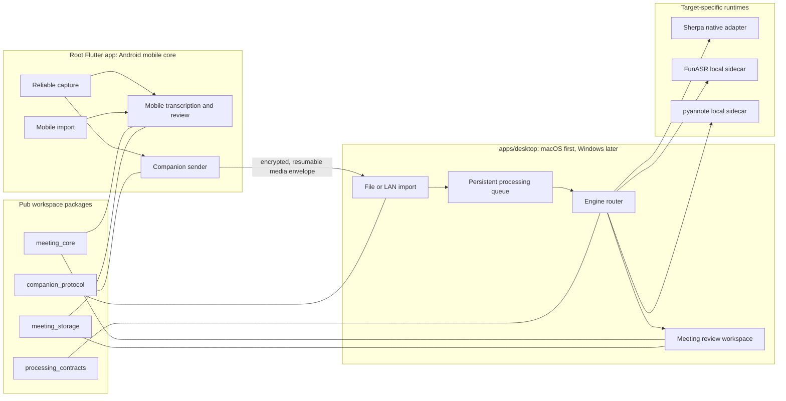
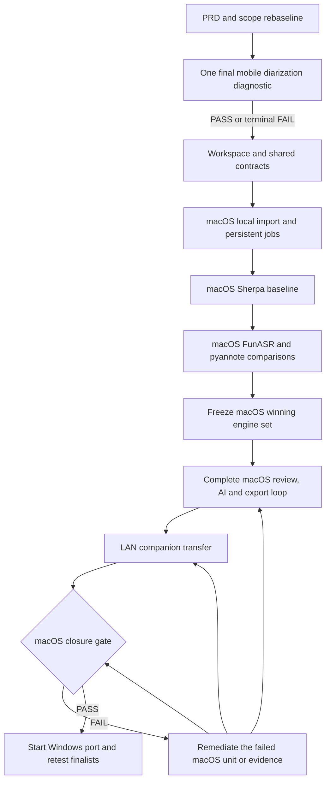
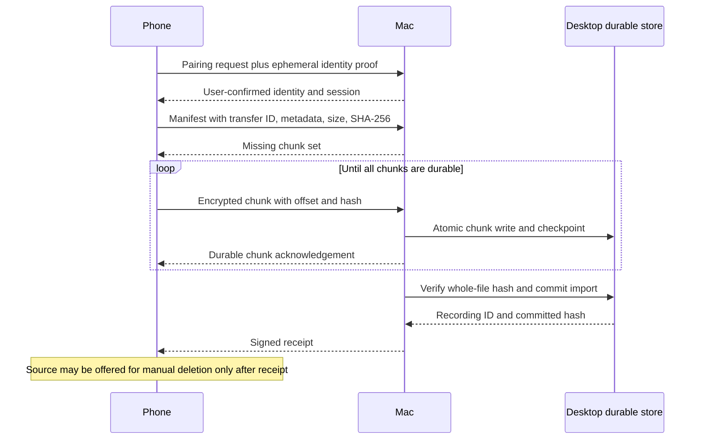

# Desktop-First Meeting Workstation - Plan

## Goal Capsule

把产品从“Android 设备独立承担完整会议处理”重定基线为“桌面端是会议处理主工作站，手机是可靠采集端和可独立使用的移动核心”。第一桌面目标严格限定为 macOS；只有 macOS 的本地导入、模型处理、会议复核、AI 纪要、导出和局域网接收全部通过后，才开始 Windows。

权威顺序如下：

1. 本计划中已确认的产品与平台决策。
2. `docs/product/meeting-voice-recognition-prd-v1.0.md` 及机器可校验的产品范围契约。
3. 当前代码、测试和设备证据。
4. 官方框架与平台文档。

执行画像：

- 先更新产品真相和范围契约，再改架构和功能代码。
- 保留根目录现有 Android 应用，不先机械迁移到 `apps/mobile/`。
- 在同一仓库增加桌面 app 与共享 packages；不另起 PC 仓库。
- macOS 与 Windows 严格串行，不并行开发。
- 同一模型在 Android、macOS、Windows 上都必须分别生成证据，任何平台的 PASS 不得自动继承。
- 移动端说话人分离只允许一次最终诊断；无论结果如何，该诊断结束后停止继续试错。
- ASR-005 不进入开发任务、日常状态提醒或阻塞列表，仅保留为用户在发布前自行执行的验收项。

停止条件：

- 移动端最终诊断失败时，停止端侧说话人路线，不加入模型资产、不创建入口、不继续第三候选。
- macOS 没有任何 ASR 或说话人组合通过固定门禁时，不得用假数据或降级 UI 宣称能力可用；回到独立模型研究计划。
- macOS 完整退出门槛未通过时，不得创建 Windows 产品实现单元。
- 局域网传输未完成鉴权、完整性确认和可恢复语义时，不得删除手机源文件。

尾部责任：

- macOS 产品闭环、基准证据、数据生命周期和局域网交接由本计划收口。
- Windows 在 macOS 关闭后接棒，并对入围组合重新测试。
- 蓝牙直传、自动 USB 导入、多语言 Whisper 路线、跨会议知识库、团队协作和应用商店发布均由后续独立计划承接。

---

## Product Contract

### Summary

桌面端承接长会议、模型推理、多说话人处理、批量复核和导出等高负载工作；手机继续保证现场录音可靠，并可通过本地导入或局域网将录音交给桌面端。桌面不可用时，现有移动核心仍可独立录音、转写和人工复核。

### Problem Frame

当前仓库是 Android-first Flutter 应用。Android 原生层已承担录音、媒体导入、Sherpa 转写和说话人实验，非 Android 平台则注入 fake 实现。移动设备的算力、内存、热限制和后台生命周期使高级模型能力需要裁剪；现有说话人分离在固定 Xiaomi 设备上虽然 DER 数值可接受，但语义门禁和 projected RTF 均失败。

桌面端能提供更完整的推理资源和工作区体验，但不能假定模型在不同 OS、CPU、运行时或打包方式下表现一致。产品需要一条可审计的迁移路线：先一次性关闭移动端说话人疑问，再建立 macOS 主工作站，最后把已入围的组合移植到 Windows。

### Actors

- A1. 会议采集者：使用手机录音，保留原始音频，决定是否交给桌面处理。
- A2. 桌面复核者：在 macOS 或后续 Windows 上导入、处理、编辑、审核和导出会议。
- A3. 发布验收者：检查目标平台证据、能力状态和隐私边界；ASR-005 由用户在发布前自行验收。

### Requirements

| ID | Requirement |
| --- | --- |
| R1 | PRD 和机器可校验状态必须明确桌面主工作站、手机采集/移动核心、macOS 先行、Windows 后置的产品基线。 |
| R2 | PC 端保留在当前仓库，通过 Pub workspace、独立桌面 app 和共享 packages 演进；不得先搬迁根移动应用或让桌面依赖整个根 app。 |
| R3 | 现有 Android 录音、导入、转写、复核、AI 纪要和导出能力在架构抽取期间保持可回归，不得依赖桌面才能使用。 |
| R4 | 移动端说话人分离只执行一次最终诊断：官方 Sherpa Android demo 等价基线、线程单变量矩阵、TitaNet embedding 单变量比较；结果必须可复现并终止该路线。 |
| R5 | 移动端诊断不等于产品准入；只有通过既有功能与资源门禁时才允许进入后续产品化计划，否则保持不可用且不打包模型。 |
| R6 | 第一桌面目标只包含 macOS；Windows 在 macOS 完整退出门槛前保持 `BLOCKED_BY_MACOS_CLOSURE`。 |
| R7 | macOS 首条闭环必须从本地文件导入开始，覆盖私有复制、哈希去重、持久任务、处理、播放、编辑、搜索和导出；AI 纪要仅在用户已配置 provider 并对本场明确同意时进入闭环。 |
| R8 | 桌面处理框架必须可插拔；第一轮 ASR 比较 Sherpa 与 FunASR，第一轮说话人分离比较 Sherpa 与 pyannote.audio。 |
| R9 | Whisper/faster-whisper/whisper.cpp 不进入第一轮；只有多语言需求成为明确产品要求时再独立准入。 |
| R10 | 模型证据按目标平台隔离；Android、macOS、Windows 分别记录 OS、CPU、内存、runtime/model hash、线程、fixture hash、质量、性能和资源结果。 |
| R11 | macOS 只能根据 macOS 固定 fixture 和目标机器证据选择获胜组合；Windows 只重测 macOS 冻结的 finalist，不继承 macOS PASS，也不重开已淘汰候选。若所有 finalist 在 Windows 失败，写入终局 `WINDOWS_NO_ADMISSIBLE_FINALIST`，新的 Windows 模型搜索必须另立计划。 |
| R12 | 桌面模型、Python 环境和原生运行库必须由版本化 manifest、SHA-256、许可和缓存管理，不得把全部候选加入根 Flutter assets 或提交进 Git。 |
| R13 | 局域网传输排在 macOS 本地闭环之后，必须包含用户可见配对、双向身份确认、加密、分块续传、幂等、哈希确认和取消/重试。 |
| R14 | 手机源音频在桌面完整接收且持久化确认之前不得自动删除；失败、断网和重复提交不得造成数据丢失或重复会议。 |
| R15 | 现有 paired-PC provider v1 继续只表示“转写片段到结构化纪要”；原始音频传输和桌面 ASR 使用新的 capability/schema，不兼容地修改 v1 是禁止的。 |
| R16 | 桌面和手机各自拥有独立 SQLite 数据库；设备间交换版本化媒体/任务/结果清单，不共享或复制正在使用的数据库文件。 |
| R17 | UI 只展示已验证能力；说话人结果必须支持匿名标签、overlap/unknown 和人工修正，不在本计划存储 voiceprint 或自动识别真实身份。 |
| R18 | ASR-005 不得被开发计划、自动状态报告或日常提醒重复提出；它仅是发布前由用户执行的验收。 |

### Key Flows

- F1. 移动端最终诊断
  - **Trigger:** 开始执行本计划。
  - **Actors:** A3
  - **Steps:** 复现官方 demo 等价配置；保持 fixture、segmentation 和 clustering 不变，单变量比较线程；再单变量替换为 TitaNet embedding；生成可审计证据和最终 disposition。
  - **Outcome:** 得到一次性 PASS 或永久停止的结论，不产生未受控候选扩散。
  - **Covered by:** R4, R5, R10

- F2. macOS 本地会议处理
  - **Trigger:** A2 选择本地音频或视频文件。
  - **Actors:** A2
  - **Steps:** 复制到 app 管理目录、探测和哈希、创建幂等任务、运行选定 ASR/说话人引擎、持久化派生结果、进入会议复核工作区并导出；仅在用户已配置 provider 且对本场明确同意时生成 AI 纪要。
  - **Outcome:** 不依赖手机或网络完成一场会议的完整处理闭环。
  - **Covered by:** R6-R12, R16, R17

- F3. 手机到 macOS 的局域网交接
  - **Trigger:** A1 在手机选择“发送到已配对桌面”。
  - **Actors:** A1, A2
  - **Steps:** 发现或选择桌面、显示并确认双方身份、建立加密会话、发送版本化清单与分块音频、断点续传、桌面校验哈希并持久化、返回 receipt。
  - **Outcome:** 桌面获得与本地导入等价的不可变媒体资产，手机保留源文件直至确认。
  - **Covered by:** R13-R16

- F4. macOS 到 Windows 的平台晋级
  - **Trigger:** macOS 完整退出门槛通过。
  - **Actors:** A3
  - **Steps:** 创建 Windows runner/adapter；在 Windows 参考机器上重新执行入围引擎的质量、性能、资源、打包和产品流测试。
  - **Outcome:** Windows 独立形成 PASS/FAIL，不修改 macOS 证据。
  - **Covered by:** R6, R10, R11

### Acceptance Examples

- AE1. 本地完整闭环
  - **Given:** macOS 上存在受支持的两小时中文会议文件。
  - **When:** 用户导入并选择已准入的处理组合。
  - **Then:** 应创建一个可恢复任务，完成转写和匿名说话人处理，允许播放定位、编辑、搜索和非 AI 导出；已配置并同意 AI 时还允许纪要审核。未配置 AI 不影响本地核心闭环，重启应用后状态仍一致。
  - **Covers:** F2, R7-R12, R16-R17

- AE2. 断网续传
  - **Given:** 手机向已配对 macOS 发送大文件并在中途断网。
  - **When:** 两台设备重新连到局域网并恢复任务。
  - **Then:** 只补传缺失分块，桌面最终哈希与手机清单一致，不创建重复会议，手机源文件未被删除。
  - **Covers:** F3, R13-R16

- AE3. 跨平台证据隔离
  - **Given:** 某组合已在 macOS 通过。
  - **When:** Windows 还没有对应基准证据，或 Windows 资源门禁失败。
  - **Then:** Windows 能力仍保持 blocked/failed；macOS 能力状态不受影响。
  - **Covers:** F4, R10-R11

- AE4. 移动诊断失败
  - **Given:** 官方等价基线、线程矩阵和 TitaNet embedding 均未同时通过语义与性能门禁。
  - **When:** 最终诊断写入 disposition。
  - **Then:** 不运行新的第三模型、不加入资产、不创建 UI，移动核心继续使用现有无自动说话人的可靠流程。
  - **Covers:** F1, R3-R5

- AE5. 桌面不可用
  - **Given:** 用户没有已配对桌面或桌面离线。
  - **When:** 用户完成手机录音。
  - **Then:** 手机仍可使用现有本地转写、复核和导出；不得因桌面路线回退现有功能。
  - **Covers:** R3, R13

### Success Criteria

- 产品文档和机器契约不再把桌面描述为模糊的“以后再做”，而是显示清晰的 macOS → Windows 门禁链。
- 移动端说话人最终诊断只有一个终局 disposition，且不会继续产生开放候选。
- macOS 能从本地文件完成端到端会议闭环，长任务可取消、重试、恢复，应用重启不丢状态。
- macOS 的 ASR 和 diarization 选择都有目标机器、固定 fixture 和可复验 manifest。
- 参考机器上的两小时会议从开始处理到可完整复核不超过 30 分钟；代表性会议中需要人工改正的 speaker turns 不超过 10%，并通过至少 5 场真实会议 dogfood 验证复核/导出流程可理解。
- 局域网传输在断网、重复请求、取消、磁盘不足和哈希不一致场景下不丢源文件、不产生静默损坏。
- Windows 只有在 macOS closure 后开始，且拥有独立证据。

### Scope Boundaries

本计划范围内：

- PRD、产品状态和验证契约重定基线。
- 一次移动端 Sherpa 说话人最终诊断。
- 同仓 Pub workspace、共享领域/存储/处理/伴侣协议 packages。
- macOS desktop app、本地导入、模型基准与完整会议工作区。
- Sherpa/FunASR ASR 比较，Sherpa/pyannote diarization 比较。
- macOS 本地闭环之后的手机到桌面局域网传输。
- macOS 完成后的 Windows 移植和入围模型重测。

明确延期：

- 蓝牙音频传输。
- 自动 USB 设备发现和导入；第一版仍可由用户把 USB 暴露的文件通过桌面文件选择器导入。
- Whisper/faster-whisper/whisper.cpp 和多语言模型矩阵。
- PC Live VAD、实时字幕和阶段性摘要。
- 跨会议知识库、团队协作、日历/任务集成。
- 应用商店签名、公证、自动更新和商业发布流水线。

不属于产品身份：

- 默认上传会议到云端。
- 手机必须连接桌面才能录音或查看记录。
- 在没有用户明确建档与额外隐私设计时自动识别真实人物身份或持久化 voiceprint。
- 用假结果、静态 fixture 或存在于资产中的模型声明生产能力可用。

### Dependencies

- macOS 开发机及 Xcode/Flutter desktop toolchain。
- 后续 Windows 参考机器及 Visual Studio C++ desktop toolchain。
- 版本固定的 Sherpa native runtime、FunASR Python/PyTorch runtime、pyannote.audio/Community-1 模型。
- 能覆盖中文会议、噪声、重叠、静音和长时长的固定 benchmark corpus。
- `flutter-components` 的 Goo 设计和 Flutter API；UI 实现前必须阅读其 `DESIGN.md` 和 `DOC.md`。

---

## Planning Contract

### Key Technical Decisions

- KTD1. 保留单仓库，但不是单 package。根 Flutter app 继续代表现有移动端；新增 `apps/desktop/` 和 `packages/*`，使用 Dart 3.11 Pub workspace 的单一解析。这样减少重复代码和跨仓协议漂移，同时避免先搬动当前大量未提交的移动/S3 代码。U4 在桌面 pubspec 创建后，必须用真实 desktop storage、file picker、playback、secure storage 和 native runtime 依赖做 workspace falsification；如果只能靠不受支持的 override 才能让任一平台解析/构建，本计划停止后续共享抽取并重新评估仓库边界。

- KTD2. 不先把根 app 迁到 `apps/mobile/`。共享代码只在真实消费者出现时抽取：U3 先抽领域契约、数据库 factory、导入 commit 和处理端口，伴侣协议到 U8 与双端消费者一起创建；移动 UI 与 Android composition 保持原位。

- KTD3. 平台实现从页面和服务内部上移到 composition root。当前非 Android 会得到 `FakeTranscriptionService`，导入服务直接绑定 Android `MethodChannel`，启动恢复服务也知道 Android 实现。桌面化先建立 platform composition，再让 UI 只依赖端口。

- KTD4. 数据库 schema 只有一个来源。把 `AppDatabase` 改为可注入 database factory/path，在 Android 使用 sqflite，在桌面使用 `sqflite_common_ffi`；不得复制另一套桌面 schema 或跨设备共享 live SQLite 文件。U3 只抽取 schema、factory、稳定实体和首条导入链路所需 repository，根 app 保留过渡 re-export；其他 repository 在真实桌面消费者出现时逐个迁移。

- KTD5. 桌面引擎遵循统一的 `ProcessingEnginePort`，但允许不同部署形态。Sherpa 优先通过稳定 C API/native adapter 进程内运行；FunASR 和 pyannote 作为版本固定的本地 sidecar 候选，通过 JSONL/stdin-stdout 的版本化控制协议通信，音频以受控 job workspace 内的不可变文件路径和 SHA-256 传递。sidecar 不监听局域网端口，并在经过清理的最小环境中启动：不继承密钥，文件访问限于 job/runtime/model roots，处理期间禁止外连，限制 CPU/内存/输出，取消或父进程退出时终止全部子进程。

- KTD6. 模型准入与产品集成分离。候选先在 `benchmark/desktop/` 运行并生成证据；只有获胜组合才进入 runtime manifest 和产品设置。仓库内经审查的 runtime manifest 是信任根，固定 HTTPS 来源、不可变 revision、每个 wheel/native/model 工件 hash、SBOM 和许可 disposition；安装先进入临时目录，完整校验后原子提升。所有候选模型、Python 环境和 native binaries 位于 Git 忽略的内容寻址缓存，不进入根移动 assets。

- KTD7. macOS 第一轮只比较 Sherpa 与 FunASR 的中文 ASR，以及 Sherpa 与 pyannote.audio 的匿名 diarization。Sherpa 提供最一致的跨端部署基线；FunASR 提供中文 ASR/VAD/标点/说话人生态对照；pyannote 提供桌面 Python/PyTorch diarization 对照。Whisper 延后，防止在尚无明确多语言目标时扩大模型矩阵。

- KTD8. 跨平台模型状态是二维矩阵，而不是一个全局布尔值：`candidate × target fingerprint`。fingerprint 至少包含 OS/version、architecture、CPU、RAM、runtime hash/version、model hash、线程和 build mode。fixture 可复用，结论不可继承。首个 macOS closure 只对当前开发参考目标成立：Apple Silicon arm64、Apple M2、16 GiB RAM、macOS 15.7.5；Intel、8 GiB 和其他未测目标保持 blocked。

- KTD9. 移动端最终诊断采用两个隔离 arm。官方 parity arm 直接对完整 fixture 调用 Sherpa `process`，不经过当前 30 秒窗口、5 秒重叠、额外 embedding 或会议级 reconciliation；线程矩阵和 TitaNet 只在该 arm 内逐个改变。当前产品链路 arm 保持已冻结配置，作为集成差异对照而不继续调参。TitaNet 不是完整 diarization 框架，不得与分割模型调整混成一个候选。

- KTD10. 局域网交接复用桌面本地导入的后半段。协议只负责配对、传输和 receipt；桌面收到并校验的媒体进入与文件选择完全相同的 import commit 和 processing queue，不维护第二套业务流程。

- KTD11. paired-PC meeting intelligence provider v1 不承载原始音频。新增 `companion-media-transfer/v1` 和处理 capability 协商；v1 继续冻结，避免已验证的“片段 → 纪要”契约被不兼容扩展。

- KTD12. 传输以桌面作为接收 server，使用 DNS-SD/mDNS 发现、用户确认的短码/二维码和双方公钥指纹建立信任，再使用加密会话传输。发现不是信任；IP 地址不是身份；receipt 只在 durable write 与全文件哈希通过后签发。配对必须绑定双方 transcript 和用户在场确认，短码有过期时间和尝试上限，长期 peer key 可查看/撤销，设备 key 改变必须重新配对，unpair 删除凭据和未完成 checkpoint。

- KTD13. 原件和派生数据分别拥有明确权威。手机是源录音权威，直到桌面 receipt；桌面是其本地处理结果的权威。第一版不自动回写完整派生数据库，只允许后续通过版本化结果 envelope 导入，避免双向实时同步冲突。桌面 v1 的静态数据威胁模型依赖 OS 账户隔离和 FileVault/BitLocker，不做应用层整库/音频加密；API/配对密钥仍必须进入系统安全存储，未启用磁盘加密时产品应提示风险而不是宣称应用级加密。

- KTD14. macOS closure 是 Windows 的显式依赖，不只是排期偏好。Windows 单元只移植已冻结的 app contract、伴侣协议和 finalist；Windows 上仍需重新验证 runtime、资源、安装包和产品流。全部 finalist 失败时停止为 `WINDOWS_NO_ADMISSIBLE_FINALIST`，不在 U10 内重开模型搜索。

- KTD15. 说话人功能只做匿名分离和人工修正，不把 speaker identification/voiceprint 纳入本计划。Sherpa 官方虽支持 speaker identification，但它与会议 diarization 的产品目标、隐私与建档流程不同。

- KTD16. 两个 app 共享领域、存储和平台无关 workflow，不预先共享桌面 UI。新增 `meeting_workflows` 承载 import commit、队列、搜索、导出和 meeting intelligence orchestration；移动端通过过渡 re-export 迁移，桌面使用自己的 Goo 布局。只有经过两个 app 验证确实相同的 widget 才后续抽到共享 Flutter package。

- KTD17. 获胜 Python sidecar 采用受管、内容寻址的 hermetic runtime，而不是依赖开发机全局 Python。runtime manager 负责首次安装、许可接受、断点恢复、hash 校验、原子升级/回滚、损坏修复、空间预检和卸载；一次成功 provisioning 后，完整处理必须能在断网状态运行。

- KTD18. 首版不向普通用户暴露 engine picker。每个 target 自动使用 machine decision 冻结的 ASR + diarization 组合；只有后续同时存在两个完整准入组合并另立产品决策时，才增加高级切换。

### High-Level Technical Design

下图是边界草图，不规定具体类名或序列化实现；Implementation Units 中的文件和测试契约才是执行边界。

平台晋级状态：

媒体传输确认语义：

### Target-Specific Evidence Contract

每条 benchmark result 都必须包含：

| Dimension | Required evidence |
| --- | --- |
| Target | OS/version、architecture、CPU、RAM、设备标识、build mode |
| Runtime | engine ID/version、native library 或 Python lock hash、execution provider、线程 |
| Model | model ID、来源 revision、artifact SHA-256、bytes、license disposition |
| Input | fixture ID、audio SHA-256、reference SHA-256、语言/噪声/说话人数/时长标签 |
| Quality | ASR 的 CER/WER、时间戳和目标词指标；diarization 的 DER、overlap、unknown/silence honesty |
| Performance | wall time、RTF、peak RSS、CPU/thermal 可用信息、完整输入消费 |
| Reliability | exit code、取消、重试、超时、OOM/crash、输出 schema 校验 |
| Decision | `PASS`、`FAIL` 或 `LAB_ONLY`，以及失败门禁和证据 hash |

桌面第一轮共同硬门禁：

- 所有固定功能 fixture 被完整消费，输出 schema、时间范围和哈希有效。
- 120 分钟目标 corpus 不崩溃、不 OOM，CPU 路线 RTF 不高于 0.5。
- ASR 不得用更快但明显退化的结果获胜；选择 contract 先过滤正确性和资源硬失败，再按固定中文会议加权质量排序。
- Diarization DER 不高于 30%，显式表达 overlap/unknown，不得在预注册静音区间伪造 speaker。
- 每个平台单独判定；没有该 target fingerprint 的 evidence 即为未验证。

macOS 参考目标还必须满足产品体验门禁：

- 两小时会议的完整 ASR + diarization 处理不超过 30 分钟。
- 5 场代表性真实会议的 speaker turn 人工修正率不高于 10%。
- 3000+ segment fixture 的会议打开 P95 不高于 2 秒、搜索 P95 不高于 200 毫秒、播放定位响应 P95 不高于 200 毫秒，固定交互脚本长帧率低于 1%。
- U7 dogfood 记录完成复核与导出的总时间、人工纠错负担、失败恢复理解度，以及用户是否愿意把桌面设为主工作站；U9 closure 必须引用该证据。

### Desktop Interaction Contract

- 默认首屏是会议库，提供明显的导入入口；持续可见的任务区显示所有 processing/AI/transfer job。
- 一级导航为会议库、处理中、已配对设备、模型与设置；会议详情进入独立工作区，并能从完成通知回到对应会议。
- processing UI 至少区分 `model_missing`、`installing`、`queued`、`preparing`、`asr`、`diarization`、`partial_success`、`completed`、`canceling`、`canceled`、`retryable_failure`、`terminal_failure` 和 `recovery_unknown`；每态定义进度、主操作、退出应用后的行为和重启落点。
- 第一版自动使用当前 target 的冻结组合，不显示引擎选择控件。
- 会议工作区必须定义最小支持窗口、sidebar/detail 折叠、完整键盘焦点路径、播放/跳转快捷键、任务进度与 speaker/overlap 的屏幕阅读器语义、200% 文本缩放和所有拖拽操作的非拖拽替代。
- LAN 双端流程必须覆盖发现中/空结果/多设备、双方短码和指纹确认、权限拒绝 fallback、设备离线、传输排队/暂停/恢复/校验、receipt、取消/重试和撤销配对。

### Data Lifecycle Contract

| Artifact | Authority and retention | Cleanup trigger |
| --- | --- | --- |
| Import staging | Desktop import job；失败/取消后最多保留 24 小时 | 当次失败清理，启动时重试，24 小时强制清理 |
| Sidecar workspace/output | Desktop processing job；成功 commit 后不再需要，失败后最多 24 小时 | commit 后立即删除，启动时清理过期失败目录 |
| LAN chunks/checkpoint | Desktop transfer job；中断后最多 7 天供续传 | receipt/unpair 后立即删除，7 天强制过期 |
| Share/export artifact | 发起分享的 app；最多 24 小时 | share 返回后尽快删除，启动时清理过期文件 |
| Transfer receipt | 双方保留不含音频内容的确认元数据 | meeting 永久删除或 unpair 时删除 |
| Committed meeting/audio | 各设备本地用户；沿用现有用户可配置 recently-deleted policy，默认不自动永久删除 | 用户明确永久删除或其已启用的 retention policy |
| Model/runtime cache | Desktop runtime manager | 用户卸载、显式 prune 或版本替换成功后删除旧版本 |

### System-Wide Impact

- Composition：`lib/app/app.dart`、录音页面、导入服务和 startup reconciler 中的平台判断需要集中，避免桌面意外使用 fake 或 Android 实现。
- Data：`AppDatabase` 需要 factory/path 注入；fresh-create 和 v19+ upgrade 在 sqflite 与 FFI factory 上保持同一 schema 语义。
- Imports：文件选择/原生复制与平台无关的哈希、去重、recording commit、queue enqueue 分离。
- Runtime：移动 Sherpa AAR 与桌面 native/Python runtimes 分开管理；禁止用同名 model ID 掩盖不同工件。
- Product truth：PRD、mobile capability matrix、desktop scope JSON、benchmark manifest 和 UI 状态必须一致。
- Privacy：局域网发现会触及 Android/Apple 本地网络权限与隐私声明；拒绝权限时降级为手动地址/二维码或本地文件导入，不影响录音。
- Security：配对凭据进入系统安全存储；日志不得包含音频内容、密钥、完整路径中的敏感用户数据或可复用 session token。
- Storage：临时分块、失败 sidecar 输出和导出文件必须有清理责任；已提交原音频只能通过用户可见删除流程移除。
- Performance：桌面长任务在后台 isolate/process 执行，UI 只消费有界进度；并发数默认保守且必须有磁盘/内存预算。
- UI：桌面布局复用 Goo tokens/components 和现有会议复核语义，但不直接复制手机页面尺寸与导航。

### Risks and Mitigations

| Risk | Impact | Mitigation |
| --- | --- | --- |
| 当前工作区大量未提交改动与共享抽取冲突 | 覆盖用户工作或制造巨大 diff | 保留根移动 app；按端口/包小步抽取；每单元先检查工作区并只改计划路径。 |
| Pub workspace 单一解析产生依赖冲突 | 移动或桌面无法解析 | 先做 workspace smoke；集中 dependency overrides；共享包保持最小依赖面。 |
| FunASR/pyannote Python sidecar 打包过重 | 安装体积、启动和维护成本高 | benchmark 与产品准入分离；锁定环境和模型；只有显著质量收益时才产品化 sidecar。 |
| macOS Apple Silicon 与 Intel 差异 | 单机证据不能覆盖所有 Mac | 第一版明确支持目标 architecture；其他 architecture 保持未验证并后续补证据。 |
| Windows native/Python 依赖表现不同 | macOS 通过但 Windows 失败 | Windows 重新构建 runtime、重测 finalist，不复用 PASS。 |
| mDNS 发现被权限、网络隔离或企业 Wi-Fi 阻断 | 手机找不到桌面 | 提供二维码/手动配对 fallback；本地文件导入永远可用。 |
| 局域网中间人或错误设备接收音频 | 敏感会议泄露 | 用户确认短码和公钥指纹、加密会话、配对撤销、receipt 签名、无明文 fallback。 |
| 分块文件或重复任务导致损坏/膨胀 | 数据损坏或磁盘耗尽 | 内容哈希、幂等 transfer ID、配额/磁盘预检、原子 commit、过期临时数据清理。 |
| 自动说话人误导用户 | 错误归属会议结论 | overlap/unknown honesty、人工修正、模型未准入时无入口、不做真实身份识别。 |
| 基准 corpus 过拟合 | 实际会议表现落差 | 按会议类型、噪声、人数和时长分层；保留隐藏/最终复核集；记录所有参数。 |

### Resolved During Planning

- PC 端不另起仓库，采用同仓多 app/package。
- 根移动 app 暂不迁移目录。
- macOS 先完整跑通，Windows 后置且不并行。
- 不同平台上的模型必须重测；只共享 fixture 和 contract，不共享 PASS。
- 移动端再做一次且仅一次 Sherpa 诊断。
- 桌面本地文件导入优先于局域网；蓝牙和自动 USB 延后。
- 桌面第一轮不引入 Whisper。
- speaker identification/voiceprint 不属于本计划。

### Sources

- Repo: `lib/app/app.dart`
- Repo: `lib/features/transcription/service/transcription_port.dart`
- Repo: `lib/features/recording/engine/recorder_port.dart`
- Repo: `lib/features/importing/service/meeting_import_service.dart`
- Repo: `lib/features/meetings/service/meeting_playback_service.dart`
- Repo: `lib/data/sqlite/app_database.dart`
- Repo: `docs/architecture/meeting-intelligence-provider-protocol.md`
- Repo: `benchmark/S3_SPEAKER_DIARIZATION_REVIEW.md`
- Repo: `docs/plans/2026-07-26-001-feat-speaker-diarization-readmission-plan.md`
- Official: [Dart Pub workspaces](https://dart.dev/tools/pub/workspaces)
- Official: [Flutter desktop support](https://docs.flutter.dev/platform-integration/desktop)
- Official: [Sherpa platform and API support](https://k2-fsa.github.io/sherpa/intro.html)
- Official: [Sherpa offline speaker diarization C API](https://k2-fsa.github.io/sherpa/onnx/c-api/html/speaker_diarization.html)
- Official: [Sherpa Android diarization APK/model combinations](https://k2-fsa.github.io/sherpa/onnx/speaker-diarization/apk.html)
- Official: [FunASR](https://github.com/modelscope/FunASR)
- Official: [pyannote.audio](https://github.com/pyannote/pyannote-audio)
- Official: [pyannote Community-1 model card](https://huggingface.co/pyannote/speaker-diarization-community-1)
- Official: [Android network service discovery](https://developer.android.com/develop/connectivity/wifi/use-nsd)
- Official: [Android local network permission](https://developer.android.com/privacy-and-security/local-network-permission)

### Sequencing

| Phase | Units | Gate |
| --- | --- | --- |
| A. Rebaseline and close mobile question | U1 → U2 | One terminal mobile disposition; no open candidate loop |
| B. Build shared platform base | U3 → U4 | Android regression green; macOS local import persists |
| C. Benchmark and select macOS engines | U5 → U6 | Frozen macOS finalist set |
| D. Complete macOS product | U7 → U8 → U9 | macOS closure PASS |
| E. Port to Windows | U10 | Windows independent evidence and parity |

---

## Implementation Units

| U-ID | Title | Primary files | Depends on |
| --- | --- | --- | --- |
| U1 | Rebaseline PRD and product truth | `docs/product/*`, `tool/validate_desktop_workstation_scope.py` | — |
| U2 | Run the final mobile diarization diagnostic | `benchmark/*speaker*`, Android speaker instrumentation | U1 |
| U3 | Introduce workspace and shared contracts | `pubspec.yaml`, core/storage/workflow packages, `lib/app/app.dart` | U2 |
| U4 | Create macOS desktop foundation and local import | `apps/desktop/*`, database/import adapters | U3 |
| U5 | Build target-specific desktop benchmark system | `benchmark/desktop/*`, processing contracts | U4 |
| U6 | Compare and freeze macOS engine set | Sherpa/FunASR/pyannote adapters and evidence | U5 |
| U7 | Complete macOS meeting workstation | Desktop review/AI/export features | U6 |
| U8 | Add secure resumable LAN handoff | companion protocol package, mobile/desktop adapters | U7 |
| U9 | Close macOS quality and operational gates | macOS integration tests, status/evidence docs | U8 |
| U10 | Port finalists and product flow to Windows | Windows runner/adapters/evidence | U9 |

### U1. Rebaseline PRD and product truth

**Goal:** 把已确认的平台策略变成唯一、机器可校验的产品真相，并消除旧的“PC 仅 deferred”叙述。

**Requirements:** R1, R6, R8-R11, R18

**Files:**

- Modify: `docs/product/meeting-voice-recognition-prd-v1.0.md`
- Modify: `docs/product/mobile-capability-matrix.md`
- Modify: `docs/product/s3-productization-status.md`
- Modify: `docs/product/s3-productization-scope.json`
- Create: `docs/product/desktop-workstation-scope.json`
- Create: `docs/product/desktop-workstation-status.md`
- Create: `tool/validate_desktop_workstation_scope.py`
- Create: `tool/test_validate_desktop_workstation_scope.py`
- Modify: `tool/dev_check.sh`

**Approach:**

- 将桌面主工作站定义为新的执行方向，不篡改已经完成的移动/S3 历史证据。
- 给 macOS、Windows、移动最终诊断、模型矩阵和 LAN 分别设置可校验状态。
- 明确 Windows 的依赖状态、第一轮候选集、延期能力和“不继承 PASS”规则。
- 从自动提醒与开发 blocker 中移除 ASR-005；PRD 中只保留“用户发布前验收”的一次性说明。
- validator 校验 Markdown 与 JSON 的关键决策、路径、allowed status 和依赖关系一致。

**Test Scenarios:**

- PRD 写成 Windows 与 macOS 并行时 validator 失败。
- Windows 标记 PASS 但缺少 macOS closure evidence 时 validator 失败。
- 任一目标复用其他目标的 evidence hash 作为唯一证据时 validator 失败。
- 文档把 ASR-005 放回开发阻塞/提醒列表时 validator 失败。

**Verification:**

- scope 单元测试和 validator 通过。
- `./tool/dev_check.sh` 包含新 truth contract，原有 S2/S3 contract 不回退。

### U2. Run the final mobile diarization diagnostic

**Goal:** 用一次受控实验回答“Sherpa 官方移动路径、线程数和 TitaNet 是否能改变结果”，然后永久收口移动端自动说话人路线。

**Requirements:** R3-R5, R10, R17

**Files:**

- Modify: `benchmark/speaker_diarization_admission_contract.json`
- Modify: `benchmark/speaker_diarization_candidates.json`
- Modify: `benchmark/speaker_diarization_contract.py`
- Modify: `benchmark/evaluate_speaker_diarization.py`
- Modify: `benchmark/run_speaker_diarization_gate.sh`
- Create: `benchmark/speaker_diarization_final_diagnostic_contract.json`
- Create: `benchmark/S3_SPEAKER_DIARIZATION_FINAL_DIAGNOSTIC.md`
- Modify: `android/app/src/main/kotlin/com/voice2text/app/speakers/SherpaSpeakerDiarizationEngine.kt`
- Modify: `android/app/src/androidTest/kotlin/com/voice2text/app/speakers/SpeakerDiarizationProbeSupport.kt`
- Add tests under: `android/app/src/test/kotlin/com/voice2text/app/speakers/`
- Modify: `docs/product/mobile-capability-matrix.md`
- Modify: `docs/product/desktop-workstation-scope.json`

**Approach:**

- 保持 fixture、RTTM、segmentation 和 clustering 不变，但明确拆分两个 arm。
- 官方 parity arm 直接把完整 fixture 交给 Sherpa `process`，不经过现有窗口/reconciliation；先生成官方模型组合/调用方式等价基线。
- 将线程数变为仅 benchmark 可覆盖的参数，生产默认仍为 2；在 parity arm 内逐项测试固定线程矩阵。
- 在 parity arm 内再仅替换 embedding 为官方支持的 TitaNet 工件；固定工件、许可和 hash。
- 当前 30 秒窗口、5 秒重叠和会议级 reconciliation 保持冻结，只作为 product-integration control arm，不继续调参。
- 每个运行记录功能语义、DER、RTF、RSS、thermal、完整输入消费和转写快照。
- 无论 PASS/FAIL 都写入 terminal disposition。FAIL 后不跑第三候选；PASS 也只获得“可进入独立产品化计划”的资格。

**Test Scenarios:**

- 同一次 run 同时修改线程、窗口和阈值时 contract 拒绝证据。
- 标记为 official parity 的 run 经过窗口、额外 embedding 或 reconciliation 时 contract 拒绝证据。
- TitaNet 缺少 segmentation/clustering identity 时不得被标成完整候选。
- 静音区间有 speaker、overlap 未表示或 projected RTF 超门禁时得到 FAIL。
- 所有运行结束后仍存在 `IN_PROGRESS` 或 `NEXT_CANDIDATE` 时 validator 失败。

**Verification:**

- Python contract/evaluator tests 通过。
- 固定 Xiaomi 真机产生原始和汇总 evidence。
- 最终 disposition 与 capability matrix 一致，且产品 assets/UI 未新增说话人候选。

### U3. Introduce workspace and shared contracts

**Goal:** 在不移动根 Android app 的前提下，建立桌面和移动可共同依赖的最小架构边界。

**Requirements:** R2-R3, R8, R12, R16

**Files:**

- Modify: `pubspec.yaml`
- Modify: `pubspec.lock`
- Create: `packages/meeting_core/pubspec.yaml`
- Create: `packages/meeting_core/lib/`
- Create: `packages/meeting_core/test/`
- Create: `packages/meeting_storage/pubspec.yaml`
- Create: `packages/meeting_storage/lib/`
- Create: `packages/meeting_storage/test/`
- Create: `packages/processing_contracts/pubspec.yaml`
- Create: `packages/processing_contracts/lib/`
- Create: `packages/processing_contracts/test/`
- Create: `packages/meeting_workflows/pubspec.yaml`
- Create: `packages/meeting_workflows/lib/`
- Create: `packages/meeting_workflows/test/`
- Modify: `lib/app/app.dart`
- Modify: `lib/data/sqlite/app_database.dart`
- Modify: `lib/features/importing/service/meeting_import_service.dart`
- Create: `lib/features/importing/service/meeting_media_import_port.dart`
- Add/modify tests under: `test/features/importing/`, `test/features/recording/`, `test/features/transcription/`

**Approach:**

- 配置 root package 加已经创建的 `packages/*` workspace members，保留单一 lockfile；`apps/desktop` 到 U4 创建 pubspec 后才加入。
- 只抽取稳定领域值、数据库 schema/factory、首条导入链路所需 repository、平台无关 workflow 和处理 job/result contract；不抽取 Android UI/composition。
- 根 app 对已迁移实体/repository/workflow 保留过渡 re-export，一次只迁移一个真实消费者及其测试，避免产生双类型或双 schema。
- 为数据库注入 factory/path，使同一 schema 在 sqflite 和 FFI 上运行。
- 把原生文件选择/复制从平台无关的 import commit 分开；保留现有去重和事务语义。
- 把所有平台实例创建集中到 composition root，页面和 coordinator 不再直接构造 Android 实现。

**Test Scenarios:**

- 根 Android app 与已创建的共享 workspace package 可以同一解析。
- fresh-create 和 v19 upgrade 在 FFI factory 上得到等价 schema。
- fake import port 返回重复 hash 时不创建第二条 recording/job。
- 非 Android composition 不再静默注入 fake 并显示为生产能力。
- Android 原有导入、转写、AI 和导出测试保持通过。

**Verification:**

- `dart pub workspace list` 显示 root 和共享 packages；desktop membership 在 U4 验证。
- workspace analyze/test 通过。
- `./tool/dev_check.sh` 通过。

### U4. Create macOS desktop foundation and local import

**Goal:** 创建独立桌面 app，在 macOS 完成本地文件选择到持久 processing job 的最小真实链路。

**Requirements:** R6-R7, R12, R16

**Files:**

- Create: `apps/desktop/pubspec.yaml`
- Create: `apps/desktop/lib/main.dart`
- Create: `apps/desktop/lib/app/`
- Create: `apps/desktop/lib/features/importing/`
- Create: `apps/desktop/lib/features/processing/`
- Create: `apps/desktop/lib/features/settings/`
- Create: `apps/desktop/macos/`
- Create: `apps/desktop/test/`
- Create: `packages/meeting_storage/lib/src/desktop_database_factory.dart`
- Create: `packages/processing_contracts/lib/src/model_asset_manifest.dart`
- Create: `docs/architecture/desktop-runtime-boundaries.md`

**Approach:**

- 生成只包含 macOS runner 的 desktop app；暂不创建 Windows runner。
- 创建 `apps/desktop/pubspec.yaml` 后将 desktop 加入 root workspace，并验证单一依赖解析。
- 在继续桌面实现和共享抽取前，引入计划中的真实 storage、file picker、playback、secure storage 和 native runtime 依赖完成单 lockfile falsification；不受支持的 override 或任一平台构建失败触发仓库边界复核。
- 使用 FFI SQLite 和独立桌面 app support 目录。
- 首版只做用户选择文件；先从稳定 file descriptor 读取源大小并完成目标卷空间/配额预检，再复制到受控 staging、边复制边 hash，完成后 fsync、格式探测并原子 rename/commit；失败统一清理 staging。
- 本地和 LAN 导入都由系统生成目标文件名，只接受有界 metadata，拒绝发送方路径，使用 no-follow/open-descriptor 和 canonical containment 防止 traversal、symlink/hard-link、TOCTOU、稀疏文件和覆盖。
- 创建可恢复 processing job，但在本单元使用 fake engine 验证队列和 UI 状态。
- 模型资产 registry 支持版本、平台、architecture、hash、license 和安装状态；候选不进入 Flutter assets。
- UI 实施前阅读 `../flutter-components/DESIGN.md` 与 `../flutter-components/DOC.md`，使用已导出的 Goo 组件。

**Test Scenarios:**

- 支持文件成功复制、哈希、持久化和入队。
- 同一文件重复导入被幂等识别。
- 磁盘不足、取消、无权限、损坏文件不产生半提交 recording。
- 应用在 job 处理中退出后，重启可以恢复或明确失败。
- 未安装真实 engine 时 UI 显示不可用，不生成 fake transcript。

**Verification:**

- desktop analyze/widget/repository tests 通过。
- `dart pub workspace list` 显示 root、desktop 和共享 packages。
- `flutter build macos --debug` 通过。
- macOS 手工 smoke 能导入真实文件并在重启后看到持久任务。

### U5. Build target-specific desktop benchmark system

**Goal:** 建立跨框架但不跨目标继承结论的 benchmark 和证据系统，先跑通 macOS Sherpa 基线。

**Requirements:** R8-R12, R17

**Files:**

- Create: `benchmark/desktop/README.md`
- Create: `benchmark/desktop/desktop_processing_contract.json`
- Create: `benchmark/desktop/desktop_model_candidates.json`
- Create: `benchmark/desktop/run_desktop_benchmark.py`
- Create: `benchmark/desktop/evaluate_desktop_asr.py`
- Create: `benchmark/desktop/evaluate_desktop_diarization.py`
- Create: `benchmark/desktop/validate_desktop_candidates.py`
- Create: `benchmark/desktop/test_*.py`
- Create: `packages/processing_contracts/lib/src/processing_engine_port.dart`
- Create: `packages/processing_contracts/lib/src/processing_evidence.dart`
- Create: `apps/desktop/lib/features/processing/sherpa/`
- Create: `apps/desktop/macos/Runner/Processing/`
- Modify: `apps/desktop/lib/features/importing/`

**Approach:**

- 固定与移动测试可比较但不共享判定的中文会议 corpus。
- 证据 schema 将 target fingerprint 设为必需键，禁止单一 `verified=true`。
- 用 Sherpa C API/native adapter 先验证文件解码、长音频、进度、取消、ASR 和 diarization。
- Sherpa 基线可运行后立即用它完成一个 provisional 纵向切片：真实本地文件 → 转写/匿名说话人 → 会议复核 → 非 AI 导出；U6 可以替换引擎实现，但不得改变共享 job/result contract。
- benchmark 在产品 UI 之外运行；原始证据写入固定目录并由 validator 校验 hash。
- 保留实验缓存目录与 Git 中的 manifest/summary 分离。
- U5 根据参考机器证据冻结 operational envelope：最大源文件 bytes/时长、解码后 bytes、segment 数、排队 job 数、并发 engine 数、临时磁盘倍率和最小剩余空间；U4/U8 preflight 必须执行该 envelope。

**Test Scenarios:**

- 缺 OS/CPU/runtime/model/fixture hash 的证据被拒绝。
- Android evidence 被用于 macOS decision 时 validator 失败。
- engine 输出越界时间戳、未消费完整音频或伪造静音 speaker 时失败。
- 取消/超时后 native handle 和临时文件被释放。
- 两小时文件满足资源门禁并生成可复验报告。
- 超出 source/duration/decoded-size/queue/disk envelope 时在写入前被明确拒绝，不留下 staging。
- provisional 纵向切片可以在断网下完成复核与导出。

**Verification:**

- benchmark evaluator/validator 自测通过。
- macOS Sherpa baseline 产生 ASR 和 diarization 的完整 target-specific evidence。
- 产品 capability 仍由 decision manifest 控制，基准运行本身不开放入口。

### U6. Compare and freeze macOS engine set

**Goal:** 在同一 macOS corpus 和门禁下比较 FunASR ASR 与 pyannote diarization，并冻结第一版获胜组合。

**Requirements:** R8-R12, R17

**Files:**

- Modify: `benchmark/desktop/desktop_model_candidates.json`
- Create: `benchmark/desktop/environments/funasr/`
- Create: `benchmark/desktop/environments/pyannote/`
- Create: `apps/desktop/lib/features/processing/sidecar/`
- Create: `apps/desktop/tool/processing_sidecar/`
- Create: `packages/processing_contracts/lib/src/sidecar_protocol.dart`
- Create: `benchmark/desktop/evidence/macos/`
- Create: `benchmark/desktop/MACOS_ENGINE_SELECTION.md`
- Modify: `docs/product/desktop-workstation-scope.json`

**Approach:**

- 锁定 Python 版本、依赖 lock、模型 revision、ffmpeg/torchcodec 依赖和许可/用户条件。
- 为获胜 sidecar 冻结 hermetic delivery contract；runtime manager 从仓库控制 manifest 安装、校验、恢复、升级/回滚、修复、prune 和卸载，不依赖全局 Python。
- 使用统一 sidecar protocol：握手、capability、job、progress、result、error、cancel、shutdown。
- FunASR 对照必须覆盖中文 Paraformer、VAD、标点/ITN 和时间戳的实际组合；说话人能力不代替 pyannote 对照。
- pyannote Community-1 对照覆盖 CPU 路线；若测试 GPU，仅作为额外 target fingerprint，不替代 CPU 基线。
- 冻结选择 contract：硬失败先淘汰；质量收益必须覆盖打包、启动、内存和维护成本。允许混合获胜，例如 Sherpa ASR + pyannote diarization。

**Test Scenarios:**

- sidecar 版本或 capability 不匹配时 fail closed。
- sidecar 崩溃、输出超限 JSON、路径逃逸或过期结果不污染数据库。
- sidecar 无法读取 job/runtime/model roots 外文件，不继承 AI/配对密钥，处理时无法外连，超出 CPU/内存/输出限制时被终止并留下可重试状态。
- 干净 macOS 参考目标能完成一次 hash-verified provisioning；随后关闭网络仍可完成完整会议处理。
- FunASR/pyannote 未接受模型条件或缺少 license disposition 时保持 `LAB_ONLY`。
- 同一 fixture 下各候选生成可比较质量/资源指标。
- 选择文档与 machine decision 的 winner 和 failed gates 一致。

**Verification:**

- sidecar contract tests 和 benchmark tests 通过。
- Sherpa vs FunASR、Sherpa vs pyannote 的 macOS evidence 完整。
- `MACOS_ENGINE_SELECTION.md` 冻结一个可产品化组合，或显式触发 Goal Capsule 的无候选停止条件。

### U7. Complete macOS meeting workstation

**Goal:** 用冻结引擎完成桌面会议工作站的播放、复核、AI 纪要和导出闭环。

**Requirements:** R6-R8, R12, R16-R17

**Files:**

- Modify/create under: `apps/desktop/lib/features/meetings/`
- Modify/create under: `apps/desktop/lib/features/processing/`
- Modify/create under: `apps/desktop/lib/features/meeting_intelligence/`
- Modify/create under: `apps/desktop/lib/features/settings/`
- Create: `packages/meeting_workflows/lib/src/meeting_workspace/`
- Create: `apps/desktop/lib/features/secrets/`
- Reuse/extract from: `lib/features/meetings/`
- Reuse/extract from: `lib/features/meeting_intelligence/`
- Modify/create tests under: `apps/desktop/test/features/`
- Modify: `docs/product/desktop-workstation-status.md`

**Approach:**

- 复用 `meeting_core`、`meeting_storage` 和 `meeting_workflows`，不让 desktop app import 根移动 package；桌面 UI 单独实现，根 app 通过过渡 re-export 保持兼容。
- 为桌面实现 playback backend，并保持时间轴、编辑、搜索、undo/redo、证据链接和导出 contract。
- 处理 job 和 AI job 独立持久化；ASR/diarization 失败不删除音频，AI 失败不删除转写。
- 只显示 machine decision 中该 macOS target 已准入的 engine。
- 普通用户不选择 engine，任务自动使用 target decision 的冻结组合。
- speaker UI 支持匿名标签、批量重命名/合并、overlap/unknown 和 revision；不显示真实身份识别。
- 桌面默认落点为会议库，持续任务区跨页面可见；一级导航、处理状态、窄窗口折叠、键盘焦点/快捷键、200% 字体和屏幕阅读器语义遵循 Desktop Interaction Contract。
- 新增桌面 AI secret-store port，在 macOS 使用 Keychain、Windows 后续使用 Credential Manager；禁止把 key 写入 SQLite/config/env/diagnostics，支持替换和删除，且不传给 sidecar。

**Test Scenarios:**

- 导入到转写、说话人、播放定位、编辑、搜索、纪要审核和多格式导出端到端通过。
- ASR 成功但 diarization 失败时保留可复核 transcript 并诚实显示无说话人结果。
- 用户修改 speaker 后重新运行模型，不静默覆盖人工 revision。
- 两小时/3000+ segment 会议保持可操作，滚动和搜索不阻塞。
- DeepSeek 未配置/未同意时零网络，桌面本地处理仍可用。
- processing UI 每个定义状态都有正确文案、进度、可用操作、关闭/重启行为；partial success 保留 transcript。
- 固定 3000+ segment 脚本满足打开、搜索、定位和长帧门禁。
- 5 场代表性会议 dogfood 记录复核/导出耗时、speaker 修正率和失败恢复理解度。
- AI key 替换/删除/缺失、日志与诊断 redaction、sidecar 环境隔离通过。

**Verification:**

- desktop unit/widget/integration tests 通过。
- macOS 真实 fixture 完成本地端到端 smoke。
- `flutter build macos --debug` 通过，所有可见能力与 target decision 一致。

### U8. Add secure resumable LAN handoff

**Goal:** 让手机把原始录音可靠交给 macOS，并复用桌面本地导入/处理闭环。

**Requirements:** R13-R16

**Files:**

- Create: `docs/contracts/companion-media-transfer-v1.schema.json`
- Create: `docs/architecture/companion-media-transfer-v1.md`
- Create: `packages/companion_protocol/pubspec.yaml`
- Create: `packages/companion_protocol/lib/`
- Create: `packages/companion_protocol/test/`
- Modify/create under: `packages/companion_protocol/lib/`
- Modify/create under: `packages/companion_protocol/test/`
- Create: `lib/features/companion/`
- Create: `android/app/src/main/kotlin/com/voice2text/app/companion/`
- Create: `apps/desktop/lib/features/companion/`
- Create: `apps/desktop/macos/Runner/Companion/`
- Create: `tool/validate_companion_media_transfer_contract.py`
- Create: `tool/test_validate_companion_media_transfer_contract.py`
- Modify: `tool/dev_check.sh`

**Approach:**

- 新协议与 meeting intelligence provider v1 分离。
- 定义 discovery descriptor、pairing transcript、capability、transfer manifest、chunk、checkpoint、receipt、cancel 和 error。
- 桌面用动态端口注册 DNS-SD 服务；手机支持发现、二维码/短码确认和已配对设备列表。
- 配对凭据进入 Android Keystore/macOS Keychain；会话使用短期密钥，加密且防 replay。
- 配对绑定双方 transcript 和用户在场确认；短码有过期/尝试上限；peer key 可查看、轮换、撤销，设备 key 变化强制重新配对，unpair 清理双方 credential/checkpoint。
- transfer ID 与内容 hash 共同实现幂等；桌面 durable checkpoint 返回缺失 chunk set。
- 完整哈希和 import commit 后才签发 receipt；第一版不自动删除手机源文件，只可向用户提供已确认的手动清理入口。
- 双端 UI 实现 Desktop Interaction Contract 中的配对/传输状态。成功态显示桌面名称、文件 hash/大小、desktop recording ID 和时间；默认保留原件，可延后或显式删除，并能从传输历史重新查看 receipt。
- manifest/chunk 使用严格有界字段；发送方路径永不成为目标路径，whole-file hash 针对最终 committed bytes 重新计算。
- 权限拒绝、企业 Wi-Fi 隔离或发现失败时，保持本地文件导入路径可用。

**Test Scenarios:**

- 错误短码、公钥指纹变化、replay、过期 session 和未配对设备被拒绝。
- brute-force、已撤销 peer、设备 key 变化、恢复旧备份和 unpair 后重连被拒绝。
- 中途断网后只续传缺失 chunks。
- 重复 manifest/receipt 不创建重复 recording。
- chunk hash 或 whole-file hash 不一致时不 commit、不签 receipt。
- 磁盘不足、取消、应用重启后临时状态可清理或恢复，手机源文件保持。
- Android 本地网络权限拒绝时不影响录音和移动核心。
- traversal、symlink/hard-link、TOCTOU、稀疏文件、超限 metadata/chunk/offset/size 和覆盖尝试被拒绝。
- receipt 后默认保留、显式删除、延后清理和历史复核路径通过。

**Verification:**

- schema/contract/security unit tests 通过。
- macOS 与 Android 真机在同一 LAN 完成大文件、断网续传和重复发送 smoke。
- 网络抓包看不到明文会议内容或可复用凭据。
- receipt 证据与桌面 recording hash 一致。

### U9. Close macOS quality and operational gates

**Goal:** 把 macOS 从“功能跑通”提升为 Windows 可依赖的冻结基线。

**Requirements:** R6-R17

**Files:**

- Modify: `docs/product/desktop-workstation-status.md`
- Modify: `docs/product/desktop-workstation-scope.json`
- Create: `docs/REAL_DESKTOP_REGRESSION_MATRIX.md`
- Create: `tool/validate_macos_closure.py`
- Create: `tool/test_validate_macos_closure.py`
- Create/modify: `apps/desktop/integration_test/`
- Modify: `benchmark/desktop/MACOS_ENGINE_SELECTION.md`
- Modify: `tool/dev_check.sh`
- Create: `docs/solutions/architecture-patterns/desktop-first-workstation-boundaries.md`

**Approach:**

- 聚合产品、模型、长任务、数据生命周期、LAN、安全、可访问性和构建证据。
- closure validator 要求所有 macOS 必需能力引用当前 target fingerprint 的 evidence。
- 清理实验分支残留、未选 sidecar 产品入口、废弃模型缓存声明和 fake production paths。
- 执行 Data Lifecycle Contract 的过期/级联清理，并验证 OS 磁盘加密风险提示与系统安全存储边界。
- 沉淀 durable learning，记录本计划的单仓边界、平台串行、移动终止门禁、target-specific PASS 和 receipt 语义。
- 本单元不扩大到 notarization/App Store；只形成可重复的开发/测试基线。

**Test Scenarios:**

- 缺任一 macOS evidence、存在 `LAB_ONLY` engine 产品入口或 LAN 未验证时 closure 失败。
- 选定 engine 的 artifact hash 改变但 evidence 未更新时 closure 失败。
- 失败 transfer 临时文件超出保留期时清理测试失败。
- accessibility、键盘、深色模式、大字体和长列表场景通过。
- 体验门禁和 5 场 dogfood 未达标时 closure 失败，即使 CER/DER/RTF 硬门禁已通过。

**Verification:**

- root 与 desktop 全套自动化通过。
- macOS 真实回归矩阵通过。
- closure validator 产生 `MACOS_CLOSED_FOR_WINDOWS_ENTRY`。
- PRD/status/capability UI 与 evidence 一致。

### U10. Port finalists and product flow to Windows

**Goal:** 在 macOS closure 后把同一桌面产品移植到 Windows，并对入围引擎和完整流程独立验收。

**Requirements:** R6, R8, R10-R17

**Dependencies:** U9 必须产生 `MACOS_CLOSED_FOR_WINDOWS_ENTRY`。

**Files:**

- Create: `apps/desktop/windows/`
- Create: `apps/desktop/windows/runner/Processing/`
- Create: `apps/desktop/windows/runner/Companion/`
- Modify: `apps/desktop/pubspec.yaml`
- Create: `benchmark/desktop/evidence/windows/`
- Create: `benchmark/desktop/WINDOWS_ENGINE_VALIDATION.md`
- Modify: `docs/REAL_DESKTOP_REGRESSION_MATRIX.md`
- Modify: `docs/product/desktop-workstation-status.md`
- Modify: `docs/product/desktop-workstation-scope.json`
- Create/modify tests under: `apps/desktop/test/`, `apps/desktop/integration_test/`

**Approach:**

- 只在 Windows 环境生成 runner 和 native dependencies；不在 macOS 上假定 Windows build 成功。
- 移植 macOS 已冻结的 processing/sidecar/companion contracts，重新解析 Windows plugin 和系统依赖。
- 只重测 macOS finalist；若全部 finalist 在 Windows 失败，记录 `WINDOWS_NO_ADMISSIBLE_FINALIST` 并停止 U10，任何 Windows-specific 模型搜索另立计划。
- Windows 使用独立 app support/database/model cache，不读取 macOS 数据库。
- 重新验证文件选择、播放、FFI SQLite、Keychain 对应安全存储、firewall/mDNS、sidecar 生命周期和 installer/runtime assets。

**Test Scenarios:**

- Windows 没有本机 evidence 时 capability 保持 blocked。
- macOS winner 在 Windows 资源或功能失败时，不影响 macOS PASS。
- Windows Defender/firewall 拒绝 LAN 时可理解地降级到本地导入。
- 文件路径、Unicode、长路径、进程取消和应用重启恢复通过。
- Windows 完整本地会议闭环和 Android-to-Windows 传输通过。

**Verification:**

- 在 Windows 参考机器上 desktop analyze/test 和 debug build 通过。
- finalist benchmark 生成独立 Windows target evidence。
- Windows 真实回归矩阵和 capability truth validator 通过。

---

## Verification Contract

### Repository and Mobile Gates

- `python3 -m unittest tool/test_validate_desktop_workstation_scope.py`
- `python3 tool/validate_desktop_workstation_scope.py`
- 移动最终诊断对应的 Python evaluator/validator tests。
- 固定 Xiaomi Android instrumentation 诊断与 evidence hash 校验。
- `./tool/dev_check.sh`
- 移动 UI 有变化时执行 `./tool/ensure_ui_watcher.sh`。

### Workspace and Shared Package Gates

- `dart pub workspace list`
- 根 package 与每个共享 package 的 analyze/test。
- FFI SQLite fresh-create、v19 upgrade 和 repository contract tests。
- Android composition、导入和转写回归。

### macOS Gates

- `apps/desktop` 的 Flutter analyze、unit/widget/integration tests。
- `flutter build macos --debug`。
- 固定 macOS target 上的 Sherpa/FunASR ASR 与 Sherpa/pyannote diarization benchmark。
- 选定 runtime/model 的干净环境 provisioning、断点恢复、hash/SBOM/license 校验和断网处理。
- sidecar 受控环境、无密钥继承、路径 containment、无处理期外连和资源限制。
- 两小时长音频、取消/重试/重启、3000+ segment 工作区、AI 同意/零网络和多格式导出。
- 两小时端到结果、speaker 修正率、UI P95/长帧和 5 场真实会议 dogfood 门禁。
- Android → macOS 的配对、加密、断点续传、重复请求、磁盘不足和 hash mismatch 真机矩阵。
- `tool/validate_macos_closure.py` 仅在全部证据当前且一致时返回 closure PASS。

### Windows Gates

- 只能在 U9 closure 后运行。
- Windows 参考机器上的 Flutter analyze/test 和 `flutter build windows --debug`。
- finalist ASR/diarization 的独立 Windows benchmark。
- Windows 本地导入、长任务、播放、复核、AI、导出和 Android → Windows LAN 真机矩阵。

### Evidence Quality

- 原始 benchmark 输出、summary、decision 和产品状态相互引用 SHA-256。
- 证据不得手工把 projected、skipped 或其他平台结果改写成 observed PASS。
- 测试 fixture、reference、模型、runtime 或目标 fingerprint 任一变化，都使旧 decision 失效并要求重跑。
- 任何未通过的能力在 UI 和 capability matrix 中保持不可用。

---

## Definition of Done

成功完成条件：

- U1-U10 按依赖完成，且 macOS/Windows 对各自声明的 target 都通过产品与证据门禁。
- PRD、机器 scope、status、benchmark decision 和 UI 能力状态一致。
- 移动端说话人路线已一次性终止，不存在自动继续候选的入口。
- macOS 在开始 Windows 前已经完成本地闭环、模型选择、LAN 和 closure gate。
- Windows 拥有独立 target evidence，不复用 macOS PASS。
- Android 现有移动核心保持可用并通过回归。
- 音频、临时文件、模型缓存、数据库和传输 receipt 的生命周期均有测试。
- 没有默认上传、明文 LAN 传输、未授权设备访问或自动删除未确认源音频。
- 没有产品代码路径使用 fake 结果冒充真实桌面能力。
- 未选模型/sidecar 的产品入口、废弃实验代码、临时诊断开关和死分支已从最终 diff 清理。
- 文档沉淀了单仓边界、平台串行、target-specific PASS 和 transfer receipt 语义。

安全终止状态不等于成功完成：

- 移动最终诊断 FAIL 仍可继续桌面主线，因为它已经完成一次性收口。
- macOS 无 admissible engine 时，执行安全停止并创建独立模型研究计划；本计划不得标记成功，U7-U10 不继续。
- Windows finalist 全部失败时，记录 `WINDOWS_NO_ADMISSIBLE_FINALIST` 并安全停止；macOS 保持 PASS，但本计划的 Windows 目标未完成。
- 任一安全停止都必须保持能力不可用、保存证据、清理废弃实验代码，并把后续扩大搜索交给新计划。

单元完成条件：

- U1：产品真相可机器校验，ASR-005 不再进入开发提醒。
- U2：移动最终诊断有唯一 terminal disposition。
- U3：workspace 与共享边界建立，Android 全回归。
- U4：macOS 本地导入和持久任务真实可用。
- U5：macOS Sherpa baseline 证据完整。
- U6：macOS 获胜引擎组合冻结且许可/运行时可重建。
- U7：macOS 完整会议工作区通过真实文件 smoke。
- U8：LAN 传输安全、可恢复、幂等且不丢源文件。
- U9：macOS closure validator 通过。
- U10：Windows finalist 和产品流在 Windows 参考机器上独立通过。
