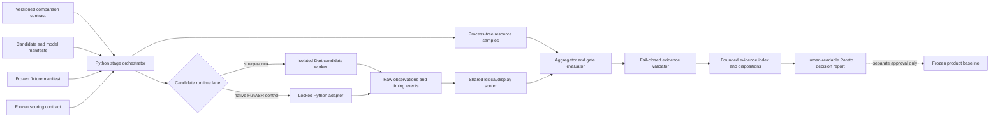
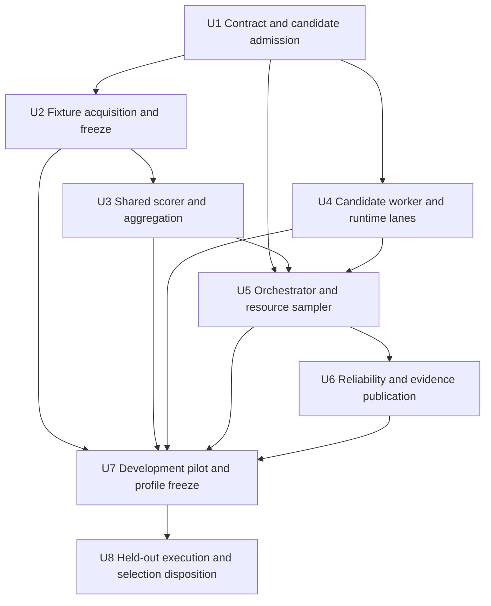

# macOS PC ASR Model Comparison and Selection Plan

## Summary

Build a parallel, versioned macOS ASR comparison system around isolated candidate
workers, frozen fixture and scoring contracts, and a staged runner. The system
will rerun every sherpa-onnx candidate on the Apple M2 reference target with both
documented and fixed-resource profiles, run native FunASR only as the specified
short cross-runtime control, then publish bounded evidence and a conservative
selection disposition without changing the existing product baseline
automatically.

---

## Problem Frame

The current desktop decision is sufficient to justify the first production
engine, but it is not a broad sherpa-onnx model comparison: it uses one
repetitive five-minute fixture, a narrow CER/RTF scorecard, and a native FunASR
control. Android Paraformer results are screening context only and cannot answer
the macOS selection question.

---

## Requirements

- R1. Bind every ranked result to the exact target, runtime lane, candidate
  artifacts, effective profile, fixtures, and scoring rules; reject cross-target
  evidence.
- R2. Test the frozen Zipformer 14M baseline, exact mobile-parity Paraformer,
  one general Mandarin Paraformer, 2025 streaming Zipformer, FunASR Nano,
  FireRedASR2 CTC, and native FunASR 1.3.22 as the short-stage cross-runtime
  control.
- R3. Rank sherpa-onnx candidates only within a pinned same-runtime lane; a
  runtime upgrade requires rerunning the baseline in the new lane.
- R4. Preserve unambiguous candidate identities across native FunASR,
  sherpa-onnx Paraformer, and sherpa-onnx FunASR Nano.
- R5. Fail candidate admission before ranking when identity, hashes, licensing,
  API support, offline behavior, or smoke decode is unacceptable.
- R6. Give every sherpa-onnx candidate a model-specific `recommended` profile
  sourced from official documentation and record its complete effective config.
- R7. Give every same-runtime candidate a two-thread, concurrency-one,
  CPU/int8 `fixed-resource` core-ASR profile on identical decoded segments.
- R8. Keep core-ASR and end-to-end pipeline scorecards separate.
- R9. Permit `product-finalist` tuning only on development fixtures, and freeze
  it before any held-out result is inspected.
- R10. Freeze distinct smoke, development, held-out, and 7,200-second fixture
  roles with provenance, usage disposition, and hashes.
- R11. Cover clean Mandarin, far-field/noisy meetings, dialect/accent,
  Chinese-English code-switching, terminology/numbers, non-speech, and
  multi-segment long-form conditions, reporting both scenario and macro results.
- R12. Freeze lexical and display scoring views, including edit operations,
  exact-match, terminology, numeric, code-switch, hallucination, punctuation,
  and ITN metrics.
- R13. Separate load, cold, warm, end-to-end, tail, and streaming latency
  measurements.
- R14. Measure model and delivery footprint, temporary disk, process-tree RSS,
  retained RSS, CPU time, and thread use.
- R15. Exercise failure, two-hour completion, cancellation, descendant cleanup,
  deterministic repeat, malformed/silent input, and processing-network denial.
- R16. Use one warm-up plus five measured short repetitions with rotated order,
  preserve individual runs, and repeat a long gate near a hard limit.
- R17. Publish privacy-preserving, content-hashed, bounded JSON evidence without
  audio, voiceprints, secrets, user-home paths, or absolute paths.
- R18. Use Stage 0 admission, Stage 1 short screening, Stage 2 held-out quality,
  and Stage 3 finalist operational gates, with a terminal disposition for every
  admitted candidate.
- R19. Apply CER, RTF, and finalist memory hard gates before material-benefit and
  Pareto review; retain Zipformer 14M when no candidate provides a frozen,
  product-relevant benefit.

**Origin actors:** A1 benchmark maintainer, A2 evidence validator, A3 selection
reviewer, A4 product maintainer.

**Origin flows:** F1 candidate admission, F2 controlled and recommended quality
comparison, F3 finalist operational gate, F4 selection freeze.

**Origin acceptance examples:** AE1-AE8 are carried into the unit test and
verification scenarios below.

---

## Scope Boundaries

- This plan targets macOS on the Apple M2 arm64, 16-GiB reference machine.
  Windows needs a separate target contract and fresh evidence.
- The existing `desktop-processing/macos-first-engine-set-v1` decision,
  `desktop_benchmark_contract.json`, `desktop_model_candidates.json`, and
  product worker remain frozen while comparison v2 runs in parallel.
- The round does not reopen diarization, modify the speaker pipeline, add
  cloud/GPU-only ASR, expose model switching in UI, or add live-caption flows.
- Moonshine and SenseVoice stay deferred unless the completed first round
  demonstrates a specific uncovered product need.
- Restricted public corpora and consented internal audio remain outside Git.
  Only manifests, hashes, annotations permitted for redistribution, and bounded
  aggregates may be committed.
- A benchmark winner is a recommendation, not a production rollout. Changing
  the product model requires a separately approved and verified selection
  manifest update.

### Deferred to Follow-Up Work

- Windows validation: create a Windows-specific contract only after the macOS
  round closes.
- Product adoption: update the production worker, packaged assets, capability
  state, and product regression suite only after explicit approval of the macOS
  comparison disposition.
- Additional candidate families: admit Moonshine, SenseVoice, or Whisper-family
  models through a later contract revision rather than expanding this round.

---

## Context & Research

### Relevant Code and Patterns

- `benchmark/desktop/desktop_benchmark_contract.json` and
  `benchmark/desktop/validate_desktop_evidence.py` establish target fingerprint,
  hash binding, privacy rejection, and fail-closed validation patterns.
- `benchmark/desktop/desktop_model_candidates.json` and
  `benchmark/desktop/MACOS_ENGINE_SELECTION.md` are the frozen product decision
  artifacts that this comparison must not rewrite implicitly.
- `apps/desktop/tool/desktop_sherpa_benchmark.dart` is the current real
  Zipformer runner, but its model shape and single fixture are hard-coded.
- `apps/desktop/tool/desktop_sherpa_worker.dart` and
  `apps/desktop/lib/features/processing/native_sherpa_worker_engine.dart`
  demonstrate FFI initialization, bounded JSONL output, process-group
  cancellation, source identity checks, and explicit native-handle cleanup.
- `benchmark/desktop/run_funasr_benchmark.py` already pins the native FunASR
  environment and samples RSS, but its scoring and process sampling should be
  delegated to the new shared comparison components.
- `benchmark/evaluate_online_transducer_candidate.py` contains the strongest
  current normalization, edit-alignment, terminology, and calibration patterns;
  `benchmark/evaluate_s2_enhancement.py` already reuses part of it.
- `benchmark/desktop/environments/funasr/` supplies the locked native FunASR
  control lane and must not be treated as a sherpa-onnx candidate runtime.

### Institutional Learnings

- `docs/solutions/architecture-patterns/desktop-first-workstation-boundaries.md`
  requires target-specific evidence, hash-pinned model/runtime identities,
  worker-process isolation, bounded untrusted output, and capability exposure
  only after machine-verifiable admission.
- The existing desktop selection shows why absolute CER/RTF passes are
  insufficient: native FunASR passed both but offered no quality benefit to
  justify its startup, memory, delivery, and maintenance costs.

### External References

- [sherpa-onnx Paraformer models](https://k2-fsa.github.io/sherpa/onnx/pretrained_models/offline-paraformer/paraformer-models.html)
- [sherpa-onnx Zipformer transducer models](https://k2-fsa.github.io/sherpa/onnx/pretrained_models/online-transducer/zipformer-transducer-models.html)
- [sherpa-onnx FunASR Nano models](https://k2-fsa.github.io/sherpa/onnx/funasr-nano/pretrained.html)
- [sherpa-onnx FireRedASR models](https://k2-fsa.github.io/sherpa/onnx/FireRedAsr/pretrained.html)
- [sherpa-onnx Dart API](https://pub.dev/documentation/sherpa_onnx/latest/sherpa_onnx/)
- [AISHELL-4 corpus](https://www.aishelltech.com/aishell_4)
- [Mozilla Common Voice datasets](https://commonvoice.mozilla.org/en/datasets)
- [Mozilla Common Voice terms](https://commonvoice.mozilla.org/terms)

---

## Key Technical Decisions

- **Parallel v2 comparison namespace:** Create
  `benchmark/desktop/asr_comparison/` and a new evidence schema instead of
  extending frozen product v1 artifacts in place.
- **Pinned general Paraformer:** Use
  `sherpa-onnx-paraformer-zh-2024-03-09` with its official int8 graph as the
  first-round general Mandarin Paraformer. The registry will pin exact archive,
  component filenames, content hashes, license, and source retrieval date before
  admission.
- **Runtime lanes, not mixed rows:** Start with the locked sherpa-onnx 1.13.4
  lane. Characterize its Dart API against every candidate before asset download.
  If a required config or model is unsupported, create one explicit upgraded
  sherpa lane and rerun Zipformer 14M there; never compare across lane IDs.
- **Separate benchmark worker:** Add a benchmark-only candidate worker rather
  than generalizing the production worker during the comparison. It may reuse
  isolation and JSONL patterns, but cannot alter the shipped product engine.
- **Declarative model-family profiles:** Candidate JSON owns model roles and
  full effective configuration. The Dart worker selects only known,
  schema-validated family adapters and returns the effective config it actually
  constructed; unsupported fields fail instead of being ignored.
- **Capability-aware comparison:** Timestamp, partial-result, endpoint, hotword,
  punctuation, and ITN support are explicit candidate capabilities. Unsupported
  capabilities are reported as absent and become visible product trade-offs;
  they are not fabricated or silently treated as successful.
- **Two streaming measurement clocks:** Fixed-resource core runs feed frozen
  segments without wall-clock pacing to measure decode efficiency. A streaming
  candidate's recommended end-to-end profile additionally uses frozen chunk
  size and real-time pacing so first-partial, first-final, endpoint, queue, and
  drop metrics describe a live product path rather than fast file ingestion.
- **Hybrid fixture pack:** Use committed smoke audio, AISHELL-4 for far-field
  meeting conditions, locally downloaded Common Voice subsets for clean and
  regional-locale/accent coverage, consented dialect recordings for the
  dialect scenario, consented scripted recordings for product terms, numbers,
  and code-switching, and deterministic generated silence/noise.
- **Fixture distribution state is data:** Every fixture declares
  `committed`, `generated`, or `local_only`, plus license, consent/provenance,
  redistribution status, reference-review state, role, scenario, and hashes.
  Ranked execution fails when an expected local-only asset is absent or drifts.
- **Single frozen scorer:** Consolidate lexical/display normalization,
  alignment, terminology, numeric, punctuation, ITN, and hallucination scoring
  into one standard-library Python module with versioned rules. Candidate
  adapters emit observations, not scores.
- **Process-tree sampling:** The Python orchestrator launches exactly one
  candidate/profile/fixture worker at a time and uses `psutil` from a dedicated
  lightweight benchmark environment to sample the worker and descendants at a
  documented interval. It records sampler interval and missed/exited-process
  states and treats `/usr/bin/time` only as an optional diagnostic cross-check.
- **Frozen incremental-RSS baseline:** Capture process-tree RSS after the worker
  handshake and one settle interval, but before sherpa bindings, framework
  imports, or candidate model loading. `incremental peak RSS` is the
  non-negative difference between the run’s absolute process-tree peak and that
  frozen baseline; the combined pipeline uses the same boundary before any
  required component loads. Retained RSS is sampled after explicit unload and
  the bounded settle window.
- **Reuse the proven macOS sandbox boundary:** Launch benchmark workers through
  `/usr/bin/sandbox-exec` using the existing `SidecarRoots` and
  `SidecarSandboxProfile` policy, with distinct job/runtime/model/tool roots,
  minimal environment, denied network, and denied user-home access. Ranked
  execution fails closed when the sandbox is unavailable or its active denial
  probe does not prove enforcement.
- **Raw versus publishable evidence:** Store transcripts, per-run logs, samples,
  and temporary artifacts under `build/desktop_asr_comparison/`. Commit only
  bounded JSON evidence, a content-hashed index, and a prose decision report.
- **No opaque ranking score:** Validators apply identity and hard gates;
  aggregation computes scenario/macros and frozen material-benefit tests; the
  final report records visible Pareto trade-offs and an explicit retain/replace
  recommendation.

---

## Open Questions

### Resolved During Planning

- **Which corpus composition satisfies coverage and privacy?** Use a hybrid pack:
  AISHELL-4, local-only Common Voice subsets, consented dialect/accent and
  internal scripted fixtures, existing smoke audio, and generated non-speech.
  Raw restricted or private audio is never committed.
- **Should scoring reuse or replace existing utilities?** Extract the proven
  normalization/alignment behavior into one comparison scorer and migrate the
  native FunASR adapter to it, preventing candidate-specific CER definitions.
- **How should resource sampling work?** Sample the isolated worker process tree
  at approximately 50 ms with pinned `psutil`, record measurement boundaries and
  overhead metadata, and preserve each run for audit.
- **Should evidence schema v1 be expanded?** No. Introduce comparison v2 and bind
  its final index from a later product decision rather than mutating the frozen
  product v1 decision.

### Deferred to Implementation

- **Exact Dart API support in sherpa-onnx 1.13.4:** Characterize the resolved
  package before implementing adapters. Current official API documentation
  exposes Paraformer, FunASR Nano, and FireRed CTC config types, but the installed
  lane is authoritative.
- **Exact upgraded sherpa-onnx runtime version:** Select only if 1.13.4 fails
  candidate admission; pin the smallest supported version and form a separate
  lane.
- **Final development/held-out sample counts:** Freeze after licensed assets and
  independent reference review are available, while preserving all required
  scenarios and preventing speaker/session overlap across roles.
- **Final material-benefit margin:** Start from the origin proposal, run the
  development-only pilot, and freeze any justified adjustment before held-out
  output is decoded or inspected.
- **Whether a finalist requires end-to-end punctuation/ITN helpers outside its
  archive:** Resolve from official candidate manifests; any extra component is
  part of that candidate’s delivery and resource cost.

---

## Output Structure

    benchmark/desktop/asr_comparison/
    ├── README.md
    ├── macos_contract.json
    ├── candidates.json
    ├── fixtures.json
    ├── scoring_contract.json
    ├── validate_contract.py
    ├── prepare_assets.py
    ├── prepare_fixtures.py
    ├── asr_scoring.py
    ├── aggregate_results.py
    ├── resource_sampler.py
    ├── run_macos_asr_comparison.py
    ├── native_funasr_adapter.py
    ├── environment/
    │   ├── pyproject.toml
    │   └── uv.lock
    ├── fixtures/
    │   ├── README.md
    │   ├── internal_script_dialect_accent.md
    │   ├── internal_script_zh_en.md
    │   └── internal_script_terms_numbers.md
    └── test_*.py
    benchmark/desktop/evidence/macos-asr-comparison-v2/
    ├── index.json
    ├── dispositions.json
    └── aggregate/
    apps/desktop/tool/asr_benchmark/
    ├── candidate_registry.dart
    ├── effective_profile.dart
    └── sandboxed_candidate_launcher.dart
    apps/desktop/tool/desktop_asr_candidate_worker.dart
    apps/desktop/test/desktop_asr_candidate_worker_test.dart
    apps/desktop/test/sandboxed_asr_candidate_launcher_test.dart
    build/desktop_asr_comparison/
    ├── assets/
    ├── fixtures/
    ├── raw/
    ├── runs/
    └── staging/

---

## High-Level Technical Design

> This diagram is directional guidance for execution and review. It describes
> ownership and data flow, not implementation syntax.

### Implementation dependency graph

---

## Implementation Units

### U1. Establish the comparison v2 contract and candidate registry

**Goal:** Define fail-closed schemas for candidate admission, runtime lanes,
profiles, stages, evidence, and terminal dispositions without changing the
frozen product decision.

**Requirements:** R1-R9, R16-R19; F1, F4; AE1-AE3, AE5, AE7-AE8.

**Dependencies:** None.

**Files:**

- Create: `benchmark/desktop/asr_comparison/README.md`
- Create: `benchmark/desktop/asr_comparison/macos_contract.json`
- Create: `benchmark/desktop/asr_comparison/candidates.json`
- Create: `benchmark/desktop/asr_comparison/scoring_contract.json`
- Create: `benchmark/desktop/asr_comparison/validate_contract.py`
- Create: `benchmark/desktop/asr_comparison/test_validate_contract.py`
- Modify: `benchmark/desktop/README.md`

**Approach:**

- Version the comparison independently of the existing v1 product contract and
  give every artifact a content hash used by downstream evidence.
- Register all seven first-round identities, with native FunASR explicitly
  marked `cross_runtime_control` and limited to the short comparison stage.
- Pin `sherpa-onnx-paraformer-zh-2024-03-09` as the general Mandarin
  Paraformer; admission still requires exact archive/component hashes and
  acceptable license disposition.
- Model a runtime lane as a first-class identity. The registry must require a
  baseline member in every rankable sherpa lane and forbid aggregates that mix
  lanes.
- Represent `recommended`, `fixed-resource`, and `product-finalist` profile
  semantics explicitly. Record official source URL/retrieval date and every
  effective field, including not-applicable controls.
- Require declared output capabilities and, for streaming recommended profiles,
  freeze chunk duration, pacing policy, endpoint policy, and the clock used for
  each latency metric.
- Encode stage transition and disposition reason enums so every admitted
  candidate ends in a machine-readable terminal state.
- Keep the initial absolute gates and proposed materiality rule in the contract,
  with an explicit development-pilot freeze state before Stage 2 can start.
- Make validators reject unknown keys where silent drift would affect ranking,
  while allowing versioned diagnostic extensions in a bounded namespace.

**Execution note:** Implement validators and failing schema fixtures before
creating accepted manifests.

**Patterns to follow:**

- `benchmark/desktop/validate_desktop_evidence.py`
- `benchmark/desktop/validate_desktop_candidates.py`
- `benchmark/desktop/desktop_benchmark_contract.json`

**Test scenarios:**

- Happy path: all required candidate, lane, profile, gate, and source fields are
  present and hash-pinned -> contract validation succeeds.
- Covers AE1: an Android Paraformer result is referenced by a macOS ranking lane
  -> validation rejects it as screening-only context.
- Covers AE2: FunASR Nano is admitted only in an upgraded lane without a
  same-lane Zipformer baseline -> validation rejects the lane.
- Covers AE3: Paraformer and FunASR Nano recommended profiles carry different
  documented controls while fixed-resource invariants match -> both validate.
- Covers AE5: held-out evidence refers to a profile revision created after
  held-out inspection began -> evidence is invalidated.
- Covers AE7: a candidate exceeds a hard memory limit -> its state cannot
  advance to Pareto review.
- Covers AE8: no candidate meets the frozen material-benefit rule -> the only
  valid round outcome retains Zipformer 14M.
- Error path: ambiguous IDs such as `funasr` or `paraformer`, missing content
  hashes, unreviewed license, online-only inference, or unsupported API state
  enter a terminal Stage 0 rejection rather than a score table.

**Verification:**

- A reviewer can determine the complete first-round matrix and stage rules from
  JSON without consulting prose.
- Existing v1 contract, product candidate registry, and product selection
  document remain byte-for-byte unchanged.

---

### U2. Build and freeze the licensed fixture pack

**Goal:** Produce disjoint smoke, development, held-out, and two-hour fixture
sets with scenario coverage, reviewed references, provenance, distribution
rules, and stable hashes.

**Requirements:** R10-R11, R17; F2; AE5.

**Dependencies:** U1.

**Files:**

- Create: `benchmark/desktop/asr_comparison/fixtures.json`
- Create: `benchmark/desktop/asr_comparison/prepare_fixtures.py`
- Create: `benchmark/desktop/asr_comparison/test_prepare_fixtures.py`
- Create: `benchmark/desktop/asr_comparison/fixtures/README.md`
- Create: `benchmark/desktop/asr_comparison/fixtures/internal_script_dialect_accent.md`
- Create: `benchmark/desktop/asr_comparison/fixtures/internal_script_zh_en.md`
- Create: `benchmark/desktop/asr_comparison/fixtures/internal_script_terms_numbers.md`
- Modify: `.gitignore`

**Approach:**

- Define an immutable fixture entry with role, scenario, session/speaker group,
  duration, audio/reference hashes, source, license or consent basis,
  redistribution status, normalization notes, and reference-review state.
- Use the existing `benchmark/audio/zh.wav` and official model sample audio for
  smoke or development only; the repetitive five-minute fixture cannot be the
  held-out ranking corpus.
- Prepare a reproducible AISHELL-4 subset for far-field/noisy meetings and
  multi-speaker long form. Keep downloaded audio local even where licensing
  allows redistribution, minimizing repository size and privacy exposure.
- Prepare deterministic local-only Common Voice subsets for clean and
  regional-locale/accent coverage, respecting the dataset’s current
  non-rehosting condition. Do not label a locale as a dialect without
  source-provided or independently reviewed speech-variety metadata.
- Record a consented dialect/accent held-out set with speakers who can
  self-identify the represented variety. Include Sichuan/Chongqing speech so the
  mobile-parity model is tested on its target condition, plus at least one
  non-target regional accent so the scenario cannot be won only through target
  specialization. Keep speakers and recording sessions disjoint from
  development and independently review the references and variety labels.
- Record consented internal scripts for code-switching, product terminology,
  numeric expressions, dates, times, percentages, and units. Assign speakers or
  recording sessions wholly to development or held-out roles.
- Generate deterministic silence, music-like tones, bounded noise, corrupt,
  short, and malformed fixtures without downloading third-party audio.
- Create the 7,200-second finalist fixture as a fixed local-only meeting asset,
  not by naively repeating the five-minute benchmark. Its source and reference
  must be independently reviewed before the hash is frozen.
- Make preparation idempotent and staged: verify archives and expected members,
  decode to the contract PCM format, verify hashes, then atomically activate the
  fixture pack. Never print or persist user-home paths in publishable output.

**Execution note:** Freeze role assignment and hashes before any held-out
candidate output is produced.

**Patterns to follow:**

- `benchmark/desktop/prepare_macos_benchmark_assets.sh`
- `benchmark/desktop/validate_desktop_evidence.py` private-payload rejection
- `benchmark/audio/` committed smoke-fixture convention

**Test scenarios:**

- Happy path: all locally available source archives match their pinned
  identities -> preparation yields the exact manifest hashes and PCM metadata.
- Edge case: a speaker/session appears in both development and held-out roles ->
  preparation rejects the split.
- Edge case: scenario totals are unbalanced but all minimums pass -> manifest
  remains valid and downstream macro aggregation prevents duration weighting.
- Error path: local-only asset is absent, reference is unreviewed, license or
  consent is missing, decoded sample rate/channels differ, or a hash drifts ->
  ranked preparation stops before activation.
- Coverage path: the dialect/accent scenario contains only model-vendor samples,
  unverified locale labels, or development speakers -> held-out freeze fails.
- Privacy path: a fixture entry or generated report contains an absolute path,
  raw audio payload, speaker identity, or private meeting label -> validation
  rejects publication.
- Covers AE5: changing a held-out reference or role after the scoring freeze ->
  requires a new contract revision and invalidates prior held-out evidence.

**Verification:**

- Every required scenario has a frozen development and/or held-out role as
  declared by the contract, and roles have no speaker/session leakage.
- A clean checkout without restricted audio can still validate manifests and
  run generated/committed smoke fixtures, while ranked runs fail clearly until
  local-only assets are provisioned.

---

### U3. Consolidate scoring, aggregation, and material-benefit evaluation

**Goal:** Ensure every adapter is judged by one versioned lexical/display
scorer, with scenario macros, run dispersion, and transparent gate outcomes.

**Requirements:** R8, R11-R12, R16-R19; F2, F4; AE4, AE6-AE8.

**Dependencies:** U1, U2.

**Files:**

- Create: `benchmark/desktop/asr_comparison/asr_scoring.py`
- Create: `benchmark/desktop/asr_comparison/aggregate_results.py`
- Create: `benchmark/desktop/asr_comparison/test_asr_scoring.py`
- Create: `benchmark/desktop/asr_comparison/test_aggregate_results.py`
- Modify: `benchmark/desktop/run_funasr_benchmark.py`
- Modify: `benchmark/evaluate_online_transducer_candidate.py`
- Modify: `benchmark/test_evaluate_online_transducer_candidate.py`

**Approach:**

- Extract Unicode NFKC, Latin case folding, whitespace handling, punctuation
  exclusion, edit alignment, and terminology helpers into the comparison scorer
  without introducing a second normalization definition.
- Preserve lexical and display views separately. Lexical alignment produces
  CER/WER as appropriate, substitutions/deletions/insertions, and exact
  utterance rate; display scoring produces punctuation precision/recall/F1 and
  ITN event accuracy.
- Represent terminology and numeric references as annotated events so recall
  and rendering accuracy are measured independently from raw character edit
  distance.
- Report code-switch results at both Chinese character and normalized English
  token views, plus a combined event summary. Do not collapse them into a
  language-ambiguous WER.
- Score non-speech hallucination as emitted lexical characters per input minute,
  retaining individual fixture results and generative-candidate variance.
- Aggregate first per fixture/run, then per scenario, then macro across
  scenarios. Never weight the final selection macro by raw duration or
  utterance count.
- Preserve one warm-up marker and every measured repeat. Report median, P95
  where meaningful, dispersion, and candidate/profile order metadata.
- Apply hard gates before computing material-benefit qualification. Produce a
  structured Pareto input table, not a weighted winner.
- Migrate the existing native FunASR comparison to emit raw observations for the
  shared scorer; retain its historical v1 evidence unchanged.

**Execution note:** Add golden alignment and bilingual normalization tests
before migrating the existing evaluators.

**Patterns to follow:**

- `benchmark/evaluate_online_transducer_candidate.py`
- `benchmark/evaluate_s2_enhancement.py`
- `benchmark/desktop/evaluate_asr.py`

**Test scenarios:**

- Happy path: mixed Chinese/English text with case, spacing, and punctuation
  variation -> lexical scoring ignores display-only differences while display
  scoring records them.
- Covers AE4: punctuation and ITN improve product-visible text but mask a number
  recognition error -> lexical error remains and display metrics score the
  rendering separately.
- Edge case: an empty reference, empty hypothesis, zero-duration non-speech
  sample, or non-finite metric -> scoring fails with a bounded reason rather
  than division errors or NaN evidence.
- Edge case: one long clean subset contains most characters -> macro scenario
  result gives it one scenario weight, not dataset-volume dominance.
- Covers AE6: five seeded FunASR Nano runs differ on silence or speech ->
  variance and hallucination fields remain visible even if aggregate CER passes.
- Covers AE7: terminology gain passes materiality but RSS fails -> aggregator
  records hard rejection before Pareto eligibility.
- Covers AE8: all candidates pass absolute gates but miss the preregistered
  relative gain -> disposition is `retain_baseline_no_material_benefit`.
- Regression path: existing online-transducer evaluator fixtures retain their
  expected normalization and alignment results after helper extraction.

**Verification:**

- The same observation produces identical scores regardless of candidate
  adapter.
- All required lexical, display, scenario, repetition, hard-gate, and
  materiality fields are reproducible from raw observations and the frozen
  scoring contract.

---

### U4. Add model-family workers and characterize runtime lanes

**Goal:** Decode each sherpa-onnx candidate through a bounded isolated worker
that constructs and reports its exact model-specific profile, while keeping the
production worker unchanged.

**Requirements:** R2-R9, R13, R15; F1-F3; AE2-AE3, AE6.

**Dependencies:** U1.

**Files:**

- Create: `apps/desktop/tool/asr_benchmark/candidate_registry.dart`
- Create: `apps/desktop/tool/asr_benchmark/effective_profile.dart`
- Create: `apps/desktop/tool/desktop_asr_candidate_worker.dart`
- Create: `apps/desktop/test/desktop_asr_candidate_worker_test.dart`
- Create: `benchmark/desktop/asr_comparison/prepare_assets.py`
- Create: `benchmark/desktop/asr_comparison/test_prepare_assets.py`

**Approach:**

- First resolve and inspect sherpa-onnx 1.13.4’s actual Dart API, then write
  characterization tests for Zipformer, Paraformer, FunASR Nano, and FireRed CTC
  config construction. The installed package API wins over newer online docs.
- If 1.13.4 cannot represent a required candidate, record `API_UNSUPPORTED` in
  that lane, select a minimally newer pinned runtime, and characterize all
  rankable sherpa candidates plus the Zipformer baseline in the upgraded lane.
- Use an allowlisted family discriminator with validated model roles. Reject
  missing/extra model files and config keys rather than guessing defaults.
- Construct each recommended profile from the official example, including
  prompt, language, ITN, hotword, seed, decoding, endpoint/VAD, and generation
  controls where applicable. Construct the fixed-resource profile only with
  shared controls that the family supports; record others as not applicable.
- Stream bounded JSONL observations: handshake, effective config, model-load
  completion, partial/final timing events where supported, transcript,
  timestamps, completion, and typed error. Keep raw transcript outside
  publishable evidence.
- Accept only validated 16-kHz mono PCM or frozen segments with a verified
  source hash. Bound input duration, output bytes, token/timestamp counts, and
  diagnostic strings.
- Always free streams and recognizers, and make seeded/generative behavior
  explicit. For retained-RSS measurement, emit unload start/completion and remain
  alive for a short contract-bounded settle window after handles are freed. The
  orchestrator owns process termination if cleanup or the settle window stalls.
- Provision models into the build cache using pinned source URL, archive hash,
  extracted tree hash, license disposition, and expected files. Do not add
  candidate models to Flutter assets.

**Execution note:** Characterization-first; do not upgrade the runtime or write
all adapters until the resolved API surface is proven.

**Patterns to follow:**

- `apps/desktop/tool/desktop_sherpa_worker.dart`
- `apps/desktop/lib/features/processing/native_sherpa_worker_engine.dart`
- `apps/desktop/test/native_sherpa_worker_engine_test.dart`
- `benchmark/desktop/prepare_macos_benchmark_assets.sh`

**Test scenarios:**

- Happy path: each family receives a valid recommended manifest -> the worker
  returns a matching effective config and bounded observation stream.
- Covers AE2: FunASR Nano lacks support in lane 1.13.4 -> it cannot be ranked
  there; an upgraded lane must include a freshly decoded Zipformer baseline.
- Covers AE3: fixed-resource Paraformer and FunASR Nano use two threads and the
  same segments while retaining family-specific not-applicable fields.
- Error path: unknown family, absent tokens/model component, archive drift,
  unacceptable license, unsupported provider, or unrecognized config key ->
  smoke admission fails without inference.
- Error path: worker emits oversized JSON, malformed timestamps, a non-finite
  timing, empty speech output, or stale source hash -> orchestrator-facing
  envelope is rejected.
- Capability path: a general Paraformer without timestamps completes decode ->
  evidence records timestamp support as absent rather than fabricating offsets
  or failing an unrelated lexical-quality gate.
- Covers AE6: a frozen seed and identical input are supplied to a generative
  candidate -> the worker reports the seed and preserves each transcript for
  determinism scoring.
- Cleanup path: successful, failed, and cancelled decodes all release native
  handles and exit without descendant processes.

**Verification:**

- Every admitted candidate completes offline smoke decode and publishes the
  exact effective config that matches its frozen profile.
- The production worker and current product model behavior remain unchanged.

---

### U5. Implement staged orchestration and process-tree resource measurement

**Goal:** Run the matrix reproducibly with isolated processes, fair ordering,
precise measurement boundaries, resumable raw results, and no accidental
cross-lane aggregation.

**Requirements:** R1, R3, R7-R8, R13-R16, R18; F2-F3.

**Dependencies:** U1, U3, U4.

**Files:**

- Create: `benchmark/desktop/asr_comparison/resource_sampler.py`
- Create: `benchmark/desktop/asr_comparison/run_macos_asr_comparison.py`
- Create: `benchmark/desktop/asr_comparison/native_funasr_adapter.py`
- Create: `benchmark/desktop/asr_comparison/test_resource_sampler.py`
- Create: `benchmark/desktop/asr_comparison/test_run_macos_asr_comparison.py`
- Create: `benchmark/desktop/asr_comparison/environment/pyproject.toml`
- Create: `benchmark/desktop/asr_comparison/environment/uv.lock`
- Create: `apps/desktop/tool/asr_benchmark/sandboxed_candidate_launcher.dart`
- Create: `apps/desktop/test/sandboxed_asr_candidate_launcher_test.dart`

**Approach:**

- Drive Stage 0-3 from the contract, never from ad hoc command arguments that
  alter rank-affecting settings.
- Launch one candidate/profile/fixture repetition per fresh process through a
  benchmark Dart launcher that reuses `SidecarRoots` and
  `SidecarSandboxProfile`, then enters the existing process-group launcher.
  Require `/usr/bin/sandbox-exec`, distinct allowlisted roots, processing
  network denial, user-home denial, and a minimal explicit environment.
- Before any ranked decode, run an active sandbox probe that attempts an
  outbound connection and access outside the allowlisted roots. A connection
  refusal alone does not prove denial; only a permission-denied sandbox result
  admits the target for ranked execution.
- Rotate candidate/profile order deterministically from the contract seed.
  Schedule one unmeasured warm-up and five measured short repetitions, keeping
  cold and warm runs separate.
- Feed fixed-resource segments as fast as the worker accepts them for decode-only
  RTF. For streaming recommended profiles, replay chunks against the frozen
  audio clock and record queue/drop behavior so live latencies are not confused
  with batch throughput.
- Record explicit timestamps for process spawn, runtime binding, model load,
  first input, first partial, first final, completion, and teardown. Compute
  timing metrics only from the declared boundaries.
- Sample the root worker and descendants at the contract interval, collecting
  absolute/incremental peak RSS, retained RSS, CPU time, observed process/thread
  counts, and temporary-disk peak. Preserve sampler diagnostics when processes
  exit between samples.
- Freeze the RSS baseline at the worker’s pre-runtime handshake after one
  sampling settle interval. Subtract that full process-tree value from the
  absolute peak for incremental RSS, use the same pre-component boundary for
  the combined pipeline, and sample retained RSS only after the worker’s
  explicit unload-complete event and settle window.
- Pin only lightweight orchestration dependencies in the comparison
  environment. Keep the existing FunASR environment lock unchanged and launch
  that adapter through its own interpreter/runtime identity.
- Measure archive, extracted, and runtime/package deltas from pinned manifests,
  not directory estimates that include unrelated cache content.
- Treat native FunASR as a locked adapter with its own runtime identity. Limit it
  to the short stage and score it through U3; never insert it into a
  same-runtime sherpa ranking lane.
- Write each run atomically under `build/desktop_asr_comparison/runs/` with a
  deterministic run ID. Resume only complete, hash-valid runs; quarantine
  partial or contract-mismatched output.
- Propagate typed timeout, crash, OOM, cancel, output-bound, missing-fixture,
  and network violations into dispositions without publishing partial aggregate
  results.

**Execution note:** Start with fake workers that model fast success, descendant
memory, timeout, malformed output, and TERM-resistant cancellation before real
model execution.

**Patterns to follow:**

- `benchmark/desktop/run_funasr_benchmark.py`
- `benchmark/desktop/run_cancellation_probe.py`
- `apps/desktop/lib/features/processing/native_sherpa_worker_engine.dart`
- `apps/desktop/lib/features/processing/sidecar/sidecar_sandbox.dart`
- `apps/desktop/test/sidecar_sandbox_test.dart`
- `apps/desktop/tool/native_process_group_launcher.c`

**Test scenarios:**

- Happy path: a fake two-candidate lane completes rotated warm-up plus five
  repetitions -> every run is preserved and aggregates exclude warm-up.
- Edge case: root worker spawns a memory-consuming child -> peak process-tree
  RSS includes the child and records observed descendants.
- Measurement path: a fake worker reports a stable pre-runtime handshake, then
  loads memory in a child -> absolute peak, frozen baseline, and incremental
  peak match the process-tree definition and never become negative.
- Integration: a streaming worker receives real-time-paced chunks -> first
  partial/final and endpoint latencies use the audio clock, while its separate
  decode-only RTF remains unpaced.
- Integration: a worker frees its model and enters the settle window -> retained
  RSS is sampled after unload and before process exit.
- Edge case: a child exits between samples -> sampler remains finite and reports
  the observation gap instead of crashing.
- Error path: interrupted run leaves staging output -> resume quarantines it and
  reruns without treating it as evidence.
- Error path: runtime, fixture, scoring, profile, or worker hash changes ->
  prior run IDs cannot be reused.
- Integration: native FunASR and sherpa workers emit the common observation
  envelope -> both reach the shared scorer, but only sherpa results enter
  same-runtime ranking.
- Integration: processing network is denied after assets are provisioned ->
  the active sandbox probe proves permission denial and admitted candidates
  finish without external access.
- Error path: `sandbox-exec` is unavailable, roots overlap, a path escapes, or
  the active denial probe can access network/user-home data -> ranked execution
  fails before candidate inference.
- Cancellation: a TERM-resistant worker with descendants is cancelled -> the
  entire process group exits within the contract limit and no aggregate appears.

**Verification:**

- A repeated short matrix produces deterministic run identities, complete
  per-run measurements, and the same schedule from the frozen seed.
- Cold, warm, core-ASR, end-to-end, native-control, and sherpa-lane observations
  cannot be pooled accidentally.

---

### U6. Validate reliability probes and bounded evidence publication

**Goal:** Prove cancellation, cleanup, determinism, offline operation, long-run
behavior, and privacy-safe evidence before the ranked pilot begins.

**Requirements:** R13-R18; F3; AE6.

**Dependencies:** U5.

**Files:**

- Create: `benchmark/desktop/asr_comparison/validate_evidence.py`
- Create: `benchmark/desktop/asr_comparison/test_validate_evidence.py`
- Create: `benchmark/desktop/asr_comparison/test_reliability_probes.py`
- Create: `benchmark/desktop/evidence/macos-asr-comparison-v2/README.md`

**Approach:**

- Define raw run, aggregate, index, and disposition schemas with size, count,
  nesting, string, and diagnostic bounds.
- Bind every publishable object to contract, target, lane/runtime, worker,
  model/component, profile, fixture/reference, scorer, and raw-output hashes.
- Reject audio/PCM, embeddings/voiceprints, transcript text, secrets,
  user-home/absolute paths, non-finite values, and undeclared diagnostic payloads
  from the committed evidence set.
- Add fake and smoke reliability probes for crash, timeout, simulated OOM,
  empty output, malformed/short/silent input, deterministic repeats,
  cancellation, descendant termination, temporary cleanup, and atomic
  publication.
- Exercise real offline smoke decoding with processing network denied before
  Stage 1. Provisioning remains a separate, explicit network-enabled phase.
- Make the two-hour runner repeat automatically only when a hard measured
  metric lands within 10% of its limit, and keep both runs if repeated.
- Build the content-hashed evidence index only after all referenced files pass
  validation; publication uses staging plus atomic activation.

**Execution note:** Security and failure-path tests precede creation of the
publishable evidence directory.

**Patterns to follow:**

- `benchmark/desktop/validate_desktop_evidence.py`
- `benchmark/desktop/validate_cancellation_probe.py`
- `benchmark/desktop/test_validate_desktop_evidence.py`

**Test scenarios:**

- Happy path: a complete bounded evidence tree with matching hashes -> index
  validates and activates atomically.
- Privacy path: evidence includes transcript text, PCM, embedding, absolute
  path, secret-shaped field, or private label -> publication is rejected.
- Error path: missing run, mismatched raw-output hash, duplicate run ID,
  non-finite metric, oversized list/string, or unknown stage disposition ->
  index validation fails.
- Cancellation path: a cancelled candidate leaves raw staging files -> no
  aggregate or index references them and cleanup completes.
- Covers AE6: repeated seeded generative runs include determinism and
  hallucination observations -> evidence validator requires both fields.
- Long-run boundary: a hard metric is 9% from its limit -> a repeat is required;
  11% away -> one passing two-hour run is sufficient.

**Verification:**

- The publishable evidence tree contains enough hashes and metrics to reproduce
  every decision while containing no raw speech or transcript content.
- Reliability failures are terminal and machine-readable, not silently omitted
  candidates.

---

### U7. Execute the development pilot and freeze the ranked round

**Goal:** Complete Stage 0 and the development-only pilot, admit the feasible
candidate/runtime lanes, freeze profiles and materiality rules, and prove the
full short-run pipeline before held-out decoding.

**Requirements:** R2-R9, R16, R18-R19; F1-F2; AE1-AE3, AE5-AE6.

**Dependencies:** U2-U6.

**Files:**

- Modify: `benchmark/desktop/asr_comparison/macos_contract.json`
- Modify: `benchmark/desktop/asr_comparison/candidates.json`
- Modify: `benchmark/desktop/asr_comparison/fixtures.json`
- Create: `benchmark/desktop/evidence/macos-asr-comparison-v2/development-freeze.json`
- Create: `benchmark/desktop/asr_comparison/DEVELOPMENT_PILOT.md`

**Approach:**

- Provision and hash every candidate, license notice, runtime lane, and local
  fixture before smoke admission. Record terminal rejection reasons for any
  missing API, invalid artifact, license, offline, or smoke failure.
- Run the exact mobile-parity Paraformer again on macOS; retain Android evidence
  only as linked screening context.
- If the current runtime cannot admit all candidates, establish the minimum
  upgraded sherpa lane and rerun the Zipformer baseline plus every candidate
  ranked in that lane.
- Run development fixtures under recommended and fixed-resource profiles to
  validate configuration semantics, measurement stability, scenario coverage,
  and obvious hallucination/resource failure.
- Use only development results to confirm or revise the initial materiality
  margins. Record rationale and freeze the margin, profile revisions, scoring
  revision, fixture roles, scheduling seed, and candidate lanes before any
  held-out transcript is decoded.
- Run a sealed-transition check: once `development-freeze.json` is published,
  any rank-affecting change requires a new comparison contract revision rather
  than editing the active round.
- Treat native FunASR as a historical Stage 1 row using the existing locked
  environment; do not promote it to Stage 2/3 or infer that its previous
  five-minute result substitutes for the new PC suite.

**Execution note:** This is the first unit that executes real candidate
measurements; keep held-out references inaccessible to the operator until the
freeze validates.

**Patterns to follow:**

- `benchmark/desktop/evidence/macos-sherpa-1.13.4/`
- `benchmark/desktop/evidence/macos/funasr-paraformer.json`
- `benchmark/desktop/MACOS_ENGINE_SELECTION.md` disposition rationale

**Test scenarios:**

- Covers AE1: mobile-parity Paraformer has Android results -> macOS admission
  still requires a fresh target-bound smoke and development run.
- Covers AE2: an upgraded runtime lane is necessary -> every rankable row,
  including Zipformer 14M, is regenerated in that lane.
- Covers AE3: recommended and fixed-resource profiles complete -> evidence
  records both official family settings and shared resource invariants.
- Covers AE5: an operator changes a profile or reference after freeze -> held-out
  execution refuses to start under the existing contract revision.
- Covers AE6: FunASR Nano repeats show unstable output or silence hallucination
  -> the pilot records it and may terminate the candidate before Stage 2.
- Error path: a candidate cannot be provisioned or decoded offline -> it receives
  a terminal Stage 0 disposition and does not disappear from the round.
- Integration: every surviving candidate completes one full development matrix
  through observation, scoring, aggregation, validation, and bounded evidence
  publication.

**Verification:**

- `development-freeze.json` binds all rank-affecting inputs and passes
  validation before held-out audio is decoded.
- Every registered candidate is either admitted to the next stage or has an
  explicit terminal reason.

---

### U8. Run held-out and finalist gates and publish the selection disposition

**Goal:** Execute the frozen Stage 1-3 matrix, apply hard and material-benefit
gates, and publish a defensible recommendation to retain or replace the
Zipformer 14M baseline.

**Requirements:** R1-R19; F2-F4; AE4-AE8.

**Dependencies:** U7.

**Files:**

- Create: `benchmark/desktop/evidence/macos-asr-comparison-v2/index.json`
- Create: `benchmark/desktop/evidence/macos-asr-comparison-v2/dispositions.json`
- Create: `benchmark/desktop/evidence/macos-asr-comparison-v2/aggregate/`
- Create: `benchmark/desktop/MACOS_ASR_COMPARISON.md`
- Create: `benchmark/desktop/asr_comparison/test_final_disposition.py`
- Modify: `benchmark/desktop/README.md`

**Approach:**

- Run Stage 1 short fixed-resource and recommended profiles in the frozen,
  rotated order; terminate candidates with clear absolute quality,
  hallucination, RTF, memory, or reliability failures.
- Run the full held-out scenario suite for Stage 2 survivors without changing
  candidate, profile, scoring, fixture, or materiality revisions.
- Promote only candidates that pass hard gates and the preregistered
  product-relevant benefit rule. Report per-scenario metrics so a gain in one
  condition cannot hide a prohibited clean-Mandarin regression.
- Tune `product-finalist` profiles only on development fixtures, freeze a new
  finalist profile revision, and rerun the held-out/finalist comparison under
  that sealed revision where the contract requires confirmation.
- Run Stage 3 cold/warm/tail, footprint, process-tree memory, cancellation,
  determinism, offline, cleanup, and 7,200-second probes only for promoted
  candidates. Repeat the long probe when required by the near-limit rule.
- Apply hard gates before Pareto review. The report compares quality, latency,
  memory, archive/extracted/package/temp footprint, timestamp/streaming
  capability, reliability, and delivery complexity without producing a hidden
  composite score.
- Publish one terminal disposition per candidate, the validated content-hashed
  evidence index, and a prose recommendation. If no candidate has material
  benefit, explicitly retain Zipformer 14M.
- Do not modify `desktop_model_candidates.json`,
  `MACOS_ENGINE_SELECTION.md`, product assets, or the production worker. List
  those as a separately approved adoption step only if replacement is
  recommended.

**Execution note:** Treat the frozen held-out run as append-only. Any
rank-affecting correction creates a new contract revision and complete rerun.

**Patterns to follow:**

- `benchmark/desktop/validate_macos_engine_selection.py`
- `benchmark/desktop/MACOS_ENGINE_SELECTION.md`
- `benchmark/desktop/evidence/macos-sherpa-1.13.4/index.json`

**Test scenarios:**

- Happy path: one candidate passes hard, materiality, and operational gates ->
  disposition identifies it as a replacement recommendation with all evidence
  hashes and Pareto trade-offs.
- Covers AE4: a pipeline improves punctuation/ITN while lexical recognition is
  unchanged -> report credits display quality only.
- Covers AE6: seeded generative runs vary or hallucinate -> variance remains in
  the final scorecard and can trigger a reliability disposition.
- Covers AE7: a candidate gains 12 percentage points on terms/numbers but uses
  more than 2 GiB incremental ASR RSS -> it is rejected before Pareto review.
- Covers AE8: every candidate passes absolute gates but none meets materiality ->
  final recommendation retains Zipformer 14M.
- Edge case: two finalists are non-dominated on different axes -> report records
  the trade-off and conservative recommendation, not an invented weighted tie
  breaker.
- Error path: any referenced evidence fails validation or any candidate lacks a
  terminal disposition -> the round cannot publish a final index.
- Invariant: final comparison recommends replacement -> frozen product v1 files
  remain unchanged until a separate adoption decision.

**Verification:**

- Every candidate has a validated terminal disposition and every report number
  is traceable to a bounded evidence object and raw-output hash.
- The selected outcome either demonstrates the frozen material benefit within
  all hard limits or explicitly retains Zipformer 14M.

---

## System-Wide Impact

- **Interaction graph:** Comparison JSON drives asset/fixture preparation,
  isolated workers, scoring, aggregation, evidence validation, and reporting.
  No product callback or UI path consumes intermediate benchmark state.
- **Error propagation:** Typed admission and run failures move from workers to
  the orchestrator and into terminal dispositions. Invalid or partial artifacts
  block aggregation and final publication.
- **State lifecycle risks:** Downloads, decoded fixtures, raw results, and
  evidence use staging plus hash verification and atomic activation. Resumes
  reuse only complete, contract-matching run IDs.
- **API surface parity:** Every sherpa model family gets an explicit adapter;
  native FunASR implements the common observation envelope but remains outside
  sherpa runtime ranking.
- **Integration coverage:** Real smoke and development runs must cross asset
  provisioning, worker isolation, process-tree sampling, scoring, validation,
  and evidence publication before held-out execution.
- **Unchanged invariants:** Current mobile ASR behavior, product Zipformer
  worker, diarization selection, packaged assets, capability flags, and frozen
  macOS engine-selection v1 remain unchanged.

---

## Alternative Approaches Considered

- **Extend the current desktop v1 contract in place:** Rejected because it would
  reinterpret frozen product evidence and couple exploratory comparison schema
  changes to the active production selection.
- **Generalize the production Sherpa worker first:** Rejected because the
  comparison needs model-family experimentation while product behavior must
  remain stable. A benchmark-only worker contains the blast radius.
- **One universal configuration for every model:** Rejected because model
  families have different valid controls and this can handicap candidates.
- **Recommended settings only:** Rejected because differing thread, VAD, and
  pipeline allocations would confound core efficiency.
- **A single end-to-end scorecard:** Rejected because it would credit VAD,
  punctuation, ITN, or prompting behavior to the recognizer.
- **Commit a complete public corpus to Git:** Rejected due repository size,
  Common Voice rehosting restrictions, and the preference to minimize retained
  speech data.
- **Send every candidate through the two-hour gate:** Rejected because long
  operational tests add cost without value for models already eliminated by
  compatibility, quality, hallucination, or resource gates.
- **Choose a winner with a weighted total:** Rejected because weights can hide
  hard failures and obscure the actual product trade-off.

---

## Success Metrics

- Another maintainer on the same reference target can reproduce an accepted
  evidence package from the frozen contract and locally provisioned fixtures.
- All seven first-round candidates receive a machine-readable macOS disposition;
  no Android or cross-runtime result is silently promoted into a sherpa lane.
- Every admitted sherpa candidate has both recommended and fixed-resource
  evidence with the actual effective configuration recorded.
- The final report includes all required accuracy, display, latency, resource,
  reliability, footprint, and scenario metrics with raw-output hash traceability.
- No restricted audio, private meeting text, voiceprint, secret, user-home path,
  or absolute filesystem path enters committed evidence.
- The result recommends a replacement only when it passes hard gates and
  preregistered materiality; otherwise it explicitly retains Zipformer 14M.

---

## Risks & Dependencies

| Risk | Mitigation |
|------|------------|
| sherpa-onnx 1.13.4 lacks one or more required Dart config types | Characterize first; create a separate upgraded lane and rerun its baseline rather than mixing versions. |
| Public corpora do not cover product terminology and code-switching | Add consented scripted recordings with independent references and disjoint development/held-out sessions. |
| Corpus licensing or rehosting terms change | Pin retrieval date and terms reference, store restricted data locally, and revalidate disposition before ranked execution. |
| Reference errors dominate small scenario subsets | Require independent transcript review and freeze reference hashes before candidate decoding. |
| Resource sampling perturbs very fast inference or misses short peaks | Use isolated process-tree sampling, record interval/diagnostics, preserve repeats, and use a target-native timing diagnostic only as a cross-check. |
| Large candidate downloads or build artifacts exhaust local storage | Use the repository build-cache guard before builds/runs, preflight required space, and keep assets in a managed comparison cache. |
| Generative candidates produce nondeterministic or silent-input hallucinations | Freeze seed and generation controls, preserve repetitions, and gate on determinism/hallucination evidence. |
| Development tuning leaks into held-out evaluation | Freeze role assignments, profiles, scorer, materiality, and hashes in a sealed development artifact; changes require a new revision. |
| A broad matrix consumes excessive reference-machine time | Use Stage 0/1 elimination and reserve two-hour probes for material-benefit finalists. |
| A benchmark recommendation is mistaken for production approval | Keep v1 product artifacts immutable and state the separate adoption boundary in JSON and prose. |

---

## Dependencies / Prerequisites

- Apple M2 arm64, 16-GiB macOS reference target remains available and is kept
  idle enough for repeatable runs.
- Corpus maintainers can obtain AISHELL-4/Common Voice locally and record the
  consented scripted fixtures before ranked execution.
- Official candidate archives, license notices, and runtime artifacts remain
  downloadable and hash-pinnable.
- Existing native process-group launcher, locked FunASR environment, build-cache
  guard, and Python/Dart tooling remain available.

---

## Phased Delivery

1. **Contract foundation:** U1-U3 establish identity, fixtures, scoring, and
   validation semantics before real candidate output can influence decisions.
2. **Runtime execution foundation:** U4-U6 prove candidate support, isolation,
   measurement, failure handling, and privacy-safe publication.
3. **Development freeze:** U7 admits candidates, runs the development pilot, and
   freezes every rank-affecting input.
4. **Ranked decision:** U8 executes held-out/finalist stages and publishes the
   terminal comparison disposition.

---

## Documentation / Operational Notes

- `benchmark/desktop/asr_comparison/README.md` must explain provisioning versus
  processing network policy, local-only corpus setup, runtime-lane semantics,
  stages, resume behavior, and evidence privacy rules.
- `DEVELOPMENT_PILOT.md` records admission failures, runtime support findings,
  configuration sources, measurement stability, and the frozen materiality
  decision without revealing held-out transcripts.
- `MACOS_ASR_COMPARISON.md` is the reader-facing result, while JSON remains the
  decision authority.
- Benchmark execution must follow the repository build-cache guard before local
  Flutter/Dart builds or tests. No UI watcher work is expected because this plan
  does not change app UI.
- Restricted corpora, model archives, decoded fixtures, and raw outputs live
  under ignored build directories with a documented cleanup procedure.

---

## Sources & References

- **Origin document:** [docs/brainstorms/2026-07-26-pc-asr-benchmark-contract-requirements.md](../brainstorms/2026-07-26-pc-asr-benchmark-contract-requirements.md)
- **Ideation:** [docs/ideation/2026-07-26-pc-asr-benchmark-contract-ideation.md](../ideation/2026-07-26-pc-asr-benchmark-contract-ideation.md)
- Related plan: `docs/plans/2026-07-26-002-feat-desktop-first-meeting-workstation-plan.md`
- Related learning: `docs/solutions/architecture-patterns/desktop-first-workstation-boundaries.md`
- Existing product contract: `benchmark/desktop/desktop_benchmark_contract.json`
- Existing product decision: `benchmark/desktop/MACOS_ENGINE_SELECTION.md`
- Existing native worker: `apps/desktop/tool/desktop_sherpa_worker.dart`
- Existing native FunASR control: `benchmark/desktop/run_funasr_benchmark.py`
- [Official sherpa-onnx model documentation](https://k2-fsa.github.io/sherpa/onnx/pretrained_models/index.html)
- [Official sherpa-onnx Dart API](https://pub.dev/documentation/sherpa_onnx/latest/sherpa_onnx/)
- [AISHELL-4](https://www.aishelltech.com/aishell_4)
- [Mozilla Common Voice datasets and terms](https://commonvoice.mozilla.org/en/datasets)
