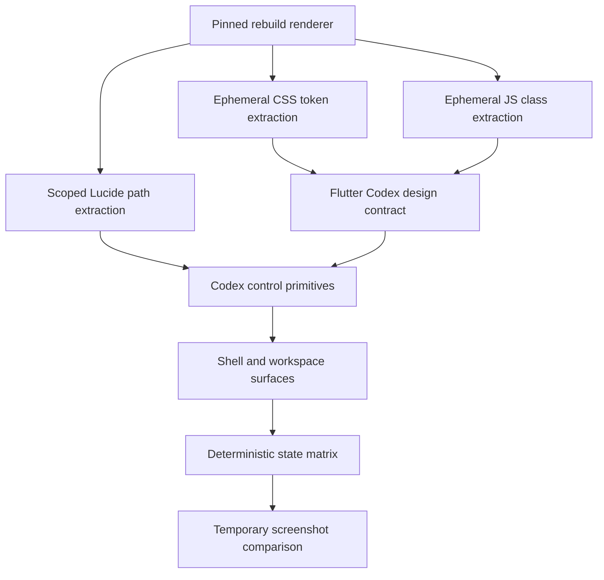
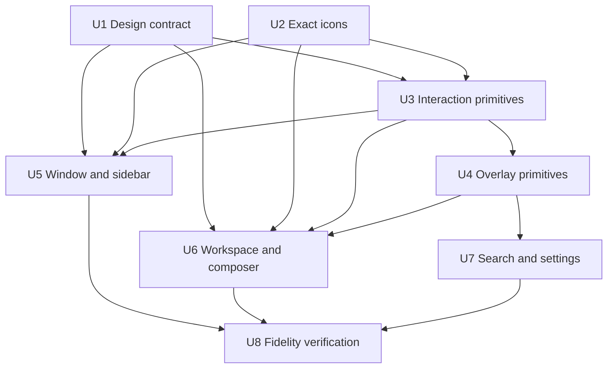
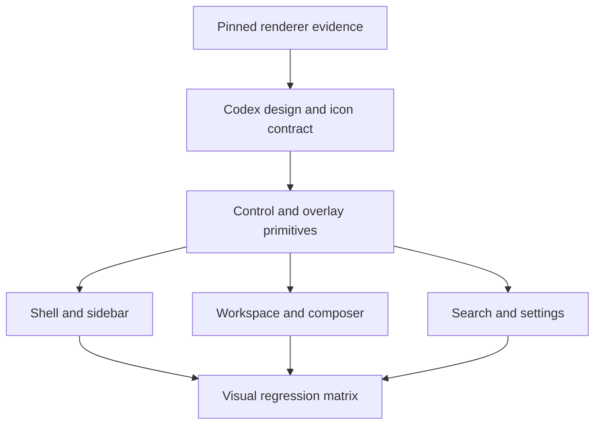

# refactor: Rebuild Codex UI from renderer artifacts

## Summary

Rebuild the standalone Flutter Codex reproduction from the compiled renderer
artifacts in `Haleclipse/CodexDesktop-Rebuild` version `26.721.81911`. Exact
CSS tokens, component class combinations, Radix overlay behavior, and Lucide
paths become the source of truth; screenshots are used only to verify the final
Flutter rendering.

---

## Problem Frame

The current Flutter implementation reproduces the broad shell but fills missing
details with Material defaults and visual estimates. That produces visible
differences in radii, shadows, icon weight, dialog composition, menu placement,
focus treatment, and dropdown behavior. It also used the currently running
official Codex window as a visual reference even though the requested target is
the UI packaged by `CodexDesktop-Rebuild`.

The rebuild repository does not contain readable React source, but it does
contain the unpacked production renderer: a compiled Tailwind stylesheet,
minified React/Radix bundles, Lucide icon chunks, fonts, and media. Those
artifacts retain enough exact visual data to replace approximation with a
source-backed Flutter implementation without repairing or fully running the
Electron application.

---

## Requirements

### Source fidelity

- R1. Treat `CodexDesktop-Rebuild` version `26.721.81911`, specifically its
  macOS arm64 renderer artifacts, as the only visual source of truth.
- R2. Derive colors, typography, spacing, dimensions, radii, borders, shadows,
  blur, and motion values from compiled CSS variables, reachable Codex-mode
  component class combinations, and renderer conditionals rather than visual
  estimates.
- R3. Replace Material feature icons with the exact Lucide geometry used by the
  target renderer, preserving outline/fill semantics, stroke width, cap, join,
  view box, and optical size.
- R4. Implement Codex-specific dialogs, dropdown menus, popovers, context menus,
  and tooltips with correct surface styling, positioning, dismissal, keyboard
  behavior, focus restoration, and state visuals.

### Surface coverage

- R5. Rebuild the desktop title bar, sidebar, navigation rows, task groups,
  empty workspace, representative task thread, composer, workspace selector,
  model selector, run-location selector, search surface, and settings surface
  from renderer evidence.
- R6. Support the target light and dark themes, expanded and collapsed sidebar
  modes, and responsive window widths without clipping, overlap, or layout
  shifts.
- R7. Keep the reproduction presentation-only. Interactions exist to expose UI
  states, not to implement authentication, task execution, persistence, speech
  recognition, or Voice2Text workflows.

### Isolation

- R8. Do not modify the root Voice2Text app or `apps/desktop`; all product code
  changes remain inside `apps/codex_ui_reproduction`.
- R9. Do not commit upstream renderer dumps, DOM captures, extracted CSS
  reports, or temporary analysis scripts. Commit only the Flutter UI,
  UI-required assets, tests, and the requested plan.

### Verification

- R10. Verify fidelity with deterministic widget coverage and Flutter-generated
  goldens. Use temporary same-size target-renderer screenshot comparisons when
  the corresponding state can be isolated without repairing the Electron
  application; renderer-derived geometry and style assertions remain the
  completion gate when it cannot.

---

## Scope Boundaries

- The currently installed or currently executing official Codex application is
  not a design baseline.
- Repairing `CodexDesktop-Rebuild`, its login flow, native modules, IPC bridge,
  network access, or task runtime is out of scope.
- Full Codex business functionality and every deep product page are out of
  scope. The active scope is the desktop shell, empty workspace, representative
  task thread, composer, search, settings, and their directly reachable visual
  states.
- No Electron, React, or web renderer is embedded in the Flutter application.
- No upstream minified JS or full CSS bundle is copied into this repository.
- Only icons and media required by the reproduced UI may be committed. Lucide
  assets retain their required attribution.
- Windows and Linux native window-chrome parity are deferred; the first fidelity
  target is macOS arm64.
- Goo components may be reused only when their public API can exactly express
  the extracted Codex visual and interaction contract. Goo styling must not
  override source-backed Codex values.

### Deferred to Follow-Up Work

- Additional Codex pages beyond the shell, empty workspace, representative task
  thread, search, settings, and composer surfaces: add only after the primary
  fidelity matrix is accepted.
- Windows and Linux window-frame parity: separate platform-specific work after
  macOS visual closure.

---

## Context & Research

### Relevant Code and Patterns

- `apps/codex_ui_reproduction/lib/src/codex_tokens.dart` currently contains
  estimated colors and dimensions. It should be replaced by source-backed theme,
  metric, typography, elevation, and motion definitions.
- `apps/codex_ui_reproduction/lib/src/codex_controls.dart` provides a useful
  ownership boundary for shared controls, but its Material icon and ink
  behavior are not fidelity-compatible.
- `apps/codex_ui_reproduction/lib/src/codex_app.dart` currently uses
  `showDialog` and Material `Dialog`; these are the direct cause of incorrect
  dialog layout, elevation, barrier, and transition behavior.
- `apps/codex_ui_reproduction/lib/src/codex_sidebar.dart` and
  `apps/codex_ui_reproduction/lib/src/codex_workspace.dart` already isolate the
  two primary panes and can be refactored without touching other applications.
- `apps/codex_ui_reproduction/test/codex_app_test.dart` demonstrates the
  existing window-size test harness and should be split into focused component,
  state, and visual tests.
- `apps/codex_ui_reproduction/macos/Runner/MainFlutterWindow.swift` already
  owns the transparent, full-content title bar. It remains the native
  composition point for macOS traffic lights, dragging, minimum size, and
  window background.
- `flutter-ui-mobile/DESIGN.md` and `flutter-ui-mobile/DOC.md` remain project
  guidance. Exact Codex fidelity takes precedence inside this isolated
  reproduction when a Goo component cannot be fully themed to the extracted
  contract.

### Reference Renderer Findings

Paths in this subsection are relative to the `CodexDesktop-Rebuild` reference
repository.

- `src/mac-arm64/_asar/webview/index.html` is the production renderer entry and
  includes the exact startup Codex SVG mask.
- `src/mac-arm64/_asar/webview/assets/app-D4iDTyKa.css` is a Tailwind 4.2.4
  production bundle containing the typography scale, 4px spacing base, radius
  scale, shadows, theme aliases, sidebar clamp, toolbar heights, composer
  metrics, colors, blur, and motion curves.
- `src/mac-arm64/_asar/webview/assets/app-initial-CRKqnyc3.js` contains the
  compiled React composition, Radix dropdown/dialog/popover primitives, and
  final Tailwind class combinations for renderer components.
- Icon chunks call `createLucideIcon` with recoverable SVG element data. The
  renderer contains thousands of named chunks, so only icons reachable from
  the scoped UI should be extracted.
- The main bundle contains ChatGPT, browser, and non-Codex feature branches.
  Chunk names and class literals alone do not establish relevance; extraction
  must trace imports and Codex/Electron conditionals from the scoped entry
  surfaces.
- Relevant feature chunks include sidebar, composer, run-location dropdown,
  project selector, thread overflow menu, settings sections, and multiple
  dialogs. Hash-suffixed filenames are version-specific and must remain pinned
  to the selected reference version during implementation.
- The renderer uses CSS tokens backed by runtime `--vscode-*` variables. Static
  parsing supplies token relationships; unresolved final theme values should
  be recovered from bundled theme configuration or a minimal mocked renderer,
  not from the unrelated installed Codex app.

### Institutional Learnings

- `docs/solutions/architecture-patterns/desktop-first-workstation-boundaries.md`
  establishes that platform applications stay separate composition roots.
  `apps/codex_ui_reproduction` therefore remains independent from the root
  mobile app and `apps/desktop`.
- Evidence is target-specific. Fidelity evidence must record the pinned renderer
  version, platform, window size, theme, and DPR together; a screenshot from a
  different Codex build is not interchangeable.

### External References

- No external research is required. The pinned renderer artifacts are more
  authoritative than current library documentation or screenshots from another
  Codex build.

---

## Key Technical Decisions

| Decision | Rationale |
|---|---|
| Parse compiled artifacts before changing Flutter widgets | The artifacts contain exact tokens and component class combinations; visual guessing caused the current drift. |
| Keep extraction ephemeral | The user wants only the UI implementation, not a reference-capture subsystem or renderer archive. |
| Commit only the scoped icon set | Exact Lucide paths are required, but importing thousands of unused chunks would add noise and licensing surface. |
| Build a Codex-specific primitive layer | Material dialogs, menus, icons, and default state layers cannot reproduce the Radix/Tailwind contract precisely. |
| Require reachability before accepting extracted evidence | The production bundle contains unrelated ChatGPT and browser components whose classes must not be mistaken for Codex desktop UI. |
| Use Goo selectively, not as the visual authority | Goo remains useful where behavior and theming match, but Codex renderer evidence owns all final geometry and appearance. |
| Separate structural and raster fidelity checks | Flutter and Chromium may rasterize text differently; geometry, color, state, and asset correctness should not be hidden by font antialiasing noise. |
| Keep runtime renderer use optional and isolated | Static CSS/JS parsing should resolve most facts. A mocked local renderer is only for unresolved runtime variables, portals, and final positioning. |

---

## Open Questions

### Resolved During Planning

- **Which application is the target?** `CodexDesktop-Rebuild` version
  `26.721.81911`, not the currently executing official Codex task window.
- **Is screenshot inspection the primary method?** No. Static analysis of the
  compiled renderer is primary; screenshots are verification.
- **Must the failing Electron application be repaired first?** No. CSS, JS,
  HTML, fonts, and icon chunks can be parsed directly. A minimal mocked renderer
  is sufficient if runtime-only values remain.
- **Should the existing Flutter reproduction be discarded?** Keep its isolated
  app scaffold and native window composition, but replace estimated theme,
  Material primitives, and approximate screen composition.

### Deferred to Implementation

- **Which runtime `--vscode-*` values cannot be resolved statically?** Determine
  after tracing bundled theme initialization. Mock only the unresolved subset.
- **Which Goo components remain usable?** Decide component-by-component after
  comparing their public theming surface with the extracted Codex contract.
- **Which scoped icons have nonstandard fill behavior?** Determine from the
  exact icon chunks during extraction and encode explicit exceptions.
- **What final screenshot-diff tolerance is stable across the development Mac?**
  Calibrate using repeated captures after geometry and color assertions pass;
  exclude native chrome and text-antialiasing-only pixels from the global score.

---

## Output Structure

Expected structure after the refactor; exact file grouping may be adjusted if
implementation reveals a smaller coherent boundary.

    apps/codex_ui_reproduction/
      assets/
        icons/codex/
      lib/src/
        design/
          codex_theme.dart
          codex_metrics.dart
        icons/
          codex_icon.dart
          codex_icon_catalog.dart
        primitives/
          codex_action.dart
          codex_dialog.dart
          codex_menu.dart
          codex_popover.dart
          codex_tooltip.dart
        shell/
          codex_titlebar.dart
          codex_sidebar.dart
        workspace/
          codex_home.dart
          codex_composer.dart
          codex_search.dart
          codex_settings.dart
      test/
        design/
        icons/
        primitives/
        shell/
        workspace/
        goldens/

---

## High-Level Technical Design

> *This illustrates the intended approach and is directional guidance for
> review, not implementation specification. The implementing agent should treat
> it as context, not code to reproduce.*

The extraction steps operate outside the repository or as disposable local
commands. Their reviewed results are translated into readable Flutter tokens,
assets, and component decisions. No generated renderer report becomes a runtime
dependency.

---

## Implementation Units

### U1. Replace Estimated Tokens with the Renderer Design Contract

**Goal:** Translate the pinned renderer's CSS theme, metric, typography,
elevation, and motion values into a readable Flutter design contract.

**Requirements:** R1, R2, R6, R9

**Dependencies:** None

**Files:**
- Create: `apps/codex_ui_reproduction/lib/src/design/codex_theme.dart`
- Create: `apps/codex_ui_reproduction/lib/src/design/codex_metrics.dart`
- Modify: `apps/codex_ui_reproduction/lib/src/codex_tokens.dart`
- Modify: `apps/codex_ui_reproduction/lib/src/codex_app.dart`
- Test: `apps/codex_ui_reproduction/test/design/codex_design_contract_test.dart`

**Approach:**
- Extract and resolve the CSS token graph for both light and dark themes,
  including runtime aliases where they can be traced statically.
- Trace renderer imports and Codex/Electron branches before accepting
  component-specific classes as evidence; global Tailwind theme variables do
  not require feature reachability.
- Preserve the renderer's semantic distinctions instead of flattening values
  into generic `canvas`, `border`, and `muted` colors.
- Represent CSS hairline rings, layered shadows, clamp dimensions, and
  cubic-bezier motion explicitly rather than approximating them through a
  Material seed theme.
- Remove hard-coded visual constants from feature widgets once their semantic
  token exists.

**Execution note:** Establish token characterization tests before replacing
existing feature widgets.

**Patterns to follow:**
- The semantic token separation documented in `flutter-ui-mobile/DESIGN.md`.
- Existing theme ownership in `apps/codex_ui_reproduction/lib/src/codex_tokens.dart`,
  expanded into source-backed domains.

**Test scenarios:**
- Happy path: light and dark design contexts resolve the exact foreground,
  surface, border, dropdown, hover, selected, and input colors expected from
  the pinned renderer.
- Boundary: sidebar width resolves to its CSS clamp minimum, preferred width,
  and maximum under narrow, normal, and wide constraints.
- Fidelity: every radius and elevation used by a scoped component maps to a
  named renderer token or documented class literal.
- Regression: constructing the application theme does not introduce
  `ColorScheme.fromSeed` colors into Codex surfaces.

**Verification:**
- No scoped widget contains an unexplained visual constant.
- Token tests document the renderer source token or class for each asserted
  value.

### U2. Restore the Exact Scoped Lucide Icon Set

**Goal:** Replace all Material and approximate icons with exact renderer icon
geometry for the scoped shell and overlays.

**Requirements:** R3, R5, R9

**Dependencies:** None

**Files:**
- Create: `apps/codex_ui_reproduction/assets/icons/codex/`
- Create: `apps/codex_ui_reproduction/lib/src/icons/codex_icon.dart`
- Create: `apps/codex_ui_reproduction/lib/src/icons/codex_icon_catalog.dart`
- Modify: `apps/codex_ui_reproduction/pubspec.yaml`
- Modify: `apps/codex_ui_reproduction/lib/src/codex_controls.dart`
- Test: `apps/codex_ui_reproduction/test/icons/codex_icon_test.dart`

**Approach:**
- Parse only icon chunks referenced by the scoped component bundles.
- Preserve the 24-unit view box and each SVG element's path/circle/line/rect
  data. Do not substitute a newer Lucide package version by name alone.
- Render the scoped SVG assets through a pinned `flutter_svg` dependency rather
  than building a partial SVG parser or relying on a moving Lucide icon package.
- Encode outline defaults and explicit fill exceptions separately so icon
  callers cannot accidentally request the wrong style.
- Centralize size, color, semantics, and pixel alignment in `CodexIcon`.
- Include the required Lucide attribution with committed derived icon assets.

**Patterns to follow:**
- The public icon-entry pattern used by `GooIcon`, while keeping Codex-specific
  geometry isolated from the Goo catalog.
- Existing tooltip and semantic-label ownership in `CodexIconButton`.

**Test scenarios:**
- Happy path: sidebar, title bar, composer, search, settings, close, chevron,
  microphone, folder, and overflow icons resolve to the expected asset.
- Fidelity: outline icons render with the renderer's stroke width, round caps,
  round joins, and no unintended fill.
- Exception: renderer icons that intentionally use `currentColor` fill retain
  fill and do not inherit the outline default.
- Accessibility: actionable icons expose a semantic label; decorative icons are
  excluded from the semantics tree.
- Boundary: each supported optical size remains centered without changing the
  parent control's layout dimensions.

**Verification:**
- Feature UI contains no Material `Icons.*` references.
- Visual inspection confirms no filled/outlined mismatch across the scoped
  state matrix.

### U3. Build Codex Control and Interaction Primitives

**Goal:** Establish source-backed buttons, rows, text controls, focus treatment,
and state layers that do not inherit Material defaults.

**Requirements:** R2, R3, R4, R6

**Dependencies:** U1, U2

**Files:**
- Create: `apps/codex_ui_reproduction/lib/src/primitives/codex_action.dart`
- Create: `apps/codex_ui_reproduction/lib/src/primitives/codex_surface.dart`
- Create: `apps/codex_ui_reproduction/lib/src/primitives/codex_text_input.dart`
- Modify: `apps/codex_ui_reproduction/lib/src/codex_controls.dart`
- Test: `apps/codex_ui_reproduction/test/primitives/codex_action_test.dart`
- Test: `apps/codex_ui_reproduction/test/primitives/codex_text_input_test.dart`

**Approach:**
- Separate visible geometry, layout box, hit target, and state layer so hover
  and focus never move adjacent text or resize controls.
- Recreate renderer variants for ghost, active ghost, primary, secondary, icon,
  and composer actions with exact height, padding, radius, and state colors.
- Use explicit `FocusNode`, keyboard activation, mouse cursor, and semantics
  behavior instead of relying on Material button theming.
- Recreate text input caret, placeholder, selection, focus border, and disabled
  behavior from input tokens.

**Patterns to follow:**
- Goo's visible-body/layout/hit-target/state-layer separation in
  `flutter-ui-mobile/DESIGN.md`.
- The existing compact `CodexIconButton` call site shape, with its visual
  implementation replaced.

**Test scenarios:**
- Happy path: pointer hover, press, keyboard activation, selected, and disabled
  states produce their exact source-backed state layer.
- Layout: changing interaction state does not change control size or neighbor
  positions.
- Keyboard: Space and Enter activate focused actions exactly once.
- Focus: keyboard focus draws the extracted focus ring while pointer activation
  does not leave an inappropriate persistent ring.
- Input: placeholder, entered text, selection, and disabled styles resolve
  correctly in both themes.

**Verification:**
- Shared controls no longer depend on Material visual variants or ripples.
- Interaction tests pass with stable geometry before and after state changes.

### U4. Implement the Codex Overlay System

**Goal:** Recreate the Radix-derived dialog, dropdown, popover, context-menu, and
tooltip behavior and styling used by the renderer.

**Requirements:** R2, R4, R6, R7

**Dependencies:** U1, U2, U3

**Files:**
- Create: `apps/codex_ui_reproduction/lib/src/primitives/codex_overlay.dart`
- Create: `apps/codex_ui_reproduction/lib/src/primitives/codex_dialog.dart`
- Create: `apps/codex_ui_reproduction/lib/src/primitives/codex_menu.dart`
- Create: `apps/codex_ui_reproduction/lib/src/primitives/codex_popover.dart`
- Create: `apps/codex_ui_reproduction/lib/src/primitives/codex_tooltip.dart`
- Test: `apps/codex_ui_reproduction/test/primitives/codex_dialog_test.dart`
- Test: `apps/codex_ui_reproduction/test/primitives/codex_menu_test.dart`
- Test: `apps/codex_ui_reproduction/test/primitives/codex_popover_test.dart`

**Approach:**
- Use a shared root overlay coordinator so nested menus, modal barriers,
  dismissal, and focus restoration have one lifecycle owner.
- Reproduce opaque, translucent, and panel surface variants from the renderer's
  class combinations, including 0.5px rings, spread shadows, and conditional
  backdrop blur.
- Position menus and popovers from the trigger's global rectangle, with viewport
  collision handling, origin-aware transitions, and source-matching offsets.
- Support menu items, separators, labels, check/radio indicators, submenus,
  keyboard traversal, Escape dismissal, outside-click dismissal, and disabled
  states.
- Replace `showDialog`, Material `Dialog`, and inert chevron placeholders.

**Execution note:** Implement focus and dismissal tests before integrating any
feature-specific menu.

**Patterns to follow:**
- Radix behavior visible in the compiled `DropdownMenu` primitives.
- Goo overlay ownership guidance in `flutter-ui-mobile/DOC.md`, without
  inheriting Goo's visual tokens when they differ.

**Test scenarios:**
- Happy path: activating a trigger opens the correct overlay at the expected
  anchor edge and returns focus to the trigger after selection.
- Keyboard: arrow keys traverse enabled items, Enter selects, Escape dismisses,
  and submenu keys open and close nested content.
- Edge case: overlays near each window edge flip or shift without leaving the
  viewport.
- Dismissal: outside click closes nonmodal overlays; modal dialog barrier
  behavior matches its renderer variant.
- State: hover, focused, checked, selected, destructive, disabled, and separator
  menu visuals match extracted classes.
- Integration: opening a second overlay closes or stacks against the first
  according to its modal relationship without leaking entries.

**Verification:**
- No scoped overlay uses Material `Dialog`, `PopupMenuButton`, or default
  `Tooltip` presentation.
- Overlay entries and focus nodes are disposed after every dismissal path.

### U5. Rebuild the Native Title Bar and Sidebar

**Goal:** Match the target window chrome integration, title-bar controls,
resizable sidebar, navigation rows, task grouping, and collapsed state.

**Requirements:** R1, R2, R3, R5, R6, R8

**Dependencies:** U1, U2, U3

**Files:**
- Create: `apps/codex_ui_reproduction/lib/src/shell/codex_titlebar.dart`
- Move/Modify: `apps/codex_ui_reproduction/lib/src/codex_sidebar.dart`
- Modify: `apps/codex_ui_reproduction/lib/src/codex_app.dart`
- Modify: `apps/codex_ui_reproduction/macos/Runner/MainFlutterWindow.swift`
- Test: `apps/codex_ui_reproduction/test/shell/codex_sidebar_test.dart`
- Test: `apps/codex_ui_reproduction/test/shell/codex_shell_layout_test.dart`

**Approach:**
- Map the renderer's toolbar heights, safe header insets, draggable/non-draggable
  regions, traffic-light clearance, and navigation control geometry to Flutter
  and the macOS runner.
- Implement the source sidebar clamp and user-resizable boundary rather than a
  single estimated width.
- Rebuild rows from extracted padding, height, radius, typography, icon size,
  hover, active, unread, and overflow-menu classes.
- Preserve local demo state only for expanded/collapsed, selected task, project
  expansion, and menu visibility.
- Keep native app naming, minimum size, and full-content title bar isolated to
  this standalone runner.

**Test scenarios:**
- Happy path: at the canonical desktop size, title bar and expanded sidebar
  resolve to the renderer metrics and selected row state.
- Responsive: sidebar follows minimum, preferred, maximum, collapsed, and
  narrow-window behavior without changing main-pane minimum usability.
- Interaction: toggle, back/forward disabled state, task selection, project
  expansion, and overflow menu expose the correct visual states.
- Edge case: long project and task names ellipsize without covering trailing
  controls.
- Native integration: draggable regions exclude every actionable title-bar
  control and preserve macOS traffic-light interaction.

**Verification:**
- Sidebar geometry matches extracted metrics within one logical pixel at the
  canonical viewport.
- Existing root and desktop applications remain untouched.

### U6. Rebuild the Home Workspace, Task Thread, and Composer

**Goal:** Match the target empty workspace, representative task thread,
contextual workspace surface, composer structure, utility controls, and its
real dropdown states.

**Requirements:** R2, R3, R4, R5, R6, R7

**Dependencies:** U1, U2, U3, U4

**Files:**
- Create: `apps/codex_ui_reproduction/lib/src/workspace/codex_home.dart`
- Create: `apps/codex_ui_reproduction/lib/src/workspace/codex_task_thread.dart`
- Create: `apps/codex_ui_reproduction/lib/src/workspace/codex_composer.dart`
- Create: `apps/codex_ui_reproduction/lib/src/workspace/codex_workspace_selector.dart`
- Create: `apps/codex_ui_reproduction/lib/src/workspace/codex_model_menu.dart`
- Create: `apps/codex_ui_reproduction/lib/src/workspace/codex_run_location_menu.dart`
- Modify: `apps/codex_ui_reproduction/lib/src/codex_workspace.dart`
- Test: `apps/codex_ui_reproduction/test/workspace/codex_home_test.dart`
- Test: `apps/codex_ui_reproduction/test/workspace/codex_task_thread_test.dart`
- Test: `apps/codex_ui_reproduction/test/workspace/codex_composer_test.dart`

**Approach:**
- Recover the exact home empty-state mark from the renderer entry or scoped
  asset rather than approximating it with `CustomPainter`.
- Reconstruct one deterministic task thread from the local-conversation bundle,
  including header, user prompt, assistant response, status/tool row, separators,
  and composer attachment. Complex editors, terminals, and artifact viewers
  remain out of scope.
- Reconstruct composer layers and responsive modes from the composer and
  utility-bar chunks, including single-line radius, context row, input surface,
  action bar, border/ring, and elevation.
- Implement the plus/context menu, workspace selector, model selector, and
  run-location selector through U4 instead of inert buttons.
- Keep text entry and selection local; submitting a task only transitions to a
  presentation state and does not call business services.
- Ensure long model/workspace names and multiline prompts use the renderer's
  truncation and growth rules.

**Test scenarios:**
- Happy path: canonical empty workspace renders the exact mark, heading,
  composer layers, placeholder, and actions.
- Task thread: selecting the fixture task renders the extracted conversation
  hierarchy and keeps the composer anchored without placeholder-only content.
- Menu integration: each composer trigger opens the correct menu variant,
  updates local selected text, and restores focus.
- Responsive: composer preserves maximum width and required side insets at wide,
  medium, and minimum supported window sizes.
- Input edge case: empty, single-line, multiline, and long unbroken input do not
  resize fixed controls or overflow the surface.
- State: focused input, populated input, voice-ready, submit-ready, and disabled
  presentation states match source tokens.

**Verification:**
- Every visible composer control has a functional UI state.
- The primary selected-task surface is a representative Codex task thread, not
  the current generic `Task preview` placeholder.
- No approximate Codex mark, Material icon, or inert dropdown chevron remains.

### U7. Rebuild Search, Settings, and Feature Dialog States

**Goal:** Replace approximate Material dialogs with the exact scoped search,
settings, and feature-dialog compositions from the renderer.

**Requirements:** R2, R3, R4, R5, R6, R7

**Dependencies:** U1, U2, U3, U4

**Files:**
- Create: `apps/codex_ui_reproduction/lib/src/workspace/codex_search.dart`
- Create: `apps/codex_ui_reproduction/lib/src/workspace/codex_settings.dart`
- Create: `apps/codex_ui_reproduction/lib/src/workspace/codex_feature_dialog.dart`
- Modify: `apps/codex_ui_reproduction/lib/src/codex_app.dart`
- Test: `apps/codex_ui_reproduction/test/workspace/codex_search_test.dart`
- Test: `apps/codex_ui_reproduction/test/workspace/codex_settings_test.dart`
- Test: `apps/codex_ui_reproduction/test/workspace/codex_feature_dialog_test.dart`

**Approach:**
- Reconstruct search as its renderer overlay type, including input inset,
  result-row state, keyboard selection, empty state, and dismissal.
- Reconstruct settings navigation, rows, select controls, switches, dividers,
  and panel sizing from settings bundles and extracted tokens.
- Include one representative 16px-radius feature dialog to validate the
  renderer's feature-modal composition and larger layered shadow.
- Use local fixture data only and expose enough states for visual inspection.

**Test scenarios:**
- Search: keyboard shortcut opens the surface, typing filters local fixtures,
  arrows change the active row, Enter selects, and Escape restores focus.
- Settings: navigation selection, switch, select menu, light/dark appearance,
  and close behavior render through Codex primitives.
- Dialog: feature modal uses exact width constraint, 16px radius, shadow stack,
  close behavior, and scroll handling for short windows.
- Edge case: 200% text scaling and the minimum supported window do not produce
  overflow; content becomes scrollable where the renderer does.
- Lifecycle: repeated open/close cycles leave no overlay, focus, or controller
  leaks.

**Verification:**
- Search and settings contain no Material dialog, switch, dropdown, or default
  menu visuals.
- All directly reachable overlay states can be opened from the standalone app.

### U8. Establish the Fidelity State Matrix and Regression Gate

**Goal:** Prove the source-backed UI matches the pinned target and remains stable
across themes, window sizes, interactions, and future refactors.

**Requirements:** R1, R6, R9, R10

**Dependencies:** U5, U6, U7

**Files:**
- Create: `apps/codex_ui_reproduction/test/codex_visual_golden_test.dart`
- Create: `apps/codex_ui_reproduction/test/goldens/`
- Create: `apps/codex_ui_reproduction/test/codex_material_fallback_test.dart`
- Modify: `apps/codex_ui_reproduction/test/codex_app_test.dart`
- Modify: `apps/codex_ui_reproduction/README.md`

**Approach:**
- Define a deterministic fixture state and canonical viewport/DPR matrix for
  expanded shell, collapsed shell, hover/selected rows, each menu type, search,
  settings, feature dialog, and composer dropdowns in both themes.
- Commit only Flutter-generated goldens. Target renderer screenshots and
  comparison overlays remain temporary local evidence.
- Compare geometry and colors independently from global raster difference when
  the target state can be isolated, so Chromium/Flutter font antialiasing does
  not mask structural defects.
- Add a static regression test that rejects Material feature icons and default
  Material dialog/menu entry points inside the reproduction's feature code.
- Document the pinned source version, supported states, and reproduction run
  path without retaining extraction material.

**Test scenarios:**
- Golden matrix: canonical 1280x900 light and dark shells match approved Flutter
  goldens for every scoped overlay state.
- Responsive matrix: minimum supported and intermediate widths render without
  overflow, overlap, or clipped overlay content.
- State matrix: hover, pressed, focused, selected, checked, disabled, expanded,
  and collapsed states remain deterministic.
- Structural comparison: when the target state is sandbox-renderable,
  target-to-Flutter anchor bounds differ by no more than one logical pixel at
  the canonical viewport; otherwise the same bound applies against dimensions
  derived from the renderer's CSS and component composition.
- Color comparison: solid semantic surfaces and borders match their extracted
  values; text-antialiasing edges are excluded from strict color assertions.
- Regression: forbidden Material visual primitives fail the static test if
  reintroduced into feature code.

**Verification:**
- The complete matrix passes repeatedly on the development Mac.
- Temporary target screenshots and diff outputs are deleted before final
  delivery.
- `flutter analyze`, widget tests, goldens, macOS build, UI watcher check, and
  repository checks have recorded outcomes; unrelated baseline failures are
  reported rather than hidden or fixed out of scope.

---

## System-Wide Impact

- **Interaction graph:** `CodexApp` owns theme and presentation state; the shell
  owns navigation; the overlay coordinator owns focus/dismissal; feature
  surfaces consume shared tokens, icons, actions, and overlays.
- **Error propagation:** Missing icon assets or unresolved design tokens should
  fail tests or show an explicit development assertion, not silently fall back
  to Material visuals.
- **State lifecycle risks:** Overlay entries, controllers, focus nodes, hover
  state, and submenu stacks must be disposed on selection, Escape, outside
  click, route teardown, and theme changes.
- **API surface parity:** Only the standalone reproduction consumes the new
  primitives. Root mobile UI, Goo components, and `apps/desktop` APIs do not
  change.
- **Integration coverage:** Feature tests must prove trigger-to-overlay
  positioning and state updates; isolated primitive tests alone cannot prove
  correct composition.
- **Unchanged invariants:** Voice2Text speech recognition, persistence,
  workflows, native permissions, and existing navigation remain unchanged.

---

## Alternative Approaches Considered

- **Continue visual tweaking of Material widgets:** rejected because default
  geometry and interaction behavior continue leaking through every dialog,
  menu, icon, and state layer.
- **Embed the renderer in a Flutter webview:** rejected because the goal is a
  Flutter UI reproduction and the renderer carries Electron/business
  dependencies the user explicitly does not want.
- **Repair and automate the full rebuild application first:** rejected because
  authentication and native-runtime failures do not block static extraction of
  UI facts.
- **Use screenshots as the only specification:** rejected because hidden
  overlays, focus states, exact SVG paths, and token relationships are present
  in code but ambiguous in pixels.
- **Adopt Goo styling wholesale:** rejected where Goo values differ from the
  pinned renderer. Selective reuse remains possible only when exact theming and
  behavior are demonstrably equivalent.

---

## Success Metrics

- All scoped visual constants are traceable to a pinned renderer CSS token,
  component class literal, or icon chunk.
- The scoped feature code contains no Material `Icons.*`, Material `Dialog`,
  `PopupMenuButton`, or inert dropdown controls.
- Every directly visible dropdown, menu, popover, tooltip, and dialog has
  functional presentation behavior and keyboard coverage.
- Canonical structural anchors match sandbox-rendered target states or
  renderer-derived constraints within one logical pixel.
- Light/dark and expanded/collapsed matrices pass without overflow at supported
  window sizes and 100%/200% text scaling.
- Flutter-generated visual goldens are deterministic across repeated local runs.
- No existing Voice2Text application file is modified.

---

## Dependencies / Prerequisites

- A local checkout of `Haleclipse/CodexDesktop-Rebuild` pinned to the selected
  version with `src/mac-arm64/_asar/webview` present.
- Flutter and macOS build dependencies already used by
  `apps/codex_ui_reproduction`.
- A deterministic macOS display scale for final screenshot comparison.
- Any new SVG runtime dependency must be justified against a smaller
  asset-to-path implementation and pinned in the standalone app only.

---

## Risk Analysis & Mitigation

| Risk | Likelihood | Impact | Mitigation |
|---|---:|---:|---|
| Minified bundles obscure component boundaries | Medium | Medium | Use named chunk filenames, string literals, AST extraction, and CSS classes together; defer only runtime-dependent details. |
| Hash-suffixed assets change on upstream update | High | Medium | Pin version `26.721.81911`; do not mix artifacts from another rebuild version during this closure. |
| Runtime `--vscode-*` values remain unresolved | Medium | High | Trace theme initialization first, then use a minimal mocked renderer for only the unresolved values. |
| Flutter and Chromium rasterize text differently | High | Medium | Assert geometry and semantic colors separately; exclude antialiasing-only pixels from global diff scoring. |
| Custom overlays regress accessibility | Medium | High | Make focus trapping, traversal, semantics, Escape, outside click, and focus restoration required tests. |
| Copying too many upstream assets bloats the app | Medium | Medium | Commit only assets reachable from the scoped state matrix; never copy entire renderer directories. |
| Goo and Codex visual contracts conflict | Medium | Medium | Use Goo only after API-level equivalence review; exact renderer values govern this isolated reproduction. |
| Fidelity work expands into business logic | Medium | High | Use local fixtures and presentation transitions only; keep services, persistence, ASR, and task execution out of dependencies. |

---

## Phased Delivery

### Phase 1: Source-backed foundations

- Complete U1-U4 to establish exact tokens, icons, controls, and overlays before
  revising feature screens.

### Phase 2: High-fidelity surfaces

- Complete U5-U7 using only the new foundations; do not patch feature-specific
  Material defaults around missing primitives.

### Phase 3: Visual closure

- Complete U8, resolve comparison findings by returning defects to the owning
  primitive or surface, and remove temporary extraction and comparison outputs.

---

## Documentation / Operational Notes

- Update the standalone README with the pinned reference version, supported
  visual states, and run instructions.
- Record licensing attribution for the scoped Lucide assets.
- Do not add capture-policy, source-manifest, DOM inventory, or safety-reference
  documents.
- Build and test only after the repository build-cache guard.
- Run the best-effort UI device watcher after code changes, even though the
  fidelity target is macOS.

---

## Sources & References

- Reference repository: `Haleclipse/CodexDesktop-Rebuild`, version
  `26.721.81911`
- Reference renderer entry:
  `src/mac-arm64/_asar/webview/index.html` in the reference repository
- Reference design stylesheet:
  `src/mac-arm64/_asar/webview/assets/app-D4iDTyKa.css` in the reference
  repository
- Reference renderer bundle:
  `src/mac-arm64/_asar/webview/assets/app-initial-CRKqnyc3.js` in the reference
  repository
- Existing reproduction: `apps/codex_ui_reproduction/`
- Project UI guidance: sibling `flutter-ui-mobile/DESIGN.md` and
  `flutter-ui-mobile/DOC.md`
- Repository boundary learning:
  `docs/solutions/architecture-patterns/desktop-first-workstation-boundaries.md`
