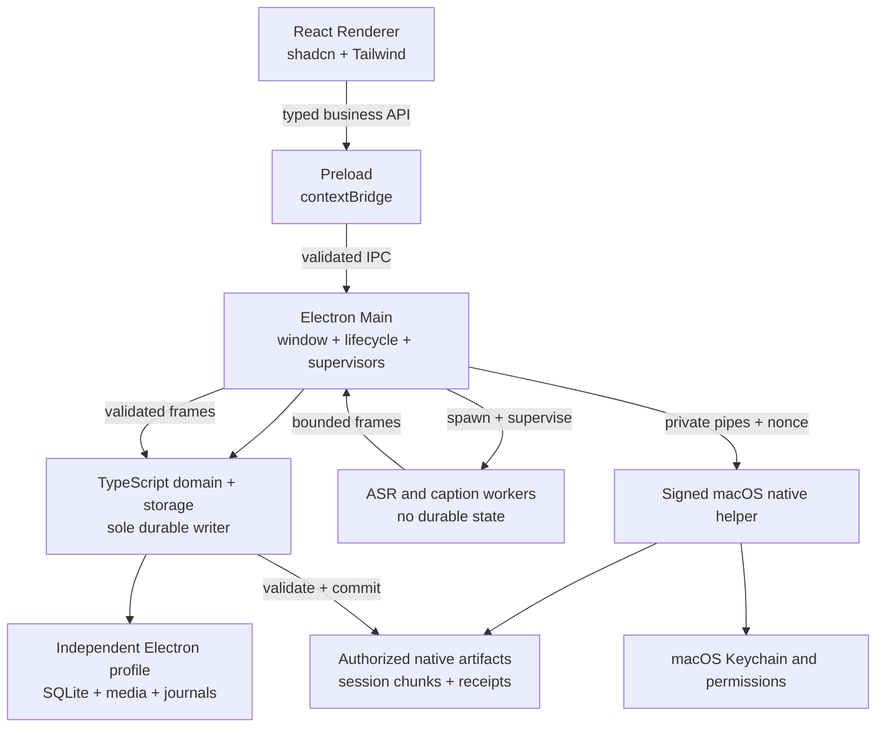
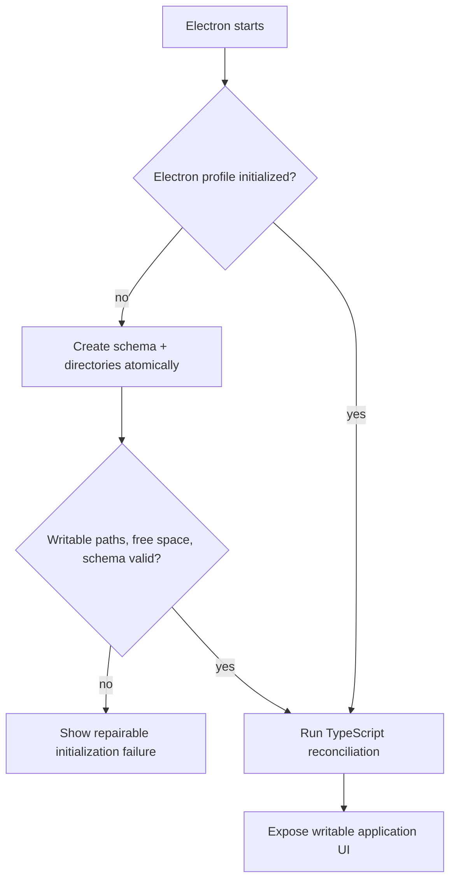
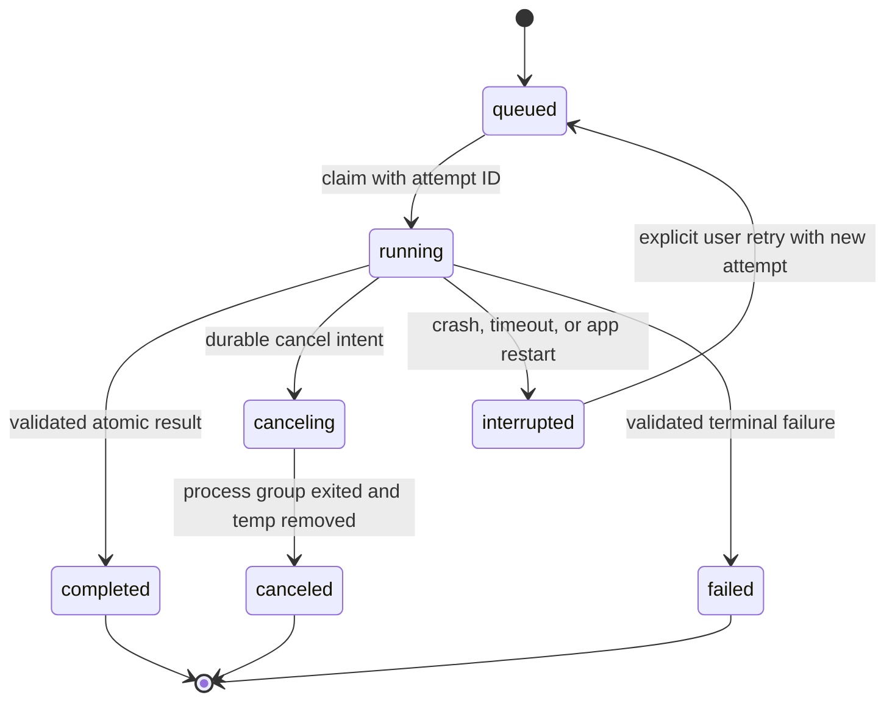

# Electron Desktop Migration - Plan

## Goal Capsule

- **Objective:** Replace the reference-only Flutter Desktop codebase with an Electron client in the existing monorepo while preserving worker lifecycle guarantees, macOS native behavior, and the proven workstation behavior that still applies.
- **Product authority:** `docs/plans/2026-07-26-002-feat-desktop-first-meeting-workstation-plan.md`, `docs/product/desktop-workstation-status.md`, and the current Flutter Desktop behavior define functional truth until the Electron parity gate passes.
- **Architecture authority:** `docs/architecture/desktop-client-transition.md`, `docs/architecture/desktop-runtime-boundaries.md`, and `docs/solutions/architecture-patterns/desktop-first-workstation-boundaries.md` define composition-root, worker, security, and target-evidence boundaries.
- **Execution profile:** Deliver vertical slices behind explicit macOS development gates. Keep `apps/desktop` available as reference source and test evidence until its deletion is approved; it is not a runtime fallback and is not launched during migration.
- **Stop conditions:** Stop and return for a new decision if Bun cannot produce a reproducible Forge package, the TypeScript domain/storage rewrite cannot preserve required workstation semantics, or a required native capability cannot be reproduced without weakening security or data integrity.
- **Tail ownership:** Electron parity and Flutter deletion are separate reviewed changes. Root workspace normalization follows deletion and does not run concurrently with product migration.

---

## Product Contract

### Summary

Create `apps/desktop-electron` as the new desktop application using Bun, Vite, React, TypeScript, shadcn/ui, Tailwind CSS, and the official `sidebar-07` shell. Preserve `apps/desktop` only as reference source and behavioral evidence until Electron passes feature, lifecycle, accessibility, privacy, and target-specific packaging gates. Do not launch Flutter Desktop, migrate its runtime profile, share its database, or design an Electron-to-Flutter data fallback.

Electron owns presentation, desktop orchestration, TypeScript domain services, and its independent SQLite profile. Electron Main supervises the existing compiled ASR/caption workers and signed native helpers through versioned protocols. macOS is the first complete target; Windows is a later independent certification stage.

### Problem Frame

The current repository root is both a Flutter mobile application and a Dart Pub workspace. Flutter Desktop contains substantial reference implementations for durable capture journals, native Swift integrations, Keychain storage, worker process supervision, LAN transfer, AI provider behavior, and target-specific evidence. It is not an active runtime client or a data-migration source, but its code and fixtures remain the behavior reference until parity closes.

The desktop product will consolidate presentation, business workflows, and SQLite persistence in TypeScript to avoid maintaining a single-consumer Dart desktop-core process and its RPC/package boundary. Existing Dart/native ASR and caption workers remain external compute processes. The rewrite therefore needs characterization fixtures, explicit storage transactions, process supervision, native-helper boundaries, and frozen parity evidence before broad UI work begins.

### Actors

- A1. **Desktop user:** Imports or records meetings, monitors processing, reviews transcripts, uses optional AI, transfers recordings, and expects Electron-owned data to remain durable and recoverable.
- A2. **Migration implementer:** Builds Electron slices while keeping Flutter Desktop reference code readable and preserving external Dart/native worker contracts.
- A3. **Acceptance reviewer:** Validates security, storage semantics, lifecycle behavior, accessibility, packaged artifacts, and target-specific evidence before Flutter source removal.

### Key Decisions

- **One monorepo.** Keep Electron, Flutter, Dart packages, native helpers, fixtures, and evidence in the existing repository. (session-settled: user-directed — chosen over separate repositories: the desktop clients share versioned contracts and compiled workers.) Governs R1, R2, R5.
- **Progressive source replacement.** Keep Flutter Desktop source until Electron passes the removal gate. (session-settled: user-directed — chosen over immediate deletion: Flutter remains reference code while parity is measured, but it is never a runtime fallback.) Governs R2, R15, R16.
- **macOS-first certification.** The first milestone validates only macOS; Windows starts later with independent evidence. (session-settled: user-directed — chosen over immediate macOS and Windows packaging: the current development device is macOS.) Governs R13, R14.

### Requirements

**Repository and application boundaries**

- R1. `apps/desktop-electron` must be an independent application composition root with its own `package.json`, `bun.lock`, build scripts, tests, and Electron-specific validation.
- R2. `apps/desktop` must remain available as reference source and evidence until a separate removal review confirms Electron parity; the plan must not launch it or depend on its runtime data.
- R3. The Electron client must use Bun for package management, Vite for Renderer builds, React and TypeScript for UI code, and Electron Forge for development packaging.
- R4. The Electron Renderer must use shadcn/ui and Tailwind CSS, with `sidebar-07` as the initial shell for library, tasks, companion, and settings navigation plus recording/recovery overlays.
- R5. Electron must not import Flutter application packages or treat Flutter build outputs as runtime dependencies.

**Process, data, and security boundaries**

- R6. TypeScript domain and storage services inside Electron Main must be the only writers of the Electron meeting database and the owners of import, processing, workspace, AI-job, reconciliation, and lifecycle state transitions.
- R7. Electron Main must be the only Electron layer allowed to start ASR, caption, or native helper processes and must preserve process-group cancellation, minimal environments, output limits, deadlines, attempt fencing, and atomic result publication.
- R8. Renderer access to privileged behavior must pass through a narrow typed Preload API and fixed Main IPC handlers with sender and runtime payload validation.
- R9. Electron must define its own versioned SQLite schema and independent profile while preserving required media integrity, capture journals, transfer checkpoints, consent metadata, transaction boundaries, reconciliation behavior, and cleanup retention rules through characterization fixtures.
- R10. Renderer and native helpers must never write the Electron database or publish durable meeting/job/transfer state; TypeScript storage services are the single authority.
- R11. macOS capture, secure-import, Keychain, and LAN-discovery primitives must move behind Electron-callable native helper boundaries without weakening the existing Swift safety checks. Electron Main owns menu-bar, sleep/wake integration, and durable recovery commits.
- R12. Packaged executables, dynamic libraries, models, and manifests must live outside `app.asar`, resolve through a single packaged-resource locator, and carry reproducible hashes and target metadata.

**Delivery and evidence**

- R13. The first milestone must prove Bun install, Forge/Vite development startup, the shadcn shell, typed IPC, a packaged macOS app, and real packaged worker launch; it must not require Windows packaging.
- R14. Windows work must begin only after the macOS development closure gate and must produce independent runtime, packaging, worker, native capability, and product-flow evidence.
- R15. Flutter deletion must require functional parity against the frozen reference baseline, worker lifecycle parity, macOS and Windows target packages for the supported scope, privacy/security/accessibility evidence, and bounded dogfood or release-candidate validation.
- R16. Flutter deletion must be a separate reviewed change that preserves shared contracts, workers, fixtures, benchmarks, and historical evidence.
- R17. Root directory normalization must occur only after Flutter deletion and must move the mobile application without breaking the Dart workspace, shared package paths, checks, or historical documentation.
- R18. Flutter/Dart checks and Electron checks must coexist during migration; Electron adoption must not weaken `./tool/dev_check.sh` or existing target validators.
- R19. Current work remains `DEVELOPMENT_ONLY`; production notarization, auto-update, store submission, release-candidate device matrices, and tests longer than the documented 30-minute limit remain outside the active completion gate.

### Key Flows

- F1. **Electron feasibility bootstrap**
  - **Trigger:** Implementation starts from the placeholder directory.
  - **Actors:** A2, A3
  - **Steps:** Initialize Bun/Forge/Vite; establish Main/Preload/Renderer boundaries; add the sidebar shell; package a macOS app; launch a signed development worker from packaged resources; close and reactivate the app; verify cleanup.
  - **Outcome:** The selected stack is proven against a real packaged artifact before broad migration begins.
  - **Covered by:** R1, R3-R5, R8, R12-R13

- F2. **Electron profile initialization**
  - **Trigger:** Electron starts without an initialized Electron profile.
  - **Actors:** A1, A3
  - **Steps:** Resolve the Electron application-data root; create the versioned SQLite schema and required media/workspace directories; verify permissions and free space; start TypeScript reconciliation; expose writable UI only after initialization succeeds.
  - **Outcome:** Electron owns one independent profile with no Flutter runtime, profile-copy, or cross-client coordination dependency.
  - **Covered by:** R5-R6, R9-R10

- F3. **Import, process, and review**
  - **Trigger:** A1 imports supported media or retries an interrupted job.
  - **Actors:** A1
  - **Steps:** Securely stage media; normalize it to the worker input contract; create a durable job; supervise ASR and diarization; persist progress; publish only a complete attempt; review, edit, search, play, correct speakers, and export.
  - **Outcome:** Electron completes the existing local meeting loop with the same authority and failure semantics as Flutter.
  - **Covered by:** R6-R9, R11-R12, R18

- F4. **Capture, recovery, and formal transcript**
  - **Trigger:** A1 explicitly starts a macOS meeting capture.
  - **Actors:** A1
  - **Steps:** Run preflight; start the native helper; preserve dual-track chunks and journal; optionally run the caption worker; survive Renderer reload or window close; finalize or recover; enqueue formal Qwen3 processing; atomically select the successful formal generation.
  - **Outcome:** UI or caption failure cannot destroy authoritative audio, and interrupted capture remains visible and recoverable.
  - **Covered by:** R7-R12, R15

- F5. **Optional cloud AI and LAN transfer**
  - **Trigger:** A1 explicitly chooses an AI provider or enables the companion receiver.
  - **Actors:** A1
  - **Steps:** Access secrets only through Main/native boundaries; require per-meeting consent before network access; validate provider output; create and preserve Electron-owned pairing identity and transfer receipts.
  - **Outcome:** Optional network features do not weaken local data authority or secret handling.
  - **Covered by:** R6, R8-R11, R15

- F6. **Release readiness and repository cleanup**
  - **Trigger:** Electron passes the declared parity matrix.
  - **Actors:** A2, A3
  - **Steps:** Freeze the parity evidence; run a separate Flutter-removal review; delete Flutter-only desktop wiring; retain shared artifacts; then normalize the mobile application and workspace layout in a later change.
  - **Outcome:** Cleanup follows proven replacement and does not erase reusable contracts or historical evidence.
  - **Covered by:** R14-R18

### Acceptance Examples

- AE1. **Packaged macOS feasibility**
  - **Given:** A clean checkout on the current macOS development machine.
  - **When:** Bun performs a frozen install and Forge packages the Electron app.
  - **Then:** The packaged app loads the Vite Renderer without a dev server, displays `sidebar-07`, exposes only the typed bridge, launches a real worker from app resources, and leaves no worker process after application quit.
  - **Covers:** F1, R3-R5, R7-R8, R12-R13

- AE2. **Safe Electron profile initialization**
  - **Given:** A fresh Electron installation with no Electron-owned profile.
  - **When:** Electron initializes storage for the first time.
  - **Then:** It creates the versioned schema and directories atomically, verifies writable paths and free space, exposes no partially initialized library, and records enough state to retry or repair an interrupted initialization.
  - **Covers:** F2, R5-R6, R9-R10

- AE3. **Single storage authority**
  - **Given:** Renderer, native helper, or worker output requests a durable state change.
  - **When:** The request reaches Electron Main.
  - **Then:** TypeScript domain/storage services validate and commit the change transactionally; no unprivileged layer writes SQLite or publishes worker output directly.
  - **Covers:** F2-F4, R6, R8-R10

- AE4. **Canceled or crashed worker**
  - **Given:** A processing attempt has emitted progress but not a complete result.
  - **When:** The user cancels, the worker crashes, or the app restarts.
  - **Then:** The process group terminates, late output is rejected by attempt and source identity, partial output is not published, temporary data is cleaned by policy, and retry creates a new attempt.
  - **Covers:** F3, R6-R9

- AE5. **Renderer failure during recording**
  - **Given:** A native capture session is recording and journaling valid chunks.
  - **When:** The Renderer reloads or the main window closes.
  - **Then:** Capture continues under Main/native ownership, reopening the window restores a snapshot, and application quit performs an explicit finalize/recovery transition instead of silently losing chunks.
  - **Covers:** F4, R8, R10-R11

- AE6. **Caption or formal-transcript failure**
  - **Given:** The caption worker or Qwen3 worker fails.
  - **When:** The user returns to the meeting.
  - **Then:** Authoritative audio remains intact, live draft and formal generations remain distinct, the failure is visible and retryable, and no partial formal generation becomes active.
  - **Covers:** F4, R6-R9

- AE7. **Secret access unavailable**
  - **Given:** Electron cannot read an Electron-owned Keychain item or the item is absent.
  - **When:** The user opens provider or companion settings.
  - **Then:** Electron requests API-key entry or pairing, does not copy secrets through SQLite or Renderer IPC, and does not delete unconfirmed sender media.
  - **Covers:** F5, R8-R11

- AE8. **Flutter removal request before parity**
  - **Given:** One required feature, target package, lifecycle, security, accessibility, frozen-baseline parity item, or dogfood validation remains incomplete.
  - **When:** Flutter deletion is proposed.
  - **Then:** The removal validator fails and `apps/desktop` remains unchanged and available as reference source.
  - **Covers:** F6, R14-R18

### Success Criteria

- The first macOS milestone completes from a clean checkout with `bun.lock`, audited Bun lifecycle trust, typed IPC, packaged Vite assets, `sidebar-07`, and a real packaged worker smoke test.
- Electron imports representative media and reopens Electron-created meetings without database, media, transcript, speaker, consent, or receipt loss.
- Cancel, crash, restart, late-output, cleanup, and Renderer-reload scenarios preserve current authority semantics and do not create false success.
- macOS native capture and secure import preserve existing safety properties and operate without `FlutterMacOS` at the Electron boundary.
- The Electron parity matrix maps every current library, tasks, companion, settings, capture, recovery, caption, AI, and export behavior to automated or bounded manual evidence.
- Windows begins only after macOS closure and does not inherit macOS PASS.
- Flutter deletion is impossible until machine-verifiable removal evidence is complete.
- Root normalization leaves a workspace-oriented repository with the mobile app under `apps/`, Electron under `apps/desktop-electron`, and shared Dart/native packages under `packages/`.

### Scope Boundaries

**In scope**

- Electron project creation, security baseline, Bun/Vite/Forge setup, shadcn/Tailwind shell, and macOS packaged feasibility.
- TypeScript domain services, SQLite storage, schema migrations, characterization fixtures, reconciliation, and atomic publication.
- Independent Electron profile initialization; Flutter runtime profiles, migration, rollback, and cross-client ownership are excluded.
- Existing local import, processing, meeting review, playback, edit/search, speaker correction, export, capture/recovery, live caption, formal transcript, AI provider, companion/LAN, model/settings, and lifecycle parity.
- Electron-specific tests, packaged-artifact evidence, macOS closure, later Windows certification, Flutter removal, and final repository normalization.

**Deferred to later phases in this plan**

- Windows build and certification until macOS closure passes.
- Flutter deletion until macOS and Windows supported-target parity passes.
- Mobile-app relocation and root normalization until Flutter Desktop deletion lands.

**Outside this plan**

- New mobile features or UI.
- New ASR, diarization, caption, or generative-AI model selection.
- A redesign of media-transfer protocols or provider product behavior.
- Production notarization, automatic updates, store submission, commercial release pipelines, or validation sessions longer than 30 minutes while the product remains `DEVELOPMENT_ONLY`.
- Exact visual reproduction of Flutter/Goo components in Electron; Flutter is the behavior reference, while shadcn/Tailwind is the Electron visual system.

---

## Planning Contract

### Key Technical Decisions

- KTD1. **Polyglot application boundary.** Keep the Dart Pub workspace at the repository root during migration. Place the JavaScript manifest and `bun.lock` inside `apps/desktop-electron`; do not turn the root into a JavaScript workspace until a real cross-app JavaScript package exists. Implements R1-R5.
- KTD2. **Bun plus Forge/Vite feasibility gate.** (session-settled: user-directed — chosen over pnpm/npm alternatives: Bun remains the package manager while Vite builds the Renderer.) Pin Electron, Forge, Vite, React, Tailwind, and shadcn-generated source through `bun.lock`. Treat clean install plus packaged macOS startup as a blocking U1 gate because Forge does not publish an explicit Bun compatibility guarantee. Implements R3, R13.
- KTD3. **shadcn-owned Renderer source.** (session-settled: user-directed — chosen over Flutter/Goo visual reuse: the Electron client has a web-native design system.) Generate `sidebar-07` into the Renderer and maintain generated components as project source. Put Voice2Text tokens and app-level compositions above `components/ui`. Implements R4.
- KTD4. **TypeScript domain/storage authority.** (session-settled: user-directed — chosen over a headless Dart desktop-core: a single-consumer Dart RPC process would increase long-term protocol, packaging, and debugging cost.) Implement desktop domain services, repositories, transactions, reconciliation, attempt identity, and atomic publication as TypeScript modules under Electron Main. Reuse Flutter/Dart code only as behavioral reference and fixture input; keep existing Dart/native workers as external compute processes. Implements R6, R9-R10.
- KTD5. **Independent Electron profile.** Create a fresh Electron-owned application-data root and schema; do not detect, copy, open, migrate, lock against, or fall back to a Flutter Desktop profile. Flutter Desktop remains source reference only and is not launched. Electron schema migrations begin from its own v1 and preserve Electron-created data forward. Implements R5-R6, R9-R10.
- KTD6. **Narrow typed IPC.** Define request, response, event, and error schemas in a shared TypeScript module that imports neither Electron nor Node. Preload maps explicit business methods to fixed channels. Main validates sender, frame, origin, payload, size, and subscription lifecycle. Renderer receives no generic filesystem, process, Keychain, or raw IPC access. Implements R8.
- KTD7. **Durable TypeScript authority plus supervised compute.** TypeScript domain services create versioned execution intents containing operation, attempt, source, deadline, and resource identities. Main resolves packaged resources, starts or terminates complete worker process groups, bounds and validates protocol frames, and lets domain services decide durable success. Cancellation records durable intent before termination and rejects late output. Renderer owns views, Preload owns fixed typed bridging, Main owns privileges/domain state/process lifecycles, and workers own no durable state. Implements R7.
- KTD8. **Private Swift child helper instead of a Node native addon.** Extract reusable macOS capture, secure-import, Keychain, and Bonjour/TCC logic into a Swift package and signed helper executable. Main spawns it as a child and communicates only through inherited stdin/stdout pipes; no TCP listener or public socket exists. Startup exchanges a random nonce, commands are allowlisted, and session paths are capability-scoped. Helpers never open SQLite or publish meeting/job/transfer state; TypeScript domain services validate and commit bounded receipts. Implements R11.
- KTD9. **Resources outside ASAR.** Keep Renderer and JavaScript application code in `app.asar`. Package executable workers, Swift helpers, dynamic libraries, models, manifests, and writable workspaces outside ASAR. Resolve all development and packaged paths through one resource locator based on application state and `process.resourcesPath`. Implements R12.
- KTD10. **Behavioral vertical slices.** Migrate library, tasks, capture/recovery, caption/formal transcript, AI/settings, and companion/LAN as observable product slices. Do not translate Dart files one by one or equate a rendered screen with parity. Implements R2, R4, R15.
- KTD11. **Explicit application lifecycle ownership.** Main and TypeScript domain services own long operations. Renderer reload, window close, navigation, or subscription loss does not cancel work. macOS `activate` recreates a window; application quit performs one coordinated teardown and reconciliation path. Active capture requires explicit stop/finalize confirmation before normal quit. Implements R7-R10.
- KTD12. **Target-specific evidence.** Add Electron evidence without modifying Flutter evidence. Bind source revision, dependency lock, app/package hash, worker/helper/runtime/model hashes, target fingerprint, and parity results. macOS and Windows keep separate dispositions. Implements R13-R18.
- KTD13. **Separate deletion and normalization changes.** The migration implementation, Flutter deletion, and root normalization are three review boundaries. After U15 the repository root remains the Dart workspace and orchestration root with one Dart workspace lockfile; `apps/mobile-flutter` is the mobile composition root and `apps/desktop-electron` retains its independent `package.json` and `bun.lock`. A root Bun workspace requires a later approved need for a real shared JavaScript package. Implements R15-R18.

### High-Level Technical Design

#### Component topology



#### Electron profile initialization



#### Long-operation lifecycle



### Output Structure

```text
apps/
  desktop/                         # Existing Flutter Desktop until U14
  desktop-electron/
    package.json
    bun.lock
    forge.config.ts
    src/
      main/                        # Electron lifecycle, IPC, supervisors, resource locator
        domain/                    # TypeScript workflows, state machines, reconciliation
        storage/                   # SQLite schema, repositories, transactions, migrations
      preload/                     # Narrow contextBridge API
      renderer/                    # React, shadcn/ui, Tailwind, feature slices
      shared/                      # Serializable DTO and schema contracts
    native/macos/                  # Electron-specific helper packaging adapter
    resources/                     # Versioned manifests, not writable runtime state
    scripts/                       # Build, package inspection, and smoke entry points
    tests/
      unit/
      integration/
      e2e/
      packaged/
packages/
  desktop_macos_native/            # Swift package shared by Flutter adapter and Electron helper
  desktop_sherpa_worker/           # Existing compiled inference worker
  meeting_storage/                 # Existing Dart schema and fixture reference
  meeting_workflows/               # Existing Dart behavior and fixture reference
  processing_contracts/            # Existing processing contracts
tool/
  check_electron_desktop.sh
  validate_electron_desktop_scope.py
docs/product/
  desktop-electron-status.md
  desktop-electron-scope.json
  desktop-electron-evidence.json
```

### Sequencing

| Phase | Units | Exit gate |
| --- | --- | --- |
| A. Prove the selected stack | U1 | Packaged macOS shell and real worker health smoke pass from a clean Bun install |
| B. Establish authority boundaries | U2-U4 | TypeScript domain/storage, Electron profile, typed IPC, and external-worker lifecycle contracts pass |
| C. Deliver and dogfood the local workstation | U5-U7 | Library/tasks shell, import/process, and meeting review pass packaged macOS dogfood before U8 |
| D. Recover macOS-native behavior | U8-U11 | Capture/recovery, caption/formal transcript, AI/settings, and LAN parity pass |
| E. Certify Electron targets | U12-U13 | macOS closure passes, then Windows produces independent evidence |
| F. Retire and normalize | U14-U15 | Flutter deletion passes separately, then repository normalization passes all remaining checks |

### Risks and Mitigations

| Risk | Impact | Mitigation |
| --- | --- | --- |
| Bun suppresses a required lifecycle script | Electron or native dependencies install incompletely | Audit `bun pm untrusted`, keep the trust list minimal and documented, and make clean install plus package smoke a U1 blocker |
| Forge Vite plugin changes under a minor release | Development or packaging breaks unexpectedly | Pin the complete toolchain through `bun.lock`; upgrade in isolated changes with packaged smoke evidence |
| TypeScript rewrite drifts from proven workstation behavior | Data or lifecycle semantics regress even when UI appears complete | Freeze the Flutter reference baseline, port characterization fixtures first, and migrate one vertical slice at a time |
| SQLite work blocks the Electron event loop | Window responsiveness degrades during large transactions | Keep repositories bounded and asynchronous at their API, measure long operations, and move CPU-heavy work to external workers rather than Renderer or synchronous Main calls |
| Native Swift extraction changes capture safety | Audio loss, incorrect recovery, or permission regressions | Share the same Swift core between Flutter and Electron adapters and run existing plus new helper contract tests |
| Worker or helper is packaged inside ASAR or with invalid signatures | Packaged app works in dev but cannot start processing | Inspect `.app` layout, validate hashes/signatures, and launch actual packaged binaries in every target gate |
| UI parity is judged visually rather than behaviorally | Important failure and recovery states disappear | Maintain a parity matrix sourced from Flutter controllers, tests, status docs, and bounded user journeys |
| Flutter deletion removes shared evidence or workers | Electron loses reusable contracts or history | Make removal a separate allowlist-based change and validate protected paths before deletion |
| Root normalization begins early | Large path churn makes parity regressions hard to isolate | Start U15 only after U14 lands and all remaining checks reference Electron/mobile paths explicitly |

### System-Wide Impact

- **Data and profile identity:** Electron starts with its own schema v1 and application-data root. TypeScript migrations preserve only Electron-created data forward. Media, journals, processing workspaces, checkpoints, receipts, and consent metadata remain domain assets; preferences stay outside domain storage.
- **Ownership and lifecycle:** Main and TypeScript domain services own the Electron profile and active operations. Window close, Renderer reload, or sleep/wake does not cancel durable work. Normal Cmd+Q during capture defaults to continuing recording unless the user explicitly stops, finalizes, and quits.
- **Process and write boundaries:** Main owns OS processes, packaged resources, domain services, and SQLite. Native helpers own only capability-scoped native artifacts; workers own no durable state. Native and worker artifacts become meeting state only after TypeScript validation and transactional commit.
- **Contract propagation:** Renderer IPC, worker protocols, and native-helper protocols are independently versioned. Every boundary uses bounded schemas, explicit errors, correlation/attempt identities, capability negotiation, and incompatible-major rejection. A process exit is never reinterpreted as business success.
- **Security identity:** Electron app ID/bundle identity, helper signatures, entitlements, Keychain access groups, TCC permissions, and LAN permissions are part of packaged compatibility. The Swift helper uses private inherited pipes, a startup nonce, command allowlists, and authorized session roots rather than a public listener.
- **Packaging and observability:** ASAR placement, signing order, architecture, minimum OS, resource manifests, runtime/model hashes, and helper/worker identities belong to packaged evidence. Logs correlate operation, attempt, and process instance without secrets, raw media, reusable tokens, or full sensitive paths.
- **Repository and tooling:** Flutter/Dart and Bun/Electron retain separate dependency locks and validation lanes while reference code remains. U14 preserves external workers, native cores, fixtures, benchmarks, protocols, and historical evidence; U15 updates workspace paths without changing Electron runtime identity.
- **Rewrite safety:** A frozen pre-U5 Flutter baseline records source revision, capability inventory, fixtures, and acceptance evidence. Every later reference-code change gets an explicit Electron parity disposition so the target cannot drift silently.

### Sources and Research

- Existing workstation contract: `docs/plans/2026-07-26-002-feat-desktop-first-meeting-workstation-plan.md`
- Transition decision: `docs/architecture/desktop-client-transition.md`
- Runtime boundary: `docs/architecture/desktop-runtime-boundaries.md`
- Institutional pattern: `docs/solutions/architecture-patterns/desktop-first-workstation-boundaries.md`
- Flutter composition and behavior: `apps/desktop/lib/app/desktop_bootstrap.dart`, `apps/desktop/lib/app/desktop_home_controller.dart`, `apps/desktop/lib/app/desktop_app.dart`
- Storage authority: `packages/meeting_storage/lib/src/app_database.dart`, `packages/meeting_storage/lib/src/desktop_database_factory.dart`
- Processing supervision: `apps/desktop/lib/features/processing/native_sherpa_worker_engine.dart`, `apps/desktop/lib/features/processing/desktop_processing_repository.dart`
- Native macOS behavior: `apps/desktop/macos/Runner/SecureLocalImportPlugin.swift`, `apps/desktop/macos/Runner/Capture/DesktopCapturePlugin.swift`, `apps/desktop/macos/Runner/Companion/CompanionDiscoveryPlugin.swift`
- [Electron process model](https://www.electronjs.org/docs/latest/tutorial/process-model)
- [Electron security checklist](https://www.electronjs.org/docs/latest/tutorial/security)
- [Electron IPC](https://www.electronjs.org/docs/latest/tutorial/ipc)
- [Electron ASAR archives](https://www.electronjs.org/docs/latest/tutorial/asar-archives)
- [Electron Forge Vite plugin](https://www.electronforge.io/config/plugins/vite)
- [Bun lifecycle scripts](https://bun.sh/docs/pm/lifecycle)
- [Bun lockfile and CI](https://bun.sh/docs/pm/cli/install)
- [shadcn Vite installation](https://ui.shadcn.com/docs/installation/vite)
- [shadcn sidebar-07](https://ui.shadcn.com/view/new-york-v4/sidebar-07)
- [Vite production build paths](https://vite.dev/guide/build)

---

## Implementation Units

| Unit | Title | Primary files | Depends on |
| --- | --- | --- | --- |
| U1 | Prove Bun, Forge, Vite, and packaged macOS worker launch | `apps/desktop-electron/` | None |
| U2 | Build the TypeScript domain and SQLite foundation | `apps/desktop-electron/src/main/domain/`, `src/main/storage/` | U1 |
| U3 | Initialize the independent Electron profile and reconciliation | Electron Main storage/profile modules | U2 |
| U4 | Build typed IPC and process supervision | `apps/desktop-electron/src/main/`, `src/preload/`, `src/shared/` | U2-U3 |
| U5 | Build the sidebar shell and application state surfaces | `apps/desktop-electron/src/renderer/` | U1, U4 |
| U6 | Migrate secure import and durable processing | TS domain/storage, secure-import helper, Renderer | U3-U5 |
| U7 | Migrate meeting review, playback, edit, search, and export | Renderer and TS domain/storage modules | U6 |
| U8 | Extract the capture helper and migrate capture/recovery | `packages/desktop_macos_native/`, Electron native adapter | U3-U7 |
| U9 | Migrate live captions and formal transcript handoff | TS domain/storage, caption supervisor, capture UI | U7-U8 |
| U10 | Migrate AI provider and secure settings behavior | TS domain/storage, Main security adapters, settings UI | U3-U5, U7 |
| U11 | Migrate companion pairing and LAN transfer | TS domain/storage, native discovery helper, companion UI | U3-U8 |
| U12 | Close macOS Electron parity and packaged evidence | Electron checks, validators, status/evidence docs | U6-U11 |
| U13 | Port and independently certify Windows | Windows helpers, package makers, evidence | U12 |
| U14 | Remove Flutter Desktop through the removal gate | `apps/desktop/`, workspace/docs/checks | U12-U13 |
| U15 | Normalize the root mobile and workspace layout | root Flutter app, `apps/mobile-flutter/`, workspace tooling | U14 |

### U1. Prove Bun, Forge, Vite, and packaged macOS worker launch

- **Goal:** Turn the Electron placeholder into a secure, reproducible macOS development shell and prove the selected stack against a packaged artifact.
- **Requirements:** R1, R3-R5, R8, R12-R13; KTD1-KTD3, KTD6, KTD9.
- **Dependencies:** None.
- **Files:** `apps/desktop-electron/package.json`, `apps/desktop-electron/bun.lock`, `apps/desktop-electron/forge.config.ts`, `apps/desktop-electron/src/main/`, `apps/desktop-electron/src/preload/`, `apps/desktop-electron/src/renderer/`, `apps/desktop-electron/src/shared/`, `packages/desktop_sherpa_worker/`, `packages/processing_contracts/`, `apps/desktop-electron/tests/unit/security_preferences_test.ts`, `apps/desktop-electron/tests/packaged/macos_bootstrap_smoke_test.ts`, `apps/desktop-electron/README.md`.
- **Approach:** Initialize Forge with Vite and TypeScript under Bun. Pin dependencies. Audit lifecycle scripts before adding `trustedDependencies`. Configure secure BrowserWindow defaults, CSP, navigation limits, development and packaged Vite entry resolution, ASAR boundaries, and one packaged worker-health route. Add a versioned worker health operation that validates runtime/dynamic-library loading and protocol identity without model inference. Add shadcn/Tailwind and `sidebar-07` only after the base Renderer compiles.
- **Execution note:** This is a feasibility unit; prefer clean-install, runtime, and packaged smoke evidence over broad UI implementation.
- **Patterns to follow:** `apps/desktop/tool/build_native_worker.sh`, `tool/check_desktop_foundation.sh`, Electron security and Forge packaging guidance.
- **Test scenarios:**
  - A clean `bun ci` honors `bun.lock`, reports no unexplained untrusted lifecycle script, and builds Main, Preload, and Renderer.
  - Development startup loads the Forge-provided Vite URL and hot reloads Renderer code without enabling Node integration.
  - The packaged `.app` loads static Renderer assets without a dev server and shows the collapsible sidebar shell.
  - Preload exposes only declared business methods; Renderer cannot import Electron, Node built-ins, or raw IPC.
  - A packaged real worker starts from resources, completes a health handshake, rejects an incompatible protocol, and terminates on application quit.
  - Closing the macOS window keeps application lifecycle semantics correct; activating recreates the window without duplicating supervisors.
- **Verification:** A clean macOS package and make smoke passes from outside the repository working directory. The evidence records Bun, Electron, Forge, Vite, target architecture, app hash, and worker hash.

### U2. Build the TypeScript domain and SQLite foundation

- **Goal:** Establish the single-runtime desktop business and persistence foundation under Electron Main.
- **Requirements:** R5-R7, R9-R10; KTD4-KTD5, KTD7.
- **Dependencies:** U1.
- **Files:** `apps/desktop-electron/src/main/domain/`, `apps/desktop-electron/src/main/storage/`, `apps/desktop-electron/src/main/profile/`, `apps/desktop-electron/tests/unit/domain/`, `apps/desktop-electron/tests/integration/storage/`, `apps/desktop-electron/tests/fixtures/flutter-reference/`.
- **Approach:** Define the Electron schema v1, migrations, repositories, transaction helpers, error mapping, operation/attempt identity, reconciliation, idempotency, and atomic publication in TypeScript. Freeze representative Flutter behavior as characterization fixtures without importing Flutter at runtime. Keep SQLite and domain services out of Renderer and native helpers.
- **Patterns to follow:** Reference behavior in `packages/meeting_storage/`, `packages/meeting_workflows/`, `apps/desktop/lib/features/processing/desktop_processing_repository.dart`, and existing schema/fixture tests; translate semantics rather than Dart file structure.
- **Test scenarios:**
  - Fresh schema creation, forward migration, transaction rollback, foreign-key enforcement, and corruption detection behave deterministically.
  - Repeating an idempotent command does not duplicate a meeting, job, note, or receipt.
  - Attempt/source identity and compare-and-set publication reject late or partial worker results.
  - Startup reconciliation turns orphaned running work into explicit interrupted states without automatic retry.
  - Renderer, workers, and native helpers have no direct SQLite write path.
- **Verification:** TypeScript storage/domain tests pass against frozen characterization fixtures and a real temporary SQLite database without starting Flutter or a Dart business process.

### U3. Initialize the independent Electron profile and reconciliation

- **Goal:** Create a durable Electron-only application profile with recoverable initialization and restart behavior.
- **Requirements:** R5-R6, R9-R10; KTD4-KTD5.
- **Dependencies:** U2.
- **Files:** `apps/desktop-electron/src/main/profile/`, `apps/desktop-electron/src/main/storage/migrations/`, `apps/desktop-electron/tests/integration/profile_initialization_test.ts`, `apps/desktop-electron/tests/integration/reconciliation_test.ts`, `docs/architecture/desktop-client-transition.md`.
- **Approach:** Resolve one Electron application-data root, create schema/directories atomically, validate path containment and free space, and publish initialization state only after every required asset exists. Do not inspect or copy Flutter Desktop data. Reconcile interrupted jobs, capture journals, staging files, and transfer checkpoints on every Electron start.
- **Patterns to follow:** Flutter reference lifecycle and cleanup behavior in `apps/desktop/lib/app/desktop_bootstrap.dart` and `apps/desktop/lib/features/lifecycle/desktop_data_lifecycle_manager.dart`, translated into TypeScript tests.
- **Test scenarios:**
  - Fresh initialization creates only the Electron profile and schema v1.
  - Disk-full, permission, partial-directory, interrupted-migration, and corrupt-schema cases block writable UI and remain retryable.
  - Restart reconciles interrupted processing, capture, AI, and transfer state without false success.
  - Every persisted media/workspace path remains under the Electron profile or an explicitly authorized external export destination.
  - No code probes, locks, opens, copies, or mutates a Flutter Desktop profile.
- **Verification:** Fresh, interrupted, corrupt, and restarted Electron profiles pass integration tests with no Flutter process or legacy fixture requirement.

### U4. Build typed IPC and process supervision

- **Goal:** Connect Renderer, Main TypeScript services, and external workers without exposing privileged primitives or weakening lifecycle rules.
- **Requirements:** R7-R8, R10, R12; KTD6-KTD7, KTD9, KTD11.
- **Dependencies:** U2-U3.
- **Files:** `apps/desktop-electron/src/shared/contracts/`, `apps/desktop-electron/src/preload/`, `apps/desktop-electron/src/main/ipc/`, `apps/desktop-electron/src/main/processes/`, `apps/desktop-electron/src/main/resources/`, `apps/desktop-electron/tests/unit/ipc_contract_test.ts`, `apps/desktop-electron/tests/integration/domain_ipc_test.ts`, `apps/desktop-electron/tests/integration/worker_process_group_test.ts`.
- **Approach:** Define runtime schemas for Renderer-to-Main requests/events and worker protocol fixtures. Main handlers validate sender and payload before calling TypeScript domain services. Centralize process paths, environments, limits, deadlines, stdout/stderr framing, cancellation, quit teardown, and restart snapshots. Keep secrets and executable arguments out of Renderer DTOs.
- **Patterns to follow:** `apps/desktop/lib/features/processing/native_sherpa_worker_engine.dart`, `apps/desktop/lib/features/captions/live_caption_worker_client.dart`, `apps/desktop/lib/features/processing/sidecar/sidecar_sandbox.dart`.
- **Test scenarios:**
  - Unknown channel, wrong sender/frame, invalid payload, oversized payload, and unauthorized path or argument are rejected before process execution.
  - Each event subscription returns an unsubscribe function and Renderer reload does not duplicate listeners.
  - Main crash/restart reconciliation transitions active operations to explicit interrupted states without automatic retry.
  - Cancel records durable intent, terminates the whole process group, removes attempt-private output, and rejects late results.
  - Development and packaged resource locators resolve the same manifest identity without reading the current working directory.
  - Application quit tears down every owned process once and leaves no descendants.
- **Verification:** Static import-boundary checks, TypeScript type checks, worker contract fixtures, integration tests, and packaged process-tree smoke tests pass.

### U5. Build the sidebar shell and application state surfaces

- **Goal:** Establish the Electron information architecture and reusable UI states before migrating feature details.
- **Requirements:** R4, R8, R13, R15; KTD3, KTD6, KTD10-KTD11.
- **Dependencies:** U1, U4.
- **Files:** `docs/product/desktop-electron-parity-baseline.json`, `apps/desktop-electron/src/renderer/components/ui/`, `apps/desktop-electron/src/renderer/components/app-sidebar.tsx`, `apps/desktop-electron/src/renderer/features/shell/`, `apps/desktop-electron/src/renderer/styles/`, `apps/desktop-electron/tests/unit/renderer/shell_test.tsx`, `apps/desktop-electron/tests/e2e/sidebar_navigation_test.ts`.
- **Approach:** Before feature work, freeze the Flutter revision, capability inventory, fixtures, and acceptance evidence in a parity baseline; every later Flutter reference change needs an Electron disposition. Adapt `sidebar-07` to library, tasks, companion, and settings. Add profile-initialization, bootstrap/reconciliation, capability-unavailable, empty, loading, error, offline, and recovery surfaces. Treat capture as a long-lived workspace overlay owned by application state, not a route-local component.
- **Patterns to follow:** `apps/desktop/lib/app/desktop_app.dart`, `apps/desktop/lib/app/desktop_workstation_model.dart`, `apps/desktop/test/desktop_workstation_widget_test.dart` for behavior; shadcn source and Tailwind tokens for Electron presentation.
- **Test scenarios:**
  - Sidebar expands, collapses to icons, preserves selection, exposes accessible labels, and supports keyboard navigation.
  - Deep links and restored snapshots select the correct top-level section without starting duplicate operations.
  - Profile initialization and reconciliation blockers prevent writable library actions while preserving retry and repair choices.
  - Renderer reload restores current navigation and long-operation snapshots through the typed bridge.
  - Minimum window size, 200% text scaling, focus order, reduced motion, high contrast, and screen-reader labels remain usable.
- **Verification:** Component, accessibility, and packaged Electron e2e tests pass for every shell-level state; no Flutter/Goo runtime dependency is introduced.

### U6. Migrate secure import and durable processing

- **Goal:** Deliver the first real local vertical slice from media import through a durable processing result.
- **Requirements:** R6-R12, R15, R18; KTD4, KTD6-KTD10.
- **Dependencies:** U3-U5.
- **Files:** `apps/desktop-electron/src/main/domain/importing/`, `apps/desktop-electron/src/main/domain/processing/`, `apps/desktop-electron/src/main/storage/`, `packages/desktop_macos_native/Sources/SecureImport/`, `apps/desktop-electron/native/macos/`, `apps/desktop-electron/src/main/features/importing/`, `apps/desktop-electron/src/renderer/features/library/`, `apps/desktop-electron/src/renderer/features/tasks/`, `apps/desktop-electron/tests/e2e/import_processing_flow_test.ts`, `apps/desktop-electron/tests/packaged/macos_processing_smoke_test.ts`.
- **Approach:** Extract the secure-import Swift core and Electron helper adapter in this unit so the vertical slice has its platform boundary before capture work. Preserve staging checks and introduce an explicit supported-media-to-validated-16-kHz-mono-PCM contract before invoking the existing worker. Port durable job claims, progress, cancel, retry, interrupted reconciliation, atomic publication, model/runtime manifest checks, and temporary workspace cleanup into TypeScript domain/storage services.
- **Patterns to follow:** `apps/desktop/lib/features/importing/desktop_import_service.dart`, `apps/desktop/macos/Runner/SecureLocalImportPlugin.swift`, `apps/desktop/lib/features/processing/desktop_processing_repository.dart`, `packages/desktop_sherpa_worker/bin/desktop_sherpa_worker.dart`.
- **Test scenarios:**
  - Every advertised import format is either normalized successfully or rejected before job creation with a clear supported-format result.
  - Symlink, hard-link, sparse-file, file-replacement race, truncated media, hash mismatch, and low-disk inputs fail closed.
  - Duplicate content produces one durable media authority and idempotent job behavior.
  - Progress survives Renderer reload; cancel, crash, timeout, restart, and retry follow AE4.
  - Processing status uses semantic labels, throttled live-region announcements, non-color-only terminal states, and a keyboard-reachable cancel action.
  - A complete worker result with the wrong attempt, phase, source hash, model hash, or protocol is rejected.
  - Temporary import and processing data follow the existing 24-hour cleanup policy without following symlinks.
- **Verification:** The packaged macOS app completes a representative import-to-result flow and its DB/media/output hashes match the Dart reference fixtures.

### U7. Migrate meeting review, playback, edit, search, and export

- **Goal:** Complete the local non-network meeting workstation after processing succeeds.
- **Requirements:** R4, R6, R8-R9, R15, R18; KTD3-KTD6, KTD10.
- **Dependencies:** U6.
- **Files:** `apps/desktop-electron/src/main/domain/workspace/`, `apps/desktop-electron/src/main/storage/repositories/`, `apps/desktop-electron/src/renderer/features/meetings/`, `apps/desktop-electron/src/main/features/playback/`, `apps/desktop-electron/tests/unit/domain/meeting_workspace_test.ts`, `apps/desktop-electron/tests/unit/renderer/meeting_workspace_test.tsx`, `apps/desktop-electron/tests/e2e/meeting_review_flow_test.ts`, `apps/desktop-electron/tests/packaged/macos_local_workstation_dogfood_test.ts`.
- **Approach:** Reimplement the reference `meeting_workflows` semantics in TypeScript for transcript generations, manual revisions, speaker/overlap corrections, search, and exports. Keep audio path access and export destinations behind Main. Use virtualization and bounded subscriptions for large transcripts without changing transcript authority. After U7, run a packaged macOS dogfood covering sidebar, import, progress, cancel/retry, review, edit, and export; block U8 until the core workflow is usable and blocking issues are resolved.
- **Patterns to follow:** `packages/meeting_workflows/lib/src/meeting_workspace/`, `apps/desktop/lib/features/meetings/playback/desktop_meeting_playback.dart`, `apps/desktop/lib/features/meetings/export/desktop_meeting_export.dart`.
- **Test scenarios:**
  - A completed meeting reopens after restart with identical active generation, manual revisions, speaker labels, and media position mapping.
  - Editing and speaker correction persist atomically and do not overwrite formal or live-draft provenance.
  - Search and playback seek remain correct for empty, large, overlap, unknown-speaker, and partially processed transcripts.
  - Export reflects the selected authoritative generation and excludes incomplete worker output.
  - A 3000-plus-segment fixture remains keyboard accessible and within the existing bounded UI performance envelope.
  - Meeting dialogs and overlays restore focus predictably; every playback, edit, speaker, and export action has a keyboard path and visible semantic status.
- **Verification:** Electron output matches the frozen workspace fixture expectations for persistence and export, with Electron-specific accessibility and performance evidence; Flutter Desktop is not launched.

### U8. Extract macOS native helpers and migrate capture/recovery

- **Goal:** Reproduce macOS capture, menu-bar, permission, quit, and recovery behavior without a Flutter runtime dependency.
- **Requirements:** R9-R12, R15; KTD5, KTD8-KTD11.
- **Dependencies:** U3-U7 and the U7 packaged dogfood gate.
- **Files:** `packages/desktop_macos_native/Package.swift`, `packages/desktop_macos_native/Sources/`, `packages/desktop_macos_native/Tests/`, `apps/desktop/macos/Runner/`, `apps/desktop-electron/native/macos/`, `apps/desktop-electron/src/main/features/capture/`, `apps/desktop-electron/src/renderer/features/capture/`, `apps/desktop-electron/tests/e2e/macos_capture_flow_test.ts`, `apps/desktop-electron/tests/packaged/macos_capture_recovery_smoke_test.ts`.
- **Approach:** Extract the Flutter-independent capture Swift core behind a versioned helper protocol. Main spawns the signed helper with private stdin/stdout pipes, exchanges a startup nonce, and allowlists commands and one authorized session root; the helper opens no public listener, cannot open SQLite, and cannot escape its session root. Preserve system-audio and microphone preflight, dual-track authority, bounded chunks, journal hashes, command receipts, partial capture, sleep/wake, menu-bar controls, recovery, and explicit discard.
- **Patterns to follow:** `apps/desktop/macos/Runner/Capture/`, `apps/desktop/lib/features/capture/`, `apps/desktop/integration_test/macos_capture_recovery_test.dart`.
- **Test scenarios:**
  - Permission denied, unsupported runtime, missing device, low disk, and caption-model failure produce the correct preflight branches.
  - Start, pause, resume, stop, repeated stop, window close, Renderer crash, application quit, sleep, and wake preserve idempotent command receipts.
  - Normal Cmd+Q during capture opens an accessible confirmation; “Continue recording” cancels quit by default, while “Stop, finalize, and quit” commits before exit and never offers discard.
  - Microphone or system-track failure preserves the healthy track and records visible gaps and `partial_capture`.
  - Abrupt helper/app termination leaves valid chunks recoverable and quarantines a corrupt tail without deleting authority data.
  - Menu-bar and Renderer controls observe one capture state machine and cannot issue conflicting operations.
  - The packaged helper is signed, found outside ASAR, and starts without FlutterMacOS or repository-relative paths.
  - Direct invocation, wrong startup nonce, replayed command, undeclared command, and session-root escape are rejected without touching Keychain, capture state, or SQLite.
- **Verification:** Shared Swift tests, existing Flutter capture regression tests, Electron helper integration tests, and packaged macOS recovery smoke pass on the declared target.

### U9. Migrate live captions and formal transcript handoff

- **Goal:** Restore the SenseVoice live-draft and Qwen3 formal-generation lifecycle on top of the Electron capture flow.
- **Requirements:** R6-R9, R12, R15; KTD4, KTD7, KTD9-KTD11.
- **Dependencies:** U7-U8.
- **Files:** `apps/desktop-electron/src/main/domain/captions/`, `apps/desktop-electron/src/main/storage/repositories/transcript_repository.ts`, `apps/desktop-electron/src/main/features/captions/`, `apps/desktop-electron/src/renderer/features/captions/`, `apps/desktop-electron/tests/e2e/live_caption_handoff_test.ts`, `apps/desktop-electron/tests/packaged/macos_caption_smoke_test.ts`.
- **Approach:** Preserve the caption worker state machine, line/rate limits, session/generation/model identity, bounded queue, failure isolation, and flush/shutdown behavior. Keep draft, formal, and manual generations separate. Enqueue Qwen3 only after authoritative capture commit and select it only after complete atomic success.
- **Patterns to follow:** `apps/desktop/lib/features/captions/live_caption_worker_client.dart`, `apps/desktop/lib/features/captions/desktop_live_caption_service.dart`, `packages/meeting_workflows/lib/src/meeting_workspace/live_caption_handoff_workflow.dart`.
- **Test scenarios:**
  - Ready, open, poll, flush, shutdown, duplicate session, malformed event, line limit, and event-rate-limit paths match the current protocol.
  - Caption backlog or worker crash degrades captions before capture and does not change recording chunk/hash evidence.
  - Renderer reload reconnects to the current draft snapshot without duplicating caption sessions.
  - Caption updates use a throttled live region, preserve reading focus, and expose backlog/failure state without relying only on color.
  - Capture finalization queues one formal attempt; partial Qwen3 output never becomes active.
  - Formal failure retains the labeled draft and offers explicit retry with a new attempt.
- **Verification:** Existing caption/formal workflow fixtures and the bounded macOS live-caption gate pass against the packaged Electron app.

### U10. Migrate AI provider and secure settings behavior

- **Goal:** Reproduce DeepSeek and custom OpenAI-compatible provider behavior, per-meeting consent, model settings, and security truth.
- **Requirements:** R6, R8-R11, R15; KTD4, KTD6, KTD8, KTD10.
- **Dependencies:** U3-U5, U7.
- **Files:** `apps/desktop-electron/src/main/domain/meeting-intelligence/`, `apps/desktop-electron/src/main/storage/repositories/ai_job_repository.ts`, `apps/desktop-electron/src/main/features/secrets/`, `apps/desktop-electron/src/renderer/features/settings/`, `apps/desktop-electron/src/renderer/features/meeting-ai/`, `apps/desktop-electron/tests/e2e/meeting_ai_consent_test.ts`, `apps/desktop-electron/tests/unit/provider_security_test.ts`.
- **Approach:** Reimplement provider registry, durable AI jobs, and output validation in TypeScript. Access Electron-owned Keychain items through the native/Main boundary. Preserve HTTPS-only endpoints, no userinfo, bounded responses, redirect restrictions, structured evidence, no automatic fallback, and per-meeting consent. Missing or inaccessible secrets require user entry rather than alternative persistence.
- **Patterns to follow:** `apps/desktop/lib/features/meeting_intelligence/`, `apps/desktop/lib/features/settings/desktop_ai_provider_settings_repository.dart`, `apps/desktop/lib/features/secrets/desktop_secret_store.dart`.
- **Test scenarios:**
  - Opening settings and checking local configuration sends no meeting data and does not create remote consent.
  - HTTP, userinfo, untrusted redirect, oversized response, invalid schema, missing evidence, and provider failure fail closed without fallback.
  - Each new cloud generation requires consent for the selected meeting, provider, endpoint, and transcript scope.
  - Consent and error dialogs set and restore focus predictably, expose semantic status, and keep cancel/retry reachable by keyboard and VoiceOver.
  - Interrupted AI work reconciles to an explicit failure and retry does not duplicate a note.
  - Missing, denied, or corrupt Electron Keychain access requests entry without logging or persisting secret material outside Keychain.
  - FileVault capability is reported as device security status and is never presented as app-layer database encryption.
- **Verification:** Provider registry, security, consent, Keychain-unavailable, and packaged network-boundary tests pass without changing local recording or transcript authority.

### U11. Migrate companion pairing and LAN transfer

- **Goal:** Restore optional receiver discovery, pairing, resumable transfer, import commit, and receipt behavior.
- **Requirements:** R6, R8-R12, R15; KTD4, KTD6, KTD8, KTD10-KTD11.
- **Dependencies:** U3-U6, U8.
- **Files:** `apps/desktop-electron/src/main/domain/companion/`, `apps/desktop-electron/src/main/storage/repositories/transfer_repository.ts`, `apps/desktop-electron/src/main/features/companion/`, `apps/desktop-electron/src/renderer/features/companion/`, `packages/desktop_macos_native/Sources/`, `apps/desktop-electron/tests/e2e/companion_transfer_flow_test.ts`, `apps/desktop-electron/tests/packaged/macos_companion_smoke_test.ts`.
- **Approach:** Reuse versioned companion contracts and durable transfer state. Start discovery/listening only after user opt-in. Keep pairing credentials in Keychain. Route a verified transfer through the same secure import commit as local files. Preserve source media until a durable receipt exists.
- **Patterns to follow:** `packages/companion_protocol/`, `apps/desktop/lib/features/companion/`, `apps/desktop/macos/Runner/Companion/CompanionDiscoveryPlugin.swift`.
- **Test scenarios:**
  - Permission denial, discovery empty/multiple, manual pairing fallback, wrong short code, revoked pair, and offline peer states remain recoverable.
  - Disconnect and restart resume only missing verified chunks without duplicating the meeting.
  - Pairing and transfer progress use semantic labels, non-color-only success/error/partial states, and keyboard-reachable cancel/retry actions.
  - Hash mismatch, low disk, cancellation, stale checkpoint, and invalid credential do not publish a recording or authorize sender deletion.
  - A valid receipt follows durable import commit and survives restart.
  - Missing or inaccessible Electron pairing credentials require pairing and preserve the sender source file.
  - Interrupted checkpoints expire under the existing seven-day rule while committed recordings and receipts remain protected.
- **Verification:** Contract tests, Android-to-packaged-macOS transfer smoke, restart/resume, corruption, and receipt evidence pass.

### U12. Close macOS Electron parity and packaged evidence

- **Goal:** Produce a machine-verifiable macOS closure decision for the Electron client without deleting Flutter.
- **Requirements:** R13, R15, R18-R19; KTD10-KTD12.
- **Dependencies:** U6-U11.
- **Files:** `tool/check_electron_desktop.sh`, `tool/validate_electron_desktop_scope.py`, `tool/test_validate_electron_desktop_scope.py`, `docs/product/desktop-electron-status.md`, `docs/product/desktop-electron-scope.json`, `docs/product/desktop-electron-evidence.json`, `apps/desktop-electron/tests/packaged/`, `docs/architecture/desktop-client-transition.md`.
- **Approach:** Validate against the frozen pre-U5 Flutter reference baseline and require every later reference change to carry an Electron parity disposition. Bind the Electron source, lock, package, helper, worker, runtime, model, and fixture hashes. Validate the packaged app for fresh profile initialization, import/process/review, capture/recovery, caption/formal, AI consent, LAN, accessibility, cleanup, active-capture quit, and relaunch. Keep production release work out of the active gate.
- **Patterns to follow:** `tool/validate_macos_closure.py`, `tool/validate_desktop_workstation_scope.py`, `docs/product/desktop-workstation-u*-evidence.json`.
- **Test scenarios:**
  - Every parity capability maps to current automated evidence or an explicitly bounded manual procedure; missing evidence remains blocked.
  - Evidence with a mismatched app, helper, worker, runtime, model, fixture, target, or lock hash is rejected.
  - Packaged smoke runs without repository paths, Flutter build outputs, pub cache assumptions, or a Vite dev server.
  - Accessibility covers keyboard, focus, VoiceOver, minimum window, 200% scaling, reduced motion, and non-drag alternatives.
  - Privacy checks detect secrets, full sensitive paths, raw audio content, or reusable tokens in logs and reports.
  - All validation sessions respect the current 30-minute cap and `DEVELOPMENT_ONLY` scope.
- **Verification:** The macOS Electron validator returns PASS only when the packaged-artifact and parity evidence is current and internally consistent; the frozen Flutter reference baseline remains readable and hash-consistent, with no Flutter Desktop launch required.

### U13. Port and independently certify Windows

- **Goal:** Add the Windows Electron target after macOS closure without transferring macOS PASS.
- **Requirements:** R14-R15, R18-R19; KTD9, KTD12.
- **Dependencies:** U12.
- **Files:** `apps/desktop-electron/src/main/platform/windows/`, `apps/desktop-electron/native/windows/`, `apps/desktop-electron/tests/packaged/windows_*_test.ts`, `docs/product/desktop-electron-windows-evidence.json`, `tool/validate_electron_desktop_scope.py`.
- **Approach:** Reuse Renderer, TypeScript domain/storage services, worker protocols, and frozen logical configuration. Implement Windows-specific capture, secure import, secret storage, tray, process-tree cleanup, resource layout, signing placeholder, and Forge maker configuration. Rebuild and retest every target-specific artifact and product flow on a Windows machine.
- **Execution note:** This unit does not run on the current macOS-only first milestone; it starts only when U12 records macOS closure.
- **Patterns to follow:** Target-specific evidence rules in `docs/plans/2026-07-26-002-feat-desktop-first-meeting-workstation-plan.md` and `docs/solutions/architecture-patterns/desktop-first-workstation-boundaries.md`.
- **Test scenarios:**
  - Clean Bun install, development startup, package/make, static assets, and packaged worker/helper launch pass on the declared Windows target.
  - Windows process cancellation removes the complete process tree and rejects late output.
  - Import, processing, review, capture, recovery, caption/formal, AI, companion, accessibility, and quit/relaunch flows produce Windows evidence.
  - macOS evidence cannot satisfy a Windows gate even when source and logical configuration match.
  - A Windows failure leaves macOS closure unchanged and records a Windows-specific blocked or failed disposition.
- **Verification:** Windows has an independent packaged-artifact evidence bundle and parity disposition before U14 can evaluate full supported-target removal readiness.

### U14. Remove Flutter Desktop through the removal gate

- **Goal:** Delete Flutter-only desktop code only after Electron fully replaces its supported behavior and operational contracts.
- **Requirements:** R2, R15-R16, R18; KTD12-KTD13.
- **Dependencies:** U12-U13.
- **Files:** `apps/desktop/`, `pubspec.yaml`, `tool/dev_check.sh`, `tool/build_cache_guard.py`, `tool/check_desktop_foundation.sh`, `tool/validate_desktop_workstation_scope.py`, `README.md`, `docs/architecture/desktop-client-transition.md`, `docs/product/desktop-workstation-status.md`, `docs/product/desktop-electron-evidence.json`, `tool/test_validate_electron_desktop_scope.py`.
- **Approach:** Require the removal validator to enumerate protected shared paths and required evidence. Delete only Flutter Desktop application source, runner, Flutter-only adapters, obsolete Flutter test wiring, and documentation that falsely identifies it as current. Preserve shared Dart packages still used by mobile or external workers, compiled workers, native cores, frozen characterization fixtures, benchmarks, protocols, and historical evidence. Source-code removal never deletes Electron application data, Keychain items, media/journals, checkpoints, or receipts.
- **Execution note:** Land this as a separate reviewed change; do not combine it with U15 path moves.
- **Patterns to follow:** The removal gate in `docs/architecture/desktop-client-transition.md` and the repository's target-specific evidence convention.
- **Test scenarios:**
  - Removal is rejected when any frozen-baseline capability, target package, lifecycle, privacy, security, accessibility, or dogfood/validation gate is missing or stale.
  - Protected shared packages, workers, native cores, fixtures, benchmarks, and evidence remain byte-present after the deletion patch.
  - The removal action performs no Electron-profile or Keychain deletion and exposes no cleanup command that conflates code retirement with data lifecycle.
  - Root Dart workspace resolution and mobile checks pass without the Flutter Desktop member.
  - Electron clean install, package, smoke, and parity validators pass from the post-removal tree.
  - Documentation and scripts contain no active command that targets deleted Flutter Desktop paths.
- **Verification:** The standalone removal diff passes Flutter mobile/shared Dart checks, Electron target checks, protected-path validation, and documentation consistency review.

### U15. Normalize the root mobile and workspace layout

- **Goal:** Move the Flutter mobile application out of the repository root after desktop migration churn has ended.
- **Requirements:** R17-R18; KTD1, KTD13.
- **Dependencies:** U14.
- **Files:** `pubspec.yaml`, `lib/`, `test/`, `integration_test/`, `android/`, `ios/`, `assets/`, `apps/mobile-flutter/`, `packages/`, `tool/`, `README.md`, `AGENTS.md`, `docs/`.
- **Approach:** Create `apps/mobile-flutter` as the mobile composition root. Retain the root as the Dart workspace and orchestration root with one Dart workspace lockfile, update path dependencies and tooling from resolved repository roots, and preserve historical links or add redirects where path changes would invalidate durable evidence. Keep Electron's JavaScript dependency graph and `bun.lock` inside `apps/desktop-electron` unless a later approved change introduces a real shared JavaScript package. Treat source relocation as identity-neutral: it must not change Electron app ID/bundle ID, profile path/UUID, Keychain account or access-group semantics, schema parsing, helper entitlements/signing identity, or packaged resource lookup.
- **Execution note:** Treat this as a repository-structure migration with characterization checks before moves; do not change product behavior or redesign shared packages.
- **Patterns to follow:** Current Pub workspace declarations, root tooling that resolves `git rev-parse --show-toplevel`, and the independent-composition-root rule.
- **Test scenarios:**
  - Mobile Android/iOS project resolution, assets, generated platform registration, analyze, tests, and supported builds work from the new app path.
  - Dart workspace lists the intended shared packages and no deleted or duplicate application member.
  - Build-cache guard, dev check, watcher, benchmark validators, release preflight, and documentation links resolve the new paths.
  - Electron install/build/package remains independent and unchanged by the mobile move.
  - A before/after identity fixture proves the same packaged Electron installation still recognizes its profile, schema, Keychain status, native helper identity, and resources after the source-tree move.
  - Historical evidence remains readable and active documentation contains no stale root-mobile commands.
- **Verification:** All remaining mobile, shared-package, Electron, documentation, cache-budget, and workspace gates pass from the normalized layout.

---

## Verification Contract

### Guard order

- Before any Flutter, Dart, Gradle, Xcode, code-generation, or local build/test command, run `python3 tool/build_cache_guard.py` as required by repository instructions.
- During migration, keep `./tool/dev_check.sh` unchanged as the Flutter/mobile/shared baseline and add Electron validation separately.
- After code changes, run `./tool/ensure_ui_watcher.sh` as a best-effort repository requirement.

### Electron static and unit gates

- `bun ci` must use the committed `apps/desktop-electron/bun.lock` and fail when the manifest and lock disagree.
- The Electron check entry point must cover formatting, lint, TypeScript project references, Renderer import boundaries, unit tests, worker protocol fixtures, and unexplained Bun lifecycle scripts.
- IPC tests must reject unknown channels, wrong senders, invalid schemas, excessive payloads, non-serializable objects, unauthorized paths, and leaked raw events.
- TypeScript domain/storage tests must cover schema creation and forward migration, idempotency, transactions, reconciliation, attempts, cancellation, cleanup, and atomic publication against frozen reference fixtures.
- Swift package tests must cover secure path handling, capture command receipts, journal recovery, permission branches, and helper protocol validation.

### macOS development and packaged gates

- Forge development startup must compile Main, Preload, and Renderer and use the Forge-provided Vite development URL.
- Forge package/make must load Renderer assets without localhost, keep executables outside ASAR, locate resources through the packaged locator, and launch ASR, caption, and native helper binaries.
- The packaged app must cover fresh Electron profile initialization, import/process/cancel/restart/retry, review/export, U7 dogfood, capture/recovery, caption/formal handoff, AI consent, Keychain unavailable, LAN transfer, window close/activate, and active-capture quit confirmation.
- Artifact inspection must record app, lock, worker, helper, runtime, model, fixture, and target hashes plus required signatures and entitlements for development distribution.
- macOS closure must remain `DEVELOPMENT_ONLY` and must not require production notarization, auto-update, store, release-candidate matrix, or a test longer than 30 minutes.

### Flutter and shared Dart gates during migration

- Existing package analyze/tests, worker tests, capture reference tests, workstation fixtures, benchmark validators, privacy checks, and `./tool/dev_check.sh` remain required until U14 where they still protect mobile/shared/worker or parity behavior.
- Electron parity evidence is bound to the frozen pre-U5 Flutter reference baseline; later Flutter changes require an explicit Electron disposition.

### Windows gate

- Windows validation starts only after U12 and runs on Windows hardware or an approved Windows target environment.
- It repeats install, package, process-tree, native capability, data, feature, accessibility, and packaged-artifact evidence instead of importing macOS PASS.

### Removal and normalization gates

- U14 requires a machine-readable protected-path list and rejects deletion while any parity or target evidence is incomplete.
- U15 requires characterization of root path consumers before moves and validates the normalized repository from a clean checkout.

---

## Definition of Done

The migration is complete only when:

- U1-U15 satisfy their dependency order and unit verification outcomes.
- Electron uses the session-settled Bun + Vite + React/TypeScript + shadcn/Tailwind + `sidebar-07` stack without a silent package-manager substitution.
- A packaged macOS app proves the full local workstation, native capture/recovery, caption/formal transcript, AI/settings, companion/LAN, lifecycle, accessibility, and privacy flows.
- Windows has independent packaged-artifact and product-flow evidence for the supported scope.
- Electron-owned meetings, media, capture state, processing state, consent metadata, and transfer receipts survive restart without false success.
- TypeScript domain/storage services under Electron Main are the sole business-data writers, Main is the sole privileged coordinator, Preload is narrow, and Renderer is sandboxed and unprivileged.
- Worker and helper cancellation, crash, timeout, restart, late output, resource lookup, cleanup, and application quit are verified against packaged artifacts.
- Flutter Desktop remains available as reference source until the removal validator passes, then is removed in an isolated reviewed change without deleting protected shared artifacts.
- The mobile Flutter application is moved under `apps/mobile-flutter` only after Flutter Desktop removal and all root path consumers are updated.
- Active documentation, product status, machine-readable scope, tests, and evidence agree on the current Electron/Flutter/target state.
- Abandoned experiments, temporary compatibility shims, unused generated components, stale scripts, and dead migration branches are removed from the final tree.

Safe stop states are not successful completion:

- If Bun cannot reproducibly install and package Forge/Vite after audited lifecycle configuration, U1 stops and the package-manager decision returns to the user; implementation does not silently switch tools.
- If the TypeScript rewrite cannot preserve required DB/media/journal and lifecycle semantics against frozen fixtures, Electron closure remains blocked and Flutter reference source remains available.
- If macOS native behavior cannot be reproduced without weaker security or data guarantees, macOS closure remains blocked.
- If Windows fails its target-specific gate, macOS evidence remains valid but Flutter removal and full migration completion remain blocked until the supported-target decision is revisited.
