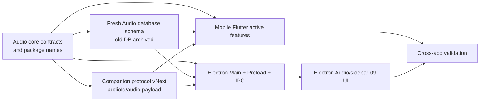
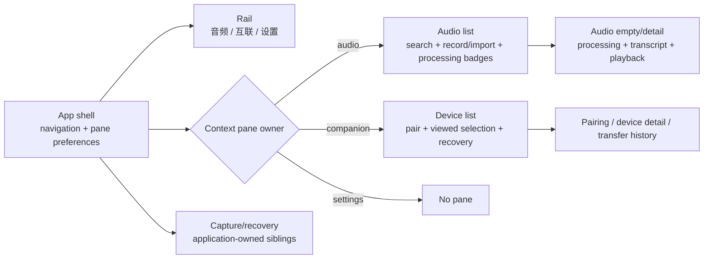
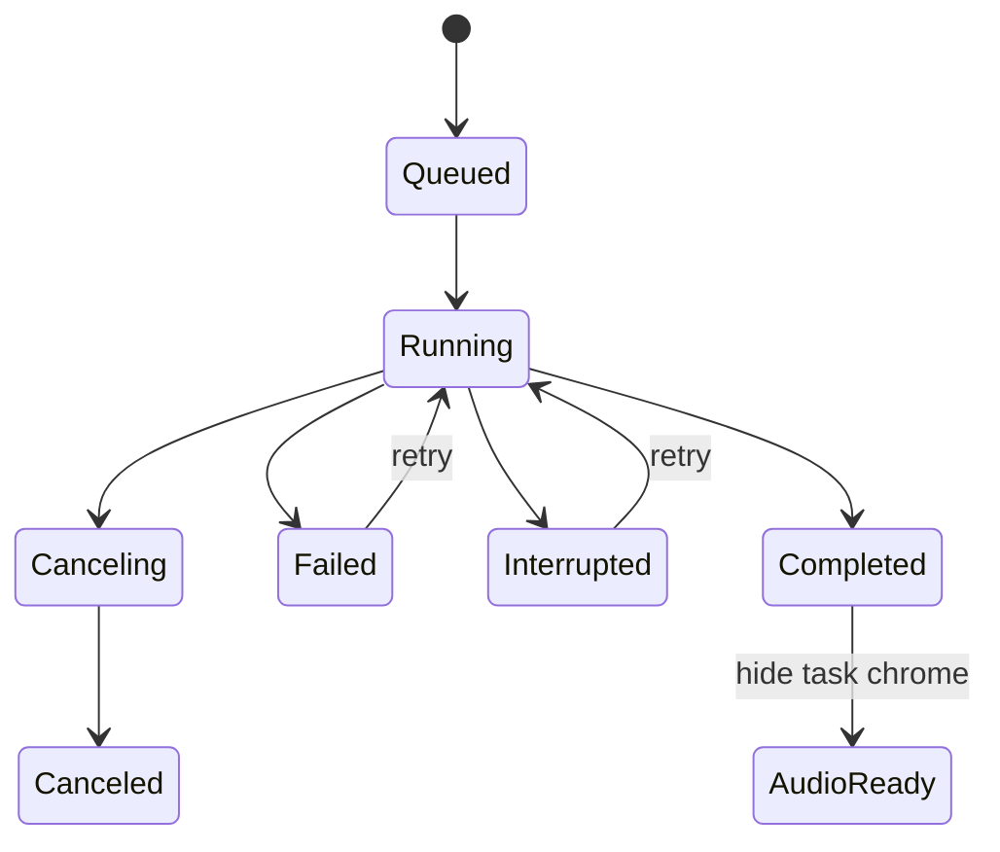

# Audio Domain Rename and Electron sidebar-09 Shell Refactor - Plan

## Goal Capsule

- **Objective:** Replace the product-wide Meeting domain with Audio, then refactor the active Electron Renderer into a `sidebar-09`-derived workstation with a permanent 音频 / 互联 / 设置 rail, an Audio or paired-device context pane, and a main workspace. Processing tasks live on their owning audio item instead of a separate destination.
- **Product authority:** The decisions marked `session-settled` below came directly from this planning session and supersede the earlier four-item rail, Renderer-only rename, standalone task pane, and single-pane 互联 proposal.
- **Architecture authority:** The rename spans active Flutter packages/apps, Electron Main/Preload/Renderer, SQLite schemas, shared contracts, native import identifiers, companion wire fields, validators, and active documentation. Historical evidence and completed plans remain historical and are not mass-rewritten.
- **Data posture:** This is a development-only clean break. Existing Meeting databases are not migrated into Audio. On first launch after the schema change, preserve recoverability by moving an old database aside and initialize a fresh Audio database; the application provides no compatibility reader or automatic import.
- **Execution profile:** Land the domain rename from low-level contracts upward, then implement the Electron shell. Use focused automated checks during development and perform packaged/manual accessibility acceptance once against a stable release candidate.
- **Stop conditions:** Stop for product direction if Meeting terminology must remain in any active user-visible or active-domain surface, if the old database must become readable again, or if selecting a paired device must actively establish/identify a live network connection. These contradict the clean-break contract or require new runtime truth.

---

## Product Contract

### Summary

“音频” is the product's primary object. It covers meetings, interviews, classes, voice notes, recordings, and imported files. The rename is not presentation-only: active code, packages, contracts, identifiers, and fresh database schemas use Audio vocabulary.

The Electron rail contains exactly 音频 / 互联 / 设置. 音频 and 互联 have independent, user-controlled context panes; settings is single-pane. Window width may change an open pane between docked and non-modal overlay presentation, but resize never changes its saved open/closed preference. Navigation may structurally hide or restore a destination pane without overwriting that module's preference.

Every processing job already owns an audio record through its current `meetingId`; after the rename that relationship becomes `audioId`. The Audio list displays active/error processing state on the corresponding item, and the selected Audio workspace owns detailed progress, cancel, and retry. Completed task chrome disappears once normal Audio content is ready.

互联's context pane lists trusted devices and changes which device is being viewed or managed. Multiple trusted devices may be stored, while the existing runtime still permits only one concurrent mobile transfer connection. Selection does not actively connect a device and must not claim which device is online. With no trusted device, the main workspace centers pairing guidance; if durable transfer history exists, a secondary “查看传输历史” entry exposes it without replacing pairing guidance.

### Actors

- A1. **Desktop workstation user:** Records/imports Audio, follows processing on the same item, reviews transcripts, manages trusted mobile devices, and changes shell layout intentionally.
- A2. **Mobile companion user:** Pairs a mobile device and transfers Audio through the renamed but behaviorally equivalent protocol.
- A3. **Keyboard or assistive-technology user:** Uses rail tooltips, context panes, focus restoration, live processing status, and semantic headings without relying on hover or color.
- A4. **Developer upgrading a development checkout:** Receives a fresh Audio database and can recover the archived old Meeting database manually, but receives no automatic data migration.

### Key Decisions

- **Use Audio everywhere active.** Rename active Meeting packages, modules, types, routes, IPC, schemas, tables, columns, protocol fields, and user copy to Audio. (session-settled: user-directed — chosen over a UI-only rename and a storage/protocol compatibility layer.) Governs R1-R7, R13-R17, R24-R29.
- **Reset instead of migrate.** Archive the old development database and initialize a fresh Audio schema; do not implement Meeting-to-Audio record migration or compatibility reads. (session-settled: user-directed — chosen over preserving existing local records.) Governs R5-R7, R28-R29, F1, AE1.
- **Use a three-item rail.** Show 音频 / 互联 / 设置 with hover and keyboard-focus tooltips; remove the standalone task destination. (session-settled: user-directed — chosen over 会议 / 任务 / 互联 / 设置.) Governs R8-R12, R16-R17, F2, AE2.
- **Audio and interconnect own panes.** Audio lists Audio items and embedded processing state; 互联 lists paired devices; settings remains single-pane. (session-settled: user-directed — chosen over a task pane and a single-pane interconnect.) Governs R9-R12, R14-R23, F2-F6, AE3-AE8.
- **Resize never changes preference.** Audio and 互联 default open on first use, persist independent preferences, and restore them after navigation. Resize changes only docked/overlay presentation. (session-settled: user-directed — chosen over breakpoint-driven collapse and always-open-on-entry.) Governs R9-R12, F2, AE3.
- **Processing belongs to Audio.** Show queued/running/error state on the Audio item and full actions in the selected Audio detail; hide completed task chrome. (session-settled: user-directed — chosen over a separate task module and permanent completed-task history.) Governs R16-R17, F4, AE5.
- **Device selection is view/management selection.** Retain multiple trusted devices and one concurrent transfer connection; do not make device selection an active connection command. (session-settled: user-directed — chosen over one stored device and new connection-control contracts.) Governs R18-R23, F5-F6, AE6-AE8.
- **Validate once before release.** Use automated checks while developing, then package once and run automated/manual acceptance against that exact candidate. (session-settled: user-directed — chosen over repeated manual acceptance and a generalized evidence publisher.) Governs R30-R31, F7, AE9.

### Requirements

**Audio domain and clean reset**

- R1. Active user-visible and active-domain terminology must use Audio/音频 rather than Meeting/会议, including package/module/type/function/route/event/schema names where they represent the renamed domain.
- R2. Active identifiers must use `audioId`/`audio_id`, Audio-prefixed types, Audio service/repository names, and Audio-oriented IPC methods. Do not retain active `Meeting*` aliases solely for compatibility.
- R3. Active package names and imports must become Audio equivalents, including the current `meeting_core`, `meeting_storage`, and `meeting_workflows` packages and owning manifests.
- R4. Historical evidence, completed plans, benchmark results, and immutable receipts may retain Meeting terminology as historical truth. Validators/removal manifests must distinguish those artifacts from active source rather than requiring a destructive global replacement.
- R5. The fresh database schema must use Audio tables/columns and a new schema version. An existing Meeting-era development database must be moved to a timestamped backup location before a new Audio database is created.
- R6. No automatic record migration, compatibility view, dual-write, or Meeting fallback is in scope. The reset must be explicit in release notes/status and testable without silently deleting the old file.
- R7. Electron and mobile companion wire contracts must rename Meeting-shaped Audio transfer fields together in one compatibility-breaking protocol revision; mixed old/new peers must fail with a clear version mismatch, not partial decoding.

**Rail, panes, and responsive behavior**

- R8. The Electron rail must remain visible and contain exactly 音频 / 互联 / 设置 in that order, with pointer-hover and keyboard-focus tooltips, accessible names, `aria-current`, visible focus, and roving keys.
- R9. Audio and 互联 each own an independent `open | closed` Renderer preference; first use defaults open. Settings renders no context pane or inactive toggle.
- R10. Width derives `docked | overlay` presentation independently. Resize, item selection, loading, and refresh never mutate preferences. Navigation may hide/reveal by module but never overwrite saved preferences.
- R11. Compact presentation is a non-modal application drawer. Rail, capture, and global recovery remain reachable. Explicit toggle/close/Escape/designated background dismissal may persist close; activating another control must not.
- R12. Overlay audio/device selection updates main content but leaves the pane open. Explicit close restores trigger focus; activating a destination control keeps focus at that destination.

**Audio list, detail, and processing**

- R13. One route-local Audio controller owns list loading, search, selection, detail, import/record commands, playback transition, and recoverable errors. Context and main surfaces must not duplicate requests or state.
- R14. The Audio context pane contains search, 开始录音, 导入音频, Audio summaries, selection, and empty/loading/error states. These are the only primary create/import controls; a no-selection main surface offers “打开音频列表”.
- R15. Switching Audio serializes `close old playback -> open new audio -> render new detail`. Failure retains the old selection/detail; success recreates the Audio-specific detail subtree so playback/search/async state cannot leak.
- R16. Every processing job belongs to an `audioId`. The Audio summary shows concise queued/running/canceling/failed/interrupted/canceled state; the selected main workspace shows detailed progress and the single applicable cancel/retry action.
- R17. Completed processing chrome disappears when the normal Audio transcript/workspace is ready. Processing reconciliation, attempt fencing, mutation authority, and one throttled live announcement remain application-owned; no standalone task selection or route remains.

**Interconnect device list, pairing, and history**

- R18. 互联 renders a paired-device context pane plus a main workspace. The pane lists every non-revoked trusted device, credential-recovery status, and an add/pair entry; it changes viewed/managed selection only.
- R19. With no trusted device or when pairing is started, main centers enable/permission/pair/reconnect guidance. With one selected trusted device, main shows its identity, trust state, and available management actions.
- R20. Multiple trusted devices are valid and must not be treated as a recovery error. With exactly one valid device it may be selected automatically; with multiple devices, restore a still-valid viewed selection or ask the user to choose rather than implying a live connection.
- R21. `credential-missing` is a per-device recovery state visible in the pane and detail. Revoked devices are excluded from the active list but durable transfer/receipt history remains available.
- R22. Production `availability: unknown` is displayed truthfully. The UI must not say “当前在线/已连接”, identify the live socket peer, or initiate a connection when a device row is selected.
- R23. Render selected-device transfer progress/history only when records exist. With no trusted device but durable history, keep pairing guidance primary and expose history through “查看传输历史”. Preserve cancel/retry/committed receipt and sender-retention truth.

**Semantic and application preservation**

- R24. Each main workspace exposes one meaningful `h1`. Remove duplicated shell titles, static Electron/Flutter subtitles, decorative eyebrows, and redundant minor headings; retain real `h2` regions, alerts, instructions, and security/receipt copy.
- R25. `CaptureWorkspace`, profile blockers, reconciliation, offline/capability warnings, processing operations, and errors remain application-owned and reachable across navigation, pane, and responsive changes.
- R26. Existing playback, editing, AI, export, companion trust/security, receipt retention, worker lifecycle, and native-helper behavior remain equivalent except for the explicit Audio rename and clean reset.
- R27. Minimum-window, 200% text, visible-focus, reduced-motion, semantic-status, and non-color-only guarantees remain intact.

**Scope, metadata, and release validation**

- R28. The rename updates active documentation, schemas, validators, fixtures, package manifests, removal manifests, and current architecture metadata; historical evidence remains byte-for-byte unchanged unless a generated binding must honestly mark it historical.
- R29. The clean reset and companion protocol break must have explicit developer/release notes and deterministic tests for old-database archival and old-protocol rejection.
- R30. During development, focused Flutter/Electron/package checks are sufficient; the complete manual accessibility matrix is not a per-edit gate.
- R31. Immediately before release, prepare packages one stable candidate once, automated acceptance runs against it, manual acceptance tests the same package, and finalize verifies the source/package identity without rebuilding.

### Key Flows

- F1. **Upgrade a development checkout:** Detect an old Meeting schema, move its database file to a timestamped backup, initialize the fresh Audio schema, and explain the reset. Covers R1-R7, R28-R29.
- F2. **Navigate and resize:** Use the three-item rail; restore Audio/互联 pane preferences; switch docked/overlay on width changes without preference writes. Covers R8-R12, R25, R27.
- F3. **Create or open Audio:** Use second-pane record/import controls, select Audio, close old playback once, then open and render the new detail. Covers R13-R15, R24-R27.
- F4. **Follow processing on Audio:** Show progress on the owning Audio row and detail, cancel/retry in one place, then remove completed task chrome when the transcript is ready. Covers R16-R17, R25-R27.
- F5. **Pair and select a device:** Use the device pane to add or choose a trusted device; render pairing or selected-device detail without claiming connection truth. Covers R18-R22, R24-R27.
- F6. **View transfer history:** Show records for the selected device; with no device, keep pairing primary and open durable history through the explicit history entry. Covers R21-R23, R26-R27.
- F7. **Validate a release candidate:** Prepare one package, run automated checks, manually test that package, and finalize without rebuilding. Covers R28-R31.

### Acceptance Examples

- AE1. An old development database is detected, archived rather than deleted, and replaced by a fresh Audio schema; no old records appear and no Meeting compatibility reader runs.
- AE2. The rail exposes exactly 音频 / 互联 / 设置 by hover and keyboard focus; no standalone task destination exists and any legacy internal task navigation normalizes to Audio.
- AE3. Audio is manually closed while 互联 remains open; after navigating through settings and resizing across the breakpoint, each module restores its own state and resize caused zero preference writes.
- AE4. Switching Audio A -> B does not open B before A closes; a failure leaves A visible, and success does not carry A playback/search state into B.
- AE5. A running job appears on its Audio row and detail with one cancel action; failed/interrupted exposes one retry action; completed processing chrome disappears when normal Audio content is ready.
- AE6. With zero trusted devices, 互联 shows an empty device pane plus pairing entry and centers pairing guidance; historical transfers, when present, are reachable through 查看传输历史.
- AE7. With multiple valid trusted devices, the pane lists all of them and selection changes viewed detail only; availability unknown never becomes an online/connected claim.
- AE8. A credential-missing device remains visible with re-pair/revoke recovery, while committed and interrupted transfer truth remains reachable and revocation does not delete durable Audio/receipts.
- AE9. One release-candidate source revision/package is shared by automated and manual results; finalize refuses a changed candidate and never rebuilds.

### Success Criteria

- Active source, contracts, schemas, packages, tests, and current docs use Audio semantics; active Meeting domain identifiers are absent outside explicitly allowlisted historical artifacts.
- The clean database reset is recoverable, explicit, and tested; no compatibility layer or migration code survives.
- Electron presents the three-item rail, independent Audio/互联 panes, integrated processing, device switching, pairing guidance, and truthful history/availability states.
- Capture/recovery and existing operational behavior remain intact.
- Development checks pass, then one stable package passes automated and manual release-candidate acceptance.

### Scope Boundaries

**In scope**

- Active Flutter packages/apps, Electron Main/Preload/Renderer/shared contracts, SQLite schemas, native import identifiers, companion protocol/interop, validators, tests, and active docs needed for the Audio rename.
- Development database archival/reset; no record migration.
- Electron shell, Audio/task composition, 互联 device pane/main flow, title semantics, accessibility, current metadata, and lightweight release validation.

**Outside this plan**

- Importing old Meeting database contents into Audio, compatibility aliases, dual-read/dual-write, or downgrade support.
- Rewriting historical evidence, completed plans, benchmark result payloads, or immutable receipts solely to remove historical terminology.
- New live-device identity, desktop-initiated connection control, multi-device concurrent transfer, new transfer retention rules, Windows certification, notarization, automatic updates, or store submission.

---

## Planning Contract

### Key Technical Decisions

- KTD1. **Rename bottom-up and break once.** Introduce Audio package/schema/contract names first, update mobile and Electron consumers together, then remove Meeting source paths and aliases in the same integration window. Mixed companion protocol versions reject explicitly.
- KTD2. **Use a recoverable clean reset.** Schema detection archives the old database file and initializes a fresh Audio schema. Tests prove the archive exists and no old row is read; the app does not ship migration logic.
- KTD3. **Normalize navigation to three product sections.** The rail exposes Audio/互联/settings. Any transient restored `tasks` section maps to Audio during the breaking release; no visible task route or duplicate navigation state remains.
- KTD4. **Separate pane preference from presentation.** Store `{audio, companion}` preferences; derive docked/overlay from one desktop breakpoint. Navigation controls structural presence, while resize never persists.
- KTD5. **Use one Audio controller and key detail after transition success.** It feeds Audio list and detail, groups processing by `audioId`, serializes playback close/open, and owns no duplicate application mutation authority.
- KTD6. **Keep processing reconciliation application-scoped.** Existing event ordering, pending actions, and live announcement stay centralized; Audio presentation consumes them by `audioId` and removes the standalone Tasks feature.
- KTD7. **Use feature-scoped viewed-device selection.** Device rows are trusted records, not sockets. Multiple valid peers are normal; credential failures are per-row recovery; transfer records filter by peer identity when detail is selected.
- KTD8. **Use a non-modal compact drawer.** No full-screen inert backdrop or focus trap; rail, capture, and recovery remain independently operable.
- KTD9. **Preserve application-owned surfaces and semantic truth.** Capture/recovery stays above routed content; each main workspace has one real heading; processing and connection status remain truthful.
- KTD10. **Keep validation lightweight until release.** Current metadata describes Audio/sidebar-09 and marks release validation pending. The final candidate binds source, package, automated results, and manual result without a generalized evidence rebinder.

### High-Level Technical Design

#### Rename and dependency order

#### Electron topology

#### Processing projection

### System-Wide Impact

- **Naming/API:** This is a breaking monorepo rename across Dart/TypeScript/Swift, package imports, IPC, persisted schema, and companion interop.
- **Data:** Existing development data is deliberately not migrated. Archival makes the reset recoverable but not readable by the new app.
- **Mobile:** Active mobile features and companion client must compile against Audio contracts in the same landing sequence; Goo UI guidance applies to any touched mobile presentation.
- **Electron:** Navigation, shell composition, playback transitions, processing placement, and companion information architecture change together.
- **Historical artifacts:** Validators need an explicit active-source allowlist so immutable historical Meeting evidence is not rewritten or mistaken for current architecture.
- **Release:** Current PASS is historical until the Audio/sidebar-09 candidate completes final packaged/manual acceptance.

### Risks and Mitigations

- **RISK1 — Partial rename leaves split contracts:** Prevent with compile-time removal of old packages/types, an active-source terminology scanner, and cross-app protocol fixtures.
- **RISK2 — Reset silently destroys data:** Move the old file to a timestamped backup before initializing Audio and test the failure/rollback path.
- **RISK3 — Mixed companion versions partially decode:** Bump the protocol/schema version and reject old fields before committing any transfer state.
- **RISK4 — Processing disappears without Tasks:** Because each job has `audioId`, join by ID and characterize queued/running/failure/completed behavior before deleting the route.
- **RISK5 — Playback state crosses Audio selection:** Serialize close/open and key the detail subtree only after success.
- **RISK6 — Device selection is mistaken for connection:** Use “查看/管理” semantics, truthful unknown availability, and no connection verb on row selection.
- **RISK7 — Modal overlay blocks capture:** Use a non-modal application drawer and explicit focus/dismissal tests.
- **RISK8 — Scope churn touches historical files:** Drive the rename from an active-source inventory and preserve immutable historical artifacts.

### Dependencies

- Design/development guidance in the sibling `flutter-ui-mobile` project before any mobile UI rename work.
- Existing Flutter workspace/package dependency graph, Electron Bun/Vite/Forge stack, SQLite schema/version mechanisms, and companion interop tests.
- Existing `meetingId` ownership on processing jobs, which makes task-to-Audio composition possible after rename.
- macOS/VoiceOver access for final release-candidate acceptance.

---

## Implementation Units

### U8. Define the Audio rename inventory and clean-reset boundary

- **Goal:** Establish the authoritative active-source rename map, historical allowlist, protocol version, and recoverable database reset before feature code moves.
- **Depends on:** None.
- **Implements:** R1-R7, R28-R29; KTD1-KTD2.
- **Files:**
  - Modify root/workspace manifests such as `pubspec.yaml` and active package/app manifests.
  - Modify active schema/version owners in `packages/meeting_storage/`, `apps/mobile-flutter/lib/data/sqlite/app_database.dart`, and `apps/desktop-electron/src/main/storage/` as they move to Audio paths/names.
  - Modify `packages/companion_protocol/`, `apps/desktop-electron/src/shared/contracts/`, and active contract validators/docs for the breaking Audio protocol revision.
  - Add focused rename/reset/old-protocol rejection tests beside those owners.
- **Approach:** Inventory active Meeting symbols and explicitly allowlist historical artifacts. Reserve Audio package/directory names, bump fresh schemas/protocol, archive old database files on detection, and reject old companion payloads before state mutation.
- **Test scenarios:** Fresh install; old DB archives successfully; archive failure leaves original untouched and blocks reset; new Audio DB initializes; no old records load; old protocol rejects clearly; new Electron/mobile fixtures interoperate.
- **Verification:** The low-level Audio contracts and reset tests pass before any consumer drops Meeting imports.

### U9. Rename shared Flutter packages and active mobile features to Audio

- **Goal:** Replace active Meeting package/module/domain names throughout Flutter and mobile code without retaining aliases.
- **Depends on:** U8.
- **Implements:** R1-R7, R26, R28-R29; KTD1-KTD2.
- **Files:**
  - Rename `packages/meeting_core/`, `packages/meeting_storage/`, and `packages/meeting_workflows/` to Audio equivalents, including libraries, pubspec names, exports, models, repositories, services, and tests.
  - Rename active `apps/mobile-flutter/lib/features/meetings/`, Meeting-shaped importing/intelligence modules, database accessors, companion repository fields, and corresponding tests to Audio equivalents.
  - Rename active schemas/docs used as build or runtime contracts; preserve historical evidence/plan payloads under the U8 allowlist.
- **Approach:** Move package boundaries first, update dependency imports, then rename active models/services/widgets/tests. Keep behavior unchanged, apply Goo guidance to touched mobile UI, and remove all active aliases after consumers compile.
- **Test scenarios:** Package imports resolve only under Audio names; mobile database opens fresh Audio schema; record/import/playback/search/export/intelligence/companion flows retain behavior; active-source terminology scan finds no unallowlisted Meeting domain names.
- **Verification:** Run package-level analysis/tests and the relevant mobile checks after the cache guard.

### U10. Rename Electron Main, Preload, IPC, storage, and native boundaries to Audio

- **Goal:** Make the Electron backend and bridge fully Audio-native before the Renderer shell consumes it.
- **Depends on:** U8.
- **Implements:** R1-R7, R13-R17, R18-R29; KTD1-KTD3.
- **Files:**
  - Rename active contracts under `apps/desktop-electron/src/shared/contracts/`, including workspace, AI, processing, application navigation, companion imports, and IPC.
  - Rename Main domain/storage/workspace/export/AI/companion services and tests under `apps/desktop-electron/src/main/`.
  - Rename `apps/desktop-electron/src/preload/api.ts` methods and active native import identifiers under `packages/desktop_macos_native/` where they express the Audio domain.
  - Update Electron fixtures/integration/packaged tests and current contract validators.
- **Approach:** Update shared types/channels first, then Main/storage, then Preload. Fresh Audio tables use `audio_id`; processing jobs retain their one-to-one owning Audio relation. Remove Meeting IPC methods and compatibility aliases once Renderer work begins.
- **Test scenarios:** Fresh Electron DB; record/import creates Audio before processing job; job lists carry `audioId`; playback/edit/AI/export operate on Audio; companion commit produces Audio; old IPC/protocol payloads reject; native import destinations use Audio identity.
- **Verification:** Main/shared/preload typecheck and integration tests pass with no active Meeting contract imports.

### U1. Build the three-item rail and pane foundation

- **Goal:** Establish 音频 / 互联 / 设置 navigation, independent Audio/互联 preferences, and docked/non-modal overlay presentation.
- **Depends on:** U10.
- **Implements:** R8-R12, R24-R27; KTD3-KTD4, KTD8-KTD9.
- **Files:**
  - Modify `apps/desktop-electron/src/renderer/App.tsx`, `components/app-sidebar.tsx`, `components/nav-main.tsx`, and reusable sidebar/tooltip primitives only where needed.
  - Create shell-level context-pane preference/presentation components under `apps/desktop-electron/src/renderer/features/shell/`.
  - Modify `apps/desktop-electron/tests/test_setup.ts`, Renderer shell tests, and navigation e2e tests.
- **Approach:** Render the permanent three-item rail; normalize any transient old task section to Audio; store `{audio, companion}` preferences; derive presentation at a supported desktop breakpoint; use a non-modal drawer and a close-reason matrix that excludes rail/capture/recovery activation from preference writes.
- **Test scenarios:** Rail tooltip/roving keys; first-use defaults; independent preference restore; settings hides pane without overwriting it; resize and item/navigation changes cause zero writes; explicit close causes one; focus follows destination controls; 880 px overlay keeps rail/capture reachable.
- **Verification:** Shell/navigation tests pass before feature composition moves.

### U2. Compose Audio list, detail, and processing under one controller

- **Goal:** Build the Audio context list and main workspace, integrate jobs by `audioId`, and remove the standalone Tasks route/UI.
- **Depends on:** U1, U10.
- **Implements:** R13-R17, R24-R27; KTD5-KTD6, KTD9.
- **Files:**
  - Rename/refactor the active Electron Meeting workspace feature into Audio controller, context pane, and main workspace modules.
  - Remove the redundant library wrapper and standalone `apps/desktop-electron/src/renderer/features/tasks/tasks-feature.tsx`; retain the processing reconciliation hook under an Audio-neutral processing owner.
  - Update Audio workspace, import-processing, navigation, playback, AI, and capture tests.
- **Approach:** Put search/record/import/list plus processing badges in the pane; use only an “打开音频列表” recovery action in no-selection main. Serialize playback transition and key detail after success. Group app-scoped processing by `audioId`; render full cancel/retry in selected Audio only and hide completed chrome.
- **Test scenarios:** Empty/no selection; record/import entry ownership; queued/running/canceling/failed/interrupted/canceled/completed projection; one live region; cancel/retry fencing; Audio removal; search filtering; pane hide/show; A -> B close/open failure and rapid intent fencing; no Tasks rail/route.
- **Verification:** Audio workspace, processing, navigation, AI/playback, and capture tests pass.

### U4. Build 互联 device pane and pairing/detail workspace

- **Goal:** List and switch viewed trusted devices in the context pane while keeping pairing, recovery, selected-device detail, and history truthful in main.
- **Depends on:** U1, U10.
- **Implements:** R18-R23, R24-R27; KTD7-KTD9.
- **Files:**
  - Refactor the active Electron companion Renderer feature into device-context and main-workspace surfaces.
  - Update companion fixtures, transfer-flow tests, shell tests, and Electron/mobile interop fixtures renamed by U8-U10.
- **Approach:** Preserve opt-in, permission, invite, revoke, cancel/retry, revision rejection, and receipts. List all valid/credential-missing trusted devices; treat multiple valid devices as normal. Selection changes view only. Pairing is primary with no device; historical records open through a secondary entry. Filter selected detail/history by peer identity and never invent online state.
- **Test scenarios:** Disabled/permission/pairing error; zero/one/multiple valid devices; selection restore; credential missing; revoked-only; unknown availability; no-device history entry; selected-device progress/retry/receipt; stale snapshot rejection; selection does not call a connect API.
- **Verification:** Companion Renderer and cross-app protocol tests pass with accessible pane/detail semantics.

### U5. Complete semantics, active-source cleanup, metadata, and regression coverage

- **Goal:** Close cross-feature accessibility/lifecycle seams, remove active Meeting terminology, and make current metadata honest before release validation.
- **Depends on:** U9, U2, U4.
- **Implements:** R1-R31; KTD1-KTD10.
- **Files:**
  - Update affected Electron/mobile tests, current README/architecture/contracts, active validators, current scope/removal manifests, and status pages.
  - Preserve historical evidence, completed plans, and immutable receipts under the explicit allowlist.
- **Approach:** Run the active-source terminology scanner; audit one-H1/named-region/live-status semantics; prove capture/recovery survives navigation/panes; update current sidebar/audio architecture declarations; mark final packaged/manual validation pending rather than reusing historical PASS.
- **Test scenarios:** No unallowlisted active Meeting symbol; historical artifacts unchanged; three rail labels; all Audio processing and companion states; focus/zoom/reduced-motion invariants; clean DB reset; protocol mismatch; current metadata describes Audio/sidebar-09.
- **Verification:** Focused suites, full Flutter/Electron checks, validators, and the best-effort UI watcher pass. Full manual acceptance remains deferred to U6.

### U6. Validate one stable release-candidate package

- **Goal:** Complete packaged and manual acceptance once, immediately before release, against the same candidate.
- **Depends on:** U5 and a committed release-candidate revision.
- **Implements:** R30-R31; KTD10.
- **Files:**
  - Adjust the existing Electron closure script/tests for package-once prepare/finalize behavior without a generalized rebinder.
  - Add a versioned lightweight Audio/sidebar-09 validation set and manual VoiceOver record; update current scope/status only after success.
- **Approach:** Prepare packages once and records source/package identity plus automated results. Manually test the same package. Finalize verifies unchanged identity, records the manual result, and validates without rebuilding. UI/behavior/package changes require a new candidate; unrelated docs do not.
- **Test scenarios:** One candidate identity; finalize rejects changed source/package or missing manual result; package launches without dev server; Audio/互联/settings flows, DB reset messaging, capture, 880 px, 200% text, reduced motion, and protocol mismatch all behave as planned; historical artifacts remain unchanged.
- **Verification:** Complete prepare, manual matrix, finalize, and repository validation immediately before release.

---

## Verification Contract

### Development gates

- Run `python3 tool/build_cache_guard.py --wait-for-idle` before Flutter, Gradle, Xcode, Electron packaging, tests, benchmarks, or code generation that creates caches.
- U8-U10: run focused schema/reset, companion protocol/interop, Flutter package/mobile, Electron Main/shared/preload, native import, and validator tests.
- U1-U5: run focused Electron Renderer Audio/shell/processing/companion/capture tests, then the full Electron check.
- Run the repository's normal `./tool/dev_check.sh` only after current metadata/validators describe the breaking Audio state honestly; never weaken a gate to make an intermediate partial rename pass.
- Run `./tool/ensure_ui_watcher.sh` after relevant code changes.

### Release-candidate gate

This is not a per-edit loop. After U5 stabilizes, prepare one committed macOS candidate and automated results. Complete the manual matrix against that exact package, then finalize without rebuilding and run final repository validation.

### Manual acceptance matrix

- Old Meeting database is archived and the reset is clearly communicated; a fresh Audio database opens.
- Rail exposes 音频 / 互联 / 设置 by hover/focus; Audio and 互联 preferences survive navigation/restart; resize alone never changes them.
- 880 px non-modal drawers keep rail/capture/recovery reachable; explicit close and destination-focus behavior are correct.
- Audio record/import/list/detail, processing progress/cancel/retry/completion, playback switching, search, editing, AI, and export remain usable.
- 互联 device list, pairing guide, multiple trusted-device viewing, credential recovery, history entry, transfers, and unknown availability remain truthful.
- Mobile/Electron new protocol interoperate; an old peer is rejected clearly.
- At 200% text and reduced motion, controls remain usable and state is not conveyed by color alone.

---

## Definition of Done

- [ ] Active product/domain code, packages, contracts, fresh schemas, IPC, protocol fields, tests, and current docs use Audio terminology; historical artifacts are explicitly allowlisted.
- [ ] Old development databases are archived, fresh Audio databases initialize, and no migration/compatibility layer remains.
- [ ] Mobile and Electron use the same breaking Audio companion protocol and reject old peers before state mutation.
- [ ] Electron rail contains exactly 音频 / 互联 / 设置 with tooltip, keyboard, focus, and current-page semantics.
- [ ] Audio and 互联 alone have independent context-pane preferences; navigation restores them and resize never changes them.
- [ ] Audio owns search/record/import/list/detail and processing; no standalone Tasks route/UI or duplicate task selection remains.
- [ ] Audio playback transitions close/open once, retain old detail on failure, and reset detail-local state after success.
- [ ] 互联 lists multiple trusted devices, switches viewed/managed detail only, centers pairing when needed, exposes durable history, and never fabricates connection truth.
- [ ] Each main workspace has one meaningful heading; capture/recovery and existing operational behavior remain intact.
- [ ] Current metadata describes Audio/sidebar-09 and historical Meeting evidence remains unchanged and historical.
- [ ] Development checks pass; one stable package then shares its identity with automated and manual release results, and finalize does not rebuild.
- [ ] Existing unrelated worktree changes are preserved and no generated validation hash is hand-edited.

---

## Sources and Grounding

- Electron active owners: `apps/desktop-electron/src/shared/contracts/`, `src/main/`, `src/preload/`, `src/renderer/`, and corresponding tests.
- Flutter active owners: `packages/meeting_core/`, `packages/meeting_storage/`, `packages/meeting_workflows/`, `packages/companion_protocol/`, and `apps/mobile-flutter/` before their planned Audio renames.
- Existing processing relation: active processing contracts/repositories already require a positive `meetingId` and create the owning record before the job; U8-U10 rename that invariant to `audioId`.
- Architecture boundary: `docs/solutions/architecture-patterns/desktop-first-workstation-boundaries.md` remains useful for runtime ownership, but its Meeting vocabulary becomes historical/needs an active Audio successor.
- Current validation owners: `tool/validate_electron_desktop_scope.py`, `tool/check_electron_desktop.sh`, current scope/removal/status files, and frozen historical U12 evidence.
