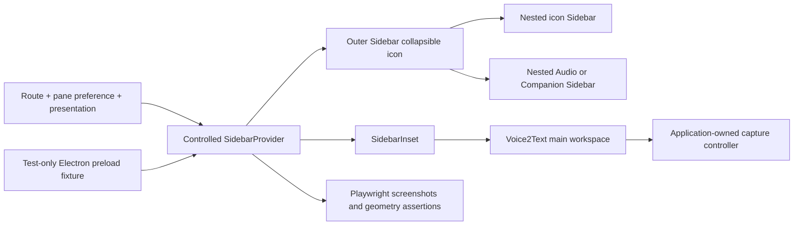

# Electron Sidebar-09 Visual Fidelity Correction - Plan

## Goal Capsule

- **Objective:** Make the Electron workstation visibly and structurally faithful to the official shadcn `new-york-v4/sidebar-09` block while preserving every existing Voice2Text workflow, responsive pane preference, platform boundary, and accessibility behavior.
- **Means:** Bind the implementation to a pinned official block revision, rebuild the shell as one nested Sidebar composition, migrate visible controls to current shadcn primitives, and add deterministic screenshot plus geometry regression coverage. (KTD1-KTD5)
- **Authority:** The confirmed Product Contract in this plan governs product behavior. The pinned shadcn sources govern shell composition and visual grammar. Existing Renderer controllers and tests govern Voice2Text behavior. `flutter-ui-mobile/DESIGN.md` and `flutter-ui-mobile/DOC.md` continue to govern Flutter only.
- **Execution profile:** Keep implementation inside `apps/desktop-electron` except for repository validation, architecture/status documentation, and release-candidate evidence that already describes this workstation.
- **Tail ownership:** The implementation owns focused UI tests, deterministic visual baselines, repository checks, release evidence invalidation, and revalidation of one clean packaged candidate.
- **Stop conditions:** Stop for product direction if fidelity requires copying mail-demo behavior, changing the 1024px pane contract, changing Main/Preload/shared/native contracts, altering capture or processing semantics, or modifying Flutter/Goo UI.

---

## Product Contract

### Summary

The Electron workstation will use the current official `sidebar-09` composition as its structural and visual authority. The result keeps Voice2Text navigation and business content, but matches the block's full-height rail, nested context pane, fixed desktop proportions, flat list treatment, inset header, spacing, tokens, and component states.

The correction is not a new product flow. It is a Renderer presentation refactor backed by visual evidence that did not exist when the current three-column concept was implemented.

### Problem Frame

The current implementation started from a `sidebar-07` scaffold and later split the interface into three independent siblings: a 4rem icon Sidebar, a hand-written `w-72 bg-card` context `aside`, and a `SidebarInset`. The second column uses rounded cards instead of the official flat row system. The third column and capture controller contain native controls and arbitrary card stacks. Existing tests prove behavior and semantics but do not prove viewport geometry or visual fidelity, so the divergence could still be reported as a pass.

The base primitive is not the main defect. `components/ui/sidebar.tsx` already aligns closely with the current Tailwind v4 Sidebar API, and `components.json` correctly uses `style: new-york`. The correction must target composition and application surfaces rather than bulk-overwriting working primitives.

### Key Decisions

- **Adopt the official block as the visual and composition authority.** Keep Voice2Text content, but reproduce the pinned block's nested Sidebar structure and visual grammar. (session-settled: user-directed — chosen over a concept-only three-column imitation: the current layout diverges materially from the official sidebar-09 demo.) Governs R1-R9, R18-R20.
- **Preserve Voice2Text behavior over demo behavior.** Keep the 1024px docked/overlay contract, independent pane preferences, non-modal access, and application workflows instead of copying the mail demo's data, unread switch, or `md` breakpoint behavior. (session-settled: user-approved — chosen over a literal demo copy: the user confirmed that real Voice2Text content and behavior must remain.) Governs R10-R17, R21-R24.
- **Require visual evidence for visual completion.** Screenshot baselines, geometry assertions, and one manual side-by-side review are required in addition to current semantic tests. (session-settled: user-approved — chosen over behavior-only acceptance: the reported mismatch passed the existing test suite.) Governs R25-R31.

### Requirements

**Pinned authority and shell geometry**

- R1. Bind the correction to shadcn-ui commit `25be24cca34d06eed29a4779c3f48c4816aa812c`, including its `sidebar-09` page, block composition, Sidebar primitive, and registry manifest.
- R2. Keep `components.json` at `style: new-york`; treat `new-york-v4` as the resolved Tailwind v4 registry path, not as a persisted style value.
- R3. Use one `SidebarProvider` with `--sidebar-width: 350px`, one outer `Sidebar collapsible="icon"`, one nested icon Sidebar, one nested context Sidebar, and one sibling `SidebarInset`.
- R4. The icon rail must occupy the full viewport height. Its content width must use `--sidebar-width-icon: 3rem`, and its bordered nested Sidebar must use the official `calc(var(--sidebar-width-icon) + 1px)` width.
- R5. The rail must retain exactly 音频, 互联, 设置 in that order: application mark in `SidebarHeader`, Audio and Companion in `SidebarContent`, and Settings in `SidebarFooter`, without inventing a demo account or reviving unused sidebar-07 components.
- R6. `SidebarInset` must be the only `main` landmark. Its header must use the official sticky, bordered inset treatment while retaining Voice2Text's pane trigger, title, offline state, and main-content target.
- R7. At `>=1024px`, an open Audio or Companion pane must produce a 350px total sidebar and push `SidebarInset`; a closed pane or Settings must leave only the icon rail.
- R8. At `880-1023px`, an open context pane must begin after the rail as a non-modal overlay while the layout gap remains rail-width and `SidebarInset` is not pushed.
- R9. Electron's 880px minimum window remains unchanged. Below-880 development rendering must not crash, but shadcn's native `<768px` Sheet branch is not a product acceptance target.

**Pane state and second-column content**

- R10. `voice2text.shell.context-panes.v1` remains the only persistent authority for independent Audio and Companion open preferences.
- R11. Route, preference, and presentation derive shell state. Resize and route changes must not write pane preference; only explicit toggle, close button, Escape, and designated background dismissal may do so.
- R12. The official Sidebar cookie and Meta/Ctrl+B shortcut must not become a second state authority or a new visible behavior. The workstation integration must disable or bypass them while retaining official defaults for other consumers.
- R13. Explicit close, Escape, and background dismissal must restore focus to the active pane trigger. Navigation to Settings must not focus an unmounted trigger.
- R14. Pane child actions, search, retries, Audio selection, device selection, recording, import, and capture interaction must not dismiss an open overlay.
- R15. Audio and Companion context panes must use `SidebarHeader`, `SidebarInput` where applicable, `SidebarContent`, `SidebarGroup`, and full-width rows separated by borders instead of independent rounded cards.
- R16. The Audio pane must preserve loading, error/retry, empty, search-empty, list, selected, processing, record, and import states. The Companion pane must preserve loading, error, no-device, multiple-device, selected-device, and pairing entry states.
- R17. Do not add mail-demo data, unread behavior, account controls, network connection claims, or any other feature that does not already exist in Voice2Text.

**Third-column controls and application surfaces**

- R18. Add only the missing current shadcn primitives needed by visible surfaces, including `Label`, `Switch`, `Select`, `Slider`, `Checkbox`, and `Progress`; add `Textarea`, `Card`, `Badge`, `Alert`, or `Dialog` only when a concrete existing surface needs their semantics.
- R19. Replace visible raw `select`, `input[type=range]`, `input[type=checkbox]`, `progress`, and transcript `textarea` controls across Audio, Capture, Companion, Caption, Audio AI, and Settings without changing values, ranges, steps, disabled states, continuous seek behavior, IPC frequency, keyboard shortcuts, or labels.
- R20. Reduce redundant rounded card stacks and align surfaces to shadcn spacing, border, type, focus, and state tokens. Retain cards and alerts when they communicate a real grouping, error, warning, or modal boundary.
- R21. Keep capture application-owned and mounted across route changes. Its collapsed, setup, active, paused, partial, recovery, busy, and error states must remain reachable and scrollable.
- R22. The capture controller must remain a viewport-fixed bottom-right utility surface with a 24rem width, 1rem viewport inset, `calc(100svh - 2rem)` maximum height, internal scrolling, and z-index 30 above the context pane's z-index 20; at the supported 880x620 minimum window it must remain fully contained and interactive without closing the pane.
- R23. Preserve navigation, playback close/open ordering, processing reconciliation, editing, export, AI, pairing, transfer, capture/recovery, offline, profile, and capability behavior.
- R24. Do not change Electron Main, Preload, storage, protocol, worker, Flutter, or Goo contracts except for test-only fixture wiring that remains outside production Renderer code.

**Accessibility and visual verification**

- R25. Preserve accessible names, `aria-current`, roving keyboard navigation, tooltips, visible focus, one meaningful `h1`, status announcements, and non-color-only states.
- R26. Every migrated Select, Slider, Checkbox, Switch, and Progress control must retain a programmatic label and expose its value or state through native or Radix semantics.
- R27. Add a Playwright visual lane that launches the repository-pinned Electron runtime through a test-only Main/Preload harness, renders the production Renderer entry, and exposes a typed deterministic `window.voice2text` fixture without a production mock switch.
- R28. Make macOS arm64, the repository-pinned Electron/Chromium runtime, DPR 1, `zh-CN`, light color mode, reduced motion, deterministic time/data, cleared storage, and the declared macOS font stack the canonical golden environment; other hosts run geometry and interaction checks but cannot update canonical baselines.
- R29. Check in five named baselines: 1240x820 Audio selected with pane open and active capture; 1240x820 Audio with pane closed; 1240x820 Settings; 880x620 Audio overlay with capture recovery and internal scrolling; and 1240x820 Companion with multiple devices.
- R30. Add geometry assertions with a 1px tolerance for viewport-height wrapper/rail, 3rem rail content, the bordered rail divider, 350px expanded sidebar, docked inset start, overlay inset start, context-pane bounds, flat list rows, and capture viewport containment.
- R31. Preserve and update current Vitest interaction coverage for navigation, preferences, dismissal reasons, focus restoration, Audio/Companion states, migrated controls, and capture behavior.

**Documentation and release truth**

- R32. Update the Electron README and shell architecture document to name `sidebar-09`, cite the pinned authority, and explain where Voice2Text intentionally differs from the demo.
- R33. Before implementation changes claim completion, archive the current `candidate.json`, `manual.json`, and `final.json` under the existing `superseded` convention with an invalidation record that names the visual-fidelity defect.
- R34. Set `audio-sidebar-workstation.json` to `DEVELOPMENT_COMPLETE_RELEASE_VALIDATION_PENDING` with its existing schema token `PENDING_U6_STABLE_CANDIDATE` and null candidate bindings until a new stable package passes acceptance; the token remains historical schema vocabulary and does not refer to this plan's unit numbering.
- R35. Extend manual checks with official side-by-side composition review, fixed-window geometry, second-column row treatment, migrated control states, focus, and 880px capture reachability.
- R36. After implementation, tests, documentation, and candidate invalidation are committed at a clean HEAD, prepare one package, test that same artifact, complete manual acceptance, and finalize without rebuilding.

### Acceptance Examples

- AE1. **Docked Audio shell**
  - **Covers:** R3-R8, R15-R16, R25, R29-R30
  - **Given:** A 1240x820 Electron fixture with Audio open, selected, and actively recording.
  - **When:** The shell settles with deterministic data.
  - **Then:** The rail fills the viewport, the sidebar ends at 350px, the inset begins at that edge, and the Audio list is a continuous flat row stack.
- AE2. **Narrow non-modal overlay**
  - **Covers:** R7-R14, R21-R22, R29-R31
  - **Given:** An 880x620 Electron fixture with Audio preference open and capture recovery content taller than the controller viewport.
  - **When:** The context pane is shown.
  - **Then:** Only the rail consumes layout width, the pane overlays from the rail edge, main does not move, and capture remains contained, internally scrollable, visible, and operable.
- AE3. **Independent pane preferences**
  - **Covers:** R10-R14, R31
  - **Given:** Audio is closed and Companion is open.
  - **When:** The user visits Settings, crosses the 1024px breakpoint, and returns through Audio and Companion.
  - **Then:** Each pane restores its own state, resize and Settings write nothing, and no Sidebar cookie controls the result.
- AE4. **Focus-safe dismissal and navigation**
  - **Covers:** R12-R14, R25-R26, R31
  - **Given:** The narrow context pane is open.
  - **When:** The user closes it by button, Escape, or background, then separately navigates to Settings from the rail.
  - **Then:** Explicit dismissal returns focus to the active trigger, navigation focus stays on its destination, and child controls never dismiss the pane.
- AE5. **Control migration without behavior drift**
  - **Covers:** R18-R26, R31
  - **Given:** Audio playback, speaker editing, capture setup, transfer progress, caption progress, and AI settings fixtures.
  - **When:** The user changes every migrated control.
  - **Then:** Values, steps, pending/disabled behavior, call counts, labels, and accessible state match the pre-refactor contract.
- AE6. **Release truth**
  - **Covers:** R32-R36
  - **Given:** The old candidate is bound to the visually divergent Renderer.
  - **When:** Work starts and later reaches a clean stable HEAD.
  - **Then:** Old receipts remain immutable under `superseded`, the manifest stops claiming the old pass, and only one newly packaged artifact can restore validated status.

### Success Criteria

- A manual side-by-side comparison against the pinned official demo confirms the same shell proportions, vertical continuity, nested-column composition, second-column density, and inset header grammar.
- All five visual baselines and their geometry assertions pass in the canonical environment.
- Existing Renderer behavior and accessibility tests pass after the structural and control migration.
- No active raw select, range, checkbox, progress, or transcript textarea control remains in the visible Renderer scope without an explicit documented exception.
- A new package-once candidate, not the superseded package, owns the final automated and manual evidence.

### Scope Boundaries

**In scope**

- Electron Renderer shell composition, current shadcn primitives, visual tokens, Audio/Companion context panes, visible third-column controls, capture presentation, deterministic visual tests, UI documentation, and current workstation release evidence.

**Outside this plan**

- Flutter/Goo UI, Electron Main/Preload/shared/storage/protocol/native-worker behavior, new Audio or Companion features, a mail client imitation, a new mobile breakpoint, demo account controls, dark-theme redesign, Windows certification, notarization, or production release.

---

## Planning Contract

### Key Technical Decisions

- KTD1. **Pin source, then adapt application content.** Use the official shadcn-ui commit named by R1 as the code and geometry reference. Copy its composition and load-bearing classes, not its mail data or behavior. (session-settled: user-directed — chosen over a concept-only three-column imitation: the current layout diverges materially from the official sidebar-09 demo.)
- KTD2. **Selectively sync primitives.** Keep `components.json` and the current Sidebar primitive unless a diff against the pinned source identifies functional drift. Use shadcn CLI dry-run/diff or the pinned registry files to add only the primitives required by R18, then review all generated changes.
- KTD3. **Keep one pane DOM and one state authority.** Move the context pane inside the outer Sidebar and switch its layout with `data-presentation` derived by `useContextPaneShell`. Do not render separate docked and overlay pane bodies. Extend the local Provider narrowly to bypass its cookie and keyboard shortcut for this controlled workstation use.
- KTD4. **Separate primitives, shell policy, and business content.** `components/ui` owns near-registry primitives. `features/shell` owns layout, presentation, persistence, and dismissal. Audio/Companion/Capture/Settings features keep controllers and map existing state into the shared visual grammar.
- KTD5. **Use deterministic Electron goldens plus semantic tests.** Launch the repository-pinned Electron runtime with a test-only Main/Preload harness that is excluded from Forge packaging. Keep Vitest as the behavior/accessibility lane. Use geometry assertions to diagnose structural drift independently of pixel diffs.
- KTD6. **Invalidate before replacing evidence.** Move the current three receipts and a new invalidation record to a timestamped `superseded` directory, project the manifest to its existing pending schema, then use the existing package-once prepare/manual/finalize flow after a clean implementation commit.

### High-Level Technical Design

At desktop widths, the outer Sidebar gap is 350px while the pane is open and icon-width while it is closed. At 880-1023px, presentation remains `overlay`; the outer fixed container may retain its full 350px visual width, but the layout gap stays icon-width. The same pane subtree remains mounted in one host, so resize does not duplicate requests or reset selection.

### Responsive State Matrix

| Route and width | Saved preference | Required result |
| --- | --- | --- |
| Audio/Companion, `>=1024px` | open | Full-height rail plus nested pane; total sidebar 350px; inset pushed |
| Audio/Companion, `>=1024px` | closed | Rail only; inset begins after rail |
| Audio/Companion, `880-1023px` | open | Rail gap only; nested pane overlays from rail edge; inset not pushed |
| Audio/Companion, `880-1023px` | closed | Rail only |
| Settings, supported width | either | Rail only; saved Audio/Companion values unchanged |

### Pane Composition Map

| Pane | Fixed header order | Scrolling content | Footer |
| --- | --- | --- | --- |
| Audio | Title and close action; search input; record primary action plus import secondary action | Status or error row when present, then loading/empty/search-empty/list rows with selected and processing states | None |
| Companion | Title and close action; helper copy; add/pair action | Loading/error/no-device state or flat trusted-device rows with selected and credential-recovery states | None |

Header controls remain visible while the list scrolls. Errors that replace the list stay in the scrolling content so header actions remain reachable. The map fixes Voice2Text action hierarchy where the mail demo has no equivalent.

### Control Migration Map

| Existing control | Target primitive | Preserved semantics |
| --- | --- | --- |
| Audio segment speaker, playback speed, speaker merge target/source, capture microphone, AI provider | `Select` + `Label` | Current option values, disabled states, and one change event per committed selection |
| Audio playback position | `Slider` + `Label` | Current min/max/value, continuous seek cadence, disabled state, and accessible current value |
| Capture local-caption option | `Switch` + `Label` | Independently reversible on/off setting that invalidates preflight exactly as today |
| Per-audio cloud-processing consent | `Checkbox` + `Label` | Explicit one-operation acknowledgement that gates confirmation |
| Audio processing, Companion transfer, Caption processing | `Progress` + programmatic label | Current determinate/indeterminate state, current value, and live status copy |
| Transcript segment editor | `Textarea` + `Label` | Current value, empty guard, keyboard save shortcut, and resize policy |

### Surface Disposition Map

| Surface | Disposition |
| --- | --- |
| Audio transcript list | One bordered transcript viewport; segment rows use separators and selected/editing states, not one card per row |
| Audio playback, speaker, export, and AI tools | Flat titled sections separated by borders; one compact bordered control group only where controls form one operation |
| Companion main views | One primary view surface per pairing, device, or history state; device/transfer rows remain flat and progress stays inline |
| Caption and Settings | Flat sections with separators; use `Alert` for blocking/error truth and `Dialog` only for existing modal tasks |
| Capture | One shadcn `Card`-grammar utility surface at the R22 bounds; internal status, alert, recovery, and active/setup sections do not introduce nested decorative cards |

### Sequencing Constraints

1. Archive and invalidate the old release candidate before any new visual claim is recorded.
2. Establish missing primitives and the deterministic fixture before large consumer migrations.
3. Rebuild shell geometry while existing pane bodies and business controllers remain intact.
4. Migrate the second column, then third-column controls and capture surfaces.
5. Update behavior tests before recording final screenshots.
6. Record and manually compare baselines only after the shell and fixture are stable.
7. Package and revalidate only from a clean committed candidate after all prior units pass.

### Risks and Dependencies

- **Radix portal test behavior:** Select and other primitives may require pointer-capture, `scrollIntoView`, or portal setup in JSDOM. Add only the minimal shared test stubs and keep assertions on roles and behavior.
- **Baseline noise:** Font, browser, OS, DPR, time, and animation drift can create false failures. Canonical screenshots update only on the R28 macOS arm64 target; other targets still run semantic and geometry assertions.
- **Provider state duplication:** The official Sidebar Provider writes a cookie and owns a shortcut by default. Controlled integration must prove neither becomes authoritative.
- **Overlay reachability:** A modal Sheet/Dialog would trap focus and block rail or capture access. Keep the existing non-modal contract and test its explicit dismissal rules.
- **Primitive over-customization:** Blindly adding the whole block can overwrite local code and import demo behavior. Diff the pinned registry and keep application policy outside primitives.
- **Existing user edits:** `apps/desktop-electron/README.md` and product status documents already have local changes in the planning worktree. Merge around them and do not overwrite unrelated edits.

### Sources and Research

- Official rendered block: `https://ui.shadcn.com/view/new-york-v4/sidebar-09`
- Pinned official page: `https://github.com/shadcn-ui/ui/blob/25be24cca34d06eed29a4779c3f48c4816aa812c/apps/v4/registry/new-york-v4/blocks/sidebar-09/page.tsx`
- Pinned official composition: `https://github.com/shadcn-ui/ui/blob/25be24cca34d06eed29a4779c3f48c4816aa812c/apps/v4/registry/new-york-v4/blocks/sidebar-09/components/app-sidebar.tsx`
- Pinned Sidebar primitive: `https://github.com/shadcn-ui/ui/blob/25be24cca34d06eed29a4779c3f48c4816aa812c/apps/v4/registry/new-york-v4/ui/sidebar.tsx`
- Registry manifest: `https://ui.shadcn.com/r/styles/new-york-v4/sidebar-09.json`
- shadcn configuration and CLI: `https://ui.shadcn.com/docs/components-json`, `https://ui.shadcn.com/docs/cli`, `https://ui.shadcn.com/docs/tailwind-v4`
- Playwright Electron and screenshots: `https://playwright.dev/docs/api/class-electron`, `https://playwright.dev/docs/test-snapshots`, `https://playwright.dev/docs/best-practices`
- Repository boundary learning: `docs/solutions/architecture-patterns/desktop-first-workstation-boundaries.md`
- Historical broad plan retained for context: `docs/plans/2026-08-17-1554-refactor-electron-sidebar-09-context-shell-plan.md`

---

## Implementation Units

### U1. Invalidate the visually divergent candidate

- **Goal:** Stop the active product manifest from claiming the old Renderer is a valid sidebar-09 implementation before new visual evidence is created.
- **Requirements:** R33-R34
- **Files:** `docs/product/audio-sidebar-workstation.json`, `docs/product/audio-sidebar-release`, `docs/product/desktop-workstation-status.md`, `tool/test_validate_audio_sidebar_workstation.py`
- **Dependencies:** None
- **Approach:** Move the active candidate, manual, and final receipts unchanged into one timestamped `superseded` directory. Add a separate invalidation record naming the visual-fidelity defect. Project the manifest to its existing pending status and null candidate bindings without rewriting historical receipt contents.
- **Test scenarios:** All three receipts and their hashes remain preserved; active receipt paths no longer exist; the pending manifest validates; the manifest cannot claim `RELEASE_VALIDATED` with null bindings.
- **Verification:** Run `python3 -m unittest tool/test_validate_audio_sidebar_workstation.py && python3 tool/validate_audio_sidebar_workstation.py`.

### U2. Bind the official source and add missing primitives

- **Goal:** Establish a reviewed primitive and token baseline without overwriting working local shadcn code.
- **Requirements:** R1-R2, R18-R20, R26
- **Files:** `apps/desktop-electron/components.json`, `apps/desktop-electron/src/renderer/components/ui/sidebar.tsx`, new files under `apps/desktop-electron/src/renderer/components/ui`, `apps/desktop-electron/src/renderer/index.css`, `apps/desktop-electron/package.json`, `apps/desktop-electron/bun.lock`
- **Dependencies:** U1
- **Approach:** Compare local Sidebar and tokens with the pinned registry. Keep `style: new-york`. Add only required primitives and the narrow controlled-Provider adaptation from KTD2-KTD3. Preserve local aliases and current `radix-ui` imports.
- **Test scenarios:** Provider controlled/open/closed behavior; persistence and shortcut bypass; labels and value semantics for each added control; dark tokens compile even though new dark visual design is out of scope.
- **Verification:** Run focused primitive and shell Vitest after the build cache guard, then `bun run --cwd apps/desktop-electron typecheck` and `bun run --cwd apps/desktop-electron lint`.

### U3. Rebuild the nested Sidebar shell

- **Goal:** Replace the sibling rail/aside composition with the pinned outer Sidebar, nested rail, nested pane, and one SidebarInset.
- **Requirements:** R3-R14, R21-R25
- **Files:** `apps/desktop-electron/src/renderer/App.tsx`, `apps/desktop-electron/src/renderer/components/app-sidebar.tsx`, `apps/desktop-electron/src/renderer/components/nav-main.tsx`, `apps/desktop-electron/src/renderer/features/shell/context-pane-shell.tsx`, `apps/desktop-electron/src/renderer/features/shell/use-context-pane-shell.ts`, `apps/desktop-electron/src/renderer/index.css`
- **Dependencies:** U2
- **Approach:** Move pane composition into `AppSidebar`, retain one pane child, and pass derived `open` and `presentation` state into the shell. Use data attributes to reduce the overlay layout gap without duplicating the 1024px constant in CSS. Move the inner `main` content container to a `div` or `section`. Remove the unused context placeholder after references are cleared.
- **Test scenarios:** Every row of the Responsive State Matrix; Audio/Companion preference restoration; Settings no-write behavior; all explicit dismissal reasons; child controls do not dismiss; overlay-to-docked resize does not remount data controllers; capture remains mounted; Ctrl+B and cookie are inert.
- **Verification:** Update and run `tests/unit/renderer/shell_test.tsx` and `tests/e2e/sidebar_navigation_test.ts` after the build cache guard.

### U4. Recompose Audio and Companion context panes

- **Goal:** Match the official second-column structure and density while retaining every existing list state and business action.
- **Requirements:** R15-R20, R23, R25-R26
- **Files:** `apps/desktop-electron/src/renderer/features/audios/audio-route-feature.tsx`, `apps/desktop-electron/src/renderer/features/companion/companion-feature.tsx`, shared shell components introduced by U3, `apps/desktop-electron/tests/unit/renderer/audio_route_test.tsx`, `apps/desktop-electron/tests/unit/renderer/companion_route_test.tsx`
- **Dependencies:** U3
- **Approach:** Implement the Pane Composition Map. Migrate Audio-list and Companion-transfer progress in these owned files to the shared Progress primitive. Keep route controllers unchanged and avoid adding mail-demo features.
- **Test scenarios:** Audio initial load, failure/retry, empty, search-empty, selected, processing, import, and record; Companion loading, failure, no devices, multiple devices, selected device, pairing and transfer progress; overlay selection remains open.
- **Verification:** Run the two focused context-pane tests plus `shell_test.tsx`, then scan these files for remaining raw progress elements.

### U5. Migrate third-column and capture controls

- **Goal:** Apply the shadcn control and surface grammar across visible Renderer workspaces without changing business state machines.
- **Requirements:** R18-R26
- **Files:** `apps/desktop-electron/src/renderer/features/audios/audio-workspace-feature.tsx`, `apps/desktop-electron/src/renderer/features/capture/capture-workspace.tsx`, `apps/desktop-electron/src/renderer/features/companion/companion-feature.tsx`, `apps/desktop-electron/src/renderer/features/captions/caption-workspace.tsx`, `apps/desktop-electron/src/renderer/features/audio-ai/audio-ai-feature.tsx`, `apps/desktop-electron/src/renderer/features/settings/ai-settings-feature.tsx`, `apps/desktop-electron/tests/test_setup.ts`, matching Renderer unit tests
- **Dependencies:** U2-U4
- **Approach:** Implement the Control Migration Map and Surface Disposition Map. Preserve controlled values and event cadence. Apply the exact capture bounds from R22 and explicit context-pane/capture stacking. Do not refactor controllers, IPC, or domain models.
- **Test scenarios:** Playback seek and speed; speaker assignment; capture microphone and captions; capture setup/active/paused/recovery/error and internal scroll; transfer/caption progress; AI provider selection and consent; disabled/pending states; 880x620 pane-plus-capture interaction.
- **Verification:** Run all tests in `apps/desktop-electron/tests/unit/renderer`, then scan visible Renderer source for raw control exceptions and document any intentional native element.

### U6. Add deterministic Electron visual and geometry coverage

- **Goal:** Make shell fidelity and future drift independently testable against the shipped rendering runtime.
- **Requirements:** R27-R31
- **Files:** `apps/desktop-electron/playwright.config.ts`, `apps/desktop-electron/tests/visual/renderer-shell.visual.spec.ts`, `apps/desktop-electron/tests/visual/fixtures/renderer-api.ts`, test-only Electron Main/Preload files under `apps/desktop-electron/tests/visual/harness`, `apps/desktop-electron/tests/visual/goldens`, `apps/desktop-electron/package.json`, `apps/desktop-electron/bun.lock`
- **Dependencies:** U3-U5
- **Approach:** Pin `@playwright/test` and launch the repository-pinned Electron binary through a test-only harness excluded from packaging; no separately downloaded browser provides screenshot authority. Set exact content sizes and fixture states before the production Renderer loads. Record the canonical macOS version and assert the computed font stack, then add the five named baselines from R29 plus `getBoundingClientRect` and computed-style assertions from R30.
- **Test scenarios:** Default-size docked Audio/open/selected/active capture; default-size Audio closed; default-size Settings; minimum-size Audio overlay/capture recovery with internal scroll; default-size Companion multiple-device state; repeat-run stability; screenshot failure accompanied by geometry diagnosis.
- **Verification:** Run `bun run --cwd apps/desktop-electron test:visual` twice without updating snapshots on the canonical target, then perform the first baseline review beside the pinned official demo.

### U7. Restore documentation and bind one new candidate

- **Goal:** Complete accurate architecture/manual documentation and bind visual plus behavioral evidence to one newly packaged candidate.
- **Requirements:** R32, R35-R36
- **Files:** `apps/desktop-electron/README.md`, `docs/architecture/electron-audio-context-shell.md`, `docs/product/audio-sidebar-manual-checks.json`, `docs/product/audio-sidebar-workstation.json`, `docs/product/desktop-workstation-status.md`, `tool/audio_sidebar_release_candidate.py`, `tool/test_audio_sidebar_release_candidate.py`
- **Dependencies:** U1-U6
- **Approach:** Update docs and manual cases while preserving unrelated local edits. Add a named Renderer visual command to the candidate prepare gate and its receipt schema. After all source changes are committed, run prepare once, complete manual checks on the same package, and finalize without rebuilding.
- **Test scenarios:** Prepare refuses dirty inputs; the visual command appears in the automated receipt and must pass; manual receipt identity matches candidate; finalize restores `RELEASE_VALIDATED` only for the same package hash.
- **Verification:** Run the release-candidate and workstation validator tests, prepare/manual/finalize flow on macOS, then the complete verification contract below.

---

## Verification Contract

| Gate | Command | Proves | Units |
| --- | --- | --- | --- |
| Cache safety before every build/test lane | `python3 tool/build_cache_guard.py --wait-for-idle` | Repository and per-project cache budgets are respected | U1-U7 |
| Focused shell behavior | `bunx vitest run tests/unit/renderer/shell_test.tsx tests/e2e/sidebar_navigation_test.ts` from `apps/desktop-electron` | Responsive matrix, preference authority, dismissal, focus, navigation | U3-U4 |
| Renderer behavior | `bunx vitest run tests/unit/renderer` from `apps/desktop-electron` | Control migration and business-state preservation | U2-U5 |
| Visual fidelity | `bun run --cwd apps/desktop-electron test:visual` | Fixed Electron screenshots and geometry on the canonical target; geometry and interaction elsewhere | U6 |
| Electron package checks | `bun run --cwd apps/desktop-electron check` | Formatting, lint, typecheck, tests, boundaries, lifecycle | U2-U6 |
| Workstation contract | `python3 -m unittest tool/test_audio_sidebar_release_candidate.py tool/test_validate_audio_sidebar_workstation.py && python3 tool/validate_audio_sidebar_workstation.py` | Pending/final manifest and receipt rules | U1, U7 |
| Repository contract | `./tool/dev_check.sh` | Cross-repository contracts remain intact | U1-U7 |
| Package-once acceptance | `python3 tool/audio_sidebar_release_candidate.py prepare`, manual receipt completion, `python3 tool/audio_sidebar_release_candidate.py finalize` | One clean source/package identity owns visual, automated, and manual acceptance | U7 |
| UI watcher | `./tool/ensure_ui_watcher.sh` | Best-effort physical Android watcher requirement after code changes | U1-U7 |

Visual snapshot updates are not an ordinary verification command. An update requires the fixed environment from R28, passing geometry assertions, and a manual side-by-side review against the pinned official demo.

---

## Definition of Done

- U1 is done when old receipts remain preserved as invalidated history and the active manifest truthfully returns to its validated pending schema.
- U2 is done when the project retains valid `new-york` configuration, only required primitives are added, and the controlled Provider cannot persist or shortcut-toggle workstation state.
- U3 is done when the official nested composition renders every Responsive State Matrix row with one pane subtree, one main landmark, full-height rail geometry, and unchanged preference/focus behavior.
- U4 is done when Audio and Companion panes implement the Pane Composition Map and flat rows across every listed state without demo-only features.
- U5 is done when the Control Migration Map and Surface Disposition Map are implemented, capture remains application-owned and reachable at 880x620, and behavior/accessibility tests prove unchanged values and operations.
- U6 is done when all five deterministic Electron baselines, geometry assertions, repeated-run stability, and the initial official side-by-side review pass.
- U7 is done when active docs and manual checks tell the truth and one clean newly packaged artifact completes visual, automated, and manual acceptance without rebuild.
- The complete diff contains no abandoned scaffold files, duplicate pane hosts, unused sidebar-07 components, production mock hooks, dead custom-control code, or unrelated Flutter/Main/Preload changes.
- Every command in the Verification Contract passes from the same final source revision, and `./tool/ensure_ui_watcher.sh` has run after code changes.
