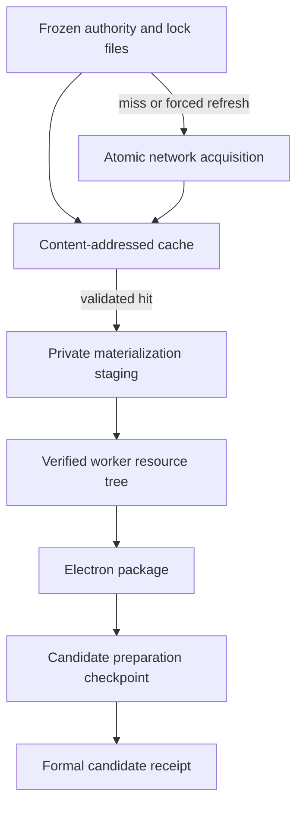

# refactor: Cache frozen resources and resume release preparation

## Goal Capsule

- **Objective:** Routine Electron UI and code changes no longer trigger repeated multi-gigabyte model downloads, and a late release-gate failure can resume without rebuilding an unchanged package.
- **Means:** Add a bounded content-addressed resource cache, durable fail-closed preparation checkpoints, and project-wide verification tiers (KTD1-KTD3).
- **Authority:** Frozen resource manifests and hashes remain authoritative; candidate source, package, target, and receipt identities remain stricter than cache or checkpoint state.
- **Stop conditions:** Stop if reuse would weaken hash verification, allow a changed package to inherit prior PASS results, or alter the final candidate/manual/final receipt contracts.
- **Execution profile:** Implement behavior test-first where practical, using synthetic fixtures rather than real model downloads.
- **Tail ownership:** `ce-work` owns implementation, review, targeted verification, and a local commit; this plan does not require a fresh release-candidate run.

---

## Product Contract

### Summary

Provide project-level protection against repeated frozen-model downloads by making verified downloads reusable across worktrees, release preparation resumable across late failures, and heavy validation an explicit release-only tier.

### Problem Frame

Electron packaging currently creates a temporary download directory, fetches every frozen Sherpa and SenseVoice archive, verifies it, and deletes the source archives. The release candidate runner records no progress until every automated gate passes. A failure after packaging therefore reruns earlier checks, repackages the app, and downloads roughly two gigabytes again even when only Renderer code changed and the already-built package is unchanged.

### Requirements

**Resource reuse**

- R1. Frozen downloads must be cached by expected SHA-256 and reused across worktrees only after regular-file, size-when-known, and digest validation.
- R2. Cache misses and forced refreshes must download to private temporary files and publish atomically so interrupted or concurrent builds cannot expose partial cache entries. A validated object must be hard-linked into private per-run staging before releasing the cache lock (or copied and reverified when linking is unavailable), and all extraction/copy work must use that stable staging snapshot.
- R3. Every cached source and every copied/extracted packaged member must retain the existing hash verification; cache presence alone is never evidence of validity.
- R4. The cache must default to `${HOME}/Library/Caches/Voice2Text/resource-downloads-v1`, allow `VOICE2TEXT_RESOURCE_CACHE_DIR` and `VOICE2TEXT_RESOURCE_CACHE_LIMIT_GIB` overrides, use a 4 GiB default ceiling, and honor `VOICE2TEXT_FORCE_FRESH_RESOURCE_DOWNLOAD=1`. Before acquisition it must reject a ceiling smaller than the known protected working set, reporting configured and required bytes; pruning never silently exceeds the ceiling or evicts the current set.

**Release preparation recovery**

- R5. Candidate preparation must persist a checkpoint after each successful automated gate and resume only the unfinished suffix when source inputs, product contract, target, command matrix, normalized acquisition mode, execution-environment fingerprint, and package identity still match.
- R6. Once packaging passes, the checkpoint must bind the exact package-tree, executable, and worker-manifest hashes before any packaged test result can be reused.
- R7. Malformed checkpoints must fail closed; valid but stale checkpoints must be invalidated and rebuilt without being promoted into formal release evidence.
- R8. Formal `candidate.json`, `manual.json`, and `final.json` semantics must remain unchanged, and temporary checkpoint state must disappear after a candidate receipt is safely established.

**Project-wide verification policy**

- R9. The repository must define separate UI, code, and release validation tiers, with full candidate preparation reserved for release work, frozen-resource manifest/identity/packaged-inventory changes, or explicit user direction.
- R10. The policy must live in project instructions and executable package scripts so every future plan inherits the same safe defaults.

### Key Decisions

- KD1. **Make the restriction project-wide** (session-settled: user-approved — chosen over plan-local guidance: a later plan could otherwise trigger the same downloads). Governs R9, R10.
- KD2. **Keep release rigor unchanged** (session-settled: user-approved — chosen over skipping real-model gates: final candidates still need target-specific evidence). Governs R3, R5-R8.

### Success Criteria

- Two consecutive resource materializations with unchanged authorities perform network acquisition only on the first run while producing identical verified worker inventories.
- A synthetic failure after package creation resumes from the failing gate without invoking the package command again.
- A changed input tree, target, command matrix, or package tree prevents reuse.
- Routine UI verification has a named command that never packages or downloads frozen models.

### Scope Boundaries

In scope are Electron frozen-resource acquisition, local cache retention, Audio/sidebar release preparation recovery, verification scripts, project instructions, and developer documentation.

Out of scope are changing model versions, distribution eligibility, production processing behavior, release acceptance thresholds, Flutter/Goo UI, remote shared caches, and running a new full candidate during this refactor.

---

## Planning Contract

### Key Technical Decisions

- KTD1. **Use a shared content-addressed cache** (session-settled: user-approved — chosen over per-run temporary downloads: unchanged pinned artifacts should be reusable across plans and worktrees). Each object is named by expected SHA-256, verified on every read, and atomically populated on a miss.
- KTD2. **Checkpoint a strict successful prefix** (session-settled: user-approved — chosen over restarting the whole candidate matrix: late failures should preserve earlier evidence for the identical package). The checkpoint stores the preparation identity, exact command/result prefix, target, and package hashes once available.
- KTD3. **Enforce tiers in both instructions and commands** (session-settled: user-approved — chosen over documentation alone: agents need policy while humans and automation need unambiguous entry points).
- KTD4. **Bound the shared cache without deleting active artifacts.** Use a cross-process cache mutation lock while validating/populating and snapshot each selected object into private per-run staging before releasing it. Apply a 4 GiB default ceiling after successful materialization, reject undersized configured ceilings before download, and prune only unprotected validated cache objects from oldest to newest.

### High-Level Technical Design

```mermaid
stateDiagram-v2
  [*] --> Empty
  Empty --> PrefixRecorded: gate passes
  PrefixRecorded --> PrefixRecorded: next gate passes
  PrefixRecorded --> PackageBound: package gate passes and hashes bind
  PrefixRecorded --> Invalidated: preparation identity changes
  PackageBound --> Invalidated: package identity changes
  PackageBound --> CandidateReady: remaining gates pass
  CandidateReady --> [*]: candidate and manual receipts recoverable; checkpoint removed
  Invalidated --> Empty: stale state discarded
```

### Assumptions

- The default cache is local to the macOS user and shared by repository worktrees; CI may override it with an ephemeral directory.
- Existing frozen source SHA-256 values are sufficient content identities; no new network metadata is trusted.
- Completed candidate preparation commands form an ordered prefix of `PREPARE_COMMANDS`; arbitrary out-of-order reuse is unnecessary.
- The current known frozen working set is 1,974,413,105 bytes plus the pinned Sherpa runtime archive, so the 4 GiB default leaves room for the complete source set; temporary staging and output trees remain outside the retained-cache ceiling.

### System-Wide Impact

- Developer and agent workflows gain fast validation paths that do not create release evidence.
- Packaging remains reproducible because authorities, packaged manifests, and final package hashes remain authoritative.
- Disk use shifts from disposable multi-gigabyte temporary downloads to a bounded shared cache whose location and cleanup behavior are documented.

### Risks & Dependencies

- A permissive cache could become a supply-chain bypass; mitigate with private directories, no symlink acceptance, and hash validation on every hit.
- A permissive checkpoint could attach PASS results to another package; mitigate with exact preparation identity, ordered command validation, and package-tree verification before reuse.
- Concurrent worktrees may populate or prune the same digest; serialize cache mutation across processes and move each validated object into a stable per-run hard-link/copy snapshot before another process can prune it.
- A configured ceiling below the protected source working set would otherwise oscillate between eviction and redownload; fail before any network acquisition with the required and configured byte counts.
- Checkpoint reuse can otherwise splice evidence across toolchain changes; fingerprint the actual Bun, Dart/Flutter, Xcode/clang versions and an allowlist of build/signing/resource-acquisition environment variables.

---

## Implementation Units

### U1. Add the bounded content-addressed download cache

- **Goal:** Make frozen source archives reusable without weakening source or member verification.
- **Requirements:** R1-R4; KTD1, KTD4.
- **Dependencies:** None.
- **Files:**
  - Create `apps/desktop-electron/scripts/resource-download-cache.ts`
  - Create `apps/desktop-electron/tests/unit/resource_download_cache_test.ts`
  - Modify `apps/desktop-electron/scripts/materialize-frozen-sherpa-resources.ts`
- **Approach:** Isolate cache directory validation, cross-process locking, digest-keyed lookup, atomic population, forced refresh, stable per-run snapshots, access-time refresh, and bounded pruning in a testable helper. Materialization supplies the expected digest, known size where available, source URL, private staging destination, and complete protected working set, then continues to verify extracted/copy destinations exactly as today. Prefer a hard link while holding the cache lock; if the filesystems differ, copy into staging and reverify before releasing the lock.
- **Execution note:** Start with synthetic cache hit, corruption, and interrupted-download tests; never fetch real model archives during unit verification.
- **Patterns to follow:** Existing `assertFileIdentity`, safe relative-path validation, private staging, and atomic worker publication patterns.
- **Test scenarios:**
  - Empty cache plus a synthetic downloader publishes one verified digest object and returns it.
  - A second request for the same digest returns the cache object without calling the downloader.
  - Wrong size, wrong digest, directory, or symbolic-link entries are rejected and replaced through a verified acquisition.
  - A downloader failure leaves no final digest entry and does not damage a previously valid object.
  - Forced refresh invokes acquisition even on a valid hit and preserves only the newly verified object.
  - Pruning above the configured limit retains all protected digests and removes only older unprotected regular files.
  - A protected set at or below the ceiling succeeds; a set above it fails before invoking the downloader and reports required/configured bytes.
  - Two cache instances targeting the same digest cannot publish an unverified partial file.
  - Two processes with different protected sets cannot prune an object after the other process snapshots it for extraction; cross-filesystem copy failure leaves cache and prior output intact.
- **Verification:** Cache tests prove no-network reuse, fail-closed identity handling, atomic population, and bounded retention; materialization typechecks with all existing authority validation intact.

### U2. Wire cache reuse into worker packaging and verification tiers

- **Goal:** Ensure normal package rebuilds reuse verified downloads and expose unambiguous UI/code/release commands.
- **Requirements:** R1-R4, R9, R10; KD1; KTD3.
- **Dependencies:** U1.
- **Files:**
  - Modify `apps/desktop-electron/scripts/build-worker-resources.sh`
  - Modify `apps/desktop-electron/package.json`
  - Modify `apps/desktop-electron/tests/unit/build_worker_resources_test.ts`
- **Approach:** Keep extraction staging disposable while routing every source acquisition path—frozen Sherpa downloads, pinned Sherpa runtime, SenseVoice archive, and SenseVoice VAD—through the shared cache. Add named UI, code, and release scripts; migrate documented routine entry points to UI/code lanes, and require `VOICE2TEXT_RELEASE_VALIDATION=1` before the named release lane invokes candidate preparation. Preserve a documented direct candidate-runner escape hatch for genuine release recovery, plus current atomic worker-tree publication and signing behavior.
- **Test scenarios:**
  - Resource builder passes a stable shared cache configuration while still deleting only disposable staging.
  - UI verification expands to format/lint/type/Renderer/visual checks and contains no package or resource command.
  - Code verification runs repository Electron checks without release preparation.
  - Release verification is the only named tier that invokes the candidate runner.
  - A synthetic full materializer run covering all four acquisition categories downloads each object once, reuses all of them on a second run, and produces an identical frozen resource inventory; corrupting one cached category reacquires only that digest.
- **Verification:** Script contract tests and package-script inspection distinguish all tiers and prove the resource builder no longer discards verified cache objects.

### U3. Resume candidate preparation from an identity-bound checkpoint

- **Goal:** Preserve a successful automated prefix and the exact package after late gate failures.
- **Requirements:** R5-R8; KD2; KTD2.
- **Dependencies:** U2.
- **Files:**
  - Modify `tool/audio_sidebar_release_candidate.py`
  - Modify `tool/test_audio_sidebar_release_candidate.py`
  - Modify `.gitignore`
- **Approach:** Persist an internal preparation-state schema after each successful command. Validate source/input/product/target identity, normalized cache acquisition mode (`cache-allowed` or `force-fresh`), an execution-environment fingerprint, and an exact ordered command prefix on recovery. The environment fingerprint covers resolved tool paths plus Bun, Dart/Flutter, Xcode and clang version output, and an explicit allowlist of signing, packaging, test-mode, and resource-cache variables. Bind package hashes immediately after `package-once`, revalidate the package before skipping any packaged gate, discard valid-but-stale state, reject malformed state, and remove state only after candidate/manual receipts are recoverable.
- **Execution note:** Add failure-injection coverage before changing the loop; use the existing fake runner and synthetic package tree.
- **Patterns to follow:** Existing atomic JSON writes, candidate identity verification, strict receipt field validation, and finalize recovery tests.
- **Test scenarios:**
  - Failure before packaging resumes at the failed command and does not rerun the successful prefix.
  - Failure after packaging resumes without invoking `package-once` and carries the original package hashes into the final candidate receipt.
  - Changed source inputs, product contract, target, or command matrix invalidates a well-formed checkpoint and starts a new run.
  - Changed acquisition mode, toolchain version/path, or allowlisted behavior-changing environment invalidates a well-formed checkpoint and starts a new run.
  - Changed or missing package after package binding invalidates the checkpoint and requires rebuilding.
  - Malformed, reordered, duplicated, or non-PASS checkpoint results fail closed before executing commands.
  - A candidate receipt write followed by manual projection failure recovers without rerunning commands, preserving existing behavior.
  - Successful preparation writes unchanged formal receipt schemas and removes the temporary checkpoint.
- **Verification:** Python unit tests demonstrate exact-prefix resume, package binding, stale-state invalidation, malformed-state rejection, and unchanged formal receipt validation.

### U4. Make the policy durable for future tasks

- **Goal:** Ensure agents and developers select the lightest sufficient verification lane and understand cache lifecycle controls.
- **Requirements:** R4, R9, R10; KD1; KTD3.
- **Dependencies:** U1-U3.
- **Files:**
  - Modify `AGENTS.md`
  - Modify `apps/desktop-electron/README.md`
- **Approach:** Add a change-to-verification matrix, inventory repository scripts/docs that invoke packaging or candidate preparation, migrate routine defaults to UI/code lanes, prohibit implicit release-candidate preparation for routine UI work, document the explicit release-intent guard and direct recovery escape hatch, document cache location/override/force-refresh/retention, and explain checkpoint recovery and when a genuine fresh-download release proof is still required.
- **Test scenarios:** Test expectation: none -- this unit documents commands and constraints already enforced and tested by U1-U3.
- **Verification:** Instructions clearly separate routine, code-wide, and release evidence and name the exceptional conditions that authorize heavy validation.

---

## Verification Contract

| Scope                          | Command                                                                                                                             | Expected result                                                                                                                                            |
| ------------------------------ | ----------------------------------------------------------------------------------------------------------------------------------- | ---------------------------------------------------------------------------------------------------------------------------------------------------------- |
| Resource cache and builder     | `bunx vitest run tests/unit/resource_download_cache_test.ts tests/unit/build_worker_resources_test.ts` from `apps/desktop-electron` | Synthetic cache and publication tests pass without network access.                                                                                         |
| Full materializer cache reuse  | `bunx vitest run tests/unit/materialize_frozen_resources_cache_test.ts` from `apps/desktop-electron`                                | All acquisition categories download once across two synthetic materializations; one corrupted digest alone is reacquired and inventories remain identical. |
| Candidate checkpoint           | `python3 -m unittest tool/test_audio_sidebar_release_candidate.py`                                                                  | Resume, invalidation, receipt, and finalize tests pass.                                                                                                    |
| Electron static and unit gates | `bun run check` from `apps/desktop-electron`                                                                                        | Formatting, lint, typecheck, tests, boundaries, and lifecycle checks pass.                                                                                 |
| Repository cache prerequisite  | `python3 tool/build_cache_guard.py`                                                                                                 | Repository build cache remains within policy before test/build work.                                                                                       |
| Project-required closure       | `./tool/dev_check.sh` then `./tool/ensure_ui_watcher.sh`                                                                            | Normal project checks pass; watcher check remains best-effort.                                                                                             |

A full `audio_sidebar_release_candidate.py prepare` run is intentionally excluded: this refactor changes tooling, not frozen resource identities or product behavior, and its tests must prove reuse without downloading production archives. A later real release candidate still runs the release tier and may force one fresh-download proof explicitly.

---

## Definition of Done

- U1-U4 requirements and listed test scenarios are implemented with no abandoned cache or checkpoint experiments left in the diff.
- A valid cache hit performs no network acquisition and still verifies expected identity.
- A post-package synthetic candidate failure resumes without packaging again; identity drift cannot reuse the checkpoint.
- Project instructions and package scripts direct routine UI work away from release preparation.
- Existing formal receipt schemas and target-specific evidence rules remain unchanged.
- Targeted tests, Electron checks, `dev_check`, and the UI watcher check complete with results reported.
