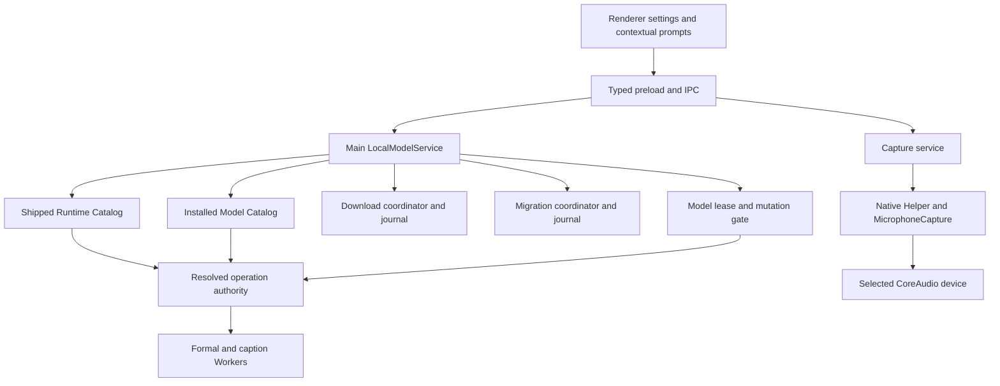
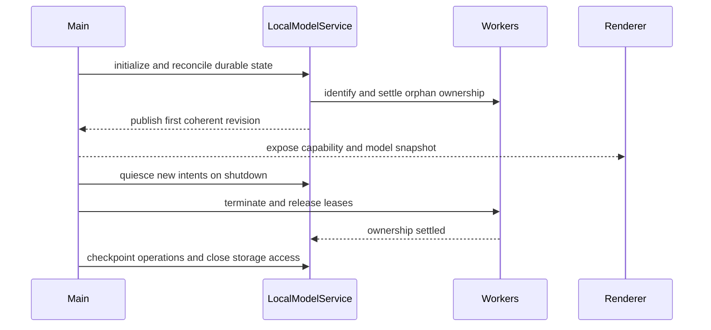
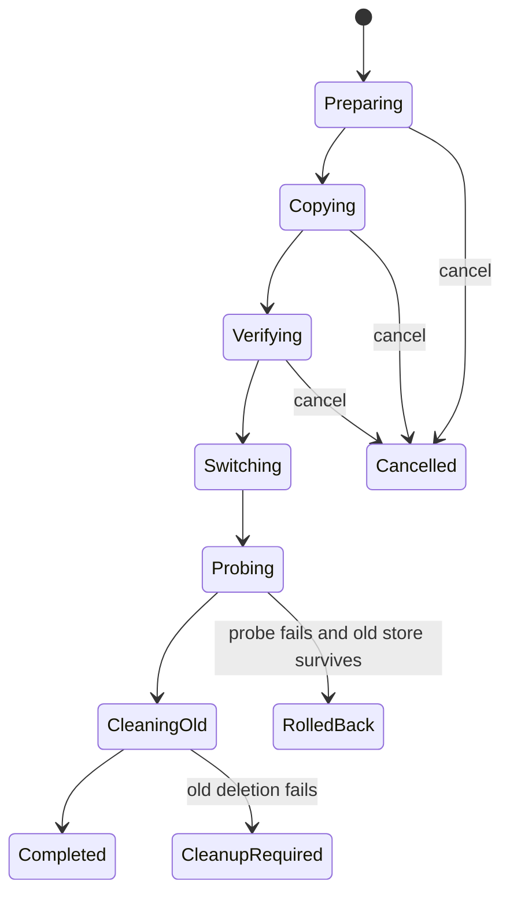

# Local Model Management and Microphone Test - Plan

## Goal Capsule

| Field | Contract |
| --- | --- |
| Objective | 让桌面端在缺少本地模型时仍能可靠录音，并让用户在真正调用字幕或转写前获得可操作的模型提示；同时提供可信的模型下载、删除和安全统一根目录迁移，以及符合正式录音链路的麦克风测试。 |
| Means | 拆分随应用发布的 Worker runtime 与用户管理的模型 bundle，增加 Main 进程模型服务、原生麦克风测试协议、能力租约和可恢复的复制校验迁移流程。（KTD1、KTD2、KTD5、KTD7） |
| Authority | 本计划的 R-ID 定义产品行为；KTD-ID 定义实现机制；现有录音持久化与 Worker 命令校验契约不得被弱化；冻结资源 authority 的许可和 `distributionEligible` 字段决定生产下载准入。 |
| Execution profile | 里程碑一先交付无模型录音、纯音频导入、上下文提示、原生麦克风测试和按钮调整；里程碑二再交付模型服务、能力租约、统一根目录迁移恢复、设置和发布证据。 |
| Stop conditions | 不下载、移动或删除 Worker 可执行文件及动态库；不把不可分发模型开放给生产用户；不在精确校验成功前发布或切换模型位置；新位置 probe 成功前不确认迁移完成，失败时按恢复协议回滚或隔离；不让模型缺失阻断普通录音；不进行未经当前任务授权的可视化验证。 |
| Tail ownership | 本计划负责 macOS Electron 客户端、Native Helper、模型目录与下载协议、设置入口和打包边界；远端生产存储提供方、CDN 控制面、模型训练和云同步不在本计划内。 |

---

## Product Contract

### Summary

桌面端将“录音能力”和“本地处理能力”拆成两个独立状态。
应用启动时初始化并发布模型能力状态，但不弹出模型错误。
用户即使没有任何模型，也能开始、停止、保存和恢复录音。
只有在用户请求实时字幕、对已有音频发起转写、重试处理或手动转写时，应用才重新检查所需模型，并在不可用时给出“前往本地模型”的上下文提示。单纯导入音频不检查模型，也不自动创建或触发任何处理任务。

设置新增“本地模型”页面。
Worker runtime 继续作为签名应用的一部分，用户不能下载、删除或迁移它。
用户可以管理“本地转写”和“实时字幕”两个模型 bundle，并可以选择一个统一模型根目录；各模型子目录由应用固定。
已有模型迁移采用复制、完整校验、目标盘原子发布、指针切换、加载探测和旧目录清理。

麦克风测试不再使用 Renderer 的 Web Audio 设备约束。
它复用正式录音的 Native Helper 和 `MicrophoneCapture`，显示粗粒度输入活动与剩余时间，由用户结束，最长 30 秒。

### Problem Frame

当前错误 `ENOENT: no such file or directory, realpath '.../resources/worker'` 表示应用在初始化本地处理目录时找不到整个 Worker 资源根。
它不等同于“只缺一个模型”，但现有资源目录把可执行文件、动态库和模型绑定为一个整体，因此任何一部分缺失都会让本地处理初始化失败。
当前实现又在启动阶段检查这一整体，导致尚未调用字幕或转写时就暴露错误，并容易让用户误以为录音也不可用。

当前麦克风测试在 Renderer 使用 `getUserMedia`，却传入 Native CoreAudio 的设备 `uniqueID`。
Chromium 不保证把该值识别为 Web Media 设备 ID，因此测试可能在用户来不及说话时立即以设备约束错误失败。

模型目录变更还涉及跨磁盘复制、断电恢复、外置盘拔出和正在运行的 Worker。
直接移动不能覆盖这些边界，也不能在跨卷时保证原子性。

### Key Decisions

- **录音不依赖模型。** 普通录音始终可以创建、保存和恢复；模型只约束字幕与转写。Governs R1、R2、R14。
- **导入不触发处理。** 导入只复制、登记并持久化音频，不检查模型、不创建处理任务；字幕和转写必须由用户后续主动发起。Governs R2、R21。
- **Worker runtime 不属于用户模型。** Runtime 随签名应用发布，模型数据才进入下载、删除和迁移范围。Governs R4、R5、R12。
- **迁移采用安全复制。** (session-settled: user-approved — chosen over direct move: cross-volume move is not atomic and cannot provide verified rollback.) Governs R10、R11、R12。
- **麦克风测试由用户结束。** (session-settled: user-directed — chosen over immediate or fixed short smoke test: the user needs time to speak and judge the meter.) Governs R6、R7、R8。
- **生产下载以可分发资源为前提。** 当前开发 authority 不得直接成为用户下载目录。Governs R5、R9、R18。
- **模型只使用一个托管根目录。** 用户只能修改统一根目录；各模型子目录和内部 staging 目录由程序固定，不提供逐模型路径配置。Governs R10、R11、R17。
- **目录迁移要求全局空闲。** 下载、安装、删除、迁移、Worker 使用或处理任务存在时都拒绝开始迁移；迁移开始后阻止新的模型操作和处理任务。Governs R11、R12、R13。
- **首版不提供模型修复。** 损坏模型使用“删除并重新下载”；Runtime 损坏仍通过重新安装或修复应用处理。Governs R4、R5、R18。
- **模型恢复不自动处理。** 重新安装模型后不自动恢复旧任务，用户必须再次点击“转写”或“重试”。Governs R2、R20。

### Requirements

**Recording and contextual availability**

- R1. 模型缺失、模型目录不可达或本地处理初始化失败不得阻止普通录音的开始、停止、保存和恢复。
- R2. 应用启动不得因模型缺失弹窗；Main 进程必须在每次字幕、对已有音频发起转写、重试处理和手动转写调用前重新检查所需 bundle，单纯导入音频不得触发该检查。
- R3. 用户发起模型依赖操作且处理能力不可用时，必须显示面向用户的对话框，而不是把原始错误放进第三栏；对话框必须区分“模型未安装”“模型目录不可用”和“应用运行组件损坏”。
- R4. Worker executable、dylib 和 runtime manifest 必须随应用发布并保持不可变；Runtime 缺失时提示重新安装或修复应用，不能伪装成模型下载问题。

**Local model management**

- R5. 设置页必须分别显示 Runtime 健康状态、“本地转写”bundle 和“实时字幕”bundle，并提供适用的下载、暂停、继续、取消、删除和“删除并重新下载”操作；首版不得提供独立的模型“修复”按钮。

**Microphone testing**

- R6. 麦克风测试必须使用与正式录音相同的 Native Helper、设备选择和音频输入链路，且不得创建录音 session、音频文件或处理任务。
- R7. 用户可以手动结束麦克风测试；Native 端必须在 30 秒达到时自动结束，并在 Renderer 消失时仍能释放设备。
- R8. 测试运行时必须持续显示粗粒度输入活动和剩余时间；静音只在结束或超时后显示“未检测到明显输入”，不得提前判为失败。
- R22. 麦克风测试必须支持键盘开始和结束；对话框打开时焦点进入主要操作、关闭后返回触发按钮；输入活动不得仅依赖颜色，并以节流方式向辅助技术发布状态，结束、失败或超时必须发布一次明确的终态结果。

**Model storage and lifecycle**

- R9. 模型下载必须使用应用内置的可信目录、HTTPS 和精确 hash/size 清单；暂停或退出后可在服务器验证器匹配时续传，否则安全地从零重启。
- R10. 应用必须维护一个带私有 marker、稳定 store ID 和固定内部布局的统一模型根目录；“本地转写”“实时字幕”、下载 staging 和迁移 staging 使用程序固定且不可由用户修改的子目录。首次启动使用应用数据目录下的默认根；用户选择新位置时由应用创建托管根，不得接管普通非空目录或把任意目录当成可递归删除的根。
- R11. 已安装模型迁移必须迁移整个统一根目录，并按目标盘 staging 复制、清单与 SHA-256 校验、同盘原子发布、位置指针切换、新位置 probe、旧根目录删除的顺序执行；新旧根相同、互为父子或通过链接别名重叠时必须拒绝。
- R12. 没有已安装模型时可直接切换到新的有效空根且不显示迁移确认；存在模型时，迁移在指针切换前可取消且不改变旧位置，指针切换后不可取消，旧目录清理失败时新位置仍保持生效并显示待清理状态。
- R13. Main 必须原子管理模型操作和租约：活动 Worker 或处理任务存在时，删除、移动、替换和其他破坏性操作返回 busy，不能只依赖 Renderer 禁用；下载和复制可在隔离 staging 中继续，但发布必须等待租约释放。下载、安装、删除、迁移、Worker 使用或处理任务存在时不得开始目录迁移；迁移开始后阻止新的模型操作和模型依赖任务，普通录音始终不持有模型租约。

**Model-dependent behavior and UI**

- R14. 没有实时字幕模型时，新录音必须明确显示字幕不可用但仍能继续；录音结束后音频必须先安全保存，详情页可以保持“尚未转写”。
- R15. 上下文能力对话框必须提供“前往本地模型”，并直接打开设置中的“本地模型”页面；Runtime 损坏时改为提供应用修复指导。
- R16. 第二栏搜索框右侧必须放置 `file-up` 图标按钮并使用“导入音频”tooltip；“新录音”按钮继续保留在第二栏底部，互联图标使用 `send-horizontal`。
- R17. Renderer 只负责展示状态和发起意图；路径选择、下载、校验、删除、迁移和最终能力判断必须由 Main 进程负责。
- R21. 导入音频必须先完成复制、登记和持久化，并在成功后停留为可用音频；导入本身不得检查模型、创建处理任务或自动触发字幕与转写，所有后续处理必须由用户明确发起。

**Distribution and integrity**

- R18. 生产构建必须拒绝 `distributionEligible: false`、开发专用、许可未完成、平台不匹配、runtime protocol 不兼容或 hash 不匹配的模型目录。
- R19. “本地转写”v1 必须把 ASR 和 speaker diarization 作为一个不可拆 bundle；“实时字幕”保持独立 bundle。
- R20. 模型删除不得删除音频、已生成字幕、转写结果或任务记录；模型重新安装后不得自动排队或启动旧任务。用户明确点击“转写”或“重试”时，Main 才以当前受信且兼容的模型身份创建新的执行意图。

### Key Flows

- F1. 无模型录音
  - **Trigger:** 用户没有安装模型并开始录音。
  - **Steps:** Capture preflight 只检查录音依赖；UI 标明实时字幕未安装；录音正常保存；详情页把转写保持为未执行。
  - **Outcome:** 音频安全存在，用户可稍后安装模型并发起处理。
  - **Covered by:** R1、R2、R14、R20。

- F2. 上下文处理检查
  - **Trigger:** 用户启用实时字幕、对已有音频发起转写、重试处理或请求手动转写。
  - **Steps:** Main 解析所需 bundle；重新检查目录、清单、Runtime 和租约；不可用时返回 typed reason；Renderer 打开对应对话框。
  - **Outcome:** 处理只在 authority 有效时开始，提示不会在启动阶段抢先出现。
  - **Covered by:** R2、R3、R4、R15、R17。

- F3. 模型下载或重新下载
  - **Trigger:** 用户在“本地模型”下载 bundle，或对损坏 bundle 选择“删除并重新下载”。
  - **Steps:** Main 从可信目录创建下载；支持暂停和继续；校验 archive；解包到 staging；校验精确 inventory；等待零租约；原子发布并 probe。
  - **Outcome:** 只有完整且可加载的 bundle 进入 installed 状态。
  - **Covered by:** R5、R9、R13、R17、R18、R19。

- F4. 模型目录迁移
  - **Trigger:** 系统没有下载、安装、删除、迁移、Worker 使用或处理任务时，用户选择新的统一模型根目录，且当前存在已安装模型。
  - **Steps:** 原子进入迁移独占状态；预检并展示源、目标和大致大小；用户确认；复制和校验；切换、probe 和清理；持续发布粗粒度阶段，离开页面或关闭普通窗口不取消迁移。
  - **Outcome:** 成功后新位置生效；可取消阶段或故障不会破坏旧位置。
  - **Covered by:** R10、R11、R12、R13。

- F5. 原生麦克风测试
  - **Trigger:** 用户选择麦克风并点击开始测试。
  - **Steps:** Native 打开相同设备；Renderer 轮询活动值和倒计时；用户结束或 Native 30 秒超时；所有关闭路径 teardown。
  - **Outcome:** 用户得到“检测到输入”或“未检测到明显输入”，真正的设备和权限错误得到具体说明。
  - **Covered by:** R6、R7、R8。

### Acceptance Examples

- AE1. 未安装任何模型时，用户开始并结束录音；音频保存成功，UI 说明实时字幕未安装，应用启动和录音结束都不弹原始 Worker 错误。Covers R1、R2、R14。
- AE2. 用户未安装“本地转写”模型时导入音频；音频完成复制、登记和持久化，不创建处理任务且不弹模型提示。用户随后明确请求转写时，Main 才拒绝创建处理任务并弹窗说明缺少模型、提供“前往本地模型”。Covers R2、R3、R15、R21。
- AE3. Worker executable 或 dylib 缺失；普通录音仍可用，处理调用提示应用安装不完整，设置页不提供下载 Runtime。Covers R1、R4、R5。
- AE4. 用户开始麦克风测试并说话；活动值更新，用户手动结束，设备被释放，测试没有创建音频或 session。Covers R6、R7、R8。
- AE5. 用户在测试期间保持静音；测试不会提前失败，手动结束显示“未检测到明显输入”，未结束时由 Native 在 30 秒自动停止。Covers R7、R8。
- AE6. 权限被拒绝、所选设备不存在或设备打开失败；测试立即显示具体 typed error 并完成 teardown。Covers R6、R7。
- AE15. 用户仅用键盘开始并结束麦克风测试；焦点在打开和关闭时正确移动，活动状态同时具有非颜色表达，辅助技术收到节流的运行状态和一次明确终态。Covers R22。
- AE7. 下载暂停后退出应用，再次启动时服务端返回匹配的 Range 响应和验证器；下载从已确认 offset 继续，最终只发布 hash 全部匹配的 bundle。Covers R9、R18。
- AE8. 服务端不支持有效 Range，或 ETag/Last-Modified 变化；客户端丢弃不可信 partial 并从零下载，不拼接两个版本。Covers R9、R18。
- AE9. 用户把模型迁移到另一块磁盘；应用复制到目标 staging、校验、发布、切换和 probe 后才删除旧目录，进度依次展示阶段。Covers R10、R11。
- AE10. 用户在复制或校验阶段取消迁移；目标 staging 被清理，旧模型与 active pointer 保持不变。Covers R12。
- AE11. 指针已切换且 probe 成功，但旧目录删除失败；新位置继续生效，设置页显示“旧模型待清理”并允许重试清理。Covers R12。
- AE12. 已选择的外置盘未连接；应用不静默回退到默认目录，模型能力显示 storage unavailable，普通录音继续可用，原盘重连且 store identity 匹配后自动恢复。Covers R1、R10、R12。
- AE13. 正式转写 Worker 正在使用“本地转写”bundle 时用户删除或迁移；Main 返回 busy，界面说明任务结束后重试，现有 Worker 不被强杀。迁移开始后新的模型依赖任务无法进入。Covers R13、R19。
- AE16. 模型重新安装后，应用不自动恢复任何旧处理任务；用户再次点击“转写”或“重试”后才以当前兼容模型创建新的执行意图。Covers R20。
- AE17. 用户在下载、安装、删除、迁移或 Worker 使用期间尝试更换统一根目录；Main 拒绝并显示当前操作结束后重试。所有活动状态结束后，迁移整个托管根。Covers R10、R11、R13。
- AE14. 生产目录包含 `distributionEligible: false` 或许可未完成的模型；下载操作保持不可用，release validation 拒绝该目录。Covers R18。

### Success Criteria

- 模型缺失和模型目录不可达不会导致录音失败，也不会在启动时弹窗。
- 麦克风测试至少保持到用户结束或 30 秒，并能区分静音结果与设备错误。
- 所有 published bundle 都能追溯到可信目录、精确清单、hash、许可和兼容性结论。
- 在迁移的每个持久阶段模拟崩溃后，启动恢复都能选择唯一有效位置，且不会删除唯一完整副本。
- 用户管理的磁盘占用可解释；删除 bundle 后不遗留产品下载 archive 或无主 partial。

### Scope Boundaries

**In scope**

- macOS Electron 的原生麦克风测试和 Renderer 交互。
- Runtime 与模型资源 authority 拆分。
- 两个固定模型 bundle 的下载、暂停、继续、取消、删除、重新下载和状态。
- 用户选择统一模型根目录、固定模型子目录、安全整根迁移、外置盘状态和崩溃恢复。
- 设置页、上下文能力对话框、导入按钮位置与图标调整。
- Runtime-only 应用打包和模型目录的发布准入契约。

**Deferred to follow-up work**

- Cloudflare R2 候选生产下载端点的最终配置、部署、运维控制面和发布前协议验证。
- 远程签名目录和目录热更新；v1 使用随应用签名发布的固定目录。
- 多版本模型选择、回滚 UI 和既有任务的跨版本 identity 迁移。

**Out of scope**

- 下载、删除或迁移 Worker executable、dylib 和 Native Helper。
- 任意本地模型导入、用户自定义 URL、hash、runtime 版本或文件清单。
- 模型训练、云端转写、云同步和跨设备模型同步。

### Dependencies

- 生产模型 authority 必须给出 `distributionEligible: true`、可审计许可与 notice、稳定 HTTPS URL、文件大小、SHA-256 和 runtime protocol 兼容性。
- 生产下载源必须支持稳定对象和强验证器；若要真正跨重启续传，必须正确支持 HTTP Range。
- macOS App Sandbox 构建必须通过 security-scoped bookmark 恢复用户选择目录的访问权限。
- UI 实现必须遵循 `../flutter-ui-mobile/DESIGN.md` 和 `../flutter-ui-mobile/DOC.md`，并以当前项目可通过 analyzer 的 Goo API 为准。

### Sources

**Repository evidence**

- `apps/desktop-electron/src/main/resources/resource_catalog.ts`
- `apps/desktop-electron/scripts/build-worker-resources.sh`
- `apps/desktop-electron/scripts/write-worker-manifest.ts`
- `apps/desktop-electron/forge.config.ts`
- `apps/desktop-electron/src/renderer/features/audios/audio-route-feature.tsx`
- `packages/desktop_macos_native/Sources/CaptureCore/MicrophoneCapture.swift`
- `packages/desktop_macos_native/Sources/CaptureCore/CaptureController.swift`
- `packages/desktop_sherpa_worker/assets/processing/frozen_sherpa_macos_arm64.json`
- `packages/desktop_sherpa_worker/assets/processing/frozen_sensevoice_macos_arm64.json`
- `docs/solutions/architecture-patterns/desktop-first-workstation-boundaries.md`

**External primary sources**

- Electron DownloadItem: <https://www.electronjs.org/docs/latest/api/download-item>
- Electron Session downloads: <https://www.electronjs.org/docs/latest/api/session>
- Electron native dialogs: <https://www.electronjs.org/docs/latest/api/dialog>
- Electron IPC tutorial: <https://www.electronjs.org/docs/latest/tutorial/ipc>
- Electron security checklist: <https://www.electronjs.org/docs/latest/tutorial/security>
- Node.js file system API: <https://nodejs.org/api/fs.html>
- Apple App Sandbox file access: <https://developer.apple.com/documentation/security/accessing-files-from-the-macos-app-sandbox>

---

## Planning Contract

### Key Technical Decisions

- KTD1. (session-settled: user-approved — chosen over treating the Worker directory as one installable unit: recording must remain independent from local processing.) Split resources into an immutable shipped Runtime Catalog, a user-managed Installed Model Catalog, and a resolved per-operation authority. Runtime paths remain under the app resources root; model paths resolve under the active managed store. Governs R1、R4、R5、R17、R19。
- KTD2. (session-settled: user-approved — chosen over Chromium Web Audio testing: CoreAudio unique IDs already belong to the native capture chain.) A Main-owned singleton test service adds start, snapshot and stop commands to the shared Native Helper and binds the only active test to its initiating main window. Native owns the 30-second timeout; Renderer loss stops only the test, not the shared Helper. Governs R6、R7、R8。
- KTD3. Model catalogs are app-shipped trust authorities in v1. A catalog entry binds bundle ID, version, capabilities, target, distribution eligibility, license notices, byte sizes, URLs, hashes, exact installed inventory and runtime protocol compatibility. Every installed generation and partial download persists the catalog identity that created it; application upgrade reclassifies rather than automatically deleting old state. Governs R9、R18、R19、R20。
- KTD4. Main uses Electron `DownloadItem` and a durable journal for download, pause, resume and cancellation. Resume is accepted only for matching validators and a valid partial response; download and extraction staging never become executable paths. Governs R9、R17、R18。
- KTD5. (session-settled: user-approved — chosen over filesystem move or cross-volume rename: copy plus verification preserves a recoverable source until the target is proven.) Migration publishes from target-local staging with a same-volume rename, atomically replaces a pointer file in stable `userData`, probes the new authority, then deletes the old managed store. Governs R10、R11、R12。
- KTD6. The active store pointer, operation journal and security-scoped bookmark metadata use a versioned two-slot commit protocol under stable Electron `userData`; each slot carries a monotonic generation, operation ID, schema and checksum. Recovery correlates both slots with store markers and probe evidence, and enters `recovery_required` without deleting either store when authority is ambiguous. Large models and archives never live in `userData`. Governs R9、R10、R11、R12。
- KTD7. Processing and live-caption Workers hold shared model-generation and storage-access leases for their full lifetime. Destructive model commands atomically check the same Main-owned gate and return busy while a lease or conflicting operation exists; publication may retain verified staging while it waits for leases to drain. Directory migration requires the model service to be fully idle, then owns an exclusive state that blocks new model operations and model-dependent tasks until completion, rollback or safe pause. Startup reconciles or terminates orphan Workers before mutations reopen. Governs R13、R19。
- KTD8. An operation command keeps the existing pre-spawn containment and exact-inventory verification, and its catalog identity becomes a deterministic composition of Runtime identity and Model Set identity. Durable processing fences therefore detect either side changing. Governs R17、R18、R19。
- KTD9. ASR and diarization remain one “本地转写” bundle because the current formal pipeline requires a shared processing identity. Live captions use a separate bundle and lease. Governs R5、R19。
- KTD10. `LocalModelService` owns one aggregated snapshot with a monotonic revision across Runtime, store generation, bundles, operations, leases and storage availability. Settings consume that snapshot through the existing Zod → Main IPC → preload pattern; stale intents are rejected by operation identity and expected revision or generation. Renderer never receives bookmarks, unrestricted filesystem primitives or download credentials. Governs R5、R15、R17。
- KTD11. Migration progress is phase-based: preparing, copying, verifying, switching, probing and cleaning. Admission already proves the model service is idle, so migration never enters a waiting-for-processing phase. Approximate copied bytes are advisory; phase order and durable state determine correctness. Governs R11、R12。
- KTD12. Production download stays closed until a product-eligible frozen authority replaces the current development-only manifests. Development fixtures may exercise the client path but cannot satisfy release admission. Governs R18。
- KTD13. Archive extraction and managed cleanup are inventory-driven. Before U4 commits to an extractor, a bounded technical probe must select a pinned, application-shipped streaming adapter that can reject each member before writing it. Extraction accepts only catalog-listed regular single-link files within a fresh private staging root and applies canonical-path, duplicate/case-conflict, member-count, per-file and total expanded-byte limits; cleanup revalidates root identity and deletes owned leaves before empty directories without following links. System shell extraction is not an allowed production dependency. Governs R9、R10、R18。
- KTD14. `LocalModelService` restores pointers, journals, bookmarks and orphan Worker state before publishing capability or starting queues. Shutdown first closes admission, checkpoints resumable work, terminates Workers and releases leases, then closes storage access and the model service. Governs R1、R12、R13、R17。
- KTD15. One managed model root contains fixed catalog-owned bundle subdirectories and private staging/metadata directories. First launch uses the app-data default root; an empty installation changes roots without migration confirmation, while an installation with models copies and verifies the complete managed root. Ordinary non-empty directories are never adopted. Governs R10、R11、R12。
- KTD16. Bundle operation UI uses one simple state matrix: not installed → download; downloading → pause/cancel; paused → continue/cancel; failed → retry download, or continue only when validators prove safe resume; installed → delete; corrupt → delete and redownload. The first release serializes model mutations and has no model-repair action. Governs R5、R13。
- KTD17. Migration is Main-owned background work. Route changes and normal window closure do not cancel it; true application quit checkpoints copy/verify work for restart, while the short switch/probe/cleanup boundary temporarily defers quit. Progress is phase-based rather than percentage-accurate. Governs R11、R12、R17。

### High-Level Technical Design

### State and recovery invariants

- A model store is valid only when its marker, store ID, platform target, catalog identity, exact inventory and hashes all agree.
- The active pointer names one store ID and generation; path equality alone never proves that a remounted external volume is the same store.
- Source, target, staging, residue and cleanup roots must be distinct canonical directory identities with no ancestor or descendant overlap; a failed topology check creates no journal or staging.
- Every destructive boundary revalidates bookmark resolution, volume identity, root device/inode, store ID and generation to close the gap between preflight and use.
- Before pointer switch, cancellation or crash keeps the old pointer and removes or quarantines target staging.
- After pointer switch but before successful probe, startup probes the target first and rolls back only to the preserved old pointer when target validation fails.
- After successful probe, the new pointer remains authoritative; failed old cleanup becomes `cleanup_required` and is idempotently retried.
- Corrupt, missing, unknown-schema or mutually inconsistent pointer/journal slots enter `recovery_required`; automatic recovery never deletes a model copy unless authority is uniquely proven.
- An unavailable selected external volume remains selected and yields `storage_unavailable`; the app does not silently fall back or redownload.
- Cleanup rejects unknown entries, symlinks, hardlinks, special files, nested mounts and root identity changes; unsafe residue remains for explicit recovery instead of recursive deletion.

### System-Wide Impact

- **Application lifecycle:** Model recovery finishes before processing queues and capability snapshots become available. Shutdown order prevents a service from waiting on leases held by Workers that have not yet been terminated.
- **Process ownership:** Worker supervisors own lease release on success, typed failure, cancellation, protocol error, deadline and abnormal close. Main crash recovery settles orphan process groups before mutation gates reopen.
- **Window ownership:** The main window owns microphone-test intent, while Main owns the test lifecycle. Renderer reload, crash or window close stops the test without closing the application-wide Helper or disrupting formal capture recovery.
- **State consistency:** `LocalModelService` is the only model-state writer. `ApplicationSnapshot` carries a projection of the same revision, and a new or rebuilt window obtains a coherent current snapshot before consuming later events.
- **External storage:** Security-scoped access is a leased resource, not passive metadata. Sleep/wake, focus, mount changes and every Worker or mutation boundary revalidate the same volume, store and generation.
- **Failure privacy:** IPC, snapshots, journals and logs expose typed codes, bundle/stage and operation IDs only. They omit bookmark bytes, authorization headers, URL query/fragment data, raw filesystem errors and full user paths.

### Sequencing

1. Preserve existing behavior with characterization tests and split Runtime from models without changing Worker authorization.
2. Add Native microphone test protocol and Renderer state machine independently of model management.
3. Close milestone one after no-model recording, pure import, contextual model prompts, the Native microphone test and requested icon/layout changes pass their bounded checks.
4. Start milestone two with the model catalog, upgrade classification, persistence, downloader, streaming-extractor proof and install integrity.
5. Add leases and use-time capability checks before exposing delete or migration.
6. Add unified-root selection, whole-root migration journal, background progress and recovery.
7. Expose the local-model settings state matrix and keep production download disabled until release admission succeeds.
8. Remove model payloads from production packaging only after Runtime-only smoke evidence is in place.

### Risks & Dependencies

- **License and distribution gate:** Both current frozen model authorities are non-distributable. Mitigation: keep production actions closed until a reviewed authority and notices pass release validation.
- **Remote resume semantics:** Some origins advertise Range but return an invalid full response. Mitigation: bind partial data to strong validators and restart safely when the response contract does not match.
- **Cross-volume and external-disk failure:** Copy or probe may fail after significant work. Mitigation: keep the old store immutable until pointer switch and successful probe; persist the journal off the external volume.
- **Worker/model races:** A Worker can retain open model files while deletion appears safe. Mitigation: hold a generation lease for the entire Worker lifetime and establish an exclusive gate before mutation publication.
- **Orphan process ownership:** A detached Worker can outlive a crashed Main and invalidate an in-memory lease. Mitigation: reconcile or terminate owned process groups before model mutations or processing queues reopen.
- **Untrusted archive and filesystem shape:** A hash-valid archive can still contain traversal paths, links, special files or an expansion bomb. Mitigation: enforce KTD13 before writing each member and apply inventory-driven cleanup.
- **Durable-state ambiguity:** A single atomic rename cannot make pointer, journal and bookmark updates transactional. Mitigation: use KTD6 and fail closed to `recovery_required` when two-slot evidence does not identify one authority.
- **Sensitive diagnostics:** Native and filesystem errors can carry user paths, bookmarks or signed URLs. Mitigation: centralize structured redaction before persistence, logging or IPC publication.
- **Native audio concurrency:** The audio callback and helper command queue can race on meter state. Mitigation: protect peak/frame state under the Swift concurrency model and prove teardown paths with injected test engines.
- **Model size and disk pressure:** Existing bundles are approximately gigabyte scale. Mitigation: preflight available bytes with staging overhead and safety margin, clear archives after installation, and report all managed usage.

---

## Implementation Units

### U1. Split Runtime and Model Resource Authorities

- **Goal:** Separate immutable shipped Runtime assets from installable model bundles while preserving exact command authorization and durable job identity.
- **Requirements:** R1、R4、R17、R18、R19。
- **Dependencies:** None.
- **Files:**
  - `apps/desktop-electron/src/main/resources/resource_catalog.ts`
  - `apps/desktop-electron/src/main/processes/owned_process_supervisor.ts`
  - `apps/desktop-electron/src/shared/contracts/processing.ts`
  - `apps/desktop-electron/scripts/write-worker-manifest.ts`
  - `apps/desktop-electron/scripts/verify-worker-resources.ts`
  - `apps/desktop-electron/tests/unit/resource_catalog_test.ts`
  - `apps/desktop-electron/tests/integration/worker_process_group_test.ts`
- **Approach:**
  1. Apply KTD1 and add characterization tests for current manifest validation, ASR/diarization shared identity and catalog identity fencing.
  2. Introduce separate Runtime and Model Set authorities, including a model-root placeholder resolved only from the active installed bundle.
  3. Preserve canonical-path, containment, no-symlink, exact-inventory and hash checks before every Worker spawn.
  4. Compose Runtime and model identities into the operation identity persisted with processing jobs.
- **Patterns to follow:** `ResourceCatalog`, `assertAuthorizedResourceCommand`, processing pipeline identity checks, and durable resource identity fields.
- **Test scenarios:**
  - Existing valid development resources still authorize the same formal and caption operations after the split.
  - Runtime path escaping the app resource root is rejected even when a model catalog is valid.
  - Model path escaping the selected installed bundle is rejected even when the Runtime is valid.
  - ASR and diarization with different model-set identities fail the formal pipeline contract.
  - Changing either Runtime or model generation changes the composite catalog identity and fences a stale durable intent.
- **Verification:** The resource unit and Worker integration tests prove that the split changes storage authority without weakening pre-spawn verification.

### U2. Add Native Microphone Test Lifecycle

- **Goal:** Reuse the production native microphone chain for an interactive, manually stoppable test with a Native-owned 30-second cap.
- **Requirements:** R6、R7、R8。
- **Dependencies:** None.
- **Files:**
  - `packages/desktop_macos_native/Sources/CaptureCore/MicrophoneCapture.swift`
  - `packages/desktop_macos_native/Sources/CaptureCore/CaptureController.swift`
  - `packages/desktop_macos_native/Sources/DesktopMacOSNativeHelper/main.swift`
  - `packages/desktop_macos_native/Tests/CaptureCoreTests/MicrophoneCaptureTests.swift`
  - `packages/desktop_macos_native/Tests/CaptureCoreTests/CaptureControllerTests.swift`
  - `apps/desktop-electron/src/main/features/importing/macos_native_helper_client.ts`
  - `apps/desktop-electron/src/main/domain/capture/capture_native_port.ts`
  - `apps/desktop-electron/src/main/domain/capture/macos_capture_native_port.ts`
  - `apps/desktop-electron/src/main/domain/capture/microphone_test_service.ts`
  - `apps/desktop-electron/tests/e2e/macos_capture_flow_test.ts`
- **Approach:**
  1. Apply KTD2 and add an injected microphone-test engine or factory so tests do not depend on physical hardware.
  2. Extend the serialized Helper protocol with independent start, snapshot and stop behavior.
  3. Return elapsed time, normalized peak, observed frames and typed permission/device/open/format failures.
  4. Bind the singleton test to the initiating main window and make helper EOF, owner loss, app teardown, timeout and formal recording start stop it idempotently without closing the shared Helper.
- **Execution note:** Start with failing native lifecycle and teardown tests because an audio-device leak can survive Renderer failure.
- **Patterns to follow:** Existing `MicrophoneCapture`, `CaptureController` state queue and `MacOSNativeHelperSession` command serialization.
- **Test scenarios:**
  - Covers AE4. A valid CoreAudio unique ID starts the same input implementation, snapshots update, and manual stop releases the device.
  - Covers AE5. Zero observed signal does not fail before stop; manual stop and 30-second timeout return non-error terminal outcomes.
  - Covers AE6. Permission denied, missing device, invalid format and device-open failure return distinct typed failures and teardown.
  - Repeated start or stop calls are idempotently rejected or settled without a second engine.
  - Helper EOF, client close and formal capture start leave no active microphone test.
  - Main-window close or Renderer crash stops the test while the background application and unrelated Helper capabilities remain available.
  - Helper failure during start, snapshot or stop publishes one terminal result and does not automatically reopen the microphone.
- **Verification:** Swift tests prove lifecycle, timeout, meter synchronization and teardown; the Electron native-flow test proves the Helper protocol boundary.

### U3. Replace Renderer Microphone Smoke Test

- **Goal:** Present the Native test as a user-controlled 30-second interaction instead of an immediate Web Audio pass/fail check.
- **Requirements:** R6、R7、R8、R17、R22。
- **Dependencies:** U2.
- **Files:**
  - `apps/desktop-electron/src/shared/contracts/capture.ts`
  - `apps/desktop-electron/src/shared/contracts/ipc.ts`
  - `apps/desktop-electron/src/main/ipc/desktop_ipc.ts`
  - `apps/desktop-electron/src/preload/api.ts`
  - `apps/desktop-electron/src/renderer/features/audios/audio-route-feature.tsx`
  - `apps/desktop-electron/tests/integration/register_desktop_ipc_test.ts`
  - `apps/desktop-electron/tests/unit/ipc_contract_test.ts`
  - `apps/desktop-electron/tests/unit/renderer/audio_route_test.tsx`
- **Approach:**
  1. Carry KTD2 through typed IPC schemas for start, snapshot, stop and terminal result.
  2. Poll Native snapshots at a modest interval and render a coarse meter, elapsed or remaining time, and “结束测试”.
  3. Remove `getUserMedia` device testing and classify silence as a completed result rather than an exception.
  4. Stop on dialog close, route unmount and application teardown; prevent formal recording and test from owning the microphone simultaneously.
  5. Move focus into the primary test action and restore it to the trigger on close; support keyboard start/stop, expose a non-color meter value, throttle live-region updates, and announce one terminal result.
- **Patterns to follow:** Existing Zod IPC registrations, preload API exposure and event unsubscribe patterns.
- **Test scenarios:**
  - Covers AE4. Start displays the running state and activity, and manual stop displays the signal result.
  - Covers AE5. A silent running snapshot remains active until stop or timeout.
  - Covers AE6. Each typed Native failure maps to concise user copy and never exposes a raw stack or OS path.
  - Closing the dialog or navigating away sends stop and clears polling.
  - Formal recording disables test start; an active test disables formal recording until teardown completes.
  - Covers AE15. Keyboard-only operation, focus restoration, non-color activity semantics and throttled terminal announcements remain accessible without announcing every poll.
- **Verification:** Contract, IPC and Renderer tests prove all state transitions without launching Electron UI.

### U4. Build the Local Model Service and Downloader

- **Goal:** Provide trusted per-bundle status, download, pause, resume, cancel, install, delete and redownload through Main-owned APIs, without a separate model-repair workflow.
- **Requirements:** R5、R9、R17、R18、R19、R20。
- **Dependencies:** U1.
- **Files:**
  - `apps/desktop-electron/src/shared/contracts/local_models.ts`
  - `apps/desktop-electron/src/shared/contracts/ipc.ts`
  - `apps/desktop-electron/src/main/resources/local_model_service.ts`
  - `apps/desktop-electron/src/main/resources/model_download_coordinator.ts`
  - `apps/desktop-electron/src/main/resources/model_store.ts`
  - `apps/desktop-electron/src/main/ipc/desktop_ipc.ts`
  - `apps/desktop-electron/src/preload/api.ts`
  - `apps/desktop-electron/src/main/index.ts`
  - `apps/desktop-electron/tests/unit/local_model_service_test.ts`
  - `apps/desktop-electron/tests/unit/model_download_coordinator_test.ts`
  - `apps/desktop-electron/tests/integration/register_desktop_ipc_test.ts`
- **Approach:**
  1. Define app-shipped catalog, bundle snapshot, storage status and operation snapshot contracts.
  2. Persist the catalog identity on installed generations, partial downloads and journals; on app upgrade, keep compatible verified bundles, mark older compatible bundles update-available, mark incompatible bundles redownload-required, and never automatically delete an unrecognized state.
  3. Persist partial-download validators, confirmed offsets and stages in an atomic journal.
  4. Download only trusted HTTPS entries, validate redirects, bind resume to matching validators, and restart safely on invalid partial responses.
  5. Run the KTD13 extractor proof before fixing the adapter; stream members into a fresh private staging root only after pre-write validation, then verify archive size/hash and extracted exact inventory before target-local atomic publication.
  6. Probe every newly published generation, enter installed only after success, and isolate or roll back a failed generation.
  7. Represent a corrupt model as delete-and-redownload; implement delete only within a validated managed store and preserve all user audio and results.
  8. Redact secrets and full paths before journal, snapshot, IPC or log publication; bookmark material remains Main-only with private file permissions.
- **Execution note:** Develop download resume, integrity rejection and crash reconciliation test-first with a controllable local HTTP fixture.
- **Patterns to follow:** Snapshot/event services, `scripts/resource-download-cache.ts` staging and integrity concepts, and `profile/atomic_json.ts` persistence.
- **Test scenarios:**
  - Covers AE7. A matching partial response resumes from the durable confirmed offset and publishes only after exact verification.
  - Covers AE8. Missing Range support, a changed validator or invalid Content-Range discards the partial and restarts safely.
  - A redirect outside the trusted HTTPS allowlist is rejected.
  - Archive hash, extracted path, file size or file hash mismatch leaves no published bundle.
  - Absolute paths, parent traversal, links, special files, duplicate or case-folding-conflict members, excess member counts and expansion-limit violations never write outside staging or publish a bundle.
  - A first install that passes inventory verification but fails load probe is isolated or removed and never enters installed.
  - A corrupt bundle exposes delete-and-redownload rather than a repair command; deletion stays inside the managed bundle subtree.
  - App upgrade keeps a compatible verified generation, marks a compatible older version update-available, and fences an incompatible generation without automatically deleting it.
  - A partial download resumes only when its persisted catalog identity, URL identity, size and validators still match after upgrade.
  - Delete removes only the selected bundle generation and its product download residue; audio and processing records remain.
  - Canary bookmark bytes, credentials, signed query parameters and user paths are absent from journals, snapshots, events and captured logs after a failure.
  - Covers AE14. Non-distributable, development-only or incompatible entries never expose a production download action.
- **Verification:** Service tests prove durable state, trust decisions and exact publication; IPC tests prove Renderer receives only narrow intents and snapshots.

### U5. Add Model Leases and Use-Time Capability Gates

- **Goal:** Prevent model mutation races and make every processing entry point fail contextually without coupling recording to models.
- **Requirements:** R1、R2、R3、R13、R14、R15、R17、R19、R20、R21。
- **Dependencies:** U1、U4.
- **Files:**
  - `apps/desktop-electron/src/main/domain/processing/processing_service.ts`
  - `apps/desktop-electron/src/main/domain/captions/caption_service.ts`
  - `apps/desktop-electron/src/main/processes/owned_process_supervisor.ts`
  - `apps/desktop-electron/src/main/resources/model_lease_coordinator.ts`
  - `apps/desktop-electron/src/main/domain/importing/secure_import_domain_service.ts`
  - `apps/desktop-electron/src/main/storage/repositories/audio_workspace_repository.ts`
  - `apps/desktop-electron/src/shared/contracts/application.ts`
  - `apps/desktop-electron/src/shared/contracts/import_processing.ts`
  - `apps/desktop-electron/src/main/index.ts`
  - `apps/desktop-electron/tests/unit/model_lease_coordinator_test.ts`
  - `apps/desktop-electron/tests/integration/processing_model_capability_test.ts`
  - `apps/desktop-electron/tests/integration/caption_model_capability_test.ts`
  - `apps/desktop-electron/tests/e2e/import_processing_flow_test.ts`
- **Approach:**
  1. Hold a shared generation lease from Worker launch through all formal ASR/diarization stages or caption Worker close.
  2. Establish one atomic Main-owned operation gate before exposing destructive APIs: delete, move and replacement return busy while a Worker lease or conflicting operation exists; publication can retain verified staging while waiting for current leases to drain.
  3. Route every Worker terminal path through one supervisor-owned lease release and reconcile orphan process groups before enabling processing or mutations after startup.
  4. Derive application capability from Runtime health, active storage and verified installed bundles, but recheck immediately before spawning.
  5. Return typed unavailable reasons and preserve capture when captions are disabled or unavailable.
  6. Split import persistence from processing intent: finish secure copy, repository registration and audio publication without acquiring a model lease or creating a job; run the capability gate only when the user later requests processing.
- **Patterns to follow:** Existing Worker ownership supervision, application snapshots and capture preflight behavior.
- **Test scenarios:**
  - Covers AE1. No-model capture starts, stops and persists without creating a model lease.
  - Covers AE2. Import with no formal bundle persists an available audio item without a Worker, lease, job or model prompt; a later explicit transcription request returns the missing-model reason.
  - Covers AE3. Missing Runtime returns installation-damaged while capture remains available.
  - Covers AE13. Delete or move during a formal Worker returns busy across both ASR and diarization and succeeds only after an explicit retry following lease release.
  - A live-caption lease remains held until Worker close.
  - Once the exclusive mutation gate begins, a new processing request cannot acquire a stale generation.
  - A simulated Main crash with a surviving detached Worker prevents mutation until the orphan is terminated or its ownership is otherwise proven settled.
  - Deleting a bundle does not delete queued jobs or previous outputs.
  - Covers AE16. Reinstalling a compatible model does not requeue or start a preserved job; only a new user retry creates an executable intent.
- **Verification:** Integration tests prove Main is the final capability authority and that recording, processing, captions and mutations observe distinct ownership rules.

### U6. Implement Safe Model Location Migration

- **Goal:** Let users change storage location with coarse progress, cancellation before commit and deterministic crash or external-volume recovery.
- **Requirements:** R10、R11、R12、R13、R17。
- **Dependencies:** U4、U5.
- **Files:**
  - `apps/desktop-electron/src/main/resources/model_store.ts`
  - `apps/desktop-electron/src/main/resources/model_migration_coordinator.ts`
  - `apps/desktop-electron/src/main/resources/model_storage_access.ts`
  - `apps/desktop-electron/src/main/ipc/desktop_ipc.ts`
  - `apps/desktop-electron/src/preload/api.ts`
  - `apps/desktop-electron/tests/unit/model_migration_coordinator_test.ts`
  - `apps/desktop-electron/tests/unit/model_storage_access_test.ts`
  - `apps/desktop-electron/tests/integration/local_model_recovery_test.ts`
- **Approach:**
  1. Apply KTD5 and KTD15: open the unified-root location picker in Main, acquire a bookmark when sandboxed, and create one marker-bound managed root with a stable store ID and fixed program-owned bundle/staging subdirectories.
  2. Preflight canonical identities, ancestor/descendant overlap, links, collisions, writability, volume identity and free space including staging overhead before creating a journal or staging.
  3. Atomically require full model-service idleness before creating the migration journal; once admitted, block new downloads, installs, deletes, migrations and model-dependent tasks until completion, rollback or a safe checkpoint.
  4. With no installed models, switch directly to a newly validated empty managed root without migration confirmation; otherwise copy the complete managed root with cancellable per-file or streamed progress into target-local staging, then verify every active generation.
  5. Persist each transition with KTD6, revalidate directory identity, publish, replace the pointer, probe, and clean only inventory-owned leaves under KTD13.
  6. Keep migration Main-owned across route changes and normal window closure. On true quit, checkpoint copy/verify for restart; during switch/probe/cleanup, defer quit until the short non-cancellable boundary settles.
  7. Reconcile both durable slots at startup and on app focus; revalidate storage identity at every copy, publish, switch, probe and cleanup boundary.
- **Execution note:** Add fault injection at every durable stage before connecting the UI.
- **Patterns to follow:** `apps/desktop-electron/src/main/profile/audio_profile.ts` copy/verify/publish/rollback behavior and atomic JSON persistence.
- **Test scenarios:**
  - Covers AE9. Same-volume and cross-volume targets both use copy, verify, publish, switch, probe and cleanup in order.
  - Covers AE10. Cancellation during preflight, copy, verify or lease wait leaves the old pointer intact and removes target staging.
  - UI cancellation is rejected from pointer switching onward.
  - A crash before switch restores the old location and cleans or resumes staging.
  - A crash after switch but before probe validates the target and either continues or rolls back to the preserved old pointer.
  - Covers AE11. Cleanup failure keeps the new pointer and records `cleanup_required` for retry.
  - Covers AE12. Missing external storage remains selected and unavailable; matching store ID restores service after reconnect.
  - The same mount path with a different volume or store identity is rejected.
  - Insufficient space, read-only target, marker collision, symlink target and mid-copy removal all fail without changing the pointer.
  - Exact source=target, path aliases and either ancestor/descendant overlap produce no staging, journal or pointer change.
  - Covers AE17. Any active model operation, Worker lease or model-dependent task rejects migration admission; after migration owns the exclusive state, new conflicting intents are rejected.
  - Leaving settings or closing the ordinary window keeps migration active; quitting during copy checkpoints and resumes, while quitting at switch/probe waits for settlement.
  - Directory replacement, symlink swap or remount between every destructive phase is detected before writing, switching or deleting.
  - Corrupt, missing, stale, unknown-schema and conflicting durable slots either recover the uniquely proven generation or enter `recovery_required` without deleting either store.
  - Unknown entries, hardlinks, special files, nested mounts and root replacement stop cleanup while the new authoritative location remains active.
- **Verification:** Fault-injection and integration tests prove there is always one recoverable authoritative store and no code path deletes an arbitrary directory.

### U7. Add Local Model Settings and Contextual UI

- **Goal:** Expose model status and actions where users expect them, move errors out of the content column, and apply the requested audio action icons.
- **Requirements:** R3、R5、R14、R15、R16、R17。
- **Dependencies:** U3、U4、U5、U6.
- **Files:**
  - `apps/desktop-electron/src/renderer/App.tsx`
  - `apps/desktop-electron/src/renderer/features/settings/local-models-feature.tsx`
  - `apps/desktop-electron/src/renderer/features/settings/ai-settings-feature.tsx`
  - `apps/desktop-electron/src/renderer/features/audios/audio-route-feature.tsx`
  - `apps/desktop-electron/src/renderer/features/captions/caption-workspace-feature.tsx`
  - `apps/desktop-electron/src/renderer/features/capture/capture-workspace-feature.tsx`
  - `apps/desktop-electron/tests/unit/renderer/local_models_test.tsx`
  - `apps/desktop-electron/tests/unit/renderer/audio_route_test.tsx`
  - `apps/desktop-electron/tests/unit/renderer/shell_test.tsx`
- **Approach:**
  1. Reread the sibling Goo design and development authorities before UI edits, then use exported components and existing tokens.
  2. Add the “本地模型” settings section with separate Runtime health and two bundle rows, storage usage, one unified-root location and operation state; fixed per-model subdirectories are not configurable.
  3. Implement KTD16's action matrix and serialize model mutations. Do not render a model-repair button; corrupt state offers “删除并重新下载”, while Runtime damage offers application reinstall guidance.
  4. Show migration confirmation with source, target and approximate size only when installed models exist; show persistent phase progress across navigation and remove cancel once switching starts.
  5. Convert processing failures into typed dialogs with “前往本地模型” deep navigation; never expose ENOENT paths in the third column.
  6. Place the `file-up` import icon button at the right of search with the “导入音频” tooltip, keep “新录音” at the second-column bottom, and use `send-horizontal` for interconnection.
- **Patterns to follow:** Existing `SETTINGS_SECTIONS`, `SettingsContent`, `ai-settings-feature.tsx`, Goo components and shadowless styling rules.
- **Test scenarios:**
  - Covers AE1. Startup with missing models renders status without opening a dialog.
  - Covers AE2. A user-invoked unavailable action opens the correct dialog and deep-links to “本地模型”.
  - Covers AE3. Runtime damage uses repair-app copy and exposes no model download action.
  - Bundle actions match not-installed, downloading, paused, failed, installed, corrupt, storage-unavailable and cleanup-required states; no model state exposes a repair action.
  - Active processing or model operations disable destructive actions and unified-root changes with a concise busy reason; Main independently rejects bypass attempts.
  - Migration confirmation and phase progress remain visible; cancel disappears at switching.
  - The import control has accessible name and tooltip “导入音频”, uses `file-up`, and remains beside search; new recording stays at the column bottom.
  - The interconnection action uses `send-horizontal` without changing its behavior.
- **Verification:** Static Renderer tests prove state, navigation, accessible labeling and icon placement; visual validation remains conditional on explicit user authorization.

### U8. Make Packaging Runtime-Only and Close Release Evidence

- **Goal:** Ship only immutable runtime assets in the app and gate production model downloads on distributable authorities and packaged evidence.
- **Requirements:** R4、R18、R19。
- **Dependencies:** U1、U4、U5、U6、U7.
- **Files:**
  - `apps/desktop-electron/scripts/build-worker-resources.sh`
  - `apps/desktop-electron/scripts/write-worker-manifest.ts`
  - `apps/desktop-electron/scripts/verify-worker-resources.ts`
  - `apps/desktop-electron/forge.config.ts`
  - `apps/desktop-electron/package.json`
  - `apps/desktop-electron/tests/unit/build_worker_resources_test.ts`
  - `apps/desktop-electron/tests/integration/packaged_resource_smoke_test.ts`
  - `packages/desktop_sherpa_worker/assets/processing/frozen_sherpa_macos_arm64.json`
  - `packages/desktop_sherpa_worker/assets/processing/frozen_sensevoice_macos_arm64.json`
  - `docs/releasing.md`
- **Approach:**
  1. Split runtime build/publication from development model materialization and cache acquisition.
  2. Package only executable, dylib, Native Helper, playback and Runtime manifest resources.
  3. Add release admission that requires product-eligible model authorities, notices, hashes, target and protocol compatibility before enabling production downloads.
  4. Update packaged inventory, smoke tests and release documentation to distinguish Runtime damage from model absence.
- **Execution note:** This unit cannot enable production download until legal and distribution prerequisites are satisfied; fixtures may prove client behavior without changing that gate.
- **Patterns to follow:** Existing frozen-resource manifests, release validation lane and exact packaged inventory checks.
- **Test scenarios:**
  - A packaged app with Runtime assets and no models starts and can record.
  - Missing packaged Runtime fails the Runtime smoke check and is reported as installation damage.
  - Model payloads are absent from the immutable application resource inventory.
  - Covers AE14. A current non-distributable frozen authority fails release admission.
  - A fixture product-eligible authority enables download only when every notice, identity and compatibility field is complete.
- **Verification:** Packaging tests prove the runtime-only inventory; production enablement remains blocked until an eligible authority passes the explicit release lane.

---

## Verification Contract

| Lane | Applicability | Required evidence |
| --- | --- | --- |
| Native Swift | U2 and any later Native changes | `swift test --package-path packages/desktop_macos_native` passes with lifecycle, timeout, failure and teardown coverage. |
| Electron code | U1 and U3–U8 | From `apps/desktop-electron`, `bun run check:code` passes after narrow Vitest suites prove the active unit. |
| Cross-module integration | Final code state because Native Helper and Electron contracts change together | If the user explicitly authorizes visual validation for the implementation task, run the repository `./tool/dev_check.sh` gate after narrower failures are resolved and do not rerun equivalent checks. Without that authorization, run the bounded Native Swift and Electron code lanes, inspect the final diff, and report the full packaged/visual gate as skipped by policy. |
| Electron UI | U3 and U7 only after the user explicitly authorizes visual validation for the implementation task | From `apps/desktop-electron`, run `bun run check:ui:quick`, then one final `bun run check:ui`; run `./tool/ensure_ui_watcher.sh` only under the same authorization. Otherwise skip and report the policy constraint. |
| Electron release | U8 only for an explicit release candidate or release-evidence request and only after an eligible authority exists | From `apps/desktop-electron`, run `VOICE2TEXT_RELEASE_VALIDATION=1 bun run check:release`; do not invoke packaging or resource acquisition as routine verification. |
| Recovery fault matrix | U4–U6 | Automated tests inject failure before and after every durable publication stage, external-volume removal, lease contention, partial download mismatch and cleanup failure. |
| Managed-filesystem safety | U4 and U6 | Malicious archive, path-overlap, link, special-file, expansion-limit, root-swap and redaction fixtures prove that writes and deletes stay within one verified managed store and secrets never enter durable or Renderer-visible state. |
| Manual product acceptance | After nonvisual checks and only with explicit UI authorization | Confirm AE1–AE17 on a packaged-like macOS build, including one real microphone, one silent test, one external-volume migration and one no-model recording. |

Release confidence also requires reviewing the selected download provider's current official API lifecycle and validating Range, ETag, Last-Modified, redirect and immutable-object behavior against the production endpoint.

---

## Definition of Done

- U1–U8 meet their stated verification outcomes and every R-ID is covered by implementation and automated tests.
- Ordinary recording works with no models, with an unavailable external model disk, and with a damaged local-processing state.
- Startup emits no model error dialog; every model-dependent entry point performs a Main-side use-time check and returns actionable typed UI.
- Native microphone testing supports keyboard-accessible manual stop, a 30-second Native timeout, accessible coarse meter updates, managed focus, throttled announcements, silence-as-result and teardown on every exit path.
- Audio import completes independently of model availability and never creates an automatic processing task; captions and transcription begin only from a later explicit user action.
- Model downloads, redownloads and migration publish only after exact trusted verification; they report ready or completed only after a successful probe, and a failed probe rolls back or isolates the candidate generation.
- Migration cancellation, crash recovery, external-volume removal and cleanup failure preserve one authoritative recoverable store.
- Worker leases prevent publish, delete and switch races without blocking ordinary recording.
- Settings and audio actions match R16, use approved Goo APIs, remain shadowless, and have accessible names and tooltips.
- Runtime-only packaging passes its inventory checks; production model download remains disabled until a product-distributable authority and provider satisfy R18.
- Documentation explains Runtime versus model responsibility, model storage recovery, download release prerequisites, corrupt-model redownload and application reinstall paths.
- The final diff contains no abandoned alternate downloader, unused migration path, stale Web Audio microphone test, unbounded staging data or unrelated cleanup.

---

## Appendix

### Release blocker inventory

- `packages/desktop_sherpa_worker/assets/processing/frozen_sherpa_macos_arm64.json` currently declares `distributionEligible: false` and requires converter-license review before product eligibility.
- `packages/desktop_sherpa_worker/assets/processing/frozen_sensevoice_macos_arm64.json` currently declares `distributionEligible: false`, `developmentPosture: DEVELOPMENT_ONLY` and `licenseDisposition: LOCAL_DEVELOPMENT_BENCHMARK_ONLY`.
- These authorities can support development tests, but they cannot authorize production model download or publication.
- Current development models are fetched at resource-build time from pinned `k2-fsa/sherpa-onnx` GitHub Release URLs; the Sherpa macOS Runtime archive comes from pub.dev. This is not a user-facing in-app download flow.
- The development downloader performs a full `curl` download and reuses only complete SHA-256-verified objects from `~/Library/Caches/Voice2Text/resource-downloads-v1`; it does not currently resume a partial transfer.

### Initial bundle map

| Bundle | Capabilities | Mutation unit | Availability effect |
| --- | --- | --- | --- |
| 本地转写 | Formal ASR and speaker diarization | Install, redownload, migrate and delete together | Explicit retry and manual transcription require it; import alone does not. |
| 实时字幕 | Live caption recognition | Independent bundle and lease | Recording remains available without it; only live captions are unavailable. |
| Worker Runtime | Executables, dylibs, Native Helper and Runtime manifest | Immutable application asset | Damage requires application repair; users cannot download or migrate it. |

### Deferred implementation notes

- Final class and file names may be adjusted to fit existing module boundaries, but Main ownership and narrow IPC are fixed.
- Cloudflare R2 with a custom domain is the current production candidate, but its final endpoint and Range/validator/cache behavior remain a release-time decision; U8 cannot open production downloads before that deferred validation succeeds.
- Approximate migration byte progress is optional. Durable phase progression and cancellation boundaries are required.

## Deferred / Open Questions

### From 2026-08-24 review

- **正式发布前验证 Cloudflare R2 下载协议** — 模型下载器实施顺序 (P2, adversarial-document-reviewer, confidence 75)

  正式下载服务的实际续传与缓存行为若未验证，下载器可能在发布前需要返工；在正式发布前使用选定的 Cloudflare R2 自定义域名验证断点续传、文件身份、重定向和不可变对象规则。
