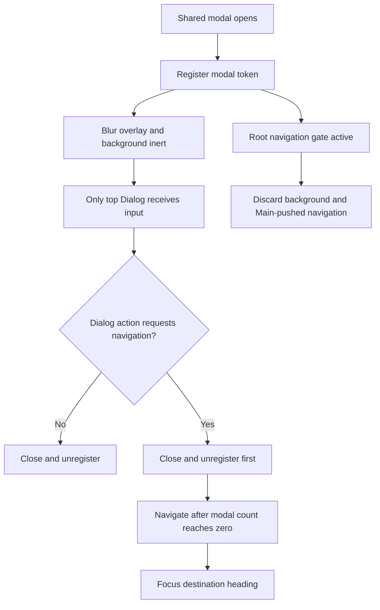

# Desktop Microphone Test, Modal Navigation, and Three-Pane Workspaces - Plan

## Goal Capsule

| Field | Contract |
| --- | --- |
| Objective | 让用户可以持续观察麦克风是否收到声音并自行结束测试，同时让模态弹窗和音频、互联、消息模块保持一致、可理解的交互。 |
| Means | 将麦克风测试改为 Native 持有采集事实、Renderer 持有显示节奏的手动结束流程；统一全局模态门禁与模糊遮罩；集中派生第三栏展示；收紧互联选择和消息已读语义。（KTD1、KTD2、KTD7、KTD11） |
| Authority | 本计划的 R-ID 定义本次产品行为，KTD-ID 定义实现机制。`flutter-ui-mobile/DESIGN.md` 与 `flutter-ui-mobile/DOC.md` 约束 Goo 组件和视觉实现。现有平台捕获与持久化契约不得被弱化。 |
| Execution profile | U1–U3、U5–U6 与 U8 可以分别推进；U4 在 U3 和 U8 完成后实现麦克风 UI，U7 在 U4 和 U6 完成后统一第三栏、图标与空状态。 |
| Stop conditions | 不创建试听录音、录音 session 或音频文件；不增加自动通过或自动结束；不把任意 URL 开放给 Renderer；不全局移除第三栏 padding 或分割线；不进行未经当前任务授权的可视化验证。 |
| Tail ownership | 本计划负责 macOS Electron Renderer 的全局模态行为、Main/Preload/共享契约和 `desktop_macos_native` 麦克风测试链路。移动端、正式录音算法、消息持久化容量和互联传输协议不在本计划内。 |

---

## Product Contract

### Summary

麦克风测试将持续到用户点击“结束测试”。检测到声音时只把实时状态从“暂未收到声音”切换为“已收到声音”，不会自动结束，也不会判断输入音量高低。用户在已收到声音后结束测试时直接关闭 Dialog，不进入单独的成功结果页；未收到声音或发生权限、设备、格式和 Helper 故障时才展示失败与恢复操作。测试没有自动结束时间，不创建试听录音或音频文件。

所有模态 Dialog 将使用同一套模糊遮罩、焦点锁定和背景交互阻断。Dialog 打开时，侧栏、第二栏和程序化路由请求不得切换后台页面；Dialog 内确需导航的操作必须先关闭当前 Dialog，再执行导航。

互联模块将使用明确选择驱动的第三栏。第二栏底部只在用户选择设备后显示主按钮“配对设备”；没有选择时第三栏展示本机接收、发现权限、身份和邀请就绪检查，但不显示顶部栏。消息模块增加本地搜索和 `mail-open` 全部已读按钮，单条选择只精确标记该条消息已读。第三栏标题和列表布局由共享 presentation model 统一派生。

音频导入继续使用现有 icon button，只把图标换成 `file-input`。当前项目所有真实空状态统一使用 `sprout`，错误、权限和加载状态不伪装为空状态。

### Problem Frame

当前 Native tap 为每个 buffer 覆盖一次峰值，而 Renderer 每 250ms 才拉取 snapshot。用户的讲话可能完整发生在两次拉取之间，后续静音 buffer 会把峰值覆盖为零。当前采样还只处理 Float32 和 Int16，并忽略 interleaved buffer 的 stride；Int32 或无法读取的格式会静默变成零。这些问题会让音量条不动，并漏掉真实输入。

现有麦克风交互把倒计时、离散的“输入活动”和手动结束同时呈现，但三者没有清晰分工。30 秒 Native timer、共享 schema 上限和 Renderer 倒计时会强制结束用户仍在进行的测试。结果页统一显示“麦克风测试完成”，又把收到声音和未收到声音混在同一种完成语义中。

现有 Radix Dialog 默认可以阻断普通背景交互，但共享 Overlay 只有半透明黑色，没有模糊效果。AI 设置和 Audio AI 还直接使用 `DialogPrimitive` 并复制 Overlay。应用也没有统一的 modal-open 状态来阻止 Main 推送、capture detail 请求等程序化页面切换。

互联和消息模块沿用了各自的自动选择、标题和 padding 判断。互联会在只有一个设备时自动进入详情，并把配对入口放在第三栏顶部；消息进入时使用 read-through 语义将一批消息标记已读。`App.tsx` 又分别维护标题可见性和内容 padding，导致未选择状态、列表主视图和详情主视图难以保持一致。

### Key Decisions

- **麦克风测试由用户手动结束。** (session-settled: user-directed — chosen over auto-pass and an automatic time limit: the user needs time to observe the microphone response.) Governs R2、R3、R5、R7、R8。
- **麦克风只判断是否收到声音。** (session-settled: user-directed — chosen over weak/normal/strong classification and record-and-playback: a low fixed RMS noise floor determines the binary fact, while peak only drives the meter.) Governs R2、R3、R4、R5。
- **麦克风失败必须区分采集事实并提供设置恢复。** (session-settled: user-approved — chosen over a generic completed result: the user needs to know whether frames, signal, permission, device, or format failed.) Governs R4、R5、R6。
- **模态弹窗阻断所有后台页面切换。** (session-settled: user-directed — chosen over page-local handling or a visual-only overlay: the rule must be consistent across the application.) Governs R23、R24。
- **互联底部操作使用通用“配对设备”。** (session-settled: user-directed — chosen over a selected-device-specific connect or re-pair action: the footer opens the generic pairing flow.) Governs R9、R10。
- **消息使用精确已读和显式全部已读。** (session-settled: user-approved — chosen over read-through or entry-time mark-all: opening one item must not clear unrelated unread state.) Governs R14、R15、R16。

### Requirements

**Microphone detection and recovery**

- R1. 麦克风测试必须使用正式录音的 Native Helper、设备选择和输入链路，且不得创建录音 session、音频文件或处理任务。
- R2. Native 必须持续采集到 finish、cancel、owner teardown 或 typed runtime failure，并在任一短窗 RMS 达到首版固定底噪线 `-55 dBFS` 后锁存 `observedSound = true`；peak 只用于 meter，检测到声音不得停止采集。
- R3. 测试运行时必须显示连续实时音量条、`暂未收到声音` 或 `已收到声音`，以及“结束测试”和关闭入口；不得显示弱、中、强等音量等级、倒计时或最长时长。
- R4. 测试结果必须区分 `no-audio-frames`、`no-sound-observed`、`permission-denied`、`device-unavailable`、`device-open-failed`、`unsupported-format`、`native-helper-failed` 与 `snapshot-failed`，且不得从错误文本推断结果。
- R5. 用户在已收到声音后点击“结束测试”必须直接关闭 Dialog，不展示成功结果页；未收到声音时显示“未检测到麦克风输入”，cancel、关闭、Escape 和遮罩关闭均不得展示结果。
- R6. 每个失败结果必须提供“前往麦克风设置”，通过固定 Main IPC 优先打开 macOS 麦克风隐私页面；Renderer 不得提供 URL。深链失败时 Main 回退到“隐私与安全”页面；最终打开失败时在原页面显示手动路径“系统设置 → 隐私与安全 → 麦克风”，不新增重试按钮且保留原设置按钮。
- R7. 麦克风测试不得设置自动结束时间；超过 30 秒必须继续保持运行，直到发生 R2 的明确终止条件。
- R8. 测试与正式录音继续互斥；finish、cancel、Dialog 关闭、Renderer 消失、Helper EOF、正式录音抢占和应用退出都必须幂等释放设备，迟到的 start 或 snapshot 不得恢复已关闭的测试 UI。

**Companion workspace**

- R9. 互联第二栏底部只在用户明确选择设备且处于设备详情视图时显示主按钮“配对设备”，点击后进入通用配对流程。
- R10. `pairing`、`history`、无选择、加载和错误视图不得显示第二栏底部配对按钮；无设备时的 readiness 内容必须保留可达的初次配对操作。
- R11. 互联不得因只有一个设备而自动选中；snapshot 刷新保留仍有效的用户选择，所选设备消失时返回无选择 readiness 状态。
- R12. 互联无选择时第三栏不得显示顶部栏，并必须复用现有 snapshot 展示接收开关、局域网发现与权限、手动配对 fallback、身份、邀请能力和 typed error。
- R13. 互联标题必须由视图类型决定：配对流程为“配对设备”，历史为“传输历史”，设备详情为设备名；历史列表使用 edge-to-edge 第三栏内容且无顶部分割线。

**Message workspace**

- R14. 选择或打开一条消息只能将该消息精确标记已读；进入消息模块时若自动选中第一条，也只能标记第一条已读。已读操作不得乐观修改本地状态，失败时保持 Main snapshot 的原未读状态、显示“操作失败，请重试”，并允许用户再次触发原操作。
- R15. 第二栏必须提供标题大小写不敏感的本地搜索，以及使用 `mail-open` 的全部已读 icon button；全部已读作用于完整消息集合，存在未读时才启用，并保持幂等。
- R16. 搜索不得改变当前选择或触发已读；新消息不得抢占当前选择，所选消息消失时才回退到第一条。
- R17. 有选中消息时第三栏标题必须为该消息标题；消息列表为空时清除选择，第三栏不显示内容或顶部栏。
- R18. 搜索无结果时第二栏使用统一空状态，第三栏继续显示原选中消息；清空搜索恢复完整列表与原选择。

**Shared shell and visual consistency**

- R19. 第三栏必须通过一个派生 presentation model 决定 `headerTitle`、`contentMode` 和 `headerDivider`，并保留音频未选择与录制详情现有优先级。
- R20. 只有明确的列表主视图可以使用 `edge-to-edge` 和无顶部分割线；详情、表单、readiness、设置和录制详情继续使用 padded 内容。
- R21. 音频导入必须保留现有 icon button、tooltip 和可访问名称，只把图标从 `file-up` 改为 `file-input`。
- R22. 共享 `EmptyState` 必须默认使用 `sprout`，现有空状态移除分散 icon 覆盖；加载、错误和权限状态不受此规则影响。

**Global modal behavior**

- R23. 所有 modal Dialog 必须使用统一的全屏模糊遮罩、focus trap 和背景 inert 行为；Dialog 打开时，用户不得操作侧栏、第二栏或后台页面来切换 route、pane 或设置分类。
- R24. Modal 打开时必须丢弃侧栏、第二栏、Main snapshot 和外部 detail 等后台导航意图并保持当前页面；Dialog 内的授权导航操作必须等待所有 modal token 注销后执行一次，并把焦点移到目标页面标题。Escape 只能关闭最上层 Dialog且不得同时收起第二栏。

### Key Flows

- F1. 麦克风持续测试与手动结束
  - **Trigger:** 用户开始测试并对所选麦克风说话。
  - **Steps:** Native 读取 PCM，以低固定 RMS 底噪线锁存收到声音，并把有效 meter 窗口保留到 Renderer 至少成功读取一次（最长 250ms）；Renderer 持续显示反馈；用户点击“结束测试”。
  - **Outcome:** 已收到声音时停止采集并直接关闭 Dialog，不展示成功结果页。
  - **Covered by:** R1、R2、R3、R5、R7、R8。
- F2. 麦克风失败恢复
  - **Trigger:** 用户未收到声音便结束测试，或 Native 返回权限、设备、打开、格式、Helper 或 snapshot 失败。
  - **Steps:** Native/Main 发布 typed reason；Renderer 显示对应失败；用户点击“前往麦克风设置”；Main 打开固定系统页面或回退页面。
  - **Outcome:** 用户知道失败原因并可尝试进入系统设置恢复；深链和回退均失败时获得可操作错误。
  - **Covered by:** R4、R5、R6、R7。
- F3. 互联选择与配对
  - **Trigger:** 用户进入互联模块或选择一个设备。
  - **Steps:** 无选择时显示 readiness 且无顶部栏；选择设备后显示设备名和底部“配对设备”；点击按钮进入通用配对流程。
  - **Outcome:** 详情选择与通用配对入口互不混淆。
  - **Covered by:** R9、R10、R11、R12、R13。
- F4. 消息阅读与搜索
  - **Trigger:** 用户进入消息模块、搜索或选择消息。
  - **Steps:** 首条或点击项被精确标记已读；搜索只过滤第二栏；第三栏保留当前选中详情；全部已读只响应 `mail-open` 按钮。
  - **Outcome:** 未读数量与用户实际操作一致。
  - **Covered by:** R14、R15、R16、R17、R18。
- F5. 全局模态门禁
  - **Trigger:** 任一共享 modal Dialog 打开。
  - **Steps:** Modal coordinator 注册打开状态；Overlay 模糊并阻断背景；shell 丢弃后台导航；Dialog 内授权操作登记一个目标，等待所有 modal 关闭后导航并聚焦目标标题。
  - **Outcome:** 用户只与最上层 Dialog 交互，后台页面和第二栏保持原状态，关闭 Dialog 后不会因旧后台请求突然切页。
  - **Covered by:** R23、R24。

### Acceptance Examples

- AE1. **Covers R2、R3、R5、R7.** Given 麦克风已收到声音，when 时间超过 30 秒但用户尚未结束，then 音量条继续反馈、状态保持“已收到声音”、测试不自动结束；用户点击“结束测试”后 Dialog 直接关闭且没有成功页。
- AE2. **Covers R2、R3.** Given 一个达到固定 RMS 底噪线的短声音发生在两次 Renderer poll 之间，when 下一次 snapshot 在 250ms 保留上限内返回，then Native 锁存的收到声音状态仍为 true、meter 至少展示该窗口一次，UI 不显示任何强弱等级且测试继续运行。
- AE3. **Covers R4、R5.** Given 测试未收到 frame 或收到 frame 但没有可识别信号，when 用户点击“结束测试”，then typed reason 分别为 `no-audio-frames` 或 `no-sound-observed`，用户界面显示“未检测到麦克风输入”和设置入口。
- AE4. **Covers R4.** Given 等价的 Float32、Int16、Int32、deinterleaved 和 interleaved PCM fixture，when 计算音量和持续输入，then 支持格式产生一致结果，未知格式返回 `unsupported-format` 而不是零音量。
- AE5. **Covers R6.** Given 任一失败结果，when 用户点击“前往麦克风设置”，then Renderer 只发送无 URL 的意图，Main 尝试麦克风隐私深链并在拒绝时回退；两次失败时 UI 显示手动系统路径，不新增按钮且原设置按钮仍可再次点击。
- AE6. **Covers R8.** Given finish、cancel、在途 snapshot 与 Renderer teardown 接近同时发生，when 多个路径竞争，then 只执行一次终止和设备释放，旧 testId 的迟到响应不得更新新测试或重新打开 Dialog。
- AE7. **Covers R9、R10、R11.** Given 零个、一个或多个互联设备，when snapshot 到达但用户未点击列表项，then 不自动选中且 footer 不显示；用户选择设备后 footer 才显示。
- AE8. **Covers R11、R13.** Given 用户已选择设备，when 刷新仍包含设备，then 保留选择；设备消失时回到 readiness；进入 pairing 或 history 时标题不受残留设备名影响。
- AE9. **Covers R14、R15.** Given 三条未读消息，when 用户进入消息模块并自动选中第一条，then 只读第一条；点击 `mail-open` 后三条全部已读，重复点击不改变状态；任一命令失败时不提前改变未读状态，并显示可访问的“操作失败，请重试”。
- AE10. **Covers R16、R18.** Given 当前选中消息不匹配搜索词，when 搜索结果为空，then 第二栏显示 Sprout 空状态，第三栏仍显示该消息且不改变已读状态。
- AE11. **Covers R17、R19.** Given 消息集合变为空，when shell 重新派生 presentation，then 第三栏无内容、无标题、无顶部栏，且隐藏标题时仍可重新打开第二栏。
- AE12. **Covers R13、R19、R20.** Given 互联历史列表，when 第三栏渲染，then 内容 edge-to-edge 且没有 header 底部分割线；设备详情、readiness、设置与录制详情仍 padded。
- AE13. **Covers R23、R24.** Given 任一麦克风、活动错误、能力不可用、AI 设置或 Audio AI modal 已打开，when 用户尝试侧栏、第二栏、设置分类、capture detail、Main snapshot 或其他程序化 route 切换，then 该后台导航被丢弃且页面保持不变；Escape 只关闭最上层 Dialog，授权 CTA 等全部 modal 关闭后才导航并聚焦目标标题。

### Scope Boundaries

**In scope**

- macOS Electron 麦克风测试、系统设置恢复和对应 Native Helper 协议。
- Electron Renderer 全局 modal 注册、模糊遮罩和后台导航门禁。
- 音频、互联和消息模块的三栏状态、标题、footer、搜索、已读和列表内容模式。
- 当前共享 `EmptyState` 与指定 Lucide 图标替换。

**Deferred to Follow-Up Work**

- 用真实硬件验证约 50ms 反馈与首版 `-55 dBFS` RMS 底噪线；先用 deterministic fixture 固定行为，再通过单独授权的设备验证收集证据。
- 改变 `capture_failed` 消息选择后自动弹 Dialog 的行为；本次只保证选择、精确已读和第三栏标题，不重设计消息类型的详情操作。
- 将 edge-to-edge 模式推广到本次未涉及的新第三栏列表。

**Out of scope**

- 语音识别、VAD、环境噪声分类或录音质量评分。
- 录制试听、实时监听、临时测试音频和输入音量高低分类。
- 改变正式录音的音频格式、增益或设备切换策略。
- 新增消息后端查询、分页或超过现有 20 条活动上限的搜索。
- 改变互联配对、信任、传输或邀请协议。

### Plan Relationship

本计划恢复并细化 `docs/plans/2026-08-24-1703-feat-local-model-microphone-plan.md` 中“用户手动结束测试”的产品方向，但删除剩余时间和 30 秒 Native timeout。旧计划的 R6、Main-owned singleton、正式录音互斥、窗口所有权和 teardown 约束继续有效。本计划不重开或取代旧计划的本地模型工作。

Product Contract changed: R2–R5、R7–R8 and their F/AE links now define continuous manual testing; R23–R24 add the application-wide modal rule. These user-directed changes supersede the prior auto-pass and hidden-timeout contract in this same plan.

---

## Planning Contract

### Key Technical Decisions

- KTD1. **Native owns microphone facts, not UI completion.** (session-settled: user-directed — chosen over auto-pass and Renderer-side detection: Native can read PCM safely while the user owns when the test ends.) Native 在线程安全边界内锁存 `observedSound`，但检测到声音不产生终态。Finish、cancel 和 owner teardown 使用不同 disposition，并共享幂等资源释放。Governs R1、R2、R4、R7、R8。
- KTD2. **Native metering and Renderer smoothing have separate clocks.** (session-settled: user-approved — chosen over latest-buffer-only polling: each active meter window must be visible at least once without increasing normal latency.) Native 计算短窗 RMS 与 peak；首版以常量 `RMS_SOUND_FLOOR_DBFS = -55` 锁存 `observedSound`，peak 不参与声音判定。自上次成功 snapshot 后的最大 RMS/peak 保留到被成功读取一次，最长 250ms 后淘汰。Renderer 约每 50ms 拉取一次且最多一个请求在途，音量上升快速响应，回落在 150–250ms 内平滑完成，不产生弱、中、强分类。Governs R2、R3、R4。
- KTD3. **PCM parsing is format- and stride-aware.** Float32、Int16 和 Int32 走同一归一化结果模型，并按实际 layout 与 stride 遍历 planar/interleaved 数据；多声道以各声道 RMS/peak 最大值提供展示事实，零 frame、零信号和不支持格式保持可区分。Governs R2、R4。
- KTD4. **Expected microphone outcomes are typed across every process boundary.** Native snapshot、Helper client、Main service、Zod IPC 和 preload API 使用稳定 state/reason 字段；finish 与 cancel 必须可区分。Helper EOF、进程退出和 transport terminal 产生 `native-helper-failed`；Helper 仍存活但 snapshot 命令返回无效响应或非预期命令失败产生 `snapshot-failed`。两者都停止并释放测试，Renderer 统一显示“麦克风测试出现问题，请重新测试”，不得解析英文 error message。Governs R4、R5、R7、R8。
- KTD5. **System settings is a fixed Main-owned capability.** Electron Main 暴露无 URL 参数的 `openMicrophoneSettings` 意图，验证 sender 后调用 `shell.openExternal`。麦克风隐私与通用“隐私与安全”URI 作为两个 Main-owned 固定常量集中维护和精确测试；首选深链 reject 后才调用通用页，双失败返回 typed error。Renderer 在原失败页面追加手动路径，不新增重试按钮并保留原设置按钮。`openExternal` resolve 只代表系统接受 URI，不作为已到达具体 pane 的证明。Governs R6。
- KTD6. **Activity read APIs name their semantics.** 用 exact-read 和 mark-all-read 两个 contract/channel/API 取代内部 read-through `acknowledgeActivity(throughId)`，同一发布批次迁移所有调用者和 fixture，避免悄悄改变旧方法含义。Governs R14、R15、R16。
- KTD7. **Shell presentation is a derived route state.** `App.tsx` 从当前 route、selected entity 和 subview 派生 `headerTitle: string | null`、`contentMode: padded | edge-to-edge`、`headerDivider: boolean`；本计划只有 Companion history opt in edge-to-edge。Governs R13、R17、R19、R20。
- KTD8. **Companion selection stays explicit.** `reconcileView` 只保留仍存在的用户选择，不再为单设备自动选择；readiness 复用 `ReceiverStatus`、`PairingPanel` 和现有 snapshot 字段，不创建第二套互联状态。Governs R9、R10、R11、R12、R13。
- KTD9. **Message search is a local projection.** 当前最多 20 条活动在 Renderer 按 title 做大小写不敏感过滤；过滤不改变 canonical selection，mark-all 始终作用于完整集合。Governs R15、R16、R18。
- KTD10. **Visual primitives remain shared and shadowless.** 使用现有 Goo/Tailwind/Button/SidebarInput/Tooltip 与 flat-row 约定；`EmptyState` 提供 Sprout 默认值，列表行拥有自身 padding 和行间 divider，不增加阴影。Governs R13、R15、R20、R21、R22。
- KTD11. **A root modal coordinator owns background navigation.** (session-settled: user-directed — chosen over relying only on page-local overlays: programmatic navigation must obey the same modal rule as pointer and keyboard input.) 所有直接 Radix Dialog 用法迁移到共享 modal surface。共享 Root 用 token/count 注册打开状态，共享 Overlay 增加 backdrop blur；模糊只作用于背景遮罩，不把 Dialog surface 改成 Frosted 材质。Modal 活跃时，`App.tsx` 保持当前 displayed section，并丢弃 shell、pane、Main-pushed navigation 和外部 detail 意图，同时继续接收 snapshot 的非导航数据。Dialog 内授权 CTA 只登记一个 pending modal-navigation intent；全部 token 归零后执行一次并聚焦目标页面标题。Governs R23、R24。

### High-Level Technical Design

麦克风采集状态由 Native 持有，展示阶段由 Renderer 持有。以下状态名可以按现有 Swift/Zod 命名约定调整，但 finish、cancel 和 failure 的语义必须满足 R2、R4、R5、R7、R8。

```mermaid
stateDiagram-v2
  [*] --> starting
  starting --> running: tap installed
  starting --> failed: typed start failure
  starting --> cancelled: close before start returns
  running --> running: latch observedSound
  running --> finished: user clicks end
  running --> failed: typed runtime failure
  running --> cancelled: close or owner teardown
  finished --> [*]: detected closes; no input shows failure UI
  failed --> [*]: stop and latch reason
  cancelled --> [*]: stop without result UI
```



跨进程协议只传事实和固定意图。Renderer 不计算通过条件，也不携带系统设置 URL。

```mermaid
sequenceDiagram
  participant Tap as AVAudioEngine tap
  participant Native as CaptureCore
  participant Main as Electron Main
  participant Preload as Preload API
  participant UI as Renderer
  Tap->>Native: PCM buffer
  Native->>Native: update RMS/peak; latch sound from RMS floor
  UI->>Preload: request snapshot
  Preload->>Main: validated IPC
  Main->>Native: helper snapshot
  Native-->>Main: consume retained RMS/peak; typed state and reason
  Main-->>UI: parsed snapshot
  UI->>UI: fast attack, 150–250ms release
  UI->>Main: finish or cancel intent
  Main->>Native: idempotent stop disposition
  UI->>Main: open microphone settings intent
  Main->>Main: open fixed deep link or fallback
```

Modal coordinator protects both user input and programmatic navigation. Radix keeps focus and pointer input inside the Dialog; the root coordinator covers navigation paths that an Overlay cannot intercept.



第三栏使用同一 presentation matrix，避免标题、padding 和 divider 分散判断。

| Route state | Header title | Content mode | Header divider |
| --- | --- | --- | --- |
| Audio, no selection | none | padded | none |
| Audio, selection | audio title | padded | yes |
| Recording detail | 录制详情 | padded | yes |
| Companion readiness | none | padded | none |
| Companion device | device name | padded | yes |
| Companion pairing | 配对设备 | padded | yes |
| Companion history | 传输历史 | edge-to-edge | no |
| Messages empty | none | no third-pane content | none |
| Message selected | message title | padded | yes |
| Settings | settings item title | padded | yes |

### System-Wide Impact

- **Native concurrency:** tap callback、snapshot polling、finish、cancel 和 teardown 竞争同一测试状态，必须使用现有 CaptureController queue 或等价串行化边界。
- **Polling pressure:** 约 50ms polling 必须跳过仍在途的请求，Helper line protocol 不得形成请求队列；Native meter 窗口最多保留 250ms 且只能被成功 snapshot 消费一次，关闭后的 testId 响应必须被 generation token 丢弃。
- **IPC security:** 新系统设置能力跨越 Renderer sandbox，必须沿用 sender trust、Zod fixed request 和 preload allowlist。
- **Activity semantics:** read-through 改为 exact/all 会影响 Main application snapshot、侧栏 badge、e2e fixture 和所有调用者，但不改变存储容量或排序；Renderer 不做乐观已读，只在命令失败时显示可访问错误并允许重触发原操作。
- **Responsive navigation:** 无顶部栏时必须保留现有 standalone pane trigger，避免第二栏收起后不可恢复。
- **Accessibility:** meter 需要非颜色名称和值，live region 节流；终态只播报一次；icon button 保留 tooltip、`aria-label`、键盘焦点和轻量 focus indicator。
- **Modal accessibility:** 所有 modal 继续使用 Radix 的 `aria-modal`、focus trap、Escape 和焦点恢复；模糊遮罩不能取代语义上的 background inert。授权导航完成后焦点进入目标页面标题，而不是恢复到已卸载的 Dialog trigger。

### Risks and Mitigations

| Risk | Impact | Mitigation |
| --- | --- | --- |
| 声音检测 RMS 底噪线对硬件敏感 | 底噪误触发或低增益声音未被锁存 | 首版固定为 `-55 dBFS` 且一旦达到便锁存，不输出音量等级；用边界 fixture 固定行为，真实设备调优留待授权验证。 |
| `x-apple.systempreferences` deep link 未被 Apple 稳定公开 | macOS 版本变化后不能直达麦克风页 | Main 使用固定常量尝试直达并在 rejection 时回退；双失败后显示手动系统路径，目标 pane 是否正确仍留待授权目标机验证。 |
| finish、cancel、poll 和 teardown 竞态 | 设备泄漏或旧结果复活 Dialog | 单一 Native owner、区分 disposition、幂等 stop、Renderer generation token 和竞态测试。 |
| activity API 语义迁移漏调用者 | badge 或已读状态不一致 | 新增明确 API，使用全仓引用搜索迁移，并由 contract、domain、Renderer 和 e2e 测试共同证明。 |
| 全局 edge-to-edge 改动范围过大 | 设置或详情页丢失间距 | presentation model 默认 padded，只有显式列表 state opt in，并为不变页面加回归断言。 |
| modal registry 漏掉直接 Radix 用法 | 某些页面仍可切换或没有模糊遮罩 | 迁移 AI settings 与 Audio AI 的直接 `DialogPrimitive`，引用搜索禁止 feature 层自建 Overlay，并测试嵌套 token/count。 |
| Main snapshot 在 modal 后台改变 route | 用户无法操作页面但内容仍突然切换 | Modal 期间只接收非导航 snapshot 数据并锁定 displayed section，后台导航意图直接丢弃；只有 Dialog 授权 CTA 可登记一次待执行导航。 |
| 长时间手动测试持续占用麦克风 | 用户离开 Dialog 后设备一直被测试占用 | 这是无自动时限的预期；Dialog 关闭、Renderer/Helper 消失、正式录音抢占和应用退出仍强制释放。 |

### Sources and Research

- `apps/desktop-electron/src/renderer/features/audios/audio-route-feature.tsx`：现有 250ms polling、离散音量等级、手动 stop 与统一结果 UI。
- `packages/desktop_macos_native/Sources/CaptureCore/MicrophoneCapture.swift`：现有每 buffer peak 覆盖、Float32/Int16 读取和 stride 缺口。
- `packages/desktop_macos_native/Sources/CaptureCore/CaptureController.swift`：Native timeout、snapshot 与生命周期 owner。
- `apps/desktop-electron/src/renderer/components/ui/dialog.tsx`：现有 Radix modal、固定 dim Overlay 和共享 Dialog surface。
- `apps/desktop-electron/src/renderer/features/settings/ai-settings-feature.tsx` 与 `apps/desktop-electron/src/renderer/features/audio-ai/audio-ai-feature.tsx`：绕过共享 Dialog 的直接 Radix 用法。
- `apps/desktop-electron/src/renderer/features/shell/context-pane-shell.tsx`：尊重 `event.defaultPrevented` 的 window Escape handler。
- `apps/desktop-electron/src/main/application/application_state.ts`：现有 read-through `acknowledgeActivity` 语义。
- `apps/desktop-electron/src/renderer/features/companion/companion-feature.tsx`：现有单设备自动选择、ReceiverStatus、PairingPanel 和 TransfersPanel。
- `docs/solutions/architecture-patterns/desktop-first-workstation-boundaries.md`：平台应用保持 composition root，macOS 行为留在桌面边界。
- [Apple AVAudioPCMBuffer `floatChannelData`](https://developer.apple.com/documentation/avfaudio/avaudiopcmbuffer/floatchanneldata)：interleaved pointer 和 stride 约束。
- [Apple AVAudioPCMBuffer `stride`](https://developer.apple.com/documentation/avfaudio/avaudiopcmbuffer/stride)：PCM interleaved channel spacing。
- [Apple AVAudioEngine `installTap`](https://developer.apple.com/documentation/avfaudio/avaudionode/installtap%28onbus%3Abuffersize%3Aformat%3Ablock%3A%29)：tap buffer size 与 callback execution 约束。
- [Electron `shell.openExternal`](https://www.electronjs.org/docs/latest/api/shell)：Promise 行为和外部协议打开能力。
- [Electron Security](https://www.electronjs.org/docs/latest/tutorial/security)：不得向 `shell.openExternal` 传递不可信内容，并验证 IPC sender。
- [Apple Support: Allow use of the microphone and audio input](https://support.apple.com/guide/mac-help/allow-use-of-the-microphone-and-audio-input-mchl7fa8e3cc/mac)：用户恢复路径为 System Settings → Privacy & Security → Microphone。

---

## Implementation Units

### U1. Make Native PCM metering format-safe and windowed

- **Goal:** 让所有支持的 PCM layout 产生可靠、短窗化且可测试的 RMS、peak 与采集事实。
- **Requirements:** R1、R2、R4。
- **Dependencies:** None.
- **Files:**
  - `packages/desktop_macos_native/Sources/CaptureCore/MicrophoneCapture.swift`
  - `packages/desktop_macos_native/Tests/CaptureCoreTests/MicrophoneCaptureTests.swift`
- **Approach:**
  1. 提取只负责 buffer 读取和归一化的内部 meter 结果，区分 no-frame、samples、unsupported-format。
  2. 按 KTD3 支持 Float32、Int16、Int32，并使用 channel pointer、layout 与 stride 正确遍历 planar/interleaved frame。
  3. 增加跨 buffer 的短窗 accumulator，同时输出 RMS 与 peak；保存自上次成功 snapshot 以来的最大 RMS/peak，成功读取一次后清空，未读取时最多保留 250ms。
- **Execution note:** Start with deterministic PCM fixtures before changing the live tap path.
- **Patterns to follow:** `MicrophoneCapture` 的设备映射和 CaptureCore 现有 value-type snapshot 风格。
- **Test scenarios:**
  - Float32、Int16 和 Int32 的等价样本产生近似相同的归一化 peak/RMS。
  - planar 与 interleaved 多声道 fixture 在使用 stride 后产生一致结果，并按 KTD3 合并声道。
  - `frameLength == 0` 返回 no-frame，包含 frame 但全零返回 samples with zero energy。
  - 未支持 common format 返回 unsupported-format，不返回普通零能量。
  - 一个约 21ms 的有声 buffer 后接静音 buffer 时，首次成功 snapshot 仍获得可见 RMS/peak；读取后清空，未读取超过 250ms 后自动淘汰。
  - 延迟到正常 50ms cadence 之后的 snapshot 仍消费一次保留窗口，第二次 snapshot 不重复返回同一窗口。
  - 正负极值和整数最小值不会溢出，归一化结果被限制在有效范围。
- **Verification:** Meter helper 的 Swift 测试证明格式、stride、零 frame 和数值边界，不需要启动设备。

### U2. Add the Native continuous manual-test state machine

- **Goal:** 让 Native 持续采集并锁存是否收到声音，直到明确 finish、cancel、failure 或 owner teardown。
- **Requirements:** R2、R4、R7、R8。
- **Dependencies:** U1.
- **Files:**
  - `packages/desktop_macos_native/Sources/CaptureCore/MicrophoneCapture.swift`
  - `packages/desktop_macos_native/Sources/CaptureCore/CaptureController.swift`
  - `packages/desktop_macos_native/Tests/CaptureCoreTests/MicrophoneCaptureTests.swift`
  - `packages/desktop_macos_native/Tests/CaptureCoreTests/CaptureControllerTests.swift`
- **Approach:**
  1. 按 KTD1、KTD2 分离短窗 meter、`observedSound` latch 和终止 disposition；固定 `-55 dBFS` RMS 底噪线是声音判定的唯一规则，peak 只用于展示且不产生等级。
  2. 删除 30 秒 `DispatchSourceTimer`、`timed-out` 终态和 `remainingMs`；测试超过 30 秒仍返回 running。
  3. Finish 根据 observed frames 与 `observedSound` 返回 detected、`no-audio-frames` 或 `no-sound-observed`；cancel 和 owner teardown 只释放资源，不产生用户结果。
  4. 把 finish、cancel、formal capture 抢占和 controller teardown 收敛到单一幂等资源释放路径。
  5. 扩展 `MicrophoneTestEngine` runtime-health 通道，复用 `MicrophoneCapture.healthHandler`；将配置变化和设备消失串行投递到 CaptureController state queue，锁存 `device-unavailable` 后幂等 teardown。
- **Execution note:** Add characterization coverage for the current timeout and teardown, then prove the timeout is removed while every owner cleanup remains intact.
- **Patterns to follow:** `CaptureController` state queue、timer ownership、`MicrophoneTestEngine` 注入式测试。
- **Test scenarios:**
  - Covers AE1. 检测到声音后 `observedSound` 保持 true，engine 继续运行；虚拟时间超过 30 秒仍为 running。
  - Covers AE2. 声音发生在 snapshot 间隙时，下次 snapshot 仍读取到锁存的 `observedSound` 和短窗 meter。
  - `-55 dBFS` 边界下方的数字底噪不锁存声音，达到边界的 fixture 只改变布尔事实；相同 peak 但 RMS 未达线时不锁存，证明 peak 不参与判定。
  - Covers AE3. Finish 时零 frame 与有 frame 但无信号返回不同 reason；检测到声音返回 detected。
  - Covers AE6. finish、cancel 和 teardown 竞争只 stop 一次并保留一个 disposition。
  - 设备在运行中消失或 configuration-change health callback 触发时锁存 `device-unavailable`；与迟到 buffer/snapshot 竞争仍只释放一次 tap 与 engine。
  - formal capture 抢占和 controller close 都释放 tap 与 engine。
- **Verification:** CaptureCore 测试证明 sound latch、meter window、无 timeout、竞态与 teardown；不依赖 Renderer poll timing 才能通过。

### U3. Carry finish/cancel outcomes and fixed settings intent through Electron

- **Goal:** 让 Electron 各层传递稳定麦克风事实，并安全打开固定系统设置页面。
- **Requirements:** R4、R6、R7、R8。
- **Dependencies:** U2.
- **Files:**
  - `apps/desktop-electron/src/shared/contracts/capture.ts`
  - `apps/desktop-electron/src/shared/contracts/ipc.ts`
  - `apps/desktop-electron/src/main/features/importing/macos_native_helper_client.ts`
  - `apps/desktop-electron/src/main/domain/capture/capture_native_port.ts`
  - `apps/desktop-electron/src/main/domain/capture/macos_capture_native_port.ts`
  - `apps/desktop-electron/src/main/domain/capture/microphone_test_service.ts`
  - `apps/desktop-electron/src/main/domain/capture/microphone_settings.ts`
  - `apps/desktop-electron/src/main/ipc/desktop_ipc.ts`
  - `apps/desktop-electron/src/main/ipc/register_desktop_ipc.ts`
  - `apps/desktop-electron/src/main/index.ts`
  - `apps/desktop-electron/src/preload/api.ts`
  - `packages/desktop_macos_native/Sources/DesktopMacOSNativeHelper/main.swift`
  - `apps/desktop-electron/tests/unit/ipc_contract_test.ts`
  - `apps/desktop-electron/tests/unit/macos_native_helper_client_test.ts`
  - `apps/desktop-electron/tests/unit/main/microphone_test_service_test.ts`
  - `apps/desktop-electron/tests/unit/main/microphone_settings_test.ts`
  - `apps/desktop-electron/tests/integration/domain_ipc_test.ts`
  - `apps/desktop-electron/tests/integration/register_desktop_ipc_test.ts`
  - `apps/desktop-electron/tests/e2e/macos_capture_flow_test.ts`
- **Approach:**
  1. 将 snapshot schema 改为 running/finished/failed/cancelled 事实、KTD4 reason、RMS、peak 和 `observedSound`；cancel 与 owner teardown 锁存 cancelled 但不产生结果 UI，并移除 `remainingMs`、30 秒 elapsed 上限和 `timed-out`。
  2. Helper EOF、进程退出和 transport terminal 映射到 `native-helper-failed`；Helper 存活但 snapshot command 返回无效响应或非预期命令失败映射到 `snapshot-failed`，预期结果不解析 `CODE: message` 字符串。
  3. 扩展 `CaptureNativePort`、macOS adapter 与 Swift Helper command router，为用户 finish 与 owner cancel 建立不同的 Main/Native 调用语义；service 保留最后终态，使重复 finish、cancel、snapshot 和 teardown 幂等。
  4. Helper EOF 由 Helper client/service 层映射并释放 active test，不要求 CaptureCore 识别进程协议终止。
  5. 新增无参数或固定空 payload 的 `openMicrophoneSettings` IPC，沿用 sender trust 与 Zod allowlist。
  6. Main helper 注入 `shell.openExternal`；两个 settings URI 作为固定常量集中维护，测试精确参数、首选深链、通用 Privacy & Security fallback 和双失败。
- **Execution note:** Start with failing schema and registered-IPC tests so the wire contract is fixed before Renderer changes.
- **Patterns to follow:** 现有 `microphone_test_service.ts`、Zod channel registration、preload API 和 capture permission Main helper。
- **Test scenarios:**
  - 每个 Native terminal reason 通过 Helper、service、IPC 与 preload 后保持不变；finish 与 cancel 不可互换。
  - 缺失或未知 state/reason 被 schema 拒绝；Helper terminal 稳定映射为 `native-helper-failed`，Helper 存活时的无效 snapshot 稳定映射为 `snapshot-failed`，两者都释放测试。
  - Capture port、macOS adapter 和 Helper command router 贯穿 finish/cancel disposition，不再把两者折叠为同一个 stop。
  - running snapshot 在 30 秒后仍通过 schema；`remainingMs` 和 `timed-out` 不再被接受。
  - 重复 finish、cancel、snapshot、owner teardown 和 Helper EOF 不重复停止设备，也不返回 not-active 竞态错误。
  - Covers AE5. Renderer request 没有 URL 字段，受信 sender 才能触发固定麦克风 settings deep link。
  - 首选 deep link resolve 时不调用 fallback；reject 时调用通用 Privacy & Security；两次 reject 返回 typed UI failure。
  - 非受信 sender、错误 payload 和未注册 service 不得打开外部协议。
  - 应用退出和 Renderer owner 消失仍调用现有 microphone test teardown。
- **Verification:** Contract、Main service 和 IPC 测试证明 typed outcome 与固定目标安全边界；Renderer 无法控制任意外部 URL。

### U4. Build the continuous manual microphone test UI

- **Goal:** 让麦克风 Dialog 持续展示实时反馈，由用户结束，并只在失败时保留结果页面。
- **Requirements:** R1、R2、R3、R4、R5、R6、R7、R8、R21。
- **Dependencies:** U3、U8.
- **Files:**
  - `apps/desktop-electron/src/renderer/features/audios/audio-route-feature.tsx`
  - `apps/desktop-electron/tests/unit/renderer/audio_route_test.tsx`
  - `apps/desktop-electron/tests/visual/harness/preload.ts`
- **Approach:**
  1. 用 instructions → starting → testing → failure 的 presentation 消费 typed snapshot；starting 显示“正在连接麦克风…”，meter 与“结束测试”不可用但关闭入口可用；不存在 success 或 timed-out presentation。
  2. Testing 显示连续 meter、`暂未收到声音`/`已收到声音` 和“结束测试”，删除倒计时、最长 30 秒、弱/中/强等级和“测试完成”。
  3. 约 50ms polling 保留单请求 in-flight；Renderer generation token 丢弃迟到的 start/snapshot，迟到 start 成功必须立即 cancel 返回的 testId。
  4. Meter 使用 Native 保留并消费一次的 RMS/peak，音量上升快速响应，回落在 150–250ms 内完成；辅助技术只在首次收到声音和 failure 时播报。
  5. Finish 且已收到声音时关闭 Dialog；finish 且未收到声音时进入 R5 failure。关闭、取消、Escape、遮罩和卸载走同一 cancel 路径且无结果。
  6. `no-audio-frames` 与 `no-sound-observed` 对用户统一显示“未检测到麦克风输入”；`native-helper-failed` 与 `snapshot-failed` 统一显示“麦克风测试出现问题，请重新测试”，内部 reason 保持可诊断。
  7. 失败页显示原“前往麦克风设置”按钮；双设置 URI 均打开失败时追加手动系统路径，不新增重试按钮且原按钮不改变。
  8. 将导入图标替换为 FileInput，保留现有 icon button contract。
- **Patterns to follow:** 当前共享 Dialog（Radix wrapper）、Button、Tooltip、录音互斥和 polling cleanup 逻辑。
- **Test scenarios:**
  - Covers AE1. 收到声音只把文案改为“已收到声音”，超过 30 秒仍 testing；点击“结束测试”后关闭且没有成功 Dialog。
  - Starting 显示“正在连接麦克风…”，meter 与结束按钮不可用，关闭仍执行一次 cancel；进入 running 后才切换到 testing controls。
  - Covers AE3. `no-audio-frames` 与 `no-sound-observed` 都显示“未检测到麦克风输入”，内部 reason 保持可诊断。
  - `device-unavailable`（包括运行中设备消失）显示“麦克风不可用”；permission、open 和 unsupported-format 显示对应易懂文案；helper 与 snapshot failure 使用同一用户文案，所有失败都保留设置按钮且不展示原始错误。
  - settings 双失败时追加手动系统路径，不渲染独立重试按钮；再次点击原设置按钮仍发同一个固定 intent。
  - Starting 阶段关闭后，迟到 start 被 cancel 且 Dialog 不复活；迟到 snapshot 不更新新 generation。
  - 取消、关闭、Escape、遮罩和路由卸载只发一次 cancel，且不展示失败。
  - Fake timer 下 polling 约每 50ms 尝试一次，慢请求期间不发第二个请求；meter 快起并在 150–250ms 内回落。
  - Meter 使用连续 accessible value，界面和 live region 均不出现弱、中、强文案。
  - 正式录音期间禁用测试；测试期间不能开始正式录音，直到 teardown 完成。
  - 键盘可以开始、结束和取消；meter 不只依赖颜色；关闭后焦点返回触发按钮；failure 只播报一次。
  - 导入按钮仍有“导入音频”可访问名称与 tooltip，并渲染 FileInput icon class。
- **Verification:** Renderer unit tests覆盖手动结束、无成功页、失败、polling、平滑、迟到响应、清理、焦点和图标；不启动 Electron UI。

### U8. Unify modal surfaces and block background navigation

- **Goal:** 让所有 Electron modal 使用统一模糊遮罩，并在打开期间阻止后台页面和程序化导航切换。
- **Requirements:** R23、R24。
- **Dependencies:** None.
- **Files:**
  - `apps/desktop-electron/src/renderer/App.tsx`
  - `apps/desktop-electron/src/renderer/components/ui/dialog.tsx`
  - `apps/desktop-electron/src/renderer/components/ui/modal-coordinator.tsx`
  - `apps/desktop-electron/src/renderer/features/shell/use-application-shell.ts`
  - `apps/desktop-electron/src/renderer/features/shell/context-pane-shell.tsx`
  - `apps/desktop-electron/src/renderer/features/settings/ai-settings-feature.tsx`
  - `apps/desktop-electron/src/renderer/features/audio-ai/audio-ai-feature.tsx`
  - `apps/desktop-electron/tests/unit/renderer/ui_primitives_test.tsx`
  - `apps/desktop-electron/tests/unit/renderer/shell_test.tsx`
  - `apps/desktop-electron/tests/unit/renderer/ai_settings_test.tsx`
  - `apps/desktop-electron/tests/unit/renderer/audio_ai_test.tsx`
  - `apps/desktop-electron/tests/e2e/sidebar_navigation_test.ts`
- **Approach:**
  1. 按 KTD11 为共享 Dialog Root 增加 token/count 注册，并为共享 Overlay 增加一致的 backdrop blur、dim、层级和 reduced-motion 兼容样式。
  2. 将 AI provider、secret 和 Audio AI consent 的直接 `DialogPrimitive` 用法迁移到共享 surface；feature 层不再复制 Overlay。
  3. 在 `App.tsx` 集中门禁 `navigatePrimary`、pane open/toggle、settings section、外部 capture detail 和 Main-pushed `navigation.section`。将 `lastObservedNavigationSection` 与 `displayedSection` 分离：modal 活跃时继续更新前者和非导航 snapshot 数据，但不更新后者；关闭后不得从已观察并丢弃的 section 补跳，只有后续新的 section 变化或授权 CTA 才更新 displayed section。
  4. 保留 Radix 默认 modal、focus trap、outside pointer block 和 background inert；window Escape 在 Dialog 已处理时不得继续收起 context pane。
  5. Dialog 内“前往本地模型”“打开录制详情”等授权 CTA 登记唯一 pending modal-navigation intent；等待全部 token 注销后执行一次，并通过目标页面 focus contract 聚焦标题，不恢复到已卸载 trigger。
- **Patterns to follow:** Radix Dialog controlled/uncontrolled open 语义、现有 `event.defaultPrevented` Escape guard、`App.tsx` composition-root navigation ownership。
- **Test scenarios:**
  - Covers AE13. 麦克风、活动错误、能力不可用、AI provider、secret 和 Audio AI consent 都渲染同一个模糊 Overlay、`aria-modal` 与背景 inert 行为。
  - 一个 modal 打开时，侧栏 route、pane toggle、settings section、Main snapshot route 和外部 capture-detail 请求都被丢弃且不改变当前页面；关闭后不会补执行。
  - Escape 只关闭最上层 Dialog，不同时收起 context pane；关闭后焦点恢复到触发控件。
  - Dialog 内授权 CTA 先登记目标；modal count 归零后只导航一次并聚焦目标标题，关闭前不导航。
  - 两个嵌套或交叠 modal 使用独立 token；关闭发起 CTA 的 Dialog 后若仍有 token，授权导航继续等待，全部关闭后才执行。
  - 直接引用搜索不再发现 feature 层自建 `DialogPrimitive.Overlay`。
- **Verification:** Shared primitive、shell 和现有 Dialog consumer 测试证明统一 surface、token 生命周期和导航门禁；模糊程度与真实背景阻断仍等待用户授权后的视觉验证。

### U5. Replace activity read-through with exact and all-read commands

- **Goal:** 让消息已读数量严格对应单条阅读与显式全部已读操作。
- **Requirements:** R14、R15、R16。
- **Dependencies:** None.
- **Files:**
  - `apps/desktop-electron/src/shared/contracts/application_state.ts`
  - `apps/desktop-electron/src/shared/contracts/ipc.ts`
  - `apps/desktop-electron/src/main/application/application_state.ts`
  - `apps/desktop-electron/src/main/ipc/desktop_ipc.ts`
  - `apps/desktop-electron/src/main/ipc/register_desktop_ipc.ts`
  - `apps/desktop-electron/src/main/index.ts`
  - `apps/desktop-electron/src/preload/api.ts`
  - `apps/desktop-electron/tests/unit/application_activity_test.ts`
  - `apps/desktop-electron/tests/unit/ipc_contract_test.ts`
  - `apps/desktop-electron/tests/integration/domain_ipc_test.ts`
  - `apps/desktop-electron/tests/integration/register_desktop_ipc_test.ts`
- **Approach:**
  1. 按 KTD6 增加 exact-read 和 mark-all-read domain methods、request schemas、IPC channels 与 preload methods。
  2. 同批移除或停止暴露 `acknowledgeActivity(throughId)`，用引用搜索迁移所有调用者和 fallback stubs。
  3. Domain 更新保持 snapshot 顺序、20 条上限和持久化模型不变；不存在 ID 与重复操作保持幂等。
  4. Contract 为 exact/all-read rejection 返回稳定错误，不把命令失败伪装成已成功的 snapshot。
- **Execution note:** Implement domain semantics test-first, then add the wire contract and migrate callers.
- **Patterns to follow:** `ApplicationState` immutable snapshot update、现有 IPC schema/channel 命名和 sender validation。
- **Test scenarios:**
  - Covers AE9. 三条未读消息中 exact-read 一条只改变该条和 unread count。
  - exact-read 已读项、未知 ID 和重复 exact-read 保持幂等。
  - mark-all-read 清除所有未读，重复调用保持幂等且不改变排序或内容。
  - IPC 错误 payload 与未受信 sender 被拒绝；exact 和 all-read channel 不可互换。
  - 同一 Main 生命周期内重新获取 snapshot 或 Renderer reload 后保留新已读状态；不扩展为应用重启后的磁盘持久化。
  - exact 与 all-read rejection 保留原 unread snapshot；重复点击不会产生并发请求，并允许前一次结束后再次触发。
- **Verification:** Domain、contract 和 IPC 测试证明不存在 read-through 副作用，旧 API 无活跃调用者。

### U6. Reconcile message and companion selection states

- **Goal:** 让消息搜索/已读和互联 readiness/配对都由明确选择驱动。
- **Requirements:** R9、R10、R11、R12、R13、R14、R15、R16、R17、R18、R22。
- **Dependencies:** U5.
- **Files:**
  - `apps/desktop-electron/src/renderer/App.tsx`
  - `apps/desktop-electron/src/renderer/features/activity/activity-center.tsx`
  - `apps/desktop-electron/src/renderer/features/companion/companion-feature.tsx`
  - `apps/desktop-electron/tests/unit/renderer/activity_center_test.tsx`
  - `apps/desktop-electron/tests/unit/renderer/companion_route_test.tsx`
  - `apps/desktop-electron/tests/e2e/sidebar_navigation_test.ts`
  - `apps/desktop-electron/tests/e2e/companion_transfer_flow_test.tsx`
- **Approach:**
  1. 消息进入时保留首条选择，但改为 exact-read；新增本地 query state、SidebarInput 和 MailOpen ghost icon button。Renderer 以 Main snapshot 为唯一已读事实源，exact/all-read 各自只允许一个请求在途且不做乐观更新；失败时显示可访问的“操作失败，请重试”，用户通过原列表项或 MailOpen 按钮重试。
  2. 搜索只投影第二栏 list，canonical selected ID 独立维护；snapshot 更新只在选中项消失时回退。
  3. 消息为空时清除 selected ID 和第三栏内容；搜索空结果使用默认 EmptyState。
  4. Companion `reconcileView` 删除单设备自动选择，保留有效显式选择；无选择进入 readiness 而非强制 pairing。
  5. Companion footer 只在 device view 注入通用主按钮；readiness 复用现有 ReceiverStatus、PairingPanel 和 invite 条件，保证零设备时仍能开始配对。
  6. 视图标题先按 pairing/history 决定，再处理 device，避免残留 selection 覆盖标题。
- **Patterns to follow:** Audio 第二栏搜索/footer、`ContextPaneShell` footer slot、`data-flat-row-list` 和现有 Companion snapshot projection。
- **Test scenarios:**
  - Covers AE7. 零、一个和多个 peer 都不自动选中；选择后只在 device view 显示主按钮“配对设备”。
  - Covers AE8. snapshot 保留有效选择，设备消失回 readiness；pairing/history 标题正确。
  - 无 peer readiness 展示 receiver、discovery、identity、invite 条件并提供初次配对入口。
  - Covers AE9. 进入消息只 exact-read 首条，点击另一条只读该条，MailOpen 才全部已读。
  - Covers AE10. 搜索大小写不敏感；搜索隐藏当前项或无结果时第三栏仍保持选择且不触发已读。
  - 新消息不抢占当前选择；选中消息移除时回退；列表变空时清除选择和第三栏。
  - 无未读时 MailOpen disabled，tooltip、accessible name 和键盘操作有效。
- **Verification:** Renderer 和 e2e tests 证明所有选择迁移、footer 可见性、readiness、搜索和已读交互。

### U7. Centralize third-pane presentation and empty-state styling

- **Goal:** 用共享 presentation model 统一标题、padding、divider、pane trigger 与空状态图标。
- **Requirements:** R13、R17、R18、R19、R20、R22。
- **Dependencies:** U4、U6.
- **Files:**
  - `apps/desktop-electron/src/renderer/App.tsx`
  - `apps/desktop-electron/src/renderer/components/ui/empty-state.tsx`
  - `apps/desktop-electron/src/renderer/features/activity/activity-center.tsx`
  - `apps/desktop-electron/src/renderer/features/audios/audio-route-feature.tsx`
  - `apps/desktop-electron/src/renderer/features/companion/companion-feature.tsx`
  - `apps/desktop-electron/tests/unit/renderer/shell_test.tsx`
  - `apps/desktop-electron/tests/unit/renderer/activity_center_test.tsx`
  - `apps/desktop-electron/tests/unit/renderer/audio_route_test.tsx`
  - `apps/desktop-electron/tests/unit/renderer/companion_route_test.tsx`
- **Approach:**
  1. 按 KTD7 将 `contentHeaderVisible`、title 与 `main-content` class 分支收敛为单个派生 presentation model，并以默认 padded 保护未列出的 route。
  2. Companion history opt in edge-to-edge 和无 header divider；TransfersPanel 使用明确 flat/list variant，设备详情内现有 padded 表现不变。
  3. 无 title/header 时保留 standalone pane trigger；消息为空时不挂载第三栏内容。
  4. `EmptyState` 内置 Sprout 默认 icon，删除 audio、companion、activity 的分散 icon props；搜索空结果复用默认。
  5. 列表根不增加外层 padding/top border，行使用自身 padding 与行间 divider；不添加 shadow。
- **Patterns to follow:** Goo 设计文档、现有 `ContextPaneShell`、Audio unselected presentation 和 flat-row attributes。
- **Test scenarios:**
  - Covers AE11. Audio/Companion 无选择和消息为空都无 header，pane trigger 仍可用；消息为空没有第三栏占位内容。
  - Covers AE12. Companion history 为 edge-to-edge 且无 header divider，device/readiness/settings/recording detail 保持 padded。
  - Audio selection、message selection、companion pairing/history/device 和 recording detail title 符合 presentation matrix。
  - 所有现有 EmptyState 在未传 icon 时渲染 Sprout；加载、错误和权限组件不被替换。
  - flat list 只有行间 divider，没有第三栏顶部 border 或外层 content padding。
  - icon button 和输入的 keyboard focus indicator 保持轻量可见，UI 无新增 shadow。
- **Verification:** Shell 与 feature unit tests 固定 presentation matrix、EmptyState 默认值和 list chrome；静态检查证明没有分散的旧 icon overrides。

---

## Verification Contract

| Lane | Applies to | Command or gate | Required outcome |
| --- | --- | --- | --- |
| Native unit and lifecycle | U1、U2 | `swift test --package-path packages/desktop_macos_native` | PCM format/layout/stride、`-55 dBFS` RMS latch、消费一次且最长 250ms 的 meter 窗口、runtime device failure、无 timeout、竞态与 teardown 全部通过。 |
| Electron Main/Preload/shared/Renderer | U3–U8 | From `apps/desktop-electron`: `bun run check:code` | format、lint、typecheck、Vitest、boundary 和 lifecycle checks 全部通过；该 broader lane 后不重复等价窄测试。 |
| Reference consistency | All | `rg` 检查旧 API、旧文案、旧 icon、直接 Radix Overlay 和 EmptyState overrides | 无活跃 `acknowledgeActivity`、FileUp 导入图标、`timed-out`、`remainingMs`、弱/中/强麦克风文案、功能层自建 Dialog Overlay 或非 Sprout empty icon 残留。 |
| Visual validation | U4、U6、U7、U8 | 仅在用户后续明确授权时运行 `bun run check:ui:quick`、最终 `bun run check:ui` 和 `./tool/ensure_ui_watcher.sh` | 当前任务未授权，实施时必须跳过并报告；不得启动 app、浏览器、模拟器、设备或截图替代。 |

验证顺序按依赖执行。先完成 Swift lane，再完成 Electron `check:code`。若 Electron UI 在最终检查后发生变化，只有获得视觉验证授权时才重跑对应 UI lane。常规工作不运行 `./tool/dev_check.sh`、release gate、package、资源准备或 visual golden 更新。

---

## Definition of Done

- R1–R24 均由至少一个完成的 U-ID 和对应自动化测试覆盖，AE1–AE13 的条件行为可从测试名称直接追踪。
- 用户对着支持的麦克风说话时，约 50ms polling 能消费至少一次、最长保留 250ms 的 Native meter 窗口；短窗 RMS 达到 `-55 dBFS` 后状态锁存为“已收到声音”，peak 不决定该状态。测试持续到用户点击“结束测试”，超过 30 秒也不自动结束。
- 已收到声音后结束测试直接关闭 Dialog且没有成功结果页；未收到 frame 与未收到声音统一显示“未检测到麦克风输入”，Helper 与 snapshot failure 统一显示“麦克风测试出现问题，请重新测试”，内部仍保留 typed reason。
- 所有失败保留“前往麦克风设置”；双 URI 打开失败时在原页面显示手动系统路径，不新增重试按钮。测试运行中设备消失时立即释放资源并显示“麦克风不可用”。
- Cancel、关闭、Escape、遮罩、finish、Renderer/Helper teardown 和正式录音抢占只释放一次设备；迟到 start/snapshot 不得恢复旧 UI。
- 所有 modal 使用统一模糊 Overlay、focus trap 和 background inert；modal 打开时后台 route、pane、Main snapshot navigation 和程序化 detail 导航被丢弃。Dialog 授权 CTA 等全部 modal 关闭后只导航一次，并聚焦目标标题。
- 互联无自动单设备选择，footer 只在 device view 显示通用“配对设备”，readiness 与标题矩阵正确。
- 消息搜索不改变选择或已读，单条精确已读与显式全部已读语义通过 domain、IPC 和 Renderer 测试；命令失败时不乐观改变状态，显示“操作失败，请重试”并允许重触发原操作。
- 第三栏 title、padding 和 divider 由一个 presentation model 决定；Companion history edge-to-edge，详情/readiness/settings 保持 padded。
- 导入使用 FileInput，全部已读使用 MailOpen，真实 EmptyState 默认 Sprout，且没有新增 shadow 或厚 focus ring。
- Native 和 Electron 必需验证 lane 通过；模糊程度、真实 modal 背景阻断和真实设备约 50ms 反馈仍需后续视觉/目标机验证，未经授权时保持未运行并在交付中明确说明。
- 实现 diff 不包含调试日志、废弃 protocol、未使用分支、临时 threshold 实验或其他放弃方案残留。
