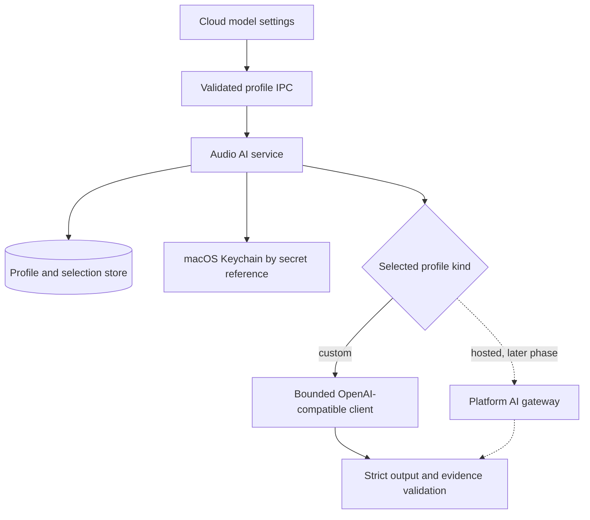
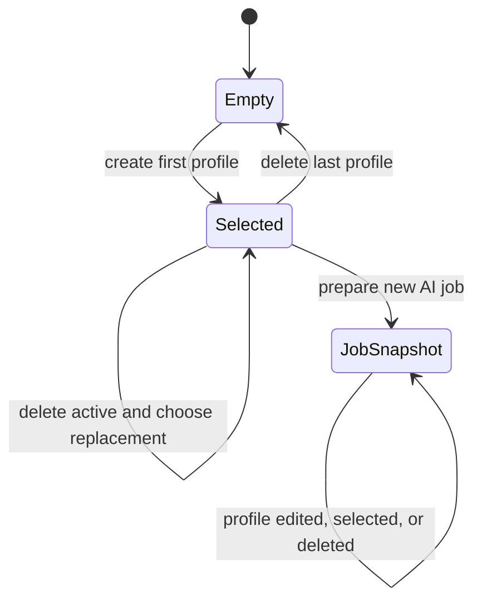

# Custom Cloud Model Profiles - Plan

## Goal Capsule

- **Objective:** Users can keep several custom cloud models, understand which model is active, and manage each entry without seeing internal identifiers or unnecessary technical copy.
- **Means:** Replace the single provider setting with stable custom provider profiles and an active-profile selection, while reserving the hosted built-in model for the membership phase (KTD1, KTD2, KTD3).
- **Authority:** The Product Contract owns user-visible behavior. The Planning Contract owns storage, IPC, Keychain, routing, and migration mechanics.
- **Execution profile:** Code changes in the Electron shared contract, Main process, Preload bridge, renderer settings UI, and tests.
- **Stop conditions:** Stop if implementation would expose a user API key outside Keychain, silently discard an existing provider configuration, or require a hosted membership API contract that has not yet been planned.
- **Tail ownership:** The later membership and hosted-AI plan owns account state, entitlements, hosted inference, server-held prompts, quotas, and billing.

---

## Product Contract

### Summary

Change “云端模型” from one combined provider form into a list of reusable custom cloud model profiles. Each row shows the user-defined provider name and one concise model summary. The section header owns the add action. Custom rows own edit and delete actions. A later membership increment will add a locked built-in model to the same list contract.

### Problem Frame

The current settings snapshot and SQLite table represent exactly one provider. The UI therefore uses a generic “AI 供应商” title and one management dialog, which cannot support several user-defined models or row-level actions. The current provider ID also mixes protocol identity, Keychain lookup, job history, and user-visible provider choice.

### Key Decisions

- **Keep a hybrid product direction.** (session-settled: user-approved — chosen over an exclusively hosted or exclusively user-configured model: the built-in path can support membership and prompt protection while custom BYOK preserves user choice.) Governs R1, R2, R8, R9.
- **Use client-direct BYOK for custom profiles.** (session-settled: user-approved — chosen over proxying user keys through the platform backend: the platform does not need to receive or retain user-owned API keys.) Governs R6, R7, R9.
- **Treat built-in hosted AI as the next commercial phase.** Governs R2, R8, R10.

### Requirements

**Provider list and actions**

- R1. “云端模型” displays zero or more custom provider profiles, makes one profile selectable for future work, and places “新增供应商” at the right side of the section heading.
- R2. The list contract can later include one locked built-in provider that users cannot edit or delete, but this increment does not expose a non-functional built-in row.
- R3. Each custom row uses the provider display name as its title and at most one concise description line for the configured model.
- R4. Each custom row is keyboard-selectable through radio semantics and exposes icon-only edit and delete buttons; delete uses a destructive ghost treatment and requires confirmation.
- R5. Add and edit dialogs contain only the fields and messages needed to complete the action; normal-state Keychain, task-lifecycle, and developer-oriented explanations are absent.

**Identity and configuration**

- R6. The program generates a stable profile ID and a separate secret reference for each custom profile; neither value is displayed or editable.
- R7. A custom profile requires a provider type, a case-insensitively unique display name, one service address, one API model ID, and one API key; the model ID remains user-editable because it is sent as the upstream API `model` value.
- R8. A future built-in profile keeps its upstream model ID, provider credential, and protected prompt on the platform side rather than exposing them in desktop settings.

**Runtime, security, and compatibility**

- R9. Custom inference remains a direct HTTPS request from the desktop client, with the API key stored only in macOS Keychain and existing endpoint, redirect, request-size, response-size, consent, and evidence checks preserved.
- R10. Custom client-direct requests cannot guarantee prompt secrecy; this limitation is a product boundary and is not presented as routine settings copy.
- R11. Selecting a profile affects only newly prepared work. Every queued or historical AI job retains the provider identity, model, endpoint identity, consent identity, and retry behavior captured when the job was created.
- R12. Existing single-provider settings are migrated into one custom profile without losing their model, endpoint, selection, or ability to resolve the existing Keychain secret.
- R13. Creating a profile selects it for future work. Deleting the active profile selects the oldest remaining profile by creation time and profile ID; if none remains, cloud generation becomes unavailable until the user adds or later gains access to another profile.
- R14. Stale add, edit, select, and delete mutations are rejected through the settings revision instead of overwriting newer state.

### Acceptance Examples

- AE1. Covers R1, R3, R4. Given two custom profiles, the list shows two provider-name titles, one-line model descriptions, one selected radio row, and separate edit/delete icon buttons under one header-level add action.
- AE2. Covers R4, R13. Given the active profile is deleted and another profile remains, cancel keeps all state unchanged; confirmation deletes the profile and selects the deterministic replacement.
- AE3. Covers R6, R7. Given a user creates a profile, the form requests provider type, display name, service address, model ID, and API key but never exposes profile ID or secret reference.
- AE4. Covers R9, R12. Given a legacy DeepSeek configuration and Keychain entry, migration preserves direct generation without writing the secret into SQLite, logs, IPC responses, or rendered text.
- AE5. Covers R11. Given a job was prepared with profile A and the user selects or edits profile B, retrying the existing job continues with the immutable provider data captured for that job.
- AE6. Covers R13. Given the last profile is deleted, the list shows a concise empty state and cloud generation returns the existing unavailable/configuration error path until a profile is created.

### Success Criteria

- A user can add, edit, select, and confirm-delete multiple custom profiles without encountering an internal profile ID.
- Existing custom-provider users retain a working configuration after the schema change.
- Secrets remain absent from SQLite, IPC snapshots, renderer state after dialog closure, diagnostics, and test fixtures.
- The profile contract admits a future locked hosted entry without another settings-list redesign.

### Scope Boundaries

#### In Scope

- Multiple local custom OpenAI-compatible profiles.
- Active-profile selection and immutable job snapshots.
- Schema evolution from the current single-row settings table.
- Keychain identity separation for profiles that use the same upstream protocol.
- Header-level add, row-level edit/delete, confirmation, concise copy, and empty/error states.

#### Deferred to Follow-Up Work

- Membership account and authentication flows.
- Hosted AI gateway, server-held prompts, platform provider credentials, entitlements, quotas, usage metering, and billing.
- The actual built-in model row and hosted inference adapter; these begin only after the hosted API contract exists.
- Provider health checks, model discovery, connection-test buttons, import/export, ordering, and sync across devices.

#### Outside This Increment

- Proxying custom user API keys through the platform backend.
- Claiming that prompts used by client-direct custom models are secret.
- Removing FileVault or Keychain backend capabilities solely because their settings UI was removed.

---

## Planning Contract

### Key Technical Decisions

- KTD1. **Separate profile identity from provider protocol and model ID.** (session-settled: user-approved — chosen over generating or hiding the upstream model ID: custom APIs require the real model value, while only the local profile ID should be generated.) A profile ID identifies a saved row and job provenance. A secret reference identifies one Keychain item. The model ID remains provider-facing configuration. Governs R6, R7, R11, R12.
- KTD2. **Use a discriminated profile contract with `custom` and reserved `hosted` kinds.** (session-settled: user-approved — chosen over removing customization or treating built-in and custom providers as the same credential path: the two paths have different ownership and security boundaries.) This increment persists and executes only `custom`; the snapshot and renderer model reserve the locked hosted shape without fabricating membership availability. Governs R1, R2, R8, R9, R10.
- KTD3. **Route custom profiles through the existing bounded OpenAI-compatible client.** (session-settled: user-approved — chosen over routing custom requests through the platform backend: client-direct BYOK keeps the user key local.) Preserve the current `deepseek` and generic `openai-compatible` protocol variants so provider-specific request options do not depend on the display name. Keep HTTPS validation, redirect rejection, size bounds, consent binding, and strict output decoding. Governs R7, R9.
- KTD4. **Introduce a versioned Audio database migration instead of changing the fresh schema under the existing version.** The current database accepts only one schema version and validates existing stores before opening them. A schema-only edit would leave existing stores apparently compatible until runtime queries fail. Governs R12.
- KTD5. **Persist immutable provider snapshots on jobs and use profiles only when preparing new work.** Jobs do not foreign-key their execution identity to mutable or deletable profiles. Governs R11, R13.
- KTD6. **Use revision-checked profile mutations.** Every create, update, select, and delete request carries `expectedRevision`. A successful mutation increments the settings revision once. Governs R13, R14.
- KTD7. **Delete the Keychain secret before removing its profile row.** A denied Keychain deletion leaves the profile intact and reports an error. If the secret is already missing, profile deletion proceeds. This avoids knowingly orphaning a reachable secret. Governs R4, R9, R13.
- KTD8. **Serialize profile mutations in the Main process.** Validate the expected revision after entering one mutation queue, then coordinate Keychain and SQLite work before releasing the queue. This prevents concurrent IPC calls from deleting or replacing a secret after another mutation has already invalidated their revision. Governs R9, R14.

### High-Level Technical Design

#### Provider ownership and request routing

#### Profile mutation and job lifecycle

The profile store controls future preparation. The job tables remain the authority for queued work, retries, and history.

### Data and Contract Shape

- Replace the single mutable provider row with a profile table and a singleton selection/revision table.
- Persist `profile_id`, `kind`, `display_name`, `protocol`, `model_id`, `endpoint`, `secret_ref`, timestamps, and profile revision for custom profiles. Enforce normalized display-name uniqueness separately from the hidden profile identity.
- Do not persist secret material. Do not expose `secret_ref` through shared renderer contracts.
- Extend job and consent identity with stable profile provenance while retaining the provider/model/endpoint snapshot needed after a profile is changed or deleted.
- Use a deterministic legacy profile ID and retain the legacy provider ID as its initial secret reference so the current Keychain item remains readable without a risky secret-copy migration.
- Preserve the existing `deviceSecurity` snapshot contract and FileVault probe as backend capability; this settings increment neither displays nor removes it.

### Migration and Sequencing

1. Add schema-version dispatch and a version-1-to-version-2 migration that runs in one database transaction.
2. Create the profile and selection tables, copy the legacy row, and preserve the old secret lookup through `secret_ref`.
3. Keep existing job, note, and consent rows intact; add only nullable or backfilled provenance columns required by the new contract.
4. Switch repository and service reads to the new tables only after migration tests prove both fresh and legacy databases.
5. Replace IPC and renderer behavior after the storage and service contract is stable.

### System-Wide Impact

- **Persistence:** Existing Audio databases gain their first supported schema migration path. Future schema changes must follow the same version-dispatch pattern.
- **Security:** Keychain lookup moves from protocol ID to a private secret reference. Logs and snapshots must continue to redact secrets.
- **AI execution:** Preparation resolves the active profile once. Jobs and retries remain independent of later profile edits or deletion.
- **UI:** The settings section becomes a list controller rather than a single-form editor. It needs selection, empty, loading, stale-revision, and destructive-confirmation states.
- **Future hosted AI:** The profile discriminator and provider registry gain an extension seam, but hosted auth and transport are not implemented here.

### Risks & Dependencies

- **Migration failure:** A failed migration could prevent access to all existing audio data. Mitigate with transactional migration, rollback tests, schema validation, and legacy fixtures.
- **Secret alias collision:** Multiple custom profiles cannot share a protocol-scoped Keychain key. Mitigate with a unique secret reference per profile and a deterministic legacy alias only for the migrated row.
- **Cross-store partial failure:** SQLite and Keychain cannot share one transaction. Define mutation ordering and compensation, and keep recoverable UI states when either store fails.
- **Retry drift:** Resolving current profile data during retry would change provider identity. Keep retries bound to job snapshots and test profile edit/delete after enqueue.
- **Hosted scope leakage:** Adding a visible built-in row before auth and gateway contracts exist creates a dead-end control. Keep the row deferred while preserving the contract seam.

### Sources & Research

- `apps/desktop-electron/src/shared/contracts/audio_ai.ts` defines the current single-config snapshot, provider enum, consent identity, and secret mutation requests.
- `apps/desktop-electron/src/main/storage/audio_database.ts` currently accepts only Audio schema version 1 and rejects other existing versions, which makes explicit migration support necessary.
- `apps/desktop-electron/src/main/storage/audio_schema_fragments/v9.ts` and `apps/desktop-electron/src/main/storage/repositories/ai_job_repository.ts` establish the single-row provider store and immutable job snapshot pattern this plan extends.
- `apps/desktop-electron/src/main/domain/audio-intelligence/provider_security.ts` and `apps/desktop-electron/src/main/domain/audio-intelligence/openai_provider.ts` own the direct-cloud transport bounds, endpoint policy, provider-specific request behavior, and client-visible prompt boundary.
- `docs/solutions/architecture-patterns/desktop-first-workstation-boundaries.md` requires Keychain protection to remain distinct from FileVault and other storage guarantees.
- `docs/product/s3-productization-status.md` records direct BYOK AI as delivered while the overall product remains not release-ready; this plan extends that path without claiming hosted membership AI.

---

## Implementation Units

### U1. Version the Audio database and migrate provider settings

- **Goal:** Preserve the legacy provider configuration while introducing profile and selection storage.
- **Requirements:** R6, R11, R12, R13; KTD1, KTD4, KTD5.
- **Dependencies:** None.
- **Files:**
  - `apps/desktop-electron/src/main/storage/audio_database.ts`
  - `apps/desktop-electron/src/main/storage/audio_schema.ts`
  - `apps/desktop-electron/src/main/storage/audio_schema_fragments/v9.ts`
  - `apps/desktop-electron/src/main/storage/audio_migrations/v1_to_v2.ts`
  - `apps/desktop-electron/src/main/storage/repositories/ai_job_repository.ts`
  - `apps/desktop-electron/tests/integration/audio_ai_storage_test.ts`
  - `apps/desktop-electron/tests/integration/storage/sqlite_foundation_test.ts`
- **Approach:**
  1. Raise the Audio schema version to 2 and add explicit version inspection and migration dispatch while preserving application-ID, foreign-key, integrity, and version-specific required-table checks.
  2. Update the fresh schema to create profile/selection tables and define the transactional version-1 conversion described by KTD4.
  3. Give the migrated row a deterministic profile ID and keep its current provider ID as `secret_ref`.
  4. Keep job and consent history as immutable snapshots and backfill only new provenance fields that are required.
- **Execution note:** Build migration characterization coverage before changing repository reads.
- **Patterns to follow:** `apps/desktop-electron/src/main/storage/audio_database.ts` transaction and integrity checks; `apps/desktop-electron/src/main/storage/audio_schema_fragments/v9.ts` AI constraints.
- **Test scenarios:**
  - Opening a fresh version-2 database creates the profile and selection schema with no secret column or secret value.
  - Opening a valid version-1 fixture migrates the DeepSeek row to one selected custom profile with the same model, endpoint, and legacy secret reference.
  - Opening a version-1 OpenAI-compatible fixture preserves its model and normalized endpoint.
  - A forced migration failure rolls back all schema and data changes, keeps `user_version = 1`, and leaves the database readable by the version-1 fixture inspector.
  - Existing jobs, consents, notes, and evidence rows retain their counts and provider/model/endpoint identities after migration.
  - An unknown future schema version remains a compatibility error rather than being modified.
- **Verification:** Fresh and migrated databases pass schema, foreign-key, and integrity validation; legacy settings and job history remain queryable.

### U2. Define multi-profile contracts and revision-checked IPC

- **Goal:** Give Main, Preload, and renderer one strict contract for listing and mutating custom profiles.
- **Requirements:** R1, R2, R6, R7, R13, R14; KTD1, KTD2, KTD6.
- **Dependencies:** U1.
- **Files:**
  - `apps/desktop-electron/src/shared/contracts/audio_ai.ts`
  - `apps/desktop-electron/src/shared/contracts/ipc.ts`
  - `apps/desktop-electron/src/preload/api.ts`
  - `apps/desktop-electron/src/main/ipc/desktop_ipc.ts`
  - `apps/desktop-electron/src/main/ipc/register_desktop_ipc.ts`
  - `apps/desktop-electron/tests/unit/ipc_contract_test.ts`
  - `apps/desktop-electron/tests/integration/register_desktop_ipc_test.ts`
- **Approach:**
  1. Replace the single `config` snapshot with `profiles`, nullable `selectedProfileId`, and one settings revision while retaining the existing `deviceSecurity` payload unchanged.
  2. Expose public profile ID, kind, display name, model summary, endpoint origin, edit/delete capabilities, selection, and secret state; keep `secret_ref` Main-only.
  3. Add create, update, select, and delete requests with `expectedRevision`; accept API keys only on create/update request paths and never return them.
  4. Reserve a strict hosted-profile response variant that has no editable endpoint, model ID, or secret fields, without returning one in this increment.
- **Patterns to follow:** Existing Zod `.strict()` request/response schemas and validation at both Preload and Main registration boundaries.
- **Test scenarios:**
  - A valid custom profile snapshot round-trips through Main and Preload validation without a secret reference or API key.
  - Create and update reject blank or duplicate display names, invalid URLs, blank model IDs, over-limit values, and missing expected revisions.
  - Delete and select reject malformed profile IDs and stale revisions.
  - A hosted profile response rejects custom-only fields and reports non-editable/non-deletable capabilities.
  - An unexpected secret-bearing response field fails strict validation.
- **Verification:** All profile operations are reachable only through validated channels, and generated TypeScript consumers no longer depend on one `config` object.

### U3. Implement profile lifecycle, Keychain coordination, and runtime routing

- **Goal:** Make profile mutations safe and make new AI jobs use the selected profile without changing historical work.
- **Requirements:** R6, R7, R9, R11, R13, R14; KTD1, KTD3, KTD5, KTD6, KTD7, KTD8.
- **Dependencies:** U1, U2.
- **Files:**
  - `apps/desktop-electron/src/main/domain/audio-intelligence/audio_ai_service.ts`
  - `apps/desktop-electron/src/main/domain/audio-intelligence/openai_provider.ts`
  - `apps/desktop-electron/src/main/domain/audio-intelligence/provider_registry.ts`
  - `apps/desktop-electron/src/main/domain/audio-intelligence/provider_security.ts`
  - `apps/desktop-electron/src/main/features/secrets/secret_store_port.ts`
  - `apps/desktop-electron/src/main/features/secrets/macos_helper_secret_store.ts`
  - `apps/desktop-electron/src/main/storage/repositories/ai_job_repository.ts`
  - `apps/desktop-electron/src/main/index.ts`
  - `apps/desktop-electron/tests/integration/audio_ai_service_test.ts`
  - `apps/desktop-electron/tests/unit/macos_helper_secret_store_test.ts`
- **Approach:**
  1. Generate profile IDs and secret references in Main, not the renderer.
  2. Serialize profile mutations, validate `expectedRevision` inside the queue, and coordinate SQLite and Keychain work with explicit ordering and best-effort compensation; never log request secrets.
  3. Resolve the active custom profile during prepare, bind consent to its stable profile identity and endpoint, and copy execution values into the job.
  4. Construct the existing bounded OpenAI-compatible provider from the job snapshot, protocol variant, and private secret reference.
  5. Keep retry resolution on job data even when the source profile was edited or deleted.
- **Patterns to follow:** `AudioAiService.prepare`, `AudioAiService.generate`, `AiJobRepository.enqueue`, `BoundedOpenAiClient`, and `DesktopSecretStorePort`.
- **Test scenarios:**
  - Creating two profiles that use the same OpenAI-compatible protocol stores and reads two distinct Keychain items, makes the new profile active, and rejects a duplicate normalized display name.
  - Updating name, endpoint, or model with the current revision increments the settings revision once and changes only future preparations.
  - Updating a secret never returns or logs its value and preserves the profile when the Keychain write fails.
  - Deleting a profile with a denied Keychain operation leaves the profile selected and reports a recoverable error.
  - Deleting a profile whose secret is missing succeeds and selects the oldest remaining profile by creation time and profile ID.
  - Deleting the last profile produces a null selection and prepare returns the existing missing-provider/configuration error before network access.
  - Editing, selecting, or deleting a profile after enqueue does not change retry provider, model, endpoint, consent identity, or exactly-once publication.
  - A stale revision on any mutation changes neither SQLite nor Keychain state.
  - Two concurrent mutations carrying the same revision are serialized; exactly one succeeds and the stale operation does not read, replace, or delete a Keychain item.
- **Verification:** Profile lifecycle tests prove cross-store failure behavior, and AI service tests prove selection affects new work only.

### U4. Replace the single provider form with the custom profile list UI

- **Goal:** Implement the agreed settings hierarchy and concise row-level management flow.
- **Requirements:** R1, R2, R3, R4, R5, R6, R7, R13, R14; KTD1, KTD2, KTD6, KTD7.
- **Dependencies:** U2, U3.
- **Files:**
  - `apps/desktop-electron/src/renderer/features/settings/ai-settings-feature.tsx`
  - `apps/desktop-electron/src/renderer/features/settings/settings-page-section.tsx`
  - `apps/desktop-electron/src/renderer/components/ui/alert-dialog.tsx`
  - `apps/desktop-electron/src/renderer/components/ui/button.tsx`
  - `apps/desktop-electron/tests/unit/renderer/ai_settings_test.tsx`
- **Approach:**
  1. Extend the settings section header with an action slot and place the icon-sized “新增供应商” control there.
  2. Render one row per profile as an accessible radio option with the provider name as title, one clamped model description, a selected state, and icon-sized edit/delete actions aligned at the opposite edge. Clicking or pressing Space on the row selects it without triggering row actions.
  3. Use a destructive ghost delete button and an AlertDialog confirmation that names the target provider.
  4. Use separate add and edit dialog modes. Show provider type, display name, service address, model ID, and API key only where required. Keep the current DeepSeek preset constraints and the generic OpenAI-compatible endpoint path. Do not show profile ID, secret reference, task-lifecycle narration, or normal-state Keychain implementation copy.
  5. Handle empty list, stale revision, mutation failure, keyboard focus restoration, and pending-action disabling without exposing secrets in component state after closure.
- **Execution note:** Prove interaction and accessibility semantics with renderer tests before any visual validation.
- **Patterns to follow:** `SettingsItemGroup`, `ItemActions`, `Button` `icon-sm`, existing Radix Dialog composition, and the project rule that settings descriptions are one line and smaller than titles.
- **Test scenarios:**
  - Covers AE1. Two profiles render provider-name titles, one-line descriptions, a header add button, one selected radio row, and per-row edit/delete icon buttons with accessible names.
  - Clicking an unselected row or focusing it and pressing Space calls select with its profile ID and current revision; clicking edit or delete does not also select the row.
  - Covers AE2. Canceling deletion changes nothing; confirming deletion calls the target profile ID and expected revision exactly once.
  - The destructive delete action uses ghost styling with destructive text rather than a filled destructive button.
  - Covers AE3. Add generates no ID in the renderer and submits only user-entered provider type, display name, endpoint, model ID, API key, and expected revision.
  - Editing with a blank API-key field preserves the current secret; entering a replacement clears it from rendered state after success or failure.
  - A stale-revision response reloads the list and leaves the dialog in a recoverable state without duplicating a profile.
  - Covers AE6. An empty snapshot shows a concise empty state and keeps the header add action available.
  - Escape, cancel, and successful completion restore focus to the originating add or row action.
- **Verification:** Static renderer tests prove the list, dialogs, confirmation, concise copy, secret cleanup, and keyboard semantics.

### U5. Preserve generation and renderer flows across the contract change

- **Goal:** Update all consumers and fixtures so profile selection integrates without regressions in AI generation or navigation.
- **Requirements:** R9, R11, R13; KTD3, KTD5.
- **Dependencies:** U2, U3, U4.
- **Files:**
  - `apps/desktop-electron/src/renderer/features/audio-ai/audio-ai-feature.tsx`
  - `apps/desktop-electron/tests/e2e/audio_ai_renderer_flow_test.tsx`
  - `apps/desktop-electron/tests/e2e/audio_review_flow_test.ts`
  - `apps/desktop-electron/tests/e2e/capture_renderer_flow_test.tsx`
  - `apps/desktop-electron/tests/e2e/sidebar_navigation_test.ts`
  - `apps/desktop-electron/tests/integration/domain_ipc_test.ts`
  - `apps/desktop-electron/tests/packaged/macos_ai_boundary_smoke_test.ts`
  - `apps/desktop-electron/tests/unit/renderer/audio_ai_test.tsx`
  - `apps/desktop-electron/tests/unit/renderer/application_operations_test.tsx`
  - `apps/desktop-electron/tests/unit/renderer/shell_test.tsx`
  - `apps/desktop-electron/tests/visual/fixtures/renderer-api.ts`
  - `apps/desktop-electron/tests/visual/harness/preload.ts`
- **Approach:**
  1. Update API doubles and snapshots to the multi-profile contract.
  2. Show the captured provider display name and model summary from job/preview data rather than looking up mutable settings.
  3. Preserve consent, failure, retry, evidence navigation, and settings-section navigation behavior.
  4. Update visual-harness data only as a compile-time fixture; do not run or update visual evidence without current-task authorization.
- **Patterns to follow:** Existing audio AI consent and retry renderer flows; current sidebar settings navigation contract.
- **Test scenarios:**
  - Selecting profile B causes the next consent preview to identify B while an existing job still renders profile A.
  - No selected profile exposes a concise route to cloud model settings and does not attempt generation.
  - Retry after source-profile deletion uses the job snapshot and returns the same expected failure/success semantics.
  - Settings navigation still scrolls to “云端模型” and exposes the header add action.
- **Verification:** AI renderer and navigation suites pass with no single-config compatibility shim left in renderer code.

### U6. Record the delivered boundary and prepare the hosted phase handoff

- **Goal:** Keep product status accurate and make the next membership plan start from an explicit integration boundary.
- **Requirements:** R2, R8, R10; KTD2, KTD3.
- **Dependencies:** U1, U2, U3, U4, U5.
- **Files:**
  - `docs/product/desktop-electron-status.md`
  - `docs/product/s3-productization-status.md`
  - `docs/QUARK_RECORDING_MINUTES_UI_DESIGN_BRIEF.md`
- **Approach:**
  1. Record that desktop supports multiple custom BYOK profiles and that custom prompts remain client-visible.
  2. Keep hosted membership AI incomplete until the separate account, entitlement, gateway, privacy, and operational plan is executed.
  3. Align future UI language so the built-in model becomes a locked list entry without removing user-defined profiles.
- **Patterns to follow:** Existing PASS/PARTIAL_PASS/BLOCKED status distinctions and the local-first product boundary.
- **Test scenarios:** Test expectation: none -- this unit changes product documentation only.
- **Verification:** Status documents do not claim hosted AI, membership, prompt secrecy for custom models, or release readiness before those capabilities exist.

---

## Verification Contract

| Gate | Applies to | Done signal |
| --- | --- | --- |
| Focused Vitest suites for storage, service, IPC, renderer settings, and AI flows | U1-U5 | Fresh schema, migration, Keychain coordination, profile lifecycle, list interactions, and immutable retry scenarios pass. |
| `bun run check:code` from `apps/desktop-electron` | U1-U5 | Formatting, lint, TypeScript, all non-visual tests, renderer-boundary checks, and lifecycle checks pass. |
| `bun run check:ui:quick` and final `bun run check:ui` from `apps/desktop-electron` | U4-U5 | Run only after the user explicitly authorizes visual validation for the implementation task; the authorized checks pass once on the final UI code state. |
| Manual visual review | U4 | Run only with explicit authorization; verify compact header action, row spacing, one-line descriptions, destructive ghost affordance, dialog border, and focus states. |
| Secret scan and persistence assertions | U1-U5 | No API key appears in SQLite, IPC snapshots, logs, rendered DOM after closure, or committed fixtures. |

The Electron release-evidence lane is not required for this development increment unless the user separately requests a release candidate.

---

## Definition of Done

- U1 is complete when fresh and version-1 databases open safely and the legacy provider remains selected with a resolvable Keychain reference.
- U2 is complete when strict multi-profile schemas and all IPC operations reject malformed, secret-bearing, and stale inputs.
- U3 is complete when profile mutations coordinate SQLite and Keychain safely and jobs remain immutable after profile changes.
- U4 is complete when the cloud-model section implements header add, provider-name rows, small icon actions, destructive confirmation, concise copy, and accessible focus behavior.
- U5 is complete when every settings and AI-flow consumer uses the new profile contract and generation/retry behavior is unchanged except for explicit active-profile selection.
- U6 is complete when product documents distinguish delivered custom BYOK support from deferred hosted membership AI.
- All required static and non-visual checks pass. Visual checks are either authorized and passed or explicitly reported as skipped under project policy.
- No abandoned compatibility shim, dead dialog path, unused single-provider API, temporary fixture, or experimental migration code remains in the final diff.
