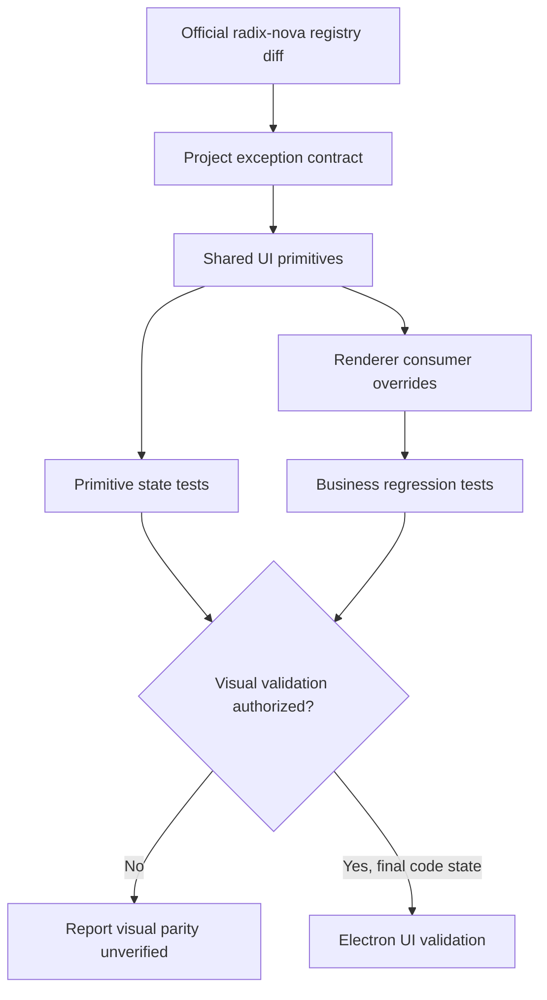

# Shared Electron UI Primitive Alignment - Plan

## Goal Capsule

- **Objective:** Electron 中的共享浮层、表单控件和容器在真实业务页面上呈现一致、清爽且可感知的 hover、focus、open/close 状态，不再出现 Dialog 已对齐而 Sheet、菜单或控件仍显著偏灰、偏重或缺少反馈的情况。
- **Means:** 以官方 shadcn `radix-nova` recipe 作为 Electron 唯一组件视觉基线，保留 Radix 行为 API，并把轻量焦点与无阴影记录为 Electron 自身的少量例外。（KTD1、KTD2、KTD3）
- **Authority:** 用户确认的官方 demo 目标、官方 shadcn Radix Nova recipe、仓库中更新后的 Electron 指导与当前可通过 typecheck/test 的本地 API；Goo 仅约束 Flutter 范围。
- **Execution profile:** 分组件家族渐进合并；先固定基线和契约，再改 primitive、清理装饰性调用点覆盖，最后做非视觉回归。
- **Stop condition:** 所有范围内组件与真实消费者通过静态和 DOM 回归；未经另行授权，不把截图级视觉一致性标记为已验证。

---

## Product Contract

### Summary

统一 Electron renderer 的共享 UI 基线，使 Dialog 已采用的清爽遮罩、圆角、surface 和关闭按钮交互扩展到同类组件，同时避免覆盖业务行为或将官方 recipe 中与项目规范冲突的阴影和厚 focus ring 带回项目。

### Problem Frame

当前组件来自不同阶段的 shadcn recipe、本地定制和页面级覆盖。Dialog 已接近官方 Nova 效果，但 `components.json` 仍指向 `new-york`，Sheet 仍使用深遮罩、阴影和裸关闭按钮，菜单、Select、控件及容器也分别保留旧表面与状态类。结果是同一应用内的灰度、层级、hover 热区和 focus 反馈不一致，后续 CLI 更新还可能继续放大漂移。

### Key Decisions

- **以官方 demo 为视觉目标。** 本地历史样式在冲突时不作为默认基线；项目明确规范除外。Governs R1、R2、R3、R4、R5。（session-settled: user-directed — chosen over 维持本地历史样式: 用户明确要求缩小与官方 demo 的展示差异）
- **采用渐进式共享组件收敛。** 本次覆盖浮层、控件和容器家族，不改业务逻辑、信息架构或 sidebar 产品布局。Governs R2、R5、R6、R7。（session-settled: user-approved — chosen over 一次性重建整个 renderer 设计系统: 可以控制高调用面组件的回归风险）

### Requirements

**Baseline and consistency**

- R1. `components.json` 必须以 schema 支持的复合值 `style: radix-nova` 同时固定 Nova 视觉 recipe 和 Radix primitive base，并记录实施时的 CLI 版本、上游 commit、registry 路径与输入 hash，避免未来生成结果随默认 Base UI 迁移或旧 `new-york` 风格继续漂移。
- R2. 范围内组件必须以官方 Nova 的结构、状态和 surface 为默认值，同时保留当前 Radix API、受控状态、焦点恢复、键盘操作和业务回调。
- R3. Electron 有意偏离官方的规则必须少且明确：默认无阴影、薄 focus indicator，并以已确认的 Dialog 效果作为模态遮罩基线；Goo token、排版和组件规范不再约束 Electron。

**Overlay and anchored surfaces**

- R4. Sheet、Popover、Select、DropdownMenu 和 Tooltip 必须具有一致的圆角、surface、ring、动画状态、hover/focus-visible 反馈和足够交互热区；Sheet 关闭按钮必须与 Dialog 一样有明确 ghost hover 状态。

**Controls and containers**

- R5. Checkbox、Switch、Slider、Input 和 Textarea 必须覆盖适用的 hover、focus-visible、invalid、disabled、readOnly 与键盘状态，并在不放大可见尺寸的前提下补足小控件热区。
- R6. Card 和 Item 必须按 Nova 对齐 surface、排版、密度、slot 与交互状态；业务内容、操作和 separator 语义保持不变，Card 至少归一化一处真实普通卡片 surface，避免只修改未使用的 primitive。

**Integration and evidence**

- R7. 调用点只保留业务必要的宽度、方向、对齐和密度覆盖；重复圆角、阴影、状态色等装饰性覆盖必须清理，且不得改变页面信息架构或业务流程。
- R8. 每个组件家族必须有 primitive 契约测试，并在真实消费者存在时增加对应回归；当前无 renderer 消费者的 Popover 只做隔离覆盖。静态/DOM 证据与视觉证据必须分开陈述，未经用户在实施任务中另行授权不得启动 UI、截图或运行视觉检查。

### Acceptance Examples

- AE1. Covers R3, R4. Given Sheet 已打开，when 用户把指针移到可见关闭按钮，then 按钮呈现与 Dialog 一致的 ghost hover surface；遮罩保持轻灰并有轻微 blur，Sheet 本体无投影。
- AE2. Covers R2, R4, R7. Given 用户通过键盘打开 DropdownMenu 或 Select，when 在项目之间移动并按 Escape，then 高亮、关闭和焦点恢复保持 Radix 行为，页面级宽度与定位不变。
- AE3. Covers R5. Given Checkbox、Switch 或 Slider 处于 normal、disabled 或 keyboard-focus 状态，when 用户点击可见控件周边或使用键盘，then 可交互状态拥有扩展热区和轻量 focus，disabled 状态不响应。
- AE4. Covers R6, R7. Given Activity、设置、本地模型或音频列表渲染 Item，when 行处于静态、可点击或带操作按钮状态，then 标题、描述和密度采用 Nova 默认排版，separator、操作和业务布局语义保持不变。
- AE5. Covers R8. Given实现仅通过 unit、typecheck、lint 和 format evidence，when 汇报完成度，then 明确标注视觉 parity 尚未验证；只有获得单独授权后才运行最终 UI 验收。

### Success Criteria

- Dialog 与 Sheet 不再出现显著不同的遮罩灰度、阴影和关闭按钮反馈。
- 高频 DropdownMenu、Select、Item 与表单控件在 primitive 默认值和真实页面覆盖之间只有可解释的布局差异。
- 后续运行 shadcn diff 时，基线明确落在 Radix Nova，不会因官方默认 Base UI 或本地 `new-york` 声明产生错误迁移建议。
- 非视觉测试能够捕获遮罩、无阴影、薄 focus、ghost close、热区与关键键盘语义的回归；截图级结论只来自获授权的最终视觉验收。

### Scope Boundaries

**In scope**

- Overlay family: Dialog 作为已对齐参考，实施修改覆盖 Sheet、Popover、Select、DropdownMenu、Tooltip。
- Controls: Checkbox、Switch、Slider、Input、Textarea。
- Containers: Card、Item，以及为证明 Card 用户可见效果所需的一处代表性普通 card surface。
- 上述组件的高频 renderer 消费者、共享契约测试和窄范围业务回归测试。

**Deferred to Follow-Up Work**

- 迁移所有手写 surface 到 Card 或 Item。
- 全量审计未列入范围的 Button、Tabs、Badge、Table、Toast 等 primitive。
- Base UI 迁移、shadcn 全量 regenerate、页面 IA 或 sidebar 布局重做。
- 删除 Flutter 侧的 Goo 组件库或改造 Flutter 页面；本次只解除 Goo 对 Electron 的设计约束。
- visual golden 更新；只有用户明确要求接受新基线时才单独处理。

### Sources

- `AGENTS.md`
- `apps/desktop-electron/components.json`
- `apps/desktop-electron/README.md`
- `apps/desktop-electron/tests/visual/goldens/README.md`
- [Base UI default and Radix support](https://ui.shadcn.com/docs/changelog/2026-07-base-ui-default)
- [shadcn CLI merge and diff guidance](https://github.com/shadcn-ui/ui/blob/main/skills/shadcn/cli.md)

---

## Planning Contract

### Key Technical Decisions

- KTD1. **Pin Nova visuals on Radix behavior.** Set the composite visual recipe to `radix-nova` and retain Radix primitives and `asChild` contracts. (session-settled: user-approved — chosen over 迁移到 Base UI: 官方明确继续支持 Radix，迁移会扩大范围且不能解释当前视觉问题)
- KTD2. **Merge official diffs; never overwrite local components wholesale.** Treat both the scoped Radix component source and Nova style recipe as provenance, flatten only the required Nova recipe into local primitive classes, and never import the full preset stylesheet. Preserve local accessibility, value forwarding and business semantics. (session-settled: user-directed — chosen over 继续以本地漂移样式为准: 官方 demo 是用户指定的目标)
- KTD3. **Electron and Flutter have separate design authorities.** Electron uses Radix Nova typography and component styling, with only shadowless surfaces, thin focus and the current Dialog mask documented as Electron-owned exceptions; Goo remains Flutter-only. (session-settled: user-approved — chosen over 继续让 Goo 约束 Electron: 单一设计权威能减少更新冲突与历史样式漂移)
- KTD4. **Primitive owns appearance; consumer owns layout.** Shared surface, radius and interaction states live in primitives; call sites may own width, side, align and context-specific density but not duplicate decorative defaults.
- KTD5. **State contracts precede appearance edits.** Each family receives focused DOM/class/keyboard coverage before or with the change so hover omissions, hidden closes and call-site overrides are visible during implementation.
- KTD6. **Visual parity is a gated evidence lane.** Static checks can prove contracts and behavior but cannot prove rendered parity; UI checks run only after explicit task-local authorization and only on the final unchanged UI code state.

### High-Level Technical Design

The diagram defines ownership and evidence flow: official registry output is input, not code to overwrite with; project exceptions are applied once before primitive defaults propagate to consumers. Consumer audits then remove only decoration that defeats the primitive contract.

### System-Wide Impact

- **End users:** overlay legibility, close-button discoverability, menu highlighting, input focus and list hierarchy become more consistent without workflow changes.
- **Developers:** `components.json` and the documented exception list become the reproducible baseline for future `shadcn add --diff` work.
- **Regression surface:** Select, DropdownMenu, Item and Input/Textarea are high fan-out primitives; their reverse consumers require targeted verification rather than relying only on isolated snapshots.
- **Design governance:** Electron and Flutter stop sharing a component-style authority. Product behavior can remain cross-platform, while Electron styling follows Nova and Flutter styling may continue to follow Goo.

### Risks and Mitigations

- **Registry drift:** the upstream recipe is mutable. Pin configuration and record the CLI version, exact shadcn-ui commit, registry source paths and hashes of scoped inputs alongside the implementation-date diff; do not paste an unversioned full component replacement.
- **Call-site override drift:** existing `className` values can mask primitive changes. Search every reverse consumer and classify overrides as layout-required or decorative before editing.
- **Behavior regression hidden by visual changes:** Radix focus restoration, Escape, disabled and controlled values can regress if components are replaced. Preserve primitive structure and add behavior tests before accepting appearance changes.
- **False confidence from JSDOM:** class assertions do not render hover, blur or shadow. Keep the visual gate explicit and do not update goldens as part of ordinary alignment.
- **Unused primitives:** Popover and Card have little or no direct consumption. Give Popover isolated contract coverage and connect Card to one representative ordinary surface without expanding into a page redesign.
- **Cross-platform guidance drift:** narrowing Goo guidance too broadly could accidentally remove Flutter protections. Update `AGENTS.md` by scoping Goo rules explicitly to Flutter and adding a separate Electron authority, rather than deleting Flutter guidance wholesale.

---

## Implementation Units

### U1. Fix the registry baseline and alignment contract

- **Goal:** Make future component work reproduce the chosen Radix Nova baseline and distinguish official defaults from project exceptions.
- **Requirements:** R1, R2, R3, R8; KTD1, KTD2, KTD3, KTD6.
- **Dependencies:** None.
- **Files:**
  - `AGENTS.md`
  - `apps/desktop-electron/components.json`
  - `apps/desktop-electron/README.md`
  - `apps/desktop-electron/tests/unit/renderer/ui_primitives_test.tsx`
- **Approach:**
  1. Replace `new-york` with the schema-supported composite `style: radix-nova`, then verify CLI metadata resolves Nova on Radix without adding an unsupported separate `base` field.
  2. Record the CLI version, exact upstream commit, scoped component/style registry paths and input hashes; document that implementation flattens only scoped Nova recipe classes into local primitives and never imports the full preset stylesheet.
  3. Scope the existing Goo guidance in `AGENTS.md` to Flutter work only and add an Electron section naming Radix Nova as its component and typography authority.
  4. Document the Electron-owned exceptions: shadowless surfaces, thin focus and the current Dialog modal mask.
  5. Add a compact state matrix for applicable open/closed, hover, focus-visible, disabled, invalid, readOnly, dark-token and reduced-motion contracts; tests lock only load-bearing classes and semantics.
- **Patterns to follow:** Current Dialog implementation and business-semantic assertions in `ui_primitives_test.tsx`; Goo-named typography assertions are migration targets, not authority.
- **Test scenarios:**
  - Parse the component config and verify the composite style resolves Radix with the Nova visual recipe rather than relying on an implicit official default or unsupported field.
  - Confirm the existing Dialog contract still exposes the light mask, blur, shadowless content and ghost close baseline after documentation/config changes.
- **Verification:** CLI metadata agrees with the committed base/style; documentation and test names make each intentional deviation discoverable.

### U2. Align modal and anchored overlay primitives

- **Goal:** Bring Sheet, Popover and Tooltip onto the same clean surface and interaction-state foundation as Dialog.
- **Requirements:** R2, R3, R4, R7, R8; KTD3, KTD4, KTD5.
- **Dependencies:** U1.
- **Files:**
  - `apps/desktop-electron/src/renderer/components/ui/sheet.tsx`
  - `apps/desktop-electron/src/renderer/components/ui/popover.tsx`
  - `apps/desktop-electron/src/renderer/components/ui/tooltip.tsx`
  - `apps/desktop-electron/src/renderer/components/ui/sidebar.tsx`
  - `apps/desktop-electron/tests/unit/renderer/ui_primitives_test.tsx`
  - `apps/desktop-electron/tests/unit/renderer/shell_test.tsx`
- **Approach:**
  1. Reuse the Dialog mask contract for Sheet, remove Sheet elevation, and render its close primitive through the shared ghost icon Button while retaining side variants and Radix close behavior.
  2. Complete Popover's Radix Nova slot surface and open/close animation contract, restoring neutral primitive defaults for alignment, width and padding so consumers own context-specific layout.
  3. Keep Tooltip's existing arrow and behavior while normalizing maximum width, spacing, state animation and shadowless surface.
  4. Preserve Sidebar's intentional hidden Sheet close and validate Sheet independently because the real mobile-sidebar consumer cannot demonstrate close hover.
- **Patterns to follow:** `apps/desktop-electron/src/renderer/components/ui/dialog.tsx`, shared Button variants, Radix data-state conventions.
- **Test scenarios:**
  - Covers AE1. Open a standalone Sheet and verify the light mask, blur, no-shadow content and ghost close contract; activating close removes the content and returns focus.
  - Open and dismiss Sheet with Escape and overlay interaction without changing Sidebar state semantics.
  - Open Popover from keyboard and pointer triggers, then dismiss with Escape and outside interaction while focus returns to the trigger.
  - Render Tooltip with long content and verify arrow, constrained surface and open/closed state classes remain available.
- **Verification:** Overlay primitives share the documented modal/surface baseline, and Sidebar's mobile Sheet regression tests still pass without exposing an unwanted close control.

### U3. Align menu and selection surfaces at their call sites

- **Goal:** Make DropdownMenu and Select consistent across navigation, audio and AI settings while preserving each workflow's positioning and value behavior.
- **Requirements:** R2, R3, R4, R7, R8; KTD2, KTD4, KTD5.
- **Dependencies:** U1.
- **Files:**
  - `apps/desktop-electron/src/renderer/components/ui/dropdown-menu.tsx`
  - `apps/desktop-electron/src/renderer/components/ui/select.tsx`
  - `apps/desktop-electron/src/renderer/components/nav-projects.tsx`
  - `apps/desktop-electron/src/renderer/components/nav-user.tsx`
  - `apps/desktop-electron/src/renderer/components/team-switcher.tsx`
  - `apps/desktop-electron/src/renderer/features/audios/audio-workspace-feature.tsx`
  - `apps/desktop-electron/src/renderer/features/audios/audio-route-feature.tsx`
  - `apps/desktop-electron/src/renderer/features/settings/ai-settings-feature.tsx`
  - `apps/desktop-electron/tests/unit/renderer/ui_primitives_test.tsx`
  - `apps/desktop-electron/tests/unit/renderer/audio_route_test.tsx`
  - `apps/desktop-electron/tests/unit/renderer/ai_settings_test.tsx`
  - `apps/desktop-electron/tests/unit/renderer/shell_test.tsx`
- **Approach:**
  1. Normalize content, submenu, item, destructive, indicator, label, separator and shortcut surfaces as one shadowless Nova family.
  2. Audit every reverse consumer; retain widths, side/align, collision and compact-toolbar density, but remove repeated rounded, shadow and state-color decoration.
  3. Preserve controlled values, disabled items and existing business callbacks without replacing Radix structure.
- **Patterns to follow:** Radix data-highlighted/data-disabled conventions and the primitive-versus-consumer boundary from KTD4.
- **Test scenarios:**
  - Covers AE2. Open menu and Select by keyboard, move highlight, choose an item, reopen and cancel with Escape; verify callback/value behavior and focus restoration.
  - Verify destructive, disabled, checked and submenu items expose distinct state contracts without default elevation.
  - Render nav user/project/team menus and confirm their required side, align and width survive removal of decorative overrides.
  - Render audio speed/speaker/input and AI-provider Select consumers and confirm current values, disabled states and change callbacks remain intact.
- **Verification:** High-frequency consumers use one surface/state vocabulary, with no unexplained page-level shadow/radius overrides and no changed selection behavior.

### U4. Complete form-control interaction states and hit areas

- **Goal:** Ensure small and text controls feel responsive and accessible without reintroducing heavy focus rings or shadows.
- **Requirements:** R2, R3, R5, R7, R8; KTD3, KTD5.
- **Dependencies:** U1.
- **Files:**
  - `apps/desktop-electron/src/renderer/components/ui/checkbox.tsx`
  - `apps/desktop-electron/src/renderer/components/ui/switch.tsx`
  - `apps/desktop-electron/src/renderer/components/ui/slider.tsx`
  - `apps/desktop-electron/src/renderer/components/ui/input.tsx`
  - `apps/desktop-electron/src/renderer/components/ui/textarea.tsx`
  - `apps/desktop-electron/src/renderer/features/audio-ai/audio-ai-feature.tsx`
  - `apps/desktop-electron/src/renderer/features/capture/capture-workspace.tsx`
  - `apps/desktop-electron/src/renderer/features/audios/audio-workspace-feature.tsx`
  - `apps/desktop-electron/tests/unit/renderer/ui_primitives_test.tsx`
  - `apps/desktop-electron/tests/unit/renderer/audio_ai_test.tsx`
  - `apps/desktop-electron/tests/unit/renderer/capture_workspace_test.tsx`
- **Approach:**
  1. Add non-visual pseudo-element hit zones and explicit hover/active/focus-visible contracts to Checkbox, Switch and Slider without changing visible geometry; record each control's exact inset from the pinned Nova input and require that the expanded area not intercept adjacent controls or break label activation.
  2. Preserve Slider's per-thumb accessible label/value forwarding while aligning track, range and thumb states.
  3. Align Input and Textarea surface, density and transitions; retain thin focus, invalid semantics and the distinction between disabled and readOnly.
  4. Audit consumer overrides only where they suppress the shared state contract.
- **Patterns to follow:** Current Input invalid/readOnly handling, existing Slider accessibility forwarding and project thin-focus guidance.
- **Test scenarios:**
  - Covers AE3. Toggle Checkbox and Switch by pointer and keyboard, then verify disabled instances neither toggle nor emit callbacks.
  - Verify Checkbox, Switch and every Slider thumb expose expanded hit-area and lightweight focus classes while visible dimensions remain stable.
  - Adjust Slider by keyboard and confirm value changes and per-thumb aria metadata remain correct.
  - Render Input/Textarea in normal, invalid, disabled and readOnly states and confirm semantic attributes and callbacks are not conflated.
  - Exercise Audio AI, Capture and Audio Workspace consumers to confirm pending/error rollback and controlled values still work.
- **Verification:** Controls expose all applicable states and larger interaction targets; focused tests prove semantics without locking incidental Tailwind implementation details.

### U5. Align Card and Item to Nova typography

- **Goal:** Establish a usable shadowless container baseline and make it visible in real renderer content while preserving list information hierarchy.
- **Requirements:** R2, R3, R6, R7, R8; KTD3, KTD4, KTD5.
- **Dependencies:** U1.
- **Files:**
  - `apps/desktop-electron/src/renderer/components/ui/card.tsx`
  - `apps/desktop-electron/src/renderer/components/ui/item.tsx`
  - `apps/desktop-electron/src/renderer/features/activity/activity-center.tsx`
  - `apps/desktop-electron/src/renderer/features/audios/audio-route-feature.tsx`
  - `apps/desktop-electron/src/renderer/features/audios/audio-workspace-feature.tsx`
  - `apps/desktop-electron/src/renderer/features/companion/companion-feature.tsx`
  - `apps/desktop-electron/src/renderer/features/settings/ai-settings-feature.tsx`
  - `apps/desktop-electron/src/renderer/features/settings/local-models-feature.tsx`
  - `apps/desktop-electron/src/renderer/features/settings/settings-page-section.tsx`
  - `apps/desktop-electron/tests/unit/renderer/ui_primitives_test.tsx`
  - `apps/desktop-electron/tests/unit/renderer/activity_center_test.tsx`
  - `apps/desktop-electron/tests/unit/renderer/audio_route_test.tsx`
  - `apps/desktop-electron/tests/unit/renderer/ai_settings_test.tsx`
  - `apps/desktop-electron/tests/unit/renderer/local_models_test.tsx`
- **Approach:**
  1. Align only the Card slots and size behavior required by the existing `AudioCommandDeck`, using ring/surface hierarchy rather than shadow; defer unused official API additions until a real consumer needs them.
  2. Migrate the hand-written `AudioCommandDeck` surface in Audio Workspace to compose the shared Card primitive while preserving its controls, spacing hierarchy and section semantics; do not migrate error, media or sidebar-specific surfaces.
  3. Align Item's existing consumer-backed slots, typography, density, hover/focus and media geometry to Nova while retaining separator behavior and business layout overrides; do not add unused header/footer/link APIs solely for recipe parity.
  4. Audit Activity, audio list, Companion, settings and local-model consumers for decoration that defeats the primitive, without changing row actions or information architecture.
- **Patterns to follow:** Existing Item consumer behavior and separator tests, official Nova Item recipe and KTD4's ownership split.
- **Test scenarios:**
  - Render Card default and size variants with header/action/content/footer slots and verify a shadowless surface contract.
  - Covers AE4. Render static, linked, selected and action-bearing Item variants and verify Nova title/description typography, separator and focus/hover contracts coexist.
  - Exercise Activity, audio-route, AI settings and local-model Item consumers and confirm row labels, actions, loading/error states and selection behavior remain unchanged.
  - Verify `AudioCommandDeck` composes the shared Card primitive and uses its baseline while specialized surfaces remain untouched.
- **Verification:** Card has at least one user-visible consumer, Item uses Nova typography without changing content or row behavior, and container defaults no longer depend on elevation.

### U6. Close static verification and preserve the visual gate

- **Goal:** Produce complete non-visual evidence for the final code state and a precise handoff for optional visual acceptance.
- **Requirements:** R7, R8; KTD5, KTD6.
- **Dependencies:** U2, U3, U4, U5.
- **Files:**
  - `apps/desktop-electron/tests/unit/renderer/ui_primitives_test.tsx`
  - `apps/desktop-electron/tests/unit/renderer/activity_center_test.tsx`
  - `apps/desktop-electron/tests/unit/renderer/ai_settings_test.tsx`
  - `apps/desktop-electron/tests/unit/renderer/audio_ai_test.tsx`
  - `apps/desktop-electron/tests/unit/renderer/audio_route_test.tsx`
  - `apps/desktop-electron/tests/unit/renderer/capture_workspace_test.tsx`
  - `apps/desktop-electron/tests/unit/renderer/local_models_test.tsx`
  - `apps/desktop-electron/tests/unit/renderer/shell_test.tsx`
- **Approach:**
  1. Run the narrowest affected Vitest files as each family lands, then run the complete renderer unit suite, typecheck, lint and format check once on the final code state.
  2. Inspect the final diff for accidental business changes, copied official shadows/thick rings, dead experiment code and unexplained call-site decoration.
  3. Without explicit visual authorization, stop after non-visual evidence and report that rendered parity is unverified.
  4. If the user separately authorizes visual validation, run the repository's Electron quick and final UI lanes once on unchanged final code, then the required best-effort watcher check; do not update goldens unless separately requested.
- **Patterns to follow:** `AGENTS.md` verification lanes and `apps/desktop-electron/tests/visual/goldens/README.md` evidence boundaries.
- **Test scenarios:**
  - Run the affected consumer tests together to detect cross-family styling or portal cleanup leaks.
  - Verify dark-mode token class availability and reduced-motion-compatible state classes statically; do not claim rendered dark/reduced-motion acceptance without UI authorization.
  - Confirm no test depends on pixel rendering in JSDOM and no golden changed incidentally.
- **Verification:** All non-visual gates pass on one final code state; the handoff states exactly whether the optional visual lane was authorized and run.

---

## Verification Contract

| Evidence | Applies to | Required outcome |
| --- | --- | --- |
| Targeted Vitest files under `tests/unit/renderer` | U2-U5 | Primitive semantics and named reverse consumers pass after each family change. |
| Full renderer unit suite | U6 | No portal cleanup, keyboard interaction or shared-style regression across renderer tests. |
| `bun run typecheck` | U2-U6 | Radix composition, variants and consumer props compile without weakening types. |
| `bun run lint` and `bun run format:check` | U1-U6 | Final diff satisfies repository source and formatting rules. |
| `bun run check:ui:quick`, then one final `bun run check:ui` | U6, only with explicit visual-validation authorization | Repository Electron UI gate passes on the final unchanged UI code state. |
| Visual screenshot/golden inspection | Separate explicit authorization only | Light/dark rendered states may be called visually accepted; golden updates remain out of scope unless requested. |

The current planning task does not authorize UI launch or visual validation. Implementation must therefore default to the first four evidence rows and report the last two as skipped by policy unless the user explicitly expands authorization in that task.

---

## Definition of Done

- `components.json` reproducibly identifies Radix Nova, and README records the merge workflow plus all intentional project deviations.
- Sheet, Popover, DropdownMenu, Select, Tooltip, Checkbox, Switch, Slider, Input, Textarea, Card and Item satisfy their applicable state contracts without changing business behavior.
- Sheet shares Dialog's modal mask and close-button interaction; menu and selection consumers retain only justified layout overrides.
- Checkbox, Switch and Slider have expanded hit areas; Input/Textarea keep thin focus and correct invalid/disabled/readOnly semantics.
- Card is exercised by at least one ordinary real surface; Item uses Nova typography while retaining separator and business behavior across its high-fan-out consumers.
- Electron tests and documentation no longer describe Goo as an Electron authority; Flutter Goo guidance remains intact and explicitly scoped.
- Targeted and full non-visual verification passes, with unrelated pre-existing failures isolated rather than retried blindly.
- Visual parity is claimed only if the separately authorized final visual lane ran successfully; otherwise the delivery explicitly says it was not performed.
- The final diff contains no abandoned experiments, generated overwrite debris, unused compatibility shims or tangential page redesign.
