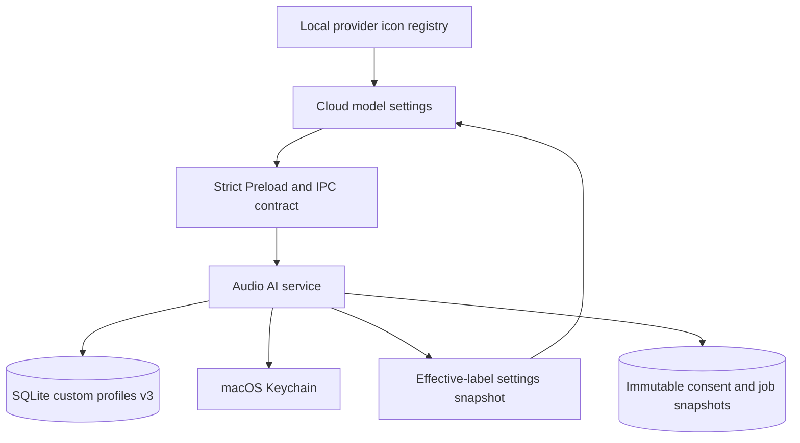
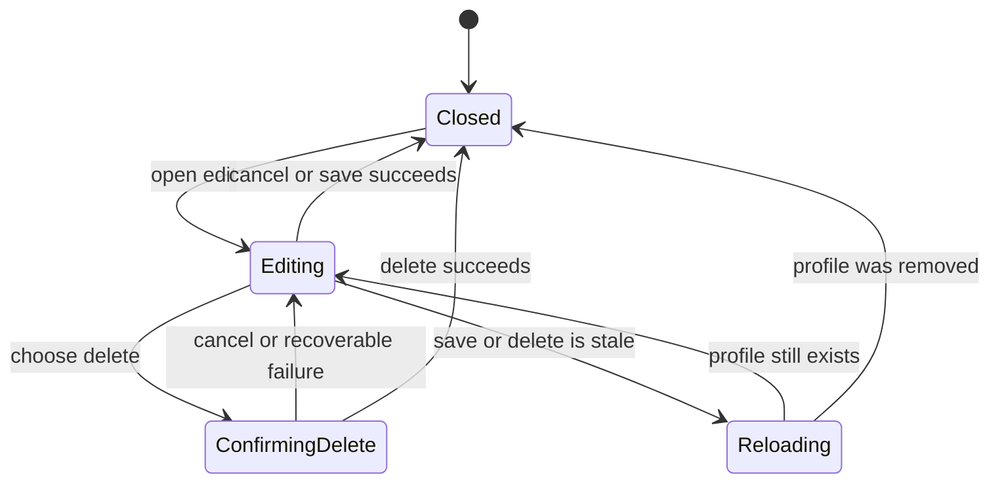
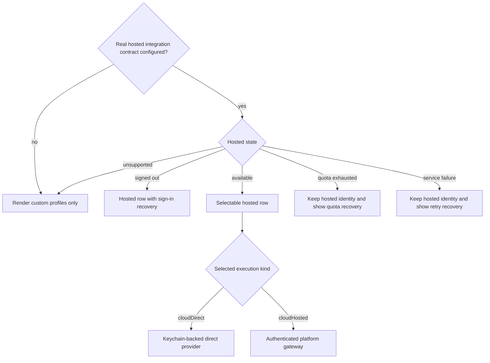

# Cloud Model Settings and Hosted Readiness - Plan

## Goal Capsule

- **Objective:** Users can identify, configure, select, and safely remove cloud models without confusing interface protocols, model identities, credentials, or selection state.
- **Means:** Refine the delivered BYOK profile experience now through nullable labels, local icons, distinct selection, and edit-owned deletion (KTD1-KTD5); keep hosted service entry points closed until a real platform capability contract exists (KTD6).
- **Authority:** The Product Contract owns user-visible behavior. The Planning Contract owns storage, identity, assets, modal state, and hosted integration boundaries. The existing custom-profile plan remains the historical authority for the delivered multi-profile foundation.
- **Execution profile:** Code changes in Electron storage, shared contracts, Main, Preload, renderer settings, bundled assets, tests, and product status documentation.
- **Stop conditions:** Stop if implementation would ship a platform API key in the Electron bundle, expose a non-functional hosted option, allow duplicate saved model IDs, persist raw key material in SQLite, echo secrets through IPC responses, log credentials, or let execution silently differ from the configuration the user confirmed.
- **Tail ownership:** A separate hosted-platform plan owns account authentication, entitlements, quota and billing, the inference gateway, server-held credentials and prompts, operational telemetry, and production rollout.

---

## Product Contract

### Summary

This increment clarifies the delivered custom cloud-model experience: optional configuration labels, API-oriented terminology, local provider branding, independent selection feedback, and deletion inside the edit flow. It defines the gate that a later hosted service must satisfy, but it does not display or enable an internal service before that service is real.

### Problem Frame

The current settings list calls saved model configurations “供应商”, requires a unique display name, and places selection state where users expect a provider icon. Edit and delete are two equally prominent row actions even though deletion is rare and destructive. The form also places its user-defined name and endpoint before the upstream model ID, which obscures the identity that will be sent to the API.

The shared contract reserves a `hosted/cloudHosted` shape, but the repository has no account authority, entitlement source, quota service, billing system, hosted inference gateway, or platform token. Current storage only permits `custom` profiles and foreign-keys selection to those rows. A UI-only “内置服务” switch would therefore claim a capability that cannot execute.

### Key Decisions

- **Treat the user label as an optional configuration note.** (session-settled: user-approved — chosen over removing the field entirely: it may add context, but it is not identity and need not be unique.) Governs R3, R5, R6.
- **Make model ID the unique user-facing model identifier.** (session-settled: user-directed — the user explicitly requires one saved configuration per model ID.) Keep `profileId` only as an internal relational key for immutable references; reject duplicate model IDs on create and edit. Governs R1, R5, R7, R13.
- **Represent hosted and BYOK as model kinds, not a custom-profile switch.** (session-settled: user-approved — chosen over an always-visible switch: the two paths have different credentials, network routes, billing, availability, and failure states.) Governs R9-R12.
- **Bundle known brand icons locally and keep selection feedback separate.** (session-settled: user-approved — chosen over runtime CDN icons or replacing the radio state: local assets remain available offline while selection stays perceivable.) Governs R1, R8.
- **Move deletion into the edit flow.** (session-settled: user-approved — chosen over permanent row-level delete actions: destructive management becomes less prominent without removing confirmation.) Governs R1, R4.

### Requirements

**Cloud-model list and terminology**

- R1. Each custom model row shows a local brand or generic model icon, the unique model ID as its primary label, optional configuration-name context, interface/API summary, and a separate selected indicator. Non-selected rows expose one edit action; the selected row's edit action is disabled with a concise reason.
- R2. User-visible settings copy uses “云端模型”, “接口类型”, “API 地址”, “模型 ID”, “配置名称（可选）”, and model-oriented add, edit, and delete verbs; internal provider and protocol field names remain unchanged.
- R3. Add and edit order fields as interface type, model ID, API address when editable, optional configuration name, and API credential state.
- R4. Only the edit dialog exposes “删除模型” in the footer’s left group; it opens a named confirmation and preserves recoverable focus and error states.

**Identity, persistence, and credentials**

- R5. Model ID is globally unique across saved cloud-model configurations. `profileId` remains an internal database/job key only; configuration names may be null or repeated and never determine routing or uniqueness.
- R6. A configuration name crosses create, update, and response boundaries as `string | null`: trimmed non-empty text is stored, and `null` explicitly means unnamed or clear the existing note. Main derives the effective display label from the unique model ID, using the bounded projection in KTD2 for historical 128-character fields.
- R7. Custom profiles continue to send the user-entered model ID to the upstream API and continue to bind each saved profile to a private Keychain secret reference.
- R8. Known provider icons are fixed-version local assets with recorded license provenance; unknown OpenAI-compatible services use a generic cloud-model fallback and never inherit an OpenAI logo by protocol alone.

**Hosted-service gate and future behavior**

- R9. The desktop does not render a hosted row, hosted service choice, or hosted call to action until a real hosted integration contract is configured. A supported integration that is temporarily unreachable remains governed by R11's service-failure state rather than disappearing.
- R10. After the platform capability authority and client integration exist, the built-in service appears only for supported hosted states as one platform-managed model that users may select but cannot edit or delete.
- R11. A future hosted capability is an account-bound, expiring display projection that distinguishes unsupported, signed-out, available, quota-exhausted, and temporary-service-failure states without silently routing work to BYOK. Renderer input cannot grant availability, and the gateway reauthorizes account, tenant, entitlement, quota, model release, and operation ownership for every execution.
- R12. Future hosted execution keeps platform API keys, protected prompts, upstream endpoints, and private model identifiers on the server; the client receives only public capability, consent, operation, usage, and result identities.

**Compatibility and evidence**

- R13. Existing non-conflicting custom profiles, selection, Keychain references, consent rows, queued jobs, retries, notes, and historical labels remain valid across the schema change. A legacy duplicate-model collision leaves the v2 database untouched and reports an actionable recovery error rather than discarding data.
- R14. Settings changes affect future preparation only. Prepared work either enqueues the exact confirmed receipt or is rejected as stale and prepared again; queued and historical jobs keep the execution identity captured at enqueue.
- R15. Static and non-visual tests prove behavior by default; launching Electron, running UI/visual suites, taking screenshots, or updating goldens requires separate task-local authorization.
- R16. A BYOK API key may exist only in the short-lived password control and strict create/update request path to Main. It never appears in responses, settings or job snapshots, SQLite, logs, errors, fixtures, or telemetry; the Renderer clears it after success, failure, cancel, or Escape. `secretRef` remains Main/SQLite-only and is rejected by Renderer-facing schemas.
- R17. Main rejects API-key replacement or profile deletion while any queued, running, failed, or interrupted job references the current secret. Completed jobs do not block either action. After an allowed replacement, deletion, completion, or relevant data deletion, Main removes an old Keychain item when no live profile or blocking job references it; historical snapshots keep the opaque reference as identity only.
- R18. Vendored SVGs are content-audited and hash-pinned. Distributed assets contain no script, event handler, `foreignObject`, external reference, remote import/URL, or entity expansion, and are loaded only as bundled files rather than injected markup.
- R19. The currently selected model is read-only: it cannot be edited or deleted until the user selects another model. The UI says “当前模型正在使用，请先切换到其他模型。” and never silently changes selection.
- R20. Main creates a short-lived preparation receipt that freezes the exact model, endpoint, template revision, transcript scope/hash, profile revision, and display projection shown for consent. Generation consumes that receipt once; expiry or any relevant settings change stops execution and requires a fresh confirmation rather than rereading mutable configuration.

### Acceptance Examples

- AE1. Covers R1, R2, R8. Given a DeepSeek profile and an unknown OpenAI-compatible profile, the list shows a local DeepSeek brand icon and a generic cloud icon, while exactly one independent selected indicator remains visible and accessible.
- AE2. Covers R3, R5-R7. Given a saved model ID already exists, create or edit with the same trimmed model ID is rejected regardless of configuration name, API address, account, or internal profile ID; the existing row remains unchanged.
- AE3. Covers R4. Given the edit dialog is open, canceling delete confirmation returns focus to “删除模型”; confirming closes both dialogs; a failed deletion keeps a recoverable edit context.
- AE4. Covers R4, R13. Given the profile changes or disappears after the edit dialog opens, save or delete receives a stale revision, reloads settings, and never overwrites or resurrects stale data.
- AE5. Covers R6, R13, R14. Given a profile label changes after a job is enqueued, the list uses the new label while the existing job and retry retain the enqueue-time label and execution identity.
- AE6. Covers R7, R19. Given a non-selected saved profile has an available key, editing shows credential status rather than the secret; supplying a replacement updates Keychain, while leaving replacement blank preserves the existing key.
- AE7. Covers R9-R12. Given this repository has no hosted capability authority, no hosted option is rendered and no hosted request can be constructed; a future real authority drives every hosted state without exposing a platform key.
- AE8. Covers R16, R17. Given a queued, running, failed, or interrupted job uses the current secret, replacing the key or deleting the profile is rejected with “当前密钥正被任务使用，暂时无法更换密钥或删除模型。” After no blocking job remains, the mutation succeeds and an unreferenced old key is removed without changing historical snapshots.
- AE9. Covers R8, R18. Given each vendored provider SVG, its recorded digest matches and static inspection rejects active content, external references, remote CSS, and unsafe inline rendering.
- AE10. Covers R4, R19. Given a model is selected, edit and delete are unavailable with the exact selected-model explanation. After another model is selected, the former model becomes editable and deletable.
- AE11. Covers R14, R20. Given the model, endpoint, template, transcript scope, profile revision, or selection changes after consent preparation, generation rejects the stale receipt and asks for confirmation again; it never substitutes the new values silently.

### Success Criteria

- A user can understand a row’s brand, model identity, optional label, selected state, and edit action without interpreting a “供应商” abstraction.
- Duplicate model IDs are rejected, while blank or repeated configuration notes remain valid and do not change historical AI work.
- Deletion remains confirmed, keyboard-recoverable, revision-checked, and absent from add mode and list rows.
- The packaged application makes no runtime icon request and carries the required Lobe Icons license provenance.
- Raw API keys enter only the ephemeral password-input and strict request IPC path to Main; they do not enter responses, snapshots, SQLite, logs, errors, fixtures, telemetry, local hosted configuration, or bundled resources. Secret references remain Main/SQLite-only.
- No hosted UI or execution path becomes visible before its runtime capability authority and security contract are available.

### Scope Boundaries

#### In Scope

- Electron custom-profile schema migration for optional configuration names.
- Effective-label derivation and immutable historical label preservation.
- Settings list, form order, copy, icon, selection, edit, and delete-flow changes.
- Fixed local provider assets, explicit icon mapping, and license provenance.
- Contract documentation that defines the admission gate for a future hosted integration.

#### Deferred to Follow-Up Work

- Account sign-in and session lifecycle for the Electron app.
- Hosted capability and entitlement API, quota metering, billing, and upgrade flows.
- Hosted inference gateway, platform credentials, protected prompts, provider routing, cancellation, idempotency, and duplicate-charge policy.
- Client hosted adapter, hosted consent/job discriminators, hosted row states, and hosted operational telemetry after the platform API is available.
- Provider catalog discovery, arbitrary user-selected icons, connection tests, import/export, reordering, and cross-device sync.

#### Outside This Increment

- Shipping a platform API key or confidential OAuth client secret in Electron.
- Guessing a provider brand from arbitrary model IDs, endpoint hosts, or user-entered names.
- Renaming internal `provider`, `providerId`, or `protocol` concepts solely to mirror UI copy.
- Automatically falling back between hosted and BYOK execution after consent or job creation.

### Dependencies

- The current multi-profile BYOK implementation and its v1-to-v2 database migration are the starting point.
- Future hosted work requires a named backend repository or service owner and a versioned capability/inference contract before a hosted implementation plan can be implementation-ready.

### Sources & Research

- `docs/plans/2026-08-26-1043-feat-custom-cloud-model-profiles-plan.md` defines the delivered multi-profile foundation and defers hosted membership AI.
- `docs/solutions/architecture-patterns/desktop-first-workstation-boundaries.md` requires Electron to remain the composition root for Keychain facts and forbids claiming unavailable security capabilities.
- `docs/product/desktop-electron-status.md` records custom BYOK as delivered and hosted authentication, gateway, quota, and billing as incomplete.
- `apps/desktop-electron/src/shared/contracts/audio_ai.ts` reserves the hosted profile response shape but does not model hosted availability or execution.
- `apps/desktop-electron/src/main/storage/audio_schema_fragments/v9.ts` makes profile names non-null and unique and restricts persisted profiles to `custom`.
- [Lobe Icons](https://github.com/lobehub/lobe-icons) provides fixed static SVG packages under the [MIT license](https://github.com/lobehub/lobe-icons/blob/master/LICENSE).
- [RFC 8252](https://www.rfc-editor.org/info/rfc8252) treats Electron-style installed applications as public native clients and requires browser-based authorization rather than embedded credentials.
- [RFC 9700](https://www.rfc-editor.org/info/rfc9700) requires modern authorization-code protections and rotation or sender constraints for refresh tokens used by public clients.

---

## Planning Contract

### Key Technical Decisions

- KTD1. **Migrate to nullable configuration notes and unique model IDs.** (session-settled: user-directed — model ID is the unique user-facing value; configuration name is optional context.) Add an explicit, foreign-key-safe v2-to-v3 table rebuild. Remove name uniqueness, add trimmed model-ID uniqueness, preserve existing names and internal profile IDs, and retain the selected profile. If a legacy v2 database contains duplicate model IDs, abort the migration atomically with an actionable collision error; never silently delete or merge profiles. Governs R5, R6, R13.
- KTD2. **Use one nullable note shape and derive bounded labels from model ID in Main.** Create, update, and response contracts require `configurationName: string | null`; `null` explicitly creates an unnamed profile or clears the note. Effective display identity always comes from model ID: use it directly up to 128 Unicode code points, or a deterministic 128-code-point middle-elided projection (first 64, ellipsis, last 63) for historical fields. The exact unique model ID remains separately visible and executable. Governs R1, R3, R5, R6, R14.
- KTD3. **Use a fixed local icon registry.** (session-settled: user-approved — chosen over CDN loading and heuristic brand inference: packaged assets are offline-safe and unknown compatible services must not imply an OpenAI relationship.) Vendor only approved static SVGs plus the upstream MIT notice. Map known protocols or future trusted brand metadata explicitly and use the existing generic icon fallback otherwise. Governs R1, R8.
- KTD4. **Keep selection semantics independent from provider branding.** Preserve the existing radio group, roving tab stop, row click, Space, and arrow-key behavior. Render provider branding in the leading media slot and selected state in a dedicated trailing slot and row surface. Governs R1, R15.
- KTD5. **Drive deletion with one feature-local edit-flow state machine.** (session-settled: user-approved — chosen over two permanent row actions: edit mode owns destructive management and focus restoration.) Reuse shared modal primitives unchanged. Selected models cannot enter edit mode; a successful deletion focuses the next model, then the previous model, or “添加模型” when the list is empty. Governs R4, R13, R19.
- KTD6. **Do not add a hosted switch or dormant hosted profile.** (session-settled: user-approved — chosen over a disabled or failing placeholder: service mode is the selected execution kind and must be backed by a runtime authority.) The current increment renders only custom profiles. A later hosted snapshot controls whether the platform-managed row is absent, actionable, or present with a recovery action. Governs R9-R11.
- KTD7. **Keep BYOK execution and security identity stable.** Optional labels and UI changes do not alter `secretRef` identity, provider protocol, endpoint validation, consent hashes, idempotency keys, immutable job snapshots, or retry routing. KTD10-KTD11 intentionally strengthen raw-key erasure, retention, garbage collection, and compensation observability without rewriting existing job identity. Governs R7, R13, R14, R16, R17.
- KTD8. **Separate future hosted capability revision from local settings revision.** The platform owns sign-in, entitlement, quota, and service health. Local profile mutations continue to use the SQLite settings revision. Before hosted becomes selectable, a follow-up must define the authority, persistence, integrity, and concurrency revision for a discriminated selection `{ kind: cloudDirect | cloudHosted, id }`; the current custom-profile foreign key cannot represent both kinds. Capability refresh, logout, quota exhaustion, and service failure must never silently change the selected execution kind. Governs R10, R11.
- KTD9. **Use discriminated future execution snapshots.** A future `cloudDirect` job keeps its endpoint and secret reference. A future `cloudHosted` job keeps only public hosted service, model release, consent, idempotency, metering, and server-operation identities. Both remain immutable after enqueue. Governs R12-R14.
- KTD10. **Constrain and erase raw BYOK keys at the process boundary.** The API key is permitted only in the temporary password control and strict create/update request to Main; responses and renderer-visible state reject both key material and `secretRef`. Clear temporary values after every terminal UI path and keep logs and errors sanitized. Governs R7, R16.
- KTD11. **Block credential mutation and journal failed cleanup.** Key replacement and profile deletion fail closed while a queued, running, failed, or interrupted job references the current secret; the selected model is separately read-only under KTD5. Completed jobs never block. Once allowed, delete an old Keychain item when unreferenced. A minimal Main-only SQLite cleanup journal stores only the internal reference, operation, state, timestamps, and sanitized error code so startup can retry incomplete cleanup without storing raw API keys. Governs R13, R14, R17, R19.
- KTD12. **Treat provider SVGs as executable-input risk.** Pin every asset digest, reject active or external content, render only through bundled file URLs or static image imports, and never use unsanitized inline HTML. Governs R8, R18.
- KTD13. **Make prepared execution immutable before consent.** Main issues an opaque, single-use, short-TTL preparation receipt containing the exact profile/settings revision, model ID, endpoint, template revision, transcript scope/hash, display projection, and Main-only secret reference used by the consent preview. Generation validates expiry and current revisions, then enqueues exactly that receipt; any mismatch discards it and requires a fresh preview. Renderer cannot construct or modify execution identity. Governs R13, R14, R20.
- KTD14. **Validate provider-specific model prefixes without rewriting IDs.** DeepSeek-interface model IDs must start with `deepseek-`; OpenAI-compatible IDs remain unconstrained beyond the common model-ID rules. Validation operates on the exact saved value, and execution sends that same complete value without adding or removing a prefix. Governs R1, R3, R5, R7.

### High-Level Technical Design

#### Current increment data flow

SQLite owns the optional configuration note, unique saved model IDs, internal profile keys, local selection, and secret-cleanup journal. Main owns model-ID projections, preparation receipts, and security-sensitive coordination. Renderer owns only temporary form and overlay state.

#### Edit and delete state machine

The edit trigger remains the focus origin for final closure. The footer delete control becomes the focus origin for a canceled confirmation.

#### Hosted admission and execution modes

The current implementation stops at the `no` branch. It must not fabricate capability data to exercise later branches in production.

### Data and Contract Changes

- Advance the Audio schema from v2 to v3 with a stepwise version dispatcher and an explicit transactional migration; accept v1, v2, and v3, and advance `user_version` only after each version-specific step succeeds.
- Replace stored required `display_name` and `normalized_display_name` identity with nullable `configuration_name`; remove name uniqueness and add a canonical trimmed model-ID unique constraint/index.
- Add a minimal `ai_secret_cleanup_queue` table for Main-only retry of incomplete Keychain cleanup; it stores no API key material.
- Preserve historical `provider_display_name` job columns as immutable effective-label snapshots rather than renaming or backfilling them.
- Change create, update, and response contracts to require a nullable `configurationName`; normalize UI blank input to `null` before IPC and use `null` as the explicit clear operation, while keeping model ID, protocol, endpoint, revision, and create-time secret requirements.
- Return the optional configuration note, exact unique model ID, and non-empty bounded model-ID display projection for custom profile rendering.
- Keep `hostedAiProviderProfileSchema` reserved. Do not loosen its capability shape until a real hosted contract defines the allowed states and actions.

### Hosted Follow-Up Contract

The next hosted plan must name a backend owner and concrete API surface before it creates code units. It must define:

- Native-app sign-in through the system browser and authorization code with PKCE S256. Main creates and owns short-lived single-use verifier, `state`, and `nonce`; the contract chooses one exact loopback, claimed-HTTPS, or custom-scheme redirect and defines interception and authorization-server mix-up defenses. Validate issuer, audience, nonce, and redirect identity; Electron remains a public client with no confidential client secret.
- Main-process-only token and session ownership: refresh tokens live only in Keychain, access tokens stay in Main memory where practical, and neither reaches Renderer, SQLite, logs, URLs, or telemetry. Define refresh rotation or sender constraint, replay detection, server revocation, local logout cleanup, expiry, offline behavior, and account switching.
- A versioned, account-bound capability snapshot with `issuedAt`, `expiresAt`, and revision for platform support, account state, entitlement, quota, model display metadata, service health, and recovery actions. It is a display projection, not execution authorization; expired or offline capability fails closed for new hosted work.
- A discriminated execution selection contract `{ kind: cloudDirect | cloudHosted, id }`, including its authority, storage migration and integrity rules, independent revision semantics, and behavior when capability refresh, logout, quota exhaustion, or service failure makes the selected kind unavailable. It must never auto-fallback.
- A new versioned hosted consent identity rather than reuse of direct-consent v1. It binds `executionKind`, public service/model release, public template or prompt-policy revision, transcript scope, relevant recipient/region/retention promises, and consent version; any material change requires renewed consent.
- A gateway request that binds user, transcript scope, template, public model release, consent, and idempotency identity without disclosing platform credentials or private prompts.
- Object-level tenant and user authorization for every capability, submit, status, cancel, and result operation; non-enumerable operation IDs; server allowlists for upstream routes; and no client-selected endpoint, private model, provider credential, or protected prompt.
- Atomic quota reservation keyed by account or tenant plus logical idempotency key and a canonical request digest. Same-key/same-payload retries return the same operation or terminal receipt; same-key/different-payload conflicts. After timeout or network loss, clients query the server operation before retrying, and cancellation distinguishes requested, accepted, too-late, and settled states.
- Quota settlement rules for success, failure, timeout, cancel, retry, and uncertain delivery, with the server receipt as the sole billing truth and an idempotency retention window at least as long as recovery and retry.
- Immutable client and server operation receipts so model upgrades, capability refresh, logout, or quota changes cannot rewrite prior work.
- Request and response size/time limits, output-schema and evidence validation, protected-prompt isolation, encrypted storage, minimum retention and deletion semantics, and processor/region disclosure appropriate to the user promise.
- Sanitized errors, caches, logs, traces, and metrics that prevent cross-tenant leakage and exclude transcripts, prompts, provider credentials, tokens, endpoint internals, and raw upstream responses.
- Negative security evidence for callback interception/mix-up, invalid issuer/audience/nonce, refresh-token replay, stale or forged Renderer capability, expired entitlement, concurrent duplicate submit, same-key/different-digest conflict, timeout-then-status recovery, cancel/settlement races, cross-account operation access, logout/account switching, token rotation, and telemetry-redaction canaries.

### Migration and Sequencing

1. Add migration characterization coverage for fresh v3, v1-to-v2-to-v3, and v2-to-v3 databases before changing repository reads.
2. Replace the current-version shortcut with a stepwise dispatcher owned by one opening transaction: recognize v1, v2, and v3; execute, version, and validate v1-to-v2 before starting v2-to-v3; commit only after the complete required chain validates; use a version-specific fresh-v3 builder; and never let v1-to-v2 write a later `AUDIO_SCHEMA_VERSION` implicitly.
3. Rebuild the profile and selection tables in a foreign-key-safe v2-to-v3 transaction, preserving the selected profile and restoring foreign-key enforcement only after schema validation and `foreign_key_check` pass.
4. Update strict shared, Preload, IPC, repository, and Main projections for nullable configuration notes, unique model IDs, prefix validation, bounded labels, preparation receipts, and cleanup status.
5. Add fixed provider assets, provenance, and the explicit icon registry.
6. Refactor settings list and dialog behavior after the storage and contract shape is stable.
7. Update all consumers, fixtures, and status documentation on the same contract state.
8. Start hosted implementation only after the follow-up contract and backend owner satisfy the admission gate.

### System-Wide Impact

- **Persistence:** The Audio database gains a v3 migration and no longer uses a user-visible name as a unique key.
- **Identity:** Model ID is globally unique and user-facing. `profileId` remains an internal relational key so historical references survive edits and migration.
- **Security:** BYOK remains client-direct and Keychain-backed. Hosted platform secrets remain outside Electron and outside this increment.
- **UI and accessibility:** Brand, selected state, edit, delete, focus, and status become distinct semantics. The radio keyboard contract remains intact.
- **Packaging:** Selected third-party brand assets and their MIT notice become part of the packaged source and inventory.
- **Operations:** Hosted sign-in, quota, billing, gateway health, and service telemetry remain unavailable until a separately owned platform increment exists.

### Risks & Dependencies

- **Dirty migration surface:** The current profile foundation is itself recent. Add atomic v1-to-v2-to-v3 and v2-to-v3 fixtures so an intermediate installation and a direct upgrade produce the same canonical v3 state.
- **Label drift:** Deriving labels separately in Renderer and Main would change consent or history after edits. Keep KTD2 as the sole projection authority.
- **Brand misrepresentation:** `openai-compatible` is a protocol class, not an OpenAI product identity. Use the generic fallback unless trusted metadata identifies a brand.
- **Nested modal regressions:** Moving delete under edit can break inert state, Escape handling, and focus restoration. Use KTD5 and targeted interaction tests.
- **Asset provenance drift:** Downloading `latest` assets makes builds non-reproducible. Pin the upstream version, keep exact source references and license text, and review trademark use as provider identification only.
- **Hosted scope leakage:** A permissive reserved schema can tempt fixtures or UI to imply availability. Keep production hosted data absent until the capability authority is real.
- **Revision coupling:** Hosted state may change independently from local profiles. Future work must not reuse the local settings revision as an account or quota revision.
- **Credential mutation race:** A job may become active while a key replacement or profile deletion is being checked. Perform the blocking-reference check and profile mutation under the repository's revision/transaction boundary, fail closed on a competing change, and run idempotent Keychain cleanup only after the authoritative state permits it.
- **Credential compensation failure:** A database failure after Keychain creation can orphan a secret, while a database failure after Keychain deletion can leave a profile whose secret is missing. Compensation failures must become explicit recoverable states and audit evidence rather than swallowed cleanup errors.
- **Preparation race:** Consent preview and generation can straddle a settings change. Use KTD13's single-use receipt and reject stale or expired preparation rather than rereading mutable settings.
- **Legacy model collision:** v2 permits duplicate model IDs while v3 does not. Migration must detect the collision before destructive work, remain at v2, name the conflicting model IDs without exposing credentials, and provide a recovery path rather than choosing a winner.
- **SVG active content:** A pinned third-party icon can still carry script or outbound references. Digest checks, active-content rejection, static image loading, and network-source assertions are all required.
- **Hosted authorization drift:** Renderer capability state can become stale or forged. Future execution must reauthorize account, tenant, entitlement, quota, model release, and operation ownership server-side and fail closed.
- **Hosted settlement races:** Concurrent retries, timeouts, and cancellation can duplicate work or charges. Future gateway admission requires atomic idempotency, reservation, recovery, and settlement semantics.
- **Hosted isolation failures:** Account switching, callback interception or mix-up, refresh-token replay, enumerable operations, and cross-tenant cache or result reuse are explicit threat cases for the follow-up security plan.

### Alternative Approaches Considered

- **Remove configuration names entirely:** Rejected because an optional note can still provide user context even though model ID is the unique identifier.
- **Generate and persist names in Renderer:** Rejected because Renderer defaults would become a second identity authority and would still conflict with current uniqueness constraints.
- **Use the React Lobe Icons component package directly:** Rejected for this increment because its UI peer stack is broader than the current Electron app needs. A small fixed static-asset registry is easier to package and audit.
- **Load icons from a CDN:** Rejected because settings must work offline and packaged behavior must not depend on third-party availability or tracking.
- **Show a disabled hosted switch now:** Rejected because the repository cannot distinguish unsupported from signed-out, quota-exhausted, or failed service states.
- **Allow the same model ID under multiple endpoints or accounts:** Rejected by explicit product direction. One model ID maps to one saved cloud-model configuration.

---

## Implementation Units

### U1. Migrate profile labels to optional configuration names

- **Goal:** Store an optional user label without using it as profile identity or changing historical jobs.
- **Requirements:** R5, R6, R13, R14; KTD1, KTD2, KTD7, KTD13.
- **Dependencies:** None.
- **Files:**
  - `apps/desktop-electron/src/main/storage/audio_database.ts`
  - `apps/desktop-electron/src/main/storage/audio_schema.ts`
  - `apps/desktop-electron/src/main/storage/audio_schema_fragments/v9.ts`
  - `apps/desktop-electron/src/main/storage/audio_migrations/v1_to_v2.ts`
  - `apps/desktop-electron/src/main/storage/audio_migrations/v2_to_v3.ts`
  - `apps/desktop-electron/src/main/storage/repositories/ai_job_repository.ts`
  - `apps/desktop-electron/src/main/domain/audio-intelligence/provider_profile_validation.ts`
  - `apps/desktop-electron/tests/integration/audio_ai_storage_test.ts`
  - `apps/desktop-electron/tests/integration/storage/sqlite_foundation_test.ts`
- **Approach:**
  1. Replace the current-version shortcut with an explicit v1/v2/v3 dispatcher whose opening transaction owns the full required chain. Keep version-specific fresh builders, fixtures, validators, and required-schema metadata; execute and validate v1-to-v2 before v2-to-v3, but commit only when the entire chain succeeds.
  2. Implement v2-to-v3 as a controlled table rebuild. Outside the transaction, disable foreign-key enforcement as SQLite requires; inside it, copy explicit columns, replace the canonical profile table and rebuild the selection FK in a defined order; before commit, validate the v3 structure and run `foreign_key_check`; in `finally`, restore `foreign_keys` and `legacy_alter_table` settings.
  3. Preserve v2 display names as nullable configuration names; remove both normalized-name uniqueness mechanisms and add exact trimmed model-ID uniqueness. Detect duplicate legacy model IDs before destructive work and abort atomically with a sanitized recovery error rather than deleting, merging, or renaming a profile.
  4. Preserve the primary key, unique `secret_ref`, kind/protocol/check constraints, and `ON DELETE SET NULL` selection behavior. Copy profile and selection revisions and `secret_ref` values exactly without touching Keychain items. Leave historical job columns unchanged.
  5. Create the minimal Main-only secret-cleanup queue with internal reference, operation, state, timestamps, and sanitized error code; prohibit raw key material in its DDL and repository contract.
- **Execution note:** Add migration characterization fixtures before changing current-schema reads.
- **Patterns to follow:** Existing version dispatch and `v1_to_v2` rollback tests; repository revision checks and transactional writes.
- **Test scenarios:**
  - A fresh v3 database stores null, blank-normalized-to-null, and explicit configuration names without storing a secret.
  - A real v2 database is accepted by inspection, migrates every display name into the corresponding nullable field, and preserves selection, timestamps, non-zero profile and settings revisions, profile IDs, protocols, models, endpoints, secret references, and the selection foreign-key target.
  - A v1 database upgrades through v2 to the same canonical v3 shape as a direct fresh profile fixture.
  - Configuration names and their case variants may repeat, but duplicate trimmed model IDs and duplicate `secret_ref` values fail. A v2 duplicate-model fixture aborts before mutation, preserves canonical v2 data/version, and reports only the colliding model IDs.
  - A test-only failpoint after copy or replacement proves a v2 failure restores schema, rows, indexes, revisions, PRAGMAs, and `user_version = 2`; a second-hop failure from v1 rolls the whole opening transaction back to canonical v1 and can later retry successfully.
  - A v2 layout falsely marked `user_version = 3` is rejected before repository reads; fresh, v1-upgraded, and v2-upgraded profile columns, nullability, constraints, indexes, and selection FK are identical.
  - Existing consents are compared column-for-column, while queued jobs, retries, notes, historical provider-display snapshots, and job `secret_ref` values remain byte-for-byte equivalent in semantic fields after migration.
  - The cleanup queue accepts only bounded internal metadata, rejects raw keys, preserves retry state across restart, and participates in schema validation and rollback assertions.
- **Verification:** Fresh, v1-upgraded, and v2-upgraded databases pass version-specific schema, integrity, foreign-key, and repository assertions.

### U2. Update profile contracts and effective-label projection

- **Goal:** Carry a nullable configuration note and unique model identity through Main, Preload, and Renderer while preserving exact prepared execution and a bounded, auditable Keychain lifecycle.
- **Requirements:** R2, R5-R7, R13, R14, R16, R17, R19, R20; KTD2, KTD7, KTD10, KTD11, KTD13, KTD14.
- **Dependencies:** U1.
- **Files:**
  - `apps/desktop-electron/src/shared/contracts/audio_ai.ts`
  - `apps/desktop-electron/src/shared/contracts/ipc.ts`
  - `apps/desktop-electron/src/preload/api.ts`
  - `apps/desktop-electron/src/main/ipc/desktop_ipc.ts`
  - `apps/desktop-electron/src/main/ipc/register_desktop_ipc.ts`
  - `apps/desktop-electron/src/main/domain/audio-intelligence/audio_ai_service.ts`
  - `apps/desktop-electron/src/main/storage/repositories/secret_cleanup_repository.ts`
  - `apps/desktop-electron/tests/unit/ipc_contract_test.ts`
  - `apps/desktop-electron/tests/integration/register_desktop_ipc_test.ts`
  - `apps/desktop-electron/tests/integration/domain_ipc_test.ts`
  - `apps/desktop-electron/tests/integration/audio_ai_service_test.ts`
- **Approach:**
  1. Replace required custom-profile input naming with required-nullable `configurationName`; omission is invalid, `null` means unnamed or clear, and normalized non-empty text remains capped at 128 code points. Retain a required effective `displayName` in public snapshots where consumers need non-empty text.
  2. Centralize KTD2 in Main, reject duplicate trimmed model IDs, and validate KTD14 without rewriting the upstream ID.
  3. Keep create-time secrets required and update-time replacements optional only at the mutation level. Permit raw key material solely in strict requests to Main, reject key material and `secretRef` in every response, and sanitize all logs and errors.
  4. Keep the hosted response shape reserved and absent from production settings per KTD6.
  5. Implement one Main-owned blocking-reference query for queued, running, failed, and interrupted jobs. Reject key replacement and profile deletion when it matches, and reject all edits/deletion for the selected profile under R19.
  6. Wrap cross-store mutations with the minimal cleanup journal. Reconcile pending entries at startup and after mutation, expose only bounded sanitized recovery status, and never store or return raw key material.
  7. Add KTD13's opaque single-use preparation receipt and strict generate input. Freeze the values shown for consent, validate TTL and profile/settings revisions, and reject stale preparation with a re-confirm action before network access.
- **Execution note:** Start with strict-contract tests so renamed optional fields cannot silently disappear at a process boundary.
- **Patterns to follow:** Zod `.strict()` schemas, duplicate boundary validation in Preload and Main, and current settings revision handling.
- **Test scenarios:**
  - Create accepts `null`, UI whitespace normalizes to `null` before IPC, update supports explicit-to-null and null-to-explicit transitions, and strict schemas reject omission, over-limit text, and wrong types.
  - A trimmed explicit configuration name becomes the effective display label. Model IDs of 128, 129, and 256 code points exercise the exact and middle-elided fallback through settings, prepare, and enqueue; values beyond the model limit are rejected.
  - Duplicate configuration notes round-trip under distinct profile IDs, while duplicate trimmed model IDs fail create/edit without changing revision or the existing row.
  - DeepSeek IDs without `deepseek-` fail validation; compatible-interface IDs keep their exact user-entered prefix, and execution sends the stored ID unchanged.
  - Settings, consent preview, and a newly enqueued job receive the same model-ID projection for one profile state.
  - Editing the profile later does not change an existing job snapshot or retry label.
  - Strict renderer-facing schemas reject `secretRef`, API keys, hosted upstream IDs, and unexpected fields; request-side tests prove key material is accepted only by the intended create/update channel and never echoed.
  - A hosted profile is not synthesized when no hosted capability authority is injected.
  - A failed database write after Keychain creation queues cleanup when immediate compensation fails; restart reconciliation retries it, exposes only sanitized status, and removes the record after success.
  - Queued, running, failed, and interrupted jobs block key replacement and profile deletion; completed jobs do not. Finishing, abandoning/data-deleting, or successfully retrying the last blocking job makes the mutation available, and cleanup removes only keys with no live profile or blocking-job reference.
  - A selected profile rejects every edit and delete request in Main even if Renderer is stale or bypassed.
  - A preparation receipt is single-use and expires. Any model, endpoint, template, transcript, profile revision, or selection change before generation rejects it and produces no network request or job until the user confirms again.
- **Verification:** All process boundaries agree on optional source labels, non-empty projections, and unchanged secret and immutable-job guarantees.

### U3. Bundle audited provider icons and an explicit registry

- **Goal:** Give known models reliable local branding without coupling identity or selection to an external icon service.
- **Requirements:** R1, R8, R15, R18; KTD3, KTD4, KTD12.
- **Dependencies:** None.
- **Files:**
  - `apps/desktop-electron/assets/model-providers/deepseek.svg`
  - `apps/desktop-electron/assets/licenses/lobe-icons-MIT.txt`
  - `apps/desktop-electron/assets/model-providers/ASSET_PROVENANCE.md`
  - `apps/desktop-electron/src/renderer/features/settings/model-provider-icons.tsx`
  - `apps/desktop-electron/tests/unit/renderer/ai_settings_test.tsx`
  - `apps/desktop-electron/tests/unit/provider_icon_assets_test.ts`
- **Approach:**
  1. Vendor exact assets from one fixed Lobe Icons static SVG release without adding its React package. Record upstream version, source path, retrieval date, SHA-256, license, intended nominative use, and a removal/replacement inventory.
  2. Keep a small explicit registry for trusted protocol or future brand metadata; use the existing generic cloud icon for unknown compatible endpoints.
  3. Treat provider icons as decorative and keep row text and radio semantics as the accessible name and state.
  4. Add a focused content/inventory test that verifies each digest and rejects script, event attributes, `foreignObject`, external `href`/`xlink:href`, entity references, CSS imports, and remote URLs. Load the SVG only as a bundled static image/file URL, never through `innerHTML` or unsanitized inline markup.
- **Execution note:** Treat this as packaging and provenance work; prove resolution and inventory with static tests rather than UI launch.
- **Patterns to follow:** Existing frozen-resource provenance and license records; Vite local asset resolution; Lucide fallback icons.
- **Test scenarios:**
  - DeepSeek resolves to the pinned local asset with no `http`, `https`, CDN, or user-input-derived path.
  - Unknown OpenAI-compatible profiles resolve to the generic fallback rather than an OpenAI logo.
  - Malformed or future protocol values cannot escape the registry or request a remote resource.
  - The selected indicator remains a separate element and does not change which provider asset resolves.
  - The license and provenance files identify every distributed third-party provider asset.
  - Tampered digests or SVG active/external content fail the static asset test, and source/network scans prove the registry has no outbound icon path.
- **Verification:** Static renderer and inventory checks prove deterministic offline icon resolution and complete asset provenance.

### U4. Refine the list, form hierarchy, and deletion state machine

- **Goal:** Implement the confirmed cloud-model information hierarchy and move destructive management into edit mode.
- **Requirements:** R1-R4, R6-R9, R13, R15-R20; KTD3-KTD6, KTD10, KTD11, KTD14.
- **Dependencies:** U2, U3.
- **Files:**
  - `apps/desktop-electron/src/renderer/features/settings/ai-settings-feature.tsx`
  - `apps/desktop-electron/tests/unit/renderer/ai_settings_test.tsx`
- **Approach:**
  1. Replace user-visible provider copy and reorder custom-profile fields per R2-R3 without renaming internal protocol types.
  2. Render KTD3 branding, the unique model ID as primary text, optional configuration context, and KTD4 selection feedback. Disable edit for the selected row with the exact R19 explanation.
  3. Replace the editable secret placeholder with saved/missing/denied/corrupt credential status and an explicit replacement path while keeping secret input ephemeral.
  4. Move delete into a left footer group in edit mode only and implement KTD5 with feature-local controlled overlay state, reusing the shared dialog, alert-dialog, and modal-coordinator primitives unchanged.
  5. Keep hosted UI absent under KTD6.
- **Execution note:** Prove radio, modal, focus, stale, and secret-cleanup behavior with renderer tests before any separately authorized visual validation.
- **Patterns to follow:** Existing `SettingsItemGroup`, `Item`, Radix dialog primitives, modal coordinator, one-pixel focus treatment, and concise settings copy.
- **Test scenarios:**
  - Rows show brand/fallback media, unique model ID, optional note, interface/API summary, and a distinct selected state. Non-selected rows have one edit action; the selected row has a disabled edit action and cannot open the dialog.
  - Row click, Space, and arrow keys preserve radio selection and roving focus after the leading icon changes.
  - Add and edit expose fields in the required order and permit a blank configuration name.
  - Duplicate model IDs are rejected. DeepSeek mode validates the `deepseek-` prefix without modifying the saved value; compatible mode preserves arbitrary valid prefixes.
  - Add requires a new key; edit displays credential state, accepts a replacement, and clears replacement text after success, failure, Escape, or cancel.
  - Raw key material exists only in the password input and create/update request construction; it is absent from DOM after each terminal path and never appears in rendered error text or snapshots.
  - Add mode never shows delete, and list rows expose no delete control.
  - The selected row cannot open edit and exposes the exact R19 reason. After selection moves, its edit action becomes available without changing other fields.
  - Canceling delete returns focus to the footer delete control. Successful deletion closes both overlays and focuses the next model's edit action, then the previous model's edit action, or “添加模型” when no row remains.
  - A blocking job prevents key replacement or deletion and shows exactly the concise AE8 message. Keychain denial, orphan cleanup, secret restoration, or repository failure keeps the edit context and exposes a sanitized recoverable error.
  - A stale save or delete reloads settings; a surviving profile resets the edit baseline, while a missing profile closes edit and reports the removal.
  - No hosted label, switch, row, or request appears when the settings snapshot contains only current custom capabilities.
- **Verification:** Renderer tests prove the complete semantic interaction contract without launching Electron.

### U5. Preserve AI consumers, fixtures, and historical identity

- **Goal:** Update downstream consumers while preserving direct-consent scope and immutable enqueue-time execution, retry, and historical display identity.
- **Requirements:** R5-R7, R13-R17, R19, R20; KTD2, KTD7, KTD11, KTD13, KTD14.
- **Dependencies:** U1, U2, U4.
- **Files:**
  - `apps/desktop-electron/src/renderer/features/audio-ai/audio-ai-feature.tsx`
  - `apps/desktop-electron/tests/e2e/audio_ai_renderer_flow_test.tsx`
  - `apps/desktop-electron/tests/e2e/audio_review_flow_test.ts`
  - `apps/desktop-electron/tests/unit/renderer/audio_ai_test.tsx`
  - `apps/desktop-electron/tests/unit/renderer/application_operations_test.tsx`
  - `apps/desktop-electron/tests/unit/renderer/shell_test.tsx`
  - `apps/desktop-electron/tests/visual/fixtures/renderer-api.ts`
  - `apps/desktop-electron/tests/visual/harness/preload.ts`
  - `apps/desktop-electron/tests/packaged/macos_ai_boundary_smoke_test.ts`
- **Approach:**
  1. Update doubles and fixtures to carry optional configuration names and effective display labels.
  2. Prepare consent from KTD13's exact Main-owned receipt. Generation consumes that receipt rather than rereading mutable settings; stale or expired receipts reopen preparation and consent.
  3. Preserve current missing, denied, corrupt, stale, rate-limit, retry, and evidence error paths.
  4. Update visual harness data only for compilation; do not run or update visual evidence under this task.
- **Patterns to follow:** Existing consent dialog, immutable retry tests, sanitized error mapping, and renderer API fixtures.
- **Test scenarios:**
  - A blank configuration name uses the bounded KTD2 projection consistently in settings and the next consent preview while the exact model ID remains separately visible and executable.
  - If the model, endpoint, template, transcript scope, profile revision, or selection changes after preview, generate rejects the receipt, performs no network request, and requires a new preview; otherwise the job snapshot exactly matches what the user confirmed.
  - Renaming, selecting, or deleting the source profile after enqueue leaves current job and retry identity unchanged.
  - A missing or inaccessible BYOK secret fails before network access and retains a settings recovery path.
  - Duplicate configuration notes never route a request through the wrong internal profile, and duplicate model IDs cannot enter saved state.
  - Profile deletion or key replacement is blocked while an active or retryable job uses the current secret. Job completion and data deletion release that block and collect only unreferenced obsolete secrets.
  - Packaged-boundary evidence remains secret-free and does not claim hosted availability.
- **Verification:** Consumer and boundary tests pass with no compatibility shim that treats display text or model ID as profile identity.

### U6. Record delivered scope and the hosted admission gate

- **Goal:** Keep product and architecture documentation aligned with what the desktop can actually execute.
- **Requirements:** R2, R6, R8-R12, R15; KTD1-KTD3, KTD6, KTD8, KTD9.
- **Dependencies:** U1-U5.
- **Files:**
  - `docs/product/desktop-electron-status.md`
  - `docs/product/s3-productization-status.md`
  - `docs/QUARK_RECORDING_MINUTES_UI_DESIGN_BRIEF.md`
- **Approach:**
  1. Record the optional-label and local-icon behavior as delivered only after U1-U5 pass.
  2. Keep hosted authentication, capability, quota, billing, gateway, and protected prompts incomplete.
  3. Add the hosted follow-up contract as an admission checklist without claiming a backend or actionable UI.
  4. Record whether visual validation was separately authorized and performed; planning alone does not provide that authorization.
- **Patterns to follow:** Existing PASS/PARTIAL_PASS/BLOCKED language and explicit frozen/TODO protocol boundaries.
- **Test scenarios:** Test expectation: none -- this unit updates product and architecture documentation after behavioral evidence exists.
- **Verification:** Documentation distinguishes delivered BYOK refinement, reserved hosted contracts, and the external prerequisites for hosted production use.

---

## Verification Contract

| Gate | Applies to | Done signal |
| --- | --- | --- |
| Focused storage and migration Vitest suites | U1 | Fresh v3, atomic v1-to-v2-to-v3, v2-to-v3, mid-rebuild rollback, exact schema/FK/index structure, revision preservation, nullable-note/unique-model constraints, legacy collision abort, cleanup journal, unique secret-ref, and historical snapshot scenarios pass. |
| Focused contract, IPC, service, and renderer Vitest suites | U2, U4, U5 | Nullable notes, unique IDs and prefix validation, bounded model labels, strict response secrecy, request-only raw-key flow, selected/active mutation blocks, cleanup reconciliation, exact preparation receipts, deletion state, radio semantics, focus restoration, stale recovery, and immutable jobs pass. |
| Asset resolution, provenance, and inventory assertions | U3 | Every known asset resolves locally from a fixed source, matches its digest, rejects active/external SVG content, and carries license and trademark-use provenance. |
| `bun run check:code` from `apps/desktop-electron` | U1-U5 on the final code state | Formatting, lint, TypeScript, all non-visual tests, renderer boundaries, and lifecycle checks pass. |
| Secret and network-source scan | U1-U5 | Raw API keys appear only in the intended ephemeral password/request path. Synthetic secret references are allowed only in Main/storage migration fixtures; they do not appear in responses, Renderer snapshots, DOM after terminal form paths, Renderer-facing, visual, or packaged fixtures, logs, errors, or telemetry. No hosted platform secret, CDN icon URL, active SVG reference, or user-derived asset path appears in bundled resources. |
| `bun run check:ui:quick` and final `bun run check:ui` | U4-U5 only with explicit current-task visual-validation authorization | The authorized UI lanes pass once on the final unchanged UI code state. Without authorization, they are skipped and reported as such. |
| Screenshot, golden, Electron launch, and UI watcher evidence | Separate explicit authorization only | No visual claim is made unless the user authorizes the relevant operation; golden updates require their own request. |

The Electron release-evidence lane is outside this increment unless the user separately requests a release candidate. Do not run packaging or resource acquisition as routine verification.

---

## Definition of Done

- U1 is complete when every non-conflicting supported database reaches one canonical v3 state atomically, legacy model-ID collisions fail without mutation, exact constraints/FKs and both revision layers survive, configuration notes are nullable, and model IDs are unique.
- U2 is complete when Main is the sole bounded model-label and preparation authority, every response boundary remains secret-free, and selected/active mutation blocks, cleanup reconciliation, Keychain compensation, and garbage collection are explicit and tested.
- U3 is complete when known branding is local, digest-pinned, content-audited, licensed, and independent from selection or arbitrary user input.
- U4 is complete when terminology, field order, unique-ID/prefix feedback, row hierarchy, selected-model read-only state, credential status, delete confirmation, deterministic focus, stale recovery, and hosted absence pass static renderer tests.
- U5 is complete when consent preparation, generation, retry, history, fixtures, and packaged boundary evidence prove that execution exactly matches the confirmed receipt and preserves immutable profile and secret identity.
- U6 is complete when product documentation reports the delivered BYOK refinement and keeps hosted service blocked on its real platform dependencies.
- The final implementation passes the required non-visual Electron lane. Visual validation is either separately authorized and passed or explicitly reported as skipped under repository policy.
- No hosted row, hosted switch, client platform key, runtime icon download, duplicate-name constraint, duplicate saved model ID, row-level delete action, mutable post-consent execution lookup, stale compatibility shim, abandoned migration path, or experimental asset remains in the final diff.
