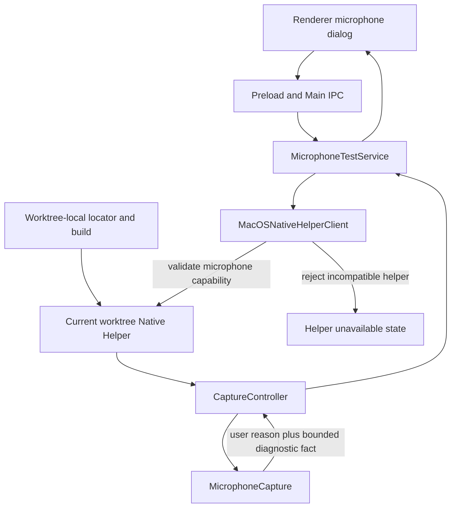
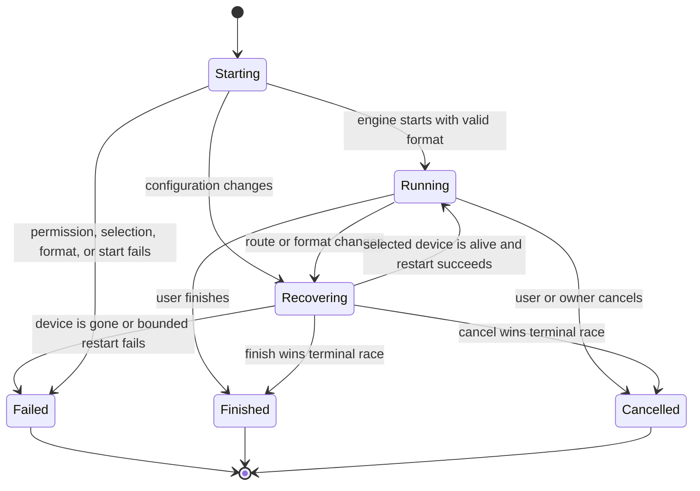

# Bluetooth Microphone Test Reliability - Plan

## Goal Capsule

| Field | Contract |
| --- | --- |
| Objective | 用户选择已连接的蓝牙麦克风后，可以开始测试并看到真实输入；正常的设备协商不会被误报为失败。 |
| Means | 将启动期配置变化改为有界恢复状态，保留分层诊断事实，并让 Electron 在握手时拒绝不兼容的 Native Helper。（KTD1、KTD2、KTD3） |
| Authority | 本计划定义本次聚焦修复。`docs/plans/2026-08-25-1021-fix-desktop-input-workspaces-plan.md` 继续定义手动结束、实时 meter 和 typed failure 的既有行为。`AGENTS.md` 定义验证权限和交付门禁。 |
| Execution profile | 先固定文案和测试预期，再实现 Native 恢复状态，随后收紧 Helper 契约，最后完成 Electron 集成和设备验收。 |
| Stop conditions | 不恢复 30 秒自动结束，不增加成功结果页，不把原始系统错误展示给用户，不复制 `.build` 产物到其他 worktree，不运行未经授权的 UI 或真实设备验证。 |
| Tail ownership | 本计划只覆盖麦克风测试文案、蓝牙启动可靠性、错误诊断、Helper 兼容性和相关验证。消息、互联、三栏布局、本地模型和正式录音算法重构不在范围内。 |

---

## Product Contract

### Summary

麦克风测试说明只保留用户下一步需要做的事。用户选择一个仍然可用的蓝牙麦克风后，启动期的采样率、声道或路由协商不得直接结束测试。系统只在权限、设备、打开、格式、Helper 或 snapshot 已确认失败时进入对应失败状态。

### Problem Frame

当前界面说明重复了按钮和可见状态已经表达的信息。现有 `AGENTS.md` 虽然要求文案精炼，但缺少可执行的删除判断，因此同类冗余容易再次出现。

Native 测试链路在启动后监听 `AVAudioEngineConfigurationChange`。只要引擎状态或输入格式发生变化，回调就被视为健康异常。`CaptureController` 又把任何健康异常立即终止为 `device-unavailable`。蓝牙输入在建立通话音频配置时可能进行正常的格式或路由重协商，因此一个已连接且可用的设备也会在开始测试后立刻失败。

开发环境的 Helper 位于每个 worktree 自己的 `.build/debug`。两个 worktree 即使位于同一 Git 提交，也不共享构建产物。当前握手只验证粗粒度 `voice2text-macos-helper/v1`，旧二进制仍可能通过握手，然后在新命令或新 snapshot schema 上失败。

### Key Decisions

- **界面文案只保留下一步行动所需信息。** (session-settled: user-directed — chosen over describing every implemented behavior: users do not need to spend time reading controls and states that are already visible.) Governs R1、R2。
- **本次新建聚焦修复计划。** (session-settled: user-approved — chosen over expanding the existing multi-workspace plan: the Bluetooth regression needs an independent implementation and verification boundary.) Governs R3–R10。

### Requirements

**Copy economy**

- R1. 麦克风测试开始说明必须为“开始后，请对着麦克风说话。”，结束方式继续由“结束测试”按钮表达。
- R2. `AGENTS.md` 必须要求界面文案保持简短、自然且体贴，只保留影响用户下一步行动或判断的信息，并删除可见控件、状态和能力清单的重复说明；说明性语句应在不增加解释负担时使用简短礼貌的表达。

**Bluetooth microphone lifecycle**

- R3. 所选麦克风不得仅因启动期一次正常配置变化进入终态；完成 R4 的有界恢复且未确认 R5 所列失败条件时，必须进入或保持 `running`。
- R4. 启动期格式或路由变化必须触发序列化、幂等的恢复；恢复最多持续 4 秒、最多执行 5 次 restart 尝试，计划间隔为立即、250 ms、500 ms、1,000 ms、2,000 ms。窗口内的新配置通知合并到当前恢复，不开启第二个恢复任务；恢复成功后继续同一个测试，不重建 Renderer 测试身份。
- R5. 只有所选 UID 不再解析、设备确认失活、格式不可支持、初始 AudioUnit 设备设置失败、初始引擎启动失败或 R4 的恢复预算耗尽时，Native 才发布终态失败并释放资源。
- R6. finish、cancel、重复配置通知、设备断开和恢复完成之间的竞态必须只产生一个终态，并且 observer、tap 和 engine 只释放一次。

**Diagnostics and process compatibility**

- R7. 权限、UID 不可用、设备失活、设置设备失败、引擎启动失败、恢复失败、格式失败、Helper transport 和 snapshot validation 必须保留为不同的内部诊断事实。
- R8. Renderer 继续只显示简短、可操作的稳定 failure reason，不显示 OSStatus、底层 Error、设备 UID 或构建路径。Helper 契约不兼容映射为现有 `native-helper-failed`，显示“麦克风测试失败”与“麦克风测试暂不可用，请重启应用。”，仅保留“知道了”。
- R9. Helper 的 ready frame 必须声明固定的 `microphoneTestContract: "continuous-manual/v1"`；Electron 必须在握手阶段校验该值，不兼容或未声明该能力的二进制不得进入可测试状态。
- R10. 开发启动必须使用当前 worktree 构建出的 Helper，禁止跨 worktree 复制或复用 `.build` 产物。

### Acceptance Examples

- AE1. **Covers R1、R2.** Given 用户打开测试说明，when 阅读 Dialog，then 只看到“开始后，请对着麦克风说话。”，按钮继续提供开始、取消和后续结束操作。
- AE2. **Covers R3、R4.** Given 所选蓝牙麦克风启动时从初始格式协商为有效输入格式，when 引擎发送配置变化，then Native 完成一次有界恢复并继续发布 `running` snapshot。
- AE3. **Covers R5–R8.** Given 所选蓝牙麦克风在测试期间真正断开，when UID 不再解析或设备确认失活，then 测试只结束一次，UI 显示“麦克风不可用”，内部诊断保留断开事实。
- AE4. **Covers R5–R8.** Given AudioUnit 设置设备或引擎重启失败，when Native 无法恢复，then UI 显示稳定的打开失败文案，内部诊断可以区分设置设备、启动和恢复失败。
- AE5. **Covers R8、R9.** Given Electron 客户端遇到旧 Helper，when 握手完成前校验契约身份，then 会话被拒绝、不会创建 active test，Dialog 显示约定的简短失败文案与单一关闭动作，而不是进入设置引导或等开始测试后返回通用 snapshot failure。
- AE6. **Covers R10.** Given 从任一开发 worktree 启动 Electron，when 构建并解析 Helper，then 产物路径位于该 launching repository root 下，不会选择或复制 sibling worktree 的 `.build`。

### Scope Boundaries

#### Deferred to Follow-Up Work

- 把本次蓝牙恢复和 Helper provenance 经验整理为新的 `docs/solutions/` 学习文档。
- 将相同的启动恢复机制扩展到正式录音，只有真实设备证据显示正式录音存在同一缺陷时再单独计划。

#### Out of Scope

- 自动选择新的替代麦克风。
- 自动修改 macOS 默认输入设备。
- 录制或回放测试音频。
- 修改本地模型、消息、互联或三栏页面。
- Electron release candidate、打包资源清单或发布验证。

---

## Planning Contract

### Key Technical Decisions

- KTD1. **Configuration change enters bounded recovery, not failure.** `MicrophoneCapture` must serialize configuration handling, use an injectable scheduler for the fixed R4 budget, and re-read device viability and the active input format before every restart attempt. A delay without state validation is not an acceptable repair. Governs R3–R6。
- KTD2. **User reasons and diagnostic facts remain separate.** Keep the current concise user-facing reason family while carrying bounded, non-sensitive diagnostic codes for device selection, engine start, reconfiguration and transport boundaries. Governs R7、R8。
- KTD3. **Helper compatibility is rejected during handshake.** Keep the general Helper protocol identity unchanged, add the fixed `microphoneTestContract: "continuous-manual/v1"` capability to the ready frame, and require an exact client match so microphone command and snapshot incompatibility cannot survive session setup. Any future semantic change to microphone commands, responses or snapshot fields must advance this capability identity. Governs R9。
- KTD4. **Build provenance is worktree-local.** Resolve and rebuild the Helper from the launching worktree; tests must never treat equal Git HEAD values as proof that native artifacts are equal. Governs R10。
- KTD5. **Copy uses a deletion test.** (session-settled: user-directed — chosen over feature narration: any clause whose removal does not change the user's next action or decision must be removed.) Governs R1、R2。

### High-Level Technical Design

The process boundary must reject stale implementations before the microphone flow begins.

The Native lifecycle separates recoverable startup changes from confirmed failures.

### Sequencing

1. U1 fixes the product copy and durable instruction while the U2 evidence checkpoint independently confirms the active artifact and current failure boundary.
2. U2 introduces the Native recovery seam and low-level tests after recording that checkpoint; without authorized hardware evidence, it proceeds explicitly as a code-supported hypothesis and retains the physical gate.
3. U3 applies the recovery lifecycle to microphone test ownership and terminal races.
4. U4 updates the Helper contract and Electron diagnostic boundary.
5. U5 closes cross-layer tests and performs the permitted verification lanes.

### System-Wide Impact

- **Users:** Connected Bluetooth microphones no longer fail because of a normal startup transition, and failure copy stays short.
- **Developers:** A stale or incompatible Helper fails during handshake; a wrong-worktree Helper is prevented separately by the worktree-local locator and build path.
- **Native lifecycle:** Observer, tap and engine ownership gain an explicit recovery state that must remain idempotent under teardown.
- **Release posture:** Routine implementation remains outside the release lane; packaged candidate evidence is unaffected until separately requested.

### Risks and Mitigations

| Risk | Mitigation |
| --- | --- |
| Recovery loops forever on repeated Bluetooth notifications | Enforce R4's 4-second, 5-attempt budget and coalesce every notification in that window into one serialized recovery operation. |
| Restart duplicates taps or observers | Centralize installation and release ownership and assert one active tap and one observer in tests. |
| Finish or cancel races with recovery | Use one terminal transition owner and make late recovery completion a no-op. |
| New diagnostics leak device or system details | Use bounded diagnostic enums internally and keep raw identifiers and errors out of Renderer copy and persisted user data. |
| Helper identity changes break unrelated commands | Change Helper and Electron client together and cover handshake plus representative existing commands in the protocol lifecycle test. |
| Worktree-local changes are lost inside the current large dirty tree | Keep the fix-owned file set explicit and land it as a focused change without copying generated artifacts or unrelated edits. |
| Automated tests pass without proving Bluetooth hardware | Keep the real-device gate explicit and do not claim physical validation when authorization or hardware evidence is absent. |

### Sources and Research

- `docs/plans/2026-08-25-1021-fix-desktop-input-workspaces-plan.md` defines the existing manual-test and typed-failure behavior that this plan preserves.
- `docs/solutions/architecture-patterns/desktop-first-workstation-boundaries.md` requires native process boundaries and evidence to remain bound to the exact target and artifact set.
- `packages/desktop_macos_native/Sources/CaptureCore/MicrophoneCapture.swift` contains device selection, format capture, tap ownership and configuration notifications.
- `packages/desktop_macos_native/Sources/CaptureCore/CaptureController.swift` owns microphone test identity, terminal snapshots and Native failure mapping.
- `apps/desktop-electron/src/main/features/importing/helper_locator.ts` and `apps/desktop-electron/native/macos/build-helper.sh` make development Helper paths worktree-local.

---

## Implementation Units

### U1. Enforce concise microphone-test copy

- **Goal:** Remove redundant test instructions and make the same deletion standard durable for future UI work.
- **Requirements:** R1、R2；AE1；KTD5。
- **Dependencies:** None.
- **Files:**
  - `AGENTS.md`
  - `apps/desktop-electron/src/renderer/features/audios/audio-route-feature.tsx`
  - `apps/desktop-electron/tests/unit/renderer/audio_route_test.tsx`
- **Approach:** Strengthen the existing Visual styling guidance in place rather than adding a duplicate copy section. Replace the instruction text and update the focused assertion without changing Dialog controls or state behavior.
- **Test scenarios:**
  - Covers AE1. Opening the instruction state renders “开始后，请对着麦克风说话。” and does not render “测试由你结束”.
  - The testing state still renders “暂未收到声音” or “已收到声音” and retains the “结束测试” action.
- **Verification:** The AGENTS rule is unambiguous, the renderer assertion matches the final copy, and no additional explanatory sentence replaces the removed text.

### U2. Add a recoverable Native input reconfiguration seam

- **Goal:** Make `MicrophoneCapture` distinguish recoverable configuration changes from confirmed device failure.
- **Requirements:** R3–R7；AE2–AE4；KTD1、KTD2。
- **Dependencies:** None; it can proceed in parallel with U1.
- **Files:**
  - `packages/desktop_macos_native/Sources/CaptureCore/MicrophoneCapture.swift`
  - `packages/desktop_macos_native/Tests/CaptureCoreTests/MicrophoneCaptureTests.swift`
- **Approach:** First record the launching checkout, resolved Helper path and current failure boundary. When current-task physical validation is authorized and a Bluetooth device is available, capture one failing trace and confirm whether the selected UID remains alive across the configuration change. Otherwise record that the implementation is proceeding from the code-level failure path and remains hardware-unverified. Then extract the minimum injectable engine, scheduler and device-query seam needed to simulate selection, format change, device liveness and restart outcomes. Serialize recovery, re-read the active format before every attempt, reinstall the tap safely, and coalesce repeated notifications under R4's fixed budget. Preserve bounded diagnostic facts for each failure boundary.
- **Execution note:** Add characterization coverage for the existing start, tap and teardown lifecycle before changing configuration handling. If an authorized real-device trace identifies a different first failure boundary, revise U2 and U3 before implementing recovery rather than forcing the trace into the current hypothesis.
- **Test scenarios:**
  - A valid selected UID starts without any configuration notification and publishes frames normally.
  - Covers AE2. A startup format change to another supported sample rate or channel count performs one restart and resumes metering.
  - Recovery succeeds on the fifth permitted attempt at 3.75 seconds; the 4-second deadline produces no additional attempt.
  - A still-invalid format after the 4-second budget produces one recovery failure and no sixth attempt.
  - Two configuration notifications during one recovery produce one active restart and one installed tap.
  - A configuration change with the selected UID still alive but a temporarily unavailable format remains bounded and resolves to success or one recovery failure.
  - Covers AE3. A selected UID that no longer resolves or reports not alive returns the device-loss diagnostic and releases the engine once.
  - Covers AE4. AudioUnit selection, engine start and recovery restart failures remain distinguishable internally.
  - Teardown during recovery removes the observer and tap once, and late completion does not restart the engine.
- **Verification:** Tests can deterministically prove successful renegotiation, genuine removal, bounded restart failure and idempotent cleanup without real hardware.

### U3. Make microphone-test recovery and terminal ownership explicit

- **Goal:** Integrate Native recovery with the manual-test state machine without creating duplicate terminal snapshots or resource releases.
- **Requirements:** R3–R8；AE2–AE4；KTD1、KTD2。
- **Dependencies:** U2.
- **Files:**
  - `packages/desktop_macos_native/Sources/CaptureCore/CaptureController.swift`
  - `packages/desktop_macos_native/Tests/CaptureCoreTests/CaptureControllerTests.swift`
- **Approach:** Replace the current “any health callback means `device-unavailable`” behavior with typed recovery outcomes. Keep the same test ID through successful recovery. Route confirmed failures through one terminal transition and ignore late callbacks after finish, cancel or failure.
- **Execution note:** Implement the controller transitions test-first because the existing test currently codifies immediate failure on any configuration change.
- **Test scenarios:**
  - Covers AE2. A recoverable configuration event leaves the same test ID running and accepts later meter snapshots.
  - Covers AE3. Confirmed device removal produces one `failed/device-unavailable` snapshot and one stop.
  - Covers AE4. Selection, initial engine start and recovery restart failures map to the correct stable user reason and internal diagnostic.
  - finish during recovery wins once and late recovery success cannot restore `running`.
  - cancel during recovery wins once and repeated cancel returns the same terminal snapshot.
  - Repeated failure notifications return the existing terminal snapshot and do not stop the engine again.
- **Verification:** The controller tests cover every transition in the state diagram and no existing manual finish, silence, timeout-removal or owner teardown behavior regresses.

### U4. Reject incompatible Helpers and preserve bounded diagnostics

- **Goal:** Detect stale native artifacts before the user starts a test and keep cross-process failure facts diagnosable.
- **Requirements:** R7–R10；AE5、AE6；KTD2–KTD4。
- **Dependencies:** U3.
- **Files:**
  - `packages/desktop_macos_native/Sources/DesktopMacOSNativeHelper/main.swift`
  - `apps/desktop-electron/src/main/features/importing/macos_native_helper_client.ts`
  - `apps/desktop-electron/src/main/features/importing/helper_locator.ts`
  - `apps/desktop-electron/src/main/domain/capture/capture_native_port.ts`
  - `apps/desktop-electron/src/main/domain/capture/macos_capture_native_port.ts`
  - `apps/desktop-electron/src/shared/contracts/capture.ts`
  - `apps/desktop-electron/tests/unit/macos_native_helper_client_test.ts`
  - `apps/desktop-electron/tests/unit/ipc_contract_test.ts`
- **Approach:** Add `microphoneTestContract: "continuous-manual/v1"` to the Helper ready frame without changing the general protocol identity. Require the client to match that capability exactly before returning a session, so an old Helper is rejected during handshake. Carry only bounded diagnostic codes across Main boundaries, and keep executable paths and raw device details out of Renderer responses.
- **Test scenarios:**
  - Covers AE5. A fake Helper advertising the previous identity is terminated during handshake and cannot receive a microphone command.
  - The current identity accepts start, snapshot, finish and cancel response shapes.
  - A response with an unknown diagnostic code fails schema validation without becoming a user-visible raw error.
  - Transport termination remains `native-helper-failed`; valid-session command or schema failure remains `snapshot-failed` with internal detail preserved.
  - Covers AE6. The development locator resolves the Helper beneath the active repository root rather than a sibling worktree.
- **Verification:** Client and Helper agree on one contract identity, stale artifacts fail before UI testing, and the diagnostic boundary exposes no private path or device identifier.

### U5. Close Electron integration and target-specific evidence

- **Goal:** Prove the focused fix across Native and Electron layers and state physical Bluetooth confidence honestly.
- **Requirements:** R1–R10；AE1–AE6；KTD1–KTD5。
- **Dependencies:** U1–U4.
- **Files:**
  - `apps/desktop-electron/src/main/domain/capture/microphone_test_service.ts`
  - `apps/desktop-electron/tests/unit/microphone_test_service_test.ts`
  - `apps/desktop-electron/tests/e2e/macos_capture_flow_test.ts`
  - `apps/desktop-electron/tests/unit/renderer/audio_route_test.tsx`
- **Approach:** Verify that Main preserves terminal idempotency and maps the new Native recovery facts without widening user copy. Keep the fix-owned file set separate from unrelated dirty-tree changes. Build the Helper separately in every worktree used for a launch; never copy native build output between them.
- **Test scenarios:**
  - A recoverable Native event remains `running` through service, IPC and Renderer polling.
  - Each confirmed Native failure reaches the existing matching user-facing failure text.
  - A stale Helper is unavailable before `startMicrophoneTest` and does not create an active service test.
  - A Helper contract mismatch maps to `native-helper-failed`, renders “麦克风测试失败” and “麦克风测试暂不可用，请重启应用。” with only “知道了”, and does not show the microphone-settings action.
  - Closing the Dialog during start or recovery performs one cancel and ignores late responses.
  - With explicit current-task authorization, a connected Bluetooth microphone starts, survives initial negotiation, reports sound, and finishes without a success page.
  - With explicit current-task authorization, disconnecting that device during a test produces the device-unavailable state and releases capture.
- **Verification:** Static and automated lanes pass for one source state. Real-device results identify the exact checkout and Helper artifact; when device validation is not authorized, the handoff states that physical acceptance remains unverified.

---

## Verification Contract

| Surface | Required evidence | Gate |
| --- | --- | --- |
| Documentation and copy | Inspect the focused diff and confirm the deleted wording has no duplicate elsewhere. | `rg` reference consistency plus focused renderer unit assertion. |
| Native capture behavior | Prove recovery, removal, bounded failure and teardown with deterministic Swift tests. | `swift test --package-path packages/desktop_macos_native`. |
| Electron Main, Preload, shared contracts and Helper integration | Prove protocol identity, schema validation, service ownership and IPC mappings. | From `apps/desktop-electron`, run the narrow relevant Vitest files during iteration and final `bun run check:code`. |
| Visual and device behavior | Only after explicit current-task authorization, launch from the authoritative worktree and test the selected Bluetooth microphone plus disconnect path. | Skip `check:ui:*`, app control, screenshots and watcher until authorization is granted. |
| Release evidence | Not required for this routine fix. | Do not run `package`, `resources:all`, candidate preparation or `check:release`. |

Automated evidence and real-device evidence must refer to the same source state. Each launched worktree must build its own Helper through the repository-owned debug build path.

---

## Definition of Done

- R1–R10 are implemented without expanding into the deferred workspace or release scope.
- AE1–AE6 have automated coverage where hardware is not required.
- The Native recovery path is bounded, serialized and idempotent under repeated notifications and terminal races.
- User-facing copy remains concise while internal diagnostics distinguish the failure boundary.
- An incompatible Helper is rejected during handshake, and the development Helper resolves within the launching worktree.
- The implementation records whether the recovery premise was supported by an authorized real-device trace or remains a code-supported, hardware-unverified hypothesis.
- `swift test --package-path packages/desktop_macos_native` and `bun run check:code` pass for the final source state.
- Real Bluetooth acceptance is either completed under explicit authorization against that same state or reported as not yet physically validated; the fix is not described as hardware-verified without that evidence.
- No generated `.build` content, stale compatibility experiment or abandoned recovery approach remains in the final diff.
- The fix-owned files are isolated from unrelated pre-existing worktree changes before commit or handoff.
