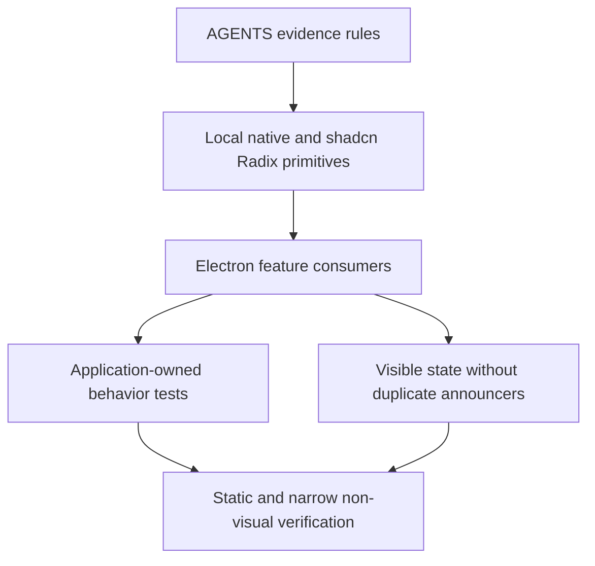

# Electron Accessibility Cleanup - Plan

## Goal Capsule

- **Objective:** Electron users keep clear keyboard and assistive-technology behavior without duplicate announcements, unexpected focus movement, or feature-level reimplementation of standard controls.
- **Means:** Remove unsupported custom accessibility protocols, move standard interaction behavior to local shadcn/Radix primitives, and test only application-owned semantics. (KTD2, KTD3, KTD5)
- **Authority:** Current user direction and `AGENTS.md` govern the work. Current code evidence can justify a local exception. Historical plans, tests, review comments, and release evidence are context only.
- **Execution profile:** Work only in the Electron renderer and its tests. Land behavior-preserving characterization updates with each implementation unit.
- **Stop conditions:** Stop if a proposed removal is supported by a current explicit product requirement, or if a composed primitive has a reproducible gap that the plan did not account for.
- **Tail ownership:** The implementation owner removes abandoned helpers, stale tests, and unused imports before declaring the plan complete.

---

## Product Contract

### Summary

The Electron renderer will use native HTML and local shadcn/Radix behavior for standard semantics, keyboard interaction, modal focus, and ordinary focus restoration.
Application code will retain only the accessibility behavior required by current product behavior or a reproducible composed-component gap.

### Problem Frame

Historical accessibility reviews added hidden live regions, multi-state announcement logic, manual roving focus, manual radio keyboard behavior, and tests that duplicate Radix contracts.
Many additions repeat information already present in visible titles, descriptions, progress, status text, or focused controls.
The extra protocols increase maintenance cost and can cause repeated announcements, unexpected focus changes, and future review-driven scope expansion.

### Requirements

**Durable governance**

- R1. `AGENTS.md` must state that historical plans, tests, accepted review comments, and release evidence do not independently establish a current product requirement.
- R2. `AGENTS.md` must require every new custom accessibility protocol to cite a current product requirement or a reproducible gap in the composed native or shadcn/Radix component.

**Renderer behavior**

- R3. Remove hidden live regions and multi-state announcers when the same decision-relevant state is already visible in the active surface.
- R4. Static empty states, visible progress rows, recording summaries, and operation messages must not use live semantics solely to repeat their visible text.
- R5. The Electron rail must use ordinary button Tab order while preserving tooltips, accessible names, click navigation, and `aria-current`.
- R6. The cloud-model selector must preserve controlled selection, disabled mutation state, row actions, and focus after deletion while delegating radio roles and keyboard behavior to a local shadcn/Radix primitive.
- R7. Stop-recording confirmation must preserve cancel, confirm, pending, single-flight, and terminal-close behavior while delegating modal focus containment, Escape, and ordinary trigger restoration to `AlertDialog`.
- R8. Application-owned focus restoration must remain local to route transitions, removed triggers, deleted rows, pane closure, and virtualized targets; ordinary Dialog closure and visible errors must use primitive or browser behavior.
- R9. Keyboard focus indicators in the affected Electron renderer surfaces must use the project thin-focus rule without changing geometry, color ownership, or layout.

**Testing and boundaries**

- R10. Tests must assert application-owned state, callbacks, labels, and deliberate Electron exceptions without reproducing the primitive library's complete interaction suite.
- R11. The work must remain inside `apps/desktop-electron/src/renderer`, its Electron tests, and the root `AGENTS.md`; shared contracts, Main, Preload, Flutter, mobile, copy, layout, and business workflows are out of scope.
- R12. Existing historical plans remain unchanged and are not treated as normative proof for retaining custom accessibility behavior.
- R13. Visual or browser-driven validation must run only with explicit authorization for the implementation task; without authorization, the implementation reports the UI gates as skipped.

### Key Decisions

- **Use the root instruction file for durable prevention.** Do not create a second accessibility policy document that can drift from `AGENTS.md`. Governs R1, R2.
- **Preserve product behavior while deleting unsupported protocols.** Historical acceptance of a review suggestion does not make its implementation permanent. Governs R3-R8, R12.
- **Keep the platform boundary narrow.** Electron renderer cleanup must not become mobile or shared-domain work. Governs R11.

### Acceptance Examples

- AE1. Covers R3, R4. Given processing, captions, recording, or model installation updates, when visible state changes, then the visible text and controls update without a hidden duplicate announcer.
- AE2. Covers R5. Given focus is on any rail button, when the user uses normal Tab navigation or activates a button, then DOM order and native button behavior apply while the selected destination exposes `aria-current="page"`.
- AE3. Covers R6. Given cloud profiles are available, when selection changes through the composed radio group, then exactly one profile is selected and edit or delete actions do not select their row.
- AE4. Covers R7. Given recording is active, when the user opens stop confirmation, then cancel performs no stop and confirm starts at most one stop operation; pending confirmation cannot close early or invoke the operation twice.
- AE5. Covers R8. Given a trigger remains mounted after an ordinary Dialog closes, then Radix restores focus without a feature override; given a row is deleted or a route target replaces its invoker, the nearest valid application target receives focus.
- AE6. Covers R10. Given a primitive already owns Space, arrow, Escape, focus trap, or ordinary trigger restoration, then Electron tests do not replay that primitive's complete contract.

### Scope Boundaries

**In scope**

- Electron renderer live semantics, focus overrides, manual keyboard protocols, local primitives, affected focus styles, and their tests.
- Two durable evidence rules in the root `AGENTS.md` Electron accessibility section.

**Outside this plan**

- User-facing copy, information architecture, layout, navigation destinations, business state machines, Main/Preload/shared contracts, Flutter, and mobile behavior.
- Rewriting completed plans or historical evidence.
- Visual alignment of `AlertDialog` with the Dialog mask or other shared surface redesign.
- Assistive-technology, browser, screenshot, golden, or visual validation without separate authorization.

### Success Criteria

- No application-owned hidden live region remains for processing progress, latest caption text, microphone failure, capture state, local-model progress, or static empty states covered by this plan.
- Standard radio, modal, and ordinary navigation behavior is owned by native HTML or local shadcn/Radix primitives.
- Valid application focus exceptions remain covered at their nearest feature boundary.
- The primitive test suite is materially smaller and contains only project-owned behavior and deliberate Electron deviations.
- Repository references show no accidental Electron accessibility change in mobile, Flutter, shared contracts, Main, or Preload.

---

## Planning Contract

### Key Technical Decisions

- KTD1. **Record evidence hierarchy in `AGENTS.md`.** (session-settled: user-approved — chosen over relying on the current conversation or a separate accessibility document: future agents need one durable authority at repository entry.) Historical artifacts are context, while a current requirement or reproducible composed-component gap is retention evidence. Governs R1, R2, R12.
- KTD2. **Make local shadcn/Radix the standard-interaction owner.** (session-settled: user-approved — chosen over retaining feature-level radio, modal, focus, and keyboard protocols: the primitives already own those contracts.) Add only the scoped `radix-nova` RadioGroup primitive required by the cloud-model consumer. Reuse the existing `AlertDialog` without visual restyling. Governs R5-R8, R11.
- KTD3. **Delete duplicate announcements instead of compressing them.** (session-settled: user-approved — chosen over keeping throttled or terminal-only hidden protocols: visible state already carries the user's decision-relevant information.) Remove the state, effects, timers, helpers, markup, and self-certifying tests together. Governs R3, R4.
- KTD4. **Retain only deterministic application focus exceptions.** Preserve route/detail transitions, pane closure, deleted-row fallback, and virtualized search targets. Remove ordinary Dialog close overrides and unconditional error or embedded-heading focus jumps without current requirement evidence. Governs R8.
- KTD5. **Test ownership rather than upstream behavior.** (session-settled: user-approved — chosen over preserving broad primitive interaction tests: Radix behavior is upstream-owned and duplicated tests turn historical assumptions into local requirements.) Consumer tests cover controlled state, callbacks, pending guards, labels, and Electron-specific deviations. Governs R10.
- KTD6. **Keep focus styling scoped and static-verifiable.** Change only affected `focus-visible:ring-2` interaction classes to the project thin indicator. Do not change decorative rings, dimensions, surfaces, or layout. Governs R9, R11, R13.

### High-Level Technical Design

The ownership direction is one-way.
Features provide visible content, controlled state, and business callbacks.
Primitives provide standard roles, keyboard behavior, modal focus, and ordinary restoration.
Tests stop at the nearest application-owned boundary.

### Sequencing

1. Land the durable evidence rules before changing code.
2. Add the RadioGroup primitive before removing the cloud-model manual protocol.
3. Migrate stop confirmation before deleting its inline focus and Escape handling.
4. Remove duplicate announcers and unsupported focus overrides with their feature tests.
5. Contract the primitive suite and complete reference searches after feature migrations settle.

### Risks & Mitigations

- **Async AlertDialog closure:** `AlertDialogAction` can close before an asynchronous stop finishes. Keep the Dialog controlled, reject closure while pending, and let capture terminal state close it.
- **Nested cloud-model actions:** Edit and delete controls must not select the radio row. Keep row actions outside the primitive item activation boundary and prove callback isolation.
- **Over-deletion of focus behavior:** Route, deleted-trigger, pane, and virtualized-target focus have current application evidence. Preserve them and restrict removal to ordinary primitive behavior or unsupported focus jumps.
- **Historical-plan conflict:** Older plans require roving keys or live announcements. Do not edit those artifacts; cite this plan and current `AGENTS.md` as the active implementation authority.
- **Visual scope creep:** Reusing `AlertDialog` can expose existing mask differences. Do not restyle the primitive in this plan.
- **Unverifiable visual state:** Thin-focus edits cannot receive visual validation without authorization. Limit changes to explicit class substitutions and report the UI gates as skipped.

### Sources & Research

- `AGENTS.md` defines current Electron primitive ownership, custom accessibility evidence, thin focus, scope boundaries, and visual-validation policy.
- `apps/desktop-electron/src/renderer/components/ui/dialog.tsx`, `alert-dialog.tsx`, and `modal-coordinator.tsx` establish current modal ownership.
- `apps/desktop-electron/src/renderer/features/settings/ai-settings-feature.tsx` contains the only feature-level manual radio protocol.
- `apps/desktop-electron/src/renderer/features/audios/audio-route-feature.tsx` and `features/captions/caption-workspace.tsx` contain the largest hidden announcement protocols.
- `docs/solutions/architecture-patterns/desktop-first-workstation-boundaries.md` keeps Electron composition inside `apps/desktop-electron`; it provides no evidence that historical accessibility protocols remain required.

---

## Implementation Units

### U1. Persist the accessibility evidence rules

- **Goal:** Prevent old plans, tests, and accepted reviews from silently becoming permanent accessibility requirements.
- **Requirements:** R1, R2, R12; KTD1.
- **Dependencies:** None.
- **Files:**
  - Modify: `AGENTS.md`
- **Approach:** Add the historical-evidence rule and the custom-protocol evidence rule to the existing Electron accessibility section. Keep the wording Electron-specific and do not create a separate policy file.
- **Patterns to follow:** The current evidence, primitive-ownership, scope-control, and testing bullets in `AGENTS.md`.
- **Test scenarios:** Test expectation: none -- this unit changes repository instructions only.
- **Verification:** Inspect the diff and search the Electron accessibility section for contradictions or duplicate rules.

### U2. Remove duplicate live semantics and announcement state

- **Goal:** Keep visible state while deleting hidden or duplicate announcements and their state machinery.
- **Requirements:** R3, R4, R10, R11; KTD3, KTD5.
- **Dependencies:** U1.
- **Files:**
  - Modify: `apps/desktop-electron/src/renderer/features/audios/audio-route-feature.tsx`
  - Modify: `apps/desktop-electron/src/renderer/features/captions/caption-workspace.tsx`
  - Modify: `apps/desktop-electron/src/renderer/features/capture/capture-workspace.tsx`
  - Modify: `apps/desktop-electron/src/renderer/features/settings/local-models-feature.tsx`
  - Modify: `apps/desktop-electron/src/renderer/components/ui/empty-state.tsx`
  - Modify: `apps/desktop-electron/tests/unit/renderer/audio_route_test.tsx`
  - Modify: `apps/desktop-electron/tests/unit/renderer/import_processing_test.tsx`
  - Modify: `apps/desktop-electron/tests/unit/renderer/caption_workspace_test.tsx`
  - Modify: `apps/desktop-electron/tests/unit/renderer/capture_workspace_test.tsx`
  - Modify: `apps/desktop-electron/tests/e2e/capture_renderer_flow_test.tsx`
  - Modify: `apps/desktop-electron/tests/visual/renderer-shell.visual.spec.ts`
- **Execution note:** Remove each announcer together with its timer, state, helper, and direct test dependency. Preserve visible business assertions before deleting role-based selectors.
- **Approach:**
  1. Delete processing and caption hidden announcers, including throttling and transition helpers.
  2. Remove the hidden microphone failure announcement while retaining Dialog title, description, and the visible manual-path alert.
  3. Render capture pending operation text only while it is visible. Remove live semantics from current-capture content without removing status text, elapsed time, or controls.
  4. Remove `aria-live` from the local-model operation row and remove status semantics from the static EmptyState primitive.
  5. Replace affected tests with visible state, region, title, progress, and callback assertions. Do not replace removed semantics with a new ARIA protocol.
- **Patterns to follow:** Visible state and native headings in the same feature files; `Progress` for bounded values; Dialog title and description for modal failure context.
- **Test scenarios:**
  - Covers AE1. A running processing task updates visible phase and progress without rendering the named hidden processing announcement.
  - Covers AE1. A new caption snapshot updates the visible draft while preserving session and generation fencing without a hidden latest-caption node.
  - Microphone failure renders one Dialog title and description, plus the manual settings path only when applicable.
  - Capture start and stop pending states remain visible while busy; terminal state remains visible in the current-recording region without a named live status.
  - Local-model progress retains phase text, percentage, progress value, cancellation, and error behavior without live semantics on the row.
  - Empty states remain discoverable by their visible heading after the generic status role is removed.
- **Verification:** No targeted file retains the removed announcer helpers, labels, timers, or role-based test selectors. Visible business state and callback tests remain intact.

### U3. Move cloud-model selection to a local RadioGroup primitive

- **Goal:** Preserve cloud-model selection behavior while removing the feature-level radio keyboard implementation.
- **Requirements:** R6, R8, R10, R11; KTD2, KTD4, KTD5.
- **Dependencies:** U1.
- **Files:**
  - Create: `apps/desktop-electron/src/renderer/components/ui/radio-group.tsx`
  - Modify: `apps/desktop-electron/src/renderer/features/settings/ai-settings-feature.tsx`
  - Modify: `apps/desktop-electron/tests/unit/renderer/ai_settings_test.tsx`
  - Modify: `apps/desktop-electron/tests/unit/renderer/ui_primitives_test.tsx`
- **Approach:**
  1. Add only the scoped official `radix-nova` RadioGroup structure and required Nova recipe classes. Use the existing `radix-ui` dependency and local primitive conventions.
  2. Bind the cloud-model list to controlled selected profile state and the existing selection callback.
  3. Keep edit and delete actions outside radio activation so their callbacks never select the row.
  4. Preserve mutation disabling and the existing deterministic focus fallback after deletion.
  5. Remove manual roles, `tabIndex`, key handlers, DOM queries, and feature-owned focus movement for radio traversal.
- **Patterns to follow:** `components.json`, `components/ui/select.tsx`, `components/ui/checkbox.tsx`, and the existing controlled Radix wrappers.
- **Test scenarios:**
  - Covers AE3. Selecting an enabled profile calls the existing API once with the profile ID and current revision, then reflects the controlled selected state.
  - Mutation-pending state prevents another selection request.
  - Editing or deleting a profile does not call the selection API.
  - Deleting the focused profile moves focus to the next row, previous row, or add action when no rows remain.
  - The primitive test covers project-owned value forwarding and thin-focus classes without replaying the full Radix arrow or Space contract.
- **Verification:** The feature contains no manual radio role, roving `tabIndex`, arrow-key handler, or radio DOM query. Selection and row-action tests pass at the consumer boundary.

### U4. Delegate navigation and modal focus to standard owners

- **Goal:** Remove manual standard-interaction code while preserving application state transitions and destructive-action fencing.
- **Requirements:** R5, R7, R8, R10, R11; KTD2, KTD4, KTD5.
- **Dependencies:** U1.
- **Files:**
  - Modify: `apps/desktop-electron/src/renderer/components/nav-main.tsx`
  - Modify: `apps/desktop-electron/src/renderer/features/capture/capture-workspace.tsx`
  - Modify: `apps/desktop-electron/src/renderer/features/audio-ai/audio-ai-feature.tsx`
  - Modify: `apps/desktop-electron/tests/e2e/sidebar_navigation_test.ts`
  - Modify: `apps/desktop-electron/tests/unit/renderer/capture_workspace_test.tsx`
  - Modify: `apps/desktop-electron/tests/unit/renderer/audio_ai_test.tsx`
- **Execution note:** Characterize business callbacks and pending guards before replacing inline stop confirmation. Do not encode Radix focus or Escape behavior as feature requirements.
- **Approach:**
  1. Remove rail button refs, roving state, forced `tabIndex`, and arrow/Home/End handlers. Preserve DOM order, native buttons, tooltips, accessible names, click navigation, and current-page state.
  2. Replace inline stop confirmation with the existing controlled AlertDialog. Keep stop single-flight and prevent pending dismissal without restyling the primitive.
  3. Remove the cloud-consent `onCloseAutoFocus` override because its trigger remains mounted.
  4. Remove unconditional capture error and embedded setup-title focus jumps when no current requirement or invalid-target condition exists.
  5. Preserve App route/detail focus, pane trigger restoration, settings target focus, deleted-profile fallback, audio return focus, and virtualized search-result focus.
- **Patterns to follow:** The AI-settings controlled delete AlertDialog; root modal registration; current App route and pane focus exceptions.
- **Test scenarios:**
  - Covers AE2. Rail buttons remain in primary-then-footer DOM order, expose tooltips and current-page state, and invoke navigation without custom roving attributes.
  - Covers AE4. Canceling stop confirmation performs no capture command.
  - Covers AE4. Confirming stop invokes one command, disables repeated confirmation while pending, and closes only after cancellation or capture state makes the confirmation obsolete.
  - Covers AE5. Canceling ordinary cloud consent leaves business state unchanged without a feature-owned close-focus callback.
  - A capture error remains visibly associated with the recording surface without moving focus away from the user's current control.
- **Verification:** Feature code contains no removed navigation protocol, stop-confirmation focus handler, consent close-autofocus override, or unsupported error focus effect. Application-owned focus exceptions remain present.

### U5. Apply the thin-focus rule to remaining affected surfaces

- **Goal:** Align remaining keyboard focus indicators with the Electron thin-focus rule without visual redesign.
- **Requirements:** R9, R11, R13; KTD6.
- **Dependencies:** U1, U3, U4.
- **Files:**
  - Modify: `apps/desktop-electron/src/renderer/components/ui/sidebar.tsx`
  - Modify: `apps/desktop-electron/src/renderer/features/audios/audio-workspace-feature.tsx`
  - Modify: `apps/desktop-electron/src/renderer/features/captions/caption-workspace.tsx`
  - Modify: `apps/desktop-electron/src/renderer/features/capture/capture-workspace.tsx`
  - Modify: `apps/desktop-electron/tests/unit/renderer/ui_primitives_test.tsx`
- **Approach:** Change only keyboard `focus-visible:ring-2` interaction classes in the confirmed scope to the project thin ring. Do not alter decorative ring classes, hit areas, surfaces, colors, radii, or layout.
- **Patterns to follow:** Existing `focus-visible:ring-1` classes in Button, Input, Checkbox, Switch, Select, and the new RadioGroup primitive.
- **Test scenarios:**
  - Affected Sidebar interaction slots expose a thin focus class and keep their dimensions and state classes.
  - Audio workspace, caption reading region, and capture error surface retain keyboard focusability only where the underlying interaction still requires it.
  - Decorative avatar or surface rings remain unchanged.
- **Verification:** A scoped reference search finds no `focus-visible:ring-2` in the affected interaction surfaces and shows no unrelated ring substitutions.

### U6. Contract renderer tests to application-owned behavior

- **Goal:** Remove primitive-library duplication and stale historical selectors after all feature migrations settle.
- **Requirements:** R10-R13; KTD1, KTD5, KTD6.
- **Dependencies:** U2, U3, U4, U5.
- **Files:**
  - Modify: `apps/desktop-electron/tests/unit/renderer/ui_primitives_test.tsx`
  - Modify: `apps/desktop-electron/tests/unit/renderer/ai_settings_test.tsx`
  - Modify: `apps/desktop-electron/tests/unit/renderer/audio_ai_test.tsx`
  - Modify: `apps/desktop-electron/tests/unit/renderer/audio_route_test.tsx`
  - Modify: `apps/desktop-electron/tests/unit/renderer/caption_workspace_test.tsx`
  - Modify: `apps/desktop-electron/tests/unit/renderer/capture_workspace_test.tsx`
  - Modify: `apps/desktop-electron/tests/unit/renderer/import_processing_test.tsx`
  - Modify: `apps/desktop-electron/tests/e2e/sidebar_navigation_test.ts`
  - Modify: `apps/desktop-electron/tests/e2e/capture_renderer_flow_test.tsx`
  - Modify: `apps/desktop-electron/tests/visual/renderer-shell.visual.spec.ts`
- **Approach:**
  1. Keep project recipe pins, controlled-value forwarding, modal coordinator, application blocker, Sidebar persistence deviations, multi-thumb forwarding, and other deliberate Electron exceptions.
  2. Remove full Popover, DropdownMenu, Select, Checkbox, Switch, Slider, Dialog, Sheet, and ordinary focus-restoration interaction replays when Radix or native HTML owns the behavior.
  3. Keep consumer tests for callbacks, pending fences, visible state, labels, controlled selection, and deliberate focus fallbacks.
  4. Replace every stale role or hidden-announcer selector. Do not introduce substitute ARIA solely to satisfy an old test.
- **Patterns to follow:** The nearest feature test that asserts business callbacks and visible outcomes rather than internal primitive behavior.
- **Test scenarios:**
  - Covers AE6. Each retained primitive test names a project-owned class, prop-forwarding behavior, modal-coordinator rule, or explicit Electron exception.
  - Removed announcers and roving protocols have no remaining source, test, visual selector, or packaged-smoke reference.
  - Application blocker tests still prove non-dismissible behavior and discarded background navigation.
  - Route, pane, deleted-row, and virtualized-target focus tests remain at their feature boundaries.
- **Verification:** The primitive suite is smaller, all retained cases map to an active project rule, and reference searches find no stale requirement names from removed protocols.

---

## Verification Contract

The implementation task must use the lightest non-visual evidence allowed by `AGENTS.md` unless the user separately authorizes visual validation for that task.

| Gate | Applies to | Done signal |
| --- | --- | --- |
| Plan and instruction consistency review | U1 | `AGENTS.md`, this plan, and affected references have no contradictory evidence hierarchy or scope rule. |
| `bunx vitest run tests/unit/renderer tests/e2e/sidebar_navigation_test.ts tests/e2e/capture_renderer_flow_test.tsx` from `apps/desktop-electron` | U2-U6 | Updated feature and primitive tests pass without launching Electron, a browser, or a visual harness. |
| `bun run format:check`, `bun run lint`, and `bun run typecheck` from `apps/desktop-electron` | U2-U6 | Formatting, lint, and TypeScript checks pass for the final code state. |
| Scoped `rg` reference audit | U2-U6 | Removed announcers, manual protocols, stale labels, broad primitive assertions, and thick affected focus classes have no remaining active references. |
| `bun run check:ui:quick` and final `bun run check:ui` | U2-U6 | Run only after explicit visual-validation authorization for the implementation task; otherwise skip both and report that authorization was not granted. |
| UI watcher, browser, screenshot, golden, and assistive-technology execution | U2-U6 | Do not run without explicit authorization for the implementation task. |

`bun run check:code` is not the verification lane for this Renderer UI and interaction refactor.
The full repository gate and Electron release lane are out of scope.

---

## Definition of Done

- U1 is complete when the root Electron accessibility rules distinguish current requirement evidence from historical artifacts and review history.
- U2 is complete when targeted visible behavior remains and the covered duplicate announcers, timers, roles, and hidden nodes are absent with no stale selectors.
- U3 is complete when cloud-model selection uses the local RadioGroup primitive and feature code no longer implements radio roles or keyboard traversal.
- U4 is complete when the rail uses native button order, stop confirmation uses controlled AlertDialog behavior, and unsupported focus overrides are removed while valid local exceptions remain.
- U5 is complete when only the affected keyboard focus indicators use the thin rule and no decorative or layout styling changed.
- U6 is complete when retained tests map to application-owned behavior or deliberate Electron deviations and primitive-library interaction duplication is removed.
- All required non-visual static checks and targeted tests pass on the final code state.
- Visual and browser-driven gates are either explicitly authorized and passed once, or explicitly reported as skipped.
- No files outside the confirmed Electron renderer, Electron tests, and root `AGENTS.md` scope changed.
- No user-facing copy, layout, navigation destination, business contract, shared package, Flutter, or mobile behavior changed.
- No abandoned helper, timer, focus state, stale import, obsolete test utility, or experimental migration code remains in the diff.
