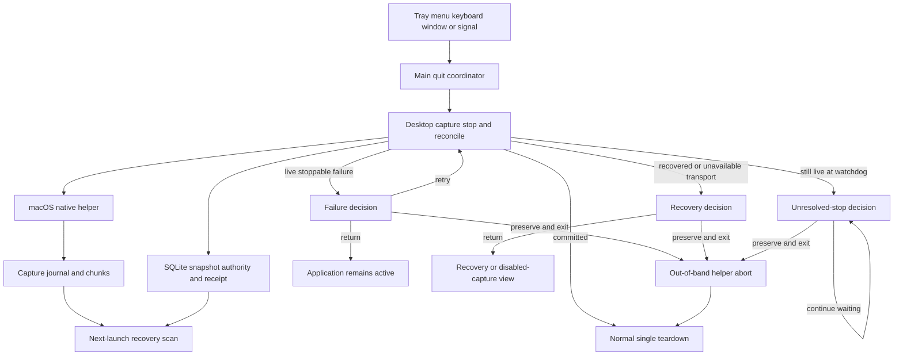

# Electron Recording Quit Recovery - Plan

## Goal Capsule

| Field | Contract |
| --- | --- |
| Objective | A desktop user can always leave Voice2Text after a recording stop failure without deleting recoverable recording data or entering a repeated quit loop. |
| Means | Add one Main-owned quit coordinator, reconcile uncertain stop outcomes before declaring failure, and provide a recovery-preserving helper termination path. (KTD1–KTD5) |
| Authority | Electron Main owns application exit and durable capture publication. The native journal owns recoverable audio evidence. SQLite stop receipts own committed completion. Renderer surfaces present decisions but does not own lifecycle truth. |
| Execution profile | Build characterization tests first. Correct recovery markers and stop reconciliation before adding the fallback exit path. Then update Renderer guidance and cross-entry verification. |
| Stop conditions | Stop and reassess if recovery-preserving exit requires deleting capture files, fabricating a completed stop receipt, weakening journal validation, or changing the mobile recording contract. |
| Tail ownership | This plan covers Electron Main, Renderer capture failure guidance, the macOS native helper process boundary, capture persistence, and their tests. It excludes mobile, unrelated recording-page layout, and release-candidate production. |

---

## Product Contract

### Summary

Voice2Text keeps the existing safety-first quit confirmation while recording. A successful stop still commits the recording before teardown. If stopping fails after reconciliation, a second decision lets the user return to the app, retry, or exit while preserving the session for recovery on the next launch. If the stop call is still unresolved at the quit watchdog, the safe choices are to keep waiting or preserve recovery data and exit; the app must not pretend the blocked capture queue is usable. Every application quit entry uses the same state machine and cannot create overlapping stop attempts or dialogs.

### Problem Frame

Every normal quit entry currently reaches `app.quit()` and the same `before-quit` handler. `prepareCaptureForQuit()` returns the same false value when the user chooses to continue and when stop-and-save fails. The caller resets its teardown promise in both cases, so another quit attempt repeats the same failing stop indefinitely.

The current fallback cannot rely on ordinary helper shutdown. `MacOSNativeHelperSession.close()` waits for its command queue, while a helper invocation may wait for hours. A hung stop can therefore block both recording completion and teardown.

Recovery also has an existing marker inconsistency. Native finalize failures can return `recoverable` while still assigning `recordingSha256`. Recovery queries exclude rows with that marker, and current snapshot updates use `COALESCE`, so restart reconciliation cannot clear the incorrect value. A quit fallback that ignores this defect could exit successfully but hide the recording from recovery.

### Key Decisions

- **A stop failure offers a recovery-preserving exit.** (session-settled: user-approved — chosen over discarding recording data or blocking application exit forever: recoverable data must remain available on the next launch.) Governs R3–R7, R10.
- **The first quit dialog remains safety-first.** The default and cancel actions continue recording; recovery-preserving exit appears only after a reconciled stop failure or an unresolved-stop watchdog. Governs R1–R4.
- **Recovery exit does not mean successful save.** The UI and durable state must distinguish committed recording data from material that still requires recovery. Governs R5–R8.

### Requirements

**Quit decisions and lifecycle**

- R1. Quitting during recording, pause, or a live partial capture must retain the current initial confirmation, with continue recording as the default and cancel action.
- R2. Choosing stop-and-exit must join or start one session-scoped stop attempt. Normal teardown requires confirmed durable terminal capture; the only exception is the distinct recovery-preserving exit governed by R5–R6.
- R3. A stop error must undergo bounded authoritative reconciliation before it is classified as failure. A command failure on a still-live, stoppable native session offers return-to-app, retry-stop, and recovery-preserving-exit. A transport-loss recovery that yields recoverable or failed authority offers return-to-recovery-view or recovery-preserving-exit, with no retry against the replaced session. If authority cannot be reconstructed, the safe return leads to a disabled capture/recovery view and recovery-preserving exit remains available; neither path claims a usable native session. If the stop is still unresolved when the initial 15-second watchdog expires, the decision offers continue-waiting or recovery-preserving-exit only; return and retry remain unavailable while the original capture queue is blocked.
- R4. Repeated quit events while a quit decision is active must reuse the same coordinator state and must not enqueue another stop, create another dialog, or start teardown twice.
- R5. Recovery-preserving exit must stop application publication and native capture ownership without calling discard, deleting the capture workspace, or creating a completed stop receipt.
- R6. Recovery-preserving exit must start one absolute five-second deadline immediately after latching the exit, bypass a blocked helper command queue, complete only the minimum actions required to preserve existing recovery evidence, and call a non-reentrant final exit when the deadline expires even if helper abort or another teardown promise never settles.
- R7. Tray quit, application menu or keyboard quit, non-macOS last-window quit, and termination signals must use the same Main-owned lifecycle policy. An interactive quit activates the application and parents the decision to an available window; if no window exists, Main presents a visible application-modal decision. Non-interactive termination uses a bounded stop attempt followed by recovery-preserving exit without waiting for a dialog.

**Capture truth and recovery**

- R8. A rejected or lost stop response must be reconciled against the authoritative native snapshot before it is classified as a failure. Transport loss must recreate an equivalent-capability native session before recovery inspection; command-level rejection may reuse the existing session.
- R9. A completed or terminal partial snapshot with valid authority must produce one durable stop receipt and allow normal exit even if the original stop response was lost.
- R10. A recoverable or failed snapshot must keep `recordingSha256` null, retain its journal hash when available, and remain visible to the existing recovery workflow after restart.
- R11. Startup reconciliation must repair only historical recoverable or failed rows proven inconsistent by state, absence of a valid stop receipt, and validated journal authority. Unknown or historically legitimate combinations must remain unchanged and be counted in privacy-safe diagnostics.
- R12. Formal transcript handoff remains separately retryable and must not turn an already committed recording stop into an exit failure.

**User feedback**

- R13. A failed in-workspace stop must unlock retry and show action-specific recovery guidance rather than the generic recording-operation fallback.
- R14. User-visible diagnostics may expose only the stop-specific safe fallback and local guidance; they must not expose paths, session identifiers, hashes, device identifiers, helper nonces, raw stderr, or an internal error taxonomy that does not change the user's available actions.
- R15. The existing stop confirmation, focus behavior, single-submit guard, recovery dialog, and current unfinished recovery-dialog edits must remain intact unless this contract changes them explicitly.
- R16. Every interactive quit attempt carries an intent generation. A terminal result arriving after a user decision may refresh authoritative capture state, but it may trigger teardown or exit only when it still belongs to the active quit generation.
- R17. Every post-stop decision must state that saving has not completed and what its safe return can do. For a live-session failure, return-to-app is the default focus and the Escape/window-close action. For recovered or unavailable transport state, the equivalent safe action returns to the recovery/disabled-capture view. For an unresolved stop, continue-waiting owns those safe interactions. Recovery-preserving exit is never the default keyboard action. While stopping or retrying, one visible progress state disables duplicate submission without stacking dialogs.

### Key Flows

- F1. **Normal committed quit**
  - **Trigger:** The user quits while a stoppable capture is active.
  - **Steps:** Main confirms intent, joins or starts the stop, reconciles the returned terminal state, persists authority and one stop receipt, tears down resources once, and exits.
  - **Outcome:** The recording is committed and the process closes without a second dialog.
  - **Covered by:** R1, R2, R4, R8, R9, R12.
- F2. **Stop failure followed by retry**
  - **Trigger:** Stop rejects, the original native session remains live and stoppable, and bounded reconciliation confirms that it did not commit.
  - **Steps:** Main shows the failure decision. Retry starts one new valid stop attempt only after the prior command is known to be terminal. The same dialog shows progress while retrying.
  - **Outcome:** A later durable stop exits normally; a repeated failure returns to the same decision without stacking operations.
  - **Covered by:** R2–R4, R8, R9, R16, R17.
- F3. **Transport loss and recovered authority**
  - **Trigger:** Stop loses transport and a recreated native session finds recoverable or failed authority.
  - **Steps:** Main publishes the recovered authoritative state and offers return-to-recovery-view or recovery-preserving-exit. It does not offer retry because the recreated controller does not own the old active session.
  - **Outcome:** The user may inspect the existing recovery workflow or close the app without a session-mismatch loop.
  - **Covered by:** R3, R5, R8, R10, R11.
- F4. **Recovery-preserving exit**
  - **Trigger:** The user selects recovery-preserving exit after stop failure or unresolved-stop timeout, or a non-interactive termination cannot commit within its deadline.
  - **Steps:** Main latches the exit, invalidates the active quit generation, suppresses new capture publications, terminates the helper out of band, skips blocked capture-queue draining, preserves the already-durable workspace, and gives all remaining best-effort cleanup one shared five-second deadline before calling the non-reentrant exit primitive.
  - **Outcome:** The next launch scans the intact workspace and presents the session as recoverable or failed.
  - **Covered by:** R3–R7, R10, R11.
- F5. **Return to application**
  - **Trigger:** The user cancels the initial quit dialog or returns after a reconciled, terminal stop failure. This action is not offered while the original stop call remains unresolved.
  - **Steps:** The coordinator invalidates the quit generation, releases quit ownership, and keeps the authoritative capture state visible. Late results may refresh capture state but cannot exit the application.
  - **Outcome:** The application remains usable and a later stop or quit starts a new single-flight intent.
  - **Covered by:** R1, R3, R4, R13, R16.
- F6. **Unresolved stop at watchdog**
  - **Trigger:** The initial quit watchdog expires while the native stop is still running.
  - **Steps:** Main keeps ownership of the original single-flight stop and shows continue-waiting or recovery-preserving-exit. Continue-waiting keeps the same decision visible, replaces the continue action with a non-repeating progress state, and leaves recovery-preserving exit available; it never restarts the expired watchdog or opens another dialog. If an authoritative completed or terminal partial result arrives before the user exits, Main disables the fallback actions and follows the committed path once.
  - **Outcome:** No retry is queued behind a dead request, no false return exposes a blocked capture controller, and a late success cannot race a user decision.
  - **Covered by:** R3, R4, R6, R8, R16, R17.

### Acceptance Examples

- AE1. **Covers R1–R4.** Given an active recording, when the user cancels the first quit dialog, then no stop or teardown runs and later controls remain usable.
- AE2. **Covers R2, R4, R9, R12.** Given stop durably commits, when several quit events arrive, then one stop receipt and one teardown occur and formal transcript failure does not prevent exit.
- AE3. **Covers R3, R4, R8.** Given the stop response is lost but refresh reports a valid completed capture, when the watchdog or transport error is observed, then Main reconciles the commit and exits without showing recovery exit as necessary.
- AE4. **Covers R3–R6, R10.** Given stop never resolves, when the user chooses recovery-preserving exit, then the helper kill is issued without waiting for its queue, no discard occurs, and the process reaches exit within five seconds even if the abort promise never settles.
- AE5. **Covers R5, R10, R11.** Given a recoverable journal and an incorrect non-null completion marker, when the application restarts, then reconciliation clears the marker and the session appears in the recovery list.
- AE6. **Covers R8–R10.** Given one healthy track and one failed track, when stop completes as terminal partial capture, then validated chunks are committed once; open tail material is never promoted to completed authority.
- AE7. **Covers R13–R15.** Given an in-workspace stop fails, when the error appears, then retry unlocks and the message explains the recovery option without exposing raw native details.
- AE8. **Covers R3, R4, R16, R17.** Given stop remains unresolved at 15 seconds, when the watchdog decision opens, then retry and return are absent; continue waiting retains the original operation, and a late committed result closes the decision and exits at most once.
- AE9. **Covers R5, R6.** Given any non-essential teardown promise never resolves, when recovery-preserving exit begins, then the already-durable workspace is retained and the non-reentrant final exit runs no later than five seconds after best-effort teardown starts.
- AE10. **Covers R3, R4, R7, R17.** Given an unresolved stop and no visible window, when quit is triggered from the tray, then the application activates one visible application-modal decision with safe default focus; choosing continue waiting keeps recovery-preserving exit available without restarting the watchdog or stacking a dialog.
- AE11. **Covers R3, R8, R10.** Given transport loss and a recreated session that reports recoverable authority, when the decision appears, then retry is absent and returning opens the existing recovery view rather than exposing stale recording controls.

### Scope Boundaries

- Do not add a discard action to application quit.
- Do not reinterpret `journalSha256` as proof that the recording is committed.
- Do not redesign the capture page, footer, floating controller, or recovery dialog.
- Do not change Flutter or mobile recording behavior.
- Do not create release-candidate evidence or run packaged release preparation as part of routine implementation.

---

## Planning Contract

### Key Technical Decisions

- KTD1. **Use an explicit Main-owned quit result, phase machine, and generation.** Replace the boolean preparation result with `cancelled`, `committed`, and `recoverable-exit` outcomes. Track an `idle → confirming → stopping → live-failure-choice|recovered-choice|unresolved-choice → tearing-down → exiting` lifecycle. A generation token prevents a late result from an abandoned intent from causing exit. Only a cancelled initial dialog or a live-stoppable failure can return to active capture; transport recovery returns to the existing recovery or disabled-capture view. This implements R1–R7 and R16–R17.
- KTD2. **Extract the quit coordinator behind injected ports.** Keep Electron Main as the composition root, but move dialog, capture-stop, snapshot reconciliation, helper-abort, teardown, and exit orchestration into a directly testable module. `index.ts` owns event wiring only.
- KTD3. **Reconcile uncertain stop outcomes and report remaining capability.** Mirror the existing start/refresh recovery pattern in `DesktopCaptureService`: after command rejection, inspect native state on the current session; after transport loss, have the native-session owner terminate the dead session, recreate one with the same protocol capabilities, run recover/snapshot, and atomically replace the service port. Reconciliation returns authority plus `live-stoppable`, `recovered-terminal`, or `unknown` capability. Only `live-stoppable` may retry; a recreated controller does not adopt the old active session. Commit valid terminal authority once, persist recoverable truth when available, and report failure only when state cannot be established. This implements R3, R8, R9, and R12.
- KTD4. **Give recovery exit an out-of-band helper abort.** Add an idempotent session primitive that rejects current and queued invocations and terminates the child without awaiting the normal queue. Ordinary shutdown keeps graceful `close()` behavior. Recovery teardown invokes abort before touching `captureControlMutation`.
- KTD5. **Keep completion and recovery markers disjoint, with a proof-gated repair.** Native snapshots set `recordingSha256` only for completed or terminal partial authority. Startup repair first inventories existing state/hash/receipt combinations, validates journal authority, and clears the marker only for a recoverable or failed row with no valid stop receipt. Unknown combinations remain untouched and contribute only aggregate privacy-safe diagnostics. This implements R10 and R11.
- KTD6. **Use one stop-specific privacy-safe fallback.** After Main exhausts reconciliation, Renderer shows one action-specific Chinese fallback and never renders raw exception text. Add a shared error category only if an existing consumer-visible distinction changes the available action or guidance. This implements R13 and R14 without a one-consumer taxonomy.
- KTD7. **Separate the stop watchdog from the hard exit bound.** Make the initial 15-second watchdog an injectable, provisional constant and record aggregate outcome/latency buckets so it can be tuned against observed stop behavior. Recovery-preserving exit starts a separate absolute five-second deadline before helper abort; the deadline races abort and all remaining cleanup, then calls `app.exit()` exactly once rather than re-entering `before-quit`.
- KTD8. **Prove the forced-termination durability boundary.** Characterize chunk write, sync, atomic rename, journal append, and journal sync ordering with fault injection. The user promise covers only hash-validated material proven durable at the termination point; open or unverified tails remain quarantine-only recovery evidence.

### High-Level Technical Design

The diagrams are directional. They define responsibility and state boundaries, not implementation signatures.

```mermaid
stateDiagram-v2
  [*] --> Idle
  Idle --> Confirming: interactive quit with active capture
  Confirming --> Idle: continue recording
  Confirming --> Stopping: stop and exit
  Stopping --> TearingDown: durable terminal state
  Stopping --> FailureChoice: live stoppable failure
  Stopping --> RecoveredChoice: recovered or unavailable transport
  Stopping --> UnresolvedChoice: watchdog while request is live
  FailureChoice --> Idle: return to application
  FailureChoice --> Stopping: retry
  FailureChoice --> RecoveryExit: preserve and exit
  RecoveredChoice --> Idle: safe return to recovery view; capture disabled
  RecoveredChoice --> RecoveryExit: preserve and exit
  UnresolvedChoice --> UnresolvedChoice: continue waiting; retain recovery exit
  UnresolvedChoice --> TearingDown: late durable terminal state
  UnresolvedChoice --> RecoveryExit: preserve and exit
  RecoveryExit --> TearingDown: abort helper outside queue
  TearingDown --> Exiting: bounded cleanup
  Exiting --> [*]
```

### Sequencing

1. Establish characterization tests for marker semantics, response-loss reconciliation, and the current repeated-quit failure.
2. Correct native and repository recovery markers so preserved sessions remain discoverable.
3. Add stop reconciliation and the out-of-band helper abort.
4. Add the quit coordinator and connect every exit source.
5. Update Renderer error guidance and complete cross-layer regression coverage.

### Risks and Dependencies

- **Open partial audio:** Forced helper termination can leave a tail file. Existing recovery must continue to quarantine that tail and publish only hash-validated finalized chunks.
- **False recovery classification:** A lost response may follow a successful durable stop. Reconciliation must run before offering recovery exit, and late authority must be serialized against the active user decision.
- **Hidden historical sessions:** Incorrect completion markers may already exist. Startup repair must require recoverable or failed state, no valid stop receipt, and validated journal authority; unknown historical combinations remain untouched.
- **Teardown re-entry:** Electron can emit `before-quit` more than once. The exiting latch must make repeated events no-ops after teardown begins.
- **Crash-consistency boundary:** Direct helper termination is safe only for material already proven durable. Fault-injection tests must establish the write/sync/rename/journal ordering before the UI promises next-launch recovery.
- **User checkout changes:** `capture-workspace.tsx` and its tests already contain uncommitted recovery-dialog edits. Implementation must preserve those edits and add only scoped changes.

### Sources and Research

- `apps/desktop-electron/src/main/index.ts:2163` and `apps/desktop-electron/src/main/index.ts:4157` show the boolean quit preparation and resettable `before-quit` guard.
- `apps/desktop-electron/src/main/features/importing/macos_native_helper_client.ts:314` shows graceful close waiting for the command queue; line 441 contains the direct protocol close primitive.
- `packages/desktop_macos_native/Sources/CaptureCore/CaptureController.swift:655` shows stop finalization and the unconditional recording hash assignment.
- `apps/desktop-electron/src/main/storage/repositories/capture_repository.ts:336` shows recovery selection excluding rows with a recording hash.
- `docs/solutions/architecture-patterns/desktop-first-workstation-boundaries.md` establishes Electron Main as the composition root and requires separation between committed and recoverable data.
- `docs/plans/2026-09-04-feat-desktop-recording-detail-shell-plan.md` preserves the existing controlled stop confirmation and actionable failure placement.

---

## Implementation Units

### U1. Characterize quit and recovery failures

- **Goal:** Add failing tests that prove the current quit loop, unbounded helper close, uncertain stop response, and hidden recovery marker.
- **Requirements:** R2–R6, R8–R11.
- **Files:** `apps/desktop-electron/tests/unit/capture_lifecycle_policy_test.ts`, a new focused quit-coordinator test under `apps/desktop-electron/tests/unit/`, `apps/desktop-electron/tests/unit/macos_native_helper_client_test.ts`, `apps/desktop-electron/tests/e2e/macos_capture_flow_test.ts`, and `packages/desktop_macos_native/Tests/CaptureCoreTests/CaptureControllerTests.swift`.
- **Approach:** Use deterministic rejected and never-resolving stop fakes. Express only the desired post-fix behavior, confirm those assertions fail against the current implementation, and then keep them as regressions. Reuse temporary capture roots and in-memory or temporary SQLite fixtures.
- **Test scenarios:** Cancel leaves the app active; repeated quit stacks no work; stop rejection exposes exactly one recovery-preserving escape; a blocked helper queue cannot prevent bounded recovery exit; recoverable state with a completion marker becomes visible after proof-gated repair; response loss after native completion reconciles without a false failure decision.
- **Verification:** The new assertions fail for the expected reasons before implementation units U2–U4.

### U2. Correct recoverable authority markers

- **Goal:** Ensure any session preserved for recovery remains discoverable and is never represented as committed.
- **Requirements:** R5, R8–R11.
- **Files:** `packages/desktop_macos_native/Sources/CaptureCore/CaptureController.swift`, `packages/desktop_macos_native/Tests/CaptureCoreTests/CaptureControllerTests.swift`, `apps/desktop-electron/src/main/storage/repositories/capture_repository.ts`, and focused capture repository or macOS capture flow tests.
- **Approach:** Assign recording authority only after successful finalization into a completed or terminal partial state. Inventory historical state/hash/receipt combinations in fixtures and development data before codifying the repair predicate. Add a repository reconciliation write that clears an invalid marker only for recoverable or failed snapshots with no valid stop receipt and validated journal authority, without changing journal identity. Leave unknown combinations untouched and expose aggregate diagnostic counts. Add termination-point fault injection around chunk sync, atomic rename, journal append, and journal sync so recovery claims match proven durability.
- **Test scenarios:** Journal finalize failure returns recoverable with no recording hash; low-disk interruption does not create a completion marker; a proven-invalid historical row becomes visible after reconciliation; a recoverable or failed row with a valid receipt or unknown provenance remains unchanged; committed rows keep their hash; each forced-termination boundary publishes only synced, hash-validated chunks; repeated recovery stays idempotent.
- **Verification:** Swift CaptureCore tests and focused Electron capture persistence tests pass.

### U3. Reconcile stop outcomes and support out-of-band abort

- **Goal:** Convert ambiguous stop failures into either confirmed durable completion, confirmed recoverable state, or a bounded failure that the quit coordinator can act on.
- **Requirements:** R2, R5, R6, R8, R9, R12.
- **Files:** `apps/desktop-electron/src/main/domain/capture/desktop_capture_service.ts`, `apps/desktop-electron/src/main/features/importing/macos_native_helper_client.ts`, their existing unit tests, and `apps/desktop-electron/tests/e2e/macos_capture_flow_test.ts`.
- **Approach:** After a command-level stop error, attempt bounded native snapshot reconciliation on the live session. After transport loss, terminate the dead session, create a protocol-equivalent session through the existing session factory/owner, run recover/snapshot, and atomically replace the service port. Return the remaining lifecycle capability separately from authority; recreated sessions are never labeled stoppable because they do not own the old active session. Reuse authority validation and idempotent receipt persistence for terminal results. Persist recoverable truth without a stop receipt. Add a session abort that directly terminates the protocol process, rejects pending work, and does not wait for the serialized invoke queue.
- **Test scenarios:** Stop success writes one receipt; response loss plus a recreated session and completed snapshot writes one receipt; recreated sessions report terminal partial and recoverable states with no retry capability; a live command rejection retains retry capability; dead transport with failed reconnection reports unknown capability and bounded fallback; abort rejects active and queued calls promptly; repeated abort is harmless; graceful close remains unchanged.
- **Verification:** Focused helper-client, capture-service, and macOS flow tests pass without launching Electron UI.

### U4. Introduce the single-flight quit coordinator

- **Goal:** Make every quit source terminate deterministically through the same lifecycle state machine.
- **Requirements:** R1–R7, R12, R16–R17.
- **Files:** `apps/desktop-electron/src/main/domain/capture/capture_lifecycle_policy.ts`, a new coordinator module beside the capture lifecycle policy, `apps/desktop-electron/src/main/index.ts`, and new coordinator unit tests plus existing lifecycle wiring tests.
- **Approach:** Replace the boolean result with explicit outcomes, an internal phase latch, and one generation per quit intent. Inject dialog, app activation, stop/reconcile, abort, teardown, clock, and exit ports. Join a pending stop for the same session. Only a live-stoppable failure may return to active capture or retry; recovered-terminal authority may return to the recovery view; unknown capability always retains recovery-preserving exit. An unresolved watchdog may only continue waiting or preserve and exit. Continue waiting does not restart the watchdog: the same visible decision retains recovery exit while showing progress. Interactive quit activates the app, parents the dialog when possible, and otherwise uses one visible application-modal dialog. Main owns concise copy, action order, safe default focus, Escape/window-close behavior, and their tests. Serialize late terminal results with dialog actions, and let only the active generation cause teardown. On recovery exit, start the five-second deadline immediately after the synchronous publication-suppression latch, issue helper abort without awaiting it outside the deadline race, skip capture-mutation waits, and call `app.exit()` once when the shared deadline expires regardless of unsettled abort or cleanup promises.
- **Test scenarios:** Continue recording; visible stop progress; successful committed quit; live-session failure permits retry; recovered-terminal transport loss offers recovery view without retry; unknown capability retains recovery-preserving exit; unresolved watchdog with no return/retry action; continue waiting retains recovery exit without reopening or resetting a watchdog; retry after terminal failure then success; late success racing a fallback action; return invalidates the quit generation; recovery exit; repeated quit at every phase; quit during an existing Renderer or tray stop; foreground, background, and no-window dialog visibility/focus; safe default focus and Escape/window-close behavior for each decision; non-interactive signal fallback; abort promise or non-capture cleanup that never resolves still reaches final exit within five seconds; no path invokes discard.
- **Verification:** Coordinator tests assert one stop, one teardown, and one exit per intent. Source wiring tests prove all entry points use the coordinator.

### U5. Add actionable Renderer failure guidance

- **Goal:** Tell the user what can be done after stop failure without leaking native details or duplicating lifecycle ownership.
- **Requirements:** R13–R17.
- **Files:** `apps/desktop-electron/src/renderer/features/capture/capture-workspace.tsx`, `apps/desktop-electron/src/renderer/lib/user-facing-error.ts` only if the bounded category pattern is shared, relevant shared contract files if a typed category is required, and `apps/desktop-electron/tests/unit/renderer/capture_workspace_test.tsx`.
- **Approach:** Keep this unit limited to the in-workspace Renderer AlertDialog. Give `runExclusive` or the capture controller one stop-specific safe fallback after Main exhausts reconciliation, keep retryability tied to authoritative state, and clear stale errors when a later snapshot becomes terminal or recoverable.
- **Test scenarios:** In-workspace stop failure unlocks retry; guidance mentions retry and next-launch recovery; raw path and helper error text are absent; duplicate submit remains blocked; a later terminal snapshot closes the workspace confirmation; current recovery-dialog changes remain intact.
- **Verification:** Focused Renderer unit tests pass. Visual validation remains permission-gated.

### U6. Close cross-layer lifecycle coverage

- **Goal:** Prove the complete failure-to-exit-to-recovery journey and guard all exit entry points against regression.
- **Requirements:** R1–R17.
- **Files:** `apps/desktop-electron/tests/e2e/macos_capture_flow_test.ts`, `apps/desktop-electron/tests/unit/capture_smoke_main_wiring_test.ts`, and the narrowest existing lifecycle tests that own signal and process teardown behavior.
- **Approach:** Add deterministic integration coverage for failure and restart using temporary app data. Leave packaged-smoke expansion to a later explicit release-candidate request.
- **Test scenarios:** Stop failure then recovery exit then restart; zero finalized chunks remain recoverable without invented completion; healthy finalized chunks survive while the open tail is quarantined; the existing recovery Keep action later validates and publishes durable recording authority; tray, menu, window, and signal paths converge; evidence contains no sensitive identifiers.
- **Verification:** Focused non-visual tests and the Electron code gate pass. Packaged evidence is not added or run in this implementation task.

---

## Verification Contract

| Scope | Command or gate | Proves | Units |
| --- | --- | --- | --- |
| Native capture semantics | `swift test --package-path packages/desktop_macos_native` | Recoverable marker, finalize failure, crash-consistent chunk/journal ordering, and tail recovery | U1–U3 |
| Focused Electron behavior | `bunx vitest run tests/unit/capture_lifecycle_policy_test.ts tests/unit/macos_native_helper_client_test.ts tests/unit/renderer/capture_workspace_test.tsx tests/e2e/macos_capture_flow_test.ts` from `apps/desktop-electron` | Coordinator policy, helper abort, stop reconciliation, Renderer guidance, and recovery | U1–U6 |
| Electron Main and integration gate | `bun run check:code` from `apps/desktop-electron` | Main, shared contracts, storage, worker integration, formatting, lint, typecheck, and non-visual tests | U2–U6 |
| Electron UI gate | `bun run check:ui:quick` followed once by `bun run check:ui` from `apps/desktop-electron` | Renderer integration after copy/state changes | U5 |
| Visual/browser validation | Explicit user authorization required before any app launch, browser control, screenshot, golden, watcher, or visual suite | Visible dialog and recovery guidance | U5–U6 |
| Optional release follow-up | `VOICE2TEXT_RELEASE_VALIDATION=1 bun run check:release` from `apps/desktop-electron` only after a later explicit candidate request and any separately scoped packaged-smoke addition | Packaged regression evidence, outside this implementation task | Follow-up |

The UI gate and all visual/browser validation are skipped unless the user explicitly authorizes visual validation for the implementation task. Release evidence is a separately scoped follow-up and is not part of this implementation task.

---

## Definition of Done

- Every interactive quit source reaches one coordinator and cannot stack stop attempts, dialogs, teardown, or exit calls.
- Successful stop commits validated authority and exactly one durable stop receipt before normal teardown.
- Lost stop responses reconcile committed terminal truth before any recovery fallback is offered.
- A live-session stop rejection offers return, retry, or recovery-preserving exit; recovered or unavailable transport returns only to recovery/disabled capture; an unresolved-stop timeout offers continue waiting or recovery-preserving exit without queuing work behind the blocked request.
- Recovery exit never calls discard, never deletes the capture workspace, and bypasses a hung helper queue.
- Recoverable and failed sessions carry no completion marker and appear in the next-launch recovery workflow, including repaired historical rows.
- Renderer guidance is actionable, bounded, and free of raw native or filesystem details.
- The native test suite, focused Electron tests, and `bun run check:code` pass for the final code state.
- UI validation is either run under explicit authorization or recorded as skipped by policy; release evidence remains a separately scoped follow-up.
- The final diff preserves the user's pre-existing recovery-dialog changes and contains no abandoned experimental paths.
