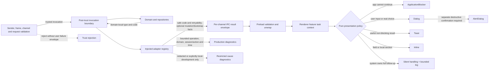
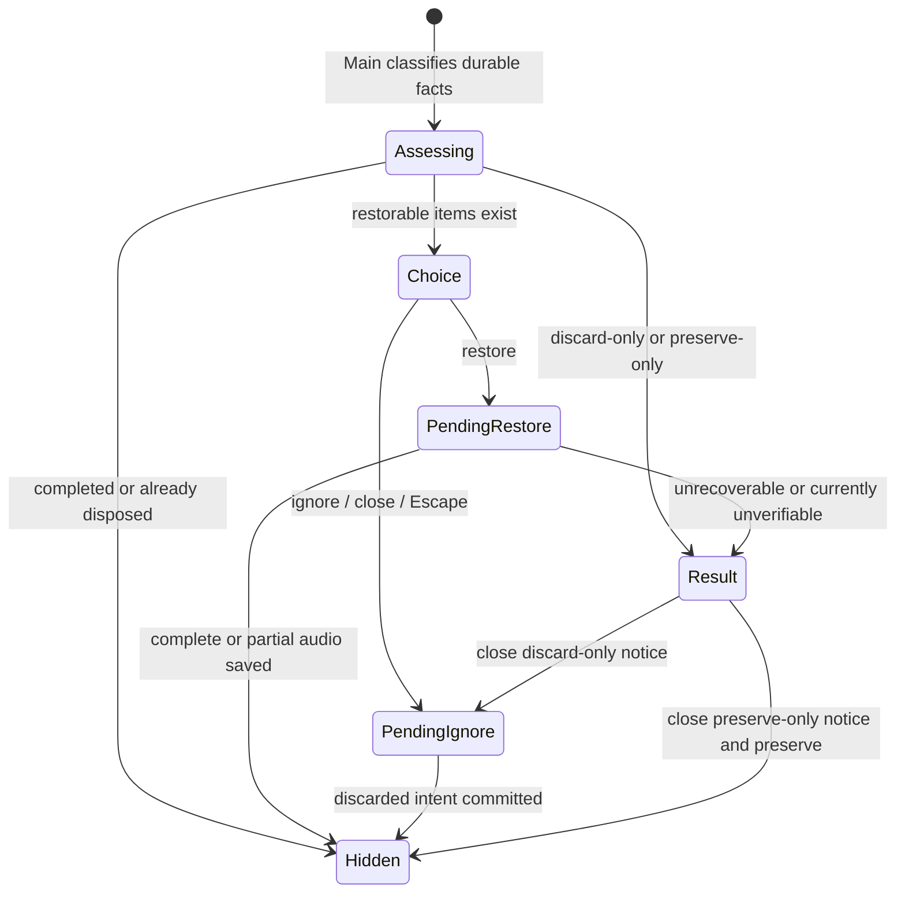

# Electron Error Presentation and Recovery - Plan

## Goal Capsule

| Field | Value |
| --- | --- |
| Objective | Electron 用户在录制恢复、停止保存及其他失败场景中，只在介入能改善结果时被要求操作；系统可以自行完成的后续处理保持静默、可诊断且不会阻止退出。 |
| Means | 建立类型化 IPC 失败契约与 Renderer 错误呈现策略，简化恢复流程，并把正常停止保存、异常恢复、原生会话重建和忽略后的清理收口到 Main。（KTD1-KTD9） |
| Authority | 当前 Electron 领域不变量与持久化数据是事实权威；本计划的 R-ID 定义产品行为；本地 shadcn/Radix `radix-nova` 原语定义弹窗、焦点与键盘行为。 |
| Execution profile | 先建立首批场景所需的失败传输与呈现基础；每个实施单元在修复前补上能复现问题的失败测试，并在同一单元内修绿；随后修复恢复数据语义，最后迁移主窗口、悬浮窗并收紧 `ApplicationBlocker`。 |
| Stop conditions | 不把零已完成分片直接判为无音频，不让正常停止或正常退出依赖重启恢复，不把系统可自行收尾的错误变成用户选项，不向 Renderer 暴露原始异常或私有路径，不用文案匹配决定错误类型，不扩大到 Flutter 或发布流程。 |
| Tail ownership | 本计划负责 Electron 运行时错误呈现与恢复闭环；遥测后台、崩溃上报、Flutter 错误体系、发布签名和远端交付留给后续工作。 |

---

## Product Contract

### Summary

本计划把 Electron 的错误反馈从各功能自行拼接横幅和兜底文案，收敛为一套按用户决策价值分级的职责体系：真正无法继续使用应用的故障使用 `ApplicationBlocker`；只有用户补充输入或作出真实选择才能继续的流程使用普通 `Dialog`；需要单独确认的破坏性动作使用 `AlertDialog`；对用户当前判断有价值的非阻塞结果使用 Toast；字段和局部区块问题继续就地 Inline 展示。用户无法改善且系统已有完整后续处理方式的错误静默处理，只写有界日志并完成后台或下次启动对账。

录制恢复将从 `ApplicationBlocker` 中迁出，成为独立流程弹窗。Main 进程明确告诉 Renderer 每条残留录制是“可以恢复”“确认无有效音频”还是“暂时无法验证”，Renderer 不再尝试一个注定失败的恢复操作，也不会把暂时无法验证的数据当作可删除数据。有可恢复数据时，Dialog 左侧显示无图标的默认样式“忽略”，右侧显示无图标的默认样式“恢复”；右上角关闭、Escape 与“忽略”对可丢弃目标执行同一个直接丢弃意图，不再叠加确认弹窗。系统完成受限扫描并确认不存在任何候选音频时只给出原因匹配的结果通知，关闭后执行静默清理；仍有候选数据或暂时无法验证时只隐藏通知并保留原始数据，直到证据变化或后续修复能力可以安全处理。

正常停止与正常退出不以恢复流程代替正常保存。二者复用同一个 Main single-flight 停止事务：普通停止在耐久保存完成后继续主窗口后续任务，真正的应用退出则等待同一事务达到耐久终态后再 teardown。15 秒 watchdog 只表示保存时间较长；只有 helper 已退出、传输断开、原生明确报告最终化失败，或以后有实测依据证明已经越过无进展的硬故障边界时，才进入异常对账和恢复。应用崩溃或用户强制退出导致当前进程无法继续时，才由下次启动恢复兜底。

同时，IPC 边界传递有界、可验证的失败信息，Main 保留可直接排查的诊断上下文，Renderer 只接收安全文案所需的代码和能力。主窗口与悬浮窗按同一策略审计，但悬浮窗因固定小尺寸保留受约束例外：暂停/继续失败使用紧凑的局部状态，停止后立即交接主窗口完成正常保存和后续任务。

### Problem Frame

当前开发数据库中存在 `finalized_chunk_count = 0` 的残留录制。`CaptureRepository.listRecoveries()` 会把它列为可恢复，而 `keepRecoveryAndReceipt()` 又会拒绝零分片记录。用户点击“恢复数据”后，Renderer 的通用异常兜底把真实原因替换成“录制操作未完成”，并在恢复弹窗内部以横幅展示。这同时造成三类错误：领域能力声明不真实、提示文案与用户动作不匹配、呈现层级与阻塞性不匹配。

恢复弹窗的打开状态还直接由 `recoveries.length` 推导。只要数据仍在，用户关闭后组件就可能再次打开；如果关闭手势同时触发丢弃或操作仍在 pending，恢复数据还可能被误删或产生重复请求。该结构也是“停止并保存后仍无法退出”一类循环问题的放大器：失败状态、窗口退出协调和数据生命周期没有清晰分离。

仓库其他 Electron 功能也广泛使用 `userFacingError()`、局部 `role="alert"` 横幅及字符串匹配。它们无法表达错误是否可重试、是否仍可继续、是否影响数据耐久性，也让同一类失败在不同页面得到不同反馈。因此本轮不能只改一个文案，而应补齐失败契约和呈现职责，再按风险逐项迁移。

### Key Decisions

- **session-settled: 保留 `ApplicationBlocker`，但只服务真正的应用级不可继续状态。** 它是本地语义封装，不是 shadcn 组件。Governs R1, R18.
- **session-settled: 只有用户介入能改善结果时才要求操作；系统有完整后续处理方式时静默收尾。** 流程输入/选择使用 Dialog，需要单独确认的破坏性动作使用 AlertDialog，有用的非阻塞结果使用 Toast，局部问题使用 Inline。Governs R2-R6.
- **session-settled: 恢复数据使用独立流程 Dialog，不再占用 `ApplicationBlocker`。** Governs R10-R17.
- **session-settled: 恢复 Dialog 显示无图标的“忽略”和“恢复”默认按钮；不默认聚焦按钮或关闭入口。** “忽略”、右上角关闭和 Escape 只提交当时可见的 `restorable` 与 `discard-only` 目标，不再二次确认；`preserve-only` 不删除，遮罩点击无副作用。Governs R12, R13.
- **session-settled: 正常停止和正常退出优先完成正常耐久保存，恢复只处理崩溃、强制退出或已明确无法继续正常保存的异常。** 15 秒仅是保存较慢的软提示阈值；先验证停止耗时和进展证据，再决定是否需要硬故障边界或动态公式。用户不参与无法改善结果的技术重试。Governs R14-R17, R21.
- **session-settled: 审计覆盖 Electron 主窗口和悬浮窗，不包含 Flutter。** Governs R19-R22.

### Requirements

#### Error classification and ownership

- R1. `ApplicationBlocker` 只在应用整体无法安全继续、用户无法通过关闭当前流程回到可用状态时出现；它不得被普通加载、保存、恢复或网络操作失败复用。
- R2. 只有用户补充输入或在两个有效结果之间作出选择才能改善当前任务时，才使用普通 `Dialog`；系统可以确定下一步的失败不得转成重试、取消或安全退出选项。
- R3. 需要单独确认的破坏性动作使用 `AlertDialog`，取消必须零副作用。恢复 Dialog 是明确的产品例外：正文预先说明“忽略或关闭将删除可丢弃的恢复数据；暂时无法验证的数据会保留”，其“忽略”、右上角关闭和 Escape 直接提交同一个有界丢弃意图，不再二次确认；遮罩点击不得关闭 Dialog 或产生副作用。
- R4. 已失败但应用和当前页面仍可安全使用、且反馈会影响用户后续判断时使用 Toast；内部清理、权威列表同步及其他用户无法改善且已有完整处理链的失败只记录日志，不显示 Toast。一个结果不得同时出现 Toast、横幅和 Dialog。
- R5. 字段校验、表单约束和可在原区块修正的问题默认 Inline。录制名称被领域规则拒绝时使用含输入框的 Modal：展示“当前名称不可用”，预填原值，用户提交新名称；新名称仍不可用时 Modal 保持打开并用新值更新提示。与名称内容无关的存储或传输失败不得伪装成名称不可用。
- R6. shadcn/Radix 原语只负责呈现、键盘交互和焦点约束；功能层提供任务上下文，纯策略层只据此选择错误表面。标题、正文、动作和 Toast ID 由对应功能持有，只有至少两个现有调用点具有完全相同的映射时才提取共享配置。

#### Typed failure transport and diagnostics

- R7. Electron Main 对预期业务失败返回有界的类型化失败。所有失败共享稳定的域、代码、是否可重试及安全 fallback；只有可能产生外部副作用、结果未知或影响数据耐久性的 mutation 才附加任务完成确定性与数据耐久性结果。只有 Profile/Application bootstrap 权威可以声明 `applicationAvailability: unavailable`；普通业务域不得填充或推断无意义的应用可用性、完成确定性或耐久性字段。任何失败负载都不得包含原始异常文本、栈、完整路径或内容摘要。
- R8. IPC wire 在解析成功负载前先识别统一失败包络；Preload 保持现有 `Promise<T>` 成功 API，并以一个经过 schema 验证的安全失败拒绝 Promise。包络畸形和进程断连归为清洗后的传输失败。发送者校验、请求校验和非法 channel 仍按信任边界拒绝，不进入普通用户错误协议。
- R9. 生产日志记录足以直接定位问题的有界 operation、domain code、error kind、经验证的 session ID、动作枚举与时间信息，不记录 Renderer 提供的原始幂等键，也不另建关联 ID 体系。原始 cause/message/stack 仅允许进入明确隔离的本地开发 sink 或先经过脱敏；Renderer 继续显示安全且与当前动作匹配的错误原因。现有依靠异常 `message`、`name` 或本地化文本判断错误种类的逻辑必须迁移到稳定 discriminant。

#### Recording recovery behavior

- R10. `CaptureRecoveryItem` 由 Main 通过单一领域资格谓词投影权威动作能力，区分 `restorable`、`discard-only` 与 `preserve-only`，后两者附带有界原因代码。`restorable` 必须同时满足允许的恢复状态、未处置、无既有 recording authority、有效 journal、正数完成分片及经验证的最终分片权威或持久化验证凭据。`discard-only` 必须在受限且通过路径身份校验的扫描完整结束后，确认既无有效分片，也无 `.partial`、未引用 CAF、quarantine 尾片或其他候选音频，并确认没有仍在进行的正常最终化。发现候选数据或无法完成上述证明时一律是 `preserve-only`。Renderer 不根据分片数量或状态字符串重新推断。
- R11. `finalized_chunk_count = 0` 只表示当前没有已验证的完成分片，不能单独证明没有音频，也不能单独触发删除。只有满足 R10 的完整空 workspace 证明时，才作为 `discard-only` 并说明“没有可用音频数据”；存在候选尾片、journal 缺失/损坏、音频完整性校验失败或检查无法完成时不得显示恢复或删除动作，应作为 `preserve-only`，分别说明“发现未完成的音频数据”“恢复信息已损坏”“完整性校验失败”或“当前无法确认”。关闭 `preserve-only` 只隐藏结果并保留原始数据；它是本计划的安全保留结果，不承诺在证据没有变化时通过重复启动自动修复。任何情况都不得统一伪装为“录制操作未完成”；已经成功保存或处置的记录静默排除。
- R12. 有可恢复数据时，独立恢复 Dialog 自动打开；左侧显示无图标的默认样式“忽略”，右侧显示无图标的默认样式“恢复”。正文明确说明忽略或关闭只删除其中可丢弃的数据，`preserve-only` 数据会继续保留。打开时由 Dialog 容器接管初始焦点，不默认聚焦任何按钮或右上角关闭入口；首次 Tab 才进入控件。遮罩点击保持 Dialog 打开。
- R13. “忽略”、右上角关闭和 Escape 只对用户当时可见且 Main 已声明为 `restorable` 或 `discard-only` 的准确 session ID 集合提交同一个丢弃意图；`preserve-only` 永不进入丢弃集合。遮罩点击不得关闭恢复 Dialog，也不得提交丢弃。操作期间新出现的恢复记录不在本次范围内。Main 先在现有事务中把目标标记为 `recovery_disposition = 'discarded'` 并写入 receipt，再尽力删除原生 workspace。删除失败只记录日志，并由后台或下次启动继续清理；不得重新打开 Dialog、显示 Toast 或阻止退出。
- R14. 恢复或忽略执行期间同一 session 只允许一个动作。Main 返回逐项结果和最新权威恢复列表，Renderer 不再额外发起批后 reload，也不提供“重新检查”状态。响应丢失时依据持久化结果静默对账；已经确认的动作不得重复执行。
- R15. 恢复动作失败后，系统先完成有界对账和一次恢复扫描。重新满足 R10 完整资格谓词时才保留 `restorable` 结果；完成 R10 的受限扫描并证明不存在任何候选音频时才返回 `discard-only`；存在数据但 journal、完整性或最终权威无法验证时返回 `preserve-only`。结果通知使用 R11 的原因匹配文案；关闭 `preserve-only` 结果只确认消息而不删除。用户无法改善的重试、清理和列表同步不产生额外 Dialog 或 Toast。
- R16. 混合批次只恢复 Main 声明为 `restorable` 的条目，按顺序处理全部合格项并返回逐项结果及剩余权威列表；`discard-only` 与 `preserve-only` 分别按 R11 表达，不能用单个布尔值宣称整批成功。
- R17. 普通停止和正常退出始终先执行同一个 single-flight 正常停止事务，等待原生完成分片封口、journal 提交和 Main 持久化终态；派生的 caption spool 或后续转写失败不得把已经耐久保存的音频降级为恢复项。当前可注入的 15 秒 watchdog 只把现有 `ApplicationSnapshot` 从“正在保存”推进为“保存时间较长，仍在继续”，不得单凭超时终止 helper、重发 stop 或启动恢复。只有 helper 已退出、传输断开、原生明确报告最终化失败，或以后由本地 probe 证明确实越过无进展的硬故障边界时，Main 才终止仍存活但已无法继续的旧会话、确认其退出、重建 helper 并执行一次有界磁盘恢复扫描。应用崩溃或用户强制退出使当前进程无法完成对账时，保留 workspace 供下次启动恢复。实施时扩展本地 capture probe，以不含 session、路径或标题的结果记录 stop latency，并比较短时与 20 分钟真机样本；证据不足前不采用硬超时或动态公式。恢复、忽略等已经进入异常处理的原生操作仍需有界结束 pending，并在传输失效时重建后按持久化事实静默对账。

#### Electron-wide migration and constrained surfaces

- R18. `ApplicationBlocker` 收紧为不可随意关闭的应用级语义封装，并保持本地 shadcn/Radix 的模态焦点约束；只有当前 Profile/Application 启动阻塞等确凿应用级调用方可以保留。
- R19. 主 Renderer 对录制、音频、处理、活动、手机接收、本地模型、AI 设置及 shell 能力错误进行调用点审计，并按 R1-R6 迁移；普通状态、警告和进度文案不得误分类为错误。
- R20. 主 Renderer 使用与官方 `radix-nova` Sonner recipe 一致的本地封装和一个根级 Toaster；固定 Toast ID 用于去重或更新，样式保持无阴影和轻量焦点，不引入 `next-themes`。
- R21. 悬浮录制窗口不放置会遮挡核心控件的常规 Toast host。安全的暂停/继续失败使用紧凑 Inline 状态。用户点击主窗口或悬浮窗的停止按钮时，Main 执行 `stop-only` 意图：悬浮窗立即隐藏并显示或聚焦主窗口，R17 的正常保存完成后继续转写等后续任务，不 teardown 或退出应用。真正的应用退出入口执行 `quit-after-save` 意图：拦截退出并等待同一个正常保存事务达到耐久终态；若正常最终化明确失败，则先在当前进程完成一次异常对账，并将可恢复、可丢弃或必须保留的结果持久化后，再只释放一次退出拦截和 teardown。两种意图复用现有 single-flight stop 与 `ApplicationSnapshot`，不新增第二套状态通道；只有 R17 明确的异常边界才进入恢复。任何分支都不得要求用户选择技术重试，也不得重复 stop 或重复 teardown。
- R22. 新行为由共享契约、Main/Preload 集成、恢复仓储与服务、主 Renderer 及悬浮 Renderer 测试覆盖；任何视觉验证必须在实施任务中获得用户对当次范围的明确授权后才能执行。

### Key Flows

- F1. 可恢复批次
  - **Trigger:** 应用启动后 Main 返回至少一条 `restorable` 记录。
  - **Steps:** Dialog 打开且不默认聚焦任何按钮；左侧“忽略”、右侧“恢复”均无图标。用户执行恢复后，Main 逐项处理并在同一响应中返回结果和剩余权威列表。
  - **Outcome:** 全部完成时 Dialog 自动关闭并显示成功 Toast；部分可恢复时保存有效部分；用户无法改善的对账和清理静默完成。
  - **Covered by:** R10, R12, R14, R16, R17
- F2. 不同恢复能力的混合批次
  - **Trigger:** Main 返回 `restorable`、`discard-only` 或 `preserve-only` 中的一种或多种条目。
  - **Steps:** 只向 `restorable` 条目发出恢复命令；只把当时可见的 `restorable` 与 `discard-only` 条目纳入“忽略”、右上角关闭或 Escape 的丢弃集合；`preserve-only` 只显示原因并保留。遮罩点击不关闭 Dialog，也不触发任何动作。
  - **Outcome:** 不会向不可恢复项发出恢复命令，也不会删除暂时无法验证的数据；不出现二次确认、清理失败弹窗或 Toast，操作期间新出现的记录不被本次忽略。
  - **Covered by:** R10-R13, R16
- F3. 恢复失败后的自动收敛
  - **Trigger:** 某条恢复命令返回预期失败或发生传输失败。
  - **Steps:** Main 有界对账；必要时终止并重建 helper，只执行一次磁盘恢复扫描，不把技术重试交给用户。
  - **Outcome:** 完整成功、部分可恢复、确认无法恢复或暂时无法确认四种结论互不混淆；只有结论影响用户认知时才显示一次结果通知。
  - **Covered by:** R7-R9, R14-R17
- F4. 错误呈现决策
  - **Trigger:** 任一 Electron 功能收到类型化失败及其当前任务上下文。
  - **Steps:** 策略先读取所有失败都具备的稳定域、代码、可重试性和安全 fallback；如果 mutation 另外提供完成确定性或耐久性事实，或 bootstrap 另外提供应用可用性事实，再把这些事实纳入判断。随后结合是否需要立即决策、是否破坏性和是否局部可修复选择表面。
  - **Outcome:** 同一失败只由一个最小充分表面表达，用户知道下一步是什么。
  - **Covered by:** R1-R9, R18-R20
- F5. 悬浮窗停止交接
  - **Trigger:** 用户点击悬浮窗的停止按钮。
  - **Steps:** Main 立即隐藏悬浮窗并显示或聚焦主窗口，以 `stop-only` 复用现有 single-flight 正常保存；状态继续通过现有 `ApplicationSnapshot` 发布。超过暂定 15 秒软阈值时只更新为“保存时间较长，仍在继续”，不终止 helper 或启动恢复。
  - **Outcome:** 耐久保存完成后在主窗口继续后续任务，不 teardown 或退出应用；只有明确异常才按 R17 进入一次恢复对账，不新增第二套状态通道，也不提供技术重试选项。
  - **Covered by:** R2, R7-R9, R21

### Acceptance Examples

- AE1. 给定一条 `finalized_chunk_count = 0` 的残留录制，Main 先检查受限 workspace：存在 `.partial`、未引用 CAF、quarantine 尾片或检查无法完成时返回 `preserve-only` 且不可删除；只有扫描完整并确认没有任何候选音频时才返回 `discard-only` 并说明“没有可用音频数据”。两种结果都没有“恢复”动作。
- AE2. 给定至少一条可恢复录制，当恢复 Dialog 打开时，Dialog 容器接管初始焦点；无图标的“忽略”“恢复”和右上角关闭入口都不是默认焦点，首次按 Tab 后焦点才进入可操作控件。
- AE3. 给定恢复 Dialog 处于初始状态，当用户点击“忽略”、右上角关闭或按 Escape 时，不出现二次确认；三种入口只提交完全相同的当前可见 `restorable` 与 `discard-only` session ID 集合，`preserve-only` 不在其中。点击遮罩不关闭 Dialog，也不提交任何 session。
- AE4. 给定恢复或忽略请求正在执行，当用户重复点击、按 Escape 或产生关闭意图时，同一 session 只存在一个动作；原生调用超时后终止并重建 helper，系统按持久化事实静默对账。
- AE5. 给定空 workspace、存在候选尾片、journal 损坏或音频完整性校验失败，当 Renderer 展示结果时，分别显示原因匹配的简短文案，不再显示“录制操作未完成”；只有确认为空的 workspace 可丢弃，其余只隐藏提示并保留原始数据。
- AE6. 给定忽略的数据库事务已经提交但原生文件删除失败，Dialog 仍结束且应用可退出；不显示 Toast，日志记录失败，下次启动只静默补做清理且不重新展示该录音。
- AE7. 给定三条可恢复记录，其中第二条无法恢复，当批处理完成时，第一、第三条仍被尝试，结果逐项可区分，第二条只进入一次恢复扫描和原因匹配结论，不要求用户技术重试。
- AE8. 给定一条可恢复和一条不可恢复记录，当用户恢复时，只提交可恢复项；Main 同一响应返回剩余权威结果，不再额外 reload。
- AE9. 给定音频恢复成功但后续转写启动失败，当流程完成时，已恢复音频不回滚，Dialog 不宣称整体失败，并用 Toast 提示可稍后重试转写。
- AE10. 给定普通列表刷新失败但旧内容仍可使用，当错误策略运行时，只显示可去重 Toast 或区块内重试，不阻塞整个应用。
- AE11. 给定应用启动所需 Profile 无法建立且没有可继续路径，当错误策略运行时，显示不可随意关闭的 `ApplicationBlocker`。
- AE12. 给定普通停止或正常退出的保存超过暂定 15 秒 watchdog，Main 保持原 single-flight stop 继续执行，只通过现有 `ApplicationSnapshot` 展示保存较慢，不终止 helper、不重发 stop、也不执行恢复扫描。悬浮窗停止立即交接主窗口，保存完成后继续后续任务且不退出；真正的应用退出等待同一事务达到耐久终态后只释放一次退出拦截并完成一次 teardown。只有 helper 退出、传输断开或原生明确最终化失败时才重建并执行一次恢复扫描；退出场景还必须先把这次异常对账得到的安全保留结果持久化。

### Success Criteria

| Outcome | Exit target |
| --- | --- |
| 恢复真实性 | 任何 `discard-only` 或 `preserve-only` 项都不会收到恢复调用；零完成分片同时覆盖候选尾片保留与空 workspace 丢弃。 |
| 数据安全 | “忽略”、关闭和 Escape 只删除用户当时可见的 `restorable` 与 `discard-only` 目标；`preserve-only` 和新发现记录不被带入，已恢复记录不被重复处理，清理失败不阻止退出。 |
| 呈现一致性 | 审计范围内每个失败调用点都有唯一分类依据，不再依赖异常文案匹配，也不重复显示多个错误表面。 |
| 退出可达性 | 普通停止优先完成正常保存并继续后续任务；正常退出等待同一耐久终态后完成一次 teardown；明确异常才进入恢复，窗口关闭协调不进入循环。 |
| 诊断安全 | Renderer 不接收原始栈、完整私有路径或未清洗异常；Main 日志保留 operation、domain、session/action identity 与时间信息供直接排查。 |
| 回归证据 | 共享契约、Main/Preload、恢复领域、主 Renderer 和悬浮 Renderer 的静态及自动化门禁全部满足 Verification Contract。 |

### Scope Boundaries

#### Included

- Electron Main、Preload、共享 IPC 合同、主 Renderer 与悬浮 Renderer 的错误失败契约和呈现审计。
- 恢复记录动作能力、批处理结果、准确目标忽略、静默清理、超时对账和失败后数据保留。
- 本地 Sonner 封装、主窗口 Toaster、错误呈现策略和 `ApplicationBlocker` 职责收紧。
- 与停止/保存、恢复和应用退出协调直接相关的回归测试。

#### Deferred to Follow-Up Work

- 集中式遥测服务、崩溃上传、用户可复制的支持诊断包和额外错误编号体系。
- 对 `preserve-only` 候选尾片进行自动修复，以及发现没有对应数据库记录的孤立 workspace；本轮先保证已知 session 的候选数据可发现且不被删除。
- 把普通成功反馈全面迁移到 Toast；本轮只增加恢复成功及错误策略所需反馈。
- 为悬浮窗重新设计更大尺寸或新的通知层；本轮使用紧凑 Inline 与主窗口交接。
- 统一 Flutter/Dart 错误类型与 Goo 的 Dialog/Toast 体系。

#### Outside This Plan

- Flutter UI、移动端业务、云端服务和数据库 schema 的无关改动。
- 发布候选、资源冻结、打包、签名、提交、推送、PR 或部署。
- 对普通状态、进度、警告文本进行无关视觉重构。
- 覆盖或改写用户在 shell 测试、视觉测试和旧计划文件中的现有无关改动；实施单元可以在保留这些改动的前提下添加本计划所需的局部测试。

### Dependencies

- 本地 `radix-ui`、Dialog、AlertDialog、modal coordinator 和 renderer root 继续提供模态行为。
- 新增直接依赖 `sonner@2.0.8`，并更新 `apps/desktop-electron/bun.lock`；不使用 `radix-ui` 的传递 Toast，也不引入 `next-themes`。
- `CaptureRepository`、`DesktopCaptureService`、IPC 注册层及两个 preload 入口继续保持 Main 为数据和生命周期权威。
- 实施时必须保留当前工作区的无关未提交改动，不覆盖用户拥有的测试和旧计划草稿。

### Sources

- `apps/desktop-electron/src/shared/contracts/ipc.ts`
- `apps/desktop-electron/src/shared/contracts/capture.ts`
- `apps/desktop-electron/src/main/ipc/register_desktop_ipc.ts`
- `apps/desktop-electron/src/main/domain/capture/desktop_capture_service.ts`
- `apps/desktop-electron/src/main/storage/repositories/capture_repository.ts`
- `apps/desktop-electron/src/preload/api.ts`
- `apps/desktop-electron/src/floating-preload.ts`
- `apps/desktop-electron/src/renderer/features/capture/capture-workspace.tsx`
- `apps/desktop-electron/src/renderer/components/application-blocker.tsx`
- `apps/desktop-electron/src/renderer/lib/user-facing-error.ts`
- `benchmark/desktop/capture/desktop_capture_probe.dart`
- `benchmark/desktop/capture/MACOS_CAPTURE_FEASIBILITY.md`
- `benchmark/desktop/capture/evidence/macos_m4_20m_chunk_recovery_probe.json`
- `docs/solutions/architecture-patterns/desktop-first-workstation-boundaries.md`
- `docs/plans/2026-09-07-1716-fix-electron-recording-quit-loop-plan.md`（只作为既有调查背景；本计划取代其中关于恢复呈现、零分片动作能力和失败 Dialog 类型的约定，不改变其余退出协调分析。）
- [shadcn Sonner](https://ui.shadcn.com/docs/components/radix/sonner)
- [radix-nova Sonner recipe](https://ui.shadcn.com/r/styles/radix-nova/sonner.json)
- [Sonner 2.0.8 package contract](https://github.com/emilkowalski/sonner/blob/v2.0.8/package.json)
- [Sonner toast API](https://sonner.emilkowal.ski/toast)
- [Sonner Toaster API](https://sonner.emilkowal.ski/toaster)
- [Radix Dialog](https://www.radix-ui.com/primitives/docs/components/dialog)
- [Radix Alert Dialog](https://www.radix-ui.com/primitives/docs/components/alert-dialog)
- [shadcn Field](https://ui.shadcn.com/docs/components/radix/field)

---

## Planning Contract

### Key Technical Decisions

- KTD1. 在 IPC wire 建立“成功或类型化失败”的判别包络，但 Preload 对 Renderer 保持现有 `Promise<T>` API：成功返回原类型，失败拒绝为同一个经过 schema 验证的安全 `DesktopFailure`。shared schema、Main handler 和两个 Preload 在同一个可运行代码状态中原子切换，并把 `desktopProtocolVersion` 提升一个版本；开发阶段不保留 raw-success 兼容分支、逐 channel opt-in 或双协议运行时。首个单元只加入首批消费者需要的领域代码，不预先迁移所有业务域。
- KTD2. 复用 `AiProviderFailure`、`CompanionTransferFailure` 等已有稳定 code 的领域错误；`WorkspaceConflictError`、`ModelBusyError` 等只有自由文本的错误先在所属领域增加本地 discriminant，再被适配。适配器只依赖“类型 + code”，绝不匹配 `message`、`name` 或本地化文本。为避免 IPC 成为全域依赖中心，`src/main/index.ts` 作为 composition root 注入有界 adapter registry；shared contract 不导入 Main/domain 类型，IPC 基础层也不直接聚合所有领域类。
- KTD3. 所有失败只共享稳定 domain/code、retryability 和安全 fallback。只有可能产生外部副作用或影响数据耐久性的 mutation 才增加 completion certainty 与 data durability；只有应用/Profile bootstrap 权威可以增加 `applicationAvailability`。Renderer 的纯呈现策略先判断用户介入能否改善结果：能提供必要输入或作出真实选择时使用 `dialog`，反馈会影响判断时使用 `toast`，局部可修正时使用 `inline`，系统已有完整后续处理链时不创建用户表面。策略不集中管理功能文案、动作或 Toast ID。`AlertDialog` 是需要单独确认的破坏性动作，不是失败严重度；恢复 Dialog 的直接忽略行为由 R3 明确限定。
- KTD4. Toast 使用官方 `radix-nova` Sonner recipe 的最小本地差异，锁定 `sonner@2.0.8`，由主 Renderer root 安装唯一 Toaster。仓库目前没有 Electron theme bridge/provider，因此封装只依赖 Sonner、React 与现有 CSS tokens，并使用 Sonner 的有界默认/系统行为；不在本轮新建主题子系统，也不添加 `next-themes`。
- KTD5. 恢复动作能力由 `DesktopCaptureService` 的单一领域谓词从仓储原始事实投影到 `CaptureRecoveryItem`，并在命令执行前复用同一谓词。正数完成分片只是 `restorable` 的必要条件，不是充分证明；零完成分片也不是 `discard-only` 的充分证明。Main 以数据库中未完成的已知 session 为预期集合，与原生恢复结果对照；已知 session 存在受限 workspace 但因 journal 缺失或损坏没有原生 snapshot 时，仍投影为 `preserve-only`，不伪造可恢复快照。本轮不增加扫描无数据库记录孤立目录的通用框架。只有受限扫描确认不存在任何候选音频时才允许 `discard-only`；证据不足时必须是 `preserve-only`。Repository 的 transactional keep guard 保留为最后防线，任何校验失败都不写入、不隐藏条目。
- KTD6. 恢复 UI 只管理 `assessing`、`choice`、`pending-restore`、`pending-ignore`、`result` 与 `hidden` 六类局部状态，不建立确认、重试、discard failure 或 reload failure 子状态。Dialog 是否可见不再直接等于 `recoveries.length > 0`；Main 的单次 batch 响应同时返回逐项结果和剩余权威列表，Renderer 不做乐观删除或第二次 reload。
- KTD7. 批处理由 `DesktopCaptureService` 在一个 batch IPC 意图后编排，Main 逐 session 串行、重新校验、继续处理独立合格项，并返回有序逐项 outcome 与剩余列表。恢复未知结果复用既有 identity 对账，已确认结果不得重做。忽略则先用现有 `recovery_disposition = 'discarded'` 与 receipt 持久化用户意图，再尽力删除 workspace；失败只记日志，启动时跳过已处置记录并静默补清理，不增加 receipt phase、schema migration 或任务队列。
- KTD8. Main 是录制、停止保存与退出协调的唯一权威。普通停止使用 `stop-only`，正常保存完成后继续主窗口后续任务；真正的应用退出使用 `quit-after-save`，优先等待同一个 single-flight 正常保存达到耐久终态，若明确失败则等待当前进程的一次异常对账把安全保留结果持久化后再 teardown。两者只在保存后的去向上不同，不新建停止事务、状态通道或消费确认协议。可注入的 15 秒 watchdog 只是软提示阈值，超过后继续等待原 stop，并通过现有 `ApplicationSnapshot` 表达“保存时间较长”；不得单凭超时 abort helper 或执行恢复。只有 helper 退出、传输断开、原生明确最终化失败或以后有实测支持的无进展硬边界时才重建并扫描一次。实施阶段扩展本地 probe 记录隐私安全的 stop latency；不新增运行时遥测，证据不足前不采用硬超时或精确动态公式。
- KTD9. `ApplicationBlocker` 保留为应用级语义组件，并移除普通 dismiss/close 能力。恢复 Dialog 因无触发器自动打开，通过局部 `onOpenAutoFocus` 把初始焦点放在 Dialog 容器而不是任一按钮，同时保留 Radix 的焦点封闭；遮罩点击保持打开，关闭后使用局部、确定性的录制入口作为焦点回退，不建立全局焦点状态机。

### High-Level Technical Design

#### Failure ownership and presentation

领域和 Main 声明所有失败共有的稳定代码与重试能力，并仅在适用时附加 mutation 的完成/耐久性事实或 bootstrap 的应用可用性事实；它们不决定某个页面是否需要 Toast。Renderer 可以根据当前任务补充上下文，但不能把显式 `applicationAvailability: unavailable` 降级，也不能把数据有风险或结果未知的失败包装成无关的成功状态。

#### Recovery lifecycle

`PendingRestore` 与 `PendingIgnore` 均不接受重复命令。进入 `PendingIgnore` 前只冻结当前可见的 `restorable` 与 `discard-only` session ID；`preserve-only` 永远不进入丢弃集合。数据库提交 `discarded` 后即可进入 `Hidden`，文件清理由 Main 静默完成。遮罩点击不改变状态；`Result` 只表达会影响用户认知的最终结论，不承载技术重试选项。

### Repository Patterns to Preserve

- 保留 `zod` 共享合同校验、Preload 最小暴露面和 Main sender/channel 信任边界。
- 保留领域错误在其所属模块内表达，IPC 层只做安全适配。
- 保留本地 shadcn Dialog/AlertDialog 的受控状态、键盘交互、焦点恢复和现有 modal coordinator。
- 保留 Electron 无阴影表面、轻量焦点指示和当前 Dialog mask；消费者只覆盖布局和上下文密度。
- 保留恢复仓储事务、部分批次记账和退出协调的现有边界；不要通过 Renderer 直接操作数据库来修复 UI 状态。
- 不新增隐藏 live region、重复 `role="alert"` 或全局播报器；Sonner 与 Radix 已拥有的语义不在功能层重复实现。

### Delivery Sequence

1. U1 建立首批消费者所需的共享失败包络、Main 适配和 Preload 解包，使后续 UI 不再依赖字符串；不提前迁移所有业务域。
2. U2 引入呈现策略与主窗口 Toast 基础，但暂不批量迁移调用点。
3. U3 把恢复动作能力、逐项 outcome、正常保存优先和异常恢复边界放到 Main 权威边界；先在本单元补失败测试，再随实现修绿。
4. U4 用新合同完成精简恢复 Dialog、直接忽略和结果通知；相关 UI 失败测试也在本单元内完成红绿闭环。
5. U5、U6 分别迁移主窗口与悬浮窗；U6 同时固化并实现“停止后立即回主窗口”的交接。
6. U7 收紧 `ApplicationBlocker`、删除过期兜底路径，并完成全范围回归审计。

这个顺序有意保留“公共基础先行”：当前并不要求最短时间先闭合录音恢复，因此先建立小而稳定的公共边界能减少后续返工；约束是 U1 只实现首批调用点确实需要的字段、错误码和适配器，不借机统一所有领域错误。

### Implementation Assumptions

- 当前零分片记录可能来自真实中断或开发模拟，两者在产品层都必须按同一耐久性规则处理；无需先判断其来源才能安全修复。
- “重新进入录制工作区”可作为失败后再次展示未处理恢复项的明确入口；实施时若当前路由生命周期没有该事件，使用最接近的已有工作区激活信号，不新增全局事件总线。
- Main 已有显示/聚焦主窗口的能力可供悬浮窗停止失败复用；若实施调查发现接口只覆盖导航而非聚焦，扩展现有窗口控制合同，而不是在悬浮 Renderer 直接调用 Electron API。
- 诊断日志字段名沿用现有日志工具；本轮不增加关联 ID 或新的日志基础设施。

### System-Wide Impact

- **持久化事实:** 恢复能力是对 `capture_sessions`、`capture_chunks`、受限 workspace 候选音频、authority 与 receipt 的动态投影，不新增可漂移的 UI 状态列。列表投影和命令重校验复用 R10 的同一领域谓词；历史零分片或未知记录不做破坏性 backfill。CAF 分片与 journal 是音频耐久权威，caption spool 和后续转写是派生结果，其失败不得降低已保存音频的权威状态。
- **跨进程忽略操作:** keep 可在 SQLite 事务内完成，但 discard 横跨数据库和原生 workspace。先用现有 `recovery_disposition = 'discarded'` 与 receipt 提交用户意图，再尽力删除 workspace；失败只记日志，启动时按已处置记录静默补清理。现有字段已足够，不增加 schema migration、receipt phase、任务队列或事件系统。
- **并发与单飞:** Renderer 禁用按钮不是完整性边界。恢复列表、keep 与 discard channel 只授权主窗口；Main 按 session 串行动作，避免并发主窗口投递、重复 IPC 或退出协调产生交叉动作，不同 session 仍可独立处理。悬浮窗只能显示交接状态，不拥有恢复 mutation 能力。
- **部分批次:** 每条记录拥有独立 transaction 与 outcome。先前成功项不因后续失败回滚或重试；批结果保留 item/action identity、完成确定性、主耐久结果和次级转写结果。
- **退出与 teardown:** Dialog 是否可见永远不是 Main lifecycle lock。普通停止完成正常耐久保存后继续后续任务，不 teardown；正常退出拦截则等待同一个正常保存事务达到耐久终态后，只释放一次退出拦截并执行一次 teardown。只有明确异常才在当前进程内重建 helper 并扫描一次；应用崩溃或强制退出无法继续时，保留 workspace 供下次启动恢复。后台清理与转写交接不得在数据库/helper 已关闭后继续写入。
- **协议演进:** shared contract、Main handler 和两个 Preload 在同一个可运行代码状态中切换到新包络并提升一次 protocol version；开发阶段不保留 descriptor opt-in、raw-success 兼容分支或双协议运行时。Renderer 调用点可以分单元迁移，但底层 wire 只有一种形状。
- **诊断与隐私:** Main 通过既有 operation、domain、session/action identity 与时间信息定位失败，不新增错误编号。生产诊断保持有界，路径、标题、journal、helper stderr、栈和音频内容不得进入 Renderer；开发深度诊断必须显式隔离或脱敏。

### Risks & Dependencies

| Risk | Integrity invariant | Failure path | Mitigation and proof |
| --- | --- | --- | --- |
| 错误宣告可恢复 | 只有 R10 的全部证据成立才是 `restorable`。 | `failed + nonzero`、缺 journal 或 authority 不一致被仅按 count 升级，点击后才失败。 | 单一 Main 谓词同时服务列表和命令；覆盖零分片、failed+nonzero、缺 journal、有效 recoverable/partial、已处置和 evidence mismatch；失败零写入且保持可发现。 |
| 零分片被误删 | 零完成分片不等于没有音频；任何候选尾片或不完整证据都必须保留。 | 首片封口前崩溃，或 CAF 已落盘但 journal 尚未提交时，记录被直接映射为 `discard-only` 并删除。 | `discard-only` 要求受限扫描完整且确认没有 partial、未引用 CAF、quarantine 尾片或在途最终化；覆盖真正空 workspace 和三类候选尾片。 |
| keep/discard 竞态 | 一个 session 只能有一个终态处置，kept 媒体的 workspace 不得被删除。 | keep 已提交后，先启动的 discard 删除 workspace 并在 DB 更新时失败。 | Main per-session single-flight，破坏性动作前再次校验；双窗口两种顺序测试只允许一个原生删除、一个相容终态和 receipt。 |
| discard 崩溃窗口 | 用户忽略后该记录不再出现，残留文件最终被清理。 | 原生删除先于数据库提交时发生崩溃，留下不一致。 | 调换顺序：现有事务先写 `discarded` 与 receipt，再尽力删除；启动时跳过已处置恢复项并静默清理仍存在的 workspace。 |
| 幂等性被误述 | 同 item/action identity 可重建相同逻辑 outcome，不同 action 复用被拒绝。 | 只复用 key 却没有持久化结果，把 `HELPER_COMMAND_REPLAYED` 当成功或失败。 | 联合 receipt、helper 和权威事实对账；覆盖同 key 同 action、同 key 异 action、响应丢失、重启和并发重复投递。 |
| 已提交 keep 被次级失败掩盖 | 音频一旦 kept，转写启动失败不得改变主成功或再次 keep。 | 当前 handler 在 keep 后等待转写，后者 reject 让 Renderer 误判整次恢复失败。 | outcome 拆成音频耐久处置与转写交接；测试确认 kept row、列表移除、无第二次 keep，仅展示次级 Toast。 |
| 响应丢失导致重复 mutation | Main 的一次响应同时携带动作结果和剩余列表，持久化结果是最终依据。 | 动作成功但 IPC 响应丢失，Renderer 再次提交同一动作。 | Renderer 退出 pending，不提供技术重试；Main 用 receipt/处置事实静默对账，连接恢复或下次启动再投影列表。 |
| 正常保存较慢或原生操作不返回 | 较慢的正常 finalization 不得被人为转成崩溃恢复；已进入恢复的 mutation 也不能永久占用 UI。 | stop 超过 15 秒但仍在正确封口时被 abort，导致尾片隔离；或 keep/discard 的传输已经失效却持续 pending。 | stop 的 15 秒只更新为保存较慢，原 single-flight 继续；只有 helper 退出、传输断开、明确最终化失败或以后证实的无进展硬边界才重建并扫描一次。keep/discard 在确认传输失效后重建并按持久化事实静默对账，不自动重发原 mutation。 |
| 过早固定动态超时公式 | 长录音可能增加 journal finalize 或 spool 重建成本，但现有证据不足以证明线性关系或具体斜率。 | 猜测公式被写成产品不变量，短录音等待过久或长录音仍被误判超时。 | 先扩展本地 probe，记录不含 session、路径、标题的 stop latency，并比较短时与 20 分钟真机样本；不新增运行时遥测。只有分布显示录制时长有稳定预测力时才另行制定并测试动态阈值。 |
| 退出穿越恢复 mutation | teardown 不得在未记录的外部副作用中间关闭 helper/DB。 | app quit 时只等待 `captureControlMutation`，但 keep 或忽略事务仍在提交。 | 把 recovery mutation 纳入 Main teardown 安全边界；覆盖 keep、忽略事务、静默清理和转写交接期间退出，保证一次 teardown、无 close 后 DB 写入且 outcome 可完成或重启对账。 |
| 诊断泄漏 | Renderer 与生产日志只包含有界安全字段。 | adapter 或逐项 outcome 序列化路径、标题、journal 内容、helper message 或栈。 | 为每个失败阶段注入敏感 fixture，并断言 Preload 输出及生产日志不包含这些内容，同时保留可直接定位动作的安全上下文。 |

**Schema assessment:** capability projection 和忽略清理都不需要迁移或 backfill。现有 `capture_sessions.recovery_disposition`、`workspace_path` 与 `capture_command_receipts` 足以表达用户已经忽略及待静默清理的 workspace；不得为此增加 `prepared/applied` 包络、状态列或任务表。

---

## Implementation Units

### U1. Add the typed IPC failure boundary

**Goal:** 让 Main、Preload 和 Renderer 通过稳定、安全、可诊断的合同传递预期失败。

**Requirements:** R6-R9, R19, R21, R22

**Dependencies:** None

**Files:**

- `apps/desktop-electron/src/shared/contracts/ipc.ts`
- `apps/desktop-electron/src/preload/api.ts`
- `apps/desktop-electron/src/floating-preload.ts`
- `apps/desktop-electron/src/main/ipc/desktop_ipc.ts`
- `apps/desktop-electron/src/main/ipc/register_desktop_ipc.ts`
- `apps/desktop-electron/src/main/ipc/desktop_failure_adapter.ts` (new)
- `apps/desktop-electron/src/main/index.ts`
- `apps/desktop-electron/src/main/resources/model_lease_coordinator.ts`
- `apps/desktop-electron/src/main/storage/repositories/audio_workspace_repository.ts`
- `apps/desktop-electron/tests/unit/ipc_contract_test.ts`
- `apps/desktop-electron/tests/integration/register_desktop_ipc_test.ts`

**Approach:**

1. 定义成功/失败判别包络与有界失败 schema：所有失败包含稳定域代码、重试能力和安全 fallback；mutation 与 bootstrap 只在适用时增加各自的可选事实。为字符串长度和枚举范围设限，并升级而不是复制现有 `desktopErrorSchema`。
2. 在 post-trust Main 调用边界捕获预期和意外服务异常，并通过 composition-root registry 适配；生产诊断记录可直接排查的有界 operation、domain、session/action identity 与时间信息，保留非法 sender/channel 的拒绝路径，不建立额外错误编号体系。
3. 在两个 Preload 中先识别失败包络，再解析 channel 的成功 schema；保持 Renderer 的 `Promise<T>` 成功 API，以结构化安全失败拒绝 Promise，把畸形包络和断连转换为有界 transport failure。
4. shared schema、Main handler 与两个 Preload 在同一代码状态原子切换并提升一次 protocol version；不保留 opt-in、raw-success 或双协议分支。
5. 只给本单元首批调用方所需、但尚无稳定 code 的领域错误增加本地 discriminant；后续领域由对应迁移单元补充。adapter registry 不得导入或检查本地化 message。

**Execution note:** 从共享 schema 和 Main/Preload 集成测试开始，确保 Renderer 看到的永远不是原始异常。

**Patterns to follow:** `desktopErrorSchema` 的有界字段、现有 IPC channel schema、Main 日志与 sender 校验。

**Test scenarios:**

- 预期领域错误映射到正确代码、能力和耐久性，不额外生成错误编号。
- 原始异常消息包含路径、标题或栈时，Renderer 负载不包含这些内容；生产 Main 日志保留足以直接排查的有界上下文，本地开发诊断遵守脱敏/隔离规则。
- 成功负载继续按原 channel schema 解析，不被失败包络改变。
- 畸形失败包络、未知代码和断连产生有界 transport fallback。
- 新 protocol version 拒绝意外旧 bundle，代码中不存在旧 wire 形状的运行时分支。
- 非法 sender/channel 仍被拒绝，且不伪装成普通业务失败。
- Main handler 意外 throw 时安全降级，不泄露 cause。

**Verification:** 合同单测和 IPC 集成测试证明成功、预期失败、意外失败与信任边界四条路径互不混淆，现有成功 API 保持兼容。

### U2. Establish the renderer presentation policy and Sonner host

**Goal:** 提供唯一、可测试的错误表面选择规则，以及主 Renderer 的非阻塞 Toast 基础。

**Requirements:** R1-R6, R18-R20, R22; AE10, AE11

**Dependencies:** U1

**Files:**

- `apps/desktop-electron/package.json`
- `apps/desktop-electron/bun.lock`
- `apps/desktop-electron/src/renderer/components/ui/sonner.tsx` (new)
- `apps/desktop-electron/src/renderer/lib/error-presentation-policy.ts` (new)
- `apps/desktop-electron/src/renderer/App.tsx`
- `apps/desktop-electron/tests/unit/renderer/error_presentation_policy_test.ts` (new)
- `apps/desktop-electron/tests/unit/renderer/ui_primitives_test.tsx`
- `apps/desktop-electron/tests/unit/renderer/shell_test.tsx`

**Approach:**

1. 添加 Sonner 直接依赖并按官方 `radix-nova` recipe 创建本地封装，只合并所需 Nova 类与 Electron 视觉例外。
2. 在主 Renderer root 安装唯一 Toaster，继承现有 CSS tokens 并使用 Sonner 的有界默认/系统行为；定义稳定 ID、更新、action/cancel 和 loading 清理的使用约束，不建立新主题 bridge。
3. 创建纯呈现策略：输入类型化失败与功能任务上下文，只输出单一表面；标题、正文、动作和 Toast ID 留在功能调用点。它不渲染组件，也不接受原始 Error。
4. 用决策表测试不可降级事实、流程决策、局部校验和安全 Toast；同一决策不生成双重呈现。

**Patterns to follow:** 本地 `components/ui/dialog.tsx`、`alert-dialog.tsx`、`cn()` 工具、root 级 provider/portal 安装方式和 shadowless 规范。

**Test scenarios:**

- Covers AE10. 应用仍可用、任务结果已确认失败且无需决策的刷新失败选择 Toast 或明确的局部策略，不选择 blocker。
- Covers AE11. `applicationAvailability: unavailable` 的应用启动失败始终选择 ApplicationBlocker，功能上下文不能降级。
- 破坏性动作的失败仍由 Dialog/Toast 告知，只有用户再次确认删除时才选择 AlertDialog。
- 普通字段错误选择 Inline；需要用户提供替代录制名称的领域拒绝选择含输入框的 Modal，且两者都不会同时生成 Toast。
- 相同稳定 Toast ID 会更新已有项，完成或卸载会清理 loading Toast。
- Toaster 使用现有主题且不要求 `next-themes`；无额外 live region 或阴影样式。

**Verification:** 策略可在无 DOM 环境下穷举关键组合；UI primitive 测试证明 Toaster 只有一个主窗口 host，Dialog/AlertDialog 行为没有被改写。

### U3. Make recovery actionability authoritative in Main

**Goal:** 让恢复列表、恢复命令和批处理结果对“能否恢复”给出一致事实。

**Requirements:** R7-R11, R14, R16, R17, R22; AE1, AE5, AE7-AE9

**Dependencies:** U1

**Files:**

- `apps/desktop-electron/src/shared/contracts/capture.ts`
- `apps/desktop-electron/src/shared/contracts/ipc.ts`
- `apps/desktop-electron/src/main/storage/repositories/capture_repository.ts`
- `apps/desktop-electron/src/main/domain/capture/desktop_capture_service.ts`
- `apps/desktop-electron/src/main/domain/capture/capture_native_port.ts`
- `apps/desktop-electron/src/main/domain/capture/macos_capture_native_port.ts`
- `apps/desktop-electron/src/main/domain/captions/capture_formal_completion.ts`
- `apps/desktop-electron/src/main/features/importing/macos_native_helper_client.ts`
- `apps/desktop-electron/src/main/ipc/desktop_ipc.ts`
- `apps/desktop-electron/src/main/index.ts`
- `apps/desktop-electron/src/preload/api.ts`
- `apps/desktop-electron/tests/unit/capture_repository_test.ts`
- `apps/desktop-electron/tests/unit/capture_formal_completion_test.ts`
- `apps/desktop-electron/tests/unit/macos_capture_native_port_test.ts`
- `apps/desktop-electron/tests/unit/macos_native_helper_client_test.ts`
- `apps/desktop-electron/tests/e2e/macos_capture_flow_test.ts`
- `apps/desktop-electron/tests/unit/ipc_contract_test.ts`
- `apps/desktop-electron/tests/integration/register_desktop_ipc_test.ts`
- `benchmark/desktop/capture/desktop_capture_probe.dart`
- `packages/desktop_macos_native/Sources/CaptureCore/CaptureController.swift`
- `packages/desktop_macos_native/Tests/CaptureCoreTests/CaptureControllerTests.swift`

**Approach:**

1. 扩展恢复项合同，并用 R10 的单一领域谓词投影动作能力和有界原因。零完成分片先检查受限 workspace：真正为空才映射为 `discard-only`；存在 `.partial`、未引用 CAF、quarantine 尾片，或检查无法完成时映射为 `preserve-only`。`failed + nonzero`、缺失/损坏 journal、完整性失败和缺失/不一致 authority 等无法确认的记录也保持可发现并映射为 `preserve-only`。
2. 以数据库中未完成的已知 session 为预期集合，与原生恢复结果对照；数据库已知且受限 workspace 存在、但 journal 问题使原生扫描没有返回 snapshot 的 session 仍生成 `preserve-only` 领域项。本轮不扫描没有对应数据库记录的孤立目录，也不尝试自动修复候选尾片。
3. 把批量恢复编排放入 `DesktopCaptureService` 的单个 batch 意图；Main 按 session 单飞串行、在命令时重新校验、顺序尝试全部独立合格项，仓储 keep guard 继续做事务内防线。
4. 返回有序逐项 outcome，分别表达完成确定性、音频耐久处置与转写交接；CAF 分片与 journal 的耐久结果是主权威，caption spool 或后续转写失败只影响派生结果，不把已保存音频降级为恢复或触发补偿回滚。
5. 忽略请求携带 Renderer 当时显示的准确 session ID 集合。Main 逐项重新校验，并在现有事务中先设置 `recovery_disposition = 'discarded'`、写入 receipt，再调用原生删除。文件删除失败只记录有界日志；启动时跳过已处置记录，并按其现有 `workspace_path` 静默补清理。
6. Main 的 batch 响应同时返回有序逐项 outcome 和剩余权威列表；Renderer 不再额外 reload 或提供 mutation retry。响应丢失时由 SQLite receipt、处置事实和 native helper 结果静默对账；同 key 不同 action 仍返回冲突。该协议不缓存 UI capability，也不需要 schema migration/backfill。
7. 在现有 `CaptureControllerTests` 中增加少量原生回归场景，验证恢复扫描不会破坏原始 workspace、discard 只删除明确目标且失败不会被伪装成成功；不创建新的 Swift 测试框架。
8. stop 使用 R17 的正常保存优先边界：15 秒 watchdog 只发布保存较慢状态，不 abort、重发 stop 或扫描恢复；helper 退出、传输断开或明确最终化失败后才 abort/recreate 并执行一次恢复扫描。keep/discard 在确认传输失效后也终止并重建会话，再按持久化事实静默对账；禁止自动重发原 mutation，不新增调度框架。
9. 扩展现有本地 capture feasibility probe，分别记录短时和 20 分钟录音的 stop latency。先判断时长与 stop latency 是否存在稳定关系，并验证是否能可靠判断无进展，再决定后续是否需要硬故障边界或动态阈值；本单元不以得出某个公式为完成条件，也不新增运行时遥测或遥测后台。

**Execution note:** 先补零分片候选数据保留、`preserve-only` 可发现性、正常 stop 超过软阈值仍完成，以及异常断连才进入恢复的失败测试，再在同一单元中完成实现并修绿；不保留跨单元的红色基线。领域与仓储测试优先，先证明列表能力与命令前置条件一致，再接 Renderer。

**Patterns to follow:** 当前 Capture Repository 事务边界、DesktopCaptureService 编排和 capture IPC zod 合同。

**Test scenarios:**

- Covers AE1. 零完成分片且 workspace 真正为空时返回 `discard-only`；存在 partial、未引用 CAF 或 quarantine 尾片时返回 `preserve-only`，恢复服务拒绝 keep，忽略/关闭也不删除数据。
- 可恢复/部分恢复状态且有完成分片时返回 `restorable`。
- `failed + nonzero`、缺失/损坏 journal、完整性失败、缺失或不一致 authority 均不得升级为 `restorable`，且在无法确认无音频时必须是 `preserve-only`；已处置记录静默排除。
- 状态在列表加载后改变时，命令时重新校验并返回类型化冲突，而非写入错误结果。
- Covers AE7. 中间条目失败不阻止后续合格项，outcome 顺序和条目身份稳定。
- Covers AE8. 混合批次从未向 `discard-only` 或 `preserve-only` 项调用 keep。
- Covers AE9. 音频恢复成功、转写启动失败被分成成功主结果与次级失败。
- 相同未决幂等键或丢失响应不会重复建立音频或删除记录。
- keep 与 discard 通过并发主窗口 IPC 投递、重复请求或 Main lifecycle caller 到达时，每 session 只产生一个相容终态；keep 获胜时 workspace 不会被随后删除。来自悬浮 sender 的恢复 mutation 请求必须被拒绝。
- 数据库 `discarded`/receipt 提交后、原生删除前后分别模拟中断；重启不重新展示该录音，并只对仍存在的 workspace 静默补清理。
- keep 已提交而转写交接失败时，恢复列表不再包含该项，重新操作不会重复 keep，只上报次级失败。
- 原生恢复扫描失败时 workspace 仍在；原生 discard 只删除通过边界校验的目标，拒绝或失败时目标和可恢复证据保持可检查。
- 正常 stop 超过可注入 15 秒软阈值后仍保持原调用并最终提交完整或部分耐久权威，不发生 abort/recreate 或恢复扫描；helper 真实退出、传输断开或原生明确最终化失败时才只发生一次重建与恢复扫描，不向旧 helper 追加查询或重复 stop。keep/discard 传输失效时也能退出 pending 并静默对账。
- caption spool 或后续转写失败不改变已经由 CAF/journal 确认的音频耐久成功，也不产生恢复项。
- 本地 probe 输出能区分 capture duration、stop latency 与 recovery latency，不含 session、路径、标题或音频内容；没有稳定相关性或无进展判断依据时明确保留 15 秒软提示，而不是拟合公式或设定硬超时。

**Verification:** Repository、service、Main handler、Preload、IPC 集成测试和 `swift test --package-path packages/desktop_macos_native` 对同一恢复/忽略边界给出一致结果；本地 probe 给出 stop latency 原始证据但不预设公式；批次响应足以让 Renderer 呈现最终结果而无需额外 reload、技术重试按钮或异常文案判断。

### U4. Replace recovery blocking UI with a minimal recovery flow

**Goal:** 完成独立恢复 Dialog、直接忽略、自动收敛和原因匹配结果通知。

**Requirements:** R2-R5, R10-R17, R20, R22; AE1-AE9

**Dependencies:** U2, U3

**Files:**

- `apps/desktop-electron/src/renderer/features/capture/capture-workspace.tsx`
- `apps/desktop-electron/src/renderer/features/capture/recovery-dialog.tsx` (new, if extraction keeps the state boundary clearer)
- `apps/desktop-electron/src/renderer/features/capture/capture-presentation.ts`
- `apps/desktop-electron/tests/unit/renderer/capture_workspace_test.tsx`

**Approach:**

1. 从 `ApplicationBlocker` 迁出恢复 UI，只保留 KTD6 的最小局部状态；可见性不再直接由 `recoveries.length` 推导。
2. 初始 Dialog 根据 Main 能力展示准确计数；左侧渲染无图标默认样式“忽略”，右侧渲染无图标默认样式“恢复”。正文明确说明忽略或关闭只会删除其中可丢弃的数据，暂时无法验证的数据会保留。通过局部 `onOpenAutoFocus` 聚焦 Dialog 容器，不默认聚焦任何按钮或关闭入口；首次 Tab 才进入控件。
3. “忽略”、右上角关闭和 Escape 冻结同一份当前可见 `restorable` 与 `discard-only` session ID 集合并直接提交 batch，不出现 AlertDialog。`preserve-only` 永不进入丢弃集合；遮罩点击不关闭 Dialog，也不产生副作用。pending 阶段防止重复命令；新出现记录不得进入既有 batch。
4. 恢复后直接使用 Main 同一响应携带的逐项结果与剩余列表：完整或部分保存成功时结束流程；只有 Main 已确认 workspace 中不存在任何候选音频时，才以 `discard-only` 显示“没有可用音频数据”；零完成分片但存在候选尾片、journal 损坏、完整性失败或当前无法确认时作为 `preserve-only`，明确说明数据已保留。任何结果都不显示技术重试选项。
5. 已确认忽略后立即结束 UI；文件清理失败和启动补清理没有 Dialog、Toast 或横幅。音频已保全但后续转写启动失败仍属于用户可稍后处理的次级结果，可使用一个 Toast，且不得再次 keep。
6. 为自动打开而无 trigger 的 Dialog 提供局部确定性焦点回退到录制入口，并保留 Radix 的焦点封闭；不建立全局焦点状态机。

**Execution note:** 先补“忽略”、右上角关闭、Escape、遮罩点击以及 `preserve-only` 关闭保留的失败测试，再在同一单元中完成实现并修绿；不保留跨单元的红色基线。

**Patterns to follow:** 本地 Dialog、现有恢复部分成功 bookkeeping、录制入口焦点和默认 Button 组件；恢复流程不使用 AlertDialog 或按钮图标。

**Test scenarios:**

- Covers AE2. 打开时 Dialog 容器取得焦点，“忽略”“恢复”和关闭入口均非默认焦点；首次 Tab 才进入控件，两个按钮均无图标且使用默认样式。
- Covers AE3. “忽略”、X 和 Escape 不打开 AlertDialog，提交完全相同的 `restorable` 与 `discard-only` 冻结目标集合；`preserve-only` 和新出现记录不被提交，遮罩点击保持 Dialog 打开且零副作用。
- Covers AE4. 两种 pending 状态不可关闭且防止重复命令。
- Covers AE5. 真正空 workspace、零分片候选尾片或能力改变失败显示各自匹配的恢复专属文案，不显示通用录制文案。
- Covers AE6. 忽略事务提交但文件删除失败时，UI 正常结束，无 Toast/弹窗；日志有记录且下次启动静默补清理。
- Covers AE7. 部分失败显示准确结果，不出现 mutation retry；系统只执行一次恢复扫描。
- Covers AE8. 混合批次只恢复合格项，Main 响应直接给出剩余权威结果。
- Covers AE9. 全部可恢复项完成且列表为空时自动关闭、聚焦确定位置并发送一个成功 Toast；次级转写失败发送独立非阻塞 Toast。
- 响应丢失时 Renderer 退出 pending，不出现“重新检查”或重试动作；Main/下次启动按 receipt 静默对账。
- 真正空 workspace、零分片候选尾片、journal 损坏和完整性校验失败分别显示准确文案；除真正为空外均在关闭后保留数据，已保存或已处置项静默排除。

**Verification:** 组件测试覆盖最小状态迁移、容器初始焦点、首次 Tab、三种忽略入口与命令次数；RecoveryDialog 不再引用 `ApplicationBlocker` 或 `AlertDialog`，不渲染图标，后台清理失败不产生用户表面。

### U5. Migrate main renderer error call sites

**Goal:** 按统一矩阵迁移主窗口现有错误调用点，消除字符串嗅探和无差别横幅。

**Requirements:** R1-R9, R18-R20, R22; AE10, AE11

**Dependencies:** U1, U2

**Files:**

- `apps/desktop-electron/src/renderer/App.tsx`
- `apps/desktop-electron/src/renderer/lib/user-facing-error.ts`
- `apps/desktop-electron/src/renderer/features/audios/audio-route-feature.tsx`
- `apps/desktop-electron/src/renderer/features/audios/audio-workspace-feature.tsx`
- `apps/desktop-electron/src/renderer/features/audio-ai/audio-ai-feature.tsx`
- `apps/desktop-electron/src/renderer/features/activity/activity-center.tsx`
- `apps/desktop-electron/src/renderer/features/companion/companion-feature.tsx`
- `apps/desktop-electron/src/renderer/features/settings/ai-settings-feature.tsx`
- `apps/desktop-electron/src/renderer/features/settings/local-models-feature.tsx`
- `apps/desktop-electron/src/renderer/features/capture/microphone-test-dialog.tsx`
- `apps/desktop-electron/src/renderer/features/processing/use-processing-tasks.ts`
- `apps/desktop-electron/src/renderer/features/shell/shell-surfaces.tsx`
- `apps/desktop-electron/tests/unit/renderer/audio_route_test.tsx`
- `apps/desktop-electron/tests/unit/renderer/audio_workspace_test.tsx`
- `apps/desktop-electron/tests/unit/renderer/audio_ai_test.tsx`
- `apps/desktop-electron/tests/unit/renderer/activity_center_test.tsx`
- `apps/desktop-electron/tests/unit/renderer/companion_route_test.tsx`
- `apps/desktop-electron/tests/unit/renderer/ai_settings_test.tsx`
- `apps/desktop-electron/tests/unit/renderer/local_models_test.tsx`
- `apps/desktop-electron/tests/unit/renderer/application_operations_test.tsx`
- `apps/desktop-electron/tests/unit/renderer/capture_workspace_test.tsx`
- `apps/desktop-electron/tests/unit/renderer/shell_test.tsx`

**Approach:**

1. 按用户能否改善结果而不是页面批量分类：载入失败若区块仍有旧内容则 Inline/Toast；系统已有完整后续处理链的内部失败只写日志；打开、切换、停止、麦克风测试和设置 Dialog 内保存失败按是否需要用户输入或真实选择决定表面。
2. 将安全的取消、重试、标记、音频变更、手机接收、本地模型变更和 AI profile 选择失败迁到稳定 ID Toast；保留字段校验和可就地重试的区块错误。
3. 删除 `audio-route-feature.tsx`、`ai-settings-feature.tsx` 等处的消息子串判断，改用 U1 稳定 code；逐步缩小 `userFacingError()`，迁移完成后仅保留真正的 transport fallback 或删除。
4. 保留用户介入确实有用的流程 Dialog：例如本地处理不可用时按稳定原因直接引导安装模型或检查模型设置。录制名称被名称规则拒绝时，把输入框放进 Modal，预填当前值；提交仍不可用时保持 Modal 并更新为“新名称不可用”。统一 Renderer、shared schema 与 Main 的名称长度和内容规则；存储/传输错误不得伪装成名称问题，也不用 Toast 重复播报 Dialog 内结果。

**Execution note:** 按功能逐个迁移并随迁随测；非录制功能可在 U2 后开始，`capture-workspace` 的清理必须等 U4 完成。不要一次机械替换所有 `role="alert"`，因为其中包含合法的 Inline 状态。

**Patterns to follow:** U2 纯策略、现有功能级 Dialog、Field/相邻区块错误以及稳定 action callback。

**Test scenarios:**

- 每个迁移功能至少覆盖一个非阻塞 Toast、一个保留 Inline 的局部失败或一个流程 Dialog，以其实际调用点为准。
- 相同后台重试连续失败只更新一个 Toast；后续成功关闭或更新该 Toast。
- 音频切换/关闭失败需要用户决定时使用 Dialog，旧音频仍可用的刷新失败不遮挡整个页面。
- AI 设置字段校验保持相邻显示，provider 保存或删除的流程失败在当前 Dialog 内给出动作，不产生全局横幅。
- 录制名称为空、过长或被稳定名称规则拒绝时，在同一个含输入框的 Modal 内完成修改；新值仍无效时不关闭 Modal。与名称内容无关的失败使用其真实分类。
- 本地转写模型未安装或设置不可用时，Dialog 直接提供“前往本地模型”等可解决动作；无用户可执行动作的内部处理失败不得生成选择弹窗。
- 活动详情已有错误 Dialog 不同时触发 Toast。
- 任意异常 message 改写或本地化后，分类结果仍由 code 决定。

**Verification:** 审计清单内每个错误状态都能指向 R1-R5 的一项；Renderer 不再从原始 `Error.message` 决定业务分支，且没有同一失败的重复表面。

### U6. Hand off floating capture stop to the main window

**Goal:** 悬浮窗只负责显示当前录制状态、时长以及暂停/停止控制；确认停止后立即返回主窗口，由 Main 和主窗口完成后续工作。

**Requirements:** R2, R4-R9, R21, R22; AE12

**Dependencies:** U1, U2, U4

**Files:**

- `apps/desktop-electron/src/shared/contracts/floating_capture.ts`
- `apps/desktop-electron/src/main/application/floating_capture_projection.ts`
- `apps/desktop-electron/src/main/index.ts`
- `apps/desktop-electron/src/renderer/App.tsx`
- `apps/desktop-electron/src/renderer/features/capture/capture-workspace.tsx`
- `apps/desktop-electron/src/floating-renderer/floating-capture-app.tsx`
- `apps/desktop-electron/src/floating-renderer/floating.css`
- `apps/desktop-electron/tests/unit/floating_capture_projection_test.ts`
- `apps/desktop-electron/tests/unit/renderer/floating_capture_app_test.tsx`
- `apps/desktop-electron/tests/e2e/macos_capture_flow_test.ts`

**Approach:**

1. 用户点击停止按钮后，Main 立即隐藏悬浮窗并显示或聚焦主窗口，然后复用现有 single-flight 停止流程继续保存和对账；不等待停止成功才切换窗口。
2. 现有 `ApplicationSnapshot` 是录制与停止状态的唯一跨窗口来源；只在现有 snapshot/projection 中补足主窗口已经需要的阶段，不新增独立内存状态、IPC channel、读取接口或消费确认。
3. 暂停/继续失败使用单个紧凑 Inline 状态，并在下一次成功或相关状态变化时清除；不安装 Toaster，不扩大窗口。停止后的处理中状态和最终结论只在主窗口呈现。
4. Main 按 R17 正常保存优先：15 秒软阈值前显示“正在保存录音…”，越过后显示“保存时间比预期长，仍在继续保存…”，两者都禁用重复停止且不显示恢复 Dialog。只有 Main 已确认进入异常恢复时才呈现恢复结论。保持悬浮窗可访问名称和现有控件布局，不新增自定义全局播报或键盘协议。

**Execution note:** 先在悬浮组件与 capture flow 测试中固化“点击停止立即回主窗口、只发送一次 stop、复用 snapshot”的失败场景，再在同一单元内完成实现并修绿。

**Patterns to follow:** 现有 floating projection 的单向 Main 权威、窗口控制合同和固定尺寸样式。

**Test scenarios:**

- 暂停失败显示紧凑 Inline 且控件仍可重试；成功后错误清除。
- 继续失败不会安装或调用主窗口 Toast host。
- Covers AE12. 用户点击停止按钮后立即且只触发一次主窗口交接，只发送一次 stop；主窗口从现有 `ApplicationSnapshot` 获得处理状态，悬浮控件不永久 pending。
- stop 超过 15 秒软阈值仍继续原正常保存，主窗口从现有 snapshot 显示保存较慢；完成后继续后续任务，不发生 helper 重建、恢复扫描、teardown 或应用退出。
- 主 Renderer 尚未挂载或短暂重载时，仍可从现有 snapshot 读取当前状态；处理完成后清除且不会在下一次无关导航重现。
- 主窗口暂不可显示时 Main 仍继续自动收敛，不要求悬浮窗重复 stop，也不丢失录制权威状态。
- 只有真正的应用退出才持有退出拦截；它等待正常保存的耐久终态，并在明确异常时完成当前进程内对账。当前进程因崩溃或强制退出无法继续时保留 journal/workspace，重启后再由恢复流程检查。
- snapshot/projection 不包含原始路径、栈或任意 Main exception message，也不存在第二套停止状态 channel。

**Verification:** 现有 snapshot/projection 与悬浮组件测试证明固定窗口内无常规 Toast 覆盖，点击停止立即交接主窗口且没有新增状态通道，停止保存可达 Main 自动收敛，成功路径和布局合同未改变。

### U7. Tighten ApplicationBlocker and close the audit

**Goal:** 清理错误职责漂移，证明应用级 blocker、退出协调和全仓迁移已经闭合，并确认协议始终保持单轨。

**Requirements:** R1-R9, R18-R22; AE10-AE12

**Dependencies:** U4, U5, U6

**Files:**

- `apps/desktop-electron/src/renderer/components/application-blocker.tsx`
- `apps/desktop-electron/src/renderer/components/ui/modal-coordinator.tsx`
- `apps/desktop-electron/src/renderer/features/shell/shell-surfaces.tsx`
- `apps/desktop-electron/src/renderer/lib/user-facing-error.ts`
- `apps/desktop-electron/src/main/domain/capture/capture_quit_coordinator.ts`
- `apps/desktop-electron/src/main/ipc/register_desktop_ipc.ts`
- `apps/desktop-electron/tests/unit/renderer/ui_primitives_test.tsx`
- `apps/desktop-electron/tests/unit/renderer/shell_test.tsx`
- `apps/desktop-electron/tests/integration/register_desktop_ipc_test.ts`
- `apps/desktop-electron/tests/e2e/macos_capture_flow_test.ts`
- `apps/desktop-electron/tests/unit/capture_quit_coordinator_test.ts`
- `apps/desktop-electron/tests/unit/capture_quit_main_wiring_test.ts`

**Approach:**

1. 收紧 `ApplicationBlocker` props 和关闭行为，只保留确凿的应用级调用方；恢复和普通能力失败不得继续注册为 application blocker。
2. 搜索并清理残留字符串匹配、无主 `setError` 横幅和重复 `role="alert"`；对合法 Inline 状态留下测试或清晰的局部职责。协议从一开始就是原子切换，因此这里不承担运行时兼容分支清理。
3. 复核 capture quit coordinator：恢复/停止失败影响的是流程状态和数据保存，不得把 Renderer Dialog 可见性当作 Main 退出锁。普通停止和真正退出复用同一个正常保存事务，但分别在成功后继续任务和执行 teardown；15 秒只发布保存较慢，明确异常才重建 helper 并扫描一次。不提供技术重试选项，真正退出只释放一次退出拦截并完成一次 teardown。
4. 完成静态边界、全测试和格式/类型检查；视觉门禁只按 Verification Contract 的授权条件执行。

**Execution note:** 这是收尾单元；只有所有调用方迁移并通过各自测试后才执行全范围审计。

**Patterns to follow:** modal coordinator 的真实 application blocker 注册、capture quit coordinator 的 Main 生命周期权威和项目现有边界检查。

**Test scenarios:**

- Covers AE11. 真正应用级故障不可通过 X、Escape 或外部点击绕过；恢复流程从不注册 application blocker。
- 退出请求只在真实录制停止/保存事务未决时协调等待，恢复失败 Dialog 的可见性不阻止窗口最终关闭。
- 正常停止超过软阈值仍可完成并退出 pending，不触发恢复；明确失败才自动对账。流程不会反复提示“录制操作未完成”、重复 stop 或重复 teardown。
- 全仓搜索到的消息子串分支为零；剩余 `role="alert"` 均有合法 Inline/primitive 语义。
- 所有 channel 都使用唯一的新协议形状并通过 IPC 集成测试，代码中没有旧协议运行时分支。

**Verification:** `ApplicationBlocker` 调用方清单只剩应用级状态；退出协调回归、IPC、Renderer 和边界测试全部通过，协议保持单轨。

---

## Verification Contract

### Per-Unit Gates

| Unit | Required checks |
| --- | --- |
| U1 | `ipc_contract_test.ts` 与 `register_desktop_ipc_test.ts`，证明协议原子切换、旧 bundle 被拒绝且没有双协议运行时。 |
| U2 | 呈现策略单测、UI primitive 测试、shell root host 测试及依赖锁文件一致性检查。 |
| U3 | `capture_repository_test.ts`、`capture_formal_completion_test.ts`、`macos_capture_native_port_test.ts`、`macos_native_helper_client_test.ts`、`ipc_contract_test.ts`、`register_desktop_ipc_test.ts` 与 `macos_capture_flow_test.ts` 的三类恢复能力、零分片候选尾片、逐项 outcome、Preload 路径、幂等、正常停止越过软阈值及明确异常恢复场景；运行 `swift test --package-path packages/desktop_macos_native` 验证真实原生恢复/丢弃边界。 |
| U4 | `capture_workspace_test.tsx` 的精简恢复状态、Dialog 容器初始焦点、首次 Tab、无图标按钮、忽略/X/Escape 同义、遮罩无副作用、`preserve-only` 保留、原因匹配结果及静默清理场景。 |
| U5 | 每个迁移功能的窄 Renderer 测试，随后全 Renderer unit suite；不得用快照替代行为断言。 |
| U6 | `floating_capture_projection_test.ts`、`floating_capture_app_test.tsx` 和点击停止立即交接主窗口的 `macos_capture_flow_test.ts`；断言复用现有 `ApplicationSnapshot` 且只发送一次 stop。 |
| U7 | `ui_primitives_test.tsx`、`shell_test.tsx`、IPC integration、capture flow，最后从 `apps/desktop-electron` 执行一次 `bun run check:code`。 |

### Cross-Cutting Automated Gates

- 从 `apps/desktop-electron` 运行最窄相关 Vitest 文件，确认失败时先区分本次回归与工作区既有失败。
- Main、Preload、shared contract、storage 和 worker 影响最终由 `bun run check:code` 覆盖；该命令包含格式检查、lint、TypeScript、Vitest、边界和生命周期检查。
- 不运行 `bun run package`、资源全量构建、release validation 或仓库 20 阶段完整门禁，因为本计划没有发布或无法界定的跨模块意图。
- Electron UI 的 `bun run check:ui:quick`、最终 `bun run check:ui`、任何浏览器/应用启动、截图、golden 和 `./tool/ensure_ui_watcher.sh` 只有在实施任务中获得用户对当前改动的明确视觉验证授权后运行。若未授权，必须明确报告跳过，不能以其他 UI 启动命令替代。

### Required Scenario Evidence

- 合同证据：成功、预期失败、意外 throw、畸形负载与信任边界拒绝均有不同且安全的结果。
- 诊断证据：Renderer 负载无原始路径/栈/内容，Main 日志保留可直接按 operation、domain、session/action identity 与时间排查的有界上下文，不依赖额外错误编号。
- 恢复证据：零完成分片且 workspace 真正为空时为 `discard-only`；存在 partial、未引用 CAF、quarantine 尾片、journal 损坏或完整性失败时为 `preserve-only`；全可恢复、混合、部分结果、准确目标直接忽略和启动补清理全部覆盖。
- 并发证据：pending 期间关闭和重复点击不重复执行；冻结目标不包含后来出现的记录；幂等键重放不重复写入。
- 停止与退出证据：普通停止越过可注入 15 秒软阈值仍完成正常耐久保存并继续后续任务，不重建 helper、不扫描恢复且不 teardown；正常退出等待同一保存事务后只 teardown 一次；helper 退出、传输断开或明确最终化失败才触发一次重建和恢复扫描。
- 超时依据：现有 20 分钟 M4 probe 只能证明 completed-session recovery 为 326 ms，不能证明 stop 延迟、无进展边界或任何按录音时长增长的公式。实施时扩展本地 probe 记录隐私安全的 stop latency，并比较短时与 20 分钟样本；不新增运行时遥测。证据支持前，15 秒保持软提示，硬超时和动态公式都不属于本计划完成条件。
- 呈现证据：主 Renderer 审计调用点各有唯一表面；合法 Inline 保留，普通状态与警告不被误迁移。
- 悬浮证据：暂停/继续失败不遮挡控制；点击停止立即隐藏悬浮窗、显示/聚焦主窗口，状态来自现有 `ApplicationSnapshot` 且不会重复 stop。

### Stop-the-Line Failures

- 零已完成分片记录仍能触发恢复命令，或其原因被错误描述为其他故障。
- 仅因 `finalized_chunk_count = 0` 就把存在 partial、未引用 CAF、quarantine 尾片或无法完整检查的 workspace 标记为 `discard-only`。
- “忽略”、关闭或 Escape 删除了 `preserve-only`、用户当时不可见或后来新增的恢复记录。
- 恢复失败仍显示“录制操作未完成”等与动作无关的通用文案。
- Renderer 通过异常 message 子串选择业务分支，或收到原始栈、完整私有路径和未清洗 cause。
- 同一失败同时出现 Dialog、Toast、横幅或重复无障碍播报。
- `ApplicationBlocker` 仍承载可关闭的流程错误，或其可见性阻止应用退出。
- 悬浮窗点击停止后仍等待失败才切换主窗口、引入第二套状态通道、陷入 pending/横幅循环，或主窗口要求用户处理技术重试才能退出。
- 正常停止或正常退出仅因越过 15 秒软阈值就中止 helper、进入恢复，或者普通停止完成后执行 teardown/退出应用。
- 未经用户明确授权启动或控制 UI、浏览器、模拟器、物理设备或更新截图/golden。

---

## Definition of Done

- [ ] R1-R22 均由完成的 Implementation Unit 和自动化证据覆盖，AE1-AE12 全部通过。
- [ ] Main/Preload 使用类型化失败包络，Renderer 不再靠原始异常文案决定错误类型。
- [ ] 恢复列表与恢复命令对动作能力一致；零完成分片只有在完整扫描证明不存在任何候选音频时才能丢弃，存在候选尾片或证据不足时只能保留。
- [ ] 恢复 Dialog 打开时由容器而非按钮取得初始焦点；“忽略”“恢复”均无图标并使用默认按钮样式，“忽略”、关闭和 Escape 只提交同一份 `restorable`/`discard-only` 冻结目标集合，遮罩点击无副作用，无二次确认或批后 reload。
- [ ] 普通停止与正常退出优先完成同一个正常耐久保存事务；15 秒只提示保存较慢，明确异常才重建 helper 和扫描一次；普通停止继续后续任务，正常退出只 teardown 一次，崩溃或强制退出才依赖下次启动恢复；没有证据时不引入硬超时或动态公式。
- [ ] 主窗口审计范围内的错误分别落到 ApplicationBlocker、Dialog、Toast 或 Inline，且同一失败只有一个表面。
- [ ] `ApplicationBlocker` 只剩真正应用级调用方，恢复流程不再使用它。
- [ ] 主窗口只有一个 Sonner Toaster；悬浮窗使用受约束 Inline，点击停止立即交接主窗口并复用现有 `ApplicationSnapshot`，不新增第二个 Toast host 或状态通道。
- [ ] `bun run check:code` 在最终代码状态通过；若存在无关预先失败，已用可复现证据隔离并报告。
- [ ] 视觉验证只在用户明确授权时按项目门禁执行；未授权时交付说明明确记录跳过。
- [ ] 未运行打包、release、提交、推送、PR 或部署流程。
- [ ] 最终 diff 不包含死代码、旧协议运行时分支、废弃消息嗅探、重复错误表面或实验性残留，也未覆盖用户已有的无关改动。
