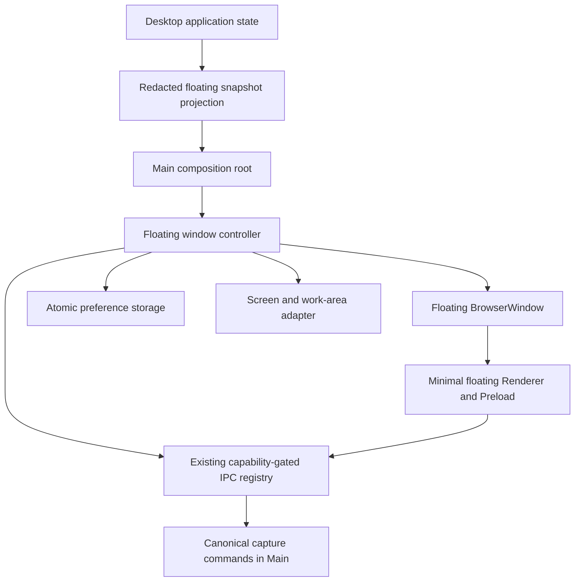
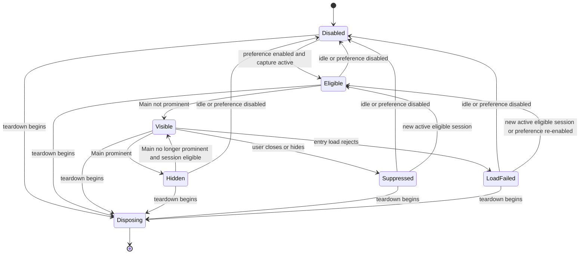

# Electron Floating Window Reliability - Plan

## Goal Capsule

- **Objective:** Developers can start both Electron window surfaces reliably, while users retain the current recording-control behavior across Main-window focus, hiding, session changes, and shutdown.
- **Means:** Isolate the two Renderer dependency caches and move floating-window presentation lifecycle into one Main-owned controller without changing the product surface. (KTD1, KTD2, KTD3)
- **Authority:** Product requirements in this plan govern behavior; repository `AGENTS.md` governs validation and scope; KTDs govern implementation mechanism.
- **Execution profile:** Behavior-preserving Electron Main/configuration refactor with characterization-first coverage.
- **Stop conditions:** Stop and reassess if the extraction requires changing the floating UI, widening Preload/IPC authority, moving recording truth out of its current owner, or replacing the separate-window architecture.
- **Completion owner:** The implementer completes the units and verification contract; publishing or opening a PR requires separate authorization.

---

## Product Contract

### Summary

Keep the existing Main window and floating capture window as independent Electron `BrowserWindow` instances. Give their Vite development pipelines separate dependency caches, then isolate floating-window creation and lifecycle mechanics behind a dedicated Main-side controller.

### Problem Frame

The two Forge Renderer entries currently use Vite's default `node_modules/.vite` cache. Their different dependency graphs can overwrite each other's optimized files, which has already produced a `504 Outdated Optimize Dep` response for `sonner` and left the Main Renderer root empty during `start`.

Floating-window behavior is also spread across `src/main/index.ts`: window ownership, presentation latches, preference persistence, positioning, IPC registration, Main-window handoff, display changes, and teardown all share the composition root. This makes behavior harder to test directly and raises the risk of lifecycle regressions when Main changes.

### Requirements

**Development reliability**

- R1. The Main and floating Renderer development servers must use explicit, stable, non-overlapping Vite cache directories.
- R2. A clean `start` must not depend on startup order or shared dependency-optimizer state between the two Renderer entries.

**Window behavior preservation**

- R3. The floating controller must remain a separate, lazily created `BrowserWindow` that appears only for an eligible active capture when Main is not prominent.
- R4. Existing show, hide, close-as-session-suppression, non-activating presentation, placement, load-failure suppression, and session-reset behavior must remain unchanged.
- R5. Floating preference writes must remain serialized and atomic, and a failed write must preserve the last durable and in-memory value.
- R6. Main remains the authority for application and recording state; the controller consumes only the redacted `FloatingCaptureSnapshot` projection and owns presentation lifecycle state.
- R7. The dedicated floating Preload, navigation restrictions, sandbox settings, and server-side IPC capability allowlist must retain their current authority boundaries.
- R8. IPC registry replacement and application teardown must leave at most one valid floating-window registration, remove listeners, and destroy the owned window idempotently.

### Acceptance Examples

- AE1. **Covers R1, R2.** Given both Forge Renderer entries start from the same desktop workspace, when Vite optimizes their different dependency graphs, then each entry writes only to its own cache and the Main entry can resolve `sonner`.
- AE2. **Covers R3, R4.** Given floating control is enabled and capture is active, when Main becomes hidden, minimized, or unfocused, then one floating window is positioned at the cursor-nearest display's top-right work area and shown without taking focus.
- AE3. **Covers R4.** Given the floating window is visible for session A, when the user closes it, then it hides and remains suppressed only for session A; idle state or session B permits it to appear again.
- AE4. **Covers R7, R8.** Given Main IPC is rebound while the floating window survives, when the new registry becomes active, then the old floating registration is removed and exactly one registration is installed against the new allowlist.
- AE5. **Covers R5, R8.** Given a preference write is pending, when teardown begins, then the write settles according to the existing durability contract and no subsequent continuation recreates or reconciles a window.

### Success Criteria

- The cache regression test proves the two Renderer cache paths are explicit, stable, and unequal.
- Floating lifecycle behavior can be exercised through controller unit tests without importing the full Main composition root or launching Electron UI.
- `src/main/index.ts` delegates floating lifecycle operations and no longer owns the extracted presentation latches, preference queue, listener collection, or floating-window reference.
- The Electron code verification lane passes without expanding Renderer capabilities or changing user-visible behavior.

### Scope Boundaries

**In scope**

- Vite cache isolation for the existing Main and floating Renderer configurations.
- A dedicated Main-side floating-window controller with injected platform and application callbacks.
- Characterization, controller, cache configuration, and narrow Main-wiring coverage.
- Removal of the superseded inline floating-window lifecycle implementation after parity is proven.

### Deferred to Follow-Up Work

- Renderer-ready handshakes, richer module-load diagnostics, or automatic recovery from Renderer crashes.
- Repositioning on `display-added`, persisted user-adjusted bounds, or changes to cursor-nearest-display placement.
- Refactoring the process-wide IPC registry or unrelated sections of `src/main/index.ts`.
- Consolidating both Renderer entries into one Vite multi-page server.

**Outside this product change**

- UI redesign, copy changes, or new floating-control actions.
- Migration to `BaseWindow`, `WebContentsView`, `NSPanel`, a DOM-only overlay, or another window architecture.

---

## Planning Contract

### Key Technical Decisions

- KTD1. **Retain two `BrowserWindow` instances and separate Renderer/Preload entries.** (session-settled: user-approved — chosen over merging surfaces or adopting a native panel: the current boundary already matches independent visibility and least-privilege requirements.) Governs R3, R6, R7.
- KTD2. **Give each Renderer an explicit cache beneath a shared `.vite` parent, keyed by its Forge identity.** (session-settled: user-approved — chosen over relying on cache deletion or startup order: filesystem ownership must match the two optimizer instances.) Governs R1, R2.
- KTD3. **Place the controller at the Main capture-adapter boundary and inject narrow live dependencies.** (session-settled: user-approved — chosen over retaining lifecycle globals in the composition root: window mechanics need direct tests without becoming a second application-state authority.) The IPC port registers a window opaquely; the controller never selects capabilities, origins, file allowlists, or channel names. Governs R3–R8.
- KTD4. **Keep state projection and capture commands outside the controller.** `deriveFloatingCaptureSnapshot` and `runFloatingCaptureControl` remain the boundaries for redaction and canonical capture actions; the controller receives projected state and delegates handoff back to Main. Governs R6, R7.
- KTD5. **Characterize before extraction and rebind IPC after the replacement registry exists.** Tests first lock down races and ordering that source-level movement could otherwise change silently. Governs R4, R5, R8.

### High-Level Technical Design

The controller becomes the sole owner of floating presentation mechanics while Main keeps application composition and capture authority.

The controller must preserve the current per-session suppression and teardown lifecycle.

### Implementation Constraints

- The controller may own the floating window reference, IPC unregister callback, preference value and mutation queue, session suppression latches, presentation dedupe latch, subscriber set, and display listeners.
- Dependencies that can change during the application lifetime must be injected as getters or callbacks so the controller does not capture stale `mainWindow`, registry, teardown, or application state.
- Initialization must load the committed preference and bind display callbacks once before reconciliation is enabled.
- Async load callbacks must be tied to the window and session that initiated them; a late failure from an old window must not suppress or destroy a replacement.
- A destroyed window reference must be treated as absent before any visibility, bounds, or IPC operation.
- Preference persistence retains the current private file mode, temporary-file cleanup, atomic rename, serialized order, and state-update-after-success behavior.
- Teardown is two-phase: first mark the controller as disposing and await its accepted preference queue without removing resources that accepted capture work may still need; after Main preserves the existing capture recovery/control drains, finish controller listener, registration, subscriber, and window cleanup before Main IPC is unregistered.

### Sequencing

1. Establish separate cache ownership and its regression test.
2. Add behavior-focused lifecycle characterization around the new controller boundary.
3. Implement the controller against injected ports while preserving current semantics.
4. Rewire Main and remove superseded inline state only after the focused tests pass.
5. Run the complete Electron code lane once against the final code state.

### Risks & Dependencies

| Risk | Consequence | Mitigation |
| --- | --- | --- |
| A stale async load callback targets a newer session | The new session is incorrectly suppressed or its replacement window is destroyed | Capture window identity and originating session in each callback; cover late resolution and rejection |
| IPC registry recreation happens in the wrong order | A visible floating window loses commands or retains an obsolete registration | Install Main registry first, then refresh floating registration exactly once |
| Preference completion races with shutdown | Teardown recreates or reveals a window | Mark disposal before awaiting the serialized queue and forbid reconciliation while disposing |
| Extraction moves recording truth into the controller | Main and Renderer state can diverge | Accept only `FloatingCaptureSnapshot`; keep projection and capture commands in their current modules |
| Listener wiring duplicates across window recreation | Snapshot events and commands execute more than once | Make registration, unregistration, subscription, and disposal idempotent |
| Bounded refactor expands into general Main cleanup | Review and regression surface grows beyond the confirmed scope | Restrict active units to Vite cache ownership and floating-window lifecycle |

### System-Wide Impact

| Boundary | Data or action crossing it | Preserved owner |
| --- | --- | --- |
| Application state → Main → controller | Redacted `FloatingCaptureSnapshot` only | Projection and recording truth remain outside the controller |
| Main-window lifecycle → controller | Prominence changes, hide, reconciliation, and details handoff | Main owns its window and navigation |
| Controller → Electron window adapter | Create, load, show, hide, position, and destroy | Controller owns floating presentation mechanics only |
| Controller → IPC registry adapter | Opaque register, unregister, and refresh operations | Main and `register_desktop_ipc.ts` retain trust and capability policy |
| Main IPC services → controller | Snapshot, window action, preference, and subscription delegation | Existing IPC contracts and failure envelopes remain authoritative |

Failure propagation remains specific to each boundary:

- Missing or malformed persisted preference defaults to disabled without failing application startup.
- Preference mutation failure rejects the existing Main IPC request, preserves the committed value, cleans temporary state, and leaves later writes usable.
- Renderer load failure destroys only the originating window, suppresses only its originating session, and permits reconciliation for a newer current session.
- Window creation or IPC registration failure rolls back partial controller ownership before returning the failure through the existing Main diagnostic path.
- Teardown fences new controller work first and drains accepted preference work; Main then preserves the existing capture recovery/control drains, completes controller listener/registration/subscriber/window cleanup, and only afterward unregisters Main IPC and disposes remaining resources.

### Sources & Research

- `apps/desktop-electron/forge.config.ts` — owns the two named Renderer entries and their development servers.
- `apps/desktop-electron/vite.renderer.config.mts` and `apps/desktop-electron/vite.floating-renderer.config.mts` — currently share Vite's implicit cache directory.
- `apps/desktop-electron/src/main/index.ts` — current floating-window creation, reconciliation, preference, registry refresh, handoff, display, and teardown wiring.
- `apps/desktop-electron/src/main/application/floating_capture_projection.ts` — established redacted presentation boundary.
- `apps/desktop-electron/src/main/application/floating_capture_stop_handoff.ts` — established Main-owned stop and details handoff boundary.
- `apps/desktop-electron/src/main/domain/capture/capture_quit_coordinator.ts` and `apps/desktop-electron/src/main/features/playback/browser_window_playback_port.ts` — constructor-injected Main-side lifecycle patterns.
- `docs/plans/2026-08-19-1154-refactor-electron-sidebar-09-visual-fidelity-plan.md` — prior decision for a separate minimal Renderer, Preload, redacted contract, and Main coordination.
- `docs/solutions/architecture-patterns/desktop-first-workstation-boundaries.md` — composition-root and platform-boundary guidance.
- [Vite `cacheDir` configuration](https://vite.dev/config/shared-options#cachedir) — confirms the default shared cache location and explicit override.
- [Electron `BrowserWindow`](https://www.electronjs.org/docs/latest/api/browser-window) and [security guidance](https://www.electronjs.org/docs/latest/tutorial/security) — confirm the retained window and isolation model.

---

## Implementation Units

### U1. Isolate Renderer dependency caches

- **Goal:** Make dependency optimization deterministic for both Forge Renderer entries.
- **Requirements:** R1, R2; KTD2.
- **Dependencies:** None.
- **Files:**
  - Modify `apps/desktop-electron/vite.renderer.config.mts`.
  - Modify `apps/desktop-electron/vite.floating-renderer.config.mts`.
  - Modify `apps/desktop-electron/tsconfig.tests.json` if the configuration modules become test imports.
  - Create `apps/desktop-electron/tests/unit/renderer_vite_cache_test.ts`.
- **Approach:** Derive explicit cache paths from each configuration's existing project directory and key them to `main_window` and `floating_capture_window`. Test resolved configuration values or exported constants rather than matching source text.
- **Execution note:** Start with the failing cache-ownership assertion that demonstrates both configurations currently resolve to the same default.
- **Patterns to follow:** Keep Forge Renderer names in `apps/desktop-electron/forge.config.ts` as the naming authority; keep configuration path construction consistent with existing `directory` resolution.
- **Test scenarios:**
  1. Given both Vite configs are loaded, each exposes a non-empty cache directory beneath the desktop workspace.
  2. Given the two resolved cache directories, they are unequal and map to their respective Forge Renderer identities.
  3. Given unrelated Vite settings, the existing entry HTML, aliases, plugins, base path, and disabled HMR behavior remain unchanged.
- **Verification:** The regression test fails against the previous shared-default configuration and passes with two explicit cache owners; both configuration modules remain type-checkable.

### U2. Introduce the floating-window lifecycle controller

- **Goal:** Move floating presentation state and window mechanics behind a directly testable Main-side controller.
- **Requirements:** R3–R8; KTD1, KTD3–KTD5.
- **Dependencies:** None; execute after U1 by preference so the known development failure is removed before structural work.
- **Files:**
  - Create `apps/desktop-electron/src/main/features/capture/floating_capture_window_controller.ts`.
  - Create `apps/desktop-electron/tests/unit/floating_capture_window_controller_test.ts`.
- **Approach:**
  1. Define narrow injected ports for app readiness, projected snapshot access, Main prominence, window creation/loading, trusted navigation, display lookup, opaque IPC registration, preference storage, Main details handoff, teardown state, and bounded diagnostics.
  2. Transfer the window reference, registration cleanup, preference queue, session suppression, load-failure suppression, presentation dedupe, subscriber collection, and display-listener lifecycle into the controller.
  3. Keep projection, capture mutation, stop control, and Main-window ownership outside the controller per KTD4.
  4. Make creation, registry refresh, asynchronous callbacks, preference mutation, and both teardown phases identity-safe and idempotent.
- **Execution note:** Add characterization tests for the current state transitions before moving the corresponding logic out of Main.
- **Patterns to follow:** Constructor-injected ports in `capture_quit_coordinator.ts`; owned `BrowserWindow` lifecycle in `browser_window_playback_port.ts`; atomic preference write behavior currently in `src/main/index.ts`.
- **Test scenarios:**
  1. Missing or malformed preference data initializes disabled without creating a window.
  2. Enabling during an active eligible session creates one secure fixed-size window, positions it 16 pixels from the cursor-nearest work area's top-right, and calls `showInactive`.
  3. Disabled, idle, Main-prominent, current-session-suppressed, or current-session-load-failed state hides or remains hidden without creating another window.
  4. Reconciliation for the same visible session skips redundant position/show work; a forced display reconciliation recalculates the position.
  5. Closing outside teardown prevents destruction, hides the window, and suppresses only the originating session; idle or a new session clears the latch.
  6. A load failure destroys the originating window and suppresses retry only for its originating session; if a newer session is current, reconciliation can create its replacement.
  7. A destroyed-but-not-yet-cleared window is replaced safely before visibility, bounds, or IPC operations.
  8. Window creation or IPC registration failure clears partial ownership and leaves the controller retryable without broadening trust policy.
  9. Preference writes execute in request order, update runtime state only after successful atomic rename, remove failed temporary files, preserve the prior value on failure, and allow a later write to proceed.
  10. Snapshot publication deduplicates presentation-equivalent updates, reconciles before fan-out, and notifies subscribers only while the floating window remains visible.
  11. IPC refresh removes an obsolete registration and installs exactly one current registration; repeated refresh and cleanup are safe.
  12. The teardown fence immediately rejects new actions, awaits accepted preference work, and ignores late load or display callbacks without removing resources still needed by accepted capture work; final cleanup later removes display and IPC listeners, clears subscribers, and destroys the window exactly once.
- **Verification:** Focused controller tests pass using fakes and cover happy paths, failure paths, session transitions, registry replacement, and teardown races without launching Electron UI.

### U3. Rewire Main through the controller

- **Goal:** Make `src/main/index.ts` a composition and delegation layer for floating presentation behavior.
- **Requirements:** R3–R8; KTD3–KTD5.
- **Dependencies:** U2.
- **Files:**
  - Modify `apps/desktop-electron/src/main/index.ts`.
  - Create `apps/desktop-electron/tests/unit/floating_capture_main_wiring_test.ts`.
  - Retain `apps/desktop-electron/tests/unit/floating_capture_projection_test.ts`.
  - Retain `apps/desktop-electron/tests/unit/renderer/floating_capture_app_test.tsx`.
  - Retain `apps/desktop-electron/tests/integration/register_desktop_ipc_test.ts`.
  - Retain `apps/desktop-electron/tests/e2e/macos_capture_flow_test.ts`.
- **Approach:**
  1. Instantiate the controller from Main with live callbacks over `mainWindow`, application state, teardown state, trusted entry resolution, and the existing IPC registrar.
  2. Delegate application-state publication, Main focus/visibility changes, display topology changes, preference operations, floating actions, stop/details handoff, and snapshot subscriptions.
  3. Refresh the surviving floating registration only after Main installs the replacement IPC registry.
  4. Start controller teardown before draining capture work, await its accepted preference queue, preserve the existing capture recovery/control drains, then finish controller cleanup before Main removes the registry and other owned resources.
  5. Delete the superseded floating globals and inline helper functions only after delegation coverage passes.
- **Execution note:** Keep the integration diff mechanical after U2 proves behavior; do not refactor unrelated Main services in the same unit.
- **Patterns to follow:** Existing `bindDesktopIpc` registry replacement order, application-state projection subscription, capture stop handoff, and source-level Main wiring tests where a direct behavior seam is unavailable.
- **Test scenarios:**
  1. Main projects application state before publishing it to the controller and retains `deriveFloatingCaptureSnapshot` as the redaction boundary.
  2. Main focus delegates an immediate hide, while blur, minimize, and hide re-evaluate current eligibility without changing capture state.
  3. Display removal and metric changes request forced repositioning without changing the placement policy.
  4. Floating snapshot, action, preference, and subscription IPC services delegate to the controller without adding channels or capabilities.
  5. Stop and Open Details hide the floating presentation before revealing Main while capture control remains canonical in Main.
  6. Rebinding Main IPC during an in-flight floating action lets that action resolve, removes the old subscription once, activates the replacement registry before re-registration, and emits later events only through the replacement.
  7. Main-only preference channels remain unavailable to the floating capability after delegation.
  8. Teardown follows one order on every shutdown path: fence new controller work, await accepted preference writes, drain the existing capture recovery/control queues, finish controller cleanup, then unregister Main IPC; repeated entry remains safe.
  9. The prior inline lifecycle globals and helpers are absent once controller delegation is complete.
- **Verification:** Narrow Main-wiring coverage and all retained floating projection, Renderer, IPC, and capture-flow tests pass without expectation changes to user-visible behavior.

---

## Verification Contract

| Check | Scope | Units | Required outcome |
| --- | --- | --- | --- |
| Focused cache regression test | Vite configuration ownership | U1 | Both explicit cache paths are stable, scoped to the desktop app, and unequal |
| Focused controller unit test | Floating lifecycle state machine and races | U2 | All creation, suppression, preference, registration, publication, and teardown scenarios pass with fakes |
| Focused Main wiring test | Composition and delegation | U3 | Main preserves ordering, projection, handoff, registry refresh, and disposal boundaries |
| Existing floating projection and Renderer tests | Redaction and UI-controller contract | U2, U3 | Existing expectations pass unchanged |
| Existing IPC integration and macOS capture-flow tests | Cross-window capability and canonical capture behavior | U3 | Existing expectations pass unchanged |
| `bun run check:code` from `apps/desktop-electron` | Required Electron Main/Preload/shared verification lane | U1–U3 | Formatting, lint, typecheck, Vitest, boundary, and lifecycle checks pass on the final code state |
| Conditional dual-Renderer `start` smoke check | Live Forge dependency optimization and Main Renderer module delivery | U1 | After explicit app-launch authorization, both Renderer entries start together and the Main entry serves `sonner` without `504 Outdated Optimize Dep` |

Visual/app-launch validation is not currently authorized. During implementation, request explicit authorization for one `start`-based dual-Renderer smoke check after the static lane passes; if authorization is not granted, do not launch Electron and report the runtime portion of R2 and AE1 as pending rather than verified.

The non-visual cache invariant proves the configuration ownership portion of AE1 and prevents the diagnosed shared-cache collision. It does not prove that a live Electron Forge session serves both Renderer entries without a runtime `504`; that runtime acceptance evidence requires the separately authorized smoke check above.

---

## Definition of Done

- R1–R8 and AE1–AE5 are covered by the units and verification contract; the runtime portion of R2 and AE1 is complete only when the separately authorized dual-Renderer smoke check passes, and otherwise must be reported as pending.
- U1 proves each Renderer owns a distinct Vite cache and leaves the remaining Vite/Forge entry behavior unchanged.
- U2 owns floating presentation mechanics behind injected ports without importing application recording authority into the controller.
- U3 removes the superseded inline lifecycle state from Main and preserves registry, handoff, and teardown ordering.
- Existing Preload APIs, IPC channels, capability profiles, redacted snapshot schema, and Renderer behavior remain unchanged.
- `bun run check:code` passes from `apps/desktop-electron` on the final code state.
- The diff contains no unrelated Main refactor, UI change, abandoned experiment, duplicate lifecycle path, or stale test helper.
- Visual validation remains explicitly skipped unless the user authorizes it for the implementation task.
