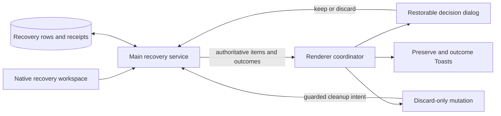
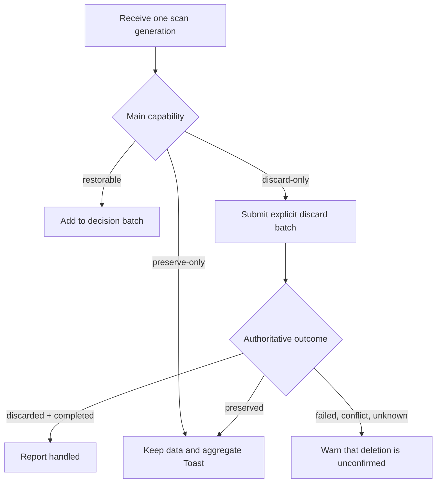
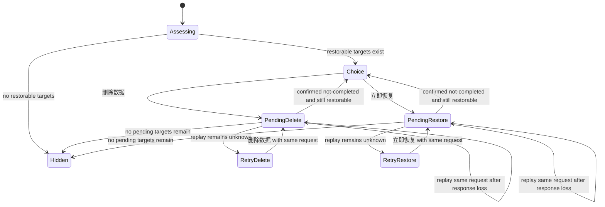
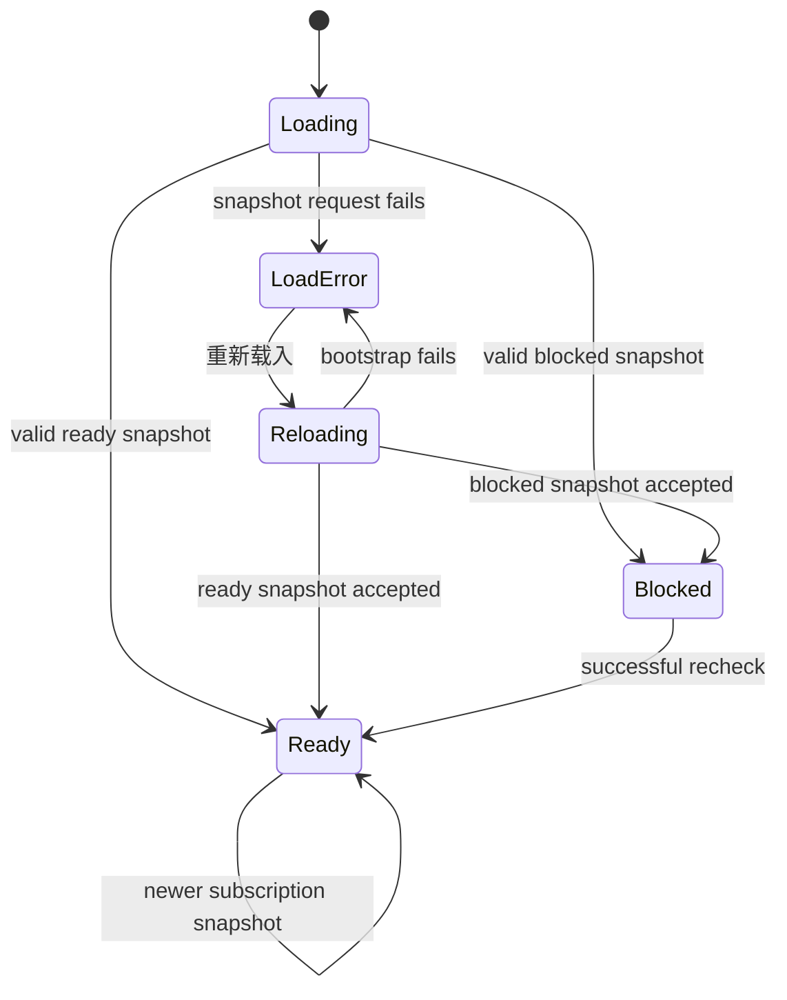

# Electron Recovery and Actionable Failures - Plan

## Goal Capsule

- **Objective:** 让 Electron 启动恢复只在用户确实能做决定时阻塞，并让模型锁定与工作台载入失败都提供明确、可执行的反馈。
- **Means:** Main 继续拥有恢复能力与持久化结果的判定权；Renderer 按能力分流弹窗与 Toast；恢复弹窗只保留“删除数据”和“立即恢复”；锁定模型禁用编辑；工作台错误页复用现有启动流程重新载入。
- **Authority:** 本计划以本次对话的产品决定、当前代码与既有恢复事务边界为准。它替代 2026-09-08 计划中关于恢复弹窗“忽略”、X、Escape 和结果确认页的要求，不推翻该计划已落地的 Main 侧分类、复核、回执与补偿机制。
- **Execution profile:** 4 个依赖有序的实现单元，先修复恢复状态，再处理两个独立反馈入口，最后按风险做非可视验证。
- **Stop conditions:** 若“删除数据”必须表示磁盘字节已经同步擦除，或重载必须刷新整个 Renderer 页面，则现有契约不足，应暂停并重新确认产品语义。
- **Tail ownership:** 实现者负责清理被替代的分支与测试；不创建恢复中心、不增加保留数据清理入口、不增加音频操作重试按钮。

## Product Contract

### Summary

恢复弹窗只处理可恢复录音，并强制用户明确选择“删除数据”或“立即恢复”。不可恢复但可清理的数据由应用提交清理并用 Toast 报告；必须保留的数据只用 Toast 告知，不再因为“需要保留”本身占用恢复决策。云端模型被占用时不可进入编辑；工作台载入失败时可以原地重新执行启动流程。

### Problem Frame

当前恢复弹窗可能只显示说明文字和关闭按钮，关闭动作还可能隐式承担删除语义。用户既看不到可执行选项，也无法从界面判断关闭的后果。与此同时，`preserve-only` 候选仍可能成为公开的当前录音并长期阻塞新录音；恢复请求丢失响应时，Renderer 会直接隐藏弹窗。这两个状态问题意味着只改按钮文案仍会留下数据安全和可用性缺陷。

### Key Decisions

1. **只有 `restorable` 进入恢复弹窗。** `discard-only` 自动提交清理并 Toast，`preserve-only` 仅 Toast。（session-settled: user-directed — chosen over 恢复中心或混合状态弹窗：这些异常低频，只有可恢复数据需要用户立即决策。）Governs R1–R4.
2. **恢复弹窗没有隐式关闭路径。** 选择态固定显示“删除数据”和“立即恢复”，X、Escape、遮罩点击和 `onOpenChange(false)` 均不执行删除或恢复。（session-settled: user-directed — chosen over “关闭即忽略/删除”：破坏性操作必须来自明确按钮。）Governs R5–R8.
3. **不提供 `preserve-only` 的应用内管理或清理入口。**（session-settled: user-approved — chosen over 恢复中心中的详情/清理能力：用户认可用保留提示换取更小的产品复杂度。）Governs R3–R4.
4. **被当前任务占用的云端模型不可编辑。** 行内显示精确文案“正在使用当前模型，无法编辑”。（session-settled: user-directed — chosen over 可打开的只读编辑弹窗：禁用入口更直接。）Governs R9–R10.
5. **音频操作失败弹窗只保留“知道了”。**（session-settled: user-directed — chosen over 弹窗内重试：重试应从正常业务入口重新执行，以保留各步骤自己的约束。）Sets an explicit scope boundary and regression guard.
6. **工作台载入错误页增加“重新载入”。**（session-settled: user-directed — chosen over 只提示重开应用：用户应能在当前页面恢复。）Governs R11–R13.

### Requirements

#### Recovery routing and data safety

- **R1:** Main 返回的恢复候选仍以 `restorable`、`discard-only`、`preserve-only` 为唯一权威分类；Renderer 不根据错误文案或录音状态自行推断能力。
- **R2:** 启动扫描只要存在 `restorable`，无论当前打开音频、设置还是其他主导航，都应展示恢复弹窗；没有 `restorable` 时不得打开弹窗。
- **R3:** `discard-only` 使用恢复 mutation 提交精确、冻结的 session ID 集合，并携带“自动清理”意图。Main 在命令时再次评估，只有 capability 仍为 `discard-only` 才可删除；变为 `preserve-only` 时保留并 Toast，变为 `restorable` 时不删除并转入恢复弹窗。只有 `discarded + completed` 才汇总提示已处理；响应丢失或完成状态未知时只做一次同键对账，仍无法确认时警告数据尚未确认删除并将在下次启动重新检查。

- **R4:** `preserve-only` 不触发任何删除或恢复 mutation，同一轮启动扫描合并且去重 Toast，并可在下次启动再次提示。启动扫描得到的 candidate 都是待恢复数据，不能仅凭其持久化 lifecycle state 当作当前进程的活动录音；只有当前进程明确启动或接管且仍有原生 authority 的 session 才能阻止新录音。
- **R5:** 恢复弹窗选择态显示可恢复录音数量，并明确两个按钮作用于本批全部可恢复录音。业务按钮名称精确为“删除数据”和“立即恢复”；不显示 X、“忽略”、“稍后处理”或结果页“知道了”。
- **R6:** Escape、遮罩点击、焦点离开和 `onOpenChange(false)` 不关闭弹窗，也不触发业务操作；初始焦点不落在破坏性按钮上。
- **R7:** 两个恢复动作均为单飞。点击后冻结当前 `restorable` session ID、动作和幂等键；弹窗按 action outcome 与返回的权威 recovery 列表共同收敛，不根据 UI 关闭或 transport 状态推断完成。
- **R8:** 部分成功时移除已完成目标，把重分类为 `preserve-only` 的目标转为 Toast，并继续展示剩余待决目标。`completionCertainty: unknown`（包括当前契约中的 `failed`）或响应丢失时，用同一动作和幂等键做一次有界重放；仍未知时进入对应的 retry-delete/retry-restore 状态，仅原动作可用。`conflict + not-completed` 时以权威列表为准：目标仍为 `restorable` 则回到双按钮选择态，变为 `preserve-only` 则 Toast，已不在列表则从待决集合移除但不宣称删除或恢复成功。

#### Model and audio feedback

- **R9:** `capabilities.editable === false` 的模型编辑按钮不可点击或键盘激活，正常路径不再打开只读编辑弹窗；禁用原因必须用可见文案表达，不能只依赖 Tooltip。
- **R10:** 模型的 `editable` 与 `selectable` 保持独立；锁定编辑不得改变模型的选择状态或其他未锁定模型的编辑、保存、删除行为。
#### Shell reload

- **R11:** `ShellLoadError` 显示“重新载入”按钮；请求期间按钮禁用，文案为“正在重新载入”。
- **R12:** 重新载入复用 Main 的现有 bootstrap action，并将返回 snapshot 送入与首次载入相同的接收和导航归一化流程；不刷新浏览器页面，不新增 IPC 动作。
- **R13:** 重载请求单飞。成功后清除载入错误并进入 ready shell 或现有 ProfileBlocker；失败后留在错误页并允许再次尝试。已接受的较新订阅 snapshot 不得被晚到的失败覆盖，深链导航失败也不得回退为全屏载入错误。

### Acceptance Examples

- **AE1 — 只有可恢复数据：** 启动时返回 1 个 `restorable`，任意主导航都出现弹窗；弹窗只有“删除数据”和“立即恢复”，Escape 与遮罩点击无效。
- **AE2 — 明确删除：** 用户点击“删除数据”，界面只提交弹窗中冻结的 `restorable` ID。Main 持久化删除决定与回执后返回 `discarded + completed`，弹窗关闭；原生文件清理可以按现有补偿机制稍后完成，界面不宣称磁盘字节已同步擦除。
- **AE3 — 明确恢复：** 用户点击“立即恢复”，全部目标返回 `kept + completed + durable` 后弹窗关闭。后续转写交接失败沿用现有警告 Toast，不回滚录音恢复。
- **AE4 — 混合候选：** 同一轮有三种 capability 时，弹窗只包含 `restorable`；`discard-only` 独立提交清理；`preserve-only` 只汇总提示。清理和恢复请求由 Main 现有串行边界协调。
- **AE5 — 响应丢失：** 删除已在 Main 提交但 Renderer 未收到响应。界面不关闭、不生成新幂等键，也不允许切换到恢复；同一请求重放命中回执后才收敛。
- **AE6 — 重分类与部分成功：** 批次中一个目标成功恢复、一个变为 `preserve-only`、一个完成状态未知。成功目标从待决集合移除，保留目标 Toast，未知目标锁定原动作并用同一请求身份重放。
- **AE7 — 只有保留数据：** 启动时不弹窗、不提交 recovery mutation，并显示一次保留 Toast。即使持久化 state 为 `preparing`、`recording`、`paused` 或 `finalizing`，它也不能在没有当前原生 authority 的情况下冒充活动录音；主界面仍可开始新录音，重启后允许再次提醒。
- **AE8 — 自动清理未确认：** `discard-only` 批次一次同键对账后仍无法证明删除完成，不显示成功 Toast，改为提示数据尚未确认删除、下次启动将重新检查；候选若重新出现，仍可进入下一轮分流。
- **AE9 — 模型锁定：** 当前任务占用的云端模型行显示“正在使用当前模型，无法编辑”，编辑按钮 disabled，点击和键盘均不打开弹窗；模型仍按 `selectable` 决定是否可选择。
- **AE10 — 工作台重载：** 首次 snapshot 载入失败后显示“重新载入”。连续点击只发一个 bootstrap 请求；成功返回 ready 或 blocked snapshot 都离开载入错误页，失败则保留错误页并恢复按钮。

### Scope Boundaries

- 不建设恢复中心、恢复历史、批量管理页或 `preserve-only` 详情入口。
- 不提供“稍后处理”，也不把任意关闭事件映射为删除。
- 不引入第二层删除确认；当前恢复弹窗本身就是决策上下文。
- 不修改音频操作失败弹窗的“知道了”单按钮流程。
- 不修改 Flutter UI、全局错误展示策略、录音格式、转写流程或发布资源。
- 不把“删除数据”升级为“同步验证物理文件已擦除”。若需要该语义，应另行扩展 Main/shared outcome 契约。
- 未获得本次实现任务的可视验证授权前，不启动应用、浏览器或 Playwright，不拍摄或更新截图及 golden。

### Sources

- [历史错误展示计划](./2026-09-08-1820-refactor-electron-error-presentation-plan.md) — 保留 Main 数据安全边界，明确替代其中恢复弹窗的“忽略”、X、Escape 和结果确认行为。
- [Desktop capture service](../../apps/desktop-electron/src/main/domain/capture/desktop_capture_service.ts) — capability 评估、命令时复核、幂等回执、延迟原生清理。
- [Main composition root](../../apps/desktop-electron/src/main/index.ts) — 启动恢复发布、恢复 mutation 串行化、转写交接和 bootstrap action。
- [Recovery dialog](../../apps/desktop-electron/src/renderer/features/capture/recovery-dialog.tsx) 与 [capture workspace](../../apps/desktop-electron/src/renderer/features/capture/capture-workspace.tsx) — 当前关闭语义、批次状态和启动展示条件。
- [AI settings](../../apps/desktop-electron/src/renderer/features/settings/ai-settings-feature.tsx) — 当前只读编辑弹窗路径。
- [Application shell hook](../../apps/desktop-electron/src/renderer/features/shell/use-application-shell.ts) 与 [shell surfaces](../../apps/desktop-electron/src/renderer/features/shell/shell-surfaces.tsx) — 当前首次载入和错误页。
- [Desktop-first workstation boundaries](../solutions/architecture-patterns/desktop-first-workstation-boundaries.md) — Main 权威、持久状态与短暂 UI 状态分离的既有项目约束。

## Planning Contract

### Key Technical Decisions

1. **KTD1 — 在 Renderer 入口按 Main capability 分区。** `listCaptureRecoveries()` 仍返回完整列表，Capture workspace 立即拆为弹窗批次、自动清理批次和保留通知批次。（session-settled: user-directed — chosen over 统一恢复弹窗：落实 R1–R4，避免无操作项弹窗。）
2. **KTD2 — 自动清理是带意图保护的显式 mutation。** `discard-only` 不在只读列表查询中产生副作用；Renderer 用冻结 ID 和新增的 cleanup intent 调用现有 recovery action channel，Main 只在重新评估仍为 `discard-only` 时持久化删除回执。（session-settled: user-approved — chosen over 新建清理中心、查询时删除或复用无差别 discard：落实 R3–R4，防止自动清理删除刚变得可恢复的数据。）
3. **KTD3 — 恢复弹窗由权威结果驱动收敛。** Renderer 保存冻结请求身份与未决目标，按逐项 outcome 和返回的权威 recovery 列表减少待决集合；未知完成状态只重放同一请求。（session-settled: user-directed — chosen over catch 后隐藏或生成新请求：落实 R5–R8，避免误删、反向操作和假成功。）
4. **KTD4 — Main 分开维护恢复 candidate 与当前进程录音。** 启动恢复数据不能凭持久化 state 获得活动 authority；扫描和每次恢复动作后发布下一条 `restorable`，没有则发布 idle。只有当前进程明确建立的原生 session 继续占用录音。（session-settled: user-approved — chosen over 仅在 Renderer 隐藏或把持久化 lifecycle 当作活跃证明：落实 R4，避免陈旧记录永久阻塞录音。）
5. **KTD5 — 锁定状态在编辑入口处执行。** 保留 Provider dialog 对能力漂移的防御性只读保护，但正常用户路径在行按钮处禁用，并用行内状态文案解释。（session-settled: user-directed — chosen over 可达的只读弹窗：落实 R9–R10。）
6. **KTD6 — 重新载入复用 bootstrap action。** 首次读取仍使用 snapshot API；错误页重试调用现有 `requestBootstrapAction("recheck")`，因为它能重新执行失败的初始化并返回新 snapshot。（session-settled: user-directed — chosen over `location.reload()` 或只重复读取旧状态：落实 R11–R13。）

### High-Level Technical Design

下图表达职责边界，不规定函数签名或组件内部结构。

#### Recovery authority and presentation flow

#### Capability decision tree

#### Recovery dialog state machine

#### Shell load lifecycle

### Implementation Sequence

1. 先修复 Main 对公开恢复状态和 current session 的投影，把恢复能力与真实录音占用分开。
2. 再重写 Renderer 的恢复分流与弹窗收敛状态，复用现有 action contract。
3. 独立完成模型锁定反馈，避免与恢复状态机交叉修改。
4. 最后抽取 shell snapshot 接收流程并接入重新载入，随后统一更新聚焦测试与替代关系说明。

### Risks and Mitigations

- **删除文案强于物理清理保证：** 现有 Main 在持久化删除决定和回执后允许原生目录清理延后。Toast 只表达“已从可恢复数据中移除”，不承诺同步擦除磁盘字节。
- **自动清理与用户恢复并发：** 两者使用分离的冻结批次和不同 request intent，继续经过 Main mutation 串行化和命令时复核；自动清理只有在 capability 仍为 `discard-only` 时才能删除，Renderer 不根据初始分类直接宣告结果。
- **响应丢失导致反向操作：** 只有未知完成状态保留原动作和幂等键并禁用相反动作；已确认未完成的 conflict 由权威列表决定回到双选、转保留或移出待决集合。
- **强制决策造成死锁：** 失败后仍保留同一动作重试能力；重分类为 `preserve-only` 时退出弹窗并 Toast，不把无解状态留在 modal 内。
- **Toast 重复或风暴：** 以扫描 generation、session ID、capability 和 reason 做进程内去重，同类结果聚合；不新增持久“已读”字段。
- **重载竞态：** 复用现有 bootstrap 单飞与 snapshot revision；已接受有效 snapshot 后，晚到失败不得设置 load error，deep-link 失败与 shell 载入失败分开处理。只有聚焦测试证明 revision 判断不足时才增加最小 generation guard。
- **保留数据长期累积：** 不提供清理入口是已接受的取舍；本计划记录该残余风险，但不增加留存策略、遥测或阈值。若实际出现明显的启动扫描或磁盘占用问题，再单独决定数据管理能力。
- **锁定含义扩散：** 只用 `editable` 控制编辑入口，继续用 `selectable` 控制选择。

### System-Wide Impact

- **Data lifecycle:** 无 schema 迁移。删除与恢复继续使用现有 disposition、receipt 和原生清理补偿；新增的是能力分流和权威结果消费方式。
- **Main/Renderer contract:** 在现有 recovery action request 增加 `user-decision` / `automatic-discard-only-cleanup` 意图区分，继续复用原 IPC channel、outcome 和 response shape；不新增并行清理 API。
- **Error propagation:** recovery outcome 决定弹窗是否收敛；bootstrap 错误留在 shell surface；转写 handoff 警告继续走既有 Toast。
- **Backward compatibility:** request schema 的新增意图由同一 Electron 版本的 Main 与 Renderer 一起升级；已持久化的 recovery row 与 receipt 无需迁移，重复请求沿用现有幂等回放。
- **Observability:** 保留现有 `capture-recovery-cleanup-deferred` 日志；本计划不增加遥测或远程上报。

## Implementation Units

### U1 — Guard automatic cleanup and correct recovery projection

**Covers:** R1, R3–R4, R7–R8; KTD2, KTD4.

**Files:**

- `apps/desktop-electron/src/shared/contracts/capture.ts`
- `apps/desktop-electron/src/main/domain/capture/desktop_capture_service.ts`
- `apps/desktop-electron/src/main/index.ts`
- `apps/desktop-electron/tests/e2e/macos_capture_flow_test.ts`
- `apps/desktop-electron/tests/unit/ipc_contract_test.ts`
- 必要时补充最窄的 Main wiring test。

**Changes:**

- 给 recovery action request 增加意图字段。用户点击“删除数据”使用 `user-decision`；自动处理 `discard-only` 使用 `automatic-discard-only-cleanup`，且 Main 对后一种意图执行 exact-capability guard。
- 让 recovery scan、action response 和服务内部 current-session 选择不再默认采用恢复列表第一项；启动 candidates 不获得当前进程活动 authority，公开第一条 `restorable`，没有则发布 idle。
- 每次批量恢复动作和转写交接处理完成后统一重新计算投影：当前进程真实活动 session 优先，否则发布下一条 `restorable`，没有则发布 idle。
- 保留命令时重新评估、每 session 单飞、回执回放、顺序 outcomes 与原生清理补偿。

**Test scenarios:**

- 给定首项为 `preserve-only`、后项为 `restorable`，启动公开后项；只有不可处理项时公开 idle。
- 持久化 state 看似 `preparing`、`recording`、`paused` 或 `finalizing`，但当前进程没有原生 authority 时，不占用 current session；当前进程真实启动的录音仍按现有规则阻止并发开始。
- 自动清理目标从 `discard-only` 变为 `restorable` 时，Main 不写删除 disposition、不调用 native discard，并在 response 中保留该候选；同一 race 对 `preserve-only` 也不删除。
- 删除或恢复第一条后发布下一条 `restorable`；最后一条完成后发布 idle。
- 原生删除失败时仍返回基于持久回执的 `discarded + completed`，并保留 deferred cleanup 行为。

### U2 — Partition recovery UI and enforce explicit decisions

**Covers:** R1–R8; KTD1–KTD3.

**Files:**

- `apps/desktop-electron/src/renderer/App.tsx`
- `apps/desktop-electron/src/renderer/features/capture/capture-workspace.tsx`
- `apps/desktop-electron/src/renderer/features/capture/recovery-dialog.tsx`
- `apps/desktop-electron/tests/unit/renderer/capture_workspace_test.tsx`
- `apps/desktop-electron/tests/e2e/capture_renderer_flow_test.tsx`，仅在现有 harness 能覆盖跨层状态时使用。

**Changes:**

- 移除只在音频导航自动打开恢复的限制，使启动恢复决定不依赖当前主导航。
- 在一个扫描 generation 内分区候选：`restorable` 进入 modal，`discard-only` 以 guarded-cleanup intent 提交独立 discard batch，`preserve-only` 聚合 Toast；弹窗按钮使用 user-decision intent。
- 用稳定 Toast ID 和进程内 key 集合去重；所有清理提示以 action response 的逐项 outcome 为准。未确认清理在一次同键对账后发警告 Toast，并留给下次启动重新扫描。
- 简化 RecoveryDialog 为 assessing、choice、pending-delete、pending-restore、retry-delete、retry-restore、hidden；删除 result、acknowledge、requestClose 和隐式 discard 路径。retry 状态显示简洁的“状态尚未确认”说明，原动作恢复可用且相反动作保持禁用。
- 始终隐藏 X，阻止 Escape 与外部交互关闭；选择态精确显示“删除数据”和“立即恢复”。“删除数据”使用现有 destructive variant 并排在左侧，“立即恢复”使用默认主按钮并排在右侧；初始焦点落在 DialogContent，Tab 顺序与视觉顺序一致。pending 时禁用两个按钮并显示对应进行中文案。
- 保存冻结 request、幂等键和未决目标；部分成功按 outcome 与权威列表共同收敛。未知完成状态有界重放同一请求，仍未知时进入单动作 retry 状态；已确认未完成的 conflict 不锁定原动作。
- 恢复完成后按本地 Dialog/Radix 约定恢复焦点；不新增全局焦点状态机或重复无障碍播报。

**Test scenarios:**

- 纯 `restorable`、纯 `discard-only`、纯 `preserve-only` 与三类混合列表分别走正确 surface，且任意主导航都遵守启动规则。
- 选择态只有两个精确按钮；无 X、无“忽略”、无“稍后处理”、无结果确认页。Escape、遮罩点击和 open-change 不关闭也不提交。
- 删除和恢复只提交冻结的 `restorable` ID，pending 时单飞；成功后关闭并恢复焦点。
- 自动清理只在 `discarded + completed` 后提示处理完成；重分类为 `preserved` 或 `restorable`、结果未确认时分别进入保留 Toast、恢复弹窗或警告 Toast，不宣称删除。
- 批次部分成功、`failed + unknown`、其他 unknown、conflict、重分类和剩余 `restorable` 都按 R8 收敛；conflict 且目标已不在列表时退出待决但不显示成功结论。
- 响应丢失重用同一 action、ID 集合和幂等键，不允许切换相反动作，也不把 transport failure 当完成。
- 同一扫描 generation rerender 或切换路由不重复 Toast；新应用启动可以再次提示仍存在的 `preserve-only`。

### U3 — Disable editing for a task-locked cloud model

**Covers:** R9–R10; KTD5.

**Files:**

- `apps/desktop-electron/src/renderer/features/settings/ai-settings-feature.tsx`
- `apps/desktop-electron/tests/unit/renderer/ai_settings_test.tsx`

**Changes:**

- 在模型行编辑 trigger 的 disabled 条件中加入 `!profile.capabilities.editable`。
- 锁定行用精确文案“正在使用当前模型，无法编辑”替换普通接口摘要。
- 删除“用户点击后打开只读 Dialog”的正常路径与旧测试；保留 Dialog 内对已打开期间能力漂移的防御性只读处理。
- 不改变 `selectable`、当前选择、可编辑模型的保存/删除和 stale-revision 行为。

**Test scenarios:**

- 锁定模型显示精确文案，编辑按钮 disabled，鼠标和键盘均无法打开 Dialog。
- 锁定但 selectable 的模型仍保持原选择行为。
- 可编辑模型仍可打开、保存、删除并恢复焦点；全局 mutation pending 规则不变。
- Dialog 已打开后能力漂移为不可编辑时，防御性保护仍阻止写入。

### U4 — Add a single-flight shell reload

**Covers:** R11–R13; KTD6.

**Files:**

- `apps/desktop-electron/src/renderer/features/shell/use-application-shell.ts`
- `apps/desktop-electron/src/renderer/features/shell/shell-surfaces.tsx`
- `apps/desktop-electron/src/renderer/App.tsx`
- `apps/desktop-electron/tests/unit/renderer/shell_test.tsx`

**Changes:**

- 抽取首次载入与重载共用的 snapshot 接收、profile blocker 更新和初始导航归一化流程；把深链导航错误从全屏载入错误中隔离。
- 小幅泛化现有 `bootstrapRequestRef` 与 `bootstrapPending`，让错误页和 ProfileBlocker 共享同一 bootstrap 单飞，同时各自保留适合当前 surface 的错误文案。只有聚焦测试能复现现有 revision 保护无法覆盖的竞态时，才增加最小 request generation。
- `ShellLoadError` 接收 reload callback 和 pending，在错误页渲染一个“重新载入”按钮；pending 时显示“正在重新载入”并禁用。
- 重试调用现有 `requestBootstrapAction("recheck")`；成功接受返回 snapshot 后清除 load error，失败保留简洁错误且不泄露原始异常。
- 保留一次 application snapshot 订阅；重试不得重复订阅或刷新页面。

**Test scenarios:**

- 首次 snapshot 失败后出现“重新载入”，连续激活只调用一次 bootstrap action。
- pending 文案和 disabled 状态正确；失败后仍停在错误页，按钮恢复可用并可再次尝试。
- ready snapshot 进入正常 shell；blocked snapshot 进入现有 ProfileBlocker，不继续显示 load error。
- 订阅先接受较新 snapshot、初始或重载请求后失败时，不回退到错误页。
- 成功重载只保留一个订阅并执行一次导航归一化；navigate/deep-link 失败不再伪装成 shell load failure。

## Verification Contract

### Automated checks

- U1 完成后运行最窄的 Main/领域测试，至少覆盖 `macos_capture_flow_test.ts` 中的 capability 投影、后续发布和延迟清理；因为修改 Electron Main，最终运行 `bun run check:code`（工作目录 `apps/desktop-electron`）。
- U2 完成后运行 `capture_workspace_test.tsx`，必要时运行现有非可视 `capture_renderer_flow_test.tsx`；重点验证 surface 分流、明确动作、幂等重放和部分批次。
- U3 完成后运行 `ai_settings_test.tsx`。
- U4 完成后运行 `shell_test.tsx`。
- 仅在用户对实现任务明确授权可视验证后，运行 `bun run check:ui:quick` 和最终 `bun run check:ui`；UI 代码在最终结果后若未再改变，不重复最终检查。

### Manual and visual checks

- 未授权时跳过所有应用启动、浏览器控制、Playwright、截图和 golden 更新，并在实现交付中明确报告“未授权可视验证”。
- 若随后获得授权，只验证本计划影响的四个状态：启动恢复选择、混合候选 Toast、锁定模型行、工作台错误重载；不扩大到全产品视觉巡检。
- 若授权且修改 UI 后，按项目要求执行 `./tool/ensure_ui_watcher.sh` 的 best-effort 检查。

### Evidence expectations

- 每项测试证据必须对应当前工作树的同一代码状态。
- 若发现与本改动无关的既有失败，记录命令、失败测试和不相关依据，不通过重复运行掩盖。
- 不运行 `bun run package`、资源冻结、release candidate 或仓库全量 `./tool/dev_check.sh`，除非后续任务明确升级为发布或跨模块验证。

## Definition of Done

- R1–R13 和 AE1–AE10 均有对应实现与聚焦测试，旧的“关闭/忽略即删除”和只读模型弹窗断言已移除或改写。
- Main 不再把启动恢复 candidate 的持久化 lifecycle 当作当前进程活动 authority；真实当前进程录音仍阻止并发开始，保留数据不阻塞新录音。
- 恢复弹窗只能通过“删除数据”或“立即恢复”的权威完成结果收敛；没有任何关闭事件隐式删除数据。
- `discard-only` 与 `preserve-only` 的 Toast 不误报、不重复轰炸，且没有新增恢复中心或应用内清理入口。
- 锁定模型和 shell 重载的精确文案、disabled/single-flight 行为与回归边界通过测试。
- shared recovery response、持久化 schema、音频失败弹窗和 Flutter 代码保持不变；request schema 只增加 intent 字段，并通过 diff 确认音频失败弹窗未被修改。
- 完成适用的非可视验证；可视验证只在获得明确授权后执行并报告结果。
