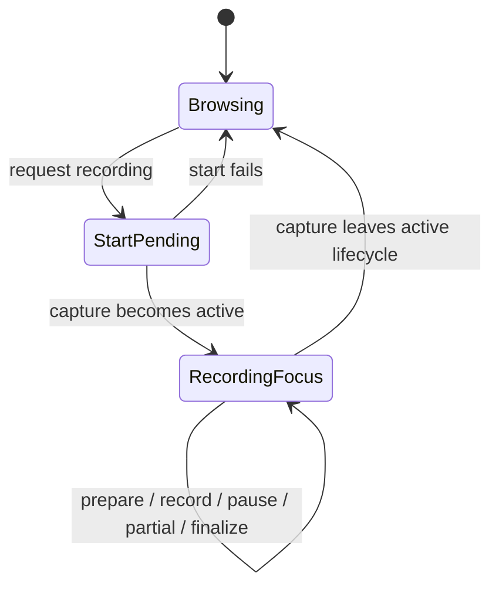

# Recording Focus and Dialog Simplification - Plan

## Goal Capsule

- **Objective:** 录音期间，用户始终留在可见、可控制的录音页面，并通过克制、一致的编辑与确认交互完成改名和停止保存。
- **Means:** 把活动录音设为 Shell 专注态，统一共享输入控件的轻量聚焦样式，简化标题编辑触发器和停止确认 AlertDialog。（KTD1–KTD5）
- **Authority:** 本轮用户反馈决定交互和文案；本地 shadcn/Radix Nova primitives 决定组件语义；现有录音状态机决定录音是否处于活动状态。
- **Execution profile:** 先调整共享 primitives，再完成标题交互、Shell 专注态和停止确认；保留当前工作树中的既有修改，不覆盖或重置无关内容。
- **Stop conditions:** 如果隐藏主导航需要改变录音状态机、跨窗口录音协议或持久化结构，停止并重新确认范围。
- **Tail ownership:** 本计划覆盖 Electron Renderer 与项目级 UI 规范，不覆盖 Main、Preload、原生录音、数据库或发布流程。

---

## Product Contract

### Summary

录音名称本身作为编辑入口。鼠标悬停只改变为文本编辑光标，不显示编辑图标、边框或背景；点击进入编辑，非输入法组合态的 Enter 或失焦提交保存。

活动录音使用专注模式。开始录音的异步过程保留当前 Shell，但禁止主导航切换；录音进入活动生命周期后，最左侧主导航和无对应语义的返回按钮不显示。capture 完成、失败或进入恢复/历史详情后恢复这些入口。停止确认继续使用 AlertDialog，但外观与普通 Dialog 统一，内容只保留“提示”、一句说明以及“取消”“确定”。

本计划保留 `docs/plans/2026-09-04-feat-desktop-recording-detail-shell-plan.md` 作为基础方案，只取代其中与本轮要求冲突的标题触发、保存键盘行为、跨页面录音和停止确认设计。

### Problem Frame

当前标题触发器使用 `ghost` 按钮，因此 hover 会显示背景；Input 和 Textarea 同时改变边框并增加 ring，视觉上形成偏粗的双层聚焦状态。录音详情仍保留主导航和栏目历史返回按钮，但路由切换可能让启动中的录音在其他页面开始，返回按钮也不负责关闭录音详情。

停止确认虽然是普通二选一决策，当前确认按钮仍使用危险色、图标和较长文案。Dialog 与 AlertDialog 的视觉已基本对齐，但短消息弹窗的信息层级尚未形成明确的项目规则。

### Key Decisions

- **录音名称 hover 只改变光标。** (session-settled: user-directed — chosen over icon, border, and background affordances: the title itself already communicates the edit target.) Governs R1–R2.
- **活动录音采用专注模式。** (session-settled: user-directed — chosen over unrestricted cross-page navigation: recording controls must remain visible while capture is active.) Governs R4–R6.
- **保留 AlertDialog 的确认语义，但不赋予特殊警告视觉。** (session-settled: user-directed — chosen over replacing it with Dialog or presenting the action as destructive: the decision is binary but not dangerous.) Governs R7–R9.
- **短系统消息按类型与内容分层。** (session-settled: user-directed — chosen over promoting the complete message sentence into the title: type, fact, and action should each have one owner.) Governs R8–R10.

### Requirements

**录音名称与输入焦点**

- R1. 可编辑录音名称不显示编辑图标，hover 仅使用文本编辑光标，不出现背景、边框或其他装饰状态。
- R2. 点击名称进入单行编辑；失焦或非输入法组合态的 Enter 提交保存，输入法候选确认的 Enter 不退出编辑。
- R3. 共享 Input 和 Textarea 聚焦时保持原边框粗细，移除边框变色与外层 ring 的叠加，改用范围小、低透明度的焦点阴影；无效状态仍保留清晰的错误反馈。

**录音专注态**

- R4. 从录音启动请求 pending 开始阻止主导航和栏目历史导航，直到启动失败或录音进入可见详情；不得让延迟完成的启动在其他页面中形成隐藏录音。
- R5. 活动录音详情在 preparing、recording、paused、partial capture 和 finalizing 等现有进行中状态隐藏最左侧主导航，并让内容区占用释放后的空间。
- R6. 活动录音详情隐藏顶部返回按钮及其分隔线；录音完成、失败或进入非活动历史/恢复详情后，Shell 按原有路由能力恢复主导航和返回按钮。

**停止确认与弹窗规范**

- R7. “停止并保存”继续使用受控 AlertDialog，保留取消优先聚焦、点击外部不关闭、单次提交和异步 pending 行为。
- R8. 停止确认显示标题“提示”和正文“停止录制后，当前内容将自动保存。”，不显示警告或停止图标。
- R9. AlertDialog footer 仅显示“取消”和“确定”；确定使用普通主按钮，不使用危险色，pending 时允许显示“正在保存…”并禁用重复操作。
- R10. 对于只有一条简短系统消息且没有独立任务名称的弹窗，项目规范要求标题标识消息类型、正文承载完整事实、footer 只保留决策必需的动作，并禁止跨区域重复同一内容。

### Scope Boundaries

**In scope**

- Electron 共享 Input、Textarea 和 Button primitive 的必要样式能力。
- 录音标题触发器、录音态 Shell 导航和返回按钮。
- 停止保存 AlertDialog 的内容与动作样式。
- `AGENTS.md` 中可复用的短消息弹窗信息架构规则。

**Deferred to Follow-Up Work**

- 支持录音跨页面运行的全局录音条、跨页面停止入口和后台状态提示。
- Select、Checkbox、Switch 等非文本输入控件的焦点样式重审。
- 非停止保存场景的存量弹窗文案批量迁移。

**Out of scope**

- 录音采集、暂停、恢复、停止和保存协议的语义变更。
- Dialog 与 AlertDialog 的合并、替换或新建第三套弹窗组件。
- 主导航之外的跨窗口、深链接或系统级导航重构。

### Acceptance Examples

- AE1. **Covers R1–R2.** Given 一个可编辑的活动录音名称，when 鼠标移入标题，then 光标变为文本编辑样式且标题没有背景、边框或图标；点击后出现输入框，失焦或普通 Enter 只提交一次。
- AE2. **Covers R2.** Given 用户正在用中文输入法编辑名称，when 按 Enter 确认候选词，then 输入框保持编辑状态；组合结束后再次按 Enter 才提交。
- AE3. **Covers R3.** Given 任一共享 Input 或 Textarea，when 通过鼠标或键盘获得焦点，then 控件显示轻量阴影且没有双层粗焦点；无效控件仍能与普通聚焦状态区分。
- AE4. **Covers R4–R6.** Given 录音启动请求尚未完成或录音正在进行，when 用户尝试通过主导航或顶部返回按钮离开，then 页面不发生切换；活动录音详情不显示这些入口，录音离开活动状态后入口恢复。
- AE5. **Covers R7–R9.** Given 用户点击“停止并保存”，when AlertDialog 打开，then 取消按钮获得默认焦点，弹窗外点击不关闭，界面只显示“提示”、一句正文、“取消”和普通主色“确定”，确认期间不重复提交。

---

## Planning Contract

### Key Technical Decisions

- KTD1. **在共享文本输入 primitive 中实现焦点阴影。** (session-settled: user-directed — chosen over feature-level overrides and the current border-plus-ring combination: all text fields should share one thin focus treatment.) `Input` 和 `Textarea` 共同移除常规聚焦 ring/边框叠加，并保留独立的 `aria-invalid` 状态。Governs R3.
- KTD2. **为 Button primitive 增加无装饰的文本触发 variant。** (session-settled: user-directed — chosen over ghost hover styling and feature-owned interaction classes: the recording title needs button semantics without a hover surface.) 新 variant 复用 Button 的键盘焦点与禁用语义，只移除普通 hover 的背景、边框和下划线。Governs R1–R2.
- KTD3. **在 App 层建立三态录音 Shell 模式，Shell 只消费通用显示配置。** (session-settled: user-approved — chosen over allowing background navigation: App owns capture lifecycle while AppShellFrame owns layout.) `App.tsx` 使用现有 capture helper 和 `captureStartPending` 派生 browsing、start pending 和 recording focus；后两种模式都执行导航门禁，只有 recording focus 隐藏完整侧栏子系统和返回区域。Governs R4–R6.
- KTD4. **保留两个 Radix primitive，统一视觉而不合并语义。** (session-settled: user-directed — chosen over deleting AlertDialog or creating an independently styled confirmation system: Dialog and AlertDialog differ in focus and dismissal behavior, not in visual hierarchy.) `Dialog` 与 `AlertDialog` 继续共享等价的 overlay、surface、header 和 footer 规则，AlertDialog 不增加警告装饰。Governs R7–R9.
- KTD5. **把短消息弹窗规则写入现有 UI 指南。** (session-settled: user-directed — chosen over copying one specific sentence into a retrospective note: the reusable rule should govern future modal structure.) 在 `AGENTS.md` 的 Electron visual/copy guidance 中记录 R10，不新建独立经验文档。Governs R10.

### High-Level Technical Design

`StartPending` 保留当前页面和侧栏，但拒绝主导航与栏目历史导航。`RecordingFocus` 隐藏 AppSidebar、ContextPaneShell、PaneResizeHandle、SidebarRail 和顶部返回区域，同时保留原有 pane 状态供退出专注态后恢复。Shell 只接收显示配置，不读取录音业务状态。

### Sequencing

1. 完成共享 Input、Textarea 和 Button primitive 能力及静态覆盖。
2. 使用共享能力收敛录音标题编辑交互。
3. 在 App 与 Shell 边界实现录音专注态和导航门禁。
4. 简化停止确认并补充项目级弹窗文案规则。

### Risks and Mitigations

- **导航只被隐藏但仍可调用。** 在主导航和栏目历史回调的行为边界增加状态门禁，渲染隐藏仅负责界面表达。
- **专注态结束后 Shell 状态未恢复。** 测试 pending 失败、保存完成和失败终态，确保布局由派生状态自动恢复。
- **全局焦点阴影降低键盘可见性。** 保留紧凑但清晰的对比度，并用 primitive 测试防止焦点样式被完全移除。
- **AlertDialog 确认按钮提前关闭弹窗。** 延续受控 open 与现有异步确认按钮模式，不用自动关闭绕过 pending/error 状态。

---

## Implementation Units

### U1. Unify text-field focus treatment

- **Goal:** 为全局文本输入提供轻量、单层的聚焦阴影。
- **Requirements:** R3.
- **Dependencies:** None.
- **Files:**
  - `apps/desktop-electron/src/renderer/components/ui/input.tsx`
  - `apps/desktop-electron/src/renderer/components/ui/textarea.tsx`
  - `apps/desktop-electron/tests/unit/renderer/ui_primitives_test.tsx`
- **Approach:** 按 KTD1 修改共享 primitive，保持默认边框和错误状态不变；测试直接约束 Input 与 Textarea 的共享焦点类，避免消费者自行覆盖。
- **Patterns to follow:** `apps/desktop-electron/src/renderer/components/ui/button.tsx` 的薄焦点语义和现有 `aria-invalid` 分层。
- **Test scenarios:**
  - Input 和 Textarea 都包含焦点阴影，不再同时包含常规 `focus-visible:border-ring` 与 `focus-visible:ring-1`。
  - `aria-invalid` 输入仍保留 destructive 边框或等价错误反馈，不被普通焦点阴影覆盖。
- **Verification:** primitive 测试能证明两个文本输入共享同一焦点策略，且没有移除错误状态。

### U2. Simplify the recording-title edit trigger

- **Goal:** 让标题通过光标和点击表达可编辑性，不增加图标或 hover surface。
- **Requirements:** R1–R2; AE1–AE2.
- **Dependencies:** U1.
- **Files:**
  - `apps/desktop-electron/src/renderer/components/ui/button.tsx`
  - `apps/desktop-electron/src/renderer/features/capture/capture-workspace.tsx`
  - `apps/desktop-electron/tests/unit/renderer/ui_primitives_test.tsx`
  - `apps/desktop-electron/tests/unit/renderer/capture_workspace_test.tsx`
- **Approach:** 按 KTD2 由共享 Button 提供无装饰 variant，录音标题只保留布局、截断和 `cursor-text`；继续使用现有 Input 编辑和保存控制器。
- **Test scenarios:**
  - Covers AE1. 展示态标题没有 Pencil 图标、hover 背景或 hover 边框，点击后输入框获得焦点。
  - Covers AE1. 普通 Enter 和失焦分别触发保存，重复 blur 不产生第二次提交。
  - Covers AE2. `isComposing=true` 的 Enter 不触发 blur，组合结束后的 Enter 正常保存。
  - 只读录音标题仍渲染为 heading，不暴露编辑按钮语义。
- **Verification:** 标题交互测试覆盖鼠标、键盘和输入法组合路径，feature 不再拥有装饰性交互样式。

### U3. Add recording-focused shell navigation

- **Goal:** 活动录音始终保留可见控制，不能通过 Shell 导航进入隐藏录音状态。
- **Requirements:** R4–R6; AE4.
- **Dependencies:** None.
- **Files:**
  - `apps/desktop-electron/src/renderer/App.tsx`
  - `apps/desktop-electron/src/renderer/features/shell/app-shell-frame.tsx`
  - `apps/desktop-electron/tests/unit/renderer/shell_test.tsx`
  - `apps/desktop-electron/tests/unit/renderer/capture_workspace_test.tsx`
- **Approach:**
  1. 按 KTD3 在 App 层从 `captureStartPending` 与现有 capture lifecycle helper 派生 browsing、start pending 和 recording focus 三种模式。
  2. 在 `navigatePrimary` 和栏目历史回调中拒绝 start pending 与 recording focus 期间的页面切换，避免清除详情状态或让延迟启动失去可见控制。
  3. start pending 保留侧栏；给 `AppShellFrame` 增加通用的导航/返回区域显示配置，仅在 recording focus 不渲染 AppSidebar、ContextPaneShell、PaneResizeHandle、SidebarRail、返回按钮和相邻分隔线。
  4. 隐藏时保留 pane 的既有开合与宽度状态；capture 离开活动生命周期后恢复现有 Shell 结构，不改变历史详情的路由行为。
- **Execution note:** 先补充“pending 后导航、延迟启动完成”的回归测试，再调整门禁，避免只修视觉隐藏。
- **Patterns to follow:** `App.tsx` 现有 `applicationBlocked` / `modalOpen` 导航门禁，以及 `paneStructurallyAvailable` 的派生式 Shell 组合。
- **Test scenarios:**
  - Covers AE4. start pending 时点击其他主栏目或顶部返回按钮不会调用导航，也不会清除 capture detail 状态。
  - start pending 发生在已打开 context pane 的音频页面时，侧栏与 pane 控件保持可见但导航不生效；录音激活后整个侧栏子系统一起隐藏，不留下 resize handle 或 rail。
  - start pending 失败后主导航恢复，用户可以正常切换栏目。
  - Covers AE4. preparing、recording、paused、partial capture 和 finalizing 详情不渲染主导航、返回按钮或孤立分隔线。
  - completed、failed、recovery 和普通历史详情按现有路由状态恢复对应入口。
  - 活动录音结束后内容区几何恢复，没有残留专注态属性。
- **Verification:** Shell 与 capture 单元测试共同证明行为门禁和结构隐藏使用同一派生状态，延迟启动不会成为隐藏录音。

### U4. Simplify the stop AlertDialog and document the rule

- **Goal:** 保留 AlertDialog 的交互语义，同时让停止确认和后续短消息弹窗保持克制一致。
- **Requirements:** R7–R10; AE5.
- **Dependencies:** None.
- **Files:**
  - `apps/desktop-electron/src/renderer/components/ui/alert-dialog.tsx`
  - `apps/desktop-electron/src/renderer/features/capture/capture-footer.tsx`
  - `apps/desktop-electron/tests/unit/renderer/ui_primitives_test.tsx`
  - `apps/desktop-electron/tests/unit/renderer/capture_workspace_test.tsx`
  - `AGENTS.md`
- **Approach:** 按 KTD4 保持 Dialog 与 AlertDialog 的视觉类等价，不新增组件；停止确认移除确认按钮的 destructive variant 和图标，使用“取消”“确定”，并保留受控 pending。按 KTD5 把 R10 写入现有 UI 文案指南。
- **Test scenarios:**
  - Dialog 与 AlertDialog 的 overlay、content 和 footer 保持同一视觉层级，Dialog 的关闭按钮差异不被抹除。
  - Covers AE5. 停止确认只显示约定标题、正文和两个动作，确认按钮不是 destructive 且没有图标。
  - Covers AE5. 打开后取消按钮获得默认焦点，点击外部不关闭。
  - 连续点击确定只调用一次停止；pending 显示“正在保存…”并禁用取消和确定。
  - 停止失败时弹窗和现有错误路径保持可恢复，不提前丢失用户决策上下文。
- **Verification:** primitive 与 capture 测试分别证明视觉一致性、Radix 语义和异步停止行为；`AGENTS.md` 的规则不引用单一业务文案。

---

## Verification Contract

- 在 `apps/desktop-electron` 运行 `bunx vitest run tests/unit/renderer/ui_primitives_test.tsx tests/unit/renderer/capture_workspace_test.tsx tests/unit/renderer/shell_test.tsx`，覆盖 U1–U4 的非视觉行为与 primitive 契约。
- 本计划包含 Electron Renderer 布局、样式和视觉状态。只有用户在实施任务中明确授权视觉验证后，才能运行 `bun run check:ui:quick` 和最终的 `bun run check:ui`；代码在最终检查后如有修改，需要重新取得与变更相称的证据。
- 未获得视觉验证授权时，不启动 Electron、浏览器或 watcher，不运行 Playwright/visual suites，不更新截图或 golden；交付时明确记录这些验证被项目政策跳过。
- 本计划不触发 `check:release`、打包、冻结资源或仓库级 `dev_check.sh`。

---

## Definition of Done

- U1–U4 的要求和测试场景均已实现，目标单元测试通过。
- 活动录音不存在可由主导航或顶部返回按钮触发的页面切换，pending 启动不能在其他栏目形成隐藏录音。
- 标题 hover、文本输入聚焦和停止确认均符合本计划的克制视觉规则，并保留键盘与输入法行为。
- AlertDialog 继续承担确认语义，与 Dialog 共享视觉层级，没有第三套 modal primitive。
- 项目 UI 指南包含通用的短消息弹窗信息架构规则，没有照抄本次业务文案。
- 实施中产生的废弃样式、未使用图标、死分支和试验性代码已移除。
- 视觉验证按当前任务授权状态完成或明确跳过。
