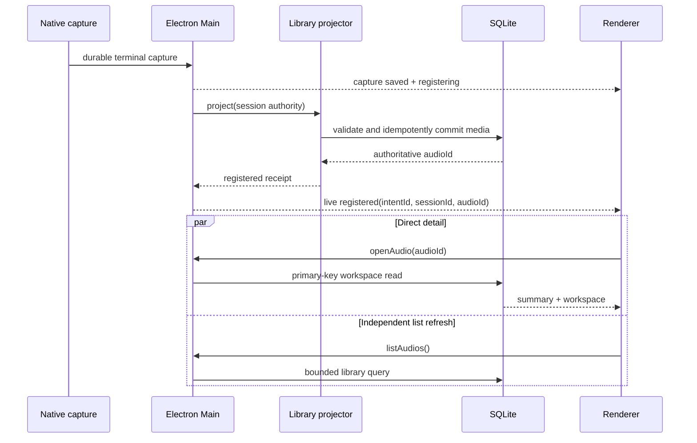
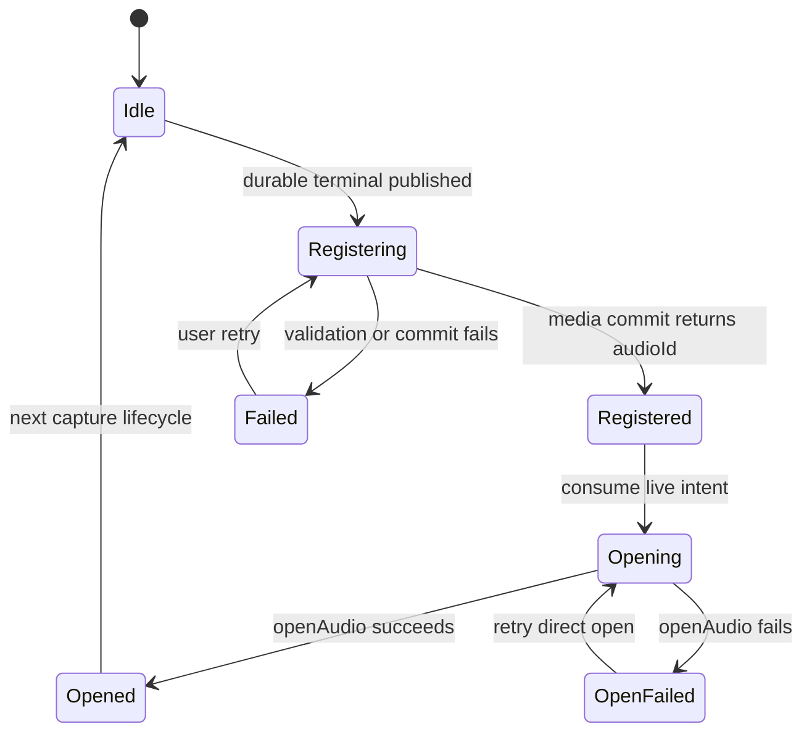
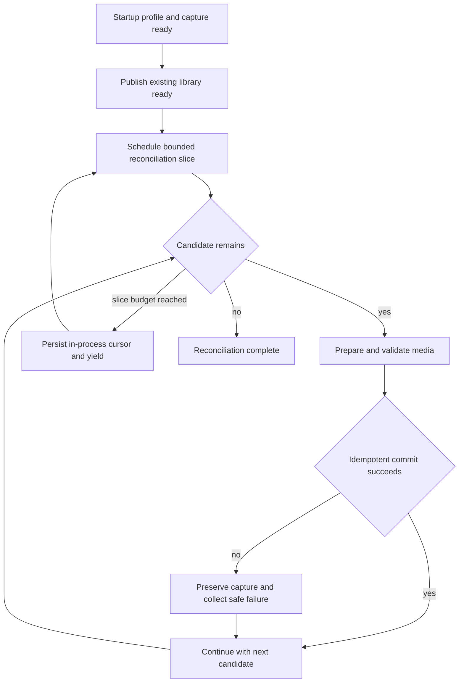

# Recording Library Handoff - Plan

## Goal Capsule

- **Objective:** 用户结束并保存录音后，音频页始终显示确定状态并自动打开刚保存的音频；既有已保存但未入库的录音可恢复，消息中心只展示应用级错误。
- **Means:** 将录音文件持久化与音频库投影拆成显式阶段，由主进程返回权威 `audioId`，renderer 直接打开该记录；消息中心改为只接收应用级错误。（KTD1、KTD2、KTD4）
- **Authority:** 本计划的 Product Contract 定义用户行为；仓库当前的 capture durability、SQLite repository、ApplicationSnapshot 和 Radix/shadcn 契约定义实现边界。
- **Execution profile:** 跨 Electron Main、shared/preload、SQLite repository 和 renderer 的深度修复；先补特征测试，再改投影协议与 UI。
- **Stop conditions:** 不以破坏录音落盘成功语义、从列表猜测最新音频、静默吞掉入库失败或引入未迁移的新表作为完成手段。
- **Landing strategy:** 在当前 checkout 实施并由用户决定后续提交或 PR；本计划不要求创建 worktree。

---

## Product Contract

### Summary

录音停止后，应用先承认原始录音已安全落盘，再明确展示“正在加入音频资料库”。入库完成后，应用使用主进程返回的 `audioId` 自动打开该音频，同时独立刷新第二栏列表。入库失败时保留可重试状态，启动时补偿历史遗漏。消息中心不再展示“录制已保存”、单条录音失败或其他文件级事件，只展示需要跨页面关注的应用级错误。

### Problem Frame

当前停止流程在音频库记录建立前就发布 `completed`。renderer 随即关闭录音详情，但此时音频列表仍可能是 `true-empty`；第二栏、首次使用空状态和主工作区的条件又同时排除了这个组合，最终渲染为空白。若后续媒体注册失败，异常仅写入日志，页面不会恢复。

媒体注册还被创建在本地模型运行时的初始化分支内。模型资源不可用时，录音本身仍可成功，但 capture 到 library 的投影服务可能根本不存在。现有启动 reconciliation 只处理正式转写准备记录，不会扫描已经持久化却没有 `audio_items` 的 capture。

### Key Decisions

- **保存后自动打开新音频。** 入库成功后直接进入刚保存音频的详情，不停留在无选择状态。Governs R3、R4。
- **消息中心只承载应用级错误。** 成功通知、单条录音状态和可在当前上下文处理的问题不进入消息中心。 (session-settled: user-directed — chosen over recording lifecycle notifications: they distract without changing the user's next decision.) Governs R8、R9、R10。

### Requirements

**保存与入库状态**

- R1. 原始录音达到 durable terminal 后仍被视为已保存，后续音频库投影失败不得把停止操作改写为录音失败。
- R2. durable terminal 与音频库可查询之间必须有显式的 `registering`、`registered`、`failed` 状态，任何状态组合都不得渲染空白主区域。
- R3. 投影成功必须携带权威 `audioId`，renderer 不得通过排序、时间或列表首项猜测新录音。
- R4. 投影成功后应立即按 `audioId` 打开音频详情；第二栏列表刷新独立进行，不得阻塞详情展示。
- R5. 投影失败必须在当前录音上下文显示安全、可操作的错误和重试入口，重试保持幂等。

**恢复与兼容**

- R6. 启动后应在后台有界扫描已经完成或由用户保留、具备录音与 journal 权威哈希、但没有 session-to-audio 投影回执的 capture，并幂等补建音频库记录。
- R7. 单条历史 capture 无法验证或补建时不得阻塞其余记录和应用启动；原始 capture 数据不得被删除或改写。

**消息中心**

- R8. “录制已保存”、部分录制、单条录音失败、处理进度和其他文件级事件不得创建消息中心条目。
- R9. 消息中心只接收显式准入的应用级错误，并以安全摘要去重同类重复错误、维护未读状态和有限的设置导航。
- R10. 已在录音详情中提供恢复动作的投影失败不得再创建重复消息；仅启动补偿整体异常或跨页面子系统异常可进入消息中心。

**性能与体验**

- R11. 自动打开路径不得等待全量音频列表查询完成；新录音无转写 generation 时应只读取概要并返回空 segments/speakers。
- R12. 列表刷新失败时，已按 ID 打开的详情应继续显示，并在列表上下文提供重试而非撤销详情。

### Acceptance Examples

- AE1. **Covers R1–R4, R11.** Given 音频库为空且用户结束第一段录音，when 原始录音先完成而列表请求仍未返回，then 页面显示入库中状态；收到 `audioId` 后直接显示该音频详情，第二栏随后出现该记录，全程没有空白画面。
- AE2. **Covers R1、R2、R5.** Given 原始录音已持久化但媒体注册失败，when 停止操作返回，then 录音仍显示为已保存，页面保留失败说明和重试动作；重试成功后打开同一条音频且不产生重复记录。
- AE3. **Covers R6、R7.** Given 启动数据库内同时存在一条可补建和一条缺少可验证 spool 的历史 capture，when 应用先完成启动并运行后台补偿，then 可补建项随后出现在音频库，失败项原样保留，音频页始终可用。
- AE4. **Covers R8–R10.** Given 录音保存成功、部分录音被保留和同类应用子系统错误发生两次，when 用户打开消息中心，then 只看到一条应用错误，出现次数为 2 且可标记已读。
- AE5. **Covers R4、R12.** Given 新音频详情已经按 ID 打开，when 后续列表刷新失败，then 详情保持可用，第二栏显示安全的刷新错误与重试入口。

### Scope Boundaries

**In scope**

- Electron 录音停止、恢复保留、启动补偿到音频库的投影协议。
- ApplicationSnapshot、preload IPC、audio route、capture detail 和消息中心的对应状态。
- 当前会话内应用级错误的去重、未读与受限导航。

### Deferred to Follow-Up Work

- 消息跨重启持久化。当前数据库只接受精确 schema v4，新增消息表需要独立设计 v4→v5 事务迁移，不能在本修复中隐式加入。
- 为 `listAudios` 增加排序与 latest-job 索引。直接按 ID 打开不依赖该优化；若大数据夹具证明列表刷新超出既有体验预算，再与正式 schema 迁移一并处理。
- 对缺少权威 spool、无法自动补建的历史 capture 增加专门的管理页面。

**Out of scope**

- 修改原生录音格式、转写模型能力、播放器行为或移动端流程。
- 将成功 toast、处理完成或单文件警告迁入消息中心。
- Electron release candidate、打包资源和发布验证。

---

## Planning Contract

### Key Technical Decisions

- KTD1. **建立模型无关的 capture-to-library projector。** 媒体准备、authority 验证和 `commitValidatedImport` 必须在 profile/capture/domain 就绪后可用，不再依赖本地模型或 resource catalog；正式转写只消费已注册媒体。
- KTD2. **把媒体提交结果提升为结构化回执。** projector 在媒体提交事务内复用 `durable_receipts` 写入唯一的 `capture-library:<sessionId>` 到 `audioId` 映射，并返回 `sessionId`、`audioId` 和是否新插入；内容相同的不同 capture 可收敛到同一音频，同时各自留下完成回执。（Governs R2–R4、R6）
- KTD3. **启动补偿复用同一 projector，但不阻塞 ready。** repository 以缺少 session-to-audio 回执为候选条件；应用先发布现有资料库 ready，再用带稳定 seek cursor 的后台切片遍历候选，每个进程生命周期持续调度到扫描结束。（Governs R6、R7）
- KTD4. **持久化回执与展示意图分离。** projector 不携带 UI 语义；只有实时停止或用户显式重试才能用新的 live intent 包装 `registered(audioId)`，renderer 随即直接打开并并发刷新列表。启动补偿只更新 library count/token。（Governs R3、R4、R11、R12）
- KTD5. **消息使用显式准入而非 capture 自动投影。** 删除 `setCapture` 中的 `nextActivity` 行为，改为应用组合根调用 `recordApplicationFailure`；消息结构只保留安全摘要、发生次数、未读和可选设置目标。（Governs R8–R10）
- KTD6. **本次消息保持内存生命周期。** 复用当前 ApplicationSnapshot 的生命周期，不新增 SQLite 表或同版本隐式 schema 变更；持久化列入独立迁移工作。（Governs R9）

### High-Level Technical Design

### System-Wide Impact

- **Data lifecycle:** capture remains the primary durability boundary; `audio_items` is a recoverable projection, while existing `durable_receipts` records the stable session-to-audio relationship.
- **Interfaces:** ApplicationSnapshot gains a typed projection state; retry crosses shared contract, preload and Main. No renderer database access is introduced.
- **Performance:** direct open remains primary-key based and can render an untranscribed recording without segment scans. The bounded list query is eventual UI synchronization, not a gate.
- **Privacy:** messages and errors use fixed safe summaries; capture titles, paths, hashes and native error text do not enter message center payloads.
- **Stakeholders:** users regain immediate feedback and old recordings; developers gain one reusable projection path; operations retain console diagnostics for raw causes without exposing them in UI.

### Risks & Mitigations

- Live stop and startup compensation could target the same capture. Serialize projection per session and rely on existing unique hashes plus idempotent commit receipts.
- A stale registered signal could reopen an old audio after navigation. Fence consumption by session/token and mark a receipt consumed after successful selection.
- A capture may have terminal database fields but invalid or missing spool data. Validate the existing journal authority, preserve failures and continue later candidates without delaying initial readiness.
- A stable invalid candidate could consume every batch. Treat the bound as a work-slice budget and advance an in-process seek cursor so later candidates are not starved during the same launch.
- Removing capture activity could hide actionable partial recordings. Keep those states and actions in capture/recovery UI and add regression coverage before deleting message entries.
- Existing dirty renderer work overlaps `App.tsx` and capture components. Implementation must preserve unrelated user changes and inspect the diff before editing.

### Sources / Research

- `apps/desktop-electron/src/main/index.ts` — current stop ordering, model-coupled handoff construction and bootstrap boundary.
- `apps/desktop-electron/src/main/domain/captions/capture_formal_completion.ts` and `formal_transcript_handoff_service.ts` — swallowed failure and discarded media commit result.
- `apps/desktop-electron/src/main/storage/desktop_repository.ts` — authoritative `{audio, mediaAuthorityId, inserted}` commit result.
- `apps/desktop-electron/src/main/storage/repositories/audio_workspace_repository.ts` — direct primary-key open and independent bounded list query.
- `apps/desktop-electron/src/renderer/App.tsx` and `features/audios/audio-route-feature.tsx` — blank-state branch gap and existing direct import selection pattern.
- `docs/solutions/architecture-patterns/desktop-first-workstation-boundaries.md` — Electron composition-root ownership and committed-data boundary guidance.
- ByeByte sibling repository `apps/desktop-electron/src/main/storage/grouped-queue-repository.ts` and `docs/plans/2026-09-13-2342-refactor-voice-studio-appshell-grouped-file-queue-plan.md` — application-message admission, safe dedupe and file-context separation pattern.

---

## Implementation Units

### U1. Establish regression contracts at the broken handoff boundary

- **Goal:** Lock the current durability promise and reproduce the missing projection before structural changes.
- **Requirements:** R1–R3.
- **Dependencies:** None.
- **Files:** `apps/desktop-electron/tests/unit/capture_formal_completion_test.ts`, `apps/desktop-electron/tests/integration/formal_transcript_handoff_test.ts`, `apps/desktop-electron/tests/e2e/macos_capture_flow_test.ts`.
- **Approach:** Keep passing characterization for the existing capture durability promise, then add intentionally failing contract tests for the missing structured receipt and model-unavailable projection path. Do not preserve the discarded receipt or silent-null behavior being replaced.
- **Execution note:** Start with failing contract tests for the structured projection receipt and the model-unavailable path.
- **Patterns to follow:** Existing capture formal completion and macOS capture flow fixtures.
- **Test scenarios:**
  - A durable completed capture projects without any processing identity and returns its authoritative audio ID.
  - A missing local model/resource identity does not disable capture media registration.
  - A projection exception is reported as projection failure while the capture result remains completed.
- **Verification:** Tests distinguish capture durability from library visibility and fail against the current silent-null behavior.

### U2. Extract the model-independent library projector

- **Goal:** Make capture media registration a reusable, idempotent service that returns a structured receipt.
- **Requirements:** R1、R3、R5.
- **Dependencies:** U1.
- **Files:** `apps/desktop-electron/src/main/domain/captions/formal_capture_media.ts`, `apps/desktop-electron/src/main/domain/captions/formal_transcript_handoff_service.ts`, `apps/desktop-electron/src/main/domain/captions/capture_formal_completion.ts`, `apps/desktop-electron/src/main/domain/capture/capture_library_projection_service.ts`, `apps/desktop-electron/src/main/storage/desktop_repository.ts`, `apps/desktop-electron/src/main/index.ts`, `apps/desktop-electron/tests/unit/domain/desktop_domain_service_test.ts`, `apps/desktop-electron/tests/integration/capture_library_projection_test.ts`, `apps/desktop-electron/tests/integration/formal_transcript_handoff_test.ts`.
- **Approach:**
  1. Move media-only preparation, validation and commit orchestration behind the projector while retaining the current hardened file authority checks.
  2. Return `audioId` and insertion identity from `commitValidatedImport`, and atomically record one `capture-library:<sessionId>` durable receipt even when content deduplication reuses an existing audio.
  3. Construct the projector independently of local transcription resources; let formal processing reference it without owning its availability.
- **Patterns to follow:** `SecureImportDomainService` result propagation and current `prepareFormalCaptureMedia` validation.
- **Test scenarios:**
  - First projection inserts one media authority/audio item and returns that row's ID.
  - Repeating the same session projection returns the same audio ID with no duplicate rows.
  - Two capture sessions with identical normalized content each receive a session receipt and resolve to the same existing audio ID.
  - Invalid journal, changed spool and failed SQLite commit leave the capture untouched and return a safe failure classification.
  - Formal processing continues to schedule only when a processing identity exists.
- **Verification:** One service owns capture-to-library projection in both model-available and model-unavailable configurations.

### U3. Add bounded startup reconciliation

- **Goal:** Recover eligible historical captures that never received an audio library record.
- **Requirements:** R6、R7.
- **Dependencies:** U2.
- **Files:** `apps/desktop-electron/src/main/storage/repositories/capture_repository.ts`, `apps/desktop-electron/src/main/domain/capture/capture_library_projection_service.ts`, `apps/desktop-electron/src/main/index.ts`, `apps/desktop-electron/tests/integration/capture_library_projection_test.ts`, `apps/desktop-electron/tests/e2e/macos_capture_flow_test.ts`.
- **Approach:**
  1. Query terminal captures with recording/journal hashes and either a valid stop receipt or explicit kept disposition, excluding sessions that already have a `capture-library:<sessionId>` durable receipt.
  2. Publish the existing library ready state first, then replay candidates through U2 in background work slices with per-session serialization and a stable seek cursor.
  3. Bound each slice by candidate count plus elapsed work budget, yield between slices and keep scheduling until the scan ends; continue past invalid candidates and reserve application messages for scheduler-level failure.
- **Execution note:** Implement the candidate query and idempotency test-first because startup backfill changes persistent projections.
- **Patterns to follow:** Bounded loops in `FormalTranscriptHandoffService.reconcileStartup` and repository-owned startup reconciliation.
- **Test scenarios:**
  - A valid historic completed capture without a receipt becomes one audio item after initial readiness and increments the library token/count.
  - A user-kept partial capture is eligible; an unsettled partial capture without stop/keep authority is not.
  - Existing media is skipped, repeated startup is a no-op and live/reconcile overlap still yields one audio item.
  - One invalid candidate does not prevent a later valid candidate or application readiness.
-  - More invalid candidates than one slice limit cannot starve a valid candidate later in the stable ordering during the same launch.
-  - Exceeding a slice budget yields and resumes without deleting captures or duplicating audio rows.
- **Verification:** Fresh, repeated and mixed-success startup fixtures produce deterministic library rows and counts.

### U4. Publish projection state and retry across the Electron boundary

- **Goal:** Give renderer an authoritative `registering | registered | failed` state and a safe retry command.
- **Requirements:** R2–R5、R12.
- **Dependencies:** U2.
- **Files:** `apps/desktop-electron/src/shared/contracts/application_state.ts`, `apps/desktop-electron/src/shared/contracts/ipc.ts`, `apps/desktop-electron/src/preload/api.ts`, `apps/desktop-electron/src/main/application/application_state.ts`, `apps/desktop-electron/src/main/index.ts`, `apps/desktop-electron/tests/unit/application_activity_test.ts`, `apps/desktop-electron/tests/unit/preload_api_test.ts`, `apps/desktop-electron/tests/e2e/macos_capture_flow_test.ts`.
- **Approach:**
  1. Add a session- and live-intent-scoped library projection union to ApplicationSnapshot and a validated projection retry request.
  2. Publish `registering` after durable capture publication, then `registered(audioId)` or `failed(safeMessage)` from the projector.
  3. Route retry through the same serialized projector and reject stale/mismatched sessions without changing the capture result.
- **Patterns to follow:** Existing discriminated application states, Zod IPC validation and capture command idempotency fences.
- **Test scenarios:**
  - State transitions occur in order and preserve the same capture session.
  - Registered state rejects missing/invalid audio IDs; failed state never contains raw paths or exception strings.
  - Duplicate retry calls share or replay one projection and publish one registered receipt.
  - A retry for another or non-terminal session is rejected without state mutation.
  - Startup reconciliation updates library count/token without publishing a live intent that can trigger selection.
- **Verification:** Main, preload and shared types agree, and every durable terminal path publishes a non-ambiguous projection state.

### U5. Remove the renderer blank state and auto-open by ID

- **Goal:** Keep the audio workspace visible through projection and open the new recording without waiting for its list row.
- **Requirements:** R1–R5、R11、R12.
- **Dependencies:** U4.
- **Files:** `apps/desktop-electron/src/renderer/App.tsx`, `apps/desktop-electron/src/renderer/features/audios/audio-route-feature.tsx`, `apps/desktop-electron/src/renderer/features/capture/capture-workspace.tsx`, `apps/desktop-electron/tests/unit/renderer/audio_route_test.tsx`, `apps/desktop-electron/tests/unit/renderer/capture_workspace_test.tsx`, `apps/desktop-electron/tests/unit/renderer/shell_test.tsx`.
- **Approach:**
  1. Keep capture detail or an explicit full workspace state visible while projection is registering or failed; `true-empty` must always select a concrete rendering branch.
  2. On a new live registered receipt, enter a renderer-owned `opening` state, call the existing direct `selectAudio(audioId)` path and refresh the list independently.
  3. If direct open fails, retain `audioId` in `open_failed` and retry only `openAudio(audioId)`; projection retry remains exclusive to projection failure, and list retry remains exclusive to the list.
  4. Close the capture state only after direct open succeeds. Move focus once to the new audio-detail heading only when focus still belongs to the disappearing capture workspace; otherwise preserve the user's current focus.
  5. Fence auto-open so rerenders, stale snapshots, navigation and startup backfill do not steal selection.
- **Patterns to follow:** Existing import flow `refreshAudios` plus `selectAudio(result.audioId)`, local shadcn primitives and repository accessibility guidance.
- **Test scenarios:**
  - Covers AE1. A deferred list request does not delay direct detail display after registered receipt.
  - Covers AE2. Failed projection shows retry and never renders an empty main element.
  - Projection success followed by a failed direct open shows a distinct retry; retry succeeds while the list request remains unresolved and does not rerun projection.
  - Replaying the same receipt does not call `openAudio` twice or reopen after the user selects another audio.
  - Successful auto-open moves focus from a removed capture control to the audio heading, but preserves focus after the user has moved elsewhere.
  - Covers AE5. List refresh failure preserves the opened workspace and exposes list retry.
  - Completed, partial, failed, registering, registered and projection-failed combinations each render a named stable state.
- **Verification:** Static renderer tests prove the former `true-empty + completed` gap is unreachable and authoritative selection replaces newest-row guessing.

### U6. Restrict the message center to application failures

- **Goal:** Remove distracting capture lifecycle messages and admit only deduplicated application-level errors.
- **Requirements:** R8–R10.
- **Dependencies:** U4.
- **Files:** `apps/desktop-electron/src/shared/contracts/application_state.ts`, `apps/desktop-electron/src/preload/api.ts`, `apps/desktop-electron/src/main/application/application_state.ts`, `apps/desktop-electron/src/main/index.ts`, `apps/desktop-electron/src/renderer/App.tsx`, `apps/desktop-electron/src/renderer/features/activity/activity-center.tsx`, `apps/desktop-electron/tests/unit/application_activity_test.ts`, `apps/desktop-electron/tests/unit/renderer/activity_center_test.tsx`, `apps/desktop-electron/tests/unit/renderer/shell_test.tsx`.
- **Approach:**
  1. Replace capture-derived activity items with an explicit application failure contract containing safe summary, occurrence count, unread state and optional settings target.
  2. Admit only bounded composition-root failures such as unavailable native/runtime subsystems or aggregate startup reconciliation failure; keep per-recording projection errors in U5.
  3. Merge equal kind/summary/target events, preserve read operations and update empty/detail copy to state the application-error-only policy.
- **Patterns to follow:** ByeByte's application-message classification and dedupe semantics, adapted to KTD6's in-memory boundary.
- **Test scenarios:**
  - Covers AE4. Completed, partial and failed capture transitions produce no messages.
  - Two identical admitted application failures create one unread message with occurrence count 2.
  - Different safe summaries or settings targets remain distinct and preserve newest-first order plus the existing item cap.
  - Reading one/all messages is idempotent; an unknown ID keeps the snapshot unchanged.
  - Raw native errors, paths, capture titles and hashes never appear in rendered or serialized messages.
- **Verification:** Message-center fixtures contain only explicit application errors, and recording recovery remains reachable from recording context.

---

## Verification Contract

| Gate | Applies to | Completion signal |
| --- | --- | --- |
| Focused Vitest suites for capture completion, projector reconciliation, application state, preload, audio route, capture workspace and shell | U1–U6 | All new happy, overlap, restart, retry and privacy scenarios pass without UI launch. |
| `bun run check:code` from `apps/desktop-electron` | U1–U6 | Formatting, lint, TypeScript, full Vitest, boundary and lifecycle checks pass for the final code state. |
| `bun run check:ui:quick` then final `bun run check:ui` from `apps/desktop-electron` | U5、U6 | Run only after the user explicitly authorizes visual validation for this task; otherwise record that these policy-gated checks were skipped. |
| Visual/browser/device validation | U5、U6 | Not authorized in the planning session. Do not launch Electron, a browser, screenshots, goldens or the UI watcher without separate explicit authorization. |
| Release validation | None | Not required because this is not an Electron candidate or release-evidence request. |

The performance regression boundary is behavioral: with `listAudios` deliberately unresolved, a registered receipt must still invoke `openAudio(audioId)` and render its workspace. No schema/index change is required to prove or ship direct-ID auto-open.

---

## Definition of Done

- The first saved recording and subsequent recordings appear in the library and open from an authoritative ID without an intermediate blank page.
- Capture save success remains durable and truthful even when library projection fails.
- Failed live projections can be retried; eligible historical gaps reconcile idempotently at startup without blocking on bad siblings.
- No capture success, partial or per-recording failure event appears in the message center; admitted application errors are safe, deduplicated and readable.
- Every U1–U6 test scenario is represented in stable automated coverage, and the required non-visual gate passes.
- Visual checks are run only if explicitly authorized and their result is recorded; lack of authorization is reported, not silently substituted.
- The final diff contains no abandoned experimental paths, accidental schema changes, unrelated user-edit rewrites or raw private diagnostic content.
