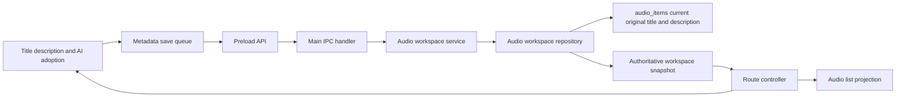
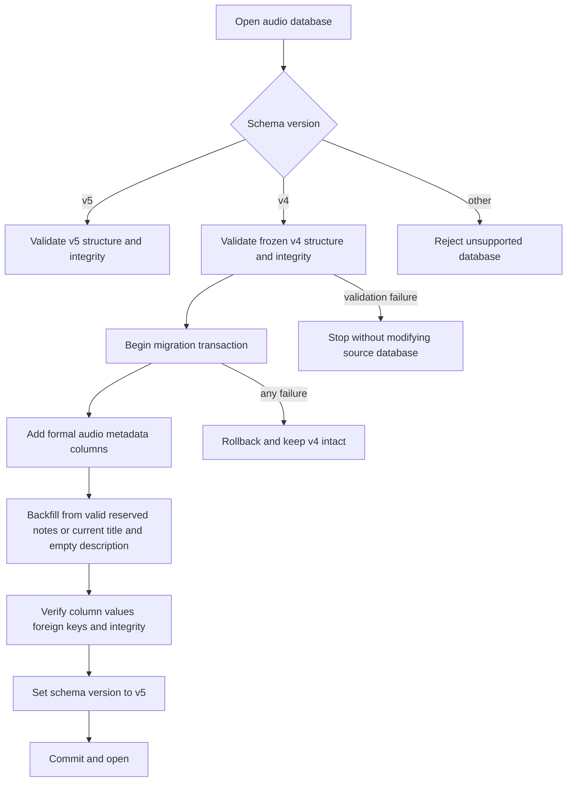
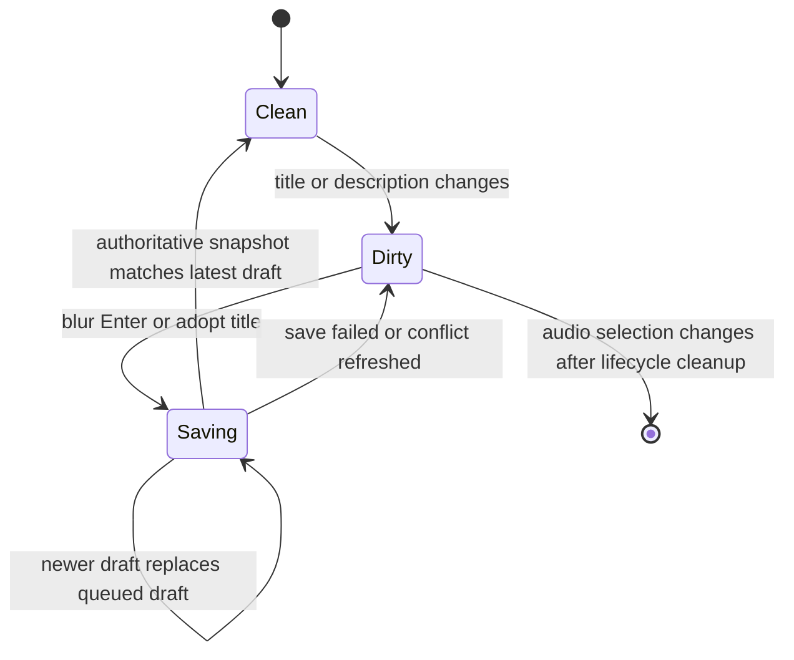

# Electron Audio Detail Workspace Redesign - Plan

## Goal Capsule

| Field | Contract |
| --- | --- |
| Objective | 用户可以在一个稳定、清晰的音频详情工作区内编辑音频信息、阅读转写、使用 AI 总结和持续控制播放，不会因滚动或切换内容丢失上下文。 |
| Means | 以 ReUI Form 4 的内容结构为视觉参考，使用现有 Electron Shell、Radix/shadcn primitives、音频控制器和正式 SQLite 元数据模型完成详情页重组。（KTD1–KTD6） |
| Authority | 本计划的 Product Contract 决定功能与交互；项目 Electron 指南决定组件、无障碍和验证边界；现有 controller、IPC 与存储契约决定业务状态所有权。 |
| Execution profile | 不先整体回滚当前草稿。执行时按 U-ID 对照现有差异，保留符合计划的部分，原地修正不合适的实现，并对已有脏文件只做最小 hunk 级编辑。 |
| Stop conditions | 如果正式元数据迁移无法无损保留 v4 数据、实现要求覆盖用户原有录制聚焦改动，或现有播放关闭契约无法保持，则停止对应单元并报告证据。 |
| Tail ownership | 本计划覆盖本地实现和非视觉验证；没有当前任务的显式授权时，不启动应用、浏览器、截图、golden 或视觉测试。 |

---

## Product Contract

### Summary

音频详情页取消传统 Shell Header，以可直接编辑的标题和描述作为页面起点。页面主体使用「转写文本」「AI 总结」「知识库」三个 TAB，播放器固定在 Shell Footer，导入入口回到音频列表区域。现有转写、编辑、说话人、AI 和播放能力继续使用真实业务状态，不添加尚未实现的分享或知识库搜索。

### Problem Frame

现有音频详情把播放、AI、转写和低频操作混在同一滚动区域内，页面层级不稳定。用户滚动后会失去播放控制，详情 Header 与内容标题重复，AI 能力也没有形成独立区域。当前未提交草稿已经实现了部分目标，但开始于正式计划之前，其中元数据借用了 `audio_notes`，部分保存和同步流程仍会丢操作或显示旧状态。

### Key Decisions

- **详情内容从标题开始，不保留传统 Shell Header。**（session-settled: user-directed — chosen over retaining the previous header: the user prefers the Form 4 content hierarchy.）Governs R1, R3–R5.
- **播放器固定在 Footer。**（session-settled: user-directed — chosen over keeping playback inside scrollable content: playback must remain reachable while scrolling and changing tabs.）Governs R7.
- **详情能力分为三个 TAB。**（session-settled: user-directed — chosen over one mixed page: transcript, AI summary, and knowledge need clear ownership.）Governs R5, R6, R8.
- **知识库只显示真实占位。**（session-settled: user-approved — chosen over a non-functional search field: the product has no knowledge capability yet.）Governs R8.
- **保留 AI 建议标题，由用户主动采用。**（session-settled: user-approved — chosen over hiding or automatically applying the suggestion: adoption should be explicit and save immediately.）Governs R6.
- **滚动标题采用轻量淡入。**（session-settled: user-directed — chosen over complex scaling and position interpolation: the transition should not feel abrupt.）Governs R4.
- **不展示没有真实能力的分享操作。**（session-settled: user-approved — chosen over placeholder actions: visible controls must correspond to working behavior.）Governs R3.
- **离开时不由元数据保存失败阻断导航。**（session-settled: user-directed — chosen over retry/discard confirmation or forcing the user to remain: failed title/description drafts are discarded and navigation continues.）Governs R10.

### Conversation Trace

| 对话中确认的方向 | 计划落点 |
| --- | --- |
| 播放器固定在 Footer，不受正文滚动或 TAB 切换影响 | R7, F4, U5 |
| 参考 ReUI Form 4 的内容层级，取消传统详情 Header | R1, KTD8, U4 |
| 标题和描述以文本形态展示，点击后原位编辑；空草稿显示占位 | R1–R2, F1, U3–U4 |
| 标题右侧使用右对齐、无边框的低频 icon button | R3, R12, U4 |
| 主标题滚出后轻量淡入紧凑标题与操作区，不做复杂缩放；编辑时暂停收起 | R4, U4 |
| 三个 TAB 分别承载转写文本、AI 总结和知识库 | R5–R6, R8, U4, U6 |
| AI TAB 接入已有完整能力和已返回字段，不新增尚未定义的摘要分类 | R6, U6, Out of Scope |
| 保留 AI 建议标题，由用户点击“采用标题”后立即保存 | R6, F2, U3, U6 |
| 知识库尚未实现，先做居中真实占位，不放假搜索框 | R8, U6 |
| 导入从音频详情移出；有数据时放在列表区，空资料库保留首次导入 | R9, U6 |
| 不先整体还原已写代码；按计划逐项保留、重构或选择性撤回 | KTD1, Implementation Constraints |
| 离开或切换音频时，标题/描述保存失败也继续导航并丢弃未保存草稿 | R10, F1, U3 |

### Requirements

- R1. 选中音频后，详情页隐藏传统 Shell Header，并以文本形态的标题、描述和右侧操作区作为首屏内容；点击标题或描述后在原位进入编辑，空草稿显示对应占位。
- R2. 标题和描述必须持久化；空标题编辑草稿先显示占位，结束编辑时恢复音频首次进入资料库时的名称；空描述保持为空并显示“添加描述”占位。
- R3. 标题右侧只展示真实的低频全局操作，并右对齐为无边框 icon button 且具有明确 accessible name。导出保留；分享和无有效内容的“更多”不展示；转写撤销和重做留在转写工具区。
- R4. 主标题离开内容视口后，TAB 区域顶部轻量淡入紧凑标题和同一组全局操作；回到顶部时淡出；编辑标题或描述期间暂停收起；减少动态效果偏好下不播放非必要过渡。
- R5. 默认打开「转写文本」TAB。搜索、结果定位、虚拟列表、片段编辑、说话人管理和转写处理状态都留在该 TAB。
- R6. 「AI 总结」TAB 保留现有准备、同意、生成、运行、失败、重试和重新生成流程，展示建议标题、音频类型、条目类型、正文、负责人、截止时间和转写证据。证据返回转写 TAB；“采用标题”立即走正式元数据保存流程。
- R7. 播放器由 Shell Footer 承载，不随正文滚动或 TAB 切换卸载。切换音频或离开音频工作区时，继续遵守现有关闭和失败恢复契约。
- R8. 「知识库」TAB 显示居中的未开放占位，不渲染可交互的搜索框，不产生后端调用。
- R9. 有音频时，导入入口位于音频列表的 Context Pane 顶部；空资料库继续保留首次使用页面的导入入口；详情操作区不再包含导入。
- R10. 元数据保存必须串行协调 revision，保留最新待保存草稿。用户停留在当前详情时，失败或冲突不能静默丢弃新输入；用户发起切换音频、清除选择或离开 Audio 时，如果最终元数据保存失败，则丢弃未保存的标题/描述草稿并继续导航。成功后详情标题、紧凑标题和音频列表使用同一权威结果。
- R11. 正式元数据模型必须通过事务性 v4→v5 迁移无损保留已有音频、转写、AI、录音和互联数据；迁移失败完整回滚，未来版本和损坏数据库继续被拒绝。
- R12. TAB、表单和 icon button 保持明确名称、轻量可见焦点、原生禁用语义及完整 TAB 键盘交互；不添加重复播报协议。
- R13. 实施不得覆盖或回滚当前工作区中既有的录制聚焦、侧栏和路由改动。
- R14. 没有当前任务的显式视觉验证授权时，只运行非视觉静态检查和测试，并明确记录视觉验证未执行。

### Key Flows

- F1. **编辑音频信息**：用户修改标题或描述并离开字段；系统排队最新草稿、使用当前 revision 保存并同步详情和列表。空标题恢复原始名称，空描述保持为空。用户停留时保存失败保留草稿和重试路径；用户主动离开或切换音频时，最终保存失败则丢弃未保存草稿并继续导航。
- F2. **采用 AI 标题**：用户在 AI TAB 点击“采用标题”；系统立即提交建议标题，成功后所有标题展示同步，失败时保留用户可见草稿和重试路径。
- F3. **从 AI 证据返回转写**：用户点击证据；页面先切回转写 TAB，再按 generation、segmentId 和时间范围匹配当前片段。任一身份信息不匹配时仍返回转写并显示证据失效，不伪造定位；文本内容变化不扩展为本次失效检测协议。
- F4. **持续播放**：用户滚动或切换 TAB 时，Footer 播放器和播放实例保持；切换音频或离开音频工作区时，控制器关闭原实例后再完成导航。

### Acceptance Examples

- AE1. **Covers R1–R5.** Given 一个已有转写的音频，when 用户打开详情并滚动主标题离开视口，then 传统 Header 不出现，紧凑标题平滑出现，转写 TAB 的全部编辑能力仍可使用。
- AE2. **Covers R2, R10–R11.** Given 一个从 v4 升级的音频，when 用户清空标题和描述并重新打开应用，then 标题恢复迁移时记录的原始名称，描述为空，其他音频数据保持不变。
- AE3. **Covers R6, R10.** Given AI 返回一个合法长度的建议标题，when 用户点击“采用标题”，then 标题立即持久化并同步到详情、紧凑标题和音频列表。
- AE4. **Covers R6.** Given 当前 generation 中找不到证据的 segmentId，或同一 segmentId 的起止时间已经变化，when 用户点击证据，then 页面进入转写 TAB，说明证据已失效，并且不会定位到错误片段。
- AE5. **Covers R7.** Given 音频正在播放，when 用户滚动详情或在三个 TAB 间切换，then 播放器不消失、播放状态不中断；切换到另一音频时旧实例按现有契约关闭。
- AE6. **Covers R8–R9.** Given 资料库已有音频，when 用户查看详情，then 导入只在列表区域出现，知识库只显示未开放占位；资料库为空时首次导入入口仍可使用。
- AE7. **Covers R12.** Given 键盘用户进入 TAB 区，when 使用方向键、Home 或 End，then 焦点和活动面板按 TAB 模式变化，所有可编辑字段和 icon button 都有轻量可见焦点。
- AE8. **Covers R13–R14.** Given 工作区已有录制聚焦相关改动且视觉验证未授权，when 本计划执行完成，then 原有改动仍在，验证没有启动任何 UI 进程或更新截图。

### Scope Boundaries

#### In Scope

- Electron 音频详情内容结构、TAB、固定播放器、导入入口和现有 AI 结果展示。
- 音频标题与描述的正式数据模型、v4→v5 迁移、IPC 路径、revision 协调和列表同步。
- 与本次行为直接相关的 renderer、domain、storage、IPC 和集成测试。
- 对当前未提交草稿的逐项保留、重构和选择性删除。

#### Deferred to Follow-Up Work

- 实现知识库索引、搜索、引用或问答能力。
- 增加真实分享能力及其权限、链接和撤销流程。
- 对其他详情页面采用相同 Form 4 内容结构。

#### Out of Scope

- 修改 AI 供应商协议、提示词或后端结果 schema；本次只消费已经存在的字段。
- 修改录制聚焦模式、主导航、侧栏布局、通用跨模块路由语义或 Shell 基础 footer 实现；R10 所需的音频退出前保存/关闭门除外。
- 建设数据库备份、恢复或降级到旧应用的产品能力；v5 只提供事务迁移与失败回滚。
- 修改 Flutter 应用、音频处理 worker 或冻结资源。
- 在没有授权时启动应用、浏览器、截图、golden 或视觉测试。

---

## Planning Contract

Product Contract restructured, no scope change: R11 now owns only the user-data migration outcome; the removed recovery-copy mechanism was an implementation choice rather than product behavior.

### Key Technical Decisions

- KTD1. **以当前草稿为可审计基线，不做先行整体回滚。**（session-settled: user-approved — chosen over revert-then-reimplement: most draft behavior matches the approved direction and overlapping files contain user work.）产品编辑前先按 symbol 与 hunk 建立来源图，区分可整理的音频草稿和受保护的录制聚焦改动；每个实施单元只删除与 R1–R14 冲突且来源可确认的部分，无法归类的重叠 hunk 必须停止并报告。
- KTD2. **把正式音频元数据直接归入 `audio_items` 并升级到 schema v5。**（session-settled: user-approved — chosen over a one-to-one metadata table or continuing to encode metadata in `audio_notes`: title-related fields and description are intrinsic one-to-one audio attributes, so keeping them on their owning row avoids a join, companion-row lifecycle, and initialization trigger.）`display_name` 继续保存当前标题，新增列保存首次进入资料库时的名称和描述。所有正式音频创建路径显式写入原始名称，事务迁移负责回填既有数据并在更新版本前验证列值和其他业务数据。
- KTD3. **只为标题和描述建立尾随保存队列，并与现有写入共享轻量互斥门。**（session-settled: user-approved — chosen over replacing every revision-changing write with a global coordinator: the concrete loss occurs when a second metadata blur is dropped by the shared pending guard.）转写、撤销/重做和说话人操作继续使用现有 pending 与 revision 契约。任一侧写入在飞时，另一侧等待权威 snapshot 后再使用最新 revision；元数据队列按 audioId 和草稿序号隔离请求、合并最新 dirty 字段，冲突最多自动重放一次。
- KTD4. **播放状态由音频路由控制器持有。** 正文与 Shell Footer 是 sibling，路由控制器继续负责初始化、控制、切换关闭和错误恢复；Shell 基础组件不因本功能修改。
- KTD5. **TAB 切换必须保留功能状态，但不锁定面板挂载方式。**（session-settled: user-approved — chosen over requiring every hidden panel to remain mounted: persistence is the product outcome, while lifted state or selective caching may avoid retaining unnecessary hidden DOM.）往返其他 TAB 后，AI 生成流程保持原状态，转写搜索词、活动结果和虚拟列表滚动锚点保持原上下文；实现可按现有组件所有权选择提升状态、缓存或保留挂载。自定义 TAB 补足 roving tab stop、方向键及 Home/End 行为。
- KTD6. **全局操作与转写操作分开。** 标题区只保留导出等真实低频全局操作；撤销和重做归入转写 TAB；没有可执行内容时不渲染“更多”。
- KTD7. **正式 snapshot 是跨区域同步权威，本地 dirty 草稿是保存期间的显示权威。** 保存成功后 route controller 同步 workspace 和列表；外部 snapshot 只在字段不 dirty 时覆盖本地值；紧凑标题优先显示当前草稿。
- KTD8. **不为内部音频详情复制完整 ReUI 样式系统。** 参考 Form 4 的内容层级和密度，继续使用本地 Radix/shadcn primitives，并遵守无阴影和细焦点规范。

### High-Level Technical Design

元数据更新沿现有平台边界流动，Renderer 不直接拥有持久化：

v4→v5 迁移与保存都以失败不破坏现有数据为边界：

元数据保存队列保留最后一次用户输入：

### Implementation Constraints

- 开始产品代码编辑前，记录当前 `git status` 和 `App.tsx`、`shell_test.tsx` 的现有差异基线，并用会话证据、测试与当前行为建立 symbol/hunk 来源图：标出允许整理的音频草稿和不得改动的录制聚焦内容。无法可靠归类的重叠 hunk 不得猜测，停止对应编辑并报告；完成后再逐 hunk 对照，证明没有吞掉用户原有改动。
- `apps/desktop-electron/src/renderer/App.tsx` 和 `apps/desktop-electron/tests/unit/renderer/shell_test.tsx` 同时包含本计划草稿与用户原有录制聚焦改动。执行时不得整文件 checkout、reset 或格式化。
- `apps/desktop-electron/src/renderer/features/shell/app-shell-frame.tsx` 已提供正文滚动区之外的 footer slot，本计划不修改该基础组件。
- `apps/desktop-electron/src/renderer/components/app-sidebar.tsx`、`apps/desktop-electron/src/renderer/components/nav-main.tsx`、`apps/desktop-electron/src/renderer/features/shell/section-router-registry.tsx` 及其录制聚焦测试不属于本计划。
- `Voice2TextDesktopApi.updateAudioMetadata` 是正式产品契约，不通过 optional 方法或 optional service 调用减轻测试 fixture 更新成本。
- AI 建议标题可长于音频标题上限。超限建议不可直接采用，应提示用户先精简，不静默截断。
- 不新增 renderer 私有存储抽象，不让 `audio_notes` 承担页面元数据语义。此边界符合 `docs/solutions/architecture-patterns/desktop-first-workstation-boundaries.md` 的 composition 与持久化所有权原则。
- 迁移必须兼容可能已运行过当前草稿的 v4 数据库。有效且归属一致的 `workspace-title-origin:*` 和 `workspace-description:*` reserved note 优先回填正式元数据；没有 reserved note 时才使用当前标题和空描述。迁移后停止读取和写入这些实验键，但保留 legacy note 行，避免在没有可信来源标记时误删普通 note。
- 历史标题按 v4 已接受的原始 TEXT 无损保存；256 字符限制只约束新的用户更新请求，迁移不得截断或规范化现有值。
- v5 是前向 schema 升级。单一事务、提交前校验和失败回滚保护迁移过程；旧应用仍会按现有规则拒绝 v5 数据库，本计划不额外建设降级或备份恢复系统，也不把手工降低 `user_version` 当作恢复方案。

### System-Wide Impact

- **资料库启动：** `openAudioDatabase` 从“只接受当前版本”变为“接受 v5，或验证后升级唯一前代 v4”。application ID、v0、早于 v4、未来版本和损坏结构仍在任何写入前拒绝。
- **音频创建：** Desktop import、validated import 和 formal transcript handoff 的 `audio_items` 插入都要显式写入首次名称；描述使用 schema 的空字符串默认值。对应路径由 migration/integration tests 枚举保护。
- **标题消费者：** 列表搜索和 AI 输入继续读取 `audio_items.display_name`；列表仍按既有更新时间与 id 排序。原始标题只用于空标题回退，描述只通过 workspace snapshot 暴露。
- **写入协调：** 标题和描述使用独立的尾随保存队列，其他 workspace mutation 继续沿用现有 pending 与 revision 契约。切换音频、清除选择或离开 Audio 时只排空当前 audioId 的元数据队列，再关闭播放；最终元数据保存失败会丢弃本地未保存标题/描述并继续，播放器关闭失败仍按既有契约保留当前详情。
- **迟到响应：** response 只有在 audioId 和草稿序号匹配时才能清除 dirty 状态或更新当前详情。非当前音频的成功结果最多更新列表中的同一 audioId，不能污染当前 workspace。

### Risks and Mitigations

| Risk | Impact | Mitigation |
| --- | --- | --- |
| v4→v5 迁移不完整 | 已有资料库无法打开或元数据丢失 | 使用单一事务、迁移前后结构校验、完整 v4 fixture、失败回滚测试和未来版本拒绝测试。 |
| 草稿 reserved note 未迁移或误删普通 note | 已编辑描述、原始标题或用户 note 丢失 | 分别覆盖纯发布版 v4 与运行过草稿的 v4；只读取 key 与 audioId 一致的候选行，迁移后停止运行时使用但保留 legacy 行。 |
| 快速连续 blur 或 AI 采用标题 | 后一次修改被 pending guard 丢弃 | 使用独立串行队列合并最新草稿，并以 integration-style renderer 测试覆盖尾随保存。 |
| 元数据与现有 workspace mutation 交错 | 任一侧可能使用旧 revision，导致冲突或退出编辑后丢失文本 | 两侧共享轻量 in-flight 互斥门；元数据队列只合并草稿，现有 mutation 等待最新 snapshot 后再提交，不把两者重写成统一队列。 |
| 用户在元数据保存失败后离开 | 未保存的标题或描述按已确认策略丢失 | 仅在明确的切换音频、清除选择或离开 Audio 意图中执行；停留当前详情时继续保留草稿和重试路径。 |
| 详情保存成功但列表仍显示旧标题 | 用户看到相互矛盾的名称，搜索也暂时失效 | route controller 用返回 snapshot 更新或刷新列表投影，验证新标题参与查询且既有更新时间排序不变。 |
| 草稿与原有脏文件交叉 | 录制聚焦或导航行为被误删 | 以 hunk 为单位编辑，避免整文件回滚和再次全文件格式化；相关测试作为保护边界。 |
| 自定义 TAB 或无边框输入失去焦点反馈 | 键盘用户无法判断当前位置 | 使用轻量边框或底色焦点态，并对 TAB 键盘协议做最近边界测试。 |
| 没有视觉验证授权 | 无法证明最终像素和滚动动画观感 | 完成静态与行为验证并明确标记视觉未验证；获得授权后再执行 UI lane。 |
| v5 提交后回退到旧应用 | 旧应用按既有规则拒绝新数据库 | 明确把 v5 作为前向升级；应用级备份、恢复和降级属于独立能力，不在本次详情页改造中附带建设。 |

### Sources and Research

- [ReUI Base Form 4 preview](https://reui.io/preview/base/form-4) — 用户选定的内容结构参考；本地 Radix 行为和项目视觉例外仍拥有实现权威。
- `apps/desktop-electron/src/renderer/features/audios/audio-workspace-feature.tsx` — 当前转写工作区、草稿 TAB、标题编辑和轻量 compact title 实现。
- `apps/desktop-electron/src/renderer/features/audios/audio-route-feature.tsx` — 音频选择、播放关闭生命周期、Context Pane 与 Footer 适配边界。
- `apps/desktop-electron/src/main/storage/audio_database.ts` 和 `apps/desktop-electron/src/main/storage/audio_schema.ts` — schema 版本拒绝、结构校验和 fresh schema 入口。
- `apps/desktop-electron/src/main/storage/repositories/audio_workspace_repository.ts` — workspace revision、当前标题、转写编辑和草稿元数据 shortcut。
- `docs/plans/2026-09-03-0906-refactor-electron-reui-source-fidelity-plan.md` — 共享 Shell 已完成的视觉权威边界；该计划明确将音频详情内部重组留给后续工作。
- `docs/solutions/architecture-patterns/desktop-first-workstation-boundaries.md` — Electron composition root 与持久化所有权的历史约束。

---

## Implementation Units

### U1. Introduce durable audio metadata and v4→v5 migration

- **Goal:** 用正式数据模型保存原始标题和描述，并让现有 v4 资料库无损升级。
- **Requirements:** R2, R10–R11, R13; KTD1–KTD2.
- **Dependencies:** None.
- **Files:**
  - `apps/desktop-electron/src/main/storage/audio_database.ts`
  - `apps/desktop-electron/src/main/storage/audio_schema.ts`
  - `apps/desktop-electron/src/main/storage/audio_schema_fragments/v1.ts`
  - `apps/desktop-electron/src/main/storage/audio_migrations/v4_to_v5.ts`
  - `apps/desktop-electron/src/main/storage/desktop_repository.ts`
  - `apps/desktop-electron/src/main/storage/repositories/transcript_repository.ts`
  - `apps/desktop-electron/src/main/storage/repositories/audio_workspace_repository.ts`
  - `apps/desktop-electron/tests/integration/storage/sqlite_foundation_test.ts`
  - `apps/desktop-electron/tests/integration/profile_initialization_test.ts`
  - `apps/desktop-electron/tests/integration/audio_ai_storage_test.ts`
  - `apps/desktop-electron/tests/unit/domain/audio_workspace_test.ts`
- **Approach:**
  1. 先用独立于新 schema 构造器的冻结 fixture 建立 v4 characterization，并把数据库打开流程拆成只读版本分类、版本专属结构校验和可写迁移三个边界。
  2. 在 `audio_items` 增加原始名称和描述列；正式创建路径必须把首次显示名称写入原始名称，描述默认为空，不创建一对一 companion table 或初始化 trigger。
  3. 在单一事务中再次确认 v4 并回填：先复制归属一致的草稿 reserved notes，再对缺失项使用当前标题和空描述。迁移后停止运行时读写实验键，但不删除 legacy note 行。
  4. 在设置版本前验证每条音频都有非空原始名称、描述非空值约束成立、全部既有 note 未变化、外键和完整性通过，并确认 v5 的 `audio_items` 列结构；最后更新版本并提交。
  5. 枚举并更新所有正式 `audio_items` 创建路径，使新音频在同一次写入中记录当前标题和原始标题；覆盖这些路径的 fixture 应显式表达该数据不变量。
  6. 更新 fresh v5 schema 校验和现有版本相关断言，不放宽对 v0、早于 v4、未来版本或损坏结构的拒绝。
- **Execution note:** Start with migration and rollback tests before replacing the draft storage shortcut.
- **Patterns to follow:** `audio_database.ts` 的 application ID、foreign key、integrity 和 ready-state 校验；现有 schema fragment 分层；`withTransaction` 的失败回滚边界。
- **Test scenarios:**
  1. Fresh v5 数据库的 `audio_items` 包含当前标题、原始标题和描述；每条正式创建路径写入首次标题并使用空描述。
  2. 纯发布版 v4 fixture 升级后，每条音频的原始标题等于迁移前当前标题，描述为空，全部现有业务表数据和外键保持。
  3. 已运行草稿的 v4 fixture 升级后，reserved origin/description 逐值进入正式元数据，全部 legacy note 原样保留，归属冲突使迁移失败。
  4. 长标题、Unicode 和 v4 已接受的边界文本原样迁移；新的 UI 长度限制不截断历史数据。
  5. 改列、回填、版本更新或提交前验证失败时，事务回滚，数据库仍是完整 v4，随后重试可以成功。
  6. v0、早于 v4、损坏的 v4 和未来版本继续失败关闭，错误不会清空或重建用户数据。
  7. 当前标题、原始标题和描述更新在一个事务中提交；revision 不匹配时三者都不变。
- **Verification:** storage integration tests证明 fresh、升级、回滚、所有正式创建路径和拒绝路径；domain 测试证明空标题回退、空描述和 revision 原子性。

### U2. Make metadata mutation a complete platform contract

- **Goal:** 让 Renderer 通过必需的版本化 IPC 契约读写元数据，并返回权威 workspace snapshot。
- **Requirements:** R2, R10–R11; KTD2–KTD3.
- **Dependencies:** U1.
- **Files:**
  - `apps/desktop-electron/src/shared/contracts/audio_workspace.ts`
  - `apps/desktop-electron/src/shared/contracts/ipc.ts`
  - `apps/desktop-electron/src/preload/api.ts`
  - `apps/desktop-electron/src/main/ipc/desktop_ipc.ts`
  - `apps/desktop-electron/src/main/ipc/register_desktop_ipc.ts`
  - `apps/desktop-electron/src/main/index.ts`
  - `apps/desktop-electron/src/main/domain/workspace/audio_workspace_service.ts`
  - `apps/desktop-electron/tests/unit/ipc_contract_test.ts`
  - `apps/desktop-electron/tests/integration/register_desktop_ipc_test.ts`
  - `apps/desktop-electron/tests/e2e/audio_review_flow_test.ts`
- **Approach:** 描述成为 workspace snapshot 的必填字符串；更新请求是至少包含 title 或 description 之一的字段级 patch，只有请求中出现的字段才应用新写入长度校验，title 仍保留空值回退语义。读取侧的列表和 workspace snapshot 必须接受 v4 已合法保存的历史标题长度，避免迁移成功后被 IPC 输出校验拒绝。Preload、Main handler、service 和 repository 使用同一必需方法，不以 optional 调用吞掉缺失 wiring。所有严格 API fixture 补齐真实 mock。
- **Execution note:** Start with a failing IPC contract test that crosses preload, handler, service, and repository boundaries.
- **Patterns to follow:** 现有 `audioEditSegment` 等 workspace mutation 的 schema parse、allowlist、service injection 和 snapshot 返回模式。
- **Test scenarios:**
  1. 合法标题和描述通过 preload/Main/storage 返回递增 revision 的完整 snapshot。
  2. 空标题与空描述通过契约传递，由 domain/storage 应用回退规则。
  3. 超长标题、超长描述、无效 audioId 和负 revision 在共享边界被拒绝。
  4. Main service 未接线时测试必须失败，不允许 optional chaining 返回空结果。
  5. 真实 repository 的冲突错误通过现有用户错误映射到 Renderer 可处理的失败。
  6. 超过新写入上限但在 v4 中合法存在的历史标题，可以经过 list、open、storage、IPC 和 preload 完整读取；任何新更新仍受 256 字符限制。
  7. 历史标题超过 256 字符时，只提交 description patch 仍可保存；未提交的 title 不参与写入校验或更新。
- **Verification:** contract、handler 注册和端到端音频审阅测试共同证明接口不是仅在 mock 中工作。

### U3. Build lossless metadata editing and list synchronization

- **Goal:** 手工编辑和 AI 采用标题共享一个不会丢尾随修改的保存流程，并让所有标题投影同步。
- **Requirements:** R1–R2, R6, R10, R12; KTD3, KTD7.
- **Dependencies:** U2.
- **Files:**
  - `apps/desktop-electron/src/renderer/features/audios/audio-workspace-feature.tsx`
  - `apps/desktop-electron/src/renderer/features/audios/audio-route-feature.tsx`
  - `apps/desktop-electron/src/renderer/App.tsx`
  - `apps/desktop-electron/tests/unit/renderer/audio_workspace_test.tsx`
  - `apps/desktop-electron/tests/unit/renderer/audio_route_test.tsx`
- **Approach:**
  1. 由 route controller 持有仅服务标题与描述的 metadata save queue；队列只提交 dirty 字段的 patch 并合并最新尾随值，转写、撤销/重做和说话人操作继续使用现有 pending 路径。两侧共享轻量 in-flight 互斥门：现有 mutation 在飞时元数据只积累草稿，元数据请求在飞时现有 mutation 等待权威 snapshot，再用最新 revision 提交。
  2. 队列按 audioId、草稿序号和基础 revision 校验响应。外部 snapshot 只同步未编辑字段；冲突最多自动 rebase 一次，再次冲突保留草稿并提供重试。
  3. `App.tsx` 通过音频专用异步退出门请求离开：只排空当前 audioId 的 metadata save queue，再关闭播放。最终元数据保存失败时清除本地未保存标题/描述并继续导航，不显示重试或放弃确认；播放器关闭失败仍保留当前详情和可恢复错误。迟到响应不能清除另一音频的 dirty 状态或污染当前 workspace。
  4. 保存成功后先同步 workspace，并立即替换列表中同一 audioId 的标题；随后走已有 intent guard 刷新权威搜索结果和既有更新时间排序。刷新失败保留已确认标题并报告排序尚未刷新。
  5. 手工标题或描述仅在自身 dirty 时于排队前应用对应上限。超限草稿保持可见且不提交，并显示可访问的修正提示；另一合法 dirty 字段仍可独立保存。紧凑标题继续显示标题草稿，权威 snapshot 和列表不改变。
  6. AI 建议标题调用同一路径并立即保存；超过标题上限的建议不可采用，不静默截断。
- **Execution note:** Add a failing rapid-title/description-save test before changing the shared pending behavior.
- **Patterns to follow:** `workspace_heads.revision` 冲突模型、route controller 对 workspace/list 的双投影所有权、现有 user-facing error/toast 处理。
- **Test scenarios:**
  1. 标题 blur 正在保存时描述再次 blur，第一请求完成后自动保存最新组合，不丢第二次输入。
  2. AI 建议标题点击后立即产生 metadata 请求；成功后详情、紧凑标题和列表名称一致。
  3. 保存期间到达旧 snapshot 不覆盖 dirty 输入；成功 snapshot 只清除已经确认的草稿。
  4. revision 冲突重新载入权威 snapshot，同时保留本地草稿并允许再次保存。
  5. 空标题恢复原始名称，空描述重新打开后仍为空并显示占位。
  6. 超过 256 字符的 AI 建议标题不可直接提交，并给出可操作提示。
  7. 元数据保存进行中切换音频会等待当前 audioId 的 metadata queue；保存失败时丢弃未保存标题/描述并完成切换，播放器关闭失败时停留在原详情。旧响应晚于新草稿或新选择时不会清 dirty 或污染当前 workspace。
  8. transcript mutation 在先时 metadata queue 合并草稿并延后发送；metadata 请求在先时 transcript mutation 等待返回的权威 snapshot，再以最新 revision 提交。转写 mutation 不进入新队列，意外冲突最多重试一次且不会循环。
  9. 标题保存成功时列表立即更新；权威刷新仍在进行或失败时，已确认标题不回退为旧值。
  10. 手工标题或描述超过共享上限时保持本地输入、显示可访问提示且不提交；修正为合法长度后可以正常保存。
  11. 迁移来的历史标题超过 256 字符时，用户仍可只修改并保存描述，标题保持原值。
  12. 用户停留在详情时元数据保存失败会保留草稿和重试路径；用户在同一失败条件下切换音频、清除选择或离开 Audio 时不被阻断，未保存标题/描述被丢弃。
- **Verification:** renderer/controller 测试证明串行、冲突、空值、AI 采用和列表同步；U2 端到端测试证明持久化跨重开有效。

### U4. Reconcile the title-first detail layout and tabs

- **Goal:** 将详情重组为标题优先、三 TAB 的 Form 4 风格内容页，同时保留转写能力和键盘可达性。
- **Requirements:** R1, R3–R5, R8, R12–R14; KTD1, KTD5–KTD8.
- **Dependencies:** U3.
- **Files:**
  - `apps/desktop-electron/src/renderer/features/audios/audio-workspace-feature.tsx`
  - `apps/desktop-electron/src/renderer/features/audios/audio-route-feature.tsx`
  - `apps/desktop-electron/src/renderer/App.tsx`
  - `apps/desktop-electron/tests/unit/renderer/audio_workspace_test.tsx`
  - `apps/desktop-electron/tests/unit/renderer/audio_route_test.tsx`
  - `apps/desktop-electron/tests/unit/renderer/shell_test.tsx`
- **Approach:**
  1. 保留草稿中符合计划的无 Header、标题/描述和 sticky TAB 骨架，把未转写、处理中、失败与重试状态移入转写 TAB。
  2. 标题和描述默认呈现为内容文本，点击后原位进入无突兀跳动的编辑状态；空草稿显示占位。标题右侧只保留导出，以右对齐、无边框且具 accessible name 的 icon button 呈现；撤销与重做进入转写工具区；删除未使用的旧详情 Header action 和重复“更多”项。
  3. compact 区域观察内容滚动容器内的标题标记，使用本地当前标题，连同同一组全局操作轻量淡入/淡出；标题或描述正在编辑时冻结收起状态，并支持 reduced motion。
  4. 为 TAB 建立完整控制关系、roving focus 和方向键/Home/End 行为；字段和 icon button 使用细而可见的焦点态。
  5. 对 `App.tsx` 与 `shell_test.tsx` 只做本计划 hunk，不触碰录制聚焦/back-action 差异。
- **Patterns to follow:** 本地 Button、Input、Textarea、DropdownMenu 和 shell content/footer slots；Radix Nova 的受控状态与项目薄焦点规范。
- **Test scenarios:**
  1. 详情打开后没有传统 Shell Header，文本形态的标题、描述、右对齐无边框导出 icon 和三个 TAB 可见；标题或描述点击后原位编辑且空草稿显示占位，默认活动面板是转写。
  2. 未转写、处理中和失败状态出现在转写 TAB 内，切换到其他 TAB 时不会悬在标题上方。
  3. 主标题离开/重新进入视口时 compact title 与全局操作共同显示/隐藏，并使用最新本地标题；编辑标题或描述时不触发收起；reduced motion 下没有非必要动画。
  4. 左右方向键及 Home/End 更新活动 TAB 和焦点，只有活动 TAB 在顺序键盘导航中。
  5. 转写搜索、结果导航、片段编辑、说话人操作、撤销和重做在重组后仍调用原有 controller。
  6. 分享、空壳“更多”和详情导入操作不渲染。
  7. 用户带着搜索词、活动结果和虚拟列表位置从转写切到 AI 或知识库再返回时，转写上下文保持；测试只断言可观察状态，不绑定挂载策略。
- **Verification:** 最近边界 renderer 测试证明布局语义、TAB 状态和原有转写回调；Shell 测试证明 header/padding 变化不改变录制聚焦行为。视觉结果仍标记为未验证，除非用户另行授权。

### U5. Keep playback in the Shell Footer across detail interactions

- **Goal:** 播放器始终位于可滚动正文之外，并在滚动和 TAB 切换时保持同一播放状态。
- **Requirements:** R7, R10, R13–R14; KTD1, KTD4.
- **Dependencies:** U4.
- **Files:**
  - `apps/desktop-electron/src/renderer/features/audios/audio-route-feature.tsx`
  - `apps/desktop-electron/src/renderer/features/audios/audio-workspace-feature.tsx`
  - `apps/desktop-electron/src/renderer/App.tsx`
  - `apps/desktop-electron/tests/unit/renderer/audio_route_test.tsx`
  - `apps/desktop-electron/tests/unit/renderer/audio_workspace_test.tsx`
  - `apps/desktop-electron/tests/unit/renderer/shell_test.tsx`
- **Approach:** 保留草稿把 playback state 提升到 route controller 的方向。`App.tsx` 仅在选中音频详情时把播放器传入现有 Shell footer slot；工作区接收外部播放 snapshot 和 action。切换音频、关闭详情和离开音频区域复用既有 close-before-transition 逻辑，避免双重播放器或孤立实例。
- **Execution note:** Characterize the existing playback-close transition before changing component ownership.
- **Patterns to follow:** `useAudioRouteController` 的 selection intent、close request 和 transition error 保护；`AppShellFrame` 现有 footer slot。
- **Test scenarios:**
  1. 滚动和三个 TAB 之间切换不会卸载播放器或重置 position、speed、playing 状态。
  2. 首次播放自动打开音频；播放、暂停、前后十秒、拖动和倍速继续调用同一 API。
  3. 切换音频先关闭旧实例再打开新详情；关闭失败时保留当前选择并显示可恢复错误。
  4. 离开音频区域或关闭选中详情后 Footer 消失，播放实例按现有契约关闭。
  5. 录制详情 Footer 优先级保持不变，不与音频播放器同时渲染。
  6. 播放中离开 Audio、成功关闭后再进入同一详情，不复用已关闭实例的旧 position 或 playing 状态；关闭失败则保留错误和可恢复状态。
- **Verification:** route 和 Shell 测试证明状态所有权、footer 位置、生命周期和错误路径，无需修改 Shell 基础组件。

### U6. Complete AI, evidence, knowledge, and import tab boundaries

- **Goal:** 把现有 AI 能力完整接入独立 TAB，并完成证据回跳、知识库占位和导入入口归位。
- **Requirements:** R5–R6, R8–R9, R12–R14; KTD1, KTD5–KTD7.
- **Dependencies:** U3–U5.
- **Files:**
  - `apps/desktop-electron/src/renderer/features/audio-ai/audio-ai-feature.tsx`
  - `apps/desktop-electron/src/renderer/features/audios/audio-workspace-feature.tsx`
  - `apps/desktop-electron/src/renderer/features/audios/audio-route-feature.tsx`
  - `apps/desktop-electron/src/renderer/App.tsx`
  - `apps/desktop-electron/tests/unit/renderer/audio_ai_test.tsx`
  - `apps/desktop-electron/tests/unit/renderer/audio_workspace_test.tsx`
  - `apps/desktop-electron/tests/unit/renderer/audio_route_test.tsx`
  - `apps/desktop-electron/tests/e2e/audio_ai_renderer_flow_test.tsx`
- **Approach:**
  1. AI feature 的准备、同意、生成与重试状态在 TAB 切换后保持，只通过 callbacks 交出证据导航和建议标题采用；可提升状态、缓存或选择性保留挂载，不把全部隐藏面板持续挂载写成实现前提。
  2. 结果完整显示已有字段，未知 `kind` 原样回退；证据先切转写，再要求当前 generation、segmentId、startMs 和 endMs 全部匹配才定位。文本变化不在本次失效检测范围内。
  3. 知识库面板只呈现居中占位，不提供焦点目标或调用。
  4. 导入 icon 位于 Context Pane head；empty library 的首次导入入口保留；删除旧 `AudioMainHeaderActions`。
- **Patterns to follow:** 现有 `AudioAiFeature` consent/retry flow、`VirtualTranscript` active result、`ContextPaneShell.head` 和首次使用空态。
- **Test scenarios:**
  1. AI TAB 保留 prepare、consent、generate、running、failure、retry 和 regenerate 行为，切 TAB 不重置状态。
  2. completed note 展示建议标题、audio type、已知/未知 kind、负责人、截止日期和全部证据。
  3. generation、segmentId 和时间范围全部匹配的证据切回转写并定位片段；身份或时间不匹配的证据也切回转写但不定位错误片段。
  4. Knowledge TAB 只显示未开放文案，没有搜索框和 API 调用。
  5. populated library 的导入按钮只在 Context Pane head，empty library 仍能首次导入，详情标题区没有导入。
  6. AI 建议标题通过 U3 保存路径立即持久化，不能只更新本地 state。
- **Verification:** AI unit、workspace/route integration-style tests 和 renderer flow 共同证明状态、字段、导航及入口边界。

---

## Verification Contract

### Required Non-Visual Checks

从 `apps/desktop-electron` 运行：

- 针对 U1–U2 的 storage、domain、IPC 和端到端 Vitest 文件。
- 针对 U3–U6 的 audio workspace、audio route、audio AI、Shell 和 renderer-flow Vitest 文件。
- `bun run lint`
- `bun run typecheck`
- `bun run check:code`
- `git diff --check`

`check:code` 如遇已存在且与本计划无关的录制聚焦测试冲突，应以窄测试证明本计划范围通过，并记录失败名称、断言与为何属于既有差异；不能通过修改录制聚焦产品行为让整套测试变绿。

### Visual Validation Boundary

当前没有视觉验证授权，因此不得运行 `bun run check:ui:quick`、`bun run check:ui`、Playwright、应用启动、浏览器控制、截图、golden 更新或 UI watcher。只有用户在实施任务中显式授权后，才能按 Electron UI lane 验证桌面尺寸、最小窗口、滚动标题、Footer 固定、三个 TAB 和长文本状态。

### Requirement Trace

| Requirement area | Primary units | Evidence |
| --- | --- | --- |
| 正式元数据与迁移 | U1–U3 | storage migration、domain、IPC 和 e2e tests |
| 标题优先布局与 TAB | U4 | workspace、route 和 Shell renderer tests |
| 固定播放器 | U5 | route 生命周期和 Shell footer tests |
| AI、证据、知识库和导入 | U3, U6 | AI unit、workspace/route 和 renderer flow tests |
| 脏树保护与非视觉边界 | U1–U6 | hunk-level diff audit、现有 recording-focus tests、命令审计 |

---

## Definition of Done

- R1–R14 均由对应 U-ID 的实现和测试覆盖，没有通过 fake control 或 optional production contract 伪造完成。
- v4 数据库可事务性升级为 v5；迁移失败不改变原库；未知或损坏版本仍被拒绝。
- `audio_items` 正式拥有当前标题、原始标题和描述；v4 数据在单一事务中完成回填，失败不改变原库，已运行草稿的 legacy metadata note 被复制但不删除。
- 标题、描述和 AI 建议标题不会因连续操作、冲突或旧 snapshot 丢失，详情、紧凑标题和列表保持同步。
- 三个 TAB、转写能力、AI 字段、证据回跳、知识库占位和导入入口符合 Product Contract。
- 播放器位于 Shell Footer，滚动和 TAB 切换不影响状态，音频切换和离开遵守既有关闭契约。
- `App.tsx` 和 `shell_test.tsx` 的音频差异已经与录制聚焦差异逐 hunk 核对；其他既有脏文件没有被还原、覆盖或顺手修改。
- 必需的非视觉检查通过，或仅剩有证据隔离的既有失败；视觉验证在未授权时明确记为未执行。
- 运行时代码不再读写草稿中的 `audio_notes` 元数据键；optional metadata API、重复操作、死导出和被替代实现均已清除。为避免无法证明来源时删除用户 note，legacy 行保留为不再使用的兼容数据。
