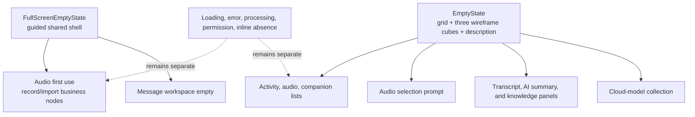

# Electron Empty State System - Plan

## Goal Capsule

- **Objective:** Electron users see one predictable full-page empty experience and one predictable local empty experience, without changes to the actions or state transitions that lead into and out of those surfaces.
- **Means:** Move the existing grid-and-three-wireframe-cubes illustration into the local empty primitive, replace the full-screen presentation with the first-audio guided composition, and narrow local content to one description (KTD1, KTD2).
- **Authority:** The Product Contract owns visible behavior; the Planning Contract owns component boundaries; current project accessibility and renderer styling guidance governs semantics and presentation.
- **Execution profile:** Implement in the current checkout, preserve unrelated user changes, and keep the work inside `apps/desktop-electron`.
- **Stop conditions:** Stop if the migration requires changing an audio, activity, companion, or settings state machine. Do not launch UI processes or run visual validation without explicit authorization for the implementation task.

---

## Product Contract

### Summary

The Electron renderer will expose two distinct empty-state levels. Full-page empty surfaces will use the guided composition established by “开始你的第一段音频”; lists and local panels will use the existing grid-and-three-wireframe-cubes illustration shown in the accepted reference, followed by one description.

### Problem Frame

The renderer currently calls two shared components but still presents several visual languages. `EmptyState` mixes a default graphic with title, description, action, and icon escape hatches, while `FullScreenEmptyState` owns a separate grid-and-cube illustration. The first-audio experience and the no-message placeholder are assembled outside those shared contracts, so call-site reuse has not produced a coherent empty-state system.

### Requirements

**Full-page empty surfaces**

- R1. `FullScreenEmptyState` presents the responsive first-audio composition: a left content region with an icon and visible title, optional description, actions, and feedback, plus a fixed decorative preview. Layout responds to the component's available width rather than only the Electron window: wide containers place the preview beside the content; narrow containers stack the preview below the content, wrap actions, and allow vertical growth without clipping.
- R2. The decorative preview is always non-interactive, hidden from assistive technology, and contains no focusable descendants.
- R3. The first-audio experience and no-message workspace use `FullScreenEmptyState` without changing their existing conditions or actions.

**Local empty surfaces**

- R4. `EmptyState` presents the accepted grid-and-three-wireframe-cubes illustration and one description, with no title, heading, action, or caller-provided icon. It reuses the repository's existing SVG geometry instead of redrawing or approximating the reference.
- R5. Existing empty lists, filtered-empty results, transfer-history empties, the populated-but-unselected audio detail column, the untranscribed transcript tab, the AI-summary prerequisite, the knowledge placeholder, and the empty cloud-model collection use `EmptyState`.

**Behavior and boundaries**

- R6. Existing recording, import, transcription, retry, navigation, dialog, focus, and async ownership behavior remains unchanged.
- R7. Loading, failure, synchronization, processing, permission, and inline field-absence feedback remain outside the empty-state component system.
- R8. Full-page sections are named by their visible heading, keep only justified busy semantics, and do not introduce new live regions or duplicate status announcements.
- R9. Both primitives remain shadowless, use the existing thin focus behavior of their child controls, and keep concise existing copy.
- R10. Implementation preserves unrelated working-tree changes, including current audio-library synchronization and metadata-save work in overlapping files.

### Key Decisions

- **Full-page empty states use the first-audio composition.** (session-settled: user-directed — chosen over retaining the grid-and-three-cubes illustration at full-page level: full-page states need a guided workspace-level presentation.) Governs R1–R3.
- **Local empty states contain only a description beneath the grid-and-three-cubes illustration.** (session-settled: user-directed — chosen over the current title/description hierarchy and per-call-site icon or action overrides: local absence should stay visually quiet and uniform.) Governs R4–R5.

### Acceptance Examples

- AE1. **Covers R1–R3, R6, R8.** Given the audio library is truly empty and recording is idle, when the audio page settles, then “开始你的第一段音频” appears in the shared full-screen composition and its record, import, pending, error, and retry behavior matches the current flow.
- AE2. **Covers R4–R6.** Given the audio library contains items but none is selected, when the workspace renders, then the left audio list remains available and the right detail column uses the local grid-and-three-cubes empty state with “请选择左侧音频” as its description and no heading.
- AE3. **Covers R4–R6.** Given an audio has no transcript, when the transcript tab is active, then the local grid-and-three-cubes empty state shows only its description while the existing start-transcription or processing node remains feature-owned outside the primitive and preserves its callbacks.
- AE3a. **Covers R1–R3.** Given any full-screen empty state renders in a route-sized main workspace, when its available width crosses the shared layout threshold, then content and preview switch between side-by-side and stacked arrangements without clipping, omitting the preview, or preventing actions from wrapping.
- AE4. **Covers R4–R5.** Given a list or local panel has no content, when its local empty state renders, then it contains the reference grid and exactly three wireframe cubes plus one descriptive paragraph, with no heading or feature-specific icon.
- AE5. **Covers R5–R7.** Given the knowledge tab is unavailable or the cloud-model collection is empty, when the surface renders, then it uses the local empty primitive while surrounding tab, list, dialog, and add-model behavior remains intact.
- AE6. **Covers R6–R7.** Given a surface is loading, failed, synchronizing, processing, waiting for permission, or missing only an inline field value, when it renders, then its existing non-empty-state feedback remains unchanged.

### Scope Boundaries

- No Flutter, Main, Preload, IPC, storage, worker, or processing-contract changes.
- No changes to route selection, capture preflight, audio playback, metadata persistence, or async intent ownership. The populated-but-unselected audio state leaves the shell's full-screen classification while retaining its existing shell treatment: the left audio list remains available, the top Header stays hidden, and the content keeps no outer padding.
- No conversion of inline text such as “尚未识别说话人” or “等待第一句完整字幕” into illustrated empty states.
- No new empty-state variants, caller-defined preview content, illustration overrides, shadows, or animation.
- No app, browser, Electron, Playwright, screenshot, golden, or UI-watcher execution without separate visual-validation authorization.

### Sources & Research

- `apps/desktop-electron/src/renderer/components/ui/empty-state.tsx` — current primitive APIs and legacy full-screen SVG.
- `apps/desktop-electron/src/renderer/features/audios/audio-route-feature.tsx` — authoritative first-audio composition and its business-owned recording/import states.
- `apps/desktop-electron/src/renderer/features/activity/activity-center.tsx`, `apps/desktop-electron/src/renderer/features/audios/audio-workspace-feature.tsx`, `apps/desktop-electron/src/renderer/features/companion/companion-feature.tsx`, and `apps/desktop-electron/src/renderer/features/settings/ai-settings-feature.tsx` — active consumers and hand-built placeholders.
- `docs/plans/2026-09-02-1008-fix-audio-first-use-fidelity-plan.md` — prior decision to keep first use route-local; its deferred empty-state unification boundary is superseded by this plan.
- `docs/solutions/architecture-patterns/desktop-first-workstation-boundaries.md` — keeps the refactor within the Electron composition root. No other relevant institutional learning or Compound Pack was found.

### Empty-State Migration Inventory

This catalog is the implementation baseline. Before editing, confirm each condition against the live worktree and add any newly discovered zero-content branch; after editing, classify every catalog entry as full-page, local, or excluded by R7.

| Surface                                                                       | Current condition                                    | Classification                                 | Target                                                                         |
| ----------------------------------------------------------------------------- | ---------------------------------------------------- | ---------------------------------------------- | ------------------------------------------------------------------------------ |
| Audio first use                                                               | Settled library is truly empty and recording is idle | Full-page                                      | `FullScreenEmptyState` with `AudioLines`                                       |
| Audio selection prompt                                                        | Library has items and no audio is selected           | Local, inside the right detail column          | `EmptyState`                                                                   |
| Transcript tab                                                                | Selected audio has no transcript segments            | Local, inside one tab column                   | `EmptyState`; existing transcription action/status stays outside the primitive |
| Message workspace                                                             | No activity items exist                              | Full-page                                      | `FullScreenEmptyState` with `TriangleAlert`                                    |
| Message context list                                                          | No messages or no filtered matches                   | Local                                          | `EmptyState`                                                                   |
| Audio context list                                                            | No filtered audio matches                            | Local                                          | `EmptyState`                                                                   |
| Audio review list                                                             | No audio is available for review                     | Local                                          | `EmptyState`                                                                   |
| Trusted devices                                                               | No trusted peer exists                               | Local                                          | `EmptyState`                                                                   |
| Transfer histories                                                            | No desktop or mobile transfer record exists          | Local                                          | `EmptyState`                                                                   |
| AI summary tab                                                                | Transcript prerequisite is absent                    | Local                                          | `EmptyState`                                                                   |
| Knowledge tab                                                                 | Feature placeholder is shown                         | Local                                          | `EmptyState`                                                                   |
| Cloud-model collection                                                        | No cloud profile exists                              | Local, inside existing list/listitem semantics | `EmptyState`                                                                   |
| Loading, error, synchronization, processing, permission, inline field absence | Existing status-specific condition                   | R7-excluded                                    | Keep current status UI                                                         |

---

## Planning Contract

### Key Technical Decisions

- KTD1. **Shared full-screen shell, feature-owned behavior.** (session-settled: user-directed — chosen over keeping the first-audio layout route-local: every workspace-level empty surface should use the same guided composition.) `FullScreenEmptyState` owns the responsive frame, icon treatment, content geometry, action and feedback placement, and fixed preview. Its breakpoint follows the component's inline size: the wide state is two columns, while the narrow state stacks content before preview, wraps actions, and grows vertically without clipping. Feature modules continue to compute state and pass their existing controls and alerts as content. Implements R1–R3 and R6.
- KTD2. **Narrow local primitive contract.** (session-settled: user-directed — chosen over retaining optional title, action, and icon escape hatches: compile-time API narrowing prevents local empty states from drifting again.) `EmptyState` accepts a required string description plus compact and layout classes; it owns the repository's existing grid-and-three-wireframe-cubes SVG and muted paragraph. Implements R4–R5.
- KTD3. **Visible headings name full-screen sections.** `FullScreenEmptyState` requires a title and contextual icon, accepts optional description, actions, feedback, busy state, and layout classes, and wires title and description IDs to the section. The icon mapping is fixed at the consumers: first use uses `AudioLines`, and no selected message uses `TriangleAlert`; both icons are decorative and `aria-hidden`. The component does not infer or add a live-region role. Implements R1, R2, and R8.
- KTD4. **The preview is fixed, not a slot.** Consumers cannot replace the right-hand decorative surface. This keeps the full-screen visual contract centralized and ensures every preview remains `aria-hidden` and unfocusable. Implements R1–R2 and R9.
- KTD5. **Stable shared selectors replace feature geometry selectors.** The primitives expose `data-slot` markers for their root and meaningful layout regions. First use may retain one feature marker for route-state detection, but tests no longer treat route-local geometry as the authority. Implements R1–R5.
- KTD6. **Settings semantics survive the visual migration.** The cloud-model empty state remains inside the existing list/listitem structure while its visible content comes from `EmptyState`. Implements R5–R6.

### High-Level Technical Design

The shared components own presentation and section semantics. Feature modules retain the conditions, callbacks, pending state, errors, and recovery behavior that surround each empty surface.

### Sequencing

1. Establish the narrowed primitive contracts and primitive-level tests.
2. Move the first-audio layout shell into `FullScreenEmptyState`, then migrate the other workspace-level consumers.
3. Migrate local consumers and hand-built placeholders, using TypeScript failures and static searches to find stale APIs.
4. Complete focused non-visual verification; run the project UI gates only if the implementation task receives explicit visual-validation authorization.

### Risks & Dependencies

- **Business leakage into the shared primitive:** Moving microphone, recording, import, processing, or retry decisions into `FullScreenEmptyState` would couple the primitive to audio behavior. Keep those nodes and conditions in their feature owners.
- **Full-page boundary drift:** A full-screen composition must not be placed inside a list, column, tab panel, or other bounded local surface. Static inventory enforces that those surfaces use `EmptyState`; authorized visual validation still confirms route-sized full-screen geometry.
- **Accessibility regression:** Removing local headings is intentional; adding compensating status/live-region behavior would violate the requested quiet local empty state and current accessibility guidance. Full-screen surfaces retain visible `h2` headings.
- **Settings list regression:** Replacing the empty profile row without its listitem wrapper would break the established list semantics.
- **Working-tree overlap:** Audio route, audio workspace, application shell, and renderer tests already contain user changes. Implementation must diff against the live worktree and preserve unrelated edits rather than applying whole-file replacements.

---

## Implementation Units

### U1. Define the two shared empty-state contracts

- **Goal:** Replace the permissive and visually divergent primitives with the confirmed local and full-screen contracts.
- **Requirements:** R1–R2, R4, R8–R9.
- **Dependencies:** None.
- **Files:**
  - `apps/desktop-electron/src/renderer/components/ui/empty-state.tsx`
  - `apps/desktop-electron/tests/unit/renderer/ui_primitives_test.tsx`
- **Approach:**
  1. Reduce `EmptyState` to KTD2, add a stable root slot, and move the existing grid-and-three-wireframe-cubes SVG from the former full-screen primitive without changing its geometry.
  2. Replace the legacy full-screen SVG and centered stack with the first-audio frame, content region, action/feedback placement, and fixed decorative preview defined by KTD1, KTD3, and KTD4.
  3. Implement the wide two-column and narrow stacked states from KTD1 using the component's available inline size, not viewport-only breakpoints; actions wrap and the shell must not clip either region.
  4. Expose stable shared slots per KTD5 and keep the preview hidden and unfocusable.
- **Patterns to follow:** Existing `cn` composition, `useId` heading/description wiring, renderer shadowless surfaces, and thin focus behavior owned by child controls.
- **Test scenarios:**
  - Render `EmptyState` with a description and verify one paragraph, the grid SVG with exactly three wireframe cube polygons, no heading, and no caller-controlled action or icon surface.
  - Render compact and normal local states and verify the same content contract with only density changing.
  - Render `FullScreenEmptyState` with title, description, actions, and feedback and verify the shared frame, visible `h2`, content slots, and fixed preview.
  - Exercise narrow and wide container states and verify region order, action wrapping, preview retention, and an unclipped vertically growing shell.
  - Render the full-screen primitive with busy state and verify it is exposed on the section without creating a live-region role.
  - Inspect the preview subtree and verify it is `aria-hidden` and contains no focusable descendants.
- **Verification:** TypeScript rejects the removed local-state props, and primitive tests establish both component contracts independently of feature state.

### U2. Migrate full-screen workspace empty states

- **Goal:** Make the first-audio page and every confirmed full-screen workspace empty state use the shared guided composition.
- **Requirements:** R1–R3, R6, R8–R10; AE1.
- **Dependencies:** U1.
- **Files:**
  - `apps/desktop-electron/src/renderer/features/audios/audio-route-feature.tsx`
  - `apps/desktop-electron/src/renderer/features/activity/activity-center.tsx`
  - `apps/desktop-electron/tests/unit/renderer/audio_route_test.tsx`
  - `apps/desktop-electron/tests/unit/renderer/activity_center_test.tsx`
  - `apps/desktop-electron/tests/unit/renderer/shell_test.tsx`
  - `apps/desktop-electron/tests/visual/renderer-shell.visual.spec.ts`
- **Approach:**
  1. Replace the route-local first-use frame and preview with `FullScreenEmptyState`, passing the existing record/import actions, errors, retry control, and busy state from `RecordingReadyState`.
  2. Retain the message workspace title and description, pass its existing `TriangleAlert` visual as the decorative contextual icon, and adopt the shared full-screen shell. Pass `AudioLines` for first use. Both icons remain `aria-hidden`.
  3. Replace legacy polygon and `data-audio-first-use` geometry assertions with shared slots; retain a feature marker only where tests need to distinguish the true-empty route state.
- **Execution note:** Characterize the current first-use callbacks, disabled conditions, error recovery, and route gating before removing its local layout markup.
- **Patterns to follow:** `RecordingReadyState` remains the composition root for recording preference, microphone selection, controller state, and callbacks. `App.tsx` remains the authority for shell padding and full-screen presentation classification.
- **Test scenarios:**
  - Covers AE1. A settled true-empty library renders the shared frame, keeps record and import callbacks, reflects pending and disabled states, and preserves import/preflight error retry behavior.
  - A message workspace with no activity items shows its current title and description, contextual icon, shared preview, and no action; when items exist, the application selects the routed, remembered, or first item instead.
  - Each full-screen consumer uses its specified icon, and route-sized main-workspace fixtures cover wide and narrow container states without changing business conditions.
  - Library loading, list failure, saved-audio synchronization, and auto-open transitions continue to select their existing non-empty-state presentations.
  - First-use visual selectors point to shared slots without weakening the existing geometry and responsive assertions; the visual suite is not executed without authorization.
- **Verification:** Focused renderer tests prove state gating, callbacks, semantics, and shared structure without launching Electron or a browser.

### U3. Migrate local empty states and remove hand-built placeholders

- **Goal:** Route all local list and panel absences through the description-only grid-and-three-cubes primitive.
- **Requirements:** R4–R7, R9–R10; AE2–AE6.
- **Dependencies:** U1.
- **Files:**
  - `apps/desktop-electron/src/renderer/features/activity/activity-center.tsx`
  - `apps/desktop-electron/src/renderer/features/audios/audio-route-feature.tsx`
  - `apps/desktop-electron/src/renderer/features/audios/audio-workspace-feature.tsx`
  - `apps/desktop-electron/src/renderer/features/companion/companion-feature.tsx`
  - `apps/desktop-electron/src/renderer/features/settings/ai-settings-feature.tsx`
  - `apps/desktop-electron/tests/unit/renderer/activity_center_test.tsx`
  - `apps/desktop-electron/tests/unit/renderer/audio_route_test.tsx`
  - `apps/desktop-electron/tests/unit/renderer/audio_workspace_test.tsx`
  - `apps/desktop-electron/tests/unit/renderer/companion_route_test.tsx`
  - `apps/desktop-electron/tests/unit/renderer/ai_settings_test.tsx`
- **Approach:**
  1. Reconcile the Empty-State Migration Inventory against every renderer zero-content branch before editing, recording its file, condition, classification, target primitive, and any R7 exclusion.
  2. Convert all existing `EmptyState` consumers from title-based content to one description while preserving compactness, borders, and layout classes.
  3. Replace the populated-but-unselected audio detail presentation with `EmptyState`, remove it from the shell's full-screen classification, and independently preserve its existing shell treatment: keep the left list, hide the top Header, and use no outer content padding.
  4. Replace the no-transcript tab's full-screen presentation with `EmptyState`; render the existing start-transcription or processing node outside the primitive so the one-column state stays local without changing behavior.
  5. Replace the knowledge placeholder with one combined description and remove its hand-built icon, heading, and explanatory stack.
  6. Replace the empty cloud-model row with `EmptyState`, combine its two current sentences into one description, and retain the existing listitem wrapper and add-model control per KTD6.
  7. Leave all R7 feedback paths unchanged. Re-run the catalog plus searches for component calls, known empty-state copy, and icon/heading/paragraph placeholder structures to prove no in-scope hand-built empty remains.
- **Patterns to follow:** Existing context-pane compact density, `SettingsItemGroup` list semantics, and feature-owned buttons and dialogs.
- **Test scenarios:**
  - Covers AE4. Empty and filtered-empty activity and audio lists render their existing copy as one paragraph with the shared grid and exactly three wireframe cubes and no heading.
  - Covers AE2. A populated library with no selected audio keeps the left list, hides the top Header, uses no outer content padding, and renders the local primitive in the right detail column with no heading or full-screen preview.
  - Covers AE4. Empty trusted-device and transfer lists keep their current surrounding borders and behavior while using the shared local primitive.
  - Covers AE3. The no-transcript tab renders the local primitive without a heading or full-screen preview; its start-transcription or processing node remains outside the primitive and tab switching preserves behavior.
  - The AI-summary prerequisite and knowledge placeholder render one description and the standard grid-and-three-cubes illustration; tab selection and playback remain unchanged.
  - Covers AE5. An empty cloud-model collection retains list/listitem semantics, displays the combined description, and leaves add, cancel, focus, and secret-clearing behavior intact.
  - Covers AE6. Loading, error, processing, permission, synchronization, and inline absence branches do not acquire empty-state slots or graphics.
- **Verification:** Typechecking and focused feature tests cover every migrated consumer, while a static inventory finds no hand-built full-panel placeholder remaining in the confirmed scope.

---

## Verification Contract

| Gate                                                                                                          | Applicability                                                   | Done signal                                                                                                                                                                                                                                                                                                                                                                                                                                         |
| ------------------------------------------------------------------------------------------------------------- | --------------------------------------------------------------- | --------------------------------------------------------------------------------------------------------------------------------------------------------------------------------------------------------------------------------------------------------------------------------------------------------------------------------------------------------------------------------------------------------------------------------------------------- |
| Diff and reference inspection                                                                                 | Always                                                          | Only the shared primitives, confirmed consumers, tests, and selector updates change; unrelated working-tree edits remain intact.                                                                                                                                                                                                                                                                                                                    |
| `bun run format:check` and `bun run lint` from `apps/desktop-electron`                                        | Always                                                          | Changed renderer and test files pass formatting and lint rules.                                                                                                                                                                                                                                                                                                                                                                                     |
| `bun run typecheck` from `apps/desktop-electron`                                                              | Always                                                          | No stale `EmptyState` API use, invalid full-screen props, or missing icon/content imports remain.                                                                                                                                                                                                                                                                                                                                                   |
| Focused jsdom Vitest files for primitives, Activity, Audio route/workspace, Companion, AI settings, and Shell | Always                                                          | Component contracts, call-site semantics, callbacks, and state boundaries pass without launching UI processes.                                                                                                                                                                                                                                                                                                                                      |
| Static empty-state inventory                                                                                  | Always                                                          | The pre-change catalog is reconciled against the final renderer: every zero-content branch has a recorded file, condition, classification, and target; all active full-panel empties use `FullScreenEmptyState`; all active local empties in scope use `EmptyState`; known empty-state copy and icon/heading/paragraph searches find no uncatalogued in-scope placeholder; old full-screen polygon slots and local title/icon overrides are absent. |
| `bun run check:ui:quick`, followed once by `bun run check:ui`, from `apps/desktop-electron`                   | Only after explicit visual-validation authorization             | Required Electron renderer gate passes for the final code state. Without authorization, both are skipped and the handoff states that visual validation was not authorized.                                                                                                                                                                                                                                                                          |
| Browser/Electron visual suite, screenshots, and UI watcher                                                    | Only when the user separately authorizes those exact activities | The full-screen context matrix covers first use and no selected message at supported narrow and wide container sizes; representative local states include the populated-but-unselected audio detail column and the one-column no-transcript tab. Otherwise no process is launched and no image is updated, and visual product acceptance remains pending.                                                                                           |

---

## Definition of Done

- R1–R10 and AE1–AE6 are implemented without modifying business state machines or async ownership; visual satisfaction of R1–R3 remains pending until the authorized context matrix passes.
- `EmptyState` exposes only the description-first local contract and every confirmed local consumer uses it.
- `FullScreenEmptyState` owns the first-audio guided shell and every confirmed workspace-level consumer uses it.
- Route-local first-use business logic, status branches, callbacks, focus behavior, and recovery controls remain feature-owned and covered by tests.
- Knowledge and cloud-model placeholders no longer define their own empty-state visuals, while surrounding tab and list semantics remain intact.
- Static, type, lint, formatting, and focused jsdom verification pass for the final code state.
- Implementation may be handed off after all mandatory non-visual gates pass, but the visual portion of product acceptance and R1–R3 cannot be marked complete when visual validation is not authorized. The handoff must report those items as pending rather than satisfied; after authorization, the narrow/wide context matrix must pass before the visual contract is closed.
- The final diff preserves unrelated user changes and contains no abandoned alternate component, stale SVG, dead import, duplicate selector, or experimental styling.
