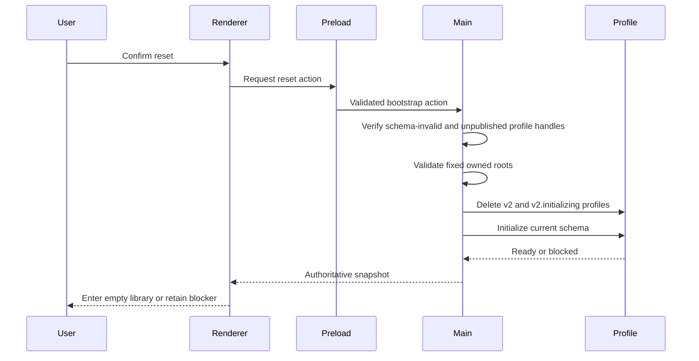
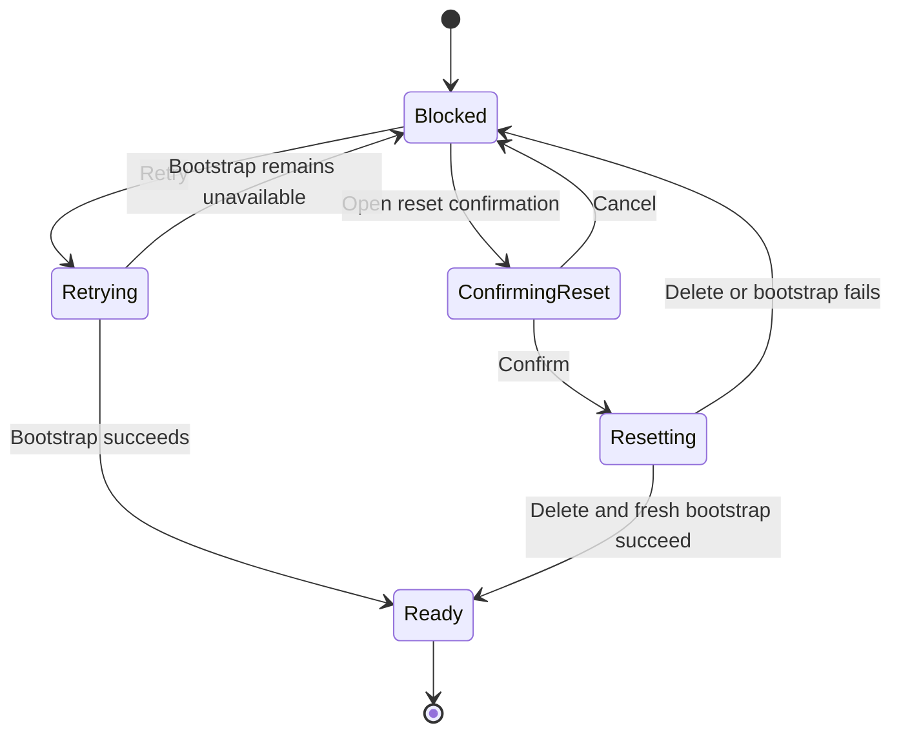

# Electron Local Data Reset Recovery - Plan

## Goal Capsule

| Field | Contract |
| --- | --- |
| Objective | 当本机资料库结构不可用时，用户可以明确选择删除全部 Electron 资料库数据，并由应用创建符合当前版本的新资料库后恢复进入工作台。 |
| Means | 扩展现有 bootstrap action，在 Main 内校验并删除应用自有的版本化资料目录，复用当前初始化流程创建最新 schema；阻塞弹窗左侧提供重置入口，右侧保留主操作“重试”。 |
| Authority | 本计划的 Product Contract 决定用户可见行为；项目 Electron、可访问性和验证指南决定组件、状态与验证边界；Main 的 profile/bootstrap 实现继续拥有资料路径和初始化真相。 |
| Execution profile | 先用 profile 与 IPC 集成测试固定破坏性边界，再接入 Renderer 状态与确认弹窗；不实现旧数据迁移、兼容读取或备份恢复。 |
| Stop conditions | 如果 Main 无法证明当前权威状态仍是 `schema_invalid`、待删除目标正是应用拥有的 `v2`/`v2.initializing`，或重置会触及 profile 之外的文件，则停止删除并保留阻塞状态。 |
| Tail ownership | 本计划覆盖实现与非视觉验证。没有当前任务的显式视觉验证授权时，不启动应用、浏览器或截图，也不运行 UI/browser 验证。 |

---

## Product Contract

### Summary

资料库结构无效时，阻塞弹窗提供“重置本机数据…”和“重试”。重置位于左侧，右侧“重试”保持主操作；用户确认重置后，应用删除 Electron 本机资料、创建当前版本的空资料库，并在成功后直接进入工作台。

### Problem Frame

当前 Electron profile 把不受支持的旧 schema 和损坏结构归为 `schema_invalid`，但阻塞弹窗只有“重新检查”。对于仍存在的旧结构，重复检查只会再次得到相同结果，用户无法在应用内恢复。

本机现有资料库可被 SQLite 读取且完整性检查通过，但 `user_version = 1`；当前代码只接受 v4 或 v5。这证明当前故障至少包含“资料库对本版本不可用”而不必然等同于 SQLite 文件损坏。产品选择优先恢复可用性，允许用户明确删除全部 Electron 本机数据，不为旧版本补迁移链。

### Key Decisions

- **用完整重置恢复，不迁移旧数据。**（session-settled: user-directed — chosen over adding v1-to-v5 migration: the fastest accepted recovery is to delete local data and create a current empty store.）Governs R3–R8.
- **重置入口在左，重试为右侧主操作。**（session-settled: user-directed — chosen over making reset the primary action: retry remains the safe default while reset stays visibly destructive.）Governs R1–R2.
- **重置永久删除资料库数据。**（session-settled: user-directed — chosen over archiving the old profile: completion means the old Electron profile data is deleted before a fresh profile is published.）Governs R4–R6.

### Requirements

**Blocked recovery surface**

- R1. `schema_invalid` 阻塞弹窗左侧显示“重置本机数据…”，右侧显示主操作“重试”；进行任一 bootstrap action 时两个入口都不可重复触发。
- R2. “重试”继续重新执行现有 bootstrap，不删除数据；磁盘空间不足、文件系统不可用、旧资料归档失败和路径逃逸只提供与当前错误相符的重试或修复提示，不显示资料重置入口。
- R3. 重置必须使用现有 `AlertDialog` 二次确认，明确说明本机音频、转写、任务、资料库内配置和未完成录音会永久删除；取消不得调用 Main。确认文案不得声称会删除 `v2` profile 之外的本地模型或 Renderer 偏好。

**Destructive reset and recovery**

- R4. Renderer 只能请求稳定的 bootstrap action，不能传入删除路径。Main 从自己的 application-data root 推导固定的 Electron `v2` 与 `v2.initializing` 目标，并在删除前验证目标是预期的应用直属目录，不能把 application-data root 或调用方路径作为删除目标。
- R5. reset 只允许发生在 `schema_invalid` 启动阻塞态。该状态在 profile 数据库及其后续服务发布前产生；如果 Main 发现 profile 已 ready、已有已发布的 profile/database 句柄或当前状态不再符合资格，必须拒绝删除。资格成立时，递归删除完整 `v2` 与 `v2.initializing`，包括数据库 sidecar、媒体、工作区、恢复材料和 ready marker；不得触及其他同级目录或 Flutter 数据。
- R6. 删除成功后，Main 立即复用权威初始化流程创建当前 `AUDIO_SCHEMA_VERSION` 的空 profile。只有最新 ready snapshot 可以解除阻塞并进入工作台；用户不需要再点一次重试。
- R7. 删除或重新初始化任何一步失败时，不发布 ready，不显示成功，并保留阻塞弹窗及可再次执行的操作。用户可见错误保持简洁，不包含路径、SQLite 细节或原始异常。
- R8. 同一时刻最多运行一个 bootstrap action。相同 action 可以观察同一个 in-flight 结果，不同 action 在已有 action 运行时必须被明确拒绝；reset 取得执行权后、删除前必须重新确认权威状态仍为 `schema_invalid`。确认弹窗关闭、重复点击、Renderer 重渲染及 snapshot 推送都不得造成并发删除、重复初始化、ready 后删除或旧完成覆盖新状态。

**Scope and verification**

- R9. 本次不增加 v1→v5 迁移、旧资料兼容读取、备份恢复、导出恢复工具或通用设置页“清除数据”入口。
- R10. 实现遵守现有 Radix/shadcn 模态、焦点和键盘契约；不新增全局 announcer 或自定义焦点状态机。
- R11. 没有当前任务的显式视觉验证授权时，只执行 Electron 非视觉代码验证，并将视觉验证记为未授权而跳过。

### Key Flows

- F1. **安全重试：** 用户在阻塞弹窗点击右侧“重试”；Renderer 发出 `recheck`，Main 重新运行 bootstrap，ready 时解除阻塞，仍不可用时继续显示与返回 code 对应的阻塞状态。
- F2. **确认重置：** `schema_invalid` 时，用户点击左侧“重置本机数据…”打开确认弹窗；取消返回原阻塞弹窗，确认后锁定两个动作并发出 reset action。
- F3. **删除并恢复：** Main 验证当前阻塞资格、未发布 profile 资源的启动期不变量及固定删除边界，删除正式 `v2` 和应用拥有的 `v2.initializing` profile，再运行现有初始化；ready snapshot 到达后关闭阻塞弹窗并显示空资料库工作台。
- F4. **失败留在阻塞态：** 删除或 fresh initialization 失败时，Main 不发布 ready；Renderer 显示安全错误、恢复按钮可用，不泄露原始路径或异常。

### Acceptance Examples

- AE1. **Covers R1–R3.** Given `schema_invalid` 阻塞，when 弹窗出现，then 左侧有“重置本机数据…”，右侧主按钮是“重试”；取消重置确认不发送 reset action。
- AE2. **Covers R4–R6.** Given 一个旧版本且包含数据库、WAL、媒体和工作区文件的 Electron profile，when 用户确认重置，then 这些文件全部删除，应用创建当前 schema 的空 profile，并直接进入空资料库。
- AE3. **Covers R2, R9.** Given `insufficient_space`、`filesystem_unavailable`、`legacy_archive_failed` 或 `path_escape`，when 阻塞弹窗出现，then 不显示“重置本机数据…”，且重试不删除任何资料。
- AE4. **Covers R7.** Given 删除被拒绝或 fresh initialization 失败，when reset action 完成，then 应用仍被阻塞，未显示成功，用户看到简洁失败信息且可以再次操作。
- AE5. **Covers R8.** Given reset action 尚未完成，when 用户重复点击、确认弹窗事件重复触发或收到中间 snapshot，then Main 只执行一次删除，Renderer 不接受旧 revision 解除阻塞。
- AE6. **Covers R4–R5.** Given 固定 profile 目标旁存在相邻目录，或 profile 内存在指向外部的符号链接，when 收到 reset action，then Main 只移除固定 profile 树且不跟随链接，外部目标和相邻应用资料保持不变。
- AE7. **Covers R5–R6.** Given 正式 `v2` profile 已删除但同级 `v2.initializing` 留有旧数据库、媒体或损坏结构，when 用户执行 reset，then 暂存 profile 也被安全删除，fresh initialization 只能发布记录数为零的当前 schema。
- AE8. **Covers R8.** Given retry 与 reset 以任一顺序并发到达，when 第一个 action 尚未完成，then 第二个不同 action 被拒绝且不改变第一个 action 的语义；如果 reset 等待执行期间状态已经 ready，删除不得开始。

### Scope Boundaries

#### Deferred to Follow-Up Work

- 如果未来产品需要保留资料，再单独设计导出、归档、选择性恢复或受支持的迁移链。
- 是否在设置页增加常驻“清除本机数据”能力另行定义；本次入口只属于启动阻塞恢复。

#### Out of Scope

- 修改 Flutter 应用或 Flutter 资料库。
- 自动迁移、静默删除、自动备份或从旧 profile 恢复记录。
- 把所有 bootstrap 错误都改造成可重置错误。
- 删除 `userData/local-models`、外置模型目录或 Renderer `localStorage` 偏好；这些不属于 Electron `v2` 资料库 profile。

---

## Planning Contract

### Key Technical Decisions

- KTD1. **扩展现有 bootstrap action，而不是新增平行 IPC。** `BootstrapAction` 增加 reset 语义，并继续经过 shared schema、Preload 校验和 Main handler；这让单飞、snapshot 返回和 Renderer 接受规则保持在同一通道内。Governs R1–R4, R8.
- KTD2. **Main 独占重置资格和路径推导。** reset 只有在当前权威 snapshot 为 `schema_invalid` 时可执行，删除目标由 `app.getPath("appData")` 和 profile path helper 得出；Renderer 不能扩大删除范围。Governs R2, R4–R5.
- KTD3. **删除两个固定 profile root，再复用 fresh initialization。** 不尝试逐文件修补、仅删除 SQLite 主文件或实现自定义目录遍历；Main 校验 `v2` 与 `v2.initializing` 是由现有 path helper 推导的固定目标后，使用平台递归删除原语移除整个树，再由 `initializeAudioProfile` 创建当前 schema、目录和 ready marker。Governs R4–R7, R9.
- KTD4. **把 `schema_invalid` 的启动期边界作为删除资格。** 当前初始化在 profile 数据库和后续服务赋值前发布该阻塞状态，因此 reset 不建立通用运行期关闭框架。Main 在删除前核对权威 snapshot 与未发布 profile 句柄不变量；不满足时直接拒绝。Governs R4–R8.
- KTD5. **Bootstrap single-flight 感知 action。** 相同 action 可以共用完成结果；retry 与 reset 不能互相折叠或排队继承语义，后到的不同 action 明确失败。reset 取得执行权后再次读取权威 blocked code，避免用过期资格删除已经 ready 的 profile。Governs R2, R6–R8.
- KTD6. **Renderer 使用现有 blocker 与 AlertDialog primitives。** `ProfileBlocker` 负责错误码分流、左右动作布局和确认状态；bootstrap hook 继续集中 pending、错误清理和 revision latch。确认 reset 后 AlertDialog 保持打开并显示 pending，失败后恢复 blocker；先依赖现有 Radix 焦点行为，只有稳定测试证明成功卸载 trigger 后焦点无效时才加入局部 fallback。Governs R1–R3, R7–R10.

### High-Level Technical Design

#### Component and request flow

#### Recovery state ownership

### System-Wide Impact

- **Shared contracts:** `BootstrapAction` gains a destructive action value that must remain validated across Renderer, Preload and Main.
- **Persistence:** reset removes the Electron `v2` profile and its `v2.initializing` staging profile as one ownership set; fresh schema creation remains in `audio_profile.ts` and `audio_database.ts`.
- **Adjacent storage:** local model stores and Renderer preferences live outside the `v2` profile and remain untouched; user-facing copy must describe the narrower library-data scope.
- **Lifecycle:** reset remains a startup-blocker action. Main must reject it if a ready profile or published profile/database handle exists; it does not add a general runtime teardown path.
- **UI and accessibility:** the application blocker remains non-dismissible; the nested confirmation uses the existing destructive confirmation primitive and standard focus restoration.
- **Release behavior:** no migration compatibility is added. Existing unsupported stores become recoverable only through explicit user deletion.

### Risks and Mitigations

| Risk | Consequence | Mitigation |
| --- | --- | --- |
| 删除路径推导错误 | 删除应用目录之外的数据 | Main 自行推导两个固定 root，拒绝调用方路径和共享根，并用相邻目录与外部链接 fixture 证明删除不会越界。 |
| reset 资格已经过期 | ready 后仍删除用户资料 | Main 在取得 action 执行权后重新读取权威 snapshot，并确认没有已发布的 profile/database 句柄。 |
| 只删除数据库留下孤儿文件 | 新资料库与旧媒体、工作区混合 | 删除完整正式和初始化暂存 profile，不逐文件选择。 |
| `v2.initializing` 残留 | 旧数据在 fresh initialization 中重新出现 | 把应用拥有的初始化暂存 profile 纳入相同安全校验和删除边界，并验证新库记录数为零。 |
| reset 与 retry 并发 | reset 意图丢失、retry 意外等待删除或 ready 后仍删除 | Main single-flight 按 action 区分；不同 action 明确拒绝，reset 取得执行权后重新核验权威 blocked code。 |
| 删除部分完成后失败 | 用户数据已减少但应用仍阻塞 | 明确永久删除语义；重置保持可重入，失败不宣称成功，下一次 reset 清理剩余 profile 后再初始化。 |

### Sequencing

1. U1 先建立 Main 可测试的删除边界和 fresh profile 结果。
2. U2 扩展共享 action 与 Main orchestration，证明跨 IPC 的资格判断和单飞行为。
3. U3 接入阻塞弹窗、左右动作、确认状态及 Renderer 错误反馈。

---

## Implementation Units

### U1. Add an owned-profile reset operation

- **Goal:** 提供只删除当前 Electron 正式与初始化暂存 profile、可失败且可重新执行的 Main profile 操作。
- **Requirements:** R4–R7, R9; AE2, AE4, AE6–AE7.
- **Dependencies:** None.
- **Files:**
  - Modify `apps/desktop-electron/src/main/profile/audio_profile.ts`.
  - Modify `apps/desktop-electron/tests/integration/profile_initialization_test.ts`.
- **Approach:**
  1. 从 application-data root 推导正式 `v2` 与同级 `v2.initializing`，不接受调用方路径，并明确拒绝 application-data root、profile 容器或其他非预期目标。
  2. 使用 Node 递归删除原语删除两个固定 root；目标不存在时视为成功。依赖删除原语对符号链接执行 unlink，不编写任意深度的自定义目录遍历器。
  3. 保持 fresh initialization 为创建当前 schema 的唯一实现，不在 reset helper 内复制 schema 创建逻辑。
- **Execution note:** 先用临时 profile fixture 固定两个删除目标和相邻数据边界，再加入删除实现；不扫描真实用户目录。
- **Patterns to follow:** `profilePathsForApplicationData`、`profilePathsForRoot` 及 `profile_initialization_test.ts` 现有临时目录清理模式。
- **Test scenarios:**
  - Covers AE2. 旧 schema profile 同时含数据库、WAL/SHM、媒体、工作区和 ready marker；reset 后所有 profile 成员消失，fresh initialization 产生当前 schema 的空 profile。
  - Covers AE4. 注入删除失败；操作抛出，fresh initialization 不运行，也不产生新的 ready marker。
  - Covers AE6. profile 内预置指向外部的符号链接；reset 删除链接但不删除外部目标，相邻目录保持不变。
  - Covers AE7. 预置非空 `v2.initializing`；reset 后 fresh profile 使用当前 schema 且记录数为零，旧文件不再出现。
  - profile 已不存在；reset 保持幂等，随后 fresh initialization 成功。
- **Verification:** profile 测试证明删除范围、失败边界、幂等性和当前 schema 重建，无需真实用户目录。

### U2. Extend bootstrap action orchestration

- **Goal:** 让 validated IPC action 在 Main 权威状态下执行 retry 或 reset，并返回唯一可信 snapshot。
- **Requirements:** R2, R4–R8; F1, F3–F4; AE2–AE8.
- **Dependencies:** U1.
- **Files:**
  - Modify `apps/desktop-electron/src/shared/contracts/application_state.ts`.
  - Modify `apps/desktop-electron/src/main/index.ts`.
  - Modify `apps/desktop-electron/tests/unit/ipc_contract_test.ts`.
  - Modify `apps/desktop-electron/tests/integration/register_desktop_ipc_test.ts`.
  - Inspect `apps/desktop-electron/src/preload/api.ts` and `apps/desktop-electron/src/main/ipc/desktop_ipc.ts`; their existing schema-bound forwarding should require no parallel reset channel.
- **Approach:**
  1. 把 bootstrap action schema 扩展为 safe retry 与 destructive reset 两种受限值，继续由 Preload 和 IPC request schema 解析。
  2. Main mutation gate 只让相同 action 共用 in-flight 结果；已有不同 action 时明确拒绝，避免 retry 与 reset 互相继承语义。
  3. reset 取得执行权后重新读取当前权威 profile phase/code，并确认 profile/database 句柄尚未发布；非 `schema_invalid` 或不满足启动期不变量时直接拒绝，不删除。
  4. 调用 U1 删除两个固定 profile root，然后直接复用现有 bootstrap transaction；ready 或 blocked snapshot 通过原通道返回，不抽取新的恢复事务框架。
  5. 删除或初始化异常时保持当前阻塞 snapshot，不把中间 initializing 状态当成完成，也不把原始异常返回 Renderer。
- **Execution note:** 先扩展 contract/IPC tests，再改变 Main 分支，确保未验证 action 无法抵达删除逻辑。
- **Patterns to follow:** `runBootstrapTransaction`、`bootstrapPromise` 与 `registerDesktopIpc` 的 schema-bound handler；不修改 `bootstrap_transaction.ts`，除非实现证据表明现有调用形式无法表达删除后重跑初始化。
- **Test scenarios:**
  - `recheck` 继续只运行初始化，不调用 profile reset。
  - Covers AE2. `schema_invalid` snapshot 收到 reset action；profile 删除和 fresh bootstrap 各执行一次，返回 ready snapshot。
  - Covers AE3. 其余四种 blocked code 收到 reset action；请求失败且删除未调用。
  - Covers AE4. 删除或 fresh bootstrap 失败；ready 不发布，返回或后续 snapshot 保持 blocked。
  - Covers AE5. 两个并发相同 action 到达；执行路径只运行一次，调用者观察同一权威结果。
  - Covers AE8. retry→reset 和 reset→retry 两种异构并发顺序；后到 action 被拒绝，第一个 action 的删除语义不改变。
  - Covers AE8. reset 取得执行权前 profile 已变为 ready 或 profile/database 句柄已经发布；资格复核阻止删除，并返回当前权威 snapshot 或安全失败。
  - 未知 bootstrap action 在 Preload 或 IPC schema 层被拒绝。
- **Verification:** contract、IPC 与 Main 的聚焦测试共同证明动作值、启动期资格、执行顺序和失败状态。

### U3. Add reset confirmation to the profile blocker

- **Goal:** 在 `schema_invalid` 阻塞态提供左侧破坏性重置和右侧主重试，并用二次确认驱动 U2。
- **Requirements:** R1–R3, R7–R10; F1–F2, F4; AE1, AE3–AE5.
- **Dependencies:** U2.
- **Files:**
  - Modify `apps/desktop-electron/src/renderer/features/shell/shell-surfaces.tsx`.
  - Modify `apps/desktop-electron/src/renderer/features/shell/use-application-shell.ts`.
  - Modify `apps/desktop-electron/src/renderer/App.tsx` if the blocker callback contract needs to expose distinct errors or actions.
  - Modify `apps/desktop-electron/tests/unit/renderer/shell_test.tsx`.
- **Approach:**
  1. `ProfileBlocker` 按 blocked code 决定是否显示 reset trigger；footer 使用两端布局，reset 在左，默认 Button 的“重试”在右。
  2. reset trigger 打开现有 `AlertDialog`，正文一次说明永久删除范围；取消关闭确认且恢复到 blocker，确认发送 destructive bootstrap action。
  3. 确认 reset 后保持 AlertDialog 打开并显示“正在重置…”，禁用取消和确认；失败时恢复可操作状态、关闭确认并在 blocker 显示安全错误。
  4. 复用 Radix 默认的 focus containment 与 restoration。只有聚焦交互测试证明成功卸载 blocker 后焦点无效，才在该 AlertDialog 的 close autofocus 边界加入一个局部 fallback；不预先建立新的焦点路由协议。
  5. 复用 hook 的 pending、revision latch 和 error state；action pending 时外层 reset 与 retry 也不可触发，不添加全局焦点状态机或重复播报协议。
- **Execution note:** 以 deferred promise 覆盖 pending 和 snapshot 竞态，不依赖视觉测试证明布局之外的行为。
- **Patterns to follow:** `ApplicationBlocker` 的不可关闭契约、`alert-dialog.tsx`、音频删除确认，以及 `useApplicationShell` 的 `bootstrapRequestRef`/revision 接受规则。
- **Test scenarios:**
  - Covers AE1. `schema_invalid` blocker 中 reset trigger 位于 action region 首项，retry 位于末项且使用主按钮；点击 reset 只打开确认，取消不调用 API。
  - Covers AE2. 确认 reset 发送 destructive action；ready snapshot 返回后 blocker 消失并显示空资料库。
  - Covers AE3. 其余 blocked code 不渲染 reset trigger，右侧仍有“重试”。
  - Covers AE4. reset API 抛错；pending 结束后确认关闭、blocker 留存，显示“无法重置本机数据”一类安全错误且操作恢复。
  - Covers AE5. action pending 时所有相关按钮不可重复触发；中间 initializing/blocked snapshot 不卸载 latched blocker，只有更新 revision 的 ready snapshot 可以解除。
  - reset pending 期间确认弹窗保持打开且取消/确认不可触发；取消后仍由 Radix 恢复到 reset trigger。
- **Verification:** Renderer 单元测试证明文案、动作顺序、确认、pending、错误和 blocker latch。完成 U1–U3 的目标测试后运行 `bun run check:code`；视觉布局验证按授权政策单独处理。

---

## Verification Contract

| Verification | Applies to | Done signal |
| --- | --- | --- |
| Targeted profile initialization integration tests | U1 | 两个固定 profile root 被限定删除，当前 schema 重建，外部链接目标和相邻目录保持安全。 |
| Bootstrap and IPC unit/integration tests | U2 | action schema、启动期资格、单飞及失败状态全部符合契约。 |
| Shell Renderer unit tests | U3 | 左 reset、右主 retry、确认、pending、错误码分流及 blocker latch 均被覆盖。 |
| `bun run check:code` in `apps/desktop-electron` | U1–U3 | Electron Main、Preload、shared contracts、Renderer TypeScript 和普通集成检查通过。 |
| Electron UI validation | U3 | 仅在用户明确授权后运行项目规定的 UI quick/final gates；未授权则记录跳过，不以启动 UI 替代。 |

---

## Definition of Done

- [ ] `schema_invalid` blocker 左侧显示“重置本机数据…”，右侧主操作为“重试”，其他 blocker 不显示重置。
- [ ] 重置必须经过明确的永久删除确认；取消不产生 Main 副作用。
- [ ] 确认文案准确描述资料库数据范围，不声称删除 profile 之外的本地模型或 Renderer 偏好。
- [ ] Main 只删除自己推导并重新验证的 Electron `v2` 与 `v2.initializing` profile，不跟随 profile 内的 symlink 或触及相邻数据。
- [ ] reset 只在 `schema_invalid` 且 profile/database 句柄尚未发布时执行；随后删除正式与暂存 profile、创建当前 schema，并在 ready 后直接进入空资料库。
- [ ] 删除或重建失败保留 blocker、提供安全错误并允许再次操作，不发布虚假成功。
- [ ] retry 和 reset 在 Renderer 与 Main 都不会并发执行，旧 snapshot 不会解除新 blocker。
- [ ] 没有加入旧数据迁移、备份恢复、Flutter 变更或设置页通用清除入口。
- [ ] U1–U3 的目标测试和 `bun run check:code` 通过；视觉验证根据当前任务授权状态执行或明确跳过。

---

## Appendix

### Existing Patterns and Research

- `apps/desktop-electron/src/main/profile/audio_profile.ts` 已集中管理 profile 路径、containment、symlink 防护、目录创建和 schema-invalid 映射。
- `apps/desktop-electron/src/main/application/bootstrap_transaction.ts` 和 `apps/desktop-electron/src/main/index.ts` 已提供失败清理、single-flight bootstrap 与权威 snapshot 发布边界；本计划复用这些边界，不抽取通用重置事务或运行期关闭框架。
- `apps/desktop-electron/src/renderer/features/shell/use-application-shell.ts` 已提供重复请求折叠、revision latch 和 blocker 保留逻辑。
- `apps/desktop-electron/src/renderer/components/application-blocker.tsx`、`apps/desktop-electron/src/renderer/components/ui/alert-dialog.tsx` 和现有删除确认提供模态与破坏性操作模式。
- `docs/solutions/architecture-patterns/desktop-first-workstation-boundaries.md` 要求 Electron 自己拥有桌面数据生命周期，并明确 cleanup 不跟随 symlink。
- `docs/solutions/logic-errors/latest-intent-wins-across-async-audio-actions.md` 要求异步破坏性完成重新核对当前所有权；本计划把该原则应用到 blocker revision 与 action single-flight。

### Product Contract Preservation

Product Contract bootstrapped from the session-confirmed requirements; no upstream Product Contract was modified.
