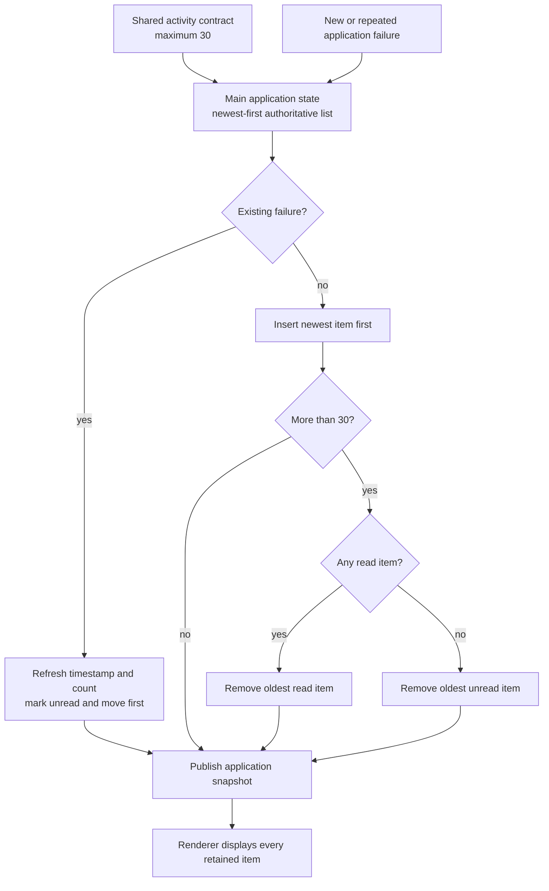
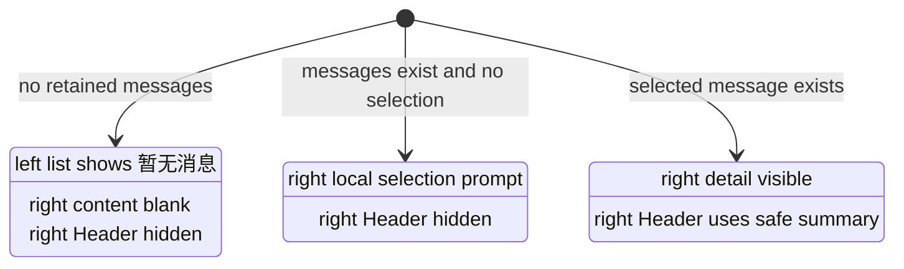

# Message Center Retention and Empty-State Rules - Plan

## Goal Capsule

- **Objective:** The message center remains compact and predictable: users see every retained message in a clear time order, and linked columns never repeat the same absence.
- **Means:** Raise the current-session cap to 30, centralize read-aware overflow trimming, remove search and filter projections, and derive left-list and right-detail empty presentations independently. (KTD1–KTD4)
- **Authority:** The confirmed Product Contract in this plan overrides earlier message-specific empty-state and 20-item decisions; project accessibility, shell, and visual-validation rules remain in force.
- **Execution profile:** Code changes in Electron Main, shared contracts, and Renderer, followed by documentation alignment and the bounded Electron verification lanes.
- **Stop conditions:** Stop if implementation would require durable message persistence, a protocol-shape migration, or changes to non-message empty-state behavior.
- **Completion owner:** The implementing agent completes and verifies U1–U4 while preserving unrelated working-tree changes.

---

## Product Contract

### Summary

The message center will retain at most 30 current-session messages and display all retained items newest first without search or category filters. When the left message list already explains that the collection is empty, the linked right detail column will remain blank and omit its Header; a right-column selection prompt remains valid when the left list has data but no item is selected.

### Problem Frame

The current message contract caps the application snapshot at 20 items, while the Renderer adds search and read-state filtering that the product no longer needs. The current working tree also renders “暂无消息” in the left context list and “还没有消息” in the right workspace at the same time, with an otherwise empty right Header. That repeats one collection-level absence across linked columns and adds controls that do not affect the user's next decision.

### Requirements

**Retention and ordering**

- R1. The application retains at most 30 current-session messages.
- R2. Retained messages are ordered by `lastOccurredAt` from newest to oldest; recording a repeated failure updates that item, marks it unread, and moves it to the front.
- R3. When adding a distinct message would exceed R1, the application removes the oldest read message first; if no read message exists, it removes the oldest unread message.
- R4. Marking one or all messages as read changes only unread state and snapshot revision behavior; it does not remove or reorder messages.

**Message-list behavior**

- R5. The message list displays every retained message, regardless of read state, up to the R1 limit.
- R6. The message context pane provides no search field and no all/unread filter controls.
- R7. The existing “全部标记为已读” action remains available, disabled when nothing is unread, and keeps its current failure handling.
- R8. Existing exact-read behavior, automatic selection behavior, unread badges, detail actions, and privacy-safe message content remain unchanged unless another requirement in this plan explicitly changes their presentation.

**Linked empty states**

- R9. When no messages exist, the left message list displays “暂无消息”; the right detail column renders no content, no Empty State, and no Header.
- R10. When messages exist but no item is selected, the right detail column may display a local Empty State that asks the user to select from the left list, and it does not display a detail Header.
- R11. When a message is selected, the right detail column displays its existing detail content and uses the selected message summary as the Header title.
- R12. In linked multi-column interfaces, one underlying absence is expressed by one owning column; dependent columns do not repeat that Empty State, while a distinct absence such as “data exists but no selection” may have its own local Empty State.

### Key Decisions

- **Retain at most 30 messages.** (session-settled: user-directed — chosen over the current 20-item cap: the message center remains bounded while keeping a larger recent window.) Governs R1.
- **Display the full retained collection.** (session-settled: user-directed — chosen over showing all unread messages plus only five read messages: the storage cap already bounds the list.) Governs R2, R5–R6.
- **Prefer read items for overflow eviction.** (session-settled: user-approved — chosen over unconditional oldest-first eviction: unread items should survive when the hard cap permits it.) Governs R3.
- **Read actions do not change list membership.** (session-settled: user-directed — chosen over reducing the visible list after “全部标记为已读”: read state is not a display category.) Governs R4, R7.
- **Express one linked absence once.** (session-settled: user-directed — chosen over duplicating collection-empty UI in both columns: the list already communicates why the detail column has nothing to show.) Governs R9–R12.

### Scope Boundaries

- Message activity remains application-session state; this work does not add database persistence, restart recovery, pagination, or a new storage table.
- Message kinds, safe summaries, occurrence deduplication, settings destinations, privacy exclusions, and detail actions stay unchanged.
- The current automatic fallback to the routed, remembered, or first message remains intact; R10 defines the presentation contract if a valid unselected state occurs.
- Shared Empty State component APIs and non-message consumers do not change.
- Historical plans and solution records remain historical evidence. Active product and architecture references are updated where they still state the 20-item limit.
- App, browser, Electron, screenshot, golden, and UI-watcher execution remains prohibited unless the user separately authorizes visual validation for implementation.

### Acceptance Examples

- AE1. **Covers R1–R3.** Given 30 retained messages containing at least one read item, when a distinct newer message is recorded, then the oldest read item is removed and the remaining 30 items are ordered newest first.
- AE2. **Covers R1–R3.** Given 30 unread messages, when a distinct newer message is recorded, then the oldest unread item is removed and the new item appears first.
- AE3. **Covers R1–R4.** Given the collection is at capacity, when an existing failure recurs, then its occurrence count and timestamp update, it becomes unread, it moves to the front, and the collection remains at 30.
- AE4. **Covers R4–R7.** Given a mix of read and unread messages, when the user marks all as read, then every retained item remains visible in the same order and the mark-all action becomes disabled.
- AE5. **Covers R5–R8.** Given retained read and unread messages, when the message pane opens, then every item is present and neither a message search field nor all/unread filters are rendered.
- AE6. **Covers R9, R12.** Given the message collection is empty, when the message page opens, then the left list shows “暂无消息” and the right column contains neither a Header nor an Empty State.
- AE7. **Covers R10, R12.** Given the left list contains messages but no item is selected, when the detail column renders, then it may show one local selection prompt without repeating the collection-empty message or showing a detail Header.
- AE8. **Covers R8, R11.** Given a message is selected, when its detail renders, then the Header uses its safe summary, the existing detail fields and settings action remain available, and selecting an unread item marks only that item read.

### Sources & Research

- `apps/desktop-electron/src/main/application/application_state.ts` — current newest-first insertion, occurrence deduplication, 20-item trimming, and idempotent read operations.
- `apps/desktop-electron/src/shared/contracts/application_state.ts` — current `ApplicationSnapshot.activity` upper bound and message contract.
- `apps/desktop-electron/src/renderer/features/activity/activity-center.tsx` — current embedded and Shell-owned search/filter controls, list Empty State, mark-all action, and detail workspace.
- `apps/desktop-electron/src/renderer/App.tsx` — current selection fallback, exact-read effects, context-pane composition, Header visibility, content padding, and message detail routing.
- `apps/desktop-electron/tests/unit/application_activity_test.ts`, `apps/desktop-electron/tests/unit/ipc_contract_test.ts`, `apps/desktop-electron/tests/unit/renderer/activity_center_test.tsx`, and `apps/desktop-electron/tests/unit/renderer/shell_test.tsx` — nearest state, contract, feature, and Shell test boundaries.
- `docs/solutions/logic-errors/separate-empty-state-component-scope-from-shell-chrome.md` — component taxonomy, content scope, and Shell chrome are independent decisions.
- `docs/plans/2026-09-16-1551-refactor-electron-empty-state-system-plan.md` — historical message-empty classification that this plan supersedes only for the message workspace.

---

## Planning Contract

### Key Technical Decisions

- KTD1. **One shared cap owns validation and retention.** Export one message-limit constant from the shared application-state contract, use it in the Zod array bound, and consume it from Main retention logic so schema and producer cannot drift. Implements R1.
- KTD2. **Main owns read-aware overflow trimming.** Keep Main as the authoritative producer of newest-first activity snapshots and trim only after a distinct insert; scan from the oldest end for a read eviction candidate, falling back to the oldest item when every retained item is unread. Implements R2–R4.
- KTD3. **Renderer displays the authoritative snapshot directly.** Remove query/filter state, helper projections, and message-specific search/filter components; map the Main-owned activity array as received and retain only the mark-all head action. Implements R5–R8.
- KTD4. **Collection emptiness and selection emptiness are separate presentation states.** Derive message collection-empty, selection-empty, and selected-detail states independently from Empty State component choice; use those predicates to control right-column content and Shell Header visibility. Implements R9–R12.
- KTD5. **The reusable rule belongs in active project guidance.** Add the linked-column single-expression rule to `AGENTS.md`, update active 20-item documentation to 30, and leave historical plans and solution records unchanged. Implements R1, R12.

### High-Level Technical Design

The retention path has one authority for the limit and one authority for eviction policy:

The message detail column follows a three-state presentation matrix independent of the Empty State primitive taxonomy:

### Sequencing

1. Establish the shared cap and Main eviction contract before changing Renderer expectations.
2. Remove the obsolete list projections, then implement the explicit message presentation matrix against the simplified list.
3. Update active guidance and product references after code and tests agree on the final behavior.

### System-Wide Impact

- **Data lifecycle:** The change enlarges an ephemeral in-memory snapshot only; it creates no migration or restart compatibility work.
- **Shared contract:** Raising the array bound affects Main, Preload validation, Renderer consumption, fixtures, and tests, but does not change the serialized field shape or require a desktop protocol-version bump.
- **Interaction:** Removing search and filter controls shortens context-pane focus order. Mark-all, list selection, exact-read, pane toggle, and settings navigation remain the interactive surface.
- **Shell:** Message Header visibility becomes conditional on a selected detail, while left-pane visibility continues to follow the saved context-pane preference.
- **Working tree:** `AGENTS.md`, `App.tsx`, `activity-center.tsx`, shared contracts, and Shell tests already contain unrelated edits. Implementation must edit the message-specific branches surgically and preserve local-data-reset, recovery, and dialog work.

### Risks & Dependencies

- **Limit drift:** A literal 30 duplicated in schema, Main, and tests could diverge. KTD1 gives production code one owner while tests assert its boundary.
- **Eviction instability:** Filtering and re-sorting after trim could change survivor order. KTD2 removes exactly one oldest eligible item from the already newest-first list.
- **Empty-state regression:** Reusing a “full-screen empty” flag to drive the Shell could hide the left list or restore the right Header. KTD4 requires separate collection, selection, and chrome predicates plus feature- and Shell-level tests.
- **Dirty-worktree collision:** The current uncommitted empty-state migration changed the same message branches in the opposite direction. U2 and U3 must preserve all unrelated hunks and update only the confirmed message behavior.

---

## Implementation Units

### U1. Centralize the 30-message retention contract

- **Goal:** Make the shared snapshot contract and Main application state enforce one 30-item, read-aware retention policy.
- **Requirements:** R1–R4; AE1–AE4.
- **Dependencies:** None.
- **Files:**
  - `apps/desktop-electron/src/shared/contracts/application_state.ts`
  - `apps/desktop-electron/src/main/application/application_state.ts`
  - `apps/desktop-electron/tests/unit/application_activity_test.ts`
  - `apps/desktop-electron/tests/unit/ipc_contract_test.ts`
- **Approach:**
  1. Introduce the shared production limit per KTD1 and replace the current contract and Main literals.
  2. Encapsulate distinct-insert trimming in Main per KTD2 without changing recurrence deduplication or idempotent read behavior.
  3. Keep the array newest first after insertion, recurrence, exact-read, and mark-all operations.
- **Execution note:** Implement the boundary and eviction scenarios test-first because the current tests encode the superseded 20-item contract.
- **Patterns to follow:** `DesktopApplicationState.recordApplicationFailure`, its immutable `update` path, and `applicationSnapshotSchema` boundary validation.
- **Test scenarios:**
  - Covers AE1. Insert 31 distinct messages with an older read item and verify the oldest read item is the sole eviction while 30 newest-first survivors remain.
  - Covers AE2. Insert 31 distinct unread messages and verify the oldest unread item is evicted.
  - Covers AE3. Recur an existing message at capacity and verify count, timestamp, unread state, order, and collection size without evicting another item.
  - Covers AE4. Mark one item and then all items read and verify identity, count, and order remain stable while repeated commands stay idempotent.
  - Parse snapshots with exactly 30 valid activity items and reject snapshots with 31.
- **Verification:** Domain tests prove retention and read semantics; contract tests prove producer and consumer boundaries agree.

### U2. Remove message search and filtering

- **Goal:** Render the authoritative retained message collection directly and leave mark-all as the only message-pane head action.
- **Requirements:** R5–R8; AE4–AE5.
- **Dependencies:** U1.
- **Files:**
  - `apps/desktop-electron/src/renderer/features/activity/activity-center.tsx`
  - `apps/desktop-electron/src/renderer/App.tsx`
  - `apps/desktop-electron/tests/unit/renderer/activity_center_test.tsx`
  - `apps/desktop-electron/tests/unit/renderer/shell_test.tsx`
  - `apps/desktop-electron/tests/e2e/sidebar_navigation_test.ts`
- **Approach:**
  1. Remove message-only query/filter types, state, helper projections, exports, and Shell slots per KTD3.
  2. Keep the context-pane title, mark-all control, operation error, rows, badges, timestamps, selection callbacks, and settings actions unchanged.
  3. Update tests that currently exercise search results or all/unread filters so they instead prove complete mixed-state rendering and unchanged read actions.
- **Patterns to follow:** The current flat-row list, `ActivityContextPaneHead`, exact-read command path, and context-pane head composition.
- **Test scenarios:**
  - Covers AE5. Render a mixed collection and verify all retained summaries appear in authoritative order with their unread badges.
  - Verify no searchbox and no message-filter group or buttons are present in both isolated feature rendering and the composed Shell.
  - Covers AE4. Trigger mark-all from the pane head and verify the command fires once, remains disabled with zero unread messages, and exposes the existing operation error on failure.
  - Select an unread row and verify only its existing callback and exact-read path run; selection and settings navigation behavior remain intact.
- **Verification:** Focused Renderer and navigation tests contain no stale search/filter imports, state, copy, or accessibility expectations.

### U3. Separate message collection-empty and selection-empty presentation

- **Goal:** Show one collection-level Empty State in the left list while making right-column content and Header follow selection availability.
- **Requirements:** R8–R12; AE6–AE8.
- **Dependencies:** U2.
- **Files:**
  - `apps/desktop-electron/src/renderer/App.tsx`
  - `apps/desktop-electron/src/renderer/features/activity/activity-center.tsx`
  - `apps/desktop-electron/tests/unit/renderer/activity_center_test.tsx`
  - `apps/desktop-electron/tests/unit/renderer/shell_test.tsx`
  - `apps/desktop-electron/tests/e2e/sidebar_navigation_test.ts`
- **Approach:**
  1. Derive the three message presentation states in KTD4 without coupling them to `EmptyState` or `FullScreenEmptyState` names.
  2. Keep the left context pane structurally available while empty, render its existing compact “暂无消息” state, and render no right workspace content for the same absence.
  3. Hide the right Header whenever no message is selected; render a local right-column selection prompt for the distinct nonempty-but-unselected state.
  4. Restore the existing detail and title as soon as a valid selection exists, including snapshots that transition from empty to populated.
- **Execution note:** Start by replacing the current duplicate-empty Shell assertions; they encode behavior opposite to the confirmed rule and overlap unrelated working-tree changes.
- **Patterns to follow:** The independent component-scope and Shell-chrome predicates documented in `docs/solutions/logic-errors/separate-empty-state-component-scope-from-shell-chrome.md` and the audio populated-but-unselected presentation in `App.tsx`.
- **Test scenarios:**
  - Covers AE6. With an empty snapshot and an open message pane, verify the left “暂无消息” Empty State is visible while the right Empty State, right Header, and detail region are absent.
  - With an empty snapshot and the message pane preference closed, verify the pane trigger remains available and opening it reveals the sole Empty State without changing the blank right column.
  - Covers AE7. Render a nonempty list with no selection at the feature boundary and verify one right-column selection prompt with no detail Header.
  - Covers AE8. Publish the first message into an empty snapshot and verify the existing fallback selection restores the right Header and detail without duplicating empty content.
  - Remove the selected message while another item remains and verify the existing fallback selects the authoritative next item; remove the final item and verify the page returns to AE6.
- **Verification:** Feature tests own Empty State semantics, while Shell and navigation tests own pane availability, Header suppression, selection fallback, and empty-to-populated transitions.

### U4. Align active UI and product guidance

- **Goal:** Make the confirmed retention limit and linked-column Empty State rule discoverable without rewriting historical records.
- **Requirements:** R1, R12.
- **Dependencies:** U1, U3.
- **Files:**
  - `AGENTS.md`
  - `docs/architecture/electron-audio-context-shell.md`
  - `docs/product/audio-sidebar-manual-checks.json`
- **Approach:**
  1. Add the one-cause-one-owner linked-column rule to Electron renderer guidance per KTD5, alongside the existing instruction to separate component scope from Shell chrome.
  2. Update active architecture and manual-check references from 20 to 30 messages without changing privacy or current-session boundaries.
  3. Leave prior plans and solution documents unchanged so they continue to describe the decisions and regressions that existed at their dates.
- **Patterns to follow:** Existing concise normative bullets in `AGENTS.md` and the current wording style of the architecture and manual-check artifacts.
- **Test scenarios:** Test expectation: none — this unit changes guidance and active reference values only; inspect the diff and search affected references for consistency.
- **Verification:** Active guidance has one owner for the reusable rule, active references say 30, and historical documents remain untouched.

---

## Verification Contract

| Gate | When | Proof |
| --- | --- | --- |
| Focused state and contract tests | During U1 | `bunx vitest run tests/unit/application_activity_test.ts tests/unit/ipc_contract_test.ts` from `apps/desktop-electron` proves the 30-item boundary, eviction preference, ordering, recurrence, and read idempotency. |
| Focused Renderer tests | During U2–U3 without launching a UI process | `bunx vitest run tests/unit/renderer/activity_center_test.tsx tests/unit/renderer/shell_test.tsx tests/e2e/sidebar_navigation_test.ts` from `apps/desktop-electron` proves controls, empty-state ownership, Header visibility, selection, and navigation. |
| Electron code gate | Once after the final Main/shared/Renderer code state | `bun run check:code` from `apps/desktop-electron` must pass because this work changes Main, shared contracts, and ordinary Renderer integration. Do not repeat narrower checks after this equivalent broader gate passes on the same code state. |
| Renderer UI lane | Only after the user explicitly authorizes visual validation for implementation | Run `bun run check:ui:quick`, then one final `bun run check:ui` from `apps/desktop-electron`; do not rerun the final check unless UI code changes afterward. Without authorization, skip both and report the policy-limited gap. |
| UI device watcher | Only under the same explicit visual-validation authorization | Run `./tool/ensure_ui_watcher.sh` from the repository root after code generation or changes; otherwise do not launch it. |
| Static consistency | Always | Search active source and docs for stale message search/filter exports, state, copy, 20-item production limits, and duplicate right-column empty assertions. Inspect the final diff to confirm unrelated working-tree edits remain intact. |

Release packaging and `check:release` are outside this routine change because no release candidate was requested.

---

## Definition of Done

- U1 is complete when one shared 30-item constant governs contract validation and Main retention, with read-preferred overflow and newest-first survivor order covered by tests.
- U2 is complete when every retained message is rendered without search or filters and all existing read, badge, error, selection, and settings behaviors remain covered.
- U3 is complete when empty, unselected, selected, empty-to-populated, and final-item-removal states match the linked-column presentation matrix at both feature and Shell boundaries.
- U4 is complete when active guidance and reference artifacts reflect the 30-item limit and reusable single-expression rule without editing historical records.
- Required non-visual checks pass; visual-validation-only checks are either authorized and pass or are explicitly reported as skipped by project policy.
- The final diff preserves unrelated user changes and contains no dead query/filter state, duplicate empty presentation, stale production limit, abandoned helper, or experimental styling.
