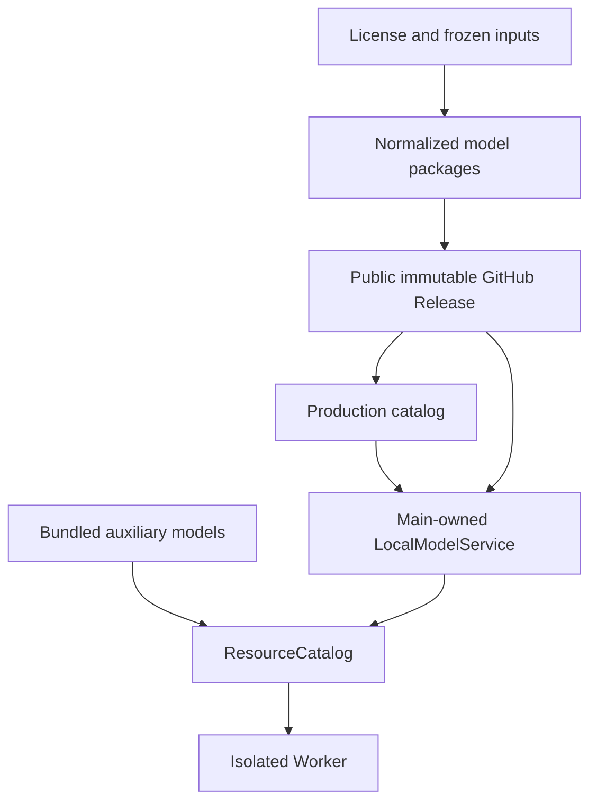
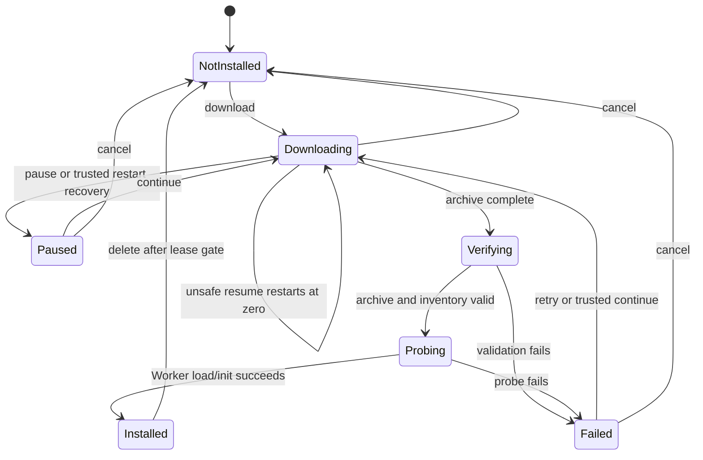

# GitHub Model Distribution Activation - Plan

## Goal Capsule

| Field | Contract |
| --- | --- |
| Objective | macOS arm64 用户可以按需下载、暂停、继续、删除和重新下载本地转写与实时字幕模型；普通录音和应用启动不依赖这两个模型。 |
| Means | Qwen3-ASR 与 SenseVoice 从自有公开 GitHub Release 下载；Silero VAD、Pyannote segmentation 和 3D-Speaker 随应用发布；现有 Main-owned 模型服务负责下载和安装。（KTD1-KTD6） |
| Authority | 产品 catalog 决定可下载模型及其固定身份；应用资源 manifest 决定内置辅助模型；安装 manifest 和 Worker probe 决定本机模型是否可用。 |
| Execution profile | 先完成许可、catalog schema 和 fixture，再确定内置资源边界、制作并发布模型包，最后接通下载/UI 和发布准入。生产下载在最终资产和证据通过前保持关闭。 |
| Stop conditions | 不把开发专用 authority 改写成生产 authority；不从私有仓库或任意上游 URL 下载；未完成许可、大小、SHA-256、inventory 和公开 URL 验证时，不提交 `distributionEligible: true`；不重写既有迁移、lease、删除和麦克风测试。 |
| Tail ownership | Codex 可以完成研究、实现、校验和文档。项目维护者负责接受剩余许可风险、授权公开 Release、提供或授权正式签名/公证产物，并决定最终应用发布。 |

---

## Product Contract

### Summary

Electron 只把 Qwen3-ASR 和 SenseVoice 作为用户可管理的远程模型。Silero VAD、Pyannote segmentation 和 3D-Speaker 是不可单独管理的应用资源。

两个远程模型只使用公开仓库 [`hashencode/voice-studio-models`](https://github.com/hashencode/voice-studio-models) 的 GitHub Releases。客户端不登录 GitHub，也不提供下载源选择。现有 Main-owned 服务提供下载、暂停、继续、进度、速度、删除和重新下载。

**Product Contract preservation:** restructured, no scope change: clarified R3, R4 and R8; added R10 for disk-capacity handling.

### Problem Frame

模型管理框架已经存在，但生产入口仍然关闭：默认 catalog 没有生产 URL 或 inventory，应用启动没有注入生产下载器和 archive adapter，辅助模型与两个大模型也尚未形成明确的打包边界。

旧计划还包含已经落地的录音、导入、麦克风测试、迁移、lease 和设置页面。本计划只负责 Electron 的 GitHub 模型分发和“两个远程模型 + 三个内置辅助模型”边界。

### Key Decisions

- **v1 只使用自有 GitHub Releases。** (session-settled: user-directed — chosen over a multi-source design: the first release only needs one public unauthenticated source.) Governs R1, R3, R8.
- **只有两个大模型远程下载。** (session-settled: user-directed — chosen over downloading every model: auxiliary models are runtime dependencies that should remain immutable with the app.) Governs R1, R2, R6.
- **旧计划保留为历史记录。** (session-settled: user-approved — chosen over deleting or continuing to extend the broad plan: repository history remains readable while the active backlog stays narrow.) Governs R9.

### Requirements

**Distribution and authority**

- R1. 生产 catalog 只包含 `formal-transcription` 的 Qwen3-ASR 和 `live-caption` 的 SenseVoice，并绑定固定上游来源、公开且版本化的自有 GitHub Release URL、目标平台、runtime protocol、archive 字节数、SHA-256 和精确安装 inventory。
- R2. Silero VAD、Pyannote segmentation 和 3D-Speaker 必须作为应用资源打包、校验并参与 operation identity；它们不得成为用户可下载、删除或迁移的 bundle。
- R3. 任一远程模型或内置辅助模型缺少来源、版本、许可证、Notice、分发资格、大小或 SHA-256 时，生产下载必须保持关闭，release validation 必须失败并说明缺失项。

**Download, installation and recovery**

- R4. 下载必须显示已确认字节、总字节、百分比和近期速度。跨重启续传只在 transfer identity 和服务端 validator 匹配，且服务端返回准确的 identity-encoded `206 Content-Range` 时追加；条件不满足时必须丢弃旧 partial 并从零安全重启。强 ETag 只是优先 validator，不是发布前提；可验证的 `Last-Modified` 也可支持续传。
- R5. 应用重启必须把可信 partial 恢复为“已暂停、可继续”，不得在启动时自动联网。取消必须删除产品拥有的 partial 与 journal，无法证明归属的文件不得递归删除。
- R6. archive 只有在整体大小和 SHA-256 通过后才能解包。安装必须验证规范化成员清单、每个成员的大小与 SHA-256，并在受管 candidate 通过 Worker 加载/初始化 probe 后才提交 installed 状态。
- R7. 下载失败、catalog 变化、验证器变化、解包失败或 probe 失败不得发布混合或不完整模型。删除和重新下载必须由用户明确发起。
- R10. 开始或继续下载前必须检查剩余下载空间，解包前必须检查 staging 与最终安装所需空间。空间不足时保持已有可信 partial，停止写入，并给出可操作的提示。

**Release and scope**

- R8. Release gate 分开验证两类证据：模型分发证据绑定 catalog 与最终 GitHub 资产；应用产物证据绑定签名/公证产物、内置辅助资源、嵌入的 catalog digest 和 packaged smoke。应用包必须包含三个辅助模型并排除两个大模型 payload。
- R9. 本计划复用现有 Main-owned CRUD、单操作串行化、lease、统一根目录和迁移协议；不增加 `update-available`、多版本选择、自动回滚或新的麦克风/导入行为。

### Acceptance Examples

- AE1. 全新安装且离线启动时，两个 bundle 显示未安装和“下载”，应用不自动联网，普通录音仍可用。
- AE2. 用户下载 Qwen3-ASR 时看到字节、总量、百分比和近期速度；暂停后进度不丢失，validator 匹配时从可信 offset 继续。
- AE3. 用户退出并离线重启后，界面显示相同已确认字节的暂停任务，速度为空，用户可以继续或取消。
- AE4. transfer identity、URL、hash 或 validator 变化，或者服务端忽略 Range；客户端不拼接旧 partial，而是从零开始。
- AE5. archive 包含越界路径、链接、重复路径、缺失成员、错误大小或错误 hash；candidate 不发布，已安装 bundle 不受影响。
- AE6. 下载取消后 partial 和 journal 被删除；成功安装后 archive 与 staging 被清理；未知残留不被自动删除。
- AE7. 应用包缺少或损坏任一辅助模型时，本地处理显示应用资源损坏并提示重新安装，不提供辅助模型下载按钮。
- AE8. 正式转写组合远程 Qwen3-ASR 与应用内 Silero/Pyannote/3D-Speaker；实时字幕组合远程 SenseVoice 与应用内 Silero。
- AE9. release candidate 的包内 inventory 精确包含 runtime 和三个辅助模型，精确排除两个大模型；catalog 或许可证证据不完整时 release lane 失败。
- AE10. 两个最终 GitHub Release 资产无需认证即可下载，重定向只经过代码允许的 origin，大小、SHA-256 和 archive inventory 与 catalog 一致。服务端不支持安全续传时仍可从零完成下载。
- AE11. 空间不足时，下载或解包在破坏现有可信 partial 和已安装模型之前停止，并告诉用户需要释放空间后继续。

### Scope Boundaries

**In scope**

- macOS arm64 的两个规范化模型包、生产 catalog 和公开 GitHub Release。
- 三个辅助模型的应用内打包、manifest 归属和 operation identity。
- 现有下载服务的生产接线、可信恢复、进度/速度和设置页操作。
- 离线 release admission、最终生产 URL 网络验证和 packaged smoke。

**Deferred to Follow-Up Work**

- 远程签名 catalog、catalog 热更新和应用外的模型版本发布。
- 多版本选择、`update-available`、旧 generation 保留与更新回滚。
- 已存在外置模型目录、bookmark 和迁移协议的进一步扩展。
- 模型存储之外的全局文件系统 TOCTOU 加固。

**Out of scope**

- GitHub 登录、会员鉴权、下载源选择器、任意 URL 和任意本地模型导入。
- 用户编辑 hash/inventory。
- 重写麦克风测试、音频导入、录音恢复、模型 lease 或统一根目录迁移。

### Dependencies

- Qwen3-ASR 与 SenseVoice 的重新分发和转换产物许可必须获得可审计结论；当前冻结 authority 不能授权生产发布。
- 三个辅助模型必须分别具备可随应用分发的许可证和 Notice 证据。
- 公开模型仓库 [`hashencode/voice-studio-models`](https://github.com/hashencode/voice-studio-models) 已创建并可匿名访问。首次发布前必须在仓库设置中启用 GitHub Release immutability；该设置只保护启用后的新 Release。

### Blocker Closure Workstream

以下五项是本计划的执行内容。维护者只在法律风险、外部公开写入、正式签名/公证和最终发布处作决定。

| ID | Closure work | Completion evidence |
| --- | --- | --- |
| B1 | 冻结五项模型资源的再分发证据 | 每项资源都有固定来源、版本、许可证文本、Notice 映射和明确的 `eligible`/`blocked` 结论；不确定项保持 `distributionEligible: false`。 |
| B2 | 生成两个规范化模型包 | 构建固定输入和工具链，固定 tar 成员顺序与元数据，输出 archive 与成员大小/SHA-256；不要求每次做第二套完整 clean rebuild。 |
| B3 | 发布不可变 GitHub Release | 启用并核对 Release immutability，创建新 tag/Release，上传资产并匿名重新下载校验；公开发布前由维护者授权。 |
| B4 | 冻结生产下载 authority | 网络回执绑定 catalog digest、最终 URL、代码 allowlist、资产大小/SHA-256 和 inventory。Range/validator 能力记录为续传能力，不作为完整下载资格的硬门槛；allowlist 仅在代码配置变化时重新批准。 |
| B5 | 关闭应用发布准入 | 候选 catalog 先提交到未合并的 release branch；签名/公证应用从该 commit 构建，回执绑定 commit SHA、嵌入的 catalog digest 和应用产物 digest。全部通过后只合并该已验证 commit。 |

在 B1-B3 完成前，U1-U3 使用 `distributionEligible: false` 的本地 fixture。开发环境只允许本地 fixture 或同一 GitHub Release URL。

---

## Planning Contract

### Key Technical Decisions

- KTD1. **发布规范化 `.tar.gz` 模型包。** 包只包含 catalog inventory 中的最终相对路径，并固定成员顺序和元数据。Main 使用流式 gzip/tar adapter 枚举成员，复用现有解包前校验。Governs R1, R6.
- KTD2. **辅助模型属于 shipped runtime authority。** Qwen/SenseVoice 保留为 `{modelRoot}` 下的 `modelArtifacts`；Silero/Pyannote/3D-Speaker 移到 `{resourceRoot}` 下的 `runtimeArtifacts`。现有 `ResourceCatalog` 组合两侧 identity。Governs R2, R8.
- KTD3. **保留现有 Fetch 下载器。** `ModelDownloadCoordinator` 已有 pause、cancel、checkpoint、Range/If-Range 和 archive hash 校验。本计划补生产接线、启动恢复、空间预检和速度，不切换 Electron `DownloadItem`。Governs R4, R5, R10.
- KTD4. **传输身份与安装身份分离。** URL、allowlist、archive 和 validator 属于 transfer identity；影响 Worker 的 target/protocol/inventory 和 active-store generation 属于 installed authority。URL 或 validator 变化只废弃 partial，不让相同已安装模型自动失效。Governs R4-R7.
- KTD5. **candidate 通过轻量 Worker probe 后发布。** 每次安装只验证真实 Worker 能加载并初始化目标模型；完整 Qwen 转写与实时字幕行为放在 release smoke，避免每次安装都跑音频推理。Governs R6, R7.
- KTD6. **模型证据和应用证据分开复用。** 最终模型资产不变时，应用重建可以复用仍匹配 catalog/URL/allowlist/size/hash/inventory 的模型网络回执；每个应用产物只重验嵌入 catalog、内置资源和 packaged smoke。Governs R8.

### High-Level Technical Design

### User State and Action Contract

| State | Visible data | Allowed actions |
| --- | --- | --- |
| Not installed | Model name and required size | Download |
| Downloading | Confirmed/total bytes, percent, recent speed | Pause, Cancel |
| Paused / resumable | Confirmed/total bytes and percent; no speed | Continue, Cancel |
| Failed with trusted partial | Confirmed/total bytes, reason; no speed | Continue, Cancel |
| Failed without trusted partial | Failure reason; no speed | Retry from zero, Cancel |
| Installing / verifying | Phase text; no transfer speed | No destructive action |
| Installed / corrupt | Version and size, or corruption reason | Delete; corrupt state also offers redownload after delete |

Main owns this matrix. Renderer only displays the supplied state and sends revision-checked intents.

### Failure Message Contract

- Network offline or timeout: retain the last durable offset and offer Continue.
- Resume validator or range mismatch: explain that the file changed, reset to zero, and retry as a new attempt.
- Insufficient disk space: retain trusted partial state and tell the user to free space before continuing.
- Archive, inventory or Worker probe failure: do not publish installed; offer retry from zero or cleanup.
- Missing/damaged bundled auxiliary resource: tell the user to reinstall the application; never offer an auxiliary-model download.

### Sequencing

1. Freeze license evidence, catalog schema and ineligible fixtures.
2. Move auxiliary resources into the shipped runtime authority.
3. Build and publish the normalized GitHub Release assets, then freeze production catalog values.
4. Connect download, recovery, installation and UI against fixtures before enabling production eligibility.
5. Run separate model-distribution and application-artifact admission for the exact release candidate.

### Risks & Dependencies

- **License approval is the hard release blocker.** Development can use ineligible fixtures, but no production URL or eligible entry ships before all five resources have auditable redistribution evidence.
- **GitHub redirect origins can change.** The committed allowlist never expands from observed traffic. A code update is required when GitHub delivery origins move outside it.
- **A published asset can later prove unsafe.** Deleting the entire immutable Release stops new downloads, but already installed bytes remain usable in older app versions. Recovery requires an application update whose catalog no longer authorizes the bad installed identity, followed by a new Release tag and catalog entry; the deleted tag is not reused.
- **Packaging can silently restore large payloads.** Exact inventory tests must prove all three auxiliaries are present and both large models are absent.
- **Crash cleanup can delete the wrong path if ownership is weak.** New download, candidate publication and deletion paths must use containment/no-follow checks and leave unknown residue untouched. Broader file-system race hardening stays outside this plan.
- **Credentials are release-time only.** GitHub credentials must be least-privilege, short-lived where possible, supplied outside the app build, and excluded from catalog files, logs and packaged resources.

### Sources & Research

- `docs/plans/2026-08-24-1703-feat-local-model-microphone-plan.md` records the original architecture and implemented model lifecycle.
- `docs/solutions/architecture-patterns/desktop-first-workstation-boundaries.md` establishes Electron as composition root, Worker process isolation and artifact-specific evidence.
- `apps/desktop-electron/src/main/resources/local_model_service.ts` and `apps/desktop-electron/src/main/resources/model_download_coordinator.ts` contain the incumbent model and transfer flows this plan extends.
- GitHub documents public release assets, the 2 GiB per-asset limit and immutable releases: <https://docs.github.com/en/rest/releases/assets>, <https://docs.github.com/en/repositories/releasing-projects-on-github/about-releases>, <https://docs.github.com/en/code-security/concepts/supply-chain-security/immutable-releases>.
- The selected public distribution repository is <https://github.com/hashencode/voice-studio-models>.
- Node documents streaming gzip decompression, and `tar-stream` provides a stream-based tar parser: <https://nodejs.org/api/zlib.html>, <https://www.npmjs.com/package/tar-stream>.

---

## Implementation Units

### U1. Freeze License Evidence, Catalog Schema, and Fixtures

- **Goal:** Establish auditable distribution eligibility and an implementation-safe catalog contract without requiring production assets.
- **Requirements:** R1, R3, R8.
- **Dependencies:** None.
- **Files:**
  - `packages/desktop_sherpa_worker/assets/processing/frozen_sherpa_macos_arm64.json`
  - `packages/desktop_sherpa_worker/assets/processing/frozen_sensevoice_macos_arm64.json`
  - `docs/model-distribution/redistribution-evidence.md`
  - `apps/desktop-electron/src/main/resources/production_model_catalog.ts`
  - `apps/desktop-electron/scripts/validate-model-distribution.ts`
  - `apps/desktop-electron/tests/unit/model_distribution_test.ts`
- **Approach:**
  1. Record fixed source, version, model/card and code/weight licenses, Notice obligations and conversion provenance for all five resources.
  2. Define one catalog schema for archive identity, inventory, target/protocol, allowlist and eligibility.
  3. Add small local fixture packages with `distributionEligible: false` so U2 and U3 can be implemented before public assets exist.
  4. Keep every unresolved resource ineligible and make release validation report the missing evidence.
- **Execution note:** Treat this as evidence and fixture work; do not acquire full production models until B1 is accepted.
- **Patterns to follow:** Frozen authority validation in `materialize-frozen-sherpa-resources.ts` and exact manifest validation in `verify-worker-resources.ts`.
- **Test scenarios:**
  - A complete fixture entry validates with exact archive and member identities.
  - Missing license, Notice, target, protocol, size, SHA-256 or inventory rejects eligibility with a named error.
  - A private, upstream-owned, unversioned or authentication-dependent production URL is rejected.
  - A development-only authority cannot become eligible through catalog configuration alone.
- **Verification:** Unit tests prove schema and gate behavior with small fixtures; no production download or build is required.

### U2. Package Auxiliary Models as Immutable App Resources

- **Goal:** Ship the three auxiliary models inside the application and keep both large models outside it.
- **Requirements:** R2, R3, R6, R8.
- **Dependencies:** U1 catalog schema and frozen auxiliary identities; production license approval may complete later, but eligible release builds remain blocked until it does.
- **Files:**
  - `apps/desktop-electron/scripts/build-worker-resources.sh`
  - `apps/desktop-electron/scripts/materialize-frozen-sherpa-resources.ts`
  - `apps/desktop-electron/scripts/resource-download-plan.ts`
  - `apps/desktop-electron/scripts/write-worker-manifest.ts`
  - `apps/desktop-electron/scripts/verify-worker-resources.ts`
  - `apps/desktop-electron/src/main/resources/resource_catalog.ts`
  - `apps/desktop-electron/tests/unit/build_worker_resources_test.ts`
  - `apps/desktop-electron/tests/unit/resource_catalog_test.ts`
- **Approach:**
  1. Split auxiliary acquisition from development-only full-model materialization so release builds do not download then discard Qwen or SenseVoice.
  2. Put Silero, Pyannote and 3D-Speaker plus required notices under a fixed app-resource directory.
  3. Resolve auxiliaries as `runtimeArtifacts` under `{resourceRoot}` and downloaded models as `modelArtifacts` under `{modelRoot}`.
  4. Preserve one composed processing identity for each operation.
- **Execution note:** Prefer inventory and runtime-composition fixtures before any full resource acquisition.
- **Patterns to follow:** Existing `ResourceCatalog.command()`, `processingPipelineIdentities()` and packaged-inventory tests.
- **Test scenarios:**
  - Formal transcription resolves Qwen from the managed bundle and all three auxiliaries from app resources.
  - Live caption resolves SenseVoice from the managed bundle and Silero from app resources.
  - Changing either a downloaded model hash or bundled auxiliary hash changes the composed identity.
  - A missing or damaged auxiliary prevents Worker authorization and exposes no auxiliary download action.
  - Packaged inventory contains approved auxiliaries/notices and no Qwen or SenseVoice payload.
- **Verification:** Resource-catalog and build-resource tests prove the mixed authority and exact package boundary.

### U6. Build and Publish Normalized GitHub Release Assets

- **Goal:** Produce the two immutable public assets and freeze the production catalog values that identify them.
- **Requirements:** R1, R3, R6, R8.
- **Dependencies:** U1 evidence accepted for both remote models; U1 schema available.
- **Files:**
  - `apps/desktop-electron/scripts/build-model-release-assets.ts`
  - `apps/desktop-electron/scripts/validate-model-distribution.ts`
  - `apps/desktop-electron/src/main/resources/production_model_catalog.ts`
  - `apps/desktop-electron/tests/unit/model_distribution_test.ts`
  - `docs/BETA_RELEASE_CHECKLIST.md`
- **Approach:**
  1. Build each `.tar.gz` from pinned inputs with fixed member names, order and metadata; emit archive and member sizes/SHA-256.
  2. Verify deterministic metadata and final hashes. A second clean rebuild is optional diagnostic evidence, not a v1 gate.
  3. Enable and verify Release immutability before creating the first protected Release.
  4. Publish under a new version tag after explicit maintainer authorization, then anonymously re-download and compare the public bytes.
  5. Record final URLs, code allowlist, hashes, sizes and inventory in the candidate production catalog.
- **Patterns to follow:** Frozen resource builders and exact manifest validators already used by the Electron release tooling.
- **Test scenarios:**
  - Fixed inputs generate stable member order, metadata, inventory and archive hash.
  - Undeclared upstream files never enter the normalized archive.
  - Mutable inputs, missing toolchain identity or a changed member fail provenance validation.
  - The published asset is anonymous, within GitHub's asset-size limit and byte-identical to the local output.
  - A Release created before immutability is enabled cannot close B3.
- **Verification:** Local fixture packages prove the builder; final B3/B4 evidence comes from the authorized public Release.

### U3. Connect Download, Recovery, Installation, and UI

- **Goal:** Provide the complete user-controlled lifecycle for both remote models without automatic startup networking.
- **Requirements:** R1, R4-R7, R9, R10.
- **Dependencies:** U1 schema/fixtures and U2 mixed resource authority. Production activation additionally depends on U6.
- **Files:**
  - `apps/desktop-electron/package.json`
  - `apps/desktop-electron/bun.lock`
  - `apps/desktop-electron/src/main/index.ts`
  - `apps/desktop-electron/src/shared/contracts/local_models.ts`
  - `apps/desktop-electron/src/main/resources/production_model_catalog.ts`
  - `apps/desktop-electron/src/main/resources/model_download_coordinator.ts`
  - `apps/desktop-electron/src/main/resources/model_archive_extractor.ts`
  - `apps/desktop-electron/src/main/resources/tar_gzip_model_archive_adapter.ts`
  - `apps/desktop-electron/src/main/resources/model_candidate_probe.ts`
  - `apps/desktop-electron/src/main/resources/local_model_service.ts`
  - `apps/desktop-electron/src/main/resources/model_store.ts`
  - `apps/desktop-electron/src/renderer/features/settings/local-models-feature.tsx`
  - `apps/desktop-electron/tests/unit/local_model_service_test.ts`
  - `apps/desktop-electron/tests/unit/renderer/local_models_test.tsx`
  - `apps/desktop-electron/tests/fixtures/companion.ts`
- **Approach:**
  1. Add the fixed-version tar adapter and inject catalog, one downloader and the adapter from `initializeLocalModels()`.
  2. Restore a matching partial/journal as paused before the first snapshot; never start a request during startup.
  3. Add disk-space preflight before download/resume and extraction. Preserve trusted partial state when space is insufficient.
  4. Use containment and no-follow checks at new download staging, candidate publication, quarantine and deletion boundaries. Do not expand this unit into global per-filesystem-call race detection.
  5. Persist candidate phase, run a bounded Worker load/init probe, and commit installed only after success. Full transcription/live-caption behavior remains a release-smoke responsibility.
  6. Expose Main-authoritative states, allowed actions, confirmed/total bytes, percent and recent speed. Speed is `null` outside active network transfer.
  7. Render the state/action and failure-message contracts without a source selector. Progress announcements must not spam assistive technology on every chunk.
- **Execution note:** Build the HTTP, recovery and Renderer behavior against local fixtures before enabling production catalog entries.
- **Patterns to follow:** `ModelDownloadCoordinator`, `extractTrustedModelArchive()`, `ModelStore`, `profile/atomic_json.ts`, and the existing Zod → IPC → preload snapshot projection.
- **Test scenarios:**
  - Covers AE1. Offline startup publishes two not-installed rows and makes no model request.
  - Covers AE2 / AE3. Download, pause, restart and continue preserve durable bytes and show speed only while transferring.
  - Covers AE4. Mismatched validator, offset, range total or ignored Range discards the old partial and restarts at zero with an explanation.
  - Covers AE5 / AE6. Invalid archive members never publish, while cancel and successful install remove only owned temporary files.
  - Covers AE11. Insufficient space before download, resume or extraction preserves trusted state and returns an actionable error.
  - Restart at each candidate phase resumes the probe or isolates the candidate; directory presence alone never reports installed.
  - A Worker load/init timeout leaves the candidate recoverable or isolated and cleans up the process.
  - Failed resumable and failed non-resumable states expose different actions; neither shows Pause or transfer speed.
  - Existing serialization and lease checks still block concurrent mutation or deletion of an in-use bundle.
- **Verification:** Unit and integration fixtures prove protocol, recovery, installation and snapshot behavior; Renderer tests prove text and actions. Visual validation remains excluded unless separately authorized.

### U5. Gate Model Distribution and the Final Application Artifact

- **Goal:** Admit only matching public model assets and an application artifact that contains the intended catalog and resource composition.
- **Requirements:** R1-R3, R6, R8.
- **Dependencies:** U1, U2, U6 and U3.
- **Files:**
  - `apps/desktop-electron/scripts/validate-model-distribution.ts`
  - `apps/desktop-electron/scripts/check-release.sh`
  - `apps/desktop-electron/tests/unit/model_distribution_test.ts`
  - `apps/desktop-electron/tests/unit/build_worker_resources_test.ts`
  - `apps/desktop-electron/tests/packaged/macos_processing_smoke_test.ts`
  - `apps/desktop-electron/tests/packaged/macos_live_caption_worker_smoke_test.ts`
  - `apps/desktop-electron/tests/integration/packaged_resource_smoke_test.ts`
  - `docs/BETA_RELEASE_CHECKLIST.md`
- **Approach:**
  1. Commit the eligible candidate catalog to an unmerged release branch before building the candidate application.
  2. Produce a reusable model-distribution receipt bound to catalog digest, final URLs, code allowlist, asset sizes/hashes and inventory. Record whether safe resume is supported; do not fail full-download eligibility solely because a strong ETag is absent.
  3. Build the signed/notarized candidate from that exact commit. Produce an application receipt bound to commit SHA, application digest, embedded catalog digest, packaged auxiliary inventory and smoke results.
  4. Run no-user-model startup smoke plus seeded Qwen formal-transcription and SenseVoice live-caption smoke against the final artifact.
  5. Merge only the verified candidate commit. If the app is rebuilt without changing the model evidence inputs, reuse the still-matching model receipt and regenerate only the application receipt.
  6. Document credential handling and the incident procedure: delete the affected Release, ship a catalog update that no longer authorizes the bad installed identity, publish a new tag/asset, then point the catalog at the replacement.
- **Execution note:** Keep ordinary implementation checks fixture-based. Run real network and packaged evidence only for an explicit release candidate.
- **Patterns to follow:** `docs/standards/verification.md`, `docs/standards/build-resources.md` and existing packaged smoke harnesses.
- **Test scenarios:**
  - Offline admission rejects missing notices, wrong target/protocol, non-product repository URLs, hash/size drift and ineligible entries.
  - Model evidence rejects credentials in URLs, HTTP downgrade, redirect loops, unapproved origins, invalid ranges and full-object hash mismatch.
  - A missing strong ETag records restart-from-zero semantics instead of failing an otherwise valid asset.
  - Application evidence rejects a different commit, embedded catalog digest, app digest or packaged inventory.
  - Package inventory contains every runtime/auxiliary artifact exactly once and neither remote model payload.
  - The final packaged artifact starts without user models and passes seeded formal-transcription and live-caption smoke.
  - An uncommitted catalog or a candidate rebuilt from another commit cannot close B5.
  - Changing catalog, URL, allowlist, size, hash or inventory invalidates model evidence; an unrelated app rebuild does not.
- **Verification:** Separate receipts prove the public model assets and the exact signed/notarized application artifact without repeatedly downloading unchanged multi-gigabyte assets for unrelated app rebuilds.

---

## Verification Contract

| Lane | Applicability | Required evidence |
| --- | --- | --- |
| Documentation-only plan change | This planning task | Inspect the diff and references; do not run application tests or builds. |
| Electron code | U1-U3 deterministic implementation | From `apps/desktop-electron`, `bun run check:code` passes after the narrow model-service, resource-catalog, build-resource and Renderer suites. |
| Electron release | U5 for an explicit candidate | From `apps/desktop-electron`, `VOICE2TEXT_RELEASE_VALIDATION=1 bun run check:release -- --artifact <immutable-signed-distribution-path>` validates the exact application artifact and matching model/application receipts. |
| Packaged worker smoke | U2, U3 and U5 | No-model startup passes; seeded Qwen and SenseVoice bundles compose with packaged auxiliaries and pass full operation smoke. |
| HTTP protocol evidence | U3 fixtures and U5 candidate validation | Fixtures prove resume/reset semantics; candidate evidence verifies both final GitHub URLs and records whether safe resume is available. |
| UI | U3 | Static Renderer tests prove content and actions. App launch, screenshots and visual tests require separate explicit authorization. |

---

## Definition of Done

- `hashencode/voice-studio-models` contains protected immutable Release assets for Qwen3-ASR and SenseVoice, and the production catalog matches their final URLs, sizes, hashes, targets, protocols and inventories.
- Approved license and Notice evidence exists for both remote bundles and all three bundled auxiliary models.
- The packaged app contains runtime, Silero VAD, Pyannote segmentation and 3D-Speaker, and contains no Qwen3-ASR or SenseVoice payload.
- A fresh install can download, pause, quit, restore as paused, continue or safely restart from zero, verify, install, delete and redownload either bundle.
- Settings show confirmed/total bytes, percentage and recent speed only during active transfer; paused and failed states show the correct actions and no speed.
- Space shortage, invalid resume responses, corrupt archives, unsafe members, crashes and failed probes never publish an unprobed model or damage a trusted partial unnecessarily.
- Packaged smoke proves formal transcription and live captions with downloaded large models plus bundled auxiliary resources.
- Matching model-distribution and application-artifact receipts pass for the exact release candidate before eligible production catalog entries ship.
- No second download source, source selector, update/multi-version framework, duplicated downloader, global file-system hardening or unrelated microphone/import work appears in the implementation diff.
- Abandoned adapter experiments, stale staging fixtures and temporary release assets are removed before completion.
